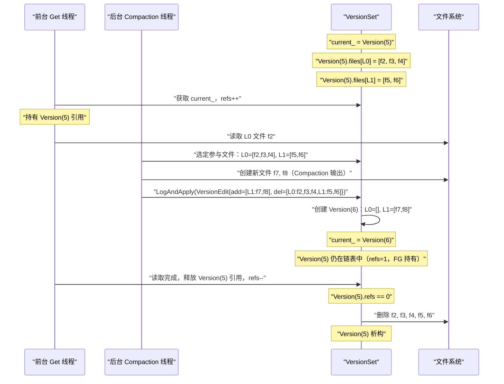

# Compaction——分层合并与版本管理

## 摘要

Compaction 是 LevelDB 中最复杂、最关键的后台机制，负责将多个 SSTable 文件合并成更大、更有序的文件，同时清理过期版本和已删除数据。没有 Compaction，SSTable 文件会无限堆积，读取性能持续恶化，磁盘空间也会因历史版本积压而耗尽。本文深度解析 LevelDB 的两类 Compaction（**Minor Compaction** 与 **Major Compaction**）的触发策略与执行流程，剖析分层（Leveled）策略如何平衡写放大与读放大，并重点分析 **Version / VersionEdit / VersionSet** 三件套如何实现 SSTable 文件集合的 MVCC 版本管理——这是 LevelDB 在 Compaction 执行期间保证读取不中断的关键设计。

---

## 第 1 章 为什么需要 Compaction

### 1.1 没有 Compaction 会发生什么

[[01 LevelDB 全局架构——LSM-Tree 的写优化设计]] 介绍了 LSM-Tree 的写入模型：所有数据先写 MemTable，再刷盘为 SSTable。随着写入持续进行，SSTable 文件会不断累积。如果没有任何清理机制，会出现三个严重问题：

**问题一：读放大无限增长**。查询一个 key 需要在所有 SSTable 文件中逐一检查。若有 1000 个 SSTable 文件，即使有 Bloom Filter 过滤，读取延迟也会随文件数线性增长，最终变得不可接受。

**问题二：磁盘空间无限膨胀**。同一个 key 被多次写入（更新或先删除再写入），会在不同的 SSTable 文件中存在多个版本。这些历史版本永远不会被清理，磁盘占用远超实际数据量。

**问题三：Tombstone 永远不消失**。`Delete(key)` 操作写入的 Tombstone 标记，若没有 Compaction 清理，即使对应的 key 已经不在任何更旧的 SSTable 中，Tombstone 也会永久占据磁盘空间。

Compaction 正是解决上述三个问题的机制：**定期将多个 SSTable 合并成更大的 SSTable，在合并过程中清理重复版本和 Tombstone，同时控制各层的文件数量，将读放大控制在可接受范围内**。

### 1.2 Compaction 的代价

Compaction 不是免费的午餐，其核心代价是**写放大（Write Amplification）**。Compaction 需要读取所有参与合并的 SSTable，执行有序合并，再将结果写入新的 SSTable。在这个过程中，数据被额外读取和写入了一次（甚至多次，取决于 Compaction 策略）。

以 LevelDB 的分层策略为例：L1 的数据（10MB）在被合并到 L2（100MB）时，需要与 L2 中有重叠的文件（约 10MB/100MB × 100MB = 10MB）合并，读取约 20MB，写出约 20MB。这意味着每次从 L(N) 到 L(N+1) 的 Compaction，平均写放大约为 10~12 倍（取决于 key 分布的均匀性）。

**Compaction 对前台写入的影响**：Compaction 在后台线程执行，但与前台写入共享磁盘 IO 带宽。若磁盘持续处于高 IO 状态，Compaction 可能成为限制写入吞吐量的瓶颈。LevelDB 通过写入限速（Write Stall）机制保护自身：当 L0 文件数达到上限时，主动减慢写入速度，让 Compaction 有机会追上。

---

## 第 2 章 Minor Compaction——MemTable 的刷盘

### 2.1 Minor Compaction 的触发与执行

**Minor Compaction**（也称 Flush）是将 Immutable MemTable 写出为 L0 层 SSTable 文件的过程。这是最简单的 Compaction 类型，不涉及多文件合并，只是将内存中已有序的数据顺序写入磁盘。

**触发条件**：当 MemTable 的 `Arena::MemoryUsage()` 超过 `write_buffer_size`（默认 4MB）时，MemTable 被切换为 Immutable MemTable，后台 Compaction 线程被唤醒。

**执行流程**：
```
1. 为 Immutable MemTable 分配一个新的文件编号（FileNumber）
2. 创建 TableBuilder，开始构建 SSTable 文件
3. 使用 SkipList 的迭代器顺序遍历 Immutable MemTable 中所有 InternalKey
4. 对每条记录调用 TableBuilder::Add()，写入 Data Block
5. 调用 TableBuilder::Finish()，写出 Meta Block、Index Block、Footer
6. 调用 fsync() 确保文件内容落盘
7. 构造 VersionEdit，记录新增的 SSTable 文件信息
8. 通过 VersionSet::LogAndApply() 将 VersionEdit 持久化到 MANIFEST 并更新当前 Version
9. 删除对应的 WAL 文件
```

Minor Compaction 的特点：
- **纯顺序写**，速度受磁盘顺序写带宽限制，通常非常快（4MB 的 MemTable 在 HDD 上约 40ms，在 SSD 上约 8ms）
- **不涉及读已有 SSTable**，不与 Major Compaction 竞争读 IO
- **产生 L0 文件**，L0 文件之间可能存在 key 重叠（因为每个 Immutable MemTable 是独立刷盘的，不同时间的 MemTable 可能包含相同 key 的不同版本）

### 2.2 L0 文件的特殊性

L0 层是整个 LevelDB 分层结构中最特殊的一层，**允许文件间 key 范围重叠**。这与 L1~L6 层（文件间 key 无重叠）有本质区别。

**L0 重叠的根本原因**：Minor Compaction 直接将 Immutable MemTable 刷盘为 L0 文件，不做任何与现有 L0 文件的合并。若同一个 key 在不同时间被写入了两次（两个不同的 MemTable），这两次写入会产生两个 L0 文件，且这两个文件的 key range 重叠。

**L0 重叠对读取的影响**：查询时，所有 L0 文件都必须检查（不能像 L1+ 那样通过二分定位到唯一文件），且必须按文件**从新到旧**的顺序检查，以确保读取到最新版本。这是 L0 层读放大最高的原因。

**L0 文件数量控制**：LevelDB 通过以下机制防止 L0 文件过多累积：
- **触发 Major Compaction**：L0 文件数 ≥ `kL0_CompactionTrigger`（默认 4）时，触发 L0→L1 的 Major Compaction
- **写入减速（Write Slowdown）**：L0 文件数 ≥ `kL0_SlowdownWritesTrigger`（默认 8）时，主动在写入前 sleep 1ms，减缓 MemTable 的产生速度
- **写入停止（Write Stop）**：L0 文件数 ≥ `kL0_StopWritesTrigger`（默认 12）时，完全停止写入，直到 L0 文件数降低

> [!warning] 生产避坑
> 若监控发现写入吞吐量突然下降到接近零，且持续数十秒，首先检查 `leveldb.num-files-at-level0` 是否达到 12（`kL0_StopWritesTrigger`）。这通常意味着 Compaction 线程已追不上写入速度，可能的原因：磁盘 IO 100%、CPU 被 Compaction 占满、或 Compaction 线程与前台写入的磁盘 IO 竞争激烈。解决方案：检查磁盘 IO 利用率，考虑增大 `write_buffer_size` 减少 Minor Compaction 频率，或使用更快的 SSD。

---

## 第 3 章 Major Compaction——分层合并策略

### 3.1 Major Compaction 的触发条件

Major Compaction 的触发有两个来源：

**1. 文件数/大小超过阈值**：
- L0 层：文件数 ≥ 4（`kL0_CompactionTrigger`）
- L1~L6 层：该层所有文件的总大小 ≥ 该层的容量上限（L1=10MB，L2=100MB，...，L6=理论无上限）

**2. 文件被查询次数过多（Seek Compaction）**：
当一个 SSTable 文件在查找过程中被"白白检查"（即 Bloom Filter 判为"可能存在"，但实际 Data Block 中未找到 key）的次数超过一定阈值时，LevelDB 认为这个文件的 key range 与其他文件重叠太多，需要通过 Compaction 消除重叠，减少未来的读放大。

LevelDB 为每个 SSTable 文件维护一个 `allowed_seeks` 计数器（初始值与文件大小成正比），每次无效查找时递减，减到 0 时标记该文件为"需要 Compaction"。这个机制在实践中经常被关闭（RocksDB 默认不启用），因为 Seek Compaction 可能导致不必要的写放大。

### 3.2 选择参与 Compaction 的文件

每次 Major Compaction 并不是将整个层的所有文件都合并，而是选择其中**一部分**文件进行合并，以减少单次 Compaction 的开销和对前台 IO 的影响。

**文件选择策略**：LevelDB 使用**轮询（Round-Robin）** 策略选择 L(N) 层中参与 Compaction 的文件——每次 Compaction 从上次 Compaction 结束的 key 位置之后选择下一个文件，确保所有文件都会被均匀地 Compact，避免某些 key range 长期得不到清理。

```
L1 文件：[A-C] [D-G] [H-L] [M-P] [Q-Z]
                      ↑上次结束位置

下次 Compaction 从 [H-L] 开始选择
```

选定 L(N) 层的文件后，需要找出 L(N+1) 层中**所有与选定文件 key range 有重叠**的文件，将它们一起参与合并：

```
L1 层选中文件：[user:100 ~ user:200]

L2 层有重叠的文件：
  [user:050 ~ user:150]  ← 与 [100~200] 重叠
  [user:150 ~ user:250]  ← 与 [100~200] 重叠
  [user:250 ~ user:350]  ← 无重叠，不参与
```

> [!note] 设计哲学
> 扩大 L(N+1) 层的参与范围：若 L(N+1) 层参与文件的 key range 扩展后，与 L(N+2) 层（"祖父层"，Grandparent）重叠的文件过多（默认超过 10 个文件），LevelDB 会缩小 L(N) 层的选择范围，避免单次 Compaction 影响过多层，造成级联写放大。这个"Grandparent limit"机制是控制 Compaction 写放大的重要手段。

### 3.3 Compaction 的执行流程

选定参与 Compaction 的文件后，执行流程如下：

```
Major Compaction 执行流程：

1. 为所有输入文件（L(N) + L(N+1)）创建 Iterator
   - 每个 SSTable 文件创建一个 TwoLevelIterator（先在 Index Block 定位，再读 Data Block）
   - 将所有 Iterator 组合成 MergingIterator（多路归并迭代器）

2. 循环从 MergingIterator 获取下一条有序记录：
   a. 若是 kTypeValue 类型：
      - 检查是否有更新版本（同一 UserKey 且 SequenceNumber 更大的记录）
      - 若是最新版本且 SequenceNumber > 当前所有快照的最小 SequenceNumber：
        保留，写入新 SSTable
      - 若 SequenceNumber ≤ 最小快照 SequenceNumber 且存在更新版本：
        丢弃（老版本，无快照引用）
   b. 若是 kTypeDeletion（Tombstone）类型：
      - 检查更低 Level（L(N+2) 及以下）是否还存在该 key 的旧版本
      - 若不存在：丢弃 Tombstone（彻底清除该 key）
      - 若存在：保留 Tombstone（防止读取时错误返回旧版本的数据）

3. 将保留的记录写入新 SSTable（通过 TableBuilder）
   - 当新 SSTable 达到 target_file_size 时，关闭当前文件，开始下一个
   - 控制新文件与 Grandparent 层的重叠量（避免未来 Compaction 代价过大）

4. 构造 VersionEdit：
   - 记录新增的 SSTable 文件（added_files）
   - 记录需要删除的旧 SSTable 文件（deleted_files，即所有输入文件）

5. 通过 VersionSet::LogAndApply() 提交 VersionEdit
6. 删除旧 SSTable 文件（若已无 Version 引用）
```

### 3.4 多路归并——Compaction 的核心算法

Compaction 的核心是**多路归并（K-Way Merge）**：将 K 个有序 SSTable 文件合并为一个（或多个）更大的有序文件。

LevelDB 使用 `MergingIterator` 实现多路归并：维护一个包含所有输入 SSTable Iterator 的列表，每次从中选出 key 最小的 Iterator（通过线性扫描，因为输入文件数量通常不多，不需要堆）前进，按照 InternalKey 的比较规则（UserKey 升序 + SequenceNumber 降序）有序输出所有记录。

**去重逻辑**：由于同一个 UserKey 可能在多个输入文件中都有记录（新版本在 L(N)，旧版本在 L(N+1)），`MergingIterator` 输出时会连续输出同一 UserKey 的所有版本（SequenceNumber 从大到小）。Compaction 代码检测到连续的相同 UserKey 时，执行版本清理：

```
伪代码：Compaction 的去重与版本清理

last_user_key = ""
last_seq = MAXINT

while iter.Valid():
    ikey = iter.CurrentInternalKey()
    
    if ikey.user_key != last_user_key:
        # 新的 UserKey，重置状态
        last_user_key = ikey.user_key
        last_seq = MAXINT
    
    should_drop = False
    
    if ikey.sequence <= smallest_snapshot_seq:
        # 这个版本比所有活跃快照都旧
        if ikey.type == kTypeDeletion:
            # 是 Tombstone，且比所有快照都旧
            # 检查更低层是否还有旧版本
            if !ExistsInLowerLevels(ikey.user_key, compaction_level+1):
                should_drop = True  # 彻底删除
        elif last_seq <= smallest_snapshot_seq:
            # 比所有快照都旧，且同一 UserKey 已有更新版本被保留
            should_drop = True  # 丢弃老版本
    
    last_seq = ikey.sequence
    
    if not should_drop:
        output.Add(iter.key(), iter.value())
    
    iter.Next()
```

---

## 第 4 章 Version、VersionEdit 与 VersionSet——SSTable 的 MVCC

### 4.1 为什么需要版本管理

Compaction 是一个异步的后台操作，执行过程中前台读取不能中断。具体来说，以下场景必须同时发生：

- 前台的 `Get()` 请求正在读取某个 SSTable 文件（如 L1 层的 `[user:100-200].ldb`）
- 后台 Compaction 将这个文件与 L2 层的文件合并，产生新文件，**旧文件应该被删除**

问题是：**前台 Get 正在读取的文件，能立即被删除吗？**

答案显然是不能——如果在读取中途文件被删除，前台操作会遇到文件句柄失效，返回错误或产生未定义行为。

LevelDB 通过 **Version（版本）** 来解决这个问题：
- 每个 Version 代表某一时刻 SSTable 文件集合的快照（哪些文件在哪个 Level）
- 前台读取操作引用当前 Version，并在读取完成前持有该 Version 的引用
- Compaction 完成后产生新的 Version，旧 Version 的文件在所有引用归零后才真正删除

这正是 [[MVCC（多版本并发控制）]] 思想的体现——不同时刻的读操作看到不同的 SSTable 文件集合，通过版本引用计数保证文件在被读取期间不会消失。

### 4.2 三件套的职责划分

LevelDB 用三个类来管理 SSTable 文件集合的版本：

| 类名 | 职责 | 类比 |
|------|------|------|
| `Version` | 某一时刻的 SSTable 文件集合快照（哪个 Level 有哪些文件） | Git 中的一次 Commit |
| `VersionEdit` | 两个 Version 之间的差量（新增了哪些文件、删除了哪些文件） | Git 中的一个 Diff/Patch |
| `VersionSet` | 管理所有 Version 的链表，维护当前活跃 Version，负责将 VersionEdit 持久化到 MANIFEST | Git 中的整个 Repository |

三者的关系：
```
Version(N) + VersionEdit = Version(N+1)
```

### 4.3 Version 的内部结构

```cpp
// Version 的核心数据结构（简化）
class Version {
  VersionSet* vset_;   // 所属的 VersionSet

  Version* next_;      // 双向链表，连接所有 Version（用于引用计数管理）
  Version* prev_;

  int refs_;           // 引用计数：有多少个前台操作/Compaction 正在使用此 Version

  // 核心：每个 Level 的文件列表
  // files_[0] = L0 层的所有 SSTable 文件元数据
  // files_[1] = L1 层的所有 SSTable 文件元数据
  // ...
  std::vector<FileMetaData*> files_[config::kNumLevels];
  
  // Seek Compaction 触发器
  FileMetaData* file_to_compact_;
  int file_to_compact_level_;
  
  // 每层的 Compaction 分数（score > 1.0 表示需要 Compaction）
  double compaction_score_;
  int compaction_level_;
};

// 每个 SSTable 文件的元数据
struct FileMetaData {
  int refs;            // 引用计数
  int allowed_seeks;   // Seek Compaction 计数器
  uint64_t number;     // 文件编号（对应 {number}.ldb）
  uint64_t file_size;  // 文件大小（字节）
  InternalKey smallest; // 文件中最小的 InternalKey
  InternalKey largest;  // 文件中最大的 InternalKey
};
```

**FileMetaData 的 smallest/largest** 是 LevelDB 读取优化的关键：查找某个 key 时，通过比较 key 与每个文件的 `[smallest, largest]` 范围，可以快速过滤掉不可能包含该 key 的文件，不需要加载文件的 Index Block（在 L1+ 层中，甚至只需要一次二分查找就能确定目标文件）。

### 4.4 VersionEdit——变更的最小单元

`VersionEdit` 描述了从一个 Version 到下一个 Version 的变更，包含两部分：

```cpp
class VersionEdit {
  // 新增的文件（Compaction 输出的新 SSTable）
  std::vector<std::pair<int, FileMetaData>> new_files_;
  // <level, FileMetaData>

  // 删除的文件（Compaction 输入的旧 SSTable）
  std::set<std::pair<int, uint64_t>> deleted_files_;
  // <level, file_number>

  // 其他元数据变更
  uint64_t log_number_;      // 当前活跃的 WAL 文件编号
  uint64_t next_file_number_;  // 下一个可用的文件编号
  SequenceNumber last_sequence_;  // 已使用的最大 SequenceNumber
  
  // Compaction 指针：记录每层上次 Compaction 的结束 key（用于轮询选择）
  std::vector<std::pair<int, InternalKey>> compact_pointers_;
};
```

**VersionEdit 的序列化**：VersionEdit 通过自定义的编码格式（变长整数 + 字符串）序列化为字节序列，追加写入 **MANIFEST 文件**。

### 4.5 VersionSet 与 MANIFEST 文件

`VersionSet` 管理整个 LevelDB 实例的所有版本，其核心职责是：

**1. 维护 Version 双向链表**：所有活跃的 Version（引用计数 > 0）形成一个双向链表，以 `current_` 指向最新 Version，`dummy_versions_` 作为链表头尾哨兵节点。

**2. 持久化 VersionEdit 到 MANIFEST**：每次 Compaction 完成后，调用 `LogAndApply(VersionEdit*)` 将 VersionEdit 追加写入 MANIFEST 文件，同时应用 VersionEdit 产生新的 `current_` Version。

**3. MANIFEST 文件**：MANIFEST 文件（格式与 WAL 类似，也是 Block 格式）记录了从数据库创建以来所有 VersionEdit 的序列，相当于 SSTable 文件集合的变更历史日志。崩溃重启时，LevelDB 重放 MANIFEST 中所有 VersionEdit，还原当前的 SSTable 文件集合。

```
MANIFEST 文件内容（示意）：

VersionEdit: {comparator="leveldb.BytewiseComparator", log=1, next_file=2, last_seq=0}
  ← 数据库初始化时写入

VersionEdit: {new_files=[L0:{num=2,size=4MB,smallest="aaa",largest="zzz"}], 
              deleted_files=[], log=3, next_file=4, last_seq=50000}
  ← Minor Compaction，产生第一个 L0 文件

VersionEdit: {new_files=[L1:{num=5,size=10MB,smallest="aaa",largest="mmm"},
                          L1:{num=6,size=8MB,smallest="nnn",largest="zzz"}], 
              deleted_files=[L0:{num=2}, L0:{num=3}, L0:{num=4}], 
              next_file=7, last_seq=120000}
  ← L0→L1 Major Compaction
```

**MANIFEST 的滚动（Compaction）**：随着数据库运行，MANIFEST 文件会越来越大（每次 Compaction 追加一条 VersionEdit）。为防止 MANIFEST 无限增长，当 MANIFEST 文件超过一定大小时，LevelDB 会创建新的 MANIFEST 文件，在其中写入当前 Version 的完整快照（相当于所有 VersionEdit 的"压缩"），然后删除旧的 MANIFEST 文件。这个过程称为 Snapshot，是 MANIFEST 的自我清理机制。

### 4.6 Compaction 与版本管理的交互

下面是一次完整的 L0→L1 Major Compaction 中版本管理的完整时序：



关键点：**Version(6) 创建后，Version(5) 并不立即析构，而是等待前台 Get 线程释放引用后才析构，旧文件的删除也延迟到此时**。这保证了读取操作不会中途遇到文件消失的问题。

---

## 第 5 章 Compaction 的量化分析

### 5.1 写放大的理论推导

LevelDB 的分层策略下，写放大主要来自 Major Compaction 的级联效应。以 10 倍的层级放大系数（`kLevelMaxBytesForLevel = 10x`）为例：

| Compaction 路径 | 读写数据量 | 写放大系数 |
|-----------------|-----------|-----------|
| MemTable → L0（Minor Compaction） | 写 1 份数据 | ~1× |
| L0 → L1（Major Compaction，L0=4个文件合并到L1=10MB） | 读 4MB+10MB，写 10MB | ~3.5× |
| L1 → L2（L1=10MB 合并到 L2=100MB 的对应部分） | 读 10MB+10MB，写 10MB | ~2× |
| L2 → L3 | 类似 | ~2× |
| L3 → L4 | 类似 | ~2× |
| L4 → L5 | 类似 | ~2× |
| L5 → L6 | 类似 | ~2× |

总写放大 ≈ 1 × 3.5 × 2^6 ≈ 10~30 倍，与实际观测值吻合。

减少写放大的方法：
1. **增大 `write_buffer_size`**：减少 Minor Compaction 次数，每次刷盘的 SSTable 更大，减少 L0→L1 的 Compaction 频率
2. **增大层级容量**（`max_bytes_for_level_base`）：L1 容量越大，L0→L1 Compaction 的重叠比例越小，写放大越低
3. **使用 Universal Compaction（RocksDB）**：牺牲一部分空间放大，换取更低的写放大

### 5.2 读放大的理论推导

LevelDB 的读放大主要取决于需要检查多少个 SSTable 文件：

| 查找位置 | 需要检查的文件数 | 说明 |
|----------|----------------|------|
| MemTable | 0（内存操作） | |
| Immutable MemTable | 0（内存操作） | |
| L0 层 | 0~4（所有 L0 文件） | L0 文件间重叠，全部检查 |
| L1~L6 层 | 各 0 或 1 | 文件间无重叠，二分定位 |

最坏情况读放大 = 4（L0）+ 6（L1~L6 各 1）= 10 次 IO，考虑到 Bloom Filter 的过滤效果（99% 概率过滤不存在的 key），实际平均读放大远低于理论值。

### 5.3 Compaction 的监控指标

生产环境监控 LevelDB Compaction 健康度的关键指标：

| 指标 | 正常范围 | 异常含义 |
|------|----------|---------|
| `num-files-at-level0` | 0~4 | > 8：写入速度超过 Compaction 速度 |
| `leveldb.stats`（各层大小） | 符合 10x 比例 | 某层异常膨胀：Compaction 未及时触发 |
| Write Stall 时间比例 | < 1% | > 5%：Compaction 成为写入瓶颈 |
| Compaction Write Speed | 与磁盘带宽匹配 | 远低于磁盘带宽：可能有锁竞争 |

---

## 第 6 章 崩溃恢复中的版本管理

### 6.1 崩溃场景分析

LevelDB 可能在以下时机崩溃，需要能够正确恢复：

1. **Minor Compaction 过程中崩溃**：Immutable MemTable 的 SSTable 文件写了一半。恢复时：WAL 未删除，重放 WAL 恢复 MemTable；不完整的 SSTable 文件（未在 MANIFEST 中记录）被忽略并删除。

2. **Major Compaction 过程中崩溃**：新 SSTable 写了一半，VersionEdit 未提交到 MANIFEST。恢复时：新的（不完整的）SSTable 文件未在 MANIFEST 中记录，被忽略并删除；旧 SSTable 文件仍在 MANIFEST 中记录，保持完整。

3. **LogAndApply 过程中崩溃**：VersionEdit 已写入 MANIFEST，但还未完成文件清理。恢复时：VersionEdit 已在 MANIFEST 中记录，新 Version 能正确还原；旧 SSTable 文件若在 deleted_files 中记录，会在下次打开数据库时删除。

**设计保证**：MANIFEST 的追加写特性保证了"要么整条 VersionEdit 记录完整，要么完全不存在"——MANIFEST 的最后一条记录若不完整（CRC 校验失败），直接忽略，不会影响其前面的所有记录。这与 WAL 的崩溃恢复逻辑完全一致。

### 6.2 数据库打开时的恢复流程

```
LevelDB 打开（DB::Open）时的恢复步骤：

1. 读取 CURRENT 文件，获取当前 MANIFEST 文件名
2. 打开 MANIFEST 文件，逐条读取 VersionEdit，重建 current_ Version
3. 对比 current_ Version 中记录的文件与磁盘上实际存在的文件：
   - MANIFEST 中有记录但磁盘上不存在的文件：严重错误，无法恢复（数据损坏）
   - 磁盘上存在但 MANIFEST 中没有记录的文件：孤立文件，来自未完成的 Compaction，删除
4. 找到未删除的 WAL 文件，重放 WAL 恢复 MemTable
5. 将恢复的 MemTable 刷盘为 L0 SSTable（如有必要）
6. 数据库就绪
```

**CURRENT 文件**：一个只包含当前 MANIFEST 文件名的小文件。每次滚动 MANIFEST 时，先写出新 MANIFEST，再原子地更新 CURRENT 文件指向新 MANIFEST。这保证了 CURRENT 文件始终指向一个完整的 MANIFEST：若更新 CURRENT 时崩溃，要么指向旧 MANIFEST（完整），要么指向新 MANIFEST（完整），不会指向半写入的状态。

---

## 第 7 章 小结

### 7.1 Compaction 设计的核心思想

Compaction 是 LSM-Tree 写入模型的必然代价，也是维护读取性能和磁盘空间的关键机制。LevelDB 的 Compaction 设计体现了以下核心思想：

- **分层策略**：通过逐层 10 倍放大，将写放大控制在合理范围（10~30 倍），同时将读放大控制在层数以内（最多 10 次 IO）
- **增量合并**：每次 Major Compaction 只选择一部分文件，避免对前台 IO 的长时间影响
- **MVCC 版本管理**：通过 Version/VersionEdit/VersionSet 三件套，实现 Compaction 与前台读取的完全并发，旧文件在引用归零后才删除
- **幂等性与崩溃安全**：所有状态变更先写 MANIFEST/WAL，崩溃后可完整重放恢复，不依赖内存状态

### 7.2 后续章节导引

- **[[05 从 LevelDB 到 RocksDB——优化与演进]]**：分析 RocksDB 在 Compaction 策略（Universal Compaction、FIFO Compaction）、多线程 Compaction、Rate Limiter 等方面对 LevelDB 的工程改进，以及这些改进如何解决 LevelDB 在大规模生产场景中暴露的局限性

---

> [!note] 思考题
> 1. SSTable 文件内部由多个 Block 组成：Data Block（存储 KV 数据，默认 4KB）、Index Block（存储每个 Data Block 的 Key 范围）、Meta Block（Bloom Filter 等）和 Footer。Data Block 内部使用前缀压缩（Prefix Compression）减少 Key 的存储空间——相邻 Key 共享前缀。在什么 Key 模式下前缀压缩效果最好（如 `user:1001:name`、`user:1001:email`）？
> 2. Index Block 存储了每个 Data Block 的最大 Key 和偏移量。查找一个 Key 时，先在 Index Block 中二分查找定位 Data Block，再在 Data Block 内部二分查找定位 Key。如果 SSTable 文件很大（如 256MB），Index Block 本身也很大——是否需要多级索引？RocksDB 的 Partitioned Index 如何解决这个问题？
> 3. Bloom Filter Block 为每个 Data Block 维护一个 Bloom Filter。查找 Key 时先检查 Bloom Filter——如果返回'不存在'则跳过该 SSTable。Bloom Filter 使用多个 Hash 函数将 Key 映射到位数组。位数组大小和 Hash 函数数量如何影响误判率？在 LevelDB 默认配置下（10 bits per key），误判率约为多少？
