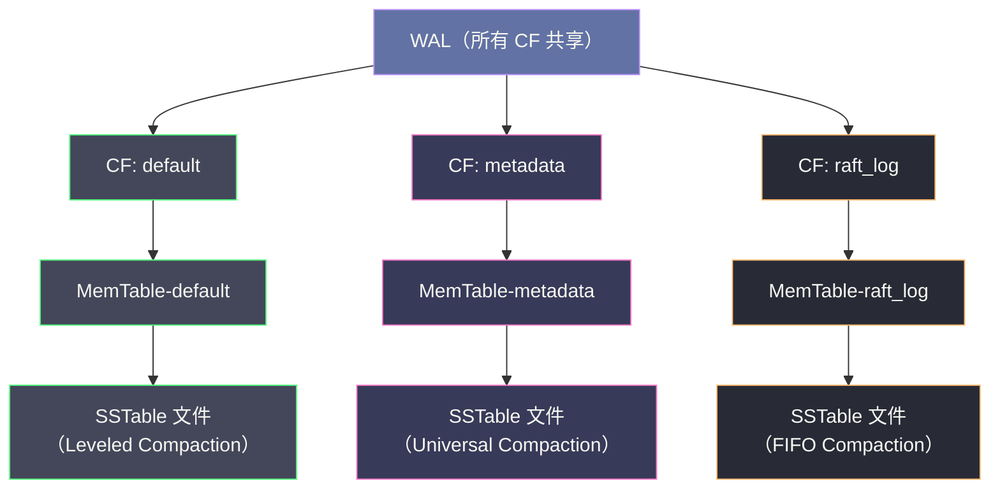

# 从 LevelDB 到 RocksDB——优化与演进

## 摘要

RocksDB 是 Facebook 于 2012 年基于 LevelDB fork 并持续演进的高性能嵌入式存储引擎，已成为业界最广泛使用的 LSM-Tree 存储引擎。它在 LevelDB 的优雅架构基础上，针对生产环境中暴露的真实瓶颈做了大量工程改进：**Column Family** 使同一数据库实例支持多个独立键空间，**多线程 Compaction** 解决了单线程 Compaction 在大规模写入下的追赶问题，**Universal Compaction** 提供了写放大更低的替代策略，**Rate Limiter** 防止 Compaction IO 冲击前台业务，**Write Ahead Log Pipeline** 提升了写入吞吐量。本文系统分析 RocksDB 对 LevelDB 的核心改进，并探讨 RocksDB 在 [[TiKV]]、[[Kafka Streams]]、[[Flink]] 等系统中的应用实践，勾勒 LSM-Tree 存储引擎的演进方向。

---

## 第 1 章 LevelDB 在生产环境中的局限性

### 1.1 LevelDB 的设计边界

LevelDB 是一个极其精炼的嵌入式存储引擎，代码量约 2 万行，核心逻辑清晰优雅。然而它诞生于 2011 年，当时的设计目标是 Google Chrome 的 IndexedDB 本地存储——一个单线程写入、数据量有限、不需要极致吞吐量的场景。将 LevelDB 直接用于互联网数据库（如 Facebook 的社交图数据库、TiKV 的分布式存储）时，以下局限性会逐一暴露。

**局限一：单线程 Compaction**。LevelDB 只有一个后台 Compaction 线程，在写入速度较高时，该线程可能追不上 Minor Compaction（MemTable 刷盘）和 Major Compaction（SSTable 合并）的需求，导致 L0 文件堆积、写入 Stall。Facebook 在测试 LevelDB 时发现，对于高写入吞吐场景，Compaction 线程始终处于 100% 占用状态，成为不可突破的瓶颈。

**局限二：无 Column Family 支持**。LevelDB 的一个数据库实例只有一个键空间，所有 key 混在一起。若需要存储不同类型的数据（如 TiKV 中的 Raft 日志、锁信息、用户数据），只能用 key 前缀区分，但它们共享同一套 Compaction 策略，无法针对不同数据的读写特征单独调优。

**局限三：无 Rate Limiter**。LevelDB 的 Compaction 不限速，在数据写入高峰期，Compaction 可能占满磁盘 IO 带宽，导致前台读写延迟剧增（IO 抢占问题）。这在 SSD 上尤为明显——SSD 的随机写性能已经很高，但 Compaction 产生的大量顺序写可以轻易将 SSD 带宽打满。

**局限四：写 WAL 的性能上限**。LevelDB 的 WAL 写入是单线程串行执行的。高并发写入时，多个线程竞争 WAL 写入锁，写 WAL 成为瓶颈。LevelDB 的组提交（Group Commit）虽然合并了批次，但 WAL 的 `sync` 路径仍然是串行的。

**局限五：Iterator 的快照设计限制**。LevelDB 的每个 Iterator 必须绑定到一个 Snapshot（或隐式使用当前最新序列号），Snapshot 的存在会阻止 Compaction 清理比该 Snapshot 更旧的版本。若有长期存在的 Iterator 或 Snapshot，Compaction 会保留大量旧版本数据，空间放大急剧增大。

### 1.2 RocksDB 的演进策略

Facebook 的工程师选择 fork LevelDB 而不是修改 LevelDB 本身，原因有两点：

1. **LevelDB 的代码审查流程较慢**：Google 对 LevelDB 的 PR 合并速度很慢（有时几个月才有回复），不适合 Facebook 快速迭代的需求
2. **需要大量破坏性改动**：Column Family、多线程 Compaction 等特性需要修改核心数据结构，与 LevelDB 的设计有较大差异

RocksDB 的改进策略是：**在 LevelDB 的正确性基础上做工程扩展，不改变 LSM-Tree 的核心模型，只增加生产环境所需的工程能力**。这一策略使得 RocksDB 在 2013 年开源后迅速获得社区认可，成为嵌入式 KV 存储的事实标准。

---

## 第 2 章 Column Family——多键空间的统一管理

### 2.1 什么是 Column Family

**Column Family（列族，CF）** 是 RocksDB 中最重要的概念之一，允许一个数据库实例中存在多个相互独立的键空间。每个 Column Family 有自己独立的：

- **MemTable**：独立的内存写缓冲区
- **SSTable 文件集合**：各 CF 的 SSTable 文件完全分开存储
- **Compaction 策略**：可以为不同 CF 配置不同的 Compaction 策略（Leveled、Universal 等）
- **Bloom Filter 和 Block Cache**：可以独立配置过滤器和缓存参数

不同 CF 之间**共享**：
- **WAL 文件**：所有 CF 的写入共享同一个 WAL，保证跨 CF 的原子写（通过 WriteBatch 跨 CF）
- **Block Cache**（可选）：多个 CF 可以共享同一个 Block Cache 实例，统一内存预算



### 2.2 Column Family 的工程价值

**隔离不同访问模式**：在 [[TiKV]] 中，RocksDB 实例通常包含三个 CF：`default`（用户数据）、`lock`（事务锁信息）、`write`（MVCC 版本信息）。用户数据的 value 通常较大，适合 Leveled Compaction + 较大的 Block 大小；锁信息的 key/value 均很小，访问频繁，适合 Universal Compaction + 较小 Block 大小。Column Family 让这两种完全不同的数据在同一个 RocksDB 实例中各自优化，而不需要维护两个独立的 RocksDB 实例（后者会增加运维复杂度和资源开销）。

**原子性跨 CF 写入**：通过 `WriteBatch` 跨 CF 写入，可以原子地同时写入多个 CF——要么全部成功，要么全部失败。这对于需要维护跨 CF 数据一致性的场景（如 TiKV 中同时写用户数据和 MVCC 版本信息）至关重要。

**独立 Flush 和 Compaction**：每个 CF 有独立的 MemTable，当一个 CF 的 MemTable 满时，只刷盘该 CF 的数据，不影响其他 CF。这避免了 LevelDB 中所有数据混在一起时的"低优先级数据拖慢高优先级数据刷盘"问题。

### 2.3 WAL 与 Column Family 的协同

虽然每个 CF 有独立的 MemTable，但所有 CF 的写入**共享同一个 WAL 文件**。这个设计保证了跨 CF 原子写的正确性——一个跨 CF 的 WriteBatch 在 WAL 中是一条不可分割的记录，崩溃恢复时要么全部重放，要么全部跳过。

**WAL 删除的复杂性**：由于多个 CF 共享 WAL，WAL 文件的删除条件变为"所有 CF 的对应 MemTable 都已刷盘"。若某个 CF 的 MemTable 刷盘较慢（如写入频率低），对应的 WAL 无法删除，可能导致 WAL 文件堆积。RocksDB 通过 `max_total_wal_size` 参数控制 WAL 总大小，当超过阈值时，强制 Flush 最旧的 CF 的 MemTable，以允许删除旧 WAL。

---

## 第 3 章 多线程 Compaction——突破单线程瓶颈

### 3.1 LevelDB 单线程 Compaction 的瓶颈

LevelDB 的后台只有一个 Compaction 线程，负责所有类型的 Compaction（Minor + Major）。在高写入吞吐场景下，这个单线程需要：

- 持续将 Immutable MemTable 刷盘（Minor Compaction）
- 将 L0 文件合并到 L1（L0→L1 Compaction，写放大约 3~4 倍）
- 将 L1 文件合并到 L2（L1→L2 Compaction）
- ...

单线程处理能力约为 100~200 MB/s（受 CPU 解压缩能力和磁盘顺序写带宽共同限制），这在 SSD 上远不够用（SSD 顺序写带宽可达 1~3 GB/s）。

### 3.2 RocksDB 的多线程 Compaction 设计

RocksDB 使用**线程池（Thread Pool）** 管理 Compaction 并发度：

- **High Priority 线程池**：专用于 Minor Compaction（MemTable 刷盘），保证内存写缓冲区能及时清空，避免写入 Stall
- **Low Priority 线程池**：用于 Major Compaction，默认 1 个线程，可通过 `max_background_compactions` 参数增加

关键设计：**同一个 Level 的 Compaction 可以并发执行**。在 LevelDB 中，由于只有一个线程，同一时刻只有一个 Compaction 在进行。RocksDB 允许多个 Compaction 线程并发执行，前提是它们选择的输入文件 key range 不重叠（即针对同一层的不同 key range 子集）。

```
多线程 Compaction 并发示意：

线程 1：将 L1 [aaa~mmm] 合并到 L2
线程 2：将 L1 [nnn~zzz] 合并到 L2
线程 3：将 L0 文件 Flush 到 L0（Minor Compaction）

三个 Compaction 并发执行，互不干扰（输入文件 key range 无重叠）
```

**SubCompaction**：RocksDB 还引入了 SubCompaction 机制——将一次 Major Compaction 的输入文件范围**分割为多个子任务**，由多个线程并行处理。每个子任务处理输入文件中的一段 key range，最后的输出文件合并为该 Compaction 的结果。这使得单次大型 Compaction（如 L5→L6，可能涉及数十 GB 数据）也能充分利用多核 CPU 和磁盘并发 IO 能力。

### 3.3 多线程 Compaction 的调优

| 参数 | 默认值 | 建议 |
|------|--------|------|
| `max_background_jobs` | 2 | SSD 场景可设为 CPU 核数的 1/4~1/2 |
| `max_background_compactions` | 1 | 与 `max_background_jobs` 配合，设为 jobs-1 |
| `max_background_flushes` | 1 | Minor Compaction 并发度，通常 1~2 个即可 |
| `max_subcompactions` | 1 | 单次 Compaction 的子任务数，大文件 Compaction 设为 4~8 |

> [!warning] 生产避坑
> 多线程 Compaction 会增加内存使用（每个线程的 Compaction 过程中需要在内存中缓存读取的 Block）。在内存受限的环境（如容器）中盲目增大 Compaction 线程数，可能导致 OOM。建议先通过监控确认 Compaction 是真正的瓶颈（观察 `rocksdb.compaction-pending` 指标是否持续 > 0），再逐步增加并发度。

---

## 第 4 章 Compaction 策略的多样化

### 4.1 LevelDB 的 Leveled Compaction 回顾

[[04 Compaction——分层合并与版本管理]] 详细分析了 LevelDB 的 Leveled Compaction：每层容量限制为上一层的 10 倍，L(N) 超过容量时触发 L(N)→L(N+1) 合并。这种策略的特点是**读放大低**（每层最多检查 1 个文件）和**空间放大低**（同一 key 最多存在于相邻的 2 层），代价是**写放大较高**（约 10~30 倍）。

Leveled Compaction 对于**读多写少**的场景（如在线服务的查询缓存）是最优选择，但对于**写密集型**场景（如日志收集、时序数据），其写放大代价在 SSD 上会显著加速磁盘磨损，并消耗大量 IO 带宽。

### 4.2 Universal Compaction——写放大优先策略

**Universal Compaction** 是 RocksDB 引入的一种以降低写放大为首要目标的 Compaction 策略，以牺牲读放大和空间放大为代价。

其核心思想是：**所有 SSTable 文件在逻辑上组成一个"有序序列"，新文件总是追加到序列头部（最新），合并时优先合并相邻的较小文件**。触发合并的条件不再是层级容量超限，而是：

1. **文件数量比例**：若最新的两组文件大小之比 > `size_ratio`（默认 1.1），则合并较小的那组
2. **总文件数量超限**：若 SSTable 总数 > `level0_file_num_compaction_trigger`，触发合并
3. **空间放大率超限**：若空间放大率 > `max_size_amplification_percent`（默认 200%），触发全量合并（Full Compaction）

```
Universal Compaction 的文件序列（从新到旧）：

时刻 T1：[f1(1MB)] → [f2(1MB)] → [f3(1MB)] → ...
时刻 T2：[f5(1MB)] → [f4(2MB，f1+f2合并)] → [f3(1MB)] → ...
时刻 T3：[f6(1MB)] → [f5(1MB)] → [f4(2MB)] → [f3(1MB)] → ...
时刻 T4：[f8(4MB，f5+f4合并)] → [f6(1MB)] → [f3(1MB)] → ...
```

Universal Compaction 的写放大约为 `O(log N)`（N 为 SSTable 文件数量），理想情况下约 1~3 倍，远低于 Leveled Compaction 的 10~30 倍。代价是空间放大较高（同一 key 可能存在于多个文件中，直到这些文件被合并），以及读放大较高（查找时可能需要检查较多文件）。

**Universal Compaction 的适用场景**：写密集型的时序数据库（如 MyRocks、Pika）、批量导入场景（如数据仓库的夜间全量更新）、对磁盘磨损敏感的 SSD 场景。

### 4.3 FIFO Compaction——时序数据的极简策略

**FIFO Compaction**（First In First Out）是 RocksDB 针对时序数据的超简单 Compaction 策略：

- 所有 SSTable 按时间顺序堆叠（新文件追加到前面）
- 当所有 SSTable 的总大小超过 `max_table_files_size`，从最旧的文件开始删除
- **不执行任何合并操作**，只做删除

FIFO Compaction 的写放大接近 1 倍（仅有 WAL + 一次刷盘），适合时序数据的**过期淘汰**场景：数据只按时间追加，旧数据超过 TTL 后整体丢弃（不需要精确的 key 级别删除）。代价是不支持随机点查（需要扫描所有文件），且不清理重复版本。

---

## 第 5 章 Rate Limiter——保护前台 IO

### 5.1 Compaction IO 冲击问题

没有 Rate Limiter 时，RocksDB 的 Compaction 线程会尽最大速度读写磁盘，在数据库负载高峰期可能占满磁盘 IO 带宽，导致：

- 前台 Get 请求的 P99 延迟从 1ms 飙升到 100ms（磁盘 IO 队列积压）
- 前台 Put 请求的 WAL 写入延迟大幅增加（磁盘带宽被 Compaction 占用）
- 对于 SSD，持续的高写入会加速磨损（写放大在磁盘层面体现为擦写次数）

这个问题在突发写入场景（如批量数据导入后触发大量 Compaction）尤为突出。

### 5.2 Rate Limiter 的实现原理

RocksDB 的 Rate Limiter 基于**令牌桶（Token Bucket）算法**：

- 系统以固定速率向桶中添加令牌（Token），速率由 `rate_limiter_bytes_per_sec` 参数控制
- Compaction 线程在写出每个 Block 前需要先从桶中获取对应字节数的令牌
- 若桶中令牌不足，线程等待直到有足够令牌

通过这种方式，**无论 Compaction 的实际速度如何，其磁盘写 IO 速率都被精确限制在配置的上限以内**，前台业务的磁盘 IO 不会被 Compaction 完全占用。

**自适应 Rate Limiter**：RocksDB 还支持 `NewGenericRateLimiter(rate_bytes_per_sec, ..., auto_tuned=true)` 模式，根据实时的 IO 压力自动调整 Rate Limiter 的限速值：当 Compaction 积压严重时（L0 文件堆积），自动放宽限速；当前台 IO 延迟增大时，自动收紧限速。

```cpp
// RocksDB Rate Limiter 配置示例
auto rate_limiter = NewGenericRateLimiter(
    100 * 1024 * 1024,  // 100 MB/s 的 Compaction 写入速率上限
    100 * 1000,         // refill_period_us = 100ms（令牌补充间隔）
    10,                 // fairness = 10（高优先级:低优先级 = 10:1）
    RateLimiter::Mode::kWritesOnly,  // 只限制写 IO，不限制读 IO
    true                // auto_tuned = true
);

rocksdb::Options options;
options.rate_limiter.reset(rate_limiter);
```

> [!info] 核心概念
> **Rate Limiter 的参数选择**：通常将 Rate Limiter 设置为磁盘写 IO 带宽的 50%~80%，为前台 IO 预留 20%~50% 的带宽。例如，若 SSD 顺序写带宽为 500MB/s，设置 Rate Limiter 为 300~400MB/s 是合理的起点。具体值需要根据业务的读写混合比例和 P99 延迟要求调整。

---

## 第 6 章 Write Pipeline——提升写入吞吐

### 6.1 LevelDB 写入的串行化问题

LevelDB 的写入路径是：
```
获取 mutex_ → 写 WAL（fsync） → 写 MemTable → 释放 mutex_
```

整个过程持有一个全局锁 `mutex_`，多线程写入时严重串行化。虽然 Group Commit 可以将多个 WriteBatch 合并为一次 WAL 写入，但 `fsync` 本身是串行的，高并发写入时 WAL 写入成为严重瓶颈。

### 6.2 RocksDB 的 WriteGroup 与 Pipeline

RocksDB 对写入路径进行了多项优化：

**WriteGroup 机制**：类似 LevelDB 的 Group Commit，但 RocksDB 的实现更精细：
- 每个 WriteThread 在 leader/follower 模式下工作：第一个进入的线程成为 leader，后续进入的线程排队成为 follower
- Leader 负责合并所有 follower 的 WriteBatch，执行 WAL 写入和 MemTable 写入（可以多线程并行写 MemTable）
- 写入完成后，leader 通知所有 follower，follower 无需重新获取锁

**Pipelined Write（流水线写入）**：RocksDB 可以配置 `enable_pipelined_write=true`，将 WAL 写入和 MemTable 写入**流水线化**：

```
传统串行写入：
  [WriteBatch-1: WAL写入 → MemTable写入]
  [WriteBatch-2: WAL写入 → MemTable写入]

流水线写入：
  WriteBatch-1: [WAL写入] → [MemTable写入]
  WriteBatch-2:          [WAL写入] → [MemTable写入]
                ← 重叠执行 →
```

在流水线模式下，WriteBatch-2 的 WAL 写入可以与 WriteBatch-1 的 MemTable 写入并行执行，减少等待时间，提升吞吐量约 20%~40%。

**Unordered Write**：进一步地，若业务不依赖严格的写入顺序（例如使用了外部的事务机制），可以开启 `unordered_write=true`，允许多线程并发写 MemTable（不保证写入顺序），吞吐量可再提升 1~2 倍。

---

## 第 7 章 其他关键改进

### 7.1 Bloom Filter 的改进

**Full Filter vs Block-Based Filter**：LevelDB 的 Bloom Filter 是 per-block 的（每个 Data Block 一个 Bloom Filter），而 RocksDB 引入了 **Full Filter**（整个 SSTable 一个 Bloom Filter）。Full Filter 的优点是查询一个 key 时只需一次 Bloom Filter 检查（不需要先读 Index Block 确定 Data Block，再检查该 Block 的 Bloom Filter）；缺点是 Filter 本身占用的内存略多。Full Filter 在点查询场景下性能更好，是 RocksDB 的默认选项。

**Prefix Bloom Filter**：针对按 key 前缀 Seek 的场景，RocksDB 支持对 key 前缀建立 Bloom Filter，使得 `SeekForPrev("user:1")` 这类操作也能通过 Bloom Filter 快速过滤不相关的 SSTable，而 LevelDB 中 Bloom Filter 只支持精确的 key 匹配。

### 7.2 Block Cache 的改进

**Compressed Block Cache**：LevelDB 的 Block Cache 只缓存解压缩后的 Block 内容。RocksDB 引入了一个额外的 **Compressed Block Cache**，缓存压缩状态的 Block——对于需要在内存中同时容纳大量 Block 的场景，Compressed Cache 可以缓存更多数据（因为压缩后体积小），以磁盘带宽换取更高的命中率。

**Clock Cache vs LRU Cache**：RocksDB 提供了 Clock Cache 作为 LRU Cache 的替代品。Clock Cache 的并发扫描性能更好（减少锁竞争），在高并发读取场景下（如每秒数十万次查询）比 LRU Cache 有明显优势。

### 7.3 Iterator 的 Tailing 模式

**Tailing Iterator（跟随迭代器）**：LevelDB 的 Iterator 在创建时绑定到一个 Snapshot，只能看到该 Snapshot 时刻之前的数据。RocksDB 引入了 Tailing Iterator（通过 `ReadOptions.tailing = true`），它不绑定 Snapshot，总是能看到最新写入的数据，类似于 `tail -f` 的效果。Tailing Iterator 针对连续追加读取场景（如消息队列的消费者）进行了专门优化，避免了每次迭代都需要合并所有层的开销。

### 7.4 Merge Operator——Read-Modify-Write 的原生支持

**Merge Operator** 是 RocksDB 独有的特性，用于高效实现 Read-Modify-Write 语义（如计数器累加、集合追加）。

在没有 Merge Operator 的情况下，实现一个计数器需要：`Get(key)` → 修改值 → `Put(key, new_value)`，这需要一次读 IO + 一次写 IO。在高频计数器场景（如广告点击计数），这是明显的瓶颈。

Merge Operator 引入了 `Merge(key, delta)` 操作：将增量 `delta` 写入一条特殊的 Merge 记录，不立即执行 Read-Modify-Write。在读取时，RocksDB 将累积的所有 Merge 记录与 Base Value 合并（通过用户定义的 `FullMerge` 函数），得到最终结果。在 Compaction 时，将连续的 Merge 记录预先合并（通过 `PartialMerge` 函数），减少未来读取时的合并代价。

```
计数器使用 Merge Operator 的流程：

写入操作：
  Put("counter:user1", "0")      → Base Value: 0
  Merge("counter:user1", "+1")   → Merge Record 1
  Merge("counter:user1", "+1")   → Merge Record 2
  Merge("counter:user1", "+3")   → Merge Record 3

读取时（触发 FullMerge）：
  Base Value: 0
  + MergeRecord1(+1) = 1
  + MergeRecord2(+1) = 2
  + MergeRecord3(+3) = 5
  → 返回 5

Compaction 时（触发 PartialMerge）：
  MergeRecord1 + MergeRecord2 + MergeRecord3 → MergeRecord_merged(+5)
  → 减少读取时的合并代价
```

---

## 第 8 章 RocksDB 在工程实践中的应用

### 8.1 TiKV：分布式 KV 存储的基石

[[TiKV]] 是 PingCAP 开源的分布式键值存储，是 [[TiDB]] 的底层存储引擎。每个 TiKV 节点上运行多个 RocksDB 实例（称为 Region），每个 Region 存储一段连续 key range 的数据，通过 [[Raft]] 协议在多个节点间复制。

TiKV 对 RocksDB 的使用方式非常有代表性：

**三个 Column Family**：
- `default` CF：存储用户数据（MVCC 最新版本）
- `lock` CF：存储事务的悲观锁/乐观锁信息，小 KV，访问频繁，使用 Universal Compaction
- `write` CF：存储 MVCC 版本信息（每个写操作的版本链），是数据量最大的 CF

**Titan 扩展（大 Value 分离）**：TiKV 在 RocksDB 基础上开发了 [[Titan]] 扩展，实现了 WiscKey 论文中的 Key-Value 分离思想：当 Value 大于阈值（默认 1KB）时，Value 存储在独立的 Blob File 中，SSTable 中只存储 Value 在 Blob File 中的位置指针。这大幅减少了大 Value 场景下的 Compaction 写放大。

### 8.2 Kafka Streams：状态存储后端

[[Kafka Streams]] 是 Apache Kafka 提供的轻量级流处理框架，其有状态操作（如聚合、连接）需要将中间状态持久化到本地存储。RocksDB 是 Kafka Streams 的默认状态存储后端。

在 Kafka Streams 的使用场景中，RocksDB 的访问模式非常特殊：
- **Key 分布**：通常按消息的 key（如用户 ID、设备 ID）分布，热点 key 访问频繁
- **Value 更新**：大量更新操作（如计数器、窗口聚合结果），每次处理事件都会更新对应 key 的值
- **顺序迭代**：窗口查询需要按时间戳范围扫描状态

Kafka Streams 为 RocksDB 设置了专门的配置：较大的 Block Cache（缓存热点 key 的 Block）、较小的 `write_buffer_size`（减少 MemTable 内存占用，因为流处理任务通常是内存受限的）、以及 Bloom Filter 过滤不存在的 key。

### 8.3 Flink：增量 Checkpoint 的实现基础

[[Apache Flink]] 的 **RocksDB State Backend** 使用 RocksDB 存储流处理算子的本地状态。与 Kafka Streams 不同，Flink 还利用 RocksDB 的 SSTable 特性实现了**增量 Checkpoint（Incremental Checkpoint）**。

普通 Checkpoint 需要将全量状态快照上传到远程存储（如 HDFS/S3），对于 TB 级状态的流处理任务，每次 Checkpoint 上传几 GB 数据，耗时数十分钟，严重影响吞吐量。

增量 Checkpoint 的原理：
1. RocksDB 的 SSTable 文件是不可变的，一旦写入就不再修改
2. Flink 在每次 Checkpoint 时，只需上传**自上次 Checkpoint 以来新增的 SSTable 文件**（增量部分）
3. 恢复时，从远程下载所有必要的 SSTable 文件，重建 RocksDB 实例

这使得增量 Checkpoint 的上传量从 GB 级降低到 MB 级（只有增量的新文件），Checkpoint 时间从数十分钟降低到数秒，大幅提升了 Flink 任务的可用性和故障恢复速度。

### 8.4 MyRocks：MySQL 的 LSM-Tree 存储引擎

**[[MyRocks]]** 是 Facebook 开发的 MySQL 存储引擎插件，用 RocksDB 替代 InnoDB 作为底层存储引擎。Facebook 的动机是：MySQL 的 InnoDB 引擎使用 B+ 树存储，写放大高，SSD 磨损快，且存储效率不如 LSM-Tree。

实际生产数据（Facebook 的 UDB 数据库）显示，切换 MyRocks 后：
- **存储空间减少约 50%**：LSM-Tree 的空间效率高于 B+ 树（B+ 树节点存在大量碎片和内部空洞）
- **写 IO 减少约 60%**：写放大从 InnoDB 的 30~50 倍降低到 MyRocks 的 10~20 倍
- **读性能接近持平**：对于点查询，MyRocks 的 Bloom Filter 使得读性能与 InnoDB 接近

---

## 第 9 章 LevelDB 与 RocksDB 的全面对比

### 9.1 功能特性对比

| 特性 | LevelDB | RocksDB |
|------|---------|---------|
| **Column Family** | 不支持 | 支持，每 CF 独立 Compaction |
| **Compaction 策略** | 仅 Leveled | Leveled / Universal / FIFO |
| **Compaction 并发** | 单线程 | 多线程 + SubCompaction |
| **Rate Limiter** | 不支持 | 支持，令牌桶算法 |
| **Merge Operator** | 不支持 | 支持 |
| **Tailing Iterator** | 不支持 | 支持 |
| **事务（Transaction）** | 不支持 | 支持（OptimisticTransaction + PessimisticTransaction） |
| **Full Filter** | 不支持（只有 Block Filter） | 支持，默认开启 |
| **Prefix Bloom Filter** | 不支持 | 支持 |
| **Blob/Titan 支持** | 不支持 | 支持（通过 BlobDB 插件） |
| **统计信息与监控** | 极简 | 完善的 Statistics、EventListener API |
| **代码量** | ~2 万行 | ~30 万行 |

### 9.2 适用场景对比

| 场景 | 推荐选择 | 理由 |
|------|---------|------|
| 嵌入式小规模 KV 存储 | LevelDB | 代码简单，依赖少，嵌入成本低 |
| 高吞吐写入（>100MB/s） | RocksDB | 多线程 Compaction，Rate Limiter |
| 多种数据类型共存 | RocksDB | Column Family 独立优化 |
| 分布式数据库底层 | RocksDB | 事务支持，Column Family，完善的监控 |
| 流处理状态存储 | RocksDB | 增量 Checkpoint，Tailing Iterator |
| 学习 LSM-Tree 原理 | LevelDB | 代码精炼，逻辑清晰，注释完善 |

---

## 第 10 章 LSM-Tree 存储引擎的未来方向

### 10.1 存算分离趋势

传统的 LSM-Tree 存储引擎（LevelDB/RocksDB）设计为嵌入式引擎，数据和计算紧密耦合在同一节点。随着云计算的发展，**存算分离**成为重要趋势：

- **Disaggregated Storage**：将 SSTable 文件存储在对象存储（如 S3）或分布式文件系统（如 [[JuiceFS]]）上，本地只保留 MemTable 和热点 Block Cache。Compaction 可以在独立的计算节点上执行，不占用服务节点资源。
- **Shared Storage RocksDB**：Meta 的 RocksDB 团队正在探索基于 S3 的 SSTable 存储，利用 S3 的持久性替代本地磁盘，节点故障时不需要 Raft 复制（数据在 S3 上已是多副本），只需重建 MemTable（从 WAL 恢复）。

### 10.2 NVM（非易失性内存）的机遇

**NVM（Non-Volatile Memory，如 Intel Optane）** 的出现为 LSM-Tree 带来了新的机遇：NVM 兼具内存的低延迟（~1μs）和磁盘的持久性，打破了 LSM-Tree 中"内存（快但易失） vs 磁盘（慢但持久）"的二元对立。

若将 MemTable 和 WAL 放在 NVM 上，MemTable 的大小可以大幅增加（NVM 容量比 DRAM 大），减少 Minor Compaction 频率；WAL 的 `fsync` 延迟也从 HDD/SSD 的毫秒级降低到微秒级，写入延迟大幅改善。NoveLSM、MatrixKV 等学术系统已经在探索 NVM 友好的 LSM-Tree 变体。

### 10.3 向量化与 SIMD 加速

Compaction 过程中的核心操作（key 比较、CRC 计算、Snappy/Zstd 压缩）都可以用 SIMD 指令加速。现代 CPU 的 AVX-512 指令集可以同时处理 64 字节的数据，理论上可将部分操作的吞吐量提升 4~8 倍。RocksDB 社区正在逐步引入 SIMD 优化，特别是在 Bloom Filter 的批量查询和 Block 内的 Key 比较操作中。

---

## 第 11 章 小结

### 11.1 LevelDB 的历史贡献

LevelDB 以约 2 万行精炼的 C++ 代码，向工程界清晰地展示了 LSM-Tree 的完整实现路径：SkipList-based MemTable、WAL 持久化、SSTable 的 Block 格式与 Bloom Filter、分层 Compaction 策略、以及 Version/VersionEdit/VersionSet 的 MVCC 版本管理。这些设计思想被 RocksDB、[[Cassandra]]、[[HBase]]、[[ClickHouse]] MergeTree 等无数后继系统所借鉴，LevelDB 的影响力远超其代码规模。

### 11.2 RocksDB 的工程贡献

RocksDB 将 LevelDB 的理论价值转化为生产可用的工程能力，其核心贡献是：

- 证明了 LSM-Tree 存储引擎在大规模互联网场景下的可行性（Facebook、TikTok、LinkedIn 等均大规模使用）
- 建立了一套完善的可调优参数体系，使存储引擎能适应从嵌入式设备到数十 TB 大型数据库的各种场景
- 通过开源生态的发展，成为分布式数据库（TiKV、CockroachDB）、流处理系统（Flink、Kafka Streams）等基础设施的通用存储底座

从 LevelDB 到 RocksDB 的演进路径，是存储引擎设计从"理论正确"走向"工程可用"的典范——核心思想不变，但在生产环境中打磨出的每一处细节改进，都有其真实的业务痛点和工程代价的精确权衡。

---

> [!note] 思考题
> 1. LevelDB 是单线程写入、单线程 Compaction 的简单设计——适合嵌入式场景但不适合高性能服务。RocksDB 在 LevelDB 基础上增加了：并发写入（Group Commit）、并发 Compaction、Column Family、Rate Limiter 等。在什么规模的应用中你会选择 RocksDB 而非 LevelDB？LevelDB 的代码更简单——作为学习 LSM-Tree 的入门是否更合适？
> 2. RocksDB 被 TiKV、CockroachDB、Kafka Streams 等系统作为嵌入式存储引擎使用。RocksDB 的 Column Family 允许在同一个 DB 实例中创建多个独立的 KV 空间——共享 WAL 和 MemTable 但有独立的 SSTable。Column Family 对事务（跨 CF 的原子写入）有什么影响？
> 3. 除了 LevelDB/RocksDB，Pebble（Go 实现的 LSM-Tree，CockroachDB 使用）和 BadgerDB（Go 实现，KV 分离设计）是其他选择。BadgerDB 的 KV 分离将 Value 存储在独立的 Value Log 中——减少了 Compaction 的写放大（只需要合并 Key）。KV 分离在什么场景下优势最大（如 Value 很大，>1KB）？在 Value 很小时 KV 分离是否有额外开销？
