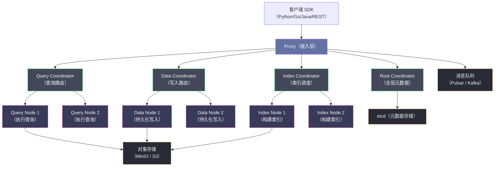
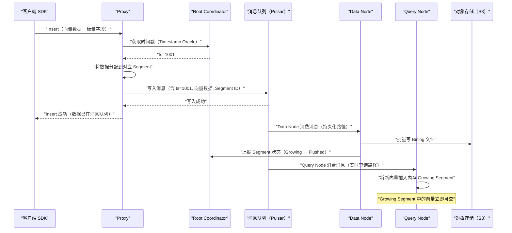
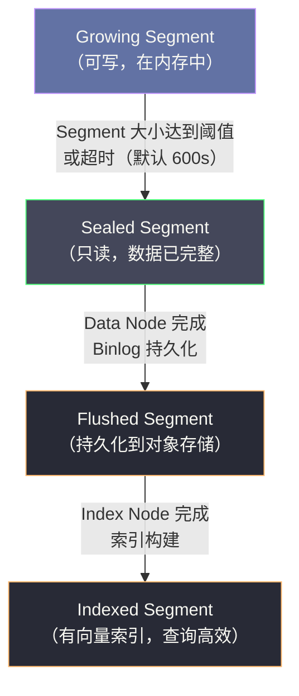

# Milvus 全局架构——存算分离与云原生设计

## 摘要

Milvus 是 Zilliz 于 2019 年开源的向量数据库，2021 年捐献给 Linux Foundation AI & Data 基金会，目前是最成熟的开源向量数据库之一。与传统数据库"计算与存储耦合"的单体架构不同，Milvus 2.0 重新设计为**存算分离的云原生架构**，将访问层（Access Layer）、协调层（Coordinator Layer）、工作节点层（Worker Layer）、对象存储层（Storage Layer）四层彻底解耦，每层均可独立水平扩展。本文从向量检索的业务场景出发，分析为什么传统数据库无法胜任向量检索，然后逐层解析 Milvus 的架构设计，理解各组件的职责划分与协作方式，并对比 Milvus 与 Pinecone、Weaviate、Qdrant 等竞品的设计差异，帮助读者建立对向量数据库架构的全局认知。

---

## 第 1 章 向量检索——为什么需要专门的数据库

### 1.1 从关键词检索到语义检索的演变

传统的信息检索系统（如 [[Elasticsearch]]）基于**关键词匹配**：用户输入"苹果手机价格"，系统在倒排索引中查找包含"苹果"、"手机"、"价格"这三个词的文档，返回包含这些词的结果。这种方法在精确匹配场景下表现良好，但有一个根本性的缺陷：**它无法理解语义**。

例如，用户搜索"Smartphone cost"，关键词匹配系统可能不会返回包含"手机价格"的中文文档，因为两种语言的字面表示完全不同，即使语义完全一致。更极端的例子是图片搜索——"查找与这张狗的图片相似的照片"，关键词检索根本无从处理。

**Embedding（向量化）技术** 的出现从根本上改变了这个局面。通过大语言模型（如 BERT、Sentence-BERT、OpenAI text-embedding-ada-002）或多模态模型（如 CLIP），可以将任意内容（文本、图片、音频、视频）映射为一个高维浮点向量（通常 128~4096 维），使得语义相似的内容在向量空间中距离相近。

这样，"苹果手机价格"和"Smartphone cost"经过同一个 Embedding 模型处理后，得到的两个向量在高维空间中的余弦距离会非常小（高度相似），即使字面上完全不同。语义检索因此成为可能。

### 1.2 向量检索的技术挑战——ANN 问题

有了向量表示，"查找与查询向量语义相似的内容"就转化为一个纯数学问题：**在 N 个 D 维向量中，找到与给定查询向量最相近的 K 个向量（K-Nearest Neighbors，KNN）**。

精确 KNN（Exact KNN）的时间复杂度为 O(N × D)——对数据集中的每个向量计算与查询向量的距离，然后排序取前 K 个。对于 N=100 万、D=768（BERT 向量维度）的场景，每次查询需要计算 7.68 亿次浮点乘法（FMA），耗时约 100~500ms，对于在线服务场景完全不可接受（要求 P99 < 100ms）。

因此，工程实践中普遍使用 **ANN（Approximate Nearest Neighbor，近似最近邻）** 算法——以少量精度损失（Recall 从 100% 降低到 90%~99%）换取数量级的速度提升。ANN 算法是向量数据库的核心竞争力所在，第 02 篇文章将深度解析 IVF、HNSW、DiskANN 等主流算法。

### 1.3 为什么传统数据库无法胜任

可以用传统数据库（PostgreSQL、MySQL、Elasticsearch）存储和检索向量吗？理论上可以，但实践中面临无法克服的性能障碍：

**关系型数据库（PostgreSQL、MySQL）**：可以将向量存储为浮点数组（如 `FLOAT[]`），甚至可以用 pgvector 插件支持简单的向量检索，但底层索引（B+ 树、Hash）是为精确匹配设计的，无法加速 ANN 检索。ANN 的本质是多维空间中的近邻查找，与关系型数据库的标量比较操作完全不同。

**Elasticsearch**：虽然 Elasticsearch 8.x 引入了向量检索（kNN Search），但其底层仍然是 Lucene，而 Lucene 的向量索引（HNSW）实现是后期附加的，与其核心的倒排索引架构是两套体系，在超大规模场景（千万~亿级向量）下性能有限。

**专用向量数据库的优势**：Milvus 这类专用向量数据库从架构设计之初就以向量检索为核心，在以下几个方面有本质优势：
1. **索引专门化**：针对向量检索的 ANN 算法（HNSW、IVF、DiskANN）做了深度优化，支持 GPU 加速
2. **水平扩展**：向量数据量通常在亿级以上，需要数据分片（Sharding）和水平扩展，传统数据库在这方面能力有限
3. **混合检索**：实际业务通常需要"向量相似 + 标量过滤"的混合查询（如"找与这段文字相似的、且发布时间在 2023 年之后的文档"），专用向量数据库对此有专门优化
4. **向量特有操作**：向量数据的生命周期管理（索引构建、段合并）与关系型数据不同，需要专门的引擎

### 1.4 向量数据库的典型业务场景

理解架构之前，先明确 Milvus 的核心使用场景：

| 场景 | 向量来源 | 检索目标 | 规模要求 |
|------|----------|----------|----------|
| **RAG（检索增强生成）** | 文档段落经 LLM Embedding | 找与用户问题语义最近的文档段落 | 万~千万级 |
| **图片以图搜图** | CNN/ViT 模型的图片特征向量 | 找视觉相似的图片 | 亿~百亿级 |
| **推荐系统** | 用户/商品 Embedding | 找与用户偏好相近的商品 | 亿级 |
| **人脸识别** | 人脸模型输出的特征向量 | 在人脸库中查找匹配的人 | 百万~十亿级 |
| **化学分子相似性** | 分子结构的向量表示 | 找结构相似的候选分子 | 千万级 |

---

## 第 2 章 Milvus 1.0 vs 2.0——架构演进的驱动力

### 2.1 Milvus 1.0：单体架构的局限

Milvus 1.0（2019 年）是一个**单体架构**的向量数据库：所有组件（查询处理、索引构建、数据存储、元数据管理）运行在同一个进程中，数据存储在本地磁盘。

这种设计在功能验证阶段是合理的，但在生产规模化阶段暴露了严重局限：

**弹性扩展困难**：查询量突增时，只能通过复制整个实例（包括存储的完整副本）来扩容，代价极高且扩容速度慢（需要复制 TB 级索引文件）。

**索引构建与查询相互干扰**：索引构建是 CPU 和内存密集型操作，在同一进程中运行会影响查询的 P99 延迟。

**高可用难度大**：单体架构的故障恢复需要重启整个进程并重新加载索引（可能需要数分钟），对高可用要求严苛的业务不可接受。

**存储耦合**：数据存储在本地磁盘，节点故障时数据需要额外的复制机制保护，且不同节点之间的数据难以共享。

### 2.2 Milvus 2.0：云原生重架构的设计目标

Milvus 2.0（2021 年）完全重写，确立了三个核心设计目标：

**目标一：存算分离（Disaggregated Storage and Compute）**：数据持久化到对象存储（MinIO/S3），计算节点（Query Node、Data Node）是无状态的。节点故障后，新节点可以从对象存储重新加载数据，无需依赖本地磁盘的数据。这使得计算层可以像 Kubernetes Pod 一样随时销毁和重建。

**目标二：读写分离（Separation of Read and Write Paths）**：写入路径（Data Node 负责持久化写入的向量数据）与读取路径（Query Node 负责执行查询）完全分离，互不干扰。写入高峰不影响查询延迟，查询压力不影响写入吞吐。

**目标三：云原生（Cloud-Native）**：基于 Kubernetes 部署，每个组件是独立的微服务，可以单独扩缩容。依赖 [[etcd]] 做分布式协调，依赖 [[Kafka]] / [[Pulsar]] 做消息队列，依赖 MinIO/S3 做对象存储——充分利用云环境的基础设施。

---

## 第 3 章 Milvus 2.0 的四层架构

### 3.1 架构总览

Milvus 2.0 的架构分为四个逻辑层，从上到下职责递减、扩展性递增：



### 3.2 第一层：Access Layer（接入层）——Proxy

**Proxy** 是客户端的唯一入口，负责：

1. **连接管理**：维护客户端的长连接（gRPC），处理认证和访问控制
2. **请求路由**：将客户端的操作请求（插入、查询、删除、DDL）路由到对应的 Coordinator
3. **结果聚合**：对于分布式查询，汇聚来自多个 Query Node 的部分结果，执行全局 Top-K 合并，返回最终结果
4. **流量控制**：限制客户端的请求速率，防止过载

Proxy 本身是**无状态的**——它不存储任何业务数据，只做请求转发和结果聚合。因此，Proxy 可以任意扩展，部署多个 Proxy 实例并在前面加负载均衡器（如 Nginx/HAProxy）即可实现水平扩展。

Proxy 通过**消息队列（Pulsar/Kafka）** 而非直接 RPC 来发送数据写入请求。客户端的 Insert 操作首先被 Proxy 写入消息队列，Data Node 从消息队列消费并持久化。这种设计实现了写入路径的**解耦和异步化**——Proxy 确认写入成功的时机是"消息写入队列成功"，而不是"数据落盘成功"，写入延迟大幅降低。

> [!info] 核心概念
> **为什么用消息队列解耦写入？** 直接 RPC 写入的问题是：若 Data Node 暂时不可用（重启/过载），写入请求会失败，客户端需要重试，增加复杂度。通过消息队列解耦后，写入请求先持久化到消息队列（高可用），Data Node 从队列消费，即使 Data Node 临时故障，重启后可以从队列的最后一个 offset 继续消费，不丢数据。这是经典的"削峰填谷"和"持久化缓冲"模式。

### 3.3 第二层：Coordinator Layer（协调层）

协调层由四个 Coordinator 组成，每个 Coordinator 管理特定类型的资源和操作：

**Root Coordinator（RC）**：全局元数据管理员
- 管理 Collection、Partition、Segment 的 Schema 定义和状态
- 分配全局唯一的 ID（如 Collection ID、Segment ID）
- 管理 Timestamp Oracle（时间戳分配），保证全局有序的写入时间戳
- 将元数据持久化到 [[etcd]]

**Query Coordinator（QC）**：查询路由与负载均衡
- 维护 Query Node 的拓扑信息（哪些 Segment 被加载到哪些 Query Node）
- 决定查询请求应该发往哪些 Query Node（根据 Segment 的分布）
- 管理 Segment 在 Query Node 上的加载（Load）和释放（Release）
- 实现 Query Node 的负载均衡（将热点 Segment 迁移到空闲 Query Node）

**Data Coordinator（DC）**：写入路径管理
- 管理 Segment 的状态机（Growing → Sealed → Flushed）
- 监控 Segment 的大小，当 Segment 达到阈值时触发 Seal 操作
- 调度 Data Node 执行 Compaction（将多个小 Segment 合并为大 Segment）
- 触发 Segment 从 Growing（可写）状态转换到 Flushed（只读，已落盘到对象存储）状态

**Index Coordinator（IC）**：索引构建调度
- 接收 `CreateIndex()` 请求，创建索引任务
- 监控哪些已 Flushed 的 Segment 还没有索引（或索引已过期），调度 Index Node 构建索引
- 管理索引任务的执行状态和结果（索引文件存储在对象存储中的位置）

四个 Coordinator 都是**无状态的业务逻辑层**——真正的状态（元数据）存储在 [[etcd]] 中。Coordinator 可以多副本部署（Active-Standby 模式），主节点故障后从节点接管，恢复时间约秒级。

> [!note] 设计哲学
> Milvus 将传统单体数据库中"一个 Master 管所有事"的模式，拆分为四个职责单一的 Coordinator。这种职责分离的好处是：每个 Coordinator 只需关注自己负责的资源，状态更简单，故障影响范围更小（QC 故障不影响写入，DC 故障不影响查询）。代价是系统整体的分布式协调复杂度上升——四个 Coordinator 之间需要通过消息队列和 etcd 协调状态，调试和排障难度增加。

### 3.4 第三层：Worker Layer（工作节点层）

工作节点层是真正执行计算的无状态 Worker，分为三类：

**Query Node（查询节点）**：
- 从对象存储加载 Sealed/Flushed Segment 的向量数据和索引文件到本地内存/磁盘
- 订阅消息队列，实时消费新写入的数据（Growing Segment），维护内存中的增量数据
- 执行向量检索（ANN 搜索）和标量过滤，返回局部 Top-K 结果给 Proxy

Query Node 的设计亮点：**同时处理历史数据（Sealed Segment，来自对象存储）和增量数据（Growing Segment，来自消息队列）**，对用户透明地实现了"实时可见"——刚写入的向量不需要等到落盘，就可以被查询（通过消费消息队列的增量数据）。

**Data Node（数据节点）**：
- 订阅消息队列中的写入流（Insert/Delete 操作）
- 将向量数据批量持久化到对象存储（MinIO/S3），形成 Binlog 文件
- 执行 Compaction：将多个小 Segment 的数据合并为大 Segment，减少文件碎片

Data Node 是"只管写"的 Worker，不参与查询。这实现了读写分离——写入压力大时扩展 Data Node，不影响 Query Node 的查询性能。

**Index Node（索引节点）**：
- 接收 Index Coordinator 分配的索引构建任务
- 从对象存储读取已 Flushed Segment 的原始向量数据
- 执行索引构建（HNSW 图构建、IVF 聚类等，CPU/GPU 密集型操作）
- 将构建好的索引文件写回对象存储

索引构建通常是最消耗资源的操作（HNSW 构建 1 亿个 768 维向量可能需要数小时），将其隔离到独立的 Index Node，避免影响在线查询服务的稳定性。

### 3.5 第四层：Storage Layer（存储层）

存储层不是 Milvus 自己实现的组件，而是依赖云原生的基础设施：

**对象存储（MinIO / S3 / Azure Blob）**：存储 Milvus 的所有持久化数据：
- **Binlog 文件**：Data Node 写入的原始向量数据（Insert Binlog）和删除记录（Delete Binlog）
- **索引文件**：Index Node 构建好的 HNSW/IVF 索引
- **Checkpoint 文件**：记录消息队列的消费进度，用于崩溃恢复

对象存储提供的持久性（11 个 9 的数据持久性）和高可用性，替代了传统数据库的本地磁盘 + 副本复制方案，大幅简化了 Milvus 自身的数据保护逻辑。

**元数据存储（etcd）**：存储 Collection Schema、Segment 状态、节点拓扑等轻量级元数据，数据量通常在 MB 级。etcd 的 Watch 机制被 Coordinator 广泛使用，当元数据发生变更时（如 Segment 状态变化），相关 Coordinator 和 Worker 能即时感知并响应。

**消息队列（Apache Pulsar / Apache Kafka）**：在写入路径中充当数据总线，解耦 Proxy（写入方）和 Data Node / Query Node（消费方）。两个消费者（Data Node 持久化、Query Node 实时查询）通过不同的消费组独立消费，互不干扰。

---

## 第 4 章 读写路径的端到端分析

### 4.1 写入路径（Insert Path）

以 `collection.insert([vectors, scalars])` 为例，完整的写入链路：



**关键细节——Timestamp Oracle（时间戳服务）**：每次写入都需要向 Root Coordinator 获取一个全局单调递增的时间戳（TSO，类似于 [[TiDB]] 的 TSO 设计）。这个时间戳有两个用途：
1. **顺序保证**：所有写入操作按时间戳全局有序，Data Node 和 Query Node 按时间戳顺序消费消息，不会出现写入顺序错乱
2. **一致性读取**：查询时可以指定一个时间戳 T，只看 T 时刻之前写入的数据（类似数据库的 MVCC Snapshot Read）

**Guaranteed Timestamp**：客户端在 Insert 后可以获取写入的时间戳，在后续 Search 时带上这个时间戳（`search_params.guarantee_timestamp`），保证能看到此次写入的数据——即使 Query Node 的消费进度可能稍有落后，也会等待消费到该时间戳后再执行查询。

### 4.2 查询路径（Search Path）

以 `collection.search(query_vectors, top_k=10)` 为例：

```
1. SDK → Proxy：发送 Search 请求

2. Proxy → Query Coordinator：
   请求本次查询的执行计划（哪些 Query Node 负责哪些 Segment）

3. Query Coordinator → Proxy：
   返回 Segment 分布信息：
   - QueryNode-1 持有 Segment-1, Segment-2, Segment-3（Sealed，有索引）
   - QueryNode-2 持有 Segment-4, Segment-5（Sealed）
   - 所有 QueryNode 都持有 Growing Segment（实时增量）

4. Proxy → QueryNode-1, QueryNode-2（并行）：
   各自执行局部 Top-K 搜索（在各自持有的 Segment 上）

5. QueryNode-1 执行：
   - 对每个 Sealed Segment：使用 HNSW 索引执行 ANN 搜索，返回局部 Top-K
   - 对 Growing Segment：暴力搜索（数量少），返回局部 Top-K
   - 合并本节点的所有局部结果，返回给 Proxy

6. QueryNode-2 执行（同上，并行）

7. Proxy 收到所有 QueryNode 的局部结果：
   - 执行全局 Top-K 归并（从 K × 节点数 个候选中，选出全局最近的 K 个）
   - 应用删除过滤（已被 Delete 的向量不返回）
   - 返回最终 Top-K 结果给 SDK
```

**分布式查询的精度保证**：每个 QueryNode 返回其持有的 Segment 上的局部 Top-K 结果，Proxy 做全局归并。为了保证全局精度，每个 QueryNode 实际需要返回比 K 更多的候选（通常是 `K × 扩展因子`），以防止真正的全局 Top-K 被某个节点遗漏。这与 [[Elasticsearch]] 的分布式查询精度问题本质相同。

---

## 第 5 章 Segment 的状态机——数据生命周期的核心

### 5.1 Segment 是什么

**Segment** 是 Milvus 中数据管理的基本单元，类似于 [[Elasticsearch]] 的 Segment 或 [[Kafka]] 的 Partition。每个 Segment 包含一批向量数据及其对应的标量字段，大小通常在 512MB~2GB 之间。

Collection 的数据按照 Partition → Segment 两级组织：
- Collection（最高层，类比数据库的表）
  - Partition（用于数据隔离，如按时间分区或按地域分区）
    - Segment（数据的物理存储单元）

### 5.2 Segment 的状态机

每个 Segment 经历三个状态，形成明确的状态机：



**Growing Segment**：正在接收新写入的数据。数据存在于 Data Node 的内存（来自消息队列的实时消费）和 Query Node 的内存（用于实时查询）。没有索引，查询时暴力搜索（但数据量通常较小，暴力搜索可接受）。

**Sealed Segment**：触发条件是 Segment 大小达到阈值（默认 512MB，由 `dataCoord.segment.maxSize` 控制）或距离上次写入超过 `sealPolicy.growingSegmentLifetime`（默认 600 秒）。Sealed 之后不再接受新写入，Data Node 将其完整持久化到对象存储的 Binlog 文件中。

**Flushed Segment**：Data Node 完成持久化后，通知 Data Coordinator，状态变为 Flushed。此时 Index Coordinator 感知到新的 Flushed Segment，调度 Index Node 为其构建向量索引。Query Node 从对象存储加载 Flushed Segment 的数据，替换原先内存中的 Growing Segment 数据（减少内存占用）。

**Indexed Segment**：Index Node 完成索引构建，将索引文件写入对象存储。Query Node 加载索引文件，后续查询该 Segment 时使用 ANN 索引（如 HNSW），查询速度大幅提升（从暴力搜索的 O(N) 降低到 ANN 的近 O(log N)）。

---

## 第 6 章 Milvus 与竞品的架构对比

### 6.1 主流向量数据库对比

| 特性 | **Milvus** | **Pinecone** | **Weaviate** | **Qdrant** |
|------|-----------|-------------|-------------|-----------|
| **开源/闭源** | 开源（Apache 2.0） | 闭源（SaaS） | 开源（BSD） | 开源（Apache 2.0） |
| **架构** | 存算分离，云原生微服务 | SaaS 黑盒 | 单体/分布式两种模式 | 单体（单节点优化） |
| **部署方式** | 自托管/Zilliz Cloud | 仅 SaaS | 自托管/WCS | 自托管/Qdrant Cloud |
| **向量索引** | HNSW/IVF/DiskANN/GPU | HNSW（内部） | HNSW | HNSW |
| **标量过滤** | 支持，查询时执行 | 支持 | 支持 GraphQL 过滤 | 支持，Payload 过滤 |
| **多模态** | 支持（稀疏+稠密向量） | 仅稠密向量 | 支持多模块 | 支持稠密向量 |
| **扩展性** | 各层独立扩展 | 自动扩展（SaaS） | 水平扩展 | 单节点性能优异 |
| **实时写入** | 支持（消息队列解耦） | 支持 | 支持 | 支持 |

### 6.2 Milvus 的核心优势与局限

**优势**：
- **企业级功能最完整**：Column Family（多集合隔离）、Role-Based Access Control（RBAC）、Partition Key 等企业级特性齐全
- **索引类型最丰富**：支持 HNSW、IVF_FLAT、IVF_SQ8、IVF_PQ、DiskANN、GPU_IVF_FLAT 等多种索引，适应不同精度/速度/内存的权衡需求
- **存算分离架构**：在超大规模（百亿向量）场景下，可以将索引卸载到磁盘/对象存储，而不需要将所有向量都加载到内存

**局限**：
- **部署复杂度高**：Milvus 依赖 etcd、Pulsar/Kafka、MinIO 等外部组件，完整集群的运维成本较高。Milvus 提供了 Standalone 模式（单进程，内嵌 etcd 和 MinIO），适合开发测试，但生产环境仍需完整集群
- **小规模场景杀鸡用牛刀**：对于百万级以下的向量检索场景，Qdrant 或 pgvector 可能是更轻量的选择
- **查询延迟受架构影响**：存算分离架构意味着索引文件需要从对象存储加载到内存，第一次查询某个 Segment 时的"冷启动"延迟较高

---

## 第 7 章 Milvus Lite 与 Standalone——不同规模的部署选择

### 7.1 三种部署模式

Milvus 提供三种部署模式，适应从开发测试到生产级的不同需求：

**Milvus Lite**（嵌入式，2023 年引入）：
- 纯 Python 包，`pip install milvus`，无需启动任何服务
- 适合原型开发和单元测试，数据量 < 100 万向量
- 底层使用本地文件存储，功能与 Standalone 版本基本一致（不支持多副本）

**Milvus Standalone**（单节点）：
- Docker Compose 部署，单机运行所有 Milvus 组件
- 依赖内嵌的 etcd 和 MinIO（不需要外部依赖）
- 适合中小规模场景（千万级以下向量），无需 Kubernetes

**Milvus Distributed**（集群模式）：
- Kubernetes 部署，每个组件独立 Pod
- 所有 Worker（Query Node、Data Node、Index Node）可以独立水平扩展
- 依赖外部 etcd、Pulsar/Kafka、MinIO/S3
- 适合亿级以上向量的生产环境

### 7.2 Milvus 2.4 的新特性——稀疏向量支持

Milvus 2.4（2024 年）引入了**稀疏向量（Sparse Vector）**支持，这是为混合检索（Hybrid Search）场景设计的重要特性。

**稠密向量（Dense Vector）**：传统 Embedding 模型输出的浮点向量，维度固定（如 768 维），每个维度都有值。适合语义相似度计算。

**稀疏向量（Sparse Vector）**：大多数维度为 0，只有少量维度有值（如 BM25 关键词权重向量，词汇表大小约 3 万维，但每个文档只有几十~几百个非零维度）。适合精确关键词匹配。

**混合检索（Hybrid Search）**：同时使用稠密向量（捕捉语义相似度）和稀疏向量（捕捉关键词精确匹配），通过 RRF（Reciprocal Rank Fusion）算法融合两路结果。这解决了纯语义检索的一个痛点：对于专业领域词汇（如药品名称、代码片段），语义模型可能表示不准，而关键词匹配往往更精确。

---

## 第 8 章 小结

### 8.1 架构设计的核心权衡

Milvus 2.0 的存算分离架构是以**部署复杂度**换取**弹性扩展能力**的典型权衡：

- 相比 Milvus 1.0 的单体架构，Milvus 2.0 部署需要额外维护 etcd、Pulsar、MinIO 等组件，运维成本更高
- 但获得了：各层独立扩展、读写分离、无状态 Worker（故障快速恢复）、Segment 级别的精细化资源调度

这种权衡在**数据量超过数亿、QPS 超过数千**的场景下是值得的；对于中小规模场景，Standalone 模式已经足够。

### 8.2 后续章节导引

- **[[02 向量索引——从暴力搜索到 HNSW 与 IVF]]**：深入 ANN 算法的数学原理，解析 IVF-FLAT、IVF-PQ、HNSW、DiskANN 的设计思想与 Recall-QPS 权衡
- **[[03 数据模型——Collection、Partition 与 Segment]]**：深入 Milvus 的 Schema 设计、Segment 状态机和数据导入接口
- **[[04 查询引擎——混合检索与过滤]]**：解析 Milvus 的查询执行计划，理解标量过滤与向量检索的协同策略

---

> [!note] 思考题
> 1. Milvus 将数据组织为 Collection → Partition → Segment。向量数据和标量数据分别建立索引——向量使用 ANN（近似最近邻）索引，标量使用倒排索引。这种'混合索引'设计使得 Milvus 支持'向量搜索 + 标量过滤'的混合查询。在什么场景下混合查询比纯向量搜索更有价值（如 RAG 中按文档类型过滤）？
> 2. Milvus 采用存储计算分离架构——QueryNode（查询）、DataNode（写入）和 IndexNode（索引构建）可以独立扩缩容。元数据存储在 etcd，消息传递通过 Kafka/Pulsar，数据持久化在对象存储（MinIO/S3）。这种'完全云原生'的架构对部署复杂度有什么影响？在小规模场景中（<100 万向量），Milvus Lite（嵌入式模式）是否更合适？
> 3. 向量数据库与传统数据库的核心区别是'相似度搜索'而非'精确匹配'。ANN 搜索返回的是'近似'最近邻——可能遗漏真正的最近邻。召回率（Recall）衡量了搜索结果的完整性。在 RAG 场景中，如果召回率从 99% 降到 95%，对最终生成质量的影响有多大？在什么召回率下你可以容忍精度损失以换取搜索速度？
