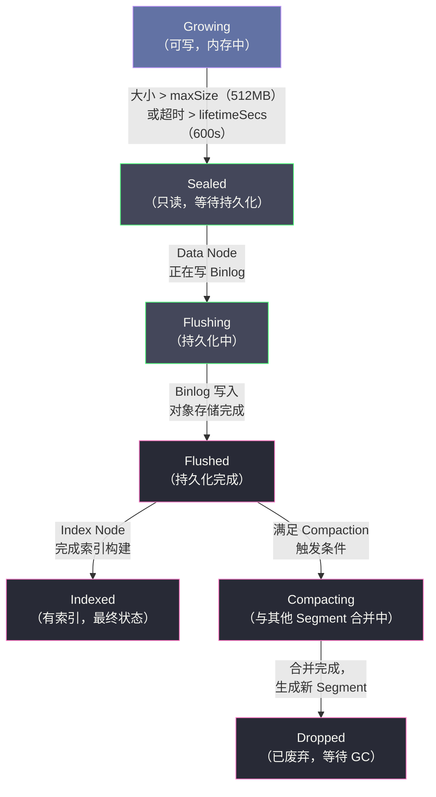

# 数据模型——Collection、Partition 与 Segment

## 摘要

Milvus 的数据模型是理解其写入行为、查询路由与索引管理的基础。数据按照 **Collection → Partition → Segment** 三级组织：Collection 是逻辑表，定义 Schema 和索引策略；Partition 是数据隔离的逻辑分组，支持查询裁剪；Segment 是物理存储与计算的基本单元，从 Growing 到 Indexed 的状态机驱动数据从实时写入到高效索引的完整生命周期。本文深入分析每一层的设计动机与实现细节，解析 **Binlog 文件格式**（Insert/Delete/Delta Log 的三种结构）、**Segment 的 Compaction 策略**（Small Compaction 与 Level Compaction），以及**批量数据导入**接口（Bulk Insert/Import API）的工作机制，帮助读者理解 Milvus 数据流转的完整链路。

---

## 第 1 章 Collection——Milvus 的逻辑表

### 1.1 Collection 与关系型数据库的类比

Milvus 的 **Collection** 在概念上类似于关系型数据库的"表"（Table）——它是数据的顶层逻辑组织单元，定义了数据的 Schema（字段类型和索引配置），所有对数据的 CRUD 操作都以 Collection 为范围。

但与关系型表有几个关键区别：

1. **Schema 必须包含向量字段**：每个 Collection 至少有一个 `FLOAT_VECTOR` 或 `BINARY_VECTOR` 字段，这是向量数据库的核心
2. **主键自动生成**：若不指定主键值，Milvus 可以自动分配全局唯一的 int64 ID
3. **不支持复杂 JOIN**：Milvus 的查询模型以向量相似度为核心，没有跨 Collection 的 JOIN 操作

### 1.2 Schema 设计——字段类型与约束

Milvus 支持的字段类型：

| 字段类型 | 说明 | 可用于过滤 | 可建向量索引 |
|----------|------|-----------|-------------|
| `INT8 / INT16 / INT32 / INT64` | 整数 | ✓ | ✗ |
| `FLOAT / DOUBLE` | 浮点数 | ✓ | ✗ |
| `BOOL` | 布尔 | ✓ | ✗ |
| `VARCHAR` | 变长字符串（max_length 参数） | ✓ | ✗ |
| `JSON` | JSON 字段，支持嵌套路径过滤 | ✓（部分路径） | ✗ |
| `ARRAY` | 数组字段，支持 ARRAY_CONTAINS 过滤 | ✓ | ✗ |
| `FLOAT_VECTOR` | 浮点向量（dim 参数，固定维度） | ✗ | ✓ |
| `BINARY_VECTOR` | 二值向量（dim 必须是 8 的倍数） | ✗ | ✓（Hamming 距离） |
| `SPARSE_FLOAT_VECTOR` | 稀疏浮点向量（Milvus 2.4+） | ✗ | ✓（IP 距离） |

**主键字段（Primary Key）** 的约束：
- 只能是 `INT64` 或 `VARCHAR`（Milvus 2.1+ 支持字符串主键）
- 每个 Collection 只能有一个主键字段
- `auto_id=True` 时，Milvus 自动分配 int64 主键（类似数据库的自增 ID，但不连续）

```python
# Schema 定义示例（知识库文档向量化存储）
from pymilvus import FieldSchema, CollectionSchema, DataType

fields = [
    FieldSchema(name="doc_id",    dtype=DataType.INT64,        is_primary=True, auto_id=True),
    FieldSchema(name="title",     dtype=DataType.VARCHAR,      max_length=256),
    FieldSchema(name="content",   dtype=DataType.VARCHAR,      max_length=65535),
    FieldSchema(name="category",  dtype=DataType.VARCHAR,      max_length=64),
    FieldSchema(name="pub_date",  dtype=DataType.INT64),       # Unix timestamp
    FieldSchema(name="score",     dtype=DataType.FLOAT),
    FieldSchema(name="tags",      dtype=DataType.ARRAY,        element_type=DataType.VARCHAR, max_capacity=10),
    FieldSchema(name="meta",      dtype=DataType.JSON),        # 灵活扩展字段
    FieldSchema(name="embedding", dtype=DataType.FLOAT_VECTOR, dim=1536),  # OpenAI text-embedding-3-small
]
schema = CollectionSchema(
    fields=fields,
    description="知识库文档向量化存储",
    enable_dynamic_field=True   # 允许插入 Schema 中未定义的额外字段（存储在 $meta 列）
)
```

### 1.3 Dynamic Field——Schema 弹性扩展

Milvus 2.2 引入了 **Dynamic Field**（`enable_dynamic_field=True`）：允许插入时包含 Schema 中未定义的任意字段，这些额外字段统一存储在一个名为 `$meta` 的 JSON 列中，支持通过路径语法过滤（如 `$meta["author"] == "张三"`）。

Dynamic Field 的设计动机：在实际业务中，数据的属性往往不固定，新增属性字段需要修改 Schema。Milvus 不支持 ALTER TABLE（修改 Schema 后需要重建 Collection），Dynamic Field 提供了一种低成本的弹性扩展方式，类似 MongoDB 的文档模型。

> [!warning] 生产避坑
> Dynamic Field 中的字段无法建立倒排索引，过滤时需要全量扫描 `$meta` JSON 列，在大规模场景下性能较差。若某个字段会被频繁用于过滤，应该在 Schema 中显式定义为独立字段，并根据需要建立标量索引（Inverted Index / Bitmap Index）。

---

## 第 2 章 Partition——数据隔离与查询裁剪

### 2.1 Partition 的定义与用途

**Partition** 是 Collection 内部的逻辑分组，用于将数据按某个维度（如时间、地域、业务线）划分为独立的子集。每个 Collection 创建时自动拥有一个名为 `_default` 的默认 Partition，用户可以创建更多 Partition。

Partition 的核心价值是**查询裁剪（Partition Pruning）**：若查询时指定了 `partition_names`，Milvus 只在这些 Partition 中搜索，跳过其他 Partition 的所有 Segment，减少计算量。

```python
# 创建 Partition
collection = Collection("docs")
collection.create_partition("tech_docs")      # 技术文档
collection.create_partition("news_2024")      # 2024 年新闻
collection.create_partition("news_2023")      # 2023 年新闻

# 指定 Partition 写入
collection.insert(data=[...], partition_name="tech_docs")

# 指定 Partition 查询（只搜索 2024 年新闻，忽略其他 Partition）
results = collection.search(
    data=[query_embedding],
    anns_field="embedding",
    param={"metric_type": "COSINE", "params": {"ef": 64}},
    limit=10,
    partition_names=["news_2024"]   # 查询裁剪
)
```

**Partition 的数量限制**：Milvus 默认每个 Collection 最多 4096 个 Partition（可配置），但实际使用时建议不超过 1024 个——每个 Partition 都会消耗元数据资源（etcd 存储），且 Query Coordinator 需要维护每个 Partition 的 Segment 分布信息，过多 Partition 会增加协调开销。

### 2.2 Partition Key——自动路由写入

Milvus 2.2 引入了 **Partition Key** 机制：将某个标量字段标记为 `is_partition_key=True`，Milvus 在写入时根据该字段的值自动将数据路由到不同的内部 Partition（Milvus 在幕后自动创建 16~4096 个 Partition，对用户透明）。

```python
fields = [
    FieldSchema(name="user_id",   dtype=DataType.INT64,        is_primary=True),
    FieldSchema(name="region",    dtype=DataType.VARCHAR,       is_partition_key=True,  max_length=16),
    FieldSchema(name="embedding", dtype=DataType.FLOAT_VECTOR,  dim=768),
]
```

写入时，`region="us-west"` 的数据会被路由到专门处理 `us-west` 哈希值的内部 Partition，查询时若指定 `expr="region == 'us-west'"` 会自动触发 Partition 裁剪，效果与手动管理 Partition 相同，但免去了手动路由的编码工作。

Partition Key 适合**高基数标量字段**（如用户 ID、租户 ID、地域等）的隔离需求。

---

## 第 3 章 Segment——物理存储的基本单元

### 3.1 Segment 的设计动机

**Segment** 是 Milvus 中物理存储和计算调度的最小粒度单元。将数据切分为多个 Segment 有以下好处：

1. **负载均衡**：不同 Segment 可以分配到不同的 Query Node，实现查询负载的均衡分配
2. **索引隔离**：每个 Segment 独立建立向量索引，索引构建任务可以并行执行
3. **增量写入支持**：新写入的数据先进入 Growing Segment（无索引），旧数据在 Sealed Segment（有索引）。两类 Segment 并存，实现了实时写入与高效检索的共存
4. **Compaction 粒度**：小 Segment 合并为大 Segment 的操作（Compaction）以 Segment 为单位执行

每个 Collection 在任意时刻通常有：
- 1~多个 **Growing Segment**：接收当前的写入流量
- 若干个 **Sealed/Indexed Segment**：历史数据，有向量索引

### 3.2 Segment 的完整状态机



**状态说明**：

| 状态 | 数据位置 | 是否接受写入 | 是否可查询 | 是否有索引 |
|------|----------|-------------|-----------|-----------|
| Growing | Query Node 内存 + 消息队列 | ✓ | ✓（暴力搜索） | ✗ |
| Sealed | Data Node 内存（等待刷盘） | ✗ | ✓ | ✗ |
| Flushing | Data Node 正在写 S3 | ✗ | ✓ | ✗ |
| Flushed | 对象存储（S3） | ✗ | ✓（暴力或 ANN，取决于是否有索引） | ✗（索引构建中）|
| Indexed | 对象存储（S3 + 索引文件） | ✗ | ✓（ANN 索引加速） | ✓ |
| Dropped | 对象存储（等待 GC） | ✗ | ✗ | N/A |

### 3.3 Segment 大小与数量规划

Segment 的大小由 `dataCoord.segment.maxSize` 参数控制（默认 512MB，最大 2GB）。选择合适的 Segment 大小需要在以下方面权衡：

**较小的 Segment（如 128MB）**：
- 优点：Flush 速度快，索引构建并行度高（多个 Segment 并行构建），Growing 阶段数据更快变为 Indexed
- 缺点：产生大量小 Segment 文件，导致更多 Segment 需要加载到 Query Node，Query Node 内存开销增大；对象存储的文件数量过多，可能触发 Compaction

**较大的 Segment（如 2GB）**：
- 优点：每个 Query Node 加载的 Segment 数量少，元数据开销小；索引效率高（一个大 HNSW 图比多个小图的总体查询效率更高）
- 缺点：每次 Flush 和索引构建耗时更长，新写入数据变为 Indexed 的延迟更高

**实践建议**：对于 768 维 float32 向量，512MB 的 Segment 约包含 17 万条向量；若系统中 Collection 的向量数量在千万级以上，使用 1~2GB 的 Segment 大小以减少 Segment 总数量。

---

## 第 4 章 Binlog——Segment 的持久化格式

### 4.1 什么是 Binlog

**Binlog** 是 Milvus 中对象存储中数据的实际存储格式，类似于 [[MySQL InnoDB]] 的 binlog 或 [[Kafka]] 的日志文件。每个 Segment 的数据在对象存储中表示为多个 Binlog 文件，分为三类：

1. **Insert Binlog**：存储插入操作的向量和标量字段数据
2. **Delete Binlog（Delta Log）**：存储删除操作的主键 ID 列表
3. **Statistics Binlog**：存储 Segment 的统计信息（如每个标量字段的最小值/最大值，用于查询时的元数据过滤）

### 4.2 Insert Binlog 的文件结构

每个 Insert Binlog 文件对应一个 Segment 的**单个字段**（列存格式）——不同字段存储在不同的 Binlog 文件中。这种列存（Column Store）设计与 [[Clickhouse]] 的列存引擎类似：

```
对象存储中的 Segment 文件组织（Segment ID = 1001）：

root_path/
  segments/
    1001/                           ← Segment 根目录
      insert_log/
        1001/0/                     ← Field 0（doc_id，主键字段）
          binlog-1001-0-0.bin       ← 第一批写入的主键数据
          binlog-1001-0-1.bin       ← 第二批写入的主键数据
        1001/1/                     ← Field 1（title 字段）
          binlog-1001-1-0.bin
        1001/5/                     ← Field 5（embedding 向量字段）
          binlog-1001-5-0.bin       ← 向量数据（float32 × dim × N 条）
      delta_log/
        1001/
          delta-1001-0.bin          ← 删除记录（主键 ID 列表 + 时间戳）
      stats_log/
        1001/
          stats-1001.bin            ← 统计信息
```

**列存的查询优势**：若查询只需要主键和向量字段（不需要 title、category 等标量字段），Query Node 只需加载对应的 Binlog 文件，不需要读取无关字段的数据，减少 IO 开销。这在 Projection Pushdown（投影下推）场景下效果显著。

### 4.3 Delete Binlog（Delta Log）的处理

Milvus 的删除操作与 [[LevelDB]] 的 Tombstone 机制类似——不直接从存储中移除数据，而是记录一条"删除标记"。

**Delete 流程**：
1. 客户端调用 `collection.delete(expr="doc_id in [1001, 1002, 1003]")`
2. Proxy 将删除的主键 ID 列表写入消息队列（带时间戳）
3. Data Node 消费消息队列，将删除记录追加写入 Delta Binlog 文件
4. Query Node 消费消息队列，在内存中维护一个删除标记集合（Bloom Filter + 精确列表）

**查询时的删除过滤**：Query Node 在返回搜索结果之前，检查每个候选向量的主键是否在删除集合中，若已删除则从结果中剔除。

**删除数据的真正清理**：发生在 Compaction 时——当多个 Segment 合并时，Compaction 进程读取所有输入 Segment 的 Insert Binlog 和 Delta Binlog，排除已删除的主键，只将有效数据写入新 Segment，彻底清理删除标记和对应的向量数据。

---

## 第 5 章 Segment Compaction——小文件合并策略

### 5.1 为什么需要 Compaction

随着持续写入，Milvus 会产生大量小 Segment（特别是在写入速率不高的情况下，每个 Growing Segment 达到阈值前包含的数据量较少）。过多的小 Segment 会导致：

- **Query Node 内存碎片**：每个 Segment 需要加载到 Query Node 内存，大量小 Segment 的总内存开销远高于等量数据在少量大 Segment 中的开销（每个 Segment 有固定的元数据和索引结构开销）
- **查询性能下降**：查询时需要在所有 Segment 上并行搜索，Segment 越多，协调开销越大
- **索引构建低效**：小 Segment 的 HNSW 图质量不如大 Segment（小图的邻居多样性差），且每个 Segment 独立构建索引会产生重复的计算开销

Compaction 通过将多个小 Segment 合并为大 Segment，解决上述问题。

### 5.2 两种 Compaction 策略

**Small Compaction（小合并）**：将多个相邻的 Flushed/Indexed Segment 合并为一个更大的 Segment，触发条件是存在多个比 `dataCoord.compaction.min_segment_rows`（默认 Segment 的 10%）更小的 Segment。

**Level Compaction（分级合并，Milvus 2.4+ 引入）**：参考 LSM-Tree 的分层合并思想（见 [[04 Compaction——分层合并与版本管理]]），将 Segment 按大小分为多级，低级的小 Segment 不断合并晋升到高级，最终形成少量大 Segment。这减少了删除标记的积压和重复版本的占用。

### 5.3 Compaction 的执行过程

```
Compaction 执行步骤（以 Small Compaction 为例）：

1. Data Coordinator 检测到多个小 Segment（A, B, C，大小均 < 50MB）
2. Data Coordinator 创建 Compaction 任务，分配给 Data Node

3. Data Node 执行合并：
   a. 从对象存储加载 Segment A、B、C 的所有 Insert Binlog
   b. 从对象存储加载 Segment A、B、C 的所有 Delta Binlog（删除记录）
   c. 按主键 ID 排序，过滤掉已删除的主键
   d. 将剩余有效数据写入新 Segment D 的 Binlog 文件

4. Data Node 完成后，通知 Data Coordinator

5. Data Coordinator 更新元数据：
   - 将 Segment A、B、C 标记为 Dropped（等待 GC）
   - 将 Segment D 注册为 Flushed

6. Index Coordinator 感知到新的 Flushed Segment D，
   调度 Index Node 为 D 构建向量索引

7. 旧 Segment（A、B、C）的文件在 GC 延迟时间后从对象存储删除
```

---

## 第 6 章 批量数据导入——Bulk Insert

### 6.1 流式插入 vs 批量导入的对比

Milvus 支持两种数据写入方式：

**流式插入（Streaming Insert）**：通过 `collection.insert()` 接口，数据先写入消息队列，再由 Data Node 消费持久化。适合实时写入场景，每次插入数据量通常在几百~几万条。

**批量导入（Bulk Insert/Import）**：通过 `utility.do_bulk_insert()` 接口，将预先准备好的数据文件（Parquet、JSON、Numpy 格式）直接导入到对象存储，绕过消息队列，适合一次性大批量数据导入（如初始化知识库，导入数百万~数亿条向量）。

| 对比维度 | 流式插入 | 批量导入 |
|----------|---------|---------|
| **吞吐量** | 低~中（受消息队列限制） | 高（直接写对象存储，可并发） |
| **导入延迟** | 低（秒级可见） | 高（分钟~小时级） |
| **格式要求** | JSON/Python dict | Parquet / JSON / Numpy |
| **适用场景** | 实时写入，小批量 | 全量数据初始化，离线 ETL |
| **资源消耗** | 消耗消息队列带宽 | 消耗对象存储写 IO |

### 6.2 Bulk Insert 的工作原理

Bulk Insert 通过将数据文件（如 Parquet 格式）直接上传到对象存储，再让 Milvus 解析这些文件并注册为 Segment，绕过消息队列的带宽限制：

```python
# Bulk Insert 使用示例

# 1. 准备 Parquet 格式文件（向量 + 标量字段）
import pandas as pd
import pyarrow as pa
import pyarrow.parquet as pq

df = pd.DataFrame({
    "doc_id": list(range(1000000)),      # 100 万条数据
    "title": ["doc_" + str(i) for i in range(1000000)],
    "embedding": [list(random_vector()) for _ in range(1000000)],
})
pq.write_table(pa.Table.from_pandas(df), "/tmp/batch_data.parquet")

# 2. 上传文件到 MinIO（或 S3）
from minio import Minio
client = Minio("localhost:9000", ...)
client.fput_object("milvus-bucket", "import/batch_data.parquet", "/tmp/batch_data.parquet")

# 3. 触发 Bulk Insert
from pymilvus import utility
task_id = utility.do_bulk_insert(
    collection_name="docs",
    files=["import/batch_data.parquet"],
)

# 4. 等待导入完成
import time
while True:
    state = utility.get_bulk_insert_state(task_id=task_id)
    if state.state_name in ["Completed", "Failed"]:
        break
    time.sleep(5)
```

**Bulk Insert 的内部流程**：
1. Root Coordinator 接收 Bulk Insert 请求，创建导入任务
2. Data Node 读取对象存储中的 Parquet 文件，解析为行数据
3. Data Node 将数据分配到一个或多个新 Segment，写出 Binlog 文件
4. Data Node 上报完成，Data Coordinator 将新 Segment 注册为 Flushed 状态
5. Index Coordinator 调度 Index Node 构建索引

---

## 第 7 章 小结

### 7.1 数据模型的层次结构总结

Milvus 的数据模型体现了从逻辑到物理的清晰分层：

```
Collection（逻辑表，Schema 定义）
    ├── Partition A（逻辑分组，查询裁剪）
    │       ├── Segment-001（Growing，实时写入）
    │       ├── Segment-002（Indexed，历史数据）
    │       └── Segment-003（Flushed，待建索引）
    └── Partition B
            ├── Segment-004（Indexed）
            └── ...

对象存储（物理存储）：
    segments/
        001/insert_log/（向量 + 标量 Binlog，列存）
        001/delta_log/（删除记录）
        002/insert_log/ + 索引文件（HNSW/IVF）
```

### 7.2 后续章节导引

- **[[04 查询引擎——混合检索与过滤]]**：深入查询执行计划，理解向量 ANN 搜索与标量布尔过滤的协同策略，分析分布式查询的精度控制
- **[[05 Milvus 在 RAG 场景中的应用]]**：从工程实践角度，讲解如何将 Milvus 作为 RAG 系统的向量检索后端，包括 Embedding 选型、文档分块、混合检索等最佳实践
