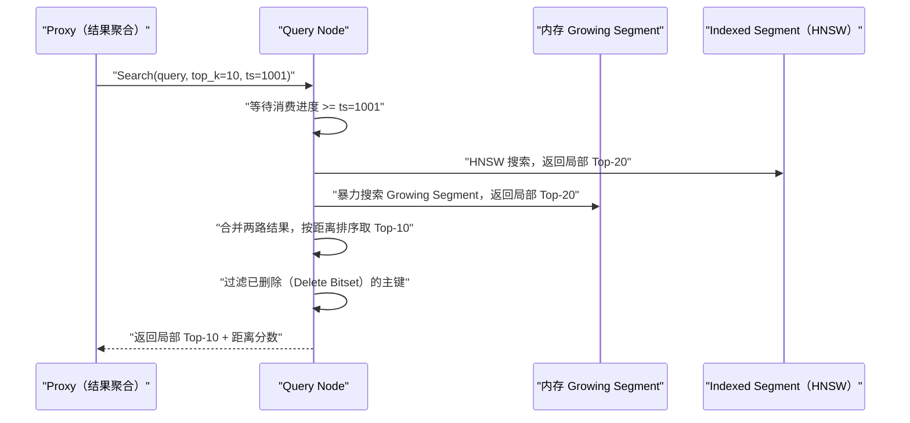

# 查询引擎——混合检索与过滤

## 摘要

实际业务中的向量检索几乎从不是"纯向量相似度"查询，而是"在满足若干条件的数据子集中，找语义最相近的 K 个"。例如"找与此文章语义最近的、发布于 2024 年、属于技术类别的、且未被删除的文档"。这类查询将**向量 ANN 搜索**与**标量布尔过滤**结合在一起，称为**混合检索（Hybrid Search / Filtered Vector Search）**。本文深度解析 Milvus 查询引擎的执行机制：从客户端的查询 DSL 如何被解析为执行计划，到标量过滤与向量搜索的两种协同策略（Pre-Filter 与 Post-Filter），再到分布式场景下多 Segment 的并行搜索与全局归并，最后分析 Milvus 2.4 引入的**稀疏+稠密混合检索（Sparse-Dense Hybrid）** 的 RRF 融合算法。理解这些机制，是对 Milvus 进行查询调优的基础。

---

## 第 1 章 查询类型的全景

### 1.1 Milvus 支持的查询模式

Milvus 的查询接口分为三类，面向不同的业务场景：

**Search（向量搜索）**：给定查询向量，返回 Top-K 最近邻，支持带标量过滤条件。这是 Milvus 最核心的功能，对应 `collection.search()` API。

**Query（标量查询）**：纯标量条件查询，类似关系型数据库的 `SELECT * WHERE conditions`，不涉及向量相似度排序，返回满足条件的所有（或限定数量的）实体。对应 `collection.query()` API。

**Hybrid Search（混合搜索，Milvus 2.4+）**：同时在稠密向量和稀疏向量字段上搜索，通过 RRF（Reciprocal Rank Fusion）或 WeightedRanker 融合两路结果，返回综合排名的 Top-K。对应 `AnnSearchRequest` + `collection.hybrid_search()` API。

### 1.2 查询表达式（Boolean Expression）

Milvus 使用类似 SQL WHERE 子句的**布尔表达式**进行标量过滤，支持：

```python
# 基本比较运算符
"score > 0.8"
"pub_date >= 20240101"
"category == 'tech'"

# 逻辑运算符
"score > 0.8 and category == 'tech'"
"category == 'news' or category == 'blog'"
"not (category == 'spam')"

# IN 运算符
"doc_id in [1001, 1002, 1003]"
"category not in ['spam', 'ads']"

# LIKE 运算符（模糊匹配，需要 VARCHAR 字段建立标量索引）
"title like 'AI%'"    # 前缀匹配

# ARRAY 字段操作
"array_contains(tags, 'Python')"
"array_contains_any(tags, ['Java', 'Go', 'Python'])"
"array_length(tags) > 3"

# JSON 字段路径访问
"meta['author'] == '张三'"
"meta['views'] > 1000"
"json_contains(meta['keywords'], 'AI')"

# 范围表达式
"1000 < doc_id < 5000"
"20240101 <= pub_date <= 20241231"
```

这些表达式在 Milvus 内部被解析为**抽象语法树（AST）**，再转换为可执行的过滤计划（Filter Plan），下推到 Segment 级别执行。

---

## 第 2 章 标量索引——加速过滤的基础设施

### 2.1 为什么需要标量索引

不建立标量索引时，过滤一个字段需要扫描 Segment 中所有行的该字段值（全表扫描），在千万级 Segment 上代价较高。Milvus 为标量字段提供了多种索引类型，加速过滤执行：

**Inverted Index（倒排索引）**：为 VARCHAR、INT 等类型字段构建词项到行 ID 的映射，适合**精确匹配**和**IN 查询**。例如 `category == 'tech'` 通过倒排索引直接定位所有 `category='tech'` 的行 ID，无需扫描。

**Bitmap Index（位图索引）**：为低基数字段（如 `category` 只有几十种取值）构建位图，每个取值一个 bit 向量，通过位运算执行过滤，速度极快。适合基数 < 1000 的枚举型字段。

**STL Sort（排序索引）**：将字段值排序存储，支持**范围查询**（`pub_date >= 20240101`）的二分查找加速。适合数值型和时间戳型字段。

**Trie 索引**：为 VARCHAR 字段建立前缀树，支持高效的**前缀匹配**（`title like 'AI%'`）。

```python
# 为标量字段创建索引
from pymilvus import Collection

collection = Collection("docs")

# 为 category 字段创建倒排索引
collection.create_index(
    field_name="category",
    index_params={"index_type": "INVERTED"}
)

# 为 pub_date 字段创建排序索引（范围查询）
collection.create_index(
    field_name="pub_date",
    index_params={"index_type": "STL_SORT"}
)

# 为 tags 数组字段创建倒排索引
collection.create_index(
    field_name="tags",
    index_params={"index_type": "INVERTED"}
)
```

### 2.2 标量索引在 Segment 中的存储

标量索引文件与向量索引文件一起存储在对象存储中，由 Index Node 在 Segment 的 Flushed 状态后统一构建。标量索引的构建速度通常远快于向量索引——对于 INT64 字段，构建千万行的排序索引只需几秒；而构建千万向量的 HNSW 索引可能需要数小时。

当 Query Node 加载 Indexed Segment 时，会同时加载该 Segment 的向量索引和所有标量索引到内存，为后续查询做好准备。

---

## 第 3 章 Pre-Filter vs Post-Filter——两种协同策略

### 3.1 核心问题：过滤与搜索哪个先做？

混合检索面临一个根本性的设计选择：标量过滤和向量 ANN 搜索应该**串行**还是**并行**，哪个先执行？

这两种执行策略各有适用场景：

**Pre-Filter（先过滤后搜索）**：先执行标量过滤，得到满足条件的行 ID 集合（候选集），再对这个候选集执行向量搜索（只在候选集中计算距离）。

**Post-Filter（先搜索后过滤）**：先执行向量 ANN 搜索，得到一批 Top-K 候选，再对这批候选执行标量过滤，丢弃不满足条件的结果。若过滤后剩余不足 K 个，可能需要多次迭代搜索更多候选。

### 3.2 Pre-Filter 的实现与适用场景

Pre-Filter 的执行流程：

```
Pre-Filter 执行流程（对某个 Indexed Segment）：

1. 执行标量过滤：
   利用 category 的倒排索引，找到所有 category='tech' 的行 ID 集合：
   RowIdSet = {v100, v203, v501, v1024, ..., v98765}（共 N_filtered 个）

2. 构建 BitSet（位图）：
   创建一个大小为 Segment 总行数的位图，
   RowIdSet 中的每个 ID 对应的 bit 置为 1（允许搜索），其余置为 0

3. 带 BitSet 的向量搜索：
   将 BitSet 传入 HNSW/IVF 的搜索函数，
   ANN 搜索在遍历邻居时，自动跳过 BitSet 中 bit=0 的节点

4. 返回满足过滤条件的 Top-K 结果
```

**Pre-Filter 的优势**：
- 结果精确：返回的 Top-K 一定是满足过滤条件的（不会有不满足条件的结果混入）
- 适合**过滤率高**的场景（如只有 1% 的数据满足条件），大幅减少向量距离计算量

**Pre-Filter 的局限**：
- 当候选集很小（如只有几十条满足条件），HNSW 的图导航会频繁跳过节点，导航路径变长，反而可能比暴力搜索更慢
- 当 BitSet 中置为 1 的比例很低（稀疏过滤），HNSW 的导航可能陷入"局部最优陷阱"——所有近邻都被过滤掉，找不到合法的前进方向，导致 Recall 下降

### 3.3 Post-Filter 的实现与适用场景

Post-Filter 的执行流程：

```
Post-Filter 执行流程：

1. 执行向量 ANN 搜索（不考虑过滤条件）：
   检索全量向量，返回 Top-(K ×扩展系数) 个候选
   （扩展系数通常为 2~5，补偿过滤后可能不足 K 个）

2. 对候选结果逐一执行标量过滤：
   丢弃不满足 "category == 'tech'" 的候选

3. 若过滤后剩余 < K：
   迭代：增大搜索范围（ef 或 nprobe），重新搜索
   直到得到 K 个满足条件的结果或达到最大迭代次数

4. 返回满足过滤条件的 Top-K 结果
```

**Post-Filter 的优势**：
- 向量搜索不受过滤条件干扰，HNSW 图导航路径质量高，Recall 有保证
- 适合**过滤率低**的场景（如 90% 的数据都满足条件），此时 Top-(K×2) 个候选中过滤掉的很少，不需要大量迭代

**Post-Filter 的局限**：
- 当过滤率极高（如只有 0.1% 满足条件），Top-(K×5) 个候选中可能仍然凑不够 K 个，需要大量迭代，延迟剧增
- 最终返回的结果实际上不是严格意义上的全局 Top-K（因为 ANN 搜索本身就是近似的，再加上后过滤，精度损失叠加）

### 3.4 Milvus 的自适应策略

Milvus 不是固定选择 Pre-Filter 或 Post-Filter，而是根据**过滤率（Selectivity）**动态选择：

```
Milvus 查询策略选择逻辑（简化）：

预估 N_filtered = 标量过滤后的预期行数（通过统计信息估算）
N_total = Segment 总行数
Selectivity = N_filtered / N_total

if Selectivity < 0.1 (过滤很严格，只有 < 10% 数据通过):
    使用 Pre-Filter（先过滤，大幅减少向量搜索空间）
    若 N_filtered < 阈值（如 1000）:
        直接暴力搜索（不使用 ANN 索引）

elif Selectivity > 0.8 (过滤很宽松，> 80% 数据通过):
    使用 Post-Filter（先搜索 Top-K×2，过滤后补充）

else (中等过滤率):
    使用 Pre-Filter + HNSW（BitSet 过滤与图导航结合）
```

Selectivity 的估算依赖**标量字段的统计信息**（Statistics Binlog 中记录的每个字段的最小值、最大值、基数估计），这也是为什么 Statistics Binlog 是 Segment 中不可缺少的组成部分。

> [!info] 核心概念
> **为什么过滤率极低时直接走暴力搜索？** 当 N_filtered 只有几百条时，HNSW 图导航找到一条到这几百个节点的路径，比直接扫描这几百个节点更慢（图导航的常数项开销远大于顺序比较）。Milvus 在 N_filtered 低于阈值时，自动退化为暴力搜索（Flat），避免 ANN 索引的额外开销带来负向收益。

---

## 第 4 章 分布式查询的精度控制

### 4.1 分布式查询的精度问题

在 [[01 Milvus 全局架构——存算分离与云原生设计]] 中介绍过，Milvus 的 Search 请求被分发到多个 Query Node，每个 Query Node 在其持有的 Segment 上执行局部 Top-K 搜索，最后由 Proxy 执行全局归并。

这里存在一个精度问题：**每个 Query Node 返回其局部 Top-K，全局归并后的结果是否与全局精确 Top-K 一致？**

答案是：**不一定**。具体分析：

假设有 3 个 Query Node，每个持有 1/3 的数据，查询 Top-10。若 Query Node 1 只返回其局部 Top-10，Proxy 对三个节点的结果（共 30 条）取全局 Top-10，这 10 条是所有 30 条候选中距离最近的。但问题是：Query Node 1 的第 11、12、...名，可能在全局排序中比 Query Node 2、3 的第 1~10 名更靠前，但由于 Query Node 1 只返回了 10 条，这些"隐藏的近邻"被丢失了。

**解决方案**：要求每个 Query Node 返回更多候选（而不只是 K 条），扩展系数 `roundDecimal` 和内部参数控制了每个节点实际返回的候选数量。一般情况下，节点数越多，每个节点需要返回的候选数越大，以确保全局 Top-K 的精度。

Milvus 的默认行为是每个 Query Node 返回 `K` 条结果（不做扩展），这在以下条件下是精确的：
- 数据在各 Query Node 上均匀分布
- 查询向量的近邻分散在各 Segment 中（不集中）

若业务对精度要求很高，可以通过在 `search_params` 中设置更大的 `ef` 或 `nprobe` 来弥补，让每个 Query Node 内部的搜索质量更高，间接提升全局精度。

### 4.2 Guarantee Timestamp 与一致性级别

Milvus 支持四种**一致性级别（Consistency Level）**，控制查询时的数据可见性：

| 一致性级别 | 含义 | 延迟影响 | 适用场景 |
|-----------|------|---------|---------|
| **Strong** | 保证能看到所有已确认写入的最新数据 | 高（需等待 QN 消费到最新 TS） | 强一致性要求，如金融交易 |
| **Session** | 保证能看到本会话之前所有写入的数据 | 中（等待本会话的 TS） | 默认模式，适合大多数场景 |
| **Bounded Staleness** | 允许读取 T 秒前的历史快照 | 低 | 可以接受短暂延迟的业务 |
| **Eventually** | 不保证读写一致，直接查询当前 QN 状态 | 最低 | 允许短暂不一致，追求最低延迟 |

**Guarantee Timestamp 机制**（Session 级别）：

```
写入时：
  SDK → Proxy → 消息队列
  Proxy 返回给 SDK 时携带 MutationResult.timestamp = 1001

查询时（Session 一致性）：
  SDK 在 search_params 中携带 guarantee_timestamp = 1001
  
  Proxy → Query Coordinator → Query Node
  Query Node 检查当前已消费到的 msgstream.ServiceTime：
    若 ServiceTime >= 1001：立即执行查询
    若 ServiceTime < 1001：等待消费到 TS 1001 后再执行
```

这个设计保证了"写后立读"的一致性：用户插入数据后，用返回的时间戳执行查询，一定能看到刚才插入的数据（不受 Query Node 消费进度的影响）。

---

## 第 5 章 混合检索——稀疏+稠密向量融合

### 5.1 为什么需要混合检索

纯语义检索（稠密向量）在以下场景表现不佳：

**专业术语和缩写**：查询"RAG"，语义模型可能把它理解为"破布"（rag 的英文含义），而不是"Retrieval-Augmented Generation"。关键词精确匹配能更准确地处理这类查询。

**新概念和最新词汇**：Embedding 模型的训练数据有截止日期，对于训练后出现的新概念（如 GPT-5 发布后相关的技术术语），语义模型可能表示不准，而关键词匹配总是精确的。

**代码搜索**：代码中的函数名、变量名、API 名称需要精确匹配，纯语义搜索可能找到语义相关但完全不同的代码片段。

**混合检索**同时使用：
- **稠密向量**（Dense Vector）：捕捉语义相似度，适合模糊概念匹配
- **稀疏向量**（Sparse Vector，通常是 BM25 或 SPLADE 模型输出）：捕捉关键词精确匹配

### 5.2 BM25——稀疏向量的主流实现

**BM25（Best Match 25）** 是信息检索领域最经典的关键词相似度算法，Elasticsearch 默认就使用 BM25 作为相关性评分。

BM25 的输出是一个稀疏向量——词汇表中每个词对应一个维度，值为该词在文档中的 BM25 权重（大多数词的权重为 0，只有文档中实际出现的词有非零权重）：

```
BM25 稀疏向量示意（词汇表大小=30000）：

文档："深度学习在自然语言处理中的应用"

稀疏向量（非零维度）：
  词[深度]:       5234  → weight: 2.1
  词[学习]:       8901  → weight: 1.8
  词[自然语言]:   15678 → weight: 3.2
  词[处理]:       12345 → weight: 1.5
  词[应用]:       7890  → weight: 1.2
  ... 其他 29995 个维度的权重均为 0

以 {5234: 2.1, 8901: 1.8, 15678: 3.2, 12345: 1.5, 7890: 1.2} 的形式存储
```

Milvus 2.5 引入了**内置 BM25 支持**（`SPARSE_FLOAT_VECTOR` 字段 + `BM25` 函数），不需要用户手动计算 BM25 向量，只需将原始文本写入，Milvus 自动完成分词和 BM25 权重计算。

### 5.3 RRF——两路结果的融合算法

**RRF（Reciprocal Rank Fusion，倒数排名融合）** 是 Milvus Hybrid Search 中用于融合稠密检索和稀疏检索结果的默认算法，由 Cormack 等人在 2009 年提出。

RRF 的思想极其简单：对于同一个文档，在每路检索中获得的排名越高（排名越靠前），最终得分越高；两路检索都排名靠前的文档，最终得分最高。

**RRF 公式**：
$$\text{RRF\_Score}(d) = \sum_{i=1}^{n} \frac{1}{k + \text{rank}_i(d)}$$

其中：
- $n$：参与融合的检索路数（通常为 2：稠密 + 稀疏）
- $\text{rank}_i(d)$：文档 $d$ 在第 $i$ 路检索结果中的排名（从 1 开始）
- $k$：平滑参数（默认 60），防止排名为 1 的文档得分过高

```
RRF 融合示例：

稠密向量搜索结果：   稀疏向量（BM25）搜索结果：
  1. 文档A (cos=0.95)    1. 文档C (bm25=15.3)
  2. 文档B (cos=0.91)    2. 文档A (bm25=12.1)
  3. 文档C (cos=0.88)    3. 文档D (bm25=8.7)
  4. 文档D (cos=0.82)    4. 文档B (bm25=6.2)

RRF 得分（k=60）：
  文档A：1/(60+1) + 1/(60+2) = 0.01639 + 0.01613 = 0.03252
  文档C：1/(60+3) + 1/(60+1) = 0.01587 + 0.01639 = 0.03226
  文档B：1/(60+2) + 1/(60+4) = 0.01613 + 0.01563 = 0.03176
  文档D：1/(60+4) + 1/(60+3) = 0.01563 + 0.01587 = 0.03150

最终排名：文档A > 文档C > 文档B > 文档D
```

RRF 的优势在于：**不需要校准两路检索的分数到同一尺度**。稠密检索的余弦相似度（0~1）和 BM25 的相关性得分（0~20+）不在同一量级，直接加权平均会产生不合理的结果；而 RRF 只关注排名（整数），完全不受分数数值的影响。

### 5.4 Hybrid Search 的 Milvus API

```python
from pymilvus import Collection, AnnSearchRequest, RRFRanker, WeightedRanker

collection = Collection("docs")

# 稠密向量搜索请求
dense_req = AnnSearchRequest(
    data=[query_dense_embedding],       # float32 稠密向量
    anns_field="embedding",
    param={"metric_type": "COSINE", "params": {"ef": 100}},
    limit=20,                           # 每路召回 20 条候选
    expr="pub_date >= 20240101"         # 可以带标量过滤
)

# 稀疏向量搜索请求（BM25）
sparse_req = AnnSearchRequest(
    data=[query_sparse_vector],         # 稀疏向量（dict 格式）
    anns_field="sparse_embedding",
    param={"metric_type": "IP", "params": {"drop_ratio_search": 0.2}},
    limit=20,
)

# RRF 融合（默认，推荐）
results = collection.hybrid_search(
    reqs=[dense_req, sparse_req],
    rerank=RRFRanker(k=60),
    limit=10,                           # 最终返回 Top-10
    output_fields=["title", "category"]
)

# 或者使用 WeightedRanker（按权重加权平均分数）
# 需要两路分数在同一尺度（通常需要归一化）
results = collection.hybrid_search(
    reqs=[dense_req, sparse_req],
    rerank=WeightedRanker(0.7, 0.3),    # 稠密权重 0.7，稀疏权重 0.3
    limit=10,
)
```

---

## 第 6 章 Growing Segment 的查询处理

### 6.1 实时写入与查询的并发

Growing Segment 中的数据来自消息队列的实时消费，Query Node 在内存中维护 Growing Segment 的完整数据。查询时，Query Node 需要同时搜索 Indexed Segment（有 ANN 索引）和 Growing Segment（无索引，暴力搜索），再合并局部结果。

**Growing Segment 的查询隔离**：Growing Segment 中的数据不断增长（消息队列消费到的新数据不断追加），查询操作需要获取某个时刻的快照（基于 Guarantee Timestamp）。Milvus 在执行查询前，确定一个"查询时间点"的数据范围，只搜索该时间点之前的数据，屏蔽后续写入的影响。

**Delete 的实时处理**：Delete 操作写入消息队列后，Query Node 也会消费 Delete 消息，在内存中维护一个删除标记集合（Primary Key Set）。搜索 Growing Segment 时，会过滤掉已被标记删除的向量，保证查询结果的正确性。

### 6.2 Growing 与 Sealed Segment 的搜索合并



**为什么 Growing Segment 走暴力搜索？** Growing Segment 的数据不断增长，为其建立 ANN 索引需要不断重建（每次写入都可能改变近邻关系），代价过高。实践中 Growing Segment 的数据量通常不超过 512MB（一个 Segment 的大小上限），暴力搜索的延迟在几十毫秒以内，可以接受。一旦 Growing Segment 变为 Sealed 并完成索引构建（通常在数分钟到数小时后），后续查询就走 ANN 索引了。

---

## 第 7 章 查询优化最佳实践

### 7.1 标量过滤的优化策略

**优先为频繁过滤字段建立标量索引**：
- 数值型字段（INT、FLOAT）：建立 STL_SORT 索引，支持范围查询
- 枚举型字段（低基数 VARCHAR）：建立 BITMAP 索引，位运算速度极快
- 高基数 VARCHAR 字段：建立 INVERTED 索引，支持精确匹配和 IN 查询

**避免对 JSON 字段的动态路径做高频过滤**：JSON 字段的路径访问（如 `meta['author']`）无法通过标量索引加速，每次都需要解析 JSON，代价较高。若某个 JSON 路径被频繁过滤，应将其提取为独立的 Schema 字段。

**Partition 裁剪的最大化利用**：若业务的查询通常只涉及数据集的一个子集（如按时间分区、按租户分区），务必通过 Partition Key 或手动 Partition 管理，在查询时指定 `partition_names`，避免全 Collection 扫描。

### 7.2 向量搜索的参数调优

| 参数 | 索引类型 | 增大的效果 | 减小的效果 |
|------|----------|-----------|-----------|
| `ef` | HNSW | Recall ↑，QPS ↓ | Recall ↓，QPS ↑ |
| `nprobe` | IVF_* | Recall ↑，QPS ↓ | Recall ↓，QPS ↑ |
| `ef_construction` | HNSW（构建） | 索引质量 ↑，构建时间 ↑ | 索引质量 ↓，构建时间 ↓ |
| `nlist` | IVF_*（构建） | 聚类精度 ↑，构建时间 ↑ | 聚类精度 ↓，构建时间 ↓ |

**调优原则**：先确定业务可接受的 Recall 下限（如 95%），然后在满足 Recall 要求的前提下，尽量减小 `ef` 或 `nprobe` 以提升 QPS。可以通过 Milvus 的 `utility.calc_distance()` 工具计算采样数据上的实际 Recall，指导参数选择。

### 7.3 常见查询性能问题排查

| 问题现象 | 可能原因 | 排查方向 |
|----------|---------|---------|
| 查询延迟高（P99 > 500ms） | Growing Segment 占比大 | 检查索引构建进度，增加 Index Node |
| Recall 低于预期 | ef/nprobe 太小 | 增大搜索参数；检查 Segment 数据分布 |
| 标量过滤慢 | 缺少标量索引 | 为频繁过滤字段建立对应类型的标量索引 |
| Query Node 内存不足 | Segment 太多/太大 | 增加 Query Node；调整 Segment 大小阈值 |
| 混合检索结果不理想 | 两路权重不合理 | 调整 RRF k 参数；尝试 WeightedRanker |

---

## 第 8 章 小结

### 8.1 查询引擎的核心设计理念

Milvus 查询引擎的核心设计理念是**将向量检索与标量过滤在 Segment 级别深度融合**：

- **Pre-Filter 优先**：对于高选择性过滤（大多数数据被过滤掉），先通过标量索引快速生成候选 BitSet，再在候选子集上执行向量搜索，避免无效的向量距离计算
- **自适应策略**：根据过滤率动态选择 Pre-Filter 或 Post-Filter，以及是否降级为暴力搜索
- **流批一体**：Growing Segment（实时写入）和 Indexed Segment（历史数据）在同一个查询中并行处理，对用户透明

### 8.2 后续章节导引

- **[[05 Milvus 在 RAG 场景中的应用]]**：从工程实践角度，讲解如何基于 Milvus 构建高质量的 RAG 系统，包括 Embedding 模型选型、文档分块策略、混合检索配置等最佳实践
- **[[06 Milvus 运维——集群部署、索引调优与容量规划]]**：覆盖 Milvus 生产部署的完整运维知识，包括 Kubernetes 集群配置、监控指标体系、容量规划方法

---

> [!note] 思考题
> 1. Milvus 的混合查询支持'向量搜索 + 标量过滤'——如 `search(vector, filter="category == 'tech' and date > '2024-01-01'")`。过滤可以在搜索前执行（Pre-filtering）或搜索后执行（Post-filtering）。Pre-filtering 减少了搜索范围但可能破坏 ANN 索引的效果（过滤后剩余向量太少）。Milvus 如何在两种策略之间自动选择？
> 2. Range Search 搜索距离在指定范围内的向量——如'找出与查询向量距离在 0.1-0.5 之间的所有向量'。与 Top-K 搜索不同，Range Search 的结果数量不固定。在异常检测场景中（找出与正常模式'不太像也不太不像'的样本），Range Search 有什么应用价值？
> 3. Multi-Vector Search 支持在多个向量字段上搜索并融合结果。例如一个商品有'图片向量'和'文本描述向量'——同时搜索两个字段并按权重融合排名。RRF（Reciprocal Rank Fusion）和加权评分融合各有什么适用场景？融合策略对最终搜索质量的影响有多大？
