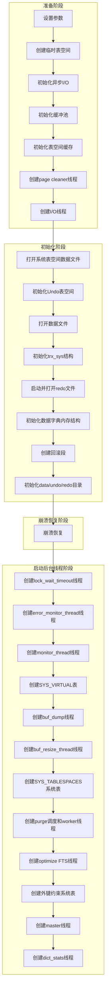

# 第2章 MySQL内核整体架构

数据库系统展现出高度的复杂性，其中关系数据库的实现尤为显著。本章致力于全面且细致地解析MySQL的整体架构，旨在为后续的深入探讨打下坚实的理论基础。本章中提及的特定模块将在后续章节中进行独立且详尽的论述。MySQL内核整体架构如图2-1所示。

```
SQL 接口 DML, DDL,存储程序, 视图,触发器, 等
NoSQL 接口 CRUD 操作

    解析查询
    解释,对象特权

    优化查询
    访问路径,统计

    全局缓存缓冲区,存储引擎,缓存管理

存储引擎层
    内存,索引,关系和文件存储管理

文件系统
文件层
    文件、日志、数据、索引、二进制、错误、全量、查询、慢查询

InnoDB
MyISAM
NDB 簇
内存
...

MySQL(连接器)应用
.NET, ODBC, JDBC, Node.js, Python, C++, C, PHP, Perl, Ruby

MySQL Shell(脚本)

MySQL Server 层(mysqld)
```

> 注：DML（Data Manipulation Language），意为数据操纵语言。

图2-1是直接引用的MySQL官方文档中的图片，从图中可以看到MySQL主要分为三层：

- **Server层**。在MySQL的架构中，Server层扮演着核心角色，涵盖SQL接口管理、SQL语句的解析与优化、缓存管理，除此之外还有连接管理、主从复制等关键功能的实现。这些功能共同确保数据库系统的高效运行。

- **存储引擎层**。作为数据操作与管理的基石，存储引擎层专注于执行对数据库表的增、删、改、查等操作。该层将内存中的数据按照预设的数据结构组织，并高效地写入数据文件中，确保数据的持久化存储。MySQL在Server层上，通过统一的接口抽象了存储引擎的功能，使得不同的存储引擎得以灵活实现，并通过插件化的方式动态加载，极大地增强了系统的可扩展性与灵活性。

- **文件层**。作为数据存储的最终归宿，文件层负责承载MySQL的系统数据与用户数据。值得注意的是，由于不同存储引擎的设计思想与实现方式存在差异，因此它们在文件存储的内容与格式上也会有所不同。这种设计既体现了MySQL对不同数据存储需求的适应性，也要求用户在使用时需根据实际需求选择合适的存储引擎。

这三层不可或缺，各自承担着不同的职责。在接下来的章节中，我们将对这三层架构进行更为详尽的介绍。

## 2.1 Server层

我们已对Server层的功能有了初步的了解，但需要明确的是，Server层还包含诸多组件，它们协同工作以确保整个系统顺畅运行。Server层根植于MySQL的早期设计之中，其初衷在于与MyISAM表引擎保持兼容性。尽管Server层不直接涉及数据的组织和存储，但它承担着与客户端进行交互、优化查询处理、管理主从复制以及与存储引擎进行交互等关键任务。这些模块的实现均较为复杂。MySQL Server层的整体架构如图2-2所示。

下面简单介绍Server层中每个组件的作用。

### 2.1.1 连接层

连接层级的核心职责在于与客户端交互。此层级集成了多个关键模块，包括专注于网络监听的实现以及数据包的发送与接收的vio模块，用于确保数据交互的安全性与合规性的登录认证与权限控制模块，以及相应的线程缓存与表缓存机制。

当客户端发起连接请求时，服务器端先通过vio模块与客户端建立稳定的连接通道，随后利用认证模块执行登录认证及权限审核流程，以确保客户端身份的合法性与操作权限的适宜性。

一旦验证通过，系统将为客户端创建一个用户线程（THD），并将其存储在线程缓存中，以便后续快速访问与管理。同时，用户线程所打开的表也将被记录并存储在表缓存中，以提高数据访问的效率与响应速度。

```
vio 模块
线程缓存
连接层
表缓存
登录认证与权限控制

语法解析器
查询缓存
优化器
执行器

参数
状态
performance_schema

元数据锁
表锁

全量日志
慢查询日志
错误日志
binlog

查询优化
参数、状态
缓存
用户自定义函数
存储过程相关

复制层
API 层
锁
日志

join buffer
myisam sort buffer
key buffer
sort buffer
存储过程
触发器
函数
事件
net buffer
read buffer
read rnd buffer
sql buffer

MGR
prepare
commit
rollback
create
......
binlog dump
slave_io
slave_sql
binlog cache
semi-sync
```

#### 1. vio模块

vio模块封装着套接字操作的相关方法，例如Linux网络编程中的send方法向网络文件描述符（fd）发送数据包，recv方法监听网络文件描述符接收数据包等，下面介绍vio提供的一些方法：

- `vio_delete`
- `vio_read`
- `vio_write`
- `vio_keepalive`
- `vio_io_wait`
- `vio_shutdown`

vio也结合了epoll io多路复用技术来支撑高并发场景，这些内容在第3章会详细介绍。

#### 2. 登录认证与权限控制

MySQL的登录认证过程是在客户端与服务端之间完成三次握手及一系列校验之后进行的。在此过程中，客户端会向服务端发送一个认证数据包，该数据包包含通过特定认证协议加密的用户名、密码、请求访问的数据库名称等关键信息。目前，MySQL支持的常用认证协议包括`mysql_native_password`、`sha256_password`、`caching_sha2_password`以及`ed25519`等。服务器在接收到这个认证数据包后，会根据所使用的协议进行解密操作，并将解密后的信息与系统中维护的用户信息进行比对，以确认用户身份是否合法，从而决定认证是否成功。这一过程的详细技术细节将在第3章中深入阐述。

此外，MySQL还提供了对数据库、表以及列级别的精细权限控制机制。在用户尝试访问任何数据库资源之前，系统会首先验证该用户是否具备相应的权限。具体而言，系统会根据用户的请求以及所请求资源的权限设置，进行严格的权限校验。如果用户未获得相应的访问权限，系统将直接返回错误信息，阻止未经授权的访问操作。

#### 3. 线程缓存

在MySQL系统中，存在一个精心设计的线程缓存机制，其核心策略是高效复用连接资源。具体而言，该机制通过将创建的用户线程管理对象存储于内存缓存之中，实现对象的快速复用。当系统需要新的用户线程对象时，会直接从缓存中取出已存在的对象再利用，并根据需要执行必要的数据初始化操作。而当用户线程对象不再需要时，系统会将其相关的维护数据清空，并重新放回线程缓存中，以备后续使用。

> [!WARNING]
> MySQL的线程缓存机制在某些特定场景下可能面临内存泄漏的风险。特别是当系统同时开启大量线程，并在这些线程中频繁申请小量内存时，若未能妥善管理这些内存资源的释放，就可能导致在连接关闭后，部分内存仍然被占用而未得到释放。这一现象可能表现为MySQL进程的内存占用持续且缓慢地增长，进而可能对系统的稳定性和性能产生不利影响。

#### 4. 表缓存

MySQL会在Server层维护一个表缓存，主要缓存表结构信息。表缓存又分为全局级别和会话级别，表缓存属于数据字典的一部分，数据字典在MySQL 8.0之后进行了重构优化，详细介绍请参考第4章。

### 2.1.2 查询优化

一条SQL语句在查询优化模块需要经历如下四个流程：

1. 通过解析器完成词法及语法解析，解析完成后生成一个执行树。
2. 查询缓存中查看是否有满足条件的执行计划，前提是打开了查询缓存。
3. 通过优化器生成逻辑执行计划和物理执行计划。逻辑执行计划主要是关系代数基础上的优化，通过对关系代数表达式进行逻辑上的等价变换，包含一些SQL改写、列裁剪、谓词下推、聚合消除等；物理执行计划是对具体的执行路径进行优化，在统计信息的基础上，通过选择最佳的索引、合适的关联方式（Join）等来估算最低的执行代价。
4. 执行器会负责完成优化器生成的整个执行计划的执行，最终将结果返回给客户端。

### 2.1.3 参数、状态、performance_schema

MySQL的参数模块，用于平常的参数设置。参数又分为静态参数和动态参数，动态参数可以在MySQL运行期间通过`set variables`命令修改。MySQL内部针对每个参数实现了具体的修改方法，修改之后会在内存中更新全局的参数。不过有时候虽然实现了动态修改，在内部也需要重新读取参数才能生效，比如修改`binlog_format`参数时，需要断开客户端连接并重连，参数才会生效。

MySQL的状态模块，用于收集各项指标状态。MySQL几乎在每个模块都有埋点记录相关的指标信息，可以通过`show global status`来查看全部状态指标信息。这些指标信息几乎都是递增的，并且只存储在内存中，一旦重启将会重新计数。实际上几乎所有的MySQL监控系统都是从这里采集的数据。

`performance_schema`是MySQL的一个数据库，里面采集了很多相关的指标数据。上述的`status`在`performance_schema`中就有对应的表，除此之外还有内存使用情况、线程使用情况、io、锁、事件等待等信息。可以通过`performance_schema`中的表来分析线上相关问题，比如内存的使用情况。

### 2.1.4 缓存

Server层设计并维护了多种类型的缓冲区，这些缓冲区的核心目标在于优化SQL语句的执行效率。以下是对每种缓冲区作用的简要概述：

- **join buffer**：在涉及join操作的场景中，若join的表未建立相应的索引，系统将采取优化措施，即将这些表的数据暂存于join buffer之中，以此提升join操作的执行效率。join buffer的具体容量由系统参数`join_buffer_size`进行调控，其作用域限定于每一次独立的join查询过程。因此，在配置该参数时，务必充分考虑业务实际需求及特点，以做出合理的设定。

- **net buffer**：MySQL客户端和服务端会维护相应的缓冲区，用以缓存发送和接收的数据。具体地讲，每个客户端线程均会被分配一个连接缓冲区以及一个结果集缓冲区，以便高效地处理数据传输和存储。注意这里说的连接buffer虽然区分客户端和服务端，不过都是维护在服务端的。上述连接缓冲区与结果集缓冲区的容量主要受`net_buffer_length`和`max_allowed_packet`两个系统参数的控制。其中，初始容量设置`net_buffer_length`的默认值，即16KB。在任何情况下，这两个缓冲区的最大容量均不得超过`max_allowed_packet`参数所设定的上限值。

- **myisam sort buffer**：MyISAM维护的排序缓冲区主要用于在`repair table`、`create index`、`alter table`等场景中对MyISAM索引进行排序操作，其大小由`myisam_sort_buffer_size`参数进行精确控制。

- **read buffer**：主要用于缓存MyISAM存储引擎顺序扫描表的结果，它是线程级别的。同时针对所有存储引擎，在`Order By`排序、批量插入分区、缓存嵌套循环数据等场景下使用。由`read_buffer_size`参数控制。

- **key buffer**：其主要功能为缓存MyISAM引擎的索引块，旨在通过此种方式加速查询操作。该缓存具有全局粒度，意味着其资源为所有线程所共享，并受到`key_buffer_size`参数的直接控制与管理。

- **read rnd buffer**：该特性主要应用于MyISAM引擎中的`Order by`语句场景。在此场景下，系统直接从read rnd buffer中读取数据，以此来提升`Order by`语句的执行性能。此功能是以线程为单位进行管理的，其大小由参数`read_rnd_buffer_size`进行控制。

- **sort buffer**：该机制主要被设计用于在所有存储引擎中处理数据查询排序的场景，其以线程为单位进行运作，并由`sort_buffer_size`参数进行精确控制。

- **sql buffer**：由`sql_buffer_result`参数控制，它会强制MySQL将查询结果集放入一个临时表中。这样做的主要目的是将客户端与实际的表查询操作分离开来，使得客户端可以更快地获取到部分结果，而MySQL可以在后台继续处理查询结果的其他部分，例如进行排序、分组等操作。

### 2.1.5 日志

Server层主要维护如下四种日志：

- **全量日志**：主要用于问题定位、审计等场景，其启用与否由参数`general_log`控制。在默认情况下，此功能处于关闭状态，以确保系统性能和资源利用率的优化。

- **慢查询日志**：用于记录执行时间超过预设阈值的SQL语句。其启用与否由`slow_query_log`参数控制。具体而言，当SQL语句的执行时间超过`long_query_time`参数所设定的阈值时，这些SQL语句将被记录在慢查询日志中，以供后续分析和优化。

- **错误日志**：用于在MySQL启动过程中或遇到错误时记录相关信息的工具。观察和分析这些错误日志，可以诊断问题、定位错误原因，并据此采取相应的解决措施。

- **binlog**：MySQL主从同步的媒介是binlog文件，该文件在事务被提交时，负责将SQL语句记录其中。

### 2.1.6 锁

Server层主要维护两种类型的锁：元数据锁和表锁。

元数据锁的主要功能是确保表在并发访问过程中的安全性，能够锁定表结构信息以及表数据，从而避免在并发环境下发生数据冲突或不一致。具体而言，当表被打开时，系统会自动加上元数据读锁，以保护表结构的稳定；而当需要更改表结构时，则会加上元数据写锁，以确保修改操作的原子性和一致性。

> [!NOTE]
> 元数据锁的作用范围不仅限于表对象，它还能锁定schema、存储过程以及全局级别的对象，为数据库的整体并发控制和数据一致性提供强有力的支持。从实现层面来看，元数据锁主要是在MySQL Server层进行管理和控制的。

表锁指的是针对表对象的锁定机制，起初仅存在表锁，随后引入了元数据锁，目前采用表锁与元数据锁相结合的方式来实现。需要特别注意的是，表锁主要在Server层实现，而部分存储引擎也提供了自身的表锁实现方式。

### 2.1.7 存储过程相关

存储过程相关主要包括：存储过程、函数、触发器和事件。

#### 1. 存储过程

这是一组可编程的函数集合，旨在完成特定的功能，它们以SQL语句集的形式存在。这些函数集经过编译后创建并存储在数据库中。用户可以通过指定存储过程的名称并提供必要的参数来调用并执行这些存储过程。存储过程的定义及其相关信息被保存在`information_schema.ROUTINES`表中，该表采用InnoDB作为存储引擎。因此，存储过程的定义实质上是存储在InnoDB存储引擎之下的。然而，存储过程的实际实现则位于Server层。

#### 2. 函数

MySQL具备自定义函数的能力，这些函数能够执行特定的SQL语句，并允许用户传入参数。当这些函数被执行时，其结果将直接反馈给客户端。此外，所有自定义函数的定义均存储在`information_schema.ROUTINES`表中，以便后续管理与查询。

#### 3. 触发器

可以通过创建触发器来监测数据库表的数据操作语言（Data Manipulation Language, DML）操作，例如，利用触发器实现表数据的同步处理。触发器的定义及其相关属性均被系统地存储在`information_schema.TRIGGERS`表中，以便用户查询和管理。

#### 4. 事件

MySQL中的定时器功能，类似于Linux系统中的crontab工具，允许用户在事件中编写SQL语句，并设置定时触发机制。这些事件的定义及其相关信息均被存储在`information_schema.EVENTS`表中，以便进行管理和查询。

### 2.1.8 用户自定义函数

MySQL支持多种内置函数，如`sum`和`count`等，这些函数在数据处理和分析中扮演着重要角色。然而，在实际业务场景中，有时需要扩展这些内置函数的功能以满足特定需求。MySQL在Server层定义了一套UDF（User Define Function，用户定义函数）的实现接口，该接口允许开发者根据需求自定义函数的逻辑。开发者只需遵循这套接口规范，并在接口内部实现自定义函数的具体逻辑。当MySQL服务启动时，就会自动加载这些自定义函数，使得它们可以在数据库操作中被调用。

在使用自定义函数之前，还需要通过`CREATE FUNCTION`语句在MySQL中正式创建这些函数。通过这种方式，开发者可以在MySQL中定制特定的特性和功能，并通过自定义函数来管理这些功能，从而提高数据库操作的灵活性和效率。

### 2.1.9 复制层

MySQL的复制主要分为主从复制和组复制两个大的阶段。

主从复制是在Server层实现的，主要有以下模块：

- **binlog dump线程**。在主库侧启动，用于给所有的从库发送binlog日志。

- **slave_io线程**。在从库测启动，用于接受主库侧发送过来的binlog日志。

- **slave_sql线程**。在从库侧启动，用于解析binlog日志并应用到从库。

- **binlog cache**。用于缓冲binlog日志，在写入binlog文件前会先写入binlog cache中，然后再统一触发刷盘到binlog文件中。

- **semi-sync**。半同步插件，主要通过在主库事务提交时写binlog的流程中控制等待从库接收binlog完成从而实现半同步，semi-sync通过hook技术，在主库侧会开启一个ack receiver的线程。

组复制作为一种分布式数据强一致同步方案，其核心基于类Paxos协议构建。它的实现机制与semi-sync相似，均通过插件形式实现。具体而言，在事务提交的流程中，利用hook机制来确保binlog已被成功发送至多数派的跟随者节点之后，领导者节点上的事务方能得以提交。这一设计确保了数据在分布式系统中的高度一致性与可靠性。

### 2.1.10 API层

API层是指MySQL Server所定义的与存储引擎相关的接口集合。为了成功实现一个存储引擎，必须遵循Server层所抽象出的这些接口规范，包括但不限于以下示例接口：

- **prepare**。由于MySQL架构中明确区分了Server层与存储引擎层，因此事务的提交过程被设计为包含两个阶段：首先是准备（prepare）阶段，其次是存储引擎层的提交（commit）阶段。在准备阶段，主要进行的是Server层的操作，而存储引擎层在这一阶段也可以执行相关的操作，这些操作的具体逻辑可以在prepare阶段得到实现。这样的设计确保了事务的完整性和一致性。

- **commit**。事务的最终提交过程实际上发生在存储引擎层面。在提交逻辑中，包括事务状态的修改，例如修改成事务提交状态，然后可以释放事务中一些锁定的资源等。实际上在InnoDB存储引擎中，提交操作就包含前面描述的这些步骤。

- **rollback**。在进行事务回滚操作时，其核心环节在于存储引擎层的有效执行。具体而言，此过程旨在将已写入数据文件的数据恢复到先前的状态版本，相应的逻辑实现需被严谨地封装于指定方法之内。值得注意的是，Server层生成的binlog一旦完成磁盘写入操作，便无法再行回滚，原因在于Server层本身并未设计包含对binlog进行回滚的逻辑机制。因此，存储引擎层须具备兼容此逻辑的能力，以应对可能出现的异常情况。以InnoDB存储引擎为例，若在系统完成binlog写入并发生崩溃后重启，系统需自动执行扫描binlog的操作，以确保将相关事务的更改准确地补写回InnoDB存储引擎中，从而保证数据的一致性和完整性。

- **create**。在数据库系统中，实现创建表逻辑是一个严谨且关键的过程。以InnoDB存储引擎为例，这一过程涉及对数据字典信息的详尽记录。具体而言，表结构信息被精确无误地存储在数据字典中，以确保数据的完整性和可访问性。随后，为了高效地存储和检索数据，会创建索引结构，这些索引结构专门用于存储具体的数据记录，从而优化数据库的性能和响应速度。整个过程体现了数据库管理系统在数据处理上的严谨性、稳定性和高效性。

上述仅为几个常用的接口示例，对于更广泛的接口需求，建议感兴趣的读者查阅`sql/handler.h`文件中关于`handlerto`结构体的详细定义。此外，MySQL的内部文档也是获取此类信息的重要资源，可供参考。

## 2.2 存储引擎层

本节主要介绍InnoDB存储引擎，其架构如图2-3所示。

从图2-3中可以清晰地看到InnoDB存储引擎的两大核心组成部分：上半部分聚焦于内存中的组件；下半部分则涵盖底层的文件结构。接下来，我们将基于图2-3对各个组件进行简要的介绍。

```
               刷脏调度线程
               回滚页缓存
               索引页缓存
               插入缓冲区
               自适应哈希
               清理调度线程
               清理工作线程
               清理工作线程
               清理工作线程
               双写缓冲区
               重做日志缓冲区
               日志I/O 线程
               刷脏工作线程
               刷脏工作线程
               刷脏工作线程
               错误监控线程
               统计信息收集线程
               插入缓冲I/O 线程
               master 线程
               统计信息收集线程
               全文索引表优化线程
               锁超时检查线程
               监控线程
               调整缓冲池大小线程
               导出缓冲池线程

缓冲池
回滚段
双写缓冲区
数据字典
事务

ibdata1
test3.ibd
test1.ibd test2.ibd
undo003
undo001 undo002
ib_logfile2
ib_logfile0
ib_logfile1

系统数据文件
用户数据文件
插入缓冲区
插入缓冲位图页
回滚段头
回滚页
回滚页
回滚日志
同步I/O
同步I/O
异步I/O
异步I/O
异步I/O
检查点
索引页
系统页
重做日志头
检查点
日志块
重做日志文件
同步I/O
同步I/O
写I/O线程
```

### 2.2.1 缓冲池

缓冲池是InnoDB存储引擎中的一个至关重要的组件，其核心功能在于缓存数据页、回滚页，插入缓冲以及自适应哈希等关键数据。在日常操作中，无论是读取还是写入，所处理的数据均会先经过缓冲池。该组件负责将磁盘上数据文件中相应的数据页加载至其维护的内存区域中，并借助链表等数据结构对这些数据页进行高效管理。

值得注意的是，除了回滚页缓存和索引页缓存外，InnoDB的插入缓冲和自适应哈希机制也依赖于缓冲池中的内存资源，下面简单地介绍一下。

#### 1. 插入缓冲区

插入缓冲区的设计初衷在于优化MySQL数据库中二级索引的随机I/O操作。该机制通过合并原本分散的随机I/O请求，有效降低了随机I/O的频率，从而提升了数据库性能。最初，该缓冲区仅支持`insert`语句，但随后扩展了对`update`和`delete`语句的支持，因此其名称也由`insert buffer`变更为`change buffer`。为便于理解，本章将统一采用“插入缓冲区”这一称谓。

#### 2. 自适应哈希

我们知道，MySQL的核心索引机制采用B+树结构，其中聚簇索引的叶子节点负责存储表的具体数据。然而，在应对大规模数据集时，B+树的层级可能显著增加，且各层宽度亦会扩大。具体而言，小规模数据可能仅需两级B+树即可满足需求，而大规模数据则可能需要扩展至四级，这势必影响数据检索的效率，尤其是在数据未驻留于内存时，检索速度将更为迟缓。

为解决上述问题，MySQL引入了哈希表这一数据结构，旨在通过其独特的键值映射特性，实现数据的快速定位。MySQL的策略是将高频访问的数据预先插入哈希表中，从而在后续访问时能够直接从哈希表获取所需数据，此举显著提升了数据读取的性能。

> [!WARNING]
> 自适应哈希技术虽能显著提升特定场景下的操作效率，但其应用亦受诸多条件限制，并非万能之策。因此，在实际应用中，我们需根据具体场景和需求，审慎评估并选用最为合适的数据访问策略。

### 2.2.2 重做日志缓冲区

重做日志缓冲区是InnoDB用于缓存重做日志记录的区域。在事务提交或后台线程触发时，该缓冲区内的内容将被同步至磁盘上的重做日志文件中，以确保数据的持久性和一致性。

### 2.2.3 双写机制

鉴于磁盘的基本存储单元为512 B，而MySQL数据库在进行数据读写操作时，其最小单位通常是一个数据页，该数据页的大小普遍设定为16KB。因此，在数据写入过程中，若遭遇突然断电等异常情况，可能导致数据页仅部分写入，进而引发数据页损坏及数据不一致的问题。

为解决此问题，MySQL引入了双写机制。该机制的核心策略是，在将数据页修改内容直接写入其原始数据文件之前，首先将这些修改内容临时写入一个独立的双写缓冲区文件中。一旦双写操作成功完成，MySQL随后会将这部分已确认无误的数据从双写缓冲区文件同步至其对应的数据文件中。此过程确保了即使发生断电等意外情况，也能通过双写缓冲区文件恢复数据页的一致性，从而有效避免数据损坏问题。

# 2.0 第2章 MySQL内核整体架构

## 2.2.4 后台线程

由于InnoDB存储引擎负责数据的读写、各种特性的正常运转，所以后台开启了很多线程，每个线程负责不同的功能。MySQL后台线程如表2-1所示。

**表2-1 MySQL后台线程**

| 线程名 | 默认数量 | 作用 |
|--------|----------|------|
| master线程（srv_master_thread） | 1 | 主要做检查点、将重做日志刷盘、插入缓冲区合并、表缓存清理等工作 |
| 读I/O线程（io_handler_thread） | 4 | 处理异步读操作，当MySQL发起异步读操作后，完成后读I/O线程会进行收尾工作，主要检查页是否损坏，是否在双写缓冲区存在。如果是压缩页是否能解压等 |
| 写I/O线程（io_handler_thread） | 4 | 处理异步写操作，当MySQL发起异步写操作，完成后写I/O线程会进行收尾工作，主要从flush链表中移除对应的被刷完盘的脏页，并且更新双写缓冲区 |
| 插入缓冲I/O线程（io_handler_thread） | 1 | 插入缓冲I/O线程主要是在插入缓冲合并的时候异步I/O读取完数据页进行一些收尾工作，它的功能跟读I/O线程基本一致，给它单独区分出来就是为了不影响原有的读I/O线程 |
| 日志I/O线程（io_handler_thread） | 1 | 处理日志异步写操作，当MySQL执行checkpoint会异步写入重做日志文件中，完成后日志I/O线程会进行收尾工作，主要是主动将重做日志文件刷盘，并且更新当前系统中的checkpoint号 |
| page cleaner调度线程（buf_flush_page_cleaner_coordinator） | 1 | 主要用于将缓冲区的脏页写入磁盘中，调度线程负责唤醒工作线程，然后调度线程和工作线程都进行刷脏页操作 |
| page cleaner工作线程（buf_flush_page_cleaner_worker） | 3 | 主要用于将缓冲区脏页写入磁盘数据文件中 |
| purge线程（srv_purge_coordinator_thread） | 1 | 主要用于删除标记的数据，调度线程负责找到需要清理的被标记删除的数据，分发给工作线程。工作线程再进行具体的数据删除 |
| 清理工作线程（srv_worker_thread） | 3 | 主要用于删除标记的数据 |
| buffer pool dump线程（buf_dump_thread） | 1 | 在MySQL关闭时，将缓冲区中使用的数据页持久化到磁盘上，这里只是记录的页编号而不是具体的数据。在MySQL启动的时候，再将记录的这些页主动加载到缓冲区中 |
| buffer pool resize线程（buf_resize_thread） | 1 | 主要支持MySQL动态修改缓冲区的大小 |
| 全文索引表优化线程（fts_optimize_thread） | 1 | 主要优化带有全文索引的表，优化其被删除的分词，将其从索引中删除 |
| 锁超时检查线程（lock_wait_timeout_thread） | 1 | 主要检查锁等待超时，超时时间由`innodb_lock_wait_timeout`参数控制，该线程会扫描所有被挂起的用户线程的锁等待信息，发现超过`innodb_lock_wait_timeout`设置的值，会自动释放锁等待，并给客户端返回报错 |
| 错误监控线程（srv_error_monitor_thread） | 1 | 主要用于监控MySQL内部互斥锁等待超时，超时后MySQL会自动崩溃 |
| monitor线程（srv_monitor_thread） | 1 | 跟错误监控线程配合使用，主要在MySQL异常的情况下打印InnoDB存储引擎的监控信息，跟主动执行`show engine innodb status`命令的信息一样 |
| 统计信息收集线程（dict_stats_thread） | 1 | 主要用于表统计信息的收集 |

> [!NOTE]
> 上述只是MySQL 5.7的线程，随着版本的叠加，MySQL会引入新的线程，并且线程的数量也可能有所变化。可以通过`pstack` MySQL的进程或者调试其启动的逻辑，找到所有的后台线程。

## 2.3 文件层

同样，本节只介绍InnoDB存储引擎相关的文件。

### 1. 重做日志文件

在MySQL数据库中，重做日志扮演着至关重要的角色，其核心功能在于确保数据库操作的原子性和持久性得以实现。具体而言，每当数据发生更新时，相应的操作会被详尽地记录至重做日志文件中。这一流程严格遵循WAL（Write-Ahead Logging，日志先行）机制，即确保在数据文件的实际写入之前，相应的日志记录已先行完成并确认无误。

> [!TIP]
> MySQL中的重做日志文件虽以物理操作为基础进行记录，但其内容大多呈现为逻辑形式，并不直接映射至具体的物理数据层面，这一特性与PostgreSQL等数据库系统存在显著差异。此差异部分归因于InnoDB存储引擎的后续引入及其特定设计考量。关于重做日志的详细构成与工作原理，将在后续章节中深入阐述。

### 2. 数据文件

数据文件是用于存储具体数据的媒介，其类型主要分为两大类。第一类是系统数据文件，该类文件专门用于存储MySQL数据库管理系统所需的管理数据，包括但不限于数据字典、双写区以及回滚段等关键信息。第二类是用户数据文件，其主要功能在于存储用户根据自身需求所创建的表的数据内容。关于数据文件的内部组成细节，将在后续的数据文件章节中予以详尽阐述。

### 3. 回滚日志文件

回滚日志文件的核心功能在于支持数据的回滚操作以及实现MVCC机制，其核心作用是将操作执行前的数据状态准确地记录至相应的回滚日志文件中。后续章节将深入剖析回滚日志文件的内部结构及组成要素。

### 4. ib_buffer_pool文件

`ib_buffer_pool`主要是在MySQL关机的时候用于存储当前缓冲池缓存的数据页信息，在MySQL有一个dump线程来做这个事情，dump的内容主要是将最近使用的数据页的表空间ID和对应数据页number记录到`ib_buffer_pool`文件中，在下次启动的时候会将这些对应的数据页提前加载。

## 2.4 MySQL启动流程

在深入探讨MySQL的启动流程前，我们已经对Server层与InnoDB层的基本架构有所了解。接下来，我们将聚焦于MySQL在初始化及启动过程中，如何分别针对Server层与InnoDB层的相关组件进行配置与激活。MySQL的启动架构如图2-4所示，本书详细阐述了MySQL如何系统地准备并启动其核心组件。

```mermaid
flowchart TB
    subgraph 第一阶段:初始化变量、锁、MySQL命令、参数等
        A1[初始化相关模块互斥锁]
        A2[初始化early参数变量]
        A3[初始化performance_schema的内存结构]
        A4[初始化MySQL命令]
        A5[获取配置文件]
        A6[设置启动用户]
        A7[初始化performance_schema]
        A8[设置MySQL工作目录]
    end
    subgraph 第二阶段:初始化各组件、插件,包括各种存储引擎
        B1[初始化MySQL sys线程、锁相关变量]
        B2[创建gtid table压缩线程]
        B3[设置super read only]
        B4[MDL锁]
        B5[初始化表缓存]
        B6[初始化错误日志文件]
        B7[binlog]
        B8[Sha256_password]
        B9[ARCHIVE]
        B10[MyISAM]
        B11[创建auto.cnf]
        B12[初始化ssl]
        B13[初始化网络相关对象]
        B14[初始化自定义函数]
        B15[初始化global status]
        B16[清理临时表]
        B17[初始化插件]
        B18[开启套接字监听,提供服务]
        B19[BLACKHOLE]
        B20[内存]
        B21[CSV]
        B22[初始化table def cache]
        B23[初始化查询缓存]
        B24[初始化gtid]
        B25[初始化键缓存]
        B26[初始化事务缓存]
        B27[mysql_native_password]
        B28[PERFORMANCE_SCHEMA]
        B29[INNODB]
        B30[创建PID文件]
        B31[初始化slave]
        B32[执行ddl recovery]
        B33[初始化event scheduler]
        B34[创建signal handler线程]
        B35[加载审计插件]
        B36[初始化权限]
    end
    subgraph 第三阶段:准备提供服务,初始化ssl、权限、信号量、监听套接字提供服务
        C1[创建PID文件]
        C2[初始化slave]
        C3[执行ddl recovery]
        C4[初始化event scheduler]
        C5[创建signal handler线程]
        C6[加载审计插件]
        C7[初始化权限]
    end
```

**图2-4 MySQL的启动架构**

从图2-4可知，MySQL的启动主要经历三个大的阶段：

- **第一阶段**：初始化变量、锁、MySQL命令、参数等。
- **第二阶段**：初始化各组件、插件，包括各种存储引擎。
- **第三阶段**：准备提供服务，初始化ssl、权限、信号量，监听套接字提供服务。

在MySQL的启动流程中，InnoDB存储引擎的启动与初始化被安排在第二阶段进行。作为MySQL的一个重要组成部分，InnoDB存储引擎被视作一个插件。因此，在MySQL系统加载并激活各类插件的过程中，InnoDB存储引擎也随之被加载并启动，进而执行其初始化流程。

MySQL的启动入口在`mysqld.cc`文件中的`mysqld_main`方法中。

```c
extern int mysqld_main(int argc, char **argv);
int main(int argc, char **argv)
{
  return mysqld_main(argc, argv);
}
```

### 2.4.1 第一阶段

下面重点介绍第一阶段几个较为重要的步骤。

#### 1) 初始化performance_schema的内存结构

`performance_schema`本身是一个内存内的数据库系统，专门用于存储MySQL的各类性能指标。自MySQL启动之初，`performance_schema`即被初始化，旨在持续追踪并记录一系列关键的性能指标数据，代码如下。

```c
#ifndef _WIN32
#ifdef WITH_PERFSCHEMA_STORAGE_ENGINE
  pre_initialize_performance_schema();
```

#### 2) 初始化MySQL sys线程、锁相关变量

MySQL内部封装了一系列系统库，统称为`my_sys`，这些库涵盖了文件操作、日志记录、输入输出处理、字符集管理等核心功能。在此阶段，`my_sys`的主要任务是初始化后续过程中将要使用的线程及锁相关变量，以确保MySQL数据库系统的稳定运行和高效性能。

```c
if (my_init())
  {
    sql_print_error("my_init() failed.");
    flush_error_log_messages();
    return 1;
  }
```

#### 3) 获取配置文件

此步骤涉及获取用于启动MySQL服务的特定`my.cnf`配置文件。根据MySQL的默认行为，它会在一系列预设的目录下搜索此配置文件，例如`/etc`目录。若用户已明确指定了配置文件的路径，则MySQL将直接访问并开启该路径下的配置文件，随后将其内容载入内存，以便在后续操作中使用。

```c
if (load_defaults(MYSQL_CONFIG_NAME, load_default_groups, &argc, &argv))
{
  flush_error_log_messages();
  return 1;
}
```

#### 4) 初始化early参数变量

early参数变量是指在程序或系统启动流程的早期阶段就已被定义并可能随即在后续流程中使用的变量。这些变量通常具有关键性作用，对于确保流程的顺畅进行以及实现预期功能至关重要。例如，在软件初始化过程中设置的`skip-grant-tables`、`help`、`initialize`等参数变量均属于此类，它们为后续的程序执行或数据处理提供了必要的上下文或条件。

```c
ho_error= handle_early_options();
```

#### 5) 初始化MySQL命令

我们平常会用到多种MySQL命令，例如`alter_table`、`alter_tablespace`、`alter_user`、`begin`等，该阶段主要初始化这些命令的内存结构。

```c
init_sql_statement_names();
```

#### 6) 调整open_files相关参数

`open file limit`、`max connection`、`table_cache_size`、`table_def_size`参数跟`open_files`参数之间存在比例关系，MySQL会根据`open_files`的大小来调整这些参数的值。

```c
adjust_related_options(&requested_open_files);
```

#### 7) 初始化相关模块互斥锁

在MySQL的内部实现中，广泛采用了互斥锁（Mutex）这一同步机制，以确保多线程环境下数据的一致性和完整性。具体而言，互斥锁被应用于多个关键组件中，包括但不限于日志模块、审计系统以及查询日志等，以保障这些模块在并发访问时能够安全、有序地执行各自的任务。

```c
init_error_log();
mysql_audit_initialize();
query_logger.init();
```

#### 8) 初始化所有参数变量的值

在上述阶段中，MySQL已经将配置文件读取到内存中，这里会根据参数文件的值和默认值对MySQL的所有参数进行赋值。

```c
mysql_init_variables mysqld.cc:7019
init_common_variables mysqld.cc:2657
mysqld_main mysqld.cc:4556
main main.cc:25
__libc_start_main 0x00007f9ae0e1e555
_start 0x0000000000e96959
```

#### 9) 初始化信号

初始化MySQL进程用到的信号，MySQL会为一些信号设置相关的处理函数。

```c
my_init_signals();
  (void) sigaction(SIGSEGV, &sa, NULL);
  (void) sigaction(SIGABRT, &sa, NULL);
  (void) sigaction(SIGBUS, &sa, NULL);
  (void) sigaction(SIGILL, &sa, NULL);
  (void) sigaction(SIGFPE, &sa, NULL);
```

#### 10) 设置MySQL工作目录

设置MySQL的工作目录，也是对应的`datadir`参数。

```c
if (my_setwd(mysql_real_data_home,MYF(MY_WME)) && !opt_help)
{
  sql_print_error("failed to set datadir to %s", mysql_real_data_home);
  unireg_abort(MYSQLD_ABORT_EXIT); 
}
```

#### 11) 设置启动用户

设置MySQL进程的启动用户，一般用户为mysql。

```c
if ((user_info= check_user(mysqld_user)))
  set_user(mysqld_user, user_info);
```

### 2.4.2 第二阶段

本阶段的核心任务是加载MySQL的各项组件，特别是插件部分，此部分尤为关键。在插件的架构中，各类存储引擎得以实现，而InnoDB存储引擎则占据了主导地位。因此，本小节将详尽阐述InnoDB存储引擎的初始化与启动流程。在深入探讨InnoDB存储引擎之前，我们有必要先对其他几个关键组件的初始化流程进行简要的概览。

- 初始化元数据锁的内存结构。
- 初始化表缓存的哈希表结构。
- 初始化table def cache哈希表结构。
- 初始化查询缓存内存结构。
- 初始化错误日志文件。
- 初始化事务缓存哈希表结构。
- 初始化键缓存内存结构。
- 初始化gtid相关内存结构。

在完成了上述组件的初始化步骤之后，随即进入插件的初始化阶段。值得注意的是，各个插件的初始化过程各具特色无统一模式可循。以binlog插件为例，其初始化的核心在于配置与binlog紧密相关的功能方法，为后续操作奠定基础。鉴于本书中涉及的插件种类繁多，无法逐一详尽阐述。因此，此处将聚焦于InnoDB存储引擎的初始化过程，如图2-5所示。



**图2-5 初始化InnoDB存储引擎**

InnoDB存储引擎的初始化过程包含多个阶段，且每个阶段均较为复杂，为便于理解，参考图2-5我们将其概括为以下四个主要阶段：

- **准备阶段**。在正式执行之前，需要进行一系列的准备工作。首先，设定一个明确的数据目录，方便数据的存储与管理。随后，进行I/O配置，确保系统能够顺畅地进行数据的读写操作。紧接着，创建I/O线程，以并行处理的方式提升数据处理的效率。最后，初始化缓冲池，用以暂存数据，优化内存使用，加速数据访问。这一系列步骤的严谨执行是系统稳定运行与高效运作的基础。

- **初始化阶段**。在数据处理流程中，首要步骤是读取数据，这一过程涵盖了打开数据文件以及各类日志文件。随后，系统进入初始化阶段，包括事务系统的启动、数据字典的构建，以及回滚段的创建等关键步骤。至此，InnoDB已具备基础的服务提供能力，能够支持后续的数据操作与事务处理。

- **崩溃恢复阶段**。作为InnoDB数据库系统中极为关键的特性，崩溃恢复被独立划分为一个独立且重要的处理环节，因此我们特别将其视为一个独立的阶段进行详细探讨。

- **启动后台线程阶段**。在完成崩溃恢复流程后，InnoDB引擎已恢复并正式进入服务状态。然而，还需启动一系列服务于InnoDB周边环境的后台线程，以确保系统的全面运作。

#### 1. 准备阶段

首先，初始化目录。为了后续文件读取的顺利进行，MySQL将预先设立`data`、`undo`、`redo`三个目录结构。

```c
fil_path_to_mysql_datadir = default_path;
folder_mysql_datadir = fil_path_to_mysql_datadir;
/* 根据从 MySQL 的 .cnf 文件中读取的值来设置 InnoDB 初始化参数. */
/* 数据文件的默认目录是 MySQL 的数据目录. */
srv_data_home = innobase_data_home_dir
  ? innobase_data_home_dir : default_path;
```

接下来设置参数。在配置InnoDB存储引擎时，应当依据具体的需求和场景，精确设定各项参数，以确保数据库系统的稳定、高效运行。这些参数包括但不限于：

- `srv_io_capacity`，用于调整InnoDB在后台线程中执行I/O操作的能力。
- `srv_log_buffer_size`，用于设定InnoDB日志缓冲区的大小，该缓冲区用于存储即将写入磁盘的日志信息。
- `srv_buf_pool_size`，直接关联到InnoDB缓冲池的大小，该缓冲池是InnoDB用来缓存数据、索引等内容的内存区域。
- `srv_n_read_io_threads`和`srv_n_write_io_threads`，分别用于配置InnoDB执行读I/O操作和写I/O操作的线程数量，以优化并发处理性能。
- `srv_use_doublewrite_buf`，一个关键的配置项，用于启用或禁用InnoDB的双写缓冲区功能，该功能旨在提高数据页的写入可靠性。

因此，在调整这些参数时，需要综合考虑系统资源、工作负载以及数据安全性等多方面因素。

```c
srv_io_capacity = srv_max_io_capacity;
srv_log_buffer_size = (ulint) innobase_log_buffer_size;
srv_buf_pool_size = (ulint) innobase_buffer_pool_size;
srv_n_read_io_threads = (ulint) innobase_read_io_threads;
srv_n_write_io_threads = (ulint) innobase_write_io_threads;
srv_use_doublewrite_buf = (ibool) innobase_use_doublewrite;
```

在数据库管理中，为了支持后续操作的高效执行，需要构建专用的临时表空间。此空间被广泛应用于临时表的创建，确保常用临时表能够依托此表空间实现数据的临时存储与处理。

```c
srv_dict_tmpfile = os_file_create_tmpfile(NULL);
if (!srv_dict_tmpfile) {
  return(srv_init_abort(DB_ERROR));
}
mutex_create(LATCH_ID_SRV_MISC_TMPFILE,
    &srv_misc_tmpfile_mutex);
srv_misc_tmpfile = os_file_create_tmpfile(NULL);
```

MySQL数据库系统支持异步I/O操作，这一特性将在后续的章节中进行详尽的阐述。目前，此处的重点仅在于构建与异步I/O相关的内存结构。

```c
if (!os_aio_init(srv_n_read_io_threads,
  srv_n_write_io_threads,
    SRV_MAX_N_PENDING_SYNC_IOS)) {
```

初始化表空间缓存。启动并初始化`fil_system`表空间管理结构，该结构旨在全面管理和维护系统中的所有表空间。

```c
fil_init(srv_file_per_table ? 50000 : 5000, srv_max_n_open_files);
```

创建I/O线程，提供读写数据文件、日志文件能力。

```c
for (ulint t = 0; t < srv_n_file_io_threads; ++t) {
  n[t] = t;
  os_thread_create(io_handler_thread, n + t, thread_ids + t);
}
```

创建page cleaner线程，旨在专门负责将脏页有效地刷新到数据文件中，以确保数据的完整性和持久性。

```c
/* 即使在只读模式下,内部表操作也可能会产生刷新任务. */
buf_flush_page_cleaner_init();
os_thread_create(buf_flush_page_cleaner_coordinator,
        NULL, NULL);
for (i = 1; i < srv_n_page_cleaners; ++i) {
    os_thread_create(buf_flush_page_cleaner_worker,
```

# 第2章 MySQL内核整体架构

## 2.4.2 第二阶段（续）

### 1. 准备工作阶段（续）

```c
d_ids + t);
}
```
创建page cleaner 线程，旨在专门负责将脏页有效地刷新到数据文件中，以确保数据的完整性和持久性。

```c
/* 即使在只读模式下,内部表操作也可能会产生刷新任务. */
buf_flush_page_cleaner_init();
os_thread_create(buf_flush_page_cleaner_coordinator,
        NULL, NULL);
for (i = 1; i < srv_n_page_cleaners; ++i) {
    os_thread_create(buf_flush_page_cleaner_worker,
```

```c
            NULL, NULL);
}
```

初始化缓冲池内存结构，主要用于在内存中缓存数据页。

```c
ib::info() << "Initializing buffer pool, total size = "
  << size << unit << ", instances = " << srv_buf_pool_instances
  << ", chunk size = " << chunk_size << chunk_unit;
err = buf_pool_init(srv_buf_pool_size, srv_buf_pool_instances);
```

可以看到这些准备工作就是服务于接下来的打开数据文件等操作，比如创建I/O 线程、初始化缓冲池等。

### 2. 初始化阶段

启动数据文件处理流程，将相关必要信息从数据文件中读取并加载至系统内存中，以确保后续能够顺畅地读取与扫描数据文件内容。

```c
err = srv_sys_space.open_or_create(
  false, create_new_db, &sum_of_new_sizes, &flushed_lsn);
```

启动并打开redo 文件，以便在该文件中继续保存和记录后续的redo 操作。

```c
err = open_log_file(&files[i], logfilename, &size);
```

打开系统表空间数据文件，该文件存储了MySQL 数据库所有至关重要的内部核心信息。在此阶段，MySQL 首先执行打开操作，以便在后续的步骤中能够顺利读取数据文件中与系统相关的数据页内容。

```c
fil_open_log_and_system_tablespace_files();
```

初始化Undo 表空间，这里实际上是打开回滚表空间，最终打开对应的回滚日志文件。

```c
err = srv_undo_tablespaces_init(
  create_new_db,
  srv_undo_tablespaces,
  &srv_undo_tablespaces_open);
```

初始化trx_sys 结构，该结构是用于管理事务系统的。

```c
trx_sys_create();
```

初始化数据字典内存结构，后续读取表结构信息将存储在该结构中。

```
dict_boot dict0boot.cc:287
innobase_start_or_create_for_mysql srv0start.cc:2232
innobase_init ha_innodb.cc:4048
ha_initialize_handlerton handler.cc:838
plugin_initialize sql_plugin.cc:1197
plugin_init sql_plugin.cc:1539
init_server_components mysqld.cc:4036
mysqld_main mysqld.cc:4673
main main.cc:25
__libc_start_main 0x00007f0c96122555
_start 0x0000000000e96959
```

创建回滚段，用于后续管理回滚记录。

```c
/* InnoDB 中存在的回滚段(rsegs)数量由状态变量 srv_available_undo_logs 给出.要使用的回滚段数量可以通过动态全局变量 srv_rollback_segments 来设置. */
srv_available_undo_logs = trx_sys_create_rsegs(
  srv_undo_tablespaces, srv_rollback_segments, srv_tmp_undo_logs);
```

此时，InnoDB 相关文件已成功打开，且相关系统已完成初始化，标志着系统已基本具备向用户提供服务的能力。

### 3. 崩溃恢复阶段

崩溃恢复作为InnoDB 数据库管理系统中的一个至关重要的特性，其影响力广泛，几乎覆盖了InnoDB 的每一个核心组件。鉴于其复杂性和重要性，我们将在后续章节中对其进行详尽而深入的剖析，以确保内容的完整性和准确性。在此，我们仅就崩溃恢复的大致流程进行概括性描述。

该流程的核心在于对redo 日志文件和binlog 日志文件进行扫描与分析，以识别并判断在系统崩溃时，是否存在尚未完成的事务需要被回滚或提交。这一过程对于确保数据库的一致性和完整性至关重要，是InnoDB 实现高效、可靠数据管理不可或缺的一环。

```c
/* 我们总是尝试进行恢复操作,即便数据库是正常关闭的.这是正常的启动流程. */
err = recv_recovery_from_checkpoint_start(flushed_lsn);
```

### 4. 启动后台线程阶段

在本阶段，我们主要聚焦于创建一系列相关线程，其各自的功能已在本章先前内容中进行了详尽阐述，故在此不再重复说明。以下仅为相关代码的简要列举，供有兴趣的读者自行探究与学习。

创建lock_wait_timeout_thread、error_monitor_thread、monitor_thread 线程。

```c
if (!srv_read_only_mode) {
  /* 创建用于监控锁等待超时情况的线程. */
  os_thread_create(
    lock_wait_timeout_thread,
    NULL, thread_ids + 2 + SRV_MAX_N_IO_THREADS);
  /* 创建用于对长时间等待信号量发出警告的线程. */
  os_thread_create(
    srv_error_monitor_thread,
    NULL, thread_ids + 3 + SRV_MAX_N_IO_THREADS);
  /* 创建用于打印 InnoDB 监控信息的线程. */
  os_thread_create(
    srv_monitor_thread,
    NULL, thread_ids + 4 + SRV_MAX_N_IO_THREADS);
  srv_start_state_set(SRV_START_STATE_MONITOR);
}
```

创建外键约束系统表。

```c
/* 创建 SYS_FOREIGN 和 SYS_FOREIGN_COLS 系统表. */
err = dict_create_or_check_foreign_constraint_tables();
if (err != DB_SUCCESS) {
  return(srv_init_abort(err));
}
```

创建SYS_TABLESPACES 系统表。

```c
/* Create the SYS_TABLESPACES system table */
err = dict_create_or_check_sys_tablespace();
```

创建SYS_VIRTUAL 表。

```c
/* Create the SYS_VIRTUAL system table */
err = dict_create_or_check_sys_virtual();
```

创建master 线程。

```c
if (!srv_read_only_mode) {
  os_thread_create(
    srv_master_thread,
    NULL, thread_ids + (1 + SRV_MAX_N_IO_THREADS));
  srv_start_state_set(SRV_START_STATE_MASTER);
}
```

创建purge 调度和worker 线程。

```c
if (!srv_read_only_mode
  && srv_force_recovery < SRV_FORCE_NO_BACKGROUND) {
  os_thread_create(
    srv_purge_coordinator_thread,
    NULL, thread_ids + 5 + SRV_MAX_N_IO_THREADS);
  ut_a(UT_ARR_SIZE(thread_ids)
    > 5 + srv_n_purge_threads + SRV_MAX_N_IO_THREADS);
  /* We've already created the purge coordinator thread above. */
  for (i = 1; i < srv_n_purge_threads; ++i) {
    os_thread_create(
      srv_worker_thread, NULL,
      thread_ids + 5 + i + SRV_MAX_N_IO_THREADS);
  }
  srv_start_wait_for_purge_to_start();
  srv_start_state_set(SRV_START_STATE_PURGE);
} else {
  purge_sys->state = PURGE_STATE_DISABLED;
}
```

创建buf_dump\dict_stats\optimize FTS 线程。

```c
/* 创建buffer pool dump/load 线程 */
os_thread_create(buf_dump_thread, NULL, NULL);
/* 创建 dict stats gathering 线程 */
os_thread_create(dict_stats_thread, NULL, NULL);
/* 创建将会优化全文检索(FTS)子系统的线程. */
fts_optimize_init();
```

创建buf_resize_thread 线程。

```c
/* 创建 buffer pool resize 线程 */
os_thread_create(buf_resize_thread, NULL, NULL);
```

至此InnoDB 存储引擎全部初始化完成。

## 2.4.3 第三阶段

第三阶段主要是准备提供服务，初始化ssl、权限、信号量，监听套接字提供服务。

首先创建auto.cnf。在InnoDB 中，每个实例都需要有一个UUID（Universally Unique Identifier，通用唯一识别码），这个UUID 会保存到auto.cnf 文件中，如果没有该文件，则InnoDB 会创建一个。

```c
/*
  每个MySQL 实例都应该有一个UUID.如果不存在的话,InnoDB 将会自动创建它.
*/
if (init_server_auto_options())
{
  sql_print_error("Initialization of the server's UUID failed because it could"
                  " not be read from the auto.cnf file. If this is a new"
                  " server, the initialization failed because it was not"
                  " possible to generate a new UUID.");
  unireg_abort(MYSQLD_ABORT_EXIT);
}
```

接着初始化ssl 相关内存结构，加载RSA 密钥对，并存储在全局。

```c
if (init_ssl())
```

然后初始化网络相关对象，例如设置端口，使用ip、port、backlog 等配置创建TCP 套接字和UNIX 套接字对象。

```c
if (network_init())
```

创建PID（Process Identifier，进程标识符）文件。

```c
/* 将此进程的PID 保存到一个文件中. */
if (!opt_bootstrap)
  create_pid_file();
```

清理上次创建的临时表。

```c
mysql_rm_tmp_tables()
```

初始化user/db 和table/column-level 级别的权限。

```c
acl_init(opt_noacl)
grant_init(opt_noacl)
```

初始化自定义函数，从mysql.func 表中读取所有的用户自定义func。

```c
  if (!opt_noacl)
  {
#ifdef HAVE_DLOPEN
    udf_init();
#endif
  }
```

初始化global status。让show status 可以读取到all_status_vars 变量，这样用户执行时就可以看到所有的变量了。

```c
init_status_vars();
```

初始化slave。如果是从库，则会开启I/O 和SQL 线程。

```c
if (server_id != 0)
  init_slave(); /* */
```

执行ddl recovery。在线的ddl 会将ddl 日志写到对应的recovery log 中，重启后通过该方法恢复。

```c
execute_ddl_log_recovery();
```

初始化event scheduler。

```c
if (Events::init(opt_noacl || opt_bootstrap))
  unireg_abort(MYSQLD_ABORT_EXIT);
```

创建signal handler 线程，用于监听signal。

```c
start_signal_handler();
```

加载审计插件。

```c
if (mysql_audit_notify(AUDIT_EVENT(MYSQL_AUDIT_SERVER_STARTUP_STARTUP),
                      (const char **) argv, argc))
  unireg_abort(MYSQLD_ABORT_EXIT);
```

创建gtid table 压缩线程。

```c
create_compress_gtid_table_thread
```

在正式提供服务之前设置super_read_only 参数，该参数启用之后数据库为只读。

```c
set_super_read_only_post_init();
```

开启套接字监听，如果监听到请求则创建对应的连接，MySQL 的启动最终会阻塞在这里。

```c
mysqld_socket_acceptor->connection_event_loop();
```

至此，MySQL 已经正式对外提供服务。

## 2.5 总结

在本章中，我们全面审视了MySQL Server 层与InnoDB 存储引擎层所涵盖的基本模块。本章仅对各模块的功能进行了简要阐述。然而，在实际应用场景中，这些模块是如何协同工作的？后续的章节将通过多种流程详细阐述，以助你深入理解整体架构。针对核心模块，还将有专门的章节进行详尽解析。

> [!INFO] 图片引用
> 本章涉及以下图片（位于原始PDF的指定页面），用于辅助说明各阶段流程和结构，因文本格式限制未直接展示：
> - 图片835、836、837（第47页）
> - 图片386（第48-72页中多次出现）
> - 图片880（第49页）
> - 图片1014（第56页）
> - 图片1088（第60页）
> - 图片1141（第64页）