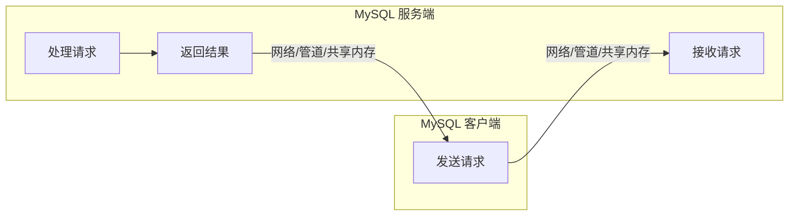
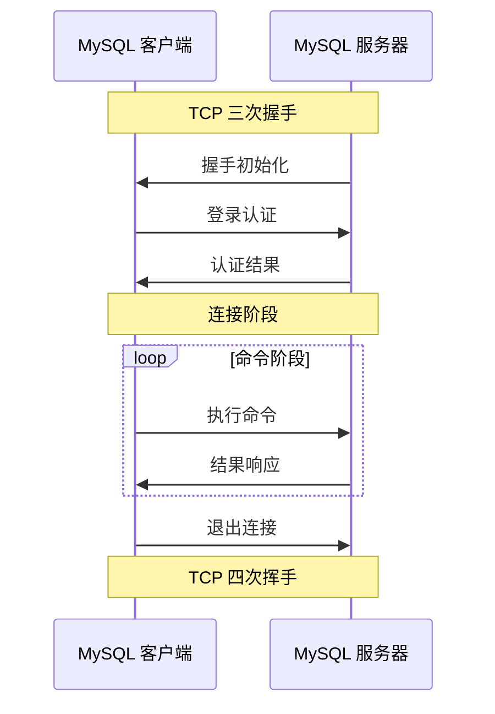

# 第3章 客户端和服务端交互协议

连接MySQL 数据库的操作，实质上是一种进程间通信过程，其中进程与MySQL 数据库实例在进程通信的多种机制中，常见的包括管道、命名管道、TCP/IP 套接字以及UNIX 域套接字。MySQL 数据库所提供的连接手段，从根本上讲均在上述列举的进程通信方式范畴之内。

## 3.1 MySQL 的连接方式

接下来将介绍三种常用的连接方式，分别是TCP/IP 套接字、UNIX 域套接字、命名管道和共享内存。

### 3.1.1 TCP/IP 套接字

MySQL 数据库提供了一种普遍适用的连接方式，即套接字方式，此方式在各类系统环境下均被支持，且在日常开发中被广泛应用。它不仅适用于本地数据库的连接需求，同样也能够满足远程连接的场景。本章后续所探讨的通信协议正是建立在此连接方式的基础之上。

这里我们使用Linux 的 `tcpdump` 命令，初步了解TCP/IP 套接字连接的基本原理。首先我们在MySQL 服务端开启监听，然后使用远程客户端来连接MySQL 数据库，之后断开连接。这时我们来观察服务端监听端口捕获的所有数据包，如图3-1 所示。

`tcpdump` 的基本输出遵循一定的格式规范，具体为：先是系统时间，紧随其后的是来源主机的IP 地址及端口号，指向符号“ >”，再后则是目标主机的IP 地址及其端口号，最后列出数据包的相关参数。在此参数集中，Flag 标志位作为关键信息之一，用于明确标识每个数据包的特定类型。

> **图3-1 tcpdump 抓取的MySQL 数据包**（此处为文本描述，原图展示了三次握手与四次挥手的包序列）

为便于理解上述数据包类型，这里对常见Flag 标志位的含义进行了简明扼要的归纳，如表3-1 所示。

**表3-1 Flag 标志位的含义**

| Flag 简写 | 含义         |
|-----------|--------------|
| FIN (F)   | 表示关闭连接 |
| SYN (S)   | 表示建立连接 |
| RST (R)   | 表示连接重置 |
| PSH (P)   | 表示有数据传输 |
| ACK (A)   | 表示响应     |

特别需要指出的是，Flags [.] 实际上用于表示ACK（确认）状态。基于上述信息，我们可以对MySQL 服务端监听到的数据包进行深入分析。前三个数据包构成了TCP 连接的三次握手过程，这是建立连接的标准流程。而最后三个数据包则代表了TCP 连接的断开过程，即四次挥手，但在此处仅捕获到三个包，原因在于在实际的四次挥手过程中，第二次和第三次挥手被合并为一个数据包发送，因此未能分开捕获。至于中间的数据包，则主要涉及客户端与服务端之间的连接握手认证以及命令执行等交互过程，这些具体的协议细节将在后续的MySQL 协议章节中做详细阐述。

### 3.1.2 UNIX 域套接字

在Linux 和UNIX 系统环境中，该连接方式可被采用，但其适用条件严格限定客户端与实例必须处于同一台服务器上，以确保其作为最高效的连接途径。实施此方式前，首要步骤是在相应的配置文件中精确指定套接字文件的存放路径，具体格式为：

```ini
--socket=/var/lib/mysql/mysql.sock
```

随后，当客户端通过此方式建立与服务器的连接时，必须明确使用 `-S` 参数，并附带正确的套接字文件路径，示例命令格式如下：

```bash
mysql -uroot -p123456 -S /var/lib/mysql/mysql.sock
```

### 3.1.3 命名管道和共享内存

这两种方法均仅限于在Windows 环境下运行，且要求客户端与MySQL 实例部署于同一台服务器之上。在采用此方案之前，用户需在相应的配置文件中明确启用此功能，具体步骤为添加对应的配置指令。

- 开启命名管道：`--enable-named-pipe=on/off`
- 开启共享内存：`--shared-memory=on/off`

## 3.2 交互过程

本节进一步阐述MySQL 客户端发送请求至服务端的具体流程，以及服务端如何接收并处理这些请求，最后如何将处理结果有效地反馈回客户端。MySQL 客户端请求服务端流程如图3-2 所示。



> **图3-2 MySQL 客户端请求服务端流程**

客户端发送的请求首先遵循特定的协议格式被封装成一系列数据包，随后通过预设的连接方式被传输至服务端。服务端在接收到这些数据包后，首要步骤是进行协议解码，提取出需要执行的具体指令。完成指令执行后，服务端将执行结果再次按照既定的协议格式封装成数据包，并回传给客户端。

客户端与服务端之间的所有交互均通过MySQL 通信协议实现，该协议位于应用层之下、TCP/IP 网络层之上。值得注意的是，在不同的交互阶段，以及针对不同的请求命令时，MySQL 通信协议会采用相应的不同格式。MySQL 客户端登录认证流程如图3-3 所示。



> **图3-3 MySQL 客户端登录认证流程**

以TCP/IP 套接字连接方式为例，MySQL 客户端与服务端之间的通信流程需遵循一系列严谨且标准化的步骤。首先，双方需建立TCP 连接，此过程标志着通信准备阶段的开始。紧接着，进入连接或认证阶段，在这个阶段中，服务器会主动向客户端发送握手初始化消息，作为通信建立的初步确认。客户端在接收到此消息后，会相应地发送一个验证包，以响应服务器的认证请求。随后，服务器将对客户端进行权限验证，验证结果将通过特定消息形式发送回客户端。

若权限认证成功，通信双方即进入命令交互阶段。在此阶段，服务端将处于持续监听状态，接收来自客户端的命令请求。针对每个请求，服务端将执行相应的操作，并将执行结果，包括操作状态、查询结果集等关键信息，准确无误地反馈给客户端。直至客户端主动发起断开连接的请求，整个通信过程方告结束。

### 3.2.1 MySQL 通信协议

作为数据库操作中的核心机制，MySQL Client Server 通信协议广泛应用于客户端连接、主从复制配置，以及MySQL 代理服务等场景。此外，对于开发数据库中间件或实现高效数据传输等高级应用来说，深入理解MySQL 底层的通信协议尤为重要。本小节将聚焦于MySQL 通信协议如何有效促进客户端与服务器之间的信息交互。首先，我们需要对MySQL 的基本概念与原理进行必要的回顾与理解。

#### 1. 基础类型

如同编程语言中的基本类型概念，MySQL 通信协议亦设定了其基本数据类型，其结构相对简洁，仅涵盖两种核心类型：整数型与字符型。对于整数型数据，MySQL 协议进一步细化为两种编码方式，即固定长度整数类型（Fixed-Length Integer Type）与长度编码整数类型（Length-Encoded Integer Type），以满足不同的数据传输需求。

- **固定长度整数类型**：表示定长的无符号整数，具体固定字节数可以是1、2、3、4、8，使用小字节序传输。
- **长度编码整数类型**：顾名思义，就是长度编码的整型，用来存储变长的整数，其中数据所占的字节数不定，由第一个字节约定。长度编码整数类型数据所占的字节数约定如表3-2 所示。

**表3-2 长度编码整数类型数据所占的字节数约定**

| 第一个字节值       | 后续字节数 | 数据范围           | 数据说明                       |
|-------------------|------------|--------------------|--------------------------------|
| 0x00 ～ 0xFB     | 0          | [0, 251)           | 第一个字节值即为真实数据        |
| 0xFC             | 2          | [251, 2^16)        | 第一个字节后额外2 个字节标识数据 |
| 0xFD             | 3          | [2^16, 2^24)       | 第一个字节后额外3 个字节标识数据 |
| 0xFE             | 8          | [2^24, 2^64)       | 第一个字节后额外8 个字节标识数据 |

例如，对于整型而言，100 的编码被明确地表示为 `0x64`，这一表述直观易懂。而针对65536 的编码，其呈现为 `0xFD 0x000001`。在此，需明确 `0x` 为十六进制数的标识。首个字节 `FD` 作为标识，指出该整数数值位于 2^16 ～ 2^24 的范围内。紧随其后的三个字节则具体表示了数值的真实内容。将65536 转换为十六进制，得到的是 `0x10000`。然而，鉴于采用的是小字节序的存储方式，故而在编码中呈现为 `0x000001`。一旦掌握了这种编码规则，后续对于长度编码的字符串类型所采用的类似处理方式，便能够轻松理解。

对于字符型而言，在MySQL 协议中，字符型数据支持五种编码方式，具体为：`FixedLengthString`、`NullTerminatedString`、`VariableLengthString`、`LengthEncodedString` 以及 `RestOfPacketString`。这些编码方式确保了字符型数据在MySQL 协议中的有效传输和处理。

- `FixedLengthString`：固定长度的字符串类型，其中一个具体实例为 `ERR_Packet`，后续将详细进行阐述。此类型字符串长度始终保持为5 B。
- `NullTerminatedString`：以特定的字节值 Null（即字节值为 `0x00`）作为终止符的字符串形式。这种字符串结构确保了数据的完整性和边界的明确性，便于在多种编程环境和数据处理系统中进行高效且准确的读写操作。
- `VariableLengthString`：变长字符串类型，字符串的长度由另一个字段决定或在运行时计算，比如一个字符串由 `Int + Value` 组成，我们通过计算 `Int` 值来获取 `Value` 的具体长度。
- `LengthEncodedString`：采用长度编码的字符串类型，其前缀为一个整数，该整数为字符串长度的长度编码形式，符合 `VariableLengthString` 所规定的 `Int+Value` 方式，其中长度的编码方式采用前文所述的长度编码整数类型。
- `RestOfPacketString`：包末端的字符串，可根据包的总长度和当前位置得到字符串的长度，实际中并不常用。

#### 2. 报文结构

MySQL 客户端或服务器想要发送数据，首先需要遵循以下原则：每个数据包的大小必须严格限制在 2^24 B（即 16 MB）以内。每个数据包需遵循特定的报文结构进行构建，该报文内部结构如图3-4 所示。

```mermaid
block-beta
    columns 3
    block:header[消息头 - 4 B]
        len["消息长度 (3 B)"]
        seq["序列ID (1 B)"]
    end
    block:body[消息体 - n B]
        payload["消息体内容 (n B)"]
    end
    len --> payload
```

> **图3-4 报文内部结构**

报文由消息头和消息体两个核心部分构成。消息头占据固定的4 B 空间，其设计旨在为后续的数据处理提供必要的信息框架。消息体的长度并非随意设定，而是严格依据消息头内的一个特定长度字段来确定，以确保数据的完整性和准确性。

在消息头的组成上，前3 B 承担着标记当前请求实际数据长度值的重要职责，这一设计确保了数据接收方能够准确无误地识别并处理每一条请求中的核心数据内容。而第4 B 则作为当前请求的序列 ID 存在，其值从0 起始，并随着请求的生成依次递增，这一机制为消息的有序处理提供了坚实的保障，确保了数据在传输和接收过程中的顺序正确性。

对于上述报文结构的详细应用实例及进一步的解析，我们将在后续章节中逐一呈现，以便读者能够更加深入地理解和掌握。

### 3.2.2 连接阶段

连接阶段主要分为握手初始化和登录认证，握手初始化主要是在TCP/IP 连接建立之后，主要是校验一些基础信息，例如数据库版本、字符集编码等。登录认证主要是验证客户端发送过来的用户名和密码是否正确，下面将详细介绍这两个阶段。

#### 1. 握手初始化报文

在TCP/IP 连接成功建立之后，服务端将主动向客户端发送一个请求，即握手初始化过程，其目的在于通知客户端：“请注意，我方即将开始验证你的身份。”这一过程中所使用的报文，即握手初始化报文（Handshake Packet），如图3-5 所示。


> **图3-5 握手初始化报文**（注：实际图示中字段顺序较为复杂，此处以简化结构示意）

下面对该报文的关键属性进行简单说明：

- **协议版本**：即协议版本号，通常设定为10，此数值依据 `PROTOCOL_VERSION` 宏定义来确定。
- **数据库版本**：数据库版本信息，由 `MYSQL_SERVER_VERSION` 宏定义确定。
- **线程ID**：服务端为此次连接启动的线程ID。
- **随机挑战数**：该过程被划分为两个主要部分，旨在实现数据库认证。在MySQL 数据库认证场景中，我们采用了一种称为“挑战-应答”的认证机制。具体而言，此机制首先由服务端发起，生成一个挑战数并将其发送至客户端。随后，客户端需对该挑战数进行相应处理，并将处理结果返回给服务端。服务端在接收到客户端的应答后，会将其服务端在接收到客户端的应答后，会将其与预期的结果进行比对，以验证其正确性。若比对结果一致，则表明用户认证成功，从而完成整个认证流程。

- **服务器权能标志**：用于与客户端协商通信方式。
- **字符编码**：标识当前数据库所采用的字符集。
- **服务器状态**：用于表示服务器状态，比如是否处于自动提交模式或者事务模式。

下面我们通过 `tcpdump -X` 命令来观察握手初始化数据包：

```
0x0000:  4500 0082 c558 4000 4006 b4c5 c0a8 1ff9  E....X@.@.......
0x0010:  c0a8 1f0e 0cea b07e b719 0a2f eca1 2ce3  .......~.../..,.
0x0020:  8018 01fe c0cc 0000 0101 080a 33c4 5dd6  ............3.].
0x0030:  fbee 62cc 4a00 0000 0a35 2e37 2e31 3900  ..b.J....5.7.19.
0x0040:  0700 0000 321f 052d 3a52 454c 00ff f721  ....2..-:REL...!
0x0050:  0200 ff81 1500 0000 0000 0000 0000 004d  ...............M
0x0060:  730e 405a 4d6d 215c 591c 2b00 6d79 7371  s.@ZMm!\Y.+.mysq
0x0070:  6c5f 6e61 7469 7665 5f70 6173 7377 6f72  l_native_password
0x0080:  6400
```

在深入理解TCP/IP 协议体系的基础上，我们可以明确，IP 数据报文的结构由IP 首部和IP 数据部分两大核心组件构成。IP 首部遵循着固定的20 B 长度规范，确保了数据传输的一致性与高效性。而IP 数据部分则进一步细分为TCP 的首部及数据部分，其中，TCP 的数据部分承载着至关重要的MySQL 协议信息，这是我们需要深入剖析与研究的对象。

综上所述，通过解析上述数据包内容，可以明确前20 B 构成了IP 头部，紧接着的是TCP 头部。在TCP 头部的结构中，其开头4 B 用于标识源端口和目标端口信息；随后的两个4 B 字段则分别承载着序列号和确认号的关键数据，这些细节在此不做进一步阐述。我们的关注焦点在于TCP 头部中第4 B 的前4 bit，这一字段实际上用于表示TCP 头部的长度，其计量单位为4 B。基于这一信息，我们可以计算出TCP 头部总共占据了 8×4 = 32 B 的空间。在明确TCP 头部的结构之后，我们将能够深入细致地分析登录认证过程中所传输的数据报文。由前面分析的报文结构可以知道：

- 前3 B 0x4a00,00 表示报文长度，转换为十进制即74 B。
- 后面1 B 0x00 表示消息序列号，后面就是包体内容。
- 后1 B 0x0a 表示协议版本号，转换为十进制是10，所以协议号版本是10。
- 再往后表示数据库版本信息，它是NullTerminatedString 类型，即遇到00 结束，35 2e37 2e31 39 对应的5.7.19，正是当前使用的数据库版本。
- 再后面4 B 0x0700 0000 表示线程ID。
- 其后8 B 0x321f 052d 3a52 454c 为随机挑战数。
- 00 为填充值，ff f7 表示与客户端协商通信方式，此处为 - CLIENT_PLUGIN_AUTH，表示支持身份验证插件。
- 21 表示数据库的编码，0200 表示服务器状态。
- 之后26 B 就是挑战随机数和填充值，最后22 B 表示认证插件。

#### 2. 登录认证报文

在服务器发起握手初始化过程之后，客户端会向服务器提交一个登录认证包，该过程旨在验证数据库用户的登录凭证。由于MySQL 4.0 版本前后存在差异，这里聚焦于MySQL 4.1 及后续版本中登录认证报文（Authentication Packet）的格式描述，登录认证报文结构如图3-6 所示。


> **图3-6 登录认证报文结构**

下面对该报文的关键属性进行简单说明：

- **客户端权能标志**：用于与服务端协商通信方式。客户端收到服务端发送的握手初始化报文后，会对服务端发送的权能标志进行修改，保留自身所支持的功能，然后将权能标志返回给服务端，从而保证服务端与客户端通信的兼容性。
- **最大消息长度**：客户端在通信过程中，发送或接收的消息均遵循一定的长度限制，该限制由客户端所支持的最大消息长度值确定。关于字符编码方面，客户端所采用的字符编码应与在握手初始化报文中由服务端所发送的字符编码保持一致。
- **用户名**：用户名是客户端登录时所需的标识符。在挑战认证流程中，客户端会将用户密码与服务器发送的挑战随机数结合进行加密处理，生成挑战认证数据，随后将此数据返回至服务器，以便进行用户身份的验证与确认。
- **数据库名**：在客户端的权限与功能配置中，若 `CLIENT_CONNECT_WITH_DB` 标志位被明确激活或置位，则此特定字段成为必填项，旨在明确指示所连接的目标数据库。反之，在标志位未激活的情况下，该选项则被视为非强制性，用户可根据实际情况选择是否提供。

为了进一步解析与审查登录认证过程中的数据包详情，我们可以借助 `tcpdump` 工具并附带 `-X` 选项，此操作将允许我们以十六进制及ASCII 码形式捕获并展示网络数据包，从而深入观察并分析登录认证流程中的具体信息。

```
0x0000:  4500 00ef bcae 4000 4006 bd02 c0a8 1f0e  E.....@.@.......
0x0010:  c0a8 1ff9 b07e 0cea eca1 2ce3 b719 0a7d  .....~....,....}
0x0020:  8018 01f6 b463 0000 0101 080a fbee 62cf  .....c........b.
0x0030:  33c4 5dd6 b700 0001 85a6 ff01 0000 0001  3.].............
0x0040:  2100 0000 0000 0000 0000 0000 0000 0000  !...............
0x0050:  0000 0000 0000 0000 726f 6f74 0014 ab41  ........root...A
0x0060:  a9cc c77b 68ac a47e d697 44e8 9933 fd79  ...{h..~..D..3.y
0x0070:  858d 6d79 7371 6c5f 6e61 7469 7665 5f70  ..mysql_native_p
0x0080:  6173 7377 6f72 6400 6603 5f6f 7305 4c69  assword.f._os.Li
0x0090:  6e75 780c 5f63 6c69 656e 745f 6e61 6d65  nux._client_name
0x00a0:  086c 6962 6d79 7371 6c04 5f70 6964 0533  .libmysql._pid.3
0x00b0:  3037 3438 0f5f 636c 6965 6e74 5f76 6572  0748._client_ver
0x00c0:  7369 6f6e 0635 2e37 2e31 3909 5f70 6c61  sion.5.7.19._pla
0x00d0:  7466 6f72 6d06 7838 365f 3634 0c70 726f  tform.x86_64.pro
0x00e0:  6772 616d 5f6e 616d 6505 6d79 7371 6c    gram_name.mysql
```

同样，起始部分是IP 首部，占据20 B，紧接着是TCP 首部，占据32 B（8×4），随后从偏移量 0xb700 开始即为登录认证数据包的具体内容。通过综合分析报文结构与登录认证报文格式，我们可以进一步进行解析与探讨。

- 前3 B 0xb700,00 表示报文长度，转换为十进制即183 B。
- 后面1 B 0x01 表示消息序列号，后面就是包体内容。
- 0x85a6 ff01 为客户端权能标志。
- 0x0000 0001 为客户端支持最大消息长度。
- 0x21 表示数据库的编码，后面23 对00 为填充值。
- 0x726f 6f74 表示用户名，以00 为结束标志，解码即为 root。
- 0x14 对应的十进制是20，表示后续20 B 就是加密后的密码。

本例可选的数据库名称不存在，最后部分表示认证插件。

### 3.2.3 命令执行阶段

命令执行阶段涉及的内容非常多，因为MySQL 支持非常多的命令，并且不同的命令最终返回的内容及编码格式也不一样。特别地，如果查询的是MySQL 的表数据，其中数据也区分各种类型的编码。下面将大致介绍一下命令执行的流程，并用查询语句来举例说明。

#### 1. 命令请求报文

在客户端成功建立与数据库的连接之后，其便拥有了向服务端发起执行数据库操作的请求权限，这些操作包括但不限于数据的增加、删除、修改及查询，以及数据库的创建和表的建立等。此类命令请求报文如图3-7 所示。


> **图3-7 命令请求报文**

下面对该报文的属性进行简单说明：

- **命令类型**：本段旨在阐述当前请求命令的类型。命令类型的具体说明如表3-3 所示（命令列表已在源代码目录下的 `include/mysql_com.h` 头文件中明确定义）。

**表3-3 命令类型的具体说明**

| 命令           | 取值  | 说明                         |
|----------------|-------|------------------------------|
| COM_SLEEP      | 0x00  | （内部线程状态）              |
| COM_QUIT       | 0x01  | 关闭连接                     |
| COM_INIT_DB    | 0x02  | 切换数据库                   |
| COM_QUERY      | 0x03  | SQL 查询请求                 |
| COM_FIELD_LIST | 0x04  | 获取数据表字段信息           |
| COM_CREATE_DB  | 0x05  | 创建数据库                   |
| COM_DROP_DB    | 0x06  | 删除数据库                   |
| COM_REFRESH    | 0x07  | 清除缓存                     |
| COM_SHUTDOWN   | 0x08  | 停止服务器                   |
| COM_STATISTICS | 0x09  | 获取服务器统计信息           |
| COM_PROCESS_INFO | 0x0A | 获取当前连接的列表          |
| COM_CONNECT    | 0x0B  | （内部线程状态）              |
| COM_PROCESS_KILL | 0x0C | 中断某个连接                |
| COM_DEBUG      | 0x0D  | 保存服务器调试信息           |
| COM_PING       | 0x0E  | 测试连通性                   |
| COM_TIME       | 0x0F  | （内部线程状态）              |
| COM_DELAYED_INSERT | 0x10 | （内部线程状态）          |
| COM_CHANGE_USER | 0x11 | 重新登录（不断连接）         |
| COM_BINLOG_DUMP | 0x12 | 获取 binlog 日志信息         |
| COM_TABLE_DUMP | 0x13  | 获取数据表结构信息           |
| COM_CONNECT_OUT | 0x14 | （内部线程状态）             |
| COM_REGISTER_SLAVE | 0x15 | 从服务器向主服务器进行注册 |
| COM_STMT_PREPARE | 0x16 | 预处理SQL 语句              |
| COM_STMT_EXECUTE | 0x17 | 执行预处理语句              |
| COM_STMT_SEND_LONG_DATA | 0x18 | 发送 BLOB 类型的数据 |
| COM_STMT_CLOSE | 0x19  | 销毁预处理语句               |
| COM_STMT_RESET | 0x1A  | 清除预处理语句参数缓存       |
| COM_SET_OPTION | 0x1B  | 设置语句选项                 |
| COM_STMT_FETCH | 0x1C  | 获取预处理语句的执行结果     |

## 3.0 第3章 客户端和服务端交互协议

> [!NOTE] 继续前文
> 本部分接续前文，涵盖命令请求包参数描述、服务器响应报文详解、连接处理与线程创建，以及 THD 类细节。

### 3.2.1 命令请求包（续）

❑ **参数**：用户输入的 MySQL 客户端命令（不包含每行命令末尾的分号“;”），其字段的字符串最终结束符并非依赖于 NULL 字符，而是通过消息头部中的长度值来界定其边界的。

下面我们通过 `tcpdump -X` 的方式来观察请求执行一条 `select` 命令的数据包：

```
0x0000:  4500 004d bcd0 4000 4006 bd82 c0a8 1f0e  E..M..@.@.......
0x0010:  c0a8 1ff9 b07e 0cea eca1 2f25 b719 0eb3  .....~..../%....
0x0020:  8018 01f5 902b 0000 0101 080a fbf2 7715  .....+........w.
0x0030:  33c8 2a97 1500 0000 0373 656c 6563 7420  3.*......select.
0x0040:  2a20 6672 6f6d 2074 6573 7474 62         *.from.testtb
```

命令请求数据包比较简单，除去 IP 首部和 TCP 首部，分析如下：

- ❑ 前 3 B `0x1500，00` 表示报文长度，转换为十进制即 21 B。
- ❑ 后面 1 B `0x01` 表示消息序列号，再后面就是包体内容。
- ❑ `0x03` 表示命令类型，即 SQL 查询请求。
- ❑ 其后 20 B 即为实际请求命令。

### 3.2.2 服务器响应报文

不管是客户端发起登录认证还是请求执行命令，服务器都要返回相应的执行结果给客户端。此处的执行结果可以是查询指令的结果集，也可以是数据库操作的执行状态。服务器响应报文的第一个字节表示报文类型，客户端收到响应报文后，根据报文类型解析具体报文内容。响应报文详解如表 3-4 所示。

**表 3-4 响应报文详解**

| 响应报文类型 | 含义 | 具体格式 |
|:---|:---|:---|
| **OK_Packet** | 执行成功标志，比如连接数据库、非查询操作、注册从库、数据刷新等 | `int<1>`：恒为 0x00 <br> `int`：受影响行数 <br> `int`：该值为 AUTO_INCREMENT 索引字段生成，如果没有索引字段，则为 0x00。 <br> `int<2>`：服务器状态 <br> `int<2>`：告警计数 <br> `string`：服务器消息（可选） |
| **ERR_Packet** | 执行失败标志，比如登录认证不通过、非法查询、非空字段未指定值 | `int<1>`：恒为 0xFF <br> `int<2>`：错误码，在源代码 `include/mysqld_error.h` 头文件中定义 <br> `string[1]`：SQL 执行状态标识位，用 `#` 进行标识 <br> `string[5]`：SQL 的具体执行状态 <br> `string`：错误消息 |
| **EOF_Packet** | 用于标识 Field 和 Row Data 的结束，在预处理语句中，EOF 也被用来标识参数的结束 | `int<1>`：恒为 0xFE <br> `int<2>`：告警计数 <br> `int<2>`：状态标志位 |
| **Result Set** | 返回结果集，比如 SELECT、SHOW | Result Set 消息分为五部分：<br> - Result Set Header：返回数据的列数量<br> - Field：返回数据的列信息（多个）<br> - EOF：列结束<br> - Row Data：行数据（多个）<br> - EOF：数据结束 |
| **Field** | 数据表的列信息 | `LengthEncodedString`：目录名称 <br> `LengthEncodedString`：数据库名称 <br> `LengthEncodedString`：数据表名称（AS 后名称） <br> `LengthEncodedString`：数据表原始名称（AS 前名称） <br> `LengthEncodedString`：列（字段）名称 <br> `LengthEncodedString`：列（字段）原始名称 <br> `int<1>`：填充值 <br> `int<2>`：字符编码 <br> `int<4>`：列（字段）长度 <br> `int<1>`：列（字段）类型（参考源代码 `include/mysql_com.h` 头文件中的 `enum_field_type`） <br> `int<2>`：列（字段）标志（参考源代码 `include/mysql_com.h` 头文件中的宏定义） <br> `int<1>`：针对 DECIMAL 和 NUMERIC 类型的精度 <br> `int<2>`：填充值（0x00） <br> `LengthEncodedString`：默认值 |
| **Row Data** | 在 Result Set 消息中，会包含多个 Row Data 结构，每个 Row Data 结构又包含多个字段值，这些字段值组成一行数据 | `LengthEncodedString`：字段值 <br> `……`：多个字段值 |

除了上述常见的报文结构外，还存在 **PREPARE_OK 包**、**Execute 包**、**Parameter 包**等特定的报文结构，这些结构被应用于某些特定的响应场景中。例如，PREPARE_OK 包出现在客户端向服务器发送预处理 SQL 语句后，服务器正确进行响应的场景中。这种机制在编程实践中尤为常见，比如在编写 Java 程序时，经常使用的 `PreparedStatement` 便是一种进行 SQL 预处理的有效工具。

接下来，我们将通过 `tcpdump -X` 选项来详细观察客户端请求执行 `select` 命令后，服务器所返回的响应结果。此过程旨在深入了解网络通信中报文的具体传输情况。

```sql
mysql> select * from testtb;
+----+---------+
| id | name    |
+----+---------+
|  1 | zhangyu |
```

服务器响应数据包如下：

```
0x0000:  4500 00b6 c576 4000 4006 b473 c0a8 1ff9  E....v@.@..s....
0x0010:  c0a8 1f0e 0cea b07e b719 0eb3 eca1 2f3e  .......~....../>
0x0020:  8018 01fd c100 0000 0101 080a 33c8 7221  ............3.r!
0x0030:  fbf2 7715 0100 0001 022c 0000 0203 6465  ..w......,....de
0x0040:  6606 7465 7374 6462 0674 6573 7474 6206  f.testdb.testtb.
0x0050:  7465 7374 7462 0269 6402 6964 0c3f 000b  testtb.id.id.?..
0x0060:  0000 0003 0350 0000 0030 0000 0303 6465  .....P...0....de
0x0070:  6606 7465 7374 6462 0674 6573 7474 6206  f.testdb.testtb.
0x0080:  7465 7374 7462 046e 616d 6504 6e61 6d65  testtb.name.name
0x0090:  0c21 006c 0000 00fd 0000 0000 000a 0000  .!.l............
0x00a0:  0401 3107 7a68 616e 6779 7507 0000 05fe  ..1.zhangyu.....
0x00b0:  0000 2200 0000                 .."...
```

由于响应查询请求，按照 **Result Set** 格式来分析数据包：

- ❑ `0x02` 对应的是 Result Set Header，表示 2 个字段。
- ❑ `0x2c 0000 02` 表示第一列信息占 44 B。
- ❑ `0x03 6465 66` 中 `03` 表示后面 3 B 是目录名称，此处为默认值 `def`。
- ❑ `0x06 7465 7374 6462` 中 `06` 表示后面 6 B 是数据库名称，解码后即为 `testdb`。
- ❑ `0x0674 6573 7474 62` 中 `06` 表示后面 6 B 是数据表名称，解码后为 `testtb`。
- ❑ `0x0674 6573 7474 62` 中 `06` 表示后面 6 B 是数据表原始名称，解码后为 `testtb`。
- ❑ `0x02 6964` 中 `02` 表示后面 2 B 为列名称，即 `id`。
- ❑ `0x02 6964` 中 `02` 表示后面 2 B 为列原始名称，即 `id`。
- ❑ `0x0c3f 00` 表示填充值和字符编码。
- ❑ `0x0b0000 00` 表示列长度，此处 id 定义为 int(10)，转换为十六进制即为 `0b`。
- ❑ `0x03 0350 00` 分别表示列类型（`FIELD_TYPE_LONG`）、标识、整型值精度。
- ❑ `0x00 00` 为填充值。
- ❑ `0x30 0000 03` 表示第二列信息所占 48 B，具体列信息不再赘述。
- ❑ 从 `0a 0000 04` 开始，后面即为行数据，所占 10 B，具体解析为：
    - ① `0x01 31` 中 `01` 表示后面一个字节为第一个字段 id 值，解码后为 `1`；
    - ② `0x07 7a68 616e 6779 75` 中 `07` 表示后面 7 个字节为第二个字段 name 值，解码后为 `zhangyu`。

---

### 3.3 处理连接与创建线程

我们知道 MySQL 内部是一个多线程的处理模型，那么在多个客户端同时发请求时，MySQL 内部是如何处理客户端连接并且为每个客户端创建一个线程的呢？下面将详细介绍。

#### 3.3.1 MySQL 监听客户端请求

MySQL 是一款采用 C 和 C++ 编程语言开发的软件。为了深入且迅速地理解 MySQL 的源代码，通常需要从其主函数入手。MySQL 服务端的起始点明确位于 `sql/main.cc` 文件中。一旦进入该入口函数，可以观察到其主要作用是调用 `mysqld_main` 函数，该函数实为 MySQL 启动流程的核心实现。

在第 2 章我们介绍过，`mysqld_main` 函数承载了诸多关键任务，包括处理配置文件与启动参数、初始化系统层面的全局变量、设置日志机制及同步信号、初始化网络通信模块并启动循环监听等。本节重点聚焦于与连接创建直接相关的操作流程。MySQL 启动流程概要如图 3-8 所示。

> [!figure]- 图 3-8 MySQL 启动流程概要
> ```mermaid
> flowchart TD
>     A[mysqld_main] --> B[处理配置文件与启动参数]
>     B --> C[初始化全局变量]
>     C --> D[设置日志机制及同步信号]
>     D --> E[初始化网络通信模块<br>network_init]
>     E --> F[启动循环监听<br>connection_event_loop]
>     F --> G[等待连接]
>     G --> H[处理连接]
> ```

在跳过 `mysqld_main` 函数中针对配置文件及参数的处理步骤后，首先需要进入 `network_init` 阶段，以执行网络系统的初始化。此过程涉及两个至关重要的类，它们在网络系统的构建与配置中扮演着核心角色。

- ❑ **`Connection_acceptor`**：这是一个模板类，它通过 `Mysqld_socket_listener` 类完成实例化，封装了对于监听套接字的操作，支持不同的监听实现。
- ❑ **`Mysqld_socket_listener`**：实现以套接字的方式监听客户端的连接，支持 TCP 套接字和 UNIX 套接字两种方式。

网络初始化具体完成以下两项工作：先获取 `mysqld_socket_listener`，创建 `Connection_acceptor`；然后执行 `mysqld_socket_listener` 的 `setup_listener` 操作，对网络和域套接字分别初始化，注意此时还没有启动监听。

网络初始化完成后，进入 `mysqld_socket_acceptor->connection_event_loop()`，启动循环监听客户端连接，与该操作相关的类为：`Connection_handler_manager` 和 `Connection_handler`。前者是一个全局的单例模式，用于管理连接处理器；后者是一个虚基类，用于具体实现如何处理连接。各种连接方式都是继承这个类来实现，常见连接方式主要有三种：

- ❑ **`Per_thread_connection_handler`**：一个连接一个线程，默认实现方式，可以通过 `thread_handling` 参数设置。
- ❑ **`One_thread_connection_handler`**：所有连接用一个线程。
- ❑ **`Plugin_connection_handler`**：由插件具体实现，例如线程池。

该过程主要有两项工作：一是执行 `mysqld_socket_listener` 的 `listen_for_connection_event` 操作，监听客户端请求，获取请求后，构造一个 `Channel_info` 用于保存所有与连接相关的信息；二是执行 `Connection_handler_manager` 的 `process_new_connection` 操作，处理新连接。服务是否停止？
开始处理连接
是
是
是否存在空闲线程？
创建新线程
唤醒线程
连接数
 是否已达上限？
否
否
否
是
关闭连接
关闭连接

**图3-9 process_new_connection 方法流程图**

首先判断服务是否停止，如果是，则关闭连接并返回，否则进行下一步。在执行连接计数递增操作时，通过调用 `check_and_incr_conn_count` 函数来实现。该函数负责检查当前连接数是否已达上限。若当前连接数已超出预设的最大连接数，则返回失败。

> [!NOTE] 例外情况
> 存在一个例外情况：在当前连接数恰好等于最大连接数时，系统仍会允许管理员用户额外建立一个连接，因此实际可承受的最大连接数应为预设的最大连接数加一。

在确认连接数尚未触及上限的前提下，将执行 `Connection_handler` 模块中的 `add_connection` 操作。在 `Per_thread_connection_handler` 模式下，每个独立的连接均被分配至一个专属线程进行处理，同时，MySQL 系统为了优化连接处理效率，会预先缓存一定数量的线程以供复用。这一缓存线程的上限由 `max_blocked_pthreads` 变量进行调控。

在执行 `add_connection` 操作时，系统会首先评估当前是否存在空闲线程。若有空闲线程存在，则立即唤醒该线程，并将 `channel_info` 信息加入至其处理队列中；反之，若当前无空闲线程可用，系统将触发新线程的创建流程，以满足新增连接的处理需求。

### 3.3.2 创建连接线程

在 MySQL 系统中，若遇到无空闲线程可供分配的情境，系统将触发 `mysql_thread_create` 函数的执行，以创建新的线程来应对请求。具体而言，这一过程中会执行 `hangle_connection` 函数以处理新的连接。接下来，我们将深入探讨在 `Per_thread_connection_handler` 模式下，连接线程的创建流程，如图3-10 所示。

> [!figure]- 图3-10 连接线程的创建流程
> ```mermaid
> flowchart TD
>     A[初始化内存] --> B[创建THD,并加入thd_manager]
>     B --> C[连接验证]
>     C --> D[处理请求准备]
>     D --> E[LOOP: 执行命令]
>     E --> F{等待下一个连接唤醒线程}
>     F -->|有命令到来| E
>     F -->|关闭连接| G[释放资源]
>     G --> h{等待新连接?}
>     h -->|如有| H[重新开始?]
> ```

`hangle_connection` 函数首先执行线程所需内存的初始化流程，随后调用 `init_new_thd` 函数来创建 THD 对象。作为 MySQL 系统中至关重要的一部分，THD 结构体负责承载并维护一个线程的上下文信息，其详尽描述将在后续章节中展开。创建完成的 THD 对象随后会被加入到 `thd_manager` 中，后者是一个全局性的 `Global_THD_manager` 线程管理类，它通过链表结构来集中管理和维护所有线程的 THD 对象。

在 `Per_thread_connection_handler` 模式下，每个线程均被映射至一个独立的 THD 结构。随后，通过执行 `thd_prepare_connection` 函数进行连接验证，此过程涉及多个步骤，包括用户登录验证、THD 结构中用户信息的更新、用户权限核实、SS（安全套接字层）检查以及针对单一用户设置的最大连接数限制等。在此，我们将重点阐述用户登录验证的流程。

MySQL 的用户管理相关数据被妥善存储在系统表 `mysql.user` 中，该表不仅详细记录了用户的基本身份信息，还涵盖了用户的权限设置。实际上，连接验证的核心环节便是从该表中检索用户信息，并据此进行系统验证。具体步骤概述如下：

1. 在获取客户端的 IP 地址与主机名后，我们利用 `acl_check_host(sql/sql_acl.cc)` 函数进行连接权限的验证。此验证流程核心在于检索两个关键数据结构：首先，是动态数组 `acl_wild_hosts`，该数组用于存储包含通配符的主机名，以便于进行模式匹配；其次，是哈希表 `acl_check_hosts`，该表则用于存储确切的主机名，以实现快速查找。值得注意的是，这两个数据结构均在 MySQL 服务器启动阶段，从系统表 `mysql.users` 中读取并初始化。
2. 客户端 IP 验证通过后，服务端发送握手初始化给客户端，等待客户端请求。
3. 客户端对密码进行加密后，发送登录认证请求。
4. 服务端获取请求，解析获得用户名密码后，调用 `check_user(sql/sql_connect.c)` 函数验证用户名密码。

在此需要指出，对于已在 MySQL 中创建用户的读者而言，完成用户创建及授权步骤后，必须执行 `flush PRIVILEGES` 操作，以确保新创建的用户能够立即生效。这一步骤的必要性源于 MySQL 为提高权限判断效率并减少磁盘 I/O 操作，在 `mysqld` 服务启动时，会将权限系统表的内容加载至内存中。然而，对于后续的用户权限变更操作，这些变更仅直接反映于磁盘层面，而内存中的权限系统表内容并未同步得到更新。因此，若未执行 `flush PRIVILEGES` 操作，新建用户将无法成功登录系统。

为使新建用户生效，存在两种解决方案：一是重启 `mysqld` 服务，通过服务重启的方式强制重新加载权限系统表；二是执行 `flush PRIVILEGES` 命令，该命令的作用即触发权限系统表的重新加载过程。

一旦连接验证通过，系统将进入处理请求的准备阶段。此阶段的主要任务包括内存申请、动态系统变量（如字符集、事务设置等）的设置，以及执行必要的初始化命令。准备工作完成后，系统将进入 `do_command` 阶段，即命令执行阶段。此阶段通过 `for` 循环机制，持续从网络接收客户端发送的命令。在新建立连接或当前连接处于空闲状态时，系统将在此阶段阻塞以等待新命令的到来。一旦接收到请求，系统将调用 `dispatch_command` 函数进行处理。以下是对该函数功能的一个简化描述：

```cpp
bool dispatch_command(THD *thd, const COM_DATA *com_data,
                  enum enum_server_command command)
{
  thd->set_command(command);
  switch (command) {
  case COM_INIT_DB: · · ·
  case COM_REGISTER_SLAVE: · · ·
  · · ·
  case COM_QUERY:
  {
    · · ·
      if (alloc_query(thd, com_data->com_query.query,
                  com_data->com_query.length))
      break;
    · · ·
    mysql_parse(thd, &parser_state);
    · · ·
  }
}
```

显然，该函数构成了一个复杂的 `switch` 结构，旨在依据命令类型的差异执行相应的处理流程。

> [!NOTE] COM_QUERY 的多重职能
> 尽管标记为 `COM_QUERY` 类型，但其涵盖的功能远不止简单的查询操作。实际上，该函数充当了处理数据库所有## 3.3.3 THD 类（续）

4. **接收SQL阶段**。如果 `thd->net.buf` 的大小不足以容纳用户发送的 SQL，MySQL 会重新为 `thd->net.buf` 分配内存，大小足以容纳整个 SQL，但最大不超过 `max_allowed_packet`；从 `mem_root` 中为 `thd->query` 分配内存，如果 `mem_root` 不足以容纳整个 Query，则调用系统 `malloc` 为 `thd->query` 分配内存，大小为整个 SQL 长度。

5. **词法语法分析阶段**。可以认为 `thd->query` 在 `thd->lex` 中有两个副本，一个是输入，另一个是解析之后的结果。

6. **查询阶段**。对于 `join` 查询、`Order by` 查询、临时表等不同操作进行不同的内存分配，比如 `join` 查询，根据 `join` 表的个数来分配内存，两个表之间 `join` 会使用一个 `join buffer`。

7. **返回结果**。MySQL 使用 `thd->packet` 作为 MySQL 的发送缓冲区，初始大小为 `net_buffer_length`。如果 MySQL 表有 `blob` 或者 `text` 字段，导致发送缓冲区不足以容纳一行数据，MySQL 会重新分配内存，但是最大不超过 `max_allowed_packet`。返回结果以后，MySQL 会把发送缓冲区恢复为默认。

---

### 3.4 总结

本章详细阐述了 MySQL 中常见的连接途径、MySQL 通信协议及交互流程，并给出了处理连接与创建线程的具体步骤。深入掌握这些知识，有助于我们灵活选用既可用又高效的连接方式。深入理解 MySQL 通信协议则能够帮助我们便捷地实现自定义网络监控功能。而清晰地理解处理连接与创建线程的过程，对于分析特定内存问题以及性能瓶颈，特别是针对短连接优化的处理，特别有帮助。