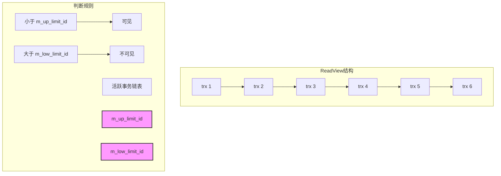
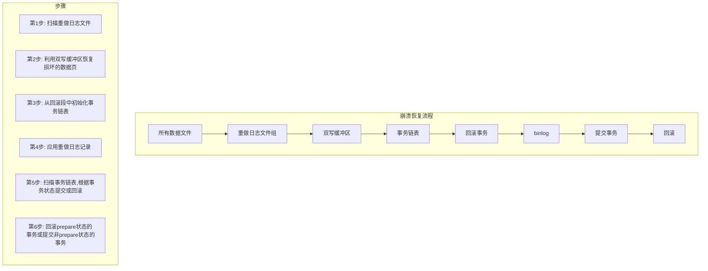
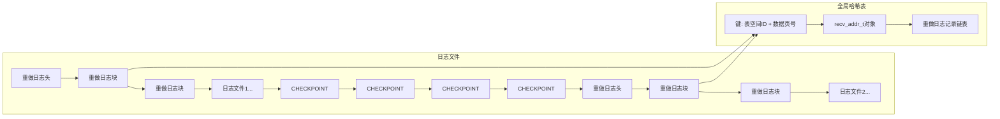
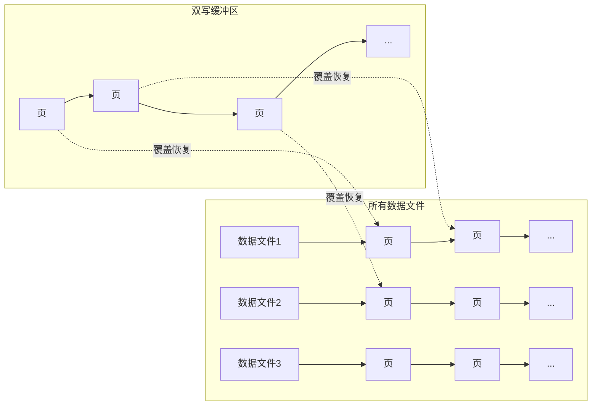
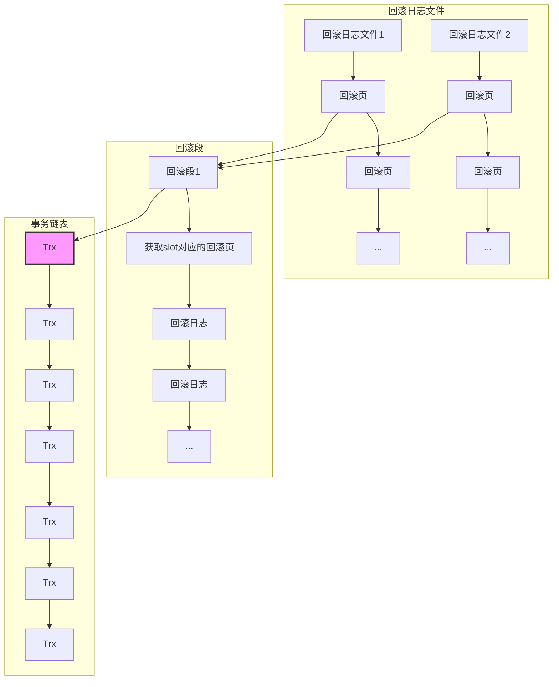
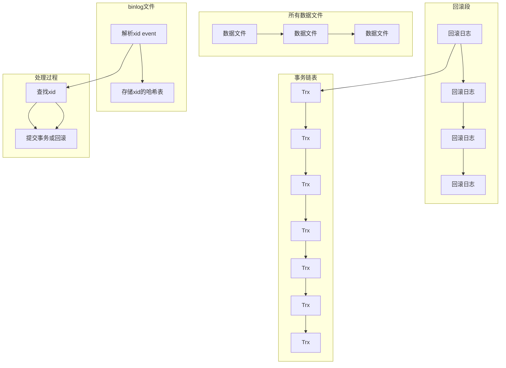
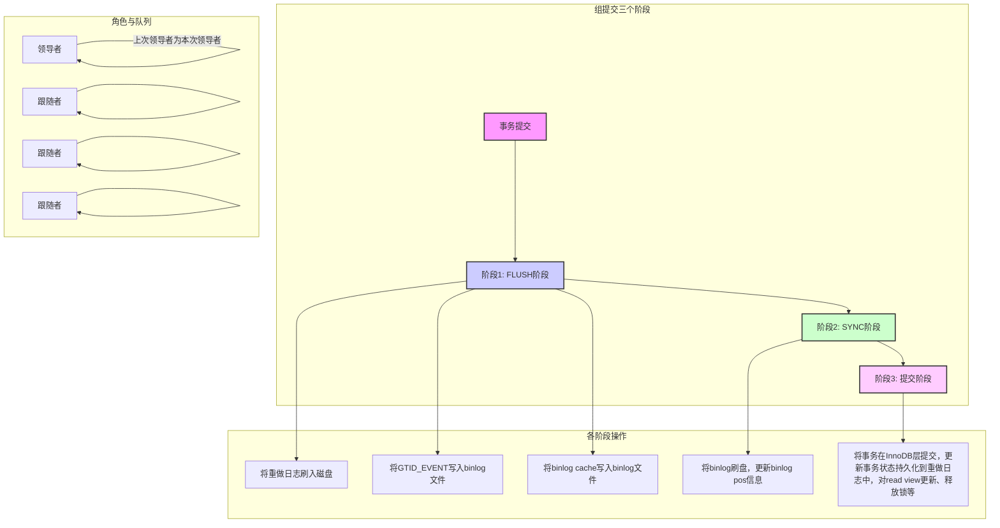

# 第8章 MySQL并发控制

MySQL 能够承载的每秒查询数（Queries Per Second，QPS）通常可达数万，在如此高的并发水平下维护事务的ACID 特性，是一项极其复杂的任务。众所周知，MySQL 采用的多线程架构，因此并发性能可以通过多线程来提升。然而，为了确保事务的ACID 特性，必须引入锁机制和MVCC 等技术。本章将深入探讨MySQL 是如何实现并发控制的。

## 8.1 MySQL 事务的实现

前面介绍过，MySQL 的多线程架构包括多个用户线程并发处理和后台线程并发处理，并保证了高并发的场景下事务的ACID 特性。

### 8.1.1 事务的管理

MySQL 会为每个事务创建一个 `trx_t` 结构体对象，并用它来管理相应的事务。具体而言，MySQL 维护了一个 `trx_t` 对象池，创建事务的时候直接从对象池中分配。此外，MySQL 还维护了一个管理所有事务的全局对象，也就是 `trx_sys_t` 结构体。

#### `trx_t` 结构体中的字段

`trx_t` 结构体中的字段名称和描述如表8-1 所示。了解它们有利于我们理解整个事务的实现。

**表8-1 `trx_t` 结构体中的字段名称和描述**

| 名称 | 描述 |
|------|------|
| `mutex` | 互斥锁，用于保护 `state` 和 `lock` 字段 |
| `id` | 事务ID，MySQL 会为每个事务分配一个全局递增的ID |
| `state` | 事务状态，共有5 种，后面将详细介绍 |
| `read_view` | 主要用于判断数据是否可见，后面将详细介绍 |
| `lock` | 事务锁 |
| `trx_list` | 事务链表节点，由 `trx_sys_t` 结构体的 `mysql_trx_list` 管理，最终将所有事务组成一个链表 |
| `no_list` | 事务序列化链表节点，由 `trx_sys_t` 结构体的 `serialisation_list` 管理 |
| `mysql_trx_list` | 读写事务链表节点，由 `trx_sys_t` 结构体的 `rw_trx_list` 管理 |
| `isolation_level` | 事务隔离级别，目前支持4 种，后面将详细介绍 |
| `is_registered` | 用于在两阶段事务中确认是否注册到调度器上，后面将详细介绍 |
| `start_time` | 事务被设置为 `TRX_STATE_ACTIVE` 状态的时间 |
| `commit_lsn` | 事务提交时的lsn |
| `mysql_thd` | 事务对应的用户线程 |
| `rsegs` | 事务对应的回滚段 |
| `read_only` | 是否为只读事务 |
| `auto_commit` | 是否为自动提交 |
| `ddl` | 是否为ddl，如果是的话，则为内部事务 |

上述字段只是 `trx_t` 结构体的一部分，MySQL 可以通过这些字段来对事务进行管理。

#### `trx_sys_t` 结构体中的字段

下面再来看用于管理全局事务的 `trx_sys_t` 结构体中的字段，如表8-2 所示。

**表8-2 `trx_sys_t` 结构体中的字段**

| 名称 | 描述 |
|------|------|
| `mutex` | 互斥锁，保护该结构体的一些字段，例如 `rw_max_trx_id`、`mysql_trx_list` 等 |
| `mvcc` | 多版本控制对象，主要用来管理 read view |
| `serialisation_list` | 事务序列链表，事务在提交的时候会加入该链表 |
| `rw_trx_list` | 读写事务链表，如果包含读写操作就会加入该链表 |
| `mysql_trx_list` | 所有事务链表，所有事务都加入该链表 |
| `rw_max_trx_id` | 当前未分配的最大事务ID，事务ID 就是从这里分配的，分配的时候会加上互斥锁 |
| `rw_trx_ids` | 保存所有的读写事务ID |
| `rseg_array` | 保存所有的回滚段 |
| `rseg_history_len` | 历史链表长度，表示最多可以保存多少个已经被提交事务的回滚日志 |
| `rw_trx_set` | 保存所有的读写事务ID，这里用MAP 来保存，方便查找 |

从这些信息可以看出，MySQL 在 `trx_sys_t` 结构体里面维护了一些链表来管理所有的事务，并且也维护了回滚段的信息来管理所有的回滚段，每个事务的ID 也是从这个结构体的 `rw_max_trx_id` 字段分配的。

#### 1. 事务对象池

MySQL 启动的时候会初始化一个事务对象池，并用一个队列对其进行管理。这个对象池的大小由 `MAX_TRX_BLOCK_SIZE` 变量控制，其值为 `1024×1024×4`。这个值无法通过参数控制，在MySQL 代码中进行了硬编码。不过，MySQL 在启动的时候只初始化了16 个事务对象，用完之后会触发对象池分批创建事务对象，最终这个对象池也会越来越大。MySQL 关闭的时候会销毁对象池中的所有事务对象，回收相关的内存。

初始化事务对象池时的主要工作是创建 `trx_t` 结构体对象，并将 `trx_t` 结构体中的一些字段设置为默认值，为一些字段分配对应的内存。这里的细节不多做介绍，感兴趣的读者可以参考 `ut0pool.h` 文件，事务对象池主要就是由这个文件里面的 `Pool` 和 `PoolManager` 两个结构体来管理的。

> [!INFO]
> 这里我们可以看到，事务对象池其实是MySQL 做的一个优化，在高并发场景下，如果每次都需要创建事务对象，不但会影响性能，还会带来频繁的内存分配。

#### 2. 事务的创建

事务的创建很简单，其实就是在打开表的时候调用InnoDB 层的 `open` 逻辑触发分配事务。主要涵盖3 个步骤：

1. 从对象池中分配一个事务对象，也就是对应的 `trx_t` 结构体对象。
2. 对 `trx_t` 中的字段进行初始化。
3. 将事务加入 `mysql_trx_list` 链表中。

在初始化阶段主要完成以下设置：

- 设置自动提交为 `false`。
- 设置读写模式为 `true`。
- 设置事务状态为 `TRX_STATE_NOT_STARTED`。

事务提交之后，事务对象并不会归还给对象池，而是等待该用户线程再次使用，再次使用的时候只需要执行后两个步骤即可。

作为对比，MyISAM 这些引擎是没有事务的概念的，因为它们没有实现事务的逻辑。

#### 3. 事务的删除

上面提到，事务对象并没有在事务提交之后立即释放回对象池，这个流程实际在用户线程退出的时候才会触发。事务对象释放的流程主要是将 `mysql_thd` 对象中的变量设置为默认值，并将事务对象放回对象池中。

### 8.1.2 事务的执行流程

下面我们根据事务的状态来了解事务的整个执行流程。在MySQL 中，事务共有5 个状态，如表8-3 所示。

**表8-3 MySQL 事务状态**

| 名称 | 描述 |
|------|------|
| `TRX_STATE_NOT_STARTED` | 表示事务未开启 |
| `TRX_STATE_ACTIVE` | 表示事务处于活跃状态 |
| `TRX_STATE_PREPARED` | 表示事务处于两阶段提交的准备阶段 |
| `TRX_STATE_COMMITTED_IN_MEMORY` | 表示事务处于两阶段提交的提交阶段 |
| `TRX_STATE_FORCED_ROLLBACK` | 表示事务被强制回滚，而不是用户主动回滚 |

下面就以一条更新语句为例来具体看看在该语句的执行流程中，哪些阶段对应事务的不同状态。首先手动开启显示事务：

```sql
mysql> begin;
Query OK, 0 rows affected (0.00 sec)
mysql> update zbdba.sbtest1 set pad='zbdba' where id = 10;
Query OK, 1 row affected (6 min 52.80 sec)
Rows matched: 1  Changed: 1  Warnings: 0
mysql> commit;
```

执行 `begin` 语句的时候其实并没有真正分配事务，分配事务在 `update` 语句执行的时候才开始，主要分为以下几个阶段：

1. **打开表**。这时在InnoDB 层会触发事务对象分配，完成后会将事务的状态设置为 `TRX_STATE_NOT_STARTED`。
2. **执行更新前会操作对应的数据页**，在这之前会开启事务。开启事务主要涉及分配回滚段、事务ID，以及将事务加入 `rw_trx_list` 读写事务链表中，最终设置事务的状态为 `TRX_STATE_ACTIVE`。这些逻辑在 `row_search_mvcc` 方法中通过调用 `trx_start_if_not_started` 方法触发。
3. **更新语句执行完成后，执行 `commit` 进行提交**。在MySQL 内部，提交分为两阶段，细节会在后文中详细说明。在两阶段提交的第一阶段会将事务状态写入重做日志文件中，状态为 `prepare`，然后在内存中将事务状态设置为 `TRX_STATE_PREPARED`，该逻辑在 `innobase_xa_prepare` 方法中触发。
4. **在两阶段提交的第二阶段**会执行重做日志、binlog 日志刷盘、将事务加入 `serialisation_list` 链表等操作，然后将事务状态设置为 `TRX_STATE_COMMITTED_IN_MEMORY`。在设置该状态之前会将事务从 `serialisation_list` 和 `rw_trx_list` 链表中移除，将事务ID 从 `rw_trx_set` 中删除，这些逻辑在 `ordered_commit` 方法中触发。

如果事务遇到死锁，则可能会被强制回滚。在提交的时候会判断事务是否被终止了，如果是，则将事务设置为 `TRX_STATE_FORCED_ROLLBACK`。事务回滚主要涉及通过回滚日志来找到历史数据，针对不同的DML 有不同的操作。

- 对于 `insert` 语句，回滚记录中只有主键或者唯一键。回滚的动作就是根据主键或者唯一键来删除这条记录。
- 对于 `delete` 语句，在事务被真正提交前，相应的数据只是被标记删除，所以回滚记录中也只有主键或者唯一键。回滚的动作就是根据主键或者唯一键找到之前的记录，然后将标记删除标志去掉。
- 对于 `update` 语句，主要分为两种情况：
  - **第一种是原地更新**，回滚记录中记录的是主键或者唯一键的值再加上更新列被更新之前的值。回滚的动作就是根据主键或者唯一键找到对应的记录，然后用更新列之前的值构造更新向量，接着更新当前这行数据。
  - **第二种情况是空间不够，无法进行原地更新**，这时就需要先删除再插入，回滚记录中记录的就是主键ID，回滚的动作结合上面的 `insert` 和 `delete` 语句的处理方法即可。

> [!WARNING]
> 上述操作既会处理聚簇索引，也会处理二级索引。

从上述流程可以看出，事务在更新语句执行的每个阶段都会更新状态或者做一些资源的管理，比如事务ID、回滚段等。通过这些操作来管理整个事务的执行。除此之外，事务还需要保证ACID 特性，其实上面的一些管理操作就是在为ACID 提供支持。

### 8.1.3 事务的ACID 实现

前面介绍了MySQL 是如何管理事务的，以及一个事务执行的大致流程，本小节将详细介绍事务的执行流程中是如何保证ACID 特性的。

#### 1. 原子性

一个事务中的所有操作，要么全部完成，要么全部未完成，不会结束在中间某个环节。如果事务在执行过程中发生错误，会被回滚到事务开始前的状态。

如果事务全部执行完成，不发生异常，则按照前面介绍的事务执行流程就能保证事务中的所有操作全部执行。但如果发生异常，则没有办法进行恢复，所以MySQL 引入回滚日志来解决这个问题。下面我们从两个方面来说明一下MySQL 是如何实现数据回滚的。

**第一个方面是记录历史数据：**

- **回滚段的分配**。在事务开启的时候会从事务全局管理对象（即 `trx_sys_t`）中分配回滚段。在6.3 节中已经详细介绍过，MySQL 初始化的时候会初始化一批回滚段来分配回滚页。
- **回滚日志的分配**。在操作数据页前会进行回滚日志的分配。
- **记录被修改列的数据**。在修改数据页之前，会先将该行数据中被修改的列的数据和主键或者唯一键的数据存储到回滚日志中，具体格式参见6.3 节。
- **记录事务的状态**。在事务提交的时候记录事务的状态，事务是分两阶段提交的：首先会将 `prepare` 状态记录到回滚日志头中，对应undo 的状态为 `TRX_UNDO_PREPARED`；然后在提交阶段将 `commit` 的状态记录到回滚日志头中，对应的状态为 `TRX_UNDO_CACHED`、`TRX_UNDO_TO_FREE` 或 `TRX_UNDO_TO_PURGE`。

> [!INFO]
> 这里记录的状态主要将事务状态持久化，用于在异常情况下对事务进行恢复。

**第二个方面是具体的数据回滚：**

- **历史版本数据构建**。主要分为两部分。第一部分是基础数据，也就是当前在数据页中对应的记录。第二部分是历史数据，这部分数据需要在回滚日志中查找，怎么做呢？MySQL 中的每条记录都有一个记录回滚日志指针的 `roll_pointer` 系统字段，通过这个字段就可以找到对应的回滚日志。解析回滚日志就可以拿到对应改变的列，基于基础数据和改变的列就可以构建历史版本数据。

  > [!INFO]
  > 如果是删除的数据，情况会有所不同。MySQL 在删除数据的时候只是将数据标记为删除，在回滚日志中只是记录了主键或者唯一键的值以及对应的操作类型。所以在构造历史版本的时候其实就是直接取现有的数据。

- **数据回滚操作**。如果数据需要回滚，需要先将回滚日志的历史版本数据和当前数据结合，构造出完整的历史版本数据并且更新回滚指针、事务ID 等系统字段，然后再用这个历史版本数据覆盖当前的数据。如果要回滚删除的记录，则要去掉被标记删除的标志，然后更新该记录的系统字段。

通过上述流程我们可以看到，MySQL 在操作的时候记录了回滚日志。这样既可以人为回滚，又可以在系统发生异常而崩溃时根据事务状态进行回滚或者提交，从而保证事务的原子性。

#### 2. 一致性

在MySQL 中，事务开始和结束后，数据库的完整性没有被破坏，MySQL 通过重做日志文件、回滚日志文件、双写缓冲区来保证数据库即使遇到异常情况，也能将数据恢复到一致的状态。一致性还需要保证在事务开始和结束后并没有破坏约束，或者出现触发器操作、级联操作等。

如果数据库在异常情况下发生宕机，MySQL 在重启的时候需要结合重做日志文件、回滚日志文件、双写缓冲区来进行崩溃恢复操作，这在8.1.5 节中会详细介绍。

#### 3. 隔离性

隔离性是指MySQL 允许多个并发事务同时对其数据进行读写和修改，这样可以防止多个事务并发执行时由于交叉执行而出现数据不一致的情况。事务隔离分为不同级别，包括未提交读、读已提交、可重复读和可串行化，如表8-4 所示。

**表8-4 MySQL 的事务隔离级别**

| 隔离级别 | 特性 |
|---------|------|
| 未提交读 | 一个事务在操作完数据后没有提交，另一个事务能看见未提交的事务修改的数据。会出现脏读，不符合正常的业务逻辑，不建议使用 |
| 读已提交 | 一个事务在操作完数据后没有提交，另一个事务不能看见未提交事务修改的数据，只有事务提交了才能看见。解决脏读问题，会有不可重复读、幻读的问题 |
| 可重复读 | 保证在同一事务中多次读取的数据一致。解决脏读、不可重复读、幻读问题，引入了间隙锁 |
| 可串行化 | 保证事务串行执行。解决脏读、不可重复读、幻读问题，但由于是串行执行，性能较差 |

在MySQL 内部主要通过快照读和锁来实现不同的隔离级别，下面将详细介绍4 种隔离级别在MySQL 中的实现。

##### （1）未提交读

我们知道在未提交读的隔离级别下会发生脏读，那么MySQL 中是如何控制的？其实在这种隔离级别下不用做任何控制，它允许脏读，读不需要加锁，写才需要。在MySQL 中，一个事务对一行数据的更新即使没有提交，数据也可能被写入对应的数据文件中。此时另一个事务来读取这条数据就可以看到最新的更改，而实际上这条数据并没有提交，这就产生了脏读的现象。下面来介绍具体的实现逻辑。

在 `row_search_mvcc` 方法中有如下逻辑控制，以下是伪代码实现，细节可以参考对应的方法。

```cpp
/* 读取到对应的记录 */
rec = btr_pcur_get_rec(pcur);
......
/* 判断是否需要加锁,如果是快照读就不需要加锁,
其他场景,例如在可串行化隔离级别读、DML 操作、
select for update、select for share in mode 等需要加锁 */
if (prebuilt->select_lock_type != LOCK_NONE) {
  /* 会判断需要加记录锁还是next-key 锁 */
} else {
  /* 进行快照读 */
  if trx->isolation_level == TRX_ISO_READ_UNCOMMITTED {
    /* 不做任何事情 */
  } else {
    /* 剩下RC 和RR 隔离级别,判断是否需要构造历史版本 */
  }
}
```

可以看到，记录最开始就已经读取出来，MySQL 根据索引定位到具体的数据文件的数据页中对应的记录。后面则是根据各种隔离级别来看后面则是根据各种隔离级别来看是否需要加锁或者构造历史版本。

##### （2）读已提交

我们知道读已提交解决了脏读的问题，但是会出现不可重复读和幻读的问题。首先还是结合上述未提交读的逻辑来看它是如何解决脏读的问题的。MySQL 默认情况下不做任何处理就会出现脏读的情况，如果要避免，就需要构造历史版本数据。参考上述伪代码逻辑，可以看到对应读已提交和可重复读级别会判断是否需要快照读。那这里是如何判断的呢？在读已提交隔离级别下，MySQL 会先为每条语句创建一个 read view，主要用于记录自己的事务ID 和当前MySQL 活跃的事务ID。然后在获取到具体的记录后，会将这些事务ID 进行对比，最终确认这条数据是否对该事务可见。其实这就是多版本控制协议的一个简单的描述，这在8.1.4 节中会详细介绍。

下面再来介绍为什么会产生不可重复读。首先看一下不可重复的解释：在同一个事务中连续执行两次同样的SQL，但是却返回了不同的结果。这里举例说明一下。

**事务A：**
```sql
mysql> set tx_isolation='READ-COMMITTED';
Query OK, 0 rows affected (0.00 sec)
mysql> begin;
Query OK, 0 rows affected (0.00 sec)
mysql> select * from zbdba2.test1 where id = 19;
+----+--------+
| id | number |
+----+--------+
| 19 |     16 |
+----+--------+
1 row in set (4.55 sec)
```

**事务B：**
```sql
mysql> set tx_isolation='READ-COMMITTED';
Query OK, 0 rows affected (0.00 sec)
mysql> begin;
Query OK, 0 rows affected (0.00 sec)
mysql> update zbdba2.test1 set number=18 where id = 19;
Query OK, 1 row affected (3.46 sec)
Rows matched: 1  Changed: 1  Warnings: 0
mysql> commit;
Query OK, 0 rows affected (0.00 sec)
```

**事务A（再次查询）：**
```sql
mysql> select * from zbdba2.test1 where id = 19;
+----+--------+
| id | number |
+----+--------+
| 19 |     18 |
+----+--------+
1 row in set (2.46 sec)
```

可以看到，事务A 对两次同样的查询却返回了不同的结果，前面提到MySQL 引入了 read view 通过读取历史版本来避免脏读问题，那为什么 read view 不能解决可重复读的问题呢？这与 read view 创建和释放的时机有关系。在读已提交隔离级别下，MySQL 会为每条语句创建 read view，语句执行完成后就释放掉了，所以事务B 提交后，事务A 再次执行创建出来的 read view 是可以看见事务B 的修改的。

最后再来看为什么读已提交隔离级别会产生幻读。幻读是指，在同一个事务中连续两次执行同样的SQL，但返回了不同的结果集。这里举例说明一下。

**事务A：**
```sql
mysql> set tx_isolation='READ-COMMITTED';
Query OK, 0 rows affected (0.00 sec)
mysql> begin;
Query OK, 0 rows affected (0.00 sec)
mysql> select * from zbdba2.test1 where id < 20;
+----+--------+
| id | number |
+----+--------+
|  1 |      1 |
|  5 |      3 |
|  7 |      8 |
| 11 |     12 |
| 12 |     13 |
| 13 |     14 |
| 15 |     16 |
| 16 |     17 |
| 18 |     18 |
| 19 |     16 |
+----+--------+
10 rows in set (8.98 sec)
```

**事务B：**
```sql
mysql> set tx_isolation='READ-COMMITTED';
Query OK, 0 rows affected (0.00 sec)
mysql> insert into zbdba2.test1() values(8,18);
Query OK, 1 row affected (1.40 sec)
mysql> commit;
Query OK, 0 rows affected (0.01 sec)
```

**事务A（再次查询）：**
```sql
mysql> select * from zbdba2.test1 where id < 20;
+----+--------+
| id | number |
+----+--------+
|  1 |      1 |
|  5 |      3 |
|  7 |      8 |
|  8 |     18 |
| 11 |     12 |
| 12 |     13 |
| 13 |     14 |
| 15 |     16 |
| 16 |     17 |
| 18 |     18 |
| 19 |     16 |
+----+--------+
11 rows in set (7.82 sec)
```

可以看出，事务B 中新插入的记录在事务A 中可以查询到，这就是幻读的现象。要深入理解这个现象，我们需要了解两个概念。

- **快照读**，指对记录不加锁，根据回滚日志和当前记录构建出历史版本的记录。一般普通的查询语句就是快照读。
- **当前读**，或者叫锁定读。当前读需要对记录加锁，不构造历史版本数据，主要用于读取数据后马上进行更新等操作，一般用于DML 或者查询语句指定 `for update`、`lock in share mode`。

刚刚举的例子其实就是快照读，那为什么快照读还发生了幻读呢？这个的原因其实跟前面不可重复读的原因一样，都是 read view 创建的时机导致新提交的事务可以被看到。

下面介绍当前读的场景，这里再举一个例子。

**事务A：**
```sql
mysql> set tx_isolation='READ-COMMITTED';
Query OK, 0 rows affected (0.00 sec)
mysql> begin;
Query OK, 0 rows affected (0.00 sec)
mysql> select * from zbdba2.test1 where id < 20 for update;
+----+--------+
| id | number |
+----+--------+
|  1 |      1 |
|  5 |      3 |
|  7 |      8 |
|  8 |     18 |
| 11 |     12 |
| 12 |     13 |
| 13 |     14 |
| 15 |     16 |
| 16 |     17 |
| 18 |     18 |
| 19 |     16 |
+----+--------+
11 rows in set (11.59 sec)
```

**事务B：**
```sql
mysql> set tx_isolation='READ-COMMITTED';
Query OK, 0 rows affected (0.00 sec)
mysql> begin;
Query OK, 0 rows affected (0.00 sec)
mysql> insert into zbdba2.test1() values(9,18);
Query OK, 1 row affected (1.07 sec)
mysql> commit;
Query OK, 0 rows affected (0.00 sec)
```

**事务A（再次当前读）：**
```sql
mysql> select * from zbdba2.test1 where id < 20 for update;
+----+--------+
| id | number |
+----+--------+
|  1 |      1 |
|  5 |      3 |
|  7 |      8 |
|  8 |     18 |
|  9 |     18 |
| 11 |     12 |
| 12 |     13 |
| 13 |     14 |
| 15 |     16 |
| 16 |     17 |
| 18 |     18 |
| 19 |     16 |
+----+--------+
12 rows in set (12.16 sec)
```

可以看到，在读已提交隔离级别下，当前读还是产生了幻读。执行 `select * from zbdba2.test1 where id < 20 for update` 这条语句时，MySQL 内部其实为满足条件的每条记录都加了锁，但是对于 id 小于20 并且不存在的记录是没有加锁的，例如那条 id=9 的记录，所以最终会产生幻读。

##### （3）可重复读

可重复读解决了脏读、不可重复读、幻读的问题，下面介绍MySQL 在可重复读级别下是如何解决这些问题的。

- **脏读**。可重复读与读已提交隔离级别一样，采用了多版本控制协议，通过 read view 控制未提交的事务不可见。
- **不可重复读**。读已提交隔离级别产生不可重复读是因为 read view 创建时机的问题。为了解决这个问题，可重复读隔离级别改变了 read view 的创建时机，在可重复读隔离级别下开启事务并执行第一条语句的时候创建 read view，后续语句不再创建，直到事务提交后释放 read view。这样，只要事务创建了 read view，其他事务不管怎么提交都没有影响。

# 第8章 MySQL事务实现

## MySQL可重复读隔离级别的幻读问题

❑ **幻读**。回顾读已提交隔离级别产生幻读的原因，分两种情况说明：第一种情况是快照读，读已提交隔离级别产生幻读同样是因为`read view`创建的时机问题，刚刚已经提到可重复读创建`read view`是以一个事务为维度，所以快照读下产生的幻读问题可以被解决。第二种情况是当前读，读已提交隔离级别产生幻读是因为无法锁定范围内不存在的记录，或者说无法锁定一个范围。可重复读隔离级别引入了间隙锁和next-key锁，可以锁定一个范围，这在8.2.4节会重点介绍。锁定对应的范围后，其他事务就无法操作该范围内的数据，也就不可能产生幻读现象了。在上述例子中，在可重复读隔离级别下执行了`select * from zbdba2.test1 where id < 20 for update`语句，在每个匹配的记录上都加了next-key锁，结合起来其实就是锁定了小于20这个范围。其他事务如果尝试插入一条`id<20`的记录会造成锁等待，无法进行插入，这也就避免了幻读的问题。

> [!WARNING] 业内争议
> 目前业内对MySQL可重复读隔离级别是否彻底解决了幻读问题还有争论，因为在有的场景下还是会产生幻读，下面我们来看一个例子：

**事务A：**
```sql
mysql> begin;
Query OK, 0 rows affected (0.00 sec)
mysql> select * from sbtest1 where id = 10;
Empty set (0.00 sec)
```

**事务B：**
```sql
mysql> begin;
Query OK, 0 rows affected (0.01 sec)
mysql>
mysql> insert into sbtest1(id, k, c, pad) values(10, 10, 'zbdba', 'zbdba');
Query OK, 1 row affected (0.00 sec)
mysql> commit;
Query OK, 0 rows affected (0.00 sec)
```

**事务A（续）：**
```sql
mysql> select * from sbtest1 where id = 10; 
Empty set (0.00 sec)
mysql> update sbtest1 set pad = 'zbdba1' where id = 10;
Query OK, 1 row affected (0.00 sec)
Rows matched: 1  Changed: 1  Warnings: 0
mysql> select * from sbtest1 where id = 10;
+----+----+-------+--------+
| id | k  | c     | pad    |
+----+----+-------+--------+
| 10 | 10 | zbdba | zbdba1 |
+----+----+-------+--------+
1 row in set (0.01 sec)
```

可以看到，事务A在查询`id=10`这条记录时显示不存在，在事务B插入了`id=10`这条记录后再次查询也是一样，这是多版本并发控制保证的。但事务A在更新的时候发现可以匹配到具体的记录，更新完成后再次进行查询，也可以查询到`id=10`这条记录，这样其实就产生了幻读。

为什么事务A可以更新`id=10`这条记录呢？因为更新记录是当前读，之前也提到了当前读不进行历史版本数据的构建，它会直接读取最新的数据，所以它能够拿到最新的数据进行修改。那更新完成后执行查询语句为什么又可以查询到数据呢？查询语句是快照读，按理说应该像之前一样读不到数据才对。这里，因为当前事务对`id=10`做了更新操作，所以`id=10`这条记录上记录的事务ID就是当前的事务ID。根据MVCC事务可见性原则，这条记录就对当前事务可见，所以再次查询就能查询到该条记录。

> [!NOTE] MySQL官方立场
> 上面我们用具体的例子证明了MySQL即使在可重复读隔离级别下也会产生幻读，那这是不是MySQL的漏洞呢？其实不是的，很早就有人发现了这个问题然后反馈给MySQL官方，官方做出了相应的解释，大致意思是这个实现是符合可重复读隔离级别的规定的。因为ANSI SQL规范中规定了可重复读隔离级别下是有可能发生幻读的现象的。MySQL其实也可以通过加锁等方式来避免这种情况，只不过当前的场景对实际的业务并没有什么影响。

就上述例子而言，在有些其他的数据库（例如PostgreSQL）中，事务A后面更新`id=10`这条记录的时候是无法匹配到的，后续也无法读取该记录。每种数据库对隔离级别的实现细节会有一些不同，不过大体的思路还是一样的，整体也符合可重复读隔离级别的规定。

我们可以看到读已提交和可重复读隔离级别都基于多版本控制协议解决了脏读的问题，主要区别是`read view`创建的时机不同和可重复读隔离级别引入了间隙锁和next-key锁。

### 可串行化

与可重复读隔离级别一样，可串行化隔离级别也解决了脏读、不可重复读、幻读的问题，下面介绍MySQL中是如何解决这些问题的。

总体来说，可串行化解决这些问题主要是用了锁。

❑ **脏读**。在可串行化隔离级别下，查询也需要加锁，查询语句的效果与`select ... lock in share mode`一致。这样查询和修改是互斥的，也就变成串行执行了。如果一个事务正在修改数据且没有提交，那么另一个事务会直接由于等待锁夯住，直到事务提交才能查询到对应的数据，这样保证不会出现脏读的问题。

❑ **不可重复读**。与脏读一样，因为加锁后查询和修改互斥，所以需要串行执行，也就不会出现不可重复读的问题了。

❑ **幻读**。在可串行化隔离级别下查询会加锁，并且也会根据情况加间隙锁、next-key锁，这样的话就不会存在幻读的问题。注意这里没有快照读，只有当前读，所有的读都需要加锁。

### 持久性

在MySQL中，一旦事务被提交，对数据的更改即成为永久性的，即使遭遇系统故障，这些更改也不会丢失。通常，数据的更改首先在内存中对相应的数据页进行修改，随后这些更改会被写入磁盘上对应的数据文件。然而，在写入磁盘的过程中，可能会发生断电、系统崩溃等异常情况，这可能导致数据丢失或损坏。为了确保数据的持久性，MySQL必须解决这一问题。此外，为了确保数据的持久性，MySQL所依赖的底层存储、操作系统和硬件也必须提供相应的持久性保障。

MySQL引入了重做日志文件，通过保证日志先行来解决这个问题。在事务提交前会先将相应的重做日志写入磁盘中，然后再将数据页刷入。这样即使写入数据页失败，通过重做日志文件的内容也能进行恢复。这里重做日志的最小单位是512B，对应磁盘的最小单位，所以它是原子写。另外，我们可能想到数据页默认是16KB，可能会出现写部分失败的问题，这样会导致数据页被写乱。为了解决这个问题，MySQL引入了双写缓冲区，这在5.6节已经详细介绍。

在6.2节中，我们详细说明了一条语句会产生哪些重做日志和记录什么内容。这里重点介绍MySQL是如何保证日志先行的，主要涉及以下两个地方：

❑ 在提交的时候，也就是`ordered_commit`方法中，第一个阶段就会将重做日志刷盘，第三个阶段才真正将事务提交。这在8.1.6节中会详细介绍。

❑ 后台刷脏线程在将数据页刷到磁盘中的数据文件前，会保证该数据页中记录的LSN前所有的重做日志都已刷盘。相关代码如下：
```c
/* 刷盘之前要保证产生的日志先刷盘. */
if (!srv_read_only_mode) {
  log_write_up_to(bpage->newest_modification, true);
}
```
细节可以参考`buf_flush_write_block_low`方法。

如果重做日志还没有来得及刷盘就异常宕机了，那么在MySQL启动的时候事务会被回滚；如果重做日志写入成功，刷盘失败了，就需要根据binlog中是否有事务的内容来判断是提交还是回滚。这些逻辑都是在崩溃恢复中进行控制的，这在8.1.5节中会详细介绍。

---

## 8.1.4 MVCC

MVCC是实现隔离级别的一项重要技术，有很多数据库实现了MVCC机制，下面介绍MySQL是如何实现MVCC的。

MVCC机制主要包含以下两部分内容：

❑ 判断数据是否对当前事务可见。
❑ 构建历史版本数据。

### 1. 判断数据是否对当前事务可见

这里涉及两个问题：怎么判断？在哪里判断？

MySQL通过`read view`对象来判断数据对当前事务是否可见，下面来看其具体实现。`ReadView`类中主要有如下几个字段：

❑ `m_low_limit_id`：当前系统未分配的最大事务ID。

❑ `m_up_limit_id`：当前活跃链表中最小的事务ID。

❑ `m_creator_trx_id`：当前会话对应的事务ID。

在创建`read view`时会为上面几个字段赋值，数据是否对当前事务可见就是通过它们来判断的。MySQL MVCC read view的结构如图8-1所示。



**图8-1 MySQL MVCC read view的结构**

判断事务是否可见的总体流程如下：

1. 如果记录的事务ID小于`m_up_limit_id`，说明该条记录的提交早于本事务，对本事务可见；如果记录的事务ID与`m_creator_trx_id`一样，说明它就是本事务操作的数据，也是可见的。
2. 如果记录的事务ID大于`m_low_limit_id`，说明该条记录的提交晚于本事务，对本事务不可见。
3. 如果事务活跃链表中没有活跃的事务，那么也是可见的。
4. 如果该记录的事务ID大于`m_up_limit_id`而又小于`m_low_limit_id`，这个时候就要看它是否在活跃事务链表中，如果在的话，那么也不可见。如果不在，就要进一步分情况了：对于读已提交隔离级别是可见的，对于可重复读隔离级别是不可见的。

至此，我们就了解了MySQL如何判断一条数据对当前事务是否可见了，那一般在哪里判断呢？最简单的例子就是执行一个简单的查询，在聚簇索引上拿到一条具体的叶子节点记录的时候，会根据`read view`判断该记录是否对当前事务可见。如果可见则直接返回；如果不可见则需要构造历史版本数据。

这里我们来看一个实际的例子，相信一些读者使用过`mysqldump`逻辑备份，在`mysqldump`中最开始会执行如下语句：
```sql
START TRANSACTION /*!40100 WITH CONSISTENT SNAPSHOT */
```
这条语句执行完成后其实就分配了`read view`对象，后续`mysqldump`去查询所有要备份的表都用的是这个`read view`对象，这样就能保证拿到的数据是一个全局的一致性快照。

### 2. 构建历史版本数据

下面介绍MySQL是如何构建历史版本数据的。构建历史版本数据其实主要依赖的是回滚日志，其结构在第6章中详细介绍过，这里不再赘述。我们知道回滚日志中记录的是相关字段被修改前的值，那么要构建一个历史版本应该如何做呢？主要分为以下4步：

1. 将当前记录复制一份，修改事务ID、回滚段指针等系统字段。
2. 从当前记录的回滚段指针中读取对应的回滚日志记录。
3. 解析回滚日志记录，拿到对应字段的值。
4. 将回滚字段中的相关字段组成更新向量，最终应用到复制的记录上。

那么，删除的数据是如何构建的呢？删除的数据在回滚日志中只会记录主键或者唯一键的值，所以需要读取原有的记录，但是原有的记录被删除了。记住，在MySQL中记录只是被标记删除，并没有彻底删除，只有在purge线程检查满足条件后才能彻底删除。删除记录构建历史版本数据是通过标记删除的记录进行构造的，然后也需要修改事务ID、回滚段指针等系统字段。

至此，MVCC主要的实现介绍完毕，其实其他数据库的MVCC实现也跟以上逻辑大同小异。

---

## 8.1.5 崩溃恢复流程

之前介绍事务特性的时候提到了事务的原子性、一致性、持久性，这些特性都依赖崩溃恢复机制。崩溃恢复在MySQL启动的时候触发，主要恢复损坏的数据页和不完整的事务，根据事务状态进行提交或者回滚，最终保证事务的原子性、一致性、持久性。

在介绍崩溃恢复的流程前我们可能会有如下几个问题：

❑ 数据页在服务器宕机等情况下损坏后是如何恢复的？
❑ 不完整的事务是如何恢复的？
❑ 能否保证主从一致？

下面我们带着这些问题来看MySQL崩溃恢复的具体流程，如图8-2所示。



**图8-2 MySQL崩溃恢复的具体流程**

可以看到，崩溃恢复的流程较为复杂，依赖的组件也比较多，具体可以分为以下6步：

1. 扫描重做日志文件并将其插入全局哈希表中。
2. 利用双写缓冲区恢复损坏的数据页。
3. 从回滚段中初始化事务链表。
4. 将重做日志记录应用到数据文件。
5. 扫描事务链表，根据事务的状态进行提交或者回滚。
6. 回滚prepare状态的事务或者提交非prepare状态的事务。

### 1. 扫描重做日志文件

MySQL崩溃恢复扫描重做日志如图8-3所示。



**图8-3 MySQL崩溃恢复扫描重做日志**

扫描重做日志主要分为两个阶段：

1. **获取最近的检查点**。每个重做日志文件都在`CHECKPOINT`字段中保存了检查点信息，但是每次MySQL进行检查点操作的时候只会写入第一个重做日志文件。并且在重做日志文件头上有两块区域存放检查点，MySQL按照奇偶划分每次写入不同的区域，从而防止异常崩溃检查点被写坏。知道检查点存储的位置及写入的原理后，要找最近的检查点就比较简单了。MySQL的做法就是扫描所有重做日志文件头的检查点找到最大的那个，它就是最近的检查点。

2. **从检查点后扫描重做日志**。找到检查点后就能知道对应的LSN，通过LSN就能计算对应重做日志文件的偏移量，这样就能直接读取到重做日志。每次读取一个重做日志块，大小为512B。将重做日志文件块读取到内存中后再进行解析，就得到了每个重做日志记录。在6.2节中，我们介绍了每个重做日志记录都包含重做日志记录头和重做日志记录数据，在重做日志记录头中记录了对应的表空间ID和数据页号。MySQL将重做日志记录存储到全局的哈希表中，对应的键由表空间ID和数据页号取模生成，对应的值就是`recv_addr_t`对象，其中维护了该数据页对应的所有重做日志记录的链表。

```c
/** 哈希页文件地址结构体 */
struct recv_addr_t{
  enum recv_addr_state state;
  /* 页的恢复状态 */
  unsigned   space:32; /* 表空间ID */
  unsigned   page_no:32; /* 页号 */
  UT_LIST```c
  hash_node_t    addr_hash; /* 哈希桶链中的哈希节点 */
};
```

最终扫描到的所有重做日志记录都存储到了全局哈希表中,以数据页为维度,每个数据页对应一批重做日志记录.

### 2. 恢复损坏的数据页

MySQL崩溃恢复损坏的数据页如图8-4所示.



**图8-4 MySQL崩溃恢复损坏的数据页**

我们知道异常宕机的时候可能会出现数据页损坏的情况,为了保证数据的完整性和一致性,MySQL引入了双写缓冲区.在数据写入的时候,首先会写入系统数据文件的双写缓冲区中,写入成功后才会写入数据文件.在恢复损坏的数据页时,并不会扫描所有数据文件中的数据页来判断是否存在损坏,而是根据双写缓冲区中存在的数据页来进行检查.通过这些页号找到对应数据文件中的数据页,主要使用数据页中记录的checksum来进行判断.如果数据页损坏了,则用双写缓冲区中的数据页进行覆盖恢复;如果没有损坏则不做任何操作.这样做的好处是扫描代价变低了,不用扫描所有数据文件的数据页.

### 3. 初始化事务链表

MySQL崩溃恢复初始化的事务链表如图8-5所示.



**图8-5 MySQL崩溃恢复初始化的事务链表**

不完整的事务其实是从回滚日志中构造出来的,在MySQL启动的时候会初始化96个段(默认有128个段,其中32个为临时段,所以初始化96个段).每个段有1024个槽,每个槽对应一个回滚页.会扫描每个槽也就是每个回滚页最近的回滚记录,然后将回滚记录插入insert undo或者update undo链表中.

刚刚把所有回滚段的最近一个回滚记录找出来了,现在的任务就是扫描这些回滚记录,通过这些回滚记录构造事务对象,代码如下所示:

```c
trx->rsegs.m_redo.rseg = rseg;
/* 对于存在活动数据的事务，其回滚段大小不会等于1，或者不符合清除限制标准。因此，在没有互斥锁保护的情况下增加这个事务引用计数是安全的。 */
++trx->rsegs.m_redo.rseg->trx_ref_count;
*trx->xid = undo->xid;
trx->id = undo->trx_id;
trx->rsegs.m_redo.insert_undo = undo;
trx->is_recovered = true;
```

事务对象构造好后就插入事务链表,等所有的回滚段都处理完成,初始化事务链表也就完成了.

### 4. 应用重做日志记录

在第1步中,我们知道MySQL将检查点后的所有重做日志记录扫描存储在全局的哈希表中.这一步就是遍历哈希表,按照数据页的维度来应用重做日志记录.下面我们具体来看涉及哪些操作.

MySQL中的重做日志记录多达60多种,每种记录的数据不一样,所以在应用的时候对应的操作也不一样.这里我们来介绍常见的DML语句产生的重做日志记录是怎么应用的.

❑ **MLOG_REC_INSERT类型**.该类型是执行插入语句时产生的,记录的是插入的具体某一行的数据.在应用这个类型的重做日志记录时,主要就是解析其保存的具体插入数据,然后生成对应的记录,最后插入对应的数据页中.

❑ **MLOG_REC_CLUST_DELETE_MARK类型**.该类型是执行删除语句时产生的,记录的是将一条记录标记删除.在应用这个类型的重做日志记录时,主要就是解析到那条记录,然后在对应的数据页上将该条记录标记为删除.

❑ **MLOG_REC_UPDATE_IN_PLACE类型**.该类型是执行更新语句时产生的,更新语句分为原地更新和先删除再插入两种情况.该类型对应的第一种情况,主要记录的是对应记录更新的字段.在应用这个类型的重做日志记录时,主要就是根据更新的字段构建更新向量,然后在对应的数据页上将该记录进行更新.

基于篇幅原因,这里只介绍了3种重做日志记录类型,感兴趣的读者可以参考`storage/innobase/log/log0recv.cc`文件中的`recv_parse_or_apply_log_rec_body`方法了解其他类型.

一个数据页的所有重做日志记录应用完成后,继续应用下一个数据页的,直到哈希表中保存的所有重做日志记录都被应用完成.

### 5. 回滚或者提交事务

当重做日志记录应用完成之后,数据库中所有数据文件的数据页就处于一致的状态,这时候就需要去处理事务链表了.处理事务链表的流程比较简单,主要就是遍历所有的事务,根据事务的状态进行处理,代码如下所示:

```c
switch (state) {
case TRX_STATE_COMMITTED_IN_MEMORY:
  trx_sys_mutex_exit();
  ib::info() << "Cleaning up trx with id "
    << trx_get_id_for_print(trx);
  // 主要清理回滚日志信息
  trx_cleanup_at_db_startup(trx);
  // 回收事务对象
  trx_free_resurrected(trx);
  return(TRUE);
case TRX_STATE_ACTIVE:
  if (all || trx_get_dict_operation(trx) != TRX_DICT_OP_NONE) {
    trx_sys_mutex_exit();
    // 进行事务回滚
    trx_rollback_active(trx);
    // 回收事务对象
    trx_free_for_background(trx);
    return(TRUE);
  }
  return(FALSE);
// 事务状态为prepare的暂时不处理，需要后面结合binlog一起进行处理
case TRX_STATE_PREPARED:
  return(FALSE);
case TRX_STATE_NOT_STARTED:
case TRX_STATE_FORCED_ROLLBACK:
  break;
}
```

通过上述代码得知:

❑ `TRX_STATE_COMMITTED_IN_MEMORY`状态的事务表示已经提交了,只需要做后续的收尾工作.
❑ `TRX_STATE_ACTIVE`状态的事务直接进行回滚.
❑ 对于`TRX_STATE_PREPARED`状态(也就是我们常说的prepare状态)的事务,由于内部两阶段的问题,MySQL需要结合binlog日志来判断是提交还是回滚.
❑ `TRX_STATE_NOT_STARTED`和`TRX_STATE_FORCED_ROLLBACK`状态的事务不用处理.

### 6. 恢复prepare状态事务

MySQL崩溃恢复prepare状态事务的流程如图8-6所示.



**图8-6 MySQL崩溃恢复prepare状态事务的流程**

第5步中还遗留了prepare状态的事务没有进行处理,这一步主要就是处理它们.处理prepare状态的事务需要结合binlog,总体的思想就是:如果该事务对应的操作在binlog中存在,就将该事务进行提交;如果不存在就进行回滚.这里的重点是如何判断是否存在.

对binlog文件比较了解的读者可能会发现其中有一个xid event.实际上,在每个事务结束后都会有一个xid event,记录一个事务对应的xid,并且在事务对象(Trx)中也保存了xid,这个xid是内部xa事务的ID.那么,判断prepare状态事务的xid在binlog文件中是否存在就可以判断对应事务的数据是否已经写入binlog中.

在MySQL中确实是这样做的.首先会解析最近的一个binlog文件,主要解析其xid event并拿到对应的xid插入一个全局的哈希表中.处理完binlog后,所有的xid都保存到了全局的哈希表中.然后遍历事务链表拿到prepare状态的事务,用其对应的xid去哈希表中查找是否存在,如果存在则进行事务的提交,如果不存在则进行事务的回滚.

处理完所有prepare状态的事务后,崩溃恢复阶段就完成了,数据库已经恢复到一个一致的状态.

这个部分主要涉及的参数是`innodb_force_recovery`,该参数主要在MySQL无法启动的时候进行设置,MySQL `innodb_force_recovery`的参数值如表8-5所示.

**表8-5 MySQL `innodb_force_recovery`的参数值**

| 值 | 对应操作 |
|----|----------|
| 1  | 即使有损坏的页也能正常启动 |
| 2  | 阻止master线程,允许purge线程 |
| 3  | 不进行事务的回滚 |
| 4  | 阻止插入缓冲合并操作 |
| 5  | 不处理回滚日志,把所有不完整的事务看作提交状态 |
| 6  | 不做重做日志前滚,也就是不应用重做日志记录 |

正常情况下该参数值保持默认即可,千万不要在生产环境中设置该参数.如果MySQL无法启动,则需要深刻理解该参数的作用,之后才能进行配置启动.

至此,崩溃恢复的主要内容都已经介绍完毕.可以看到,崩溃恢复主要依赖回滚日志、重做日志、双写缓冲区、binlog日志.不同的日志在不同的阶段有不同的作用,最终联动起来将数据库恢复到一致的状态.

# 8.1.6 组提交

在探讨MySQL事务时,不可避免地要提及MySQL事务的组提交机制,这是MySQL针对事务提交过程所实施的一项优化策略.简而言之,该机制旨在将多个事务分批次进行提交.然而,由于涉及的细节较为繁琐,其实施过程亦相对复杂,本小节将对此进行详尽的阐述.MySQL组提交的流程如图8-7所示.

组提交主要分为三个阶段.在初始阶段(阶段1),从一组事务中选举出一位领导者,通常是最先进入队列的事务担任此角色.随后,在接下来的两个阶段(阶段2和阶段3)中,所有操作将由这位领导者独立完成,包括自行提交以及协助其他事务的提交.每个阶段均设有锁机制,只有当前阶段所有事务相关的工作均已完成,系统才会进入下一阶段,并在此过程中加锁,同时释放前一阶段的锁.这一机制确保了事务能够按阶段分组执行,避免了相互干扰.



> [!INFO] 组提交三个阶段详解
> - **阶段1 – FLUSH阶段**:主要进行重做日志的刷盘,刷盘后会轮询将所有事务对应的binlog缓存写入binlog文件中,不主动刷盘.这里的binlog缓存是维护在用户线程中的,每个线程单独使用,默认大小为32KB.
> - **阶段2 – SYNC阶段**:主要将binlog刷入磁盘中,然后将binlog的位点持久化.
> - **阶段3 – 提交阶段**:主要进行InnoDB层提交,关闭read view,释放相关锁,将提交状态写入重做日志中.

由上述流程可知,只有高并发时事务才进行批量操作.因为如果在低并发甚至只有一个事务的时候,批量操作的性能可能还不如串行提交.在MySQL 5.6版本之前,事务就是串行提交的.为了尽量让事务并发执行,MySQL提供了如下两个参数:

| 参数 | 描述 | 默认值 |
| --- | --- | --- |
| `binlog_group_commit_sync_delay` | 用于设置在进行binlog刷盘的时候等待多长时间,单位为μs | 0 |
| `binlog_group_commit_sync_no_delay_count` | 与`binlog_group_commit_sync_delay`结合使用,在等待一定时间后退出 | - |

> [!TIP] 参数调优建议
> 这两个参数能够在一定程度上让更多的事务并发提交,不过也不能设置太大,这样会影响响应时间.

至此,组提交介绍完毕.其实还有一些细节,例如在并行复制的时候如何利用组提交的特性,这个在9.1.4节会详细介绍.

---

# 8.1.7 分布式事务

分布式事务有多种实现,这里重点介绍基于两阶段提交实现的分布式事务.在MySQL中,两阶段提交分为**内部两阶段提交**和**外部两阶段提交**,也就是我们常说的**内部XA**和**外部XA**.内部XA保证Server层的binlog和InnoDB存储引擎一致,外部XA提供XA命令来控制两阶段提交,整体的提交流程其实跟内部XA基本一致.实现XA命令的主要目的是提供外部分布式事务的能力,比如我们在MySQL上层实现的中间件,中间件要对多个MySQL实例进行事务提交,这个时候就需要采用分布式事务,主要采用MySQL提供的XA命令进行控制.

在分布式系统下,事务跨多个节点进行提交的时候需要保证事务的一致性,两阶段提交其实是一种协议,它引入了一个协调者来保证所有节点(参与者)事务都提交.具体来说,两阶段分为准备阶段和提交阶段.准备阶段主要询问各个阶段是否已经准备好提交,如果都准备好则进入提交阶段,提交阶段则依次将各个节点进行提交.如果中途有节点提交失败,则会回滚所有节点,或者在这个失败的节点重新进行提交.最终保证所有节点的事务都已经提交或者回滚.

## 1. 内部XA

在MySQL中,Server层与存储引擎层分离,导致提交需要保证Server层和存储引擎层一致,通常来说就是binlog和InnoDB存储引擎保持一致.这里binlog作为协调者,InnoDB存储引擎作为参与者.MySQL中共有三种协调者,binlog是最常用的,还有`TC_LOG_MMAP`和`TC_LOG_DUMMY`,感兴趣的读者可以自行研究.下面简单介绍内部XA的流程,主要分为以下两个阶段:

| 阶段 | 在binlog层执行 | 在InnoDB层执行 |
| --- | --- | --- |
| **准备阶段** | 基本不做任何事情 | 将事务状态设置为`prepare`并持久化到重做日志文件中.其实就是在重做日志文件中记录事务的状态,然后在内存中将事务的状态设置为`prepare`状态(对应`TRX_STATE_PREPARED`). |
| **提交阶段** | 不做任何事情 | 关闭read view,设置事务状态并将其持久化到重做日志文件中,在内存中将事务修改为提交状态并释放相关锁.注意:在执行两阶段提交前会进行组提交(详见8.1.6节). |

## 2. 外部XA

外部XA其实就是将内部XA的流程拆分成不同的命令,共有如下几种:

> [!INFO] XA命令一览
> - `XA {start\|begin} xid [join\|resume]`:指定一个唯一的xid开启一个XA事务,设置XA事务状态为ACTIVE.
> - `XA end xid [suspend [for migrate]]`:执行完具体的SQL语句后,再执行`XA end xid`,设置XA事务状态为idle.
> - `XA prepare xid`:设置XA事务状态为prepare,这条命令对应内部XA准备流程,主要的区别在于,在binlog准备阶段需要把`XA prepare`命令持久化到binlog文件中,这里其实是直接调用组提交的`ordered_commit`方法最终将binlog文件刷盘.
> - `XA commit xid [one phase]`:提交XA事务,设置事务状态为commit,这条命令对应内部XA提交流程.
> - `XA rollback xid`:回滚XA事务,内部流程与正常事务回滚基本一致.
> - `XA recover [convert xid]`:用于恢复prepare状态的XA事务,一般用在分布式事务进行提交的时候节点异常宕机重启时,通过该命令找到未提交的XA事务进行提交.

### 基于MySQL XA的分布式流程示例

上面已经介绍了外部XA相关的命令,下面举例说明一下如何使用外部XA命令来实现分布式事务.这里以MySQL分布式中间件为例.基于MySQL XA的分布式流程如图8-8所示.

```mermaid
sequenceDiagram
    participant Client as 客户端
    participant Proxy as 代理
    participant Node0 as node0 (MySQL)
    participant Node1 as node1 (MySQL)

    Client->>Proxy: begin
    Proxy-->>Client: OK

    Client->>Proxy: sql 1
    Proxy->>Node1: XA begin 'xid1'; sql 1;
    Node1-->>Proxy: OK

    Client->>Proxy: sql 2
    Proxy->>Node0: XA begin 'xid1'; sql 2;
    Node0-->>Proxy: OK

    Proxy->>Node1: XA end 'xid1'; XA prepare 'xid1';
    Node1-->>Proxy: OK

    Proxy->>Node0: XA end 'xid1'; XA prepare 'xid1';
    Node0-->>Proxy: OK

    Proxy->>Node1: XA commit 'xid1';
    Node1-->>Proxy: OK

    Proxy->>Node0: XA commit 'xid1';
    Node0-->>Proxy: OK

    Proxy-->>Client: OK
```

在图8-8中共有node0和node1两个MySQL节点，分布式事务的提交流程如下：

1. 客户端发送`begin`命令到分布式中间件上，分布式中间件开启事务，向客户端返回OK。
2. 客户端发送`sql 1`命令到分布式中间件上，分布式中间件将`sql 1`路由到node1上执行。同时执行`XA begin 'xid1'; sql 1;`。
3. 客户端发送`sql 2`命令到分布式中间件上，分布式中间件将`sql 2`路由到node0执行。同时执行`XA begin 'xid1'; sql 2;`。
4. 在node1上执行`XA end 'xid1'; XA prepare 'xid1';`将XA设置为prepare状态。
5. 在node0上执行`XA end 'xid1'; XA prepare 'xid1';`将XA设置为prepare状态。
6. 所有节点都进入准备阶段后，开始提交。
7. 分别向node1和node0发送`XA commit 'xid1';`。
8. 提交成功后向客户端返回成功。

> [!TIP] XA rollback 和 XA recover 的使用场景
> - **XA rollback**：上面是顺利提交的场景，如果准备阶段失败，则需要用`XA rollback`进行回滚。
> - **XA recover**：如果提交阶段node0宕机失败，则需要等待node0重启后采用`XA recover`进行恢复。

### 外部XA的实践问题与现状

有分布式事务实战经验的读者可能会发现一个问题，就是我们所有阶段都是直接采用的XA事务，这样在生产环境中其实不利于管理。例如在node1上提交了，而在node0上失败了，在node0重启后我们虽然能拿到未提交的XA事务，但不能确定整个事务的状态，这时候就需要一个地方来维护全局事务的状态。一般的做法是找一个第三方来存储全局事务的状态，也可以采用将分布式事务中的第一个节点设置为普通事务的方式，然后将信息记录提交到元数据库中，这样后面在恢复事务的时候就能找到对应的全局事务信息。当然这里的细节还有很多，感兴趣的读者可以自行研究。

最终，必须指出当前XA事务所面临的问题。尽管XA事务的引入在多个方面尚未得到完善，导致问题频繁出现，但令人欣慰的是，近年来国内在业务场景中对XA事务的应用已使大部分问题得以暴露，并推动了MySQL官方进行相应的修复工作。然而，目前仍存在一个核心问题尚未得到解决（5.7版本），那就是MySQL异常崩溃可能导致数据不一致。

> [!WARNING] XA事务核心问题（MySQL 5.7）
> 首先看`XA prepare`持久化是怎么做的，其实就是在binlog准备阶段调用组提交的`ordered_commit`方法将`XA prepare`这条语句写入binlog中。这个方案会有一个问题：`XA prepare`这条语句是先写入了binlog中的，此时在重做日志文件中是没有记录准备状态的。如果这个阶段MySQL崩溃了，那么在崩溃恢复时，这个准备阶段的XA事务会丢失，但这个XA事务在从库上还是会存在。
> 
> 目前这个问题MySQL官方还没有进行修复，不过业内的一些厂商已经进行了修复，大致的思路就是先在重做日志文件中记录prepare状态，然后再写入binlog。

关于MySQL的XA事务问题，鉴于篇幅限制，这里不再深入探讨，有兴趣的读者可自行进一步研究。