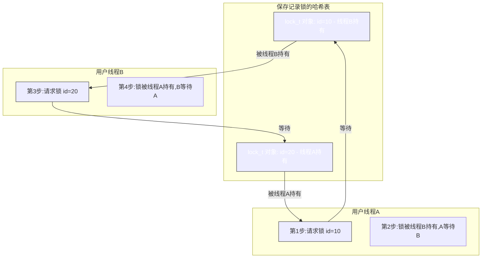

# 8.2 第8章 MySQL锁实现

## 第8章 MySQL并发控制

在MySQL 中，会事先计算每个锁模式对应的不兼容的锁模式，然后存储到数组中，再根据这个数组判断锁模式是否兼容，具体如下：

```c
{
  0,
  MDL_BIT(MDL_EXCLUSIVE),
  MDL_BIT(MDL_EXCLUSIVE),
  MDL_BIT(MDL_EXCLUSIVE) | MDL_BIT(MDL_SHARED_NO_READ_WRITE),
  MDL_BIT(MDL_EXCLUSIVE) | MDL_BIT(MDL_SHARED_NO_READ_WRITE) |
    MDL_BIT(MDL_SHARED_NO_WRITE) | MDL_BIT(MDL_SHARED_READ_ONLY),
  MDL_BIT(MDL_EXCLUSIVE) | MDL_BIT(MDL_SHARED_NO_READ_WRITE) |
    MDL_BIT(MDL_SHARED_NO_WRITE) | MDL_BIT(MDL_SHARED_READ_ONLY),
  MDL_BIT(MDL_EXCLUSIVE) | MDL_BIT(MDL_SHARED_NO_READ_WRITE) |
    MDL_BIT(MDL_SHARED_NO_WRITE) | MDL_BIT(MDL_SHARED_UPGRADABLE),
  MDL_BIT(MDL_EXCLUSIVE) | MDL_BIT(MDL_SHARED_NO_READ_WRITE) |
    MDL_BIT(MDL_SHARED_WRITE_LOW_PRIO) | MDL_BIT(MDL_SHARED_WRITE),
  MDL_BIT(MDL_EXCLUSIVE) | MDL_BIT(MDL_SHARED_NO_READ_WRITE) |
    MDL_BIT(MDL_SHARED_NO_WRITE) | MDL_BIT(MDL_SHARED_UPGRADABLE) |
    MDL_BIT(MDL_SHARED_WRITE_LOW_PRIO) | MDL_BIT(MDL_SHARED_WRITE),
  MDL_BIT(MDL_EXCLUSIVE) | MDL_BIT(MDL_SHARED_NO_READ_WRITE) |
    MDL_BIT(MDL_SHARED_NO_WRITE) | MDL_BIT(MDL_SHARED_READ_ONLY) |
    MDL_BIT(MDL_SHARED_UPGRADABLE) | MDL_BIT(MDL_SHARED_WRITE_LOW_PRIO) |
    MDL_BIT(MDL_SHARED_WRITE) | MDL_BIT(MDL_SHARED_READ),
  MDL_BIT(MDL_EXCLUSIVE) | MDL_BIT(MDL_SHARED_NO_READ_WRITE) |
    MDL_BIT(MDL_SHARED_NO_WRITE) | MDL_BIT(MDL_SHARED_READ_ONLY) |
    MDL_BIT(MDL_SHARED_UPGRADABLE) | MDL_BIT(MDL_SHARED_WRITE_LOW_PRIO) |
    MDL_BIT(MDL_SHARED_WRITE) | MDL_BIT(MDL_SHARED_READ) |
    MDL_BIT(MDL_SHARED_HIGH_PRIO) | MDL_BIT(MDL_SHARED)
}
```

当需要加元数据锁的时候，首先需要获取要加的锁模式，然后通过上述数组获取到它不兼容的锁模式，最终跟对应的等待链表和授予链表中已有的 `MDL_ticket` 对象对应的锁模式进行位运算，就可以判断是否兼容，具体可以参考 `MDL_lock::can_grant_lock` 方法。在 `can_grant_lock` 方法中，首先会判断当前锁模式跟等待队列中的 `MDL_ticket` 对象对应的锁模式是否兼容，如果兼容再判断它跟授予队列中的 `MDL_ticket` 对象对应的锁模式是否兼容，如果都兼容则获取到锁，否则进行锁等待。

前面介绍的只是授予锁时判断锁模式是否兼容的数组，等待锁时判断锁模式是否兼容会更加复杂些，分了四种情况，主要是对应的锁模式数量如果超过 `max_write_lock_count` 参数的值，就会使用不同的不兼容数组，这里主要是防止锁饿死的情况。由于篇幅问题，这里不再详述，感兴趣的读者可以自行研究，具体逻辑在 `mdl.cc` 文件中，对应的数组定义在 `MDL_lock::m_object_lock_strategy` 方法中。

介绍完对象锁策略后，我们再来简单看看范围锁策略。MySQL 范围锁策略的四种锁模式及使用场景如表8-9 所示。

**表8-9 MySQL 范围锁策略的四种锁模式及使用场景**

| 锁模式 | 使用场景 |
|--------|----------|
| IS | 意向共享锁 |
| IX | 意向排他锁 |
| S | 共享锁 |
| X | 排他锁 |

授予锁兼容情况如下：

（图表省略，原文此处应有兼容性矩阵）

等待锁兼容情况如下：

（图表省略，原文此处应有兼容性矩阵）

由于篇幅原因，这里不再介绍对应的不兼容数组，感兴趣的读者可以自行研究，具体逻辑在 `mdl.cc` 文件中，对应数组在 `MDL_lock::m_scoped_lock_strategy` 中。

### 加锁流程（元数据锁）

下面介绍一条SQL 语句执行加锁的流程，这里以之前的更新语句为例。

```sql
update zbdba.sbtest1 set pad="zbdba" where id = 10;
```

当我们执行这条SQL 语句的时候，加元数据锁的流程如下：

1. 语法解析器会根据语义来设置对应的锁模式，对应图8-10 中的A1 步骤，这条更新语句的锁模式为 `MDL_SHARED_WRITE(SW)`。
2. 创建 `MDL_ticket` 对象，对应图8-10 中的A2 步骤，如果 `MDL_ticket` 对象存在，则复用即可。
3. 去 `MDL_map` 中根据 key 查找是否有对应的 `MDL_lock` 对象，如果没有就创建一个，对应图8-10 中的A3、A4 步骤，这里的 key 其实就是 `3`（namespace 中3 对应的位置就是 TABLE）`+zbdba+sbtest1`。
4. `ticket` 对象会从 `MDL_lock` 锁对象中获取锁权限，看请求的锁模式跟 `MDL_lock` 锁对象维护的等待队列中的锁模式是否兼容，对应图8-10 中的A5 步骤。
5. 如果兼容，再看请求的锁模式跟 `MDL_lock` 锁对象维护的授予队列中的锁模式是否兼容，对应图8-10 中的A6 步骤。最终如果都兼容，则获取到锁权限，然后将 `ticket` 对象加入到 `MDL_lock` 锁对象维护的授予队列中。

至此，加锁流程就完成了。如果都不兼容的话，拿不到锁就会将 `ticket` 对象加入 `MDL_lock` 锁对象维护的等待队列中。

### 锁等待流程（元数据锁）

在加入 `MDL_lock` 锁对象维护的等待队列后，当前线程是怎么被阻塞住的呢？其实最终该线程调用了 `pthread_cond_timedwait` 方法。这个方法是 Linux 标准的 pthread 包提供的，调用该方法会一直监听对应的条件变量，直到有其他线程发送对应的信号量过来，等待才会退出。注意 `pthread_cond_timedwait` 方法中会传入一个时间，这个就是等待超时时间，由 `lock_wait_timeout` 参数进行控制。超时就会退出，然后报锁等待超时。`pthread_cond_timedwait` 方法及其参数如下所示：

```c
int pthread_cond_timedwait(pthread_cond_t *restrict cond,
                           pthread_mutex_t *restrict mutex,
                           const struct timespec *restrict abstime);
```

### 释放锁流程（元数据锁）

首先需要知道什么时候释放锁，在之前介绍 `MDL_ticket` 的 `m_duration` 字段时，我们知道 MySQL 元数据锁的持久化时间分为三种类型，如表8-10 所示。

**表8-10 MySQL 元数据锁持久化时间的三种类型**

| 类型 | 释放时机 |
|------|----------|
| MDL_STATEMENT | 在语句执行完成后会自动释放 |
| MDL_TRANSACTION | 在语句执行完成后会自动释放 |
| MDL_EXPLICIT | 需要显示释放，例如 `unlock tables` |

我们刚刚举的例子其实执行完语句后立马就会触发释放锁逻辑。知道什么时候释放之后，下面就来看下释放的大体流程：

1. 从 `MDL_lock` 授予队列中将该 `MDL_ticket` 对象移除。
2. 移除后会判断等待队列中的 `MDL_ticket` 对象是否能够拿到锁。流程与之前一样，先看等待队列，再看授予队列，检查是否都兼容。如果都兼容，就拿到这个 `MDL_ticket` 对应的条件变量并调用 `pthread_cond_signal` 方法发送信号量进行通知。之前一直处于阻塞等待状态的线程在收到信号量后会退出等待状态。然后将该 `MDL_ticket` 对象从等待队列中移除并加入到授予队列中，这样这个 `MDL_ticket` 对象就拿到锁，可以继续做后面的事情了。`pthread_cond_signal` 方法和参数为：`pthread_cond_broadcast(pthread_cond_t *cond);`
3. 释放 `MDL_ticket` 对象。

上面列举的是对象锁的例子，下面我们简单看看范围锁的例子：

```sql
flush TABLE WITH READ LOCK;
```

这个语句的元数据锁模式是 `MDL_SHARED`，一旦它获取到锁之后，后续所有的变更操作都会被阻塞住，这里加锁和释放锁的流程基本跟上一个例子一致，就不再详述了。

## 8.2.3 表锁

在8.2.2 小节中，我们已经详细了解了元数据锁，可以看到元数据锁主要控制表的元数据和表中数据的访问。表锁其实也是控制表中数据的访问，下面来介绍表锁相比元数据锁有什么不同。图8-11 所示为 MySQL InnoDB 表锁的流程。

```text
THR_LOCK_DATA 对象
THR_LOCK 对象
THR_LOCK_DATA 对象
```text
THR_LOCK_DATA 对象
THR_LOCK_DATA 对象
THR_LOCK_DATA 对象
THR_LOCK_DATA 对象
THR_LOCK_DATA 对象
写锁授予队列
写锁等待队列
读锁等待队列
获取成功加入读锁队列中
获取读锁
读锁授予队列
THR_LOCK_DATA 对象
THR_LOCK_DATA 对象
创建THR_LOCK_DATA 对象
创建THR_LOCK_DATA 对象
语法解析
用户线程A
用户线程B
语法解析
获取写锁失败，
加入写锁等待队列中
获取写锁
B4
A4
A3
A2
B2
A1
B1
B3
```

**图8-11 MySQL InnoDB 表锁的流程**

可以看出,每个线程首先创建 `THR_LOCK_DATA` 对象,然后请求锁,请求锁的流程就是跟 `THR_LOCK` 对象维护的读锁持有队列、读锁等待队列、写锁持有队列、写锁等待队列中保存的 `THR_LOCK_DATA` 对象进行比较,看是否兼容.如果兼容则获取锁成功,就把该 `THR_LOCK_DATA` 对象插入读锁持有队列或者写锁持有队列中,如果不兼容就把该锁插入读锁等待队列或者写锁等待队列中,详细流程将会在后面进行介绍.

### 1. 锁对象(表锁)

首先还是看锁对象.在MySQL 中,表锁主要由 `THR_LOCK_DATA(st_thr_lock_data)` 和 `THR_LOCK(st_thr_lock)` 两个结构体对象管理,其中 `THR_LOCK` 用于管理表中所有的锁实例,具体每个锁实例由 `THR_LOCK_DATA` 对象管理.下面介绍这两个结构体的字段信息,首先来看 `THR_LOCK` 结构体的名称及描述,如表8-11 所示.

**表8-11 THR_LOCK 结构体的名称及描述**

| 名称 | 描述 |
|------|------|
| mutex | 互斥锁,用来保护该结构体的一些字段 |
| read_wait | 读锁等待队列,队列中元素类型为 THR_LOCK_DATA |
| read | 读锁持有队列,队列中元素类型为 THR_LOCK_DATA |
| write_wait | 写锁等待队列,队列中元素类型为 THR_LOCK_DATA |
| write | 写锁持有队列,队列中元素类型为 THR_LOCK_DATA |
| write_lock_count | 记录写锁数量 |

可以看到,`THR_LOCK` 主要用于管理 `THR_LOCK_DATA` 对象,维护了读锁等待队列、读锁持有队列、写锁等待队列、写锁持有队列.在MySQL 启动的时候,会为对应的表创建 `THR_LOCK` 对象.

> [!INFO] 只有依赖 MySQL Server 层表锁实现的存储引擎(比如 MyISAM)的表才会创建 `THR_LOCK` 对象,InnoDB 的表不会创建.

`THR_LOCK_DATA` 结构体对象在每个会话请求表锁时创建,`THR_LOCK_DATA` 结构体的名称及描述如表8-12 所示.

**表8-12 THR_LOCK_DATA 结构体的名称及描述**

| 名称 | 描述 |
|------|------|
| owner | 保存当前线程ID 和对应的条件变量 |
| next | 指向下一个 THR_LOCK_DATA 对象 |
| prev | 指向上一个 THR_LOCK_DATA 对象 |
| lock | 指向 THR_LOCK 对象,这个 THR_LOCK 对象负责管理该结构体对象 |
| cond | 该对象对应的信号量,在锁等待的时候会将该信号量赋值给 owner 字段中的条件变量,对应的线程就会一直夯住,等待该信号量 |
| type | 锁类型或模式 |

可以看出,`THR_LOCK_DATA` 维护了其所属线程信息,以及指向上一个和下一个 `THR_LOCK_DATA` 对象的指针.其实就是组成了一个双向链表,也就是 `THR_LOCK` 中维护的队列.除此之外,`THR_LOCK_DATA` 还维护了信号量、锁类型等信息.

读者可能还有一个疑问:表锁锁定的是一个表,那底层到底锁定的是什么资源?在上一节中我们了解到,元数据锁有一个 key 保存了 `namespace+db name+table name` 信息,锁定这个信息就相当于锁定了这个表.表锁中其实没有这样的 key,底层实际上锁定的是表对象,一个 `THR_LOCK` 对应一个表对象.要判断表中有没有表锁,就去表对象对应的 `THR_LOCK` 对象维护的读锁持有队列和写锁持有队列中查看有没有对应的锁即可.

### 2. 锁模式(表锁)

了解完锁对象后,下面来看 InnoDB 表锁都有哪些模式,如表8-13 所示.

**表8-13 InnoDB 表锁模式**

| 锁模式(缩写) | 使用场景 |
|----------------|----------|
| TL_IGNORE | 在某些异常场景下,用于忽略锁请求 |
| TL_UNLOCK | 用于解锁状态 |
| TL_READ_DEFAULT(RD) | 只在解析器中使用,在后续会转换为 `TL_READ` 或者 `TL_READ_NO_INSERT` 状态,主要根据 binlog 的格式来判断 |
| TL_READ(R) | 普通的读锁,在 MyISAM 引擎中,执行普通的查询语句(例如 `select * from test where id = 10`)时会加该模式的锁 |
| TL_READ_WITH_SHARED_LOCKS(RWSL) | 共享读锁,一般用于 `select * from table lock in share mode` 语句 |
| TL_READ_HIGH_PRIORITY(RHP) | 高优先级读锁,比 `TL_WRITE` 优先级要高,在锁定的情况下允许并发插入 |
| TL_READ_NO_INSERT(RNI) | 读锁,不允许并发插入,在执行 `lock table test read` 时会加该模式的锁 |
| TL_WRITE_ALLOW_WRITE(WAW) | 写锁,允许其他线程进行读写,主要用于 BDB 引擎的表 |
| TL_WRITE_CONCURRENT_DEFAULT(WCD) | 只在解析器中使用,主要用于带有 `low_priority` 标记的 SQL 语句 |
| TL_WRITE_CONCURRENT_INSERT(WCI) | 写锁,用于并发插入,允许读,在 MyISAM 引擎中执行普通的插入语句 `insert into test() values(1)` 时会触发加该模式的锁 |
| TL_WRITE_DEFAULT(WD) | 在解析器中使用,主要用于带有 `low_priority` 标记的 SQL 语句 |
| TL_WRITE_LOW_PRIORITY(WLP) | 写锁,主要用于带有 `low_priority` 标记的 SQL 语句,优先级低于 `TL_READ` |
| TL_WRITE(W) | 普通的写锁,执行 `lock table test write` 时会加该模式的锁 |
| TL_WRITE_ONLY(WO) | 写锁,如果有新的锁请求会直接终止并返回错误 |

下面介绍锁模式的兼容关系.由于 MySQL 表锁区分等待队列和授予队列,并且有的模式是具备高优先级的,因此跟元数据锁一样,锁模式的兼容关系也区分等待时的和授予时的.MySQL 表锁判断互斥的条件比较混乱,以下兼容关系是笔者基于 MySQL 加锁判断逻辑整理出来的.

表锁在等待时的兼容关系如下所示:

(图表省略,原文此处应有兼容性矩阵)

表锁在授予时的兼容关系如下所示:

(图表省略,原文此处应有兼容性矩阵)

### 3. 加锁流程(表锁)

MySQL 中 Server 层和 InnoDB 层分离的设计决定了加锁流程上需要这两层相互配合.有的引擎直接依赖 Server 层的锁机制,也有些存储引擎不依赖 Server 层的锁机制而是在存储引擎层实现自己的锁机制.下面我们来介绍详细的加锁流程,主要分为三个阶段:询问存储引擎是否使用默认机制(阶段一);通知存储引擎即将要操作数据(阶段二);进行加锁(阶段三).

**阶段一** 调用 `store_lock` 方法实现.每个存储引擎都会实现 `store_lock` 方法,如果采用默认机制,则该方法的底层实现逻辑基本上不用处理,例如 MyISAM、MEMORY 存储引擎就是如此.如果不采用默认机制,存储引擎也可以修改对应的加锁类型,例如 ARCHIVE 存储引擎就是如此.对于 InnoDB 存储引擎来说,它基本不依赖表锁,所以其实相当于只是走个流程,并不在 Server 层加表锁.

在 `store_lock` 方法中,存储引擎可以把锁类型修改为其他或者进行其他操作,例如:

- **MyISAM 引擎**:采用默认锁类型,不进行转换.
- **ARCHIVE 引擎**:将表锁类型修改为行锁类型,这样可以允许其他线程进行读写.
- **InnoDB 存储引擎**:直接忽略锁,会根据当前的锁类型设置 InnoDB 层的锁类型,在 InnoDB 层加行锁或者表锁时会用到.
- **分区表引擎**:为多个子表加锁.

> [!NOTE] 除了上面的步骤之外,`store_lock` 方法中还有关键的一步,就是将存储引擎 handler 对象维护的 `THR_LOCK` 锁对象返回.如果是 InnoDB 存储引擎则没有 `THR_LOCK` 锁对象.前面提到,一个 `THR_LOCK` 对象代表一个锁对象,有了这个锁对象后就进入加锁流程.

**阶段二** 主要调用 `external_lock` 方法实现.跟 `store_lock` 方法有些区别的是,不是每个存储引擎都会实现这个方法,比如 ARCHIVE、MEMORY 等存储引擎就没有实现.MyISAM 和 InnoDB 存储引擎实现了该方法,我们主要看看这两种存储引擎实现的 `external_lock` 方法都做了什么事情.

- **InnoDB 存储引擎**:主要将 `external_lock` 方法用于开启事务,在语句执行结束后也会调用 `external_lock` 结束事务,如果是 RC 隔离级别还会关闭 read view.
- **MyISAM 存储引擎**:主要将 `external_lock` 方法用于锁定索引文件,不过默认情况下都不会进行锁定.

**阶段三** 才真正进行加锁,不过对于 InnoDB 存储引擎而言,该阶段基本不做任何事情.MyISAM 等引擎才有加锁流程,下面我们主要看 MyISAM 的加锁流程.

锁机制的核心操作在 `THR_LOCK` 方法中实现,该方法提供了一种统一的实现方式,而非由各个存储引擎分别实现.接下来,我们将探讨锁机制的整体操作流程,该流程包括读锁和写锁的获取.在判断锁的兼容性时,可能会出现一定的复杂性.为此,笔者已将相关条件整理如下,以便读者能够结合前述的兼容性关系深入理解.

首先判断要加的锁类型是加读锁还是加写锁.

**如果是加写锁**,接着判断目前写锁持有队列中是否有数据,这里的写锁持有队列就是上一节中介绍的 `THR_LOCK` 对象维护的写锁持有队列.
- 如果写锁持有队列中有数据,先判断写锁持有队列中的锁是否为 `TL_WRITE_ONLY` 类型.如果是则直接返回错误;如果不是则进入下一个判断.
```c
if （当前请求锁的类型是 TL_WRITE_ALLOW_WRITE 
    && 锁等待队列中没有数据（THR_LOCK 对象维护的锁等待队列）
    && 已经加锁的类型为 TL_WRITE_ALLOW_WRITE）
|| 目前已经加的锁是当前会话加的 {
    // 加写锁
}
```
如果满足上述条件就可以获取到写锁,加写锁主要流程其实就是将 `THR_LOCK_DATA` 对象插入 `THR_LOCK` 对象维护的写锁持有队列中.如果不满足上面的条件则进入锁等待流程.

前面说的是写锁持有队列中有数据的情况,下面介绍写锁持有队列中没有数据的情况.

首先会判断写锁等待队列中是否有数据,如果没有数据会判断是否有读锁,如果满足如下条件则可以加写锁:
```c
if 读锁持有队列中没有数据
|| ( 请求锁类型 <= TL_WRITE_CONCURRENT_INSERT 
    && (( 请求锁类型不等于 TL_WRITE_CONCURRENT_INSERT 
         && 请求锁类型不等于 TL_WRITE_ALLOW_WRITE)
       || 没有 TL_READ_NO_INSERT 类型的读锁)) {
    // 加写锁
}
```
上述加写锁流程还是将 `THR_LOCK_DATA` 对象插入 `THR_LOCK` 对象维护的写锁持有队列中,如果不满足则需要进入锁等待流程.

**如果是加读锁**,首先看当前是否有写锁,如果有写锁就需要看跟写锁是否兼容,判断条件如下:
```c
if 当前持有写锁的线程是否就是当前加读锁的线程
|| ( 写锁的锁类型小于 TL_WRITE_CONCURRENT_INSERT
    || ( 写锁的类型等于 TL_WRITE_CONCURRENT_INSERT 
        && 请求锁的类型小于 TL_READ_HIGH_PRIORITY)) {
    // 加读锁
}
```
如果兼容,则进行加锁流程,将 `THR_LOCK_DATA` 对象插入 `THR_LOCK` 对象维护的读锁持有队列中.如果不兼容则进入锁等待流程.

上述是有写锁的流程,如果没有写锁的话需要满足下面的条件才可以加读锁:
```c
if 写锁等待队列中没有数据
|| 如果写锁等待队列中有数据那么等待的写锁类型需要小于 TL_WRITE_LOW_PRIORITY
|| 或者请求的读锁类型为 TL_READ_HIGH_PRIORITY
|| 当前会话已经加了一个读锁 {
    // 加读锁
}
```
满足上述条件则可以加读锁,将 `THR_LOCK_DATA` 对象插入 `THR_LOCK` 对象维护的读锁持有队列中,如果不满足则进入锁等待流程.

至此,加锁流程介绍完成.可以看到,加锁流程主要进行的工作是判断锁兼容和将锁插入对应的队列中.上述没有加锁成功的情况则需要进入锁等待流程,下面会接着介绍.

### 4. 锁等待流程(表锁)

前面提到,如果当前有锁或者锁等待了,请求的锁不兼容就只能进入锁等待流程,锁等待流程主要分为以下几个步骤:

1. 将锁插入对应的锁等待队列中——读锁插入读锁等待队列,写锁插入写锁等待队列.
2. 将 `THR_LOCK` 维护的条件变量赋值给 `THR_LOCK_DATA` 维护的 `cond` 字段.
3. 进入等待流程,调用 `pthread_cond_timedwait` 方法监听对应的条件变量,这个条件变量在 `THR_LOCK_DATA` 的 `cond` 字段中维护.

进入等待流程后,线程会一直夯住,直到收到其他线程发送过来对应的信号量.

### 5. 锁释放流程(表锁)

了解了加锁和锁等待流程后,我们继续介绍锁释放流程.释放锁的主要流程如下:

- 将当前锁从对应的队列中移除,并将锁的状态设置为 `TL_UNLOCK`,也就是解锁的状态.
- 唤醒其他等待的锁,在介绍锁等待的时候我们已经知道,锁等待的线程会一直夯住直到等到对应的信号量.这里其实就是给满足条件的线程发送信号量.

唤醒等待的锁也分写锁和读锁两种情况.在释放等待的读锁或写锁的过程中,必须对当前持有的锁队列以及锁等待队列中的锁进行兼容性判断.只有当锁之间相互兼容时,方可进行释放操作;若存在不兼容的情况,则无法执行释放.具体操作步骤如下:

1. 看当前有没有活跃的读锁,如果没有开始释放等待的写锁.释放前需要满足如下条件.
```c
if 写锁等待队列中需要有数据
|| 锁的类型不能为 TL_WRITE_LOW_PRIORITY
|| 读锁等待队列中没有数据
|| 读锁等待队列中有数据的话锁类型小于 TL_READ_HIGH_PRIORITY {
    // 将等待的写锁从等待队列中移除
}
```
2. 满足上述条件后,将等待的写锁从等待队列中移除,然后加入到写锁持有队列中,并且调用 `pthread_cond_signal` 方法向该锁对象 `THR_LOCK_DATA` 的 `cond` 字段维护的条件变量发送信号量,之前监听该条件变量的线程收到信号量之后就会退出等待,进入后面的流程.如果不满足上述条件则不能释放写锁.
3. 释放完写锁后,看有没有可能释放读锁.首先看读锁等待队列中有没有数据,如果有数据就开始释放读锁.不过释放读锁需要有一个条件,就是刚刚从等待队列中拿到的写锁的类型需要是 `TL_WRITE_CONCURRENT_INSERT` 或者 `TL_WRITE_ALLOW_WRITE`,这两种写锁类型跟读锁类型不互斥.
4. 如果满足上述条件则开始释放读锁.流程跟释放写锁基本一致,就是从读锁持有队列中将读锁移除并插入读锁持有队列中.然后调用 `pthread_cond_signal` 方法向该锁对象 `THR_LOCK_DATA` 的 `cond` 字段维护的条件变量发送信号量.如果有多个读锁则循环进行释放.

刚刚说的是没有活跃的读锁的情况,如果有活跃的读锁,要释放等待的写锁需要满足如下条件:
```c
if 写锁等待队列中有数据
&& 等待的写锁类型需要小于 TL_WRITE_CONCURRENT_INSERT
&& ( 等待的写锁类型不等于 TL_WRITE_CONCURRENT_INSERT
    && 不等于 TL_WRITE_ALLOW_WRITE 类型)
|| 目前没有活跃的读锁类型为 TL_READ_NO满足上述条件则可以释放等待的写锁，释放流程跟前述一致。释放完写锁再看是否能够释放读锁，释放读锁的条件主要是写锁等待队列中没有数据，并且读锁等待队列中有数据。

> [!NOTE] 释放等待的锁的一个前提是目前写锁持有队列中没有数据。

至此，关于MySQL 表锁的介绍已全部完成。可以观察到，无论是加锁流程还是锁释放过程，整体逻辑都显得较为复杂。这主要是由于锁的互斥关系设计存在缺陷，导致在每次加锁和释放锁时，必须经过多层判断以确定锁的兼容性。这种设计是MySQL 早期表锁机制的特点。然而，随着时间的推移，这种表锁设计逐渐被MDL 所取代。通过研究MDL 的相关章节，我们可以发现，MDL 在判断锁互斥方面的设计更为简洁明了。此外，值得注意的是，主流的InnoDB 存储引擎实际上已经很少依赖于MySQL 服务器层的表锁，其对表锁的依赖主要是为了满足接口调用的流程需求。尽管MyISAM 存储引擎仍然依赖于表锁，但其大部分逻辑实际上是由MDL 所控制的。例如，在MyISAM 表中发生的读写冲突，通常在元数据锁层面就已经实现了互斥控制，而无须上升至MySQL Server 层的表锁处理。

## 8.2.4 InnoDB 行锁

前面探讨了 Server 层表级别的锁定机制，本小节将深入介绍 InnoDB 行锁，即记录锁的概念。无论是表锁还是行锁，它们的工作原理都大体相似，均涉及锁对象的定义、锁定模式以及兼容性规则。锁的获取、等待以及释放流程基本上也遵循先判断锁是否冲突，随后执行加锁、等待或释放的步骤。MySQL InnoDB 行锁的流程如图 8-12 所示。

> **图 8-12 描述**：图示展示了两个用户线程（A 和 B）的加锁过程。大致步骤为：语法解析 → 获取具体的行信息 → 创建 `lock_t` 对象 → 请求锁，与哈希表中的对象比较 → 判断锁是否兼容 → 插入哈希表中并标记锁状态（深色表示成功获取锁，浅色表示锁等待）。哈希表保存记录锁，每个锁对象还维护一个位图，标记数据页中具体哪些行被锁定。

在图 8-12 中，会话在经历语法解析后其实就能判断对应的锁定模式，然后定位到具体的一行数据。对该行数据创建对应的 `lock_t` 锁对象并设定对应的锁模式，然后跟全局哈希表中保存的 `lock_t` 锁对象进行兼容性比较。最后，无论是否兼容都会将 `lock_t` 对象插入哈希表中。如果兼容就设置成功获取锁状态，如果不兼容就设置等待状态。在同一个事务中，如果要多次对一个数据页中的多条记录进行加锁，MySQL 做了一个优化，不用每次请求加锁都创建 `lock_t` 对象。对于这种情况，MySQL 在 `lock_t` 对象中维护了一个位图，里面可以标记该数据页对应的行号是否加锁。以上是行锁的大体流程，后续将详细介绍。

### 1. 锁对象

在 MySQL 中，行锁由 `lock_t` 结构体对象进行管理。`lock_t` 结构体的名称及描述如表 8-14 所示。

| 名称 | 描述 |
|------|------|
| `trx` | 拥有这个锁的事务对象 |
| `trx_locks` | 行锁会作为一个节点插入事务管理的锁链表中，该字段就是对应的节点 |
| `index` | 行锁对应的索引，表示锁定这个索引下的某些记录 |
| `hash` | 行锁会插入对应的哈希表中，该字段表示哈希表的节点 |
| `un_member` | 锁定的详细内容，这里分为表锁和行锁信息。表锁指的是 InnoDB 层表锁信息，这个在后面章节会详细介绍。行锁信息主要包含 `space`（表空间 ID）、`page_no`（数据页号）、bit 位置（数据行在数据页中的序号） |
| `type_mode` | 存储锁定类型和锁定模式，在下面将详细介绍 |

根据上述字段可知，行锁锁定的资源其实就是能唯一确定具体的一行记录，根据表空间 ID + 数据页号 + 数据行号来定位到具体的一行数据。由于同一个事务 + 同样的锁定模式 + 一个数据页其实是共用一个行锁对象，那这样同一个数据页可能生成多个行锁对象。我们知道行锁对象是存储到哈希表中的，那么一个页对应多个行锁对象，处理方法就是将多个行锁对象用链表管理起来，这也是大部分哈希表处理碰撞的最常用做法。每个行锁申请了一个位图来保存该数据页中相关记录是否有加锁，主要是将数据行号映射到位图上。如果加了锁，对应的位置就标记为 1，没有加锁则默认为 0。这样做的好处就是不用维护多个行锁对象，并且不用频繁地申请和释放行锁对象，在加锁和释放锁的时候只需要操作对应的位即可。`lock_t` 对象除了维护锁定的详细内容外，还维护了锁定类型。

### 2. 锁类型

在 MySQL InnoDB 存储引擎中，InnoDB 的锁类型及使用场景如表 8-15 所示。

| 锁类型 | 使用场景 |
|--------|----------|
| `LOCK_TABLE` | InnoDB 层的表锁 |
| `LOCK_REC` | InnoDB 层的行锁 |
| `LOCK_WAIT` | 锁等待标记，当锁没有被授予的时候会设置该标记 |
| `LOCK_ORDINARY` | next-key 类型的锁，表示同时会加上记录锁和间隙锁 |
| `LOCK_GAP` | InnoDB 层间隙锁 |
| `LOCK_REC_NOT_GAP` | InnoDB 层记录锁 |
| `LOCK_INSERT_INTENTION` | 当插入记录的时候会设置该标记来判断是否需要等待，该标记跟间隙锁不兼容 |
| `LOCK_PREDICATE` | 主要用于锁定 GIS 索引中的相关记录 |
| `LOCK_PRDT_PAGE` | 主要用于锁定 GIS 索引中的相关页 |

> [!NOTE]
> 这里不仅记录了行锁的类型，还有 InnoDB 表锁的类型。`lock_t` 对象其实不仅用于管理行锁，也用于管理 InnoDB 表锁。

这些锁类型就存储在 `lock_t` 对象维护的 `type_mode` 字段中，不过 `type_mode` 字段并非只能存储一种锁类型，通过位运算可以存储多种锁类型。比如一个请求锁类型可能包含 `LOCK_REC_NOT_GAP` 和 `LOCK_REC` 标记，表示是行锁，类型是记录锁类型。`LOCK_REC_NOT_GAP`、`LOCK_GAP`、`LOCK_ORDINARY` 这三种锁类型在我们日常操作中用得比较多，下面简单介绍下。

#### 记录锁（`LOCK_REC_NOT_GAP`）

指的是锁定一行具体的记录，由表空间 ID + 数据页号 + 行号定位到具体一行记录。例如，如果我们要更新一条记录，这个时候会在该行记录上加行锁。

表结构和数据如下：

```sql
CREATE TABLE `sbtest1` (
  `id` int(10) unsigned NOT NULL AUTO_INCREMENT,
  `k` int(10) unsigned NOT NULL DEFAULT '0',
  `c` char(120) NOT NULL DEFAULT '',
  `pad` char(60) NOT NULL DEFAULT '',
  PRIMARY KEY (`id`),
  KEY `k` (`k`)
) ENGINE=InnoDB AUTO_INCREMENT=10;

-- 数据
mysql> select * from sbtest1;
+----+------+-------+-------+
| id | k    | c     | pad   |
+----+------+-------+-------+
|  1 | 4971 | zbdba | zbdba |
|  2 | 5506 | zbdba | zbdba |
|  3 | 4842 | zbdba | zbdba |
|  8 | 3479 | zbdba | zbdba |
|  9 | 5024 | zbdba | zbdba |
| 10 | 5023 | zbdba | zbdba |
+----+------+-------+-------+
6 rows in set (0.07 sec)
```

执行如下 SQL 语句：

```sql
update sbtest1 set pad="test" where id = 10;
```

InnoDB 行锁加锁的流程如图 8-13 所示。

> **图 8-13 描述**：图示展示了在 id=10 的记录上加记录锁。数据页中的行序列为：Infimum, Supremum, 1, 2, 3, 8, 9, 10。在 id=10 处标记了记录锁。

#### 间隙锁（`LOCK_GAP`）

指的是锁定一个记录之间的间隙，它其实跟行锁一样，也是由表空间 ID + 数据页号 + 行号定位到具体一行记录。并且它也跟行锁使用同样的锁对象，唯一不同的是它会为锁对象的类型添加间隙锁的标记，表明这是一个间隙锁。间隙锁主要在可重复读隔离级别引入以解决幻读问题，在其他隔离级别下不存在间隙锁。例如，我们更新一条不存在的记录会产生间隙锁，表结构和数据跟前面记录锁的例子一样。

执行如下 SQL 语句：

```sql
update sbtest1 set pad = "zbdba" where id = 6;
```

InnoDB 间隙锁加锁的流程如图 8-14 所示。

> **图 8-14 描述**：图示展示了在 id > 3 和 id ≤ 8 的范围上加间隙锁。数据页中的行序列为：Infimum, Supremum, 1, 2, 3, 8, 9, 10。在 id=8 处标记了间隙锁（实际锁定范围跨越 id=3 到 id=8）。

间隙锁底层是记录锁，图 8-14 实际上是在 ID=8 这条记录上创建了一个记录锁，然后将记录锁的类型设置为间隙锁，并且锁定 id > 3 和 id ≤ 8 的范围。

> [!WARNING]
> 如果将 `innodb_locks_unsafe_for_binlog` 参数设置为 `on`，那么即使是 RR 隔离级别，MySQL 也不会加间隙锁，所以默认情况下不建议修改这个参数。

#### next-key 锁（`LOCK_ORDINARY`）

指的是一条记录既加了间隙锁又加了记录锁，它一般在范围操作的情况下使用。例如，我们更新一个范围的数据，表结构和数据还是跟前面记录锁的例子一样。

执行如下 SQL 语句：

```sql
update sbtest1 set pad = "zbdba" where id < 10 and id > 3;
```

InnoDB next-key 锁加锁的流程如图 8-15 所示。

> **图 8-15 描述**：图示展示了在 id=10、id=9、id=8 上分别加了 next-key 锁。数据页中的行序列为：Infimum, Supremum, 1, 2, 3, 8, 9, 10。在 id=8、9、10 处各标记了 next-key 锁。

从图 8-15 中可以看出，分别在 id=10、id=9、id=8 上加了 next-key 锁。

### 3. 锁模式

InnoDB 层的行锁和 InnoDB 层的表锁共用了一套锁模式。不过在这些锁定模式中，有些只能表锁使用，有的表锁和行锁都可以使用，InnoDB 锁模式如表 8-16 所示。

| 锁模式（缩写） | 使用场景 |
|----------------|----------|
| `LOCK_IS` (IS) | 意向共享锁，用于表锁，例如 `SELECT ... LOCK IN SHARE MODE` 语句 |
| `LOCK_IX` (IX) | 意向排他锁，用于表锁，例如常用的 DML 语句 |
| `LOCK_S` (S) | 共享锁，可以用于表锁也可以用于行锁。表锁主要应用在 DDL 的准备阶段，行锁主要应用在 `SELECT ... LOCK IN SHARE MODE` 语句。注意普通的查询走的是快照读不会加行锁 |
| `LOCK_X` (X) | 排他锁，可以用于表锁也可以用于行锁。表锁主要应用在 DDL 的提交阶段，行锁主要应用在 DML 语句上。注意对应 `INSERT` 语句不一定会加行锁，它加的是隐式锁，后面章节会详细介绍 |
| `LOCK_AUTO_INC` (AI) | 自增列锁，用于表锁，例如在插入一条数据到带有自增 ID 的表中时。不过这里不一定会加自增锁，在后面章节会详细说明 |
| `LOCK_NONE` | 用于初始化，没有实际意义 |

知道了锁模式和使用场景后，下面再来看看这些锁模式的兼容情况（加号表示兼容，减号表示不兼容）：

在 MySQL 中，定义如下数组能快速判断两个锁模式是否兼容：

```c
// lock_compatibility_matrix[mode1][mode2] 返回 true/false
```

在判定时，只需要调用 `lock_compatibility_matrix[mode1][mode2]` 即可。

### 4. 加锁流程

在进入加锁流程前，首先介绍一个事务锁结构体对象 `lock_sys_t`，它用于管理 InnoDB 全局的行锁和表锁，`lock_sys_t` 结构体名称及描述如表 8-17 所示。

| 名称 | 描述 |
|------|------|
| `mutex` | 互斥锁，在 InnoDB 层加行锁或者表锁时都会先加互斥锁 |
| `rec_hash` | 用于保存全局行锁的哈希表 |
| `prdt_hash` | 用于保存全局谓词锁的哈希表，主要用于 GIS 索引 |
| `prdt_page_hash` | 用于保存全局页锁的哈希表，主要用于 GIS 锁 |

所以无论是在加行锁还是加 InnoDB 层的表锁时，都会先加一个互斥锁。这非常影响性能，在 MySQL 8.0.21 版本中进行了优化，主要思想就是把它拆成多个分区，从而降低互斥锁的粒度。

了解完行锁的锁对象和锁类型及模式后，下面来看看行锁的加锁流程是怎样的。主要分为以下几个步骤：

1. **确定行记录信息**。前文提到，锁定一行记录需要用到表空间 ID + 数据页号 + 行号，首先要确定这些信息。
   - 表空间 ID：在数据字典和表空间中都有存储，打开表时即可获取。
   - 数据页号：在定位一条记录的时候需要在数据页中扫描，数据页号记录在数据页的页头。
   - 行号：在 6.1 节中我们知道，一行记录中有一部分信息是这一行的元数据信息，其中 `heap_no` 字段就是存储的该行在数据页中的行号。
   通过这三部分内容就能定位到具体的一行数据。

2. **尝试快速加锁**。快速加锁是什么意思呢？MySQL 首先会确定这个数据页中有没有对应的记录锁，如果没有的话就可以进行快速加锁。快速加锁就不会有判断锁互斥等流程。下面介绍快速加锁的流程：
   - 根据数据页号去全局保存记录锁的哈希表中查询是否有对应的记录锁。
   - 如果没有就直接创建锁对象，创建锁对象就是创建 `lock_t`，并初始化其中维护的字段，特别是 `un_member`，这里面维护了表空间 ID + 数据页号 + 行号信息。
   - 创建完对象之后再把该锁对象加入全局哈希表中，对应的 Key 是由表空间 ID + 数据页号生成的，Value 就是 `lock_t` 对象指针。
   - 如果在全局哈希表中找到了对应的锁对象，这个时候会判断锁对象维护的位图中该行号对应的位置是否有被标记，如果有被标记则说明已经上锁，这个时候就没有办法快速加锁。如果没有标记则说明该行记录没有被加锁，直接加锁即可，加锁的步骤就是对对应的“位”进行标记。
   总的来说，主要就是看对应的数据页、行有没有上锁，没有的话直接上锁即可。如果有锁就需要进入正常加锁的流程。

3. **正常加锁**。相比快速加锁，正常加锁的流程主要是要判断锁是否能够兼容，步骤如下：
   - 确定当前事务没有持锁，并且当前请求的锁对象跟已经持有的锁对象兼容，通过上面提到的 `lock_compatibility_matrix` 数组进行判断。
   - 如果不兼容就需要判断由于间隙锁造成等待的情况，例如插入数据的时候带了 `LOCK_INSERT_INTENTION` 标志，遇到间隙锁就需要进行等待。
   - 如果满足如下条件，表示跟当前锁兼容：
     ```plaintext
     if ( (请求的锁是锁定 supremum 记录 || 请求锁的类型包含间隙锁标记) && (请求锁的类型不包含插入意向锁标记) ) {
         // 不带 LOCK_INSERT_INTENTION 标记,不用等待任何类型的锁,锁兼容.
     }
     if (请求的锁类型不包含插入意向锁标记 && 目前持有锁的类型为间隙锁类型)```plaintext
如果上述条件都不满足，则表示请求的锁跟当前持有的锁不兼容。

其实上述条件主要是跟间隙锁有关，非记录锁通过 `lock_compatibility_matrix` 数组中保存的兼容关系即可判断。

如果最终判断请求的锁跟持有的锁兼容，就可以加锁成功。如果不兼容就需要新增 `LOCK_WAIT` 锁类型标记，然后进入等待流程，后面会详细介绍。

4）**将锁加入哈希表中**。无论是快速加锁还是正常加锁，或者获取到锁和没有获取到锁进行等待，都需要将锁插入全局保存记录锁的哈希表中。哈希表就是在本小节最开始介绍的 `lock_sys_t` 字段中维护的。这里是行锁，对应的哈希表为 `rec_hash`，主要就是确定哈希表中的 Key 和 Value。

Key 是根据表空间 ID + 数据页号生成的，Value 则是锁对象指针。生成了 Key 和 Value 后直接插入哈希表中即可。这里还需要注意，不同的事务或者不同的锁模式会造成为同一个表空间 ID + 同一个数据页号创建多个锁对象，这个时候插入哈希表中就会出现冲突。冲突之后 MySQL 还是按照正常的解决冲突方案处理的，也就是将冲突的元素维护成一个单向链表。

5）**将锁加入到事务锁链表中**。每个事务对象都维护了一个锁链表，用于保存 `lock_t` 对象，它可以是记录锁也可以是 InnoDB 层表锁。主要目的是维护当前事务持有的锁对象，在上述锁对象插入哈希表之后，就会继续将其插入事务锁链表中。

### 5. 锁等待流程

刚刚提到，如果加锁遇到互斥的情况就无法拿到锁，只能等待。这里其实跟之前表锁和元数据锁的等待机制基本一样。外层函数看到锁类型包含 `LOCK_WAIT` 标记时会调用 `pthread_cond_timedwait` 方法监听该事务中保存的条件变量，然后一直夯住，直到收到其他线程发送过来对应的信号量。

> [!NOTE]
> 在进入等待状态前，会先进行死锁诊断。死锁诊断的流程会在 8.2.9 节中详细介绍。

### 6. 锁释放流程

行锁的释放主要在事务提交的最后阶段，也就是在 InnoDB 层进行提交的时候进行。主要分为以下几个步骤：

1. 顺序扫描当前事务维护的锁链表。
2. 将对应的记录锁对象从全局保存记录锁的哈希表中移除。
3. 将对应的记录锁对象从事务维护的锁链表中移除。
4. 检查有没有其他事务等待当前锁。检查的方式就是从哈希表中获取该数据页对应的锁对象；如果同一个数据页有多个事务锁定，那么应该对应一个链表，链表中维护多个锁对象。接着遍历该链表看锁对象是否兼容，如果兼容则释放等待的锁。
5. 释放等待锁的流程其实就是获取该锁对象对应的事务监听的条件变量，然后调用 `pthread_cond_signal` 方法向该条件变量发送信号量。之前在等待中的线程收到信号量后就会退出，进行后面的流程。`lock_t` 中保存有 Trx 事务对象，条件变量就保存在这个事务对象中。

至此，该事务所有对应的锁对象就释放完毕。

### 7. 隐式锁

隐式锁在之前的章节中提到过，它是针对插入场景的一种优化，如果数据不发生冲突就不加锁，这其实是一种乐观锁的实现。我们之前介绍的 MySQL 中的锁其实都是悲观主义类型的，都是预先把锁加上才能去操作其保护的资源。

那隐式锁为什么只针对插入的场景呢？这里笔者总结了几个原因：

- 插入一条数据，表示这条数据之前不存在。那么发生冲突的概率其实就比较低。相信很少有业务插入了一条数据后没有提交就马上去进行访问。
- 对于普通的查询语句，我们知道它走的是快照读，其实不用加记录锁。
- 对于 `DELETE` 和 `UPDATE` 语句，为什么不用隐式锁呢？笔者猜想 `DELETE` 和 `UPDATE` 场景出现冲突的概率较高，预先加上记录锁可能代价会低一些。

了解隐式锁的大致思想后，我们来看它在 MySQL 中是怎么实现的。下面简单介绍隐式锁的加锁流程：

1. 插入记录的时候默认加隐式锁，也就是不加锁。
2. 其他会话如果要对该记录进行操作，就需要检查这条记录上对应的事务 ID，看对应的事务是否处于活跃状态。
3. 如果事务处于活跃状态，那么这条记录就是另外的会话刚插入的，加的是隐式锁。
4. 这个时候因为存在互斥的情况了，在当前会话请求锁之前需要先为插入记录的会话对这条记录加显式锁。
5. 加完显式锁之后，当前会话再请求锁时就会发现该记录上已经有锁了，并且锁的模式也是互斥的，那么就进行锁等待了。

其实这里的重点就是发现冲突的处理：其他会话需要为插入这条数据的会话加上对应的记录锁，其实也就是创建 `lock_t` 锁对象。创建成功之后，当前会话再进行记录锁的请求流程，这个在上面的内容中已经详细介绍过了。

至此，行锁的实现原理和加锁、解锁的流程介绍完毕。可以看到，行锁的加锁和解锁的流程其实基本上跟元数据锁、表锁一样。不过，相比元数据锁和表锁，行锁中定义了好几种锁的类型，不同类型的锁用于不同的场景，但底层实现基本一致，主要靠锁定的范围来进行区分。

---

## 8.2.5 InnoDB 表锁

前面介绍了 MySQL Server 层的表锁，InnoDB 存储引擎中也实现了自己的表锁，它跟 Server 层的表锁不是一个概念，作用也有所不同。InnoDB 层的表锁主要是为某些场景提供锁定整张表的功能，主要有如下应用场景：

- 提供意向锁。
- 提供自增锁。
- 在 DDL 某些阶段加表锁。

InnoDB 层的表锁实现方式其实跟它的行锁一致，锁对象共用 `lock_t` 结构体，其字段前面已经介绍过，这里只提一个跟表锁有关系的字段——`un_member`。如果是行锁，它对应的是 `lock_rec_t`，里面记录一行的信息；如果是表锁，它对应的是 `lock_table_t`，里面记录的是表对象信息。

回顾一下表 8-16，可以看到 `LOCK_IS` 和 `LOCK_IX` 用于意向锁，`LOCK_AUTO_INC` 用于自增锁，`LOCK_S` 和 `LOCK_X` 在表锁的情况下主要用于在 DDL 阶段中加表锁。下面将重点介绍意向锁和自增锁。

### 1. 意向锁

之前简单介绍过意向锁的作用，它主要是为了提升发现表锁和行锁是否兼容的速度。在没有意向锁之前，如果要对一张 InnoDB 存储引擎表加表锁，就需要去保存记录锁的全局哈希表中查找是否有不兼容的记录锁，而遍历哈希表是成本比较高的操作。在引入意向锁之后，每次操作数据会先加意向锁，意向锁和行锁是共存的。例如，`UPDATE` 语句先加 `LOCK_IX` 排他意向锁，然后在对应的记录上加 `LOCK_X` 排他锁。不过需要注意的是，在一个事务中同样的表和同样的锁定模式只会创建一次意向锁。有了意向锁之后，在加表锁的时候直接扫描意向锁就可以判断是否兼容。所以我们经常说意向锁是用于连接表锁和行锁的。

由于意向锁的表对象跟行锁其实一样，就不详细介绍了，这里重点介绍下意向锁的加锁和解锁流程。

在执行一条 `UPDATE` 语句的时候会触发加意向锁，具体流程如下：

1. 检查当前事务之前有没有加同样模式的意向锁。如果有则直接返回加锁成功。这里主要是去遍历事务对象上维护的锁链表，看是否有匹配的锁对象。
2. 如果没有就开始请求加锁，首先看是否跟当前已有的锁兼容。已有的锁保存在表对象维护的锁链表中。这里主要就是遍历这个链表，比较锁模式，比较方式跟之前行锁的比较方式一样，也是采用 `lock_compatibility_matrix` 数组即可知道两种锁模式是否兼容。
3. 检查是否兼容，如果兼容就开始创建锁对象，也就是创建 `lock_t` 对象并为相关字段赋值。创建的锁对象会插入表对象维护的锁链表中。最后返回加锁成功。
4. 如果锁模式不兼容，则需要进行锁等待。不过还是会创建锁对象，只是锁的状态为 `LOCK_WAIT`，同样也会插入表对象维护的锁链表中。
5. 进行死锁检测，这在后续章节会详细介绍，最后返回锁等待状态。
6. 意向锁等待状态跟行锁一样，在外层函数看到锁类型包含 `LOCK_WAIT` 标记时会调用 `pthread_cond_timedwait` 方法监听该事务中保存的条件变量，然后一直夯住，直到收到其他线程发送过来对应的信号量。

下面再来看看释放锁的流程：

1. 在执行事务提交的时候，会进行锁的释放。
2. 将锁对象从表对象和事务对象维护的事务链表中移除。
3. 释放等待的锁，主要是从表对象维护的锁链表中进行扫描，获取等待状态的锁，看该锁是否跟当前链表中所有的锁都兼容，如果都兼容就可以获取到锁。
4. 开始锁的授予，其实主要是修改锁和事务的状态，去掉等待状态。最重要的一步是给对应的条件变量发送信号量，这样之前等待的线程收到信号量后就会退出等待，进行后面的流程。

这就是意向锁的全部内容，其实意向锁的加锁和解锁流程与 InnoDB 层表锁的加锁和解锁流程一致，只有针对自增锁时才会有单独的逻辑进行处理，接下来将详细介绍。

### 2. 自增锁

自增锁在表带有自增列的时候才会出现，但现在默认情况下表带有自增列也不一定会有自增锁，这是为什么呢？这是由于 MySQL 对于自增锁做了优化，主要体现在 `innodb_autoinc_lock_mode` 这个参数上，它有如下三个选项：

- **0**：表示传统模式。传统模式每次插入都会加自增锁，在语句执行完成后就进行释放，而不是等到事务结束后。该模式比较严格，在之前的老版本中使用，比较影响性能。
- **1**：表示连续模式。`INSERT...SELECT` / `REPLACE...SELECT` / `LOAD DATA` 这样的提前不知道插入多少行的语句就需要加自增锁。除此之外，简单的提前知道插入多少行的插入语句，在每次插入的时候会加一个互斥锁，然后再看该表是否加了自增锁；如果没有，就在申请到自增值之后将互斥锁释放掉，方便后续会话快速申请自增 ID；如果有，就会释放掉互斥锁并退化成传统的模式，等待自增锁。连续模式大幅提升了插入效率，`innodb_autoinc_lock_mode` 参数的默认值就为 1。不过，在连续模式下可能会出现浪费自增 ID 的情况。
- **2**：表示交叉模式。交叉模式其实就是连续模式的升级版。不管是什么类型的插入语句，在每次插入的时候都会加一个互斥锁，不一样的地方是它不会退化成自增锁模式。它是插入性能最高的，不过在 binlog 为 `STATEMENT` 格式时会有主从数据不一致的风险。

可以看到，默认情况下是有可能不会加自增锁的。为了方便分析，我们把 `innodb_autoinc_lock_mode` 参数调整为 0。下面来看自增锁是如何实现的。

```sql
CREATE TABLE `sbtest1` (
  `id` int(10) unsigned NOT NULL AUTO_INCREMENT,
  `k` int(10) unsigned NOT NULL DEFAULT '0',
  `c` char(120) NOT NULL DEFAULT '',
  `pad` char(60) NOT NULL DEFAULT '',
  PRIMARY KEY (`id`),
  KEY `k` (`k`)
) ENGINE=InnoDB AUTO_INCREMENT=10004 DEFAULT CHARSET=utf8 MAX_ROWS=1000000;

mysql> INSERT INTO sbtest9(k, c, pad) VALUES (1000, 'zbdba', 'zbdba');
```

上述语句在 `innodb_autoinc_lock_mode` 为 0 的情况下会申请自增锁。其实自增锁的锁对象跟意向锁一样都是 `lock_t`，区别是锁的模式不一样，自增锁的模式为 `LOCK_AUTO_INC`。而且自增锁和意向锁的加锁和解锁流程方法逻辑也一样，只是针对自增锁有一些单独的处理，下面将详细说明：

- 在锁申请的时候——自增锁在全局每个表只有一个，并且预先申请好了保存在锁对象中。申请自增锁时直接将这个锁对象指针赋予创建的锁对象即可，然后在表对象中的 `autoinc_trx` 字段记录当前的事务指针，表示当前事务拿到了自增锁。最后会将自增锁对象保存到事务维护的自增锁对象集合中。
- 在锁释放的时候——其实就是将表对象中的 `autoinc_trx` 字段设置为空，然后从事务维护的自增锁对象集合中将这个自增锁对象移除。最后再释放等待的自增锁对象，这里的等待机制跟意向锁是一样的。

至此，InnoDB 层的表锁介绍完毕。可以看到，InnoDB 层的表锁实现相对简单，它区分了几种类型来满足不同场景下的并发。表锁的粒度其实很大，非常影响性能，所以 InnoDB 层的表锁应用场景都不是高频的——自增锁是高频的场景，但被优化掉了。意向锁无论是共享模式还是排他模式，互相并不互斥，对性能的影响也比较小。MySQL 为了提升并发的性能做了很多优化的工作。

## 8.2.6 互斥锁

在 MySQL 中，互斥锁被用来保护被多线程访问的资源，它默认就是排他模式的，一个线程拿到互斥锁后，其他线程就只能等待。

在 MySQL 中，互斥锁的应用场景非常多，这里列举比较常见的几种：

- 后台锁超时检查线程。每次检查前会加互斥锁，锁对象为 `lock_sys_t->wait_mutex`。
- 后台刷脏线程。开始前会修改缓冲池中的初始化刷脏状态，修改前需要加互斥锁，锁类型为 `buf_pool_t->mutex`，修改完成之后再释放。

# 8.2 第8章 MySQL锁实现

## 8.2.6 互斥锁

在MySQL中，互斥锁被用来保护被多线程访问的资源，它默认就是排他模式的，一个线程拿到互斥锁后，其他线程就只能等待。

互斥锁的应用场景非常多，以下为除已有介绍外其他常见的几种：

- ❑ **分配事务的时候**。在将事务加入到全局事务链表中时会加互斥锁，锁对象为`trx_sys_t->mutex`。
- ❑ **执行DML语句的时候**。在事务提交的过程中，复制事务中的重做日志记录到重做日志缓冲区的时候，需要加全局互斥锁，锁对象为`log_t->mutex`。注意这个锁在MySQL 8.0中被去掉了。

上面只列举了四种常见的情况（含前文两种），在MySQL中还有非常多的采用互斥锁的场景。互斥锁也是影响MySQL性能的一个关键，可以看到，在MySQL每个大版本的迭代中基本都会对互斥锁进行拆分优化，或者直接去掉。

### 互斥锁的实现

互斥锁在MySQL中有四种不同的实现，并且互斥锁是通用的，与行锁锁定一行记录不一样，互斥锁本身锁定的是一个固定的变量。

四种实现如下：

- ❑ `TTASFutexMutex`
- ❑ `TTASMutex`
- ❑ `OSTrackMutex`
- ❑ `TTASEventMutex`

这四种实现对应四个结构体对象，分别都实现了相同的方法，主要的区别在于锁等待的机制不一样。下面按照锁获取、锁等待、锁释放的顺序分别进行详细介绍。

#### 1. TTASFutexMutex

**锁获取**：主要对`m_lock_word`变量进行原子修改，底层调用的是操作系统层面提供的`__atomic_compare_exchange`方法。该方法主要有三个参数，分别是`obj`、`expected`、`val`。在上层方法调用的时候，`obj`对应`m_lock_word`，`expected`对应`MUTEX_STATE_UNLOCKED`，`val`对应`MUTEX_STATE_LOCKED`，如下所示：

```c
return(CAS(&m_lock_word, MUTEX_STATE_UNLOCKED, MUTEX_STATE_LOCKED));
```

`__atomic_compare_exchange`方法的逻辑是：如果`m_lock_word`的值跟`expected`一致，就将`m_lock_word`设置为`MUTEX_STATE_LOCKED`然后返回，表示锁获取成功；如果不相等则将`expected`的值设置为`m_lock_word`并返回，表示锁获取失败。获取失败后会进行重试，默认30次，每次从0～6ns内随机选择一个时间进行等待，等待时调用操作系统的`pause`指令，这个指令实际上还是占用操作系统CPU时间片的，所以不能重试太长时间。超过30次就会进入锁等待。

**锁等待**：依赖的是操作系统提供的`sys_futex`技术。等待流程实际上是进行了一个系统调用，调用了操作系统的`SYS_futex`指令，如下所示：

```c
syscall(SYS_futex, &m_lock_word, FUTEX_WAIT_PRIVATE, MUTEX_STATE_WAITERS, 0, 0, 0);
```

上述系统调用会进行阻塞等待，`m_lock_word`的值跟`MUTEX_STATE_WAITERS`不相等时才会退出等待。这里`m_lock_word`的值由持锁的线程在锁释放的时候修改。

**锁释放**：主要包含如下两个步骤：
1. 将`m_lock_word`变量设置为`MUTEX_STATE_UNLOCKED`。
2. 进行系统调用释放等待的锁，如下所示：

```c
syscall(SYS_futex, &m_lock_word, FUTEX_WAKE_PRIVATE, 1, 0, 0, 0);
```

执行了上述系统调用后，之前等待的线程就会退出等待。

#### 2. TTASMutex

**锁获取**：也是对`m_lock_word`变量进行原子修改，但底层调用的操作系统方法不一样，这里调用的是`__atomic_exchange`方法。该方法主要有两个参数，分别是`obj`、`val`。在上层方法调用的时候，`obj`对应`m_lock_word`变量，`val`对应`MUTEX_STATE_LOCKED`，如下所示：

```c
return(TAS(&m_lock_word, MUTEX_STATE_LOCKED) == MUTEX_STATE_UNLOCKED);
```

`__atomic_exchange`方法的逻辑是：将`obj`的值修改为`val`，然后返回`m_lock_word`修改之前的值。其实就是将`m_lock_word`的值设置为`MUTEX_STATE_LOCKED`。如果返回的值等于`MUTEX_STATE_UNLOCKED`（即0），说明可以获取到锁；如果返回的值不等于`MUTEX_STATE_UNLOCKED`，说明无法获取到锁。

与`TTASFutexMutex`一样，获取不到锁时就会进行重试，重试的次数也默认为30次，每次从0～6ns内随机选择一个时间进行等待。等待的机制也一样，调用操作系统的`pause`指令。重试超过30次后就会主动让出CPU时间片，再接着尝试对`m_lock_word`变量进行原子修改，如果不成功又进行刚刚的重试流程，一直这样循环下去。

可以看到，它没有拿到锁会一直循环重试，所以不像`TTASFutexMutex`，它没有单独的锁等待机制。因此，它在释放锁的时候也只是简单地将`m_lock_word`变量设置为`MUTEX_STATE_UNLOCKED`。如果其他线程在重试的时候发现`m_lock_word`的值为`MUTEX_STATE_UNLOCKED`，就可以成功获取锁。

#### 3. OSTrackMutex

**锁获取**：实现有些不同，它不对`m_lock_word`变量进行原子修改，而是直接调用操作系统层面提供的`pthread_mutex_lock`方法。这里的逻辑比较简单，获取、等待和释放全部依赖`pthread_mutex_lock`的实现。如果能获取到锁就直接返回，如果获取不到就一直阻塞。

#### 4. TTASEventMutex

**锁获取**：也是对`m_lock_word`变量进行原子修改，其实现方式与`TTASMutex`基本一致，这里不再赘述。

**锁等待**：如果重试了30次还是拿不到锁的话，就会主动让出CPU时间片，然后进入等待流程。它的等待机制是基于操作系统提供的`pthread_cond_wait`方法实现的，跟之前介绍的元数据锁、表锁、行锁比较相似。

**锁释放**：调用操作系统提供的`pthread_cond_broadcast`方法发送信号量，其他等待的线程收到信号量了就会退出。

### 互斥锁总结及相关参数

下面来总结下四种互斥锁的实现：

- ❑ **TTASFutexMutex**：先加自旋锁，如果获取不到锁就利用操作系统提供的futex机制完成锁等待和锁释放，这是一种优化后的操作系统锁同步机制，性能会比较好。
- ❑ **TTASMutex**：纯自旋锁，会一直循环等待下去，比较耗费CPU。
- ❑ **OSTrackMutex**：依赖操作系统提供的`pthread_mutex_lock`和`pthread_mutex_unlock`方法来完成锁等待和锁释放。
- ❑ **TTASEventMutex**：跟TTASFutexMutex类似，先加自旋锁，然后调用`pthread_cond_wait`和`pthread_cond_broadcast`方法来完成锁等待和释放。

> [!NOTE]
> 除了`OSTrackMutex`之外，其他三种实现的第一阶段其实都可以理解为自旋锁，也就是占用着CPU快速重试，所以在调整参数的时候需要注意，重试次数或者重试时间的增多会导致CPU占用率升高。

前面提到的重试次数和等待时间分别可以通过`innodb_sync_spin_loops`和`innodb_spin_wait_delay`参数进行调整，具体调整范围可以参考官方文档。

除了`OSTrackMutex`以外，其他三种互斥锁对象其实最终锁定的是自己维护的`m_lock_word`变量，该变量的默认值为0，可以修改为以下三种状态：

- ❑ `MUTEX_STATE_UNLOCKED`，互斥锁为空闲状态。
- ❑ `MUTEX_STATE_LOCKED`，互斥锁为锁定状态。
- ❑ `MUTEX_STATE_WAITERS`，互斥锁为竞争的状态，表示有其他线程在等待这个互斥锁。

所以多线程争用同一个互斥锁，其实主要是看能否成功将`m_lock_word`变量由`MUTEX_STATE_UNLOCKED`状态修改为`MUTEX_STATE_LOCKED`状态。

> [!TIP]
> 互斥锁的四种实现主要都依赖了操作系统提供的锁机制，感兴趣的读者可以自行深入了解操作系统层面的锁。

## 8.2.7 读写锁

跟互斥锁一样，[[读写锁]]也被用于在MySQL中保护被多线程访问的资源，不过它的粒度更小。线程加了互斥锁后其他线程都不能访问，而对于读写锁而言，多个读锁是可以兼容的，读锁和SX模式的锁也是兼容的。某些资源可以允许多个线程共同读取，但是不允许同时写，这个时候就可以使用读写锁。

在MySQL中，以下场景使用了读写锁：

- ❑ **插入数据**。获取重做页、索引页进行操作前会加写锁，锁对象为`buf_block_t->lock`，`

## 8.2.9 死锁

本章最开始提到，基于两阶段协议的锁有可能产生死锁。死锁的逻辑其实很简单，但结合不同的应用场景就比较复杂。下面先简单介绍死锁是如何产生的：**两个会话相互等待对方释放锁，这时就会产生死锁**。以如下场景为例：

**会话A 执行：**
```sql
begin;
select * from sbtest3 where id = 120 for update; 
```
执行成功

**会话B 执行：**
```sql
begin;
select * from sbtest3 where id = 121 for update; 
```
执行成功

**会话A 执行：**
```sql
select * from sbtest3 where id = 121 for update;
```
进行锁等待，等待会话B 释放 `id=121` 这条记录的锁。

**会话B 执行：**
```sql
select * from sbtest3 where id = 120 for update; 
```
进行锁等待，等待会话A 释放 `id=120` 这条记录的锁。

这样会话A 和会话B 就产生了死锁。这只是最简单的造成死锁的场景，实际中还有更复杂的。

上述造成死锁的锁类型是[[记录锁]]，那么其他锁会造成死锁吗？其实[[元数据锁]]、[[互斥锁]]或者[[读写锁]]也能造成死锁。只要它们满足上述条件，在相互等待对方释放资源时就可能发生死锁。

那么，针对死锁我们有什么好的办法吗？其实MySQL 已经为我们解决了这个问题——它会进行**死锁检测**。当发生死锁的时候，你会看到如下的报错：

```
ERROR 1213 (40001): Deadlock found when trying to get lock; try restarting transaction
```

MySQL 内部检测出了死锁，然后选择了一个事务进行回滚。我们有时候在手动处理死锁时，也是选择一个会话终止掉，这时被中止的会话所加的锁都会被释放，自然另外等待的线程就能正常地拿到锁，死锁的问题就解决了。下面将详细介绍死锁检测在MySQL 内部是怎么实现的。

刚刚提到，MySQL 的行锁、元数据锁、内部互斥锁和读写锁都有可能发生死锁。因为这三种锁各自实现的方式不一样，并且锁存储的地方也不一样，所以MySQL 针对这三种锁分别实现了死锁检测的逻辑。

不过，虽然分别实现了，但它们的思想都是一样的。这里先简单介绍下行锁的死锁检测的思想。MySQL 死锁的检测流程如图8-16 所示。



> **图8-16 说明：** 深色表示成功获取到锁状态，浅色表示没有获取到锁，锁被设置为等待状态。

可以看出，用户线程A 请求的锁被用户线程B 持有，然后用户线程B 请求的锁被用户线程A 持有，这样第1步、第2步、第3步、第4步实际上构成了一个环形，这样就形成了死锁。下面介绍行锁死锁检测的流程：

1. 当前事务为A，为记录 `id=10` 加锁，发现 `id=10` 已经被其他会话加锁了，只能进行等待。
2. 进入等待前会进行死锁检测。
3. 在保存所有记录锁的全局哈希表中查找 `id=10` 的锁对象。
4. 找到对应的锁对象后，查看拥有该锁对象的事务，这里为事务B。
5. 查看事务B 是否处于等待状态。
6. 如果是等待状态，就看事务B 等待的锁对象。
7. 检查拥有该锁对象的是否为事务A，如果是就形成了环形，这个时候就相当于事务A 和事务B 在相互等待，形成了死锁。
8. 从这两个事务中选择一个较小的事务进行回滚，这里比较的其实就是事务对应的 `undo_no` + 事务拥有的锁数量。

元数据锁、互斥锁和读写锁的死锁检测逻辑思想与前文一样，都是看是否形成了环形。只是它们的锁对象不一样，存储的地方不一样。

然而，即便MySQL 提供了死锁检测功能，我们仍不能完全忽视死锁的可能性。实际上，建议开发者谨慎设计业务逻辑，以尽量避免死锁的发生。对于行锁引发的死锁检测，建议慎重考虑关闭该检测机制，这可以通过设置 `innodb_deadlock_detect` 参数来实现。在高并发环境下，开启死锁检测可能会显著影响系统性能，因为死锁检测需要遍历并比较全局行锁哈希表。有相关性能测试显示，在某些高并发场景下，关闭行锁死锁检测可使性能提升1～2倍。不过，MySQL 8.0.18 版本对死锁检测进行了改进，将检测逻辑移至后台线程，从而减轻了对用户线程性能的影响。

> [!TIP] 性能建议
> 在高并发场景下，可考虑关闭 `innodb_deadlock_detect` 以提升性能，但需确保业务逻辑不会频繁产生死锁。MySQL 8.0.18+ 已优化死锁检测，建议评估实际负载后做决定。

## 8.3 总结

至此，MySQL 的锁实现全部介绍完毕。本章重点介绍了MySQL Server 层和InnoDB 存储引擎层的锁。当然，其他存储引擎还有一些锁，大家有兴趣可以自行了解。我们可以看到，MySQL 随着它的发展引入了不同的锁，在最开始的版本中只有表锁，跟当时的MyISAM 引擎结合得非常紧密，MyISAM 也是主要提供表锁。后来由于InnoDB 存储引擎的引入，支持更加细粒度的行锁，这样Server 层的表锁设计就显得不太友好，所以InnoDB 存储引擎只是实现了Server 层表锁的接口而没有真正依赖它的机制，并且自己维护了表锁。后来，由于DDL 的发展，又在Server 层引入了[[元数据锁]]，元数据锁在功能上基本能替代Server 层的表锁。

MySQL 的[[互斥锁]]其实也跟着MySQL 版本的迭代在发展。一方面由于操作系统的发展，互斥锁实现了四个不同的版本；另一方面其实是针对应用场景的优化，我们可以看到，MySQL 每个大版本的优化基本上都会把互斥锁的粒度拆分得更小，或者用一些算法彻底去除互斥锁。总的来说，**锁是MySQL 进行并发控制最关键的机制，但它也会影响并发的性能**，所以在后续的版本中，要提高性能依然离不开对锁的优化。而且在MySQL 中有非常多加锁的地方，会针对不同的场景进行优化。

最后介绍了MySQL 死锁的机制，MySQL 实现了死锁检测机制来防止死锁带来长时间的影响。当然，我们应该尽量避免死锁而不是依赖MySQL 的死锁检测。

> [!INFO] 核心要点
> - 锁的演变：表锁 → 行锁 → 元数据锁（MDL）
> - InnoDB 独立维护表锁，仅实现Server 层接口
> - 互斥锁粒度不断细化，部分场景算法去锁
> - 死锁检测是最后手段，业务设计应主动避免死锁