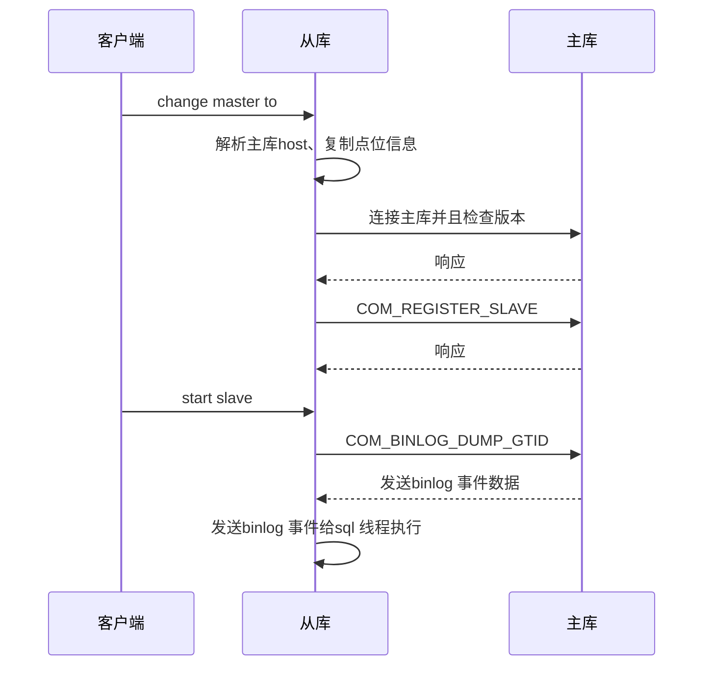
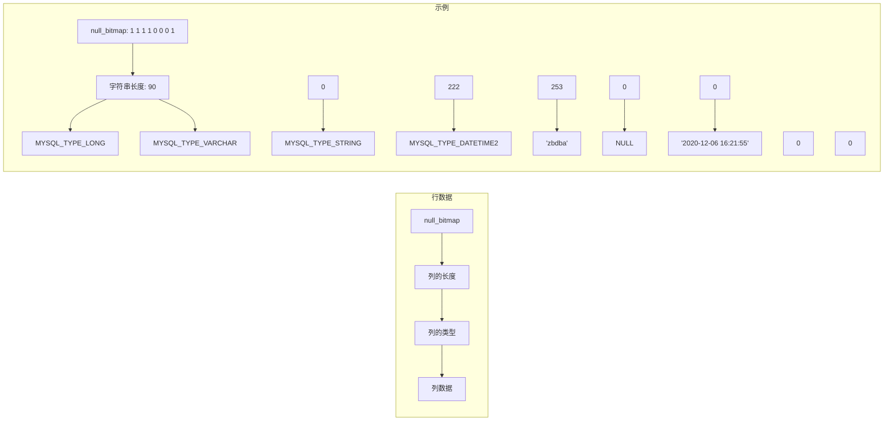

# 第9章 MySQL 高可用实现

在生产环境中部署的数据库，高可用性乃其核心要求之一。通常，数据库实现高可用性的方法主要有以下两种：

- **主从复制**。数据写入到主库上会自动同步到从库上。
- **集群**。集群的实现方式有很多种，包括中心化和去中心化的实现。大部分数据库都采用的是中心化的思想，用多套主从组成，然后上层用中间件做数据分片，将元数据存储在一个公共的存储上。另外一种是去中心化的实现（例如 Cassandra），数据分布在不同的节点上，利用 gossip 协议来进行元数据的同步。

MySQL 目前已经实现了上述两种架构，但基于第二种架构的 MGR 集群技术成熟较晚。因此，大多数企业目前仍然主要采用主从复制模式。然而，在 MySQL 8.0 版本后，MGR 已经经历了大量改进，业界也开始逐渐采纳这一技术。

> [!INFO] 说明
> 本章重点介绍 MySQL 主从复制的核心原理、binlog 日志结构、半同步复制及并行复制等关键内容。

## 9.1 MySQL 主从复制

主从复制作为 MySQL 的一项成熟技术，其发展历程包含若干关键节点，如下所示。

- **2000 年**：开始支持主从复制。
- **2003 年（MySQL 4.0）**：MySQL 开发者重写了从库的逻辑，将从库分为两个线程：I/O 线程 和 SQL 线程。
- **2005 年（MySQL 5.1）**：开始支持 binlog 为 row-base 格式的复制，在这之前只支持 statement 方式的复制。
- **2009 年（MySQL 5.5.0）**：MySQL 以插件的方式支持了[[半同步复制]]。
- **2011 年（MySQL 5.6.3）**：开始支持从库并行复制，支持基于库级别的并行复制。
- **2012 年（MySQL 5.6.5）**：开始支持基于 [[GTID]] 模式的复制。
- **2015 年（MySQL 5.7.6）**：支持 LOGICAL_CLOCK 方式的并行复制，利用主库组提交的方式在从库进行并行回放。
- **2018 年（MySQL 5.7.22）**：支持 [[WriteSet]] 方式的并行复制，这种方式的性能会优于之前的并行方式。

从 MySQL 的发展历程可以看到，除了对问题的修复之外，最为关键的进展之一便是从库支持并行复制的能力。当前，主从复制的延迟问题仍然普遍困扰着 DBA。然而，随着 WriteSet 并行复制技术的引入，大部分延迟问题得到了有效解决。

### 9.1.1 数据同步流程

在 MySQL 主从复制中，数据同步流程主要分为如下两个阶段：

- **全量同步阶段**。
- **增量同步阶段**。

#### 1. 全量同步阶段

该阶段在 MySQL 8.0 之前需要在主库上进行备份，然后利用备份恢复来创建从库。备份可以选择冷备和热备：
- **冷备**：直接停机进行复制即可。
- **热备**：利用 `mysqldump` 工具和 `xtrabackup` 工具进行，它们分别对应逻辑和物理备份方式。

从 MySQL 8.0 版本开始支持 Clone Plugin 特性，从库能够自动拉取主库的全量数据，Clone Plugin 的实现原理跟 `xtrabackup` 基本一致。无论何种方式，都需要记录当时的主库位点信息：
- 如果是基于 [[GTID]] 复制则不用关心位点信息。
- 如果是基于 `binlog` 文件 + `position` 的方式则需要记录当时的主库对应的位点信息。

这主要是为了保证全量和增量能衔接上，而不会导致数据冲突或者不一致。

> [!TIP] 补充知识
> 利用备份进行全量同步比较简单，这里就不详细介绍了。如果读者对热备能保证数据一致比较感兴趣，可以了解一下 `mysqldump` 工具和 `xtrabackup` 工具的实现原理，前者可以参考 [[MVCC]] 机制，后者可以参考崩溃恢复机制。

#### 2. 增量同步阶段

该阶段主要基于 `binlog` 日志复制，主库在事务提交的时候会将修改的数据或者 SQL 语句写入一份到 `binlog` 日志中，然后将其发送给从库，从库基于这些 `binlog` 日志实现数据同步的功能。

##### GTID 概念

在介绍增量同步的流程前，我们首先需要了解一个概念，那就是**全局事务标识（Global Transaction Identifier，GTID）**。这是 MySQL 5.6.5 版本引入的一个特性，其核心思想就是一套主从中一个事务对应一个 GTID，表示方式如下：

```
uuid:number
```

它可以表示执行的位置，比如在主库上执行到了 `uuid:30`，在从库上执行到了 `uuid:25`，那么从库就比主库延迟了 5 个事务。在 GTID 引入之前，复制的位点信息是用 `binlog` 文件号和 `binlog` 文件中的位置一起表示的。

引入 GTID 最大的一个好处就是在主从切换的时候，从库会自动同步差异的数据。而旧的方式需要我们自己找到差异的 binlog 进行补齐，这是 [[MHA]]（Master High Availability）等一些高可用工具中的一个主要步骤。

##### 增量同步的执行命令

在增量同步中，从库上主要执行两条命令：
1. `change master to`
2. `start slave`

MySQL 增量同步的时序图如图 9-1 所示。



**图 9-1 MySQL 增量同步的时序图**

##### `change master to` 详解

首先看 `change master to`。在全量数据同步到从库上后，就可以开始进行增量同步了，增量同步在从库上由如下语句触发。

**binlog 文件加上 position 方式：**
```sql
change master to master_host='10.10.10.10', master_user='root', master_password='zbdba', master_log_file='binlog.0001', master_log_pos=768;
```

**GTID 方式：**
```sql
change master to master_host='10.10.10.10', master_user='root', master_password='zbdba', master_auto_position=1;
```

###### 执行流程

1. 检查从库 I/O 线程和 SQL 线程是否正在运行，如果是将报错。
2. 检查是否指定了 `binlog` 文件和 `position`，如果是就不能指定 `master_auto_position=1`。
3. 检查是否指定了 `master_auto_position=1`，如果是就需要开启 GTID，如果没有开启会报错。
4. 判断是否需要清理中继日志。
5. 检查 `change master` 语句中的 `master_host` 是否为空。
6. 将 `change master` 命令中的一些参数设置到 Master_info 对象的对应字段中。
7. 如果需要清理中继日志，就进行清理。

可以看到，`change master to` 语句主要是进行一些检查和准备工作，还没有跟主库发起连接请求。

##### `start slave` 详解

执行 `start slave` 命令后又分为开启 I/O 线程和 SQL 线程两步。

- **I/O 线程**：负责向主库发起 `binlog` 请求，并且接收主库发来的 `binlog` 事件，然后写入到中继日志中。
- **SQL 线程**：负责读取中继日志中的事件并应用。

###### 开启 I/O 线程

1. 开始连接主库。
2. 在主库上设置一些会话变量，包括 `master_heartbeat_period`、`master_binlog_checksum`、`slave_uuid`。
3. 检查主从的 `binlog` 版本。
4. 如果 `binlog` 版本大于 1，则向主库发送 `COM_REGISTER_SLAVE` 命令，用于在主库上注册从库信息。
5. 向主库发送 `COM_BINLOG_DUMP` 或者 `COM_BINLOG_DUMP_GTID` 命令，用于向主库请求 `binlog`。
6. 从网络缓冲区中读取主库发送过来的 `binlog` 事件数据。
7. 将事件写入中继日志中。

相关协议包括 `COM_REGISTER_SLAVE`、`COM_BINLOG_DUMP`、`COM_BINLOG_DUMP_GTID`，其内容分别如表 9-1 ~ 表 9-3 所示。

**表 9-1 COM_REGISTER_SLAVE 协议内容**

| 名称 | 长度/B | 描述 |
|------|--------|------|
| server_id | 4 | 从库的 server_id，由 `server_id` 参数控制 |
| slave_hostaname | hostname 的具体长度 | 从库的 hostname |
| slave_user | 从库用户的具体长度 | 从库指定的复制用户名 |
| slave_password | 从库用户密码的具体长度 | 从库指定的复制用户的密码 |
| slave_port | 2 | 从库指定的端口号 |
| replication_rank | 4 | 默认为 0，目前忽略 |
| master_id | 4 | 默认为 0，在主库上会将该字段设置为主库的 server_id |

**表 9-2 COM_BINLOG_DUMP 协议内容**

| 名称 | 长度/B | 描述 |
|------|--------|------|
| binlog_pos | 4 | 指定要从主库拉取的 binlog 对应的位置信息 |
| flags | 2 | 目前只能设置 `BINLOG_DUMP_NON_BLOCK`，表示在主库没有 binlog 事件可以发送的时候，也就是 binlog 发送完成后，会发送一个 EOF 包而不是一直阻塞这个连接 |
| server_id | 4 | 从库的 server_id |
| binlog-filename | 具体 binlog 的长度 | 指定要从主库拉取的 binlog 信息 |

**表 9-3 COM_BINLOG_DUMP_GTID 协议内容**

| 名称 | 长度/B | 描述 |
|------|--------|------|
| flag | 2 | 有 `BINLOG_DUMP_NON_BLOCK`、`BINLOG_THROUGH_POSITION`、`BINLOG_THROUGH_GTID` 三个选项，第一个在上面已经介绍，后面两个主要确定是否采用 GTID 方式 |
| server_id | 4 | 指定从库的 server_id |
| binlog-filename-len | 4 | 保存 binlog 的长度 |
| binlog-filename | binlog 的实际长度（即上面的字段值） | binlog 名称，默认会设置为空 |
| binlog_pos | 8 | binlog 对应的位置，默认为 0 |
| data-len | 4 | 存储 gtid 的长度 |
| data | 存储 data 实际的长度（即上面字段的值） | 存储从库 executed GTID |

###### 开启 SQL 线程

1. 设置并发模式为 `database` 或者 `logical_clock` 或者 `WriteSet`。
2. 初始化 SQL 线程。主要是初始化 THD 对象中的一些字段，设置当前状态为 `Waiting for the next event in relay log`，SQL 线程跟用户线程一样也是用 THD 对象进行管理的。
3. 开启工作线程。不过，如果 `slave_parallel_workers` 设置为 0，就不开启工作线程，默认用当前线程来应用后续读取到的中继事件。
4. 根据中继日志的名字和位置打开中继日志。
5. 设置状态为 `Reading event from the relay log`。
6. 从中继日志中读取事件数据。
7. 如果没有开启并行模式，那么执行应用对应的事件即可；如果开启了并行模式，就将事件发送到对应的队列中。
8. 每种事件在应用时都有其对应的逻辑，应用事件前首先需要根据它的编码方式进行解析，得到具体的内容再进行应用。例如，`rotate event` 解析到具体的内容后执行一次中继日志的切换，而 `QUERY_EVENT` 解析到具体内容后得到具体的 SQL 语句在从库中执行。

> [!WARNING] 注意
> 在后面会详细介绍开启并行复制的情况。

##### 主库处理逻辑

对于图 9-1 右侧的主库处理逻辑，其详细流程如下：

1. 收到从库发来的连接请求，初始化对应的 THD 对象并建立连接信息。
2. 接收从库发来的设置会话级别的参数请求，设置 `master_heartbeat_period`、`master_binlog_checksum`、`slave_uuid` 的值。
3. 接收从库发送的 `COM_REGISTER_SLAVE`，将从库信息插入主库维护的哈希表中。
4. 接收从库发送的 `COM_BINLOG_DUMP` 或者 `COM_BINLOG_DUMP_GTID` 命令，主库处理这两个命令的逻辑基本一样，下面统一介绍。

主库收到 dump 命令之后，创建一个 **binlog sender 线程**，其底层还是 THD 对象。然后根据从库发送过来的 `binlog` 文件名称和 `position` 点读取对应的 `binlog` 文件。

- 如果是 GTID 方式：首先会根据从库发送过来的 GTID 信息从第一个 `binlog` 开始扫描，查看该 GTID 是否在对应的 `binlog` 文件中。扫描到之后，就从该 `binlog` 最开始的位置按照顺序读取，每次读取一个事件，并判断该事件是否在从库执行过。判断的逻辑是每次读取到事件后会将当前的 GTID 和从库的 `gtid_executed` 进行对比，如果执行了就直接跳过，不再执行后面的步骤，如果未执行就将事件发送给从库。
- 循环上述步骤，直到所有的 `binlog` 日志都发送完成。如果当前的 `binlog` 日志发送完成后主库没有新的写入，就进入等待状态，等待一个条件变量。等待状态有一个超时时间，就是发送 `heartbeat event` 的时间，发送完成后会尝试继续读取 `binlog`，如果还没有数据又会进入等待状态。如果主库有新的写入，`ordered_commit` 方法刷新 `binlog` 后会向 `binlog sender` 线程等待的条件变量发送信号量，`binlog sender` 收到信号量之后就退出等待，然后尝试去读取新产生的 `binlog` 记录。

由此可见，GTID 与 `binlog` 文件加上 `position` 的方式在初始读取二进制日志时存在比较大的差异。
- 后者能够直接定位至特定二进制日志文件的确切位置。
- 相对地，前者则需先通过从库的 `gtid_executed` 集合确定相应的 `binlog` 文件，随后在读取该文件时与 `gtid_executed` 进行比对，从而过滤掉已在从库执行过的 `binlog` 事件。对于尚未执行的 `binlog` 事件，则将其传输至主库。

### 9.1.2 binlog 日志详解

在主从同步机制中，我们了解到增量同步依赖于 `binlog` 文件的传递，以实现主从数据库间的数据实时同步。那么 `binlog` 日志文件究竟包含哪些信息？MySQL `binlog` 文件的内部架构如图 9-2 所示。

```mermaid
graph TD
    subgraph binlog文件```mermaid
graph TD
    subgraph binlog文件
        A[FORMAT_DESCRIPTION_EVENT] --> B[PREVIOUS_GTIDS_EVENT]
        B --> C[GTID_EVENT]
        C --> D[QUERY_EVENT]
        D --> E[TABLE_MAP_EVENT]
        E --> F[ROW_EVENT]
        F --> G[...]
        G --> H[XID_EVENT]
        H --> I[ROTATE_EVENT]
    end
    subgraph ROW_EVENT
        J[EVENT HEADER]
        K[extra_data_len]
        L[extra_data]
        M[null_bitmap]
        N[value (row data)]
    end
    subgraph TABLE_MAP_EVENT
        O[table_id]
        P[flags]
        Q[schema_name_length]
        R[schema_name]
        S[table_name_length]
        T[table_name]
        U[column_count]
        V[column_type_def]
        W[column_meta_def]
        X[null_bitmap]
    end
    F --> ROW_EVENT
    E --> TABLE_MAP_EVENT
```

**图 9-2 MySQL binlog 文件的内部架构**

可以看到,`binlog` 文件实际是由多个 `binlog` 事件组成的,在 MySQL 5.7.19 版本中,有 38 种 `binlog` 事件类型.不同类型的事件存储不同类型的数据,常用的 `binlog` 事件如表 9-4 所示.

**表 9-4 常用的 binlog 事件**

| 事件名称 | 描述 |
|----------|------|
| UNKNOWN_EVENT | 表示不确认的事件类型 |
| START_EVENT_V3 | 在 binlog version 1~3 中,START_EVENT_V3 表示 binlog 的第一个事件 |
| QUERY_EVENT | 用于存储 SQL 语句,例如 `begin`、`commit` 语句.binlog 文件如果设置为 statement 格式,就会产生大量的 QUERY_EVENT |
| STOP_EVENT | 标志着一个 binlog 文件的结束,当 MySQL 服务器完成对一个 binlog 文件的写入操作,并且准备切换到下一个 binlog 文件时,会在当前 binlog 文件的末尾写入一个 STOP_EVENT |
| ROTATE_EVENT | 位于 binlog 文件末尾,用于记录下一个 binlog 的信息 |
| INTVAR_EVENT | 存储会话整型变量 |
| USER_VAR_EVENT | 存储用户会话变量值 |
| FORMAT_DESCRIPTION_EVENT | 在 binlog version 4 中,该事件也是 binlog 的第一个事件,但用于存储 binlog 版本、MySQL 版本等信息 |
| XID_EVENT | 用于存储 2 阶段提交的事务 ID |
| TABLE_MAP_EVENT | 记录表字段的元数据信息,跟 row 事件结合使用 |
| WRITE_ROWS_EVENTv0 | 存储插入语句的数据,版本 5.1.0~5.1.15 |
| UPDATE_ROWS_EVENTv0 | 存储更新语句的数据,版本 5.1.0~5.1.15 |
| DELETE_ROWS_EVENTv0 | 存储删除语句的数据,版本 5.1.0~5.1.15 |
| WRITE_ROWS_EVENTv1 | 存储插入语句的数据,版本 5.1.15~5.6.x |
| UPDATE_ROWS_EVENTv1 | 存储更新语句的数据,版本 5.1.15~5.6.x |
| DELETE_ROWS_EVENTv1 | 存储删除语句的数据,版本 5.1.15~5.6.x |
| HEARTBEAT_EVENT | 在主库生成,不记录到中继日志中,主要用于更新从库的 Seconds_Behind_Master 值 |
| WRITE_ROWS_EVENTv2 | 存储插入语句的数据,版本 5.6.x 及以上 |
| UPDATE_ROWS_EVENTv2 | 存储更新语句的数据,版本 5.6.x 及以上 |
| DELETE_ROWS_EVENTv2 | 存储删除语句的数据,版本 5.6.x 及以上 |
| GTID_EVENT | 开启 GTID 模式后,每个事务开始的时候都会生成 GTID_EVENT 用于记录事件信息 |

了解了常见的 `binlog` 事件及其作用后,下面以一条普通的 SQL 语句为例,看看会产生哪些 `binlog` 事件.执行如下 SQL 语句:

```sql
begin;
update sbtest1 set pad='zbdba' where id = 10;
commit;
```

上述 SQL 语句为一个完整的事务,会产生如下 `binlog` 事件:

```
QUERY_EVENT
TABLE_MAP_EVENT
UPDATE_ROWS_EVENTv2
XID_EVENT
```

这里重点介绍一下 `QUERY_EVENT`、`TABLE_MAP_EVENT`、`ROWS_EVENT` 这三个事件的内部组成.

无论 `binlog` 事件是什么类型的,都由 **EVENT HEADER** 和 **EVENT DATA** 部分组成,其中 EVENT DATA 又分为 Post-header 和 Variable part 两块,这里我们统称为 EVENT DATA.EVENT HEADER 存储的是一些元数据信息,而 EVENT DATA 存储的是事件具体的数据.EVENT HEADER 是定长的,一般是 13 B 或 19 B,视具体的 binlog 版本而定,目前我们的 MySQL 版本对应的 EVENT HEADER 长度基本都是 19 B.EVENT HEADER 字段的名称及描述如表 9-5 所示.

**表 9-5 EVENT HEADER 字段的名称及描述**

| 名称 | 描述 |
|------|------|
| timestamp | 存储当前的时间戳 |
| event_type | 存储 binlog 事件的类型 |
| server_id | 存储 master 的 server id |
| event_size | 存储 EVENT DATA 的大小 |
| log_pos | 存储下一个事件的 position |
| flags | 存储一些标记位 |

可以看到,EVENT HEADER 中主要存储的是事件的类型、server id,还有 EVENT DATA 的大小等.

接着看 EVENT DATA 的内容.不同类型的事件存储的 EVENT DATA 不一样,下面将对这三个事件分别进行介绍.

#### QUERY_EVENT

`QUERY_EVENT` 的主要字段名称及描述如表 9-6 所示.

**表 9-6 QUERY_EVENT 的主要字段名称及描述**

| 名称 | 描述 |
|------|------|
| status_vars_length | 存储 status-vars 的长度 |
| status_vars | 存储一些变量的值,例如字符集、时区等 |
| schema | 存储数据库名称 |
| query | 存储具体的 SQL 语句 |

上例中的 SQL 语句产生了一个 `QUERY_EVENT`,该 `QUERY_EVENT` 的 `query` 字段存储的就是 `begin` 语句.如果 binlog 的格式为 `statement`,那么 `update sbtest1 set pad='zbdba' where id = 10;` 这条 SQL 语句也会生成一个 `QUERY_EVENT`,存储到对应的 `query` 字段中.

#### TABLE_MAP_EVENT

`TABLE_MAP_EVENT` 的主要字段名称及描述如表 9-7 所示.

**表 9-7 TABLE_MAP_EVENT 的主要字段名称及描述**

| 名称 | 描述 |
|------|------|
| table_id | 存储 table id |
| flags | 存储一些标记位 |
| schema_name_length | 存储数据库名称的长度 |
| schema_name | 存储数据库名称 |
| table_name_length | 存储表名称长度 |
| table_name | 存储表名称 |
| column_count | 存储表中列的数量 |
| column_type_def | 存储表中所有列的数据类型 |
| column_meta_def | 存储表中所有列数据类型对应的元数据信息,例如长度等 |
| null_bitmap | 存储空值位图 |

可以看到,`TABLE_MAP_EVENT` 中主要存储的是表的一些元数据信息,其中最重要的就是表中各个字段的数据类型.

#### ROWS_EVENT

`ROWS_EVENT` 又分为 `WRITE_ROWS_EVENT`、`UPDATE_ROWS_EVENT`、`DELETE_ROWS_EVENT`.其中:
- `WRITE_ROWS_EVENT` 对应 `insert` 语句,存储后镜像数据,也就是插入的数据;
- `UPDATE_ROWS_EVENT` 对应 `update` 语句,存储前镜像、后镜像的数据,也就是更新之前和更新之后的数据;
- `DELETE_ROWS_EVENT` 对应 `delete` 语句,存储前镜像数据,也就是被删除前的数据.

虽然 `ROWS_EVENT` 分为三种类型,但内部的存储格式基本一致,`ROWS_EVENT` 字段的名称及描述如表 9-8 所示.

**表 9-8 ROWS_EVENT 字段的名称及描述**

| 名称 | 描述 |
|------|------|
| table_id | 存储表 id |
| flags | 存储一些标记位,例如是否检查外键或者唯一键 |
| extra_data_len | 存储 extra_data 的长度 |
| extra_data | 根据需要存储额外的数据 |
| lenenc_int | 存储列的数量 |
| columns-present-bitmap1 | 存储列对应的状态,如果该列的状态没有设置,则说明该行数据中没有该列的数据.主要用于 `WRITE_ROWS_EVENT`、`DELETE_ROWS_EVENT` |
| columns-present-bitmap2 | 存储列对应的状态,如果该列的状态没有设置,则说明该行数据中没有该列的数据.主要用于 `UPDATE_ROWS_EVENT` |
| null-bitmap | 存储该行空值位图 |
| value | 存储该行所有列的值,按照顺序存储 |

最后两个字段表示一行数据,如果有多行数据就对应多组 `null-bitmap` 和 `value` 字段.

了解了 `binlog` 常见的几种事件存储的格式后,如果我们想解析 `ROWS_EVENT` 中存储的数据,需要怎么操作?

1. 解析 `TABLE_MAP_EVENT` 事件,拿到该表各个字段的数据类型.
2. 解析 `ROWS_EVENT`,我们可以解析到表 id,根据这个表 id 去刚刚解析到的 table map 中获取信息.
3. 解析 `lenenc_int`,拿到一行有多少列数据.
4. 解析 `columns-present-bitmap1` 或者 `columns-present-bitmap2`,它们的作用是表示列对应的状态,如果该列的状态没有设置,则说明该行数据中没有该列的数据.
5. 解析具体每行的数据了,在解析每行数据的时候,先解析 `null-bitmap`,这个用来判断哪一列为 NULL.到这里就开始解析具体每列的数据了,解析每列的数据需要知道什么信息?第一是列的长度,第二是列的类型.根据数据类型不同,对应列的长度也会不一样.有的是定长列,比如 int 数据类型,有的是变长列,比如 varchar 数据类型.那么针对变长的数据类型怎么拿到具体的长度?这就要靠刚刚解析的 `TABLE_MAP_EVENT` 数据中的 `column_meta_def` 项,结合这里面的元数据信息,就可以知道该列具体占用了多少字节.当然元数据并不只是可以计算出占用的字节数,在有的数据类型中,比如在一些时间类型上,元数据也会用来辅助解析时间.MySQL binlog 行数据的架构如图 9-3 所示.



**图 9-3 MySQL binlog 行数据的架构**

以上简单介绍了 `binlog` 文件的整体组成和内部常规存储的内容,这可以方便我们理解在主从复制中数据是如何存储到 `binlog` 文件中的,最终复制到其他节点上.同时,一些 `binlog` 解析工具或者 DTS(Data Transmission Service)迁移类软件的核心实现其实也就是参考 `binlog` 文件的内部组成和每个事件的编码来进行解析的.

### 9.1.3 半同步复制

MySQL 的主从复制机制本质上是**异步**的.在主从数据同步过程中,主库提交的事务生成的 `binlog` 将会传输至从库.由于主库的提交与从库应用 `binlog` 之间存在时间差,因此可能会出现数据丢失的情况.例如,在主从延迟较大的情况下,若主库所在机器发生异常宕机且无法恢复,从库可能会丢失部分数据.

为了应对这一问题,MySQL 在 5.0 版本中引入了**半同步复制插件**.该插件的工作原理是,在主库提交事务时,系统会等待**至少一个从库接收到该事务的事件并将其写入从库中继日志**,之后才向主库返回 ACK 确认信息,随后主库完成提交.

之所以称之为“半同步”复制而非“完全同步”复制,是因为在当前的实现机制中,从库仅需将 `binlog` 事件写入中继日志即可向主库返回 ACK 信息,而非等到从库对应的事务提交之后才返回确认.

MySQL 半同步复制的架构如图 9-4 所示.

> [!NOTE] **半同步复制的动机**
> 异步复制中,主库和从库之间存在时间差,因此可能会出现数据丢失的情况.例如,在主从延迟较大的情况下,若主库所在机器发生异常宕机且无法恢复,从库可能会丢失部分数据.

MySQL 在 5.0 版本中引入了半同步复制插件.该插件的工作原理是,在主库提交事务时,系统会等待至少一个从库接收到该事务的事件并将其写入从库中继日志,之后才向主库返回 ACK 确认信息,随后主库完成提交.

之所以称之为**半同步复制**而非完全同步复制,是因为在当前的实现机制中,从库仅需将 binlog 事件写入中继日志即可向主库返回 ACK 信息,而非等到从库对应的事务提交之后才返回确认.

### 9.1.3 半同步复制架构

MySQL 半同步复制的架构如图 9-4 所示.

**图 9-4  MySQL 半同步复制的架构**  
(原始图片描述了主库和从库之间的交互流程)

**主要流程如下:**

1. **第 1 步:写入 binlog**  
   主库进行事务提交,提交分为三个阶段.在 flush 阶段将该事务的 binlog 事件写入 binlog 文件中.然后判断是否开启了半同步复制,判断 `rpl_semi_sync_master_wait_point` 是否设置为 `AFTER_SYNC`.如果上述条件都满足,就对比从库返回当前主库的 binlog 位点是否大于等于当前事务的 binlog 位点.如果满足这个条件,则说明从库已经收到这个事务的 binlog,可以继续后续的事务提交流程;如果不满足,就需要进入等待状态,这里的等待同样是监听一个条件变量.

2. **第 2 步:读取事件**  
   主库的 Dump 线程开始读取该事务对应的事件,将其依次发送给从库.在发送的时候会判断是否开启了半同步复制,以及当前事件是否为事务结束的事件,也就是 `XID_EVENT`.如果满足上述两个条件,那么 MySQL 将在 `XID_EVENT` 的 header 中将对应的 ACK 标记位设置为 1,表示需要从库回复 ACK 信息.

3. **第 3 步:发送 binlog**  
   主库将对应的 binlog 日志发送给从库.

4. **第 4 步:写入**  
   从库收到主库发过来的 binlog 事件时,首先会将 binlog 事件写入到中继日志中.每个事件写入完成后,判断是否开启了半同步复制,以及当前事件的 header 中 ACK 标记是否为 1.如果上述两个条件都满足,说明读取到一个事务结束的 `XID_EVENT`,那么从库需要给主库回复 ACK 信息.ACK 信息中主要包含当前事件对应的 `binlog_name` 和 `binlog_pos` 信息.

5. **第 5 步:发送 ACK**  
   主库的 ACK Receiver 线程会一直监听 ACK 信息.当从库向主库发送 ACK 信息时,该线程会立即收到并进行处理,具体主要是将 ACK 信息中的 binlog 位点信息解析出来并更新到内存变量中.在更新完成后,ACK Receiver 线程会对比从库返回的和主库的 binlog 位点,如果前者大于等于后者,则会唤醒刚刚等待的提交线程,唤醒的方式就是向其监听的条件变量发送信号量.

6. **第 6 步:AFTER_SYNC 或 AFTER_COMMIT**  
   主库的提交线程收到信号量后就退出等待,然后继续对比从库返回当前主库的 binlog 位点是否大于等于当前事务的 binlog 位点.注意,此时从库返回的 binlog 位点已经被 ACK Receiver 线程更新了,如果满足就继续后续的提交流程,如果不满足就继续等待.

### 半同步复制模式设置

半同步可以设置两种模式:`AFTER_SYNC` 和 `AFTER_COMMIT`,由 `rpl_semi_sync_master_wait_point` 参数控制.两种模式的区别主要是等待从库 ACK 恢复的阶段不一样.

- **AFTER_SYNC** 模式:在组提交的 Sync 阶段后和提交阶段前.由于这个事务这时没有在 InnoDB 层提交,所以其他会话看不到这个事务操作后的结果.
- **AFTER_COMMIT** 模式:在组提交的提交阶段后.这个时候事务已经在 InnoDB 层提交,其他会话可以看到这个事务操作后的结果.

> [!WARNING] **AFTER_COMMIT 模式的潜在问题**
> 在极端情况下,`AFTER_COMMIT` 模式可能会有问题.如果事务进入等待状态时主库宕机了,并且 binlog 还没有来得及发送给从库,但在宕机前一些会话已经读取到当前事务操作的结果.这个时候如果发生主从切换,从库就读取不到主库上最近的 binlog 数据,就会产生主从数据不一致的问题.要解决这个问题,只需要将模式设置为 `AFTER_SYNC` 即可.

### 相关参数

- `rpl_semi_sync_master_timeout`:等待从库返回 ACK 信息的最大时间,默认为 10s.如果超过这个时间就会退出等待,继续后续的提交动作,这个时候就相当于退化成了异步复制.在上述流程的第 1 步中,进入等待时会设置超时时间,这个时间就是由该参数控制的.
- `rpl_semi_sync_master_wait_for_slave_count`:等待返回 ACK 信息的从库个数,在上述流程的第 4 步中进行设置,默认为 1 个.如果将其设置为 2,表示需要等待 2 个从库都返回 ACK 信息.

## 9.1.4 并行复制

由于 MySQL 主从复制默认是异步复制,因此有很多情况可能造成主从复制延迟增大,这也是困扰数据库管理员多年的问题.MySQL 从 5.6 到 8.0 版本一直以来都在提升从库的性能.

在没有并行复制的时候,主库可能是多线程写入,从库还是只有一个 SQL 线程来应用中继日志,这样主库并发一多必然造成延迟.在 MySQL 5.6 中引入了数据库级别的并行复制后,虽然从库可以根据数据库的维度进行并行复制,但如果只有一个数据库或者批量操作都集中在一个数据库中,就没有明显的效果.

在 MySQL 5.7 中引入了 MTS(Multi-Thread Slave)后,从库依赖主库的组提交进行并行复制,只要是主库中在同一个组提交的事务,就认为它们可以在从库上并行回放.该模式在高并发的时候效果较为明显,相比数据库级别的方式更为实用.不过该模式也无法彻底解决延迟的问题,在实际应用中,有一些业务场景每组的事务数量并不多,这样实际的并行回放效果也不好.

在 MySQL 8.0 中引入了 WriteSet,其实最早在 MySQL 5.7.22 版本中就发布了最初的版本.WriteSet 的主要思想是,**只要数据不冲突就可以进行并行回放**,不管是不是在一个组提交的.WriteSet 在 MTS 的基础上进一步提升了并发的效率,它的引入基本上能解决大部分常见的延迟问题.

### 1. MySQL 5.6 并行复制

在 MySQL 5.6 版本中首次支持了从库的并行复制,并行的粒度是**数据库级别**的.其主要逻辑在从库 SQL 线程中实现,将原有的单个 SQL 线程拆分为**一个调度线程**和**多个工作线程**,由调度线程进行中继日志事件的路由分发,工作线程负责事件应用.

MySQL 5.6 的并行复制架构如图 9-5 所示.

**图 9-5  MySQL 5.6 的并行复制架构**  
(原始图片展示了主库和从库之间的交互,包括 Dump 线程、I/O 线程、调度线程、工作线程及事件队列)

**从库并行复制的大致流程:**

1. **第 1 步:写入** – 主库进行事务提交,将 binlog 日志写入 binlog 文件.
2. **第 2 步:读取事件** – Dump 线程从 binlog 中读取事件.
3. **第 3 步:发送** – Dump 线程将 binlog 日志发送给从库.
4. **第 4 步:写入** – 从库 I/O 线程收到主库发送过来的 binlog 事件,将事件写入中继日志.
5. **第 5 步:读取事件** – 从库调度线程从中继日志中读取 binlog 事件.
6. **第 6 步:发送** – 从库调度线程将 binlog 事件进行路由分发.

**路由分发逻辑详解:**

调度线程要在数据库级别进行并发,参考 9.1.2 节中介绍的具体执行一条 SQL 语句产生的事件.可以看到,只有 `TABLE_MAP_EVENT` 中有数据库的信息.具体实现如下:

1. 将 `GTID_EVENT`、`QUERY_EVENT` 暂时存储在临时的内存数组中.
2. 解析 `TABLE_MAP_EVENT` 得到具体的数据库,然后根据数据库去全局维护的哈希表查找对应的工作线程信息.MySQL 维护了一个全局哈希表,用于存储数据库和工作线程映射关系.如果数据库在哈希表中没有找到,那么需要分配一个工作线程给当前的数据库.分配的规则是**选择一个执行事务较少的工作线程**(而不是用哈希取模进行计算),这样做的好处是可以避免分配不均匀的问题.在完成分配后,会将数据库和分配的工作线程插入哈希表中,后续的事务如果是同样的数据库就能从哈希表中找到对应的工作线程了,到时候就能直接路由到这个工作线程上.
3. 在找到对应工作线程之后,该事务所有的事件都应该分发到这个工作线程中.所以先将之前暂存的 `GTID_EVENT` 和 `QUERY_EVENT` 发送给对应的工作线程——发送到工作线程维护的队列中.工作线程会实时监听这个队列,如果有发送事件,工作线程能立即收到事件并开始解析执行.在发送完 `GTID_EVENT` 和 `QUERY_EVENT` 后会继续发送 `TABLE_MAP_EVENT`,然后会将该事务的工作线程暂存到内存中,该事务后面的事件会直接采用这个工作线程.
4. 将 `DELETE_ROWS_EVENT` 和 `XID_EVENT` 发送到对应的工作线程维护的队列中.工作线程收到事件进行应用,应用的流程跟原有的 SQL 线程一样.

后续的事务也按照上述流程执行.可以看到,数据库级别的并行复制需要依赖 `TABLE_MAP_EVENT` 中的数据库信息,如果事务中没有 `TABLE_MAP_EVENT`,那么就不能并行执行.

### 2. MySQL 5.7 并行复制(MTS)

MySQL 5.7 并行复制主要依赖**主库组提交**的逻辑.组提交将同一组的事务通过 `sequence_number` 和 `last_committed` 两个字段标识到一组,并且将这两个字段写入每个事务 `GTID_EVENT` header 中.从库还是由一个调度线程和多个工作线程组成,调度线程主要参考 binlog 中的 `sequence_number` 和 `last_committed` 字段来判断事务是否为一组,如果是一组那么就可以并发执行.

MySQL 5.7 的并行复制架构如图 9-6 所示.

**图 9-6  MySQL 5.7 的并行复制架构**  
(原始图片展示了主库组提交与从库 MTS 逻辑,标注了 last_committed 和 sequence_number)

#### 主库端:生成 last_committed 和 sequence_number

MySQL 是两阶段提交,分为准备阶段和提交阶段,其中提交阶段就对应组提交阶段.组提交又分为三个阶段:Flush 阶段、Sync 阶段和提交阶段.

- **`last_committed`** 在准备阶段获取,值为最近一个 `sequence_number`(也就是上一次提交对应的 `sequence_number` 的值).
- **`sequence_number`** 在组提交 Flush 阶段生成 `GTID_EVENT` 的时候获取,其值为上一个 `sequence_number` + 1.如果是该组的第一个事务,则 `sequence_number` 为当前 `last_committed` + 1.

`sequence_number` 每次递增,一组事务 `last_committed` 的值相同.

**示例:**

第一组事务:  
`last_committed=2` `sequence_number=3`  
`last_committed=2` `sequence_number=4`  
`last_committed=2` `sequence_number=5`

第二组事务:  
`last_committed=5` `sequence_number=6`  
`last_committed=5` `sequence_number=7`  
`last_committed=5` `sequence_number=8`

每个事务在生成 `last_committed` 和 `sequence_number` 后,最终会将它们存储到 `GTID_EVENT` 中,然后再写入 binlog 文件.这样从库在解析 `GTID_EVENT` 后就能知道当前事务是否能够并行.

#### 从库端:调度线程逻辑

从库端的 I/O 线程逻辑没有变化,这里介绍 SQL 调度线程:

1. 调度线程从中继日志中读取事件,事务开始是 `GTID_EVENT`,解析 `GTID_EVENT` 后可以拿到 `last_committed` 和 `sequence_number` 的值.
2. 用 `last_committed` 跟当前正在执行的事务最小的 `sequence_number` 进行比较,如果大于就说明当前的事务跟正在执行的事务不是同一组,就不能并行执行,这时候就需要进行等待.
3. 如果小于等于就可以并行执行,这时候为事务分配一个工作线程.跟数据库级别不一样的是,MTS 级别是**直接获取一个空闲的工作线程**,之后同样还是将事件发送到工作线程维护的队列中.
4. 当工作线程监听到队列中有消息后,拿到事件进行解析执行,最终执行完成后会通知正在等待的调度线程,同样也是给调度线程监听的条件变量发送信号量.
5. 调度线程收到信号量则退出等待,然后再次判断当前事务的 `last_committed` 是否小于当前正在执行的事务最小的 `sequence_number`,如果满足条件则可以调度执行,如果不满足就继续进入等待状态.

#### 关于执行顺序的保证

> [!QUESTION] **并行复制的顺序问题**
> 在从库开启并行复制的时候,它的应用顺序是否能够跟主库提交的时候顺序完全一致?
> 
> 答案是肯定保证不了一致.按照目前的分发逻辑,同一组事务会被分发到不同的工作线程,它们执行完成的顺序就可能不一致.不过,MySQL 提供了一个参数 `slave_preserve_commit_order`,设置该参数后,在开启并行复制的时候就能严格按照中继日志中的顺序执行,也就跟主库的提交顺序保持一致了.

**实现原理:**  
开启该参数后,MySQL 维护了一个全局的 `Commit_order_manager` 对象,该对象维护了一个队列.在调度线程将事务分配给对应的工作线程之后,就会将工作线程加入 `Commit_order_manager` 对象维护的队列中.然后在提交的时候会进行判断,如果当前工作线程不是 `Commit_order_manager` 对象维护队列中的第一个元素,那么就进行等待,否则就进行提交.

总结:调度线程读取中继日志是顺序的,分发到对应的工作线程也是顺序的,但每个事务的情况不一样,最终提交的顺序可能不一致.`Commit_order_manager` 对象的目的就是把工作线程按照分发的顺序进行管理,在提交的时候如果工作线程不是第一个元素,那就表示它之前还有工作线程没有提交完成,需要进行等待.

### 3. MySQL 8.0 并行复制(WriteSet)

在 MySQL 8.0 中引入了 WriteSet,它是在 MTS 的基础上进一步进行的优化.主要是在主库上改变了 `last_committed` 和 `sequence_number` 的值,让本来不在一个组提交的事务的 `last_committed` 值也一样,从而提高了并发度.从库进行并行执行的逻辑没有变化.

MySQL 8.0 的并行复制架构如图 9-7 所示.

**图 9-7  MySQL 8.0 的并行复制架构**  
(原始图片展示了 WriteSet 对主库组提交阶段的干预)

#### WriteSet 的核心思想

并行复制的核心思想是**事务没有冲突即可**,进一步说就是事务中操作的数据互相没有冲突即可.MTS 的思想是利用组提交,组提交保证了一组事务肯定没有冲突,但是组提交有一个要求,就是各个事务提交的时间要基本上很接近,这导致并发的事务数可能不是很多,从而导致从库并行的效率不高.

而 WriteSet 的思想是:**只要事务中操作的数据不冲突,那么它们就可以并行执行**,不要求必须在同一个组提交中.

#### 如何判断数据冲突

确定具体的一条记录可以通过**主键**或**唯一键**进行确认.只要多个事务没有操作同一条数据,那么它们就没有冲突.不过也要考虑外键等情况.

#### WriteSet 的实现细节

开启 WriteSet 后,MySQL 会维护一个全局的向量 `m_writeset_history`,向量里面的一个元素能确定一条唯一的记录.它存储了两个信息:

1它存储了两个信息:

1. 第一个是能唯一确定一行记录的值,其生成方式如下(示例):
   ```sql
   CREATE TABLE db1.t1 (i INT NOT NULL PRIMARY KEY, j INT UNIQUE KEY, k INT UNIQUE KEY);
   INSERT INTO db1.t1 VALUES(1, 2, 3);
   ```
   **生成规则**:`索引名称 + 数据库名称 + 数据库名称长度 + 表名称 + 表名称长度 + 字段值 + 字段值长度`
   - 主键 `i` → `PRIMARYdb13t1211` (`PRIMARY` 是主键的索引名)
   - 唯一键 `j` → `jdb13t1221`     (`j` 是第一个唯一键的索引名)
   - 唯一键 `k` → `kdb13t1231`     (`k` 是第二个唯一键的索引名)
   - 上述生成的值最终再进行哈希计算.

2. 第二个是该行记录对应事务的 `sequence_number`,也就是在组提交 Flush 阶段生成的 `sequence_number`.

全局向量 `m_writeset_history` 里面会存储近期事务操作的所有记录对应的唯一值信息,默认存储 **25 000** 条记录,由参数 `binlog_transaction_dependency_history_size` 决定.

#### 写入 WriteSet 的时机

事务中的数据行是在**数据写入 binlog cache 的时候**生成 WriteSet 记录的.

#### 冲突判断逻辑

在组提交的 Flush 阶段,会去全局维护的历史 WriteSet 向量 `m_writeset_history` 中查询当前事务产生的 WriteSet 记录是否存在.相关逻辑如下:

```cpp
// 将 last_parent 设置为 m_writeset_history_start，它是当前 m_writeset_history 中最小的
// last_commit 信息（TODO: confirm）。last_parent 后续会被设置为该事务的 last_committed。
// 如果在下面判断没有冲突的记录，那么 last_committed 就被设置成为 m_writeset_history_start，
// 这样它在从库上就能跟之前的事务并行执行了。如果发生冲突了，就会修改 last_parent 的值。
// 这样它在从库上就不能和其他事务并行执行。
int64 last_parent = m_writeset_history_start;

// 循环遍历当前事务的 WriteSet 向量，看里面的元素是否在全局 m_writeset_history 里面。
for (std::vector<uint64>::iterator it = writeset->begin();
     it != writeset->end(); ++it) {
  Writeset_history::iterator hst = m_writeset_history.find(*it);
  if (hst != m_writeset_history.end()) {
    // 如果在 m_writeset_history 里面存在，那就说明有冲突。
    if (hst->second > last_parent && hst->second < sequence_number)
      // 将 last_parent 的值设置为之前元素对应的 sequence number 的值，
      // last_parent 的值后续会设置为当前事务的 last_committed 的值。
      last_parent = hst->second;
    // 那么把之前相同的记录对应的 value 值改成当前的 sequence_number，
    // 这里的 value 其实对应的是当时事务的 last_sequence。
    hst->second = sequence_number;
  } else {
    if (!exceeds_capacity)
      // 如果不存在，那么就将该元素插入 m_writeset_history 向量中。
      m_writeset_history.insert(
          std::pair<uint64, int64>(*it, sequence_number));
  }
}
```

`m_writeset_history` 中 `m_writeset_history_start` 的值在每次清空 history WriteSet 的时候会赋值成当前事务 `sequence_number` 的值。

> [!IMPORTANT] **前提条件**
> 上述流程有一个前提，就是事务操作对应的行必须有**主键**或**唯一键**，如果没有的话就不能确定唯一性，那么上述逻辑就不能使用。所以没有主键或者唯一键的还是会沿用 MTS 的逻辑，也就是 WriteSet 不干预 `last_committed` 的值，这个时候对应的事务到从库上去的时候也不能跟之前的事务并行执行。

#### 外键的处理

如果事务中操作的记录包含**外键**，情况会如何？外键的操作是需要有顺序性保证的，在从库并行回放的时候需要保证顺序性，不然就会报错。

外键只能操作子表。操作子表的时候，除了把子表的主键和唯一键都生成 WriteSet 元素之外，还会检查该表是否有外键。如果有外键，就会找到**父表**，父表被参考的字段也会被加入 WriteSet 元素中，以此确保父表记录的依赖顺序，从而避免在并行回放时因外键约束而引发错误。

> [!TIP] **WriteSet 的最终效果**
> 通过 WriteSet，原本不在同一组提交的事务如果操作的数据无冲突，它们的 `last_committed` 可以被设置为相同的较低值，从而允许从库并行回放，大幅提升复制效率。这基本上能解决大部分常见的延迟问题。