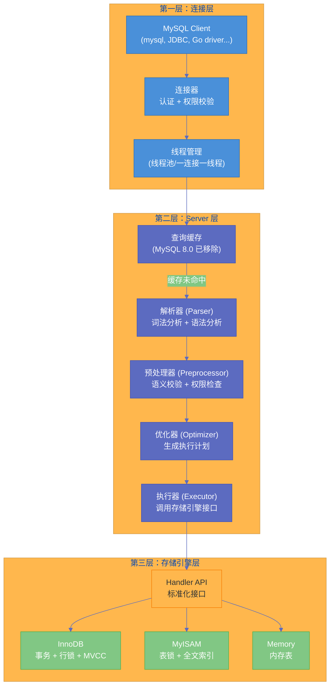
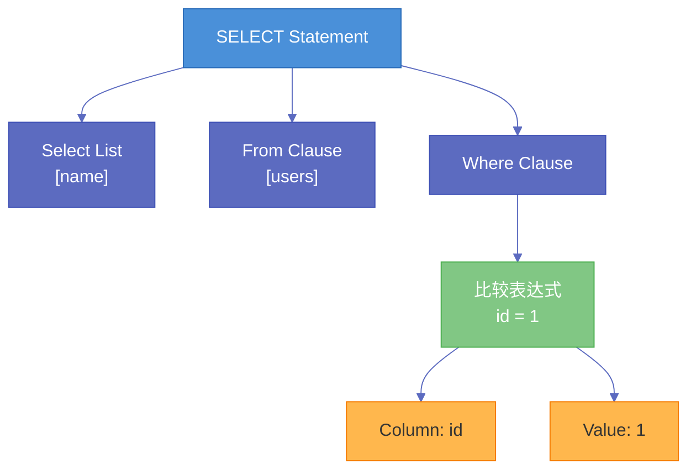
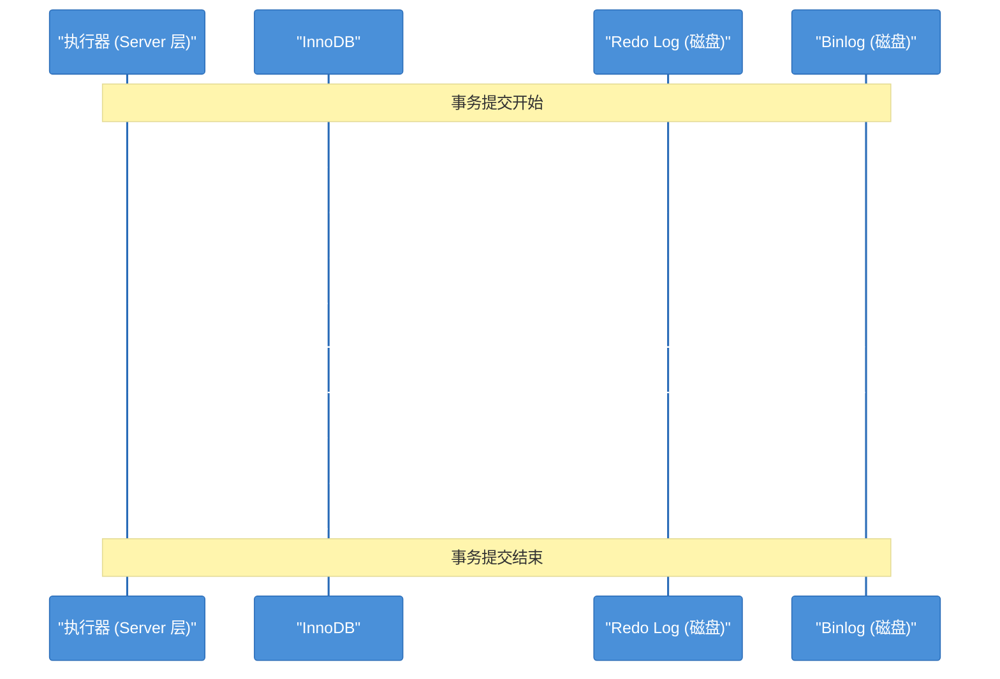
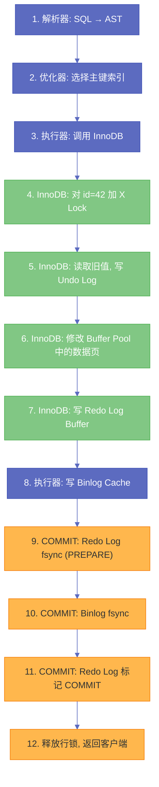

# 01 MySQL 全局架构——一条 SQL 的完整生命周期

**摘要：** 理解 MySQL 的全局架构，是深入学习其任何一个子系统的前提。本文以一条 SELECT 和一条 UPDATE 的完整执行流程为线索，沿着"连接层 → Server 层（解析器 → 预处理器 → 优化器 → 执行器）→ 存储引擎层"的路径，逐层拆解每一层的职责边界、输入输出和关键数据结构。重点回答三个问题：Server 层与存储引擎之间通过什么接口交互？为什么 MySQL 选择了"插件式存储引擎"这条独特的架构路线？一条写入语句比查询语句多经历了哪些额外步骤？理解了这张全局地图，后续专栏中对 [[Buffer Pool]]、[[Redo Log]]、[[MVCC]]、[[B+Tree]] 等子系统的深度解析才有坐标可循。

---

## 第 1 章 为什么要从全局架构讲起

### 1.1 盲人摸象的风险

多数开发者对 MySQL 的认知是碎片化的：知道"InnoDB 用的是 B+Tree"，但不知道一条 SQL 是怎么从网络层到达 B+Tree 的；知道"Redo Log 保证持久性"，但不知道 Redo Log 在整个写入链路中的哪个环节被写入、与 [[Binlog]] 的关系是什么；知道"MVCC 实现了可重复读"，但不知道 ReadView 是在查询执行的哪个阶段被创建的。

这些碎片化的知识在面对复杂问题时会失效。比如：一条 UPDATE 语句执行成功了，但从库的数据没有同步过来——要排查这个问题，你需要知道写入流程中 Redo Log 和 Binlog 的两阶段提交（2PC）协议，而理解 2PC 的前提是知道 Server 层和存储引擎层各自负责写哪种日志、它们的写入顺序是什么。

全局架构就是那张"地图"。有了地图，才能在后续深入每个模块时，始终知道自己"身处何处"、"上下游是谁"。

### 1.2 MySQL 架构的三层模型

MySQL 的架构可以清晰地划分为**三层**，每一层有明确的职责边界：

| 层级 | 名称 | 核心职责 | 关键组件 |
|------|------|----------|----------|
| 第一层 | **连接层（Connection Layer）** | 管理客户端连接、认证授权、线程复用 | 连接器（Connector）、线程池（Thread Pool） |
| 第二层 | **Server 层（SQL Layer）** | SQL 解析、优化、执行的全部逻辑 | 解析器、预处理器、优化器、执行器、查询缓存（8.0 已移除） |
| 第三层 | **存储引擎层（Storage Engine Layer）** | 数据的存储、读取和事务管理 | [[InnoDB]]、MyISAM、Memory 等 |

这三层的关系是**自上而下的调用链**：连接层接收客户端请求，交给 Server 层处理 SQL 逻辑，Server 层在需要读写数据时，通过一组标准化的接口（Handler API）调用存储引擎层。



这张图需要注意两个关键点：

**第一，Server 层是所有存储引擎共享的。** 无论底层用的是 InnoDB 还是 MyISAM，SQL 解析、优化、执行的逻辑都在 Server 层完成。存储引擎不参与 SQL 的解析和优化，它只负责按照 Server 层的指令"存数据"和"取数据"。

**第二，存储引擎层是可插拔的。** Server 层通过 Handler API 与存储引擎交互，这组接口是固定的。只要一个存储引擎实现了这组接口，就可以接入 MySQL。这就是 MySQL 与 Oracle、PostgreSQL 等数据库的根本架构差异——后者的存储引擎与 SQL 层是紧耦合的，无法替换。

---

## 第 2 章 连接层：从 TCP 握手到线程分配

### 2.1 连接的建立过程

当你在终端输入 `mysql -h 127.0.0.1 -P 3306 -u root -p` 时，发生了以下步骤：

1. **TCP 三次握手**：MySQL Server 默认监听 3306 端口，客户端与之建立 TCP 连接。
2. **协议握手**：TCP 连接建立后，MySQL Server 主动向客户端发送一个握手包（Handshake Packet），包含协议版本号、服务器版本、线程 ID、认证挑战串（salt）等信息。
3. **身份认证**：客户端根据挑战串和用户输入的密码，计算出认证响应（通常使用 `caching_sha2_password` 或 `mysql_native_password` 插件），发送给服务器。服务器查询 `mysql.user` 表验证用户名和密码。
4. **权限加载**：认证通过后，连接器从权限表中读取该用户的所有权限信息，缓存在内存中。**此后这个连接内的所有操作，权限判断都基于这份缓存**——即使管理员在另一个连接中修改了该用户的权限，已建立的连接也不受影响，直到下次重新连接。

> [!warning] 生产避坑
> 权限的这个缓存行为意味着：如果你修改了某个用户的权限并希望立即生效，需要让该用户的现有连接断开重连。`FLUSH PRIVILEGES` 只刷新权限表到缓存，但不会影响已建立连接中已加载的权限副本。对于长连接（如连接池中的连接），这一点尤其容易忽视。

### 2.2 连接的管理：长连接 vs 短连接

**短连接**：每次执行 SQL 都重新建立连接、执行完立刻断开。TCP 握手、认证、权限加载的开销在每次请求中都会重复，对于高并发场景来说代价很高。

**长连接**：客户端与 MySQL 建立一次连接后保持不断开，后续的 SQL 通过同一个连接发送。绝大多数生产应用都使用长连接（通常通过连接池管理）。

但长连接有一个潜在问题：**内存持续增长**。MySQL 在执行查询过程中，使用的临时内存（排序缓冲区、JOIN 缓冲区、结果集缓冲区等）是**管理在连接对象中的**。这些内存在 SQL 执行结束后不一定会立刻释放回操作系统，而是留在连接的内存池中以备复用。如果一个长连接执行了大量的复杂查询（尤其是涉及大数据量排序的查询），连接占用的内存会不断膨胀。

解决方案有两种：

1. **定期断开长连接**：连接池通常有 `maxLifetime` 配置（如 HikariCP 默认 30 分钟），到期后主动关闭连接，重新建立。
2. **执行 `mysql_reset_connection`**（MySQL 5.7+）：这个命令可以重置连接的状态（清理临时表、释放锁、重置会话变量），并释放连接占用的额外内存，但**不需要重新认证**——比断开重连轻量得多。

### 2.3 线程模型：一连接一线程 vs 线程池

MySQL 社区版（Community Edition）采用**一连接一线程（Thread-per-Connection）** 模型：每个客户端连接分配一个独立的操作系统线程来处理请求。当连接空闲时，线程挂起等待（但仍然占用操作系统资源）；连接断开后，线程可以被回收到线程缓存中供后续连接复用（由 `thread_cache_size` 参数控制缓存的线程数量）。

这个模型的优势是实现简单，每个连接的处理逻辑是顺序的，不需要考虑复杂的异步调度。但当连接数达到数千甚至上万时，大量线程的上下文切换会消耗可观的 CPU 资源，内存占用也会失控——每个线程的默认栈大小是 256KB（由 `thread_stack` 参数控制），一万个连接就需要 2.5GB 仅用于线程栈。

MySQL Enterprise Edition 和 Percona Server 提供了**线程池（Thread Pool）** 功能：用一组固定数量的工作线程来服务所有连接，通过事件驱动的方式复用线程。这种模型在高连接数场景下能显著降低上下文切换的开销，但引入了额外的调度复杂度。

> [!info] 核心概念
> 理解线程模型的意义在于：你在 `SHOW PROCESSLIST` 中看到的每一行，就是一个连接对应的线程。当你看到大量线程处于 `Sleep` 状态时，它们并没有在执行 SQL，但仍然占用着操作系统资源。这也是为什么连接池配置（`maxPoolSize`）需要谨慎——并不是"越大越好"。

---

## 第 3 章 Server 层：从 SQL 文本到执行计划

### 3.1 查询缓存：一个被历史淘汰的设计

在 MySQL 8.0 之前，Server 层在解析 SQL 之前会先查询缓存（Query Cache）：如果完全相同的 SQL 文本之前执行过，且涉及的表没有被修改，就直接返回缓存的结果。

这个功能看起来很美好，但在生产中几乎总是弊大于利：

1. **失效粒度太粗**：只要表上发生了任何写操作（INSERT / UPDATE / DELETE），该表相关的**所有**缓存条目都会被清除。对于读写混合的 OLTP 系统，缓存几乎永远处于反复失效的状态。
2. **匹配条件太严格**：SQL 文本必须**完全一致**（包括大小写、空格、注释），`SELECT * FROM users` 和 `select * from users` 是两个不同的缓存键。
3. **并发瓶颈**：查询缓存的访问需要加全局互斥锁（`query_cache_mutex`），高并发下锁争用反而拖慢了性能。

MySQL 8.0 直接移除了查询缓存功能。这是一个值得思考的架构决策：**数据库层面的通用缓存很难做好，因为失效策略太难精确控制。** 应用层的缓存（如 [[Redis]]）可以根据业务逻辑精确控制缓存的粒度和失效时机，效果远好于数据库层面的"通杀式"缓存。

### 3.2 解析器（Parser）：从文本到语法树

查询缓存未命中（或 MySQL 8.0+ 直接跳过缓存），SQL 文本会进入**解析器**。解析器的工作分为两步：

**词法分析（Lexical Analysis）**：将 SQL 文本拆分成一个个"词元（Token）"。比如 `SELECT name FROM users WHERE id = 1` 会被拆分为：`[SELECT] [name] [FROM] [users] [WHERE] [id] [=] [1]`。MySQL 的词法分析器是手写的（不是用 Lex/Flex 等工具生成的），因为手写可以针对 SQL 语法做特定优化。

**语法分析（Syntax Analysis）**：根据 MySQL 的语法规则，将词元序列组装成一棵**抽象语法树（AST, Abstract Syntax Tree）**。MySQL 使用 Bison（GNU 的 YACC 替代品）来定义语法规则，语法规则文件是 `sql/sql_yacc.yy`——这个文件有一万多行，是 MySQL 源码中最大的单个文件之一。

如果 SQL 文本不符合语法规则，解析器会在这一步报错。比如 `SELCT name FROM users`（拼写错误）会得到经典的 `ERROR 1064 (42000): You have an error in your SQL syntax`。

解析器的输出是一棵 AST，这棵树的结构大致如下：



> [!note] 设计哲学
> 解析器**只关心语法是否正确，不关心语义是否合理**。比如 `SELECT name FROM nonexistent_table` 在解析阶段不会报错——因为语法是合法的。"表是否存在"这个问题由下一步的预处理器来检查。

### 3.3 预处理器（Preprocessor）：语义校验

AST 构建完成后，进入**预处理器**阶段。预处理器的职责是**语义校验**，主要包括：

1. **对象存在性检查**：验证 SQL 中引用的表、列、函数是否存在。如果表不存在，报 `ERROR 1146 (42S02): Table 'xxx' doesn't exist`。
2. **列歧义解决**：当多表 JOIN 时，如果 SELECT 列表中的列名在多个表中都存在且没有指定表名前缀，预处理器会报列歧义错误。
3. **权限预检查**：检查当前用户对涉及的表和列是否有相应的权限（SELECT / INSERT / UPDATE 等）。
4. **通配符展开**：将 `SELECT *` 展开为具体的列名列表。

预处理器会将 AST 进一步丰富和规范化——比如将 `*` 替换为实际的列列表、为列名添加表名限定符、解析别名等——然后将处理过的 AST 传递给优化器。

### 3.4 优化器（Optimizer）：从"做什么"到"怎么做"

优化器是 Server 层中最复杂、最核心的组件。它的输入是预处理后的 AST（描述了"要做什么"），输出是**执行计划（Execution Plan）**（描述了"怎么做"）。

为什么需要优化器？因为**同一条 SQL 可以有多种执行方式**，而不同执行方式的性能可能相差几个数量级。以一个简单的两表 JOIN 为例：

```sql
SELECT * FROM orders o JOIN users u ON o.user_id = u.id WHERE u.age > 25;
```

至少有以下几种执行策略：

- **策略 A**：先全表扫描 `users` 找出 `age > 25` 的用户，对每个用户去 `orders` 表通过 `user_id` 索引查找订单
- **策略 B**：先全表扫描 `orders`，对每条订单去 `users` 表通过主键查找用户，再判断 `age > 25`
- **策略 C**：如果 `users.age` 有索引，先通过索引找出 `age > 25` 的用户 ID，再批量到 `orders` 中查找

优化器的任务就是在这些可能的策略中，选出**代价最低**的那一个。

#### 3.4.1 逻辑优化：等价变换

在评估物理执行方式之前，优化器会先对 AST 进行一系列**等价变换**，在不改变语义的前提下简化查询。常见的逻辑优化包括：

**常量折叠（Constant Folding）**：
```sql
-- 优化前
WHERE a = 1 AND b = a + 1
-- 优化后（a 已确定为 1，b 的条件可以直接计算）
WHERE a = 1 AND b = 2
```

**谓词下推（Predicate Pushdown）**：将过滤条件尽可能下推到离数据源最近的地方执行，减少中间结果集的大小。

```sql
-- 优化前：先 JOIN 再过滤
SELECT * FROM orders o JOIN users u ON o.user_id = u.id WHERE u.age > 25;
-- 优化后：先过滤 users 再 JOIN（减少 JOIN 的数据量）
SELECT * FROM orders o JOIN (SELECT * FROM users WHERE age > 25) u ON o.user_id = u.id;
```

**子查询转换**：将某些子查询转换为等价的 JOIN 形式。比如 `IN (SELECT ...)` 在特定条件下可以被转换为 `semi-join`，性能通常更好。

**外连接消除**：如果 LEFT JOIN 的结果中右表的列没有被使用，且 WHERE 条件已经隐式排除了右表为 NULL 的情况，优化器可以将 LEFT JOIN 降级为 INNER JOIN，从而获得更多的优化空间。

#### 3.4.2 物理优化：Cost Model

逻辑优化之后，优化器进入**物理优化**阶段，核心工作是**为每个表选择最优的访问方法（Access Method）**和**确定多表 JOIN 的顺序**。

MySQL 使用一个**基于代价的优化器（Cost-Based Optimizer, CBO）**，其核心是一套**代价模型（Cost Model）**。代价模型将每种操作量化为一个代价值（cost），然后比较不同执行方案的总代价，选择代价最小的方案。

代价模型中的关键参数存储在 `mysql.server_cost` 和 `mysql.engine_cost` 两张系统表中：

| 代价参数 | 默认值 | 含义 |
|----------|--------|------|
| `row_evaluate_cost` | 0.1 | 评估一行数据的 CPU 代价 |
| `key_compare_cost` | 0.05 | 比较一次索引键值的 CPU 代价 |
| `memory_temptable_create_cost` | 1.0 | 创建内存临时表的代价 |
| `memory_temptable_row_cost` | 0.1 | 向内存临时表写入一行的代价 |
| `disk_temptable_create_cost` | 20.0 | 创建磁盘临时表的代价 |
| `disk_temptable_row_cost` | 0.5 | 向磁盘临时表写入一行的代价 |
| `io_block_read_cost` | 1.0 | 从磁盘读取一个数据页的 I/O 代价 |
| `memory_block_read_cost` | 0.25 | 从 [[Buffer Pool]] 读取一个数据页的代价 |

优化器根据这些参数和表的统计信息（行数、索引基数 Cardinality、数据分布直方图等），估算每种执行方案的总代价。比如，对于全表扫描：

$$
\text{Cost}_{\text{全表扫描}} = \text{页数} \times io\_block\_read\_cost + \text{行数} \times row\_evaluate\_cost
$$

对于通过索引查找再回表：

$$
\text{Cost}_{\text{索引扫描}} = \text{索引扫描页数} \times io\_block\_read\_cost + \text{回表次数} \times io\_block\_read\_cost + \text{匹配行数} \times row\_evaluate\_cost
$$

当回表次数足够多时，索引扫描的代价可能超过全表扫描——这就是优化器"选择不用索引"的数学原因。

> [!warning] 生产避坑
> 优化器的代价估算依赖于统计信息的准确性。如果表数据发生了大量变更但统计信息没有更新，优化器可能基于过时的统计信息做出错误的决策。定期执行 `ANALYZE TABLE` 更新统计信息是保持查询性能稳定的基本功。MySQL 8.0 的持久化统计信息（`innodb_stats_persistent = ON`，默认开启）相比之前有了显著改善，但在极端数据倾斜的场景下仍可能不准。

#### 3.4.3 JOIN 顺序选择

对于多表 JOIN，不同的表连接顺序会产生截然不同的中间结果集大小。假设有三张表 A（100 行）、B（10000 行）、C（1000 行），`A JOIN B JOIN C` 有 3! = 6 种排列顺序。如果先 JOIN 小表再 JOIN 大表，中间结果集更小，后续 JOIN 的代价更低。

当 JOIN 的表数量为 N 时，可能的排列数是 N!，这是一个阶乘级增长。当 N 较大时（比如超过 10 张表），穷举所有排列的代价太高。MySQL 对此采用了两种策略：

1. **当表数量 ≤ `optimizer_search_depth`（默认 62，但实际受限于内部启发式算法）时**：使用穷举搜索，评估所有排列组合的代价。
2. **当表数量较多时**：使用贪心算法（greedy search），每一步选择当前代价最小的表加入 JOIN 序列，不保证全局最优但效率高。

### 3.5 执行器（Executor）：驱动执行计划的引擎

优化器输出的执行计划是一棵操作树（Operator Tree），树的每个节点代表一个操作（如表扫描、索引查找、排序、JOIN 等）。执行器的职责是**按照执行计划，逐步调用存储引擎接口获取数据，并完成上层的计算逻辑**。

在 MySQL 8.0 之前，执行器使用的是经典的 **火山模型（Volcano Model / Iterator Model）**：执行计划树中的每个算子实现一个 `next()` 方法，上层算子调用下层算子的 `next()` 来逐行获取数据，数据像火山岩浆一样从叶子节点（表扫描）"冒泡"到根节点（返回给客户端）。

火山模型的优点是实现简单、内存友好（一次只处理一行，不需要物化完整的中间结果集）。缺点是**每行数据都需要通过虚函数调用逐层传递，函数调用的开销在处理海量数据时变得显著**。

MySQL 8.0.14 引入了 **Hash Join** 算法，8.0.18 开始在更多场景中使用。MySQL 8.0.33 进一步引入了**迭代器执行模型（Iterator Executor）**，用更现代的迭代器框架替代了部分老旧的执行路径，为后续的向量化执行（Vectorized Execution）等优化奠定了基础。

#### 3.5.1 执行器与存储引擎的交互模式

执行器调用存储引擎的方式是**逐行的（row-by-row）**。以一个简单的全表扫描为例：

```
执行器                    存储引擎（InnoDB）
  |                           |
  |-- ha_rnd_init() -------->|   // 初始化全表扫描
  |                           |
  |-- ha_rnd_next() -------->|   // 读取第一行
  |<---- 返回一行数据 --------|
  |                           |
  |-- ha_rnd_next() -------->|   // 读取下一行
  |<---- 返回一行数据 --------|
  |                           |
  |   ... 循环直到没有更多行 ...|
  |                           |
  |-- ha_rnd_end() --------->|   // 结束扫描
```

对于索引扫描，接口略有不同：

```
执行器                    存储引擎（InnoDB）
  |                           |
  |-- ha_index_init() ------>|   // 初始化索引扫描
  |                           |
  |-- ha_index_read_map() -->|   // 通过索引键值定位第一行
  |<---- 返回一行数据 --------|
  |                           |
  |-- ha_index_next() ------>|   // 读取索引中的下一行
  |<---- 返回一行数据 --------|
  |                           |
  |   ... 循环 ...            |
  |                           |
  |-- ha_index_end() ------->|   // 结束扫描
```

注意这个交互模式的一个重要含义：**Server 层不知道数据在磁盘上是怎么组织的，也不知道索引的内部结构**。它只知道"调用 `ha_index_read_map()` 传入一个键值，存储引擎会返回一行数据"。这种解耦就是 Handler API 的设计意图。

---

## 第 4 章 存储引擎层：Handler API 与插件化架构

### 4.1 Handler API：Server 层与存储引擎的契约

Handler API 是一组约定好的 C++ 虚函数接口，定义在 `sql/handler.h` 中。每个存储引擎都需要继承 `handler` 基类并实现这些虚函数。核心接口可以分为以下几类：

| 接口类别 | 关键方法 | 功能 |
|----------|----------|------|
| **表操作** | `create()`, `open()`, `close()`, `delete_table()` | 创建、打开、关闭、删除表 |
| **行读取** | `rnd_next()`, `index_read_map()`, `index_next()`, `index_prev()` | 全表扫描、索引定位、索引顺序/逆序扫描 |
| **行写入** | `write_row()`, `update_row()`, `delete_row()` | 插入、更新、删除一行 |
| **事务控制** | `external_lock()`, `start_stmt()`, `commit()`, `rollback()` | 加锁、事务提交、事务回滚 |
| **索引管理** | `add_index()`, `drop_index()`, `index_flags()` | 创建索引、删除索引、查询索引能力 |
| **统计信息** | `info()`, `records()`, `estimate_rows_upper_bound()` | 提供行数、索引基数等统计信息 |

这套接口的设计体现了一个重要的抽象原则：**Server 层以"行"为基本单位与存储引擎交互，不涉及"页"、"B+Tree"、"事务日志"等存储引擎内部概念**。换句话说，对于 Server 层来说，存储引擎是一个"行存取器"——你给它一个键值，它返回一行数据；你给它一行数据，它负责存好。至于底层用 B+Tree 还是哈希表还是 LSM-Tree 来组织数据，Server 层完全不关心。

### 4.2 为什么 MySQL 选择了插件式存储引擎

这是一个值得深思的架构决策。PostgreSQL、Oracle、SQL Server 等主流数据库都没有采用插件式存储引擎——它们的存储引擎与 SQL 层是紧密耦合的。MySQL 的这个设计有其历史原因，也有其代价。

**历史原因：** MySQL 最初使用的存储引擎是 ISAM（后来演变为 MyISAM），它不支持事务。当需要事务支持时，MySQL 团队没有重写 MyISAM，而是选择了与第三方公司 Innobase Oy 合作，将 InnoDB 以插件的方式接入。这种"不替换旧引擎，而是允许新引擎共存"的策略，催生了插件式架构。

**优势：** 不同的存储引擎可以针对不同的场景做极致优化。InnoDB 专注于事务型 OLTP 场景，MyISAM 适合读密集型场景（尽管现在已不推荐使用），Memory 引擎适合临时数据的快速存取。用户可以在同一个 MySQL 实例中，为不同的表选择不同的存储引擎。

**代价：** 插件式架构意味着 Server 层和存储引擎层之间必须通过抽象接口交互，这带来了两个问题：

1. **优化受限**：Server 层的优化器无法利用存储引擎的内部信息。例如，优化器不知道 InnoDB 的 B+Tree 叶子节点是双向链表连接的，也不知道某些数据已经在 Buffer Pool 中缓存——它只能通过存储引擎提供的统计信息（行数、索引基数）来做粗略的代价估算。
2. **功能边界模糊**：某些功能（如排序、分组、JOIN）应该在 Server 层做还是在存储引擎层做？Handler API 的设计决定了这些操作主要在 Server 层完成，存储引擎只负责按顺序"吐出"数据行。这意味着 InnoDB 即使内部能做更高效的排序，也无法绕过 Server 层的排序逻辑。

> [!note] 设计哲学
> MySQL 的插件式存储引擎是一个"历史选择"多于"最优设计"的架构决策。随着 InnoDB 成为事实上唯一的生产级存储引擎（MySQL 8.0 的系统表也已全部迁移到 InnoDB），这层抽象的价值在下降，而代价一直存在。但推倒这层抽象需要对 MySQL 进行根本性的重构，短期内不太可能发生。

### 4.3 InnoDB 为什么成为默认存储引擎

MySQL 5.5 将 InnoDB 设为默认存储引擎，取代了此前的 MyISAM。这不是一个随意的决定，而是因为 InnoDB 在绝大多数生产场景中都是更好的选择：

| 特性 | InnoDB | MyISAM |
|------|--------|--------|
| **事务支持** | 完整支持 ACID | 不支持 |
| **锁粒度** | 行级锁（Row-level Locking） | 表级锁（Table-level Locking） |
| **崩溃恢复** | 通过 [[Redo Log]] 自动恢复 | 依赖表修复工具 `myisamchk`，可能丢失数据 |
| **外键约束** | 支持 | 不支持 |
| **MVCC** | 支持（[[ReadView]] + [[Undo Log]]） | 不支持 |
| **聚簇索引** | 数据按主键聚簇存储 | 数据文件与索引文件分离 |
| **全文索引** | 5.6+ 支持 | 支持 |
| **压缩** | 支持页级压缩 | 支持表级压缩 |

MyISAM 的"优势"——全文索引和 `COUNT(*)` 的极速返回（MyISAM 在表头维护了精确的行数）——在 InnoDB 的改进和硬件发展面前已经不构成选型依据。**在 2026 年，除非有非常特殊的理由，否则永远应该使用 InnoDB。**

---

## 第 5 章 一条 SELECT 的完整生命周期

现在让我们把前面所有组件串联起来，追踪一条 SELECT 语句从客户端发出到返回结果的完整路径。

```sql
SELECT name, email FROM users WHERE id = 42;
```

### 5.1 阶段一：连接层

1. 客户端通过已建立的 TCP 长连接发送 SQL 文本
2. 连接器验证连接状态正常（未超时、未被 KILL）
3. 从连接的线程上下文中获取当前用户的权限缓存

### 5.2 阶段二：Server 层

4. **（MySQL 8.0 之前）查询缓存**：以 SQL 文本为键查找缓存，未命中则继续
5. **解析器**：词法分析将 SQL 拆分为 Token，语法分析构建 AST
6. **预处理器**：验证 `users` 表是否存在、`name`/`email`/`id` 列是否存在、当前用户是否有 `SELECT` 权限
7. **优化器**：
   - 发现 `WHERE id = 42` 命中了主键，选择主键索引扫描（`type: const`）
   - 不需要排序、不需要临时表
   - 生成执行计划：通过主键索引直接定位到 `id = 42` 的行
8. **执行器**：
   - 调用 InnoDB 的 `ha_index_read_map()`，传入键值 `id = 42`
   - InnoDB 返回完整的行数据
   - 执行器从返回的行中提取 `name` 和 `email` 列
   - 将结果写入客户端的网络发送缓冲区

### 5.3 阶段三：存储引擎层（InnoDB）

当执行器调用 `ha_index_read_map(id = 42)` 时，InnoDB 内部的处理过程是：

9. 在聚簇索引的 [[B+Tree]] 中，从根页开始，逐层比较键值，定位到 `id = 42` 所在的叶子页
10. 检查该叶子页是否在 [[Buffer Pool]] 中：
    - **如果在**：直接从内存中读取，无需磁盘 I/O
    - **如果不在**：从磁盘读取该 16KB 的数据页到 Buffer Pool，再从中读取目标行
11. **MVCC 可见性判断**：如果当前事务处于 `REPEATABLE READ` 隔离级别，InnoDB 需要检查该行的 `trx_id`（事务 ID）是否对当前事务的 [[ReadView]] 可见。如果该行正在被其他事务修改且未提交，InnoDB 会沿着 [[Undo Log]] 的版本链找到一个对当前事务可见的历史版本
12. 将可见版本的完整行数据返回给 Server 层

```mermaid
%%{init: {'theme': 'base', 'themeVariables': {'primaryColor': '#4A90D9', 'primaryTextColor': '#fff', 'primaryBorderColor': '#2A6CB8', 'lineColor': '#5C6BC0', 'secondaryColor': '#81C784', 'tertiaryColor': '#FFB74D'}}}%%
sequenceDiagram
    participant Client as "MySQL Client"
    participant Conn as "连接器"
    participant Parser as "解析器"
    participant Opt as "优化器"
    participant Exec as "执行器"
    participant InnoDB as "InnoDB"
    participant BP as "Buffer Pool"
    participant Disk as "磁盘"

    Client->>Conn: "SELECT name, email FROM users WHERE id=42"
    Conn->>Parser: "传递 SQL 文本"
    Parser->>Parser: "词法分析 + 语法分析 → AST"
    Parser->>Opt: "传递 AST"
    Opt->>Opt: "选择主键索引扫描, 生成执行计划"
    Opt->>Exec: "传递执行计划"
    Exec->>InnoDB: "ha_index_read_map(id=42)"
    InnoDB->>BP: "查找 id=42 所在的数据页"
    alt "数据页在 Buffer Pool 中"
        BP-->>InnoDB: "返回数据页（内存读取）"
    else "数据页不在 Buffer Pool 中"
        BP->>Disk: "读取 16KB 数据页"
        Disk-->>BP: "返回数据页"
        BP-->>InnoDB: "返回数据页"
    end
    InnoDB->>InnoDB: "MVCC 可见性判断"
    InnoDB-->>Exec: "返回 (name, email) 行数据"
    Exec-->>Client: "返回结果集"
```

---

## 第 6 章 一条 UPDATE 的完整生命周期

写入语句的流程比查询复杂得多，因为需要保证数据的**持久性（Durability）**和**崩溃恢复能力**。我们以这条 UPDATE 为例：

```sql
UPDATE users SET name = '李四' WHERE id = 42;
```

### 6.1 Server 层的处理（与 SELECT 类似）

前半段与 SELECT 基本相同：解析 → 预处理 → 优化（确定通过主键索引定位目标行）→ 执行器开始调用存储引擎。

### 6.2 InnoDB 层的写入流程

当执行器调用 InnoDB 的 `ha_update_row()` 时，InnoDB 内部经历以下关键步骤：

**第一步：加锁**

InnoDB 对 `id = 42` 这行记录加**排他锁（X Lock）**。在 `REPEATABLE READ` 隔离级别下，加的是行级记录锁（Record Lock）。锁信息存储在 InnoDB 的锁系统（lock_sys）中，直到事务提交或回滚时才释放。

**第二步：读取旧值并写 Undo Log**

在修改数据之前，InnoDB 需要把**修改前的旧值**写入 [[Undo Log]]。Undo Log 有两个作用：
- **事务回滚**：如果事务最终 ROLLBACK，Undo Log 中记录了旧值，可以将数据恢复到修改前的状态
- **MVCC 版本链**：其他并发事务如果需要读取这行数据的旧版本，可以通过 Undo Log 的版本链找到

**第三步：修改 Buffer Pool 中的数据页**

InnoDB 在 [[Buffer Pool]] 中找到 `id = 42` 所在的数据页（如果不在 Buffer Pool 中，先从磁盘加载），直接在内存中修改 `name` 字段为 `'李四'`。此时数据页变成了**脏页（Dirty Page）**——内存中的数据与磁盘上的数据不一致。

**第四步：写 Redo Log（WAL）**

修改数据页的同时（实际上是在修改之前或之后），InnoDB 将这次修改对应的 [[Redo Log]] 记录写入 **Redo Log Buffer**。Redo Log 记录的是"对数据页做了什么修改"的物理日志（比如"在第 N 号页、偏移量 M 处，将字节从 X 改为 Y"）。

这就是 **WAL（Write-Ahead Logging）** 协议的体现：**先写日志，再写数据**。数据页可以稍后才刷回磁盘（由后台的刷脏线程完成），但 Redo Log 必须在事务提交时保证已经持久化到磁盘。这样即使在脏页刷盘之前 MySQL 崩溃了，重启后也能通过重放 Redo Log 来恢复所有已提交的修改。

> [!info] 核心概念
> **为什么不直接将修改后的数据页刷到磁盘？** 因为数据页的修改是**随机 I/O**——`id = 42` 的页可能在磁盘的某个位置，`id = 43` 的页可能在完全不同的位置。随机 I/O 在机械硬盘上非常慢（寻道时间约 10ms）。而 Redo Log 是**顺序追加写入**的——每次只是在日志文件的末尾追加一条记录，顺序 I/O 的性能比随机 I/O 高两个数量级。WAL 协议的本质是**用顺序写 Redo Log 替代随机写数据页，将随机 I/O 延迟到后台异步执行**。

**第五步：写 Binlog**

如果开启了 [[Binlog]]（主从复制和数据恢复都依赖 Binlog，生产环境几乎总是开启），Server 层的执行器会将这条 UPDATE 对应的 Binlog 事件写入 **Binlog Cache**（内存缓冲区）。

注意：Redo Log 是 InnoDB 存储引擎层的日志，Binlog 是 Server 层的日志。这两种日志由不同的层级管理，但必须保持一致性——后面会讲到的两阶段提交协议就是解决这个问题的。

**第六步：事务提交（两阶段提交）**

当客户端执行 `COMMIT`（或者在 autocommit 模式下，语句执行完成即隐式提交）时，MySQL 使用**内部 XA 事务的两阶段提交（2PC）** 协议来保证 Redo Log 和 Binlog 的一致性：

| 阶段 | 操作 | 目的 |
|------|------|------|
| **Prepare 阶段** | InnoDB 将 Redo Log 刷盘（fsync），并在 Redo Log 中标记事务状态为 `PREPARE` | 保证 Redo Log 已持久化 |
| **Commit 阶段（第一步）** | Server 层将 Binlog Cache 中的内容刷盘（fsync） | 保证 Binlog 已持久化 |
| **Commit 阶段（第二步）** | InnoDB 在 Redo Log 中将事务状态标记为 `COMMIT` | 完成事务提交 |



**为什么需要两阶段提交？** 假设不做 2PC：

- **场景 A**：先写 Redo Log 成功，再写 Binlog 时 MySQL 崩溃。重启后 InnoDB 通过 Redo Log 恢复了这次修改（`name = '李四'`），但 Binlog 中没有这条记录。如果用 Binlog 做主从复制，从库会缺少这次修改——**主从数据不一致**。
- **场景 B**：先写 Binlog 成功，再写 Redo Log 时 MySQL 崩溃。Binlog 中记录了修改，但 InnoDB 无法恢复（Redo Log 中没有）。如果用 Binlog 恢复数据，会多出一次修改——**数据不一致**。

两阶段提交通过引入 `PREPARE` 状态解决了这个问题：崩溃恢复时，如果 Redo Log 中的事务处于 `PREPARE` 状态且 Binlog 中有完整的对应记录，则提交该事务；如果 Binlog 中没有对应记录，则回滚该事务。这样就保证了两种日志的一致性。

### 6.3 UPDATE 执行流程全景图

将上述所有步骤串联成一个完整的时间线：



注意步骤 6 修改的是内存中的数据页，**此时磁盘上的数据文件（.ibd）还是旧数据**。脏页会在后台由 InnoDB 的刷脏线程（Page Cleaner Thread）按照 Checkpoint 机制异步刷回磁盘。这个"内存中修改 + 日志先行持久化"的策略，就是 InnoDB 能同时兼顾**高写入吞吐量**和**崩溃安全性**的根本原因。

---

## 第 7 章 `innodb_flush_log_at_trx_commit` 与持久性级别

### 7.1 三种刷盘策略

前面提到事务提交时需要将 Redo Log "刷盘（fsync）"。但"每次提交都 fsync"的代价是巨大的——fsync 是一个昂贵的系统调用，需要等待数据真正写入磁盘的持久存储介质（而不是操作系统的文件系统缓存）。

MySQL 通过参数 `innodb_flush_log_at_trx_commit` 提供了三种策略：

| 值 | 行为 | 持久性 | 性能 |
|----|------|--------|------|
| **1**（默认） | 每次事务提交时，Redo Log 从 Redo Log Buffer 写入文件系统缓存（write），并立刻调用 fsync 刷到磁盘 | **最高**：MySQL 崩溃或操作系统崩溃都不会丢失已提交事务 | 最慢 |
| **2** | 每次事务提交时 write 到文件系统缓存，但**不立刻 fsync**，由操作系统每秒自动 flush | MySQL 进程崩溃不丢数据，但**操作系统崩溃或断电可能丢失最近 1 秒内提交的事务** | 较快 |
| **0** | 事务提交时什么都不做，Redo Log 留在 Redo Log Buffer 中，由 InnoDB 后台线程每秒 write + fsync | MySQL 进程崩溃或操作系统崩溃**都可能丢失最近 1 秒内提交的事务** | 最快 |

类似地，Binlog 也有对应的参数 `sync_binlog`：

| 值 | 行为 |
|----|------|
| **1**（推荐） | 每次提交事务时 fsync Binlog |
| **0** | 由操作系统决定何时 fsync |
| **N > 1** | 每提交 N 个事务 fsync 一次 |

> [!warning] 生产避坑
> 生产环境的"数据安全黄金配置"是 `innodb_flush_log_at_trx_commit = 1` + `sync_binlog = 1`，通常简称为"双 1 配置"。这是唯一能保证在任何崩溃场景下都不丢失已提交数据的配置。非核心业务（如日志系统、临时数据）可以考虑降低配置以换取性能，但核心交易系统**绝不应该**牺牲持久性。

---

## 第 8 章 各层之间的信息流对比

最后，让我们通过一张表来总结 SELECT 和 UPDATE 在各层的关键差异：

| 阶段 | SELECT | UPDATE |
|------|--------|--------|
| **解析 + 优化** | 相同 | 相同 |
| **加锁** | 普通 SELECT 不加锁（快照读） | 对修改行加排他锁 |
| **Undo Log** | 读取 Undo Log 中的历史版本（MVCC） | 写入修改前的旧值 |
| **Buffer Pool** | 读取数据页 | 修改数据页（产生脏页） |
| **Redo Log** | 不写 | 写入修改的物理变化 |
| **Binlog** | 不写 | 写入逻辑变更记录 |
| **两阶段提交** | 不涉及 | Redo Log Prepare → Binlog fsync → Redo Log Commit |
| **脏页刷盘** | 不涉及 | 后台异步完成 |

这张对比表揭示了一个重要事实：**MySQL 的写入流程比读取复杂得多**。一条 UPDATE 语句要写三种日志（Undo Log、Redo Log、Binlog）、修改内存中的数据页、执行两次 fsync，还要管理锁的获取和释放。这也是为什么在数据库性能调优中，写入优化通常比读取优化更具挑战性。

---

## 第 9 章 小结

本文构建了理解 MySQL 的全局地图：

1. **三层架构**：连接层管理连接与线程，Server 层处理 SQL 逻辑（解析 → 优化 → 执行），存储引擎层负责数据存取
2. **Handler API**：是 Server 层与存储引擎的解耦接口，以"行"为交互单位，使得存储引擎可插拔
3. **SELECT 的路径**：连接 → 解析 → 优化 → 执行器调用存储引擎 → B+Tree 查找 → Buffer Pool 缓存 → MVCC 可见性判断 → 返回结果
4. **UPDATE 的路径**：在 SELECT 的基础上增加了加锁、写 Undo Log、修改脏页、写 Redo Log、写 Binlog、两阶段提交
5. **WAL 协议**：用顺序写日志替代随机写数据页，是 InnoDB 高性能写入的核心
6. **两阶段提交**：保证 Redo Log 和 Binlog 的一致性，是主从复制和崩溃恢复的正确性基石

后续专栏的每一篇文章，都是在这张地图上"放大"某一个局部区域的细节——[[Buffer Pool]] 的内存管理、[[Redo Log]] 的环形缓冲区设计、[[Undo Log]] 的版本链与 [[MVCC]]、[[B+Tree]] 的页分裂机制、锁系统的等待图算法、优化器的代价模型——有了全局视角，这些局部的深入才不会迷失方向。

---

> [!note] 思考题
> 1. MySQL 的分层架构中，Server 层负责 SQL 解析、优化和执行，存储引擎层（如 InnoDB）负责数据存储和事务。这种分层使得 MySQL 可以支持多种存储引擎。但 Server 层的查询缓存（Query Cache）在 MySQL 8.0 中被移除——移除的原因是什么？在什么工作负载下 Query Cache 反而降低性能？
> 2. MySQL 的连接管理使用'一个连接一个线程'模型。如果有 1000 个并发连接，就有 1000 个线程——线程切换和内存开销很大。MySQL 8.0 引入了线程池（Thread Pool）插件——将连接与线程解耦。线程池在什么场景下显著提升性能？与连接池（如 HikariCP）的关系是什么——两者能同时使用吗？
> 3. `SHOW PROCESSLIST` 显示当前所有连接的状态。如果看到大量连接处于 `Sleep` 状态，说明应用层未及时关闭连接。`wait_timeout`（默认 8 小时）控制空闲连接的最大存活时间。在连接池场景中，这个参数应该如何与连接池的 `maxLifetime` 配合设置？
