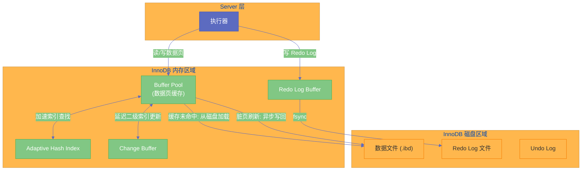
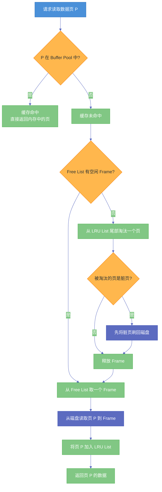

# 02 InnoDB Buffer Pool——内存与磁盘之间的桥梁

**摘要：** 数据库的性能瓶颈几乎总是在磁盘 I/O 上。[[InnoDB]] 的 Buffer Pool 就是为解决这个问题而生的——它在内存中维护了一块巨大的缓存区域，将最近访问的数据页和索引页缓存在内存中，使得绝大多数的读操作可以直接从内存完成，写操作也先修改内存中的页再异步刷回磁盘。本文从"为什么需要 Buffer Pool"出发，深入剖析其内存布局、改良 LRU 算法（Young/Old 分区设计的精妙之处）、Free List 与 Flush List 的协作机制、预读（Read-Ahead）策略、Checkpoint 与脏页刷新、以及多实例并发优化。每一个设计决策背后都有明确的工程权衡——理解了这些权衡，你才能真正理解 `innodb_buffer_pool_size` 这个"最重要的 MySQL 配置参数"的调优逻辑。

---

## 第 1 章 为什么需要 Buffer Pool

### 1.1 磁盘 I/O 是数据库的阿喀琉斯之踵

在上一篇文章中，我们追踪了一条 SQL 的完整生命周期，看到无论是 SELECT 还是 UPDATE，最终都要和磁盘上的数据打交道。磁盘的物理特性决定了它是整个计算机系统中最慢的环节：

| 存储介质 | 随机读取延迟 | 顺序读取带宽 | 相对速度 |
|----------|-------------|-------------|----------|
| CPU L1 Cache | ~1 ns | - | 基准 |
| CPU L3 Cache | ~10 ns | - | 10x |
| 内存（DDR4） | ~100 ns | ~50 GB/s | 100x |
| NVMe SSD | ~100 μs | ~3 GB/s | 100,000x |
| 机械硬盘（HDD） | ~10 ms | ~200 MB/s | 10,000,000x |

内存的随机访问延迟是 SSD 的 1000 倍以下，是 HDD 的 10 万倍以下。这意味着：**如果一次查询需要读取 100 个数据页，从内存读取大约需要 10 微秒，从 SSD 读取需要 10 毫秒，从 HDD 读取需要 1 秒。** 这个差距不是靠更快的 CPU 或更好的算法能弥补的——唯一的出路是减少磁盘 I/O 的次数。

### 1.2 缓存的核心思想：局部性原理

Buffer Pool 的理论基础是**局部性原理（Principle of Locality）**，这一原理在计算机科学中无处不在——CPU Cache、操作系统的 [[Page Cache]]、浏览器缓存，背后都是同一个逻辑。

**时间局部性（Temporal Locality）**：刚被访问过的数据，在短期内很可能再次被访问。例如，一个热门商品的详情页在被一个用户查看后，很快会被其他用户再次查看。

**空间局部性（Spatial Locality）**：当某条记录被访问时，它附近的记录也很可能被访问。InnoDB 以 16KB 为单位读取数据页（即使你只需要一行，也会把整个页读进来），这就是利用了空间局部性——同一页中的其他行大概率也会被后续查询用到。

> [!note] 设计哲学
> Buffer Pool 的本质是一个**基于局部性原理的页缓存**。它的设计目标不是缓存"所有数据"（那不可能，内存总比磁盘小），而是缓存"最可能被再次访问的数据"。如何判断"最可能被再次访问"？这就是 LRU 算法和它的各种改进需要回答的问题。

### 1.3 Buffer Pool 在 InnoDB 架构中的位置

回顾上一篇文章的 InnoDB 架构，Buffer Pool 处于**内存区域的核心位置**，几乎所有的数据读写操作都要经过它：

- **SELECT 查询**：执行器通过 Handler API 请求一行数据 → InnoDB 先检查目标数据页是否在 Buffer Pool 中 → 在就直接从内存读取（**缓存命中**），不在就从磁盘读入 Buffer Pool 再返回（**缓存未命中**）
- **UPDATE 写入**：InnoDB 先将目标数据页加载到 Buffer Pool（如果不在的话），然后**直接在内存中修改**数据页，被修改的页成为"脏页（Dirty Page）"，后台线程在合适的时机将脏页异步刷回磁盘
- **索引查找**：[[B+Tree]] 从根节点到叶子节点的查找路径上，每一层都是一次页的访问，这些页也是通过 Buffer Pool 来缓存的



从这张图可以看出，Buffer Pool 是 InnoDB 中**读写链路的必经之路**。它的大小和管理效率直接决定了数据库的整体性能。这也是为什么 `innodb_buffer_pool_size` 被称为 MySQL 中"最重要的配置参数"——它决定了 InnoDB 有多少内存可以用来缓存数据。

---

## 第 2 章 Buffer Pool 的内存布局

### 2.1 页（Page）：Buffer Pool 的基本管理单元

Buffer Pool 并不是一个无结构的大内存块。它被划分为一个个**大小固定的槽（Frame）**，每个槽正好可以容纳一个 InnoDB 数据页。InnoDB 的默认页大小是 16KB（由 `innodb_page_size` 参数控制，在 MySQL 实例初始化时确定，后续不可更改），所以每个 Frame 也是 16KB。

如果 `innodb_buffer_pool_size` 设置为 8GB，那么 Buffer Pool 中大约有 `8GB / 16KB = 524,288` 个 Frame，即可以同时缓存约 52 万个数据页。

每个被缓存的页都由一个**控制块（Control Block / Buffer Control Block）** 来描述，控制块存储了该页的元信息：

| 控制块字段 | 含义 |
|-----------|------|
| `space_id` | 页所属的表空间 ID |
| `page_no` | 页在表空间中的编号 |
| `buf_fix_count` | 该页当前被引用的次数（类似引用计数） |
| `io_fix` | 该页的 I/O 状态（正在读取/正在写入/空闲） |
| `is_old` | 该页是否在 LRU 链表的 Old 区域 |
| `access_time` | 该页最近一次被访问的时间 |
| `modification_lsn` | 该页最近一次被修改时的 [[LSN]]（Log Sequence Number） |
| `oldest_modification_lsn` | 该页首次被修改时的 LSN |

控制块本身也需要内存空间（每个约 800 字节），所以 Buffer Pool 的实际可用空间比 `innodb_buffer_pool_size` 的设置值略小。这也是为什么你在 `SHOW ENGINE INNODB STATUS` 中看到的 `Buffer pool size`（以页为单位）可能比简单的 `pool_size / 16KB` 略小。

### 2.2 三大链表：Free List、LRU List、Flush List

Buffer Pool 通过**三个链表**来管理页的生命周期，它们之间的协作构成了 Buffer Pool 的核心运作机制：

**Free List（空闲链表）**：存放所有**尚未被使用的空 Frame**。当 InnoDB 需要加载一个新的数据页时，从 Free List 中取一个空 Frame。MySQL 启动时，所有 Frame 都在 Free List 中；随着数据被访问，Frame 逐渐被使用，Free List 逐渐缩短。

**LRU List（最近最少使用链表）**：存放所有**正在被使用（已缓存数据页）的 Frame**，按最近访问时间排序。当 Free List 为空、需要新的 Frame 时，从 LRU List 的尾部淘汰最久未被访问的页，释放其 Frame。

**Flush List（脏页链表）**：存放所有**被修改过但尚未刷回磁盘的脏页**，按 `oldest_modification_lsn`（首次修改的 LSN）排序。后台的脏页刷新线程（Page Cleaner Thread）从 Flush List 中选择脏页刷回磁盘。

> [!info] 核心概念
> 一个页可以**同时存在于 LRU List 和 Flush List 中**——如果它被缓存了（在 LRU List 中）并且被修改了（也在 Flush List 中）。但一个页**不会同时在 Free List 和 LRU List 中**——一个 Frame 要么是空闲的，要么是被使用的。

它们的协作流程：



这个流程揭示了一个重要的性能隐患：**如果 Free List 为空，且 LRU List 尾部的页恰好是脏页，InnoDB 必须先将脏页刷回磁盘才能释放 Frame——这会导致查询线程阻塞在磁盘 I/O 上**。这就是为什么保持足够的空闲页和及时的脏页刷新非常重要。

---

## 第 3 章 改良 LRU 算法：Young/Old 分区设计

### 3.1 朴素 LRU 的致命问题

经典的 LRU（Least Recently Used）算法逻辑简单：每次访问一个页，就把它移到链表头部；需要淘汰时，从链表尾部取最久未访问的页。

但朴素 LRU 在数据库场景中有一个**致命缺陷**：全表扫描（或大范围索引扫描）会**一次性将大量新页加载到 Buffer Pool 中，将原本频繁访问的热数据页全部挤出缓存**。

设想这个场景：Buffer Pool 中缓存了大量热点数据（高频查询的用户表、商品表），缓存命中率 99%。这时一个 DBA 执行了一次全表备份查询 `SELECT * FROM huge_table`——这张大表有 100 万页，远超 Buffer Pool 的容量。如果用朴素 LRU：

1. 全表扫描的每一页进入 Buffer Pool 时都被放到 LRU 头部
2. 原本的热点数据被逐渐推到 LRU 尾部并被淘汰
3. 全表扫描结束后，Buffer Pool 中全是这张大表的数据——但这些数据大概率不会再被访问
4. 后续的正常查询全部缓存未命中，性能断崖式下降
5. 需要相当长的时间（"预热期"）才能让热点数据重新进入缓存

这就是所谓的**缓存污染（Cache Pollution）**——低频访问的数据把高频访问的数据挤出了缓存。

### 3.2 InnoDB 的解法：Midpoint Insertion Strategy

为了解决缓存污染问题，InnoDB 将 LRU List 分为两段：

- **Young 区域（New Sublist）**：占 LRU List 的前 5/8（约 63%），存放真正的热点数据
- **Old 区域（Old Sublist）**：占 LRU List 的后 3/8（约 37%），存放新加载的和不太热的数据

两段的交界点称为 **Midpoint（中点）**，由参数 `innodb_old_blocks_pct` 控制 Old 区域的占比（默认 37%）。

**关键规则：新加载的页不直接放入 Young 区域的头部，而是放入 Old 区域的头部（即 Midpoint 位置）。**

这个规则的效果是：全表扫描加载的大量新页全部进入 Old 区域，不会影响 Young 区域中的热点数据。由于全表扫描是顺序的，每个页通常只被访问一次，它们会在 Old 区域中逐渐向尾部移动，最终被淘汰——**热点数据始终安全地待在 Young 区域**。

### 3.3 从 Old 晋升到 Young 的条件

一个页从 Old 区域晋升到 Young 区域（即被移到 LRU 头部），需要满足以下条件：

**页必须在 Old 区域中停留超过 `innodb_old_blocks_time`（默认 1000 毫秒）后再次被访问。**

这个时间窗口的设计意图极其精妙。全表扫描在读取一个页的过程中，可能会多次访问这个页中的不同行——如果没有时间窗口，这些短时间内的多次访问就会导致页被晋升到 Young 区域，缓存污染仍然会发生。加上 1 秒的时间窗口后，全表扫描中对同一页的多次访问（通常在几毫秒内完成）不会触发晋升；只有那些在间隔较长时间后**再次被访问**的页（说明确实有持续的访问需求），才有资格晋升到 Young 区域。

来对比两种场景下的行为：

| 场景 | 页的命运 | 是否污染缓存 |
|------|----------|-------------|
| 全表扫描读取页 P，P 在 Old 区域，几毫秒后 P 被扫描下一行再次访问 | P 停留时间 < 1s，**不晋升**，留在 Old 区域，最终被淘汰 | 否 |
| 热点查询首次加载页 Q 到 Old 区域，2 秒后另一个查询再次访问 Q | Q 停留时间 > 1s，**晋升到 Young 区域头部** | 否（Q 是真热点） |
| 页 R 已在 Young 区域，被再次访问 | R 移到 Young 区域更靠前的位置（但有优化，见下文） | 否 |

### 3.4 Young 区域内部的优化：1/4 规则

即使在 Young 区域内部，也并不是每次访问都要把页移到链表头部。频繁地移动链表节点需要加锁（LRU List 是共享资源），高并发下锁竞争会成为瓶颈。

InnoDB 的优化策略是：**只有当一个页在 Young 区域中的位置超过了 Young 区域长度的 1/4 时，再次访问它才会将其移到头部。** 如果页已经在 Young 区域的前 1/4 位置，再次访问不做任何移动操作——因为它已经足够"安全"了，不需要额外的链表操作来保护它。

这个看似微小的优化，在高并发场景下能显著减少 LRU List 的互斥锁（mutex）争用，提升 Buffer Pool 的整体吞吐量。

> [!note] 设计哲学
> InnoDB 的 LRU 改良算法体现了一个重要的工程原则：**不追求理论上最优的缓存策略，而是追求在真实工作负载下的最佳平衡**。朴素 LRU 在理论上是最优的（假设访问模式符合时间局部性），但数据库有全表扫描这种"反局部性"的操作。Young/Old 分区和时间窗口不是理论上最优的缓存策略，但它们在数据库的真实工作负载下（混合了点查、范围查、全表扫描）能提供最稳定的性能表现。

---

## 第 4 章 预读机制（Read-Ahead）

### 4.1 为什么需要预读

即使有了 Buffer Pool，每次缓存未命中仍然需要一次磁盘 I/O。如果 InnoDB 能**预测到某些页即将被访问，提前将它们加载到 Buffer Pool 中**，就能将缓存未命中转化为缓存命中——用户查询时页已经在内存中了。

这就是预读（Read-Ahead）机制的目的：**牺牲一点磁盘带宽和 Buffer Pool 空间，换取更低的查询延迟**。

### 4.2 线性预读（Linear Read-Ahead）

**线性预读**针对的是**顺序扫描**场景。InnoDB 监控每个区（Extent，连续的 64 个页，共 1MB）中被顺序访问的页数量。当一个区中被顺序访问的页数超过阈值（由 `innodb_read_ahead_threshold` 参数控制，默认 56）时，InnoDB 会将下一个区的所有 64 个页**异步**加载到 Buffer Pool 中。

为什么阈值默认是 56（而不是 64）？因为一个区有 64 个页，当 56 个页已经被顺序访问时，说明扫描即将到达这个区的末尾，下一个区很可能马上会被访问。提前启动预读请求，让磁盘 I/O 与 CPU 计算**并行执行**（pipeline），可以有效隐藏 I/O 延迟。

```sql
-- 查看线性预读的统计信息
SHOW STATUS LIKE 'Innodb_buffer_pool_read_ahead';        -- 预读的页数
SHOW STATUS LIKE 'Innodb_buffer_pool_read_ahead_evicted'; -- 预读后从未被访问就被淘汰的页数
```

`Innodb_buffer_pool_read_ahead_evicted` 这个计数器很关键：如果它的值很高，说明预读加载了大量最终没有被使用的页——预读太激进了，反而浪费了 Buffer Pool 的空间和磁盘带宽。可以适当调高 `innodb_read_ahead_threshold` 来减少无效预读。

### 4.3 随机预读（Random Read-Ahead）

**随机预读**针对的是**非顺序但集中在同一区域**的访问模式。当一个区中有 13 个（固定值）以上的页已经在 Buffer Pool 中被缓存时，InnoDB 会将该区中剩余的页也加载到 Buffer Pool。

随机预读在 MySQL 5.5 中被默认关闭（`innodb_random_read_ahead = OFF`），因为它的命中率比线性预读低得多——随机访问的预测准确性本身就比顺序访问低。在绝大多数生产场景中，保持关闭是合理的。

> [!warning] 生产避坑
> 预读是一个"投机"操作——预读对了能提升性能，预读错了反而浪费资源。对于以点查为主的 OLTP 系统，线性预读的价值有限（因为点查不产生顺序扫描）。对于有大量范围扫描的报表查询，线性预读能显著减少延迟。需要根据实际工作负载来调整预读参数，而不是一概而论。

---

## 第 5 章 脏页刷新与 Checkpoint 机制

### 5.1 为什么不立刻将脏页刷回磁盘

在上一篇文章中，我们知道 UPDATE 操作修改的是 Buffer Pool 中的数据页（变成脏页），而不是直接修改磁盘上的数据文件。为什么不立刻刷回磁盘？

1. **随机 I/O 代价太高**：不同的修改可能涉及不同位置的数据页，立即刷盘意味着大量随机写。[[Redo Log]] 的 [[WAL]] 协议已经保证了持久性（即使 MySQL 崩溃也能通过 Redo Log 恢复），所以数据页的刷盘可以延迟。
2. **合并写入**：同一个脏页可能在短时间内被多次修改（比如同一页中的多行被不同事务依次更新）。如果每次修改都刷盘，就要写入多次；延迟刷盘可以**将多次修改合并为一次写入**，减少 I/O 次数。
3. **批量写入**：InnoDB 可以将多个脏页收集起来，通过一次大的顺序 I/O 操作批量写入磁盘，比逐个页随机写入高效得多。

但脏页也不能无限期地留在内存中，原因有两个：

- **Redo Log 空间有限**：Redo Log 是环形缓冲区，大小固定（由 `innodb_log_file_size` × `innodb_log_files_in_group` 决定）。当 Redo Log 写满一圈时，最旧的日志需要被覆盖——但只有对应的脏页已经刷回磁盘后，这部分日志才能被安全覆盖。如果脏页刷新太慢，Redo Log 会"追尾"，此时 InnoDB 必须**暂停所有写入操作**，强制进行脏页刷新，导致严重的性能抖动。
- **Buffer Pool 空间有限**：如果脏页占满了 Buffer Pool，新的页无法加载，查询性能也会下降。

### 5.2 Checkpoint：脏页刷新的协调机制

**Checkpoint** 是 InnoDB 用来协调脏页刷新的机制。它的核心语义是：**Checkpoint 之前的所有 Redo Log 对应的脏页都已经刷回磁盘，这些 Redo Log 可以被安全覆盖。**

Checkpoint 的位置用 LSN（Log Sequence Number）来标记。LSN 是一个全局递增的字节计数器，每写入一条 Redo Log 记录，LSN 就增加该记录的字节数。关键的几个 LSN：

| LSN 名称 | 含义 |
|----------|------|
| `Log sequence number` | 当前已写入 Redo Log Buffer 的 LSN |
| `Log flushed up to` | 已经 fsync 到 Redo Log 磁盘文件的 LSN |
| `Pages flushed up to` | 已经将脏页刷回磁盘的 LSN（即 Checkpoint LSN） |
| `Last checkpoint at` | 最近一次 Checkpoint 的 LSN |

这几个 LSN 的大小关系是：`Log sequence number` ≥ `Log flushed up to` ≥ `Pages flushed up to` ≥ `Last checkpoint at`。

**Checkpoint LSN 与 Redo Log 写入 LSN 之间的差值**，反映了"还有多少脏页没有刷回磁盘"，也决定了崩溃恢复时需要重放多少 Redo Log。这个差值越小，崩溃恢复越快；但追求过小意味着需要更频繁地刷脏页，会消耗更多的 I/O 资源。

```sql
-- 查看当前的 LSN 信息
SHOW ENGINE INNODB STATUS\G
-- 在 LOG 部分可以看到上述四个 LSN 值
```

### 5.3 InnoDB 的四种刷脏场景

InnoDB 在以下四种情况下会触发脏页刷新：

**场景一：Redo Log 即将写满**

当 Redo Log 的可用空间不足时（Checkpoint LSN 与当前 LSN 的差值接近 Redo Log 总大小），InnoDB 必须紧急刷新脏页以推进 Checkpoint，腾出 Redo Log 空间。这是最危险的场景——此时 InnoDB 会暂停所有数据写入（所有写事务阻塞），直到有足够的 Redo Log 空间可用。

这种情况在日志中表现为 `ib_log` 相关的等待事件或 `Innodb_log_waits` 状态变量增加。解决方案是增大 Redo Log 文件的大小（MySQL 8.0.30+ 支持 `innodb_redo_log_capacity` 参数动态调整）。

**场景二：Buffer Pool 空闲页不足**

当 Free List 中的空闲页数量低于一定阈值时，InnoDB 的 LRU 淘汰线程会从 LRU 尾部淘汰页。如果被淘汰的页是脏页，必须先刷回磁盘才能释放。这种"被动刷脏"发生在查询的关键路径上，会导致查询延迟抖动。

**场景三：后台定期刷新**

InnoDB 的 **Page Cleaner Thread**（MySQL 5.7+ 支持多个 cleaner 线程，由 `innodb_page_cleaners` 参数控制）在后台持续运行，按照一定的速率将 Flush List 中的脏页刷回磁盘。这是最理想的刷脏方式——在后台异步完成，不影响前台查询。

刷脏速率由 `innodb_io_capacity` 和 `innodb_io_capacity_max` 参数控制，它们告诉 InnoDB 底层磁盘的 I/O 能力：

| 参数 | 默认值 | 推荐设置 |
|------|--------|----------|
| `innodb_io_capacity` | 200 | SSD: 2000-5000; HDD: 200-400 |
| `innodb_io_capacity_max` | 2000 | SSD: 5000-10000; HDD: 400-800 |

如果这两个参数设置过低（比如在 SSD 上使用默认值 200），InnoDB 的脏页刷新速度会跟不上脏页产生的速度，最终导致前两种"被迫刷脏"的场景发生。**在 SSD 存储上，将 `innodb_io_capacity` 设为 2000 以上通常是必要的调整。**

**场景四：MySQL 正常关闭**

MySQL 正常关闭时（`SHUTDOWN`），InnoDB 会将所有脏页刷回磁盘（称为"clean shutdown"），使得下次启动时不需要进行崩溃恢复。由 `innodb_fast_shutdown` 参数控制行为：

| 值 | 行为 |
|----|------|
| 0 | 完全刷新：刷所有脏页 + purge 所有 Undo Log（最慢，但下次启动最快） |
| 1（默认） | 刷所有脏页，但不等待 purge 完成 |
| 2 | 不刷脏页，将 Redo Log 写入磁盘（最快关闭，但下次启动需要崩溃恢复） |

> [!warning] 生产避坑
> 永远不要在生产环境的正常关闭流程中使用 `innodb_fast_shutdown = 2`——这相当于"模拟崩溃"，下次启动的恢复时间可能很长。这个值通常只在紧急停机场景下使用。

### 5.4 自适应刷脏（Adaptive Flushing）

MySQL 5.6+ 引入了**自适应刷脏（Adaptive Flushing）** 机制（`innodb_adaptive_flushing = ON`，默认开启），它根据 Redo Log 的产生速率动态调整脏页刷新速率。

核心思想是：如果 Redo Log 的写入速度很快（说明有大量写操作），就加快脏页刷新速率，避免 Redo Log 追尾；如果写入速度慢，就降低刷新速率，减少 I/O 消耗。

自适应刷脏算法考虑了以下因素：
- 当前 Redo Log 的"脏比例"（Checkpoint LSN 到当前 LSN 的距离占 Redo Log 总大小的比例）
- 脏页在 Buffer Pool 中的占比
- Redo Log 的产生速率

这种自适应机制使得 InnoDB 在不同的负载模式下都能保持相对稳定的性能表现，而不是在负载突增时突然"刷不过来"导致性能断崖。

---

## 第 6 章 Buffer Pool 多实例

### 6.1 单实例的并发瓶颈

在高并发场景下，多个线程同时操作 Buffer Pool（读取页、淘汰页、修改 LRU 链表等）需要加互斥锁来保证数据一致性。如果整个 Buffer Pool 只有一个实例，所有线程都争抢同一把锁——这在数十甚至数百个并发连接的场景下会成为严重的瓶颈。

### 6.2 多实例方案

MySQL 5.5+ 支持将 Buffer Pool 拆分为**多个独立的实例**，每个实例有自己独立的 Free List、LRU List、Flush List 和互斥锁。通过 `innodb_buffer_pool_instances` 参数控制实例数量。

当一个数据页需要被加载到 Buffer Pool 时，InnoDB 通过 `hash(space_id, page_no) % instances` 来决定它属于哪个实例。这样，不同的页被分散到不同的实例中，对不同实例的访问可以**并行执行**，互不干扰。

| 参数 | 推荐设置 |
|------|----------|
| `innodb_buffer_pool_size` < 1GB | `innodb_buffer_pool_instances = 1`（太小没必要拆分） |
| `innodb_buffer_pool_size` 1GB - 8GB | `innodb_buffer_pool_instances` = CPU 核心数的一半 |
| `innodb_buffer_pool_size` > 8GB | `innodb_buffer_pool_instances` = 8-16（MySQL 默认值在 `pool_size` ≥ 1GB 时为 8） |

每个实例的大小 = `innodb_buffer_pool_size / innodb_buffer_pool_instances`。每个实例不应小于 1GB（太小会导致每个实例的 LRU 链表太短，淘汰过于频繁）。

> [!info] 核心概念
> 多实例的本质是**用空间划分来减少锁竞争**——这与数据库分库分表、Java ConcurrentHashMap 分段锁的思路完全一致。它不增加总的缓存容量，但提高了并发访问的吞吐量。

---

## 第 7 章 Buffer Pool 的预热与持久化

### 7.1 冷启动问题

MySQL 重启后，Buffer Pool 是空的——所有数据页需要重新从磁盘加载。在重启后的一段时间内（可能数分钟到数十分钟），缓存命中率极低，查询性能远低于正常水平。这个阶段被称为**预热期（Warm-up Period）**。

对于高流量的生产系统，预热期内的性能下降可能导致请求堆积、超时甚至服务不可用。

### 7.2 Buffer Pool Dump & Load

MySQL 5.6+ 提供了 **Buffer Pool 状态持久化**功能来解决冷启动问题：

- **Dump**：在 MySQL 关闭前（或定期），将 Buffer Pool 中所有缓存页的**元信息**（`space_id` + `page_no`）写入磁盘文件（默认 `ib_buffer_pool`）。注意：只保存页的标识符，不保存页的数据内容——文件通常只有几十 MB。
- **Load**：MySQL 启动时，读取这个文件，然后**在后台异步地将这些页从磁盘重新加载到 Buffer Pool**。

相关参数：

| 参数 | 默认值 | 含义 |
|------|--------|------|
| `innodb_buffer_pool_dump_at_shutdown` | ON | 关闭时自动 Dump |
| `innodb_buffer_pool_load_at_startup` | ON | 启动时自动 Load |
| `innodb_buffer_pool_dump_pct` | 25 | Dump 最近访问的页的比例（25% = 只保存最热的 1/4 页） |

Load 过程是在后台异步执行的，不会阻塞 MySQL 的正常服务。但在 Load 完成之前，缓存命中率仍然不会达到最优。可以通过 `SHOW STATUS LIKE 'Innodb_buffer_pool_load_status'` 监控加载进度。

> [!warning] 生产避坑
> `innodb_buffer_pool_dump_pct` 默认只 Dump 25% 的页。对于大型 Buffer Pool（如 128GB），25% 也有 32GB 的页标识需要在启动时加载，Load 过程可能耗时数分钟。需要根据实际业务的"预热容忍度"来调整这个参数——对延迟敏感的系统可以设为 75% 甚至 100%（但 Load 时间更长），对延迟不太敏感的系统可以保持默认值。

---

## 第 8 章 innodb_buffer_pool_size 的调优

### 8.1 设置原则

`innodb_buffer_pool_size` 是 MySQL 中最重要的性能参数，没有之一。核心原则是：**尽可能大，但不能大到导致操作系统和其他进程内存不足。**

| 场景 | 推荐设置 |
|------|----------|
| 专用数据库服务器 | 物理内存的 **70%-80%** |
| 与应用共享服务器 | 物理内存的 **50%-60%** |
| 开发/测试环境 | 512MB - 2GB |

为什么不设成 90% 甚至 95%？因为操作系统本身需要内存（内核、文件系统缓存、网络缓冲区），MySQL 的其他组件也需要内存（连接线程栈、Redo Log Buffer、Join Buffer、Sort Buffer、临时表等）。如果 Buffer Pool 设得太大，导致操作系统开始使用 [[Swap]]，性能反而会急剧下降——磁盘上的 Swap 比 Buffer Pool 缓存未命中从数据文件读取还要慢。

### 8.2 如何判断当前 Buffer Pool 是否够用

```sql
-- 查看 Buffer Pool 的命中率
SHOW STATUS LIKE 'Innodb_buffer_pool_read_requests';  -- 逻辑读（从 Buffer Pool 读）
SHOW STATUS LIKE 'Innodb_buffer_pool_reads';           -- 物理读（从磁盘读）

-- 命中率 = 1 - (物理读 / 逻辑读)
-- 理想值：> 99%
```

如果命中率持续低于 99%，说明 Buffer Pool 不够大，频繁发生缓存未命中。如果物理内存还有余量，应该增大 `innodb_buffer_pool_size`。

MySQL 5.7+ 支持**在线调整** Buffer Pool 大小（`SET GLOBAL innodb_buffer_pool_size = ...`），调整过程是增量式的，不需要重启 MySQL。但调整过程中会有短暂的内部重组（需要重新分配和初始化新的 Frame），建议在低峰期操作。

### 8.3 Buffer Pool 相关的监控指标

| 指标 | 获取方式 | 关注点 |
|------|----------|--------|
| 命中率 | `1 - reads / read_requests` | < 99% 需要扩容 |
| 脏页比例 | `Innodb_buffer_pool_pages_dirty / Innodb_buffer_pool_pages_total` | > 75% 可能刷脏不够快 |
| Free 页数量 | `Innodb_buffer_pool_pages_free` | 持续为 0 说明空间不足 |
| 预读效率 | `read_ahead_evicted / read_ahead` | > 50% 说明预读太激进 |
| 等待 Free 页 | `Innodb_buffer_pool_wait_free` | > 0 说明有查询等待淘汰脏页 |

`Innodb_buffer_pool_wait_free` 是最敏感的告警指标。它的值大于 0 意味着有查询线程因为 Buffer Pool 没有空闲页而阻塞——此时查询线程必须等待后台线程淘汰脏页并刷盘，这直接体现为查询延迟的抖动。

---

## 第 9 章 小结

本文围绕 Buffer Pool 这一 InnoDB 的核心组件，构建了完整的认知框架：

1. **为什么需要 Buffer Pool**：磁盘 I/O 是数据库性能瓶颈，Buffer Pool 基于局部性原理将热点数据缓存在内存中
2. **内存布局**：页（16KB Frame）是管理单元，控制块记录元信息，Free List / LRU List / Flush List 三条链表协作管理页的生命周期
3. **改良 LRU 算法**：Young/Old 分区 + Midpoint Insertion 解决全表扫描导致的缓存污染问题；`innodb_old_blocks_time` 时间窗口确保只有真正的热点数据才能晋升 Young 区域
4. **预读机制**：线性预读针对顺序扫描提前加载后续页，减少查询延迟；但预读是"投机"操作，需要监控命中率
5. **脏页刷新与 Checkpoint**：WAL 协议允许延迟刷脏，Checkpoint 机制协调 Redo Log 空间回收，自适应刷脏根据负载动态调节速率；`innodb_io_capacity` 必须匹配底层磁盘能力
6. **多实例**：通过空间划分减少互斥锁争用，提高高并发场景的吞吐量
7. **预热与持久化**：Buffer Pool Dump & Load 解决冷启动问题
8. **调优**：`innodb_buffer_pool_size` 设为物理内存的 70%-80%，通过命中率和 `wait_free` 等指标持续监控

Buffer Pool 是 InnoDB 所有读写操作的"必经之路"——理解了它的运作机制，就理解了 InnoDB 性能表现的底层逻辑。下一篇文章我们将深入 [[Redo Log]] 和 [[WAL]] 协议，解析 InnoDB 如何在 Buffer Pool 中修改数据的同时保证崩溃安全性。

---

> [!note] 思考题
> 1. InnoDB 的 Buffer Pool 缓存了数据页和索引页——命中率是数据库性能的关键指标。`SHOW ENGINE INNODB STATUS` 中的 `Buffer pool hit rate` 低于 99% 通常意味着 Buffer Pool 过小。在一个 128GB 内存的数据库服务器上，Buffer Pool 应该设为多大（通常建议 70-80%）？如果数据集远大于 Buffer Pool（如 1TB 数据，128GB Buffer Pool），你如何优化查询以提高命中率？
> 2. Redo Log 保证了事务的持久性（Durability）——事务提交时 Redo Log 必须刷写到磁盘。`innodb_flush_log_at_trx_commit` 的三个值（0/1/2）对持久性和性能有什么不同影响？设为 0（每秒刷盘）在崩溃时可能丢失 1 秒的数据——在什么业务场景下这个风险是可接受的？
> 3. Undo Log 保存了数据修改前的版本——用于事务回滚和 MVCC 的一致性读。长事务会导致 Undo Log 无法回收——因为其他事务可能还需要读取旧版本。在什么场景下长事务最容易出现（如忘记提交的事务、大批量更新）？Undo Log 积压对磁盘空间和查询性能有什么影响？
