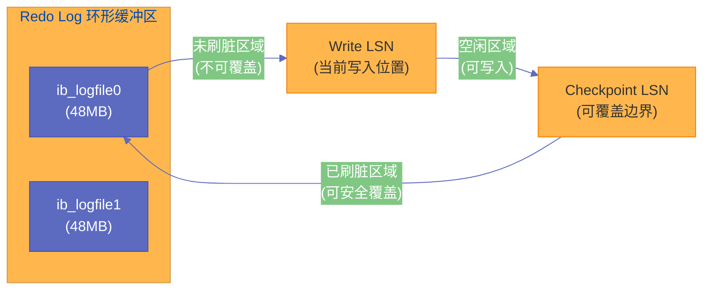
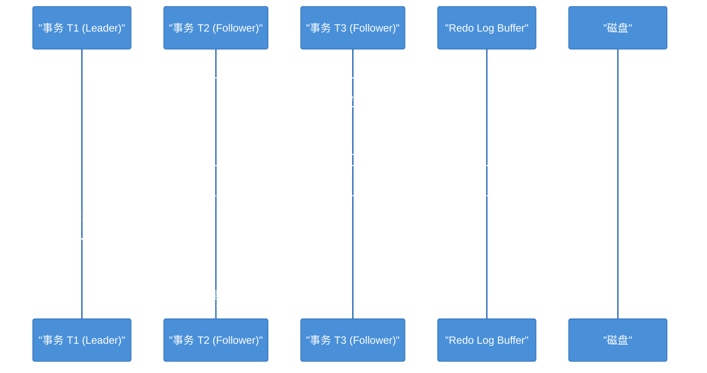
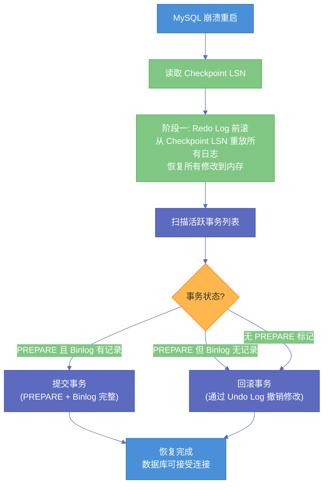

# 03 InnoDB 日志系统——WAL 协议与崩溃恢复的工程实现

**摘要：** 数据库最不可妥协的承诺是：**一旦事务提交成功，数据就不会丢失——即使下一秒服务器断电**。这个承诺在工程上是如何兑现的？答案是 WAL（Write-Ahead Logging）协议和围绕它构建的日志系统。本文从"为什么先写日志再写数据"的数学直觉出发，深入剖析 [[Redo Log]] 的物理结构（环形缓冲区、LSN 全局递增语义）、写入流程（Redo Log Buffer → OS Cache → 磁盘的三级流水线）、`innodb_flush_log_at_trx_commit` 三种模式的持久性-性能权衡，以及 Redo Log 与 [[Binlog]] 之间通过两阶段提交（2PC）保证一致性的协调机制。最后完整还原崩溃恢复的过程：MySQL 重启后，InnoDB 如何通过 Redo Log 前滚和 Undo Log 回滚，将数据库恢复到崩溃前的一致状态。

---

## 第 1 章 WAL 协议：先写日志再写数据的工程直觉

### 1.1 一个思想实验

假设你是一个数据库的设计者，需要保证"已提交事务的修改不会丢失"。最直觉的做法是：**事务提交时，将所有修改过的数据页立刻写回磁盘**。

但这个做法有严重的性能问题。假设一个事务修改了 50 个不同的数据页——这些页分散在磁盘的不同位置，需要 50 次**随机写**。在机械硬盘上，每次随机写的寻道时间约 10ms，50 次就是 500ms。即使在 SSD 上，50 次随机 4KB 写入的延迟也在几毫秒级别。对于一个每秒处理上千事务的 OLTP 系统来说，这种延迟完全不可接受。

更深层的问题是：InnoDB 的数据页是 16KB，但很多修改可能只改了页中的几个字节（比如更新一个 INT 字段只改了 4 个字节）。为了持久化 4 字节的修改而写入 16KB 的数据页，**写放大（Write Amplification）** 严重到了荒谬的程度。

### 1.2 WAL 的核心洞察

WAL 协议的核心洞察是：**持久化的目的不是"把数据写到正确的位置"，而是"记录下足够的信息，使得任何时候都能恢复出正确的数据"**。

换句话说，只要我把"做了什么修改"这个信息持久化到磁盘上，即使数据页本身还没有写回磁盘，我也不怕崩溃——因为崩溃后可以根据日志"重做"这些修改。

这就是 WAL（Write-Ahead Logging，预写日志）的含义：

1. **事务的每一次修改，先写入日志（Redo Log）**
2. **事务提交时，确保 Redo Log 已经持久化到磁盘**
3. **数据页的写入可以延迟到后台异步完成**

Redo Log 的写入有两个关键优势：

**第一，顺序写入**。Redo Log 是**追加写入（Append-Only）** 的——每次只在日志文件的末尾追加一条记录，不需要随机定位。顺序写入在机械硬盘上的吞吐量是随机写入的 100 倍以上，在 SSD 上也有数倍的优势。

**第二，写入量小**。Redo Log 记录的是"对数据页做了什么修改"的**物理变化**（如"在第 N 号页、偏移量 M 处，将 4 字节从 X 改为 Y"），而不是整个 16KB 的数据页。一条 Redo Log 记录通常只有几十到几百字节。相比写入完整的数据页，写入量减少了 1-2 个数量级。

> [!note] 设计哲学
> WAL 协议的本质是一种**时间换空间**的策略——更准确地说，是**将随机 I/O 替换为顺序 I/O**。数据页最终还是要写回磁盘的（由后台的刷脏线程完成），但关键路径上（事务提交时）只需要做一次小量的顺序写。这个替换将事务提交的延迟从"N 次随机写"降低到"1 次顺序写"，是数据库性能的基石。

### 1.3 WAL 的数学保证

WAL 协议保证的核心不等式是：

$$
\text{Redo Log 持久化的 LSN} \geq \text{已提交事务的最大 LSN}
$$

只要这个不等式成立，即使所有的脏页都还没写回磁盘，数据库崩溃后也能通过 Redo Log 完整恢复所有已提交事务的修改。这就是"已提交就不丢"的数学基础。

---

## 第 2 章 Redo Log 的物理结构

### 2.1 LSN：全局递增的字节计数器

**LSN（Log Sequence Number，日志序列号）** 是 InnoDB 日志系统中最核心的概念。它是一个**全局单调递增的 64 位无符号整数**，代表 Redo Log 从创建以来写入的总字节数。

每当 InnoDB 写入一条 Redo Log 记录，LSN 就增加该记录的字节数。例如，如果当前 LSN 是 1000，写入了一条 50 字节的 Redo Log 记录，LSN 就变成 1050。

LSN 的作用远不止"记录写了多少字节"。它是 InnoDB 中**时间顺序的全局标尺**：

- **每个数据页**都记录了最后一次被修改时的 LSN（存储在页头的 `FIL_PAGE_LSN` 字段）
- **Checkpoint** 用 LSN 标记"这个 LSN 之前的所有脏页都已刷回磁盘"
- **崩溃恢复**时，通过比较页的 LSN 和 Redo Log 中的 LSN 来判断哪些修改需要重做

可以把 LSN 想象为 InnoDB 的"全局时钟"——但它不是基于时间的，而是基于日志写入量的。这个设计的好处是：它天然具有唯一性和全序性（因为日志写入是串行化的），不需要额外的同步机制。

### 2.2 Redo Log 文件的环形缓冲区结构

Redo Log 在磁盘上以**固定大小的文件组**的形式存在。在 MySQL 8.0.30 之前，由两个参数控制：

- `innodb_log_file_size`：每个 Redo Log 文件的大小（默认 48MB）
- `innodb_log_files_in_group`：Redo Log 文件的数量（默认 2）

总的 Redo Log 空间 = `innodb_log_file_size × innodb_log_files_in_group`（默认 96MB）。

MySQL 8.0.30+ 将这两个参数合并为一个 `innodb_redo_log_capacity`（默认 100MB），更加直观。

这些文件在逻辑上构成一个**环形缓冲区（Circular Buffer）**：日志从文件组的头部开始写入，写到末尾后回到头部继续写，形成一个"环"。



环形缓冲区有两个关键指针：

**Write Position（写入位置）**：当前 Redo Log 的写入点，新的日志记录追加在这里。

**Checkpoint Position（检查点位置）**：Checkpoint LSN 对应的位置。这个位置之前的日志对应的脏页都已经刷回了磁盘，所以这部分日志可以被安全覆盖。

两个指针之间的区域就是"活跃日志"——这些日志对应的脏页还没有全部刷回磁盘，如果发生崩溃，需要用这些日志来恢复。

**当 Write Position 追上 Checkpoint Position 时**（环形缓冲区"写满"了），InnoDB 必须停下来等待 Checkpoint 推进——即等待后台线程将更多的脏页刷回磁盘，释放 Redo Log 空间。这是一个严重的性能事件，在日志中表现为 `ib_log` 相关的等待。

> [!warning] 生产避坑
> Redo Log 的默认大小（96-100MB）对于写入密集的系统来说远远不够。如果你的系统有大量的写入操作，建议将 `innodb_redo_log_capacity` 设为 **1GB - 4GB**。更大的 Redo Log 可以容纳更多的"活跃日志"，减少 Checkpoint 压力和 Write Position 追尾的风险。代价是崩溃恢复时间可能更长（因为有更多的日志需要重放），但在现代硬件上这个代价通常可以接受。

### 2.3 Redo Log 记录的格式

每条 Redo Log 记录描述的是**对某个数据页的一次物理修改**。记录的基本结构包括：

| 字段 | 含义 |
|------|------|
| `type` | 日志类型（如 MLOG_REC_INSERT、MLOG_COMP_REC_UPDATE_IN_PLACE 等） |
| `space_id` | 被修改的页所属的表空间 ID |
| `page_no` | 被修改的页的编号 |
| `body` | 修改的具体内容（因 type 不同而结构不同） |

InnoDB 定义了几十种不同的 Redo Log 类型，覆盖了所有可能的页修改操作。以最简单的"单行更新"为例，Redo Log 记录大致包含：在哪个页、哪个偏移量、修改了几个字节、修改前后的值是什么。

Redo Log 的一个重要特性是**幂等性（Idempotency）**：同一条 Redo Log 记录被重放一次和重放多次的效果是一样的。这保证了崩溃恢复过程中即使某条日志被重复重放，也不会导致数据错误。InnoDB 通过比较页的 `FIL_PAGE_LSN` 和 Redo Log 记录的 LSN 来实现幂等：如果页的 LSN 已经 ≥ 日志记录的 LSN，说明这条修改已经被应用过了（或页是更新的版本），跳过即可。

---

## 第 3 章 Redo Log 的写入流程

### 3.1 三级写入流水线

Redo Log 从生成到最终持久化，经历三个阶段：


**第一级：Redo Log Buffer（InnoDB 用户空间内存）**

这是 InnoDB 在内存中分配的一块缓冲区，大小由 `innodb_log_buffer_size` 参数控制（默认 16MB）。事务执行过程中，产生的 Redo Log 记录首先写入这个缓冲区。

Redo Log Buffer 存在的意义是**批量化写入**：事务执行过程中可能产生多条 Redo Log 记录（一个 UPDATE 可能涉及修改数据页、修改索引页、修改 Undo 页等多个操作），如果每条记录都立即调用 `write()` 系统调用，系统调用的开销会很大。将多条记录先攒在用户空间的缓冲区中，一次性 `write()` 写入内核，可以减少系统调用次数。

`innodb_log_buffer_size` 在大多数场景下不需要调整。只有当事务中有非常大量的写入（如批量 INSERT 几十万行），才可能需要增大。判断方法：如果 `SHOW STATUS` 中的 `Innodb_log_waits`（因为日志缓冲区满而等待的次数）大于 0，说明缓冲区可能太小。

**第二级：OS Page Cache（操作系统内核缓存）**

调用 `write()` 系统调用将数据从用户空间写入内核的文件系统缓存（[[Page Cache]]）。到这一步，数据已经离开了 MySQL 进程的控制——即使 MySQL 进程崩溃，数据仍然在内核缓存中，操作系统最终会将其写入磁盘。但如果**操作系统本身崩溃或服务器断电**，Page Cache 中的数据会丢失。

**第三级：磁盘持久化（fsync）**

调用 `fsync()` 系统调用，强制操作系统将 Page Cache 中对应文件的数据刷入磁盘的持久存储介质。只有 `fsync()` 返回成功后，数据才真正"安全落盘"。

`fsync()` 是一个**昂贵的操作**——它不仅要等待数据写入磁盘（SSD 延迟约 100μs，HDD 约 10ms），还要等待磁盘的控制器确认写入完成。在使用带有易失性写缓存（volatile write cache）的磁盘时，即使 `fsync()` 返回，数据可能仍在磁盘控制器的缓存中而非闪存/磁介质上——所以生产环境的磁盘必须开启 **Write-Back Cache with Battery Backup（BBWC/BBU）** 或关闭写缓存。

### 3.2 innodb_flush_log_at_trx_commit：三种持久性策略

这个参数控制了事务提交时 Redo Log 的写入行为，是 InnoDB 中**持久性与性能的权衡开关**：

| 值 | 事务提交时的行为 | 数据安全性 | 性能 |
|----|-----------------|-----------|------|
| **1**（默认） | write() + fsync() | MySQL 崩溃不丢数据，OS 崩溃/断电不丢数据 | 最慢（每次提交都 fsync） |
| **2** | write()，不 fsync() | MySQL 崩溃不丢数据，OS 崩溃/断电**可能丢最近 ~1s 数据** | 较快 |
| **0** | 什么都不做，留在 Redo Log Buffer | MySQL 崩溃**可能丢最近 ~1s 数据** | 最快 |

当设置为 0 或 2 时，InnoDB 有一个后台线程**每秒**自动执行一次 write() + fsync()。所以最多丢失最近 1 秒内提交的事务。

这三种模式的选择逻辑：

**模式 1（默认，"双保险"）**：这是唯一能保证"任何崩溃场景都不丢数据"的模式。适用于金融交易、订单支付等不能容忍任何数据丢失的场景。代价是每次事务提交都要等待 fsync() 完成——在 HDD 上这可能是 10ms 级别的延迟，在 NVMe SSD 上大约 100μs。

**模式 2（"MySQL 进程安全"）**：如果你的服务器配置了 UPS（不间断电源）和 ECC 内存，OS 崩溃/断电的概率极低，那么模式 2 是一个合理的折衷。数据到达了 OS Page Cache，MySQL 进程崩溃不会丢数据。适用于对性能敏感且硬件条件较好的非金融场景。

**模式 0（"极致性能"）**：适用于可以容忍少量数据丢失的场景，如日志系统、监控数据、会话缓存等。

> [!info] 核心概念
> `innodb_flush_log_at_trx_commit` 与 `sync_binlog` 共同决定了 MySQL 的数据安全级别。生产环境的"黄金配置"是：`innodb_flush_log_at_trx_commit = 1` + `sync_binlog = 1`，简称**"双 1 配置"**。这保证了 Redo Log 和 [[Binlog]] 在每次事务提交时都 fsync 到磁盘，是主从复制和崩溃恢复的正确性基础。

### 3.3 组提交（Group Commit）优化

如果每次事务提交都单独做一次 fsync()，在高并发场景下，大量的 fsync() 调用会成为严重的瓶颈——fsync() 是一个串行化的操作，磁盘一次只能完成一个 fsync()。

InnoDB 通过**组提交（Group Commit）** 优化来缓解这个问题：**多个并发提交的事务，共享同一次 fsync() 调用**。

工作方式如下：

1. 多个事务各自将 Redo Log 写入 Redo Log Buffer
2. 第一个到达提交阶段的事务成为"领导者（Leader）"，其他稍后到达的事务成为"追随者（Follower）"
3. 领导者将所有已写入 Redo Log Buffer 的内容一次性 write() 到 OS Cache，然后执行一次 fsync()
4. fsync() 完成后，领导者和所有追随者都可以确认提交成功

这样，如果有 100 个事务同时提交，可能只需要 1-2 次 fsync() 就能完成——磁盘 I/O 的次数从 100 次降低到 1-2 次。组提交的效果在高并发场景下非常显著，是 InnoDB 在 `innodb_flush_log_at_trx_commit = 1` 模式下仍能保持高吞吐量的关键技术。



MySQL 5.7+ 进一步引入了 **Binlog 组提交**，将 Redo Log 和 Binlog 的提交过程拆分为三个阶段（Flush → Sync → Commit），每个阶段都支持组提交，进一步提高了并发效率。

---

## 第 4 章 Redo Log 与 Binlog 的关系

### 4.1 两种日志的定位差异

InnoDB 中存在两种日志系统，它们由不同的层级管理，服务于不同的目的：

| 特性 | Redo Log | Binlog |
|------|----------|--------|
| **所属层级** | InnoDB 存储引擎层 | MySQL Server 层 |
| **日志类型** | 物理日志（"在哪个页的哪个偏移改了什么"） | 逻辑日志（"执行了什么 SQL"或"修改了哪些行"） |
| **写入时机** | 事务执行过程中持续写入 | 事务提交时一次性写入 |
| **文件结构** | 环形缓冲区，固定大小，循环覆写 | 追加写入，文件不断增长，定期轮转 |
| **主要用途** | **崩溃恢复**：保证已提交事务的持久性 | **主从复制** + **数据备份恢复（PITR）** |
| **存储引擎依赖** | 仅 InnoDB | 所有存储引擎（Server 层统一管理） |

一个常见的疑问是：**既然 Redo Log 能保证崩溃恢复，为什么还需要 Binlog？** 原因有两个：

1. **Redo Log 是 InnoDB 独有的**。如果 Server 层的功能（如主从复制）依赖于 InnoDB 的内部日志，就会与存储引擎紧耦合，违背了 MySQL 插件式存储引擎的架构设计。Binlog 在 Server 层实现，与存储引擎无关，可以服务于所有存储引擎。
2. **Redo Log 是环形覆写的**。它的空间有限，旧日志会被新日志覆盖。所以 Redo Log 只能用于"最近"的崩溃恢复，无法提供任意时间点的数据恢复（PITR）。Binlog 是追加写入的，理论上可以保留任意长时间的历史，支持回放到任意时间点。

### 4.2 两阶段提交（2PC）的必要性

既然 Redo Log 和 Binlog 是两个独立的日志系统，就存在"两个日志不一致"的风险。如果事务提交时，一个日志写成功了而另一个没写，就会导致：

- **Redo Log 有但 Binlog 没有**：崩溃恢复后主库有这次修改，但从库（依赖 Binlog 复制）没有——**主从不一致**
- **Binlog 有但 Redo Log 没有**：从库通过 Binlog 同步了这次修改，但主库崩溃恢复后没有——**主从不一致**

为了保证两种日志的一致性，MySQL 使用**内部 XA 事务的两阶段提交（Two-Phase Commit, 2PC）** 协议。在第一篇文章中我们已经介绍了 2PC 的流程，这里更深入地分析其崩溃恢复逻辑。

### 4.3 2PC 的三个阶段与崩溃恢复

事务提交的 2PC 流程分为三个关键步骤：

| 步骤 | 操作 | 产出 |
|------|------|------|
| **Prepare** | InnoDB 将 Redo Log 刷盘，标记事务状态为 `PREPARE` | Redo Log 中记录了 `xid`（内部事务 ID）和 PREPARE 标记 |
| **Write Binlog** | Server 层将 Binlog 事件写入 Binlog 文件并 fsync | Binlog 中记录了同一个 `xid` |
| **Commit** | InnoDB 在 Redo Log 中标记事务状态为 `COMMIT` | 事务完成 |

崩溃可能发生在这三个步骤之间的任意时刻。恢复逻辑如下：

**崩溃点 1：Prepare 之前**

Redo Log 中没有 PREPARE 标记，事务被视为未提交。恢复时通过 [[Undo Log]] 回滚该事务的所有修改。**结果：事务丢失，数据一致。**

**崩溃点 2：Prepare 之后，Write Binlog 之前**

Redo Log 中有 PREPARE 标记，但 Binlog 中没有对应的 `xid`。恢复时判定该事务未成功提交，通过 Undo Log 回滚。**结果：事务丢失，数据一致。**

**崩溃点 3：Write Binlog 之后，Commit 之前**

Redo Log 中有 PREPARE 标记，Binlog 中有对应的完整的 `xid` 记录。虽然 Redo Log 中还没有 COMMIT 标记，但因为 Binlog 已经持久化了（意味着从库可能已经收到了这个事务），所以恢复时**将该事务提交**（在 Redo Log 中补上 COMMIT 标记）。**结果：事务保留，数据一致。**

**崩溃点 4：Commit 之后**

所有日志都已完成，无需恢复操作。

> [!note] 设计哲学
> 2PC 的核心是将 Binlog 的写入作为事务"是否应该提交"的**最终裁决者**。只要 Binlog 中有完整的事务记录，即使 Redo Log 中还是 PREPARE 状态，也会被提交。这保证了 Redo Log 和 Binlog 的一致性——要么两者都有这个事务，要么两者都没有，不存在"一个有一个没有"的中间状态。

---

## 第 5 章 崩溃恢复的完整过程

### 5.1 恢复的两个阶段

当 MySQL 非正常关闭后重新启动时，InnoDB 会自动执行崩溃恢复。整个过程分为两个阶段：

**阶段一：Redo Log 前滚（Redo / Roll-Forward）**

InnoDB 从 Checkpoint LSN 开始，**按顺序重放 Redo Log 中记录的所有修改**，将 [[Buffer Pool]] 中的数据页恢复到崩溃前的最新状态。

具体过程：
1. 读取 Redo Log 文件中记录的 Checkpoint LSN
2. 从 Checkpoint LSN 位置开始，按顺序读取每一条 Redo Log 记录
3. 对于每一条记录，检查目标数据页的 `FIL_PAGE_LSN`：
   - 如果 `FIL_PAGE_LSN` < Redo Log 记录的 LSN，说明这个修改还没有被应用到数据页上，需要重做
   - 如果 `FIL_PAGE_LSN` ≥ Redo Log 记录的 LSN，说明数据页已经是最新的（在崩溃前脏页已经刷回磁盘了），跳过
4. 重复直到 Redo Log 的末尾

前滚完成后，所有已提交和未提交的事务的修改都被恢复到了 Buffer Pool 中——此时数据库的状态等同于崩溃前一瞬间的内存状态。

**阶段二：Undo Log 回滚（Undo / Roll-Back）**

前滚阶段恢复了所有修改，包括那些**崩溃时尚未提交的事务的修改**。这些未提交的修改需要被撤销，否则会违反原子性（事务要么全做要么全不做）。

InnoDB 通过 [[Undo Log]] 来完成回滚：
1. 查找所有处于"活跃"状态（既不是 COMMIT 也不是 PREPARE+Binlog 完整的事务）的事务
2. 对每个需要回滚的事务，读取其 Undo Log，**逆向执行**每一步修改（如果原操作是 INSERT，回滚操作就是 DELETE；如果原操作是 UPDATE，回滚操作就是用 Undo Log 中的旧值还原）
3. 回滚完成后，释放这些事务持有的所有锁



### 5.2 恢复时间的影响因素

崩溃恢复的耗时取决于两个主要因素：

**前滚时间**：取决于需要重放的 Redo Log 量，即 Checkpoint LSN 到 Redo Log 末尾之间的日志量。这个量越大，前滚越慢。影响因素：
- Redo Log 总大小（越大，可能积累的未 Checkpoint 日志越多）
- `innodb_io_capacity` 设置（越低，脏页刷新越慢，Checkpoint 推进越慢，积累的日志越多）
- 崩溃前的写入压力（写入越密集，积累的日志越多）

**回滚时间**：取决于需要回滚的事务的大小。如果崩溃时有一个执行了 10 分钟的大事务正在运行，回滚这个事务可能需要同样长甚至更长的时间。

> [!warning] 生产避坑
> 在生产环境中，应该监控 Checkpoint 的推进速度（通过 `SHOW ENGINE INNODB STATUS` 中 `Log sequence number` 与 `Last checkpoint at` 的差值）。如果这个差值持续接近 Redo Log 总大小的 75% 以上，说明 Checkpoint 推进太慢，需要调大 `innodb_io_capacity` 或 Redo Log 大小，否则一旦崩溃，恢复时间会很长。

### 5.3 后台回滚与快速启动

MySQL 5.7+ 对崩溃恢复做了一个重要优化：**回滚操作可以在后台进行，不阻塞数据库对外提供服务**。

具体来说：
1. 前滚阶段必须完成后，数据库才能开始接受连接
2. 但回滚阶段可以在后台进行——数据库在回滚完成之前就可以对外服务
3. 未回滚完成的事务对其他事务不可见（因为 MVCC 的可见性规则会自动排除它们）

这个优化显著缩短了崩溃后的"不可用时间"——从"前滚 + 回滚"降低到仅"前滚"。

---

## 第 6 章 Redo Log 的演进：MySQL 8.0 的改进

### 6.1 无锁 Redo Log 写入（8.0.11+）

MySQL 8.0.11 对 Redo Log 的写入做了重大改进：引入了**无锁化的日志写入机制**。

在 MySQL 5.7 及更早版本中，所有线程写入 Redo Log Buffer 需要持有一把全局互斥锁（`log_sys->mutex`）。高并发写入时，这把锁成为严重的瓶颈。

MySQL 8.0 将 Redo Log Buffer 的写入改为**基于 LSN 的原子操作**：每个线程通过原子自增操作（CAS）预留自己在 Redo Log Buffer 中的空间（获取一段 LSN 范围），然后独立将日志写入预留的空间——不需要加全局锁。只有在触发 fsync 时才需要同步。

这个改进使得 Redo Log 的写入吞吐量在 16-64 核的服务器上提升了 **2-3 倍**。

### 6.2 动态 Redo Log 大小（8.0.30+）

MySQL 8.0.30 引入了 `innodb_redo_log_capacity` 参数，取代了之前的 `innodb_log_file_size` + `innodb_log_files_in_group`。新的实现方式是：

- Redo Log 文件存放在 `#innodb_redo` 目录中
- InnoDB 可以**动态调整** Redo Log 文件的数量和大小，无需重启
- 最大支持 128GB 的 Redo Log 容量

```sql
-- 在线调整 Redo Log 大小（不需要重启）
SET GLOBAL innodb_redo_log_capacity = 4294967296;  -- 4GB
```

### 6.3 禁用 Redo Log（8.0.21+）

MySQL 8.0.21 引入了一个有趣的功能：**临时禁用 Redo Log 写入**。

```sql
ALTER INSTANCE DISABLE INNODB REDO_LOG;
-- 执行大批量数据导入（此时不写 Redo Log，速度极快）
ALTER INSTANCE ENABLE INNODB REDO_LOG;
```

禁用 Redo Log 后，数据写入跳过了 WAL 流程，速度可以提升 **2-3 倍**。但代价是：如果在 Redo Log 禁用期间 MySQL 崩溃，数据**无法恢复**。

这个功能的使用场景非常有限：仅适用于**全新数据库的初始化阶段**（如从备份恢复数据到新实例、大批量初始导入），此时数据丢失可以通过重新导入来恢复。**在任何正常服务的数据库上禁用 Redo Log 都是绝对不允许的。**

---

## 第 7 章 Redo Log 参数调优总结

| 参数 | 默认值 | 推荐值 | 说明 |
|------|--------|--------|------|
| `innodb_redo_log_capacity` (8.0.30+) | 100MB | 1-4GB（写密集场景可更大） | 过小导致 Checkpoint 压力大和写入阻塞 |
| `innodb_log_file_size` (8.0.30前) | 48MB | 256MB-1GB | 与上一参数二选一 |
| `innodb_log_buffer_size` | 16MB | 16-64MB | 大事务场景可调大 |
| `innodb_flush_log_at_trx_commit` | 1 | 核心业务=1，非核心=2 | 持久性-性能权衡 |
| `sync_binlog` | 1 | 核心业务=1，非核心=0或100 | 与上一参数配合 |
| `innodb_io_capacity` | 200 | SSD: 2000-5000 | 影响 Checkpoint 推进速度 |

---

## 第 8 章 小结

本文围绕 InnoDB 的日志系统，构建了从原理到实践的完整知识链：

1. **WAL 协议的核心洞察**：用顺序写日志替代随机写数据页，将事务提交的 I/O 代价从"N 次随机写"降低到"1 次小量顺序写"
2. **LSN 是全局时间标尺**：Redo Log 的字节位置、数据页的修改版本、Checkpoint 的推进进度，都用 LSN 这一个标尺来度量
3. **环形缓冲区结构**：Redo Log 空间固定，Write Position 追上 Checkpoint Position 时写入阻塞——所以 Redo Log 不能太小
4. **三级写入流水线**：Redo Log Buffer → OS Page Cache → 磁盘，`innodb_flush_log_at_trx_commit` 控制事务提交时走到哪一级
5. **组提交**：多个并发事务共享一次 fsync()，是高并发下保持吞吐量的关键
6. **Redo Log 与 Binlog 通过 2PC 保证一致性**：Binlog 的写入是"事务是否应该提交"的最终裁决者
7. **崩溃恢复 = 前滚（Redo）+ 回滚（Undo）**：前滚恢复所有修改到崩溃前状态，回滚撤销未提交事务的修改
8. **MySQL 8.0 的改进**：无锁写入、动态容量、临时禁用等，持续提升日志系统的性能和灵活性

Redo Log 与上一篇讲的 [[Buffer Pool]] 形成了 InnoDB 的"性能-安全"双引擎：Buffer Pool 让读写操作在内存中完成（性能），Redo Log 保证内存中的修改不会因崩溃而丢失（安全）。下一篇文章我们将深入 [[Undo Log]] 与 [[MVCC]]——它们是 InnoDB 实现事务隔离性和并发控制的核心机制。

---

> [!note] 思考题
> 1. InnoDB 的聚簇索引（主键索引）将数据行存储在 B+ 树的叶子节点中——主键的物理排列决定了数据的物理存储顺序。使用 UUID 作为主键会导致插入时页分裂频繁（因为 UUID 随机分布）——对写入性能的影响有多大？自增 ID 和有序 UUID（如 ULIDv7）各有什么优劣？
> 2. 覆盖索引（Covering Index）是指查询所需的所有列都包含在索引中——无需回表查询。`EXPLAIN` 输出中 `Extra: Using index` 表示使用了覆盖索引。在一个 `SELECT name, age FROM users WHERE city = 'Beijing'` 的查询中，你需要什么索引来实现覆盖索引？联合索引的列顺序（`(city, name, age)` vs `(city, age, name)`）有什么影响？
> 3. InnoDB 的辅助索引（二级索引）的叶子节点存储的是主键值而非行指针。通过辅助索引查找数据需要两次 B+ 树查找：辅助索引 → 主键值 → 聚簇索引 → 数据行（回表）。在主键很长（如 36 字节的 UUID）时，每个辅助索引都要存储这个长主键——这对辅助索引的大小和性能有什么影响？
