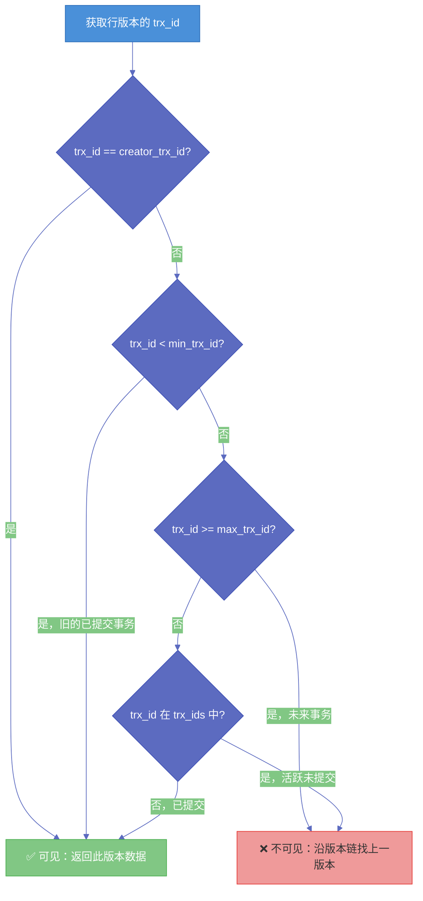

# 04 Undo Log 与 MVCC——多版本并发控制的实现真相

**摘要：** [[InnoDB]] 最精妙的设计之一是：**读不阻塞写，写不阻塞读**。一个事务在修改一行数据时，另一个事务仍然可以读取这行数据的旧版本——两者之间没有任何锁等待。这个能力的底层实现，是 [[Undo Log]] 构建的多版本链（Version Chain）和 [[ReadView]] 的可见性判断机制，合称 **MVCC（Multi-Version Concurrency Control，多版本并发控制）**。本文从 Undo Log 的物理结构和双重角色出发，深入剖析版本链的构建过程、ReadView 的四个边界值如何判定一行数据的可见性，以及 RC 和 RR 两种隔离级别在 MVCC 层面的唯一差异。最后分析长事务导致 Undo 膨胀的根因，以及 Purge 线程的清理机制。

---

## 第 1 章 为什么需要多版本

### 1.1 锁的局限性

最直接的并发控制手段是锁：修改数据时加排他锁，读取数据时加共享锁，两者互斥。但这种方案有一个根本性的缺陷：**读操作和写操作会互相阻塞**。

在 OLTP 系统中，读操作通常远多于写操作（通常是 10:1 甚至更高的比例）。如果每次写入都要阻塞所有的读取，系统的并发度会急剧下降。想象一下：一个热门商品详情页每秒被 1000 人读取，同时有一个事务在更新这个商品的库存——如果读写互斥，这 1000 个读请求都要等到更新事务提交后才能执行。

MVCC 的设计思路是：**不用锁来协调读写，而是给每次写入都保存一份旧版本数据，读操作读旧版本，写操作修改新版本——读写操作在不同的"版本"上并行，互不阻塞**。

### 1.2 版本的物理载体：Undo Log

数据的旧版本不是凭空存在的——它们存储在 **[[Undo Log]]** 中。每次对一行数据做 UPDATE 或 DELETE 操作，InnoDB 都会将修改前的旧值写入 Undo Log，并在数据页的行记录中保留指向 Undo Log 旧版本的指针（`DB_ROLL_PTR`）。这样，多次修改后，一行数据的所有历史版本就通过 `DB_ROLL_PTR` 指针链接成一条**版本链（Version Chain）**。

---

## 第 2 章 Undo Log 的双重角色

### 2.1 角色一：事务回滚的"后悔药"

Undo Log 最直观的作用是支持事务回滚。当一个事务执行 `ROLLBACK` 时，InnoDB 通过读取该事务写入的 Undo Log，**逆向执行**每一步修改：

- 如果原操作是 `INSERT`，回滚操作是 `DELETE`（删除这条新插入的记录）
- 如果原操作是 `DELETE`，回滚操作是 `INSERT`（将记录标记为可见）
- 如果原操作是 `UPDATE`，回滚操作是用 Undo Log 中记录的旧值覆盖当前值

Undo Log 是原子性（Atomicity）的物理实现基础——没有 Undo Log，事务回滚就无从谈起。

### 2.2 角色二：MVCC 的"时光机"

Undo Log 的第二个角色是为 MVCC 提供数据的历史版本。当一个事务读取一行数据时，如果当前版本对它不可见（被其他未提交的事务修改了），InnoDB 会沿着 `DB_ROLL_PTR` 指针往前翻历史版本，直到找到一个对当前事务可见的版本。

这个"往历史追溯"的过程，就像在时间轴上向过去移动——Undo Log 构成了一台"时光机"。

### 2.3 Undo Log 的物理组织

#### 2.3.1 两种 Undo Log 类型

InnoDB 将 Undo Log 分为两类：

| 类型 | 对应操作 | 特点 |
|------|----------|------|
| **Insert Undo Log** | INSERT 操作 | 只用于事务回滚，**事务提交后可以立刻丢弃**（因为新插入的行对其他事务的可见性规则由主键判断，不需要通过 Undo Log 回溯） |
| **Update Undo Log** | UPDATE / DELETE 操作 | 用于事务回滚 + MVCC 版本链，**必须等到没有任何读取它的事务时才能清理** |

这个区分非常重要：Insert Undo Log 在提交后就没有存在的意义了（没有事务会去读"插入前的状态"），而 Update Undo Log 可能被长时间运行的读事务访问，必须保留。

#### 2.3.2 回滚段（Rollback Segment）

Undo Log 存储在 **Undo 表空间（Undo Tablespace）** 中，按照**回滚段（Rollback Segment）** 的方式组织。

每个回滚段包含若干 **Undo Log Segment**，每个 Segment 对应一个事务产生的 Undo Log 记录。InnoDB 默认有 128 个回滚段，理论上支持 128 * 1024 = 131072 个并发事务（实际受其他因素限制）。

MySQL 5.6 之前，Undo Log 存储在 InnoDB 的系统表空间（ibdata1）中，无法收缩——即使旧版本被清理了，文件也不会变小，这是早期 MySQL 的一个著名"痛点"。

MySQL 5.6+ 开始支持将 Undo Log 存放到独立的 Undo 表空间文件中，MySQL 8.0 则进一步支持在线 `TRUNCATE UNDO TABLESPACE`，可以动态回收 Undo 空间。

---

## 第 3 章 行记录的隐藏列

理解 MVCC 的前提是理解 InnoDB 在每行数据中隐藏存储的几个关键列：

| 隐藏列 | 大小 | 含义 |
|--------|------|------|
| `DB_TRX_ID` | 6 字节 | 最后一次**修改（INSERT/UPDATE）** 这行数据的事务 ID |
| `DB_ROLL_PTR` | 7 字节 | 指向 Undo Log 中上一个版本的指针（版本链指针） |
| `DB_ROW_ID` | 6 字节 | 仅在没有显式主键和唯一非空索引时存在，InnoDB 自动生成的行 ID |

这三个隐藏列是 MVCC 运作的物理基础：
- `DB_TRX_ID` 告诉你"这一行是被哪个事务最后修改的"
- `DB_ROLL_PTR` 告诉你"这行的上一个版本在哪里"

---

## 第 4 章 版本链的构建过程

### 4.1 一个具体例子

假设有一张表 `t`，初始有一行数据 `(id=1, name='Alice')`，这行数据由事务 100 插入。

**初始状态**（事务 100 提交后）：

```
行记录 (id=1, name='Alice')
DB_TRX_ID = 100
DB_ROLL_PTR = NULL（没有历史版本）
```

**第一次修改**：事务 200 执行 `UPDATE t SET name='Bob' WHERE id=1`

1. InnoDB 将旧版本 `(id=1, name='Alice', DB_TRX_ID=100)` 写入 Undo Log，记为 Undo-V1
2. 更新行记录：`name='Bob'`，`DB_TRX_ID=200`，`DB_ROLL_PTR` 指向 Undo-V1

```
行记录 (id=1, name='Bob')
DB_TRX_ID = 200
DB_ROLL_PTR ──→ Undo-V1: (id=1, name='Alice', DB_TRX_ID=100, DB_ROLL_PTR=NULL)
```

**第二次修改**：事务 300 执行 `UPDATE t SET name='Carol' WHERE id=1`

1. InnoDB 将当前版本 `(id=1, name='Bob', DB_TRX_ID=200)` 写入 Undo Log，记为 Undo-V2
2. 更新行记录：`name='Carol'`，`DB_TRX_ID=300`，`DB_ROLL_PTR` 指向 Undo-V2

```
行记录 (id=1, name='Carol')
DB_TRX_ID = 300
DB_ROLL_PTR ──→ Undo-V2: (id=1, name='Bob', DB_TRX_ID=200, DB_ROLL_PTR ──→ Undo-V1)
                                                                              ↓
                                                              Undo-V1: (id=1, name='Alice', DB_TRX_ID=100, ...)
```

这就形成了一条**版本链**：`Carol`（当前）→ `Bob`（Undo-V2）→ `Alice`（Undo-V1）。

当一个读事务需要读取 `id=1` 这行时，它从版本链头部（当前版本）开始，逐个检查每个版本的 `DB_TRX_ID`，直到找到一个对自己"可见"的版本。判断可见性的工具就是 **ReadView**。

---

## 第 5 章 ReadView：可见性判断的快照

### 5.1 ReadView 的数据结构

**ReadView** 是事务开始快照读时创建的数据结构，它记录了"在这一刻，哪些事务是活跃的（已启动但未提交）"。

ReadView 包含四个核心字段：

| 字段 | 含义 |
|------|------|
| `creator_trx_id` | 创建本 ReadView 的事务 ID |
| `trx_ids` | 创建 ReadView 时，所有活跃事务（已启动未提交）的 ID 集合 |
| `min_trx_id` | `trx_ids` 中最小的事务 ID |
| `max_trx_id` | 创建 ReadView 时，已分配的最大事务 ID + 1（即下一个将要分配的事务 ID） |

### 5.2 可见性判断规则

当读事务需要判断版本链中某个版本（设其 `DB_TRX_ID = trx_id`）是否对自己可见时，依次检查以下规则：

**规则一**：`trx_id == creator_trx_id`
→ 这个版本是当前事务自己修改的，**可见**。（自己看自己的修改）

**规则二**：`trx_id < min_trx_id`
→ 这个版本对应的事务，在创建 ReadView 之前就已经提交了，**可见**。（旧的已提交事务）

**规则三**：`trx_id >= max_trx_id`
→ 这个版本对应的事务，在创建 ReadView 之后才启动，**不可见**。（未来事务）

**规则四**：`min_trx_id <= trx_id < max_trx_id`
→ 这个事务 ID 落在"活跃事务"的范围内，需要进一步检查：
- 如果 `trx_id` **在** `trx_ids` 中：说明该事务在创建 ReadView 时还未提交，**不可见**
- 如果 `trx_id` **不在** `trx_ids` 中：说明该事务在创建 ReadView 之前已经提交了，**可见**



### 5.3 RC 与 RR 的本质差异

前一篇文章已经提到，RC 和 RR 在 MVCC 层面的**唯一区别**是 ReadView 的创建时机：

- **READ COMMITTED**：每次执行 SELECT 语句时，都创建一个新的 ReadView
- **REPEATABLE READ**：事务中第一次执行 SELECT 时创建 ReadView，之后**复用同一个**

用一个具体场景来验证这个区别：

**场景**：事务 A（ID=10）在执行，事务 B（ID=20）在事务 A 的两次 SELECT 之间提交了修改。

```
时间线   事务 A (ID=10)                事务 B (ID=20)
T1       BEGIN;
T2       SELECT name WHERE id=1;
         → 创建 ReadView {trx_ids=[20], min=20, max=21}
         → 事务 B (20) 在活跃列表中 → 不可见
         → 读到历史版本: "Alice"
T3                                    UPDATE SET name='Bob' WHERE id=1;
                                      COMMIT; (事务 B 提交)
T4       SELECT name WHERE id=1;

RC：     → 创建新 ReadView {trx_ids=[], min=∞, max=21}
         → 事务 B (20) 不在活跃列表中 → 可见
         → 读到: "Bob" （不可重复读！）

RR：     → 复用旧 ReadView {trx_ids=[20], min=20, max=21}
         → 事务 B (20) 仍在活跃列表中 → 不可见
         → 读到: "Alice" （可重复读！）
```

这就是 RC 产生"不可重复读"、RR 消除"不可重复读"的底层机制——完全由 ReadView 的创建时机决定，不涉及任何锁。

---

## 第 6 章 DELETE 操作的 MVCC 处理

DELETE 操作在 MVCC 中的处理方式与 UPDATE 类似，但有一个重要细节：**InnoDB 不会立刻物理删除一行记录，而是给它打上一个"删除标记（Delete Mark）"**。

**为什么不立刻删除？** 因为可能有其他事务（通过 MVCC）还需要读取这行数据的旧版本。如果立刻物理删除，那些事务就找不到数据了。

具体过程：
1. DELETE 操作将行记录的 `delete flag` 标记为 1（表示"已删除"）
2. 将修改前的版本写入 Undo Log（Update Undo Log 类型）
3. 更新 `DB_TRX_ID` 为当前事务 ID，`DB_ROLL_PTR` 指向 Undo Log

对于 MVCC 读取来说：如果一个版本的 `delete flag=1` 且该版本对当前事务可见，则认为这行数据"不存在"，返回空。如果当前版本不可见，沿版本链找旧版本，旧版本的 `delete flag=0`，则返回旧版本数据（相当于"删除前"的状态）。

---

## 第 7 章 Purge 线程：版本链的清理机制

### 7.1 为什么需要 Purge

随着事务的进行，Undo Log 会不断积累。旧版本的数据最终需要被清理，否则磁盘空间会耗尽。

但 Undo Log 不能随意清理——如果某个旧版本还被某个活跃的读事务需要（通过 MVCC），删除它会导致那个事务读到错误的数据。

因此，InnoDB 有一个后台的 **Purge 线程**，专门负责清理不再需要的旧版本 Undo Log。清理条件是：**该版本比系统中所有活跃的 ReadView 都老**，即没有任何事务会再去读这个版本了。

### 7.2 "最老活跃 ReadView"的判断

系统中维护了一个**最老活跃 ReadView（Oldest Active ReadView）** 的记录，其对应的 `min_trx_id` 就是"安全清理线"：所有 `DB_TRX_ID < min_trx_id` 的 Undo Log 版本都是安全的，可以被 Purge 清理。

Purge 线程的执行频率由 `innodb_purge_threads`（默认 4）和 `innodb_purge_batch_size`（默认 300）参数控制。

### 7.3 长事务导致 Undo 膨胀

这里终于能从底层解释上一篇（进阶使用 03）提到的"长事务六宗罪"之第一罪——**Undo Log 膨胀**。

一个长事务意味着它的 ReadView 长时间存在。这个 ReadView 对应的 `min_trx_id` 就是那个"安全清理线"——在这个 `min_trx_id` 之后产生的所有 Update Undo Log，无论对应的事务是否已经提交，都**不能被 Purge 线程清理**（因为这个长事务可能需要读取这些版本）。

结果是：即使系统中有数百个事务在快速地执行提交，它们的 Undo Log 也无法被清理，全部积压在 Undo 表空间中，导致 Undo 空间不断膨胀。

```sql
-- 诊断：查看 Undo 历史列表长度
SHOW ENGINE INNODB STATUS\G
-- 在 TRANSACTIONS 部分找：
-- History list length 12345678
-- 如果这个数字持续增大，说明 Purge 跟不上，通常是长事务导致的
```

> [!warning] 生产避坑
> History list length 超过 100 万时应该警惕，超过 1000 万时说明系统已经处于危险状态。Purge 线程落后会导致 Undo 表空间持续增大，查询性能也会下降（版本链越长，MVCC 需要遍历的版本越多，读操作越慢）。**监控这个指标，设置告警阈值，快速定位并清理长事务是 DBA 的必备技能。**

---

## 第 8 章 MVCC 的边界与局限

### 8.1 MVCC 只对快照读有效

MVCC 只影响**快照读（普通 SELECT）** 的可见性。所有的**当前读**（`SELECT ... FOR UPDATE`、`SELECT ... LOCK IN SHARE MODE`、`INSERT`、`UPDATE`、`DELETE`）都绕过 MVCC，直接读取最新已提交的版本，并加锁。

这意味着：在同一个事务中，快照读和当前读看到的数据可能不一样。这种不一致性在业务层面需要特别注意。

### 8.2 MVCC 与锁的协作

MVCC 解决的是**读写并发**的问题（读不阻塞写，写不阻塞读）。但**写写并发**（两个事务同时修改同一行）仍然需要通过锁来协调——MVCC 无法解决写写冲突。

所以 InnoDB 的并发控制是两套机制的叠加：
- **MVCC**：解决读写并发，通过版本链让读操作访问历史版本
- **锁**：解决写写并发，通过行锁/间隙锁让写操作串行化

---

## 第 9 章 小结

本文构建的知识链：

1. **Undo Log 的双重角色**：回滚（原子性）+ MVCC 版本链（隔离性）。Insert Undo 提交后即可丢弃，Update Undo 需等到无读事务引用才能清理
2. **行记录的隐藏列**：`DB_TRX_ID`（最后修改者）+ `DB_ROLL_PTR`（版本链指针），是 MVCC 的物理基础
3. **版本链的构建**：每次 UPDATE/DELETE 都在 Undo Log 中保留旧版本，通过 `DB_ROLL_PTR` 形成版本链
4. **ReadView 的四个边界值**：`creator_trx_id`、`trx_ids`、`min_trx_id`、`max_trx_id`，通过五条规则判断版本可见性
5. **RC vs RR 的唯一区别**：ReadView 创建时机。RC 每条 SELECT 新建，RR 整个事务复用
6. **DELETE 的延迟清理**：打删除标记而非立刻物理删除，保证 MVCC 读取的正确性
7. **Purge 线程**：清理安全清理线之前的旧版本；长事务阻塞 Purge，导致 Undo 膨胀和 History list length 飙升
8. **MVCC 的边界**：只对快照读有效，写写冲突仍需锁来解决
