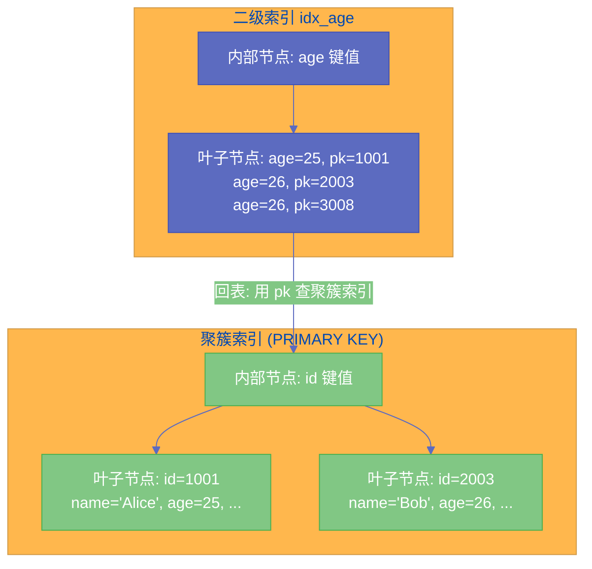

# 05 InnoDB 索引结构——B+Tree 的工程哲学与页分裂机制

**摘要：** 索引是 MySQL 性能的核心，但"索引加速查询"只是结果，背后的原理是 [[B+Tree]] 这种数据结构的独特设计。为什么数据库选择 B+Tree 而不是红黑树？为什么叶子节点用双向链表连接？为什么聚簇索引比二级索引快？页分裂为什么会让 B+Tree 退化？本文从 B+Tree 的设计选型出发，深入分析 [[InnoDB]] 索引的物理存储结构、聚簇索引与二级索引的关系、页分裂与页合并的触发条件及其对性能的影响，以及如何通过索引设计避免不必要的页分裂。

---

## 第 1 章 为什么是 B+Tree：数据库索引的选型逻辑

### 1.1 备选方案的淘汰过程

在讨论 B+Tree 为什么好之前，先理解为什么其他常见数据结构不适合做数据库索引。

**二叉搜索树（BST）**：查找时间复杂度 O(log n)，理论上很优秀。但有致命缺陷：**在顺序插入的场景下会退化为链表**——每次插入最大值，树会一直向右延伸，变成一条链，查找退化为 O(n)。而数据库中使用自增主键正是顺序插入的典型场景。

**红黑树（Red-Black Tree）**：通过旋转和颜色规则保持近似平衡，避免了 BST 的退化问题。但它的"平衡"仍然是**二叉**的——有 n 个节点的红黑树高度是 O(log₂ n)。对于一张有 1000 万行的表，log₂(10000000) ≈ 23，意味着每次查找需要经过约 23 个节点。如果每个节点是一次磁盘 I/O，这个代价是无法接受的。

**哈希索引（Hash Index）**：O(1) 的等值查找，比 B+Tree 快得多。但**不支持范围查询和排序**——哈希后的值是无序的，`WHERE age > 25` 这类查询哈希表无能为力。而且哈希表在磁盘上的存储不如 B+Tree 紧凑。MySQL 的 Memory 引擎默认使用哈希索引，InnoDB 的[[自适应哈希索引]]是自动建立的、缓存在内存中的哈希加速层，不是磁盘持久化的索引结构。

**B Tree（非 B+Tree）**：B Tree 在每个节点（包括内部节点）都存储数据，而不只存储索引键。问题是：内部节点存了数据就"变厚"了，同样大小的页（16KB）能容纳的键就更少，树的扇出（fanout）更低，导致树高更高，每次查找需要更多的 I/O。

### 1.2 B+Tree 的三个关键设计

**设计一：只在叶子节点存储数据（内部节点只存键值）**

内部节点不存数据，只存索引键（索引列的值）和子节点指针。这使得内部节点非常"瘦"，同样大小的页可以容纳更多的键，树的扇出更大。

具体数字：一个 16KB 的 InnoDB 页，如果存储的是 BIGINT（8 字节）键值 + 6 字节指针 = 14 字节，可以容纳约 16 * 1024 / 14 ≈ **1170 个键**。这意味着 B+Tree 每往下一层，能处理的行数就乘以 1170。一棵 3 层的 B+Tree 可以索引约 1170 × 1170 × 1000（叶子层每页约 1000 行）≈ **13 亿行数据**，而只需要 3 次 I/O 就能定位到任何一行。

**设计二：叶子节点用双向链表连接**

所有叶子节点通过双向链表连接成一条有序链。这使得范围查询极其高效：找到范围的起始位置后，沿着链表顺序扫描即可，不需要回到内部节点再往下查找。

```sql
-- 这条范围查询在 B+Tree 中的执行路径：
SELECT * FROM users WHERE age BETWEEN 25 AND 30;
-- 1. 从根节点开始，找到 age=25 所在的叶子页
-- 2. 在叶子页中找到 age=25 的第一条记录
-- 3. 沿着叶子层链表顺序扫描，直到 age > 30
-- 整个过程 I/O 最少，访问模式对磁盘友好
```

**设计三：键值有序，支持排序和最左前缀匹配**

B+Tree 的叶子节点中数据是按键值有序排列的。这不只支持范围查询，还支持：
- `ORDER BY` 直接利用索引的有序性，避免 filesort
- `GROUP BY` 可以利用有序性做流式聚合，避免全量排序
- 联合索引的最左前缀匹配（`(a, b, c)` 的索引，查询 `WHERE a=1 AND b>2` 可以利用）

> [!info] 核心概念
> B+Tree 的选择是一个对磁盘 I/O 模型深刻理解后的工程决策：**最大化每次 I/O 能处理的数据量（高扇出），最小化 I/O 次数（矮树高），支持范围操作（叶子链表）**。三个设计目标紧密协作，构成了数据库索引的基石。

---

## 第 2 章 InnoDB 索引的物理组织

### 2.1 页（Page）：B+Tree 的基本 I/O 单元

[[InnoDB]] 读写磁盘的最小单位是**页（Page）**，默认大小 16KB。B+Tree 的每个节点就是一个页，无论是内部节点还是叶子节点。

每个页包含以下主要部分：

| 区域 | 大小 | 用途 |
|------|------|------|
| **File Header** | 38 字节 | 页的元信息（页号、所属表空间、Checksum、前后页指针等） |
| **Page Header** | 56 字节 | 页的状态（记录数量、第一条记录的偏移、Free Space 偏移等） |
| **Infimum + Supremum** | 26 字节 | 最小/最大虚拟记录（哨兵节点，简化链表操作） |
| **User Records** | 可变 | 实际存储的行记录（按主键顺序的单向链表） |
| **Free Space** | 可变 | 未使用的空间 |
| **Page Directory** | 可变 | 稀疏目录（每 4-8 条记录存一个槽，支持二分查找） |
| **File Trailer** | 8 字节 | Checksum 校验，确保页完整写入 |

**Page Directory（页目录）** 是一个重要但经常被忽视的结构。在一个叶子页内，记录是单向链表，顺序查找的代价是 O(n)。页目录将链表划分为若干个"槽（Slot）"，每个槽指向一组记录的最大键。在页内查找时，先通过**二分查找**在页目录中定位到目标槽，再在槽内顺序查找——将查找从 O(n) 降低到 O(log n)。

### 2.2 聚簇索引（Clustered Index）

**聚簇索引**是 InnoDB 存储数据的方式——**数据本身就按照主键顺序存储在 B+Tree 的叶子节点中**。这意味着：聚簇索引的叶子节点不是"索引→数据的映射"，而是**就是数据本身**。

"聚簇"的含义是：数据的物理存储顺序和索引顺序是一致的（或聚集在一起的）。每张 InnoDB 表**有且只有一个聚簇索引**，因为数据只能有一种物理排列顺序。

聚簇索引的选择逻辑（按优先级）：
1. 如果表有主键（`PRIMARY KEY`），使用主键作为聚簇索引
2. 如果没有主键，使用第一个**非空的唯一索引（UNIQUE NOT NULL）** 作为聚簇索引
3. 如果都没有，InnoDB 自动生成一个隐藏的 6 字节 `DB_ROW_ID` 列作为聚簇索引

**聚簇索引查找的效率**：从根节点到叶子节点的路径，就是从"索引键"直达"数据行"的完整路径。3 层 B+Tree 只需 3 次 I/O（实际上，根节点通常在 [[Buffer Pool]] 中常驻，所以通常只需 1-2 次物理 I/O）。

### 2.3 二级索引（Secondary Index）

除了聚簇索引，表上的所有其他索引（普通索引、唯一索引、联合索引）都是**二级索引（Secondary Index）**，也称为非聚簇索引。

二级索引的叶子节点存储的是：**索引列的值 + 对应行的主键值**。注意：不是存行数据本身，而是存**主键值**。

**为什么二级索引存主键而不是行指针？**

在很多其他数据库（如 PostgreSQL 的 Heap 组织方式）中，索引叶子节点存储的是行在磁盘上的物理位置（CTID 或 Row ID）。这种方式在行数据位置变化时（如 VACUUM 操作移动了行），需要更新所有指向该行的二级索引——代价很高。

InnoDB 选择存主键值：当行数据因为 B+Tree 的维护（页分裂、页合并）而改变了物理位置时，二级索引**不需要更新**，因为它指向的是主键值，而主键值不变。主键值 → 物理位置的映射由聚簇索引统一维护。

**代价是"回表（Back to Table）"**：通过二级索引找到主键值后，还需要用主键值在聚簇索引中再做一次查找，才能得到完整的行数据。这就是为什么**覆盖索引**（查询只需要索引中的列，不需要回表）能显著提升性能。



---

## 第 3 章 页分裂：B+Tree 性能退化的根源

### 3.1 什么是页分裂

B+Tree 的叶子节点（页）有固定大小（16KB）。当一个页已满（Free Space 用尽），再向这个页插入新记录时，就无法直接容纳了。InnoDB 的解决方案是**页分裂（Page Split）**：

1. 分配一个新的空页
2. 将原页中约一半的记录移动到新页
3. 在 B+Tree 的父节点中添加一条指向新页的索引条目
4. 将新记录插入到合适的页

这个过程的**代价非常高**：
- 需要分配新页（I/O 写入）
- 需要移动大量记录（I/O 读写）
- 需要修改父节点（可能触发父节点的连锁页分裂）
- 分裂后，两个页的使用率大约各为 50%，整体空间利用率下降

### 3.2 页分裂的三种场景

**场景一：有序递增插入（最优情况）**

当插入的主键总是比现有最大主键大（如自增主键），新记录只会追加到 B+Tree 的最右端。此时 InnoDB 会创建一个新页，将当前页标记为"满"，新记录进入新页——这不是严格意义上的"分裂"，更像"追加新页"。新页的初始填充率接近 100%，不浪费空间。

**场景二：随机插入（最差情况）**

当主键是随机值（如 UUID、随机数），新记录可能插入 B+Tree 的任何位置。如果目标位置的页已满，就会触发真正的页分裂——将目标页的后半段记录移到新页，然后插入新记录。

随机插入的页分裂会导致：
- 大量的 I/O（移动记录 + 更新父节点）
- 每次分裂后，两个页的使用率约 50%，大量空间浪费
- B+Tree 内部出现大量碎片（Fragmentation），读取同样数量的数据需要更多的 I/O

这就是为什么**使用随机 UUID 作为主键会严重影响写入性能**，特别是当表变大后（B+Tree 的大部分节点不在 [[Buffer Pool]] 中，每次随机插入都可能触发多次磁盘 I/O）。

**场景三：中间插入（倒序或特定顺序）**

如果插入模式是倒序（每次插入比当前最小主键更小的值），同样会触发频繁的页分裂。

### 3.3 页分裂的可视化

假设一个简化的场景：页满时包含记录 [10, 20, 30, 40, 50]，现在要插入 25。

**分裂前**：
```
页 A: [10, 20, 30, 40, 50] (已满)
```

**分裂过程**：
```
第一步：分配新页 B
第二步：将后半段 [30, 40, 50] 移到页 B
第三步：在父节点中添加 "30 → 页B" 的条目
第四步：将 25 插入页 A
```

**分裂后**：
```
页 A: [10, 20, 25, 30] (约 80% 填充，其中 30 是页 B 的最小键，在某些实现中已移走)
页 B: [30, 40, 50] (约 60% 填充)
```

分裂后两页加起来的空间利用率远低于原来的 100%。

### 3.4 INNODB_FILL_FACTOR：控制页的填充率

InnoDB 有一个参数 `innodb_fill_factor`（默认 100，即 100% 填充），控制 B+Tree 叶子节点的初始填充率。如果你知道业务上会频繁插入，可以将其设为较低值（如 80），让每个页预留 20% 的空间——后续的中间插入可以在这个预留空间中完成，不需要立刻触发页分裂。

代价是空间利用率下降，相同的数据量需要更多的页。这是**空间 vs 写入性能**的典型权衡。

---

## 第 4 章 页合并：删除操作的对立面

### 4.1 删除与删除标记

删除一条记录时，InnoDB **不会立刻从页中物理删除**这条记录（这与 MVCC 的需要有关，上一篇文章已详细解释）。删除操作只是给记录打上**删除标记（Delete Mark）**，记录仍然占用页中的空间。

物理空间的回收由后台的 Purge 线程完成。当 Purge 线程清理一条带删除标记的记录后，它之前占用的空间变为可用的"空洞"——但这个空洞只能被后续插入的记录重用，不会自动合并到 Free Space 中（因为记录的排列是有序的，不能随意移动）。

### 4.2 页合并的触发

当一个页因为大量删除而使用率低于阈值（约 50%）时，InnoDB 会尝试**将相邻的两个使用率都较低的页合并**为一个页，并释放其中一个页。

页合并的过程：
1. 检测到相邻两页的使用率都低于阈值
2. 将其中一页的所有记录合并到另一页
3. 在父节点中删除被释放的页的索引条目
4. 释放空页（归还到空闲页列表）

页合并的代价也不低，但通常比页分裂的频率低得多（删除通常比插入少）。

### 4.3 OPTIMIZE TABLE：重建索引消除碎片

长期运行的表，经过大量的分裂和合并，B+Tree 的内部可能积累了大量碎片：
- 页的填充率参差不齐（有些页 90% 满，有些 40% 满）
- 页在磁盘上的物理位置分散（顺序读变成随机读）

`OPTIMIZE TABLE` 命令会重建整张表（等同于 `ALTER TABLE ... ENGINE=InnoDB`），生成一个全新的、紧凑的 B+Tree，消除碎片：

```sql
-- 重建表，消除碎片
OPTIMIZE TABLE orders;

-- 或者等价的写法（MySQL 5.6+ InnoDB Online DDL，可以不锁表）
ALTER TABLE orders ENGINE=InnoDB;
```

> [!warning] 生产避坑
> `OPTIMIZE TABLE` 会**完整重建表**，对于大表（几百 GB）这个操作可能需要数小时，期间写入会受影响（即使 Online DDL 也有 Copy 过程的 I/O 压力）。**不要在业务高峰期执行**，应该在低峰期或维护窗口执行。对于频繁插删的表，定期（如每周或每月）在低峰期执行一次 OPTIMIZE TABLE 是良好的维护习惯。

---

## 第 5 章 联合索引的 B+Tree 结构

### 5.1 联合索引的排序规则

联合索引 `(a, b, c)` 在 B+Tree 中的存储顺序是：**先按 a 排序，a 相同的按 b 排序，b 也相同的按 c 排序**。

这个排序规则直接决定了**最左前缀匹配（Leftmost Prefix Matching）** 的行为：

- `WHERE a=1`：可以利用索引（按 a 定位到叶子节点范围）
- `WHERE a=1 AND b=2`：可以利用索引（按 a, b 联合定位）
- `WHERE a=1 AND b=2 AND c=3`：可以完整利用索引
- `WHERE b=2`：**不能利用索引**（b 的排序在 a 的排序之后，没有 a 的条件无法在 B+Tree 中定位起始位置）
- `WHERE a=1 AND c=3`：只能利用 a 的部分（c 跳过了 b，在 a 确定的子范围内 c 的值是无序的）

### 5.2 为什么范围条件会截断联合索引

```sql
-- 联合索引 (a, b, c)
SELECT * FROM t WHERE a=1 AND b>5 AND c=3;
```

这条查询中，`b>5` 是一个范围条件。在 B+Tree 中：
- `a=1 AND b>5` 定位到 a=1 且 b>5 的范围内的记录——这些记录是有序的（先按 a，再按 b）
- 但在这个范围内，**c 的值不是有序的**（c 只在 a 和 b 都相同时才有序，现在 b 是变化的范围，c 的顺序性已被打破）

所以，`c=3` 这个条件无法通过 B+Tree 的索引结构来过滤，只能在找到满足 `a=1 AND b>5` 的记录后，在服务层（或通过 [[ICP]] 在存储引擎层）逐行过滤 `c=3`。

这就是"范围条件截断联合索引后续列"的原理——不是规则，是 B+Tree 物理结构的必然结果。

---

## 第 6 章 小结

本文的核心认知框架：

1. **B+Tree 是为磁盘 I/O 模型设计的**：高扇出（矮树高）+ 叶子链表（顺序扫描）+ 内部节点轻量（高缓存效率），三个特性缺一不可
2. **InnoDB 页是 B+Tree 的物理载体**：16KB 的固定大小页，包含 File Header、记录链表、Page Directory（页内二分查找）、File Trailer
3. **聚簇索引 = 数据的物理排列**：叶子节点就是数据行本身，按主键有序存储；每表只有一个
4. **二级索引 = 索引键 + 主键值**：叶子节点不存完整行数据，而是存主键值，通过"回表"到聚簇索引获取完整数据；存主键而非行指针是为了避免物理移动后的索引更新
5. **页分裂的根因是随机插入**：有序递增插入（自增主键）几乎不产生分裂，随机插入（UUID 主键）频繁分裂导致性能劣化、空间浪费
6. **页合并是分裂的逆操作**：低使用率相邻页合并；`OPTIMIZE TABLE` 重建表消除历史碎片
7. **联合索引的最左前缀匹配是 B+Tree 物理结构的必然**：先按第一列排序，范围条件截断后续列的顺序性
