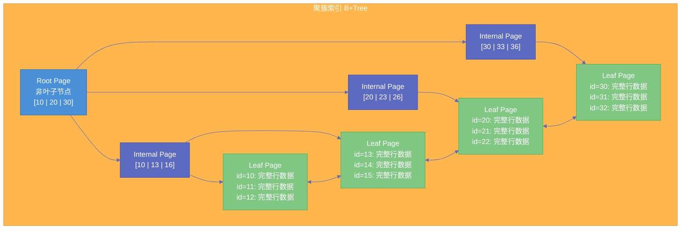

# 01 索引设计实战——从建错索引到建对索引

**摘要：** 索引是 MySQL 性能的生死线。一条慢查询的背后，往往不是 MySQL "不行"，而是索引"没建对"。本文从 [[InnoDB]] [[B+Tree]] 的物理存储结构出发，系统性地讲透聚簇索引与二级索引的本质差异、回表的代价与覆盖索引的规避手段、联合索引的最左前缀匹配规则，以及生产环境中最常见的索引失效场景。每一个知识点都不停留在"记住结论"的层面，而是追问"为什么是这样"——理解了底层数据结构的组织方式，索引设计的规则就不再是需要死记硬背的教条，而是自然而然的推导结果。

---

## 第 1 章 为什么需要索引

### 1.1 没有索引时，MySQL 如何找到你要的数据

假设有一张 `orders` 表，存储了一千万条订单记录。当你执行 `SELECT * FROM orders WHERE order_no = 'ORD20260001'` 时，如果 `order_no` 列上没有索引，MySQL 只能做一件事：**全表扫描（Full Table Scan）**。

全表扫描意味着 [[InnoDB]] 存储引擎必须从表的第一个数据页开始，沿着叶子节点的双向链表，逐页、逐行地读取每一条记录，然后与 `WHERE` 条件做比较。对于一千万行的表，假设每行平均 200 字节，[[InnoDB]] 默认的页大小为 16KB，每页大约能存 80 行记录，那么整张表大约需要 12.5 万个数据页，折算为磁盘空间大约 2GB。即便数据全部在 [[Buffer Pool]] 中缓存，CPU 逐行比较一千万次字符串匹配的代价也是巨大的；如果数据不在内存中，还需要从磁盘读取 12.5 万个 16KB 的页，这在机械硬盘上可能耗时数十秒甚至数分钟。

这就是没有索引的代价：**查询的时间复杂度是 O(n)，n 是表的行数**。行数越多，查询越慢，且这种慢是线性增长的。

### 1.2 索引的本质：用空间换时间的有序数据结构

索引的核心思想极其朴素——**既然逐行扫描太慢，那就提前把数据按照某种规则排好序，查询时通过"跳跃式"查找来缩小搜索范围**。

这和你查字典的过程完全一样。一本两千页的英汉词典，如果没有按字母排序，你要找一个单词只能从头翻到尾；但因为词典的词条是按字母顺序排列的，你可以先翻到大致位置，再通过页眉的引导词快速定位——这个过程的时间复杂度从 O(n) 降到了 O(log n)。

[[InnoDB]] 使用的索引数据结构是 **[[B+Tree]]（B+ 树）**。在一棵 B+Tree 中，数据按索引列的值有序排列，每次查找从根节点出发，沿着树的层级逐层向下，每一层通过比较键值决定走向哪个子节点，最终到达叶子节点找到目标记录。对于一棵三层的 B+Tree，查找任意一条记录最多只需要 3 次磁盘 I/O（每层读取一个页），而不是 12.5 万次——这就是索引的威力。

### 1.3 为什么是 B+Tree 而不是其他数据结构

这个问题值得深入思考，因为理解"为什么选 B+Tree"能帮助你理解索引的一系列设计约束。

**为什么不用哈希表？** [[哈希索引]]（Hash Index）的等值查询是 O(1)，比 B+Tree 的 O(log n) 更快。但数据库不只有等值查询——范围查询（`WHERE age > 20 AND age < 30`）、排序（`ORDER BY`）、最左前缀匹配，这些操作都依赖于数据的**有序性**。哈希表将键值打散存储，完全丧失了顺序信息，无法高效支持范围查询。InnoDB 有一个自适应哈希索引（[[Adaptive Hash Index]]）作为 B+Tree 之上的加速缓存，但底层索引结构必须是有序的。

**为什么不用二叉搜索树（BST）或红黑树？** 这些树结构的每个节点只存一个键值，树的高度是 O(log₂ n)。对于一千万行数据，红黑树的高度约为 23 层。每一层需要一次磁盘 I/O，23 次随机磁盘读取在机械硬盘上可能耗时 200 毫秒以上，这对于数据库查询来说完全不可接受。问题的根源在于：**二叉树的"扇出"（fanout）太低**——每个节点只有两个子节点，导致树很"瘦高"。

**为什么不用 B-Tree 而用 B+Tree？** B-Tree 和 B+Tree 的关键区别在于：B-Tree 的非叶子节点**既存键值也存数据**，而 B+Tree 的非叶子节点**只存键值和指向子节点的指针**，所有数据都存储在叶子节点。这个差异带来两个重要后果：

1. **B+Tree 的非叶子节点能容纳更多的键值**。因为不需要存储数据，同样 16KB 的页可以存放更多的索引指针，"扇出"更大，树更"矮胖"。以 `BIGINT` 主键为例，每个键值 8 字节，加上 6 字节的页指针，非叶子节点每条记录约 14 字节，16KB 的页可以存放约 1170 条指针。一棵三层的 B+Tree 就能索引 1170 × 1170 × 每页行数（约 500）= **约 6.8 亿行数据**。绝大多数业务表只需要 2-3 层 B+Tree 就足够了。

2. **B+Tree 的叶子节点通过双向链表相连**。这意味着范围查询只需要定位到起始叶子节点，然后沿链表顺序扫描，不需要回到非叶子节点重新查找——这对范围查询和 `ORDER BY` 操作的性能至关重要。

> [!note] 设计哲学
> B+Tree 的设计是一个典型的**面向磁盘 I/O 优化**的数据结构。它的核心目标是：**用最少的磁盘 I/O 次数（即最低的树高度）定位到目标数据**。一切设计决策——大扇出、数据只存叶子节点、叶子节点链表——都是为这个目标服务的。

---

## 第 2 章 InnoDB 的两种索引：聚簇索引与二级索引

### 2.1 聚簇索引：表数据的物理组织方式

在 [[InnoDB]] 中，**表数据本身就是按主键构建的一棵 B+Tree**，这棵 B+Tree 被称为**聚簇索引（Clustered Index）**。注意，这不是说"表旁边有一个索引"，而是说**表就是索引，索引就是表**。

这个概念非常重要，值得反复强调：InnoDB 没有独立于索引之外的"行存储区"。当你 `CREATE TABLE` 时，InnoDB 会以主键为排序键，将所有行数据组织成一棵 B+Tree。叶子节点存储完整的行数据（所有列），非叶子节点存储主键值和指向下层页的指针。

如果你没有显式定义主键，InnoDB 会尝试使用第一个 `UNIQUE NOT NULL` 的索引作为聚簇索引的排序键；如果连这个也没有，InnoDB 会自动生成一个 6 字节的隐藏列 `ROW_ID` 作为主键。但这个隐藏主键对你完全不可见，你无法在查询中使用它——**所以永远要显式定义主键**。

聚簇索引的物理含义是：**主键值相近的行，在磁盘上的存储位置也相近**。这意味着按主键范围查询时，InnoDB 可以进行顺序 I/O 而非随机 I/O，性能差异可以达到百倍级别。



### 2.2 二级索引：指向主键的"目录索引"

除了聚簇索引之外，你在表上创建的所有其他索引——无论是普通索引、唯一索引还是组合索引——都称为**二级索引（Secondary Index）**，也叫辅助索引或非聚簇索引。

二级索引同样是一棵 B+Tree，但它的叶子节点**不存储完整的行数据**，而是存储：**索引列的值 + 对应行的主键值**。

这个设计决策的原因很直接：如果每个二级索引都复制一份完整的行数据，那么一张有 5 个索引的表就需要存储 5 份完整数据，空间浪费和数据一致性维护的代价都不可接受。所以二级索引只保存一个"指针"——主键值——指引你到聚簇索引中去找完整的行数据。

### 2.3 回表：二级索引查询的隐性代价

当你通过二级索引查询时，如果需要返回的列不全在二级索引中，就必须执行一个额外的步骤：**根据二级索引叶子节点中存储的主键值，去聚簇索引中查找完整的行数据**。这个过程叫做**回表（Bookmark Lookup / Table Access by Index RowID）**。

举个具体例子。假设表 `users` 有主键 `id`，并在 `name` 列上建了一个二级索引：

```sql
CREATE TABLE users (
    id BIGINT PRIMARY KEY,
    name VARCHAR(50),
    email VARCHAR(100),
    age INT,
    INDEX idx_name (name)
);

-- 这条查询需要回表
SELECT * FROM users WHERE name = '张三';
```

执行过程分为两步：

1. **索引查找**：在 `idx_name` 这棵 B+Tree 中，从根节点出发，按照 `name = '张三'` 定位到叶子节点，找到所有匹配的记录。每条记录包含 `name` 值和对应的 `id` 值（比如 `id = 42`）。
2. **回表**：拿着 `id = 42` 去聚簇索引的 B+Tree 中再查找一次，定位到 `id = 42` 对应的叶子节点，读取完整的行数据（`id`, `name`, `email`, `age`）。

如果 `name = '张三'` 匹配了 100 条记录，就需要回表 100 次。每次回表都是一次从聚簇索引根节点到叶子节点的查找，虽然非叶子节点大概率在 Buffer Pool 中缓存着，但叶子节点的数据页可能分散在磁盘的不同位置——**回表产生的是随机 I/O，这是它昂贵的根本原因**。

> [!warning] 生产避坑
> 当回表次数过多时，MySQL 优化器可能会认为"与其回表几万次，不如直接全表扫描"，从而**放弃使用索引**。这就是为什么你明明建了索引，`EXPLAIN` 却显示 `type: ALL` 的常见原因之一。优化器的判断逻辑是：如果预估需要回表的行数超过全表行数的一定比例（通常 20%-30%），就倾向于全表扫描。

### 2.4 覆盖索引：消除回表的终极武器

理解了回表的代价，规避手段就显而易见了——**让二级索引的叶子节点中就包含查询所需的所有列，不需要再回到聚簇索引去取数据**。这种情况被称为**覆盖索引（Covering Index）**。

```sql
-- 创建覆盖索引：将查询涉及的列都放进索引
ALTER TABLE users ADD INDEX idx_name_email (name, email);

-- 这条查询不需要回表
SELECT name, email FROM users WHERE name = '张三';
```

当 `EXPLAIN` 的 `Extra` 列中出现 `Using index` 时，就表示本次查询使用了覆盖索引，不需要回表。

覆盖索引的本质是一种**空间换时间**的策略：索引更大了（因为包含了更多列），但查询更快了（因为省去了回表的随机 I/O）。在设计覆盖索引时需要权衡：索引列越多，索引占用的磁盘空间越大，写入时的维护成本也越高（每次 INSERT / UPDATE / DELETE 都需要同步更新索引）。

> [!info] 核心概念
> 覆盖索引不是一种特殊的索引类型，而是一种**查询与索引的匹配关系**。同一个索引，对于 `SELECT name, email` 是覆盖索引，对于 `SELECT *` 就不是。所以"覆盖索引"的主语永远是一对（查询, 索引），而不是索引本身。

---

## 第 3 章 联合索引与最左前缀匹配

### 3.1 联合索引的存储结构

联合索引（Composite Index / Multi-Column Index）是在多个列上建立的一个索引。理解联合索引的关键在于理解它的**排序规则**：**先按第一个列排序，第一个列相同时按第二个列排序，以此类推**。

```sql
ALTER TABLE users ADD INDEX idx_age_name (age, name);
```

在 `idx_age_name` 这棵 B+Tree 中，叶子节点的记录排列顺序如下：

| age | name | 主键 id（隐含存储） |
|-----|------|---------------------|
| 18  | Alice | 5 |
| 18  | Bob   | 12 |
| 18  | Charlie | 3 |
| 20  | Alice | 8 |
| 20  | David | 1 |
| 25  | Eve   | 7 |
| 25  | Frank | 15 |

观察这个排列顺序：
- **`age` 列是全局有序的**（18, 18, 18, 20, 20, 25, 25）
- **`name` 列只在 `age` 相同的组内有序**（age=18 时 Alice < Bob < Charlie；age=20 时 Alice < David）
- **`name` 列在全局范围内是无序的**（Charlie 排在 Alice 前面，因为它的 age 更小）

这个排列规则直接决定了联合索引能支持哪些查询模式，不能支持哪些查询模式——这就是最左前缀匹配规则的物理根源。

### 3.2 最左前缀匹配规则

**最左前缀匹配规则**的含义是：联合索引 `(a, b, c)` 能够加速以下查询模式：

- `WHERE a = ?`（用到了 a）
- `WHERE a = ? AND b = ?`（用到了 a, b）
- `WHERE a = ? AND b = ? AND c = ?`（用到了 a, b, c）
- `WHERE a = ? AND b > ?`（用到了 a，b 用于范围查找）
- `WHERE a = ? ORDER BY b`（a 用于等值过滤，b 用于排序）

**不能加速**的查询模式：

- `WHERE b = ?`（跳过了 a，无法使用索引）
- `WHERE b = ? AND c = ?`（跳过了 a）
- `WHERE a = ? AND c = ?`（跳过了 b，只能用到 a，c 无法利用索引的有序性）

为什么？回到上面的排列表就能理解：如果只按 `name`（即第二个列）查找，在索引中 `name` 是全局无序的，Alice 出现在 age=18 和 age=20 两个不同的位置，InnoDB 无法利用 B+Tree 的二分查找定位到连续的数据范围，只能做全索引扫描。

### 3.3 范围查询对联合索引的"截断"效应

联合索引中一个经常被忽视的细节是：**当某一列使用了范围条件（>, <, BETWEEN, LIKE 'xxx%'），该列之后的列就无法利用索引的有序性了**。

```sql
-- 联合索引 idx_age_name_email (age, name, email)

-- 场景 1：age 等值 + name 等值 → 全部三列都能用上索引
SELECT * FROM users WHERE age = 20 AND name = 'Alice' AND email = 'alice@test.com';

-- 场景 2：age 范围 → name 和 email 无法利用索引排序
SELECT * FROM users WHERE age > 20 AND name = 'Alice';
```

场景 2 中，`age > 20` 是范围查询，InnoDB 可以利用索引定位到 `age > 20` 的起始位置，然后顺序扫描。但在这个范围内，`name` 列不是有序的（age=25 时 name 可能是 Eve，age=30 时 name 可能是 Alice），所以 `name = 'Alice'` 无法通过索引的有序性来进一步过滤，只能在扫描过程中逐行比较。

这就引出了一个重要的**索引列顺序设计原则**：**将等值查询的列放在联合索引的前面，范围查询的列放在后面**。

```sql
-- 差的设计：range_col 在前，等值列在后
INDEX idx_bad (range_col, eq_col1, eq_col2)

-- 好的设计：等值列在前，range_col 在后
INDEX idx_good (eq_col1, eq_col2, range_col)
```

### 3.4 索引下推（Index Condition Pushdown）

MySQL 5.6 引入了**索引下推（ICP, Index Condition Pushdown）**优化，它在一定程度上缓解了联合索引"截断"问题的影响。

在没有 ICP 之前，上面场景 2 的执行过程是：
1. 存储引擎根据 `age > 20` 通过索引找到所有匹配的记录
2. 将这些记录的主键值逐个返回给 Server 层
3. Server 层回表取完整数据后，再用 `name = 'Alice'` 过滤

有了 ICP 之后：
1. 存储引擎根据 `age > 20` 通过索引找到匹配的记录
2. **在存储引擎层**直接用 `name = 'Alice'` 对索引中的 `name` 值做过滤
3. 只有同时满足 `age > 20 AND name = 'Alice'` 的记录才回表

ICP 减少了回表的次数，但它**并不改变索引的有序性**——`name` 列仍然无法利用 B+Tree 的二分查找，只是在索引扫描过程中提前做了过滤。当 `EXPLAIN` 的 `Extra` 列显示 `Using index condition` 时，说明 ICP 生效了。

---

## 第 4 章 索引选择性与 Cardinality

### 4.1 什么是索引选择性

**索引选择性（Index Selectivity）** 是衡量一个索引列"区分度"的指标，定义为：

$$
\text{Selectivity} = \frac{\text{不同值的数量（Cardinality）}}{\text{总行数}}
$$

选择性的取值范围在 `(0, 1]` 之间。选择性为 1 意味着每个值都是唯一的（如主键列），选择性接近 0 意味着大量重复值（如性别列只有"男/女"两个值）。

**为什么选择性很重要？** 因为索引的价值在于"快速缩小搜索范围"。如果一个索引列只有 2 个不同值（如 `gender`），那么 `WHERE gender = '男'` 平均能过滤掉 50% 的数据——这意味着还有一半数据需要回表。对于优化器来说，回表 500 万次（假设总行数 1000 万）的代价可能比全表扫描还高，所以它**很可能放弃使用这个索引**。

> [!warning] 生产避坑
> 在 `status`（只有 5 个值）、`type`（只有 3 个值）、`gender`（只有 2 个值）这类低选择性列上单独建索引，几乎总是浪费空间。如果确实需要在这些列上过滤，应当将它们与高选择性列组合成联合索引。

### 4.2 Cardinality 的统计方式与不准确性

MySQL 通过 `SHOW INDEX FROM table_name` 可以查看每个索引的 `Cardinality` 值。但需要注意：**这个值不是精确计算的，而是通过采样估算的**。

InnoDB 的采样策略是：随机选取若干个叶子节点页（数量由 `innodb_stats_persistent_sample_pages` 参数控制，默认 20），统计这些页中不同值的数量，然后按比例推算到整个索引。这意味着：

1. **Cardinality 是近似值**，每次计算可能不同
2. **数据分布不均匀时**，采样结果可能严重偏差
3. **表数据发生大量变更后**，如果没有及时更新统计信息，Cardinality 可能严重过时

当优化器因为不准确的 Cardinality 而选错了索引时，可以通过 `ANALYZE TABLE` 强制重新采样：

```sql
ANALYZE TABLE users;
```

也可以通过 `FORCE INDEX` 强制指定索引，但这是"最后手段"，因为它将索引选择的决策从优化器手中夺走，当数据分布变化后可能反而更差。

### 4.3 前缀索引：在长字符串上建索引的折衷方案

对于 `VARCHAR(255)` 甚至 `TEXT` 类型的列，完整值作为索引键会导致索引体积庞大、B+Tree 节点的扇出降低。前缀索引允许只对字符串的前 N 个字符建索引：

```sql
ALTER TABLE users ADD INDEX idx_email_prefix (email(10));
```

前缀索引的核心问题是：**截取多少长度合适？** 截取太短，选择性太差；截取太长，又失去了节省空间的意义。

计算最优前缀长度的方法：

```sql
-- 计算完整列的选择性作为基准
SELECT COUNT(DISTINCT email) / COUNT(*) AS full_selectivity FROM users;

-- 逐步增加前缀长度，观察选择性变化
SELECT 
    COUNT(DISTINCT LEFT(email, 5)) / COUNT(*) AS sel_5,
    COUNT(DISTINCT LEFT(email, 7)) / COUNT(*) AS sel_7,
    COUNT(DISTINCT LEFT(email, 10)) / COUNT(*) AS sel_10,
    COUNT(DISTINCT LEFT(email, 15)) / COUNT(*) AS sel_15
FROM users;
```

当前缀长度增加到某个点后，选择性的增长趋于平缓，这个拐点就是合适的前缀长度。

> [!warning] 生产避坑
> 前缀索引有两个重要限制：**不能用于 ORDER BY**（因为索引中存储的值被截断了，排序结果不完整）和**不能作为覆盖索引**（因为 MySQL 无法确定前缀值是否代表完整值，必须回表验证）。

---

## 第 5 章 五类常见索引失效场景

### 5.1 对索引列使用函数或表达式

```sql
-- 索引失效！对 created_at 使用了 YEAR() 函数
SELECT * FROM orders WHERE YEAR(created_at) = 2026;

-- 改写：转化为范围查询
SELECT * FROM orders 
WHERE created_at >= '2026-01-01' AND created_at < '2027-01-01';
```

为什么函数会导致索引失效？因为 B+Tree 中存储的是 `created_at` 列的原始值，按原始值排序。`YEAR(created_at)` 的结果是一个新的计算值，这个计算值在索引中不存在，InnoDB 没有办法通过 B+Tree 的有序性定位到 `YEAR(created_at) = 2026` 的记录——它必须对每一行执行 `YEAR()` 函数计算后才能判断是否匹配，这实质上退化为了全索引扫描甚至全表扫描。

同样的问题出现在任何对索引列施加的运算中：

```sql
-- 索引失效：对索引列做了算术运算
SELECT * FROM orders WHERE id + 1 = 100;
-- 改写
SELECT * FROM orders WHERE id = 99;

-- 索引失效：对索引列使用了函数
SELECT * FROM users WHERE LOWER(name) = 'alice';
```

> [!info] 核心概念
> MySQL 8.0 引入了**函数索引（Functional Index）**，可以为表达式或函数的结果建立索引。例如 `CREATE INDEX idx_year ON orders ((YEAR(created_at)))`。但这要求你事先知道会按这种方式查询，并且每次数据变更时都需要维护函数索引的值。

### 5.2 隐式类型转换

```sql
-- phone 列是 VARCHAR 类型，但传入了整数值
SELECT * FROM users WHERE phone = 13800138000;
```

这条查询中，`phone` 是 `VARCHAR` 类型，而 `13800138000` 是一个数字。MySQL 在比较不同类型的值时会进行隐式类型转换。关键问题是：**MySQL 的转换规则是将字符串转为数字进行比较**，而不是将数字转为字符串。

这意味着 MySQL 实际执行的是：`CAST(phone AS DECIMAL) = 13800138000`。这等价于对 `phone` 列应用了一个函数——正如上一节所说，对索引列应用函数会导致索引失效。

```sql
-- 正确写法：传入字符串类型
SELECT * FROM users WHERE phone = '13800138000';
```

> [!warning] 生产避坑
> 隐式类型转换导致的索引失效是线上最隐蔽的性能杀手之一。它不会报错，查询结果也是正确的，只是性能可能差了几个数量级。**在 WHERE 条件中，永远确保传入值的类型与列类型一致。** 特别注意的是在 Java/Go 等语言中通过 ORM 框架拼接查询时，数字类型的参数与 VARCHAR 列的比较。

### 5.3 LIKE 以通配符开头

```sql
-- 索引失效：通配符在前面
SELECT * FROM users WHERE name LIKE '%三';

-- 可以使用索引：通配符在后面
SELECT * FROM users WHERE name LIKE '张%';
```

原因同样回到 B+Tree 的有序性：`LIKE '张%'` 等价于范围查询 `name >= '张' AND name < '张...'`（下一个字符），InnoDB 可以利用 B+Tree 定位到这个范围的起始位置。但 `LIKE '%三'` 要找的是以"三"结尾的所有值，而在 B+Tree 中数据是按前缀排序的，以不同字符开头的"某某三"散落在索引的各个位置，无法利用有序性。

如果业务确实需要后缀搜索，可以考虑以下方案：
- **反转存储**：将字符串反转后存储和查询（`LIKE '%三'` 变成反转列的 `LIKE '三%'`）
- **全文索引**：对于复杂的文本搜索需求，使用 [[全文索引]] 或外部搜索引擎如 [[Elasticsearch]]

### 5.4 OR 条件导致的索引失效

```sql
-- 如果 name 和 age 分别有各自的索引
SELECT * FROM users WHERE name = '张三' OR age = 25;
```

这条查询的问题在于：`name = '张三'` 可以走 `idx_name` 索引，`age = 25` 可以走 `idx_age` 索引，但两个条件之间是 `OR` 关系。一个 B+Tree 的单次扫描只能沿着一棵树走，无法同时在两棵不同的索引树上查找。

MySQL 有一个 **Index Merge** 优化，在某些情况下可以分别扫描两个索引，然后合并结果（取并集）。但 Index Merge 并不总是被触发，而且即使触发了，其效率也不一定比全表扫描高——因为它需要分别扫描两个索引并做合并排序，当匹配行数较多时代价很大。

推荐做法是将 `OR` 改写为 `UNION`：

```sql
SELECT * FROM users WHERE name = '张三'
UNION ALL
SELECT * FROM users WHERE age = 25 AND name != '张三';
```

`UNION ALL` 将两个独立的查询合并，每个查询可以独立使用各自最优的索引。

### 5.5 NOT IN / NOT EXISTS / != 的索引使用

```sql
-- 这些条件通常无法高效使用索引
SELECT * FROM users WHERE status != 1;
SELECT * FROM users WHERE status NOT IN (1, 2, 3);
```

**`!=` 和 `NOT IN` 并不是完全不能使用索引**——InnoDB 技术上可以通过索引扫描定位到所有不等于指定值的记录。但问题在于：不等于条件通常匹配的行数占总行数的比例很大（比如 `status != 1` 可能匹配 90% 的数据），优化器会判断回表代价太高而放弃索引。

这本质上还是**选择性问题**：不等于条件的选择性通常很差。

---

## 第 6 章 主键设计策略

### 6.1 自增整型主键 vs UUID

聚簇索引的排序键决定了数据的物理存储顺序，因此主键的选择对 InnoDB 的写入性能和存储效率有深远影响。

**自增整型主键（AUTO_INCREMENT）** 的优势：

1. **顺序写入**：新记录的主键值总是最大的，永远追加在 B+Tree 的最右端叶子节点。这意味着 InnoDB 只需要在最后一个数据页上追加记录，当这个页满了就分配一个新页——**不会发生页分裂（Page Split）**。
2. **紧凑存储**：`INT` 占 4 字节，`BIGINT` 占 8 字节，主键值越小，非叶子节点能容纳的指针越多，B+Tree 的高度越低。
3. **二级索引更小**：每个二级索引的叶子节点都要存储主键值，主键越小，二级索引的体积越小。

**UUID 主键**的问题：

1. **随机写入**：UUID 的值是随机的，新记录可能被插入到 B+Tree 的任意位置。当目标叶子节点已满时，InnoDB 必须执行**页分裂**——将一个满页拆成两个半满页，然后在中间插入新记录。页分裂是一个昂贵的操作，涉及数据拷贝、父节点指针更新、相邻页链表修改，并且可能级联到上层节点。
2. **存储浪费**：UUID 通常是 36 个字符的字符串（如果存为 `CHAR(36)` 占 36 字节），即使用 `BINARY(16)` 存储也需要 16 字节——是 `BIGINT` 的 2 倍。这会导致 B+Tree 更高、索引更大。
3. **缓存效率低**：随机插入导致 [[Buffer Pool]] 中的热点页不断变化，缓存命中率下降。

> [!note] 设计哲学
> 如果业务确实需要全局唯一 ID（如分布式系统），推荐使用**有序的分布式 ID 方案**，如 [[Snowflake]] 算法生成的 ID——它既保证全局唯一，又保证了时间维度上的递增性，兼顾了 InnoDB 的顺序写入优化。

### 6.2 页分裂与页合并

**页分裂（Page Split）** 发生在向一个已满的叶子节点插入新记录时。InnoDB 的处理过程是：

1. 分配一个新的空白数据页
2. 将原页中大约一半的记录迁移到新页
3. 在父节点（非叶子节点）中插入一条指向新页的指针
4. 更新相邻页的前后指针（维护双向链表）

页分裂不仅产生额外的 I/O 开销，还会导致**空间碎片**——分裂后的两个页各自只有一半是满的。长期频繁的页分裂会使表的存储空间利用率下降。

**页合并（Page Merge）** 是页分裂的逆操作。当两个相邻页的记录数量都很少（合计不超过一页的容量时，由 `MERGE_THRESHOLD` 控制，默认 50%），InnoDB 会尝试将它们合并为一页，释放多余的空间。

```sql
-- 查看表空间的碎片率
SELECT 
    TABLE_NAME,
    DATA_LENGTH,
    DATA_FREE,
    ROUND(DATA_FREE / DATA_LENGTH * 100, 2) AS fragmentation_pct
FROM information_schema.TABLES 
WHERE TABLE_SCHEMA = 'your_db' AND TABLE_NAME = 'your_table';
```

当碎片率较高时，可以通过 `OPTIMIZE TABLE` 或 `ALTER TABLE ... ENGINE=InnoDB` 来重建表，消除碎片。

---

## 第 7 章 索引设计实战原则

### 7.1 高选择性列优先

在设计联合索引时，一般将**选择性最高的列放在最前面**。但这条规则有一个重要的前提：**在满足查询模式的基础上**。

举例来说，如果你的查询总是 `WHERE status = ? AND user_id = ?`，`user_id` 的选择性远高于 `status`，那么索引应该是 `(user_id, status)` 而不是 `(status, user_id)`。因为将 `user_id` 放在第一位，通过等值匹配可以将搜索范围从百万行缩小到个位数，后面的 `status` 过滤只是锦上添花。

但如果查询模式既有 `WHERE user_id = ?`，也有 `WHERE status = ?`，这时候需要根据两种查询的频率和数据分布来综合判断。

### 7.2 覆盖高频查询

分析应用程序的 SQL 日志，找出执行频率最高的 TOP 10 查询，优先为它们设计覆盖索引。

```sql
-- 使用 sys schema 查看最热门的 SQL 模式
SELECT 
    digest_text,
    count_star,
    avg_timer_wait / 1000000000 AS avg_latency_ms
FROM sys.statement_analysis 
ORDER BY count_star DESC 
LIMIT 10;
```

### 7.3 避免冗余索引与重复索引

**冗余索引**：索引 `(a, b)` 已经覆盖了 `(a)` 的功能，不需要再单独建 `(a)` 索引。

**重复索引**：在同一列上建了多个相同的索引（这种情况在团队协作中并不少见，尤其是通过不同的 ORM migration 脚本添加索引时）。

冗余和重复索引不仅浪费磁盘空间，更重要的是每次写入操作都需要同步维护所有索引，拖慢写入性能。使用 Percona Toolkit 的 `pt-duplicate-key-checker` 可以自动检测：

```bash
pt-duplicate-key-checker --host=localhost --user=root --password=xxx
```

### 7.4 控制索引总数

一个经验法则：**单表索引数量尽量不超过 5-6 个**。每个索引都是一棵独立的 B+Tree，都需要磁盘空间，都需要在写入时维护。对于写入密集的 OLTP 表，过多的索引会严重拖慢写入性能。

当索引数量过多时，应该审视是否可以通过：
- 合并多个单列索引为联合索引
- 删除低使用率的索引
- 重新设计查询模式

来减少索引数量。

### 7.5 利用索引排序避免 filesort

当 `ORDER BY` 的列顺序与索引的列顺序一致时，MySQL 可以直接利用索引的有序性返回结果，避免额外的排序操作（filesort）。

```sql
-- 索引 (status, created_at)

-- 可以利用索引排序：等值条件 + ORDER BY 下一个索引列
SELECT * FROM orders WHERE status = 1 ORDER BY created_at;

-- 无法利用索引排序：ORDER BY 方向与索引不一致
SELECT * FROM orders WHERE status = 1 ORDER BY created_at DESC, id ASC;
```

MySQL 8.0 引入了**降序索引（Descending Index）**，允许在联合索引中为不同列指定不同的排序方向：

```sql
-- 创建混合排序方向的索引
ALTER TABLE orders ADD INDEX idx_status_time (status ASC, created_at DESC);
```

这使得 `ORDER BY status ASC, created_at DESC` 可以直接利用索引的有序性。在此之前，MySQL 只支持升序索引，遇到混合排序只能 filesort。

---

## 第 8 章 诊断工具与实战案例

### 8.1 EXPLAIN 中索引相关的关键字段

| 字段 | 索引相关含义 |
|------|-------------|
| **type** | 访问类型。`const` > `eq_ref` > `ref` > `range` > `index` > `ALL`。`index` 表示全索引扫描（遍历整棵索引树），`ALL` 表示全表扫描 |
| **possible_keys** | 优化器认为可能使用的索引列表 |
| **key** | 实际使用的索引。如果为 NULL，说明没有使用任何索引 |
| **key_len** | 实际使用的索引长度（字节）。可以据此判断联合索引用了几个列 |
| **ref** | 与索引比较的值来源。`const` 表示常量，`table.column` 表示另一个表的列 |
| **rows** | 优化器**估算**需要扫描的行数（不是精确值） |
| **Extra** | `Using index` = 覆盖索引；`Using index condition` = 索引下推；`Using filesort` = 额外排序；`Using temporary` = 使用临时表 |

### 8.2 key_len 的计算方法

`key_len` 的值可以帮助你判断联合索引中**实际使用了前几个列**。计算规则：

| 数据类型 | 字节数 | 备注 |
|----------|--------|------|
| `INT` | 4 | |
| `BIGINT` | 8 | |
| `CHAR(n)` | n × 字符集字节数 | utf8mb4 = n × 4 |
| `VARCHAR(n)` | n × 字符集字节数 + 2 | +2 是变长字段长度标记 |
| 可为 NULL 的列 | 额外 +1 | NULL 标志位 |

例如，联合索引 `(age INT NOT NULL, name VARCHAR(50) NOT NULL)` 使用 utf8mb4 字符集：
- 只用了 `age`：`key_len = 4`
- 用了 `age + name`：`key_len = 4 + (50 × 4 + 2) = 206`

### 8.3 实战案例：一次索引优化的完整过程

**问题**：订单列表页查询耗时 3 秒：

```sql
SELECT order_no, user_name, amount, status, created_at 
FROM orders 
WHERE user_id = 10086 AND status IN (1, 2) 
ORDER BY created_at DESC 
LIMIT 20;
```

**第一步：EXPLAIN 诊断**

```
type: ALL | rows: 10000000 | Extra: Using where; Using filesort
```

全表扫描 + 文件排序，问题明确。

**第二步：分析查询模式**
- `user_id = 10086`：等值条件，高选择性
- `status IN (1, 2)`：等值条件（IN 等价于多个等值 OR），低选择性
- `ORDER BY created_at DESC`：排序
- 返回列：`order_no, user_name, amount, status, created_at`

**第三步：设计索引**

```sql
ALTER TABLE orders ADD INDEX idx_uid_status_time (user_id, status, created_at);
```

按最左前缀规则：`user_id`（等值）→ `status`（等值/IN）→ `created_at`（排序）。

**第四步：验证**

```
type: range | key: idx_uid_status_time | rows: 150 | Extra: Using index condition
```

查询时间从 3 秒降至 5 毫秒。如果进一步需要覆盖索引以消除回表，可以考虑将返回列也加入索引（但需要权衡索引体积）。

---

## 第 9 章 小结

本文的核心知识链条是：

1. **B+Tree 的物理结构**决定了索引的一切行为——有序性、扇出、叶子节点链表
2. **聚簇索引 = 表数据**，二级索引的叶子节点存的是主键值，由此产生**回表**代价
3. **联合索引的排序规则**导致了最左前缀匹配——不是人为规定，而是数据结构的必然
4. **索引选择性**决定了优化器是否愿意使用索引——低选择性的索引形同虚设
5. **五类索引失效场景**的根因都是一个：**破坏了 B+Tree 的有序性，使得二分查找无法执行**
6. **主键设计**直接影响写入性能（页分裂）和存储效率（索引体积）

索引设计不是一门需要死记硬背的"规则学"，而是从 B+Tree 的数据结构出发的**工程推导**。理解了底层机制，面对任何查询场景，你都能自行推导出最优的索引方案。
