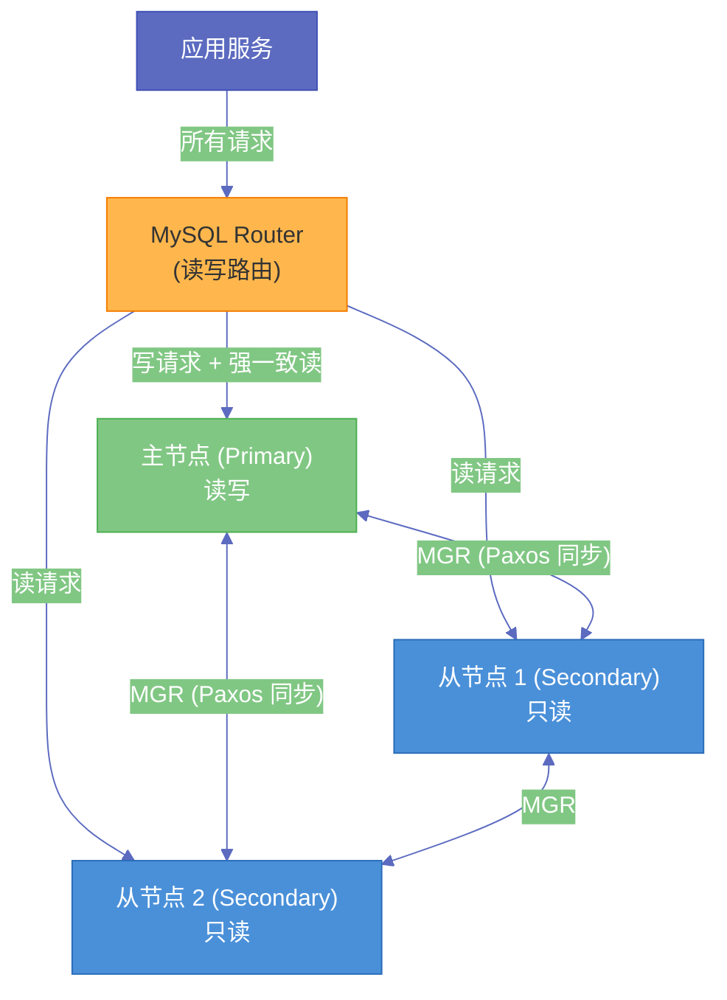

# 10 MySQL 高可用方案选型——从主从到 InnoDB Cluster

**摘要：** "数据库挂了怎么办"是每个架构师必须回答的问题。MySQL 的高可用方案从最基础的一主一从，演进到自动故障切换（MHA/Orchestrator），再到原生分布式集群（InnoDB Cluster/MGR），每个阶段都在回答"恢复时间目标（RTO）"和"恢复点目标（RPO）"这两个核心问题。本文系统梳理主流 MySQL 高可用方案的工作原理、切换过程、数据安全保证与运维复杂度，帮助你根据业务的可用性要求、团队的运维能力和基础设施条件做出正确的方案选型。

---

## 第 1 章 高可用的核心指标

### 1.1 RTO 与 RPO：两个关键问题

所有高可用设计的核心目标可以用两个指标量化：

**RTO（Recovery Time Objective，恢复时间目标）**：从故障发生到服务恢复的最大可接受时间。RTO = 0 意味着故障无感知（永不停机）；RTO = 5 分钟意味着可以接受 5 分钟的停机。

**RPO（Recovery Point Objective，恢复点目标）**：故障发生时允许丢失的最大数据量（以时间衡量）。RPO = 0 意味着零数据丢失；RPO = 1 小时意味着可以接受丢失最近 1 小时的数据（使用 1 小时前的备份恢复）。

不同业务场景对这两个指标的要求差异很大：

| 业务类型 | RTO 要求 | RPO 要求 | 对应方案 |
|---------|---------|---------|---------|
| 金融核心交易 | < 30 秒 | 0（零丢失） | 同步复制 + 自动切换 |
| 电商订单 | < 2 分钟 | < 1 秒 | 半同步复制 + 自动切换 |
| 内容平台（读多写少） | < 5 分钟 | < 5 秒 | 异步复制 + 手动切换 |
| 非核心业务 | < 30 分钟 | 可接受少量丢失 | 定期备份 + 手动恢复 |

### 1.2 高可用的三个层次

MySQL 高可用通常由三个层次组合实现：

1. **数据冗余**：通过主从复制，确保数据在多个节点上有副本，一个节点故障不导致数据丢失
2. **故障检测与切换**：监控主库的健康状态，主库故障时自动（或手动）将从库提升为新主库
3. **访问入口管理**：应用通过一个统一的入口（VIP、代理、DNS）访问 MySQL，切换时只需更新入口指向，应用无需感知 IP 变化

---

## 第 2 章 主从复制基础：高可用的数据基石

### 2.1 异步复制（Asynchronous Replication）

MySQL 的默认复制模式是**异步复制**：主库提交事务后立即返回给客户端，不等待从库确认收到 [[Binlog]]。

工作流程：
1. 主库执行事务，写入 [[Redo Log]] 和 Binlog
2. 主库返回"提交成功"给客户端
3. 从库的 IO Thread 连接主库，拉取 Binlog，写入本地的 Relay Log
4. 从库的 SQL Thread 读取 Relay Log，回放事务

**风险**：主库在步骤 2 之后、从库完成步骤 4 之前发生故障，这段时间内主库已提交但从库未同步的数据**永久丢失**。RPO > 0，可能丢失数秒到数分钟的数据（取决于网络延迟和从库 SQL 线程的回放速度）。

**优势**：主库不等待从库，写入延迟最低，适合对数据丢失不敏感但对写入性能要求高的场景。

### 2.2 半同步复制（Semi-Synchronous Replication）

MySQL 5.5 引入的**半同步复制（Semi-Sync）** 在主库提交后、返回给客户端之前，**等待至少一个从库确认已收到 Binlog**（注意：是收到，不是完成回放）。

工作流程（增强半同步，AFTER_SYNC 模式，MySQL 5.7+）：
1. 主库执行事务，写入 Redo Log，Binlog flush 到磁盘
2. **等待从库确认收到 Binlog（ACK）**
3. 收到 ACK 后，主库将事务标记为 COMMIT，返回给客户端

**AFTER_SYNC 模式的关键改进**：等待 ACK 发生在主库写入 Binlog 之后、COMMIT 之前（即 2PC 的 Prepare 阶段后）。这保证了：如果主库崩溃，Binlog 已经在至少一个从库上，这个从库可以被提升为新主库，**不会丢失已确认给客户端的任何事务**。RPO = 0。

**风险（超时降级）**：如果从库在 `rpl_semi_sync_master_timeout`（默认 10000ms = 10 秒）内没有回复 ACK，半同步自动**降级为异步复制**，避免主库无限等待。在网络不稳定或从库延迟严重时，半同步可能频繁降级，退化为异步复制的风险。

### 2.3 全同步复制与 MGR

MySQL 8.0 的 **Group Replication（MGR）** 提供了基于 Paxos 协议的全同步复制——事务提交前需要集群中大多数节点（超过一半）确认，保证数据强一致性。这是 InnoDB Cluster 的底层机制，后文详细介绍。

---

## 第 3 章 自动故障切换：从手动到自动

### 3.1 手动切换的流程与风险

没有自动切换工具时，主库故障的处理流程是：

1. DBA 收到告警，确认主库不可访问
2. 检查从库状态，找出数据最新的从库（`Seconds_Behind_Master` 最小的）
3. 在候选从库上执行 `STOP SLAVE`，确认它已应用了所有接收到的 Binlog
4. 在候选从库上执行 `RESET SLAVE ALL`，解除主从关系，将其提升为新主库
5. 更新 VIP 或 DNS 指向新主库
6. 其他从库指向新主库重新建立复制关系
7. 通知应用层重连

**问题**：
- 整个过程需要数分钟到十几分钟，RTO 很长
- 人工判断"哪个从库数据最新"容易出错，可能导致数据丢失
- 凌晨 3 点故障时，需要 DBA 及时响应

### 3.2 MHA（Master High Availability Manager）

**MHA** 是一个经典的 MySQL 自动故障切换工具，由日本工程师 yoshinorim 开发，在互联网公司广泛使用。

**核心能力**：
1. **故障检测**：`mha_manager` 进程每秒探测主库的可达性，主库不可用超过阈值后触发切换
2. **最优从库选择**：检查所有从库的 Relay Log 和 Binlog 位点，选择数据最新的从库
3. **Binlog 补全**：如果主库仍然可 SSH 连接（只是 MySQL 服务故障），从主库的 Binlog 文件中读取那些还未被任何从库接收的事务，逐一应用到候选主库
4. **自动切换**：将候选从库提升为新主库，其他从库指向新主库

**MHA 的局限性**：
- 本身无状态（MHA Manager 是单点），MHA Manager 故障需要人工重启
- 不负责 VIP 漂移或 DNS 更新，需要配合脚本实现
- 社区活跃度下降（最后一个重大更新在 2016 年左右）

### 3.3 Orchestrator：更现代的拓扑管理工具

**Orchestrator** 是 GitHub 开源的 MySQL 拓扑管理和故障切换工具，具备 Web UI 和 API，支持复杂的复制拓扑（多主、链式复制等）。

**特点**：
- 持续发现和可视化 MySQL 复制拓扑
- 支持自动故障切换，且切换逻辑比 MHA 更灵活和可配置
- Orchestrator 本身支持多实例 + Raft 共识实现高可用（解决了 MHA Manager 单点问题）
- 提供 HTTP API，便于与外部系统集成（如 Kubernetes Operator）

**与 MHA 的对比**：

| 维度 | MHA | Orchestrator |
|------|-----|-------------|
| 活跃度 | 基本停止更新 | 持续活跃（GitHub 维护） |
| 可视化 | 无 | 完整 Web UI |
| 多拓扑支持 | 仅标准主从 | 复杂拓扑 |
| 自身高可用 | 单点 | Raft 多实例 |
| 学习曲线 | 低 | 中等 |

---

## 第 4 章 读写分离：充分利用从库

### 4.1 读写分离的价值与风险

**读写分离**将写操作（INSERT/UPDATE/DELETE）路由到主库，读操作（SELECT）路由到从库，从而：
- 主库专注于写，降低写入延迟
- 从库承担大量读请求，减轻主库压力
- 水平扩展读能力（可以有多个从库）

**核心风险：主从延迟导致读到旧数据**。

如果应用在写入后立即从从库读取，可能因为主从延迟（哪怕只有几百毫秒）读到写入前的旧数据。典型场景：用户提交订单（写主库），立即跳转到"我的订单"页（读从库），可能看不到刚才的订单。

**解决方案**：

1. **写后强制读主**：刚完成写操作后的一段时间（如 1 秒）内，将该用户的读请求路由到主库。通过会话级别的路由标记实现。
2. **强制路由特定查询到主库**：对于需要强一致性的关键查询（如支付确认），添加 `/* master */` 等注释提示路由层强制走主库
3. **使用半同步复制**：配合 AFTER_SYNC 模式，从库收到 Binlog 后立即可读，延迟降低到网络 RTT 级别

### 4.2 ProxySQL：读写分离的最佳代理

**ProxySQL** 是一个高性能的 MySQL 代理，支持读写分离、负载均衡、连接池、查询路由等功能，在生产环境中广泛使用。

```sql
-- ProxySQL 配置示例：将写请求路由到主库（hostgroup 10），读请求路由到从库（hostgroup 20）
INSERT INTO mysql_query_rules (rule_id, active, match_pattern, destination_hostgroup) VALUES
(1, 1, '^SELECT.*FOR UPDATE$', 10),  -- FOR UPDATE 走主库
(2, 1, '^SELECT', 20),                -- 普通 SELECT 走从库
(3, 1, '.*', 10);                     -- 其他（写操作）走主库
```

**ProxySQL 的核心功能**：
- 透明的读写分离（应用无需修改连接逻辑，只连接 ProxySQL）
- 从库健康检测（自动将不健康的从库从路由列表移除）
- 连接池（复用数据库连接，减少连接建立开销）
- 查询路由规则（正则表达式匹配）
- 与 Orchestrator 集成（Orchestrator 可以在故障切换时更新 ProxySQL 的路由配置）

---

## 第 5 章 InnoDB Cluster：MySQL 原生高可用

### 5.1 InnoDB Cluster 的三个组件

**InnoDB Cluster** 是 MySQL 官方提供的完整高可用方案，由三个核心组件组成：

1. **MySQL Group Replication（MGR）**：底层的数据同步机制，基于 Paxos 协议实现多主或单主的同步复制
2. **MySQL Shell**：管理 InnoDB Cluster 的命令行工具（AdminAPI），简化集群的创建、配置和维护
3. **MySQL Router**：应用层的连接路由，自动将读写请求路由到正确的节点



### 5.2 MGR 的工作原理

**MySQL Group Replication（MGR）** 基于改良的 **Paxos 协议（Xcom）** 实现分布式共识：

1. 每个节点在提交事务前，通过 Xcom 将该事务广播给集群中所有节点
2. 收到超过半数节点的确认（Quorum）后，事务才被允许提交
3. 如果两个节点同时修改同一行，会产生冲突，其中一个事务会被回滚

**MGR 单主模式（Single-Primary Mode）**（推荐）：
- 集群中只有一个主节点负责写入
- 其他节点作为只读的从节点
- 主节点故障时，集群自动通过投票选举新主节点
- 整个选举和切换过程通常在 **5-10 秒内完成**（RTO 极短）
- 由于是 Paxos 多数派确认，RPO = 0（不丢失已提交事务）

**MGR 多主模式（Multi-Primary Mode）**：
- 所有节点都可以写入
- 通过行级并发冲突检测机制防止写入冲突
- 适合写入压力分散在多个地理位置的场景
- 实现复杂，对应用的冲突处理要求高，生产中使用较少

### 5.3 InnoDB Cluster 的运维操作

```javascript
// MySQL Shell 的 JavaScript 模式
// 创建集群
var cluster = dba.createCluster('myCluster');

// 添加节点
cluster.addInstance('user@host2:3306');
cluster.addInstance('user@host3:3306');

// 查看集群状态
cluster.status();
/* 输出示例：
{
    "clusterName": "myCluster",
    "defaultReplicaSet": {
        "name": "default",
        "primary": "host1:3306",
        "status": "OK",
        "topology": {
            "host1:3306": {"memberRole": "PRIMARY", "status": "ONLINE"},
            "host2:3306": {"memberRole": "SECONDARY", "status": "ONLINE"},
            "host3:3306": {"memberRole": "SECONDARY", "status": "ONLINE"}
        }
    }
}
*/

// 手动切换主节点
cluster.setPrimaryInstance('host2:3306');
```

### 5.4 各方案对比

| 方案 | RTO | RPO | 运维复杂度 | 适用规模 |
|------|-----|-----|----------|---------|
| **手动主从切换** | 分钟级 | 秒-分钟级 | 低 | 小型/非核心业务 |
| **MHA + 半同步** | 30-60 秒 | 0（半同步） | 中 | 中型业务 |
| **Orchestrator + 半同步** | 15-30 秒 | 0（半同步） | 中高 | 中大型业务 |
| **InnoDB Cluster（MGR）** | 5-10 秒 | 0 | 中（有官方工具） | 各种规模 |
| **PolarDB/TiDB 等分布式 DB** | < 5 秒 | 0 | 高（专业 DBA） | 大型/超大型 |

---

## 第 6 章 选型建议

### 6.1 决策树

```
业务对停机的容忍度？

├── 停机几分钟可以接受（内部系统、非核心业务）
│   └── 方案：一主一从 + 异步复制 + 手动切换 + mysqldump 定期备份
│
├── 停机 1 分钟以内（大多数 ToC 业务）
│   ├── 团队有 DBA 专业运维能力？
│   │   ├── 是：MHA/Orchestrator + 半同步复制 + ProxySQL 读写分离
│   │   └── 否：InnoDB Cluster（官方工具，运维更简单）
│   └── 数据绝对零丢失（金融场景）？
│       └── 必须：MGR 单主 或 半同步 AFTER_SYNC 模式
│
└── 停机 10 秒以内 + 无限横向扩展（超大规模）
    └── TiDB / PolarDB / Aurora 等分布式数据库
```

### 6.2 写在最后

高可用不是一个技术问题，而是一个**工程体系**问题。工具选对了只是第一步，还需要：
- 定期演练故障切换（不演练的 HA 方案在真实故障时经常失败）
- 建立完善的监控告警体系（问题出现时必须快速感知）
- 完善的备份验证机制（备份能不能恢复，需要定期验证）
- 明确的 Runbook（故障时，谁来做什么，步骤是什么，清晰到人）

---

## 第 7 章 小结

本文构建的高可用知识体系：

1. **RTO 和 RPO 是高可用方案的量化目标**，不同业务场景的要求差异很大，选型前必须明确这两个指标
2. **复制模式是 RPO 的决定因素**：异步复制（RPO > 0，可能丢数据）→ 半同步 AFTER_SYNC（RPO = 0）→ MGR（RPO = 0 且原子广播）
3. **自动切换工具决定 RTO**：手动切换（分钟级）→ MHA（30-60 秒）→ Orchestrator（15-30 秒）→ InnoDB Cluster/MGR（5-10 秒）
4. **读写分离充分利用从库价值**：ProxySQL 是最成熟的读写分离代理；主从延迟导致读旧数据是核心风险，需要写后强制读主
5. **InnoDB Cluster 是官方高可用全栈方案**：MGR（Paxos 数据同步）+ MySQL Shell（管理 API）+ MySQL Router（路由），三组件配合，运维友好，是新项目的推荐选择
6. **高可用是工程体系**：工具只是基础，定期演练、监控告警、备份验证、Runbook 缺一不可
