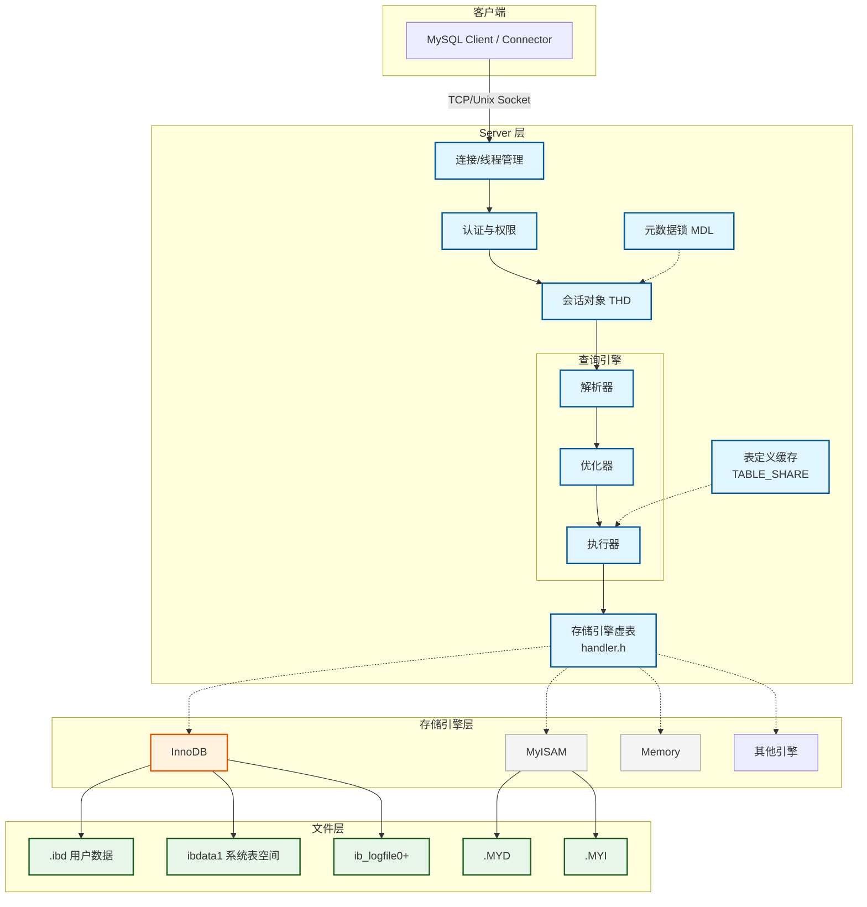
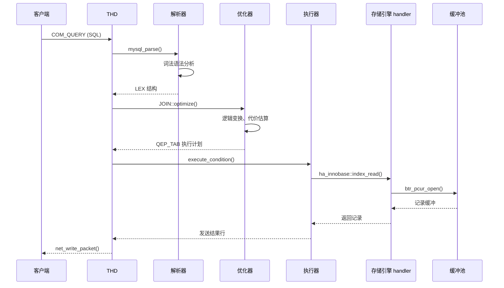
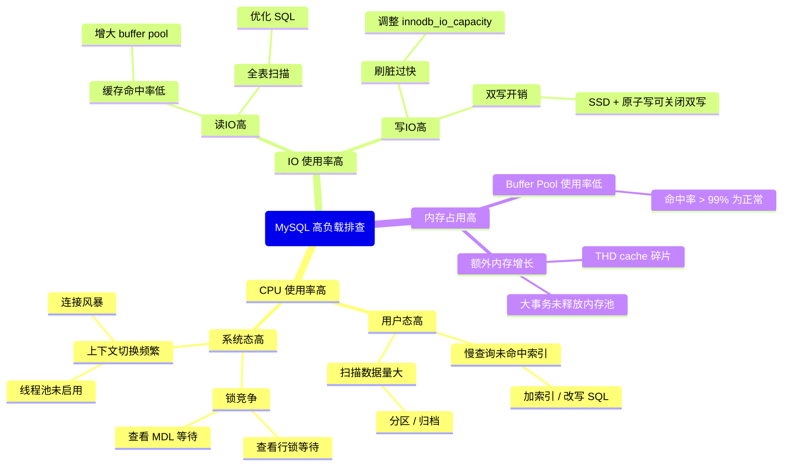

> **摘要**：  
> MySQL 能够同时支持事务型 InnoDB、非事务型 MyISAM、内存型 Heap 等十余种存储引擎，并在同一套 SQL 接口下无缝切换，其核心在于 **Server 层与存储引擎层的彻底解耦**。本文从 `mysqld_main` 启动入口出发，系统拆解连接管理器、解析优化器、执行器、存储引擎接口四个核心子模块，阐明各层的职责边界与数据流向。通过剖析 `THD`、`TABLE_SHARE`、`handlerton` 等关键结构体字段，展示 Server 层如何管理会话状态、如何通过抽象接口调用引擎能力。最后结合生产环境参数调优与 `performance_schema` 观测手段，给出连接风暴、表定义缓存命中率等典型问题的诊断决策树，并基于 8.0/9.0 的演进讨论线程池架构与数据字典重构对总体架构的影响。

---

## 一、核心概念与底层图景

### 1.1 定义
MySQL Server 层负责连接管理、SQL 解析、优化、执行计划生成及结果集输出；**不直接接触数据**。  
存储引擎层通过实现 `handler` 接口（约 70 个虚函数）提供表扫描、索引查找、记录插入/更新/删除等物理操作。  
两层通过**插件式接口**耦合，允许存储引擎动态加载、替换，且无需修改 Server 层代码。

### 1.2 架构全景


---

## 二、机制原理深度剖析

### 2.1 核心子模块拆解

| 子模块 | 职责 | 设计意图 |
|--------|------|---------|
| **连接管理器** | 监听端口、认证、分配线程、维护线程缓存 | 与查询执行分离，支持线程池插件 |
| **会话与权限** | 每个连接对应一个 `THD`，存储当前数据库、用户、事务状态 | 集中管理会话级上下文，避免全局变量污染 |
| **解析与优化** | 词法/语法分析生成 `LEX` 树；基于代价选择执行计划 | 纯函数式设计，无状态，易于测试与扩展 |
| **执行器** | 火山模型迭代调用存储引擎接口，组装结果集 | 统一的行迭代接口，屏蔽引擎差异 |
| **表定义缓存** | 缓存 `TABLE_SHARE` 对象，存储表结构、字段、索引元数据 | 避免重复解析 .frm（5.7）/ 数据字典（8.0） |
| **元数据锁** | 保护表结构及数据在 DDL/DML 并发的安全性 | 独立于存储引擎，全局命名空间管理 |

### 2.2 一条查询语句的全流程（Mermaid 时序图）



---

## 三、内核/源码级实现

### 3.1 核心数据结构：`THD`（线程描述符）
位置：`sql/sql_class.h`

```c
class THD {
    /* 会话标识与网络层 */
    Protocol        *protocol;      // 协议适配器（text/binary）
    NET             net;           // 网络缓冲区，受 LOCK_thd_data 保护
    my_thread_id    thread_id;     // 线程ID，show processlist 可见
    ulong           server_id;     // 主从复制ID，原子更新
    
    /* 内存管理 */
    MEM_ROOT       main_mem_root; // 会话级内存池，事务结束重置
    Query_arena    *stmt_arena;   // 语句级 Arena，reset 时整体释放
    
    /* 解析与执行状态 */
    LEX            *lex;          // 解析结果语法树
    const char     *query;        // 原始 SQL 字符串
    uint           query_length;
    
    /* 事务与锁 */
    Transaction_ctx *transaction; // 抽象事务上下文，实际由引擎实现
    MDL_context    mdl_context;   // 元数据锁上下文
    
    /* 诊断与统计 */
    Diagnostics_area *stmt_da;    // 错误码、警告、影响行数
    ulonglong      current_linfo; // 当前语句的 LIMIT 信息
    
    /* 并发控制（自旋锁保护特定字段） */
    mysql_mutex_t  LOCK_thd_data; // 保护 net、query、user_vars
};
```

### 3.2 核心数据结构：`TABLE_SHARE`（表定义缓存）
位置：`sql/table.h`

```c
struct TABLE_SHARE {
    /* 元数据基本信息 */
    LEX_STRING     db;           // 数据库名
    LEX_STRING     table_name;   // 表名
    LEX_STRING     path;         // .frm（5.7）/SDI（8.0）路径
    uint           table_def_version; // 表定义版本，用于缓存一致性
    
    /* 列与索引定义 */
    Field         *field;        // 列描述数组，长度 fields
    uint           fields;       // 列数
    KEY           *key_info;     // 索引定义数组，长度 keys
    uint           keys;         // 索引数
    
    /* 存储引擎相关 */
    handlerton    *db_type;      // 引擎类型指针（myisam, innobase...）
    uchar         *ha_share;     // 引擎私有共享数据（如InnoDB dict_table_t*）
    
    /* 字符集与行格式 */
    CHARSET_INFO  *table_charset;
    enum row_type  row_type;     // REDUNDANT, COMPACT, DYNAMIC...
    
    /* 引用计数与并发控制 */
    int           ref_count;     // 当前打开该表的 TABLE 对象数
    mysql_mutex_t LOCK_share;    // 保护 ref_count 和 flush 状态
    
    /* LRU 链表节点 */
    TABLE_SHARE   *next, **prev;
    time_t        last_used;     // 最近访问时间，用于淘汰
};
```

### 3.3 核心数据结构：`handlerton`（存储引擎注册表）
位置：`sql/handler.h`

```c
struct handlerton {
    /* 引擎标识 */
    const char *name;            // "InnoDB", "MyISAM"...
    int         slot;           // 在 hton_s 数组中的槽位
    uint32      flags;          // HTON_* 能力标志（支持事务、支持外键等）
    
    /* 生命周期回调 */
    int (*init)(void *p);       // 引擎初始化（plugin_init 时调用）
    int (*close)(handlerton *); // 关闭前清理
    
    /* 事务接口 */
    int (*prepare)(THD *thd, bool all);      // 两阶段提交 prepare
    int (*commit)(THD *thd, bool all);       // 提交
    int (*rollback)(THD *thd, bool all);     // 回滚
    
    /* 表操作接口 */
    handler *(*create)(handlerton *hton, TABLE_SHARE *share, 
                       MEM_ROOT *mem_root);  // 构造 handler 实例
    
    /* DDL 辅助 */
    int (*drop_database)(char *path);        // 删除整个库
    int (*rename_table)(const char *from, const char *to);
    
    /* 统计信息 */
    void (*update_table_stats)(TABLE *table);
    void (*update_index_stats)(TABLE *table, uint index_no);
    
    /* 并发控制（8.0 新增） */
    bool (*ddl_recovery)(THD *thd);          // 原子 DDL 恢复
};
```

### 3.4 核心流程伪代码：从 `mysql_parse` 到 `ha_commit_trans`

```python
# sql/sql_parse.cc
def mysql_parse(thd, parser_state):
    lex = thd.lex
    # 词法/语法解析
    if parse_sql(thd, parser_state, thd.mem_root):
        return error
    
    # 根据命令类型分发
    sql_command = lex.sql_command
    if sql_command == SQLCOM_SELECT:
        result = execute_sqlcom_select(thd, lex.select_lex)
    elif sql_command == SQLCOM_INSERT:
        result = mysql_insert(thd, lex.table_list, lex.field_list, lex.value_lists)
    elif sql_command == SQLCOM_UPDATE:
        result = mysql_update(thd, lex.table_list, lex.item_list, lex.where_cond)
    # ...
    
    # 自动提交处理（若 autocommit=1 且无显式 START TRANSACTION）
    if thd.transaction.is_autocommit and not thd.transaction.has_error:
        ha_commit_trans(thd, 0)   # 0 表示普通提交，非 XA
        thd.transaction.cleanup()

# handler.cc
def ha_commit_trans(thd, all):
    # 两阶段提交（内部XA）：协调 binlog 与引擎事务
    for ht in hton_s:
        if ht.state == SHOW_OPTION_YES and ht.prepare:
            error = ht.prepare(thd, all)   # InnoDB: 写 prepare redo
            if error:
                ha_rollback_trans(thd, all)
                return error
    
    # 如果 binlog 开启，走组提交
    if mysql_bin_log.is_open():
        ordered_commit(thd)  # flush -> sync -> commit
        # ordered_commit 内会调用 ha_commit_low
    
    for ht in hton_s:
        if ht.state == SHOW_OPTION_YES and ht.commit:
            ht.commit(thd, all)   # InnoDB: 释放锁，清除事务视图
```

---

## 四、生产落地与 SRE 实战

### 4.1 场景化案例：连接风暴导致服务雪崩

**现象**：  
业务高峰期，`SHOW PROCESSLIST` 出现大量 `Creating sort index` 查询，同时数百连接处于 `Login` 或 `Init DB` 状态，CPU `sy` 占比超过 40%。

**根本原因分析**：  
- 短连接风暴导致频繁 `pthread_create` / `pthread_detach`，线程缓存命中率低。  
- 连接认证阶段需读取 `mysql.user`（5.7 MyISAM 表锁，8.0 InnoDB 但仍有 MDL 锁），高并发下锁竞争加剧。  
- 表定义缓存（`table_definition_cache`）不足，导致频繁淘汰 `TABLE_SHARE`，新连接打开表需要重新从磁盘解析元数据。

**验证手段**：
```sql
-- 查看表定义缓存命中状态
SHOW GLOBAL STATUS LIKE 'Open_table_definitions';
SHOW GLOBAL STATUS LIKE 'Opened_table_definitions';
-- Opened_table_definitions 持续增长，说明缓存未命中

-- 5.7 查看 ACL 缓存命中率
SHOW STATUS LIKE 'Acl_%';
```

**优化措施**：
```ini
[mysqld]
# 增大表定义缓存，减少元数据解析
table_definition_cache = 5000

# 增大线程缓存，复用线程对象
thread_cache_size = 256

# 8.0 使用 caching_sha2_password 减少认证锁竞争
default_authentication_plugin = caching_sha2_password

# 调整 back_log 防止 TCP 握手队列溢出
back_log = 500
```

### 4.2 性能调优参数矩阵

| 参数 | 作用域 | 8.0 推荐值 | 内核解释 |
|------|--------|-----------|---------|
| `table_open_cache` | 全局 | 4000～8000 | 每个连接打开的表缓存实例，超过 `table_open_cache_instances` 分区；太大增加 LRU 扫描开销 |
| `table_definition_cache` | 全局 | 2000～5000 | 5.7 控制 `.frm` 缓存，8.0 控制 `TABLE_SHARE` 数量，内存消耗较大 |
| `table_open_cache_instances` | 全局 | 16～64 | 分区表缓存，减少 `LOCK_open` 竞争 |
| `thread_cache_size` | 全局 | 256～512 | 空闲线程缓存，短连接场景收益明显 |
| `back_log` | 全局 | 500～1024 | TCP 监听队列长度，突增连接时防止 `connection refused` |
| `max_execution_time` | 会话/全局 | 30000 (ms) | 杀死执行超时的查询，防止优化器无限循环（8.0 支持） |
| `performance_schema` | 全局 | ON | 8.0 性能损耗已低于 5%，提供精准锁等待分析 |

### 4.3 故障排查决策树（Mermaid Mindmap）



---

## 五、技术演进与 2026 年视角

### 5.1 历史设计约束与改进
| 版本 | 架构变化 | 动因 |
|------|--------|------|
| 3.23 | 引入插件式存储引擎接口 | 支持 Berkeley DB，奠定可插拔基础 |
| 5.5 | InnoDB 成为默认引擎 | MyISAM 缺乏崩溃恢复能力 |
| 5.7 | 增加线程池插件（企业版），但社区版仍为一连接一线程 | 解决短连接风暴，社区版未合入 |
| 8.0 | 移除 `.frm`，数据字典统一由 InnoDB 存储 | 解决 DDL 原子性，消除 Server/引擎元数据不一致 |
| 8.0.19+ | 支持 `CLONE PLUGIN` 在线克隆 | 替代 `xtrabackup` 全量同步，简化 MGR 节点加入 |

### 5.2 2026 年仍存在的“遗留设计”

1. **一连接一线程仍是默认**  
   社区版始终未集成线程池，高并发短连接场景仍依赖 `thread_cache_size`。  
   **替代方案**：使用 ProxySQL 或连接池中间件，或在云上选择已实现线程池的 RDS 分支。

2. **`LOCK_open` 尚未彻底消除**  
   8.0 将表定义缓存拆分为 `table_open_cache_instances`，但 `TABLE_SHARE` 的引用计数仍受全局互斥锁保护。  
   对于上万张表的实例，频繁打开/关闭表仍可能产生锁竞争。

3. **优化器代价模型依然“静态”**  
   Server 层优化器不了解数据是否在缓冲池中，也不区分内存读与磁盘读的成本。  
   9.0 实验性引入 ML 代价模型，但尚未成为正式特性。

### 5.3 未来趋势
- **线程池下沉至引擎**：8.0 的线程池插件仅限企业版，Percona Server 开源实现，但 MySQL 社区版仍未合并。  
- **数据字典与 SDI 的进一步融合**：当前每个 `.ibd` 文件存一份 JSON 格式的 SDI，冗余存储但提供了极强的自救能力。未来可能将 SDI 压缩或增量存储。  
- **AI 优化器**：MySQL 9.0 引入的 `optimizer_switch` 已包含 `use_cost_constants`，允许外部注入实时统计信息；五年内可能实现基于历史负载的自适应计划选择。

---

## 参考文献
- MySQL Internals Manual – Server Layer Architecture
- `sql/mysqld.cc`, `sql/sql_parse.cc`, `sql/handler.h` MySQL 8.0.33 源码
- Oracle Blogs: “MySQL 8.0: Data Dictionary Architecture and Design”
- Percona Live 2024: “Thread Pool in MySQL – Why It’s Still Not in Community?”

---

> **下一篇**：[[02. 深入解析MySQL 客户端与服务端通信协议]]
