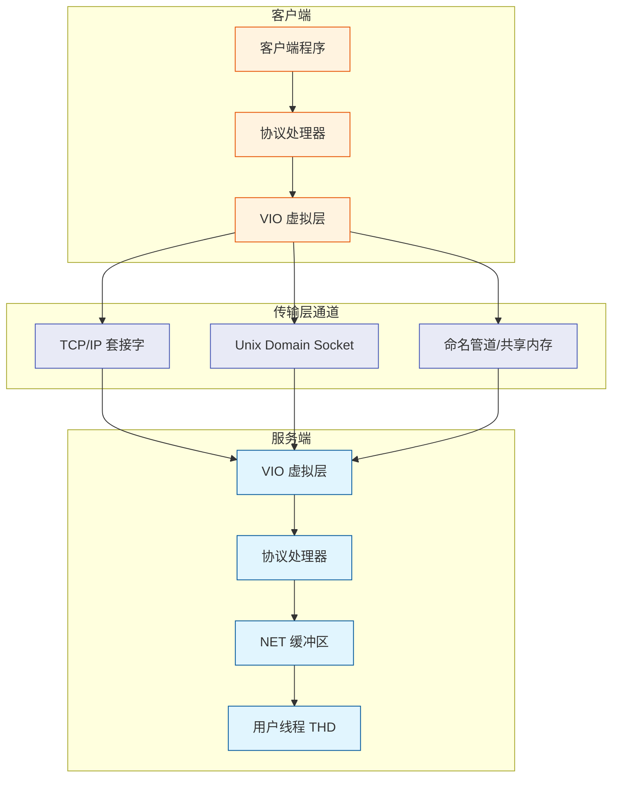
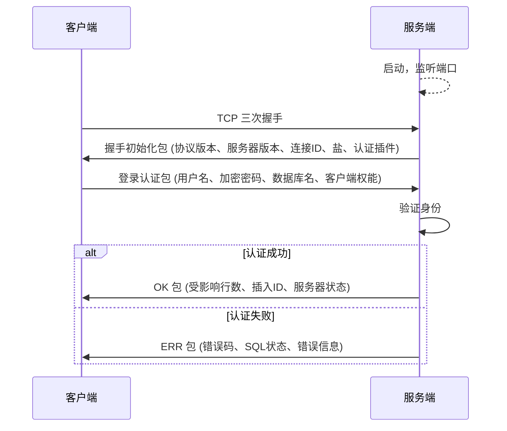
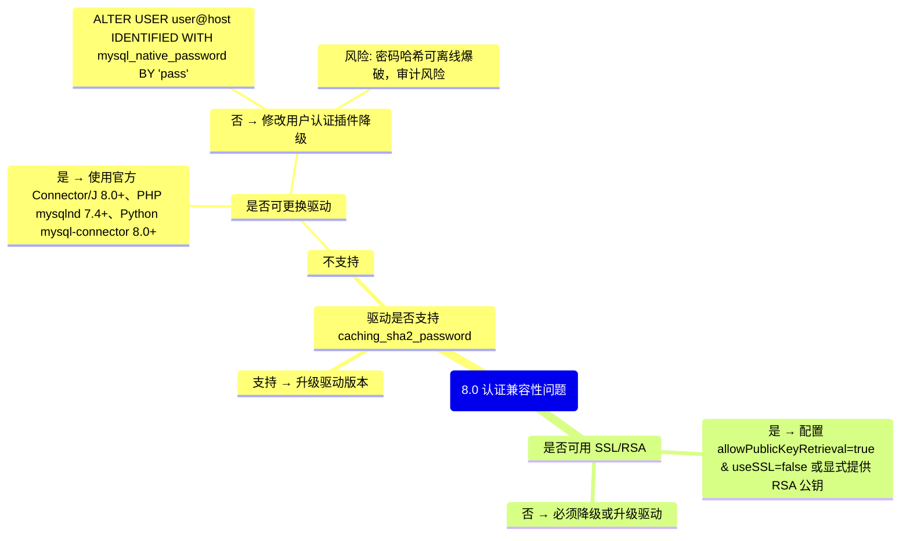

> **摘要**：  
> MySQL 客户端与服务器之间的每一次交互都遵循一套自描述的应用层协议——MySQL Protocol。该协议独立于传输层，可在 TCP/IP、Unix Socket、命名管道等通道上运行。本文从报文结构、连接建立、认证握手、命令执行四个层次系统拆解协议设计，详细阐述 `NET`、`Vio` 等核心结构体在源码中的实现，并追踪一条 `SELECT` 语句从客户端输入到服务端响应的完整报文流转。生产实践部分提供 tcpdump 抓包分析方法、认证插件兼容性决策树及常见错误码解析。最后基于 8.0/9.0 的演进，讨论 TLS 加密的普及、caching_sha2_password 的设计缺陷修复以及协议未来可能的重构方向。

---

## 一、核心概念与底层图景

### 1.1 定义
MySQL 通信协议是一套**基于数据包的请求-响应协议**，位于 TCP/IP 等传输层之上。每个数据包由**头部（4 字节）**和**载荷（变长）**组成，头部包含载荷长度与序列号。协议分为两个阶段：**连接阶段**（握手与认证）和**命令执行阶段**（交互与结果返回）。

### 1.2 架构全景



---

## 二、机制原理深度剖析

### 2.1 核心子模块拆解

| 子模块 | 职责 | 设计意图 |
|--------|------|---------|
| **VIO 虚拟层** | 封装底层网络 API，提供统一读写接口 | 屏蔽 TCP、Unix Socket、Windows 管道等差异 |
| **NET 结构** | 管理连接读/写缓冲区、序列号、压缩状态 | 每连接独立，保护函数 `my_net_read`/`my_net_write` |
| **认证插件** | 实现挑战-应答式密码验证 | 可插拔设计，兼容旧客户端 |
| **报文格式** | 定长头 + 变长体，小端序传输 | 简单高效，16MB 包长限制 |
| **命令处理器** | 解析 `COM_*` 命令码，分发表决 | Server 端主循环 `do_command` |

### 2.2 报文结构

每个 MySQL 数据包固定 4 字节头部：

```
0                   1                   2                   3
0 1 2 3 4 5 6 7 8 9 0 1 2 3 4 5 6 7 8 9 0 1 2 3 4 5 6 7 8 9 0 1
+-+-+-+-+-+-+-+-+-+-+-+-+-+-+-+-+-+-+-+-+-+-+-+-+-+-+-+-+-+-+-+-+
|         Payload Length (3)       |   Sequence ID (1)  |
+-+-+-+-+-+-+-+-+-+-+-+-+-+-+-+-+-+-+-+-+-+-+-+-+-+-+-+-+-+-+-+-+
|                         Payload ...                         ...
+-+-+-+-+-+-+-+-+-+-+-+-+-+-+-+-+-+-+-+-+-+-+-+-+-+-+-+-+-+-+-+-+
```

- **Payload Length**：3 字节小端无符号整数，最大值 16MB-1。  
- **Sequence ID**：1 字节，从 0 开始，每个命令会话递增，绕回 0。  
- **Payload**：实际数据，格式取决于命令类型或响应类型。

若载荷长度 = 0xFFFFFF（理论最大值），表示该包为分割包（MySQL 4.0 前特性，现已废弃）。

### 2.3 连接阶段时序



#### 2.3.1 握手初始化包（Greeting Packet）
- 协议版本：当前为 10（`PROTOCOL_VERSION`）
- 服务器版本字符串：如 `8.0.33`
- 连接 ID：4 字节，`SHOW PROCESSLIST` 中的 Id
- 盐（scramble）：第一部分 8 字节，第二部分 12 字节（共 20 字节）
- 服务器权能标志：4 字节，标识支持的功能（如 SSL、压缩、认证插件）
- 默认认证插件名：如 `caching_sha2_password`

#### 2.3.2 登录认证包（Login Packet）
- 客户端权能标志（4 字节）
- 最大允许包大小（4 字节）
- 字符集编码（1 字节）
- 用户名（以 0x00 结尾）
- 加密后的密码（长度编码，取决于认证插件）
- 数据库名（可选，以 0x00 结尾）
- 认证插件名（可选）

### 2.4 命令执行阶段

客户端认证成功后，进入命令循环。每个命令对应一个请求包，服务端返回响应包（OK、ERR、EOF 或结果集）。

**常见命令码（`include/mysql_com.h`）**：

| 命令 | 值 | 说明 |
|------|----|------|
| `COM_QUIT` | 0x01 | 关闭连接 |
| `COM_INIT_DB` | 0x02 | 切换数据库 |
| `COM_QUERY` | 0x03 | SQL 查询 |
| `COM_FIELD_LIST` | 0x04 | 获取表字段信息（5.7 后不推荐） |
| `COM_PING` | 0x0E | 测试连接存活 |
| `COM_CHANGE_USER` | 0x11 | 切换用户（不断开） |
| `COM_STMT_PREPARE` | 0x16 | 预处理语句准备 |
| `COM_STMT_EXECUTE` | 0x17 | 执行预处理语句 |
| `COM_STMT_CLOSE` | 0x19 | 销毁预处理语句 |

**响应报文类型**：
- **OK_Packet**：首字节 0x00，后跟受影响行数、插入ID、状态标志等。
- **ERR_Packet**：首字节 0xFF，后跟错误码、SQL 状态、错误信息。
- **EOF_Packet**：首字节 0xFE，用于结果集字段结束或行数据结束（8.0 已废弃，改用 OK 包）。
- **结果集（Resultset）**：由多包组成：列数量（LengthEncodedInt）、列定义列表（多个字段包）、EOF（或 OK）、行数据列表（多个行包）、EOF（或 OK）。

---

## 三、内核/源码级实现

### 3.1 核心数据结构：`Vio`（虚拟 IO）
位置：`vio/vio.h`

```c
typedef struct st_vio {
    /* 套接字描述符 */
    my_socket      sd;           // socket fd，Unix 下为 int
    int            type;         // VIO_TYPE_TCPIP, VIO_TYPE_SOCKET, VIO_TYPE_NAMEDPIPE...
    
    /* 读写函数指针（适配不同传输层） */
    size_t (*read)(Vio *vio, uchar *buf, size_t size);
    size_t (*write)(Vio *vio, const uchar *buf, size_t size);
    int    (*close)(Vio *vio);
    
    /* SSL 相关 */
    void          *ssl_arg;      // SSL 上下文指针，非 SSL 连接为 NULL
    my_bool        ssl_accepted; // 是否已协商 SSL
    
    /* 超时与重连 */
    uint           timeout;      // 当前超时值
    my_bool        retry;        // 可重试标志
} Vio;
```

### 3.2 核心数据结构：`NET`（网络缓冲区）
位置：`include/mysql.h`

```c
typedef struct st_net {
    /* VIO 层抽象 */
    Vio         *vio;            // 每个连接对应一个 Vio 对象
    
    /* 缓冲区管理 */
    uchar       *buff;           // 读/写缓冲区基址
    uchar       *buff_end;      // 缓冲区结束地址
    uchar       *write_pos;     // 下次写入位置
    uchar       *read_pos;      // 下次读取位置
    
    /* 包控制 */
    ulong       last_errno;     // 最近网络错误号
    ulong       max_packet;     // 当前允许的最大包长（受 max_allowed_packet 限制）
    uint        pkt_nr;         // 序列号，自动维护
    uint        compress_pkt_nr;// 压缩包序列号（若启用压缩）
    
    /* 错误处理 */
    my_bool     error;          // 是否发生错误
    my_bool     return_errno;   // 是否返回操作系统错误码
    
    /* 字符集转换（8.0+） */
    CHARSET_INFO *charset;      // 当前连接的字符集
} NET;
```

`NET` 对象嵌入在 `THD` 结构体中（`thd->net`），每个客户端连接独立持有。

### 3.3 核心流程伪代码：服务端命令循环

```c
// sql/conn_handler/connection_handler_per_thread.cc
static void handle_connection(Channel_info *channel_info) {
    THD *thd = new THD;
    thd->store_globals();
    
    // 初始化 NET 对象，关联 VIO
    vio = channel_info->create_and_connect_vio();
    thd->get_protocol()->init_net(vio);
    
    // 认证阶段
    if (login_connection(thd)) {
        /* 认证失败，直接退出 */
        thd->get_protocol()->end_net();
        delete thd;
        return;
    }
    
    // 命令循环
    while (!thd->killed && !thd->is_error()) {
        bool rc = do_command(thd);
        if (rc) break;
    }
    
    thd->get_protocol()->end_net();
    delete thd;
}
```

```c
// sql/sql_parse.cc
bool do_command(THD *thd) {
    NET *net = thd->get_protocol()->get_net();
    enum enum_server_command command;
    COM_DATA com_data;
    
    // 1. 读取一个请求包
    if (thd->get_protocol()->get_command(&com_data, &command))
        return true;  // 网络错误或连接关闭
    
    thd->set_command(command);
    
    // 2. 根据命令码分派
    switch (command) {
    case COM_QUIT:
        my_ok(thd);
        return true;  // 退出循环
    case COM_QUERY:
        dispatch_sql_command(thd, com_data.com_query.query);
        break;
    case COM_PING:
        my_ok(thd);
        break;
    // ... 其他命令
    }
    
    return false;
}
```

### 3.4 认证插件接口

MySQL 8.0 使用插件式认证，每个插件实现以下回调：

```c
// include/mysql/plugin_auth.h
struct st_mysql_auth {
    int (*authenticate_user)(MYSQL_PLUGIN_VIO *vio, MYSQL_SERVER_AUTH_INFO *info);
};

// 以 caching_sha2_password 为例：
static int sha256_password_auth_client(MYSQL_PLUGIN_VIO *vio, MYSQL *mysql);
static int sha256_password_auth_server(MYSQL_PLUGIN_VIO *vio, MYSQL_SERVER_AUTH_INFO *info);
```

认证流程：
1. 服务端发送 20 字节盐。
2. 客户端计算 `stage1 = SHA256(password)`，`stage2 = SHA256(stage1)`，`scramble = SHA256(stage2 + salt)`，发送 `scramble`。
3. 服务端读取 `authentication_string`（格式 `stage2`），计算 `SHA256(stage2 + salt)` 并与客户端发送值比对。
4. 若匹配，认证成功；若不匹配且服务端要求 RSA 加密，则回退 RSA 流程。

---

## 四、生产落地与 SRE 实战

### 4.1 场景化案例：升级到 8.0 后客户端无法连接

**现象**：  
将 MySQL 5.7 升级至 8.0.33 后，部分 Java/PHP 应用报错：
```
ERROR 2059 (HY000): Authentication plugin 'caching_sha2_password' cannot be loaded
```

**根本原因**：  
MySQL 8.0 将默认认证插件从 `mysql_native_password` 改为 `caching_sha2_password`，而旧版驱动未支持该插件。

**解决方案决策树**：



### 4.2 参数调优矩阵

| 参数 | 作用域 | 8.0 推荐值 | 内核解释 |
|------|--------|-----------|---------|
| `max_allowed_packet` | 全局/会话 | 64MB～128MB | 控制单次接收/发送的最大包长度，大 BLOB 操作需调高 |
| `net_buffer_length` | 全局/会话 | 16384 (16KB) | 连接缓冲区的初始大小，超过后动态扩展至 `max_allowed_packet` |
| `net_read_timeout` | 会话 | 30s | 等待客户端发送数据的超时，大查询需适当调高 |
| `net_write_timeout` | 会话 | 60s | 等待客户端接收结果的超时，大数据导出需调高 |
| `connect_timeout` | 全局 | 10s | 连接阶段握手包等待时间，高负载下可适当增加 |
| `authentication_policy` | 全局 | `caching_sha2_password` | 8.0.26+ 支持，控制允许的认证插件列表 |
| `skip_name_resolve` | 全局 | ON | 禁用 DNS 反向解析，避免权限验证时 DNS 超时 |

### 4.3 抓包分析实践

```bash
# 抓取 MySQL 3306 端口通信
tcpdump -i eth0 -s 0 -X -nn -w mysql.cap port 3306

# 使用 Wireshark 打开，或使用 MySQL 协议解析插件
tshark -r mysql.cap -Y "mysql" -V
```

**关键过滤表达式**：
- `mysql.login_request`：定位认证请求包
- `mysql.command == 3`：定位 `COM_QUERY` 命令
- `mysql.ok_packet`：定位成功响应

### 4.4 监控与诊断

**查看当前连接协议类型**：
```sql
SELECT thd_id, processlist_id, processlist_user, 
       connection_type, -- TCP/IP, Socket, Named Pipe
       processlist_command, processlist_state
FROM performance_schema.threads
WHERE processlist_id IS NOT NULL;
```

**查看认证插件使用情况**：
```sql
SELECT user, host, plugin FROM mysql.user;
```

**查看认证失败日志**：
```bash
# 开启错误日志，8.0 默认记录认证失败信息
tail -f /var/log/mysql/error.log | grep "Access denied"
```

---

## 五、技术演进与 2026 年视角

### 5.1 历史设计约束与改进

| 版本 | 协议变化 | 动因 |
|------|---------|------|
| 3.21 | 引入基本报文格式 | 最早公开版本 |
| 4.1 | 引入 20 字节盐，支持 `mysql_native_password` | 解决明文密码问题 |
| 5.5 | 支持插件式认证接口 | 为第三方认证插件铺路 |
| 5.7 | 引入 `sha256_password` 插件 | 提供更强的密码哈希 |
| 8.0 | 默认改为 `caching_sha2_password`，增加 RSA 公钥获取机制 | 进一步提升安全性，解决离线爆破问题 |
| 8.0.28+ | 弃用 `mysql_native_password` 编译选项 | 逐步淘汰老旧插件 |
| 8.0.34+ | 增加 `authentication_fido` 插件（企业版） | 支持无密码硬件令牌认证 |

### 5.2 2026 年仍存在的“遗留设计”

1. **报文最大 16MB 限制**  
   协议头只有 3 字节表示长度，导致单包不能超过 16MB-1。对于超大 BLOB 传输，必须客户端/服务端拆包，增加了复杂性。  
   **现状**：驱动库（如 Connector/J）自动拆包，用户无感知；但协议层设计已成为扩展瓶颈。

2. **序列号单字节**  
   包序号只有 8 位，长事务发送超过 256 个包会绕回。多数驱动正确处理了绕回，但自定义客户端经常出错。

3. **SSL 协商仍为“先明文后升级”**  
   客户端先发送权能标志表明支持 SSL，服务端响应 SSL 请求，然后才切换加密。这在 TLS 1.3 时代并非最优，但保持向后兼容。

4. **Windows 命名管道认证缺陷**  
   8.0.0–8.0.3 期间，Windows 命名管道不支持 `caching_sha2_password`，导致回退认证失败。8.0.4 后已修复。

### 5.3 未来趋势

- **TLS 成为事实标准**：公有云 RDS 已强制要求 TLS，`allowPublicKeyRetrieval` 这类非加密密钥交换机制将逐步废弃。
- **X.509 证书认证**：8.0 企业版支持 `authentication_x509`，社区版通过 SSL 用户也可实现 `IDENTIFIED BY 'subject'`。
- **Protocol Buffers/HTTP 接口**：MySQL HeatWave 已提供 REST 接口，但传统协议仍将长期并存。
- **协议自描述增强**：目前客户端无法提前知晓服务端支持哪些认证插件，依赖多次握手尝试。9.0 增加了 `handshake` 包中的插件列表，减少往返。

---

## 参考文献
- MySQL Internals Manual – Client/Server Protocol
- `vio/vio.c`, `sql/net_serv.cc`, `sql/protocol_classic.cc` MySQL 8.0.33 源码
- Oracle Blogs: “MySQL 8.0: Authentication Plugin – caching_sha2_password”
- MySQL 8.0 Connection Phase, Highgo Technical White Paper, 2024

---

> **下一篇**：[[03. 数据字典：.frm 的葬礼与原子 DDL 的二十年偿债]]
