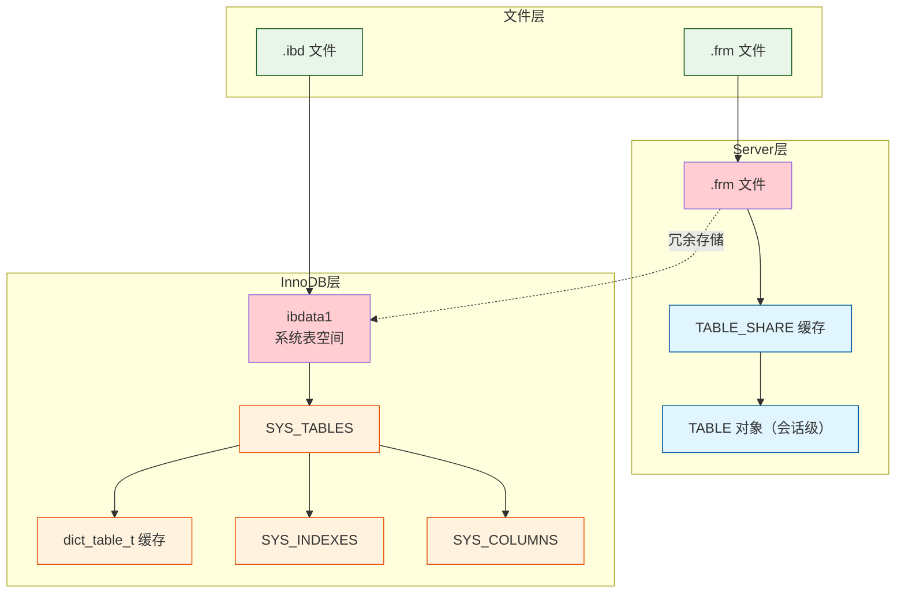
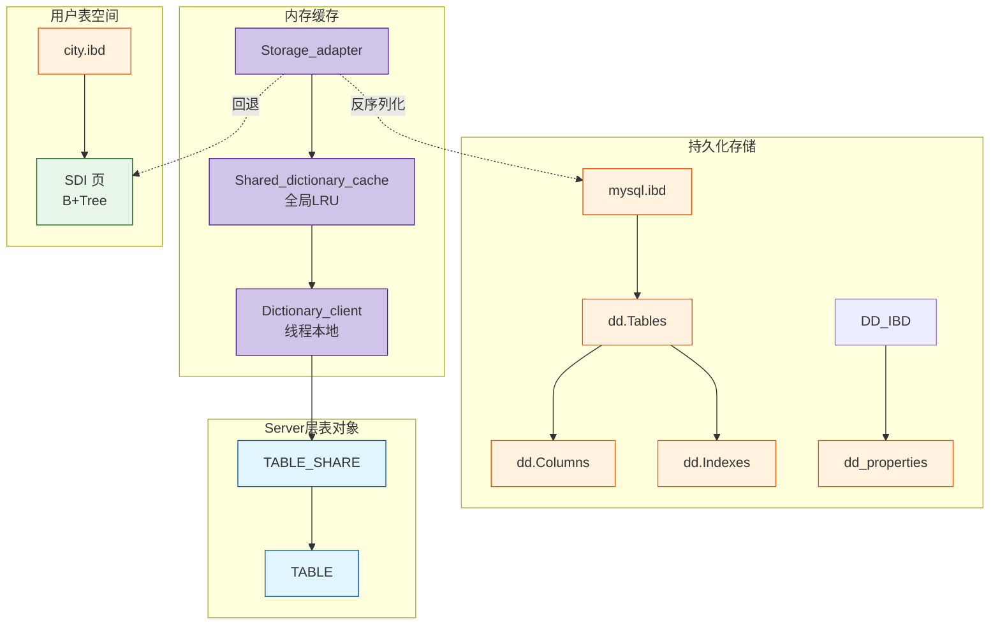
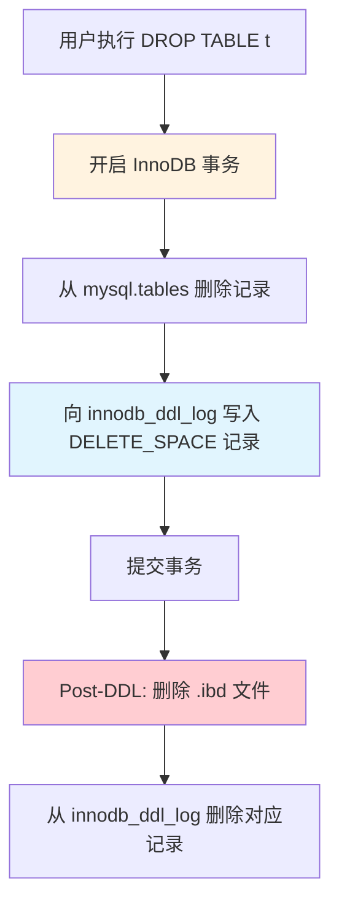
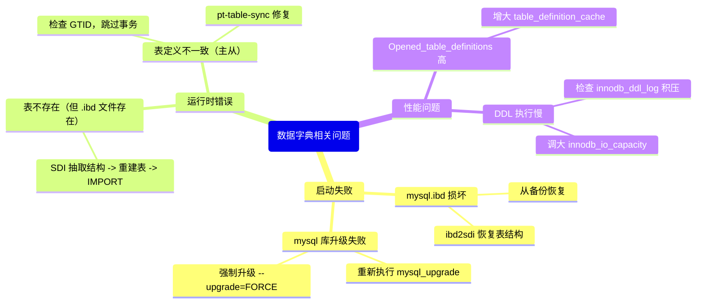

> **摘要**：  
> 数据字典（Data Dictionary）是数据库元数据的中心仓库——记录表、字段、索引、表空间等对象的定义信息。MySQL 5.7 及之前版本长期维持 **Server 层 .frm 文件**与 **InnoDB 系统表**并存的“双元”架构，导致 DDL 非原子、主从易不一致等问题。MySQL 8.0 彻底重构数据字典，将所有元数据统一存入 InnoDB 专用表空间 `mysql.ibd`，并引入 SDI（序列化字典信息）作为每表自包含的备份，最终实现原子 DDL。本文从 5.7 遗留架构的痛点出发，系统拆解 8.0 字典的存储引擎表布局、三层缓存结构（`Storage_adapter` / `Shared_dictionary_cache` / `Dictionary_client`），并深入 `dd::cache` 与 `dd::Table` 等核心对象的内存管理。生产实践部分提供字典缓存命中率监控、`mysql.ibd` 故障恢复流程及 SDI 提取工具的使用，最后讨论原子 DDL 的实现原理及其在 8.0 崩溃恢复中的保障机制。

---

## 一、核心概念与底层图景

### 1.1 定义
**数据字典**（Data Dictionary）是数据库系统用于存储**元数据**（metadata）的持久化存储及内存缓存机制。元数据包括：表名、列定义、索引信息、分区信息、表空间信息、用户权限等。

在 MySQL 中，数据字典承担两个核心职责：
- **持久化**：将元数据保存到磁盘，确保实例重启后表结构不丢失。
- **运行时访问**：为 SQL 解析、优化、执行阶段提供快速的结构定义查询。

### 1.2 架构全景对比

#### MySQL 5.7 双元架构


#### MySQL 8.0 统一字典架构


---

## 二、机制原理深度剖析

### 2.1 5.7 双元字典的设计与缺陷

| 组件 | 存储位置 | 访问方式 | 问题 |
|------|--------|--------|------|
| **Server 层字典** | `.frm` 文件（每个表独立） | 启动时扫描目录，缓存为 `TABLE_SHARE` | DDL 先写 .frm 再改引擎，非原子；.frm 与 ibd 易不一致 |
| **InnoDB 字典** | `ibdata1` 系统表空间，硬编码系统表 | InnoDB 内部 `dict_table_t` 缓存 | 表结构信息冗余，占用双倍内存 |

**典型故障**：  
`CREATE TABLE` 中途断电，.frm 已写入但 InnoDB 系统表未更新，重启后表无法打开，也无法 DROP，需手工删除 .frm 并清理 `SYS_TABLES` 记录——生产环境 DBA 的“噩梦”操作。

### 2.2 8.0 统一字典的核心组件

#### 2.2.1 存储引擎表（DD Tables）
8.0 在 `mysql.ibd` 中创建了约 20 张 InnoDB 表，用于持久化元数据。核心表包括：

| 表名 | 存储内容 | 对应 5.7 系统表 |
|------|--------|---------------|
| `tables` | 表定义 | `SYS_TABLES` |
| `columns` | 列定义 | `SYS_COLUMNS` |
| `indexes` | 索引定义 | `SYS_INDEXES` |
| `index_column_usage` | 索引包含的列 | `SYS_FIELDS` |
| `dd_properties` | 字典自身元数据（根页号、版本） | 硬编码字典头 |
| `tablespaces` | 表空间信息 | 无对应，新增 |
| `foreign_keys` | 外键约束 | `SYS_FOREIGN` |

**设计意图**：将字典从硬编码页迁移到标准 InnoDB 表，**所有 DDL 修改均在 InnoDB 事务中完成**，从而获得原子性和崩溃恢复能力。

#### 2.2.2 序列化字典信息（SDI）
- 每个用户表空间的第 4 页固定为 **SDI 索引页**（`FSP_SDI_PAGE_NO`）。
- SDI 以 B+Tree 存储，Key = `(table_id, version)`，Value = 压缩后的 JSON 格式表定义。
- **作用**：当 `mysql.ibd` 损坏或丢失时，可通过 `ibd2sdi` 工具从各 `.ibd` 文件中恢复表结构。

#### 2.2.3 三层字典缓存
| 缓存层 | 作用域 | 数据结构 | 淘汰策略 |
|--------|--------|--------|---------|
| **Storage_adapter** | 单例，负责从磁盘加载/持久化 | 函数调用接口，无状态 | — |
| **Shared_dictionary_cache** | 全局 | 分区 LRU，按对象类型分 Map | `table_definition_cache` 控制容量 |
| **Dictionary_client** | 每个 THD 独立 | `std::map` 缓存已获取的对象 | 线程结束时释放 |

**设计意图**：减少对 `mysql.ibd` 系统表的重复查询，将高频访问的元数据对象缓存在内存中。三层分离使缓存管理更模块化，且与 Server 层旧的 `TABLE_SHARE` 缓存解耦。

### 2.3 原子 DDL 的实现原理

原子 DDL 的核心是：**将 DDL 操作包在一个 InnoDB 事务中，对文件系统的物理修改通过 DDL Log 表实现可回滚**。

**关键表**：`mysql.innodb_ddl_log`（隐藏表）

**执行流程**（以 `DROP TABLE` 为例）：


若在步骤 E 后、步骤 F 前系统崩溃，重启恢复时 InnoDB 会：
1. 扫描 `innodb_ddl_log` 表，发现未完成的 `DELETE_SPACE` 记录。
2. 执行相应的文件删除操作。
3. 清理 DDL Log 记录。

**原子性保障**：元数据修改与 DDL Log 写入在同一事务，要么全部提交，要么全部回滚。物理文件操作在事务外执行，但可通过 Log 重做或回滚。

---

## 三、内核/源码级实现

### 3.1 核心数据结构：`dd::Table`（内存中的表定义对象）
位置：`sql/dd/impl/tables/table_impl.h`

```c
namespace dd {
class Table_impl : public Abstract_table_impl {
private:
    /* 表标识 */
    Object_id      m_id;                    // 表ID，全局唯一
    String_type    m_name;                 // 表名
    Object_id      m_schema_id;           // 所属库ID
    
    /* 引擎属性 */
    String_type    m_engine;              // 存储引擎名称
    ulonglong      m_se_private_id;      // InnoDB 表ID（dict_table_t->id）
    String_type    m_se_private_data;    // 引擎私有数据，如行格式
    
    /* 列定义 */
    std::vector<Column*> m_columns;       // 列对象指针数组
    
    /* 索引定义 */
    std::vector<Index*>  m_indexes;       // 索引对象指针数组
    
    /* 外键约束 */
    std::vector<ForeignKey*> m_foreign_keys;
    
    /* 分区信息 */
    Partition*     m_partition;           // NULL 表示非分区表
    
    /* 行格式选项 */
    ulonglong      m_row_format;          // Row_type 枚举
    ulonglong      m_collation_id;       // 默认字符集
    
    /* 并发控制 */
    mysql_mutex_t  m_mutex;              // 保护 m_columns/m_indexes 修改（DDL 时）
};
} // namespace dd
```

**字段注释**：  
- `m_se_private_id`：InnoDB 的 `table_id`，用于关联 `dict_table_t` 对象。  
- `m_columns` / `m_indexes`：使用 STL 容器，非线程安全，需外部加锁。实际运行时以读为主，DDL 时持有 MDL 排他锁，因此竞争不激烈。  
- `m_collation_id`：对应 `mysql.collations.id`，0 表示使用表默认字符集。

### 3.2 核心数据结构：`Shared_dictionary_cache::Map<T>`
位置：`sql/dd/impl/cache/shared_dictionary_cache.h`

```c
template <typename T>
class Shared_dictionary_cache::Map {
private:
    /* 主存储：哈希表，快速定位 */
    std::unordered_map<Key, Entry*, My_hash> m_map;
    
    /* LRU 链表：维护访问顺序 */
    std::list<Key> m_lru_list;
    
    /* 容量控制 */
    size_t m_capacity;                // 最大缓存条目数
    
    /* 分区锁（8.0.23+） */
    std::array<mysql_rwlock_t, 16> m_partition_locks;
    
    /* 统计信息 */
    std::atomic<size_t> m_gets;       // 总查询次数
    std::atomic<size_t> m_misses;     // 缓存未命中次数
};
```

**设计要点**：
- 每种对象类型（`dd::Table`、`dd::Schema`、`dd::Tablespace`）拥有独立的 `Map` 实例。
- `Key` 生成规则：对于表，Key = `(schema_name, table_name)` 或 `(table_id)`。
- 缓存淘汰：当 `m_map.size() > m_capacity` 时，从 `m_lru_list.back()` 移除最久未使用的条目。
- 8.0.23+ 引入分区锁，将哈希冲突和 LRU 更新的锁竞争降低约 40%（TPCC 测试）。

### 3.3 核心流程伪代码：打开表时的字典查找路径

```python
# sql/sql_base.cc - get_table_share()
def get_table_share(thd, db, table_name, ...):
    # 1. 尝试从 DD 缓存获取
    dd_table = thd->dd_client()->acquire(db, table_name)
    if not dd_table:
        # 2. 缓存未命中，从 mysql.ibd 加载
        dd_table = dd::cache::Storage_adapter::get(thd, db, table_name)
        if not dd_table:
            return error
        # 3. 存入当前会话的 Dictionary_client
        thd->dd_client()->cache(dd_table)
    
    # 4. 将 dd::Table 转换为 TABLE_SHARE
    share = alloc_TABLE_SHARE()
    fill_share_from_dd(share, dd_table)
    
    # 5. 存入全局表定义缓存
    tdc_insert(thd, share)
    return share
```

```python
# sql/dd/impl/cache/storage_adapter.cc
def Storage_adapter::get(thd, key):
    # 开启一个只读事务
    trx = dd::Transaction_ro(thd)
    # 查询 mysql.tables 表
    table = trx.get_table("tables")
    record = table.find_by_key(key)
    if not record:
        return None
    # 反序列化：读取 mysql.columns, mysql.indexes 等关联表
    obj = dd::create_object(record)
    obj->restore_children(&trx)
    return obj
```

**性能关键点**：`restore_children` 会发起多次查询（列、索引、外键等），对 `mysql.ibd` 的读 I/O 较重。因此**缓存命中率**是 DDL 和首次打开表的关键性能指标。

---

## 四、生产落地与 SRE 实战

### 4.1 场景化案例：mysql.ibd 损坏恢复

**现象**：  
服务器掉电后 MySQL 无法启动，错误日志显示 `mysql.ibd` 系统表空间校验和不一致。

**恢复策略**：
1. **利用 SDI 抽取表结构**：
   ```bash
   # 对所有用户表空间的 .ibd 文件执行
   ibd2sdi --dump-file=t1.txt ./world/t1.ibd
   ```
   从 JSON 输出中提取 `CREATE TABLE` 语句。

2. **重建空表**：
   ```sql
   CREATE DATABASE world;
   -- 粘贴从 SDI 获取的建表语句
   CREATE TABLE t1 ... ;
   ```

3. **丢弃表空间并导入数据**：
   ```sql
   ALTER TABLE t1 DISCARD TABLESPACE;
   -- 将原 .ibd 文件拷贝回数据目录
   ALTER TABLE t1 IMPORT TABLESPACE;
   ```

**前提**：`.ibd` 文件未被损坏（页校验一致）。若数据页损坏，需从备份恢复。

### 4.2 性能调优：字典缓存参数

| 参数 | 作用域 | 8.0 推荐值 | 内核解释 |
|------|--------|-----------|---------|
| `table_definition_cache` | 全局 | 2000～10000 | 控制 `TABLE_SHARE` 数量，也间接影响 `dd::Table` 的全局缓存容量 |
| `table_open_cache` | 全局 | 4000～8000 | 会话级 `TABLE` 对象缓存，与 DD 缓存无关，但争用 `LOCK_open` |
| `table_open_cache_instances` | 全局 | 16～64 | 分区表缓存，减少 `LOCK_open` 竞争 |
| `dd_cache_hit_rate` | 观测 | `performance_schema` | 8.0.23+ 提供 `memory_summary_global_by_event_name` 查看 DD 缓存命中率 |

**监控 DD 缓存命中率**：
```sql
-- 8.0.23+ 通过内存事件统计
SELECT EVENT_NAME, CURRENT_NUMBER_OF_BYTES_USED, SUM_NUMBER_OF_BYTES_ALLOC
FROM performance_schema.memory_summary_global_by_event_name
WHERE EVENT_NAME LIKE '%dd::cache%';

-- 间接监控：表定义缓存效率
SHOW GLOBAL STATUS LIKE 'Opened_table_definitions';
SHOW GLOBAL STATUS LIKE 'Open_table_definitions';
-- Opened_table_definitions 持续增长 => DD 缓存不足
```

### 4.3 故障排查决策树（Mermaid Mindmap）



### 4.4 实用 SQL：查看字典表（Debug 模式）

```sql
-- 8.0 禁止直接查询 mysql.tables，但可通过 debug 标记绕过（仅限测试环境）
SET SESSION debug='+d,skip_dd_table_access_check';
SELECT name, schema_id, se_private_id, hidden 
FROM mysql.tables 
WHERE name = 't1';
```

**注意**：该会话级开关在 8.0.30+ 需编译时启用调试，生产环境不可用。

---

## 五、技术演进与 2026 年视角

### 5.1 历史设计约束与改进

| 版本 | 字典变化 | 动因 |
|------|--------|------|
| 3.22 | 引入 `.frm` 文件 | MyISAM 无自描述能力，Server 层承担元数据管理 |
| 4.1 | InnoDB 系统表 `SYS_TABLES` 等 | InnoDB 作为插件需自己存储字典，开始双元并存 |
| 5.6 | 支持 `innodb_file_per_table`，但字典仍在 `ibdata1` | 分离用户数据，系统表仍集中 |
| 8.0 | 移除 `.frm`，统一为 InnoDB 字典 + SDI | 实现原子 DDL，解决长期遗留问题 |
| 8.0.19 | SDI 默认开启，`ibd2sdi` 工具正式发布 | 提供灾难恢复能力 |
| 8.0.23 | DD 缓存分区锁，优化高并发打开表 | 减少 `Shared_dictionary_cache` 锁竞争 |

### 5.2 2026 年仍存在的“遗留设计”

1. **DD 缓存容量依赖 `table_definition_cache`**  
   `table_definition_cache` 原本用于 Server 层 `TABLE_SHARE` 缓存，8.0 中同时约束了 `dd::Table` 的全局缓存数量。两者内存模型不同，共享同一参数易导致误判。  
   **现状**：Percona Server 已提供独立参数 `dd_table_definition_cache`，但社区版尚未合并。

2. **SDI 冗余存储开销**  
   每个 `.ibd` 文件都存储一份完整的表定义 JSON（压缩后通常 1~4KB），百万表实例将占用数 GB 额外空间。  
   **现状**：可接受，因为 SSD 成本已极低，且灾难恢复收益远大于存储开销。

3. **DDL Log 表仍在系统表空间**  
   `innodb_ddl_log` 存储在 `mysql.ibd` 中，与系统数据混存。极端情况下 DDL 并发过高可能导致 `mysql.ibd` 增长膨胀，且无法独立收缩。  
   **未来**：9.0 实验性支持将 DDL Log 移到独立表空间。

4. **字典升级（`mysql_upgrade`）仍需停机**  
   虽然 8.0.16+ 支持了 `ALTER TABLE ... FORCE` 在线升级字典，但跨大版本升级仍需要重启服务。  
   **云厂商方案**：逻辑备份恢复，或通过 Clone Plugin 滚动升级。

### 5.3 未来趋势

- **字典完全解耦存储**：未来可能将 `mysql.ibd` 拆分为多个系统表空间，按字典对象类型分离，减少单表空间锁竞争。
- **SDI 与数据分离**：对于超大实例（数万表），可将 SDI 独立存储于共享表空间，避免每个 `.ibd` 文件都占用额外 4 个页的固定开销。
- **在线字典升级（ODU）**：MySQL 9.0 已规划在线升级数据字典格式，无需重启或运行 `mysql_upgrade`。
- **云原生字典服务**：AWS Aurora、阿里云 PolarDB 等已将字典下沉至存储节点，计算节点无状态，字典变更由存储层多版本管理——传统 MySQL 的单机字典架构在未来分布式形态中将被彻底重构。

---

## 参考文献
- MySQL Internals Manual – Data Dictionary
- `sql/dd/` 目录源码，MySQL 8.0.33
- Oracle Blogs: “MySQL 8.0: Data Dictionary Architecture and Design” (2016)
- MySQL 8.0 原子 DDL 官方文档
- Percona Live 2025: “Ten Years of .frm: Why Removing It Took So Long”