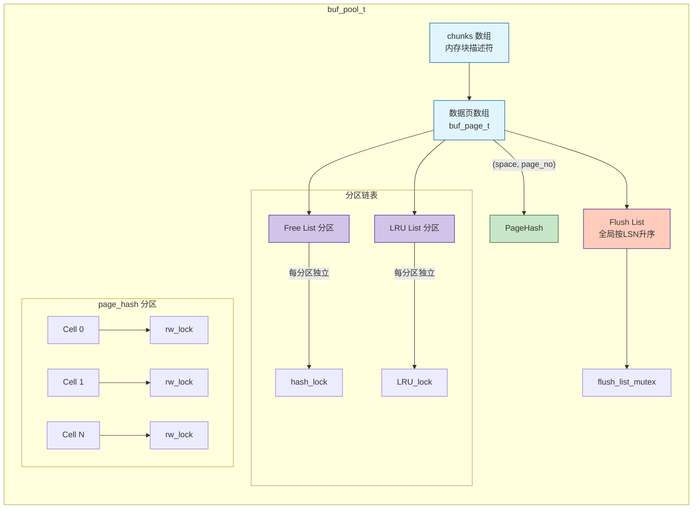
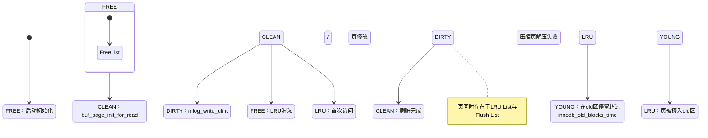
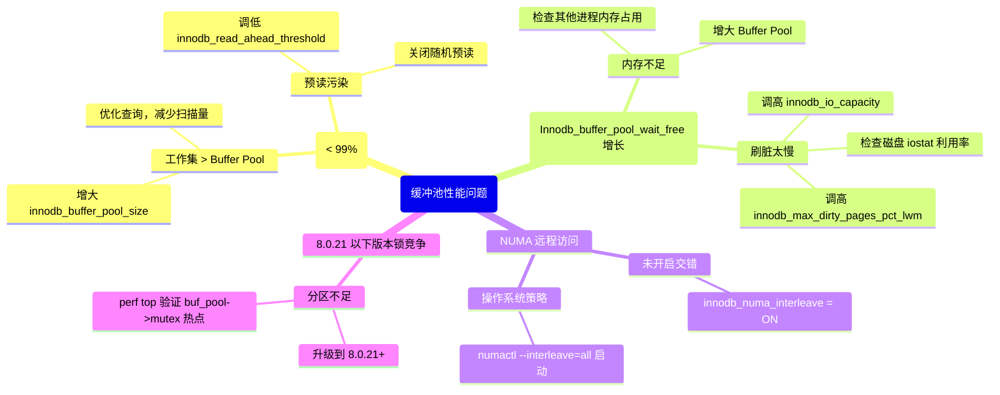

> **摘要**：  
> 缓冲池（Buffer Pool）是 InnoDB 性能的绝对核心——所有数据页的读、写、缓存、淘汰均发生于此。其设计围绕**三种链表**（Free List、LRU List、Flush List）及**页哈希表**（Page Hash）展开，通过预读、双生代 LRU、响应刷脏等机制，在内存与磁盘之间架设高速通道。然而，这套架构在长达二十年的演进中背负了沉重的并发债务：**全局互斥锁 `buf_pool->mutex`** 曾是高并发下最尖锐的瓶颈。8.0.21 版本的分区改造将页哈希表与自由链表拆分为多分区，使只读场景吞吐提升近三倍。本文从 `buf0buf.cc` 出发，完整拆解缓冲池的内存布局、页面状态流转、淘汰算法及 8.0.21 分区实现的源码细节；提供 NUMA 环境下的内存分配陷阱与 `innodb_numa_interleave` 实测收益；最后基于 2026 年的硬件背景，讨论 PMEM 与 io_uring 对缓冲池架构的根本性冲击。

---

## 一、核心概念与底层图景

### 1.1 定义
**缓冲池**是 InnoDB 在内存中划出的一片连续区域，以**页**（Page，默认 16KB）为单位缓存磁盘数据。所有对数据页的访问（读或写）都必须经过缓冲池，写操作修改内存页后将其标记为脏页，由后台线程刷入磁盘。

**设计哲学**：
- **空间换时间**：利用内存高带宽、低延迟特性，掩盖磁盘 I/O 延迟。
- **局部性利用**：通过 LRU 算法保留高频访问页，通过预读机制提前加载相邻页。
- **日志先行（WAL）**：脏页刷盘前必须确保对应 Redo Log 已落盘。

### 1.2 架构全景（8.0 分区设计）



**核心组件**：
| 组件 | 作用 | 并发控制（8.0.21+） |
|------|------|---------------------|
| **Chunk** | 缓冲池物理内存划分单元（默认128MB） | 无锁，初始化时分配 |
| **Free List** | 空闲页链表，供用户线程分配 | 分区独立，每分区 `hash_lock` |
| **LRU List** | 已使用页链表，分新生代/老生代 | 分区独立，每分区 `LRU_lock` |
| **Flush List** | 脏页链表，按 `oldest_modification` LSN 排序 | 全局 `flush_list_mutex` |
| **Page Hash** | 哈希表，Key = (space_id, page_no) → buf_page_t* | 分区独立，每分区 `rw_lock` |

---

## 二、机制原理深度剖析

### 2.1 缓冲页状态流转



**状态定义**：
- **FREE**：页完全空闲，位于 Free List。
- **CLEAN**：页内容有效且与磁盘一致，位于 LRU List。
- **DIRTY**：页内容已被修改，位于 LRU List 与 Flush List。
- **YOUNG**：LRU 新生代区（占 5/8），表示高频访问页。
- **OLD**：LRU 老生代区（占 3/8），新读入页的首站。

### 2.2 双生代 LRU 算法

**设计动机**：防止全表扫描污染缓存——扫描页仅在老生代停留一次即被淘汰，不挤占高频访问页的生存空间。

**参数控制**：
- `innodb_old_blocks_pct`：老生代占 LRU 链表长度的百分比（默认 37）。
- `innodb_old_blocks_time`：页在老生代停留至少多少毫秒（默认 1000）才有资格晋升新生代。

**晋升条件**：
1. 页当前位于 LRU 老生代。
2. 页两次访问间隔 ≤ `innodb_old_blocks_time`。
3. 满足条件则将该页移动到新生代头部。

**淘汰策略**：
- 从 LRU 链表尾部（老生代末尾）开始扫描。
- 仅淘汰 CLEAN 页；若遇到 DIRTY 页，跳过继续扫描后续页。
- 若扫描深度（`innodb_lru_scan_depth`，默认 1024）仍无法找到足够空闲页，则触发用户线程同步刷脏。

### 2.3 预读机制

**线性预读**（Linear Read-Ahead）：
- 触发条件：顺序访问一个区（extent）的页数达到 `innodb_read_ahead_threshold`（默认 56）。
- 行为：异步发起该区剩余页的读请求。
- 8.0 改进：预读页不立即加入 LRU 新生代，而是插入老生代头部，避免误判污染缓存。

**随机预读**（Random Read-Ahead）：
- 触发条件：同一区连续被访问的页数超过 `innodb_random_read_ahead`（默认 OFF）。
- 8.0.26+ 已废弃，不建议开启——SSD 时代收益甚微。

---

## 三、内核/源码级实现

### 3.1 核心数据结构：`buf_pool_t`（缓冲池实例）
位置：`storage/innobase/include/buf0buf.h`

```c
struct buf_pool_t {
    /* 标识与容量 */
    ulint               instance_no;       // 实例编号 0..n-1
    ulint               curr_size;        // 当前页数量（实际分配）
    ulint               old_size;         // 变更前大小，用于 resize
    
    /* 内存块管理 */
    buf_chunk_t        *chunks;           // chunk 数组
    ulint               n_chunks;         // chunk 数量
    
    /* ========= 8.0.21 分区设计 ========= */
    
    /* 页哈希表（分区） */
    buf_page_hash_cell_t *hash_cells;     // 哈希单元数组
    ulint                 n_hash_cells;   // 单元数（实例大小/页大小 * 2）
    mysql_rwlock_t      *hash_lock;       // 分区锁数组
    
    /* 自由链表（分区） */
    buf_freelist_t      *freelist;        // 分区数组，长度 FREELIST_PARTITIONS
    mysql_mutex_t       *free_list_mutex; // 每分区互斥锁
    
    /* LRU 链表（分区） */
    buf_LRU_list_t      *LRU;             // 分区数组，长度 LRU_PARTITIONS
    mysql_mutex_t       *LRU_list_mutex;  // 每分区互斥锁
    
    /* Flush 链表（全局） */
    UT_LIST_BASE_NODE_T(buf_page_t) flush_list;
    mysql_mutex_t        flush_list_mutex;
    
    /* 统计信息（原子操作） */
    std::atomic<ulint>  stat_n_pages_created;
    std::atomic<ulint>  stat_n_pages_read;
    std::atomic<ulint>  stat_n_pages_written;
    
    /* NUMA 亲和性 */
    bool                numa_interleaved; // 是否已设置 MPOL_INTERLEAVE
};
```

**分区设计要点**：
- `FREELIST_PARTITIONS = 32`（8.0.21+），`LRU_PARTITIONS = 32`，硬编码。
- 页路由规则：`(space_id + page_no) % n_partitions`。
- 哈希表单元数 = 缓冲池页数 × 2，保证负载因子 ≤ 0.5。

### 3.2 核心数据结构：`buf_page_t`（缓冲页描述符）
位置：`storage/innobase/include/buf0buf.ic`

```c
struct buf_page_t {
    /* 页标识 */
    space_id_t      space;          // 表空间ID
    page_no_t       page_no;        // 页号
    uint32_t        io_fix;         // I/O 状态（BUF_IO_READ / BUF_IO_WRITE / BUF_IO_NONE）
    
    /* LSN 相关 */
    lsn_t           newest_modification; // 该页最新修改的 LSN（脏页加入 Flush List）
    lsn_t           oldest_modification; // 该页最早未刷新的 LSN（用于 Flush List 排序）
    
    /* 状态标志位（位域压缩） */
    uint32_t        in_flush_list   : 1; // 是否在 Flush List
    uint32_t        in_free_list    : 1; // 是否在 Free List
    uint32_t        in_LRU_list     : 1; // 是否在 LRU List
    uint32_t        filed_was_fetched : 1; // 是否已从磁盘读取
    uint32_t        accessed        : 1; // 是否被访问过（LRU 晋升用）
    
    /* 哈希链表节点 */
    buf_page_t      *hash;          // 哈希冲突链
    
    /* LRU/Free/Flush 链表节点 */
    UT_LIST_NODE_T(buf_page_t) list;
    
    /* 页帧指针（实际数据） */
    byte            *frame;         // 指向 16KB 对齐内存
};
```

**关键设计**：
- `newest_modification` 与 `oldest_modification` 均为 0 表示页是干净的。
- `io_fix` 在异步 I/O 期间置位，防止页被淘汰或重复读取。
- `frame` 指针与 `buf_page_t` 分离，使描述符可被独立管理，压缩页解压后动态分配新 frame。

### 3.3 核心流程伪代码：用户线程读页路径

```c
// storage/innobase/buf/buf0buf.cc
buf_page_t *buf_page_get_gen(space_id, page_no, rw_latch, mtr) {
    // 1. 计算分区索引
    ulint hash_part = page_hash_calc_part(space_id, page_no);
    ulint lru_part  = lru_calc_part(space_id, page_no);
    
    // 2. 读锁哈希分区，查找页
    rw_lock_s_lock(hash_lock[hash_part]);
    bpage = buf_page_hash_get_low(space_id, page_no, hash_part);
    rw_lock_s_unlock(hash_lock[hash_part]);
    
    if (bpage) {
        // 3. 页已在缓冲池：LRU 晋升逻辑
        if (bpage->in_LRU_list && !bpage->freed_by_io) {
            buf_LRU_make_block_young(bpage, lru_part);
        }
        return bpage;
    }
    
    // 4. 页不在缓冲池：分配空闲页
    buf_page_t *block = buf_LRU_get_free_block(lru_part);
    
    // 5. 初始化页描述符，加入哈希表（写锁）
    rw_lock_x_lock(hash_lock[hash_part]);
    buf_page_hash_insert(space_id, page_no, block, hash_part);
    rw_lock_x_unlock(hash_lock[hash_part]);
    
    // 6. 发起同步/异步读请求
    buf_read_page(space_id, page_no, block);
    
    return block;
}
```

**并发关键**：  
- 查找路径仅持有**哈希分区读锁**，不同分区的查找完全并行。  
- 分配空闲页需获取**对应 LRU 分区的互斥锁**，若该分区 Free List 不足，需从其他分区“借页”（`buf_LRU_scan_and_free_block`），此时会持有目标分区的 LRU 锁。

### 3.4 核心流程伪代码：刷脏路径

```c
// storage/innobase/buf/buf0flu.cc
void buf_flush_write_block_low(buf_page_t *bpage) {
    // 1. WAL 保证：刷盘前确保该页所有 redo 已落盘
    if (bpage->newest_modification > log_sys->flushed_to_disk_lsn) {
        log_write_up_to(bpage->newest_modification, true);
    }
    
    // 2. 设置 I/O 状态
    bpage->io_fix = BUF_IO_WRITE;
    
    // 3. 发起异步 I/O
    dberr_t err = os_file_write(IORequestWrite, bpage->space,
                                bpage->frame, bpage->page_no);
    
    // 4. 8.0 使用 Linux Native AIO 或 io_uring，回调函数处理完成事件
    // AIO 完成时调用 buf_page_io_complete()
}

void buf_page_io_complete(buf_page_t *bpage) {
    // 1. 清除 I/O 状态
    bpage->io_fix = BUF_IO_NONE;
    
    if (bpage->oldest_modification != 0) {
        // 2. 从 Flush List 移除
        mutex_enter(&buf_pool->flush_list_mutex);
        UT_LIST_REMOVE(buf_pool->flush_list, bpage);
        bpage->oldest_modification = 0;
        mutex_exit(&buf_pool->flush_list_mutex);
    }
    
    // 3. 页变为干净，可被 LRU 淘汰
}
```

---

## 四、生产落地与 SRE 实战

### 4.1 场景化案例：NUMA 架构下的内存分配陷阱

**环境**：双路 Intel Xeon Gold 6330，56核 × 2，512GB 内存，MySQL 8.0.32，`innodb_buffer_pool_size = 300GB`。

**现象**：  
- 业务负载波动时，CPU 使用率仅 30%，但 TPS 增长停滞。  
- `perf top` 显示大量 `__memset_avx2_erms` 和 `buf_page_init_for_read` 调用。  
- `numastat -p mysqld` 显示 80% 内存分配在 Node 0，Node 1 仅 20%。

**根本原因**：  
- MySQL 启动时主线程运行在 Node 0，`malloc()` 分配缓冲池内存时默认绑定在当前 NUMA 节点。  
- 工作线程分散在双节点，访问远程内存（Node 0）需跨 QPI 链路，延迟增加 30%~50%。  
- 页初始化时的 `memset` 操作同样集中在 Node 0，造成该节点内存带宽瓶颈。

**解决方案**：
```ini
[mysqld]
# 8.0.16+ 参数，启用内存交错分配
innodb_numa_interleave = ON
```

**验证**：
```bash
# 重启前
numastat -p `pidof mysqld` | grep -E "Node 0|Node 1"

# 重启后（需编译时 WITH_NUMA=ON）
numactl --hardware
# 确认 MySQL 内存分布均匀
```

**实测收益**：  
- 单节点 300GB 内存 → 双节点各 150GB 交错。  
- TPS 提升 25% ~ 35%，远程内存访问比例从 80% 降至 5% 以内。

### 4.2 参数调优矩阵

| 参数 | 作用域 | 8.0 推荐值 | 内核解释 |
|------|--------|-----------|---------|
| `innodb_buffer_pool_size` | 全局 | 物理内存 60%~80% | 留出足够内存给 OS Page Cache 和连接线程 |
| `innodb_buffer_pool_instances` | 全局 | min(8, CPU核数/2) | 8.0 仍需设置，减少 Flush List 等全局资源争用 |
| `innodb_buffer_pool_chunk_size` | 全局 | 128MB（不可变） | 缓冲池扩容/缩容的最小单位，生产环境不要修改 |
| `innodb_old_blocks_pct` | 全局 | 37 | 老生代比例，全表扫描严重时需适当调高 |
| `innodb_old_blocks_time` | 全局 | 1000 (ms) | 防扫描污染，报表类查询频繁时可降至 500 |
| `innodb_lru_scan_depth` | 全局 | 1024 | 每轮 LRU 淘汰扫描深度，SSD 可适当调低 |
| `innodb_io_capacity` | 全局 | 2000~10000（SSD） | 后台刷脏 I/O 上限，与磁盘性能匹配 |
| `innodb_flush_neighbors` | 全局 | 0（SSD） | 机械硬盘时代优化，SSD 无收益且增加延迟 |
| `innodb_numa_interleave` | 全局 | ON | 8.0.16+ 必须开启（若编译时启用 NUMA） |
| `innodb_adaptive_flushing` | 全局 | ON | 动态调整刷脏速率，防 I/O 尖刺 |
| `innodb_adaptive_flushing_lwm` | 全局 | 10 | 脏页比例低于 10% 时降低刷脏强度 |

### 4.3 监控与诊断

**1. 命中率监控（核心）**
```sql
SHOW ENGINE INNODB STATUS\G
-- 搜索 BUFFER POOL AND MEMORY 段
Buffer pool hit rate 995 / 1000
-- 每 1000 次页访问有 5 次磁盘读，命中率 99.5% 为健康

-- 精确统计
SELECT 
    (1 - (Innodb_buffer_pool_reads / Innodb_buffer_pool_read_requests)) * 100 
    AS hit_rate
FROM performance_schema.global_status
WHERE variable_name IN ('Innodb_buffer_pool_reads', 'Innodb_buffer_pool_read_requests');
```

**2. 脏页积压监控**
```sql
SHOW GLOBAL STATUS LIKE 'Innodb_buffer_pool_pages_dirty';
SHOW GLOBAL STATUS LIKE 'Innodb_buffer_pool_pages_total';
-- 脏页比例 = 脏页 / 总页数，持续 > 20% 说明刷脏能力不足

-- 查看检查点年龄
SHOW ENGINE INNODB STATUS\G
-- LOG 段中
Log sequence number  (LSN)
Log flushed up to    (LSN)
Last checkpoint at   (LSN)
-- checkpoint_age = sequence - checkpoint，若接近日志总容量，需加速刷脏或增加日志大小
```

**3. LRU 淘汰压力**
```sql
SHOW GLOBAL STATUS LIKE 'Innodb_buffer_pool_wait_free';
-- 若该值持续增长，表示用户线程频繁等待空闲页，缓冲池过小或刷脏太慢
```

**4. 8.0 精确等待事件**
```sql
SELECT * FROM performance_schema.wait_events_global_summary_by_instance
WHERE EVENT_NAME LIKE 'wait/io/innodb/buf_flush%'
   OR EVENT_NAME LIKE 'wait/synch/mutex/innodb/buf%';
```

### 4.4 故障排查决策树



---

## 五、技术演进与 2026 年视角

### 5.1 历史设计约束与改进

| 版本 | 缓冲池变化 | 动因 |
|------|----------|------|
| 4.0 | 引入 Buffer Pool，单实例全局锁 | InnoDB 首次集成 |
| 5.5 | 支持 `innodb_buffer_pool_instances` | 减少锁竞争，实例级拆分 |
| 5.6 | 引入 `innodb_old_blocks_time` | 防全表扫描污染缓存 |
| 5.7 | 支持在线调整 Buffer Pool 大小 | 弹性伸缩，无需重启 |
| **8.0.21** | **Page Hash & LRU/Free List 分区** | **解决实例内锁竞争，只读场景提升 3 倍** |
| 8.0.25 | `innodb_numa_interleave` 默认 ON（编译启用的版本） | 适配现代 NUMA 架构 |
| 8.0.34+ | 实验性支持 io_uring | 降低异步 I/O 系统调用开销 |

### 5.2 2026 年仍存在的“遗留设计”

1. **Flush List 仍为全局结构**  
   8.0.21 分区改造未触及 Flush List，脏页链表仍受单一 `flush_list_mutex` 保护。高并发写入场景下，`buf_flush_write_block_low` 和 `buf_page_io_complete` 的锁竞争依然显著。  
   **现状**：Percona Server 已实现分区 Flush List，社区版尚未合并。

2. **LRU 淘汰线性扫描**  
   即使分区化，`buf_LRU_scan_and_free_block` 仍需遍历本分区的 LRU 尾部。在缓冲池接近饱和时，每次分配页都可能扫描 `innodb_lru_scan_depth`（默认 1024）个页。  
   **代价**：CPU 开销与内存容量正相关，万亿级页表实例扫描成本不可忽视。

3. **预读误判无法撤销**  
   线性预读一旦触发，已发出的异步读请求无法取消。即使后续访问模式改变，这些页仍会被读入内存、插入 LRU 老生代，造成资源浪费。  
   **业界方案**：RocksDB 等 LSM 引擎采用分层缓存，可动态调整预读窗口；InnoDB 暂未跟进。

4. **压缩表与 unzip_LRU 耦合**  
   压缩表（ROW_FORMAT=COMPRESSED）的解压页存放在独立的 `unzip_LRU` 链表，与主 LRU 协同淘汰，逻辑复杂且易引发内存碎片。  
   **趋势**：8.0 已不推荐压缩表，改用透明页压缩（Transparent Page Compression），后者不占用 Buffer Pool 内存。

### 5.3 未来趋势

- **持久内存（PMEM）的挑战**  
  Intel Optane 虽已停产，但 CXL 内存扩展设备正逐步普及。PMEM 可字节寻址、持久化，延迟接近 DRAM（约 300ns）。  
  若将数据文件直接 mmap 到 PMEM 上，**InnoDB 的缓冲池可能不再是必须品**——页可以直接在 PMEM 上读写，仅需日志保证一致性。  
  **现状**：8.0.28+ 已添加 `innodb_pmem_file` 实验参数，生产级应用尚需时日。

- **io_uring 替代 libaio**  
  8.0.34 引入 io_uring 支持，相比 libaio：
  - 系统调用从 2 次（`io_submit` + `io_getevents`）减至 1 次（`io_uring_enter` 批处理）。
  - 支持缓冲区和文件描述符注册，减少内存拷贝。
  - **预计 8.0.40+ 将成为默认异步 I/O 接口**。

- **基于 BPF 的冷热页自动识别**  
  Facebook MySQL 分支已实验性引入内核 BPF 辅助的页访问频率统计，替代 LRU 被动晋升机制。  
  通过内核直接采集缺页中断和访问位，更精准地将热页保留在内存，冷页提前淘汰。  
  此技术若进入主线，将是对 LRU 算法的根本性重构。

---

## 参考文献
- `storage/innobase/buf/buf0buf.cc`, `buf0lru.cc`, `buf0flu.cc` MySQL 8.0.33 源码
- MySQL Internals Manual – InnoDB Buffer Pool
- Oracle Blogs: “MySQL 8.0.21: InnoDB Buffer Pool Partitioning” (2020)
- Percona Live 2024: “NUMA and MySQL: Still a Performance Trap?”
- Linux Kernel Documentation: `io_uring.txt` (5.1+)