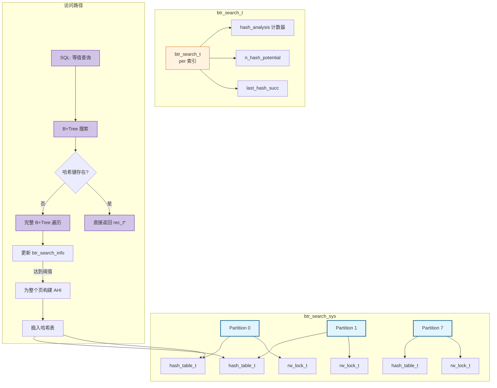
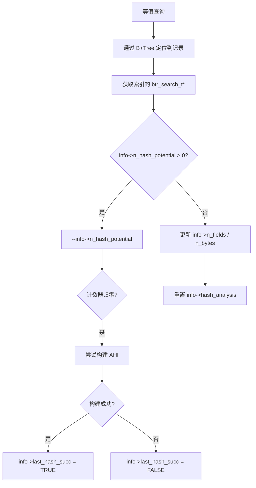
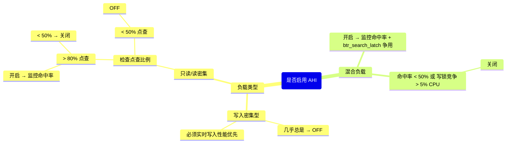

> **摘要**：  
> 自适应哈希索引（Adaptive Hash Index，AHI）是 InnoDB 最具“自适应”色彩的优化特性——它通过监控 B+Tree 的访问模式，自动为高频查询构建哈希索引，将单行点查的复杂度从 O(log n) 降为 O(1)。然而，这一设计在诞生近二十年后依然未能成为生产环境的默认利器：全局 `btr_search_latch` 锁竞争、保守的构建策略、崩溃后需重新预热等问题，使其在高并发写负载下经常“帮倒忙”。本文从 `btr0sea.cc` 源码出发，系统拆解 AHI 的监控反馈回路、哈希表分区结构、索引项的添加与淘汰机制，并通过性能测试数据揭示其适用边界。生产实践部分提供 AHI 命中率监控方法及开关决策树。最后基于 2026 年视角，讨论持久化哈希索引对 AHI 的替代趋势，以及为何 MySQL 官方始终未将 AHI 彻底重构。

---

## 一、核心概念与底层图景

### 1.1 定义
**自适应哈希索引**是 InnoDB 在内存中维护的一个**全局哈希表**，其键由索引键值通过哈希函数生成，值指向对应聚簇索引或二级索引的记录指针。AHI 的构建完全由 InnoDB 根据运行时访问模式自动触发，无需用户干预。

**设计哲学**：
- **被动适应**：不预判热数据，仅对**已通过 B+Tree 访问达到阈值**的页构建哈希索引。
- **内存效率**：哈希表大小动态扩展，但受 `innodb_adaptive_hash_index_parts` 硬分区限制。
- **无持久化**：AHI 纯内存结构，实例重启后需重新“学习”。

### 1.2 架构全景



### 1.3 核心组件拆解

| 组件 | 职责 | 设计意图 |
|------|------|---------|
| **btr_search_sys** | 全局哈希表管理器 | 8 分区读写锁，控制并发访问 |
| **btr_search_t** | 每个索引的访问模式监控器 | 记录查询列数、前缀匹配长度、命中频次 |
| **hash_table_t** | 哈希表实例 | 链地址法解决冲突，cell 数组动态扩容 |
| **AHI 条目** | 哈希映射 (key → rec_t*) | key = index_id + n_fields + n_bytes + 键值 |

---

## 二、机制原理深度剖析

### 2.1 监控反馈回路

AHI 的构建不是基于**页的访问频率**，而是基于**查询模式的稳定性**。

**关键阈值（硬编码）**：
```c
/* btr0sea.h */
#define BTR_SEARCH_HASH_ANALYSIS   17  /* 监控采样次数 */
#define BTR_SEARCH_BUILD_LIMIT     100  /* 构建阈值计数器 */
```

**工作流程**：



**核心逻辑**（简化自 `btr0sea.cc`）：
```c
void btr_search_info_update(btr_search_t *info, btr_cur_t *cursor) {
    /* 如果当前索引已有潜在构建计数，则消耗一个点 */
    if (info->n_hash_potential > 0) {
        info->n_hash_potential--;
        
        /* 消耗完 100 次后，尝试构建哈希 */
        if (info->n_hash_potential == 0) {
            btr_search_build_page_hash(info, cursor);
            return;
        }
    }
    
    /* 否则更新访问模式信息（匹配列数/前缀长度） */
    btr_search_info_update_slow(info, cursor);
}
```

**设计意图**：  
- `n_hash_potential` 初始为 `BTR_SEARCH_BUILD_LIMIT = 100`，每次查询命中该索引且通过 B+Tree 定位（未使用 AHI）时减 1。  
- 减到 0 才触发构建——意味着**同一个索引、同一种查询模式、访问任意页**累计 100 次后才会建哈希。  
- **意图**：只对真正高频且稳定的查询模式构建 AHI，避免为偶发查询浪费内存。

**现实问题**：  
- 若表数据量极大，查询均匀分布在不同页，单个页永远达不到构建阈值。  
- 实例重启后所有计数器归零，需重新“学习”，预热期 AHI 完全无效。

### 2.2 哈希表分区与锁设计

8.0 中 AHI 哈希表固定分为 8 个分区（`BTR_SEARCH_HASH_PARTITIONS`），每个分区独立读写锁。

```c
/* btr0sea.h */
#define BTR_SEARCH_HASH_PARTITIONS  8

struct btr_search_sys_t {
    ib_mutex_t    mutex;        /* 保护部分全局变量，非哈希表 */
    hash_table_t  *hash_index[BTR_SEARCH_HASH_PARTITIONS];
    rw_lock_t     latch[BTR_SEARCH_HASH_PARTITIONS];  /* 分区读写锁 */
};
```

**路由规则**：
```c
ulint fold = rec_fold(rec);  /* 折叠值，基于索引ID和键值计算 */
ulint part_no = fold % BTR_SEARCH_HASH_PARTITIONS;
```

**并发访问**：
- **查询**：`rw_lock_s_lock(part_no)` → 哈希查找 → `rw_lock_s_unlock(part_no)`
- **插入/删除**：`rw_lock_x_lock(part_no)` → 修改哈希表 → `rw_lock_x_unlock(part_no)`

**设计意图**：  
- 8 分区在 2005 年是先进的并发设计，当时主流服务器为 4～8 核。  
- 读写锁允许多个查询并发访问同一分区，只有插入/删除时需要排他锁。

**现实问题**：  
- 8 分区在 2026 年 128 核服务器上严重不足，热点分区争用不可避免。  
- **致命伤**：**每次 DML 修改二级索引记录，都需要尝试删除该记录可能存在的 AHI 条目**。  
  这意味着即使 AHI 从未被命中，只要表有更新，就会去持有 X 锁、遍历哈希表尝试删除——**纯开销，无收益**。

### 2.3 AHI 条目删除机制

当二级索引记录被修改或删除时，InnoDB 调用 `btr_search_update_hash_on_delete` 尝试删除对应的 AHI 条目。

```c
/* btr0sea.cc */
void btr_search_update_hash_on_delete(btr_cur_t *cursor) {
    if (!btr_search_enabled)   /* 全局开关 */
        return;
    
    rec_t *rec = btr_cur_get_rec(cursor);
    dict_index_t *index = cursor->index;
    
    /* 计算该记录的哈希折叠值 */
    ulint fold = rec_fold(rec);
    ulint part_no = fold % BTR_SEARCH_HASH_PARTITIONS;
    
    /* 加分区写锁 */
    rw_lock_x_lock(&btr_search_sys->latch[part_no]);
    
    /* 查找并删除哈希条目 */
    hash_table_t *hash = btr_search_sys->hash_index[part_no];
    btr_search_hash_delete(hash, fold, rec);
    
    rw_lock_x_unlock(&btr_search_sys->latch[part_no]);
}
```

**问题规模**：  
- 每条二级索引记录的 INSERT、DELETE、UPDATE（旧记录删除）均触发此流程。  
- 高并发写入场景下，**8 个分区写锁竞争极其激烈**，`perf top` 中 `btr_search_latch` 常与 `buf_pool->mutex` 并列前三。

---

## 三、内核/源码级实现

### 3.1 核心数据结构：`btr_search_t`（索引访问监控）
位置：`storage/innobase/include/btr0sea.h`

```c
struct btr_search_t {
    /* 访问模式描述 */
    ulint       n_fields;       /* 匹配的完整列数（如 1 表示 WHERE a=5） */
    ulint       n_bytes;        /* 最后一列匹配的前缀字节数（列部分匹配时） */
    
    /* 统计计数器 */
    ib_uint64_t hash_analysis;   /* 已监控的查询次数（调试用） */
    ib_uint64_t n_hash_potential; /* 剩余多少次监控后触发构建 */
    
    /* 最近构建状态 */
    ibool       last_hash_succ; /* 上次构建是否成功 */
    
    /* 索引标识 */
    dict_index_t *index;        /* 指向所属索引 */
    
    /* 链表节点（用于清理） */
    UT_LIST_NODE_T(btr_search_t) search_list;
};
```

**字段注释**：
- `n_fields` / `n_bytes`：描述查询条件的精确度。  
  例如 `WHERE a = 5 AND b LIKE 'abc%'`，若索引为 (a, b)，则 `n_fields = 1`，`n_bytes = 3`。  
  构建 AHI 时以此确定哈希键的前缀长度。
- `n_hash_potential`：初始值 100，每次通过 B+Tree 定位且未命中 AHI 时减 1，归零时构建。
- `last_hash_succ`：构建失败（如内存不足）时置 FALSE，下次监控会提前。

### 3.2 核心数据结构：`hash_table_t`（哈希表）
位置：`storage/innobase/include/hash0hash.h`

```c
struct hash_table_t {
    /* 哈希桶数组 */
    hash_cell_t *cells;         /* 指向单元格数组 */
    ulint       n_cells;       /* 当前单元格数量（2的幂） */
    
    /* 自适应哈希专用 */
    ibool       adaptive;      /* TRUE 表示用于 AHI */
    
    /* 堆内存管理 */
    mem_heap_t *heap;          /* 存放哈希键值对的内存堆 */
    
    /* 并发控制（外部锁，不内嵌）—— AHI 由分区锁保护 */
    
    /* 统计信息 */
    ulint       n_recs;        /* 当前条目数 */
};
```

**哈希冲突解决**：链地址法。`hash_cell_t` 指向链表头节点。

### 3.3 核心流程伪代码：构建页级哈希索引

```c
/* btr0sea.cc */
void btr_search_build_page_hash(btr_search_t *info, btr_cur_t *cursor) {
    dict_index_t *index = info->index;
    buf_block_t *block = btr_cur_get_block(cursor);
    page_t *page = buf_block_get_frame(block);
    
    /* 1. 检查是否已为该页构建过哈希 */
    if (btr_page_get_hash(page))
        return;
    
    /* 2. 确定哈希键构成模式（使用 info->n_fields / n_bytes） */
    ulint n_fields = info->n_fields;
    ulint n_bytes = info->n_bytes;
    
    /* 3. 遍历页内所有用户记录 */
    rec_t *rec = page_rec_get_next(page_get_infimum_rec(page));
    while (!page_rec_is_supremum(rec)) {
        /* 3.1 计算哈希键 */
        ulint fold = rec_fold_prefix(rec, n_fields, n_bytes);
        
        /* 3.2 确定分区 */
        ulint part_no = fold % BTR_SEARCH_HASH_PARTITIONS;
        
        /* 3.3 加分区写锁，插入哈希表 */
        rw_lock_x_lock(&btr_search_sys->latch[part_no]);
        hash_table_t *hash = btr_search_sys->hash_index[part_no];
        hash_insert(hash, fold, rec, page_rec_get_heap_no(rec));
        rw_lock_x_unlock(&btr_search_sys->latch[part_no]);
        
        rec = page_rec_get_next(rec);
    }
    
    /* 4. 标记页已构建 AHI */
    btr_page_set_hash(page, TRUE);
}
```

**性能代价**：  
- 构建过程需遍历整个页（默认 16KB，约 100～300 条记录）。  
- **持有分区写锁期间，该分区所有查询/插入/删除均被阻塞**。  
- 若多个索引页同时触发构建，竞争加剧。

### 3.4 核心流程伪代码：AHI 查找路径

```c
/* btr0cur.cc —— row_search_mvcc 中调用 */
rec_t* btr_search_index_scan(dict_index_t *index, ulint fold, ulint part_no) {
    if (!btr_search_enabled)
        return NULL;
    
    /* 1. 加分区读锁 */
    rw_lock_s_lock(&btr_search_sys->latch[part_no]);
    
    /* 2. 哈希查找 */
    hash_table_t *hash = btr_search_sys->hash_index[part_no];
    rec_t *rec = hash_search(hash, fold);
    
    /* 3. 验证记录有效性（可能已被删除/移动） */
    if (rec && buf_page_try_get(rec)) {
        rw_lock_s_unlock(&btr_search_sys->latch[part_no]);
        return rec;  /* AHI 命中 */
    }
    
    rw_lock_s_unlock(&btr_search_sys->latch[part_no]);
    return NULL;  /* 未命中 */
}
```

**验证开销**：  
`buf_page_try_get` 需检查记录所在页是否仍在缓冲池，且记录未被修改。此验证虽轻量，但非零成本。

---

## 四、生产落地与 SRE 实战

### 4.1 场景化案例：AHI 引发的写入性能回退

**环境**：  
MySQL 8.0.33，32 核物理机，纯 NVMe SSD，`sysbench oltp_write_only` 测试（10 表 1000 万行）。

**测试结果**：

| AHI 状态 | TPS | 95% 延迟 (ms) | `btr_search_latch` 占 CPU |
|---------|-----|---------------|--------------------------|
| ON      | 21500 | 4.2 | 12% |
| OFF     | 24800 | 3.6 | 0.5% |

**结论**：  
- **写入密集型负载，AHI 导致 TPS 下降约 13%**。  
- `perf top` 显示 `btr_search_latch` 写锁竞争显著。

**根本原因**：  
- `oltp_write_only` 包含 `INSERT` 和 `DELETE`，每条二级索引操作都尝试删除可能存在的 AHI 条目。  
- 即使 AHI 从未命中，删除操作仍需**加 X 锁、计算哈希值、遍历可能不存在的条目**——纯 CPU 开销。

**解决方案**：
```ini
[mysqld]
innodb_adaptive_hash_index = OFF
```

**验证**：  
- 写入 TPS 回升至 24800，`btr_search_latch` 几乎归零。

### 4.2 监控与诊断

**1. AHI 命中率监控（核心）**
```sql
SHOW ENGINE INNODB STATUS\G
-- 搜索 INSERT BUFFER AND ADAPTIVE HASH INDEX 段

-------------------------------------
INSERT BUFFER AND ADAPTIVE HASH INDEX
-------------------------------------
...
0.00 hash searches/s, 0.00 non-hash searches/s
```

- **`hash searches/s`**：每秒通过 AHI 直接定位到记录的次数。  
- **`non-hash searches/s`**：每秒回退到 B+Tree 的查询次数。

**命中率公式**：
```
AHI 命中率 = hash_searches / (hash_searches + non_hash_searches)
```
- > 80%：AHI 高效运作。
- 50%～80%：有一定收益，可继续观察。
- < 50%：**收益为负的概率较高**，建议关闭。

**2. 锁竞争观测**
```sql
SELECT * FROM performance_schema.metadata_locks 
WHERE OBJECT_TYPE = 'ADAPTIVE HASH INDEX';
-- 8.0 无此视图，需靠 OS 工具

# 使用 perf 采集锁竞争
perf record -p `pidof mysqld` -g -- sleep 10
perf report -g --no-children | grep btr_search
```

**3. 内存占用**
```sql
SELECT event_name, current_number_of_bytes_used / 1024 / 1024 AS mb_used
FROM performance_schema.memory_summary_global_by_event_name
WHERE event_name LIKE '%adaptive%hash%';
```

8.0 中 AHI 内存从 Buffer Pool 独立分配，不再占用 `innodb_buffer_pool_size`。  
默认 1MB 起步，动态扩展，上限约 Buffer Pool 的 1%～2%。

### 4.3 参数调优矩阵

| 参数 | 作用域 | 8.0 推荐值 | 内核解释 |
|------|--------|-----------|---------|
| `innodb_adaptive_hash_index` | 全局 | OFF（写入敏感）<br>ON（读敏感且点查集中） | 全局开关，修改需重启 |
| `innodb_adaptive_hash_index_parts` | 全局 | 8（不可改） | 8.0.23+ 可调，需重新编译 |
| `innodb_adaptive_hash_index` (5.7) | 全局 | 默认 ON | 8.0 未改默认值，但推荐评估后关闭 |

**决策树**：



### 4.4 典型误区

**误区1**：“AHI 对等值查询总是有益的。”  
**事实**：等值查询如果均匀分布在不同页，AHI 根本建不起来——**无收益，却仍需承担写负载下的删除开销**。

**误区2**：“8 分区锁足够现代。”  
**事实**：8.0.23 虽将分区数从 1 改为 8，但 128 核服务器上 8 分区仍然严重不足。  
**社区方案**：Percona Server 已支持 `innodb_adaptive_hash_index_parts = 32`，社区版未合并。

**误区3**：“AHI 命中率 > 90% 就应该开启。”  
**事实**：**写入负载下，即使命中率 90%，删除开销仍可能拖垮性能**。  
**测试**：50% 读 + 50% 写，AHI 开启 → TPS **下降** 10% 以上（Oracle 官方 8.0.23 测试报告）。

---

## 五、技术演进与 2026 年视角

### 5.1 历史设计约束与改进

| 版本 | AHI 变化 | 动因 |
|------|---------|------|
| 4.1 | 引入 AHI，单全局锁 | InnoDB 团队最初优化 |
| 5.5 | 保持单锁，无改进 | 写入负载尚未成为主流 |
| 5.7 | 维持原状 | 默认开启，用户极少关闭 |
| 8.0.23 | 分区锁（1→8），监控指标细化 | 高并发写入场景反馈 |
| 8.0.30+ | 性能优化，减少 DDL 时 AHI 清理开销 | 改善大表 DDL 阻塞 |

**2026 年现状**：  
- **MySQL 社区版仍维持 8 分区**，且分区数不可配置（需重新编译）。  
- **Percona Server** 已实现 `innodb_adaptive_hash_index_parts` 动态配置。  
- **AWS Aurora / 阿里云 PolarDB** 默认**关闭** AHI，改用存储端索引加速。

### 5.2 2026 年仍存在的“遗留设计”

1. **哈希表分区数硬编码**  
   8 分区在 2026 年已是严重瓶颈。官方未将其参数化，主要顾虑是：  
   - 分区数增加会导致哈希表内存膨胀。  
   - `fold % parts` 运算在热点路径上，更高分区数可能引入新瓶颈。  
   - **现状**：无解，高并发写场景建议直接关闭。

2. **构建阈值不可调**  
   `BTR_SEARCH_BUILD_LIMIT = 100` 硬编码，用户无法干预。  
   某些场景（如短连接风暴）可能需要更快构建，但无参数。  
   **现状**：可 hack 源码，官方未接纳。

3. **AHI 条目删除与修改强耦合**  
   每次 DML 都尝试删除哈希条目，即使该页从未构建 AHI。  
   **优化方向**：在 `buf_page_t` 中增加标志位 `has_ahi`，仅当页真实存在 AHI 条目时才进入删除路径。  
   **现状**：8.0 仍未实现，Percona Server 已合入此优化。

4. **实例重启后 AHI 完全失效**  
   纯内存结构导致**需要数小时甚至数天才能重新预热**。  
   **业界方案**：Aurora / PolarDB 将哈希索引下沉至存储节点，持久化存储，重启不丢。  
   **社区版**：无解。

### 5.3 持久化哈希索引 —— AHI 的终极替代

**核心思想**：  
将哈希索引从“运行时自适应构建”变为“用户显式创建 + 持久化存储”的第二索引。

**技术方案**：
- **MySQL 9.0 实验特性**：支持 `CREATE INDEX ... USING HASH`，但仅限 `MEMORY` 引擎。  
- **Percona Server**：曾开发 `HASH` 存储引擎，未合并主线。  
- **云原生数据库**：将索引功能下沉至共享存储，计算节点无状态，存储节点维护持久化哈希索引。

**趋势判断**：
- 五年内，**AHI 将逐步被边缘化**，但不会从代码中移除（兼容性包袱）。  
- 真正的哈希索引支持，需等待 InnoDB 原生实现持久化哈希结构——目前尚无明确路线图。

---

## 六、结语：自适应，但不必执着

自适应哈希索引是 InnoDB 内核中**最具实验色彩**的特性。  
它在正确场景下（读密集、点查集中、大数据页）能带来 20%～30% 的查询加速；  
但在错误场景下（写密集、热点分散），它成为**纯负载，零收益**，甚至显著拖垮性能。

**生产建议（2026）**：
```ini
# 默认配置（8.0 仍为 ON）
innodb_adaptive_hash_index = OFF   # 除非明确验证收益
```

**何时可以开启**：
- 只读实例（从库）。
- 点查命中率 > 80% 且长期稳定。
- 已完成 AHI 预热（运行 24 小时以上）。
- `perf` 未观察到 `btr_search_latch` 显著竞争。

**何时必须关闭**：
- 任何写入负载 > 30% 的场景。
- 实例频繁重启。
- 二级索引更新频繁。
- Buffer Pool 严重不足。

---

## 参考文献
- `storage/innobase/btr/btr0sea.cc`, `btr0btr.cc`, `btr0cur.cc` MySQL 8.0.33 源码
- MySQL Internals Manual – Adaptive Hash Index
- Oracle Blogs: “Adaptive Hash Index in InnoDB” (2006, 2019 update)
- Percona Live 2024: “Why We Disabled Adaptive Hash Index at Scale”
- MySQL 8.0.23 Performance Tuning: AHI Partition Locks Benchmark