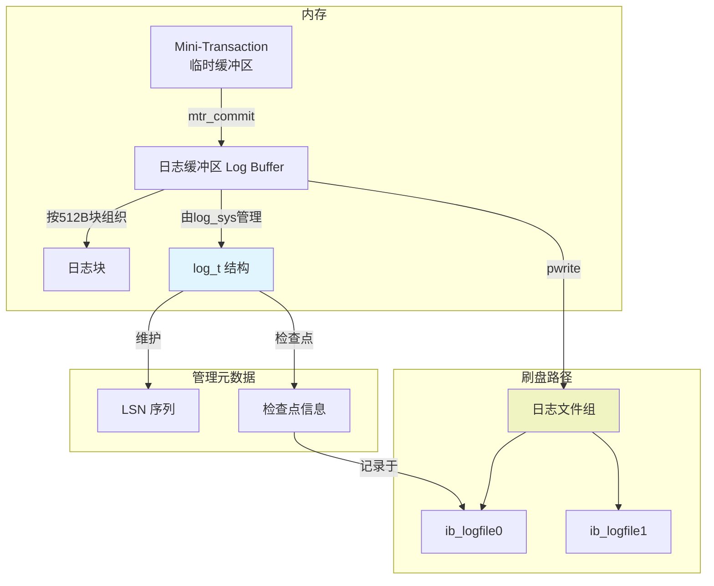
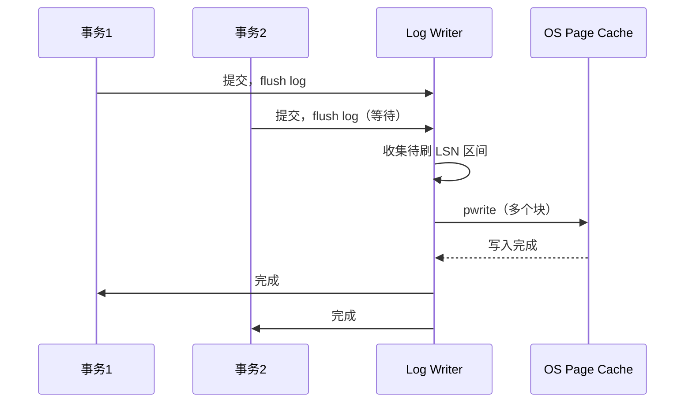

> **摘要**：重做日志（Redo Log）是 InnoDB 实现事务持久性（Durability）的核心机制，其设计遵循 Write-Ahead Logging（WAL）原则——数据页的修改必须在落盘之前，先将对应的日志记录持久化。本文从重做日志的整体架构出发，详细解析日志缓冲区（Log Buffer）的管理结构、日志记录的写入与刷盘流程、Mini-Transaction（MTR）与日志的关联，以及组提交（Group Commit）的优化原理。同时，深入 `log0log.cc` 与 `log0write.cc` 中的关键数据结构，解释 LSN（Log Sequence Number）的作用、日志文件组的组织方式，并提供生产环境下的监控与调优建议。

---

## 一、重做日志的地位与设计哲学

InnoDB 的重做日志是一组物理逻辑日志，记录了对数据页的修改操作。它并非完整记录页的镜像，而是记录页内修改的“操作指令”（如“在页偏移 X 处写入 Y 字节”）。这种设计在保证崩溃恢复能力的同时，显著减少了日志总量。

重做日志的核心设计原则：
1. **WAL**：事务提交前，必须保证其产生的重做日志已写入磁盘。若系统崩溃，恢复时通过扫描重做日志，可将尚未刷盘的数据页修改重做。
2. **顺序写入**：所有日志以追加方式写入日志文件组，将随机 I/O 转化为顺序 I/O，提升写入性能。
3. **循环覆盖**：重做日志文件组是固定大小的环形缓冲区，当检查点推进后，早期日志空间可被重用。

---

## 二、整体架构

重做日志子系统由**日志缓冲区**（内存）、**日志文件组**（磁盘）以及**管理结构**组成。



**核心组件**：
- **日志缓冲区（Log Buffer）**：内存中的环形缓冲区，用于缓存尚未写入磁盘的重做日志。大小由 `innodb_log_buffer_size` 控制，默认 16MB。
- **日志文件组（Log Group）**：一组重做日志文件，默认为 `ib_logfile0` 和 `ib_logfile1`，每个文件大小由 `innodb_log_file_size` 控制，总大小上限在 8.0 中大幅提升至 512GB。
- **日志序列号（LSN）**：单调递增的 64 位整数，唯一标识重做日志总量。每个日志记录、每个数据页的 `FIL_PAGE_LSN` 都依赖 LSN 进行对应与校验。
- **检查点（Checkpoint）**：表示 LSN 小于检查点 LSN 的日志对应数据页均已刷盘，这部分日志空间可被循环覆盖。

---

## 三、日志缓冲区与日志块

### 3.1 日志块（Log Block）

磁盘与内存之间传输的最小单位是**日志块**，固定大小 **512 字节**，与磁盘扇区大小一致。这种设计保证了写入的原子性——即使系统崩溃，也不会出现部分块写成功的情况。

日志块结构（`log0log.h`）由三部分构成：

```c
struct log_block_t {
    /* 块头 12 字节 */
    ulint   block_no;       /* LOG_BLOCK_HDR_NO，块序号 */
    ulint   data_len;       /* LOG_BLOCK_HDR_DATA_LEN，块内有效数据长度 */
    ulint   first_rec_group;/* LOG_BLOCK_FIRST_REC_GROUP，第一个 mtr 开始偏移 */
    lsn_t   checkpoint_no;  /* LOG_BLOCK_CHECKPOINT_NO，写块时的检查点号 */
    
    /* 日志数据，最大 492 字节 */
    byte    data[492];
    
    /* 块尾 4 字节校验 */
    ulint   checksum;       /* LOG_BLOCK_TRC */
};
```

一个日志块可以容纳多个 Mini-Transaction 产生的日志记录，只要总长度不超过 492 字节。超过时会跨块存储。

### 3.2 日志缓冲区的双重缓冲设计

为了提高写入效率并避免最后一个未满块的重用冲突，InnoDB 将日志缓冲区设计为**两个逻辑区域**的乒乓切换。

- **`buf_ptr`**：指向整个日志缓冲区。
- **`buf`**：指向当前可写入的位置，实际是一个视图。

当当前缓冲区被填满或需要刷盘时，系统会切换到另一个缓冲区，并将最后一个未满的日志块拷贝过去。这种设计使得日志写入与刷盘可以部分并发，减少了等待。

---

## 四、核心数据结构：`log_t`

InnoDB 通过全局变量 `log_sys`（类型 `log_t *`）管理重做日志子系统。其关键字段如下（基于 8.0 重构后的实现）：

```c
struct log_t {
    // 日志序列号（最新写入位置）
    lsn_t   lsn;                // 当前写入位置的 LSN
    lsn_t   buf_ready_for_write_lsn; // 已完成写入缓冲区的最大 LSN
    
    // 缓冲区管理
    byte    *buf_ptr;           // 日志缓冲区基址（双倍 innodb_log_buffer_size）
    byte    *buf;              // 当前活动缓冲区指针
    ulint   buf_size;          // 缓冲区总大小（2倍 log_buffer_size）
    ulint   buf_next_to_write; // 待刷盘的位置偏移
    
    // 文件组管理
    log_group_t *groups;       // 日志组链表
    ulint       n_files;       // 当前组内文件数
    
    // 刷盘状态
    lsn_t   write_lsn;         // 已发出写请求的最大 LSN
    lsn_t   flushed_to_disk_lsn; // 已确认落盘的最大 LSN
    lsn_t   current_flush_lsn; // 正在刷盘的 LSN
    
    // 并发控制
    mysql_mutex_t mutex;       // 保护非性能关键路径（8.0 中已大幅减少使用）
    mysql_cond_t  flush_cond;  // 等待刷盘完成的条件变量
    
    // 统计信息
    ulint   log_writes;        // 刷盘次数
    ulint   log_waits;        // 等待刷盘的次数（日志缓冲不足）
};
```

**8.0 的重要演进**：  
- 5.7 及之前，`log_sys->mutex` 保护几乎所有操作，是日志模块的主要瓶颈。  
- 8.0 重构后，引入**无锁日志缓冲区**设计——利用原子操作更新 `lsn` 和 `buf_ready_for_write_lsn`，仅在需要与刷盘线程同步时才使用互斥锁。  
- 新增 **`log_writer` 线程**，专门负责将日志缓冲区写入文件系统缓存，与用户线程解耦。

---

## 五、Mini-Transaction（MTR）与日志生成

MTR 是 InnoDB 中保证物理操作原子性的最小事务单元。一个 SQL 事务可能由多个 MTR 组成，每个 MTR 内包含多条重做日志记录。

**MTR 与日志的关系**：
1. 每修改一个数据页，都会开启一个 MTR（`mtr_start`）。
2. 修改操作调用 `mlog_write_ulint`、`mlog_write_string` 等函数，将操作记录到 MTR 内部的临时缓冲区。
3. MTR 提交时（`mtr_commit`），将所有日志记录复制到全局日志缓冲区，同时更新被修改页的 `newest_modification = mtr_end_lsn`。
4. 若该页此前不在 flush list 中，则加入 flush list，并按 LSN 排序。

MTR 提交时复制日志到 Log Buffer 的操作在 8.0 中做了重要优化：

**5.7 方式**：加 `log_sys->mutex` → 复制数据 → 释放锁。  
**8.0 方式**：原子获取当前 LSN 与缓冲区指针（`log_buffer_reserve`），直接复制，无锁。仅在缓冲区跨页边界时需短暂锁保护。

```c
// 简化自 8.0 log0log.cc
lsn_t log_buffer_reserve(log_t *log, ulint len) {
    lsn_t start_lsn = log->lsn;  // 原子加载
    lsn_t end_lsn = start_lsn + len;
    
    // 如果跨越当前块末尾，需要切换到下一个块
    if (cross_block_boundary) {
        mysql_mutex_lock(&log->mutex);
        // 切换块，可能触发写请求
        log_buffer_switch_block(log);
        mysql_mutex_unlock(&log->mutex);
    }
    
    log->lsn = end_lsn;  // 原子更新
    return start_lsn;
}
```

---

## 六、日志写入与刷盘路径

### 6.1 刷盘触发点

重做日志从 Log Buffer 写入磁盘文件有三种触发场景：

1. **事务提交**（`innodb_flush_log_at_trx_commit = 1`）：  
   提交线程在 `ordered_commit` 的 flush 阶段调用 `log_write_up_to(lsn, true)`，**同步**等待刷盘完成。

2. **后台线程**：  
   - `master` 线程每秒检查，若上次刷盘时间超过 1 秒，则触发异步刷盘。  
   - `log_writer` 线程持续监控 `buf_ready_for_write_lsn`，当超过 `write_lsn` 时主动写入。

3. **脏页刷盘前**：  
   `buf_flush_write_block_low` 刷脏页时，会调用 `log_write_up_to(bpage->newest_modification, false)`，确保该页变更的日志已落盘（WAL 原则）。

### 6.2 组提交（Group Commit）

组提交是将多个事务的刷盘操作合并为一次系统调用的优化技术。8.0 的实现分为三个阶段：



**参数控制**：
- `binlog_group_commit_sync_delay`：组提交时延迟刷盘的时间（微秒），增加延迟可让更多事务加入同一批。
- `binlog_group_commit_sync_no_delay_count`：达到该数量的事务后立即刷盘，不等延迟超时。

这两个参数虽以 `binlog` 命名，但**同样影响 InnoDB redo log 的组提交行为**（因为组提交是 Server 层与引擎层协同的）。

### 6.3 LSN 与偏移计算

每个日志文件头部有固定的文件头（`LOG_FILE_HDR_SIZE`，2KB）。  
给定一个 LSN，可以通过以下方式定位到其在日志文件组中的物理偏移：

```c
ulint log_group_calc_lsn_offset(lsn_t lsn, log_group_t *group) {
    lsn_t delta = lsn % group->file_size;          // 文件内偏移
    ulint file_no = (lsn / group->file_size) % group->n_files;
    return file_no * group->file_size + delta + LOG_FILE_HDR_SIZE;
}
```

---

## 七、崩溃恢复中的重做日志应用

崩溃恢复时，InnoDB 需要扫描重做日志，将尚未刷盘的数据页恢复到最新状态。关键步骤如下：

1. **定位最近检查点**：从第一个日志文件读取 `LOG_CHECKPOINT_1` 和 `LOG_CHECKPOINT_2` 区域，选择 `checkpoint_no` 较大且校验通过的那个。
2. **获得恢复起点 LSN**：检查点记录的 `checkpoint_lsn` 即恢复起点。
3. **扫描日志**：从起点顺序读取日志块，解析日志记录，构建 `recv_addr_t` 哈希表（表空间 ID + 页号 → 该页的日志记录链表）。
4. **应用日志**：遍历哈希表，对每个页按 LSN 顺序执行日志记录中的操作。
5. **跳过已刷盘的页**：若页的 `FIL_PAGE_LSN` ≥ 日志记录的 LSN，说明该页已更新，无需重做。

恢复的并行度由 `innodb_parallel_read_threads`（8.0.14+）控制，可加速大型实例的恢复。

---

## 八、生产环境调优与监控

### 8.1 关键参数

| 参数 | 说明 | 推荐值（2026） |
|------|------|--------------|
| `innodb_log_file_size` | 单个重做日志文件大小 | 2GB~32GB（总日志组大小建议为 Buffer Pool 的 25%~50%） |
| `innodb_log_files_in_group` | 日志组内文件个数 | 3~4（8.0 建议 3，兼顾恢复速度和空间利用） |
| `innodb_log_buffer_size` | 日志缓冲区大小 | 64MB~256MB（大并发写事务需增大） |
| `innodb_flush_log_at_trx_commit` | 提交时刷盘策略 | **1**（数据安全优先） / **2**（性能优先，可能丢 1 秒数据） |
| `innodb_flush_log_at_timeout` | 定时刷盘间隔（秒） | 1（默认） |
| `innodb_log_write_ahead_size` | 预写对齐大小 | 4KB（匹配文件系统块大小，避免 read-on-write） |
| `innodb_log_compressed_pages` | 压缩页是否写入完整日志 | OFF（8.0 默认 OFF，除非 zlib 版本可能变化） |
| `innodb_use_native_aio` | Linux 异步 I/O | ON（默认） |

### 8.2 监控与诊断

**1. 查看日志写负载**：

```sql
SHOW ENGINE INNODB STATUS\G
-- 在 LOG 段查看
Log sequence number          68719476736
Log flushed up to            68719476736
Last checkpoint at           68719476608
Log file capacity            (总大小)
```

- **Log sequence number**：当前写入 LSN。
- **Log flushed up to**：已刷盘 LSN。若与 sequence 差距持续扩大，说明刷盘跟不上写入。
- **Last checkpoint at**：最近检查点 LSN。若与 flushed 差距过大，说明检查点推进慢，可能导致日志空间不足。

**2. 等待事件分析（8.0）**：

```sql
SELECT * FROM performance_schema.wait_events_global_summary_by_instance
WHERE EVENT_NAME LIKE 'wait/io/file/innodb/innodb_log_file%';
```

**3. 检查点相关状态**：

```sql
SHOW GLOBAL STATUS LIKE 'Innodb_checkpoint_max_used%';
```

若 `Innodb_checkpoint_max_used` 接近日志文件总大小，表示检查点推进不及时，需增大日志文件总容量或加速刷脏。

**4. 观测日志缓冲区等待**：

```sql
SHOW GLOBAL STATUS LIKE 'Innodb_log_waits';
```

若该值持续增长，说明事务提交等待日志缓冲区的可用空间，应增大 `innodb_log_buffer_size`。

### 8.3 常见问题与解法

**问题1：`log_wait_for_flush` 事件频繁**  
**原因**：刷盘速度低于日志生成速度。  
**解法**：
- 升级存储设备（SSD → NVMe/PMEM）。
- 调整 `innodb_flush_log_at_trx_commit = 2`（允许部分丢失）。
- 增大 `innodb_log_buffer_size`，缓冲更多日志。
- 8.0 中可调高 `innodb_log_writer_threads`（默认 1，8.0.30+ 可增加）。

**问题2：崩溃恢复时间过长**  
**原因**：日志总容量太大，或 `innodb_parallel_read_threads` 未充分利用。  
**解法**：
- 不要无脑增大日志文件，恢复时需要扫描起点后的全部日志。
- 设置合理的检查点频率，保持 `Last checkpoint at` 与 `Log sequence number` 差距在总日志容量的 30% 以内。
- 8.0.14+ 开启并行恢复。

**问题3：`innodb_log_write_ahead_size` 设置不当导致 I/O 放大**  
**诊断**：观察 `iostat` 中 `await` 偏高，且 `wrqm/s` 较大。  
**解法**：该参数应等于或为文件系统块大小的整数倍（通常 4KB）。查看方式：`stat -f .`，或 `xfs_info`。

---

## 九、2026 年技术演进

**1. 持久内存（PMEM）的适配**  
PMEM 支持 16KB 原子写，InnoDB 可绕过双写缓冲直接写数据页，但重做日志依然是顺序写入。  
Intel Optane 虽然已停产，但 CXL 内存扩展设备正逐渐普及。未来日志缓冲区可直接映射到 PMEM，事务提交仅需刷新 CPU 缓存（`clwb`），无需系统调用，延迟降至亚微秒级。

**2. 日志与数据页分离的云原生架构**  
AWS Aurora、阿里云 PolarDB 等已将 redo log 下沉至分布式存储层，计算节点仅生成日志，存储节点负责应用。此种架构下，MySQL 传统的组提交和双缓冲设计已不适用，但底层日志格式仍高度兼容。

**3. 新一代异步 I/O 接口 `io_uring`**  
8.0.34+ 开始实验性支持 `io_uring`，相比 `libaio` 减少了系统调用次数，且支持缓冲区和文件描述符的提前注册，对高 IOPS 日志写有显著提升。

---

## 十、总结

重做日志是 InnoDB 事务持久性的保障，其设计体现了数据库系统在性能与可靠性之间的经典权衡。

- 日志缓冲区 + 组提交 将随机 I/O 转化为顺序 I/O，是高并发写入的基础。
- LSN 与检查点机制确保了崩溃恢复的可控性与空间可重用性。
- 8.0 重构的日志子系统消除了全局锁，使日志写入成为可扩展的并发路径。

生产环境中，理解 LSN 的关系、监控刷盘延迟、合理配置日志容量与检查点策略，是保障数据库稳定性的核心技能。

---

**下一篇预告**：《InnoDB 双写机制：数据页写入的保险丝》  
我们将详细解析双写缓冲区的磁盘布局、`buf_dblwr_t` 内存结构、与崩溃恢复的协作流程，并讨论 8.0 对原子写设备的检测逻辑。