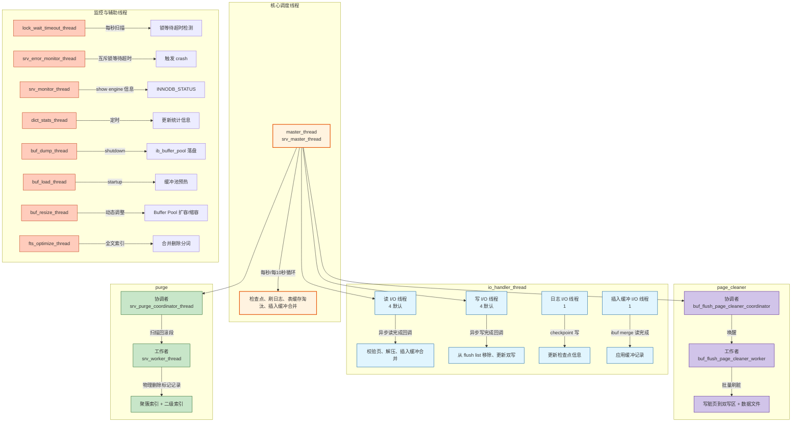
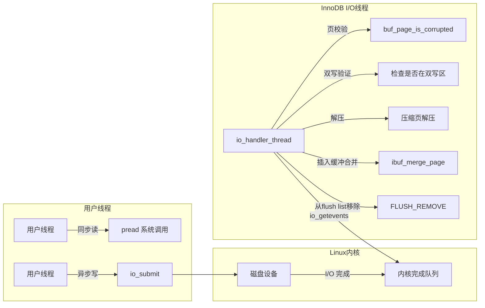
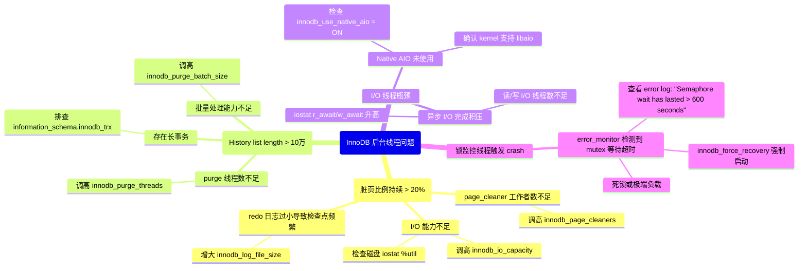

> **摘要**：  
> InnoDB 是一台精密的并发机器，而**后台线程**是这台机器的隐形工人——用户线程负责处理 SQL 请求，后台线程则负责刷脏页、合并插入缓冲、清理回滚段、监控死锁、维护统计信息等数十种“脏活累活”。这些线程各司其职，通过精巧的锁同步与条件变量通信，在“不阻塞用户”和“及时落盘”之间寻找平衡。  
>  
> 本文从 `srv0start.cc` 启动路径出发，系统梳理 InnoDB 的**线程家族谱系**，按职责划分为 I/O 线程、刷脏线程、清理线程、监控线程、辅助线程五大类。深入剖析 `io_handler_thread` 的异步 I/O 完成处理、`page_cleaner` 协同刷脏的协调者-工作者模型、`purge` 线程的历史链表扫描算法，以及 `lock_wait_timeout_thread` 的死锁检测触发时机。生产实践部分提供线程状态观测方法（`pstack`、`performance_schema`）及线程数调优矩阵。最后基于 2026 年视角，讨论 `io_uring` 对传统 AIO 线程模型的冲击，以及未来将更多“后台”逻辑下沉至存储设备的趋势。

---

## 一、核心概念与底层图景

### 1.1 定义
**InnoDB 后台线程**指 MySQL 启动 InnoDB 引擎时创建的、独立于用户连接线程（`THD`）的**一组常驻内核线程**。它们不处理客户端请求，而是负责：

- 内存数据与磁盘数据的同步（刷脏页、写双写缓冲）
- 预读与异步 I/O 完成处理
- 废弃版本数据的物理删除（purge）
- 锁超时监控与死锁检测
- 统计信息收集与缓存预热

**设计哲学**：
- **分工专业化**：每个线程聚焦单一职责，避免巨型“上帝线程”。
- **用户线程不等待**：尽量将可能阻塞的 I/O 操作及批量处理交给后台。
- **动态自适应**：线程数量可配置，但部分核心线程（master）始终单例。

### 1.2 架构全景



### 1.3 线程家族谱系（5.7/8.0）

| 线程组 | 默认数量 | 5.7 参数 | 8.0 参数 | 职责 |
|--------|--------|---------|---------|------|
| **master_thread** | 1 | 固定 | 固定 | 核心调度者，每秒/每10秒任务 |
| **io_handler_thread** | 4+4+1+1 | `innodb_read_io_threads`<br>`innodb_write_io_threads` | 同 5.7 | 异步 I/O 完成回调处理 |
| **page_cleaner** | 1+3 | `innodb_page_cleaners` | 同 5.7 | 协调者 + 工作者刷脏页 |
| **purge** | 1+3 | `innodb_purge_threads` | 同 5.7 | 协调者 + 工作者清理已删除记录 |
| **lock_wait_timeout** | 1 | 固定 | 固定 | 锁超时监控（1秒循环） |
| **error_monitor** | 1 | 固定 | 固定 | 信号量等待超时监控（10秒） |
| **monitor** | 1 | 固定 | 固定 | `SHOW ENGINE` 信息输出 |
| **dict_stats** | 1 | `innodb_stats_auto_recalc` | 同 5.7 | 统计信息自动收集 |
| **buf_dump/buf_load** | 1+1 | 固定 | 固定 | 缓冲池持久化/预热 |
| **buf_resize** | 1 | 固定 | 固定 | 在线 Buffer Pool 扩容 |
| **fts_optimize** | 1 | 固定 | 固定 | 全文索引优化 |
| **clone** | 1 | 无 | 8.0.17+ | Clone Plugin 数据拉取 |

**演进趋势**：  
- 5.5 → 5.6 → 5.7 → 8.0：**线程专业化程度持续提高**。  
  早期 master 线程包办一切，现已将刷脏、purge、I/O 完成处理独立为专属线程组。
- 8.0 新增线程：`clone_thread`、`log_writer`、`log_flusher`（Redo 日志独立线程化）。

---

## 二、机制原理深度剖析

### 2.1 master 线程：被“分权”的昔日帝王

**历史地位**：  
InnoDB 4.0～5.5，master 线程是**唯一**的后台线程，承担所有周期性任务。  
5.6 后将刷脏独立给 `page_cleaner`，5.7 将 purge 独立，8.0 将 redo 写日志独立。

**当前职责（8.0）**：

```c
/* storage/innobase/srv/srv0srv.cc */
void srv_master_thread(THD* thd) {
    while (srv_shutdown_state == SRV_SHUTDOWN_NONE) {
        /* 每秒循环 */
        os_thread_sleep(1000000);  /* 1秒 */
        
        /* 1. 后台表删除（lazy drop table）*/
        row_drop_tables_for_mysql();
        
        /* 2. 检查 redo 日志空间——若不足，触发检查点 */
        if (log_sys->lsn - log_sys->last_checkpoint_lsn > 
            log_sys->log_group_capacity * 0.8) {
            log_checkpoint(TRUE, FALSE);
        }
        
        /* 3. 插入缓冲合并（仅当负载低时）*/
        if (srv_check_activity(5)) {  /* 5秒无活动视为空闲 */
            ibuf_merge(IBUF_MERGE_CURRENT);
        }
        
        /* 4. 表定义缓存淘汰（LRU）*/
        tdc_evict_unused_tables();
        
        /* 5. 重做日志刷盘（若 innodb_flush_log_at_trx_commit=2）*/
        if (innodb_flush_log_at_trx_commit == 2) {
            log_write_up_to(LSN_MAX, FALSE);
        }
        
        /* 6. 每秒检查点？不——已移交给 page_cleaner 协同 */
        
        /* 每10秒额外任务 */
        if (++counter % 10 == 0) {
            srv_master_do_idle_tasks();  /* 全量 ibuf merge、purge 等 */
        }
    }
}
```

**设计意图**：  
- 保留 master 线程作为“保底调度器”——若专业线程被关停或异常退出，master 仍能兜底。
- **但**：生产环境中 master 已非性能关键路径，大部分“重活”已被拆分。

### 2.2 I/O 线程：异步 I/O 的收尾人

**核心误解**：I/O 线程**不发起**异步 I/O，它们**只负责处理已完成 I/O 的收尾工作**。



**关键代码**（Linux Native AIO）：

```c
/* storage/innobase/os/os0file.cc */
void os_aio_linux_handler(ulint segment) {
    struct io_event events[32];
    
    /* 1. 获取已完成 I/O 事件（非阻塞）*/
    int n = io_getevents(aio_ctx, 0, 32, events, 0);
    
    for (int i = 0; i < n; i++) {
        IOContext* ctx = (IOContext*)events[i].data;
        buf_page_t* bpage = (buf_page_t*)ctx->bpage;
        
        /* 2. 读完成处理 */
        if (ctx->type == IORequest::READ) {
            /* 2.1 页校验和验证 */
            if (!buf_page_is_valid(bpage->frame, bpage->size)) {
                ib::error() << "Page " << bpage->page_no 
                           << " is corrupted after read";
                buf_page_set_corrupted(bpage);
            }
            
            /* 2.2 解压缩（若压缩页）*/
            if (page_is_compressed(bpage->frame)) {
                os_file_decompress_page(bpage->frame, bpage->size);
            }
            
            /* 2.3 插入缓冲合并（若该页有缓冲记录）*/
            if (ibuf_page_exists(bpage)) {
                ibuf_merge_page(bpage->space, bpage->page_no);
            }
        }
        
        /* 3. 写完成处理 */
        if (ctx->type == IORequest::WRITE) {
            /* 3.1 从 flush list 移除（页变干净）*/
            buf_flush_write_complete(bpage);
            
            /* 3.2 双写区槽位释放（已在 buf_dblwr_write_complete）*/
        }
        
        /* 4. 唤醒等待该 I/O 的用户线程（同步读场景）*/
        os_aio_signal_completion(ctx);
    }
}
```

**设计意图**：  
- I/O 线程与用户线程**完全解耦**——用户发起写后立即返回，不等待 I/O 完成。
- **读场景例外**：同步读（如 SELECT 缺页）用户线程会阻塞，直到 I/O 线程唤醒。

**线程数量配置**：
```ini
innodb_read_io_threads = 4
innodb_write_io_threads = 4
```
- **误区**：不是越多越好。I/O 线程是**完成处理线程**，非发起线程，瓶颈通常在磁盘而非 CPU。
- **推荐**：SSD 保持默认 4；高端 NVMe 可增至 8；>8 几乎无收益。

### 2.3 page_cleaner 线程：协调者-工作者模型

**演进**：  
- 5.6：单 `page_cleaner` 线程，串行刷脏。  
- 5.7：引入协调者 + 多工作者，支持并行刷脏。  
- 8.0：工作者与缓冲池实例绑定，减少锁竞争。

**核心逻辑**（`buf_flush_page_cleaner_coordinator`）：

```c
/* storage/innobase/buf/buf0flu.cc */
void buf_flush_page_cleaner_coordinator() {
    while (!srv_read_only_mode && !srv_shutdown_state) {
        /* 1. 计算本次需要刷新的页数（基于脏页比例/ LSN 年龄）*/
        ulint n_to_flush = page_cleaner_flush_pages_recommendation();
        
        /* 2. 唤醒工作者线程 */
        os_event_set(page_cleaner_state->start_event);
        
        /* 3. 协调者自己也参与刷脏（分担压力）*/
        buf_flush_batch(BUF_FLUSH_LIST, n_to_flush / (srv_n_page_cleaners + 1));
        
        /* 4. 等待所有工作者完成 */
        os_event_wait_time(page_cleaner_state->finish_event, 
                           srv_io_capacity * 1000 / srv_n_page_cleaners);
        
        /* 5. 更新统计信息，计算下次调度时间 */
        page_cleaner_sleep_if_needed();
    }
}

void buf_flush_page_cleaner_worker() {
    while (!srv_shutdown_state) {
        /* 1. 等待协调者信号 */
        os_event_wait(page_cleaner_state->start_event);
        
        /* 2. 绑定到特定缓冲池实例 */
        ulint instance_id = get_assigned_instance();
        buf_pool_t* buf_pool = buf_pool_from_array(instance_id);
        
        /* 3. 从该实例的 flush list 刷脏页 */
        buf_flush_list(instance_id, BUF_FLUSH_LIST);
        
        /* 4. 通知协调者完成 */
        os_event_set(page_cleaner_state->finish_event);
    }
}
```

**并行粒度**：  
- 8.0 中每个工作者**固定绑定**到一组缓冲池实例（实例数 ÷ 工作者数）。  
- 避免多工作者争用同一 `flush_list_mutex`。

**参数关系**：
- `innodb_page_cleaners` ≤ `innodb_buffer_pool_instances`。  
  若设置过大，多余工作者空闲。

### 2.4 purge 线程：MVCC 的垃圾回收员

**职责**：物理删除已被标记删除、且不再被任何 Read View 引用的记录。

**核心数据结构**：`purge_sys_t`

```c
/* storage/innobase/include/trx0purge.h */
struct purge_sys_t {
    /* 扫描状态 */
    ulint           state;          /* PURGE_STATE_INIT / RUN / DISABLED */
    
    /* 回滚段扫描游标 */
    rseg_id_t       rseg_id;        /* 当前扫描的回滚段ID */
    undo_no_t       undo_no;        /* 当前扫描的回滚记录序号 */
    
    /* 工作者协同 */
    ulint           n_workers;      /* 实际工作者数量 */
    ulint           n_queued;       /* 已分发但未完成的任务 */
    
    /* 历史链表截断 */
    ibool           truncate;       /* 是否截断历史链表 */
    ulint           truncate_freq;  /* innodb_purge_rseg_truncate_frequency */
};
```

**扫描算法**（协调者）：

```c
/* storage/innobase/trx/trx0purge.cc */
void srv_purge_coordinator_thread() {
    while (!srv_shutdown_state) {
        /* 1. 获取当前最小的活跃 Read View（low_limit_no）*/
        trx_id_t limit = trx_sys->mvcc->get_low_limit_id();
        
        /* 2. 遍历所有回滚段（默认 128 个）*/
        for (rseg_id = 0; rseg_id < TRX_SYS_N_RSEGS; rseg_id++) {
            trx_rseg_t* rseg = trx_sys->rseg_array[rseg_id];
            
            /* 2.1 获取该回滚段的历史链表头 */
            undo_space_t* undo = UT_LIST_GET_FIRST(rseg->undo_list);
            
            /* 2.2 遍历历史链表中的 undo log header */
            while (undo) {
                /* 2.3 检查该 undo log 的事务 ID 是否 ≤ limit */
                if (undo->trx_id <= limit) {
                    /* 2.4 将该 undo log 内的所有回滚记录加入任务队列 */
                    for (each record in undo->records) {
                        purge_que_t* task = alloc_purge_task();
                        task->space = record->space;
                        task->page_no = record->page_no;
                        task->heap_no = record->heap_no;
                        task->index_id = record->index_id;
                        
                        /* 2.5 轮询分配给工作者 */
                        ulint worker_id = atomic_add(&rr, 1) % srv_n_purge_threads;
                        push_to_worker_queue(worker_id, task);
                    }
                }
                undo = UT_LIST_GET_NEXT(undo_list, undo);
            }
        }
        
        /* 3. 每轮最多处理 innodb_purge_batch_size 条记录（默认300）*/
        /* 4. 每 innodb_purge_rseg_truncate_frequency 轮执行一次历史链表截断 */
        
        os_thread_sleep(srv_purge_sleep);
    }
}
```

**工作者逻辑**：

```c
void srv_worker_thread() {
    while (!srv_shutdown_state) {
        /* 1. 从队列取任务 */
        purge_que_t* task = pop_from_worker_queue(worker_id);
        
        /* 2. 解析回滚日志，定位记录 */
        rec_t* rec = get_record_from_undo(task);
        
        /* 3. 删除二级索引记录（若存在）*/
        if (has_secondary_index(task->index_id)) {
            row_purge_remove_sec_if_possible(task);
        }
        
        /* 4. 删除聚簇索引记录 */
        row_purge_remove_clust_record(task);
        
        /* 5. 释放回滚日志页空间（可重用）*/
        trx_undo_rec_release(task);
    }
}
```

**设计意图**：  
- **轮询分发**：避免哈希取模造成的“热点回滚段”集中到一个工作者。
- **事务可见性**：必须确保**任何活跃事务**都不会看到被删除的记录，否则 MVCC 历史链断裂。

**性能陷阱**：  
- 大事务产生巨量回滚记录，purge 积压 → 回滚段无法收缩 → undo 表空间膨胀。  
- **监控**：`SHOW ENGINE INNODB STATUS` 中 `History list length`。

---

## 三、内核/源码级实现

### 3.1 核心数据结构：`srv_threads` 全局线程句柄

```c
/* storage/innobase/srv/srv0srv.cc */
struct srv_threads_t {
    /* I/O 线程 */
    os_thread_id_t  io_read_thread_ids[SRV_MAX_N_IO_THREADS];
    os_thread_id_t  io_write_thread_ids[SRV_MAX_N_IO_THREADS];
    os_thread_id_t  io_log_thread_id;
    os_thread_id_t  ibuf_io_thread_id;
    
    /* 刷脏线程 */
    os_thread_id_t  page_cleaner_coordinator_id;
    os_thread_id_t  page_cleaner_worker_ids[SRV_MAX_N_PAGE_CLEANERS];
    
    /* Purge 线程 */
    os_thread_id_t  purge_coordinator_id;
    os_thread_id_t  purge_worker_ids[SRV_MAX_N_PURGE_THREADS];
    
    /* 监控线程 */
    os_thread_id_t  lock_wait_timeout_id;
    os_thread_id_t  error_monitor_id;
    os_thread_id_t  monitor_id;
    
    /* 辅助线程 */
    os_thread_id_t  dict_stats_id;
    os_thread_id_t  buf_dump_id;
    os_thread_id_t  buf_resize_id;
    os_thread_id_t  fts_optimize_id;
    
    /* 8.0 新增 */
    os_thread_id_t  clone_id;
    os_thread_id_t  log_writer_id;
    os_thread_id_t  log_flusher_id;
    
    /* 并发控制 */
    ib_mutex_t      mutex;          /* 保护线程状态 */
    os_event_t      init_event;     /* 启动同步 */
} srv_threads;
```

### 3.2 线程初始化时序（`innobase_start_or_create_for_mysql`）

```c
/* storage/innobase/srv/srv0start.cc */
void innobase_start_or_create_for_mysql() {
    /* 1. 创建 I/O 线程（最先启动）*/
    for (i = 0; i < srv_n_read_io_threads; i++) {
        os_thread_create(io_handler_thread, (void*)&read_slots[i]);
    }
    for (i = 0; i < srv_n_write_io_threads; i++) {
        os_thread_create(io_handler_thread, (void*)&write_slots[i]);
    }
    os_thread_create(io_handler_thread, (void*)LOG_IO_SEGMENT);
    os_thread_create(io_handler_thread, (void*)IBUF_IO_SEGMENT);
    
    /* 2. 创建 page_cleaner 线程（依赖缓冲池已初始化）*/
    if (!srv_read_only_mode) {
        os_thread_create(buf_flush_page_cleaner_coordinator, NULL);
        for (i = 1; i < srv_n_page_cleaners; i++) {
            os_thread_create(buf_flush_page_cleaner_worker, NULL);
        }
    }
    
    /* 3. 创建 purge 线程（依赖事务系统已初始化）*/
    if (!srv_read_only_mode && srv_force_recovery < SRV_FORCE_NO_BACKGROUND) {
        os_thread_create(srv_purge_coordinator_thread, NULL);
        for (i = 1; i < srv_n_purge_threads; i++) {
            os_thread_create(srv_worker_thread, NULL);
        }
    }
    
    /* 4. 创建监控线程（无依赖）*/
    os_thread_create(lock_wait_timeout_thread, NULL);
    os_thread_create(srv_error_monitor_thread, NULL);
    os_thread_create(srv_monitor_thread, NULL);
    
    /* 5. 创建辅助线程 */
    os_thread_create(buf_dump_thread, NULL);
    os_thread_create(dict_stats_thread, NULL);
    fts_optimize_init();
    os_thread_create(buf_resize_thread, NULL);
}
```

**顺序依赖**：  
- I/O 线程必须最先创建，因为后续所有磁盘读写都依赖异步 I/O 完成处理。  
- page_cleaner 需要缓冲池已初始化。  
- purge 需要事务系统及回滚段已初始化。

---

## 四、生产落地与 SRE 实战

### 4.1 场景化案例：purge 积压导致 undo 表空间爆炸

**现象**：  
- `SHOW ENGINE INNODB STATUS` 显示 `History list length` 持续增长至数十万。  
- `ibdata1` 或 `undo_001` 文件占用数百 GB，且无法收缩。  
- 实例整体性能无明显下降，但磁盘空间告警。

**根本原因**：  
- 长事务（如 `SELECT` 超过 30 分钟）持有旧版本 Read View，阻止 purge 回收对应回滚段。  
- 或 `innodb_purge_threads` 设置过少（默认 4），吞吐不足。

**排查步骤**：

```sql
-- 1. 查看当前活跃事务及其开始时间
SELECT trx_id, trx_started, TIMESTAMPDIFF(SECOND, trx_started, NOW()) AS trx_age_seconds
FROM information_schema.innodb_trx
ORDER BY trx_started;

-- 2. 查看历史链表长度
SHOW ENGINE INNODB STATUS\G
-- 搜索 History list length
```

**解决方案**：

```ini
[mysqld]
-- 1. 增加 purge 线程数（8.0 默认 4，可增至 8～16）
innodb_purge_threads = 8

-- 2. 增加每批次处理记录数（默认 300）
innodb_purge_batch_size = 1000

-- 3. 缩短回滚段截断周期（默认 128）
innodb_purge_rseg_truncate_frequency = 32
```

**根治**：  
- 应用侧优化，拆分长事务。  
- 或启用 `innodb_undo_tablespaces` 独立存储，8.0 支持 `TRUNCATE` 操作。

### 4.2 参数调优矩阵

| 线程组 | 参数 | 5.7 默认 | 8.0 推荐 | 内核解释 |
|--------|------|---------|---------|---------|
| **I/O 线程** | `innodb_read_io_threads` | 4 | 4～8 | 异步读完成处理线程，SSD 4 足够 |
| | `innodb_write_io_threads` | 4 | 4～8 | 异步写完成处理线程，过高无益 |
| **刷脏线程** | `innodb_page_cleaners` | 1 | min(8, buffer_pool_instances) | 8.0 推荐与实例数绑定 |
| | `innodb_io_capacity` | 200 | 2000～10000（SSD） | 间接控制单次刷脏页数 |
| **purge 线程** | `innodb_purge_threads` | 1 | 4～8 | 8.0 默认 4，高并发写入可增至 16 |
| | `innodb_purge_batch_size` | 300 | 500～2000 | 每轮处理记录数，越大越快但单次 CPU 突增 |
| | `innodb_purge_rseg_truncate_frequency` | 128 | 32～64 | 截断频率，越小回收越积极 |
| **监控线程** | `innodb_lock_wait_timeout` | 50 | 10～30 | `lock_wait_timeout_thread` 检测间隔固定 1 秒，此参数为等待超时阈值 |
| | `innodb_stats_auto_recalc` | ON | ON | `dict_stats_thread` 触发统计信息更新 |

### 4.3 线程状态观测

**1. 查看 InnoDB 线程列表（Linux）**

```bash
# 显示 mysqld 所有线程
ps -Lf -C mysqld | wc -l

# pstack 打印线程堆栈（可 grep 特定函数名）
pstack `pidof mysqld` | grep -E 'io_handler|page_cleaner|purge_coordinator'

# 更精准：使用 MySQL 提供的线程名（8.0+）
perf top -p `pidof mysqld` -g
```

**2. 通过 performance_schema 查看后台线程**

```sql
-- 8.0 线程命名已完善
SELECT thread_id, name, type, processlist_state
FROM performance_schema.threads
WHERE name LIKE '%innodb%'
ORDER BY thread_id;

-- 查看特定线程状态
SELECT * FROM performance_schema.events_waits_current
WHERE thread_id = 47;  -- 从上述查询获取
```

**3. 观测 purge 进度**

```sql
-- 8.0.23+ 提供专门计数器
SHOW GLOBAL STATUS LIKE 'Innodb_purge%';
```

| 变量 | 含义 |
|------|------|
| `Innodb_purge_pending` | 等待 purge 的回滚记录数 |
| `Innodb_purge_trx_id` | 当前正在 purge 的事务 ID |
| `Innodb_purge_undo_logs` | 待处理的 undo log 数量 |

**4. 观测 page_cleaner 效率**

```sql
SHOW GLOBAL STATUS LIKE 'Innodb_buffer_pool_pages_dirty';
SHOW ENGINE INNODB STATUS\G
-- 搜索 "Flush list length" 和 "Pending flushes"
```

### 4.4 故障排查决策树



---

## 五、技术演进与 2026 年视角

### 5.1 历史设计约束与改进

| 版本 | 线程架构变化 | 动因 |
|------|------------|------|
| 4.0 | 单 master 线程包办一切 | 初期设计，简单稳定 |
| 5.5 | 增加独立 I/O 线程 | 异步 I/O 完成处理与 master 解耦 |
| 5.6 | 独立 page_cleaner 线程 | master 线程刷脏成为瓶颈 |
| 5.7 | purge 线程多线程化 | 大并发写入下历史链表清理滞后 |
| 5.7 | page_cleaner 引入协调者-工作者 | 多缓冲池实例并行刷脏 |
| 8.0 | log_writer / log_flusher | 日志写入与刷盘分离，减少 `log_sys->mutex` |
| 8.0.17 | clone 线程 | 支持在线克隆，替代物理备份 |
| 8.0.30 | 后台线程命名 | 支持 `performance_schema.threads` 按名检索 |

### 5.2 2026 年仍存在的“遗留设计”

1. **master 线程仍未退役**  
   虽然已无繁重任务，但 master 仍占用一个 CPU 核心每秒唤醒一次。  
   **现状**：8.0 社区版无法禁用。Percona Server 支持 `innodb_master_thread_disabled`。

2. **I/O 线程模型源自 libaio，io_uring 支持不彻底**  
   8.0.34+ 实验性支持 io_uring，但默认仍使用 libaio。  
   **差距**：io_uring 支持**批量提交、缓冲池注册、轮询模式**，可彻底移除 I/O 线程阻塞的 `io_getevents` 调用。  
   **现状**：仅用于 redo log 写入，数据文件 I/O 仍走 libaio。

3. **purge 线程轮询分发仍可能倾斜**  
   当前使用 `atomic_add(&rr,1) % workers` 简单轮询，若某些回滚段记录数远多于其他，仍会集中到特定工作者。  
   **更优方案**：动态负载均衡，空闲工作者主动 steal 任务。  
   **现状**：8.0 未实现。

4. **thread naming 在 5.7 不可用**  
   生产环境仍有大量 5.7 实例，`ps` 看到的线程名均为 `mysqld`，故障定位困难。  
   **替代**：`pstack` + 偏移计算。

### 5.3 未来趋势：io_uring 与异步 I/O 线程的消亡

**传统 Native AIO 的缺陷**：
- 需要独立线程调用 `io_getevents` 轮询完成队列——**CPU 开销 ≈ 0.5%～1%**。
- 每批次最多 32 个事件，高 IOPS 场景频繁系统调用。

**io_uring 的优势**：
- **无需独立完成线程**：用户线程可在 `io_uring_enter` 时顺便收割完成事件。
- **缓冲池页可提前注册**：减少内存拷贝。
- **轮询模式**：高 IOPS 设备可避免中断开销。

**对 InnoDB 后台线程模型的冲击**：
- **读 I/O 线程可完全移除**：用户线程同步读时直接提交 SQE，通过 `wait=1` 等待完成；异步读（预读）可在用户线程批量收割。
- **写 I/O 线程**：用户线程提交写请求后，由 `io_uring` 内核线程完成写操作，用户线程下次系统调用时收割完成事件。
- **未来架构预测**：
  ```c
  /* 伪代码：无 I/O 线程的未来 */
  buf_page_read(space, page_no) {
      sqe = io_uring_get_sqe(ring);
      io_uring_prep_read(sqe, fd, buf, PAGE_SIZE, offset);
      io_uring_sqe_set_data(sqe, bpage);
      io_uring_submit(ring);
      
      /* 等待完成，不依赖 I/O 线程唤醒 */
      io_uring_wait_cqe(ring, &cqe);
      handle_io_complete(cqe);
  }
  ```

**现状与障碍**：
- MySQL 8.0.34+ 已合并 io_uring 支持，但仅用于 redo log 写入。
- 数据文件 I/O 改用 io_uring 需重构 `fil_io` 层，涉及大量代码改动。
- **预计 9.x** 成为默认异步 I/O 接口，**预计 10.x** 移除 libaio 支持。

**对 purge / page_cleaner 的影响**：
- 刷脏仍需后台线程，因为“批量写”不能阻塞用户线程。
- 但 I/O 完成处理可从 I/O 线程迁移至工作者线程内部完成，减少一次跨线程上下文切换。

---

## 六、结语：隐形工人的未来

InnoDB 的后台线程群像，是一部**专业化分工的演进史**。  
从 master 包办一切，到 I/O 线程、page_cleaner、purge 逐一独立，再到 8.0 的 log_writer/clone——每一次拆分都对应着硬件能力提升和工作负载演进。

2026 年的今天，io_uring 正酝酿着下一轮重构：**I/O 完成处理不再需要专属线程**。  
届时，“I/O 线程”这个延续二十年的设计将走进历史，而刷脏、purge 等纯计算任务将继续由后台线程承载。

**唯一不变的是设计哲学**：  
> **用户线程优先，后台线程保底**——  
> 绝不让用户等待磁盘 I/O，绝不因后台任务阻塞前台查询。

---

## 参考文献
- `storage/innobase/srv/srv0srv.cc`, `srv0start.cc` MySQL 8.0.33 源码
- `storage/innobase/buf/buf0flu.cc` – page_cleaner
- `storage/innobase/trx/trx0purge.cc` – purge 线程
- `storage/innobase/os/os0file.cc` – 异步 I/O 完成处理
- MySQL Internals Manual – InnoDB Background Threads
- Oracle Blogs: “MySQL 8.0: InnoDB Log Writer Thread” (2020)
- io_uring MySQL Performance Study, Percona Live 2025