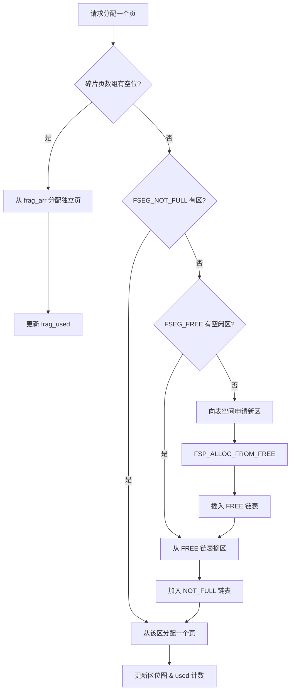
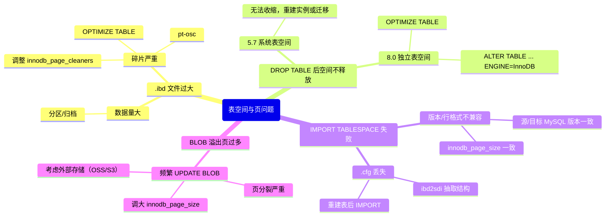

> **摘要**：  
> 如果说缓冲池是 InnoDB 的内存心脏，那么**数据文件**就是它的存储骨架。从 `ibdata1` 到 `test.ibd`，从段到行，InnoDB 构建了一套**四层存储抽象**：表空间管理文件、段管理区、区管理页、页管理行。这套设计让 16KB 固定大小页面对接任意文件系统，让 B+Tree 索引在磁盘上维持逻辑有序，让崩溃恢复能精确定位每个数据页。  
>  
> 本文从 `fil_system_t` 全局文件空间管理器出发，深入拆解 `FSP_HDR`、`XDES`、`INODE` 等系统页的磁盘格式，详细阐述段如何向表空间“申请”区、区如何通过位图管理页、行记录如何在不同行格式（COMPACT/DYNAMIC/COMPRESSED）下存储变长字段与溢出页。通过解剖一条 `INSERT` 语句的磁盘写入路径，串联起从 `page_cur_tuple_insert` 到 `fil_io` 的全流程。生产实践部分提供表空间碎片回收、独立表空间迁移及 `ibd2sdi` 灾难恢复实战。最后基于 2026 年视角，讨论 PMEM 直接访问模式对传统“页缓存 + 文件系统”架构的根本性颠覆。

---

## 一、核心概念与底层图景

### 1.1 定义
**InnoDB 存储引擎的磁盘存储**由四个递进的逻辑层次构成：

| 层次 | 管理单位 | 存储内容 | 对应结构 |
|------|--------|--------|---------|
| **表空间** | 文件 | 一个或多个 `.ibd` / `ibdata1` | `fil_space_t` |
| **段** | 区集合 | 索引（根节点段 + 叶子节点段） | `fseg_inode_t` |
| **区** | 64 页（1MB） | 连续页组，用于空间分配 | `xdes_t` |
| **页** | 16KB（默认） | 行记录、索引节点、BLOB、系统管理 | `buf_page_t` / `page_t` |
| **行** | 记录 | 用户数据 + 系统列（DB_TRX_ID、DB_ROLL_PTR） | `rec_t` |

**设计哲学**：
- **固定页大小**：屏蔽底层文件系统块大小差异，简化 I/O 子系统。
- **区预分配**：减少频繁空间分配操作，保证数据物理连续性。
- **段与索引绑定**：每个索引独立管理空间，防止索引间相互干扰。
- **行格式演进**：从 REDUNDANT 到 COMPACT 到 DYNAMIC，逐步压缩存储开销。

### 1.2 架构全景

```mermaid
graph TB
    classDef space fill:#fff3e0,stroke:#e65100,stroke-width:2px
    classDef seg fill:#e1f5fe,stroke:#01579b
    classDef extent fill:#d1c4e9,stroke:#4a148c
    classDef page fill:#c8e6c9,stroke:#1b5e20
    classDef rec fill:#ffccbc,stroke:#bf360c

    subgraph 表空间层 [fil_space_t]
        SPACE[表空间 ID / 文件链表] --> IBD[.ibd 数据文件]
        SPACE --> FIL_NODE[fil_node_t 文件描述符]
    end

    subgraph 段层 [fseg_inode_t]
        SEGMENT[段] --> SEG_FREE[FSEG_FREE 空闲区链表]
        SEGMENT --> SEG_NOT_FULL[FSEG_NOT_FULL 部分使用区链表]
        SEGMENT --> SEG_FULL[FSEG_FULL 已满区链表]
        SEGMENT --> SEG_FRAG_ARR["独立页数组 (32个)"]
    end

    subgraph 区层 [xdes_t]
        EXTENT["区 (64页)"] --> XDES_ID[所属段ID]
        EXTENT --> XDES_STATE[状态: FREE / FREE_FRAG / FULL_FRAG / FSEG]
        EXTENT --> XDES_BITMAP["页分配位图 (64×2bit)"]
    end

    subgraph 页层 [buf_page_t]
        PAGE[页] --> FIL_HEADER[FIL_PAGE_* 通用头]
        PAGE --> PAGE_HEADER[PAGE_HEADER 索引页专用]
        PAGE --> INFIMUM[Infimum 系统记录]
        PAGE --> USER_REC[用户记录链表]
        PAGE --> SUPREMUM[Supremum 系统记录]
        PAGE --> PAGE_DIRECTORY[Page Directory 槽位数组]
        PAGE --> FIL_TRAILER[FIL_PAGE_END_LSN 校验]
    end

    subgraph 行层 [rec_t]
        ROW[行记录] --> REC_HEADER["记录头 (deleted_flag / n_owned / heap_no / next_rec)"]
        ROW --> SYS_COLS[系统列: DB_TRX_ID / DB_ROLL_PTR]
        ROW --> FIELDS[用户字段数组]
        ROW --> OFF_PAGE["BLOB 外部页指针 (20字节)"]
    end

    SPACE -->|fil_space_get| SEGMENT
    SEGMENT -->|fseg_alloc_free_page| EXTENT
    EXTENT -->|xdes_get_bit| PAGE
    PAGE -->|page_rec_get_next| ROW

    class SPACE,IBD,FIL_NODE space
    class SEGMENT,SEG_FREE,SEG_NOT_FULL,SEG_FULL,SEG_FRAG_ARR seg
    class EXTENT,XDES_ID,XDES_STATE,XDES_BITMAP extent
    class PAGE,FIL_HEADER,PAGE_HEADER,INFIMUM,SUPREMUM,PAGE_DIRECTORY,FIL_TRAILER page
    class ROW,REC_HEADER,SYS_COLS,FIELDS,OFF_PAGE rec
```



---

## 二、机制原理深度剖析

### 2.1 表空间管理：`fil_system_t` 全局文件目录

InnoDB 将所有打开的表空间文件统一注册到全局 `fil_system_t` 结构中。

```c
/* storage/innobase/include/fil0fil.h */
struct fil_system_t {
    /* 哈希索引 */
    hash_table_t*   spaces;        /* 按 space_id 哈希 */
    hash_table_t*   name_hash;     /* 按文件路径哈希 */
    
    /* 链表 */
    UT_LIST_BASE_NODE_T(fil_space_t) space_list;   /* 全部表空间 */
    UT_LIST_BASE_NODE_T(fil_node_t)  LRU;          /* 最近打开文件（非系统表空间） */
    
    /* 并发控制 */
    mysql_mutex_t   mutex;         /* 保护整个 fil_system */
    
    /* 统计 */
    ulint           n_open;        /* 当前打开文件数 */
    ulint           max_n_open;    /* 最大限制（由 table_open_cache 间接控制） */
    
    /* 待刷盘表空间链表 */
    UT_LIST_BASE_NODE_T(fil_space_t) unflushed_spaces;
};

struct fil_space_t {
    space_id_t      id;            /* 表空间 ID */
    char*           name;          /* 表空间名（如 'test/t1'） */
    ulint           flags;         /* 行格式、压缩页大小等 */
    
    /* 文件列表（单个表空间可对应多个文件，如 redo log 组） */
    UT_LIST_BASE_NODE_T(fil_node_t) chain;
    
    /* 挂起 I/O 计数 */
    ulint           n_pending_ops;
    
    /* 修改跟踪（用于刷盘） */
    lsn_t           modification_counter;
    lsn_t           flush_counter;
    
    /* 引用计数 */
    ulint           n_ref_count;
};

struct fil_node_t {
    char*           name;          /* 文件路径 */
    ulint           size;         /* 页数 */
    int             handle;       /* 文件描述符（open后） */
    
    /* 文件扩容相关 */
    ulint           init_size;    /* 初始大小 */
    ulint           max_size;     /* 最大可扩展大小 */
    bool            is_open;      /* 当前是否已打开 */
    
    /* 原子写支持（8.0） */
    bool            atomic_write; /* 是否支持原子写 */
};
```

**设计意图**：
- `fil_system_t` 统一管理所有表空间文件，避免重复打开。
- `unflushed_spaces` 链表记录有未刷盘脏页的表空间，供 `fil_flush_file_spaces` 遍历。
- `LRU` 链表用于用户表空间文件，系统表空间和 redo 日志文件**不参与 LRU 淘汰**。

### 2.2 段管理：索引空间的分配者

每个索引在创建时生成**两个段**：
- **叶子节点段**：存储索引叶子页。
- **非叶子节点段**：存储索引内节点页（根页 + 中间页）。

**段元数据**：`fseg_inode_t`，存储在 INODE 页（`FIL_PAGE_INODE`）中。

```c
/* storage/innobase/include/fsp0fsp.h */
struct fseg_inode_t {
    /* 段标识 */
    seg_id_t        id;            /* 段ID（全局递增） */
    
    /* 空间链表 */
    flst_base_node_t free;         /* FSEG_FREE：完全空闲的区链表 */
    flst_base_node_t not_full;     /* FSEG_NOT_FULL：部分使用的区链表 */
    flst_base_node_t full;         /* FSEG_FULL：已写满的区链表 */
    ulint           used;          /* FSEG_NOT_FULL 链表中已使用的页总数 */
    
    /* 碎片页数组（独立页，不占用完整区）*/
    ulint           frag_arr[FSEG_FRAG_ARR_N_SLOTS]; /* 默认 32 个页号 */
    ulint           frag_used;     /* 已使用的碎片页数量 */
    
    /* 段头定位信息（存储在索引根页）*/
    ulint           hdr_space;     /* INODE 页所在表空间 */
    ulint           hdr_page_no;   /* INODE 页号 */
    ulint           hdr_offset;    /* 在 INODE 页内的偏移量 */
};
```

**段分配策略**（`fseg_alloc_free_page`）：



**设计意图**：
- **碎片页数组**：表刚创建时，数据量小，直接分配完整区（64页）浪费空间。  
  前 32 个页以独立页形式分配，用完后再启用区分配。
- **三链表分离**：快速定位可用空间，避免遍历所有区。

### 2.3 区管理：物理连续性的保证

区（Extent）是 InnoDB 空间分配的基本单位，**默认 64 个连续页 = 1MB**。

**区元数据**：`xdes_t`，存储在 XDES 页（`FIL_PAGE_TYPE_XDES`）或 FSP_HDR 页中。

```c
/* storage/innobase/include/fsp0fsp.h */
struct xdes_t {
    /* 段归属 */
    seg_id_t        seg_id;        /* 所属段ID（0表示未分配给段）*/
    
    /* 链表节点（用于 FSEG_FREE/NOT_FULL/FULL 链表）*/
    flst_node_t     flst_node;     /* 指向前后区描述符的页内偏移 */
    
    /* 区状态 */
    ulint           state;        /* XDES_FREE / XDES_FREE_FRAG / XDES_FULL_FRAG / XDES_FSEG */
    
    /* 页分配位图（64页 × 2bit）*/
    byte            bitmap[16];   /* 64 × 2bit = 128bit = 16字节 */
    
    /* 每个页的 2bit 含义 */
    #define XDES_FREE_BIT     0    /* 00: 页空闲 */
    #define XDES_CLEAN_BIT    1    /* 01: 页干净？实际上未使用 */
    /* 合并两位：00=空闲, 01=半使用, 10=脏, 11=保留 */
};
```

**XDES 页布局**：
- 一个 XDES 页（16KB）可存储 `16384 / 40 = 409` 个 `xdes_t` 条目（每条 40 字节）。
- 每个 `xdes_t` 管理其后 64 个物理连续页 → 一个 XDES 页覆盖 `409 × 64 = 26176` 页 ≈ **408MB**。
- 超过范围需创建新的 XDES 页，通过链表串联。

**位图操作**：

```c
/* xdes_set_bit - 设置页分配状态 */
void xdes_set_bit(xdes_t* desc, ulint page_no_in_extent, ulint bit) {
    ulint byte_off = (page_no_in_extent * 2) / 8;  /* 2bit/页，8bit/字节 */
    ulint bit_off = (page_no_in_extent * 2) % 8;
    
    if (bit) {
        desc->bitmap[byte_off] |= (0x03 << bit_off);  /* 设置 2bit */
    } else {
        desc->bitmap[byte_off] &= ~(0x03 << bit_off); /* 清除 2bit */
    }
}
```

### 2.4 页管理：16KB 的微观宇宙

**页通用头**（`FIL_PAGE_*`，所有页类型共用）：

```c
/* offset in page */
#define FIL_PAGE_SPACE_OR_CHKSUM   0   /* 4B 校验和（早期版本为表空间ID）*/
#define FIL_PAGE_OFFSET            4   /* 4B 页号 */
#define FIL_PAGE_PREV             8   /* 4B 上一页号（B+Tree 同级双向链表）*/
#define FIL_PAGE_NEXT            12   /* 4B 下一页号 */
#define FIL_PAGE_LSN             16   /* 8B 页最新 LSN */
#define FIL_PAGE_TYPE           24   /* 2B 页类型 */
#define FIL_PAGE_FILE_FLUSH_LSN  26   /* 8B 仅系统表空间第1页用 */
#define FIL_PAGE_SPACE_ID       34   /* 4B 表空间ID（4.1+）*/
```

**索引页头**（`PAGE_HEADER`，仅 `FIL_PAGE_INDEX` / `FIL_PAGE_RTREE`）：

```c
/* offset within page (after FIL_HEADER) */
#define PAGE_N_DIR_SLOTS         0    /* 2B Page Directory 槽位数量 */
#define PAGE_HEAP_TOP           2    /* 2B 堆顶偏移（空闲空间起点）*/
#define PAGE_N_HEAP             4    /* 2B 堆记录数（含 Infimum/Supremum）*/
#define PAGE_FREE               6    /* 2B 已删除记录链表头偏移 */
#define PAGE_GARBAGE           8    /* 2B 已删除记录总字节数 */
#define PAGE_LAST_INSERT      10    /* 2B 最后插入记录偏移 */
#define PAGE_DIRECTION        12    /* 2B 插入方向（左/右）*/
#define PAGE_N_DIRECTION      14    /* 2B 连续插入次数 */
#define PAGE_N_RECS           16    /* 2B 用户记录数 */
#define PAGE_MAX_TRX_ID       18    /* 8B 页最大事务ID（二级索引用）*/
#define PAGE_LEVEL           26    /* 2B B+Tree 层级（0=叶子）*/
#define PAGE_INDEX_ID        28    /* 8B 索引ID */
#define PAGE_BTR_SEG_LEAF    36    /* 10B 叶子段头（定位 fseg_inode_t）*/
#define PAGE_BTR_SEG_TOP     46    /* 10B 非叶子段头 */
```

**Infimum 与 Supremum**：
- 每个索引页初始化时固定创建这两条系统记录。
- Infimum：`(0x00, 0x00...)`，始终为页内最小记录。
- Supremum：`(0xff, 0xff...)`，始终为页内最大记录。
- **作用**：统一记录链表边界条件，避免 NULL 判断。

### 2.5 行格式演进与外部页存储

**COMPACT 行格式**（5.0+ 默认至 5.7）：

```
[变长字段长度数组] (逆序)  — 每个变长字段1～2字节
[NULL 位图]               — 每个可空字段1bit
[记录头]                 — 5字节 (deleted_flag / n_owned / heap_no / rec_type / next_rec)
[DB_TRX_ID]             — 6字节 事务ID
[DB_ROLL_PTR]           — 7字节 回滚段指针
[用户字段1]              — 定长/变长数据
[用户字段2]              ...
```

**DYNAMIC 行格式**（8.0 默认）：
- **完全溢出**：如果字段长度 > 页大小的一半（约 8126 字节），整个字段存储到 BLOB 页。
- 聚簇索引记录仅保留 20 字节 BLOB 指针：`(space_id, page_no, offset, length)`。

**BLOB 页链**：

```c
struct blob_page_t {
    /* 页通用头 */
    byte    fil_header[FIL_PAGE_HEADER_SIZE];
    
    /* BLOB 头 */
    ulint   next_page_no;      /* 下一个 BLOB 页号（链式）*/
    ulint   length;           /* 本页数据长度 */
    ulint   space_id;         /* 所属表空间 */
    ulint   version;          /* BLOB 版本（用于兼容）*/
    
    /* BLOB 数据 */
    byte    data[UNIV_PAGE_SIZE - (FIL_PAGE_HEADER_SIZE + 12)];
};
```

**设计意图**：
- **溢出页链**：避免单页过大，同时支持超过 16KB 的 TEXT/BLOB。
- **压缩页（COMPRESSED）**：8.0 已不推荐，改用透明页压缩（Transparent Page Compression），由文件系统/块设备处理压缩，InnoDB 层无感知。

---

## 三、内核/源码级实现

### 3.1 核心流程：`INSERT` 语句的页分配路径

```c
/* storage/innobase/btr/btr0cur.cc */
dberr_t btr_cur_optimistic_insert(...) {
    /* 1. 获取当前页的空闲空间 */
    page_t* page = buf_block_get_frame(block);
    ulint max_size = page_get_max_insert_size(page, n_fields);
    
    if (max_size >= rec_size) {
        /* 2. 足够空间，直接插入 */
        offset = page_cur_tuple_insert(page_cur, rec, ...);
    } else {
        /* 3. 空间不足，需分配新页（页分裂）*/
        return DB_FAIL;
    }
}

/* storage/innobase/btr/btr0btr.cc */
page_no_t btr_page_alloc(dict_index_t* index, ulint level, ...) {
    /* 1. 获取索引对应的段 */
    fseg_inode_t* seg = (level == 0) ? index->seg_leaf : index->seg_top;
    
    /* 2. 从段分配页 */
    block = fseg_alloc_free_page(seg, hint_page_no, ...);
    
    /* 3. 初始化新页 */
    page_create(block, index, mtr);
    
    /* 4. 更新父节点指针 */
    btr_page_set_parent(block, ...);
    
    return buf_block_get_page_no(block);
}

/* storage/innobase/fsp/fsp0fsp.cc */
buf_block_t* fseg_alloc_free_page(fseg_inode_t* seg, ...) {
    mutex_enter(&fil_system->mutex);
    
    /* 1. 尝试碎片页数组 */
    for (i = 0; i < seg->frag_used; i++) {
        if (seg->frag_arr[i] != 0) {
            page_no = seg->frag_arr[i];
            seg->frag_arr[i] = 0;
            mutex_exit(&fil_system->mutex);
            return buf_page_get(page_id, ...);
        }
    }
    
    /* 2. 尝试 NOT_FULL 链表 */
    if (!flst_empty(&seg->not_full)) {
        desc = flst_get_first(&seg->not_full);
        page_no = xdes_get_page_no(desc, xdes_get_free_bit(desc));
        /* 若区写满，移至 FULL 链表 */
        if (xdes_all_pages_used(desc)) {
            flst_remove(&seg->not_full, &desc->flst_node);
            flst_add_last(&seg->full, &desc->flst_node);
        }
        mutex_exit(&fil_system->mutex);
        return buf_page_get(page_id, ...);
    }
    
    /* 3. 尝试 FREE 链表（空闲区）*/
    if (!flst_empty(&seg->free)) {
        desc = flst_remove_first(&seg->free);
        flst_add_last(&seg->not_full, &desc->flst_node);
        page_no = xdes_get_page_no(desc, 0);
        mutex_exit(&fil_system->mutex);
        return buf_page_get(page_id, ...);
    }
    
    /* 4. 向表空间申请新区（可能多个）*/
    success = fsp_alloc_free_extent(space, seg, ...);
    mutex_exit(&fil_system->mutex);
    
    if (success) goto step2; /* 重试 */
    return NULL;
}
```

### 3.2 核心流程：行记录物理删除

```c
/* storage/innobase/page/page0cur.cc */
void page_cur_delete_rec(page_cur_t* cursor) {
    page_t* page = cursor->page;
    rec_t* rec = cursor->rec;
    
    /* 1. 从单向链表摘下 */
    rec_t* prev_rec = page_rec_get_prev(rec);
    rec_t* next_rec = page_rec_get_next(rec);
    page_rec_set_next(prev_rec, next_rec);
    
    /* 2. 记录删除长度，加入 PAGE_FREE 链表 */
    ulint deleted_len = rec_get_deleted_len(rec);
    page_mem_free(page, rec, deleted_len);
    
    /* 3. 更新 Page Directory 槽位（n_owned）*/
    page_dir_slot_t* slot = page_dir_get_slot(page, rec);
    page_dir_slot_set_n_owned(slot, page_dir_slot_get_n_owned(slot) - 1);
    
    /* 4. 若槽位管理记录数 < 4，合并槽位 */
    if (page_dir_slot_get_n_owned(slot) < PAGE_DIR_SLOT_MIN_N_OWNED) {
        page_dir_merge_slots(page, slot);
    }
    
    /* 5. 更新页头统计信息 */
    page_header_set_field(page, PAGE_N_RECS, 
                          page_header_get_field(page, PAGE_N_RECS) - 1);
    page_header_set_field(page, PAGE_GARBAGE,
                          page_header_get_field(page, PAGE_GARBAGE) + deleted_len);
}

/* 物理空间回收（purge 线程调用）*/
void page_mem_free(page_t* page, rec_t* rec, ulint len) {
    ulint free_start = page_header_get_field(page, PAGE_FREE);
    
    /* 将回收记录插入 PAGE_FREE 链表头部 */
    rec_set_next_ptr(rec, free_start);
    page_header_set_field(page, PAGE_FREE, page_rec_get_offset(rec));
    
    /* 若回收记录与堆顶相邻，直接收缩堆 */
    if (page_offset(rec) + len == page_header_get_field(page, PAGE_HEAP_TOP)) {
        page_header_set_field(page, PAGE_HEAP_TOP, page_offset(rec));
    }
}
```

---

## 四、生产落地与 SRE 实战

### 4.1 场景化案例：表空间碎片回收

**现象**：  
表 `user_audit_log` 频繁 DELETE 旧数据，总行数 5000 万，.ibd 文件 120GB，实际数据量仅 40GB，但 `OPTIMIZE TABLE` 需额外 120GB 临时空间，磁盘不足。

**根本原因**：
- 页内删除记录被放入 `PAGE_FREE` 链表，但页本身不释放回区。
- 仅当页全空（无任何用户记录）且位于 LRU 尾部，`page_cleaner` 才会释放该页。
- **碎片率** = `1 - (data_length / index_length)`（`information_schema`）> 60%。

**解决方案**（不额外占用空间）：

```sql
-- 1. 重建表（8.0 支持 ALGORITHM=INSTANT 加列，但重组不行）
ALTER TABLE user_audit_log ENGINE=InnoDB, ALGORITHM=COPY;

-- 2. pt-online-schema-change（Percona Toolkit）
pt-osc --alter "ENGINE=InnoDB" --execute D=db,t=user_audit_log

-- 3. 低峰期运行（8.0.12+ 支持快速索引创建，但重组仍需COPY）
```

**深层调优**：
```ini
[mysqld]
# 增加页回收机会
innodb_page_cleaners = 8
innodb_max_dirty_pages_pct_lwm = 10
```

### 4.2 独立表空间迁移

**场景**：将单表从实例 A 迁移到实例 B，无需停机。

```sql
-- 1. 目标端创建相同结构表
CREATE TABLE t1 ...;

-- 2. 目标端丢弃表空间
ALTER TABLE t1 DISCARD TABLESPACE;  -- 删除 .ibd

-- 3. 源端刷脏页并拷贝 .ibd
FLUSH TABLES t1 FOR EXPORT;         -- 生成 .cfg 元数据
-- 拷贝 t1.ibd 和 t1.cfg 到目标端

-- 4. 目标端导入
ALTER TABLE t1 IMPORT TABLESPACE;   -- 应用 SDI，校验页
```

**内核原理**：
- `FLUSH TABLES ... FOR EXPORT`：强制刷脏页，写 `t1.cfg`（JSON 格式 SDI + 表空间元数据）。
- `IMPORT TABLESPACE`：读取 `.cfg` 验证表结构兼容性，将 `.ibd` 页注册到 `fil_system`，更新 `SYS_TABLESPACES`。

### 4.3 监控与诊断

**1. 表空间使用概览**

```sql
SELECT SPACE, NAME, FILE_FORMAT, ROW_FORMAT, PAGE_SIZE
FROM information_schema.INNODB_TABLESPACES
WHERE NAME LIKE '%audit%';

-- 空间占用
SELECT FILE_NAME, ENGINE, (TOTAL_EXTENTS * 64 * 16 / 1024) AS MB
FROM information_schema.FILES
WHERE FILE_NAME IS NOT NULL AND ENGINE = 'InnoDB';
```

**2. 索引段统计**

```sql
-- 5.7
SELECT NAME, INTERNAL_SIZE, ALLOCATED_SIZE
FROM information_schema.INNODB_SYS_TABLESPACES;

-- 8.0
SELECT NAME, SPACE_TYPE, FILE_SIZE, ALLOCATED_SIZE
FROM performance_schema.INNODB_TABLESPACES;
```

**3. 页内碎片观测（8.0）**

```sql
-- 需启用 innodb_monitor_enable
SET GLOBAL innodb_monitor_enable = 'module_page_tracking';

SELECT * FROM information_schema.INNODB_METRICS
WHERE NAME = 'page_free' OR NAME = 'page_garbage';
```

**4. 行格式诊断**

```sql
SELECT NAME, ROW_FORMAT, AVG_ROW_LENGTH, DATA_LENGTH, INDEX_LENGTH
FROM information_schema.TABLES
WHERE ENGINE = 'InnoDB' AND TABLE_SCHEMA NOT IN ('mysql', 'information_schema', 'performance_schema')
ORDER BY (DATA_LENGTH + INDEX_LENGTH) DESC
LIMIT 20;
```

### 4.4 故障排查决策树



---

## 五、技术演进与 2026 年视角

### 5.1 历史设计约束与改进

| 版本 | 存储变化 | 动因 |
|------|--------|------|
| 4.0 | 固定系统表空间 | MyISAM 式单文件，无独立表空间 |
| 5.5 | 支持 `innodb_file_per_table` | 独立表空间，方便迁移 |
| 5.6 | 支持压缩表（COMPRESSED） | 节省空间，但 CPU 开销大 |
| 5.7 | 支持透明页压缩 | 利用文件系统压缩，不占用 Buffer Pool |
| 8.0 | 移除 REDUNDANT 行格式支持 | 精简代码，默认 DYNAMIC |
| 8.0.13 | SDI 嵌入 .ibd | 替代 .frm，实现自描述 |
| 8.0.30+ | 独立双写文件 | 分离系统表空间，降低单点风险 |

### 5.2 2026 年仍存在的“遗留设计”

1. **页大小不可在线修改**  
   `innodb_page_size` 初始化后**永久固定**。  
   32KB/64KB 页对大数据扫描有利，但 OLTP 场景 16KB 仍是黄金比例。  
   **现状**：需备份重搭实例。

2. **独立表空间仍按单文件存储**  
   虽便于管理，但单文件 I/O 并发能力受限（尤其 EXT4/XFS 单文件锁）。  
   **未来**：8.0 已实验性支持表空间分组（`general tablespace`），允许多表共享 .ibd，但非默认。

3. **BLOB 溢出页链查找效率低**  
   长 BLOB 需多次 I/O 遍历溢出页链。  
   **8.0 改进**：无。  
   **替代**：压缩 BLOB、外部存储。

4. **区分配仍依赖互斥锁**  
   `fseg_alloc_free_page` 全程持有 `fil_system->mutex`，万表实例下 DDL 并发能力受限。  
   **Percona Server** 已分区段管理，社区版未合入。

### 5.3 未来趋势：PMEM 与页缓存的消亡

**PMEM 直接访问（DAX）模式**：
- 文件系统挂载 `-o dax`，应用绕过页缓存，直接访问持久内存。
- InnoDB 的 `fil_io` 层需重构——读页不再是 `pread` + 拷贝，而是**直接返回 PMEM 指针**。
- 缓冲池角色转变：从“数据副本”变为“读缓存 + 写合并”。

**对页管理的冲击**：
- **页校验**：PMEM 是字节寻址，无“坏页”概念。
- **双写缓冲**：PMEM 支持 16KB 原子写，完全废弃。
- **区/段**：存储抽象仍需要，但物理分配从“文件扩展”变为 PMEM 堆分配。

**现状**：
- MySQL 8.0.28+ 已实验性支持 PMEM，仅限 redo log 和数据文件 mmap。
- 生产应用仍集中在云厂商定制分支。

---

## 六、结语：四层帝国，稳如磐石

从 2001 年 InnoDB 1.0 到 2026 年，段、区、页、行这套四层架构几乎没有动过根骨。  
它是 InnoDB 存储引擎最稳定、最隐形的部分——绝大多数 DBA 甚至不知道 `xdes_t` 的存在，但它每天支撑着数万亿次的 I/O。

**技术的最高境界，不是被人追捧，而是被人遗忘**。  
当你不再纠结 `.ibd` 碎片，当你随手 `ALTER TABLE ... IMPORT` 迁移数据，当你相信崩溃恢复一定能找到正确页——  
这就是 InnoDB 存储层设计成功的标志。

---

## 参考文献
- `storage/innobase/fsp/fsp0fsp.cc`, `fil0fil.cc` MySQL 8.0.33 源码
- `storage/innobase/page/page0cur.cc`, `page0page.cc`
- `storage/innobase/rem/rem0rec.cc` – 行记录操作
- MySQL Internals Manual – InnoDB Tablespace Management
- Oracle Blogs: “InnoDB File Space Management” (2008, 2019 update)
- MySQL 8.0 Transparent Page Compression Whitepaper, 2024