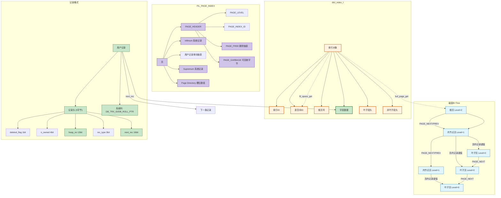
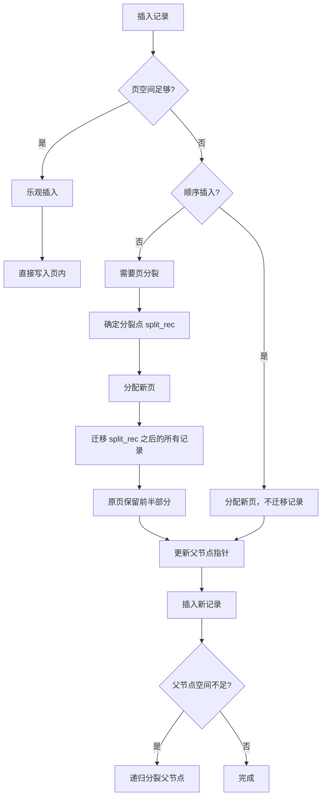
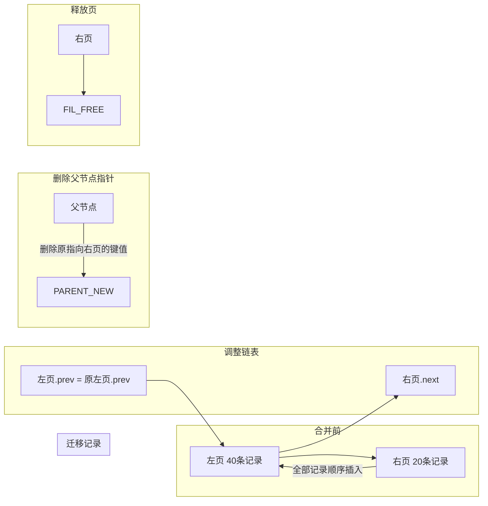
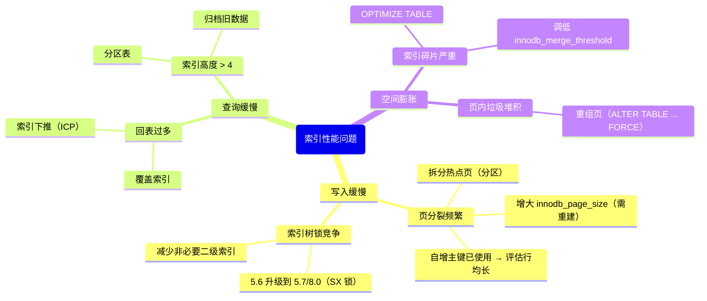

> **摘要**：  
> InnoDB 索引的本质是一棵 **B+Tree**，但教科书上的 B+Tree 和工程代码里的 B+Tree 是两种生物。教科书讲阶、讲分裂因子、讲平均填充度；工程代码讲**页、记录头、双向链表、悲观插入与乐观插入、SX 锁与树降级**。  
>  
> 本文从 `dict_index_t` 内存结构出发，系统拆解聚簇索引与二级索引的磁盘格式差异、索引根页的段头定位、以及 InnoDB 如何通过 `PAGE_LEVEL` 和 `PAGE_PREV/NEXT` 在物理无序的页面上构建逻辑有序的 B+Tree。深入 `btr0btr.cc` 源码，完整还原索引页分裂（乐观→悲观→分裂）、页合并（向左/向右）及页重组（`PAGE_GARBAGE` 回收）的完整决策树。生产实践部分提供索引碎片观测、`innodb_merge_threshold` 调优及死锁案例中的索引锁分析。最后基于 2026 年视角，讨论 LSM-Tree 对传统 B+Tree 索引的挑战，以及 InnoDB 为何始终未引入自适应合并/分裂阈值。

---

## 一、核心概念与底层图景

### 1.1 定义
**InnoDB 索引**是基于 B+Tree 数据结构在磁盘上的物理实现。每个索引对应一棵独立的 B+Tree，树的高度通常为 2～4 层，根页固定在某个页号，叶子页存放实际记录或主键引用，内节点页存放（键值，子页号）对。

**两类索引**：
- **聚簇索引**：叶子页存储完整行记录，表数据即索引，索引即数据。每个表有且仅有一个聚簇索引（主键或隐式 `ROW_ID`）。
- **二级索引**：叶子页存储（索引键值，主键）对，需通过主键回表查询聚簇索引。

**设计哲学**：
- **物理无序，逻辑有序**：页在磁盘上不连续，通过 `FIL_PAGE_PREV` 和 `FIL_PAGE_NEXT` 组成同级页双向链表。
- **固定页大小**：16KB 限制了一条记录的最大长度（约 8KB，因页内需容纳至少两条记录），超长字段走 BLOB 溢出页。
- **空间换时间**：页内预留 1/16 空间（`PAGE_DIRECTION` 优化顺序插入），减少页分裂频率。

### 1.2 架构全景



---

## 二、机制原理深度剖析

### 2.1 索引页内部结构

**Page Directory（页目录）**：
- 位于页尾，由多个**槽位（slot）**组成，每个槽位指向页内某条记录的偏移量。
- **并非二分查找的直接索引**——槽位指向的是该组记录的**最后一条**（n_owned 记录该组记录数）。
- 查找过程：
  1. 二分查找槽位数组，确定目标记录所在的组。
  2. 从该组的第一条记录开始遍历单向链表。

**n_owned 的妙用**：
- 页内记录按主键顺序串联成单向链表。
- 每 4～8 条记录为一组，组内**最后一条记录**的 `n_owned` 字段记录本组记录数，其余记录的 `n_owned = 0`。
- **槽位指向组内最后一条记录**，通过 `n_owned` 向前遍历组内记录。

**设计意图**：
- 避免每个记录都存储前向指针，节省空间。
- 二分查找 + 组内线性遍历，平衡查找效率与页内空间开销。

**PAGE_FREE 链表**：
- 记录被删除后不立即释放空间，而是加入 `PAGE_FREE` 链表。
- 新插入记录时优先复用 `PAGE_FREE` 链表中的空间（按大小匹配）。
- 仅当 `PAGE_FREE` 无合适空间时，才从 `PAGE_HEAP_TOP` 分配新空间。

**PAGE_GARBAGE**：
- 记录 `PAGE_FREE` 链表中所有记录的总字节数。
- `OPTIMIZE TABLE` 或页重组时，将 `PAGE_GARBAGE` 归零，空间压缩。

### 2.2 聚簇索引 vs 二级索引

| 特性 | 聚簇索引 | 二级索引 |
|------|--------|---------|
| **叶子页记录** | 完整行数据（所有字段） | (索引键值, 主键) |
| **每表数量** | 1 | 0～N |
| **记录移动代价** | 高（行迁移需修改所有二级索引） | 低（仅修改索引页） |
| **回表** | 不需要 | 必须 |
| **隐式主键** | 无主键时自动生成 6 字节 `ROW_ID` | 无影响 |

**聚簇索引记录必含三个系统列**（COMPACT/DYNAMIC）：

| 列 | 长度 | 说明 |
|----|------|------|
| `DB_TRX_ID` | 6 字节 | 最后修改此记录的事务 ID（MVCC） |
| `DB_ROLL_PTR` | 7 字节 | 指向 undo log 中前镜像版本的指针 |
| `DB_ROW_ID` | 6 字节 | 仅当无主键时生成，作为隐式聚簇索引键 |

**二级索引叶子记录**：
- **唯一索引**：`(索引字段, 主键字段)`。
- **非唯一索引**：`(索引字段, 主键字段)`——**主键必然存在**，用于回表及重复键判断。

### 2.3 索引分裂：从乐观到悲观



**分裂点（split_rec）选择策略**：
- **顺序插入**：新记录是页内最大值 → 分裂点为 `SUPREMUM`，**不迁移任何记录**，新页为空。
- **随机插入**：50-50 分裂，取页内中间记录作为分裂点。

```c
/* btr0pcur.cc - btr_page_split_and_insert */
rec_t* btr_page_get_split_rec(rec_t* left_rec, rec_t* right_rec) {
    /* 简单实现：取页内用户记录总数 / 2 */
    ulint n_recs = page_get_n_recs(page);
    rec_t* rec = page_rec_get_next(page_get_infimum_rec(page));
    for (i = 0; i < n_recs / 2; i++) {
        rec = page_rec_get_next(rec);
    }
    return rec;
}
```

**悲观插入路径**：
1. `page_cur_tuple_insert` 返回 `DB_FAIL`（页满）。
2. `btr_cur_optimistic_insert` 失败 → 进入 `btr_cur_pessimistic_insert`。
3. 调用 `btr_page_split_and_insert`。
4. 分裂前对索引树加 **SX 锁**（5.7+），防止其他线程同时修改树结构。

**SX 锁（共享排他锁）**：
- MySQL 5.6 及之前：分裂时对整棵索引加 **X 锁**，阻塞所有查询。
- MySQL 5.7 引入 SX 锁：分裂时加 SX 锁，**允许并发读，阻塞并发写**。
- MySQL 8.0 优化：SX 锁降级为**页锁 + 父节点特定记录锁**，减少锁范围。

### 2.4 索引合并：向左合并与向右合并

**触发条件**：
- `PAGE_LEVEL` = 0（叶子页）且 `PAGE_N_RECS` < `MERGE_THRESHOLD`（默认 50%）。
- purge 线程物理删除记录后检查页使用率。

```c
/* btr0btr.cc - btr_page_reorganize_low */
if (page_get_n_recs(page) * 2 < page_get_max_recs(page) 
    && !page_is_leaf(page)) {
    /* 非叶子页合并代价高，谨慎执行 */
    try_merge = true;
}
```

**向左合并（合并到左邻页）**：



**向右合并**（合并到右邻页）：
- 与向左合并对称，但需**更新父节点中的键值**（取右页最小键）。
- **代价更高**：需修改父节点索引记录。

**设计权衡**：
- 向左合并：无需修改父节点键值，速度快。
- 向右合并：保持键值语义，但需更新父节点。

### 2.5 页重组（reorganize）

**触发场景**：
- 页内 `PAGE_GARBAGE` > `PAGE_HEAP_TOP` 的 10%。
- `OPTIMIZE TABLE` 或 `ALTER TABLE ... FORCE`。

**执行过程**：
1. 分配临时页（`buf_page_create`）。
2. 遍历原页记录链表，顺序插入临时页（**压缩碎片**）。
3. 更新 `PAGE_HEAP_TOP`、`PAGE_FREE`、`PAGE_GARBAGE`。
4. 交换临时页与原页的缓冲池引用。
5. 释放临时页。

**收益**：
- 回收 `PAGE_FREE` 链表中的碎片空间。
- 重新紧凑排列记录，提高页内空间利用率。
- **代价**：复制整个页（16KB），持有页 X 锁。

---

## 三、内核/源码级实现

### 3.1 核心数据结构：`dict_index_t`

```c
/* storage/innobase/include/dict0mem.h */
struct dict_index_t {
    /* 索引标识 */
    index_id_t      id;                     /* 索引ID（全局唯一）*/
    char*           name;                  /* 索引名 */
    dict_table_t*   table;                 /* 反向引用所属表 */
    
    /* 存储定位 */
    space_id_t      space;                 /* 表空间ID */
    page_no_t       page;                  /* 根页号 */
    
    /* 段头（存储在根页的 PAGE_BTR_SEG_LEAF/TOP）*/
    fseg_header_t   seg_leaf;              /* 叶子段头（10字节）*/
    fseg_header_t   seg_top;               /* 非叶子段头（10字节）*/
    
    /* 索引类型 */
    uint16_t        type;                  /* DICT_CLUSTERED / DICT_UNIQUE / DICT_IBUF */
    uint16_t        n_fields;              /* 索引字段数 */
    uint16_t        n_unique;              /* 唯一字段数（通常= n_fields）*/
    uint16_t        n_nullable;           /* 可为空字段数 */
    
    /* 字段描述 */
    dict_field_t*   fields;               /* 字段数组 */
    
    /* 并发控制 */
    rw_lock_t       lock;                 /* 索引树锁（S/SX/X）*/
    
    /* 统计信息 */
    ulint           stat_n_rows;          /* 近似行数 */
    ulint           stat_n_leaf_pages;    /* 叶子页数 */
    lsn_t           stat_modified_counter;/* 统计信息失效标记 */
    
    /* 链表节点 */
    UT_LIST_NODE_T(dict_index_t) indexes; /* 表的所有索引链表 */
};
```

**段头（`fseg_header_t`）结构**：
```c
/* 10 字节结构，存储在根页 PAGE_BTR_SEG_LEAF 偏移 */
struct fseg_header_t {
    ulint   space;        /* 4B INODE 页所在表空间ID */
    ulint   page_no;      /* 4B INODE 页号 */
    ulint   offset;       /* 2B INODE 页内偏移 */
};
```

### 3.2 核心流程：记录查找（`btr_cur_search_to_nth_level`）

```c
/* storage/innobase/btr/btr0cur.cc */
void btr_cur_search_to_nth_level(
    dict_index_t* index, ulint level, const dtuple_t* tuple,
    ulint mode, btr_cur_t* cursor) {
    
    page_no_t page_no = index->page;  /* 从根页开始 */
    space_id_t space = index->space;
    
    for (;;) {
        /* 1. 读页 */
        buf_block_t* block = buf_page_get(space, page_no, ...);
        page_t* page = buf_block_get_frame(block);
        
        /* 2. 页内二分查找（通过 Page Directory）*/
        rec_t* rec = page_cur_search_with_match(
            page, index, tuple, &cursor->up_match, &cursor->low_match);
        
        /* 3. 若当前页已是目标层级，返回 */
        if (page_get_page_level(page) == level)
            break;
        
        /* 4. 否则获取子页号（非叶子页记录格式）*/
        page_no = btr_node_ptr_get_child_page_no(rec, index->n_fields - 1);
    }
    
    cursor->block = block;
    cursor->rec = rec;
}
```

**非叶子页记录格式**：
- 与叶子页相同记录头结构。
- 字段 0..(n_fields-2)：索引键值。
- 最后 1 个字段：4 字节子页号（`BTR_CHILD_PAGE_NO`）。

### 3.3 核心流程：页内插入（`page_cur_tuple_insert`）

```c
/* storage/innobase/page/page0cur.cc */
rec_t* page_cur_tuple_insert(
    page_cur_t* cursor, const dtuple_t* tuple, ulint n_ext) {
    
    page_t* page = cursor->page;
    
    /* 1. 计算记录长度 */
    ulint rec_size = rec_get_converted_size(tuple, n_ext);
    
    /* 2. 尝试复用 PAGE_FREE 链表 */
    rec_t* free_rec = page_header_get_ptr(page, PAGE_FREE);
    while (free_rec) {
        if (rec_get_deleted_len(free_rec) >= rec_size) {
            /* 复用空间 */
            rec_t* next = rec_get_next_ptr(free_rec);
            page_header_set_ptr(page, PAGE_FREE, next);
            /* 初始化记录内容 */
            rec_init(free_rec, tuple);
            return free_rec;
        }
        free_rec = rec_get_next_ptr(free_rec);
    }
    
    /* 3. 从堆顶分配新空间 */
    ulint heap_top = page_header_get_field(page, PAGE_HEAP_TOP);
    rec_t* rec = page_offset_to_ptr(page, heap_top);
    
    page_header_set_field(page, PAGE_HEAP_TOP, heap_top + rec_size);
    
    /* 4. 写记录内容 */
    rec_write(rec, tuple, n_ext);
    
    /* 5. 插入单向链表 */
    rec_t* next_rec = cursor->rec;
    rec_t* prev_rec = page_rec_get_prev(next_rec);
    rec_set_next_ptr(prev_rec, rec);
    rec_set_next_ptr(rec, next_rec);
    
    /* 6. 更新 Page Directory */
    page_dir_add_slot(page, rec, cursor->slot);
    
    /* 7. 更新页头统计 */
    page_header_set_field(page, PAGE_N_RECS, 
                          page_header_get_field(page, PAGE_N_RECS) + 1);
    page_header_set_ptr(page, PAGE_LAST_INSERT, rec);
    
    return rec;
}
```

### 3.4 核心流程：页分裂（`btr_page_split_and_insert`）

```c
/* storage/innobase/btr/btr0pcur.cc */
rec_t* btr_page_split_and_insert(
    btr_cur_t* cursor, dtuple_t* tuple, ulint n_ext, mtr_t* mtr) {
    
    page_t* page = buf_block_get_frame(cursor->block);
    
    /* 1. 获取索引树 SX 锁（5.7+）*/
    rw_lock_sx_lock(dict_index_get_lock(cursor->index));
    
    /* 2. 分配新页 */
    buf_block_t* new_block = btr_page_alloc(cursor->index, 0, ...);
    page_t* new_page = buf_block_get_frame(new_block);
    page_create(new_page, cursor->index, mtr);
    
    /* 3. 确定分裂点 */
    rec_t* split_rec = btr_page_get_split_rec(page);
    
    /* 4. 迁移记录 */
    if (split_rec == page_get_supremum_rec(page)) {
        /* 顺序插入：新页为空，不迁移 */
    } else {
        /* 移动 split_rec 之后的所有记录到新页 */
        rec_t* rec = page_rec_get_next(split_rec);
        while (rec != page_get_supremum_rec(page)) {
            rec_t* next_rec = page_rec_get_next(rec);
            btr_page_move_rec_to_page(new_page, page, rec, mtr);
            rec = next_rec;
        }
    }
    
    /* 5. 插入新记录到合适页 */
    rec_t* insert_rec;
    if (dtuple_cmp(tuple, split_rec) < 0) {
        insert_rec = page_cur_tuple_insert(cursor, tuple, n_ext);
    } else {
        page_cur_t new_cursor;
        page_cur_open(new_block, &new_cursor);
        insert_rec = page_cur_tuple_insert(&new_cursor, tuple, n_ext);
    }
    
    /* 6. 更新父节点指针 */
    btr_page_set_parent(new_block, cursor->block->page_no, mtr);
    btr_node_ptr_update(cursor->index, page, split_rec, new_block->page_no, mtr);
    
    /* 7. 释放 SX 锁 */
    rw_lock_sx_unlock(dict_index_get_lock(cursor->index));
    
    return insert_rec;
}
```

---

## 四、生产落地与 SRE 实战

### 4.1 场景化案例：自增主键仍发生页分裂？

**现象**：  
`id BIGINT AUTO_INCREMENT` 主键，插入呈严格顺序，但 `SHOW ENGINE INNODB STATUS` 仍频繁出现 `PAGE_EXTENT` 分配。

**根本原因**：
- 自增主键仅保证**逻辑顺序**，不保证**物理顺序**。
- 页分裂触发条件：页空间不足，与顺序插入无关。
- **顺序插入场景的分裂**：新页分配，旧页已满，**分裂点 = SUPREMUM**，不迁移记录，仅分配新页。
- **代价**：分配新页需修改父节点指针，仍会加索引树 SX 锁。

**验证**：
```sql
-- 查看索引页 LSN 变化频率
SHOW ENGINE INNODB STATUS\G
-- 搜索 "PAGE EXTENT ALLOC" 计数
```

**结论**：
- **自增主键无法消除页分裂，只能消除记录迁移**。
- 分裂频率与 `innodb_page_size` 及行均长相关。

### 4.2 参数调优矩阵

| 参数 | 作用域 | 8.0 推荐值 | 内核解释 |
|------|--------|-----------|---------|
| `innodb_page_size` | 全局 | 16KB（不可改） | 页分裂频率与页大小负相关，32KB 可降 50% 分裂，但回表 I/O 翻倍 |
| `innodb_merge_threshold` | 全局 | 50 | 页使用率低于此值时触发合并（5.7+），调低减少合并次数，调高激进回收空间 |
| `innodb_stats_persistent_sample_pages` | 全局 | 20 | 索引统计信息采样页数，影响 `cardinality` 准确性 |
| `innodb_adaptive_hash_index` | 全局 | OFF | 高并发写入关闭，避免索引分裂时 AHI 删除锁竞争 |
| `innodb_old_blocks_time` | 全局 | 1000 | 间接保护索引非叶子页不被扫描污染 |
| `innodb_fill_factor` | 全局 | 100 | Percona 参数，社区版无；保留页空间比例 |

**索引合并阈值调优**：

```sql
-- 表级别覆盖全局设置
ALTER TABLE t1 INDEX tab_idx MERGE_THRESHOLD = 40;
```

**适用场景**：
- **高频删除表**：调低阈值（30～40），减少合并频率，避免 I/O 抖动。
- **只读表**：调高阈值（60～70），激进回收空间，降低磁盘占用。

### 4.3 监控与诊断

**1. 索引碎片率**

```sql
SELECT 
    table_name,
    index_name,
    stat_value * @@innodb_page_size / 1024 / 1024 AS mb_used,
    (SELECT stat_value FROM mysql.innodb_index_stats 
     WHERE database_name = 'db' AND table_name = 't1' 
     AND index_name = 'idx' AND stat_name = 'size') * @@innodb_page_size / 1024 / 1024 AS mb_allocated
FROM mysql.innodb_index_stats
WHERE database_name = 'db' AND table_name = 't1' 
AND stat_name = 'n_pages_freed';
```

**2. 页分裂/合并频率**

```sql
-- 8.0.20+ 通过 METRICS 表
SELECT * FROM information_schema.INNODB_METRICS
WHERE NAME IN ('index_page_splits', 'index_page_merges', 'index_page_reorg');
```

**3. 索引高度**

```sql
-- 通过 STATISTICS 表间接估算
SELECT 
    table_name, 
    index_name, 
    stat_value AS pages_per_level
FROM mysql.innodb_index_stats
WHERE stat_name = 'page_number'
ORDER BY stat_value DESC;
```

**4. 现场观测页分裂堆栈**

```bash
# 使用 perf 采集 btr_page_split_and_insert 调用栈
perf record -p `pidof mysqld` -e probe:inno:btr_page_split_and_insert -ag -- sleep 30
perf report
```

### 4.4 故障排查决策树



### 4.5 死锁案例：间隙锁与插入意向锁

**场景**：
```sql
-- 事务1
SELECT * FROM t WHERE id > 10 FOR UPDATE;

-- 事务2
INSERT INTO t (id, name) VALUES (11, 'x');
```

**索引结构**：
- `id` 是主键，聚簇索引。
- 表内现有 id = 5, 15, 25。

**锁分析**：
1. 事务1 的 `SELECT ... FOR UPDATE` 是**范围查询（RR 隔离级别）**。
2. InnoDB 对 id = 15, 25 加 **next-key 锁**（记录锁 + 间隙锁）。
3. 间隙锁范围：(10, 15] 和 (15, 25] 等。
4. 事务2 插入 id = 11，需在 (10, 15) 间隙加**插入意向锁**。
5. 插入意向锁与事务1 的间隙锁**不兼容**，事务2 等待。

**根本原因**：
- 间隙锁锁定**记录之间的空隙**，而非记录本身。
- 插入意向锁是特殊的 `LOCK_GAP | LOCK_INSERT_INTENTION`。

**解法**：
- 降级隔离级别为 RC（无间隙锁）。
- 明确锁定已知记录：`WHERE id IN (15, 25)`。
- 缩小事务范围。

---

## 五、技术演进与 2026 年视角

### 5.1 历史设计约束与改进

| 版本 | 索引变化 | 动因 |
|------|--------|------|
| 4.0 | 仅支持聚簇索引，二级索引需显式声明 | InnoDB 初期设计 |
| 5.0 | 支持自适应哈希索引 | 优化点查 |
| 5.6 | 索引下推（ICP） | 减少回表次数 |
| 5.7 | 支持索引页合并阈值可调 | 控制碎片 |
| 5.7 | SX 锁替代 X 锁 | 减少索引分裂写阻塞 |
| 8.0 | 降序索引 | 支持 `ORDER BY DESC` 优化 |
| 8.0 | 隐藏索引（invisible） | 软删除索引，平滑下线 |
| 8.0.12+ | 快速 ADD INDEX（临时表不复用）| 减少 DDL 空间占用 |

### 5.2 2026 年仍存在的“遗留设计”

1. **索引高度无法预读**  
   即使已知 B+Tree 高度为 3，仍须从根页依次下钻，无法直接跳转至目标叶子页链。  
   **现状**：8.0 无改进，预读只针对叶子页线性扫描。

2. **分裂点固定 50%**  
   教科书式的 50% 分裂对随机写入公平，但**对顺序写入不友好**（新页仅 0% 占用）。  
   **更优方案**：80%-20% 分裂，保留更多空间在热点页。  
   **现状**：Percona Server 已支持 `innodb_split_freespace`，社区版未合入。

3. **合并代价过高**  
   页合并需修改父节点，且向右合并须更新父节点键值，产生**连锁更新**。  
   **现状**：InnoDB 优先向左合并，8.0 无改进。

4. **无法在线修改 MERGE_THRESHOLD**  
   8.0 支持表级覆盖，但**不支持动态调整全局默认值**。  
   **现状**：5.7 已支持全局，8.0 同。

### 5.3 未来趋势：B+Tree 会被取代吗？

**LSM-Tree（RocksDB）的挑战**：
- 写放大：B+Tree 随机写入需多次页分裂，LSM-Tree 顺序写入，吞吐量高 5～10 倍。
- 空间放大：B+Tree 页内碎片，LSM-Tree 压缩率高。
- 读放大：LSM-Tree 需合并多层 SSTable，B+Tree 点查稳定 2～3 次 I/O。

**InnoDB 的反击**：
- **写优化**：8.0 已大幅改善刷脏并行度，但 B+Tree 架构限制依然存在。
- **透明页压缩**：压缩率已接近 LSM-Tree 的 ZSTD。
- **未来路线图**：未见替换 B+Tree 的计划，InnoDB 将在“中等写入、低延迟读取”场景持续统治。

**2026 年现实**：
- **OLTP 核心交易**：100% B+Tree。
- **日志/时序数据**：RocksDB / MyRocks。
- **混合负载**：MySQL + 侧边 Kafka → ClickHouse。

**InnoDB 索引的未来演进**：
- **持久化哈希索引**：云厂商定制分支已实现，社区版仍需等待。
- **智能分裂/合并**：基于历史负载自动调整分裂点。
- **索引在线重组**：现有 `OPTIMIZE TABLE` 需复制表，未来可能实现页级在线重组。

---

## 六、结语：二十年的 B+Tree，仍是 OLTP 之王

InnoDB 的 B+Tree 实现不是最先进的，也不是最快的，但它是**最稳定、最可预测**的。  
每一条记录都在它应该在的位置，每一次查找都走固定的 2～4 次 I/O，每一次崩溃恢复都能精确重建索引结构。

这种确定性，是 OLTP 系统的生命线。  
当你的交易系统每秒钟处理 1 万笔订单，你不需要一个有时写放大 5 倍、有时写放大 20 倍的 LSM-Tree。  
你需要的是 B+Tree——它也许不够时髦，但绝不会在你结账时掉链子。

**这就是 InnoDB 索引的选择哲学：用 5% 的写性能，换取 100% 的读稳定**。

---

## 参考文献
- `storage/innobase/btr/btr0btr.cc`, `btr0cur.cc`, `btr0pcur.cc` MySQL 8.0.33 源码
- `storage/innobase/page/page0cur.cc`, `page0page.cc`
- `storage/innobase/dict/dict0mem.cc` – `dict_index_t`
- MySQL Internals Manual – InnoDB B+Tree Indexing
- Oracle Blogs: “InnoDB Index Page Splitting” (2010, 2020 update)
- Percona Live 2025: “B+Tree vs LSM: The Unpopular Truth”