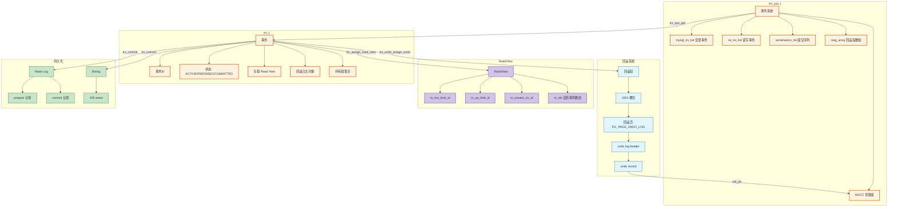
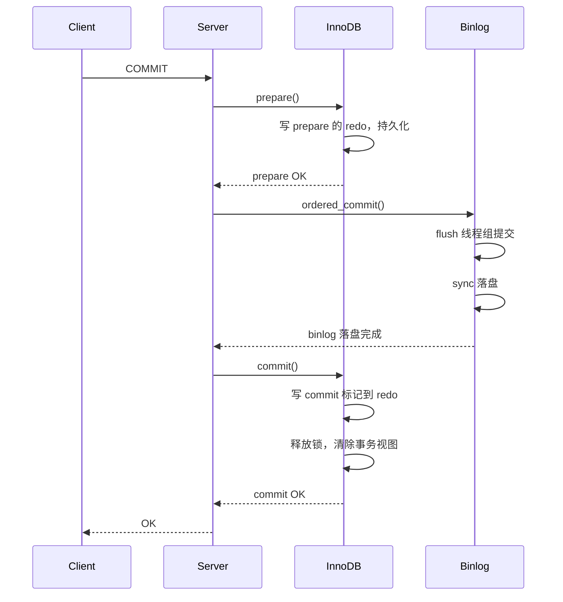
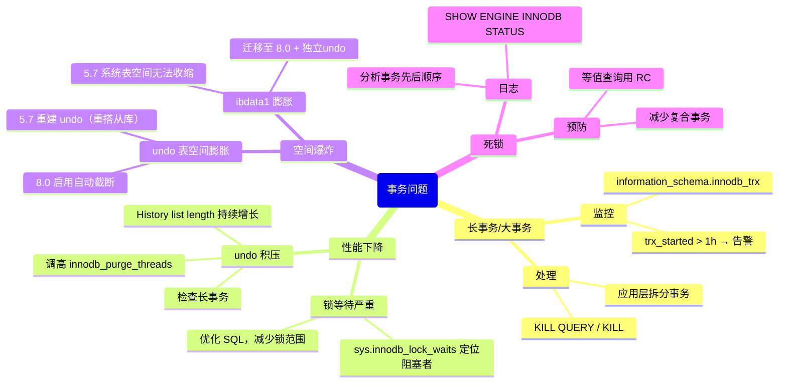

> **摘要**：  
> 事务是 InnoDB 区别于 MyISAM 最根本的特性，也是其成为 OLTP 首选引擎的核心原因。但“支持事务”这四个字的背后，是**回滚段**、**Read View**、**purge 线程**、**两阶段提交**等一系列精密组件的协同运转。  
>  
> 本文从 `trx_t` 内存结构出发，系统拆解 InnoDB 事务系统的四大支柱：**原子性**由 undo log 保障，**一致性**由 MVCC + 约束 + 崩溃恢复共同达成，**隔离性**通过 Read View 和锁实现，**持久性**依赖 redo log + 双写缓冲。深入 `trx0trx.cc` 源码，完整还原事务 ID 分配、Read View 创建、可见性判断、回滚操作及崩溃恢复中 XA 协调的全流程。生产实践部分提供长事务监控、undo 表空间回收及死锁日志分析实战。最后基于 2026 年视角，讨论 MVCC 历史版本链在 PMEM 时代的重构可能，以及 Read View 全局分发在高并发下的优化方向。

---

## 一、核心概念与底层图景

### 1.1 定义
**InnoDB 事务**是数据库执行的**逻辑工作单元**，具有 ACID 特性：

| 特性 | 保障机制 | 代价 |
|------|--------|------|
| **原子性** | Undo Log（回滚段） | 每行记录额外 7 字节回滚指针 + undo 表空间 I/O |
| **一致性** | MVCC + 约束 + 崩溃恢复 | Read View 分配与可见性判断 CPU 开销 |
| **隔离性** | Read View（快照读）/ 锁（当前读） | 锁竞争、死锁检测 |
| **持久性** | Redo Log + 双写缓冲 | 日志写 fsync、写放大 |

**设计哲学**：
- **日志先行**：数据页修改前必须保证 redo log 已落盘。
- **多版本共存**：不直接覆盖旧数据，通过 undo log 保留历史版本。
- **悲观与乐观并存**：普通读不加锁，写操作加行锁，死锁检测兜底。

### 1.2 架构全景



---

## 二、机制原理深度剖析

### 2.1 事务管理：`trx_sys_t` 全局中枢

InnoDB 启动时初始化 `trx_sys_t`，管理全部事务生命周期。

```c
/* storage/innobase/include/trx0sys.h */
struct trx_sys_t {
    /* 互斥锁保护除事务ID分配外的所有字段 */
    ib_mutex_t      mutex;
    
    /* 事务ID分配 */
    trx_id_t        rw_max_trx_id;      /* 下一个可分配事务ID（原子操作）*/
    
    /* 事务链表 */
    UT_LIST_BASE_NODE_T(trx_t) mysql_trx_list;  /* 全部事务 */
    UT_LIST_BASE_NODE_T(trx_t) rw_trx_list;     /* 读写事务（修改数据）*/
    UT_LIST_BASE_NODE_T(trx_t) serialisation_list; /* 提交中事务 */
    
    /* MVCC 核心 */
    MVCC*           mvcc;               /* 多版本控制器 */
    
    /* 回滚段数组 */
    trx_rseg_t*     rseg_array[TRX_SYS_N_RSEGS]; /* 默认128个 */
    ulint           rseg_history_len;   /* 历史链表总长度 */
    
    /* 动态游标（用于purge）*/
    trx_id_t        no_trx_id;          /* 已purge的最大事务ID */
    trx_id_t        roll_ptr;           /* 保留 */
};
```

**事务ID分配**：
- 只读事务**不分配**事务ID（5.7+，8.0彻底分离）。
- 第一次执行 DML 时通过 `trx_assign_rw_trx_id` 获取 `rw_max_trx_id++`。
- 事务ID 是 64 位无符号整数，**永不回绕**（理论上限 1.8×10¹⁹，可写 3 万年）。

### 2.2 回滚段与 undo log

**回滚段组织**（`trx_rseg_t`）：

```c
/* storage/innobase/include/trx0rseg.h */
struct trx_rseg_t {
    /* 磁盘定位 */
    space_id_t      space;              /* 表空间ID（系统/独立undo）*/
    page_no_t       page_no;           /* 段头页号 */
    
    /* 内存状态 */
    ulint           id;                /* 回滚段ID 0..127 */
    ulint           size;             /* 当前页数 */
    
    /* undo 链表 */
    UT_LIST_BASE_NODE_T(trx_undo_t) undo_list;     /* 活跃事务undo */
    UT_LIST_BASE_NODE_T(trx_undo_t) undo_cached;   /* 缓存待重用undo */
    
    /* 历史链表 */
    flst_base_node_t history;          /* 已提交事务undo链 */
    ulint           history_len;      /* 历史链表长度 */
    
    /* 引用计数 */
    ulint           trx_ref_count;    /* 使用该段的事务数 */
};
```

**undo log 类型**：

| 类型 | 操作 | 存储内容 | 合并时动作 |
|------|------|--------|-----------|
| `TRX_UNDO_INSERT` | INSERT | 主键值 | 删除记录 |
| `TRX_UNDO_UPD_EXIST_REC` | UPDATE | 被修改字段前镜像 | 回滚更新 |
| `TRX_UNDO_DEL_MARK_REC` | DELETE | 主键值 | 去掉删除标记 |
| `TRX_UNDO_UPD_DEL_REC` | 更新已标记删除记录 | 前镜像 | 恢复旧值 |

**回滚记录格式**（`TRX_UNDO_UPD_EXIST_REC`）：

```
[undo log header]  — 事务ID、表ID、回滚段指针
[主键字段]         — 变长，用于定位记录
[更新字段数]       — 1～N
[字段1 位置]       — 字段号（如 5）
[字段1 旧长度]     — 变长字段原长度
[字段1 旧数据]     — 前镜像
[字段2 位置]      ...
```

**设计意图**：
- **不存储完整行记录**，仅存储被修改字段的前值，节省 undo 空间。
- **INSERT 仅存主键**：回滚时直接根据主键删除，无需前镜像。

### 2.3 MVCC 与 Read View

**Read View 结构**：

```c
/* storage/innobase/include/read0types.h */
class ReadView {
private:
    /* 所有事务ID必须 < low_limit_id 才可能可见 */
    trx_id_t    m_low_limit_id;      /* 大于所有活跃事务ID */
    
    /* 所有事务ID必须 ≥ up_limit_id 才需要检查m_ids */
    trx_id_t    m_up_limit_id;       /* 活跃事务中最小ID */
    
    /* 创建该 Read View 的事务ID（用于自身可见性）*/
    trx_id_t    m_creator_trx_id;
    
    /* 活跃事务ID列表（有序）*/
    ids_t       m_ids;
    
    /* 8.0 新增：是否已关闭（复用池）*/
    bool        m_closed;
};
```

**可见性判断规则**（`changes_visible`）：

```c
bool changes_visible(trx_id_t id, const table_name_t& name) const {
    /* 1. 事务ID小于最小活跃事务 → 已提交，可见 */
    if (id < m_up_limit_id) {
        return true;
    }
    
    /* 2. 当前事务自己的修改 → 可见 */
    if (id == m_creator_trx_id) {
        return true;
    }
    
    /* 3. 事务ID大于等于最大活跃事务 → 未来事务，不可见 */
    if (id >= m_low_limit_id) {
        return false;
    }
    
    /* 4. 在活跃事务列表中 → 不可见 */
    if (std::binary_search(m_ids.begin(), m_ids.end(), id)) {
        return false;
    }
    
    /* 5. 其他情况（已提交但晚于Read View创建）→ 不可见（RR）*/
    return false;
}
```

**RC vs RR 差异**：
- **RC**：语句开始时创建 Read View，执行完后立即释放。
- **RR**：事务中第一条 `SELECT`（快照读）创建 Read View，直到事务提交才释放。

**8.0 优化**：
- `m_ids` 数组使用 `std::vector` 存储，二分查找。
- 引入 `ReadView` 复用池（`read_view_pool`），减少内存分配开销。

### 2.4 两阶段提交与内部 XA



**崩溃恢复逻辑**：
1. 扫描 redo log，收集处于 `TRX_STATE_PREPARED` 的事务。
2. 扫描 binlog，收集所有 `XID_EVENT` 对应的 XID。
3. 若 prepare 事务的 XID 在 binlog 中存在 → **提交**。
4. 若 prepare 事务的 XID 不在 binlog 中 → **回滚**。

**历史缺陷**（MySQL 5.7及之前）：
- `XA PREPARE` 阶段**先写 binlog，再写 prepare redo**。
- 若写完 binlog 后崩溃，主库回滚事务，从库已收到 binlog → **主从不一致**。
- **8.0.33 修复**：调整顺序，先写 prepare redo，再写 binlog。

---

## 三、内核/源码级实现

### 3.1 核心数据结构：`trx_t`

```c
/* storage/innobase/include/trx0trx.h */
struct trx_t {
    /* 事务标识 */
    trx_id_t        id;                 /* 事务ID（读写事务）*/
    trx_id_t        no;                 /* purge 用序号 */
    
    /* 状态 */
    enum trx_state  state;              /* NOT_STARTED / ACTIVE / PREPARED / COMMITTED */
    ulint           isolation_level;    /* RC / RR / 可串行化 */
    bool            read_only;         /* 只读事务 */
    bool            auto_commit;       /* 自动提交模式 */
    
    /* 事务开始时间 */
    time_t          start_time;        /* 用于监控长事务 */
    lsn_t           start_lsn;        /* 启动时LSN（回滚段分配）*/
    
    /* MVCC */
    ReadView*       read_view;         /* 当前事务的 Read View */
    
    /* 回滚段分配 */
    trx_rsegs_t     rsegs;            /* INSERT / UPDATE 回滚段 */
    undo_no_t       undo_no;          /* 当前undo log序号 */
    trx_undo_t*     insert_undo;      /* INSERT undo 对象 */
    trx_undo_t*     update_undo;      /* UPDATE/DELETE undo 对象 */
    
    /* 锁系统 */
    lock_t*         lock_heap;        /* 锁对象内存池 */
    UT_LIST_BASE_NODE_T(lock_t) trx_lock_list; /* 事务持有的锁 */
    
    /* 事务链表节点 */
    UT_LIST_NODE_T(trx_t) trx_list;   /* mysql_trx_list */
    UT_LIST_NODE_T(trx_t) rw_trx_list; /* rw_trx_list */
    
    /* 两阶段提交 */
    XID             xid;              /* XA 事务ID */
    bool            xid_prepared;     /* 是否已prepare */
    
    /* 8.0 专用：临时表空间回滚段 */
    trx_rseg_t*     rseg_tmp;         /* 临时表专用回滚段 */
    
    /* 统计信息 */
    lsn_t           commit_lsn;       /* 提交时LSN */
};
```

### 3.2 核心流程：Read View 创建

```c
/* storage/innobase/read/read0read.cc */
ReadView* trx_assign_read_view(trx_t* trx) {
    if (trx->read_view) {
        return trx->read_view;  /* RR 事务复用已有 Read View */
    }
    
    /* 1. 从全局MVCC分配新ReadView */
    ReadView* view = trx_sys->mvcc->create_view();
    
    /* 2. 取当前最大事务ID+1 */
    view->m_low_limit_id = trx_sys->rw_max_trx_id;
    
    /* 3. 收集活跃读写事务ID */
    trx_sys_mutex_enter();
    
    /* 3.1 最小活跃事务ID */
    trx_t* oldest_rw = UT_LIST_GET_FIRST(trx_sys->rw_trx_list);
    view->m_up_limit_id = oldest_rw ? oldest_rw->id : view->m_low_limit_id;
    
    /* 3.2 复制全部活跃事务ID到m_ids数组 */
    view->m_ids.clear();
    trx_t* rw_trx;
    UT_LIST_FOREACH(rw_trx, trx_sys->rw_trx_list) {
        if (rw_trx->id != trx->id) {  /* 排除自身 */
            view->m_ids.push_back(rw_trx->id);
        }
    }
    
    trx_sys_mutex_exit();
    
    /* 4. 记录创建者事务ID */
    view->m_creator_trx_id = trx->id;
    
    trx->read_view = view;
    return view;
}
```

### 3.3 核心流程：记录可见性判断

```c
/* storage/innobase/row/row0sel.cc - row_search_mvcc */
rec_t* row_search_mvcc(...) {
    /* 1. 从聚簇索引定位记录 */
    rec_t* rec = btr_cur_search(...);
    
    /* 2. 获取记录的事务ID和回滚指针 */
    trx_id_t rec_trx_id = row_get_rec_trx_id(rec, index);
    undo_ptr_t roll_ptr = row_get_rec_roll_ptr(rec, index);
    
    /* 3. 可见性判断 */
    if (read_view_sees_trx_id(view, rec_trx_id)) {
        return rec;  /* 直接可见 */
    }
    
    /* 4. 不可见 → 构建历史版本 */
    rec_t* old_vers;
    trx_undo_prev_version(rec, index, rec_trx_id, roll_ptr, &old_vers);
    
    /* 5. 递归判断旧版本是否可见 */
    while (old_vers) {
        rec_trx_id = row_get_rec_trx_id(old_vers, index);
        if (read_view_sees_trx_id(view, rec_trx_id)) {
            return old_vers;
        }
        /* 继续沿回滚指针向前追溯 */
        trx_undo_prev_version(old_vers, index, ...);
    }
    
    return NULL;  /* 记录对当前事务不可见 */
}
```

### 3.4 核心流程：事务回滚

```c
/* storage/innobase/trx/trx0roll.cc */
dberr_t trx_rollback_active(trx_t* trx) {
    /* 1. 按undo log逆序回滚 */
    trx_undo_t* undo = trx->update_undo;
    
    while (undo) {
        /* 1.1 获取该undo页内所有记录 */
        page_t* page = trx_undo_page_get(undo);
        rec_t* rec = trx_undo_rec_get(page);
        
        while (rec) {
            switch (trx_undo_rec_get_type(rec)) {
            case TRX_UNDO_INSERT:
                /* INSERT 回滚：根据主键删除记录 */
                row_undo_ins(rec);
                break;
                
            case TRX_UNDO_UPD_EXIST_REC:
                /* UPDATE 回滚：恢复前镜像 */
                row_undo_upd(rec);
                break;
                
            case TRX_UNDO_DEL_MARK_REC:
                /* DELETE 回滚：去掉删除标记 */
                row_undo_del_mark(rec);
                break;
            }
            rec = trx_undo_rec_get_next(rec);
        }
        
        undo = undo->next;
    }
    
    /* 2. 清理undo log */
    trx_undo_commit_cleanup(trx);
    
    /* 3. 释放锁 */
    lock_release(trx);
    
    trx->state = TRX_STATE_NOT_STARTED;
    return DB_SUCCESS;
}
```

---

## 四、生产落地与 SRE 实战

### 4.1 场景化案例：长事务导致 undo 表空间爆炸

**现象**：
- 磁盘告警，`undo_001` 文件占用 500GB+。
- `SHOW ENGINE INNODB STATUS` 显示 `History list length` 持续 > 100 万。
- `information_schema.innodb_trx` 发现一个 `trx_started` 为 3 天前的 `SELECT` 查询。

**根本原因**：
- **可重复读隔离级别**下，事务首次 `SELECT` 创建 Read View，直到事务提交才释放。
- 该 Read View 引用了大量旧版本的 undo 记录，阻止 purge 线程回收。
- 3 天内的所有被修改记录的历史版本均保留在 undo 表空间。

**紧急处理**：

```sql
-- 1. 查找长事务
SELECT trx_id, trx_started, TIMESTAMPDIFF(HOUR, trx_started, NOW()) AS hours
FROM information_schema.innodb_trx
ORDER BY trx_started
LIMIT 5;

-- 2. 终止长事务（生产需确认业务影响）
KILL QUERY [trx_mysql_thread_id];
KILL [trx_mysql_thread_id];
```

**预防措施**：

```ini
[mysqld]
-- 设置长事务超时自动回滚（8.0+）
transaction_timeout = 3600           -- 事务总时长超1小时回滚
transaction_isolation = READ-COMMITTED  -- 使用RC，减少历史版本依赖
```

**undo 表空间收缩**（8.0+）：

```sql
-- 1. 检查undo状态
SELECT name, state FROM information_schema.innodb_tablespaces 
WHERE name LIKE '%undo%';

-- 2. 标记undo表空间为非活跃
ALTER UNDO TABLESPACE innodb_undo_001 SET INACTIVE;

-- 3. 等待purge线程处理完该表空间内所有历史记录（监控History list length归零）
-- 4. 收缩文件
ALTER UNDO TABLESPACE innodb_undo_001 SET ACTIVE;  -- 实际是重建
```

### 4.2 参数调优矩阵

| 参数 | 作用域 | 8.0 推荐值 | 内核解释 |
|------|--------|-----------|---------|
| `innodb_undo_tablespaces` | 全局 | 2（默认） | 独立undo表空间数量，0表示存在系统表空间 |
| `innodb_rollback_segments` | 全局 | 128 | 回滚段数量（8.0不可改，默认128） |
| `innodb_undo_log_truncate` | 全局 | ON | 是否自动收缩undo表空间 |
| `innodb_max_undo_log_size` | 全局 | 1G～4G | 单个undo表空间上限，超过后触发截断 |
| `innodb_purge_threads` | 全局 | 4～8 | purge 线程数，undo积压时调高 |
| `innodb_purge_batch_size` | 全局 | 300～1000 | 单次批处理undo记录数 |
| `transaction_isolation` | 全局/会话 | READ-COMMITTED | 默认RR，RC可减少gap锁和undo积压 |
| `transaction_timeout` | 会话 | 3600（秒） | 8.0.29+，事务超时自动回滚 |
| `max_execution_time` | 会话 | 30000（ms） | SELECT 超时，防止慢查询变长事务 |

### 4.3 监控与诊断

**1. 事务活跃度**

```sql
-- 当前运行事务
SELECT trx_id, trx_state, trx_started, 
       TIMESTAMPDIFF(SECOND, trx_started, NOW()) AS seconds,
       trx_rows_modified, trx_isolation_level
FROM information_schema.innodb_trx;

-- 按用户聚合
SELECT trx_mysql_thread_id, trx_query 
FROM information_schema.innodb_trx
WHERE trx_query IS NOT NULL;
```

**2. undo 空间监控**

```sql
-- 8.0 undo 表空间使用量
SELECT tablespace_name, file_name, 
       ROUND(allocated_size / 1024 / 1024) AS mb
FROM performance_schema.files
WHERE file_name LIKE '%undo%';

-- history list length（积压指标）
SHOW ENGINE INNODB STATUS\G
-- 搜索 "History list length"
```

**3. Read View 分配**

```sql
-- 8.0.23+ 通过 METRICS 表
SELECT * FROM information_schema.innodb_metrics
WHERE NAME IN ('trx_rw_commits', 'trx_ro_commits', 'trx_nl_ro_commits');
```

**4. 事务锁等待**

```sql
SELECT 
    waiting_trx_id, waiting_thread, waiting_query,
    blocking_trx_id, blocking_thread, blocking_query,
    wait_age, lock_type, lock_mode
FROM sys.innodb_lock_waits;
```

### 4.4 故障排查决策树



### 4.5 死锁分析实战

**死锁日志**（SHOW ENGINE INNODB STATUS 片段）：

```
------------------------
LATEST DETECTED DEADLOCK
------------------------
*** (1) TRANSACTION:
TRANSACTION 329647, ACTIVE 0 sec starting index read
mysql tables in use 1, locked 1
LOCK WAIT 3 lock struct(s), heap size 1136, 2 row lock(s)
MySQL thread id 123, OS thread handle 47238383144960, query id 7801 updating
UPDATE t SET balance = balance - 100 WHERE id = 1

*** (1) HOLDS THE LOCK(S):
RECORD LOCKS space id 10 page no 4 n bits 72 index PRIMARY of table `db`.`t`
trx id 329647 lock_mode X locks rec but not gap
Record lock, heap no 2 PHYSICAL RECORD: n_fields 4 ...

*** (1) WAITING FOR THIS LOCK TO BE GRANTED:
RECORD LOCKS space id 10 page no 4 n bits 72 index PRIMARY of table `db`.`t`
trx id 329647 lock_mode X locks rec but not gap waiting
Record lock, heap no 3 PHYSICAL RECORD: n_fields 4 ...

*** (2) TRANSACTION:
TRANSACTION 329648, ACTIVE 0 sec starting index read
mysql tables in use 1, locked 1
3 lock struct(s), heap size 1136, 2 row lock(s)
MySQL thread id 124, OS thread handle 47238383145920, query id 7802 updating
UPDATE t SET balance = balance - 50 WHERE id = 2

*** (2) HOLDS THE LOCK(S):
RECORD LOCKS space id 10 page no 4 n bits 72 index PRIMARY of table `db`.`t`
trx id 329648 lock_mode X locks rec but not gap
Record lock, heap no 3 PHYSICAL RECORD: n_fields 4 ...

*** (2) WAITING FOR THIS LOCK TO BE GRANTED:
RECORD LOCKS space id 10 page no 4 n bits 72 index PRIMARY of table `db`.`t`
trx id 329648 lock_mode X locks rec but not gap waiting
Record lock, heap no 2 PHYSICAL RECORD: n_fields 4 ...
```

**分析结论**：
- 事务1 持有 id=1 的锁，等待 id=2。
- 事务2 持有 id=2 的锁，等待 id=1。
- **典型双向循环等待**。

**根本原因**：
- 两个事务**以不同顺序**更新同一组主键记录。
- 隔离级别 RR，但操作无 gap lock（等值条件）。

**解法**：
- **统一访问顺序**：在代码层对主键排序，确保所有事务按相同顺序更新记录。
- **重试机制**：捕获死锁错误（`ER_LOCK_DEADLOCK`），自动重试。

---

## 五、技术演进与 2026 年视角

### 5.1 历史设计约束与改进

| 版本 | 事务变化 | 动因 |
|------|--------|------|
| 4.0 | 引入 MVCC，支持 REPEATABLE READ | 与 Oracle 兼容 |
| 5.5 | 独立 undo 表空间（`innodb_undo_tablespaces`）| 减少系统表空间膨胀 |
| 5.6 | 只读事务不分配事务ID | 降低 `trx_sys->mutex` 竞争 |
| 5.7 | 临时表独立回滚段 | 减少系统表空间 I/O |
| 8.0 | Read View 复用池 | 优化高并发只读场景 |
| 8.0.33 | 修复 XA prepare 顺序 | 解决主从数据不一致 |
| 8.0.29+ | `transaction_timeout` | 治理长事务 |

### 5.2 2026 年仍存在的“遗留设计”

1. **MVCC 版本链线性遍历**  
   回滚指针链可能长达数百个版本，每次快照读都需遍历。  
   **现状**：8.0 无优化，极端场景（长事务+高频更新）导致查询延迟飚升。  
   **社区方案**：版本链跳跃索引（Percona 实验特性），未合入。

2. **Read View 分发全局锁**  
   `trx_sys->mutex` 在创建 Read View 时需遍历 `rw_trx_list`。  
   **8.0 优化**：已改为 RCU 式无锁读？不，仍持有互斥锁。  
   **现状**：万并发实例下 `trx_sys_mutex_enter` 仍是热点。

3. **undo 表空间扩容需重启**  
   8.0 支持动态 `SET INACTIVE/ACTIVE` 实现收缩，但**不能在线扩容**（增加新文件）。  
   **现状**：需规划初始大小，后续扩增需重建实例。

4. **可重复读幻读未彻底解决**  
   前文已述，当前读与快照读交错可产生逻辑“幻读”。  
   **现状**：官方文档承认，标记为“符合 SQL 标准但非完全可串行化”。

### 5.3 未来趋势：PMEM 时代的 MVCC 重构

**持久内存（PMEM）特性**：
- 字节寻址，延迟接近 DRAM（300ns）。
- 持久化，写入后不丢失。

**对事务系统的冲击**：
- **Undo Log 可变为内存结构**：回滚段可放在 PMEM 上，事务提交无需写磁盘，仅持久化 Commit Record。
- **MVCC 版本链可直接指针引用**：当前 `roll_ptr` 是磁盘页偏移，未来可直接映射为 PMEM 虚拟地址。
- **崩溃恢复**：无需扫描 redo log 重建版本链，直接从 PMEM 读取最新状态。

**现状**：
- 8.0.28+ 实验性支持 PMEM，仅限数据文件 mmap。
- 事务子系统尚未适配。

**预测**：
- 2030 年前，InnoDB 将引入**混合存储引擎**——热数据页在 PMEM 上，冷数据页在 SSD 上，事务版本链跨介质存储。
- MVCC 可见性判断从“根据事务ID”扩展为“根据 LSN + 介质类型”。

---

## 六、结语：事务是权衡的艺术

InnoDB 的事务实现不是最完美的，但它是**生产环境验证最充分的**。  
它用 6 字节事务 ID、7 字节回滚指针、Read View 数组，支撑了每秒数万笔交易，且**在崩溃时总能恢复到一致状态**。

这份设计背后是无数个权衡：
- **可重复读 vs 幻读**——选择性能，接受逻辑异常。
- **独立 undo 表空间 vs 系统表空间**——选择灵活性，增加运维复杂度。
- **XA 两阶段提交 vs 日志状态同步**——选择一致性，付出准备阶段 I/O 代价。

**事务系统的演进，本质是在一致性、性能、可用性三角中不断寻找新的平衡点**。

---

## 参考文献
- `storage/innobase/trx/trx0trx.cc`, `trx0rseg.cc`, `trx0undo.cc` MySQL 8.0.33 源码
- `storage/innobase/read/read0read.cc` – Read View
- `storage/innobase/row/row0sel.cc` – row_search_mvcc
- MySQL Internals Manual – InnoDB Transaction System
- Oracle Blogs: “MySQL 8.0: Read View and MVCC” (2019)
- Oracle Blogs: “Improvements to InnoDB Undo Tablespace” (2020)
- Percona Live 2025: “Transaction Timeout in MySQL 8.0: Three Years Later”