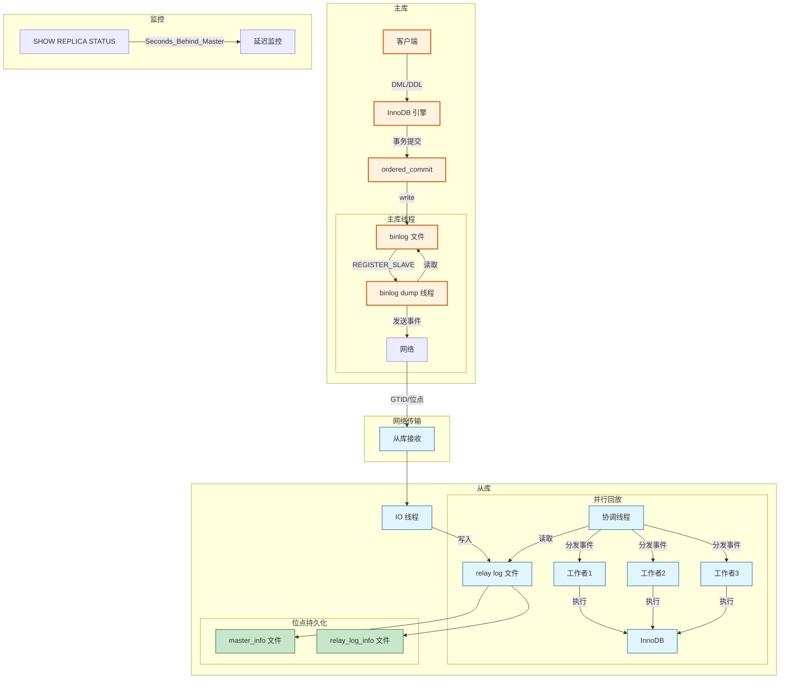
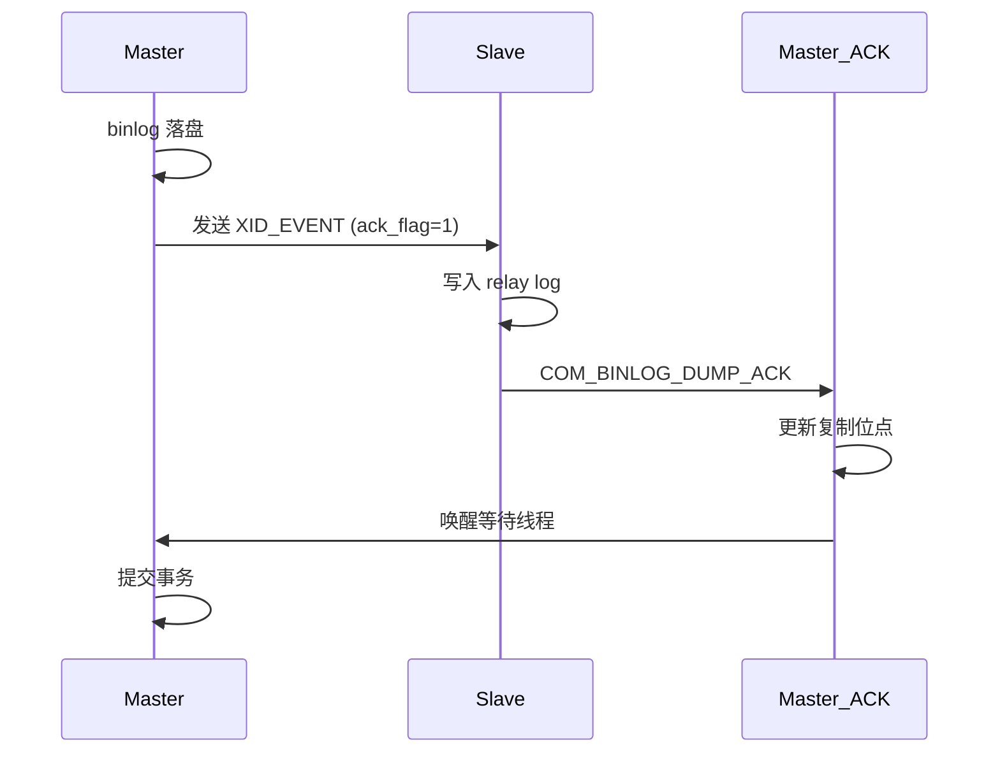
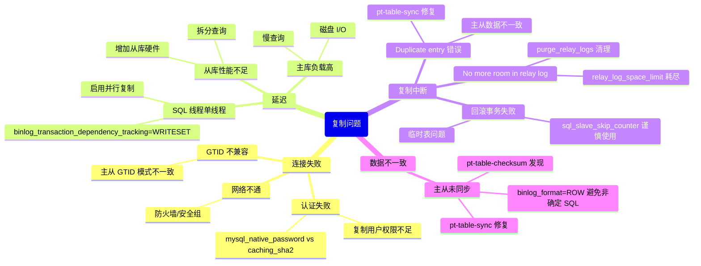

> **摘要**：  
> 主从复制是 MySQL 高可用架构的基石，其核心机制是将主库的 binlog 通过网络传输到从库并重放。这套看似简单的逻辑，在二十年间经历了从**单线程 IO/SQL**到**库级并行**、**组提交并行**、**WriteSet 并行**的三次跃迁，延迟从分钟级降至毫秒级。  
>  
> 本文从 binlog 格式演进切入，系统拆解复制的完整链路：主库 Dump 线程如何扫描 binlog 并发送、从库 IO 线程如何接收并写入 relay log、SQL 线程/工作者如何解析事件并应用。深入 `rpl_slave.cc` 源码，完整还原半同步复制的 ACK 机制、`logical_clock` 并行复制的依赖计算、WriteSet 基于行哈希的冲突检测。生产实践部分提供并行复制监控指标、常见复制异常修复及组复制选型对比。最后基于 2026 年视角，讨论云原生环境下物理复制对传统逻辑复制的替代趋势。

---

## 一、核心概念与底层图景

### 1.1 定义
**MySQL 主从复制**是将主库（Source）的 binlog 事件通过网络传输到从库（Replica），并在从库上重放这些事件，使从库达到与主库一致的数据状态。

**复制三阶段**：
1. **主库生成**：事务提交时将修改记录写入 binlog 文件。
2. **传输接收**：从库 IO 线程拉取 binlog 事件，写入 relay log。
3. **重放应用**：从库 SQL 线程/工作者读取 relay log 事件，在从库实例上执行。

**设计哲学**：
- **逻辑复制**：传输的是 SQL 语句或行变更，而非物理页，兼容不同硬件/版本。
- **异步为主**：默认不等待从库确认，最大化主库性能。
- **可插拔传输**：半同步、组复制均通过插件形式扩展复制协议。

### 1.2 架构全景



---

## 二、机制原理深度剖析

### 2.1 binlog 格式演进与存储

**三种格式对比**：

| 格式 | 记录内容 | 优点 | 缺点 | 适用场景 |
|------|--------|------|------|---------|
| **STATEMENT** | SQL 语句 | 日志量小 | 非确定函数不安全，必须 RR 隔离级别 | 5.7 前默认，已废弃 |
| **ROW** | 行前镜像/后镜像 | 绝对安全，兼容 RC | 日志量大 | **8.0 默认，推荐** |
| **MIXED** | 自动切换 | 兼顾两者 | 复杂规则，难预测 | 不推荐 |

**ROW 格式事件结构**：

```
GTID_LOG_EVENT          -- 事务开始，记录 GTID
TABLE_MAP_EVENT         -- 表结构映射（库名、表名、列类型）
WRITE_ROWS_EVENTv2      -- INSERT：后镜像
UPDATE_ROWS_EVENTv2     -- UPDATE：前镜像 + 后镜像
DELETE_ROWS_EVENTv2     -- DELETE：前镜像
XID_EVENT               -- 事务提交
```

**binlog 文件管理**：
- `binlog.000001`, `binlog.000002` 循环写入。
- `max_binlog_size` 触发切换，`expire_logs_days` / `binlog_expire_logs_seconds` 自动清理。

### 2.2 GTID 与自动定位

**GTID 格式**：`server_uuid:transaction_id`  
示例：`d8f3b3c4-1234-11ec-8d3d-00163e14b1e3:12345`

**核心变量**：
```sql
SHOW VARIABLES LIKE 'gtid_executed';   -- 已执行事务集合
SHOW VARIABLES LIKE 'gtid_purged';     -- 已清理事务集合
SHOW VARIABLES LIKE 'gtid_next';       -- 下一个要执行的事务
```

**自动定位原理**（`MASTER_AUTO_POSITION=1`）：
1. 从库将 `gtid_executed` 发送给主库。
2. 主库计算 `主库已产生事务 - 从库已执行事务 = 待发送事务`。
3. 从第一个缺失事务开始发送 binlog 事件。

**优势**：
- 无需手动指定 `MASTER_LOG_FILE` 和 `MASTER_LOG_POS`。
- 主从切换后新主库自动接管，无需重建复制关系。

### 2.3 并行复制进化史

#### 第一代（5.6）：库级并行

```c
/* sql/rpl_slave.cc - 调度逻辑简化 */
bool schedule_sql_thread_for_database(const char* db) {
    /* 按数据库名哈希分配工作者 */
    ulong hash = calc_hash(db);
    worker_id = hash % slave_parallel_workers;
    return dispatch_to_worker(worker_id, event);
}
```

**局限**：
- 单库操作全部串行，跨库操作可并行。
- **多表同库无收益**，UPDATE 频繁场景延迟依然严重。

#### 第二代（5.7）：LOGICAL_CLOCK 并行

**核心思想**：在主库**同一组提交**的事务，在从库可并行回放。

**主库标记**：
```c
/* sql/binlog.cc - 组提交时计算 last_committed/sequence_number */
void Binlog_commit_stage::finish_commit(void *cache) {
    /* last_committed = 上一组的最大 sequence_number */
    event_info->last_committed = stage_manager.last_committed;
    /* sequence_number = 全局自增 */
    event_info->sequence_number = ++global_sequence;
}
```

**从库调度**：
```c
/* sql/rpl_slave.cc - MTS 协调线程 */
bool Mts_coordinator::schedule_event(Log_event* ev) {
    if (ev->get_type_code() == GTID_LOG_EVENT) {
        last_committed = ev->last_committed;
        sequence_number = ev->sequence_number;
        
        /* 核心规则：sequence_number > 当前最小未提交事务 → 等待 */
        if (sequence_number > get_min_committed()) {
            wait_for_commit(sequence_number, last_committed);
            return false;
        }
    }
    /* 分发到空闲工作者 */
    return dispatch_to_worker(ev);
}
```

**局限**：
- 并行度依赖主库**并发提交事务数量**。
- 低并发场景（如单线程批量插入）从库依然单线程回放。

#### 第三代（8.0/5.7.22+）：WriteSet 并行

**核心思想**：**不依赖组提交**，只要事务修改的行不冲突，即可并行回放。

**主库 WriteSet 生成**：

```c
/* sql/rpl_write_set.cc - 生成行哈希 */
void add_pke_to_write_set(THD* thd, TABLE* table, const uchar* record) {
    /* 1. 主键索引：数据库+表名+主键值 */
    if (table->s->primary_key != MAX_KEY) {
        hash = compute_hash(db_name, table_name, primary_key_value);
        writeset.insert(hash);
    }
    
    /* 2. 唯一键索引（需遍历）*/
    for (uint i = 0; i < table->s->keys; i++) {
        if (table->key_info[i].flags & HA_NOSAME) {  // 唯一索引
            hash = compute_hash(db_name, table_name, key_value);
            writeset.insert(hash);
        }
    }
}
```

**冲突检测**：

```c
/* sql/binlog.cc - 判断是否可并行 */
bool can_parallel_with_last_committed(rpl_group_info* rgi) {
    WriteSet* ws = rgi->writeset;
    
    /* 遍历当前事务的所有行哈希 */
    for (uint64 hash : *ws) {
        auto it = m_writeset_history.find(hash);
        if (it != m_writeset_history.end()) {
            /* 该行最近被哪个 sequence_number 修改过 */
            if (it->second > last_parent && it->second < sequence_number) {
                /* 冲突！该事务必须等之前的事务提交后才能执行 */
                last_parent = it->second;
            }
        }
    }
    
    /* 无冲突 → 可与 history_start 之后的所有事务并行 */
    return (last_parent == m_writeset_history_start);
}
```

**收益**：
- 即使主库单线程插入，从库也可**并行应用**（只要操作不同主键）。
- 5.7.22 引入，8.0 默认启用。

### 2.4 半同步复制

**两种模式对比**：

| 模式 | 等待时机 | 主库可见性 | 一致性风险 |
|------|--------|-----------|-----------|
| `AFTER_COMMIT` | 引擎提交后，binlog 落盘前 | 其他会话可见 | 主库宕机，从库无该事务 |
| `AFTER_SYNC` | binlog 落盘后，引擎提交前 | 其他会话不可见 | **8.0 默认，推荐** |

**ACK 流程**：



**参数**：
- `rpl_semi_sync_master_wait_for_slave_count`：需收到 ACK 的从库数（默认 1）。
- `rpl_semi_sync_master_timeout`：超时退化为异步（默认 10000ms）。

---

## 三、内核/源码级实现

### 3.1 核心数据结构：`Master_info` & `Relay_log_info`

```c
/* sql/rpl_mi.h */
struct Master_info {
    /* 连接信息 */
    char*           host;               /* 主库主机名 */
    uint            port;              /* 主库端口 */
    char*           user;              /* 复制用户名 */
    char*           password;         /* 复制密码 */
    
    /* 位点信息（文件+偏移）*/
    char            master_log_name[FN_REFLEN]; /* binlog 文件名 */
    my_off_t        master_log_pos;            /* 文件偏移 */
    
    /* GTID 信息 */
    Gtid_set        *gtid_set;        /* 已接收的 GTID 集合 */
    bool            auto_position;    /* 是否使用自动定位 */
    
    /* 线程状态 */
    THD*            io_thd;          /* IO 线程 THD 指针 */
    enum Slave_running_info slave_running; /* IO 线程状态 */
    
    /* 连接重试 */
    uint            connect_retry;   /* 重试间隔 */
    time_t          last_conn_err_time; /* 最后一次连接错误时间 */
};

/* sql/rpl_rli.h */
struct Relay_log_info {
    /* relay log 位点 */
    char            relay_log_name[FN_REFLEN]; /* 当前 relay log */
    my_off_t        relay_log_pos;            /* 已执行位点 */
    
    /* 主库位点（对应已执行事务）*/
    char            master_log_name[FN_REFLEN];
    my_off_t        master_log_pos;
    
    /* 并行复制 */
    uint8          并行模式;          /* DATABASE / LOGICAL_CLOCK / WRITESET */
    uint            workers;          /* 工作者线程数 */
    mts_submode*    submode;         /* 并行调度算法 */
    
    /* 检查点 */
    ulong           group_relay_log_name;  /* 检查点对应 relay log */
    ulong           group_relay_log_pos;
    Gtid_set        *gtid_set;       /* 已执行的 GTID 集合 */
};
```

### 3.2 核心流程：IO 线程

```c
/* sql/rpl_slave.cc - handle_slave_io */
pthread_handler_t handle_slave_io(void* arg) {
    Master_info* mi = (Master_info*)arg;
    THD* thd = new THD;
    
    /* 1. 连接主库 */
    if (mysql_real_connect(mysql, mi->host, mi->user, mi->password, 
                          NULL, mi->port, NULL, CLIENT_REMEMBER_OPTIONS)) {
        /* 2. 注册从库（COM_REGISTER_SLAVE）*/
        register_slave(mi, mysql);
        
        /* 3. 请求 binlog 流 */
        if (mi->auto_position) {
            request_dump_with_gtid(mi, mysql);
        } else {
            request_dump_with_position(mi, mysql);
        }
        
        /* 4. 接收事件循环 */
        while (!io_slave_killed(thd, mi)) {
            /* 4.1 读网络包 */
            size_t packet_len = cli_safe_read(mysql);
            
            /* 4.2 解析事件头 */
            Log_event_type type = (Log_event_type)mysql->net.read_pos[4];
            
            /* 4.3 分配 Log_event 对象 */
            Log_event* ev = Log_event::read_log_event(
                mysql->net.read_pos + 5, 
                packet_len - 5, 
                &error, mi->relay_log->get_mi_desc());
            
            /* 4.4 写入 relay log */
            mi->relay_log->append_event(ev);
            
            /* 4.5 更新 master_info 位点 */
            mi->set_master_log_pos(ev->log_pos);
            
            /* 4.6 半同步 ACK 处理 */
            if (ev->get_type_code() == XID_EVENT && semi_sync_enabled) {
                reply_ack_to_master(mi, ev);
            }
        }
    }
    
    return 0;
}
```

### 3.3 核心流程：SQL 线程/协调线程

```c
/* sql/rpl_slave.cc - handle_slave_sql */
pthread_handler_t handle_slave_sql(void* arg) {
    Relay_log_info* rli = (Relay_log_info*)arg;
    THD* thd = new THD;
    
    /* 1. 打开 relay log */
    rli->relay_log->open_relay_log(rli);
    
    /* 2. 事件应用循环 */
    while (!sql_slave_killed(thd, rli)) {
        /* 2.1 读取事件 */
        Log_event* ev = rli->relay_log->read_event(rli);
        
        /* 2.2 如果是并行复制 */
        if (rli->workers > 0) {
            if (is_mts_event(ev)) {
                /* 等待工作者队列有空闲 */
                mts_wait_for_queued_jobs(rli);
                /* 分发到工作者 */
                mts_dispatch_event(rli, ev);
                continue;
            }
        }
        
        /* 2.3 串行执行 */
        ev->apply_event(thd);
        
        /* 2.4 更新 relay_log_info */
        rli->set_relay_log_pos(ev->log_pos);
        
        delete ev;
    }
}

/* 工作者线程 */
pthread_handler_t handle_slave_worker(void* arg) {
    Slave_worker* w = (Slave_worker*)arg;
    
    while (!worker_killed(w)) {
        /* 从队列取事件组 */
        Log_event* ev = w->job_queue->pop();
        
        /* 应用事件 */
        ev->apply_event(w->thd);
        
        /* 提交事务 */
        if (ev->get_type_code() == XID_EVENT) {
            trans_commit(w->thd);
            /* 更新检查点（8.0 异步）*/
            update_worker_checkpoint(w, ev);
        }
        
        delete ev;
        w->job_queue->done();
    }
}
```

### 3.4 核心流程：主库 Dump 线程

```c
/* sql/rpl_binlog_sender.cc - com_binlog_dump_gtid */
void com_binlog_dump_gtid(THD* thd) {
    /* 1. 打开 binlog 文件 */
    Binlog_file_reader reader;
    reader.open(binlog_file_name);
    
    /* 2. 计算从库缺失的事务 */
    Gtid_set* slave_executed = thd->get_opt_ll();
    Gtid_set missing_gtids;
    
    /* 3. 扫描 binlog，找到第一个缺失事务 */
    while (!reader.is_eof()) {
        Log_event* ev = reader.read_event();
        if (ev->get_type_code() == GTID_LOG_EVENT) {
            Gtid gtid = ev->get_gtid();
            if (!slave_executed->contains_gtid(gtid)) {
                /* 定位到该事务开头 */
                reader.seek(ev->log_pos - ev->data_len);
                break;
            }
        }
        delete ev;
    }
    
    /* 4. 循环发送事件 */
    while (!thd->killed) {
        Log_event* ev = reader.read_event();
        send_packet(thd, ev);
        
        if (ev->get_type_code() == XID_EVENT) {
            /* 若开启半同步且该包需 ACK */
            if (semi_sync_enabled && ev->get_ack_flag()) {
                wait_for_slave_ack(thd, ev->log_pos);
            }
        }
        
        delete ev;
    }
}
```

---

## 四、生产落地与 SRE 实战

### 4.1 场景化案例：WriteSet 并行拯救单线程写入

**环境**：
- MySQL 5.7.30，从库配置 `slave_parallel_workers=8`。
- 业务主表 `orders`，无外键，主键自增。
- 主库单线程批量插入（`INSERT INTO orders ... VALUES (...), (...), ...`），每秒 5000 行。

**现象**：
- 从库 `Seconds_Behind_Master` 持续增长，峰值达 3000 秒。
- `SHOW PROCESSLIST` 看到从库只有一个 SQL 线程在工作，其他工作者空闲。

**根本原因**：
- 主库批量插入是**单事务**，`last_committed` 和 `sequence_number` 相同。
- 5.7 LOGICAL_CLOCK 要求 `sequence_number > 当前最小未提交` 才可并行。
- **单事务无法并行**。

**升级至 8.0.18+**：
```sql
-- 8.0 启用 WriteSet 并行
SET GLOBAL binlog_transaction_dependency_tracking = WRITESET;
-- 或 WRITESET_SESSION（更激进）
```

**验证**：
```sql
SHOW STATUS LIKE 'Slave_parallel_workers';
SHOW STATUS LIKE 'Mts_writesets';   -- WriteSet 冲突计数
```

**效果**：
- 从库并行度 8，单事务内不同主键的行**可被不同工作者并行应用**。
- 延迟从 3000 秒降至 5 秒以内。

### 4.2 参数调优矩阵

| 参数 | 作用域 | 8.0 推荐值 | 内核解释 |
|------|--------|-----------|---------|
| `binlog_format` | 全局 | ROW | 8.0 默认，必须 ROW 才能使用 WriteSet |
| `binlog_transaction_dependency_tracking` | 全局 | WRITESET | 5.7.22+/8.0 启用行级并行 |
| `binlog_transaction_dependency_history_size` | 全局 | 25000 | WriteSet 历史哈希表大小，越大并行度越高 |
| `replica_parallel_workers` | 全局 | 4～16 | 8.0 别名，原 `slave_parallel_workers` |
| `replica_parallel_type` | 全局 | LOGICAL_CLOCK | 8.0 默认，WRITESET 需显式启用 |
| `replica_preserve_commit_order` | 全局 | ON | 保证从库提交顺序与主库一致 |
| `sync_binlog` | 全局 | 1 | 主库每次事务提交刷盘，最安全 |
| `sync_relay_log` | 全局 | 10000 | 从库 relay log 刷盘频率，IO 敏感可调大 |
| `relay_log_recovery` | 全局 | ON | 8.0 默认，崩溃后自动丢弃未应用 relay log |
| `rpl_semi_sync_master_wait_point` | 全局 | AFTER_SYNC | 8.0 默认，推荐 |
| `rpl_semi_sync_master_wait_for_slave_count` | 全局 | 1 | 需根据拓扑调整 |

### 4.3 监控与诊断

**1. 复制状态概览**

```sql
-- 8.0 新语法
SHOW REPLICA STATUS\G
-- 5.7 旧语法
SHOW SLAVE STATUS\G
```

**关键指标**：

| 字段 | 含义 | 警戒线 |
|------|------|--------|
| `Seconds_Behind_Master` | 预估延迟时间 | > 60 秒 |
| `Replica_IO_Running` | IO 线程状态 | 必须 Yes |
| `Replica_SQL_Running` | SQL 线程状态 | 必须 Yes |
| `Last_IO_Error` | 网络错误 | 非空 |
| `Last_SQL_Error` | 重放错误 | 非空 |
| `Retrieved_Gtid_Set` | 已拉取 GTID | 监控增长 |
| `Executed_Gtid_Set` | 已执行 GTID | 应与主库逐步接近 |

**2. 并行复制监控**

```sql
-- 查看工作者状态
SELECT * FROM performance_schema.replication_applier_status_by_worker;

-- WriteSet 冲突统计
SHOW STATUS LIKE 'Mts_writesets';
SHOW STATUS LIKE 'Mts_writeset_streams';

-- 检查点积压
SHOW STATUS LIKE 'Mts_pending_jobs_size_max';
```

**3. 延迟根因分析**

```sql
-- 主库 binlog 生成速率（字节/秒）
SHOW MASTER STATUS\G
-- 观察 Position 字段变化速率

-- 从库 relay log 写入/应用差值
SHOW REPLICA STATUS\G
-- Compare Read_Master_Log_Pos and Exec_Master_Log_Pos
```

**4. 复制一致性检查**

```bash
# Percona Toolkit
pt-table-checksum --databases=prod --tables=orders --replicate=percona.checksums
pt-table-sync --execute --replicate percona.checksums h=master_ip h=slave_ip
```

### 4.4 故障排查决策树



### 4.5 实战案例：GTID 跳过一个事务

**场景**：
- 从库误写入一条数据，主库没有该记录。
- 复制中断，错误：`Error 'Duplicate entry '100' for key 'PRIMARY'' on query.`

**修复方案**（GTID 模式）：

```sql
-- 1. 停止复制
STOP REPLICA;

-- 2. 查看当前执行的事务 GTID
SHOW REPLICA STATUS\G
-- 记下 Executed_Gtid_Set 和 Retrieved_Gtid_Set

-- 3. 注入空事务跳过错误事务
SET GTID_NEXT = 'd8f3b3c4-1234-11ec-8d3d-00163e14b1e3:12346';
BEGIN; COMMIT;
SET GTID_NEXT = AUTOMATIC;

-- 4. 启动复制
START REPLICA;
```

**风险**：
- 跳过事务意味着**该事务在从库永不执行**，主从永久不一致。
- **仅适用于可容忍少量不一致的场景**（如非关键表）。

---

## 五、技术演进与 2026 年视角

### 5.1 历史设计约束与改进

| 版本 | 复制变化 | 动因 |
|------|--------|------|
| 3.23 | 引入基于语句的复制 | 最早主从功能 |
| 4.0 | 独立 IO 线程 + SQL 线程 | 支持从库查询 |
| 5.1 | 基于行的复制（ROW） | 解决非确定 SQL |
| 5.6 | GTID、库级并行复制 | 简化主从切换，低并发优化 |
| 5.7 | LOGICAL_CLOCK 并行、半同步优化 | 组提交感知并行 |
| 5.7.22 | WriteSet 并行（实验） | 行级冲突检测 |
| 8.0 | WriteSet GA、`replica_parallel_workers` | 全面并行 |
| 8.0.27+ | 克隆插件加速从库初始化 | 替代 xtrabackup |

### 5.2 2026 年仍存在的“遗留设计”

1. **relay log 单写**  
   IO 线程串行写入 relay log，协调线程串行读取——**并行复制的第一站仍是串行的**。  
   **现状**：8.0 未解决，企业版和 Percona Server 已支持并行 relay log 写。

2. **WriteSet 外键退化**  
   若表存在外键约束，WriteSet 并行自动降级为 LOGICAL_CLOCK。  
   **原因**：外键操作需要顺序性保证，无法基于行哈希判断冲突。  
   **现状**：8.0 无改进，业务设计需权衡。

3. **临时表复制限制**  
   使用基于行复制的临时表安全，但**并行复制中临时表操作会强制退化为串行**。  
   **现状**：8.0 无解，建议避免在复制链中使用临时表。

4. **半同步退化成异步**  
   超时后自动降级，事务提交不再等待 ACK——**集群仍可能脑裂**。  
   **现状**：MGR 是更优解，但配置复杂，5.7 存量巨大。

### 5.3 未来趋势：逻辑复制会被物理复制取代吗？

**云原生数据库的答案**：
- **AWS Aurora**：存储节点多副本，计算节点共享存储，**无 binlog 传输**。
- **阿里云 PolarDB**：物理日志 redo 下沉到存储层，计算节点无状态。
- **本质**：用**共享存储 + 物理复制**替代传统逻辑复制。

**MySQL 社区的回应**：
- 8.0.17+ **克隆插件**：物理快照级别的从库初始化，但增量仍是 binlog。
- 9.0 路线图：**binlog 压缩**（ZSTD）、binlog 透明页压缩。
- **长期战略**：**没有战略**。官方仍将 binlog 视为核心功能，不会像云厂商那样彻底重构。

**2026 年现实**：
- **自建机房**：仍用 GTID + 半同步 + WriteSet 并行复制。
- **公有云**：RDS for MySQL 兼容 binlog 协议，但底层存储多活，复制仅为兼容工具。

---

## 六、结语：复制二十五年，从异步到准实时

MySQL 复制的演进史，是一部**在一致性、性能、可用性三角中寻找平衡**的历史。  
它从未像分布式一致性协议那样追求强一致，也从未像 NoSQL 那样放弃一致性。  
它选择了**异步为主，半同步兜底，并行追赶，冲突检测优化**的渐进式路线。

**这套路线对生产环境的真正价值是**：
- 主库性能几乎不受影响。
- 从库延迟可收敛到百毫秒级。
- 崩溃时数据丢失可控。
- 运维工具链成熟。

**2026 年的复制定位**：
> 不再是最先进的技术，但依然是**最广泛使用、最稳定可靠**的数据分发工具。

---

## 参考文献
- `sql/rpl_slave.cc`, `sql/rpl_binlog_sender.cc`, `sql/binlog.cc` MySQL 8.0.33 源码
- MySQL Internals Manual – Replication
- Oracle Blogs: “MySQL 5.7 Replication: Enhanced Multi-Threaded Slave” (2016)
- Oracle Blogs: “WriteSet-based Parallel Replication in MySQL 8.0” (2018)
- Oracle Blogs: “Clone Plugin in MySQL 8.0.17” (2019)
- Percona Live 2024: “10 Years of MySQL Parallel Replication”