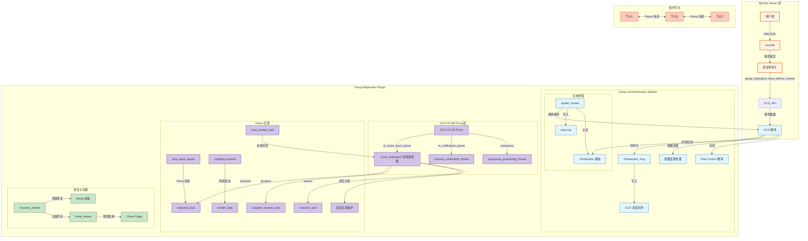
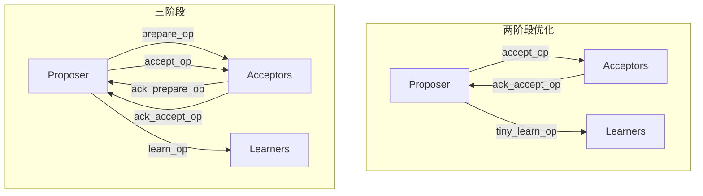
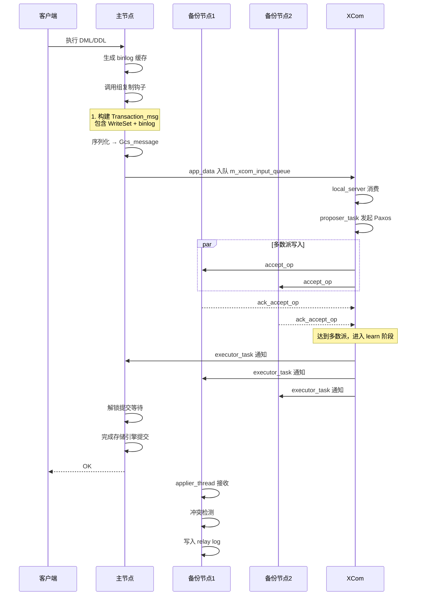
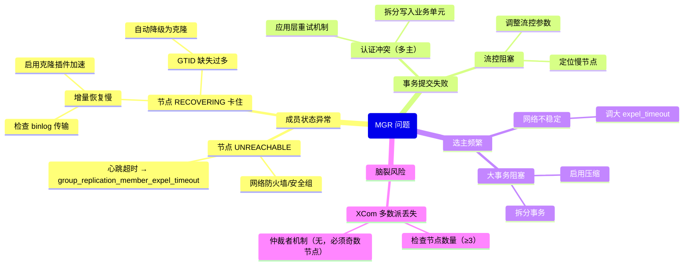

> **摘要**：  
> 组复制（Group Replication，MGR）是 MySQL 走向分布式强一致数据库的里程碑。不同于传统主从复制的异步或半同步，MGR 基于**类 Paxos 共识协议**，在多个节点间实现数据强一致、自动选主、多主写入，并内置冲突检测与流控机制。  
>  
> 本文从 Paxos 协议基础出发，系统拆解 MGR 的四层架构：**GCS 层**负责消息广播与视图管理，**XCom 层**实现 Paxos 状态机，**认证与冲突检测**模块保障多主写入正确性，**流控模块**防止节点过度落后。深入 `plugin/group_replication` 源码，完整还原单主模式下的事务提交流程、多主模式下的 WriteSet 冲突检测、节点加入时的增量恢复与克隆拉取。生产实践部分提供 MGR 网络分区处理、流控参数调优及多主冲突避坑指南。最后基于 2026 年视角，讨论 Paxos 协议在 MySQL 中的工程落地局限，以及分布式数据库时代 MGR 的生态定位。

---

## 一、核心概念与底层图景

### 1.1 定义
**组复制**是 MySQL 5.7.17 引入的插件式高可用解决方案，基于**类 Paxos 共识协议**实现数据在组成员间的强一致复制。

**核心特性**：
- **强一致**：多数派确认后事务方可提交，无脑裂，无数据丢失。
- **自动选主**：单主模式下主库故障自动切换，应用透明。
- **多主写入**：所有节点均可处理写请求，内置冲突检测。
- **成员管理**：节点动态加入/离开，视图更新协议保证一致性。

**设计哲学**：
- **插件化**：不侵入 Server/InnoDB 核心代码，通过钩子函数拦截事务提交。
- **状态机复制**：事务在组内以相同顺序执行，达到最终一致。
- **悲观冲突检测**：多主模式下通过 WriteSet 哈希检测写写冲突，后提交者回滚。

### 1.2 架构全景



---

## 二、机制原理深度剖析

### 2.1 Paxos 协议基础与 XCom 实现

**Paxos 角色映射**：

| 标准 Paxos 角色 | MGR XCom 角色 | 职责 |
|-----------------|--------------|------|
| **Proposer** | `proposer_task` | 发起提案，广播到接受者 |
| **Acceptor** | `acceptor_learner_task` | 接收提案，投票持久化 |
| **Learner** | `executor_task` | 提案通过后执行（学习） |
| **Leader** | 单主模式下的主节点 | 协调提案顺序，多数派写入 |

**两阶段 vs 三阶段**：



**关键优化**：
- **两阶段提交**：正常事务写入跳过 prepare 阶段，减少一次 RTT。
- **节点状态机缓存**：`pax_machine` 结构体缓存每个槽位（`synode_no`）的 proposer/acceptor/learner 状态。
- **Multi-Paxos**：稳定领导者期间，无需重新选举 proposal number。

### 2.2 单主模式事务提交流程



**核心钩子函数**：

```c
/* plugin/group_replication/src/plugin.cc - group_replication_trans_before_commit */
int group_replication_trans_before_commit(THD* thd) {
    /* 1. 获取事务 binlog 缓存 */
    String* binlog_cache = thd->get_transaction()->binlog_cache;
    
    /* 2. 生成 WriteSet */
    WriteSet* writeset = generate_writeset(thd);
    
    /* 3. 构建 Transaction_msg */
    Transaction_msg msg;
    msg.writeset = writeset;
    msg.binlog_data = binlog_cache;
    msg.gtid = thd->variables.gtid_next;
    
    /* 4. 通过 GCS 广播到组内 */
    Gcs_message* gcs_msg = serialize_to_gcs(msg);
    gcs_send_message(gcs_msg);
    
    /* 5. 等待 Paxos 多数派确认 */
    mysql_mutex_lock(&thd->LOCK_group_replication);
    mysql_cond_wait(&thd->COND_group_replication, &thd->LOCK_group_replication);
    mysql_mutex_unlock(&thd->LOCK_group_replication);
    
    return 0;
}
```

### 2.3 多主模式与冲突检测

**冲突检测原理**：

```mermaid
flowchart LR
    subgraph 节点A 事务T1
        WS1[WriteSet: (t1.id=1), (t1.id=2)]
    end
    
    subgraph 节点B 事务T2
        WS2[WriteSet: (t1.id=2), (t1.id=3)]
    end
    
    subgraph 全局认证信息 [Certification_info]
        CI[(全局哈希表<br>key=行哈希, value=GTID)]
    end
    
    WS1 -->|广播| CI
    CI -->|查询 key=t1.id=2| EXIST{已存在?}
    EXIST -->|是, GTID=uuid:100| COMPARE{比较 GTID 顺序}
    COMPARE -->|T1.GTID > 已存GTID| PASS1[通过, 更新CI]
    COMPARE -->|T1.GTID < 已存GTID| FAIL1[冲突, 回滚T1]
    
    WS2 -->|广播| CI
    CI -->|查询 key=t1.id=2| EXIST2{已存在?}
    EXIST2 -->|是, GTID=uuid:101| COMPARE2{比较 GTID 顺序}
    COMPARE2 -->|T2.GTID > 已存GTID| PASS2[通过, 更新CI]
```

**认证阶段关键逻辑**：

```c
/* plugin/group_replication/src/certification_handler.cc */
bool certification_handler::certify(Transaction_msg* msg) {
    /* 1. 获取事务的 snapshot_version（发送节点的 gtid_executed）*/
    Gtid_set* snapshot = msg->get_snapshot_version();
    
    /* 2. 遍历 WriteSet 中的每个行哈希 */
    for (uint64 hash : msg->writeset) {
        /* 2.1 查询全局认证表 */
        Certification_entry* entry = m_certification_info->get(hash);
        
        if (entry != nullptr) {
            /* 2.2 存在冲突记录，检查 GTID 顺序 */
            if (!snapshot->contains_gtid(entry->gtid)) {
                /* 当前事务的 snapshot 不包含冲突事务 → 冲突！ */
                m_stats->number_of_conflicts++;
                return false;  /* 认证失败，事务需回滚 */
            }
        }
    }
    
    /* 3. 无冲突，申请 GTID */
    Gtid gtid = generate_gtid();
    msg->set_gtid(gtid);
    
    /* 4. 将 WriteSet 插入认证表 */
    for (uint64 hash : msg->writeset) {
        m_certification_info->insert(hash, gtid);
    }
    
    return true;
}
```

**冲突处理**：
- **单主模式**：无冲突检测，所有写操作在主节点序列化执行。
- **多主模式**：认证失败的事务**在从节点回滚**，客户端收到死锁错误（`ER_LOCK_DEADLOCK`），需应用层重试。

### 2.4 流控机制

**流控触发条件**：

```c
/* plugin/group_replication/src/flow_control_module.cc */
int64 Flow_control_module::get_quota_size() {
    int64 min_quota = INT64_MAX;
    
    /* 1. 收集所有节点的积压信息 */
    for (Member& member : group_members) {
        /* 等待认证的事务数量 */
        int64 cert_queue = member.get_certification_queue_size();
        /* 等待应用的事务数量 */
        int64 applier_queue = member.get_applier_queue_size();
        
        /* 2. 计算该节点的处理能力 */
        int64 member_quota = calculate_quota(cert_queue, applier_queue);
        min_quota = min(min_quota, member_quota);
    }
    
    /* 3. 不低于最小阈值 */
    return max(min_quota, m_min_quota);
}

/* 流控执行（事务提交前）*/
int32 Flow_control_module::do_wait() {
    int64 quota = get_quota_size();
    int64 used = ++m_quota_used;
    
    if (used > quota) {
        /* 超过配额，等待 1 秒 */
        mysql_cond_timedwait(&m_flow_control_cond, &m_flow_control_lock, 1);
        m_quota_used = 0;  /* 重置计数器 */
    }
    
    return 0;
}
```

**设计意图**：
- **木桶效应**：以集群中最慢节点为准，限制领导者写入速率。
- **反压机制**：防止过度积压导致节点被驱逐。

---

## 三、内核/源码级实现

### 3.1 核心数据结构：`Transaction_msg`

```c
/* plugin/group_replication/include/transaction_message.h */
class Transaction_msg {
private:
    /* 事务标识 */
    Gtid           m_gtid;                  /* 事务 GTID */
    Gtid_set*      m_snapshot_version;     /* 发送节点的 gtid_executed */
    
    /* 冲突检测信息 */
    WriteSet*      m_writeset;             /* 行哈希集合 */
    uint64         m_writeset_size;        /* 哈希数量 */
    
    /* 事务数据 */
    std::string    m_binlog_data;          /* 序列化后的 binlog 事件 */
    uint64         m_original_commit_timestamp; /* 主库提交时间戳 */
    
    /* 元数据 */
    std::string    m_server_uuid;          /* 源节点 UUID */
    ulong          m_thread_id;            /* 源线程 ID */
    
    /* 流控 */
    uint64         m_certification_queue_size; /* 发送前本节点认证队列长度 */
};
```

### 3.2 核心数据结构：`pax_machine`（Paxos 状态机）

```c
/* plugin/group_replication/libmysqlgcs/src/bindings/xcom/xcom/xcom_base.h */
struct pax_machine {
    /* 槽位标识 */
    synode_no      synode;                /* (group_id, msgno, node) */
    
    /* Proposer 状态 */
    struct {
        ballot     bal;                  /* 当前提案编号 */
        bit_set*   prep_nodeset;         /* 已回复 prepare 的节点 */
        ballot     sent_prop;           /* 已发送的 accept 提案编号 */
        bit_set*   prop_nodeset;        /* 已回复 accept 的节点 */
        pax_msg*   msg;                /* 正在提议的值 */
        ballot     sent_learn;         /* 已发送的 learn 提案编号 */
    } proposer;
    
    /* Acceptor 状态 */
    struct {
        ballot     promise;            /* 承诺的最小提案编号 */
        pax_msg*   msg;               /* 已接受的值 */
    } acceptor;
    
    /* Learner 状态 */
    struct {
        pax_msg*   msg;               /* 已学习的值 */
    } learner;
    
    /* 哈希链表节点 */
    linkage        hash_link;
    lru_machine*   lru;
};
```

### 3.3 核心流程：节点加入与增量恢复

```c
/* plugin/group_replication/src/recovery.cc */
bool Recovery_module::join_group() {
    /* 1. 通过 XCom 发送加入请求 */
    xcom_join_group(m_group_name, m_local_address);
    
    /* 2. 等待视图变更，确认自己成为组成员 */
    View_change* view = wait_for_view_inclusion();
    
    /* 3. 检查是否需要状态恢复 */
    if (is_diverged_from_group()) {
        /* 3.1 获取组成员 GTID 集合 */
        Gtid_set* group_gtids = get_group_gtid_set();
        Gtid_set* local_gtids = get_local_gtid_set();
        
        /* 3.2 计算缺失事务 */
        Gtid_set* missing = group_gtids->subtract(local_gtids);
        
        if (missing->is_empty()) {
            /* 无需恢复，直接进入在线状态 */
            return true;
        }
        
        if (should_use_clone(missing)) {
            /* 3.3 缺失事务过多 → 使用克隆插件全量同步 */
            Clone_handler clone;
            clone.request_data(m_donor);
        } else {
            /* 3.4 增量恢复：从捐赠者拉取 binlog */
            Recovery_receiver receiver;
            receiver.request_binlog(m_donor, missing);
        }
    }
    
    return true;
}

/* plugin/group_replication/src/clone_handler.cc */
bool Clone_handler::request_data(const std::string& donor) {
    /* 1. 在捐赠者执行 FLUSH TABLES WITH READ LOCK? 不，克隆插件绕过锁 */
    /* 2. 执行 CLONE INSTANCE FROM ... */
    THD* thd = create_thd();
    thd->set_command(COM_CLONE);
    
    std::string query = "CLONE INSTANCE FROM " + donor;
    mysql_parse(thd, query.c_str(), query.length());
    
    /* 3. 等待克隆完成 */
    wait_for_clone_finish();
    
    /* 4. 重启复制 */
    start_replica();
    
    return true;
}
```

### 3.4 核心流程：视图变更与选主

```c
/* plugin/group_replication/src/primary_election.cc */
void Primary_election::handle_view_change(View* new_view) {
    /* 1. 检查当前视图是否有主节点 */
    if (new_view->has_primary()) {
        /* 已有主节点，无需选举 */
        return;
    }
    
    /* 2. 单主模式下触发自动选主 */
    if (m_group_mode == SINGLE_PRIMARY_MODE) {
        /* 2.1 候选节点排序（规则：权重 > UUID 字典序）*/
        std::vector<Member> candidates = new_view->get_members();
        std::sort(candidates.begin(), candidates.end(), 
                  Member_comparator());
        
        /* 2.2 选择第一个候选节点 */
        Member new_primary = candidates[0];
        
        if (new_primary.is_self()) {
            /* 2.3 本节点被选为主 */
            transition_to_primary();
            
            /* 2.4 广播主节点变更 */
            broadcast_primary_election(new_primary);
        } else {
            /* 2.5 其他节点当选，等待主节点上线 */
            wait_for_primary_online(new_primary);
        }
    }
}

void transition_to_primary() {
    /* 1. 等待已有事务执行完毕 */
    wait_for_gtid_applied(get_group_gtid_set());
    
    /* 2. 关闭只读模式 */
    mysql_mutex_lock(&LOCK_global_system_variables);
    global_system_variables.read_only = false;
    global_system_variables.super_read_only = false;
    mysql_mutex_unlock(&LOCK_global_system_variables);
    
    /* 3. 启用写能力 */
    enable_writes();
    
    /* 4. 记录切换时间戳 */
    record_election_time();
}
```

---

## 四、生产落地与 SRE 实战

### 4.1 场景化案例：网络分区导致频繁选主

**环境**：
- 3 节点 MGR 集群，单主模式。
- 托管在公有云，三可用区部署。
- 业务高峰期频繁出现主节点切换，每次切换导致 10～15 秒写不可用。

**排查过程**：

```sql
-- 1. 查看组复制成员状态
SELECT member_id, member_host, member_port, member_state, member_role
FROM performance_schema.replication_group_members;

-- 2. 查看成员连接统计（8.0.24+）
SELECT * FROM performance_schema.replication_connection_status
WHERE channel_name = 'group_replication_applier';
```

**根本原因**：
- XCom 层 Paxos 心跳超时（`alive_task` 每 0.5 秒发送 `i_am_alive_op`，4 秒未响应触发 `are_you_alive_op`，再超时则判定节点失效）。
- 公有云跨可用区网络偶尔延迟 > 200ms，丢包率 0.1%，导致心跳超时。
- 默认 `group_replication_network_compression_threshold` 过大，大事务阻塞心跳。

**解决方案**：

```ini
[mysqld]
-- 1. 调长心跳超时容忍窗口（8.0.21+）
group_replication_member_expel_timeout = 10
-- 默认 5，改为 10 秒

-- 2. 启用网络压缩，避免大事务阻塞心跳
group_replication_compression_threshold = 1048576  -- 1MB 以上压缩
group_replication_recovery_compression_algorithms = 'zstd,zlib'

-- 3. 减少选主等待时间（默认 1 小时？不，此为修复超时）
group_replication_autorejoin_tries = 3
```

**验证**：
- `member_expel_timeout` 从 5 秒延长至 10 秒后，跨可用区网络毛刺不再触发节点驱逐。
- 集群稳定性显著提升。

### 4.2 参数调优矩阵

| 参数 | 作用域 | 8.0 推荐值 | 内核解释 |
|------|--------|-----------|---------|
| `group_replication_group_name` | 全局 | UUID | 集群唯一标识，必须所有节点一致 |
| `group_replication_single_primary_mode` | 全局 | ON | 单主模式（推荐），多主模式需充分测试 |
| `group_replication_enforce_update_everywhere_checks` | 全局 | OFF | 多主模式下强制冲突检测，默认 ON（多主） |
| `group_replication_member_expel_timeout` | 全局 | 5～10 | 节点驱逐超时，网络不稳时调高 |
| `group_replication_autorejoin_tries` | 全局 | 3 | 节点被驱逐后自动重试次数 |
| `group_replication_flow_control_mode` | 全局 | QUOTA | 流控模式，DISABLED/QUOTA |
| `group_replication_flow_control_period` | 全局 | 60 | 流控统计周期（秒） |
| `group_replication_flow_control_member_quota_percent` | 全局 | 5 | 单个成员可使用的最大配额比例 |
| `group_replication_compression_threshold` | 全局 | 1048576 | 消息压缩阈值，降低网络带宽 |
| `group_replication_ssl_mode` | 全局 | REQUIRED | 生产环境强制启用 SSL |
| `group_replication_recovery_use_ssl` | 全局 | ON | 恢复阶段使用 SSL |
| `group_replication_poll_spin_loops` | 全局 | 0 | XCom 协程自旋次数，默认 0 表示自适应 |
| `group_replication_communication_stack` | 全局 | XCOM | 8.0.27+ 可选 MYSQL，但 XCOM 更稳定 |

### 4.3 监控与诊断

**1. 组成员状态**

```sql
-- 当前视图
SELECT * FROM performance_schema.replication_group_members;

-- 成员角色与状态
SELECT member_host, member_port, member_state, member_role
FROM performance_schema.replication_group_members;

-- 成员状态含义
-- ONLINE: 正常服务
-- RECOVERING: 正在同步数据
-- OFFLINE: 离线
-- ERROR: 错误状态
-- UNREACHABLE: 网络不可达
```

**2. 组复制应用状态**

```sql
-- 应用线程状态
SELECT channel_name, service_state, thread_priority
FROM performance_schema.replication_applier_status_by_coordinator
WHERE channel_name = 'group_replication_applier';

-- 工作者队列积压
SELECT worker_id, last_applied_transaction, last_queued_transaction
FROM performance_schema.replication_applier_status_by_worker;
```

**3. 冲突检测统计**

```sql
-- 8.0.23+ 通过 METRICS 表
SELECT * FROM performance_schema.global_status
WHERE VARIABLE_NAME LIKE 'group_replication_%'
  AND (VARIABLE_NAME LIKE '%conflicts%' OR VARIABLE_NAME LIKE '%flow%');

-- 常见指标
-- group_replication_certification_queue_size: 待认证事务队列长度
-- group_replication_transaction_conflicts: 冲突事务总数
-- group_replication_flow_control_held: 是否处于流控状态
```

**4. XCom 状态观测（调试）**

```sql
-- 8.0.21+ 提供 XCom 详细状态
SELECT * FROM performance_schema.replication_group_communication_information;
SELECT * FROM performance_schema.replication_group_member_stats\G
```

**5. 日志关键线索**

```bash
# 错误日志
tail -f /var/log/mysql/error.log | grep -E 'Expelling|Rejoining|GCache'

# Expelling member: 节点被驱逐
# Rejoining: 节点重新加入
# GCache: 事务缓存信息
```

### 4.4 故障排查决策树



### 4.5 多主模式冲突避坑指南

**已知冲突模式**：

| 场景 | 是否冲突 | 解决方案 |
|------|--------|---------|
| 不同行更新 | ❌ | WriteSet 无交集，通过认证 |
| 同一行更新 | ✅ | 后提交者回滚，应用重试 |
| 自增主键插入 | ❌ | 不同节点自增值预留区间不重叠 |
| 唯一键重复插入 | ✅ | 应用层保证全局唯一 |
| 外键约束操作 | ✅ | 多主模式不支持外键（自动降级单主） |
| 表 DDL | ✅ | MGR 不支持在线 DDL（需单主模式执行） |

**最佳实践**：
1. **非必要不开启多主**：90% 场景单主足够，多主徒增复杂性。
2. **业务拆分**：按业务单元绑定写入节点，避免跨节点写冲突。
3. **重试机制**：应用层捕获 `ER_LOCK_DEADLOCK`，自动重试 3 次。
4. **监控冲突率**：`group_replication_transaction_conflicts` 持续增长说明业务模型不适配多主。

---

## 五、技术演进与 2026 年视角

### 5.1 历史设计约束与改进

| 版本 | MGR 变化 | 动因 |
|------|---------|------|
| 5.7.17 | MGR 首个 GA 版本 | 解决异步复制数据丢失 |
| 5.7.22 | 支持多主模式，WriteSet 冲突检测 | 多节点写入 |
| 8.0.16 | 克隆插件集成，快速节点加入 | 替代 xtrabackup |
| 8.0.21 | 流控增强，`member_expel_timeout` | 网络分区容忍性 |
| 8.0.27 | `group_replication_communication_stack=MYSQL` 实验 | 尝试移除 XCom 依赖 |
| 8.0.30+ | 性能优化，认证阶段并行 | 减少冲突检测瓶颈 |

### 5.2 2026 年仍存在的“遗留设计”

1. **XCom 协议非标准 Paxos**  
   XCom 是 MySQL 团队自研的 Paxos 变种，与标准 Paxos/Raft 不互通，无开源独立实现。  
   **现状**：黑盒，问题排查困难，无可视化工具。

2. **多主模式下 WriteSet 冲突检测粒度过粗**  
   行哈希基于**索引键值**生成，若表无主键则无法检测冲突，直接退化为乐观插入。  
   **现状**：8.0 无改进，强制要求所有表有主键。

3. **网络分区容忍性弱**  
   3 节点集群，单节点网络中断 → 剩余 2 节点仍可多数派写入，但原节点恢复后需重新加入。  
   **问题**：重新加入是**全量恢复**（若落后太多触发克隆），不保留增量差异。

4. **流控只限制领导者**  
   多主模式下，流控仅限制发送事务的节点，不限制冲突认证失败后的重试风暴。  
   **现状**：8.0 未解决，业务需自行削峰。

5. **大事务限制**  
   MGR 要求事务在组内传输，事务体积受 `group_replication_transaction_size_limit` 限制（默认 150MB）。  
   **原因**：XCom 消息过大导致网络缓冲溢出、节点超时。  
   **现状**：无根本解，需拆分大事务。

### 5.3 未来趋势：分布式数据库时代，MGR 该往哪里走？

**云原生数据库的冲击**：
- **Aurora / PolarDB**：存储计算分离，物理复制，强一致。
- **TiDB / CockroachDB**：原生分布式，水平扩展，Raft 共识。

**MGR 的生存空间**：
- **MySQL 兼容性**：100% 兼容 MySQL 协议，生态工具链完备。
- **运维惯性**：DBA 熟悉 MySQL，不愿迁移到新数据库。
- **中小规模集群**：3～9 节点，单集群事务量 < 5万 TPS。

**2026 年现实**：
- **公有云 RDS**：默认提供 MGR 选项，但底层实现可能替换为**存储层复制**，对用户透明。
- **自建机房**：MGR + 半同步混合拓扑仍广泛存在。
- **官方路线图**：未见取代 MGR 的计划，将持续优化性能与稳定性。

**长期预测**：
> MGR 不会消失，但会**边缘化**——从“唯一强一致方案”退居为“传统主从复制到分布式数据库的过渡方案”。

---

## 六、结语：共识协议落地 MySQL 的二十年长征

从 2005 年 MySQL 4.1 无复制，到 2016 年 MGR GA，MySQL 团队花了十一年才把 Paxos 协议跑进生产环境。  
这背后不仅是代码量的积累，更是对“强一致可用性降级”这一哲学命题的反复权衡。

**MGR 的妥协**：
- 多数派写入 → 性能下降 30%～50%。
- 强一致 → 网络分区时可用性下降。
- 多主写入 → 冲突检测复杂度 O(N²)。

**但它解决了最核心的问题**：
- **不再丢数据**。
- **自动选主，无人值守**。
- **多活写入，有限支持**。

**2026 年回看**：
> MGR 不是分布式数据库，而是**单机数据库的高可用增强版**。  
> 它没有改变 MySQL 的单机架构上限，只是让单机崩溃时不再手忙脚乱。

---

## 参考文献
- `plugin/group_replication/src/` MySQL 8.0.33 源码
- `plugin/group_replication/libmysqlgcs/src/bindings/xcom/` XCom 实现
- MySQL Internals Manual – Group Replication
- Oracle Blogs: “MySQL Group Replication: Under the Hood” (2016)
- Oracle Blogs: “Multi-Primary Mode with Group Replication” (2018)
- Oracle Blogs: “Clone Plugin and Group Replication” (2020)
- Percona Live 2025: “MGR at Scale: Lessons from 1000+ Clusters”