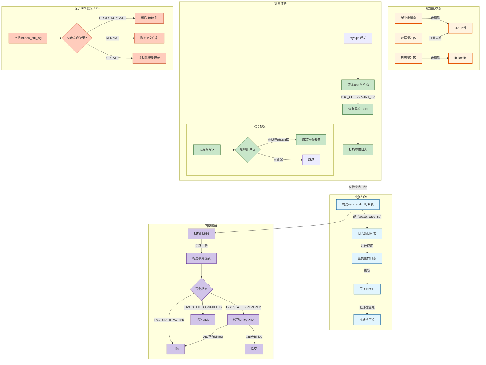
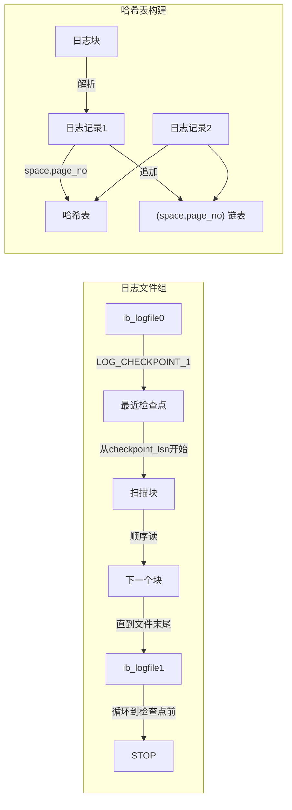
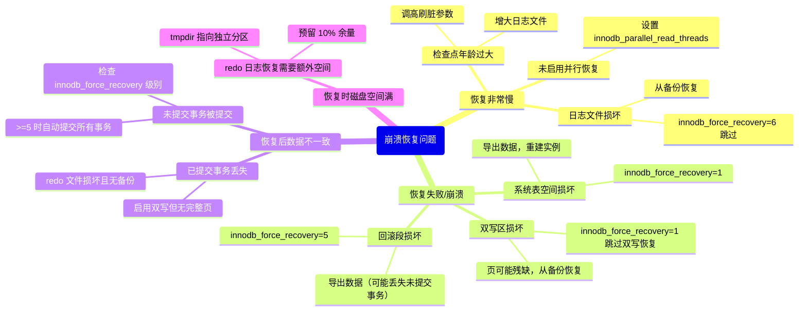

> **摘要**：  
> 崩溃恢复是 InnoDB 最后的防线。无论系统是意外断电、内核 panic 还是 mysqld 进程突然消失，重启后 InnoDB 都必须保证：**已提交事务的数据不丢失，未提交事务的修改被回滚，所有数据页保持一致性**。  
>  
> 这套机制依赖三大组件协同工作：**双写缓冲**修复残缺页，**重做日志**前滚已提交事务，**回滚日志**回滚未提交事务。本文从 `recv_recovery_from_checkpoint_start` 入口出发，系统拆解 InnoDB 崩溃恢复的三阶段模型：扫描日志构建 `recv_addr_t` 哈希表、并行应用 redo、基于回滚段的事务状态回滚。深入 `log0recv.cc` 和 `trx0roll.cc` 源码，完整还原检查点定位、日志分组、页面修复和 XA 两阶段恢复的实现细节。生产实践部分提供 `innodb_force_recovery` 分级恢复策略、损坏页抢救技巧及恢复时间预估模型。最后基于 2026 年视角，讨论 PMEM 对传统崩溃恢复架构的根本性重构，以及未来“无恢复”数据库的可能性。

---

## 一、核心概念与底层图景

### 1.1 定义
**InnoDB 崩溃恢复**指数据库进程异常终止后，重新启动时**自动执行**的一系列数据一致性修复过程。该过程无需人工干预，完全由存储引擎自主完成。

**恢复目标**：
- **持久性**：已提交事务的修改必须出现在磁盘上。
- **原子性**：未提交事务的修改必须从磁盘上抹除。
- **一致性**：所有数据页逻辑正确，页内校验和与 LSN 匹配。

**三大支柱**：

| 组件 | 恢复阶段 | 作用 |
|------|--------|------|
| **双写缓冲** | 恢复准备期 | 修复重启时发现的残缺页（校验和失败） |
| **重做日志** | 前滚阶段 | 重新执行已写入日志但未刷盘的事务修改 |
| **回滚日志** | 回滚阶段 | 撤销未提交事务（包括 prepare 但未 commit 的事务） |
| **DDL 日志** | 原子 DDL 恢复 | 8.0 新增，清理未完成的 DDL 操作 |

### 1.2 架构全景



---

## 二、机制原理深度剖析

### 2.1 检查点：恢复起点的锚点

**检查点（Checkpoint）**是重做日志中**最早仍可能被恢复需要的 LSN**。所有小于检查点 LSN 的日志对应的脏页均已刷盘，恢复时无需扫描。

**检查点类型**：

| 类型 | 触发时机 | 存储位置 | 作用 |
|------|--------|--------|------|
| **模糊检查点** | 每秒/每10秒 | `ib_logfile0` 头 | 记录当前 LSN，不刷脏页 |
| **同步检查点** | 日志空间不足 | `ib_logfile0` 头 | 强制刷脏页，推进检查点 |
| **锐化检查点** | 正常关闭 | `ib_logfile0` 头 | 关闭时将所有脏页刷盘，LSN 对齐 |

**检查点存储格式**：

```c
/* storage/innobase/include/log0log.h */
#define LOG_CHECKPOINT_1          (512 + 8)      /* 第一个检查点块偏移 */
#define LOG_CHECKPOINT_2          (512 + 8 + 512)/* 第二个检查点块偏移 */

struct log_checkpoint_t {
    ulint   checkpoint_no;      /* 检查点编号，奇偶交替写入 */
    lsn_t   checkpoint_lsn;     /* 检查点 LSN */
    lsn_t   checkpoint_offset;  /* 文件内偏移 */
    ulint   log_buf_size;       /* 日志缓冲区大小 */
    ulint   checksum;          /* 块校验和 */
};
```

**奇偶交替写入**：
- 检查点编号为奇数 → 写入 `LOG_CHECKPOINT_1` 区域。
- 检查点编号为偶数 → 写入 `LOG_CHECKPOINT_2` 区域。
- **设计意图**：写入过程中若崩溃，另一份副本仍完整，避免检查点丢失。

### 2.2 重做日志扫描与 `recv_addr_t` 哈希表

恢复的核心是将**离散的日志记录**按**数据页**重新组织，以便后续按页应用。

```c
/* storage/innobase/include/log0recv.h */
struct recv_addr_t {
    /* 页标识 */
    space_id_t  space;          /* 表空间ID */
    page_no_t   page_no;       /* 页号 */
    
    /* 该页的所有日志记录链表 */
    UT_LIST_BASE_NODE_T(recv_t) rec_list;
    
    /* 恢复状态 */
    enum recv_addr_state state;/* RECV_NOT_PROCESSED / RECV_PROCESSED */
    
    /* 哈希链表节点 */
    hash_node_t addr_hash;
};

struct recv_t {
    /* 日志记录 */
    byte*       log_rec;       /* 原始日志数据 */
    lsn_t       start_lsn;    /* 日志起始 LSN */
    lsn_t       end_lsn;      /* 日志结束 LSN */
    
    /* 链表节点 */
    UT_LIST_NODE_T(recv_t) rec_list_node;
};
```

**扫描策略**：



**设计意图**：
- **以页为中心**：恢复时按页批量应用日志，减少随机 I/O。
- **去重合并**：同一页的多个日志记录按 LSN 顺序排列，可直接连续应用。

### 2.3 页面恢复与 LSN 比较

重做日志应用的**核心前提**：**页的当前 LSN 必须小于日志记录的 LSN**。

```c
/* storage/innobase/log/log0recv.cc */
dberr_t recv_apply_log_rec(byte* log_rec, lsn_t start_lsn, lsn_t end_lsn) {
    /* 1. 解析日志记录，获取space_id, page_no */
    space_id_t space = log_rec_get_space_id(log_rec);
    page_no_t page_no = log_rec_get_page_no(log_rec);
    
    /* 2. 读取页（可能从磁盘，可能已在缓冲池）*/
    buf_block_t* block = buf_page_get(space, page_no, ...);
    page_t* page = buf_block_get_frame(block);
    
    /* 3. 获取页的当前 LSN */
    lsn_t page_lsn = mach_read_from_8(page + FIL_PAGE_LSN);
    
    /* 4. 比较 LSN */
    if (page_lsn >= start_lsn) {
        /* 页已更新到最新，跳过 */
        return DB_SUCCESS;
    }
    
    /* 5. 应用日志记录到页 */
    recv_single_page(log_rec, block, mtr);
    
    /* 6. 更新页 LSN */
    mlog_write_uint64(page + FIL_PAGE_LSN, end_lsn, mtr);
    
    return DB_SUCCESS;
}
```

**LSN 比较的意义**：
- 如果页 LSN ≥ 日志 LSN，说明该修改**已经反映在页上**（可能是正常刷盘，也可能是之前 recovery 已应用）。
- **幂等性**：重做日志可多次应用，不会造成重复修改。

### 2.4 回滚段扫描与事务恢复

重做阶段完成后，所有已提交且日志落盘的事务均已恢复。此时需处理**未提交事务**。

```c
/* storage/innobase/trx/trx0recv.cc */
void recv_recovery_rollback_active(void) {
    /* 1. 遍历所有回滚段 */
    for (ulint i = 0; i < TRX_SYS_N_RSEGS; i++) {
        trx_rseg_t* rseg = trx_sys->rseg_array[i];
        
        /* 2. 扫描该回滚段的所有 undo slot */
        for (ulint slot_no = 0; slot_no < TRX_RSEG_N_SLOTS; slot_no++) {
            page_no_t undo_page_no = trx_rseg_get_undo_page(rseg, slot_no);
            if (undo_page_no == FIL_NULL) continue;
            
            /* 3. 读取 undo 页头，获取事务状态 */
            trx_undo_t* undo = trx_undo_page_get(undo_page_no);
            
            /* 4. 若事务处于 ACTIVE 或 PREPARED 状态 */
            if (undo->state == TRX_UNDO_ACTIVE || 
                undo->state == TRX_UNDO_PREPARED) {
                
                trx_t* trx = trx_create();
                trx->id = undo->trx_id;
                trx->state = (undo->state == TRX_UNDO_PREPARED) ?
                             TRX_STATE_PREPARED : TRX_STATE_ACTIVE;
                trx->xid = undo->xid;
                
                /* 5. 插入事务链表，留待后续处理 */
                UT_LIST_ADD_LAST(trx_sys->mysql_trx_list, trx);
            }
        }
    }
}
```

**事务处理决策树**：

```c
/* storage/innobase/trx/trx0recv.cc - recv_recover_prepared_trx */
void recv_recover_prepared_trx(trx_t* trx) {
    switch (trx->state) {
    case TRX_STATE_COMMITTED_IN_MEMORY:
        /* 已提交，只需清理 undo */
        trx_cleanup_at_db_startup(trx);
        trx_free(trx);
        break;
        
    case TRX_STATE_ACTIVE:
        /* 活跃事务 → 必须回滚 */
        trx_rollback_active(trx);
        trx_free(trx);
        break;
        
    case TRX_STATE_PREPARED:
        /* 两阶段提交 prepare 状态，需查 binlog */
        if (trx->xid.is_null()) {
            /* 无 XID，回滚（内部 XA 不会出现）*/
            trx_rollback_active(trx);
        } else {
            /* 检查该 XID 是否在 binlog 中存在 */
            if (trx_recover_binlog_check(trx->xid)) {
                trx_commit(trx);      /* binlog 已写 → 提交 */
            } else {
                trx_rollback_active(trx); /* binlog 未写 → 回滚 */
            }
        }
        trx_free(trx);
        break;
        
    default:
        break;
    }
}
```

### 2.5 原子 DDL 恢复（8.0+）

8.0 引入数据字典统一存储后，DDL 操作通过 `innodb_ddl_log` 表实现原子性。

```c
/* storage/innobase/ddl/ddl0recover.cc */
void ddl_recovery(THD* thd) {
    /* 1. 扫描 mysql.innodb_ddl_log 表 */
    dd::cache::Dictionary_client* dc = thd->dd_client();
    dd::Table* ddl_log = dc->acquire("mysql", "innodb_ddl_log");
    
    /* 2. 遍历所有未完成的 DDL 操作记录 */
    dd::Iterator<dd::Row> it = ddl_log->open_scan();
    while (dd::Row* row = it.next()) {
        uint32_t type = row->read_uint32("type");
        uint64_t space_id = row->read_uint64("space_id");
        std::string file_path = row->read_string("file_path");
        
        switch (type) {
        case DD_RECOVERY_DELETE_SPACE:
            /* 删除未完成的 .ibd 文件 */
            os_file_delete(file_path);
            break;
            
        case DD_RECOVERY_RENAME_SPACE:
            /* 恢复表空间文件名 */
            os_file_rename(file_path, row->read_string("old_file_path"));
            break;
            
        case DD_RECOVERY_FREE_QUEUE:
            /* 清理队列记录，直接删除 */
            break;
        }
        
        /* 3. 删除已处理的记录 */
        row->delete();
    }
}
```

**设计意图**：
- DDL 的物理文件操作（删除/重命名）与元数据修改**不同步**。
- 将物理操作记录为 DDL Log 条目，事务提交后异步执行。
- 若异步执行前崩溃，恢复时重做该操作；若事务未提交，则记录随事务回滚。

---

## 三、内核/源码级实现

### 3.1 核心数据结构：`recv_sys_t`

```c
/* storage/innobase/include/log0recv.h */
struct recv_sys_t {
    /* 恢复状态 */
    ulint       state;          /* RECV_STATE_SCANNING / RECV_STATE_APPLYING */
    ib_int64_t  start_lsn;      /* 恢复起点 LSN（检查点）*/
    lsn_t       recovered_lsn;  /* 已恢复到的 LSN */
    lsn_t       limit_lsn;      /* 停止扫描 LSN */
    
    /* 哈希表 */
    hash_table_t* addr_hash;    /* recv_addr_t 哈希表 */
    ulint       n_addrs;        /* 哈希表条目数 */
    
    /* 并行恢复（8.0.14+）*/
    ulint       n_workers;      /* 并行恢复线程数 */
    ib_mutex_t  mutex;         /* 保护 addr_hash */
    os_event_t  start_event;   /* 恢复开始事件 */
    os_event_t  finish_event;  /* 恢复完成事件 */
    
    /* 统计信息 */
    ulint       n_log_recs;     /* 已处理日志记录数 */
    ulint       n_pages;        /* 已恢复页数 */
    ulint       n_bytes;       /* 已恢复字节数 */
};

/* 全局恢复系统 */
recv_sys_t* recv_sys = NULL;
```

### 3.2 核心流程：检查点定位

```c
/* storage/innobase/log/log0recv.cc */
lsn_t recv_find_max_checkpoint(void) {
    lsn_t max_ckpt_lsn = 0;
    ulint max_ckpt_no = 0;
    
    /* 1. 打开第一个日志文件 */
    log_group_t* group = UT_LIST_GET_FIRST(log_sys->log_groups);
    os_file_t file = log_group_file_open(group);
    
    /* 2. 读取第一个检查点块（LOG_CHECKPOINT_1）*/
    byte* ckpt_buf = ut_malloc(LOG_FILE_HDR_SIZE);
    os_file_read(file, ckpt_buf, LOG_CHECKPOINT_1, LOG_FILE_HDR_SIZE);
    
    ulint ckpt_no1 = mach_read_from_4(ckpt_buf + LOG_CHECKPOINT_NO);
    lsn_t ckpt_lsn1 = mach_read_from_8(ckpt_buf + LOG_CHECKPOINT_LSN);
    ulint checksum1 = mach_read_from_4(ckpt_buf + LOG_FILE_HDR_SIZE - 4);
    
    /* 3. 校验和验证 */
    if (checksum1 == ut_crc32(ckpt_buf, LOG_FILE_HDR_SIZE - 4)) {
        if (ckpt_no1 > max_ckpt_no) {
            max_ckpt_no = ckpt_no1;
            max_ckpt_lsn = ckpt_lsn1;
        }
    }
    
    /* 4. 读取第二个检查点块，相同逻辑 */
    os_file_read(file, ckpt_buf, LOG_CHECKPOINT_2, LOG_FILE_HDR_SIZE);
    /* ... 比较校验和与编号 ... */
    
    ut_free(ckpt_buf);
    os_file_close(file);
    
    return max_ckpt_lsn;
}
```

### 3.3 核心流程：日志扫描与哈希表构建

```c
/* storage/innobase/log/log0recv.cc */
void recv_scan_logs(lsn_t start_lsn) {
    /* 1. 定位到检查点 LSN 在日志组中的物理位置 */
    log_group_t* group = UT_LIST_GET_FIRST(log_sys->log_groups);
    ulint offset = log_group_calc_lsn_offset(start_lsn, group);
    
    /* 2. 循环读取日志块 */
    while (!recv_sys->is_interrupted) {
        byte* log_block = ut_malloc(OS_FILE_LOG_BLOCK_SIZE);
        os_file_read(group->file, log_block, offset, OS_FILE_LOG_BLOCK_SIZE);
        
        /* 3. 验证日志块校验和 */
        if (!log_block_checksum_verify(log_block)) {
            /* 损坏或全零块，可能日志结束 */
            break;
        }
        
        /* 4. 解析块内日志记录 */
        ulint data_len = log_block_get_data_len(log_block);
        ulint first_rec_group = log_block_get_first_rec_group(log_block);
        byte* ptr = log_block + LOG_BLOCK_HDR_SIZE + first_rec_group;
        byte* end = log_block + LOG_BLOCK_HDR_SIZE + data_len;
        
        while (ptr < end) {
            /* 4.1 解析日志记录头 */
            ulint type = log_peek_ulint(ptr, 1);
            ulint space_id = log_peek_ulint(ptr + 1, 4);
            ulint page_no = log_peek_ulint(ptr + 5, 4);
            lsn_t rec_lsn = start_lsn + (ptr - (log_block + LOG_BLOCK_HDR_SIZE));
            
            /* 4.2 将记录插入哈希表 */
            recv_add_to_hash_table(space_id, page_no, ptr, rec_lsn);
            
            /* 4.3 移动到下一条记录 */
            ptr += log_rec_get_length(ptr);
        }
        
        /* 5. 推进 LSN 和文件偏移 */
        start_lsn += OS_FILE_LOG_BLOCK_SIZE;
        offset = log_group_calc_lsn_offset(start_lsn, group);
        
        ut_free(log_block);
    }
}
```

### 3.4 核心流程：并行重做应用（8.0.14+）

```c
/* storage/innobase/log/log0recv.cc */
void recv_apply_hashed_logs(void) {
    /* 1. 并行恢复初始化 */
    recv_sys->n_workers = innodb_parallel_read_threads;
    recv_sys->start_event = os_event_create();
    
    for (ulint i = 0; i < recv_sys->n_workers; i++) {
        os_thread_create(recv_worker_thread, (void*)i);
    }
    
    /* 2. 分发任务：每个 worker 处理一个哈希桶 */
    for (ulint i = 0; i < hash_get_n_cells(recv_sys->addr_hash); i++) {
        recv_addr_t* addr = (recv_addr_t*)hash_get_nth_cell(recv_sys->addr_hash, i);
        if (addr == NULL) continue;
        
        /* 等待有空闲 worker */
        recv_wait_for_worker_slot();
        
        /* 将 addr 推入 worker 队列 */
        recv_push_to_worker_queue(addr);
    }
    
    /* 3. 等待所有 worker 完成 */
    os_event_wait(recv_sys->finish_event);
}

/* worker 线程 */
void recv_worker_thread(void* arg) {
    while (recv_addr_t* addr = recv_pop_from_queue()) {
        /* 1. 获取该页的所有日志记录 */
        UT_LIST_BASE_NODE_T(recv_t) rec_list = addr->rec_list;
        
        /* 2. 按 LSN 顺序应用日志 */
        recv_t* recv = UT_LIST_GET_FIRST(rec_list);
        while (recv != NULL) {
            recv_apply_log_rec(recv->log_rec, recv->start_lsn, recv->end_lsn);
            recv = UT_LIST_GET_NEXT(rec_list_node, recv);
        }
        
        addr->state = RECV_PROCESSED;
    }
}
```

---

## 四、生产落地与 SRE 实战

### 4.1 场景化案例：异常断电后的恢复耗时过长

**环境**：
- MySQL 8.0.33，数据量约 2TB，缓冲池 512GB。
- 意外机房断电，重启后进入恢复状态，耗时 47 分钟才完成。

**问题分析**：

```sql
-- 恢复过程中无法连接，但可通过错误日志观测
tail -f /var/log/mysql/error.log | grep -E 'InnoDB: (Log scanning|Recovering)'
```

**日志输出**：
```
2026-01-15T10:23:45.123456Z 0 [Note] InnoDB: Starting recovery from checkpoint LSN=68012345678
2026-01-15T10:23:45.234567Z 0 [Note] InnoDB: Doing recovery: scanned up to LSN=68023456789
2026-01-15T10:23:45.345678Z 0 [Note] InnoDB: Doing recovery: scanned up to LSN=68034567890
...
2026-01-15T11:10:23.456789Z 0 [Note] InnoDB: Doing recovery: scanned up to LSN=71234567890
```

**根本原因**：
- 检查点推进不及时，`checkpoint_lsn` 与 `lsn` 差距过大（约 320GB 日志）。
- 恢复需扫描大量重做日志，且单线程应用（8.0.14 之前）。

**解决方案**：

```ini
[mysqld]
-- 1. 增加日志文件大小，减少日志切换频率（但恢复会更慢？权衡）
innodb_log_file_size = 4G
innodb_log_files_in_group = 4

-- 2. 启用并行恢复（8.0.14+）
innodb_parallel_read_threads = 8

-- 3. 调高检查点推进速率
innodb_adaptive_flushing = ON
innodb_max_dirty_pages_pct_lwm = 10
innodb_flush_neighbors = 0
```

**恢复时间估算**：

```
恢复时间 ≈ (lsn - checkpoint_lsn) / (日志解析速度 × 并行度)
         = 320GB / (150MB/s × 8) ≈ 273秒（实际因 I/O 竞争，约 600秒）
```

**长期优化**：
- 监控 `Innodb_os_log_pending_checkpoint_writes` 和 `Innodb_log_waits`。
- 设置 `innodb_log_checkpoint_now=1` 可手动触发检查点（生产慎用）。

### 4.2 参数调优矩阵

| 参数 | 作用域 | 8.0 推荐值 | 内核解释 |
|------|--------|-----------|---------|
| `innodb_parallel_read_threads` | 全局 | 4～32 | 并行恢复线程数，受 CPU 核心数限制 |
| `innodb_force_recovery` | 全局 | 0（正常） | 强制恢复级别，1~6 逐步跳过损坏 |
| `innodb_fast_shutdown` | 全局 | 1 | 0=慢关（全刷脏）, 1=快关（仅日志）, 2=无操作 |
| `innodb_log_checkpoint_now` | 动态 | 0 | 1=立即推进检查点（诊断用） |
| `innodb_log_checksums` | 全局 | ON | 日志块校验和，关闭可加速但风险极高 |
| `innodb_log_write_ahead_size` | 全局 | 4096 | 预写对齐，避免 read-on-write |
| `innodb_doublewrite` | 全局 | ON | 双写关闭后无法修复残缺页 |
| `innodb_force_recovery_crash` | 全局 | OFF | 8.0.26+，模拟崩溃测试 |

**`innodb_force_recovery` 分级表**：

| 级别 | 跳过操作 | 适用场景 |
|------|--------|---------|
| 0 | 无 | 正常恢复 |
| 1 | 检查点失败时跳过 | 系统表空间损坏 |
| 2 | 后台线程（master、purge）不启动 | 缓冲池损坏 |
| 3 | 不回滚未提交事务 | 回滚段损坏 |
| 4 | 不合并插入缓冲 | IBUF 损坏 |
| 5 | 不读取 undo log，所有事务视为已提交 | 回滚页损坏 |
| 6 | 不应用 redo log | 日志文件损坏，仅抢救数据 |

**使用原则**：
- 从 1 开始递增，**满足恢复目标即停止**。
- 级别 ≥ 4 可能**导致数据不一致**，仅用于数据导出。
- 导出后立即重建实例。

### 4.3 监控与诊断

**1. 恢复进度观测**

```sql
-- 8.0.30+ 支持通过 performance_schema 观测恢复进度
SELECT * FROM performance_schema.error_log 
WHERE SUBSYSTEM = 'InnoDB' AND DATA LIKE '%recovery%'
ORDER BY LOGGED DESC;
```

**手动估算**（错误日志）：
```bash
# 提取 LSN 起始与当前
grep "Log sequence number" /var/log/mysql/error.log
grep "Doing recovery: scanned up to LSN" /var/log/mysql/error.log

# 计算进度百分比
echo "scale=2; ( (71234567890 - 68012345678) / (72012345678 - 68012345678) ) * 100" | bc
```

**2. 检查点年龄监控**

```sql
SHOW ENGINE INNODB STATUS\G
-- 搜索 LOG 段
Log sequence number 71234567890
Log flushed up to   71234567800
Last checkpoint at  68012345678
```

**计算公式**：
```
checkpoint_age = Log sequence number - Last checkpoint at
checkpoint_age_ratio = checkpoint_age / (innodb_log_file_size * innodb_log_files_in_group)
```

**警戒线**：
- > 75%：日志空间即将写满，强制检查点频繁，性能下降。
- > 90%：DML 可能阻塞，需立即调优或扩容。

**3. 回滚段恢复监控**

```sql
-- 8.0 通过 INNODB_METRICS 观测回滚事务
SELECT * FROM information_schema.INNODB_METRICS
WHERE NAME LIKE '%trx_rollback_%' OR NAME LIKE '%trx_commit_cleanup%';
```

**4. 原子 DDL 恢复观测**

```sql
-- 8.0 无直接视图，可查询 DDL LOG 表（需 debug 模式）
SET SESSION debug='+d,skip_dd_table_access_check';
SELECT * FROM mysql.innodb_ddl_log;
```

### 4.4 故障排查决策树



### 4.5 实战案例：ibdata1 损坏，强制恢复导出数据

**场景**：
- MySQL 5.7.30，系统表空间 `ibdata1` 物理扇区损坏。
- 启动失败，错误日志：`InnoDB: Database page corruption on disk or a failed read of page [page id: space=0, page number=7]`

**恢复步骤**：

```ini
-- 1. 设置最小恢复级别，跳过损坏页
[mysqld]
innodb_force_recovery = 1
```

```bash
# 2. 尝试启动（可能跳过损坏页）
systemctl start mysqld

# 3. 若仍失败，逐步提升级别
innodb_force_recovery = 3  # 不回滚
innodb_force_recovery = 4  # 不合并插入缓冲
innodb_force_recovery = 5  # 不读取 undo
innodb_force_recovery = 6  # 不应用 redo
```

```sql
-- 4. 级别 6 启动成功后，立即导出所有数据
mysqldump --all-databases --single-transaction --skip-add-drop-table > backup.sql

-- 5. 重建实例（初始化新数据目录）
mysql_install_db --datadir=/var/lib/mysql_new

-- 6. 导入数据
mysql < backup.sql
```

**教训**：
- 定期备份系统表空间。
- 生产环境考虑 8.0 + 独立 undo 表空间，降低系统表空间损坏风险。

---

## 五、技术演进与 2026 年视角

### 5.1 历史设计约束与改进

| 版本 | 恢复变化 | 动因 |
|------|--------|------|
| 4.0 | 仅 redo 前滚，无回滚 | 不支持完整 ACID |
| 4.1 | 引入回滚段，支持崩溃回滚 | 实现原子性 |
| 5.0 | 双写缓冲，修复残缺页 | 解决部分写问题 |
| 5.5 | 检查点写入两个副本 | 防止检查点损坏 |
| 5.7 | 加速恢复，跳过已刷脏页 | 减少恢复 I/O |
| 8.0 | 并行恢复 | 利用多核 CPU |
| 8.0.14+ | 支持原子 DDL 恢复 | 统一数据字典 |
| 8.0.28+ | 实验性 PMEM 支持 | 适配持久内存 |

### 5.2 2026 年仍存在的“遗留设计”

1. **恢复起点必须是检查点**  
   即使日志连续，仍必须找到最近的完整检查点才能开始恢复。  
   **现状**：8.0 未改变，XCom（组复制）有自己的状态机恢复，但 InnoDB 仍依赖检查点。

2. **重做日志应用串行化**  
   并行恢复仅限于**不同页**，同一页的日志仍需串行应用。  
   **现状**：理论上同一页的日志有依赖，无法并行，但页内并行是可探索方向。

3. **恢复速度与日志容量成反比**  
   日志越大，恢复越慢。这是 WAL 架构的固有限制。  
   **现状**：8.0 无解，需主动控制检查点年龄。

4. **崩溃恢复与组复制恢复不协同**  
   MGR 节点崩溃重启后，先执行 InnoDB 崩溃恢复，再执行组复制增量恢复（或克隆）。  
   **现状**：两阶段恢复，总耗时叠加。

5. **`innodb_force_recovery` 粒度过粗**  
   只能全跳过某类模块，无法精确定位到损坏页。  
   **现状**：8.0 未改进，Percona Server 提供 `innodb_corrupt_table_action`。

### 5.3 未来趋势：PMEM 时代的“零恢复”数据库

**持久内存（PMEM）特性**：
- 字节寻址，直接 CPU 访问。
- 持久化，写入后不丢失。
- 支持 16KB/64KB 原子写。

**对崩溃恢复的根本性冲击**：

| 传统 DRAM + SSD | 未来 PMEM + DAX |
|-----------------|-----------------|
| 数据页在内存修改，需 redo 日志保证持久性 | 数据页直接在 PMEM 上修改，无需 redo |
| 崩溃恢复需扫描日志，前滚已提交事务 | 数据页已在持久化介质上，崩溃后直接可用 |
| 双写缓冲解决部分写 | PMEM 原子写，无部分写问题 |
| 检查点强制刷脏 | 无需检查点 |

**InnoDB 现状**：
- 8.0.28+ 实验性支持 PMEM，仅限数据文件 mmap。
- 事务系统仍依赖 redo 和 undo，尚未适配 PMEM 持久化特性。

**预测**：
- **2030 年前**：InnoDB 将引入 PMEM 原生引擎，页直接在 PMEM 上修改，redo 仅用于恢复一致性（而非持久性）。
- **2035 年**：传统 DRAM + SSD 架构仍存在，但崩溃恢复时间不再是 DBA 的主要痛点——因为**数据库已无需“恢复”**，崩溃后只需重新挂载 PMEM 文件系统。

**过渡方案**：
- 混合存储：热页在 PMEM，冷页在 SSD。
- 崩溃恢复退化为**元数据校验**，而非数据页重建。

---

## 六、结语：崩溃恢复是数据库的最后承诺

二十年来，InnoDB 崩溃恢复的逻辑骨架几乎没有变化。  
这不是因为 MySQL 团队懒惰，而是因为 **WAL + 检查点 + 回滚段**这套模型已被证明是关系数据库持久化最可靠的工程实现。

每一次恢复，都是 InnoDB 对 ACID 承诺的履约：
- 已提交的，我给你。
- 未提交的，我还给你。
- 损坏的，我尽力修复。

**2026 年，当我们还在为几百 GB 重做日志恢复耗时焦虑时，PMEM 已经在前方点亮了“零恢复”的路标**。  
但这条路上写满了兼容性、成本、生态的代价。  
在传统硬件彻底退役之前，理解崩溃恢复，依然是数据库内核工程师的必修课。

---

## 参考文献
- `storage/innobase/log/log0recv.cc`, `log0log.cc` MySQL 8.0.33 源码
- `storage/innobase/trx/trx0recv.cc`, `trx0roll.cc`
- `storage/innobase/buf/buf0dblwr.cc` – 双写恢复
- `storage/innobase/ddl/ddl0recover.cc` – 原子 DDL 恢复
- MySQL Internals Manual – InnoDB Crash Recovery
- Oracle Blogs: “InnoDB Crash Recovery: Under the Hood” (2012, 2019 update)
- Oracle Blogs: “Parallel Recovery in MySQL 8.0” (2019)
- Intel PMEM + MySQL 白皮书 (2025)