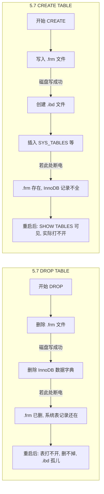
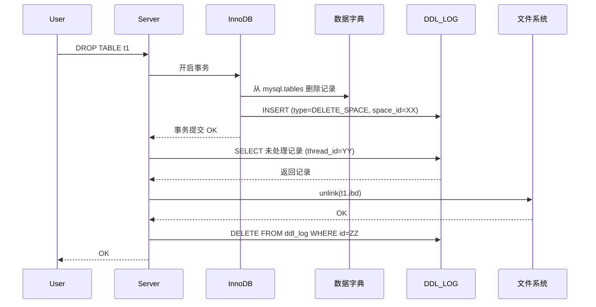
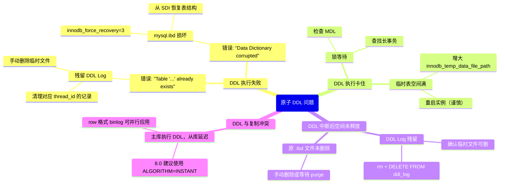

> **摘要**：  
> 在 MySQL 8.0 之前，`CREATE TABLE`、`ALTER TABLE`、`DROP TABLE` 等 DDL 操作**不是原子**的——Server 层的 `.frm` 文件与 InnoDB 的数据字典分属两个独立子系统，任何步骤中断都会留下“孤儿表”或“幽灵文件”，让无数 DBA 在深夜里对着 `ibd` 文件束手无策。  
>  
> 8.0 彻底重构数据字典，将元数据统一存入 InnoDB 表，并引入**DDL 日志表**机制，使得 DDL 操作具备崩溃安全的原子性：要么完整提交，要么完整回滚，不再有中间状态。  
>  
> 本文从 `.frm` 时代的遗留问题切入，系统拆解原子 DDL 的两大支柱：**数据字典统一**与 **DDL Log 可回滚物理操作**。深入 `sql/dd` 和 `storage/innobase/ddl` 源码，完整还原 `CREATE TABLE`、`DROP TABLE`、`ALTER TABLE` 在 8.0 中的原子化执行流程，重点剖析 `innodb_ddl_log` 表的记录格式、提交时机的两阶段写入、以及崩溃恢复时的自动清理。生产实践部分提供 DDL 中断后的恢复手段、大表 DDL 空间回收策略及与复制兼容性的避坑指南。最后基于 2026 年视角，讨论在线 DDL 与原子 DDL 的关系，以及未来云原生架构下 DDL 如何演进。

---

## 一、核心概念与底层图景

### 1.1 定义
**原子 DDL** 指 DDL 操作作为一个不可分割的原子单元：要么完全成功，要么对数据字典、存储引擎、文件系统都无任何影响。在崩溃恢复后，不会有残留的元数据、半写的文件或不一致的表定义。

**8.0 前的非原子困境**：



**原子 DDL 的核心设计**：
1. **元数据统一存储**：移除 `.frm`，所有表定义存于 InnoDB 的 `mysql.ibd` 系统表空间中，受 InnoDB 事务保护。
2. **DDL Log 表**：对文件系统等不可回滚的物理操作，预先记录意图，事务提交后执行；崩溃时根据日志回滚或重做。

### 1.2 架构全景

```mermaid
graph TB
    classDef dict fill:#fff3e0,stroke:#e65100,stroke-width:2px
    classDef ddl fill:#e1f5fe,stroke:#01579b
    classDef file fill:#d1c4e9,stroke:#4a148c
    classDef recovery fill:#c8e6c9,stroke:#1b5e20

    subgraph 持久化存储
        MYSQL_IBD[mysql.ibd] --> DD_TABLES[mysql.tables]
        DD_TABLES --> DD_COLUMNS[mysql.columns]
        DD_TABLES --> DD_INDEXES[mysql.indexes]
        DD_TABLES --> DD_FOREIGN[mysql.foreign_keys]
        
        subgraph DDL日志表
            DDL_LOG[mysql.innodb_ddl_log] --> LOG_ID[ID 自增]
            DDL_LOG --> LOG_TYPE[type: DELETE/RENAME/CREATE]
            DDL_LOG --> LOG_SPACE[space_id]
            DDL_LOG --> LOG_PAGE[page_no]
            DDL_LOG --> LOG_PATH[file_path]
            DDL_LOG --> LOG_THREAD[thread_id]
        end
    end

    subgraph DDL执行流程
        START[DDL 开始] --> TX_BEGIN[开启 InnoDB 事务]
        TX_BEGIN --> DICT_UPDATE[修改数据字典表]
        DICT_UPDATE --> DDL_LOG_WRITE[写入 DDL Log 表]
        DDL_LOG_WRITE --> TX_COMMIT[提交事务]
        TX_COMMIT --> POST_DDL[Post-DDL 阶段]
        POST_DDL -->|异步执行| FILE_OPS[文件操作: 删/重命名]
        FILE_OPS --> DDL_LOG_CLEAN[清理 DDL Log 记录]
    end

    subgraph 崩溃恢复
        CRASH[异常重启] --> RECOVER_SCAN[扫描 innodb_ddl_log]
        RECOVER_SCAN --> UNFINISHED{存在未清理记录?}
        UNFINISHED -->|事务已提交| REDO_FILE[重做文件操作]
        UNFINISHED -->|事务未提交| UNDO_FILE[回滚文件操作]
        UNFINISHED -->|线程死亡| DETACH[标记线程已结束]
        
        REDO_FILE --> CLEAN_LOG[删除 Log 记录]
        UNDO_FILE --> CLEAN_LOG
    end

    subgraph 兼容层
        SDI[SDI 页] -->|ibd2sdi| JSON_DUMP[建表语句]
        SDI -->|IMPORT TABLESPACE| RECOVER_TABLE[重建表]
    end

    class MYSQL_IBD,DD_TABLES,DD_COLUMNS,DD_INDEXES,DD_FOREIGN dict
    class DDL_LOG,LOG_ID,LOG_TYPE,LOG_SPACE,LOG_PAGE,LOG_PATH,LOG_THREAD ddl
    class START,TX_BEGIN,DICT_UPDATE,DDL_LOG_WRITE,TX_COMMIT,POST_DDL,FILE_OPS,DDL_LOG_CLEAN file
    class CRASH,RECOVER_SCAN,UNFINISHED,REDO_FILE,UNDO_FILE,DETACH,CLEAN_LOG recovery
```



---

## 二、机制原理深度剖析

### 2.1 数据字典统一：移除 .frm 的技术代价

**5.7 的数据字典困境**：
- **双元存储**：Server 层读 `.frm`，InnoDB 层读 `SYS_TABLES`，两者不一致是常态。
- **非事务性**：`.frm` 写入是文件系统操作，不可回滚；InnoDB 系统表修改是事务操作，可回滚。
- **DDL 原子性**：无法保证，只能靠 DBA 手工修。

**8.0 的统一方案**：
- 所有元数据表（`tables`、`columns`、`indexes`、`foreign_keys` 等）都存储在 InnoDB 的 `mysql.ibd` 中。
- Server 层不再解析 `.frm`，而是通过 `dd::Table` 对象与 InnoDB 字典交互。
- **代价**：DDL 现在是一个 InnoDB 事务，其**事务大小**与表定义复杂度成正比（万字段表可能撑爆 undo）。

```sql
-- 8.0 验证：系统表也是 InnoDB 表
SELECT ENGINE, TABLE_SCHEMA, TABLE_NAME 
FROM information_schema.tables 
WHERE TABLE_SCHEMA = 'mysql' AND TABLE_NAME IN ('tables', 'columns', 'innodb_ddl_log');

-- 输出示例（8.0.33）：
-- +--------+--------------+-----------------+
-- | ENGINE | TABLE_SCHEMA | TABLE_NAME      |
-- +--------+--------------+-----------------+
-- | InnoDB | mysql        | tables          |
-- | InnoDB | mysql        | columns         |
-- | InnoDB | mysql        | innodb_ddl_log  |
-- +--------+--------------+-----------------+
```

### 2.2 DDL Log 表的设计与实现

**DDL Log 表结构**（`mysql.innodb_ddl_log`）：

```sql
CREATE TABLE `innodb_ddl_log` (
  `id` BIGINT UNSIGNED NOT NULL AUTO_INCREMENT,
  `thread_id` BIGINT UNSIGNED NOT NULL,      -- 线程ID，用于隔离
  `type` INT UNSIGNED NOT NULL,              -- 操作类型
  `space_id` INT UNSIGNED,                   -- 表空间ID
  `page_no` INT UNSIGNED,                   -- 页号（预留）
  `index_id` BIGINT UNSIGNED,               -- 索引ID
  `table_id` BIGINT UNSIGNED,               -- 表ID
  `old_file_path` VARCHAR(512) COLLATE utf8mb4_bin DEFAULT NULL, -- 原路径
  `new_file_path` VARCHAR(512) COLLATE utf8mb4_bin DEFAULT NULL, -- 新路径
  `trx_id` BIGINT UNSIGNED,                 -- 事务ID（8.0.21+）
  PRIMARY KEY (`id`),
  KEY `thread_id_idx` (`thread_id`)
) ENGINE=InnoDB DEFAULT CHARSET=utf8mb4 COLLATE=utf8mb4_bin STATS_PERSISTENT=0
```

**操作类型枚举**：

| type | 操作 | 含义 | 回滚动作 |
|------|------|------|---------|
| 1 | `DDL_DELETE_SPACE` | 删除表空间文件 | 无（已提交）或重做删除 |
| 2 | `DDL_RENAME_SPACE` | 重命名表空间文件 | 重命名回旧路径 |
| 3 | `DDL_DROP` | 删除表 | 无（已提交） |
| 4 | `DDL_CREATE` | 创建表 | 删除表空间文件 |
| 5 | `DDL_TRUNCATE` | 截断表 | 保留原文件？实际上复杂 |
| 6 | `DDL_FREE_QUEUE` | 释放队列记录 | 删除记录 |
| 7 | `DDL_REMOVE_CACHE` | 从字典缓存移除 | 无 |

**设计意图**：
- **可回滚的文件操作**：文件删除/重命名无法回滚，但可以通过记录**反操作**在崩溃时补救。
- **线程隔离**：`thread_id` 字段确保多个并发 DDL 互不干扰。
- **自增主键**：保证记录顺序，崩溃恢复时按 `id` 顺序处理。

### 2.3 原子 DDL 的标准执行模型

任何原子 DDL 都遵循**两阶段执行模型**：

**阶段一：事务阶段（InnoDB 事务内）**
1. 修改数据字典表（`mysql.tables`、`mysql.columns` 等）。
2. 在 `innodb_ddl_log` 中写入**待执行的物理操作**（如“删除文件 X”）。
3. 提交 InnoDB 事务。

**阶段二：Post-DDL 阶段（事务外）**
1. 执行阶段一记录的物理操作（文件删除、重命名）。
2. 从 `innodb_ddl_log` 删除已完成的记录。

**为什么是两阶段？**
- 数据字典修改是**逻辑操作**，可以回滚。
- 文件操作是**物理操作**，一旦执行无法撤销。
- 通过 DDL Log 记录“意图”，事务提交后再执行物理操作。若在物理操作过程中崩溃，恢复时可通过 DDL Log 重做或回滚。



### 2.4 崩溃恢复时的 DDL Log 处理

**恢复触发时机**：
- InnoDB 崩溃恢复的**最后阶段**（`ddl_recovery`）。
- 此时 redo log 已应用，所有已提交事务的数据页已恢复，但 Post-DDL 阶段的文件操作可能未完成。

**恢复逻辑**（`storage/innobase/ddl/ddl0recover.cc`）：

```c
void ddl_recovery(THD* thd) {
    /* 1. 打开 innodb_ddl_log 表 */
    dd::Table* log_table = dd::cache::Dictionary_client::acquire("mysql", "innodb_ddl_log");
    
    /* 2. 遍历所有记录 */
    dd::Iterator<dd::Row> it = log_table->open_scan();
    while (dd::Row* row = it.next()) {
        uint32 type = row->read_uint32("type");
        uint32 space_id = row->read_uint32("space_id");
        std::string old_path = row->read_string("old_file_path");
        std::string new_path = row->read_string("new_file_path");
        uint64 thread_id = row->read_uint64("thread_id");
        
        /* 3. 检查该记录对应的事务是否存在活跃线程 */
        bool thread_alive = check_thread_alive(thread_id);
        
        /* 4. 根据记录类型执行恢复动作 */
        switch (type) {
        case DDL_DELETE_SPACE:
            if (!thread_alive) {
                /* 原线程已死 → 重做文件删除 */
                os_file_delete(old_path);
            }
            break;
            
        case DDL_RENAME_SPACE:
            if (!thread_alive) {
                /* 原线程已死 → 回滚到旧文件名 */
                os_file_rename(new_path, old_path);
            }
            break;
            
        case DDL_CREATE:
            if (!thread_alive) {
                /* CREATE 表时事务已提交，但文件未删干净 → 清理 */
                os_file_delete(old_path);
            }
            break;
        }
        
        /* 5. 删除已处理的记录 */
        row->delete();
    }
}
```

**关键判断**：`thread_alive`
- 若记录对应的线程**仍在运行**，说明该 DDL 操作仍在 Post-DDL 阶段，恢复不应干预（可能立即执行）。
- 若线程已不存在，说明该 DDL 操作已提交但物理操作未完成，需重做。

---

## 三、内核/源码级实现

### 3.1 核心数据结构：`ddl_log_t`

```c
/* storage/innobase/include/ddl0impl.h */
struct ddl_log_t {
    /* DDL 日志类型 */
    enum type {
        DELETE_SPACE = 1,
        RENAME_SPACE = 2,
        DROP = 3,
        CREATE = 4,
        TRUNCATE = 5,
        FREE_QUEUE = 6,
        REMOVE_CACHE = 7
    };
    
    /* 日志记录内容 */
    struct record {
        uint64      id;             /* 自增ID */
        uint64      thread_id;      /* 线程ID */
        type        op_type;       /* 操作类型 */
        space_id_t  space_id;      /* 表空间ID（可选）*/
        page_no_t   page_no;       /* 页号（预留）*/
        index_id_t  index_id;      /* 索引ID（可选）*/
        table_id_t  table_id;      /* 表ID（可选）*/
        std::string old_file_path; /* 源文件路径 */
        std::string new_file_path; /* 目标文件路径 */
    };
    
    /* 序列化到 InnoDB 行 */
    bool store(trx_t* trx, dd::Table* dd_log_table);
    
    /* 从 InnoDB 行反序列化 */
    static record load(dd::Row* row);
};
```

### 3.2 核心流程：CREATE TABLE 原子化

```c
/* sql/dd/impl/tables/table_impl.cc - create_base_table */
bool create_base_table(THD* thd, const dd::Table* table_def) {
    /* 1. 获取数据字典客户端 */
    dd::cache::Dictionary_client* dc = thd->dd_client();
    
    /* 2. 开启 InnoDB 事务（通过 dd::Transaction）*/
    dd::Transaction_ro trx(thd);
    
    /* 3. 向 mysql.tables 插入记录 */
    dd::Table* dd_table = dc->acquire_for_modification(
        table_def->schema_name(), table_def->name());
    dd_table->set_engine(table_def->engine());
    dd_table->set_row_format(table_def->row_format());
    // ... 设置其他字段
    dc->store(dd_table);
    
    /* 4. 向 mysql.columns 插入记录（每条列）*/
    for (const dd::Column* col : table_def->columns()) {
        dd::Column* dd_col = dd_table->add_column();
        dd_col->set_name(col->name());
        dd_col->set_type(col->type());
        dd_col->set_nullable(col->nullable());
        // ...
        dc->store(dd_col);
    }
    
    /* 5. 向 mysql.indexes 插入记录 */
    for (const dd::Index* idx : table_def->indexes()) {
        dd::Index* dd_idx = dd_table->add_index();
        dd_idx->set_name(idx->name());
        dd_idx->set_type(idx->type());
        // ...
        dc->store(dd_idx);
    }
    
    /* 6. 提交事务（元数据持久化）*/
    trx.commit();
    
    /* 7. Post-DDL：创建 .ibd 文件，写入 SDI */
    dd::cache::Storage_adapter::store(thd, dd_table);
    
    return true;
}

/* storage/innobase/handler/ha_innodb.cc - innobase_create_table */
int innobase_create_table(THD* thd, const dd::Table* dd_table) {
    /* 1. 为表分配 InnoDB table_id */
    dict_table_t* ib_table = dict_mem_table_create();
    
    /* 2. 创建表空间文件 .ibd */
    fil_space_t* space = fil_ibd_create(ib_table->name, ...);
    
    /* 3. 为聚簇索引分配根页 */
    dict_index_t* clust_index = dict_mem_index_create();
    btr_create(clust_index, space, ...);
    
    /* 4. 将 InnoDB 元数据关联到 dd::Table */
    dd_table->set_se_private_id(ib_table->id);
    dd_table->set_se_private_data(serialize_metadata(space, clust_index));
    
    /* 5. 写入 SDI 页 */
    sdi_write(dd_table, space);
    
    return 0;
}
```

**CREATE TABLE 的原子性保障**：
- 若步骤 1-6 中崩溃：事务未提交，所有元数据修改回滚，无残留。
- 若步骤 7 中崩溃（.ibd 已创建但未写入 SDI 或未关联）：事务已提交，元数据存在，但文件不完整。
- **恢复机制**：扫描 `innodb_ddl_log`，发现 `DDL_CREATE` 记录且线程死亡 → 删除残留 .ibd 文件。

### 3.3 核心流程：DROP TABLE 原子化

```c
/* sql/dd/impl/tables/table_impl.cc - drop_table */
bool drop_table(THD* thd, const dd::Table* dd_table) {
    /* 1. 获取 InnoDB 表空间ID和文件路径 */
    space_id_t space_id = dd_table->se_private_id();
    std::string file_path = dd_table->se_private_data()->get_string("path");
    
    /* 2. 开启事务 */
    dd::Transaction_ro trx(thd);
    
    /* 3. 从数据字典删除记录 */
    dd::cache::Dictionary_client* dc = thd->dd_client();
    dc->drop(dd_table);
    
    /* 4. 在 DDL Log 中写入 DELETE_SPACE 记录 */
    ddl_log_t::record rec;
    rec.op_type = ddl_log_t::DELETE_SPACE;
    rec.space_id = space_id;
    rec.old_file_path = file_path;
    rec.thread_id = thd->thread_id();
    rec.store(trx.get_thd(), log_table);
    
    /* 5. 提交事务 */
    trx.commit();
    
    /* 6. Post-DDL：物理删除 .ibd 文件 */
    os_file_delete(file_path);
    
    /* 7. 删除 DDL Log 记录 */
    dc->acquire_for_modification("mysql", "innodb_ddl_log");
    execute("DELETE FROM mysql.innodb_ddl_log WHERE id = ?", rec.id);
    
    return true;
}
```

**DROP TABLE 的原子性保障**：
- 若步骤 5 前崩溃：事务未提交，数据字典未改，文件保留，无影响。
- 若步骤 6 崩溃（文件已删，Log 记录未删）：事务已提交，元数据已删，文件已删，但 DDL Log 残留。
- **恢复机制**：崩溃恢复时扫描到 `DELETE_SPACE` 记录，检查文件是否已删除；若已删，直接清理 Log 记录；若未删（极少见），重做删除。

### 3.4 核心流程：ALTER TABLE RENAME 原子化

```c
/* storage/innobase/ddl/ddl0rename.cc */
int innobase_rename_table(THD* thd, const dd::Table* old_dd,
                          const char* new_db, const char* new_name) {
    /* 1. 获取原文件路径和新文件路径 */
    std::string old_path = build_ibd_path(old_dd);
    std::string new_path = build_ibd_path(new_db, new_name);
    
    /* 2. 开启事务 */
    dd::Transaction_ro trx(thd);
    
    /* 3. 更新数据字典中的表名、库名 */
    dd::Table* new_dd = old_dd->clone();
    new_dd->set_schema_name(new_db);
    new_dd->set_name(new_name);
    thd->dd_client()->update(old_dd, new_dd);
    
    /* 4. 在 DDL Log 中写入 RENAME_SPACE 记录 */
    ddl_log_t::record rec;
    rec.op_type = ddl_log_t::RENAME_SPACE;
    rec.space_id = old_dd->se_private_id();
    rec.old_file_path = old_path;
    rec.new_file_path = new_path;
    rec.thread_id = thd->thread_id();
    rec.store(trx.get_thd(), log_table);
    
    /* 5. 提交事务 */
    trx.commit();
    
    /* 6. Post-DDL：重命名 .ibd 文件 */
    os_file_rename(old_path, new_path);
    
    /* 7. 删除 DDL Log 记录 */
    execute("DELETE FROM mysql.innodb_ddl_log WHERE id = ?", rec.id);
    
    return 0;
}
```

**RENAME TABLE 的原子性保障**：
- 若步骤 5 前崩溃：事务未提交，数据字典未改，文件未动，无影响。
- 若步骤 6 崩溃（文件已重命名，Log 记录未删）：数据字典已改，文件已重命名，但旧路径的 Log 记录残留。
- **恢复机制**：崩溃恢复时发现 `RENAME_SPACE` 记录且线程死亡 → 若新文件存在且旧文件不存在，说明重命名已完成，仅清理 Log；若新文件不存在，回滚到旧文件名。

---

## 四、生产落地与 SRE 实战

### 4.1 场景化案例：ALTER TABLE 中途 Kill 后空间未释放

**环境**：
- MySQL 8.0.33，表 `order_details` 约 5 亿行，执行 `ALTER TABLE order_details ENGINE=InnoDB` 重建表。
- 运行 20 分钟后 DBA 发现影响业务，执行 `KILL` 终止会话。

**现象**：
- `SHOW PROCESSLIST` 显示该会话已消失。
- 磁盘空间显示 `order_details.ibd` 文件大小仍为 120GB（重建临时文件未清理）。
- `SHOW TABLES` 正常，表数据完整。

**排查**：

```sql
-- 8.0 检查 DDL Log 是否有残留
SET SESSION debug='+d,skip_dd_table_access_check';
SELECT * FROM mysql.innodb_ddl_log\G

-- 找到 thread_id 对应已终止会话的记录
-- type = 5 (TRUNCATE) 或 type = 4 (CREATE)
```

**解决方案**：

```sql
-- 1. 确认记录对应的文件可以安全删除
-- 2. 手动清理临时表空间文件
ls -la /var/lib/mysql/#sql-*.ibd
rm /var/lib/mysql/#sql-ibtable-*.ibd

-- 3. 清理 DDL Log 记录（生产慎用！）
DELETE FROM mysql.innodb_ddl_log WHERE thread_id = 123456;
```

**根本原因**：
- `ALTER TABLE ... ENGINE=InnoDB` 在 8.0 中使用**临时表** + **重命名**策略。
- 事务提交后，原表空间文件被标记为待删除，由 DDL Log 记录。
- 若 Post-DDL 阶段被中断（`KILL`），临时文件残留，Log 记录未清理。

**预防措施**：

```sql
-- 8.0.12+ 支持即时 DDL（ALGORITHM=INSTANT）
-- 只修改元数据，不重建表
ALTER TABLE order_details ADD COLUMN last_access DATETIME, ALGORITHM=INSTANT;

-- 必须重建时，使用在线模式
ALTER TABLE order_details ENGINE=InnoDB, ALGORITHM=INPLACE, LOCK=NONE;
```

### 4.2 参数调优矩阵

| 参数 | 作用域 | 8.0 推荐值 | 内核解释 |
|------|--------|-----------|---------|
| `innodb_ddl_log_crash_reset_debug` | 调试 | OFF | 8.0.21+，模拟 DDL Log 崩溃 |
| `innodb_ddl_log_crash_reset_interval` | 全局 | 0 | 恢复时 DDL Log 清理间隔 |
| `ddl_buffer_size` | 会话 | 2MB | 大表 DDL 时临时内存缓冲区 |
| `ddl_undo_retention` | 全局 | 0 | 8.0.30+，DDL undo 保留时间（秒）|
| `innodb_online_alter_log_max_size` | 全局 | 128MB | 在线 DDL 时临时日志大小限制 |
| `innodb_compression_algorithm` | 全局 | zlib | 透明页压缩 DDL 相关 |

**关键参数**：`ddl_buffer_size`
- 影响大表索引创建时的排序缓冲区。
- 默认 2MB，对于大表（>1TB）可能过小，导致临时文件频繁刷盘。
- **调高**至 32MB～128MB 可提升 DDL 速度，但会占用更多内存。

### 4.3 监控与诊断

**1. 查看 DDL Log 积压**

```sql
-- 正常情况应返回 0 行
SET SESSION debug='+d,skip_dd_table_access_check';
SELECT COUNT(*) FROM mysql.innodb_ddl_log;
```

**2. 监控 DDL 执行进度（8.0.32+）**

```sql
-- 通过 performance_schema
SELECT * FROM performance_schema.ddl_progress;
```

| 字段 | 含义 |
|------|------|
| `THREAD_ID` | 执行 DDL 的线程 ID |
| `STAGE` | 当前阶段（`data_dict`/`file_ops`/`ddl_log`）|
| `COMPLETED_BYTES` | 已处理字节 |
| `TOTAL_BYTES` | 总字节 |
| `COMPLETED_ROWS` | 已处理行 |
| `TOTAL_ROWS` | 总行 |

**3. 检测 DDL 冲突**

```sql
-- 查看当前正在执行的 DDL
SELECT * FROM performance_schema.metadata_locks 
WHERE OBJECT_TYPE = 'TABLE' AND LOCK_STATUS = 'GRANTED';

-- 查看阻塞 DDL 的查询
SELECT * FROM performance_schema.metadata_locks 
WHERE OBJECT_TYPE = 'TABLE' AND LOCK_STATUS = 'PENDING';
```

**4. 临时表空间监控**

```sql
-- 8.0 临时表空间独立
SELECT FILE_NAME, TABLESPACE_NAME, (TOTAL_EXTENTS * 64 * 16 / 1024) AS MB
FROM information_schema.FILES
WHERE TABLESPACE_NAME = 'innodb_temporary';
```

### 4.4 故障排查决策树



### 4.5 实战案例：从 SDI 恢复误删表

**场景**：
- 某测试环境误执行 `DROP TABLE t1`，且 `purge` 线程已物理删除 `.ibd` 文件。
- 但有 8.0 的 `.ibd` 文件备份（一周前），且该表数据只读，一周无变化。

**恢复步骤**：

```bash
# 1. 从 .ibd 文件抽取建表语句
ibd2sdi --dump-file=t1_sdi.json /backup/t1.ibd

# 2. 查看 JSON，找到 CREATE TABLE 语句
cat t1_sdi.json | jq '.[] | select(.dd_object_type == "Table") | .dd_object | .stmt'
```

```sql
-- 3. 创建空表（使用从 SDI 获取的结构）
CREATE TABLE t1 (id INT PRIMARY KEY, name VARCHAR(100)) ENGINE=InnoDB;

-- 4. 丢弃表空间
ALTER TABLE t1 DISCARD TABLESPACE;

-- 5. 拷贝备份的 .ibd 文件到数据目录
cp /backup/t1.ibd /var/lib/mysql/test/t1.ibd
chown mysql:mysql /var/lib/mysql/test/t1.ibd

-- 6. 导入表空间
ALTER TABLE t1 IMPORT TABLESPACE;
```

**原理**：
- 8.0 的 `.ibd` 文件自带 SDI 页，包含完整的表定义 JSON。
- `IMPORT TABLESPACE` 会验证 SDI 与当前表结构是否兼容。
- **即使数据字典损坏，只要 .ibd 文件完整，就能 100% 恢复表结构和数据**。

---

## 五、技术演进与 2026 年视角

### 5.1 历史设计约束与改进

| 版本 | 原子 DDL 变化 | 动因 |
|------|-------------|------|
| 5.7 | ❌ 无原子 DDL | .frm + InnoDB 系统表，无法原子化 |
| 8.0.0 | ✅ 基础原子 DDL（CREATE/DROP/RENAME） | 统一数据字典，引入 DDL Log |
| 8.0.12 | ✅ ALGORITHM=INSTANT（ADD COLUMN） | 在线 DDL 扩展，仍遵循原子 DDL 协议 |
| 8.0.21 | ✅ 支持 TRUNCATE TABLE 原子化 | 早期 TRUNCATE 不走 DDL Log，8.0.21 修复 |
| 8.0.27 | ✅ DDL Log 多线程清理 | 高并发 DDL 场景优化 |
| 8.0.30+ | ✅ `ddl_undo_retention` 参数 | 避免 DDL 过程中 undo 过早回收 |

### 5.2 2026 年仍存在的“遗留设计”

1. **DDL Log 表仍位于 mysql.ibd**  
   DDL Log 表本身存储在系统表空间，与用户数据混存。  
   **风险**：系统表空间损坏可能导致 DDL 恢复信息丢失。  
   **现状**：8.0 未提供独立表空间选项。

2. **Post-DDL 阶段仍是异步串行**  
   虽然 DDL Log 清理是多线程的，但**文件删除/重命名**操作仍然是**单线程**（一个线程串行处理一个 DDL 的多个文件操作）。  
   **现状**：大表 DROP 可能需要数秒甚至数分钟（HDD）。

3. **INSTANT DDL 支持有限**  
   目前仅支持 `ADD COLUMN`（非首位）、`DROP COLUMN`（需重建）、`RENAME COLUMN`、`NULL/NOT NULL` 变更。  
   **现状**：`MODIFY COLUMN` 类型变更仍需要 INPLACE 或 COPY。

4. **DDL 与 MDL 耦合过深**  
   虽然 DDL 本身是原子的，但 DDL 执行期间持有**排他 MDL**（独占元数据锁），阻塞所有并发 DML。  
   **现状**：8.0 无改进，部分 ALGORITHM=INPLACE 操作可在准备阶段降级为共享锁，但时间窗口仍存在。

5. **复制兼容性**  
   原子 DDL 在 binlog 中仍以**事务**形式记录（`BEGIN` + `DDL` + `COMMIT`），但 `row` 格式下 DDL 仍是 `STATEMENT` 格式。  
   **现状**：8.0 未改变，从库执行 DDL 时无法并行。

### 5.3 未来趋势：云原生时代的 DDL 革命

**云原生数据库的 DDL 范式**：

| 特性 | 传统 MySQL 8.0 | AWS Aurora / PolarDB |
|------|---------------|---------------------|
| **DDL 锁** | 持有 MDL，阻塞写入 | 元数据多版本，DDL 不阻塞 DML |
| **物理操作** | 本地文件系统删除/重命名 | 共享存储，元数据变更即生效 |
| **回滚** | DDL Log 回滚 | MVCC 字典，秒级回滚 |
| **执行时间** | 与数据量成正比 | O(1)（仅修改元数据）|

**MySQL 官方路线图**：
- **9.0**：实验性支持 INSTANT DROP COLUMN。
- **9.x**：支持 INSTANT MODIFY COLUMN（有限类型）。
- **10.x**：可能引入共享存储模式，但社区版仍以本地文件系统为主。

**2026 年现实**：
- **自建机房**：仍使用 8.0 原子 DDL，大表 DDL 需 `pt-online-schema-change` 或 `gh-ost`。
- **公有云**：RDS for MySQL 8.0 已支持 INSTANT DDL，且云厂商存储层实现了 O(1) 表重建。
- **长期趋势**：**DDL Log 可能被版本化数据字典取代**，文件删除等物理操作下推到存储层，由存储层保证原子性。

---

## 六、结语：原子 DDL 是 MySQL 成年礼

从 1995 年 MySQL 诞生，到 2018 年 8.0 GA，MySQL 花了 **23 年**才把 DDL 操作真正变成原子。  
这不是技术能力问题，而是历史包袱问题——当你的架构里到处都是 `.frm` 文件时，想改得动筋骨，谈何容易。

**原子 DDL 的意义不在于“不会坏了”，而在于“坏了能修”**。  
它用一套统一的日志机制，把数据字典、存储引擎、文件系统这三个原本各自为政的模块，**第一次纳入了同一个故障域**。  

**2026 年的今天，我们终于可以自信地说**：
> MySQL 的 DDL，不再是生产环境的午夜凶铃。

---

## 参考文献
- `sql/dd/` 目录，MySQL 8.0.33 源码
- `storage/innobase/ddl/ddl0recover.cc`, `ddl0impl.cc`
- MySQL Internals Manual – Data Dictionary and Atomic DDL
- Oracle Blogs: “MySQL 8.0: Data Dictionary and Atomic DDL” (2017)
- Oracle Blogs: “Instant ADD COLUMN in MySQL 8.0.12” (2018)
- WL#11390: Atomic TRUNCATE TABLE
- WL#12930: DDL Logging for InnoDB