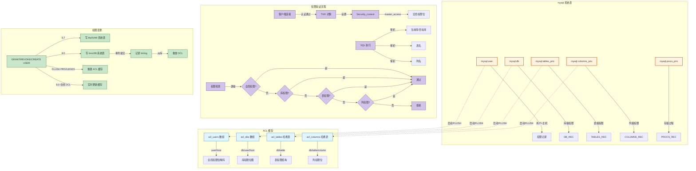
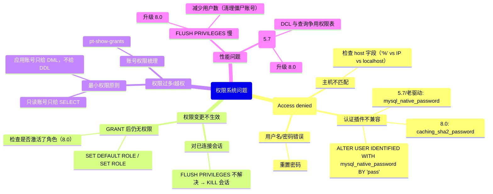

> **摘要**：  
> 数据库权限系统是安全的第一道门禁，却也是最容易被忽视的性能瓶颈。MySQL 的权限管理经历了从 **MyISAM 系统表**到 **InnoDB 字典表**的存储升级，从**每次查询实时验证**到**多层次缓存**的架构演进，但其核心模型——**用户 + 主机 + 库 + 对象**的四级权限体系——二十年来始终稳固。  
>  
> 本文从登录认证成功后的权限验证切入，系统拆解 MySQL 权限系统的四层存储结构：全局权限、库权限、表权限、列权限，深入 `sql/auth` 目录源码，完整还原 ACL 缓存 (`acl_users`、`acl_dbs`、`acl_tables`、`acl_columns`) 的加载时机与失效策略，以及 8.0 将权限表从 MyISAM 迁移至 InnoDB 后对并发 DCL 的根本性改善。生产实践部分提供权限缓存刷新陷阱、`IDENTIFIED WITH caching_sha2_password` 的兼容性处理及最小权限原则落地模板。最后基于 2026 年视角，讨论角色管理在 8.0 的成熟度及云原生时代 RBAC 对传统用户-主机模型的替代趋势。

---

## 一、核心概念与底层图景

### 1.1 定义
**MySQL 权限系统**是基于**用户 + 主机**双重标识的访问控制模型，通过四层作用域逐级收紧权限范围：

| 权限层级 | 存储表（5.7） | 存储表（8.0） | 作用范围 |
|---------|--------------|--------------|---------|
| **全局权限** | `mysql.user` | `mysql.user` | 所有库、所有表 |
| **库权限** | `mysql.db` | `mysql.db` | 指定库的所有对象 |
| **表权限** | `mysql.tables_priv` | `mysql.tables_priv` | 指定表的列或整表 |
| **列权限** | `mysql.columns_priv` | `mysql.columns_priv` | 指定表的指定列 |
| **例程权限** | `mysql.procs_priv` | `mysql.procs_priv` | 存储过程/函数 |

**设计哲学**：
- **双重认证**：你是谁（`user`） + 你从哪来（`host`）。
- **逐层收紧**：无全局权限则检查库权限，无库权限则检查表权限。
- **缓存加速**：权限表读取后全量缓存在 ACL 内存结构中，避免每次查询都读磁盘。
- **动态生效**：`FLUSH PRIVILEGES` 触发热加载，但 8.0 已支持在线 DCL 即时生效。

### 1.2 架构全景



---

## 二、机制原理深度剖析

### 2.1 权限存储：从 MyISAM 到 InnoDB 的十年跨越

**5.7 及之前**：
- `mysql.user`、`mysql.db` 等权限表使用 **MyISAM** 存储引擎。
- **问题**：`GRANT` 语句是**非事务性**的，执行中途崩溃可能导致权限表损坏；多个并发 `GRANT` 会锁表。
- **表现**：高并发权限操作时 `Waiting for table level lock` 频发。

**8.0 重构**：
- 所有权限表迁移至 **InnoDB**，支持事务、外键、崩溃恢复。
- **收益**：并发 `GRANT` 不再锁表，权限变更可回滚，复制环境更可靠。

```sql
-- 8.0 验证权限表引擎
SELECT TABLE_NAME, ENGINE 
FROM information_schema.tables 
WHERE TABLE_SCHEMA = 'mysql' 
  AND TABLE_NAME IN ('user', 'db', 'tables_priv', 'columns_priv', 'procs_priv');

-- 输出示例：
-- +--------------+--------+
-- | TABLE_NAME   | ENGINE |
-- +--------------+--------+
-- | user         | InnoDB |
-- | db           | InnoDB |
-- | tables_priv  | InnoDB |
-- | columns_priv | InnoDB |
-- | procs_priv   | InnoDB |
-- +--------------+--------+
```

**字段变化**：
- 5.7 的 `ENUM` 权限字段（`Select_priv`、`Insert_priv`等）在 8.0 中**保留兼容性**，但内部处理已转为位掩码。
- 新增 `authentication_string` 替代 `Password` 字段，支持多认证插件。

### 2.2 ACL 缓存：内存中的权限位图

MySQL 在启动和 `FLUSH PRIVILEGES` 时，会将权限表**全量读取**到内存中，组织成便于快速查找的数据结构。

**核心缓存结构**（`sql/auth/sql_auth_cache.cc`）：

```c
/* 全局权限缓存 - 线性数组 */
static ACL_USER *acl_users = NULL;      /* 按 user/host 排序 */
static uint    acl_users_size = 0;     /* 用户总数 */

/* 库权限缓存 - 线性数组 */
static ACL_DB  *acl_dbs = NULL;        /* 按 db/user/host 排序 */
static uint    acl_dbs_size = 0;       /* 库权限记录数 */

/* 表权限缓存 - 哈希表 */
static HASH    acl_tables;            /* key: db\0table\0user\0host */
static HASH    acl_columns;           /* key: db\0table\0column\0user\0host */

/* 存储过程权限缓存 */
static HASH    acl_procs;            /* key: db\0routine_name\0user\0host */
```

**ACL_USER 结构**：

```c
/* sql/auth/sql_auth.h */
struct ACL_USER {
    /* 身份标识 */
    LEX_CSTRING user;               /* 用户名 */
    LEX_CSTRING host;              /* 主机名（支持通配符）*/
    
    /* 认证信息 */
    plugin_ref   auth_plugin;      /* 认证插件 */
    LEX_CSTRING auth_string;       /* 认证字符串（哈希值）*/
    
    /* 全局权限位掩码 */
    ulong        access;           /* 权限位（SELECT_ACL, INSERT_ACL ...）*/
    
    /* 账户锁定/过期 */
    bool         account_locked;   /* 5.7.6+ */
    bool         password_expired; /* 5.7.6+ */
    
    /* 资源限制 */
    USER_RESOURCES user_resources; /* 最大连接数、查询数等 */
    
    /* 默认角色（8.0+）*/
    LEX_STRING   default_role;     /* 默认激活的角色 */
};
```

**ACL_DB 结构**：

```c
struct ACL_DB {
    char  *user;                   /* 用户名 */
    char  *host;                  /* 主机名 */
    char  *db;                   /* 数据库名（支持通配符 _ 和 %）*/
    ulong access;               /* 库级权限位掩码 */
};
```

**设计意图**：
- **排序 + 二分查找**：`acl_users` 和 `acl_dbs` 按 `(host, user)` 排序，查找时先精确匹配，再尝试通配符。
- **哈希索引**：`acl_tables` 等因组合键更复杂，使用哈希表加速。
- **全量缓存**：权限表通常较小（数千条记录），全量加载换取验证 O(1) 复杂度。

### 2.3 权限验证路径：从 THD 到 Security_context

每个客户端连接在认证成功后，会生成一个 **Security_context** 对象，挂载在 `THD` 上，贯穿会话生命周期。

```c
/* sql/sql_class.h - THD */
class THD {
    Security_context m_main_security_ctx;  /* 主安全上下文 */
    Security_context *m_security_ctx;      /* 当前生效的上下文（可切换）*/
};

/* sql/auth/sql_auth.h - Security_context */
class Security_context {
private:
    LEX_CSTRING m_user;           /* 认证用户名 */
    LEX_CSTRING m_priv_user;      /* 权限检查用户名（可能不同）*/
    LEX_CSTRING m_host;          /* 主机名 */
    LEX_CSTRING m_ip;           /* IP 地址（解析后）*/
    ulong       m_master_access; /* 全局权限位掩码（缓存！）*/
    bool        m_password_expired; /* 密码是否过期 */
};
```

**权限验证核心函数**：

```c
/* sql/auth/sql_authorization.cc */
bool check_global_access(THD *thd, ulong want_access) {
    Security_context *sctx = thd->security_context();
    
    /* 1. 检查 SUPER 权限（5.7.2+ 拆分为更细粒度）*/
    if (want_access & SUPER_ACL) {
        want_access &= ~SUPER_ACL;
    }
    
    /* 2. 直接比较缓存的权限位 */
    return (sctx->check_access(want_access) ||
            sctx->has_global_grant(want_access));
}

bool check_db_access(THD *thd, const char *db, ulong want_access) {
    /* 1. 先检查全局权限 */
    if (thd->security_context()->check_access(want_access))
        return true;
    
    /* 2. 从 ACL_DB 数组查找匹配记录 */
    ACL_DB *acl_db = acl_db_find(db, thd->security_context()->priv_user(),
                                  thd->security_context()->host());
    if (acl_db) {
        return (acl_db->access & want_access) == want_access;
    }
    
    return false;
}
```

**性能关键点**：
- `m_master_access` 在**连接建立时**从 ACL 缓存复制到 `Security_context`。
- **整个会话期间不重新验证全局权限**——若中途执行 `REVOKE` 并 `FLUSH PRIVILEGES`，已连接的会话**仍拥有原权限**，直到重新连接。
- **这是设计缺陷，不是 bug**：5.7 官方文档明确此行为，8.0 仍保留。

### 2.4 权限变更与缓存同步

**5.7 的笨拙方案**：

```sql
-- 5.7 修改权限后，必须执行
FLUSH PRIVILEGES;
-- 否则新权限仅对后续连接生效，已连接会话不受影响
-- 且 FLUSH PRIVILEGES 会锁表，重建整个 ACL 缓存（O(N)）
```

**8.0 的增量优化**：

```c
/* sql/auth/sql_authorization.cc - grant_user */
bool grant_user(THD *thd, const char *user, const char *host) {
    /* 1. 写 InnoDB 系统表（事务性）*/
    mysql_user_table_insert(thd, user, host, privileges);
    
    /* 2. 事务提交后，立即更新 ACL 缓存 */
    if (dd::cache::Dictionary_client::is_committed(thd)) {
        /* 增量更新：只修改一个用户 */
        acl_update_user(user, host, privileges);
        /* 或 */
        acl_insert_user(user, host, privileges);
    }
    
    return false;
}
```

**8.0 仍存在的问题**：
- **已连接会话的权限不会主动更新**——需要客户端重连。
- 角色（role）激活后权限变更，已激活的角色不受 `REVOKE` 影响，需重新 `SET ROLE`。

**安全提示**：
> 永远不要假设 `REVOKE` 能立即阻断已连接会话的危险操作。  
> 生产环境权限回收的标准流程应为：
> 1. `REVOKE` 权限
> 2. `KILL` 该用户的所有活跃连接
> 3. 通知客户端重连

---

## 三、内核/源码级实现

### 3.1 核心数据结构：ACL 缓存加载

```c
/* sql/auth/sql_auth_cache.cc */
bool acl_load(THD *thd, TABLE *user_tables) {
    /* 1. 清理旧缓存 */
    acl_free();
    
    /* 2. 打开 mysql.user 表 */
    TABLE *user_table = open_ltable(thd, user_tables, TL_READ, MDL_key::TABLE);
    
    /* 3. 扫描全表 */
    while (!user_table->file->ha_rnd_next(user_table->record[0])) {
        ACL_USER acl_user;
        
        /* 3.1 读取字段 */
        acl_user.user = get_field(thd->mem_root, 
                                  user_table->field[MYSQL_USER_FIELD_USER]);
        acl_user.host = get_field(thd->mem_root,
                                  user_table->field[MYSQL_USER_FIELD_HOST]);
        
        /* 3.2 读取权限位（兼容 ENUM 和 BIT 两种格式）*/
        acl_user.access = 0;
        for (uint i = 0; i < SYSTEM_PRIVILEGES_COUNT; i++) {
            if (get_field(user_table->field[i + MYSQL_USER_FIELD_SELECT_PRIV]))
                acl_user.access |= system_privilege_bit[i];
        }
        
        /* 3.3 读取认证信息 */
        acl_user.auth_plugin = get_plugin(get_field(&user_table->field[...]));
        acl_user.auth_string = get_field(thd->mem_root, 
                                         user_table->field[MYSQL_USER_FIELD_AUTH_STRING]);
        
        /* 3.4 插入 acl_users 数组（保持排序）*/
        acl_insert_user_sorted(&acl_user);
    }
    
    /* 4. 加载 mysql.db 表（类似逻辑）*/
    acl_db_load(thd);
    
    /* 5. 加载 mysql.tables_priv 表 */
    acl_tables_load(thd);
    
    /* 6. 加载 mysql.columns_priv 表 */
    acl_columns_load(thd);
    
    return false;
}
```

### 3.2 核心流程：权限查找算法

**用户匹配规则**（精确优先，通配符次之）：

```c
/* sql/auth/sql_auth_cache.cc - find_acl_user */
ACL_USER *find_acl_user(const char *user, const char *host) {
    /* 1. 精确匹配（user, host）*/
    uint idx = find_acl_user_index(user, host);
    if (idx != NO_SUCH_USER)
        return &acl_users[idx];
    
    /* 2. 精确用户 + 通配主机（如 '%'）*/
    if (strcmp(host, "%") != 0) {
        idx = find_acl_user_index(user, "%");
        if (idx != NO_SUCH_USER)
            return &acl_users[idx];
    }
    
    /* 3. 通配用户 + 精确主机（空用户名表示匿名用户）*/
    idx = find_acl_user_index("", host);
    if (idx != NO_SUCH_USER)
        return &acl_users[idx];
    
    /* 4. 通配用户 + 通配主机 */
    idx = find_acl_user_index("", "%");
    if (idx != NO_SUCH_USER)
        return &acl_users[idx];
    
    return nullptr;
}
```

**数据库匹配规则**：

```c
/* sql/auth/sql_auth_cache.cc - acl_db_find */
ACL_DB *acl_db_find(const char *db, const char *user, const char *host) {
    ACL_DB *acl_db = acl_dbs;
    ACL_DB *acl_db_end = acl_dbs + acl_dbs_size;
    
    /* ACL_DB 数组按 (db, user, host) 排序 */
    while (acl_db < acl_db_end) {
        int cmp = strcmp(acl_db->db, db);
        if (cmp == 0) {
            /* 匹配用户/主机（同用户匹配规则）*/
            if (acl_user_matches(user, host, acl_db->user, acl_db->host))
                return acl_db;
        }
        acl_db++;
    }
    
    return nullptr;
}
```

### 3.3 认证插件接口

```c
/* sql/auth/sql_authentication.cc */
int native_password_authenticate(MYSQL_PLUGIN_VIO *vio, MYSQL_SERVER_AUTH_INFO *info) {
    /* 1. 从 ACL 缓存查找用户 */
    ACL_USER *acl_user = find_acl_user(info->user_name, info->host_name);
    if (!acl_user)
        return CR_ERROR;
    
    /* 2. 获取服务端盐 */
    uchar *salt = (uchar*)info->auth_string;
    
    /* 3. 读取客户端响应包 */
    uchar *reply;
    int pkt_len = vio->read_packet(vio, &reply);
    
    /* 4. 验证：SHA1(密码) XOR SHA1(salt + SHA1(SHA1(密码))) */
    if (native_password_verify(reply, pkt_len, acl_user->auth_string, salt))
        return CR_OK;
    
    return CR_ERROR;
}
```

**8.0 默认认证插件**：`caching_sha2_password`

```c
/* plugin/caching_sha2_password/src/authentication_caching_sha2_password.cc */
int caching_sha2_password_authenticate(MYSQL_PLUGIN_VIO *vio, 
                                       MYSQL_SERVER_AUTH_INFO *info) {
    /* 1. 快速路径：客户端发送加盐哈希 */
    /* 2. 若快速路径失败，切换到 RSA 加密路径 */
    /* 3. 缓存验证结果（如果服务端启用缓存）*/
}
```

---

## 四、生产落地与 SRE 实战

### 4.1 场景化案例：FLUSH PRIVILEGES 引发的数据库抖动

**环境**：
- MySQL 5.7.30，用户数约 5000，权限记录约 2 万条。
- 每周定时任务执行 `GRANT` 并 `FLUSH PRIVILEGES`。

**现象**：
- 定时任务执行期间，数据库 CPU 短暂飙升至 100%。
- `SHOW PROCESSLIST` 看到大量 `Opening tables` 和 `closing tables` 状态。
- 业务侧出现几十秒的连接超时。

**根本原因**：
- 5.7 权限表使用 **MyISAM** 引擎，`FLUSH PRIVILEGES` 执行流程：
  1. 锁定 `mysql.user`、`mysql.db` 等表（表级锁）。
  2. 全表扫描所有权限表（几万行）。
  3. 清空并重建 ACL 缓存（内存操作，O(N)）。
  4. 释放表锁。
- 扫描期间，其他查询若需访问权限表（如 `SHOW GRANTS`、`CREATE USER` 等）会被阻塞。

**解决方案**（5.7 场景）：

```sql
-- 1. 避免频繁 FLUSH PRIVILEGES
-- GRANT 后权限对新连接立即生效，旧连接不受影响
-- 若必须回收权限，接受短暂窗口

-- 2. 升级到 8.0（根本解）
```

**8.0 验证**：

```sql
-- 8.0 执行 GRANT 后无需 FLUSH
GRANT SELECT ON test.* TO 'app'@'%';
-- 立即生效（对新连接）
-- 权限表是 InnoDB，无表锁
```

### 4.2 参数调优矩阵

| 参数 | 作用域 | 8.0 推荐值 | 内核解释 |
|------|--------|-----------|---------|
| `default_authentication_plugin` | 全局 | `caching_sha2_password` | 8.0 默认，更安全 |
| `authentication_policy` | 全局 | `*,,\n` | 8.0.26+，认证策略 |
| `activate_all_roles_on_login` | 全局 | ON | 8.0，登录时自动激活所有角色 |
| `mandatory_roles` | 全局 | `''` | 强制所有用户拥有的角色 |
| `check_proxy_users` | 全局 | OFF | 代理用户认证 |
| `mysql_native_password_proxy_users` | 全局 | OFF | 代理用户兼容 |
| `password_history` | 全局 | 5 | 密码重用策略（8.0）|
| `password_reuse_interval` | 全局 | 365 | 密码重用时间间隔 |
| `validate_password.*` | 全局 | 视安全策略 | 密码强度校验插件 |

**角色管理参数**（8.0+）：

```ini
[mysqld]
activate_all_roles_on_login = ON
mandatory_roles = 'monitor_admin,audit_reader'
```

### 4.3 监控与诊断

**1. 权限缓存状态**

```sql
-- 查看 ACL 缓存条目数
SHOW GLOBAL STATUS LIKE 'Acl_%';

-- Acl_users: acl_users 数组大小
-- Acl_dbs: acl_dbs 数组大小
-- Acl_tables: acl_tables 哈希表条目数
-- Acl_columns: acl_columns 哈希表条目数
```

**2. 权限表引擎确认**

```sql
SELECT TABLE_NAME, ENGINE 
FROM information_schema.tables 
WHERE TABLE_SCHEMA = 'mysql' 
  AND TABLE_NAME IN ('user', 'db', 'tables_priv', 'columns_priv', 'procs_priv');
```

**3. 用户权限分析**

```sql
-- 查看具体用户的全局权限
SHOW GRANTS FOR 'app'@'%';

-- 8.0 查看角色
SHOW GRANTS FOR 'app'@'%' USING 'read_only';

-- 查看所有用户（5.7/8.0）
SELECT user, host, account_locked, password_expired 
FROM mysql.user 
WHERE user NOT IN ('mysql.session', 'mysql.sys', 'root');
```

**4. 缓存效率监控**

```sql
-- 权限验证次数（累加器）
SHOW GLOBAL STATUS LIKE 'Access_%';

-- Access_denied_errors: 认证失败次数
-- Access_denied_count: 权限拒绝次数
```

### 4.4 故障排查决策树



### 4.5 实战案例：8.0 升级后 PHP 应用无法连接

**现象**：
- MySQL 从 5.7 升级到 8.0.33。
- PHP 7.2 应用报错：`PDO::__construct(): The server requested authentication method unknown to the client [caching_sha2_password]`

**根本原因**：
- MySQL 8.0 默认认证插件为 `caching_sha2_password`。
- PHP 7.2 的 `mysqlnd` 驱动**不支持** `caching_sha2_password`。
- PHP 7.4+ 才支持，但生产环境升级 PHP 涉及较多。

**临时解决方案**：

```sql
-- 将应用用户的认证插件降级为 mysql_native_password
ALTER USER 'app'@'%' IDENTIFIED WITH mysql_native_password BY 'your_password';
FLUSH PRIVILEGES;
```

**长期解决方案**：

```ini
[mysqld]
# 全局默认认证插件改为旧版（不推荐）
default_authentication_plugin = mysql_native_password

# 8.0.26+ 支持混合认证策略
authentication_policy = 'mysql_native_password,caching_sha2_password,*'
```

**最终推荐**：
- **升级 PHP 驱动**至 7.4+ 或使用 `mysqlnd` 8.0。
- **或**：使用 MariaDB Connector（支持 `caching_sha2_password`）。

### 4.6 最小权限原则落地模板

**生产环境账号规范（2026 推荐）**：

```sql
-- 1. 应用账号：只读
CREATE USER IF NOT EXISTS 'app_read'@'10.%.%.%' 
IDENTIFIED WITH caching_sha2_password BY 'strong_password'
PASSWORD EXPIRE INTERVAL 90 DAY
FAILED_LOGIN_ATTEMPTS 3 PASSWORD_LOCK_TIME 1;

GRANT SELECT ON `db_name`.* TO 'app_read'@'10.%.%.%';
GRANT SHOW VIEW ON `db_name`.* TO 'app_read'@'10.%.%.%';

-- 2. 应用账号：读写
CREATE USER IF NOT EXISTS 'app_rw'@'10.%.%.%' ...;
GRANT SELECT, INSERT, UPDATE, DELETE ON `db_name`.* TO 'app_rw'@'10.%.%.%';

-- 3. 管理员账号：禁止远程登录
CREATE USER IF NOT EXISTS 'dba'@'localhost' ...;
GRANT ALL PRIVILEGES ON *.* TO 'dba'@'localhost' WITH GRANT OPTION;

-- 4. 监控账号
CREATE USER IF NOT EXISTS 'monitor'@'127.0.0.1' ...;
GRANT SELECT ON performance_schema.* TO 'monitor'@'127.0.0.1';
GRANT SELECT ON mysql.user TO 'monitor'@'127.0.0.1';
GRANT REPLICATION CLIENT ON *.* TO 'monitor'@'127.0.0.1';

-- 5. 运维工具账号（pt-osc, gh-ost 等）
CREATE USER IF NOT EXISTS 'tool'@'10.%.%.%' ...;
GRANT ALTER, CREATE, DELETE, INDEX, INSERT, LOCK TABLES, SELECT, TRIGGER, UPDATE 
ON `db_name`.* TO 'tool'@'10.%.%.%';
GRANT ALTER, CREATE, DELETE, DROP, INDEX, INSERT, SELECT, TRIGGER, UPDATE 
ON `_*_old`.* TO 'tool'@'10.%.%.%';  -- pt-osc 临时表
```

---

## 五、技术演进与 2026 年视角

### 5.1 历史设计约束与改进

| 版本 | 权限系统变化 | 动因 |
|------|------------|------|
| 3.22 | 引入用户表，无主机区分 | 早期设计 |
| 4.0 | 添加主机列，支持 `user@host` | 网络访问普及 |
| 4.1 | 密码哈希增强，支持更长密码 | 安全性提升 |
| 5.5 | 权限表仍为 MyISAM | 性能与简单性 |
| 5.6 | 增加 `password_expired` 功能 | 密码策略 |
| 5.7 | 增加 `account_locked`，支持插件式认证 | 灵活性 |
| **8.0** | **权限表迁移至 InnoDB** | 事务性、并发性 |
| 8.0 | 角色（role）支持 | RBAC 模型 |
| 8.0.14+ | 动态权限（Dynamic Privileges）| 组件化扩展 |
| 8.0.26+ | `authentication_policy` 策略配置 | 多认证插件协同 |

### 5.2 2026 年仍存在的“遗留设计”

1. **已连接会话权限不更新**  
   这是 MySQL 权限系统**最古老的设计缺陷**，8.0 仍保留。  
   **现状**：官方文档称其为“特性”，拒绝修改。

2. **ACL 缓存全量加载**  
   即使只修改一个用户，`FLUSH PRIVILEGES`（5.7）或 `acl_update_user`（8.0 增量）仍需要**遍历整个缓存**。  
   **现状**：8.0 增量更新已大幅改善，但初始加载仍是 O(N)。

3. **通配符匹配的性能代价**  
   `user` 和 `host` 字段支持 `%`、`_` 通配符，且匹配规则复杂（精确 > 通配 > 匿名）。  
   **代价**：每次连接都需要遍历 `acl_users` 数组查找最佳匹配，无法使用哈希索引。  
   **现状**：8.0 无优化，数千用户时认证延迟增加。

4. **列权限使用率极低，但维护代价高**  
   列权限在 `acl_columns` 哈希表中存储，但实际生产环境**极少使用**。  
   **代价**：`FLUSH PRIVILEGES` 仍需扫描 `mysql.columns_priv` 表，增加启动和重载时间。  
   **现状**：官方无废弃计划，保持兼容性。

5. **角色与用户模型的割裂**  
   角色本质是**权限集合**，但存储为虚拟用户（`user` 表记录，`account_locked`）。  
   **代价**：`mysql.user` 表膨胀，包含大量非登录账号。  
   **现状**：8.0 未优化，9.0 可能引入独立角色存储。

### 5.3 未来趋势：从 user@host 到 RBAC 到 IAM

**传统 MySQL 权限模型**：`(user, host)` → 权限。  
**8.0 角色模型**：`(user, host)` → `role` → 权限。  
**云原生权限模型**：`IAM Role` → 数据库账号（动态生成）。

**IAM 集成**（2026 现状）：
- **AWS RDS**：支持 IAM 数据库认证，无需存储密码。
- **阿里云 RDS**：支持 RAM 角色映射到 MySQL 账号。
- **GitHub 内部 MySQL 集群**：完全淘汰静态密码，全部使用 X.509 双向 TLS。

**MySQL 社区版未来**：
- 9.x：角色管理增强（独立存储、角色继承）。
- 10.x：可能支持外部认证插件（LDAP、OAuth2）的一等公民。
- **但 user@host 模型不会消失**——它是 MySQL 的身份标识，已深入生态。

**2026 年建议**：
> 新建项目直接使用 8.0 角色模型，摒弃直接对用户授权。  
> 将权限管理从“用户”抽象到“角色”，为未来 IAM 集成预留接口。

---

## 六、结语：权限系统是数据库的“无名英雄”

二十年来，MySQL 的权限系统很少成为技术大会的演讲主题，也很少有开发者主动研究它的源码。  
但它支撑了数以百万计的数据库实例，每天处理数十亿次认证请求，且极少成为性能瓶颈。  

**这是基础设施该有的样子**：
- 稳定到被忽视。
- 安全到不出事。
- 快到不抢 CPU。

**2026 年回看**：
- 5.7 的 MyISAM 权限表终于退役了。
- `FLUSH PRIVILEGES` 不再是 DBA 的口头禅。
- `caching_sha2_password` 已取代明文哈希，成为新默认。

但核心模型还在，且将继续存在。  
因为 `GRANT SELECT ON db.* TO 'user'@'host'` 是几代 DBA 的共同记忆——  
**有些语法一旦成为习惯，就永远不会消失**。

---

## 参考文献
- `sql/auth/` 目录，MySQL 8.0.33 源码
- `sql/auth/sql_auth_cache.cc`, `sql_authentication.cc`
- MySQL Internals Manual – Privilege System
- Oracle Blogs: “MySQL 8.0: Improvements to Privilege System” (2018)
- Oracle Blogs: “Role-based Privilege Model in MySQL 8.0” (2019)
- WL#9887: Migrate privilege tables to InnoDB
- WL#10977: Atomic GRANT/REVOKE