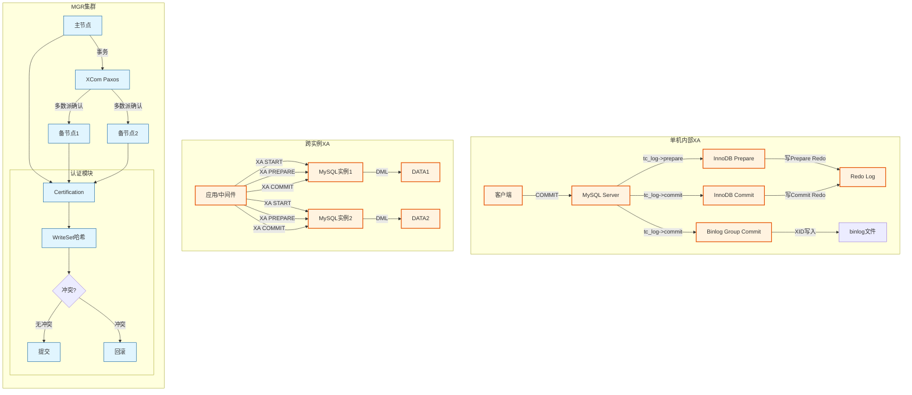
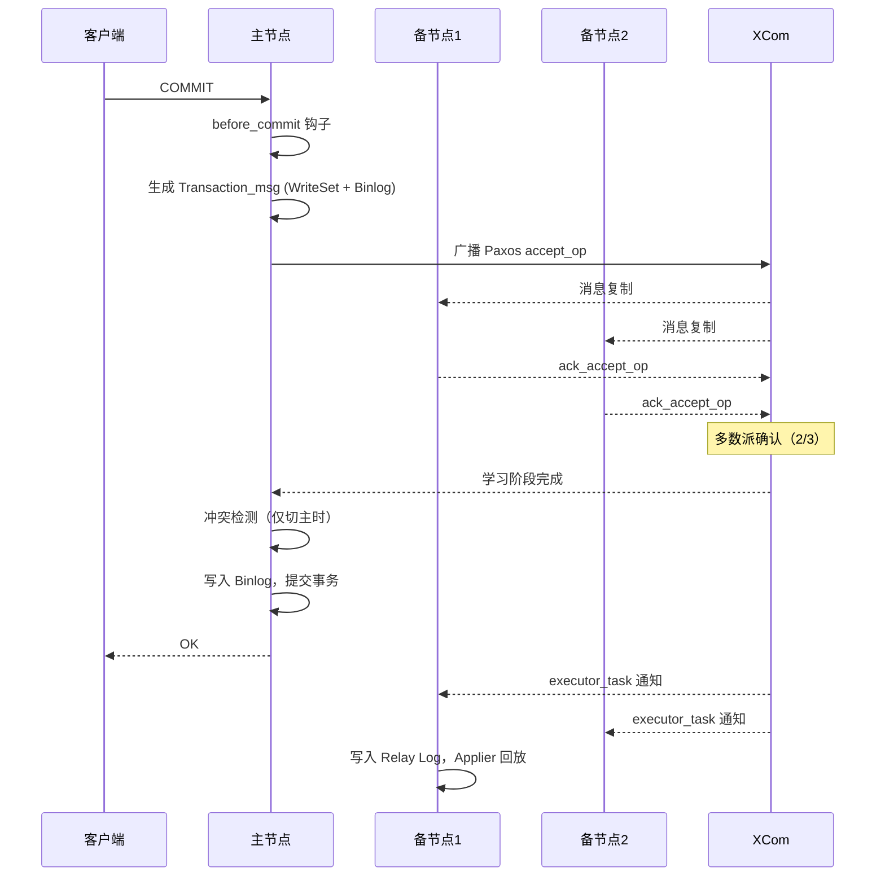
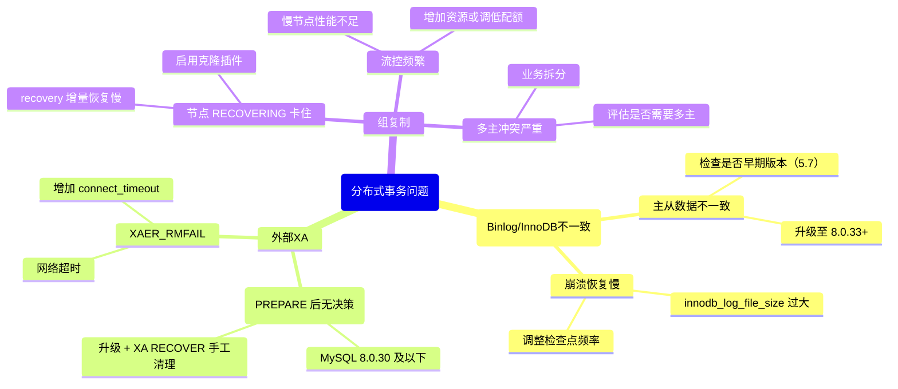

> **摘要**：  
> 单机事务靠 Redo + Undo，分布式事务靠什么？答案藏在 **XA 两阶段提交**和**共识协议**这两条截然不同的技术路径中。MySQL 同时站在两条路的起点：**内部 XA** 协调 Binlog 与 InnoDB，是每个提交事务的必经之路；**外部 XA** 允许应用作为协调者，在多个 MySQL 实例间实现分布式事务；而 **Group Replication** 则将 Paxos 共识协议引入数据库内核，使集群本身就具备强一致、自动选主、多主写入的能力。  
>  
> 本文从 XA 规范与 DTP 模型入手，系统拆解内部 XA 的源码实现（`tc_log`、`prepare_commit_mutex`、崩溃恢复 XID 比对），完整还原外部 XA 的事务分支定义与两阶段提交流程，并深入剖析其长期存在的**崩溃安全缺陷**及 8.0.33 的修复方案。在此基础上，将视角从“协调多个 MySQL”转向“MySQL 自身成为分布式系统”——详解 Group Replication 基于 Paxos 变种的事务提交流程、冲突检测原理及单主/多主模式的设计取舍。生产实践部分提供 XA 事务监控、MGR 网络分区调优及分布式事务选型决策树。最后基于 2026 年视角，讨论共识协议下沉至存储层对传统 XA 架构的替代趋势。

---

## 一、核心概念与底层图景

### 1.1 定义
**分布式事务**指事务的参与者、资源服务器、事务管理器位于不同节点，需保证跨节点的 ACID。

MySQL 涉及两种完全不同的“分布式”场景：

| 类型 | 协调者 | 参与者 | 典型场景 | 一致性保证 |
|------|--------|--------|---------|-----------|
| **内部 XA** | MySQL Server（`tc_log`） | Binlog + InnoDB（及其他事务引擎）| 单机事务，协调日志与数据引擎 | 崩溃一致 |
| **外部 XA** | 应用/中间件 | 多个 MySQL 实例 | 跨库事务，如分库分表 | 强一致（需应用协调）|
| **Group Replication** | Paxos 协议（XCom） | 集群内多个 MySQL 节点 | 高可用、强一致集群 | 强一致（多数派）|

**设计哲学**：
- **内部 XA**：解决架构分化——Server 层写 Binlog，引擎层写 Redo，两个日志必须原子提交。
- **外部 XA**：解决资源隔离——多个独立 MySQL 实例无共享状态，通过协议协调。
- **Group Replication**：解决状态复制——将单机变成分布式状态机，共识协议取代协调者。

### 1.2 架构全景



---

## 二、内部 XA：Binlog 与 InnoDB 的千年之约

### 2.1 为什么单机还需要分布式事务？

MySQL 的插件式架构导致了一个根本矛盾：
- **Server 层**负责 Binlog，它不知道存储引擎如何提交。
- **InnoDB 层**负责 Redo，它不知道 Binlog 是否落盘。

若 Binlog 写成功但 InnoDB 提交失败 → 主从不一致（从库多执行事务）。  
若 InnoDB 提交成功但 Binlog 写失败 → 主库数据完整，但从库无法同步。

**内部 XA 的使命**：将 Binlog 和 InnoDB 视为两个独立的“资源管理器”，由 Server 层作为事务协调器（TM），通过两阶段提交保证二者的原子性。

### 2.2 协调者三选一：`tc_log` 的抉择

MySQL 启动时，根据配置选择全局事务协调器对象 `tc_log` ：

```c
/* sql/tc_log.cc - TC_LOG::init */
int TC_LOG::init(THD *thd) {
    if (opt_bin_log) {
        /* 开启 Binlog 且存在事务引擎 → mysql_bin_log 协调 */
        tc_log = &mysql_bin_log;
    } else if (total_ha_2pc > 1) {
        /* 关闭 Binlog，但存在 ≥2 个事务引擎 → tc_log_mmap（内存映射）*/
        tc_log = &tc_log_mmap;
    } else {
        /* 无事务引擎或仅单引擎 → 哑协调器，直接透传 */
        tc_log = &tc_log_dummy;
    }
}
```

**三种协调器**：

| 协调器 | 存储介质 | 崩溃恢复依据 | 场景 |
|--------|--------|------------|------|
| `mysql_bin_log` | Binlog 文件 | Binlog 中的 XID | **生产默认**，推荐 |
| `tc_log_mmap` | `tc.log` 内存映射文件 | 文件中的 XID 数组 | 无 Binlog 多引擎事务（极少）|
| `tc_log_dummy` | 无 | 无 | 无事务引擎（如 MyISAM）|

### 2.3 两阶段提交源码全流程

```c
/* sql/handler.cc - ha_commit_trans */
int ha_commit_trans(THD *thd, bool all) {
    /* 1. 确定事务范围：SESSION 或 STMT */
    Transaction_ctx::enum_trx_scope scope = all ? SESSION : STMT;
    
    /* 2. 获取已注册的引擎列表 */
    Ha_trx_info *ha_info = trn_ctx->ha_trx_info(scope);
    
    /* 3. 判断是否需要 2PC：参与者数量 > 1 */
    uint rw_ha_count = ha_check_and_coalesce_trx_read_only(thd, ha_info, all);
    bool need_2pc = (!trn_ctx->no_2pc(scope) && rw_ha_count > 1);
    
    if (need_2pc) {
        /* ===== 阶段一：PREPARE ===== */
        error = tc_log->prepare(thd, all);
        /* Binlog 的 prepare 为空操作 */
        /* InnoDB prepare: 修改事务状态 TRX_STATE_PREPARED，写 XID 到 Undo Header */
    }
    
    /* ===== 阶段二：COMMIT ===== */
    error = tc_log->commit(thd, all);
    /* Binlog commit: ordered_commit() 刷盘组提交 */
    /* InnoDB commit: 释放锁、清理 ReadView、写 commit redo */
}
```

**InnoDB Prepare 核心**（`trx0trx.cc`）：

```c
void trx_prepare(trx_t *trx) {
    /* 1. 修改事务状态 */
    trx->state = TRX_STATE_PREPARED;
    
    /* 2. 将 XID 写入 Undo Log Header */
    trx_undo_set_state_at_prepare(trx);
    
    /* 3. 写 Prepare 记录的 Redo Log */
    lsn_t lsn = mlog_write_ulint(..., MLOG_UNDO_HDR_REUSE);
    
    /* 4. 刷 Redo Log（受 innodb_flush_log_at_trx_commit 控制）*/
    log_write_up_to(lsn, true);
}
```

**Binlog Commit 核心**（`sql/binlog.cc`）：

```c
int MYSQL_BIN_LOG::commit(THD *thd, bool all) {
    /* ordered_commit 三阶段：FLUSH、SYNC、COMMIT */
    if (thd->tx_commit_pending) {
        ordered_commit(thd);
    }
}
```

### 2.4 崩溃恢复：以 XID 为唯一信标

恢复逻辑 ：

```sql
-- 场景一：Redo Prepare，Binlog 未写 → 回滚
-- 场景二：Redo Prepare，Binlog 已写且包含 XID → 提交
-- 场景三：Redo Commit → 已提交
```

**核心代码**（`log0recv.cc` + `tc_log`）：

```c
/* sql/binlog.cc - check_xids_in_binlog */
bool MYSQL_BIN_LOG::check_xids_in_binlog(XID *xid_list, uint *len) {
    /* 扫描最后一个 binlog 文件，提取所有 XID_EVENT 的 XID */
}

/* 恢复时，对每个处于 PREPARE 状态的事务： */
if (tc_log->is_committed(xid)) {
    trx_commit(trx);   /* binlog 存在 → 提交 */
} else {
    trx_rollback(trx); /* binlog 不存在 → 回滚 */
}
```

**历史缺陷**（5.7 及 8.0.33 之前）：  
`XA PREPARE` 阶段**先写 binlog，再写 prepare redo**。  
若写完 binlog 后崩溃，主库回滚，从库已收到 binlog → **主从不一致**。  
**8.0.33 修复**：调整顺序，先写 prepare redo，再写 binlog。

---

## 三、外部 XA：应用协调的分布式事务

### 3.1 XA 规范与 DTP 模型

XA 规范定义了分布式事务处理（DTP）模型的三个角色 ：

| 角色 | 全称 | MySQL 中的角色 |
|------|------|---------------|
| **AP** | Application Program | 应用程序（发起事务）|
| **TM** | Transaction Manager | 应用/中间件（协调者）|
| **RM** | Resource Manager | MySQL 实例（参与者）|

**MySQL 在外部 XA 中的定位**：**资源管理器（RM）**，不是事务协调器。  
TM 由应用层实现（如 Java JTA、Go DTm、自研协调器）。

### 3.2 XA 事务语法与状态机

```sql
-- 1. 分支事务开始
XA START 'xid1';
INSERT INTO t1 VALUES (1);
XA END 'xid1';

-- 2. 准备阶段（所有分支都执行成功后，TM 发起 PREPARE）
XA PREPARE 'xid1';

-- 3. 提交阶段（若所有分支 PREPARE 成功）
XA COMMIT 'xid1' [ONE PHASE];  -- ONE PHASE 跳过 prepare，单节点优化

-- 4. 回滚阶段（任一分支 PREPARE 失败）
XA ROLLBACK 'xid1';

-- 5. 崩溃恢复：查看处于 PREPARE 状态的事务
XA RECOVER;
```

**XA 事务状态转换** ：

```
ACTIVE → IDLE → PREPARED → COMMITTED
              ↘        → ROLLBACK
```

### 3.3 外部 XA 的核心缺陷（8.0.33 前）

**缺陷一：崩溃不安全**  
MySQL 8.0.30 及之前版本，崩溃恢复时**对处于 PREPARE 状态的外部 XA 事务统一不做处理** 。  
若 TM 在 PREPARE 全部成功后、COMMIT 前崩溃，MySQL 实例重启后这些事务仍处于 PREPARE 状态，锁未释放，数据未提交——**事务悬挂**。

**缺陷二：隔离级别限制**  
官方文档明确建议：**外部 XA 事务应使用 SERIALIZABLE 隔离级别** 。  
原因：MySQL 的 MVCC 在分布式事务中无法保证全局快照一致性，RR 级别可能出现不可重复读。

**缺陷三：性能开销巨大**  
每一条 XA 事务至少增加 2 次额外 fsync（PREPARE 刷 Redo + COMMIT 刷 Binlog），且 `XA PREPARE` 会持有 `prepare_commit_mutex`（5.6 前严重，5.7+ 已优化）。

### 3.4 外部 XA 的适用场景

**✅ 仍可使用**：
- 短周期、低并发、强一致要求极高的跨库转账（如银行核心）。
- 已有成熟 JTA 中间件（Atomikos、Bitronix）的遗留系统。

**❌ 不推荐**：
- 高并发互联网业务（性能扛不住）。
- 跨多个 MySQL 实例的分库分表场景（建议使用 Seata AT 模式或 DTm 二阶段消息）。

---

## 四、Group Replication：共识协议驱动的分布式数据库

### 4.1 从“协调外部”到“自协调集群”

外部 XA 需要应用层协调多个独立 MySQL 实例，**实例之间无通信**。  
Group Replication 则是**实例之间通过 Paxos 协议直接通信**，形成一个自治的分布式状态机 。

**架构四层** ：

| 层级 | 组件 | 职责 |
|------|------|------|
| **插件层** | Group Replication Plugin | 事务钩子（`before_commit`）、冲突检测、应用线程 |
| **GCS 层** | Group Communication System | 消息广播、成员管理、视图变更 |
| **Proxy 层** | GCS XCom Proxy | 消息序列化、队列转发 |
| **Paxos 层** | XCom | 共识协议、多数派日志复制 |

### 4.2 Paxos 变种与单主/多主

**XCom 的实现特点** ：
- **Mencius 变种**：通过 `(msgno, node_no)` 唯一标识槽位，多主模式下轮询分配发送权。
- **Noop 机制**：若节点在轮次中无数据发送，广播 `noop_op` 跳过该槽位。
- **缺陷**：多主模式下，慢节点无法发送数据也无法发送 Noop，会**阻塞后续槽位**，导致集群不可用 。

**单主模式**：
- 仅激活一个 Paxos 组，备节点不发送事务数据。
- **优点**：容忍少数派故障，网络抖动影响小。
- **缺点**：备节点发送管理信息仍需向主节点申请位置，延迟较高但频率低 。

### 4.3 事务提交流程（单主模式）



**关键钩子**：`group_replication_trans_before_commit`  
位置：事务 prepare 之后、binlog 写入之前 。

### 4.4 冲突检测与认证机制

**冲突检测原理** ：

1. **WriteSet 提取**：Server 层为事务修改的每一行主键生成哈希值（库名+表名+主键值）。
2. **快照版本**：发送节点的 `gtid_executed` 集合，标识该事务开始前已提交的事务。
3. **认证数组**：每个节点维护哈希表，Key = 行哈希，Value = 最近修改该行的事务 GTID。
4. **冲突判定**：
   - 若某行哈希的最近 GTID **不在**发送节点的快照中 → **冲突**，回滚事务。
   - 否则 → **通过**，更新认证数组。

**多主模式的写写冲突**：
- 后提交的事务在备节点认证失败，**回滚**。
- 客户端收到 `ER_LOCK_DEADLOCK`，需应用层重试 。

### 4.5 流控与成员管理

**流控（Flow Control）** ：
- 目的：防止慢节点被驱逐，导致集群抖动。
- 原理：每 60 秒统计各节点的认证队列长度、应用队列长度，计算配额（quota）。
- 参数：`group_replication_flow_control_mode=QUOTA`，`group_replication_flow_control_member_quota_percent=30`。

**成员驱逐与自动重连**：
- `group_replication_member_expel_timeout`（默认 5 秒）：节点未响应心跳，标记为 UNREACHABLE。
- 超时后，多数派节点将其驱逐出集群 。
- `group_replication_autorejoin_tries`：被驱逐节点自动尝试重加入。

---

## 五、生产落地与 SRE 实战

### 5.1 场景化案例：外部 XA 悬挂事务恢复

**现象**：
- 应用报错 `ERROR 1399 (XAE03): XA transaction branch has failed`。
- `XA RECOVER` 显示多条处于 `PREPARE` 状态的事务，`data` 字段显示业务 XID。

**恢复步骤**：

```sql
-- 1. 确认事务是否可以提交（与应用协调者确认）
XA RECOVER;
-- 2. 手工提交或回滚
XA COMMIT 'xid1';
-- 或
XA ROLLBACK 'xid1';

-- 3. 若 XID 已无法追溯，且事务已阻塞业务锁
-- 8.0.33+ 支持强制回滚
XA ROLLBACK FORCE 'xid1';
```

**预防措施**：
- 升级至 MySQL 8.0.33+（修复崩溃恢复缺陷）。
- 应用层协调者需实现**事务日志**，重启后根据日志恢复 XA 决策。

### 5.2 场景化案例：MGR 网络分区导致集群只读

**环境**：
- 3 节点 MGR 集群，单主模式，跨可用区部署。
- 网络抖动导致 1 节点被驱逐，剩余 2 节点仍满足多数派，集群可写。
- 被驱逐节点恢复网络后，自动重加入，状态 `RECOVERING` 卡住。

**排查**：

```sql
SELECT * FROM performance_schema.replication_group_members;
-- member_state: RECOVERING

SELECT * FROM performance_schema.replication_group_member_stats\G
-- 查看 recovery 进度
```

**优化**：

```ini
[mysqld]
-- 1. 延长驱逐超时，避免网络毛刺误判
group_replication_member_expel_timeout = 10

-- 2. 启用克隆插件加速恢复
group_replication_recovery_use_clone = ON

-- 3. 设置超时后自动重试
group_replication_autorejoin_tries = 3
```

### 5.3 参数调优矩阵

| 领域 | 参数 | 8.0 推荐值 | 内核解释 |
|------|------|-----------|---------|
| **内部 XA** | `innodb_support_xa` | ON（默认）| 5.7 参数，8.0 移除，始终启用 |
| | `binlog_group_commit_sync_delay` | 1000（微秒）| 组提交延迟，提升内部 XA 效率 |
| **外部 XA** | `xa_detach_on_prepare` | ON（8.0.33+）| 解决 XA 悬挂问题 |
| | `innodb_rollback_on_timeout` | OFF | XA 事务超时是否回滚 |
| **MGR** | `group_replication_consistency` | `AFTER`（单主）| 强一致读/写等级 |
| | `group_replication_poll_spin_loops` | 0 | XCom 协程自旋，默认自适应 |
| | `group_replication_flow_control_mode` | QUOTA | 生产环境必开启 |
| | `group_replication_flow_control_applier_threshold` | 25000 | 应用队列积压阈值 |
| | `group_replication_transaction_size_limit` | 150000000（≈150MB）| 大事务限制，防阻塞 |

### 5.4 监控与诊断

**1. 内部 XA 状态**

```sql
-- 5.7 查看 XA 事务
SHOW ENGINE INNODB STATUS\G
-- 搜索 "TRANSACTIONS" 段，查看 ACTIVE/PREPARED 事务

-- 8.0 performance_schema
SELECT * FROM performance_schema.transaction
WHERE STATE = 'PREPARED';
```

**2. 外部 XA 监控**

```sql
-- 查看所有 PREPARE 状态事务
XA RECOVER;
```

**3. MGR 集群监控** 

```sql
-- 成员状态
SELECT member_host, member_port, member_state, member_role
FROM performance_schema.replication_group_members;

-- 事务积压与冲突
SELECT * FROM performance_schema.replication_group_member_stats\G
-- 关键字段：
--   COUNT_TRANSACTIONS_IN_QUEUE: 等待认证队列
--   COUNT_TRANSACTIONS_REMOTE_IN_APPLIER_QUEUE: 等待应用队列
--   COUNT_TRANSACTIONS_CHECKED: 已认证事务数
--   COUNT_CONFLICTS_DETECTED: 冲突事务数（多主核心指标）
```

**4. 流控观测**

```sql
SHOW STATUS LIKE 'group_replication_flow_control%';
-- group_replication_flow_control_held: 是否处于流控状态
```

### 5.5 故障排查决策树



---

## 六、技术演进与 2026 年视角

### 6.1 历史设计约束与改进

| 版本 | 分布式事务变化 | 动因 |
|------|--------------|------|
| 5.0 | 引入外部 XA | 支持分布式事务 |
| 5.5 | 内部 XA 完善，`tc_log` 协调 | 解决 Binlog/InnoDB 一致 |
| 5.7.17 | MGR GA | 引入 Paxos 共识 |
| 8.0.14 | 动态权限、部分 `SUPER` 拆分 | MGR 运维权限细化 |
| 8.0.21 | MGR 流控增强，`member_expel_timeout` | 网络分区容忍性 |
| 8.0.33 | **修复 XA 崩溃恢复缺陷** | 解决长期悬挂问题 |

### 6.2 2026 年仍存在的“遗留设计”

1. **外部 XA 性能与隔离级别的根本矛盾**  
   XA 要求 SERIALIZABLE 才能完全保证一致性，但生产环境极少使用该级别。  
   **现状**：官方未解决，应用层需接受 RR 下的极小概率不一致。

2. **MGR 多主模式的“Noop 阻塞”缺陷**  
   慢节点既不能发数据，也不能发 Noop → 后续槽位阻塞 → 集群不可用 。  
   **现状**：官方推荐单主模式，多主仅适用于特定场景。

3. **MGR 大事务限制**  
   `group_replication_transaction_size_limit` 默认 150MB，超过即报错。  
   **原因**：XCom 消息过大导致网络缓冲溢出、节点超时。  
   **现状**：无解，需业务拆分大事务。

4. **内部 XA 的 2PC 无法绕过**  
   即使只有一个事务引擎 + Binlog，仍要走完整两阶段提交。  
   **代价**：每次提交至少两次 fsync（Redo prepare + Binlog commit）。  
   **现状**：8.0 组提交优化后大幅改善，但无法消除。

### 6.3 未来趋势：共识协议下沉存储层

**云原生数据库的答案**：
- **AWS Aurora / 阿里云 PolarDB**：共享存储，计算节点无状态。**跨节点事务无需 2PC**，存储层多版本解决一致性问题。
- **TiDB / CockroachDB**：原生分布式，Raft 共识协议，**XA 被彻底抛弃**。

**MySQL 社区版的未来**：
- **MGR + MySQL Router**：官方主推的高可用方案，但对业务透明的一致读需 `group_replication_consistency=BEFORE`，性能代价较高。
- **外部 XA 将边缘化**：除非强一致跨库事务成为刚需且无替代方案，否则**不推荐新项目使用**。

**2026 年现实**：
> 内部 XA 仍是 MySQL 单机事务的基石，无法绕过。  
> 外部 XA 已进入“维护模式”，仅修复严重 bug，无新特性开发。  
> MGR 单主模式成为高可用事实标准，多主模式作为“特例”存在。

---

## 七、结语：分布式事务，没有银弹

MySQL 同时站在分布式事务的三条岔路口：

- **内部 XA**——你每天都在用，却从未感知。它是 Binlog 与 InnoDB 之间的“婚姻契约”，每一次 `COMMIT` 都在执行轻量级的分布式协调。
- **外部 XA**——最正统的分布式事务，但也是最笨重的那一个。它为强一致而设计，却被性能与复杂性反噬。
- **Group Replication**——不是事务协调，而是状态机复制。它让 MySQL 从“单机”进化为“集群”，但也暴露了 Paxos 工程实现的诸多妥协。

**2026 年的选择**：
- 单机事务：信任内部 XA，它足够成熟。
- 跨库事务：**优先考虑业务拆分**，而非 XA。
- 集群事务：用 MGR 单主模式，接受**最终一致读**或**付费强一致读**。

> **分布式系统的第一课就是：没有免费的强一致。**

---

## 参考文献
- `sql/handler.cc`, `sql/binlog.cc`, `storage/innobase/trx/trx0trx.cc` MySQL 8.0.33 源码
- `plugin/group_replication/src/` MGR 源码
- MySQL Internals Manual – XA Transactions, Group Replication
- Oracle Blogs: “MySQL 8.0.33: XA Transaction Crash Recovery Fix” (2023)
- Oracle Blogs: “Group Replication: Single-Primary vs Multi-Primary” (2019)
-  阿里云 RDS 组复制文档
-  网易 MGR 源码分析
-  百度 MGR 深度解析
-  华为云 MySQL 8.0 事务提交原理
-  MySQL 8 中文参考（组复制架构）
-  MySQL Group Replication（MGR）事务执行过程
-  MySQL 集群事务处理
-  MySQL XA 事务使用及缺陷