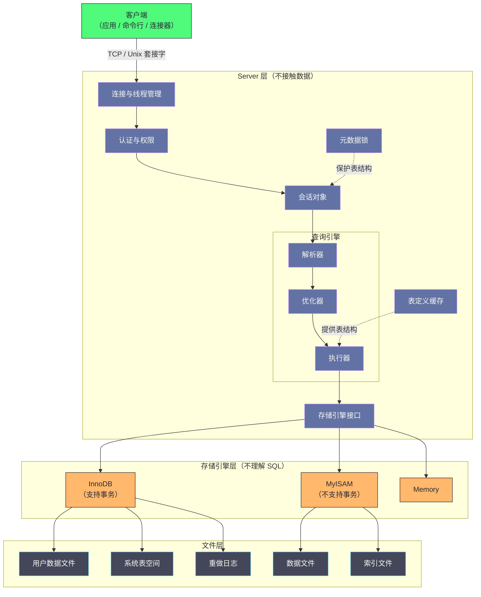
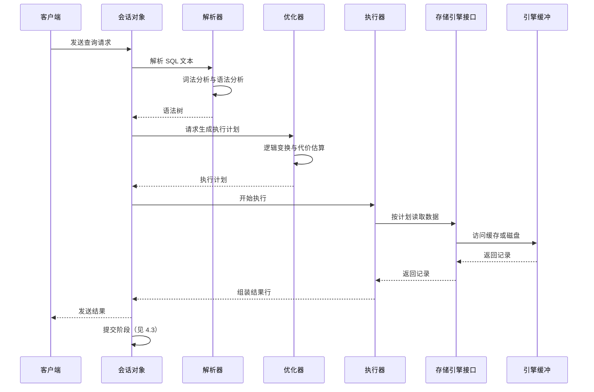

# 01. MySQL总体架构：Server层与存储引擎的插件化设计

**摘要：**

MySQL 能同时支持事务型的 InnoDB、非事务型的 MyISAM、内存型的 Memory 等十余种存储引擎，并在同一套 SQL 接口下无缝切换，靠的不是"把多种引擎堆在一起"，而是**一条清晰的架构分界线**：把"理解 SQL"与"读写数据"彻底拆成两层。Server 层负责连接管理、解析、优化与执行计划，**它不直接接触数据**；存储引擎层通过实现一组标准接口提供物理读写能力，**它不理解 SQL**。两层通过插件式接口耦合，因此引擎可以动态加载与替换，而 Server 层代码无需改动。本文按"为什么这样分 → 分成什么样 → 接口怎么定 → 一次请求怎么走 → 生产上会出什么问题"展开。先说明这条分界线解决了什么、又付出了什么代价；再逐层拆解连接管理、会话与权限、解析优化、执行器、表定义缓存、元数据锁六个子模块；然后剖析三个核心数据结构（会话描述符、表定义缓存对象、引擎注册表）以及它们之间的引用关系；接着走完一条查询的完整生命周期，重点讲提交阶段的"内部两阶段提交"如何协调二进制日志与引擎事务。之后是连接风暴这类生产问题的成因与参数依据、架构演进史与三处遗留设计，最后是边界、反例与常见误判。

---

## 第 1 章 两层解耦：一个决定性的架构选择

### 1.1 问题的起点

要理解 MySQL 的架构，最好从一个具体的问题开始：**如果数据库要同时支持"支持事务的引擎"和"不支持事务的引擎"，代码应该怎么组织？**

最直接的想法是"为每种引擎写一套完整实现"——但这意味着连接管理、SQL 解析、权限校验、结果集输出这些**与引擎无关的逻辑**要被复制多份。而这些逻辑恰恰是整个系统里最复杂、最容易出问题的部分（SQL 语法的复杂度远高于"读写一个页"）。

另一种想法是"在 SQL 层里用条件分支判断引擎"——但这会让每新增一种引擎都要修改核心代码，**扩展成本随引擎数量线性增长，且核心代码会越来越难以维护**。

MySQL 选择的是第三条路：**画一条明确的分界线，把"与引擎无关"和"与引擎有关"彻底分开。**

### 1.2 分界线画在哪里

这条分界线是这样划的：

**Server 层**负责所有"与存储无关"的事——监听连接、认证与授权、词法语法分析、查询优化与执行计划生成、结果集组装与返回。**它的一个关键性质是"不直接接触数据"**：它从不知道数据存在哪个文件、以什么格式存放。

**存储引擎层**负责所有"与数据物理存放有关"的事——表扫描、索引查找、记录的插入更新删除、页的读写与缓存、事务与锁。**它的一个关键性质是"不理解 SQL"**：它接收的是"打开这张表""按这个索引读下一条记录"这类指令，而不是 `SELECT ... WHERE ...`。

两层之间的唯一通道是一个**标准接口**（一组约定好的虚函数）。Server 层通过这个接口调用引擎，引擎通过实现这个接口提供服务。

### 1.3 不这样会怎样

这条分界线如果不存在，会带来三类后果。

**后果一：新增引擎的成本无法收敛。** 如果引擎逻辑与 SQL 逻辑交织，那么每新增一种引擎都要在核心路径上做改动。**而核心路径的每次改动都会影响所有已支持的引擎**——这使得"支持新引擎"变成一件高风险的事。

**后果二：SQL 层的能力无法独立演进。** 查询优化器、执行器、权限系统这些能力与引擎无关，**它们本应能独立改进**。但如果与引擎逻辑耦合，任何改进都要考虑"对每种引擎是否都成立"，**演进速度会被最弱的那个引擎拖住**。

**后果三：不同引擎无法"按需选用"。** 如果架构上不区分"SQL 处理"与"数据存放"，那么"同一张表用不同引擎"这件事就无从谈起——**因为引擎的差异会渗透到 SQL 层，形成两套行为**。

**MySQL 的架构选择恰恰是为了避免这三类后果**：分界线让新增引擎只需实现接口（成本收敛）、让 SQL 层可以独立演进（不被拖累）、让引擎可以按表选择（差异被限制在接口之后）。**三条收益里，第三条最容易被低估**——因为"同一实例内不同表用不同引擎"在今天的生产环境里已不常见，**但正是这条能力的存在，让"从 MyISAM 迁移到 InnoDB"成为一件可以逐表进行的事。**

### 1.4 解耦的代价

但解耦不是没有代价的，代价主要在三处。

**代价一：接口必须"足够通用"。** 因为接口要同时服务"支持事务"与"不支持事务"的引擎，**所以它必须为能力差异留出表达方式**（例如用能力标志声明"本引擎是否支持事务"）。**而通用接口意味着"某些引擎用不到的方法也必须在接口里存在"**——这带来了一定的"接口冗余"。

**代价二：跨层的语义无法完全下推。** 有些优化需要"引擎才知道的信息"（例如"数据是否已在内存中"），**而 Server 层的优化器只能基于通用信息做决策**——这就产生了"优化器代价模型偏静态"这个长期问题（第 10 章展开）。

**代价三：一致性维护的责任被拆开。** 当"元数据"由 Server 层管理、"数据"由引擎管理时，**两者的一致性就需要额外机制保证**——这正是"原子 DDL"要解决的问题（第 9 章与第 3 篇展开）。

**三处代价的共同特征是"它们都是'通用性'的对价"**——**分界线换来的是扩展性与可演进性，付出的是"接口必须通用"与"信息无法完全共享"。** 理解这个交换，就能理解后续很多设计（比如"能力标志""内部两阶段提交"）为什么长成那样。

> [!info] 核心概念
> "Server 层不接触数据、引擎层不理解 SQL"这两句话，是理解 MySQL 全部后续机制的基础。**当你在源码里看到一个函数不知道自己在操作什么引擎时，它多半在 Server 层；当看到一个函数不知道自己在执行什么 SQL 时，它多半在引擎层。** 这条判据在阅读源码时非常有用。

---

## 第 2 章 架构全景

### 2.1 四个层次

把整个系统自上而下看，可以分成四个层次。

**第一层是客户端**：应用、命令行工具或连接器。它通过 TCP 或 Unix 域套接字与服务端通信。

**第二层是 Server 层**：连接与线程管理、认证与权限、会话对象、查询引擎（解析器、优化器、执行器）、表定义缓存、元数据锁。**它承载全部"与存储无关"的逻辑。**

**第三层是存储引擎层**：InnoDB、MyISAM、Memory 等，各自实现标准接口。

**第四层是文件层**：InnoDB 的用户数据文件、系统表空间、重做日志；MyISAM 的数据文件与索引文件。

### 2.2 全景图示

**这张图最值得注意的是"两条虚线"**：表定义缓存向执行器"提供表结构"、元数据锁向会话"保护表结构"。**它们是 Server 层内部的两处关键协作**——**一处解决"表结构从哪来"（性能问题），一处解决"表结构在并发下如何安全"（正确性问题）。** 第 3 章会分别展开。

### 2.3 两条独立的命名空间

还有一个容易被忽略的结构特征：**系统里存在两套独立的"表标识"。**

**Server 层的表标识是"库名加表名"**——它是用户可见的、逻辑的名字，用于 SQL 语句与权限判断。

**引擎层的表标识是"表空间标识"**（InnoDB 里是表空间 ID 与数据字典中的表 ID）——它是内部的、物理的名字，用于定位数据文件与页。

**两套标识通过"表定义缓存对象"关联**（第 5 章展开）。**这个关联的存在解释了一件事**：当表被重命名或移动时，**"逻辑名字"变了但"物理标识"可以不变**（反之亦然）——**这正是"原子 DDL"能把"改元数据"与"改数据"分开处理的基础。**

---

## 第 3 章 Server 层的六个子模块

### 3.1 连接管理

连接管理的职责是：**监听端口、接受连接、认证、分配执行线程、并在连接结束后回收线程资源。**

它的一个关键设计是**"与查询执行分离"**——连接管理只负责"建立与维护会话"，不参与"如何处理这条 SQL"。**这个分离让"线程模型"成为可替换的部分**（例如换成线程池插件），而不影响查询引擎。

**线程模型的历史选择是"一个连接一个线程"**——这在低并发时简单高效，**但在"短连接风暴"场景下会成为瓶颈**（第 8 章展开）。而"线程池"作为一个可替换的线程模型，正是靠这个分离才得以实现。

### 3.2 会话与权限

每个连接对应一个**会话对象**，它存储"这次会话的上下文"：当前数据库、当前用户、事务状态、会话变量、内存池、以及语句执行过程中的中间状态。

**为什么需要独立的会话对象，而不是用全局变量？** 因为**并发会话之间必须隔离**——两个连接可能同时在执行不同的 SQL、使用不同的数据库、处于不同的事务状态。**用全局变量表达这些状态会导致会话之间互相干扰。**

**权限校验也在这一层完成**：连接建立时校验身份，执行语句时校验"当前用户是否有权访问这张表"。**权限信息的缓存（ACL 缓存）是这一层的一处性能关键点**（第 17、18 篇展开）。

### 3.3 解析与优化

**解析器**把 SQL 文本转换成语法树（词法分析识别记号，语法分析检查结构）。**优化器**基于代价选择执行计划：决定用哪个索引、以什么顺序连接多张表、是否使用临时表或排序。

**这两个模块的一个关键性质是"无状态"**——它们只依赖"SQL 文本 + 元数据统计信息"，**不依赖"上一条 SQL 执行过什么"。** 这个性质让它们易于测试，也让"同一 SQL 得到同一计划"成为可预期的行为（在没有统计信息变化的前提下）。

**但"无状态"也带来一个限制**：优化器不知道"数据是否在内存里"（第 1.4 节讲的代价二）。**这个限制不是实现缺陷，而是"分层"的必然结果**——因为"数据在不在内存"属于引擎层的信息，Server 层看不到。

### 3.4 执行器：火山模型

**执行器**按执行计划逐步取数据，并组装结果集。它采用**火山模型**（也叫迭代器模型）：每个算子实现"取下一行"这个接口，上层算子通过反复调用下层算子来获取数据。

**火山模型的核心价值是"统一的接口屏蔽引擎差异"**：无论数据来自 InnoDB 的索引扫描、MyISAM 的全表扫描，还是内存表的直接读取，**执行器看到的都是"按这个条件取下一行"。**

**它的代价是"逐行的函数调用开销"**——每一行数据都要经过多层算子的接口调用。**这也是后续版本引入"向量化"优化的原因**（第 3 篇与 MySQL 架构专栏展开）。

### 3.5 表定义缓存

**表定义缓存**存放"表的结构信息"：列定义、索引定义、字符集、行格式、以及引擎相关的私有信息。

**为什么需要缓存？** 因为表结构信息的获取成本不低——在 5.7 里要从 `.frm` 文件解析，在 8.0 里要从数据字典查询。**而"打开一张表"是极其频繁的操作**（每条 SQL 都要打开它涉及的表），**因此必须缓存。**

**缓存的关键机制是"引用计数 + 淘汰"**：一个表定义对象被多个会话引用时，引用计数增加；引用归零后它可以被淘汰（当缓存空间不足时）。**因此"缓存命中率"取决于"缓存容量是否足以容纳活跃的表"。**

**这里有一处历史遗留的性能问题**：引用计数的维护需要加锁，**而在"上万张表的实例"上，频繁打开关闭表会造成锁竞争**（第 10 章展开）。

### 3.6 元数据锁

**元数据锁**保护"表结构"与"表数据"在并发下的安全。

**它解决的核心问题是**：如果一个会话正在读某张表，而另一个会话要修改这张表的结构（例如加一列），**那么两者的并发会导致什么？** 答案可能是"读到一半结构变了"——**这是不可接受的。** 元数据锁通过"读操作加共享锁、结构变更加排他锁"来避免这种情况。

**元数据锁有一个重要的设计特征：它在 Server 层实现，独立于存储引擎。** 这个选择的原因是**"表结构"是 Server 层的概念**（引擎只看到物理标识），**因此保护它的锁也应当由 Server 层提供。** 这也解释了为什么"元数据锁等待"是一类独立于"行锁等待"的故障（第 8 章与 MySQL 进阶使用专栏展开）。

### 3.7 六个子模块的协作关系

把六个子模块放在一起，可以看出它们构成一条"从外到内"的链条。

**连接管理是入口**——它决定"谁来处理这个会话"。

**会话与权限是上下文**——它提供"这个会话是谁、有什么权限、处于什么事务状态"。

**解析与优化是决策**——它回答"这条 SQL 应该怎么执行"。

**执行器是驱动**——它按决策去取数据。

**表定义缓存是素材**——它为决策与执行提供"表长什么样"。

**元数据锁是护栏**——它保证"在执行期间表结构不会变"。

**六者的依赖方向是单向的**：连接管理不依赖其他五者（它只负责建立会话），而执行器依赖前面所有。**因此"哪一环出问题"可以从"故障发生在会话的哪个阶段"来定位**——**这与第 8.1 节讲的"连接风暴的故障发生在'连接与准备'阶段"是同一条判断。**

**这条链条还有一个值得注意的性质：只有前两环是"每个连接都要走"的，后四环是"每条 SQL 都要走"的。** **因此"连接数很多但 SQL 很少"的场景，瓶颈会集中在前两环；"SQL 很密集"的场景，瓶颈会集中在后四环。** **这个区分对定位问题很有用**——它把"高负载"进一步分成了两类。

---

## 第 4 章 一条查询的完整生命周期

### 4.1 时序图示

### 4.2 各阶段的关键动作

**连接阶段**：认证身份、初始化会话上下文、校验"当前用户能否连接"。

**解析阶段**：词法与语法分析，生成语法树。**这一步失败会直接返回语法错误**，不会进入优化。

**优化阶段**：基于代价选择执行计划。**这一步是"不确定"的**——同一 SQL 在不同统计信息下可能得到不同计划，**而"计划变了"是"查询突然变慢"的常见原因之一**。

**执行阶段**：按计划读取数据、应用过滤条件、组装结果。**这一步是"逐行"的**（火山模型），因此"扫描行数"直接决定耗时。

**提交阶段**：如果是写操作且处于自动提交状态，则触发提交（下一节展开）。

### 4.3 提交阶段：内部两阶段提交

提交阶段是整条链路里最容易被忽略、但设计最精巧的部分。

**它要解决的问题是**：一次写操作可能同时涉及**两个需要持久化的东西**——引擎的改动（在 InnoDB 里是数据页与重做日志）与二进制日志（用于主从复制与恢复）。**两者必须"要么都生效、要么都不生效"**——否则会出现"引擎里有但二进制日志没有"（从库丢失）或"二进制日志有但引擎没有"（主库不一致）。

**解法是"内部两阶段提交"**：先让引擎进入"准备"状态（把改动记为已准备但未提交），再写二进制日志，最后让引擎提交。**中间的"写二进制日志"是分界线**——它成功则事务必然提交，失败则事务必然回滚。

**这个顺序的意义在于"以二进制日志为提交点"**：因为二进制日志是复制与恢复的权威来源，**把它放在中间，就保证了"日志里有的事务一定已提交"。**

**如果启用了二进制日志，提交还会经过"组提交"**：把多个事务的日志刷写与同步合并成一次（减少磁盘同步次数），**这是高并发写入下最重要的优化之一。**

**这三段（准备、写日志、提交）的顺序不能随意调整**——**调整会导致"日志与数据不一致"，而这类不一致在崩溃恢复时会直接导致数据错误**（第 15 篇展开崩溃恢复的完整过程）。

---

## 第 5 章 三个核心数据结构

### 5.1 会话描述符

**会话描述符**是"一次会话的全部状态"的载体。它的字段可以归为六类。

**第一类是网络与标识**：协议适配器（文本协议或二进制协议）、网络缓冲区、线程标识、复制用的服务端标识。**它回答"这个会话是谁、从哪里来"。**

**第二类是内存管理**：会话级内存池（事务结束时整体重置）、语句级内存区（语句结束时整体释放）。**它解决"会话过程中的临时内存如何管理"**——用"整体释放"替代"逐块释放"，避免内存碎片与泄漏。

**第三类是解析与执行状态**：语法树指针、原始 SQL 文本与长度。**它让"执行过程中需要回看 SQL 文本"成为可能**（例如生成错误信息时）。

**第四类是事务与锁**：事务上下文（抽象接口，实际由引擎实现）、元数据锁上下文。**它把"会话"与"事务/锁"关联起来。**

**第五类是诊断信息**：错误码、警告、影响行数。**它是"客户端能看到的执行结果"的来源。**

**第六类是并发保护**：保护网络缓冲、SQL 文本、用户变量等字段的互斥锁。

**六类字段的共同特征是"它们都是会话级而非全局的"**——**这正是第 3.2 节讲的"会话隔离"在数据结构上的体现。**

### 5.2 表定义缓存对象

**表定义缓存对象**存放"表结构"的共享信息，它同样可以归为几类。

**元数据基本信息**：库名、表名、物理路径、以及一个**表定义版本号**。**版本号是"缓存一致性"的关键**——当表结构变更时版本号变化，从而让持有旧版本的对象被识别并失效。

**列与索引定义**：列描述数组与索引定义数组，以及它们的数量。

**引擎相关信息**：引擎类型指针、以及引擎私有的共享数据指针（在 InnoDB 里指向它的表对象）。**这个指针是"两层关联"的具体形式**（第 2.3 节讲的两套命名空间的桥梁）。

**字符集与行格式**：表的字符集、行格式类型。

**引用计数与并发保护**：当前引用该对象的数量、保护计数与刷新状态的锁。

**淘汰链表节点**：用于 LRU 淘汰的指针与最近访问时间。

**这里最值得注意的是"引用计数"与"版本号"的配合**：**版本号解决"结构变了怎么办"，引用计数解决"还有人用着能不能删"。** 两者缺一不可——**只有版本号会导致"正在被引用的对象被释放"，只有引用计数会导致"结构变了但旧对象仍被使用"。**

### 5.3 引擎注册表

**引擎注册表**是"一个引擎的能力与生命周期"的描述，它的字段可以归为五类。

**标识与能力**：引擎名、槽位编号、以及**能力标志**（是否支持事务、是否支持外键、是否支持崩溃恢复等）。**能力标志是"通用接口如何表达差异"的答案**（第 1.4 节讲的代价一）。

**生命周期回调**：初始化与关闭。

**事务接口**：准备、提交、回滚。**这三个函数正是"内部两阶段提交"的调用点**（第 4.3 节）。

**表操作接口**：创建引擎侧的处理器实例、删除库、重命名表。

**统计信息接口**：更新表统计、更新索引统计。

**注册表的存在意味着"引擎是'被注册'的，而不是'被硬编码'的"**——**这正是"插件化"的字面含义**：引擎在启动时注册自己（填写这张表），Server 层通过遍历注册表来发现可用引擎。**因此"新增引擎不需要改 Server 层代码"这句话，在实现上就是"注册表多了一项"。**

### 5.4 三者的引用关系

把三个结构串起来看，它们的引用关系是：

**会话对象 → 表定义缓存对象**（会话打开表时获取引用，引用计数加一）。

**表定义缓存对象 → 引擎注册表**（通过引擎类型指针找到引擎）。

**表定义缓存对象 → 引擎私有数据**（通过私有指针关联到引擎侧的表对象）。

**这条链条解释了"打开一张表的成本"**：会话需要找到或创建表定义缓存对象（可能涉及淘汰与锁），而表定义缓存对象需要与引擎侧建立关联。**因此"缓存命中"与"缓存未命中"的成本差异很大**——**这正是第 8 章讲的"连接风暴"问题的核心。**

### 5.5 三个结构的生命周期

最后说明三个结构的生命周期差异，因为它们决定了"什么会被缓存、什么会频繁创建"。

**会话描述符的生命周期等于连接的生命周期**——连接建立时创建，断开时销毁。**因此"短连接"意味着"会话对象频繁创建与销毁"**，而它的构造涉及内存池初始化、锁初始化等操作。

**表定义缓存对象的生命周期跨越会话**——它被缓存在全局，被多个会话共享引用。**因此它的"创建"是低频的（只在首次打开表或缓存未命中时），而"引用"是高频的。**

**引擎注册表的生命周期等于进程的生命周期**——引擎在启动时注册，之后不再变化。**因此它是"只读的"**，访问它不需要加锁。

**三者生命周期的差异解释了一件事：为什么"短连接风暴"的危害集中在会话层。** 因为只有会话对象的生命周期与连接绑定，**其余两者都是被复用的。** **这也提示了一个优化方向**——**把连接管理外移（用连接池），本质上是"把会话对象的创建频率降下来"。**

---

## 第 6 章 引擎接口的设计

### 6.1 接口的规模与分类

引擎接口的规模不小（数十个虚函数），但它们可以按用途分类。

**第一类是"打开与关闭"**：打开表、关闭表、以及表的生命周期管理。

**第二类是"扫描与定位"**：全表扫描的第一条与下一条、按索引定位、按索引读取下一条、以及"读取当前记录"。

**第三类是"写入"**：插入、更新、删除。

**第四类是"事务"**：开始、提交、回滚、以及保存点相关操作。

**第五类是"元数据与统计"**：读取表的统计信息、估算扫描行数（**这一项直接供优化器使用**）。

**第六类是"特殊能力"**：例如全文索引、空间索引、以及引擎特有的优化接口。

**六类接口里，第五类与优化器的关系最密切**：**优化器要"估算用某个索引扫描大约多少行"，而这个估算来自引擎。** 因此"统计信息是否准确"直接决定"计划是否合理"——**这是"引擎与 Server 层协作"最具体的一处。**

### 6.2 能力标志的作用

能力标志解决的是"通用接口如何表达差异"这个问题。

**它的用法是"声明式"的**：引擎在注册时声明"我支持事务""我支持外键""我支持崩溃恢复"。**Server 层在执行某些操作前先检查标志**——例如"只有支持事务的引擎才能参与两阶段提交"。

**这个设计的价值在于"把差异从'行为判断'变成了'能力查询'"**：如果不用标志，那么 Server 层就需要"试着调用某个接口，看它是否返回错误"来判断能力——**而这既低效又不可靠。** 用标志声明，**判断成本降为一次位运算。**

**这条设计经验有普遍意义**：**当一组实现共享接口但能力不同时，用"显式声明的能力标志"比"隐式探测行为"更好。** 这与 Kafka 里"用显式编号替代时序推断"（Kafka 第 6 篇）是同一类思路——**用声明替代推断。**

### 6.3 接口设计的取舍

引擎接口的设计有两处取舍值得说明。

**取舍一：接口粒度。** 如果接口太粗（例如"执行这个查询"），那么引擎就要理解 SQL；如果太细（例如"读这个字节"），那么 Server 层就要理解页结构。**MySQL 选择的粒度是"行"**——**这个粒度让引擎不必理解 SQL，也让 Server 层不必理解页。**

**取舍二：是否暴露引擎特性。** 有些引擎有独特能力（例如 InnoDB 的自适应哈希索引、MyISAM 的全文索引）。**接口选择"为这些能力留出扩展点"**（而不是"强行统一"）——**代价是 Server 层需要知道"某些能力只有部分引擎有"，收益是引擎不必削足适履。**

**两处取舍的共同特征是"它们都在'通用'与'能力'之间取平衡"**——**而这个平衡点的选择，决定了整个生态的形态。**

### 6.4 接口之外的协作

引擎与 Server 层的协作并不只在接口调用上，还有三处"隐式协作"值得说明。

**其一是统计信息的上报**：引擎维护表的统计信息（行数、索引基数、数据分布），**而优化器依赖它做代价估算。** **因此"统计信息是否及时更新"直接决定计划质量**——**这是"接口之外"的协作，因为它不通过接口调用，而是通过统计信息的更新机制。**

**其二是崩溃恢复的协作**：崩溃恢复涉及"引擎重做日志"与"二进制日志"的比对，**而两者分别由引擎与 Server 层管理。** 因此恢复流程是一段跨层的协作逻辑。

**其三是元数据一致性的协作**：表结构变更需要同时改"Server 层的表定义"与"引擎侧的表对象"，**而两者的原子性需要额外机制保证**（第 3、16 篇展开）。

**三处隐式协作的共同特征是"它们都不在接口里，却决定了系统的正确性"**——**这提示了一条阅读源码的经验：只读接口定义，无法理解两层的真实关系；必须读"跨层的流程"（提交、恢复、DDL）。**

---

## 第 7 章 提交路径：内部两阶段提交

### 7.1 为什么需要它

第 4.3 节已说明它要解决的问题，这里补充"为什么不能简单处理"。

**一个自然的想法是"先写引擎、再写二进制日志"**：如果第二步失败，那么引擎里已经有了数据而日志里没有——**从库会缺少这个事务，造成主从不一致。**

**反过来"先写日志、再写引擎"**：如果第二步失败，那么日志里有而引擎里没有——**从库会多出一个事务，同样不一致**（而且崩溃恢复时会"重放"这个事务，但主库却没有）。

**因此无论哪个顺序，都存在"两者不一致"的窗口。** 唯一可靠的解法是**引入一个"中间状态"**，使得"不一致的窗口"变成"可以判断并修复的状态"——这就是两阶段提交。

### 7.2 两阶段的具体过程

**第一阶段（准备）**：引擎把改动的重做日志写入并标记为"已准备"，但**不认为事务已提交**。此时如果崩溃，恢复过程会发现"已准备但未提交"的事务——**它可以选择回滚（因为没有提交点）。**

**第二阶段（提交）**：二进制日志写入成功后，引擎把事务标记为"已提交"（清除准备状态）。

**关键在于"二进制日志的写入位于两者之间"**：**它一旦成功，就代表"事务必然提交"**——因此恢复过程看到"日志里有这个事务"时，就可以放心地把引擎侧的改动也提交。

**这个设计让"不一致"变成了可判断的**：恢复时只需比对"引擎的准备状态"与"日志的记录"——**两者都有则提交，只有一方则回滚。**

### 7.3 与组提交的关系

启用二进制日志后，提交还会经过**组提交**：把多个事务的"刷日志"与"同步磁盘"合并成一次操作。

**组提交解决的性能问题是**：每次"同步磁盘"都需要一次落盘（这是昂贵的），**如果每个事务都同步一次，那么写入吞吐会被落盘次数限制。** 组提交让"多个事务共用一次落盘"，**从而把吞吐提升到"落盘次数"而非"事务数"决定。**

**组提交的代价是"延迟"**：事务需要等待"组"形成（等一小段时间收集其他事务）。**这与本专栏其他篇讲的"批量化"是同一个取舍**——**用等待换取批量效率。**

**组提交与两阶段提交的关系是"嵌套"**：两阶段提交决定了"顺序"，组提交决定了"如何批量执行其中一步"。**理解这个嵌套关系，就能理解为什么"提交路径"是 MySQL 里最复杂的一段代码。**

---

## 第 8 章 生产落地

### 8.1 连接风暴：一个典型的架构相关故障

**现象**：业务高峰期出现大量处于"登录"或"选择数据库"状态的连接，系统态 CPU 占比显著升高，同时出现"排序"类查询堆积。

**为什么这是一个"架构相关"的故障**？因为它的成因分布在第 3 章讲的多个子模块上：

**成因一：线程创建与销毁的开销。** 短连接风暴意味着频繁的线程创建与销毁——**这消耗系统态 CPU，且线程缓存命中率低。**

**成因二：认证阶段的锁竞争。** 认证需要读取权限表，**在 5.7 里权限表是 MyISAM（表锁），在 8.0 里是 InnoDB 但仍有元数据锁**——高并发认证会造成锁竞争。

**成因三：表定义缓存未命中。** 如果缓存容量不足，新连接打开表需要重新解析元数据——**这会显著增加"连接建立到开始执行"的耗时。**

**三个成因的共同特征是"它们都在'连接与准备'阶段，而不是在'执行'阶段"**——**因此这类故障的表现是"连接堆积"而不是"查询变慢"。** **识别这个特征很重要**：它决定了排查方向（查连接相关参数，而不是查 SQL）。

**验证手段**是观察"表定义缓存"的打开次数是否持续增长（说明未命中），以及权限相关的状态指标。**优化方向是增大表定义缓存与线程缓存、调整连接队列长度。**

### 8.2 参数矩阵与它的内核依据

几处关键参数的作用与内核依据如下。

| 参数 | 内核依据 | 调整方向 |
|---|---|---|
| 表打开缓存 | 每个连接打开的表实例缓存，超过实例分区数会增加淘汰扫描开销 | 与并发连接数匹配，过大反而有害 |
| 表定义缓存 | 表结构对象的缓存容量（5.7 管文件解析结果，8.0 管结构对象） | 与"活跃表数量"匹配 |
| 表缓存实例数 | 把表缓存分区以减少全局锁竞争 | 并发高时调大 |
| 线程缓存 | 空闲线程对象的复用池 | 短连接场景收益明显 |
| 连接队列长度 | TCP 监听队列，突增连接时防止被拒 | 与连接突增幅度匹配 |
| 语句执行超时 | 杀死执行过久的查询，防止资源被长期占用 | 按业务容忍度设定 |

**这张表最值得注意的是"每一行都对应一个内核机制"**——**而不是"经验值"。** 例如"表定义缓存"的调整依据是"活跃表数量"，**而"活跃表数量"这个量可以从缓存命中指标反推出来。** **因此"该调多大"这个问题是可以被回答的，而不是只能靠试。**

### 8.3 高负载排查的决策树

把"高负载"按资源维度分类，可以形成一条排查路径。

**CPU 高时先分"用户态"与"系统态"**：用户态高通常是"慢查询"（未命中索引、扫描量大）；**系统态高通常是"锁竞争"或"上下文切换频繁"**——而后者往往指向连接风暴或线程模型问题。

**IO 高时先分"读"与"写"**：读高通常是"缓存命中率低"或"全表扫描"；**写高通常是"刷脏过快"或"双写开销"**（第 8 篇展开双写）。

**内存高时先分"引擎缓冲"与"会话内存"**：引擎缓冲使用率高是正常的（命中率是更好的判据）；**会话内存增长通常意味着"大事务未释放内存池"或"会话对象碎片"。**

**这条决策树的价值在于"每一步都在把问题缩小一个范围"**——**而它的分支依据来自"这个资源被谁消耗"，而"谁"这个问题的答案来自架构分层**（第 2 章）。**因此决策树的形状，本质上是架构形状的投影。**

### 8.4 观测手段：从"猜"到"看"

架构分层的另一个价值是**它提供了清晰的观测维度**。

**连接维度的观测**：当前连接数、各状态的连接分布（执行中、等待中、空闲）、以及连接建立与销毁的速率。**它回答"会话层的压力有多大"。**

**表维度的观测**：表定义缓存的使用情况、打开表的次数、以及元数据锁的等待情况。**它回答"表结构的获取是否顺畅"。**

**语句维度的观测**：各类语句的执行次数与耗时分布、扫描行数与返回行数的比例。**它回答"SQL 本身是否高效"。**

**事务维度的观测**：活动事务数、事务持续时长、锁等待与死锁次数。**它回答"并发控制是否有冲突"。**

**四个维度的划分与第 3 章的六个子模块对应**：连接维度对应连接管理，表维度对应表定义缓存与元数据锁，语句维度对应解析优化与执行器，事务维度对应会话中的事务状态。**因此"该看哪些指标"这个问题，可以从"架构分层"直接推导出来**——**而不需要背一份指标清单。**

---

## 第 9 章 架构演进史

### 9.1 五个关键节点

| 版本 | 架构变化 | 动因 |
|---|---|---|
| 3.23 | 引入插件式存储引擎接口 | 为支持多种引擎奠定可插拔基础 |
| 5.5 | InnoDB 成为默认引擎 | 非事务引擎缺乏崩溃恢复能力 |
| 5.7 | 增加线程池（仅企业版） | 缓解短连接风暴，但社区版未合入 |
| 8.0 | 移除 `.frm`，数据字典统一由 InnoDB 存储 | 解决 DDL 原子性，消除两层元数据不一致 |
| 8.0.19+ | 支持在线克隆 | 简化节点加入与全量同步 |

**这条演进线里，8.0 的"移除 `.frm`"最值得展开**：它把"表结构"从"Server 层管理的文件"变成了"引擎管理的表"——**这实际上是"把元数据也纳入了引擎层"。** **它的收益是"元数据与数据可以一起被事务保护"**（因此 DDL 可以原子化），**代价是"Server 层获取元数据的方式变了"**（从解析文件变成查询表）。

**这个变化与 Kafka 的"内化元数据管理"（Kafka 第 6 篇）是同一类演进**：**把"元数据"从"外部或旁路管理"变成"与数据同源管理"**——**收益是"可以一起保证一致性"，代价是"要自己承担元数据的可靠性"。**

### 9.2 三处遗留设计

三处"至今仍在"的设计约束值得了解，因为它们会长期影响运维决策。

**第一处：一个连接一个线程仍是默认。** 社区版未集成线程池，高并发短连接场景仍依赖线程缓存与外部连接池。**应对方式是"把连接管理外移到中间件或连接池"**——**这实际上是"用架构外部的组件弥补架构内部的约束"。**

**第二处：表缓存的全局锁尚未彻底消除。** 8.0 把表缓存分区以减少竞争，**但引用计数的维护仍需互斥保护**——因此"上万张表 + 频繁开关表"的实例仍可能遇到竞争。

**第三处：优化器代价模型仍是"静态"的。** Server 层优化器不知道数据是否在缓冲池中，**因此"逻辑代价相同但物理代价差十倍"的两种计划，在它看来是等价的。** 这是"分层"的必然代价（第 1.4 节），**而缓解方式通常是"人工干预计划"（提示、改写）而不是"改进优化器"。**

**三处遗留设计的共同特征是"它们都是'分层'或'历史兼容'的代价"**——**而理解它们的成因，能避免把"架构约束"误认为"配置问题"。**

### 9.3 演进方向

从当前趋势看，三个方向值得关注。

**方向一：线程模型的下沉。** 线程池已在部分分支实现，**若被合入主线，连接风暴问题的处理方式会改变**（从"调参数 + 外部连接池"变成"配线程池"）。

**方向二：元数据存储的进一步融合。** 当前每个数据文件内还保存一份表结构信息（用于自救），**存在冗余但提供了强恢复能力**；未来可能改为压缩或增量存储。

**方向三：优化器的自适应。** 部分版本已允许注入实时统计信息，**若进一步实现"基于历史负载的自适应计划选择"，则"静态代价模型"这个约束会被削弱。**

**三个方向的共同特征是"它们都在削弱第 1.4 节讲的那三处代价"**——**线程模型下沉削弱"连接管理与执行分离带来的替换成本"，元数据融合削弱"两层一致性的维护成本"，优化器自适应削弱"信息无法共享的成本"。** **这印证了一条规律：架构演进的方向，往往就是"把当初为了解耦而付出的代价逐步收回"。**

### 9.4 一条可以复用的判断方式

把这条演进线抽象一层，可以得到一条对阅读任何数据库内核都有用的判断方式。

**当看到一个"绕过分层"的设计时，先问"它绕过了哪条分界线、为什么值得绕过"。** 例如"引擎可以直接访问表定义缓存"（InnoDB 能拿到 Server 层的表对象）——**它绕过了"引擎不理解 SQL 层概念"这条线，而绕过的理由是"避免每次操作都做一次映射"。**

**反过来，当看到一个"遵守分层但性能不佳"的设计时，先问"它是否可以用'缓存'或'批量'来弥补"。** 例如"Server 层不知道数据是否在内存中"——**弥补方式是"让引擎把部分统计信息上报给优化器"。**

**这条判断方式的价值在于"它把'看代码'变成了'看取舍'"**——**而取舍是可以被推理的，代码细节则只能被记忆。**

---

## 第 10 章 边界与反例

### 10.1 反例一：把"插件化"理解为"引擎可以随意替换"

插件化意味着"接口统一"，**但不意味着"行为等价"**——不同引擎在事务、锁、并发、崩溃恢复上的语义差异很大。**把"换个引擎"当作"换个配置"，会在语义层面出问题**（例如把有事务的表换成无事务引擎，会静默地失去回滚能力）。

### 10.2 反例二：把"Server 层不接触数据"理解为"Server 层与性能无关"

Server 层的表定义缓存、元数据锁、权限缓存都在关键路径上——**连接风暴这类故障完全发生在 Server 层。** 因此"Server 层不接触数据"说的是"职责边界"，**不是"性能上不重要"。**

### 10.3 反例三：把"优化器无状态"当作"计划稳定"

优化器依赖统计信息，**而统计信息会随数据变化**——因此"同一 SQL 的计划可能变化"。**"查询突然变慢"的常见原因就是"计划变了"**，而不是"数据量变大了"。

### 10.4 反例四：把"表定义缓存"当作"越大越好"

缓存的淘汰与扫描是有开销的，**而过大的缓存会增加每次淘汰时的扫描成本。** 因此它的取值应当与"活跃表数量"匹配，**而不是"按机器内存随便给"。**

### 10.5 反例五：忽略"元数据锁"这条独立故障线

元数据锁与行锁是两套独立机制。**"加字段导致全表阻塞"是元数据锁问题，不是行锁问题**——**用"查行锁等待"的方式排查它，会找不到原因。**

### 10.6 反例六：把"内部两阶段提交"当作"应用层的分布式事务"

它解决的是"引擎与二进制日志"之间的一致，**与"跨多个数据库实例的分布式事务"是两件事**（第 19 篇展开）。**把两者混为一谈，会在跨实例场景下得出错误结论。**

### 10.7 反例七：把"组提交"当作"纯优化"

组提交用"延迟"换"批量效率"。**在低并发场景下，它可能因为"等待组形成"而增加单事务延迟**——**因此它也不是"永远更好"。**

### 10.8 反例八：把"表定义缓存"与"表打开缓存"混为一谈

两者管的是不同层次的对象：**表定义缓存管"表结构"（列、索引、字符集），表打开缓存管"表实例"（每个连接打开这张表时的运行时对象）。** 因此它们的问题表现不同——**前者不足表现为"元数据解析频繁"，后者不足表现为"表实例频繁创建与淘汰"。** 调错参数不会解决问题，**因为它们的容量需求由不同的量决定**（前者由"活跃表数量"，后者由"并发连接数乘以每连接打开的表数"）。

---

## 第 11 章 落点

回到开头的问题：多种引擎如何共存？

答案是**一条清晰的分界线**——把"理解 SQL"与"读写数据"拆成两层，用一组标准接口连接它们。这条线带来了扩展性（新增引擎只需实现接口）、可演进性（SQL 层可以独立改进）与选择性（同一张表可以用不同引擎），**代价是"接口必须通用""信息无法完全共享""一致性需要额外机制"。**

**这个交换贯穿了 MySQL 的整个设计史**：表定义缓存是为了"减少元数据获取成本"（分层的性能对价），元数据锁是为了"保护 Server 层概念的表结构"（分层的一致性对价），内部两阶段提交是为了"协调两层各自的持久化"（分层的一致性对价），8.0 移除 `.frm` 是为了"让元数据与数据能被一起保护"（削弱分层的对价）。**换句话说，MySQL 的大部分"特殊机制"，都可以被理解为"对这条分界线所产生问题的补救"。**

**因此理解 MySQL 架构的关键，不是记住"有哪几层"，而是理解"这条线画在哪里、以及它换来了什么、付出了什么"。** 后续每一篇讲的机制——缓冲池、插入缓冲、自适应哈希索引、重做日志、双写、索引、事务——**都是这条线之下或之上的具体实现**，而它们遇到的问题，多半也能追溯到"分层"这个根本选择。

**最后值得强调一点：这条分界线不是"一次画对"的，而是被反复调整的。** 8.0 把元数据搬进引擎、部分分支把线程池下沉、优化器逐步引入实时统计——**这些调整都在移动这条线。** **因此"架构"不是一张静态的图，而是一个持续被修正的取舍记录**——**而每一次修正的动机，都能从"当前哪一处代价最痛"里找到。** 读架构文档时带着这个问题，比记住层级图更有收获。

---

## 专栏导航

- 下一篇：[[02. 深入解析MySQL 客户端与服务端通信协议]]。
- 返回专栏首页：[[00 专栏导览]]。

---

## 参考资料

1. MySQL. MySQL Internals Manual: Server Layer Architecture. https://dev.mysql.com/doc/internals/en/
2. MySQL 8.0.33 源码：`sql/mysqld.cc`、`sql/sql_parse.cc`、`sql/sql_class.h`、`sql/handler.h`、`sql/table.h`.
3. Oracle Blogs. MySQL 8.0: Data Dictionary Architecture and Design. https://dev.mysql.com/blog-archive/
4. MySQL. 官方文档：Server System Variables（table_open_cache、table_definition_cache、thread_cache_size、back_log）. https://dev.mysql.com/doc/refman/8.0/en/server-system-variables.html
5. MySQL. 官方文档：InnoDB 与二进制日志的两阶段提交说明. https://dev.mysql.com/doc/refman/8.0/en/binary-log.html
6. Percona Live. Thread Pool in MySQL – Why It's Still Not in Community. 2024.
7. Schwartz B, Zaitsev P, Tkachenko V. High Performance MySQL. O'Reilly.
8. MySQL. 官方文档：Metadata Locking（元数据锁）说明. https://dev.mysql.com/doc/refman/8.0/en/metadata-locking.html
9. MySQL. 官方文档：Group Commit for Redo Log Flushing（组提交）说明. https://dev.mysql.com/doc/refman/8.0/en/innodb-configuration.html
10. MySQL. 官方文档：可插拔存储引擎接口与能力标志说明. https://dev.mysql.com/doc/refman/8.0/en/storage-engines.html
11. MySQL. 官方文档：InnoDB 架构总览与内存结构. https://dev.mysql.com/doc/refman/8.0/en/innodb-architecture.html

---

> [!note] 思考题
> 1. "Server 层不接触数据、引擎层不理解 SQL"这条分界线，换来了什么、付出了什么？
> 2. 为什么"提交路径"里的顺序不能随意调整？调整会导致什么后果？
> 3. "能力标志"相比"隐式探测行为"有什么优势？这个思路在别的系统里还见过吗？
> 4. 表定义缓存对象的"版本号"与"引用计数"分别解决什么问题？缺一个会怎样？
> 5. "架构演进的方向往往是'把当初为解耦付出的代价逐步收回'"——请用 8.0 移除 `.frm` 这个例子说明。
