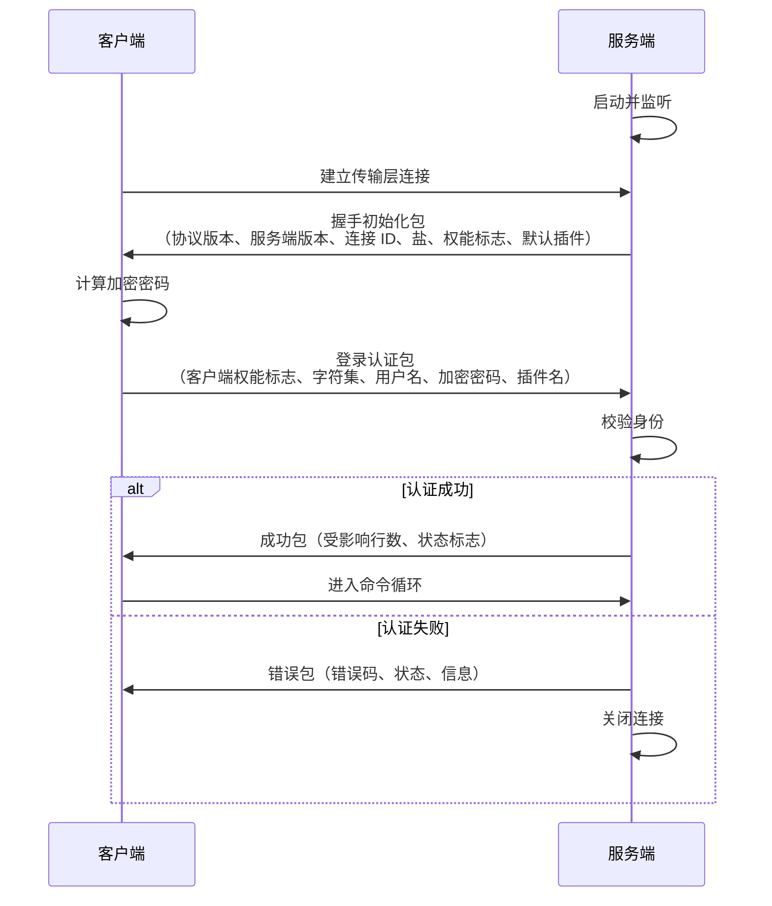

# 02. 深入解析MySQL 客户端与服务端通信协议

**摘要：**

MySQL 客户端与服务端的每一次交互都遵循一套自定义的应用层协议。它不依赖任何通用协议（如 HTTP），而是**自己定义了报文格式、握手流程与命令码**——这样做换来的是"极低的协议开销"与"对数据库交互模式的精确贴合"，代价是"需要为每种语言实现一套驱动"。本文按"协议要解决什么问题 → 报文长什么样 → 连接怎么建立 → 命令怎么执行 → 生产上会出什么问题"展开。先说明为什么要在传输层之上再定义一层协议，以及这个选择带来的三个取舍（长度字段的位宽、序列号的位宽、加密协商的时机）；再拆解报文的定长头与变长体、长度字段的历史约束、序列号的作用与大包分割；然后讲传输层抽象这一层的作用（屏蔽 TCP、Unix 套接字、命名管道的差异）；接着走完连接阶段（握手初始化包、登录认证包、权能标志协商）与认证机制（挑战-应答、哈希链、可插拔插件、RSA 回退）；之后是命令执行阶段的命令循环、命令码与四种响应报文。生产部分覆盖认证插件兼容性问题、参数依据、抓包分析与监控。最后是演进史、四处遗留设计、边界与常见误判。

---

## 第 1 章 协议要解决什么问题

### 1.1 传输层之上还需要什么

TCP 提供了"可靠的字节流"，但它不解决三个问题：**一条消息从哪里开始、到哪里结束**（消息边界），**这次请求对应哪次响应**（请求响应配对），**客户端与服务端在功能上是否匹配**（能力协商）。

任何在 TCP 之上的应用协议都必须回答这三个问题，MySQL 的协议也不例外。

**它给出的答案是**：用"定长头部里的长度字段"解决消息边界，用"头部里的序列号"解决请求响应配对，用"连接阶段交换的权能标志"解决能力协商。**三个机制都很简单，但组合起来构成了一套完整的应用层协议。**

### 1.2 为什么自己设计协议

一个自然的疑问是：为什么不用现成的协议（例如 HTTP）？

**原因一：交互模式不同。** 数据库交互是"长连接 + 高频小请求 + 流式大结果"，而 HTTP 早期是"短连接 + 单次请求响应"。**用 HTTP 承载数据库交互会引入不必要的开销**（头部冗余、连接管理）。

**原因二：需要"半双工"语义。** MySQL 协议是**半双工**的：同一时刻只能有一方在发送。**这个约束简化了实现**（不需要处理"双方同时发送"），**也贴合"一问一答"的数据库交互模式**。而 HTTP/1.1 的管线化与 HTTP/2 的多路复用都在处理"并发请求"，**这对数据库交互并不必要**（因为连接可以开多条）。

**原因三：需要精确控制"能力协商"。** 数据库的客户端与服务端版本差异很大（旧驱动连新服务端很常见），**因此需要一个显式的能力协商机制**——**而这正是权能标志要解决的问题。**

**三个原因共同说明：协议设计的依据是"交互模式"，而不是"通用性"。** 这也是为什么数据库、消息队列、缓存这些系统几乎都定义了自己的协议。**而它们的协议往往都不复杂——因为"贴合交互模式"本身就意味着"不需要为通用场景留出冗余"。**

### 1.3 协议的两个阶段

协议在时间上分为两个阶段，它们的规则不同。

**连接阶段**：客户端与服务端交换"握手"与"认证"信息。这个阶段的报文格式是**固定的**（字段顺序与含义都定死），因为双方此时还没有协商过任何东西。

**命令执行阶段**：客户端发送命令、服务端返回响应。这个阶段的报文格式**取决于命令与响应类型**——因此是"自描述"的（响应报文的首字节标识类型）。

**两个阶段的分界点是"认证成功"**。**理解这个分界很重要**：连接阶段的失败表现为"连不上"（错误码与认证相关），命令阶段的失败表现为"语句执行错误"（错误码与 SQL 相关）——**而两类错误的排查方向完全不同。**

### 1.4 协议设计的三个取舍

这套协议在三个地方做了取舍，而它们至今仍影响着使用体验。

**取舍一：长度字段只有三个字节。** 这意味着单个报文最大约 16MB。**当时的选择理由是"够用且省空间"，代价是"超大数据的传输需要拆包"**（第 2 章与第 10 章展开）。

**取舍二：序列号只有一个字节。** 这意味着序号会在 256 之后回绕。**这对"正常的一问一答"没有影响（因为每轮只有几个包），但"自定义客户端"容易在长响应上出错**（第 2 章展开）。

**取舍三：加密是"先明文协商、再升级"。** 客户端先明文声明"我支持加密"，服务端同意后才切换。**这个顺序保证了"不支持加密的老客户端仍能连接"，代价是"协商阶段有明文信息暴露"**（第 4 章与第 10 章展开）。

**三个取舍的共同特征是"它们都用'够用'换取了'简单与兼容'"**——**而"兼容"在数据库场景里格外重要，因为客户端驱动的升级往往滞后于服务端很多年。**

> [!info] 核心概念
> 判断一个网络协议的设计，可以问三个问题：**消息边界怎么定？请求响应怎么配对？能力怎么协商？** MySQL 协议的答案是"长度字段 + 序列号 + 权能标志"。**这套答案简单到可以用几句话说完，但它支撑了一个运行了二十多年的协议**——**这也是"简单"在协议设计里的价值：越简单，越容易实现正确、越容易长期兼容。**

---

## 第 2 章 报文结构

### 2.1 定长头与变长体

每个报文由两部分组成：**固定 4 字节的头部**与**变长的载荷**。

**头部的第一个字段是"载荷长度"**，占 3 字节，采用小端序。**它的作用是告诉接收方"接下来的多少字节属于这个报文"。**

**头部的第二个字段是"序列号"**，占 1 字节。**它的作用是让双方能确认"这个包属于哪一轮交互"。**

**载荷的内容取决于上下文**：在连接阶段是握手或认证信息，在命令阶段是命令码加参数，在响应阶段是类型标识加数据。

**这个"定长头 + 变长体"的结构是所有二进制协议的基本形态**，它的优点是**解析成本极低**（先读固定长度，再按长度读剩余部分），**代价是"长度字段的位宽决定了单包上限"。**

### 2.2 长度字段与它的历史约束

**3 字节的长度字段意味着单个报文的载荷上限约为 16MB。**

**这个约束在协议设计时是"够用"的**——当时的数据量与应用模式都不需要单包传输 16MB 以上。**但它随着 BLOB 与大文本的使用而变成了限制。**

**协议提供的应对方式是"拆包"**：当载荷达到长度上限时，**发送方把它切成多个报文**，接收方按序拼接。**这个机制对使用者是透明的**（驱动库自动处理），**但它意味着"协议层无法表达超过 16MB 的单条消息"**——**这是协议本身的边界，而不是实现的边界。**

**这里有一处历史细节值得留意**：长度字段取最大值（全 1）曾被用作"这是分割包"的标记，**这个用法在早期版本后被废弃**——**因为"长度恰好等于最大值"与"这是分割包"无法区分，造成了歧义。** **这是一个典型的"用保留值表达语义"带来的问题**：**保留值一旦被真实数据占用，语义就失效了。**

### 2.3 序列号与它的作用

**序列号的作用是"让双方确认当前这轮交互进行到哪一步"。**

**它从零开始，每发送一个报文递增一，并在 256 之后回绕。** 双方都独立维护这个计数，**因此"收到的序列号不符合预期"就说明"有报文丢失、重复或乱序"。**

**这个机制的价值在"半双工"的前提下才成立**：因为同一时刻只有一方在发送，**所以"当前应该是第几个包"是双方都能推算的**——**这正是它能用一个字节表达的原因。**

**但它也带来一处容易出错的地方**：**长响应（例如导出大量数据）会产生很多报文，序号会回绕。** 标准驱动正确处理了回绕，**而自定义客户端经常在这一点上出错**——**表现是"导出大数据时连接异常中断"。**

### 2.4 大包的分割

把前面两点结合起来，可以看到"大包分割"的完整机制。

**发送方**：把超过上限的载荷切成多段，**每段作为一个报文发送**（序号依次递增），**最后一段可能不足上限。**

**接收方**：按长度字段读取每一段，**只要读到的长度等于上限，就认为"还有后续段"**，继续读取并拼接。

**这个机制的关键在于"如何判断还有没有后续段"**——**判据是"当前段是否达到长度上限"**，而不是"某个结束标记"。**这个设计的优点是"不需要额外的结束标记"**（省了字节），**代价是"恰好等于上限的载荷会被误解为'还有后续'"**——因此发送方在"载荷恰好是上限整数倍"时需要补一个空段。**这类"边界情况"是所有"用长度表达结束"的设计都要处理的问题。**

### 2.5 报文里的字符集与编码

协议层还有一处与"编码"相关的约定，它解释了一类常见的乱码问题。

**连接阶段会协商一个"连接字符集"**，它是双方后续交换文本时使用的编码。**这个约定决定了"客户端发来的字节如何被解释成字符串"。**

**乱码的典型成因是"三层字符集不一致"**：客户端声明的连接字符集、表与列的字符集、以及结果返回时使用的字符集。**当"发送时的编码"与"解释时的编码"不同，就会出现乱码。**

**协议层的责任边界是清楚的**：**它只负责"把字节原样搬运"，而"字节代表什么字符"由字符集约定决定。** **因此"乱码"不是协议的缺陷，而是"约定不一致"的结果**——**这也是为什么排查乱码要从"三层字符集分别是什么"入手，而不是从"网络传输是否出错"入手。**

---

## 第 3 章 传输层抽象

### 3.1 虚拟 IO 层的作用

在协议实现之下，还有一层**传输层抽象**——它把"TCP 套接字、Unix 域套接字、命名管道"这些不同的通道统一成同一组读写接口。

**它的价值在于"协议层不需要知道自己在用什么通道"。** 协议实现只调用"读一段字节""写一段字节"，**而"字节从哪里来、往哪里去"由抽象层决定。**

### 3.2 支持的通道类型

抽象层支持的通道有三类，各有适用场景。

**TCP/IP 套接字**：跨主机通信的唯一选择，**也是生产环境的主要形式。**

**Unix 域套接字**：同主机通信的优化选择——**它绕过网络协议栈，因此延迟更低、吞吐更高。** **因此"应用与数据库同机部署"时，用它比用 TCP 更快。**

**命名管道与共享内存**：特定平台（主要是 Windows）上的通道，**适用于"同主机但希望用平台原生机制"的场景。**

**三类通道的取舍点是"是否跨主机"与"是否需要最低延迟"**：跨主机必须用 TCP；同主机优先用 Unix 域套接字。**这个判断很直接，但它常常被忽略**——**很多"同机部署却用 TCP"的配置，白白损失了延迟。**

### 3.3 为什么要有这层抽象

抽象层的存在有三处收益。

**收益一：协议实现与通道解耦。** 新增一种通道不需要修改协议代码。

**收益二：统一处理超时与重试。** 不同通道的超时语义不同（TCP 有连接超时与读写超时，Unix 套接字没有连接超时概念），**而抽象层可以统一表达。**

**收益三：为加密提供插入点。** 加密（TLS）是在"字节流"这一层做的，**因此抽象层正是加密最自然的插入点**（第 3.4 节）。

**三处收益与第 1 篇讲的"分层收益"是同一种**：**抽象层把"通道差异"这个变化点隔离出来，让上层可以专注在"协议语义"上。**

### 3.4 抽象与加密的交互

加密与抽象层的交互有一处值得说明的复杂性。

**加密是"在建立连接之后、协商完成之前"插入的**：客户端先以明文发送权能标志声明支持加密，服务端同意后，双方切换到加密通道，**后续通信全部加密。**

**这意味着抽象层必须支持"在同一个连接上从明文切换到加密"**——**而不是"新建一个加密连接"。** **这个设计要求抽象层维护"当前是否已加密"的状态**，并据此决定"读写是否经过加密处理"。

**这个"原地升级"的设计是为了兼容**：如果设计成"先明文协商、再新建加密连接"，那么老客户端就无法连接。**代价是"协商阶段的信息是明文的"**（第 10 章展开这个遗留问题）。

### 3.5 抽象层的性能含义

抽象层虽然是"纯封装"，但它的存在有两处性能含义。

**含义一：通道选择直接决定延迟。** 同机通信时，Unix 域套接字的路径是"内核内直接传递"，**而 TCP 的路径要经过完整的网络协议栈（即使目标是本机）。** **这个差异在高频小请求场景下会被放大**——**因为每条 SQL 都要经过一次往返。**

**含义二：加密会改变数据路径。** 启用加密后，读写要经过加解密处理，**因此"同样的数据量"会消耗更多 CPU。** **而这一层开销在"大量小请求"场景下的占比更高**（因为每个报文的固定开销被摊薄得更少）。

**两处含义的共同特征是"它们都不改变协议语义，只改变成本"**——**而这类"只影响成本的选择"往往在配置时被忽略**（例如"同机却用 TCP、明文却未启用加密"）。**因此部署审查时，值得专门确认"通道与加密的选择是否与实际环境匹配"。**

---

## 第 4 章 连接阶段

### 4.1 握手初始化包

连接建立后，**服务端先发一个"握手初始化包"**，它包含：

**协议版本**（当前为 10）——**它让客户端知道"对面在说什么版本的协议"**。

**服务端版本字符串**——用于客户端识别服务端类型与版本（**这也是"版本探测"的入口**）。

**连接标识**（4 字节）——它对应管理视图中看到的连接 ID，**是"排查时把会话与管理视图对应起来"的凭据。**

**盐**（共 20 字节，分两段发送）——**它是认证用的随机数**（第 5 章展开）。

**服务端权能标志**（4 字节）——它声明服务端支持哪些能力（加密、压缩、认证插件等）。

**默认认证插件名**——它告诉客户端"服务端建议用哪个插件认证"。

**这些字段的共同作用是"把服务端的能力与要求告知客户端"**——**因为此时客户端还不知道对面是什么版本、支持什么，所以这些信息必须由服务端主动提供。**

### 4.2 登录认证包

客户端收到握手包后，**发回"登录认证包"**，它包含：

**客户端权能标志**（4 字节）——**它声明客户端支持哪些能力**，并与服务端的标志取交集得到"本次连接实际启用的能力"。

**最大允许包大小**（4 字节）——客户端声明它能接收的最大报文。

**字符集编码**（1 字节）——连接的默认字符集。

**用户名**（以零字节结尾）。

**加密后的密码**——**其格式取决于认证插件**（第 5 章展开）。

**数据库名**（可选）。

**认证插件名**（可选）——**客户端声明它想用哪个插件**。

### 4.3 权能标志的协商

**权能标志的协商方式是"取交集"**：服务端声明"我能做什么"，客户端声明"我能做什么"，**双方都支持的才生效。**

**这个机制解决了"版本差异"这个核心问题**：老客户端连新服务端时，**新服务端提供的新能力不会被启用**（因为老客户端没声明支持），**因此不会因为"服务端用了新特性"而失败。**

**而"取交集"也意味着"新能力需要双方都升级才能生效"**——**这解释了为什么数据库的新特性普及很慢**：**不是服务端不支持，而是客户端驱动还没跟上。** 这与第 1 篇讲的"Server 层与引擎层的接口必须通用"是同一类约束——**生态里的兼容性要求，会拉低任何一方的演进速度。**

### 4.4 连接阶段的时序

**图中值得注意的一点是"盐由服务端生成并先发送"**——**这决定了认证是"挑战-应答"式的**（服务端出题、客户端作答），**而不是"客户端直接发送密码"**。**这个顺序保证了"密码本身不在网络上传输"**（第 5 章展开）。

---

## 第 5 章 认证机制

### 5.1 挑战-应答

认证采用**挑战-应答**模式：服务端生成随机数（盐）并发送，客户端用它与密码计算出一个值发回，**服务端用自己保存的信息做同样的计算并比对。**

**这个模式解决的核心问题是"密码不在网络上传输"。** 如果客户端直接发送密码，那么"任何能抓包的人都能拿到密码"——**而挑战-应答让抓包者只能拿到"用某个随机数加密后的值"，而随机数每次不同，因此无法重放。**

**代价是"服务端必须保存能验证的值，而不是密码本身"**——**而这个"能验证的值"的形式，决定了不同认证插件的安全性差异**（第 5.2 节）。

### 5.2 盐与哈希链

不同认证插件对"如何用盐与密码计算"的做法不同，这直接决定了安全性。

**早期插件用的是"一次哈希"**：把密码做一次哈希，用盐扰动后发送。**它的弱点是"如果攻击者拿到了服务端保存的哈希值，可以离线暴力破解"**——因为一次哈希的计算成本很低。

**较新的插件用的是"哈希链"**：先对密码做两次哈希得到中间值，服务端只保存这个中间值；认证时客户端用"中间值 + 盐"再算一次哈希发送，**服务端用保存的中间值做同样计算并比对。**

**这个设计的关键收益是"服务端保存的值不能直接用来认证"**：因为认证需要"中间值 + 盐"再哈希一次，**而服务端保存的就是中间值——攻击者拿到它之后，仍需要再算一次才能冒充。** **这增加了一层门槛，也让"服务端被拖库"的后果比"明文或弱哈希"小得多。**

**哈希链的代价是"每次认证多一次哈希计算"**——**而为了缓解这个成本，新插件引入了"缓存"机制**（认证成功过的连接可以跳过完整计算），**这也是它名字里"缓存"的由来。**

### 5.3 插件的可插拔设计

认证是**插件化**的：每种认证方式实现为一个插件，**服务端与客户端协商使用哪一个。**

**插件的接口很窄**——它只需要实现"验证用户"这一个回调。**这个窄接口是它能被广泛扩展的原因**：新增一种认证方式（例如基于证书、基于硬件令牌）**只需要实现这一个函数。**

**而"协商"这一步是插件化能工作的前提**：服务端在握手包里声明"建议用哪个插件"，客户端在登录包里声明"我想用哪个"，**双方据此决定用哪一个**——**如果客户端不支持服务端建议的插件，连接就会失败**（第 8.1 节展开这个最常见的兼容性问题）。

### 5.4 RSA 回退

哈希链认证有一个"鸡生蛋"的问题：**客户端需要把"计算后的值"发给服务端，而这个值如果被截获，是否会被利用？**

**在加密连接下这不是问题**（通道本身加密）。**但在明文连接下，协议提供了一条回退路径**：**客户端用服务端的公钥加密"计算后的值"再发送。**

**这条回退路径的存在解释了一个常见配置项的含义**：客户端连接串里那个"允许从服务端获取公钥"的开关，**它决定"客户端是否愿意在明文连接下走 RSA 回退"。** **把它打开会让"明文连接下的认证也相对安全"，但它同时也意味着"客户端接受了一个未经校验的公钥"**——**因此它更适合"网络环境可信"的场景**，**而在不可信网络下，正确做法是用加密连接。**

**这条回退路径的设计体现了一个通用思路**：**当"安全的默认做法"可能不适用时，提供一个"明确需要打开、且打开有代价"的替代路径**——**这样既保证了默认安全，又不至于让老场景完全不可用。**

### 5.5 认证机制的三条设计经验

把认证机制抽象一层，可以得到三条对设计有普遍意义的经验。

**经验一：把"秘密"变成"可验证但不可直接使用的东西"。** 服务端保存的不是密码，而是"能验证密码的值"；较新的方案还让这个值"不能直接用于认证"。**每一步都在削弱"服务端数据泄露"的后果。**

**经验二：随机数（盐）的作用是"让相同的输入产生不同的输出"。** 这既防住了"重放"（每次请求的加密值不同），也防住了"彩虹表"（预先算好的哈希表用不上）。**因此"每次认证用新随机数"是这类机制的必备条件。**

**经验三：兼容性压力应当由"可插拔"来承担，而不是由"协议版本"来承担。** 认证方式持续演进，**而协议本身几乎没变**——**因为认证是可插拔的。** **这条经验对任何"需要长期演进的安全机制"都适用**：**把变化点隔离成插件，而不是不断修改协议。**

---

## 第 6 章 命令执行阶段

### 6.1 命令循环

认证成功后，服务端进入**命令循环**：读一个请求报文、执行、返回响应、再读下一个，**直到连接关闭或出错。**

**这个循环的伪代码形态是**：读取命令 → 按命令码分派 → 执行 → 判断"是否该退出循环"。**退出条件是"收到退出命令"或"发生错误"。**

**这个结构的简单性来自第 1.2 节讲的"半双工"约束**：因为同一时刻只有一方在发送，**所以"读一个、处理、写一个"这个顺序是安全的**——**不需要处理"处理期间客户端又发了新请求"这种并发情况。**

### 6.2 命令码

命令阶段的第一件事是"识别命令类型"，**它由一个字节的命令码表达。**

| 命令码 | 含义 | 说明 |
|---|---|---|
| 关闭连接 | 退出命令循环 | 客户端主动断开 |
| 切换数据库 | 修改会话的当前库 | 影响后续未限定库名的语句 |
| SQL 查询 | 执行一条 SQL 文本 | **最常用的命令** |
| 获取字段列表 | 查询表结构 | 较新版本已不推荐使用 |
| 测试存活 | 心跳 | 连接池用它检测连接是否可用 |
| 切换用户 | 在同一连接上换身份 | 连接池复用时用 |
| 预处理准备 | 准备一条语句 | 返回语句标识 |
| 预处理执行 | 执行已准备的语句 | 参数与语句分离 |
| 预处理关闭 | 释放语句资源 | 避免服务端资源泄漏 |

**这张表里最值得注意的是"预处理三件套"（准备、执行、关闭）**——**它们的存在是"参数与语句分离"的实现基础**：**语句只解析一次，之后反复执行只传参数。** **这既避免了重复解析的开销，也避免了"参数拼接进 SQL"带来的注入风险。**

**另一处值得留意的是"切换用户"**：它让"连接复用"成为可能——**连接池可以在不重建连接的前提下换身份**，**从而省下"认证与初始化"的开销。**

### 6.3 响应报文类型

服务端的响应有四种基本类型，**它们由首字节区分。**

**成功响应**（首字节为 0x00）：表示命令执行成功，**携带受影响行数、插入标识、状态标志等信息。**

**错误响应**（首字节为 0xFF）：表示执行失败，**携带错误码、SQL 状态与错误信息。**

**结束标记**（首字节为 0xFE）：历史上用于标记"结果集的某一部分结束"，**较新版本已改用成功响应承担这个职责**——**因此它在协议里变成了"历史遗留"**。

**结果集**：由多类报文组成（下一节展开）。

**四类响应的设计体现了"自描述"原则**：**客户端只需要看首字节，就知道该如何解析后续内容。** **这避免了"客户端需要预先知道响应类型"这个要求**——**而后者会让协议无法承载"任意 SQL 的响应"（因为响应类型取决于 SQL 本身）。**

### 6.4 结果集的多包结构

结果集是协议里最复杂的部分，**它由多个报文按固定顺序组成。**

**第一个报文是"列数量"**——它告诉客户端"这个结果集有几列"。

**接着是"列定义列表"**——每个列一个报文，描述列名、类型、字符集等信息。

**然后是一个分界标记**——标记"列定义结束"。

**接着是"行数据列表"**——每行一个报文（行内的各列按列定义编码）。

**最后是"结束标记"**——标记"结果集结束"，并携带状态信息。

**这个"先告诉你有几列、再给出列的元信息、再给数据"的顺序，体现了"流式返回"的设计**：**客户端可以在收到列定义之后就开始准备接收数据，而不必等整个结果集到齐。** **这对"大结果集"很重要**——**它让"导出大量数据"不必把全部结果缓存在内存里。**

**代价是"客户端必须按顺序解析"**：**它不能在收到行数据之前就知道列类型**，**因此解析逻辑必须严格按协议顺序推进。** **这也是"自定义客户端容易出错"的另一处原因**——**协议虽然简单，但它的状态机并不平凡。**

### 6.5 预处理语句的协议细节

预处理语句是协议里唯一"跨命令保持状态"的机制，值得单独说明。

**"准备"这一步把 SQL 文本发给服务端，服务端解析并返回一个"语句标识"**——**后续的"执行"只需要带上这个标识与参数值。**

**"执行"这一步的参数是"二进制编码"的**——**这与普通查询的"文本编码"不同。** **二进制编码的好处是"类型明确"**（不需要从文本推断类型），**代价是"客户端必须知道每个参数的类型"。**

**这个差异带来一个常见的坑**：**同一条 SQL 用文本协议与用预处理协议，可能得到不同的结果。** 例如"比较字符串与数字"这类场景，**文本协议下的隐式转换规则与二进制协议下不同**——**这正是"同一查询在不同驱动下结果不一致"这类问题的来源。**

**"跨命令保持状态"还有一个运维含义**：**语句标识会占用服务端资源，因此必须显式关闭。** **如果客户端只准备不关闭，就会造成服务端资源泄漏**——**这是连接池实现里必须处理的一件事。**

---

## 第 7 章 网络缓冲

### 7.1 缓冲结构

每个连接对应一个**网络缓冲结构**，它承载"读缓冲与写缓冲"的状态。

**它包含的字段可以归为四类**：**传输层抽象对象的指针**（它决定字节从哪里来）、**缓冲区的位置指针**（基址、结束地址、读位置、写位置）、**包控制信息**（最大包长、序列号、压缩序列号）、以及**错误与字符集信息**。

**这个结构被嵌入在会话对象里**（第 1 篇讲的会话描述符），**因此它是"每连接一份"的**——**这与第 1 篇讲的"表定义缓存是全局共享的"形成对比**：**网络缓冲是连接私有的，因为它承载的是"这个连接的数据流状态"。**

### 7.2 缓冲的动态扩展

缓冲区有一个"初始大小"，**而它会根据实际需求动态扩展**（上限受最大包长配置约束）。

**这个设计的取舍是**：**初始值小可以让"大量空闲连接"占用的内存更少**（这在连接数很多时很重要），**而"按需扩展"保证了大查询不会被小缓冲限制。**

**扩展的代价是"内存重新分配与数据拷贝"**——**因此"初始值是否合理"会影响"大查询首次执行的开销"。** **这也是"初始缓冲大小"这个参数存在的原因**：**它不是"越大越好"（会让空闲连接占内存），也不是"越小越好"（会让大查询频繁扩展）。**

### 7.3 读写超时

缓冲层还负责**超时控制**，它有独立的"读超时"与"写超时"。

**读超时**：等待客户端发送数据的最长时间。**它防的是"客户端连上了但不发数据"**（这类连接会长期占用服务端资源）。

**写超时**：等待客户端接收结果的最长时间。**它防的是"客户端不接收结果"**（例如客户端进程卡死或网络中断）。

**两个超时的区分很重要**：**它们对应两类不同的故障**——**读超时指向"客户端不发"，写超时指向"客户端不收"。** **而"大数据导出超时"通常是写超时**（因为数据量大、传输时间长），**因此调优方向是"调大写超时"，而不是读超时。**

**这与第 1 篇讲的"参数调整要有内核依据"是同一条纪律**：**知道超时发生在哪个方向，才知道该调哪个参数。**

---

## 第 8 章 生产落地

### 8.1 认证插件兼容性：升级后最常见的故障

**现象**：服务端升级后，部分应用报"认证插件无法加载"。

**根本原因**：服务端把默认认证插件改成了更安全的那一个，**而旧版驱动不认识它。**

**这个故障的成因可以按"客户端能力"分成两条路径。**

**路径一：驱动支持该插件。** 处置方式是升级驱动版本——**这是最正确的方式，因为它保留了更高的安全性。**

**路径二：驱动不支持且无法更换。** 处置方式是把该用户的认证插件降级为旧插件——**而这一步是有代价的**：旧插件的哈希更容易被离线破解，**因此它降低了安全性，应当作为临时措施并记录在案。**

**还有一条独立的维度是"是否可用加密连接"**：**如果可以用加密连接或 RSA 回退，那么客户端可以在不降级的前提下完成认证**（第 5.4 节）。**因此"是否能启用加密"是这条决策树上的关键分支。**

**这条决策树的价值在于"它把'连不上'这个现象，拆成了'驱动能力'与'加密能力'两个维度"**——**而这两个维度的处置方式完全不同**（前者升级驱动，后者调整连接配置或降级插件）。

### 8.2 参数矩阵与它的内核依据

| 参数 | 内核依据 | 调整方向 |
|---|---|---|
| 最大包长 | 控制单次收发的报文上限，影响大对象操作 | 有大对象操作时调高 |
| 初始缓冲大小 | 连接的初始缓冲区，超过后动态扩展 | 与"连接数与典型请求大小"匹配 |
| 读超时 | 等待客户端发送的超时 | 客户端上报数据慢时调高 |
| 写超时 | 等待客户端接收的超时 | 大数据导出场景调高 |
| 连接超时 | 握手阶段的等待时间 | 高负载或跨网络时调高 |
| 认证策略 | 控制允许的认证插件列表 | 按安全要求收敛 |
| 跳过域名解析 | 避免权限校验时的反向解析 | 生产环境通常开启 |

**这张表里最值得留意的是"跳过域名解析"这一项**：**它的作用不是"性能优化"，而是"消除一类不可控的延迟"**——因为反向域名解析依赖外部服务，**而外部服务的抖动会直接变成"连接建立变慢"。** **这类"依赖外部服务的隐藏路径"是生产环境里最容易被忽略的延迟来源。**

### 8.3 抓包分析

协议是"自描述且公开"的，**因此可以用抓包工具直接分析。**

**基本做法是"抓取数据库端口的流量并保存，再用支持该协议的解析器展开"**——**解析器能把字节流还原成"握手包""登录包""命令""响应"这些语义单元。**

**它的价值在于"回答'到底发生了什么'"**：**"客户端发了什么命令""服务端返回了什么错误码""握手阶段协商了哪些能力"**——**这些问题在应用日志里往往看不到，而抓包能看到。**

**一处必须注意的前提是"加密连接无法直接解析"**——**因此抓包分析通常只在排查"连接阶段问题"时有效**（因为认证之后往往已加密）。

### 8.4 监控与诊断

协议层可观测的信息有三类。

**连接类型**：当前连接用的是 TCP、Unix 套接字还是命名管道。**它回答"同机部署是否用上了更快的通道"。**

**认证插件分布**：各用户当前使用哪个认证插件。**它回答"还有多少用户停留在旧插件上"**——**这是"能否收紧认证策略"的前置信息。**

**认证失败记录**：错误日志里的认证失败信息。**它回答"是否有异常连接尝试"。**

**三类信息的共同特征是"它们都服务于'连接与认证'这一层"**——**而这一层的故障（连不上、认证失败）与"语句执行层"的故障（查询慢、报错）需要分开排查**（第 1.3 节讲的阶段分界）。

### 8.5 一次"连不上"的排查推演

把排查路径串成一个案例。

假设现象是"升级服务端后，某个应用报认证插件相关的错误，但同机另一个应用正常"。

**第一步，确认是"连不上"还是"连上了但报错"。** 如果错误发生在"建立连接"阶段（错误码与认证相关），那么方向在连接层；**如果是"连接成功但某条 SQL 报错"，那与本篇无关**（应查 SQL 与权限）。

**第二步，确认是"驱动能力"还是"配置"问题。** 对比"能连的应用"与"连不上的应用"——**如果它们用不同的驱动或驱动版本，那么问题在驱动能力**；**如果它们用同一驱动，那么问题在连接配置**（例如加密与公钥获取的开关）。

**第三步，确认服务端当前要求什么。** 查看该用户的认证插件设置、以及服务端允许的认证插件策略。**这一步回答"服务端是否要求了客户端不支持的方式"。**

**第四步，按"最小代价"顺序处置。** 优先"升级驱动"（保留安全性）；其次"调整连接配置启用加密或公钥获取"（保留安全性）；**最后才考虑"降级认证插件"**（降低安全性，需记录）。

**四步的价值在于"每一步都在区分一类原因"**：错误发生的阶段、驱动与配置的差异、服务端的要求、以及处置的优先级。**而"处置优先级"这一步最容易被跳过**——**很多团队直接选择"降级插件"（因为它最快），从而在没有必要的情况下永久降低了安全性。**

---

## 第 9 章 协议演进史

### 9.1 关键节点

| 版本 | 协议变化 | 动因 |
|---|---|---|
| 3.21 | 引入基本报文格式 | 最早的公开版本 |
| 4.1 | 引入 20 字节盐与旧版密码插件 | 解决明文密码问题 |
| 5.5 | 支持插件式认证接口 | 为第三方认证方式铺路 |
| 5.7 | 引入更强的哈希插件 | 提供更强的密码哈希 |
| 8.0 | 默认改为带缓存的强哈希插件，增加公钥获取机制 | 提升安全性，缓解离线破解 |
| 8.0.28+ | 弃用旧插件的编译选项 | 逐步淘汰老旧插件 |
| 8.0.34+ | 增加硬件令牌认证插件（企业版） | 支持无密码认证 |

**这条演进线的主线是"认证强度的提升"**：从明文到弱哈希、从弱哈希到强哈希、从强哈希到"哈希链 + 缓存"、再到硬件令牌。**每一步都在解决"上一代方案被证明不够安全"的问题。**

**而"插件化"是这条线能持续演进的前提**：**因为认证是可插拔的，所以"引入更强的插件"不需要改动协议本身**——**这正是第 5.3 节讲的"窄接口的价值"。**

### 9.2 四处遗留设计

**第一处：16MB 的报文上限。** 它源于长度字段的位宽，**而驱动库通过拆包把它对使用者隐藏了**。**但"协议层无法表达更大的单条消息"这个边界仍然存在**——**它是"协议设计的扩展瓶颈"，而不是"实现的缺陷"。**

**第二处：单字节序列号。** 长响应会绕回，**标准驱动处理正确，自定义客户端容易出错。**

**第三处：加密的"先明文后升级"。** 它保证了老客户端可连，**代价是协商阶段的信息是明文的。** 在"加密成为事实标准"的今天，**这个设计的历史包袱逐渐变成了纯粹的负担。**

**第四处：特定平台通道的认证缺陷。** 某个版本的命名管道通道不支持新认证插件，**导致回退失败**——**这类"只在特定平台与特定版本组合下出现"的问题，是最难排查的一类。**

**四处遗留设计的共同特征是"它们都是'当时够用'的选择留下的"**——**而它们的处置方式也一致：要么靠上层（驱动、配置）掩盖，要么等下一代协议重构。**

### 9.3 演进方向

**方向一：加密成为事实标准。** 云上的数据库服务已普遍要求加密连接，**因此"明文连接下的回退机制"会逐步退出使用。**

**方向二：证书与硬件令牌认证。** 基于证书的认证已在部分版本提供，**它把"认证"从"知道某个秘密"变成了"持有某个凭据"**——**在"秘密容易泄露"的环境里，这是更合适的安全模型。**

**方向三：非传统接口的并存。** 部分产品已提供基于通用协议的接口，**但传统协议仍将长期并存**——**因为它的开销更低，且生态（各种语言的驱动）无法一夜替换。**

**方向四：握手信息的增强。** 较新版本在握手包里增加了插件列表，**从而减少"反复试探"的往返**——**这是"用更完整的信息减少交互次数"的典型改进。**

**四个方向的共同特征是"它们都在削弱第 1.4 节讲的那三个取舍带来的限制"**——**加密标准削弱"兼容优先"的必要性，证书认证削弱"挑战-应答"的局限，握手增强削弱"信息不足导致的往返"。** **这与第 1 篇讲的"架构演进是逐步收回当初的代价"是同一条规律。**

---

## 第 10 章 边界与反例

### 10.1 反例一：把"协议简单"当作"实现简单"

协议本身只有几个机制，**但它的状态机并不平凡**（握手、认证、命令循环、结果集的多段结构）。**自定义客户端出错的地方，往往不在"解析单个报文"，而在"状态流转"。**

### 10.2 反例二：把"16MB 上限"当作"不存在的限制"

驱动会拆包，**但"单条消息无法超过 16MB"这个协议边界仍在**——**它在"需要单条消息原子性"的场景下会显现**（例如"把整个大对象作为一条消息发送"）。

### 10.3 反例三：把"认证失败"当作"密码错了"

认证失败的原因还包括"插件不匹配""公钥获取被禁止""通道不支持该插件"。**把它们都归为"密码错误"，会导致排查方向错误。**

### 10.4 反例四：为"连得上"而长期保留旧认证插件

降级认证插件能让旧驱动连上，**但它的哈希更容易被离线破解。** **因此它应当是"临时措施 + 明确记录"，而不是"就这样用下去"。**

### 10.5 反例五：同机部署却使用 TCP

Unix 域套接字在同机场景下延迟更低，**而"用 TCP"是一个常见但无必要的选择**——**它白白损失了延迟，且没有换到任何收益。**

### 10.6 反例六：忽略"读超时"与"写超时"的方向差异

两者对应不同的故障方向。**把"大数据导出超时"当成"读超时问题"来调，是调不对的**（第 7.3 节）。

### 10.7 反例七：在加密连接上做抓包分析

认证之后通常已加密，**因此抓包只能看到密文**——**分析连接阶段的问题有效，分析语句执行的问题无效。**

### 10.8 反例八：把"乱码"当作"传输错误"

协议只搬运字节，**"字节代表什么字符"由三层字符集约定决定**（第 2.5 节）。**把乱码归因到网络传输，会一直在错误的方向上排查。**

### 10.9 反例九：忽略预处理协议与文本协议的行为差异

同一 SQL 在两种协议下可能因隐式类型转换规则不同而结果不同。**这类差异在"从文本查询切换到预处理"时才会暴露**，**而它看起来像"数据变了"，实际是"解释规则变了"。**

---

## 第 11 章 落点

回到开头的问题：TCP 之上还需要什么？

答案是**消息边界、请求响应配对、能力协商**——而 MySQL 协议的答案是"长度字段、序列号、权能标志"。**三个机制都很简单，但它们构成了一个运行了二十多年的协议的全部基础。**

**这套协议的设计取向可以概括为"用简单换兼容"**：长度字段只有三字节（够用）、序列号只有一字节（够用）、加密先明文后升级（保证老客户端可连）。**三处取舍都牺牲了"未来的扩展空间"，换取"当下的实现简单与广泛兼容"**——**而在数据库这个"驱动升级极慢"的生态里，这个交换是必要的。**

**因此这套协议的历史，也是一部"如何在兼容约束下逐步提升安全性"的历史**：认证从明文到弱哈希到强哈希到硬件令牌，每一步都要保证"旧客户端仍能连上"。**而"插件化"是这一切能发生的前提**——**它把"协议本身的变更"变成了"插件的替换"。**

**最后一条值得记住的判断方式：读网络协议时，先问"消息边界怎么定、请求响应怎么配对、能力怎么协商"，再问"这三处的取舍是什么"。** **前三个问题让你理解它怎么工作，后一个问题让你理解它为什么长成这样、以及它在哪里会碰到天花板。**

**这套协议还有一个容易被忽略的价值：它是"可观测的"。** 因为报文自描述且格式公开，**所以"抓包 + 解析"就能回答"客户端与服务端到底交换了什么"**——**这在排查"驱动行为异常""版本不匹配""认证协商失败"这类问题时，是日志无法替代的手段。** **而"可观测"本身也是协议设计的一个隐性要求**——**一个不可观测的协议，会让所有问题都变成黑盒。** 因此评估一个协议时，"能否被观测"值得作为一个独立维度来考虑。

---

## 专栏导航

- 上一篇：[[01. MySQL总体架构：Server层与存储引擎的插件化设计]]。
- 下一篇：[[03. 数据字典：.frm 的葬礼与原子 DDL 的二十年偿债]]。
- 返回专栏首页：[[00 专栏导览]]。

---

## 参考资料

1. MySQL. MySQL Internals Manual: Client/Server Protocol. https://dev.mysql.com/doc/internals/en/client-server-protocol.html
2. MySQL 8.0.33 源码：`vio/vio.c`、`sql/net_serv.cc`、`sql/protocol_classic.cc`、`include/mysql_com.h`、`include/mysql.h`.
3. Oracle Blogs. MySQL 8.0: Authentication Plugin – caching_sha2_password. https://dev.mysql.com/blog-archive/
4. MySQL. 官方文档：Connection Phase 与 Capability Flags 说明. https://dev.mysql.com/doc/dev/mysql-server/latest/page_protocol_connection_phase.html
5. MySQL. 官方文档：Server System Variables（max_allowed_packet、net_read_timeout、net_write_timeout、connect_timeout）. https://dev.mysql.com/doc/refman/8.0/en/server-system-variables.html
6. MySQL. 官方文档：Caching SHA-2 Pluggable Authentication. https://dev.mysql.com/doc/refman/8.0/en/caching-sha2-pluggable-authentication.html
7. Wireshark. MySQL Protocol Dissector 说明. https://www.wireshark.org/docs/dfref/m/mysql.html
8. MySQL. 官方文档：Unix Socket 与 TCP 连接方式的性能差异说明. https://dev.mysql.com/doc/refman/8.0/en/connecting.html
9. MySQL. 官方文档：Prepared Statements 的协议交互与类型处理. https://dev.mysql.com/doc/refman/8.0/en/sql-prepared-statements.html
10. MySQL. 官方文档：字符集与连接字符集的协商规则. https://dev.mysql.com/doc/refman/8.0/en/charset-connection.html
11. MySQL. 官方文档：SSL/TLS 连接协商与公钥获取的配置说明. https://dev.mysql.com/doc/refman/8.0/en/using-encrypted-connections.html

---

> [!note] 思考题
> 1. 在 TCP 之上定义应用层协议，必须回答哪三个问题？MySQL 协议分别用什么机制回答？
> 2. 协议的三处取舍（长度位宽、序列号位宽、加密时机）为什么都选择"够用就好"？这与数据库生态的什么特征有关？
> 3. "哈希链"相比"一次哈希"多换来了什么？它的代价是什么、如何缓解？
> 4. 为什么"权能标志取交集"会让新特性普及很慢？这与第 1 篇讲的哪条约束同类？
> 5. 读一个网络协议时，你会先问哪几个问题？
