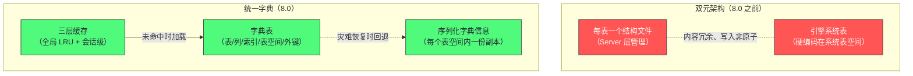
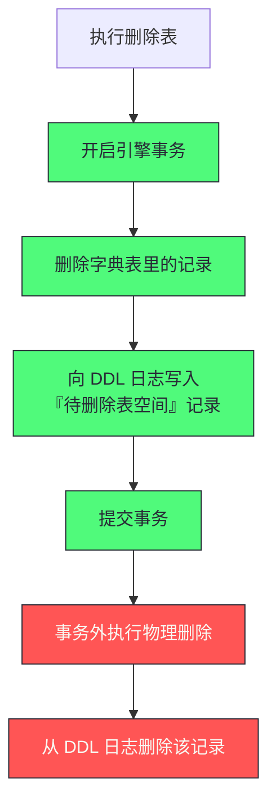

# 03. 数据字典：.frm 的葬礼与原子 DDL 的二十年偿债

**摘要：**

数据字典是"元数据的家"——它记录表、列、索引、表空间这些对象的定义。这个"家"的位置，决定了数据库能否保证"结构变更的原子性"。MySQL 在很长一段时间里让元数据**有两个家**：Server 层为每张表写一个结构文件，InnoDB 又在自己的系统表里记一份。两份数据、两套写入路径，**导致"结构变更不是原子的"**——一次建表中途断电，可能留下"结构文件已写、引擎系统表未更新"的中间态，结果是"表既打不开也删不掉"。MySQL 8.0 把这两份合并成一份，存进引擎自己的表空间，**让"改元数据"变成一次普通的引擎事务**——这就是原子 DDL 的实现基础。本文按"为什么要有两个家 → 两个家带来什么 → 合并成什么样 → 原子性怎么实现"展开。先讲双元架构的冗余与不一致、以及那类"必须手工清理"的故障；再拆解统一字典的三层缓存与字典表的组织；然后讲序列化字典信息（第二份副本）为什么值得保留、以及它换来的灾难恢复能力；接着重点剖析原子 DDL 的执行流程与崩溃恢复的衔接；之后是打开表的查找链与反序列化成本、`mysql.ibd` 损坏的恢复流程、参数与监控。最后是演进史、四处遗留设计、边界与常见误判。

---

## 第 1 章 元数据为什么需要一个"家"

### 1.1 元数据的两个职责

元数据要承担两个职责，而它们的性能特征相反。

**持久化**：把"表长什么样"保存到磁盘，**保证实例重启后结构不丢。** 它要求**可靠**——一旦丢失，数据文件就成了"没有目录的书"。

**运行时访问**：为解析、优化、执行提供"这张表有哪些列、有哪些索引"的快速查询。**它要求快**——因为几乎每条 SQL 都要问一次。

**两个职责的冲突在于"访问频率"**：**元数据的访问频率极高，而磁盘读取很慢。** 因此任何方案都必须"把元数据放在内存里缓存"，而"缓存与持久化之间如何保持一致"就成了核心问题。

### 1.2 早期方案：让 Server 层管

MySQL 早期把元数据的持久化交给 **Server 层**——它为每张表写一个独立的结构文件（`.frm`）。

**这个选择在当时是合理的**：Server 层负责"理解表结构"（解析、优化都要用），**因此由它来管理"表结构的存储"看起来最自然。** 而且"每张表一个文件"符合"一个表就是一组文件"的直觉（数据文件、索引文件、结构文件）。

**但它埋下了一个问题**：存储引擎自己也需要知道表结构——**因为引擎要按结构去读写数据。** 于是引擎（InnoDB）也建立了一套自己的元数据存储。

### 1.3 问题：两个"家"并存

于是形成了**双元架构**：Server 层有一套（结构文件），引擎有一套（引擎自己的系统表）。

**两套元数据在内容上高度重叠**（都记录列、索引），**因此是冗余的**；**而"两份数据"必然带来"一致性"问题**——**因为它们由两条不同的写入路径维护，而这两条路径无法被同一个事务覆盖。**

**这就是所有"双元"设计的通病**：**当同一个事实有两个存储位置，且更新它们不是一个原子操作时，"不一致"就只是时间问题。**

### 1.4 不这样会怎样

如果元数据只有一份、且由引擎统一管理，会怎样？

**收益一：结构变更可以原子。** 因为"改元数据"与"改数据"都在同一个引擎事务里，**因此可以一起提交或一起回滚**——这正是原子 DDL 的基础。

**收益二：崩溃恢复可以统一。** 元数据的改动会被重做日志覆盖，**因此崩溃恢复不需要为"元数据"单独设计一套恢复逻辑。**

**收益三：冗余消失。** 只存一份，**内存与磁盘都不再翻倍。**

**三条收益恰好是 8.0 重构的目标**——**而它们的共同来源是"把元数据纳入引擎管理"这一个决定。** 这与 Kafka 把元数据从外部协调服务内化到自己的日志（Kafka 第 6 篇）是同一类演进：**把"旁路管理的元数据"变成"与数据同源管理"，从而获得"可以一起保证一致性"的能力。**

### 1.5 一个类比：图纸与施工

把元数据与数据的关系类比成"图纸与施工"会更容易理解。

**元数据是图纸**——它描述"这栋楼有几层、每层几个房间、门开在哪"。

**数据是楼本身**——它按图纸建起来，但图纸丢了之后，楼就"住不了"（因为不知道哪间是卧室、哪间是厨房）。

**双元架构相当于"图纸有两份，分别由两个部门保管，且各自可以修改"**——**于是"两份图纸不一致"就只是时间问题**，而施工队不知道听谁的。

**而"图纸丢了"这件事的后果，取决于有没有备份**——**这正是"序列化字典信息"的作用**：**它在每栋楼里也放一份图纸**，从而在"总图纸室着火"时仍能重建。

**这个类比的用处在于"它区分了两件事"**：**"多份图纸"不是问题，"多个可以改图纸的部门"才是问题。** **而"备份图纸"是另一件事——它不是"第二个权威"，而是"只读副本"。**

---

## 第 2 章 双元架构与它的缺陷

### 2.1 两套字典的分工

在双元架构下，两套字典各有分工与存储位置。

**Server 层字典**存在每张表的结构文件里，**启动时扫描数据目录并缓存**。**它负责"表结构对外的呈现"。**

**引擎字典**存在引擎的系统表空间里，**由引擎内部的表对象缓存管理**。**它负责"引擎如何读写这张表"。**

**两套字典的"访问方式"也不同**：前者靠"扫描目录 + 解析文件"，后者靠"查询系统表"。**两条路径的失败模式因此也不同**——**这给故障排查带来了额外的复杂度。**

### 2.2 冗余与不一致

**冗余的代价不只是"多占空间"**，还包括三处。

**其一：内存翻倍。** 同一张表的结构在 Server 层与引擎层各缓存一份，**因此"能缓存的表数量"被减半。**

**其二：写入路径翻倍。** 每次结构变更都要更新两个地方，**因此"变更的失败面"翻倍。**

**其三：一致性问题。** 两份数据之间没有原子性保证，**因此可能出现"两份说的不一样"的状态**——**而这类状态最难处理，因为"以哪一份为准"没有明确答案。**

### 2.3 非原子的 DDL

**把前三处代价合起来，就得到了"DDL 非原子"这个根本问题。**

**结构变更的写入顺序是"先改一份、再改另一份"**（例如先写结构文件，再更新引擎系统表）。**如果在这两步之间发生故障（断电、进程被杀），就会停在中间态。**

**中间态的形态是"一份新、一份旧"或"一份有、一份无"**——**而无论哪种，都意味着"这张表的状态是不确定的"。**

**更麻烦的是"这个中间态无法被自动修复"**：因为"哪一份是对的"需要人工判断，**而数据库本身没有足够信息来推断"用户的意图是什么"。**

### 2.4 典型故障：那张既打不开也删不掉的表

双元架构下最典型的故障是"建表中途失败"。

**过程是**：结构文件已经写入，但引擎系统表还没来得及更新——此时故障发生。**重启后，数据库从结构文件里看到了这张表（因此认为它存在），但引擎找不到它的数据（因此无法打开它）。**

**此时的状态是"两边都做不到"**：**想打开它，引擎会报"表不存在"；想删除它，删除流程要先打开它（于是又报"不存在"）。**

**唯一的处置是"手工清理"**：删掉那个结构文件、再清理引擎系统表里的残留记录。**而这类手工操作是"直接改元数据"，风险很高**——**删错一个文件或错删一条记录，都可能影响其他表。**

**这个故障形态值得记住，因为它体现了一个通用规律**：**"非原子的多步更新"所产生的中间态，往往落在"既不符合前一个状态、也不符合后一个状态"的空隙里**——**而落在空隙里的状态，通常既无法被正常流程使用，也无法被正常流程清除。**

### 2.5 为什么这类设计难以自我修正

一个值得追问的问题是：**为什么数据库不能在启动时"自动检测并修复"这类中间态？**

**原因在于"缺少判断依据"。** 要判断"这个中间态应该往哪个方向收敛"，需要知道"用户的意图"——**而"用户当时想做什么"这个信息在故障中已经丢失了。** **数据库能观察到的只是"当前两份数据不一致"，而"哪一份对"无法推断。**

**这一点带来两条设计启示。**

**启示一：能通过"把多步操作变成一步"来消除中间态，就应当这样做。** **统一字典正是这个方向**——**它把"改两处"变成了"改一处"，于是中间态从"可能出现"变成了"不可能出现"。**

**启示二：如果中间态无法消除，就应当为它记录"意图"。** **原子 DDL 的日志表正是这个方向**——**因为"删文件"这个动作无法被事务覆盖，所以显式记录"决定要删"。**

**两条启示的优先级不同**：**"消除中间态"优于"记录意图"**——**因为前者是"问题不存在"，后者是"问题可恢复"。** **而工程上应当优先争取前者。**

---

## 第 3 章 统一字典的架构

### 3.1 核心变化

8.0 的重构做了两件事。

**其一，把元数据统一存进引擎的表空间**——具体是在一个专用的系统表空间里创建约二十张引擎表，**分别记录表、列、索引、表空间、外键、库等对象。**

**其二，去掉了每张表的结构文件**——**因为"结构"已经存在引擎表里了。**

**两件事合起来的效果是"元数据变成了一份、且由引擎管理"。** 而"由引擎管理"意味着**"改元数据"就是"改引擎表"**——**因此它天然被引擎的事务、锁、重做日志、崩溃恢复覆盖。**

**这一步是整个重构的关键**：**它没有发明任何新机制，只是把"元数据"从"特殊数据"降级成了"普通数据"。**

### 3.2 架构对比图

**图中最值得注意的是"新旧两版都有两份存储"**：旧版的两份是"两个平行的家"（互不覆盖、可能不一致），**新版的两份是"主副本 + 只读副本"（前者权威、后者用于恢复）。** **这个区别很关键**——**"两份"本身不是问题，"两份都可以被独立修改"才是问题。**

**这条区分有普遍意义**：**冗余存储本身是好的（它提供容错），而"多写入路径"才是不一致的来源。** 因此设计冗余时应当明确"哪一份是权威的、其余只读"。

### 3.3 字典表的设计

字典表按"对象类型"拆分，核心的几张记录如下内容。

| 表 | 记录什么 | 与旧架构的对应 |
|---|---|---|
| 表定义 | 表名、引擎、私有标识、行格式等 | 旧的引擎系统表 |
| 列定义 | 列名、类型、字符集、默认值 | 旧的结构文件 |
| 索引定义 | 索引名、类型、算法、可见性 | 旧的结构文件 |
| 索引列使用 | 索引包含哪些列、顺序 | 旧的结构文件 |
| 表空间信息 | 表空间名、文件、状态 | **旧架构没有，新增** |
| 外键约束 | 外键的引用关系 | 旧的引擎系统表 |
| 字典自身属性 | 根页号、版本等 | 旧的硬编码字典头 |

**这张表有两处值得留意。**

**第一处是"表空间信息"是新增的**：**旧架构下"表空间"不是一个被完整记录的对象**（它隐含在文件与引擎的配置里）。**新架构把它显式化，从而让"表空间的生命周期"可以被事务管理**——**这是"物理文件操作可以原子化"的前提**（第 6 章展开）。

**第二处是"字典自身属性"被从硬编码变成了表**：**旧架构的字典头信息写在固定位置**（因此无法演进），**新架构把它记录在表里**（因此可以随版本变化）。**这个改变让"字典格式升级"从"不可能"变成了"一次元数据变更"。**

### 3.4 "把字典当作普通表"的收益

这个做法的收益可以归纳为四点。

**收益一：原子性。** 元数据变更与其他数据变更一样，**都在引擎事务里**。

**收益二：崩溃恢复。** 元数据变更被重做日志覆盖，**因此崩溃恢复不需要单独的元数据恢复逻辑。**

**收益三：可扩展。** 字典格式升级只是"改表结构"，**而不需要"改硬编码的解析逻辑"。**

**收益四：可观测。** 字典成了表，**因此理论上可以用 SQL 查询它**（虽然出于安全考虑默认禁止直接访问）。

**四点收益的共同特征是"它们都是'复用既有机制'的结果"**——**把元数据降级为普通数据之后，它自动获得了普通数据拥有的一切能力。** **这与第 1 篇讲的"连接框架把状态存在内部主题里"、Kafka 第 4 篇讲的"消费进度存在内部主题里"是同一个手法**：**用"统一"替代"特殊设计"。**

### 3.5 这次重构的代价

重构也不是没有代价，代价主要在三处。

**其一是"元数据访问路径变长"**：**旧架构下读元数据是"读一个文件"（路径短），新架构下是"查询字典表"（要走引擎的查询路径）。** **因此"首次打开表"的成本上升了**——**而这正是"三层缓存"必须存在的原因。**

**其二是"元数据与数据共享同一批资源"**：字典表存在引擎表空间里，**因此"元数据的读写"会与"用户数据的读写"争抢缓冲池与磁盘 IO。** **旧架构下元数据是独立文件，两者在一定程度上是分离的。**

**其三是"集中带来的单点风险"**：元数据集中到一处之后，**"这一处损坏"的影响面变大了**——**这正是"序列化字典信息"要解决的问题**（第 4 章）。

**三处代价的共同特征是"它们是'统一'的对价"**：**统一换来了原子性与可扩展性，付出的是"路径变长""资源竞争""影响面集中"。** **而这与第 1 篇讲的两层解耦的代价结构是一致的**——**任何"合并"或"拆分"的决定，都会在另一侧产生新的代价。**

---

## 第 4 章 序列化字典信息：第二份副本

### 4.1 为什么需要第二份

统一字典把元数据集中到了一个地方——**但这带来了一个新风险：如果那个地方损坏了怎么办？**

**这个风险是真实的**：集中的元数据意味着"单点"。**如果系统表空间损坏，那么所有表的结构信息都丢了**——**而结构信息丢了，数据文件就成了无法解读的字节。**

**因此需要一个"分散的备份"**：把每张表的结构信息也存一份在"它自己的表空间里"。**这样即使集中的字典损坏，也能从分散的副本里把结构捞回来。**

### 4.2 存储位置与结构

这个副本的存放方式是固定的：**每个表空间里预留一个固定的页作为"字典信息索引页"**，**信息本身以 B+Tree 组织**（键是"表标识加版本"，值是压缩后的 JSON 格式表定义）。

**三处设计细节值得留意。**

**其一是"固定页位置"**：**把索引页放在固定位置，意味着"不需要查任何元数据就能找到它"**——**这是"字典损坏时仍能读取它"的前提。**

**其二是"用 B+Tree"**：**它复用了引擎的索引结构**（而不是另发明一种格式），**因此读写它的代码是现成的。**

**其三是"JSON 格式"**：**它选择了人类可读的格式**（而不是二进制），**因此"工具可以从文件里直接提取出建表语句"**——**这大幅降低了灾难恢复的门槛。**

**三处细节共同服务于一个目标：让这份副本"在最坏情况下仍可用"。** 而"可用"的前提是"**不依赖任何可能已损坏的东西**"——**不依赖元数据（固定位置）、不依赖新格式（复用索引）、不依赖专有解析器（JSON）。**

### 4.3 灾难恢复的价值

这份副本的价值体现在一类具体场景：**集中字典损坏、但用户数据文件完好。**

**此时恢复路径是**：**用工具从各数据文件里提取结构定义（得到建表语句）→ 重建空表 → 把原数据文件导入。**

**这条路径的每一步都值得注意**：**"提取结构"之所以可行，是因为副本存在且格式可读**；**"重建空表"之所以需要，是因为集中字典已损坏、无法直接恢复表的登记信息**；**"导入数据文件"之所以可行，是因为数据文件本身的结构与副本里的定义一致。**

**这条路径的存在意味着"集中字典损坏"从"数据全丢"降级为"需要一轮手工恢复"**——**而这两者的代价差异很大。** **这正是"冗余"的价值：它不是为了日常使用，而是为了在最坏情况下把"不可恢复"变成"可恢复"。**

### 4.4 冗余的代价

这份副本的代价是"每个表空间都要多存一份结构信息"。

**在"表数量很多但每张表很小"的场景下，这个开销的占比会变高**——**因为每张表都要占那几个固定页，而表本身可能只有几页数据。**

**而它的取舍逻辑是清楚的**：**存储成本（相对廉价）换"灾难恢复能力"（相对稀缺）。** 因此在"表数量极大"的场景下，代价会显现，**但"关掉它"通常不是好选择**——**因为代价换到的是"能恢复"，而不是"更快或更省"。**

**这类取舍的通用判据是**：**"这项冗余消耗的是不是廉价资源？它换来的是不是难以替代的能力？"** 如果是，那么保留它。

### 4.5 为什么它不能被当作"备份"

最后澄清一处容易误解的地方：**这份副本不是"备份"，它的用途与备份不同。**

**备份解决的是"数据丢失"**——它保存的是"某一时刻的完整数据"，**因此可以恢复出"那个时刻的所有东西"。**

**这份副本解决的是"元数据单独丢失"**——它保存的只是"结构定义"，**因此只能恢复出"表长什么样"，而不能恢复出"表里有什么数据"。**

**两者的差别带来一个实践结论**：**有这份副本不等于不需要备份。** **它只是把"集中元数据损坏"这个特定场景从"不可恢复"变成了"可恢复"**——**而"数据页损坏""误删数据""逻辑错误"这些场景仍然只能靠备份。**

**这个区分与第 1 篇讲的"表定义缓存不能替代元数据持久化"是同一种辨析**：**不同的冗余机制服务于不同的失效场景，而"有冗余"不等于"能应对所有失效"。** **因此评估容灾能力时，正确的问法是"这个机制覆盖了哪类失效"，而不是"有没有冗余"。**

---

## 第 5 章 三层缓存

### 5.1 三层各自的作用域

统一字典的访问经过三层缓存，它们的作用域不同。

**第一层是"存储适配层"**：它负责"从磁盘加载对象"与"把对象持久化"，**本身无状态**（不缓存任何东西）。

**第二层是"全局共享缓存"**：**跨会话共享**，容量受参数控制，**采用分区 LRU 结构**。

**第三层是"会话级客户端"**：**每个会话一份**，缓存"这个会话已经取到的对象"，**在会话结束时释放。**

**三层的作用域依次收窄**：无状态 → 全局共享 → 会话私有。**而这个收窄是有理由的**（第 5.4 节）。

### 5.2 全局共享缓存的结构

全局缓存的结构是"哈希表 + LRU 链表 + 分区锁"。

**哈希表用于快速定位**（键是"库名加表名"或"表标识"），**LRU 链表用于维护访问顺序**（淘汰时从尾部移除），**容量用于限制条目数**。

**分区锁是较新版本引入的优化**：**把全局锁拆成多个分区锁**，**从而降低"哈希冲突处理"与"LRU 更新"时的竞争。** **这个优化的思路与"表缓存分区"是同一类**——**把热点拆开以减少争用。**

**此外它还维护两个计数器**（总查询次数与未命中次数），**因此"命中率"是可以被直接观测的**——**而这一点很重要，因为"缓存是否够用"正是这类系统最常见的性能问题**（第 7 章展开）。

### 5.3 会话级缓存的意义

会话级缓存看起来是"多余的一层"（全局缓存已经有了），**但它解决了一个具体问题：会话内的一致性。**

**在同一个会话里，"打开表"这个动作会被反复执行**（每条 SQL 都要打开它涉及的表）。**如果每次都走全局缓存，那么每次都要加全局锁。**

**会话级缓存把"同一会话内的重复访问"变成了"本地查询"**——**既省了锁，也保证了"这个会话在这次事务里看到的表定义是同一个版本"。**

**"保证同一版本"这一点尤其重要**：**如果同一会话内两次打开同一张表得到不同的定义，那么"语句执行的中间状态"就会混乱。** **因此会话级缓存不只是性能优化，也是正确性的一部分。**

### 5.4 三层分离的理由

为什么不做成"一层缓存"？三层分离的理由有三处。

**理由一：职责不同。** 存储适配层管"读写磁盘"，全局缓存管"跨会话复用"，会话缓存管"会话内一致"。**三件事的失效条件不同**（磁盘慢、容量不足、会话结束），**因此分开管理更清晰。**

**理由二：生命周期不同。** 存储适配层是单例（进程级），全局缓存是进程级但可淘汰，会话缓存是会话级。**把不同生命周期的东西放在一起，会导致"该释放的没释放"。**

**理由三：并发特征不同。** 全局缓存需要处理多会话并发（因此需要分区锁），**会话缓存天然单线程**（一个会话一个线程），**因此不需要锁。** **把两者混在一起，会让"本来不需要锁的访问"也被迫加锁。**

**三处理由与第 1 篇讲的"分层依据是职责与变化点"是一致的**：**层的划分不是按"代码位置"，而是按"职责、生命周期、并发特征"。**

### 5.5 缓存一致性的边界

三层缓存带来一个必须回答的问题：**"缓存里的对象"与"字典表里的记录"什么时候可能不一致？**

**答案分两种情况。**

**情况一：同一会话内的一致性由会话缓存保证。** 因为对象在会话内不会被重新加载，**因此"同一事务里看到的是同一个版本"。** **这是会话缓存"不只是性能优化"的原因**（第 5.3 节）。

**情况二：跨会话的一致性由"结构变更"这个动作来保证。** **结构变更需要持有排他锁**（第 1 篇讲的元数据锁），**而排他锁会等待"所有持有共享锁的会话释放"。** **因此在结构变更完成之后，新的会话会加载到新版本**——**而"旧会话持有旧版本"这件事被"排他锁的等待"排除了。**

**两条保证合起来说明**：**"缓存与持久化的一致性"不是靠"失效通知"实现的，而是靠"锁 + 会话隔离"实现的。** **这个设计与"数据行的一致性靠锁 + 事务隔离"是同构的**——**元数据不过是"另一种被并发访问的数据"。**

---

## 第 6 章 原子 DDL

### 6.1 要解决什么

原子 DDL 要解决的是：**"元数据变更"与"物理文件操作"如何做到要么都成功、要么都不做。**

**难点在于"物理文件操作无法被事务覆盖"**——**事务可以回滚元数据的写入，但"已经删除的文件"无法从回滚中恢复。**

**因此需要一种机制，把"物理操作"变成"可重做或可回滚的意图"。** 这正是"DDL 日志"的作用。

### 6.2 执行流程

以删除表为例，流程分五步。

**图中绿色部分是"事务内的动作"（元数据修改 + 意图记录），红色部分是"事务外的动作"（物理删除 + 清理记录）。**

**关键设计是"意图记录与元数据修改在同一事务里"**：**因此"元数据已删但意图未记"或"意图已记但元数据未删"这两种中间态都不可能出现。** **它们要么一起提交，要么一起回滚。**

### 6.3 崩溃恢复的衔接

有了意图记录，崩溃恢复就有了依据。

**恢复时的逻辑是**：**扫描 DDL 日志，找到"未完成的记录"，执行它描述的物理操作，然后清理记录。**

**这个逻辑的正确性来自"记录的语义"**：**记录表达的是"事务已经提交、因此这个物理操作必须被执行"**——**而不是"这个操作正在进行"。** **换句话说，日志记录的是"已决定的意图"，而不是"进行中的动作"。**

**这个区分很关键**：**如果日志记录的是"进行中的动作"，那么恢复时就需要判断"这个动作做到哪一步了"**（而这通常无法判断）；**记录"已决定的意图"，则恢复只需要"执行它"。**

**这条设计经验与第 1 篇讲的"内部两阶段提交"是同一种思路**：**先把"决定"持久化，再执行"决定"。** **这样"执行"这一步就变成了幂等的**——**无论执行一次还是多次，结果都一样。**

### 6.4 一处容易忽略的细节

原子 DDL 有一个容易被忽略的细节：**它保证的是"元数据与物理文件的原子性"，而不是"DDL 执行期间不阻塞"。**

**也就是说，"原子"解决的是"失败后的一致性"，而不是"执行时的可用性"。** **一次加字段仍然可能需要重建表（因此耗时长、占资源），而原子 DDL 只保证"如果它失败了，系统回到执行前的状态"。**

**这个区分很重要**，因为它避免了"以为有了原子 DDL 就可以随意做 DDL"的误解。**"变更是否安全"与"变更是否快"是两个独立的问题**——**前者由原子性保证，后者由变更算法决定**（第 16 篇展开）。

### 6.5 与内部两阶段提交的关系

原子 DDL 与第 1 篇讲的"内部两阶段提交"有一处值得对照的地方。

**两者的共同思路是"先把决定持久化，再执行动作"**：内部两阶段提交把"提交决定"写进日志（作为提交点），原子 DDL 把"物理操作决定"写进日志（作为可重做的意图）。**因此崩溃恢复时都只需要"读取决定并执行"，而不需要"推断执行到哪一步"。**

**两者的差别在"动作的性质"**：前者的动作是"写数据页"（**可以被重做日志重放**），后者的动作是"删文件"（**无法被重做日志重放，因此必须显式记录**）。**正是这个差别，让原子 DDL 需要一张专门的日志表。**

**这条对照说明一个通用判据**：**当"要执行的动作"落在"既有日志机制能覆盖的范围之外"时，就需要为它单独设计一套"意图记录"。** **而"意图记录"的设计原则始终是"记录决定，而不是记录进度"。**

---

## 第 7 章 打开表的路径

### 7.1 查找链

打开一张表时，查找路径是一条三级链条。

**第一步：查会话级缓存**（当前会话是否已经取过这个对象）。

**第二步：查全局共享缓存**（其他会话是否取过、且未被淘汰）。

**第三步：从磁盘加载**（通过存储适配层查询字典表）。

**加载完成后，对象被存入会话缓存，并被转换成一个"Server 层可用的表结构对象"**，最后存入 Server 层的表定义缓存。

**这条链条的关键特征是"两个缓存系统串联"**：**字典系统的缓存（会话级 + 全局）与 Server 层的表定义缓存。** **因此"打开一张表"的耗时取决于两级缓存的命中情况**——**而这两级的容量由不同的参数控制**（第 10 章展开这个容易混淆的地方）。

### 7.2 反序列化的成本

从磁盘加载对象时，有一处成本容易被低估：**反序列化。**

**因为字典表是"按对象类型拆开"的**（表一张、列一张、索引一张），**所以"加载一张表"需要查询多张字典表并把它们组装成一个对象**——**列定义查一次、索引定义查一次、索引列使用再查一次、外键再查一次。**

**因此"加载一张表"不是一次查询，而是一组查询。** **这个成本在"缓存未命中"时全部显现**——**而"缓存未命中"在"表数量远大于缓存容量"的场景下会很频繁。**

**这就是"缓存命中率"成为关键指标的原因**：**命中与未命中的成本差异不是几倍，而是"一次内存查找"与"一组磁盘查询"的差异。**

### 7.3 缓存容量的两难

缓存容量有一个两难：**太小会导致频繁未命中，太大会增加淘汰扫描开销与内存占用。**

**而"该设多大"这个问题是可以被回答的**：**它应当与"活跃表数量"匹配。** **而"活跃表数量"可以从"打开表定义的次数是否持续增长"反推出来**——**如果这个计数持续增长，说明缓存不足。**

**这与第 1 篇讲的"参数要有内核依据"是同一条纪律**：**"缓存该多大"不是凭感觉给一个数，而是"由活跃对象数量决定"。** **而"活跃对象数量"是一个可观测的量。**

---

## 第 8 章 生产落地

### 8.1 集中字典损坏的恢复流程

**现象**：掉电后实例无法启动，错误日志显示集中字典所在的表空间校验失败。

**恢复流程分三步。**

**第一步：从各数据文件提取结构定义。** 用工具把每个数据文件里的结构副本导出为可读格式（JSON），**从中取出建表语句。** **这一步之所以可行，正是因为"每个表空间里都有一份结构副本"**（第 4 章）。

**第二步：重建空表。** 按提取到的建表语句重建库与表（**此时表是空的**）。

**第三步：导入原数据文件。** 先"丢弃"新建表的表空间，再把原数据文件放回数据目录，最后"导入"表空间。**这一步让"空表"与"原数据"重新关联起来。**

**三步的共同前提是"数据文件本身未损坏"**——**如果数据页也损坏了，那么只能从备份恢复**（这条路径就失效了）。

**这条流程的价值在于"它把'元数据损坏'与'数据损坏'区分开来"**：**前者有恢复路径，后者没有。** **因此"结构副本"这项冗余，实际上是"把一部分灾难从'不可恢复'移到了'可恢复'那一类"。**

### 8.2 参数与它的内核依据

| 参数 | 内核依据 | 调整方向 |
|---|---|---|
| 表定义缓存 | 控制 Server 层表结构对象的容量，也间接约束字典的全局缓存 | 与活跃表数量匹配 |
| 表打开缓存 | 会话级表实例的缓存，与字典缓存无关 | 与并发连接数匹配 |
| 表缓存实例数 | 把表缓存分区以减少全局锁竞争 | 并发高时调大 |
| 写能力基线 | 影响后台刷盘与 DDL 期间的 IO 分配 | 与磁盘实际能力匹配 |

**这张表里最值得留意的是"表定义缓存同时约束两个缓存"这一行**（第 10 章展开）：**它原本是为 Server 层的表结构缓存设计的，而在新架构下它也影响字典对象的全局缓存。** **两个缓存的内存模型不同、但共享一个参数**——**这会导致"调整它时两边同时变化"，从而难以判断"是哪一边不足"。**

### 8.3 排查决策树

字典相关的问题可以按"阶段"分成三类。

**启动失败类**：集中字典损坏（走恢复流程）、字典升级失败（重跑升级或强制升级）。

**运行时错误类**：表不存在但数据文件存在（走"提取结构 → 重建 → 导入"路径）、主从表定义不一致（检查复制状态并修复）。

**性能问题类**：打开表定义的次数持续增长（缓存不足）、DDL 执行慢（检查 DDL 日志是否积压、磁盘能力是否足够）。

**三类的划分依据是"问题发生在生命周期的哪个阶段"**——**这与第 1 篇讲的"故障发生在会话的哪个阶段"是同一种分类方式**：**先按阶段划分，再在阶段内区分类型。**

### 8.4 监控要点

字典侧可观测的信息有三类。

**其一：打开表定义的次数。** 它持续增长说明缓存未命中频繁——**这是最直接的一类信号。**

**其二：字典相关内存的分配与使用。** 较新版本提供了内存事件的统计，**可以按"字典缓存"这个维度看内存占用。**

**其三：DDL 日志的规模。** 它积压说明 DDL 执行不畅——**而它所在的表空间增长会影响整体**（第 10 章展开）。

**三类信息的共同特征是"它们都反映'元数据的访问是否顺畅'"**——**而元数据访问的顺畅度直接决定"打开表的开销"，进而决定"所有 SQL 的基础开销"。** **这也是为什么"字典性能"是一个基础性的问题**——**它不是"某类操作慢"，而是"所有操作都慢一点"。**

### 8.5 一次"打开表变慢"的排查推演

把排查路径串成一个案例。

假设现象是"实例中有上万张表，业务侧反馈'简单查询也变慢'，但单条 SQL 的执行计划正常"。

**第一步，确认瓶颈是否在"打开表"这一步。** 对比"打开表定义的次数"的增长趋势——**如果它持续增长，说明缓存未命中频繁**，那么"基础开销"就是根因。**这一步的价值在于"它把'查询慢'归因到了'执行之前'的阶段"。**

**第二步，区分是哪一级缓存不足。** 字典的全局缓存与 Server 层的表定义缓存**共享同一个容量参数**（第 10 章展开），**因此调整它时两级同时变化**。**判断方法是对比"打开表定义的次数"与"字典缓存的内存占用"**——如果内存占用已经很高但未命中仍多，说明"容量不足"；如果内存占用不高但未命中多，说明"参数没生效或被其他约束限制"。

**第三步，确认是否存在"结构性原因"。** 如果"活跃表数量"本身就远超合理缓存容量，那么调参数只能缓解、无法解决。**此时的方向是"减少活跃表数量"**（归档冷表、拆分实例），**而不是继续加缓存。**

**第四步，确认是否有"非预期的打开行为"。** 某些操作会"打开大量表"（例如跨库查询、元数据扫描类工具），**而这类操作会让"缓存被短期冲刷"**——**表现为"平时正常、特定操作后变慢"。**

**四步的价值在于"每一步都在区分一类原因"**：是否在打开表这一步、哪一级缓存不足、是否是结构性问题、是否有异常打开行为。**而它的起点是"把'查询慢'归因到正确的阶段"**——**这与第 1 篇讲的"先确认故障发生在会话的哪个阶段"是同一条纪律。**

---

## 第 9 章 演进史

### 9.1 关键节点

| 版本 | 字典变化 | 动因 |
|---|---|---|
| 3.22 | 引入每表结构文件 | 当时的默认引擎无自描述能力，元数据由 Server 层承担 |
| 4.1 | 引擎建立自己的系统表 | 引擎作为可插拔组件需要自己存储字典，双元并存开始 |
| 5.6 | 支持每表独立数据文件，但字典仍在系统表空间 | 分离用户数据，系统表仍集中 |
| 8.0 | 移除结构文件，统一为引擎字典 + 结构副本 | 实现原子 DDL，解决长期遗留问题 |
| 8.0.19 | 结构副本默认开启，配套提取工具发布 | 提供灾难恢复能力 |
| 8.0.23 | 字典缓存引入分区锁 | 减少高并发打开表时的锁竞争 |

**这条演进线的主线是"元数据的归属不断向引擎迁移"**：从"Server 层管"到"两层各管一份"再到"引擎统一管"。**而迁移的终点是"元数据成为普通数据"。**

**这条线的关键转折是 8.0 的"移除结构文件"**——**它不是"增加功能"，而是"删除一个存在了二十年的设计"。** **而它之所以拖了这么久，正是因为"删除"比"新增"难**：**因为它要保证"所有依赖它的路径都被替换"，而这需要整个系统的配合**（这也是"二十年偿债"这个说法的来源）。

### 9.2 四处遗留设计

**第一处：缓存参数被两个缓存共享。** 一个参数同时约束"Server 层表结构缓存"与"字典全局缓存"，**而两者的内存模型不同**——**这会让"调参"的效果难以预测。**

**第二处：结构副本的固定开销。** 每个表空间都要占几个固定页存结构信息，**在"表多而小"的场景下占比会变高。**

**第三处：DDL 日志与系统数据混存。** 它存在系统表空间里，**因此"DDL 并发过高"可能导致系统表空间膨胀且无法独立收缩。**

**第四处：跨大版本升级仍需停机。** 虽然同版本内的字典变更可以在线进行，**但跨大版本仍需要重启或运行升级工具。**

**四处遗留设计的共同特征是"它们是'过渡期'的产物"**：**统一字典是新架构，但它与旧架构的共存留下了这些衔接问题。** **而它们的处置方式也一致——要么等社区合并改进（如独立缓存参数），要么等下一代架构（如日志独立存储）。**

### 9.3 演进方向

**方向一：系统表空间的拆分。** 把集中字典所在的空间按对象类型拆分，**以减少单表空间的竞争。**

**方向二：结构副本的独立存储。** 对超大实例，把副本集中存放，**避免每个表空间都付固定开销。**

**方向三：在线字典升级。** 让跨版本的字典格式升级不需要停机。

**方向四：字典下沉到存储层。** 云原生架构里，计算节点已经无状态，**字典由存储层多版本管理**——**这实际上是把"元数据与数据分离"这条老路，在分布式形态下重新走了一遍。**

**方向四尤其值得留意，因为它呈现了一个有趣的往复**：**早期是"元数据与数据分离"（Server 层管元数据），8.0 把两者合并（引擎统一管），而云原生又把它们分离（存储层管字典）。** **但两次分离的性质不同**：**早期的分离是"两个系统各管一份、且都可以改"（因此不一致），而云原生的分离是"权威在存储层、计算层无状态"（因此不会不一致）。** **这提示了一条判断方式：判断"分离是否安全"，关键看"是否只有一个写入点"。**

### 9.4 一条关于"删除"的经验

这次重构还有一个侧面经验值得留意：**"删除一个存在很久的设计"往往比"新增一个设计"更难。**

**原因有三处**：**其一是"依赖它的路径很多"**（所有读写表结构的代码都依赖结构文件）；**其二是"兼容性要求"**（升级过程中新旧并存）；**其三是"验证成本高"**（要证明"所有路径都已被替换"需要覆盖大量场景）。

**三处原因共同解释了"为什么它拖了二十年"**——**不是"想不出怎么做"，而是"要确保没有遗漏"。** **因此评估这类重构时，工作量应当按"依赖它的路径数量"估算，而不是按"新代码的复杂度"估算。**

---

## 第 10 章 边界与反例

### 10.1 反例一：把"原子 DDL"当作"DDL 不再有风险"

原子 DDL 保证"失败后回到执行前"，**但不保证"执行很快"或"执行期间不影响其他操作"。** 一次重建表的 DDL 仍然可能耗时很久、占用大量 IO。

### 10.2 反例二：把"两份存储"当作"纯粹的冗余浪费"

新版的两份存储是"主副本 + 只读副本"——**后者不是浪费，而是"灾难恢复能力"的来源**（第 4 章）。**把它当作冗余删掉，等于放弃了"集中字典损坏时仍能恢复结构"这条路径。**

### 10.3 反例三：把"字典缓存"与"表打开缓存"混为一谈

两者管的是不同对象（前者管表结构，后者管表实例），**容量需求由不同的量决定**（前者由活跃表数量，后者由并发连接数）。**调错参数不会解决问题。**

### 10.4 反例四：在"表多而小"的场景下忽略结构副本的开销

固定开销的占比会随"表数量增加、单表变小"而上升。**此时它是"可观测的成本"，而不是"可忽略的成本"。**

### 10.5 反例五：把"非原子 DDL 的中间态"当作可以自动修复的状态

中间态的特征是"两边都不成立"——**因此既无法被正常流程使用，也无法被正常流程清除**（第 2.4 节）。**期待"重启一下就好了"，通常不会如愿。**

### 10.6 反例六：认为"字典集中了就不会不一致"

集中解决的是"单一写入点"问题，**但"元数据与数据之间的一致性"仍然依赖其他机制**（例如表空间状态与文件是否一致）。**集中是必要条件，不是充分条件。**

### 10.7 反例七：把"云原生把字典下沉"当作"走回头路"

两次分离的性质不同：**早期分离是"两个可写副本"，云原生分离是"单一权威 + 无状态计算"**（第 9.3 节）。**用"是否只有一个写入点"来判断分离是否安全，就能看出它们的差别。**

### 10.8 反例八：把"结构副本"当作"可以关掉的冗余"

它的用途是"集中元数据损坏时的恢复入口"。**关掉它省下的存储很有限，而失去的是一条恢复路径**——**且这条路径在"没有备份"或"备份很旧"的场景下是唯一的选择。**

---

## 第 11 章 落点

回到开头的问题：元数据应该有几个"家"？

MySQL 用了二十年才把"两个家"合并成"一个家"——**而这个合并的关键不是发明新机制，而是把元数据从"特殊数据"降级为"普通数据"。** 一旦降级，它自动获得了事务、锁、重做日志、崩溃恢复这些既有能力，**因此"结构变更的原子性"变成了"事务的原子性"这个已经解决的问题。**

**而这次重构留下的最有价值的经验，是"冗余的两份与写入的两条路径不是一回事"**：**冗余是好的（它提供容错），而"多个写入点"才是不一致的来源。** 因此新架构保留了"结构副本"（只读、用于恢复），但去掉了"两个可写字典"。

**这条区分可以用一句更一般的话表述：** **"同一份事实可以有多个副本，但只能有一个权威。"** **而判断一个设计是否安全，问"它有几个写入点"通常比问"它有几份数据"更有用。**

**还有一条经验值得单独记住：当"多步更新"无法被合并成一步时，为它记录"意图"是唯一可靠的补救。** 而"记录意图"的要领是"记录决定，而不是记录进度"——**因为"决定"是明确的、可重放的，而"进度"需要在恢复时被推断，而推断在故障场景下往往不可靠。** 这条经验不仅适用于数据库的物理文件操作，也适用于任何"跨出了事务边界的动作"。

---

## 专栏导航

- 上一篇：[[02. 深入解析MySQL 客户端与服务端通信协议]]。
- 下一篇：[[04. InnoDB 缓冲池：内存管理的分区革命与 NUMA 陷阱]]。
- 返回专栏首页：[[00 专栏导览]]。

---

## 参考资料

1. MySQL. MySQL Internals Manual: Data Dictionary. https://dev.mysql.com/doc/internals/en/
2. MySQL 8.0.33 源码：`sql/dd/` 目录（`impl/tables/table_impl.h`、`impl/cache/shared_dictionary_cache.h`、`impl/cache/storage_adapter.cc`）、`sql/sql_base.cc`、`sql/dd/dd_table.cc`.
3. Oracle Blogs. MySQL 8.0: Data Dictionary Architecture and Design. https://dev.mysql.com/blog-archive/
4. MySQL. 官方文档：Atomic Data Definition Statement Support. https://dev.mysql.com/doc/refman/8.0/en/atomic-ddl.html
5. MySQL. 官方文档：Serialized Dictionary Information（SDI）与 ibd2sdi 工具. https://dev.mysql.com/doc/refman/8.0/en/ibd2sdi.html
6. MySQL. 官方文档：Tablespace Import 与 DISCARD/IMPORT TABLESPACE. https://dev.mysql.com/doc/refman/8.0/en/innodb-table-import.html
7. Percona Live. Ten Years of .frm: Why Removing It Took So Long. 2025.
8. MySQL. 官方文档：Data Dictionary 相关的 Server 参数（table_definition_cache 等）. https://dev.mysql.com/doc/refman/8.0/en/server-system-variables.html
9. MySQL. 官方文档：InnoDB 系统表空间与 mysql.ibd 的说明. https://dev.mysql.com/doc/refman/8.0/en/innodb-system-tablespace.html
10. MySQL. 官方文档：Dictionary Object Cache 与缓存命中率监控. https://dev.mysql.com/doc/refman/8.0/en/performance-schema-memory-summary-tables.html

---

> [!note] 思考题
> 1. 元数据的"持久化"与"运行时访问"两个职责为什么会冲突？这个冲突如何决定了缓存的必要性？
> 2. 为什么"两份数据"本身不是问题，而"两个写入点"才是问题？请用本篇与第 1 篇的例子说明。
> 3. "把元数据降级为普通数据"为什么能让原子性变成"已经解决的问题"？
> 4. 结构副本的三处设计细节（固定页位置、B+Tree、JSON）分别服务于什么目标？
> 5. "云原生把字典下沉"与"早期元数据分离"有什么本质差别？判断依据是什么？
