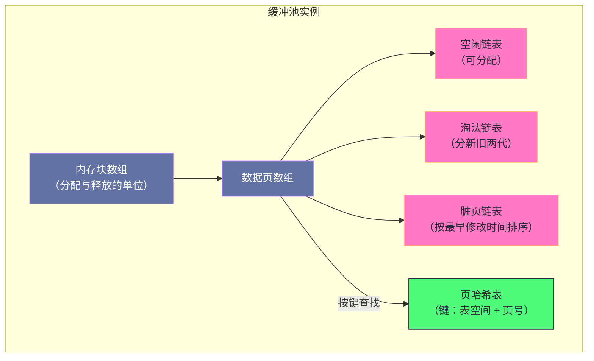
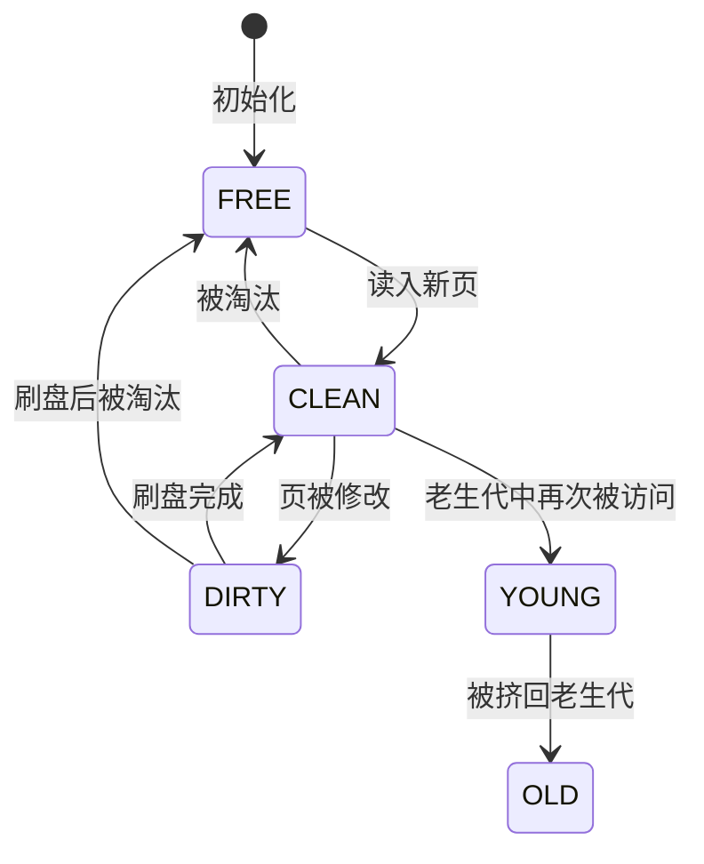

# 04. InnoDB 缓冲池：内存管理的分区革命与 NUMA 陷阱

**摘要：**

缓冲池是 InnoDB 性能的绝对核心——所有数据页的读写都必须经过它。它的职责是"用内存掩盖磁盘延迟"，因此它的设计围绕三个问题展开：**哪些页该留在内存**（淘汰算法）、**哪些页该提前加载**（预读）、**多个线程如何并发访问这张巨大的内存表**（并发控制）。这三个问题的答案分别是**双生代淘汰**、**按区预读**、以及**分区加锁**——而其中第三条的演进最剧烈：从"单实例一把全局锁"到"多实例"再到"实例内的哈希表与链表分区"，每一步都在削同一个瓶颈。本文按"为什么需要它 → 它由什么组成 → 页如何流转 → 并发如何拆解 → 生产上会踩什么坑"展开。先讲缓冲池的三个设计原则与它们的代价；再拆解五个核心组件（内存块、空闲链表、淘汰链表、脏页链表、页哈希表）与它们之间的引用关系；然后讲页的四种状态与状态机、双生代淘汰的动机与参数、预读的两种形式与随机预读被废弃的原因。接着重点剖析并发设计的演进：全局锁的问题、分区方案的页路由规则、以及"哪些部分至今没有分区"。之后是读页与刷脏两条路径的锁需求与 WAL 约束、NUMA 陷阱的成因与实测收益、参数矩阵与监控。最后是演进史、四处遗留设计、边界与常见误判。

---

## 第 1 章 为什么需要一个"内存中的磁盘"

### 1.1 两类存储的速度差

缓冲池存在的唯一理由是**内存与磁盘的速度差**。

**这个差距的量级很大**：内存的随机访问延迟在纳秒量级，而磁盘（即使是固态盘）在微秒到百微秒量级。**因此"每次都直接读磁盘"意味着把每条查询的延迟乘以几百倍。**

**而数据库的访问模式恰好适合缓存**：**它具备局部性**——**同一张表的相关数据往往会被反复访问**（例如"最近的下单记录""当前活跃用户"），因此"把热点留在内存"能带来极高的命中率。

**两个条件（速度差大、访问有局部性）合起来，就使"在内存里缓存磁盘页"成为一个必然选择。**

### 1.2 三个设计原则

缓冲池的设计遵循三个原则。

**原则一：空间换时间。** 用内存的高带宽与低延迟，掩盖磁盘的延迟。**这是所有缓存机制的共同思路**——**代价是内存的成本。**

**原则二：利用局部性。** 通过淘汰算法保留高频访问的页，**并通过预读机制提前加载"接下来可能要用"的页。** **这一条决定了"淘汰算法"与"预读机制"是缓冲池的两个核心子系统。**

**原则三：日志先行。** 脏页刷盘之前，必须确保对应的日志已经落盘。**这个约束保证了"崩溃后可以重放日志恢复数据"**（第 7 章展开）。

**三个原则里，前两个决定性能，第三个决定正确性**——**而它们之间存在张力**：**日志先行意味着"刷脏不能随意提前"**（必须等日志落盘），**这限制了"刷脏的速度"**——**而"刷脏不够快"正是缓冲池最典型的性能问题之一。**

### 1.3 不这样会怎样

如果没有缓冲池，或者缓冲池很小，会发生什么？

**后果一：每次访问都是一次磁盘 IO。** 即使是"读同一行数据"这种操作，**也会因为"页不在内存"而触发磁盘读**——**延迟从纳秒跳到微秒以上。**

**后果二：写入的代价无法摊薄。** 一次修改只影响页里的一小部分，**但刷盘的单位是整个页。** **因此"多次小修改"如果每次都要刷盘，写放大极其严重**（第 8 篇与第 10 篇展开写放大）。

**后果三：并发能力被磁盘限制。** 磁盘的并发 IO 能力远低于内存，**因此"并发访问同一批数据"会迅速被磁盘吞吐限制。**

**三条后果的共同特征是"它们都是'去掉一层缓存'的直接结果"**——**而这也解释了为什么"缓冲池大小"是 InnoDB 最重要的参数**：**它直接决定"多少数据能享受内存的速度"。**

### 1.4 缓冲池的代价

缓冲池也有代价，代价主要在三处。

**其一是内存成本。** 缓冲池通常占用物理内存的很大一部分，**因此留给操作系统页缓存与其他进程的内存变少**（第 1 篇与第 2 篇已展开这类竞争）。

**其二是并发开销。** 缓冲池是一个"被所有线程共享的巨大数据结构"，**因此它的每一次操作都需要并发保护**——**而"保护"本身的开销可能成为瓶颈**（这正是第 6 章要讲的核心问题）。

**其三是"脏页"带来的额外复杂度。** 因为"内存里的页可能与磁盘不一致"，**所以需要一套"何时刷、刷多少"的调度机制**——**而这套机制需要与日志、检查点、IO 能力协同**（第 7 章与第 9 篇展开）。

**三处代价的共同特征是"它们都源于'共享可变状态'"**：**内存成本源于"要放得下"，并发开销源于"多线程共享"，脏页复杂度源于"内存与磁盘可能不一致"。** **因此缓冲池的所有优化，本质上都在处理这三个方面之一。** **而这三个方面也是判断"某次优化是否有意义"的标尺——它是否让"放得下"更多、让"共享"更少冲突、或让"不一致"更可控。**

### 1.5 一个类比：图书馆的阅览室

把缓冲池类比成"图书馆的阅览室"会更容易理解它的结构。

**书库是磁盘**——书都在那里，但取书要走很远（慢）。

**阅览室是缓冲池**——**把常用的书搬到手边**（快），但座位有限。

**"空闲书架"对应空闲链表**——**它回答"还有没有空位"。**

**"最近常看的书放在手边、很久没看的书搬回书库"对应淘汰算法**——**它回答"该把谁搬走"。**

**"一次来了一百个人各借一本不同的书"对应全表扫描**——**如果没有规则，阅览室会被一次性访客占满**，**而常客反而没位置。** **双生代淘汰就是为了处理这种情况**：**新书先放在"临时区"，只有被反复借阅才移到"常驻区"。**

**"书被做了批注还没誊回原书"对应脏页**——**在誊回去之前，这本带批注的书不能搬回书库**（否则批注会丢）。**这正是"淘汰受制于刷脏"的类比形态。**

**这个类比的用处在于"它把五个组件的关系变成了一句可复述的流程"**：**找书 → 有位置吗 → 没有则搬走最久未借的（且已誊回的） → 新书放临时区 → 被反复借则移常驻区。** **而缓冲池的全部复杂度，都是"如何让这个流程在多个管理员同时操作时不冲突"。**

---

## 第 2 章 架构全景

### 2.1 五个核心组件

缓冲池由五个核心组件构成。

**第一个是"内存块"**：缓冲池的物理内存按固定大小的块划分（默认每块一百多兆），**它是"分配与释放的单位"**——**因此"在线调整缓冲池大小"是以块为粒度进行的。**

**第二个是"空闲链表"**：记录"哪些页是空闲的、可以被分配给新读取的页"。

**第三个是"淘汰链表"（LRU 链表）**：记录"哪些页正在被使用"，**并按访问新旧排序**，**用于决定"淘汰谁"。**

**第四个是"脏页链表"**：记录"哪些页已被修改但未落盘"，**并按"最早修改时间"排序**——**排序的目的是"按修改顺序刷盘"，从而让检查点能稳步推进。**

**第五个是"页哈希表"**：以"表空间加页号"为键，**用于快速判断"某个页是否已在缓冲池中"。**

**五个组件的关系是**：**哈希表回答"在不在"，空闲链表回答"能不能分配新的"，淘汰链表回答"该淘汰谁"，脏页链表回答"该刷谁"。** **四个问题覆盖了缓冲池的全部操作。**

### 2.2 全景图示

**图中值得注意的一点是"一个页可以同时出现在多个链表里"**：**一个脏页同时位于淘汰链表与脏页链表**。**因此"移动一个页"可能涉及多个链表的操作**——**这也是缓冲池并发控制复杂的原因之一**（第 6.4 节展开"哪些结构没有分区"）。

### 2.3 三张链表的分工

三张链表（空闲、淘汰、脏页）的分工值得单独说清楚，因为它们容易被混为一谈。

**空闲链表管"从未使用的页"**——**它的长度反映"缓冲池还有多少余量"。**

**淘汰链表管"正在使用的页"**——**它的长度反映"缓冲池装了多少数据"，而它的排序反映"谁更久没被访问"。**

**脏页链表管"已修改未落盘的页"**——**它的长度反映"还有多少数据需要落盘"，而它的排序反映"落盘的优先级"。**

**三者的关系是"一个页在生命周期中依次经过"**：**从空闲链表分配 → 进入淘汰链表 → 被修改后同时进入脏页链表 → 刷盘后离开脏页链表 → 被淘汰时回到空闲链表。**

**这条流转路径解释了一个关键的性能耦合**：**"淘汰一个页"需要它是干净的**——**因为脏页不能直接丢弃（会丢数据）。** **因此"淘汰速度"受"刷脏速度"限制**——**这正是第 1.2 节讲的"日志先行带来的张力"的具体形态。**

### 2.4 分区设计的动机

现代版本的缓冲池采用**分区设计**：**把哈希表与两张链表（空闲、淘汰）拆成多个分区，每个分区独立加锁。**

**动机是"减少锁竞争"**：**在分区之前，所有线程访问缓冲池都要争抢同一把锁**——**而"读页"这个操作极其频繁，因此这把锁成了最尖锐的瓶颈。**

**分区之后，不同线程操作不同分区时可以并行**——**而"是否落在同一分区"由页的标识决定**（第 6.3 节）。

**而"脏页链表至今没有分区"**（第 10 章展开）——**这意味着"刷脏路径"仍然是全局串行的。** **这个不对称很有意思**：**读路径被充分并行化了，而写路径的部分环节没有**——**因为"脏页链表的顺序"是检查点推进的依据，而分区会破坏这个全局顺序。**

**这条取舍值得留意**：**它说明"并发优化"不是"能拆就拆"**——**有些结构之所以保持全局，是因为它承载着"全局语义"**（这里是"按修改顺序刷盘"）。

---

## 第 3 章 页的状态流转

### 3.1 四种状态

一个缓冲页在生命周期中处于四种状态之一。

**空闲**：页完全空闲，位于空闲链表。

**干净**：页的内容有效、且与磁盘一致，**位于淘汰链表。**

**脏**：页的内容已被修改、与磁盘不一致，**同时位于淘汰链表与脏页链表。**

**而"新生代"与"老生代"是另一组维度**——**它们描述的是"页在淘汰链表中的位置"，而不是"页是否被修改"。** **因此"脏"与"老生代"是两个独立的维度**，**一个页可以是"脏且老生代"，也可以是"干净且新生代"。**

**这处区分很容易被混淆**，而它带来一个实践含义：**"老生代里的脏页"是最优先被刷盘的对象**——**因为它们既"该被淘汰"又"必须先刷盘"。**

### 3.2 状态转换

状态之间的转换由具体事件触发。

**从空闲到干净**：读入一个新页时（分配空闲页并读取磁盘）。

**从干净到脏**：页被修改时。

**从脏到干净**：页被刷盘完成时。

**从干净到空闲**：页被淘汰时。

**而在淘汰链表内部，还有一次"代际转换"**：**新读入的页进入老生代；如果在老生代停留足够久、且被再次访问，则晋升到新生代。**

**这次转换是"防扫描污染"的核心机制**（第 4 章展开）——**它是缓冲池里唯一一处"用时间维度判断价值"的设计。**

### 3.3 状态机图示

**图中最值得注意的是"脏页必须先变干净才能回到空闲"这条路径**——**它是"淘汰受制于刷脏"这条约束在状态机上的体现。** **因此当刷脏跟不上时，状态机会卡在"脏"这个状态上，而"分配空闲页"的请求就会等待**——**这正是"用户线程等待空闲页"这个监控指标的含义**（第 8.3 节）。

### 3.4 状态标记的作用

页描述符里有一组"状态标记位"，它们的作用值得单独说明。

**"是否在脏页链表"**——**它让"刷盘完成"这个动作能判断"该不该把页移出脏页链表"。**

**"是否在空闲链表"与"是否在淘汰链表"**——**它们让"链表操作"能判断"这个页当前在哪张链表上"**，**从而避免"重复插入"或"从错误的链表移除"。**

**"是否已被读取"**——**它区分"刚分配的页（内容无效）"与"已读入的页（内容有效）"。**

**"是否被访问过"**——**它用于"晋升判断"**（是否需要在老生代中做一次移动）。

**五类标记的共同作用是"用位标记表达'页当前的状态'，从而避免'依赖链表位置来判断状态'"**。**这个设计的意义在于"链表操作是昂贵的（需要加锁），而读一个位是廉价的"**——**因此"先用位判断，再决定是否做链表操作"能显著减少锁的获取次数。**

**这条优化思路在本专栏里反复出现**：**用"廉价的本地状态"避免"昂贵的共享操作"。** **它与第 2 篇讲的"会话级缓存避免全局锁"、第 1 篇讲的"能力标志避免探测行为"是同一类手法。**

---

## 第 4 章 双生代淘汰

### 4.1 朴素 LRU 的问题

**朴素的"最近最少使用"淘汰**有一个致命弱点：**它会被"一次性的大扫描"污染。**

**设想一次全表扫描**：它读取了大量页，**而这些页在扫描之后不会再被访问。** **但在朴素 LRU 下，这些页会进入链表头部，把原本的热点页挤到尾部并淘汰。**

**结果是"一次扫描把缓存洗了一遍"**——**而后续的正常查询会大量未命中。** **这类问题的表现很有特点**：**"平时命中率很高，但每隔一段时间（有报表任务时）命中率骤降"。**

### 4.2 双生代的解法

**双生代淘汰**把淘汰链表分成两段：**一段是"老生代"（新读入的页先进入这里），一段是"新生代"（真正被反复访问的页）。**

**关键规则是"新读入的页进入老生代，而不是新生代"**——**因此"一次性扫描"读入的页只会挤占老生代，而不会影响新生代里的热点页。**

**而"晋升"的条件是"页在老生代停留足够久之后又被访问"**——**这个条件筛掉了"只访问一次的页"（扫描页），保留了"会反复访问的页"。**

**这个设计的精妙之处在于"它用'访问间隔'而不是'访问次数'来判断价值"**：**因为扫描页也可能被访问两次（读页头与读数据），但两次之间间隔极短。** **因此"间隔足够久"才是"这是热点"的可靠信号。**

### 4.3 晋升条件与参数

晋升由两个参数控制。

**"老生代占比"**决定淘汰链表中多少比例属于老生代。**占比越大，新页越容易被挤掉**（因此更适合"扫描多、热点少"的场景）；**占比越小，新页越容易留下**（因此更适合"热点分散"的场景）。

**"最短停留时间"**决定"页必须在老生代待够多久，再次访问才算晋升"。**这个参数是"防污染"的核心**：**把它调大，扫描页更难晋升；调小则相反。**

**两个参数的关系是"一个管空间、一个管时间"**：**占比决定"老生代能容纳多少新页"，停留时间决定"新页需要证明自己多久"。**

**实践中这两个参数很少需要调整**——**因为默认值是在"通用场景"下取的平衡。** **只有"扫描比例极高"或"热点极度集中"这两类极端场景才需要动它们。**

### 4.4 淘汰策略

淘汰的策略是"从淘汰链表的尾部开始扫描，找到干净页并回收"。

**扫描的顺序是"从最久未使用的开始"**——**这符合"最不可能再用"的假设。**

**而"遇到脏页则跳过"**——**因为脏页不能被直接丢弃。** **跳过的代价是"扫描深度增加"**——**因此有一个参数限制"每轮扫描多少个页"。**

**如果扫描到限制深度仍未找到足够的干净页**，**那么触发"由用户线程参与刷脏"**——**这是一条"降级路径"**：**本该由后台线程完成的刷脏，被迫由请求线程自己做了。**

**这条降级路径的存在解释了那个关键监控指标**：**"用户线程等待空闲页"的次数持续增长，说明"缓冲池不足或刷脏太慢"**（第 8.3 节）。**而它的根因可能是"缓冲池太小"（工作集超出容量）或"刷脏能力不足"（磁盘 IO 不够）**——**两者的处置方向完全不同。**

---

## 第 5 章 预读

### 5.1 顺序访问的局部性

预读的动机是"**顺序访问的局部性**"：**如果刚读了一个页，那么"下一个页"很可能马上也要读。**

**这个假设在"范围查询"与"全表扫描"下成立**——**而在"随机点查"下不成立。** **因此预读是"押注于顺序访问"的机制**，**它的收益与风险都来自这个押注。**

### 5.2 线性预读

**线性预读**的触发条件是"**同一个区（一段连续的页）里被顺序访问的页数超过阈值**"。

**满足条件时，异步发起"该区剩余页"的读请求**——**"异步"意味着它不阻塞当前查询**，而是"提前把数据准备好"。

**较新版本对预读做了一处改进**：**预读进来的页不直接进入新生代，而是插入老生代的头部。** **这个改进的意义是"降低误判的代价"**——**如果预读押错了，那些页会很快从老生代被淘汰，而不会污染新生代。**

**这处改进与第 4 章的双生代是同一思路**：**"新来的东西先放在低优先级区域，证明自己之后再提升"。**

### 5.3 随机预读的废弃

**随机预读**是另一种预读：**当同一个区里被访问的页数超过阈值时（不要求顺序），预读该区的其他页。**

**它后来被废弃了**，原因是"**在固态盘时代收益甚微，而误判的代价依然存在**"。

**这个废弃值得说明，因为它体现了一条判断方式**：**一项优化是否值得保留，取决于"它押注的假设在当前硬件下是否仍成立"。** **随机预读押注的是"随机访问也有局部性"**——**而在"顺序访问已经很快（固态盘）"的前提下，这个押注的收益变小了，而风险没变。**

**因此"过时的优化"不一定是"错误的优化"**——**它可能只是"在当时的硬件下正确，而在现在的硬件下不划算"。**

### 5.4 预读的代价

预读的代价在两处。

**其一是"误判浪费"**：如果押错了，那么"读进来的页"占用了缓冲池空间与 IO 带宽，**而它们很快会被淘汰。**

**其二是"无法撤销"**：**预读一旦触发，已发出的异步读请求无法取消。** **因此"访问模式在中途改变"（例如查询被提前终止）不会让预读停下来。**

**两处代价的共同特征是"它们是'提前做'的必然代价"**——**任何预判机制都有"押错"的可能，而"提前"意味着"押错之后无法收回"。** **因此预读参数的设计目标是"只在把握较大时预读"，而不是"尽量多预读"。**

### 5.5 预读与淘汰的配合

预读与淘汰之间存在一层配合关系，值得单独说明。

**因为预读进来的页被放进"老生代"**，**所以它们必须与"正常读入的页"竞争同一个区域**——**如果预读量很大，那么老生代会被预读页占满，从而"正常读入的页"也更快被淘汰。**

**因此"预读阈值"与"老生代占比"是一组需要配合的参数**：**预读越激进，老生代就越需要留出更大空间**（否则正常页也会被挤掉）。

**这个配合关系解释了"为什么调参要考虑组合"**：**单独调大预读阈值（让它更容易触发）而不调老生代占比，可能导致"命中率反而下降"。** **这与第 1 篇讲的"可靠性配置组合生效"、第 3 篇讲的"缓存参数被两个缓存共享"是同一类问题**——**参数之间往往存在耦合，而"单独看某一个"无法判断效果。**

---

## 第 6 章 并发设计

### 6.1 全局锁的问题

在分区设计之前，缓冲池的哈希表与链表由**一把全局锁**保护。

**问题在于"读页"这个操作极其频繁**：**每条 SQL 的每一次页访问都要走这条路径。** **因此"所有线程串行地抢同一把锁"成为系统最尖锐的瓶颈**——**表现为"CPU 使用率不高但吞吐上不去"**（因为线程都在等锁）。

**这类瓶颈的特点很值得记住**：**它不表现为"资源饱和"，而表现为"资源闲置但吞吐受限"**——**因为瓶颈是"串行化的临界区"，而不是"某种资源的吞吐"。** **因此识别它的方法不是"看资源使用率"，而是"看锁等待"**（第 8.3 节）。

### 6.2 分区方案

分区方案的思路是"**把一把大锁拆成多把小锁，并让"访问同一个页的线程"仍互斥、"访问不同页的线程"可以并行**"。

**具体做法是把哈希表与两张链表（空闲、淘汰）各拆成若干分区，每分区一把锁。** **分区数被硬编码为一个较大的值**（因此不是"按 CPU 核数自适应"的）——**这个选择保证了"行为可预期"**，代价是"核数很少时也有固定开销"。

**页被路由到哪个分区由"页标识的哈希"决定**——**因此"同一个页"总是落在同一个分区，而"不同的页"大概率落在不同分区。**

### 6.3 页路由规则

路由规则是"**用表空间标识与页号算出一个分区索引**"。

**这条规则有两个值得留意的性质。**

**性质一：同一张表的相邻页会分散到不同分区。** 因为页号参与运算，**所以"连续读同一张表"的操作会均匀打散到各分区**——**这正是"读密集场景吞吐提升显著"的原因。**

**性质二：路由是确定性的。** **任何线程都能独立算出"某个页属于哪个分区"**，**因此"查找"这个操作只需要拿一个分区的读锁。** **这与第 1 篇讲的"用哈希做确定性分配"是同一手法**：**用可计算的映射替代需要查询的映射。**

### 6.4 哪些部分没有分区

一处关键的不对称是：**脏页链表没有分区。**

**原因是"它承载全局语义"**：**脏页链表的顺序是"按最早修改时间排序"，而"检查点的推进"依赖这个顺序**——**检查点需要知道"最早未刷盘的修改是哪个"，而这个信息只有全局有序才能得到。**

**因此"分区"会破坏这个语义**——**这也是为什么"读路径被充分并行化，而刷脏路径没有"。**

**这条不对称带来的实践含义是**：**在"高并发写入"场景下，"刷脏路径的全局锁"仍可能成为瓶颈**——**而这正是"部分分支已经实现了分区脏页链表、但主线尚未合并"这个现状的背景**（第 10 章展开）。

**它也给出一条通用判断**：**评估一个并发优化是否可行时，先问"这个结构是否承载全局语义"。** **承载全局语义的结构（有序链表、全局计数器、检查点）很难被分区**——**而它们的瓶颈需要换一种方式解决**（例如"把语义本身改掉"，而不是"把结构拆开"）。

---

## 第 7 章 读页与刷脏路径

### 7.1 读页路径

读页路径可以分成"命中"与"未命中"两条分支。

**命中时**：算出分区 → 拿该分区的读锁 → 查哈希表 → 找到页 → **做"晋升判断"**（是否满足晋升条件）→ 返回。

**未命中时**：**先分配一个空闲页**（这需要拿"空闲/淘汰分区"的锁）→ **再把新页插入哈希表**（这需要拿"哈希分区"的写锁）→ **发起磁盘读**。

**两条分支的锁需求不同**：**命中路径只需要"哈希分区的读锁"**（因为查找是只读的），**而未命中路径需要"哈希分区的写锁"与"淘汰分区的锁"。** **因此"未命中的开销"显著高于"命中"**——**这也是"命中率"成为核心指标的原因**（第 8.3 节）。

**一处细节是"分配空闲页可能跨分区"**：**如果本分区没有空闲页，就需要从其他分区"借"**——**而这会引入"同时持有两把锁"的情况**，**因此需要小心锁的顺序以避免死锁。** **这类"跨分区操作"是分区设计中常见的复杂度来源。**

### 7.2 刷脏路径

刷脏路径的关键约束是"日志先行"。

**刷一个页之前，必须确认"这个页的所有修改对应的日志都已落盘"**——**因为"页落盘而日志未落盘"会导致崩溃后无法恢复**（第 1 篇讲的 WAL 原理）。

**因此刷脏的第一步是"检查日志是否已落盘到该页的最新修改位置"**——**如果没有，则先把日志推到那个位置。**

**然后设置"IO 状态"标记**（防止"正在刷的页被其他线程淘汰或重复刷"），**发起异步写**，**完成时清除标记并把页移出脏页链表。**

**这条路径有两处值得留意。**

**其一："先推日志"意味着"刷脏速度受日志刷盘速度限制"**——**因此"日志刷盘策略"（第 7 篇展开）会间接影响"刷脏能力"。**

**其二："IO 状态标记"是必要的**——**它防止"同一个页被两个线程同时刷"（浪费 IO）或"正在刷的页被淘汰"（数据丢失）。** **这类"状态标记"是所有异步 IO 场景的标配。**

### 7.3 两条路径的锁需求对比

把两条路径的锁需求并列，可以看出它们的差异。

| 路径 | 哈希分区锁 | 淘汰分区锁 | 脏页链表锁 |
|---|---|---|---|
| 读命中 | 读锁 | 无（晋升可能短暂持锁） | 无 |
| 读未命中 | 写锁 | 需要 | 无 |
| 刷脏（发起） | 无 | 无 | 需要（全局） |
| 刷脏（完成） | 无 | 无 | 需要（全局） |

**这张表最值得注意的是"刷脏路径的两端都需要全局锁"**——**而"读路径"已经完全不需要全局锁。** **这个对比清楚地说明了"为什么读密集场景的优化效果显著，而写密集场景的优化有限"。**

**它也提示了"高并发写入场景的优化方向"**：**不是"继续拆读路径"（它已经不争用了），而是"想办法减少刷脏路径对全局锁的依赖"。** **而这类改动的难点在于"它涉及全局语义"**（第 6.4 节）。

### 7.4 一个重要的约束：淘汰受制于刷脏

把前面几条合起来，可以得到一条重要的约束：**"淘汰受制于刷脏"。**

**因为"脏页不能被直接淘汰"**（会丢数据），**所以"淘汰一个页"的前提是"它是干净的"。** **而当"脏页很多"时，"淘汰链表的尾部可能全是脏页"**——**于是淘汰会一路跳过它们、扫描到限制深度、最终触发"用户线程参与刷脏"。**

**这条约束解释了一个常见的现象**：**"缓冲池明明没满，但出现了等待空闲页"**——**因为"没满"指的是"空闲链表还有余量"，而"等待"可能来自"淘汰链表的尾部全是脏页、无法回收"。**

**因此排查这类问题时，正确的观察是"脏页比例"与"刷脏速度"**，**而不是"缓冲池使用率"。** **这个区分与第 1 篇讲的"参数调整要有内核依据"是同一条纪律**——**知道"淘汰受制于刷脏"，才知道该看哪个指标。**

### 7.5 刷脏策略的三种模式

刷脏的"节奏"由三种策略共同决定，理解它们的配合有助于判断"该调哪个"。

**第一种是"按需刷脏"**：当"需要空闲页但淘汰链表的尾部全是脏页"时，触发刷脏。**它是被动的**——**因此它的后果就是"请求线程被迫等页"。**

**第二种是"按比例刷脏"**：当"脏页比例超过阈值"时，主动刷脏。**它是主动的**——**目的是"在脏页积累过多之前就开始清理"。**

**第三种是"按检查点刷脏"**：为了保证"检查点能稳步推进"，**必须让"最早未刷盘的修改"不断前移**——**因此当检查点年龄接近日志容量时，刷脏会被强制加速。**

**三种策略的关系是"层层兜底"**：**比例刷脏是日常手段，检查点刷脏是"避免日志写满"的硬约束，按需刷脏是"最后的降级"。** **而"按需刷脏"被触发得越多，说明前两者没有跟上**——**这正是"等待空闲页"这个指标的意义。**

**这条分层结构解释了一个常见困惑**：**"为什么调大了 IO 能力但问题依旧"**——**因为如果"检查点刷脏"在频繁触发，说明瓶颈是"日志容量不足"或"写入量过大"，而不是"IO 能力不足"。** **因此判断"该调什么"的前提，是"知道是哪一层在兜底"。**

---

## 第 8 章 生产落地

### 8.1 NUMA 陷阱：一个典型的"配置未适配硬件"

**现象**：双路服务器上，CPU 使用率不高但吞吐上不去；性能剖析显示大量内存初始化类的调用。

**根本原因**是"**内存分配没有跨节点交错**"：**进程启动时运行在某个节点上，而内存分配默认绑定到当前节点**——**于是缓冲池的内存大部分落在了一个节点上，而工作线程分散在两个节点。**

**后果是"跨节点访问"**：**落在另一节点上的线程访问缓冲池时，要走"节点间互联"**，**延迟显著增加、带宽受限。** **而缓冲池恰好是"访问极其密集"的结构**——**因此这个延迟被放大。**

**解法是"启用内存交错分配"**：**让缓冲池的内存均匀分布在各个节点上**，**从而让"每个线程的访问大概率落在本地节点"。**

**实测收益很显著**：**远程访问比例大幅下降，吞吐有明显提升。** **而这一项收益的代价是"一个配置项"。**

**这个案例的普遍意义在于**：**"硬件演进"会引入新的性能陷阱，而"软件默认值"往往滞后于硬件。** **因此"配置审查"应当包含"是否适配了当前的硬件形态"这一项**——**而 NUMA 只是其中一类**（还有"固态盘下的刷盘策略""大核数下的并发结构"等）。

### 8.2 参数与它的内核依据

| 参数 | 内核依据 | 调整方向 |
|---|---|---|
| 缓冲池大小 | 决定"多少数据能常驻内存" | 留出内存给系统与其他进程 |
| 缓冲池实例数 | 减少实例级全局资源的争用 | 与核数匹配，避免实例过小 |
| 缓冲池块大小 | 扩容缩容的最小单位 | 生产环境不建议修改 |
| 老生代占比 | 决定"新页进入后能留多久" | 扫描极多时调高 |
| 老生代最短停留时间 | 决定"新页需证明多久才晋升" | 防污染的核心旋钮 |
| 每轮淘汰扫描深度 | 决定"一轮尝试回收多少页" | 固态盘可调低 |
| IO 能力基线 | 后台刷脏的 IO 上限 | 与磁盘实际能力匹配 |
| 邻近页刷新 | 机械盘时代优化 | 固态盘应关闭 |
| 内存交错 | 适配 NUMA 架构 | 现代多路服务器应开启 |
| 自适应刷脏 | 动态调整刷脏速率 | 默认开启，防 IO 尖刺 |

**这张表里最值得留意的是"邻近页刷新"这一项**：**它是"机械盘时代"的优化**（把相邻的脏页一起刷，减少寻道），**而在固态盘上它没有收益、反而增加延迟。** **这与第 5.3 节讲的"随机预读被废弃"是同一类现象**——**"当时的优化"在硬件换代后可能变成"纯粹的负担"。**

**因此"参数审查"不只是"看值是否合理"，还要看"这个参数背后的假设是否还成立"。**

### 8.3 监控要点

缓冲池的监控有四类核心指标。

**第一类：命中率。** 它回答"多少访问不需要磁盘"。**而它的判据不是"越高越好"，而是"是否稳定"**——**因为"命中率偶尔下降"通常对应"有扫描任务"，而"持续下降"才说明"工作集超出了容量"。**

**第二类：脏页比例。** 它回答"还有多少数据没落盘"。**它持续偏高说明"刷脏能力不足"**——**而处置方向是"提升 IO 能力"或"降低写入压力"，而不是"加内存"。**

**第三类：检查点年龄。** 它回答"最早未刷盘的修改距今多远"。**它接近日志容量说明"刷脏严重滞后"**——**而这会直接威胁"崩溃恢复时间"。**

**第四类：等待空闲页的次数。** 它回答"请求线程是否被迫等页"。**它持续增长说明"缓冲池不足或刷脏太慢"**（第 4.4 节）——**而这两个原因的处置方向完全不同，因此需要结合前两类指标区分。**

**四类指标的关系是"从结果到原因"**：命中率与等待是结果，脏页比例与检查点年龄是原因。**按这个顺序看，就能从"变慢"定位到"是容量不足还是刷脏不足"。**

### 8.4 排查决策树

把上述指标组织成一条排查路径。

**命中率低时**，先分"工作集超出容量"还是"预读污染"：**前者需要加缓冲池或优化查询，后者需要调整预读参数。**

**等待空闲页增长时**，先分"内存不足"还是"刷脏太慢"：**前者加缓冲池，后者提升 IO 能力并检查磁盘利用率。**

**出现跨节点访问时**，检查是否启用了内存交错、以及操作系统的内存策略。

**在旧版本上出现"资源闲置但吞吐受限"时**，考虑是否是"全局锁竞争"——**而处置方向是"升级到分区版本"，而不是"调参数"。**

**这条决策树的形状与第 6 章的并发结构是对应的**：**前三类问题都在"容量与调度"层面，第四类在"并发结构"层面。** **而第四类是唯一一类"调参数无效"的问题**——**因为瓶颈在代码结构，而不在配置。**

### 8.5 一次"吞吐上不去"的排查推演

把排查路径串成一个案例。

假设现象是"CPU 使用率约 30%，但吞吐在某个并发数之后不再增长"。

**第一步，判断瓶颈是"资源饱和"还是"临界区串行化"。** **如果 CPU、磁盘、内存都不紧张，而吞吐停滞，那么方向在"临界区"**——**因为"资源饱和"会表现为某项资源接近上限。**

**第二步，确认是"哪一类临界区"。** 观察锁等待相关的指标：**如果等待集中在缓冲池相关的锁上，那么方向在缓冲池的并发结构；如果集中在其他锁上（如元数据锁、行锁），方向就不同。**

**第三步，确认版本是否已包含分区优化。** **如果版本较旧，那么"全局锁竞争"是默认的根因**——**而处置方向是升级，而不是调参。**

**第四步，如果版本已包含分区优化，检查是否"分区未被有效利用"。** 例如**"缓冲池实例数"设置过小**（导致实例内分区虽多但实例级资源仍争用），**或"访问模式高度集中"**（大量线程访问同一小批页，因此总落在同一分区）。

**第五步，检查是否有"结构性问题"导致分区无效。** 例如"脏页链表仍是全局的"（第 6.4 节）——**如果负载是"高并发写入"，那么瓶颈可能在刷脏路径上，而它没有被分区。**

**五步的价值在于"每一步都在缩小范围"**：从"是否临界区"到"哪一类临界区"到"是否版本问题"到"分区是否有效"再到"是否有未分区的结构"。**而它的起点是"区分资源饱和与临界区串行化"**——**这两者的处置方向完全不同**（前者加资源，后者改结构）。

---

## 第 9 章 演进史

### 9.1 关键节点

| 版本 | 变化 | 动因 |
|---|---|---|
| 4.0 | 引入缓冲池，单实例全局锁 | 首次集成 |
| 5.5 | 支持多实例 | 减少实例级锁竞争 |
| 5.6 | 引入"老生代最短停留时间" | 防全表扫描污染 |
| 5.7 | 支持在线调整大小 | 弹性伸缩，无需重启 |
| 8.0.21 | 哈希表与两张链表分区 | 解决实例内锁竞争，读密集场景提升显著 |
| 8.0.25 | 内存交错默认开启（编译启用时） | 适配现代多路架构 |
| 8.0.34+ | 实验性支持新一代异步 IO 接口 | 降低异步 IO 的系统调用开销 |

**这条演进线有一条清晰的主线：不断削同一个瓶颈——"并发访问共享结构"。** 从"单实例全局锁"到"多实例"再到"实例内分区"，**每一步都在把"更大的锁"换成"更小的锁"。**

**而每次削完之后，瓶颈会转移到"下一个还没被拆的部分"**：**读路径拆完了，就轮到刷脏路径**（第 10 章）。**这条"瓶颈转移"的规律是所有并发优化的共同形态**——**因此"优化"不是一次性的，而是"跟着瓶颈走"。**

### 9.2 四处遗留设计

**第一处：脏页链表仍是全局结构。** 它在高并发写入下仍可能成为瓶颈，**而处置需要"改掉全局语义"**（例如用"分组刷盘 + 组间协调"替代"全局有序链表"）。

**第二处：淘汰仍需线性扫描。** 即使分区化，**淘汰仍要遍历本分区的链表尾部**，**而扫描深度与缓冲池容量正相关**——**因此"缓冲池越大，单次淘汰的开销越大"。**

**第三处：预读无法撤销。** 已发出的预读请求无法取消，**因此"访问模式中途改变"会造成浪费。**

**第四处：压缩表与独立链表耦合。** 压缩表的解压页存放在独立链表里，**与主链表协同淘汰**——**逻辑复杂且容易产生碎片。** 而当前趋势是"不再推荐压缩表，改用透明页压缩"（后者不占缓冲池内存）。

**四处遗留设计的共同特征是"它们都是'分层缓存'的复杂度"**：**缓冲池本身是一层缓存，而"压缩页"与"预读页"又在它内部形成了子缓存。** **多层缓存的一致性维护成本很高**——**这也解释了为什么"透明页压缩"（不占缓冲池）会成为替代方向。**

### 9.3 演进方向

**方向一：持久内存的挑战。** 如果数据文件可以直接映射到"字节可寻址、断电不丢"的内存上，**那么"缓冲池"可能不再是必需品**——**因为"页可以直接在持久内存上读写，只需日志保证一致性"。** **这会把"两层存储"压缩成"一层"，从而消掉整个缓冲池的复杂度。**

**方向二：新一代异步 IO 接口。** 它能减少系统调用次数、支持批量提交与资源注册——**因此"单次 IO 的开销下降"，进而提升刷脏能力。**

**方向三：用内核能力做冷热识别。** 部分分支已实验性地用内核的页访问统计替代被动的 LRU 晋升——**这实际上是把"猜测哪些页热"换成了"直接观测哪些页热"。**

**三个方向的共同特征是"它们都在削弱缓冲池这个组件本身的存在理由或核心机制"**：**持久内存削弱"缓冲池的必要性"，异步 IO 削弱"刷脏的瓶颈"，内核观测削弱"淘汰算法的必要性"。** **这提示了一条判断方式：当一个组件被持续优化了二十年之后，下一步的演进往往不是"继续优化它"，而是"想办法让它不再必需"。**

---

## 第 10 章 边界与反例

### 10.1 反例一：把"缓冲池使用率高"当作"性能问题"

使用率高是正常的（它意味着缓存在发挥作用）。**真正的判据是命中率是否稳定、以及是否有等待空闲页**（第 8.3 节）。

### 10.2 反例二：把"等待空闲页"一律归因于"缓冲池太小"

它也可能来自"刷脏太慢导致淘汰链表的尾部全是脏页"（第 7.4 节）。**两个原因的处置方向完全不同。**

### 10.3 反例三：在固态盘上保留"机械盘时代的优化"

邻近页刷新、随机预读这类优化**在固态盘上没有收益、反而增加开销**（第 8.2 节）。**参数审查应当包含"这个参数背后的假设是否还成立"。**

### 10.4 反例四：把"资源闲置但吞吐受限"当作"参数没调好"

这类现象的根因通常是"全局锁竞争"——**而它是代码结构问题，调参数无效。** 处置方向是升级到已优化的版本（第 6.1 节）。

### 10.5 反例五：在多路服务器上忽略内存交错

内存分配默认绑定当前节点，**而工作线程分散在多个节点**——**因此"跨节点访问"会成为隐蔽的瓶颈**（第 8.1 节）。

### 10.6 反例六：把"预读"当作"总是有益"

预读是"押注顺序访问"，**因此它在随机访问场景下是纯浪费**（第 5.4 节）。**而它一旦触发就无法撤销。**

### 10.7 反例七：把"脏页比例高"当作"需要加内存"

脏页比例高说明"刷脏能力不足"，**而加内存只会让"需要落盘的数据更多"。** **正确的方向是"提升 IO 能力"或"降低写入压力"。**

### 10.8 反例八：把"缓冲池参数"当作彼此独立

预读阈值与老生代占比存在配合关系（第 5.5 节），缓冲池大小与实例数也存在配合（实例过小会导致实例级争用）。**把它们当作独立参数逐个调整，会得到"调了 A 之后 B 变得不合适"的结果。**

---

## 第 11 章 落点

回到开头的问题：为什么需要一个"内存中的磁盘"？

答案是**内存与磁盘的速度差**，加上**访问的局部性**——**两个条件合起来，让"在内存里缓存磁盘页"成为必然选择。** 而缓冲池的全部复杂度，都来自这个选择带来的三个后果：**要放得下**（因此需要淘汰算法）、**要提前准备**（因此需要预读）、**要被多线程共享**（因此需要并发控制）。

**这三条主线恰好对应了缓冲池二十年演进的三条轨迹**：淘汰算法从"朴素 LRU"走到"双生代"，预读从"两种都开"走到"只留线性"，并发控制从"一把全局锁"走到"实例内分区"。**而三条轨迹的共同特征是"它们都在处理同一个问题的不同侧面——如何在有限的资源下最大化命中率，且不让并发成为瓶颈"。** **它们也说明了另一件事：优化的空间是"分阶段释放"的**——**每解决一个瓶颈，下一个才会显现出来。**

**而这次演进留下的一条最有价值的经验是"瓶颈会转移"**：**读路径的锁被拆掉之后，瓶颈转到了刷脏路径**；**而刷脏路径之所以难以拆，是因为它承载着全局语义**（第 6.4 节）。**因此"优化"不是一次性的工作，而是"跟着瓶颈走"的持续过程**——**而判断"下一个瓶颈在哪"，取决于"哪些结构承载着无法被拆分的全局语义"。**

**另一条经验是关于"过时优化"的判断：一个参数背后的假设是否还成立，比参数本身的值更重要。** 邻近页刷新与随机预读都是"机械盘时代"的优化，**而它们的假设（寻道昂贵、随机访问也有局部性）在固态盘时代已不再成立**——**因此它们从"优化"变成了"负担"。** **定期复查"每个参数押注的是什么假设"，是避免这类负担累积的有效方式。**

---

## 专栏导航

- 上一篇：[[03. 数据字典：.frm 的葬礼与原子 DDL 的二十年偿债]]。
- 下一篇：[[05. InnoDB 插入缓冲：从 Insert Buffer 到 Change Buffer 的二十年演进]]。
- 返回专栏首页：[[00 专栏导览]]。

---

## 参考资料

1. MySQL 8.0.33 源码：`storage/innobase/buf/buf0buf.cc`、`buf0lru.cc`、`buf0flu.cc`、`storage/innobase/include/buf0buf.h`、`buf0buf.ic`.
2. MySQL. MySQL Internals Manual: InnoDB Buffer Pool. https://dev.mysql.com/doc/internals/en/
3. Oracle Blogs. MySQL 8.0.21: InnoDB Buffer Pool Partitioning. https://dev.mysql.com/blog-archive/
4. MySQL. 官方文档：InnoDB Buffer Pool Configuration（innodb_buffer_pool_size、instances、chunk_size、old_blocks_*）. https://dev.mysql.com/doc/refman/8.0/en/innodb-buffer-pool.html
5. MySQL. 官方文档：Configuring InnoDB Buffer Pool Flushing（io_capacity、adaptive_flushing、flush_neighbors）. https://dev.mysql.com/doc/refman/8.0/en/innodb-configuring-io-capacity.html
6. Percona Live. NUMA and MySQL: Still a Performance Trap. 2024.
7. Linux Kernel Documentation. io_uring. https://www.kernel.org/doc/html/latest/io_uring/
8. MySQL. 官方文档：InnoDB Buffer Pool LRU 与预读（old_blocks_pct、read_ahead_threshold）. https://dev.mysql.com/doc/refman/8.0/en/innodb-performance-midpoint_insertion.html
9. MySQL. 官方文档：SHOW ENGINE INNODB STATUS 中缓冲池与日志段的解读. https://dev.mysql.com/doc/refman/8.0/en/innodb-standard-monitor.html
10. MySQL. 官方文档：NUMA 与 innodb_numa_interleave 参数说明. https://dev.mysql.com/doc/refman/8.0/en/innodb-parameters.html
11. MySQL. 官方文档：InnoDB 内存结构与缓冲池实例的划分规则. https://dev.mysql.com/doc/refman/8.0/en/innodb-buffer-pool.html
12. MySQL. 官方文档：Performance Schema 中缓冲池与锁等待相关的监控表. https://dev.mysql.com/doc/refman/8.0/en/performance-schema-wait-tables.html

---

> [!note] 思考题
> 1. 缓冲池的三个设计原则（空间换时间、利用局部性、日志先行）分别决定了它的哪个子系统？
> 2. 双生代淘汰为什么用"访问间隔"而不是"访问次数"来判断价值？
> 3. 为什么"脏页链表"至今没有分区？这条不对称带来了什么实践含义？
> 4. "淘汰受制于刷脏"这条约束，如何解释"缓冲池没满却出现等待空闲页"这个现象？
> 5. "瓶颈会转移"这条规律，如何解释缓冲池二十年演进的三条轨迹？
