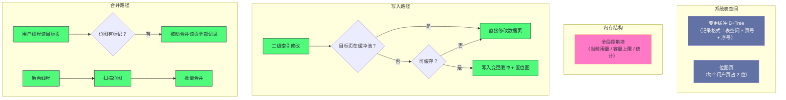

# 05. InnoDB 插入缓冲：从 Insert Buffer 到 Change Buffer 的二十年演进

**摘要：**

插入缓冲解决的是一个很具体的性能问题：**二级索引的修改是随机的，而随机写很慢。** 它的思路是"把离散的随机写先攒起来、等目标页被读入内存时再批量合并"——**用一次顺序写替代多次随机写。** 这个思想诞生于机械硬盘时代，并在后续版本从"只缓存插入"扩展到"也缓存更新与删除"，因此名字从"插入缓冲"改成了"变更缓冲"。本文按"问题是什么 → 机制长什么样 → 什么时候能用 → 怎么合并 → 现在还值不值得用"展开。先说明二级索引的写入模式为什么随机、以及这个机制的三条设计原则与它们的代价；再拆解它的存储结构（位图页与缓冲记录）与准入控制（六条条件，其中"唯一索引不能缓冲"是根本限制）；然后讲合并的两条路径（被动与主动）与它们的配合、写入与合并两条流程的锁需求。之后是"积压引发查询雪崩"这个典型案例、参数矩阵与监控。最后是演进史、四处遗留设计、以及一个务实的重估：**在固态盘普及之后，这个机制的收益已经缩水到百分之几，而在特定条件下"关掉它反而更好"。**

---

## 第 1 章 一个"随机写"问题

### 1.1 二级索引的写入模式

要理解这个机制，先要理解"为什么二级索引的修改是随机的"。

**聚簇索引（主键索引）的插入通常是有序的**——如果主键是自增的，那么新记录总是追加到最后一个页，**这是顺序写。**

**而二级索引的插入是随机的**——因为二级索引的键（例如"商品编号"）**与插入顺序无关**。**一条新记录的主键可能很大，但它的二级索引键可能落在索引树的任意位置。**

**因此"插入一条记录"这件事，在聚簇索引上是顺序的，在二级索引上是随机的。** **而随机写恰好是磁盘最不擅长的操作**（第 2 篇已展开"随机与顺序的量级差"）。

### 1.2 为什么随机写代价高

**在机械硬盘上，随机写的代价主要来自"寻道"**：每次写一个不同位置的页，磁头都要移动——**而移动的时间是毫秒级的。**

**更麻烦的是"写放大"**：**一次修改只改页里的一小部分，但刷盘的单位是整个页。** **因此"随机修改很多页"意味着"随机写很多整页"**——**这既浪费带宽，也浪费磁盘寿命。**

**还有一个隐蔽的代价**：**"随机修改"会把原本可能连续访问的页打散**——**因为二级索引页的物理位置与访问顺序无关**，所以"按二级索引遍历"会退化成"大量随机读"。

**三处代价的共同特征是"它们都源于'二级索引键与插入顺序无关'这个事实"**——**而这个事实无法改变**（因为二级索引的键是业务决定的）。**因此只能改变"写入的方式"，而不能改变"写入的分布"。**

### 1.3 三条设计原则

这个机制遵循三条设计原则。

**原则一：随机转顺序。** **把"多次离散的随机写"变成"一次顺序写"**——**具体做法是"先写到一棵专门的树里"（这棵树在系统表空间里，写入位置相对集中），**待目标页被读入内存时再合并。

**原则二：延迟合并。** **不做实时修改，而是"攒起来等机会"**——**这个"等"的收益是"批量应用"**（一次合并处理该页的所有缓冲记录），**代价是"在这段时间里，索引的实际内容与缓冲记录不一致"。**

**原则三：持久化。** **缓冲记录本身要落盘、要记日志**——**因为如果它只存在内存里，那么崩溃后会丢失，而"丢失缓冲记录"意味着"索引里少了修改"。**

**三条原则里，前两条决定收益，第三条决定正确性**——**而第三条的存在使得"这个机制本质上是一次'延迟执行的写'"**：**它把"立刻改"变成了"记下来稍后改"，因此必须保证"记下来的东西不会丢"。**

### 1.4 这个机制的代价

这个机制有四处代价。

**其一：内存占用。** 缓冲记录要占用缓冲池空间（它有容量上限，**因为"无限占用"会挤掉数据页**）。

**其二：读路径的不确定性。** **因为"目标页可能有待合并的记录"，所以"读一个页"之前要先检查"有没有待合并的东西"**——**而如果需要合并，读操作就要额外承担合并的开销**（这正是第 8.1 节那个典型案例的成因）。

**其三：机制本身的复杂度。** 它引入了一套"位图 + 独立树 + 准入控制 + 合并调度"，**而这些都需要维护与调优。**

**其四：它只对"非唯一二级索引"有效。** **唯一索引必须实时校验唯一性，因此无法延迟合并**（第 5.2 节）——**这意味着"为了用它而把唯一索引改成普通索引"会牺牲约束能力。**

**四处代价的共同特征是"它们是'延迟'的对价"**：**延迟换来批量效率，代价是"内存占用""读路径不确定""复杂度"与"适用面受限"。** **而"适用面受限"这一条最值得留意**——**因为它决定了这个机制的收益上限。**

### 1.5 一个类比：快递代收点

把变更缓冲类比成"快递代收点"会更容易理解它的结构。

**"直接送达"对应"直接修改目标页"**——**它需要收件人在家（页在内存），否则就要跑一趟（随机 IO）。**

**"代收点"对应变更缓冲**——**快递员把包裹放在代收点（顺序写），等收件人路过时再取（合并）。** **这样快递员不用为每一件都跑一趟。**

**"代收点的登记本"对应位图**——**它回答"这个人的包裹在不在代收点"。**

**"取件时把当天的包裹一次取走"对应被动合并**——**而"如果包裹积压很多，取件时要等很久"正是"查询偶尔超时"的类比形态。**

**"代收点定期清空积压"对应主动合并**——**它避免积压无限增长。**

**"有些包裹不能代收"对应准入控制**——**例如"需要本人当面签收的"（唯一索引必须实时校验）。**

**这个类比的用处在于"它把四处代价都变成了可感知的日常经验"**：**代收点占地方（内存占用）、取件时要等（读路径不确定）、要有登记本与清空规则（复杂度）、有些件不能代收（适用面受限）。** **而"积压"这个核心指标，就对应"代收点堆了多少件没取"。**

---

## 第 2 章 命名演进与架构全景

### 2.1 从插入缓冲到变更缓冲

这个机制的命名经历过一次变化，而变化的含义值得说明。

**早期版本只缓存"插入"**——因为当时认为"插入是随机写的主要来源"。

**后续版本扩展到"也缓存删除标记与物理删除"**——**因为"更新"实际上等价于"删除旧记录 + 插入新记录"，而"清理（PURGE）"则产生物理删除。** **因此"更新"与"清理"同样面临随机写问题。**

**改名这件事本身不重要，重要的是它揭示的判断**：**"随机写"这个问题的来源不只是"插入"**——**任何"修改二级索引"的操作都会产生随机写。** **因此"只解决插入"是一个不完整的解法。**

### 2.2 三种被缓存的操作

扩展到变更缓冲之后，它缓存三种操作。

| 操作 | 触发场景 | 合并时的动作 |
|---|---|---|
| 插入 | 新增记录 | 在索引页中插入记录 |
| 删除标记 | 更新记录（旧版本被标记删除） | 在索引页中标记删除 |
| 物理删除 | 后台清理已标记的记录 | 从索引页中真正删除 |

**三种操作里，"删除标记"与"物理删除"的区分体现了引擎的多版本设计**：**更新不立即删除旧版本，而是"标记删除"**（因为可能还有旧版本的事务需要读到它），**真正删除由后台清理完成。**

**因此"变更缓冲要缓存两种删除"**——**而它们的合并动作不同**（一个标记、一个真删）。**这也解释了"缓冲记录里为什么需要操作类型字段"**——**因为同一个目标页上的缓冲记录可能包含多种操作。**

### 2.3 架构全景

**图中值得注意的一点是"读路径上出现了合并"**：**读一个页时如果发现它有缓冲记录，就要先把它们合并进去。** **这条边（从"读"到"合并"）正是第 1.4 节讲的"读路径不确定性"的体现**——**它也是"积压会导致查询变慢"这个现象的机制来源。**

---

## 第 3 章 位图页

### 3.1 为什么需要位图

一个自然的问题是：**怎么知道"某个页有没有待合并的记录"？**

**最直接的做法是"每次读页时去查变更缓冲的那棵树"**——**但这意味着"每次读页都多一次索引查找"**，**而"读页"是极其频繁的操作**（第 4 篇已展开）。**这个开销不可接受。**

**位图的作用就是"用极低的成本回答这个问题"**：**它在每个用户表空间里预留一个页，用一个位标记"某个用户页有没有缓冲记录"。** **因此"判断有没有"退化成"读一个位"。**

**这个设计的思路与第 4 篇讲的"状态标记位"是同一类**：**用"廉价的本地状态"避免"昂贵的共享查询"。** **区别在于这里的状态是"持久化的"**（因为位图必须在重启后仍然有效）。

### 3.2 布局与编码

位图的布局是"每个用户页占 2 位"。

**具体编码是**：**"无缓冲记录"**、**"有缓冲记录"**、以及**"这个页本身属于变更缓冲"**。

**第三个编码的作用是"防止递归"**：**如果变更缓冲自己的页也需要缓冲，那么就会出现"缓冲的缓冲"这种无限递归。** **因此用一个标记把它区分出来，从而排除在外。**

**"每页 2 位"的代价极小**：**一个位图页可以覆盖约八千个用户页**——**因此"扫描位图"的效率很高**（一次读页就能检查约八千页的状态）。

**而"为什么是 2 位而不是 1 位"**：**因为需要表达三种状态**（无、有、是缓冲自己的页）。**这是一个"用一位的余量换取语义完整"的例子**——**如果只有 1 位，那么"变更缓冲自己的页"就无法被区分，递归就无法被排除。**

### 3.3 为什么用位图而不是链表

**另一种设计是"用链表记录'哪些页有缓冲记录'"**——**但链表需要在用户表空间里维护额外的数据结构**（页号、前后指针），**而它的扫描效率也更低。**

**位图的优势在三处**：**固定位置**（不需要"找到链表的头"）、**固定开销**（每页 2 位，与"有没有记录"无关）、**扫描高效**（一次读页检查大量页）。

**代价是"需要预先分配空间"**：**每个表空间都要占一个位图页，即使它从未使用变更缓冲。** **这就是第 10 章要讲的"每表固定开销"。**

**这个取舍的通用形态是"位图 vs 链表"**：**位图适合"状态空间密集且固定"的场景**（这里是"页号是连续的整数"），**链表适合"状态稀疏且不定"的场景**。**因此判断用哪个，先问"被标记的对象是否有一个密集的编号空间"。**

### 3.4 位图页的固定开销

位图页的开销值得量化一下，因为它是一个"容易被忽略的固定成本"。

**每个用户表空间都要占一个位图页**——**而它的大小与"页"相同。** **因此"表数量很多但每张表很小"的场景下，这个开销的占比会变高。**

**在"单表很大"的场景下，这个开销可以忽略**（因为数据页的数量远大于一页）。

**这与第 3 篇讲的"结构副本的固定开销"是同一类问题**：**"每个对象都要付一笔固定开销"这个模式，在"对象数量极大"时才会显现。** **因此评估这类设计时，正确的问法是"它在什么规模下开始变得显著"，而不是"它是否有开销"。**

---

## 第 4 章 缓冲记录的格式

### 4.1 主键与载荷

缓冲记录的组织方式是一棵树，它的键与值各有分工。

**键包含三部分**：**表空间标识、目标页号、以及一个序号。**

**值包含三部分**：**操作类型、索引标识、以及记录内容。**

**这个"键加值"的划分解决了一个关键问题**：**"同一个目标页的所有缓冲记录"会连续排列在树里**——**因为键的前两部分相同。** **因此"取出某个页的全部缓冲记录"是一次范围扫描**，**而不需要"遍历整棵树去找"。**

**这与第 2 篇讲的"日志段按起始位置命名从而可二分"是同一手法**：**用"键的设计"让"某类查询"变成"连续读取"。**

### 4.2 序号的作用

键里的第三个部分（序号）容易被忽略，但它承担着正确性责任。

**它的作用是"保证同一个目标页上的缓冲记录按插入顺序排列"。**

**为什么顺序重要**：**因为"先插入再删除"与"先删除再插入"的结果不同。** **如果合并时顺序错了，索引的内容就会错。**

**而"按序号排列"为什么能保证顺序**：**因为序号是单调递增的**——**而它来自"该页已有记录数"这个计数。** **因此"后来插入的记录序号更大"，而"按序号排序"就等于"按插入顺序排序"。**

**这条设计与第 1 篇讲的"内部两阶段提交"、Kafka 讲的"序列号去重"是同一类**：**用"单调递增的编号"表达"顺序"**——**而它的可靠性来自"编号本身不依赖时序推断"。**

### 4.3 三种操作类型

三种操作类型的合并动作不同，而它们的差异来自引擎的多版本设计。

**插入**：在索引页中插入记录——**它是"新增一个版本"。**

**删除标记**：把索引页中的记录标记为已删除——**它是"标记一个版本作废"，但不物理移除。**

**物理删除**：从索引页中真正删除记录——**它由后台清理触发，作用于"已经没有任何事务需要读到的旧版本"。**

**三者顺序的意义在于"它们对应记录的生命周期"**：**插入 → 更新（标记删除旧版本 + 插入新版本） → 清理（物理删除旧版本）。** **因此"缓冲记录里可能包含同一条记录的三类操作"**——**而"按顺序合并"才能得到正确结果。**

### 4.4 记录格式的一处约束

缓冲记录的"记录内容"部分与"二级索引叶子页里的记录格式一致"。

**这个一致性带来一处便利**：**合并时可以直接把记录内容交给"插入索引页"的代码**，**而不需要做格式转换。**

**它也带来一处约束**：**"记录内容"里包含主键（因为二级索引的叶子记录需要主键来回表）**，**因此缓冲记录的大小与主键长度相关。** **在"主键很长"的场景下，缓冲记录会更大、占用更多空间。**

**这条约束提示了一个设计要点**：**缓冲机制的成本与"被缓存对象的体积"成正比**——**因此"用长主键"会间接增加这个机制的开销。** **这与第 8 篇讲的"自增主键比随机主键更适合"是同一类考虑**（都指向"主键设计会影响索引效率"）。

---

## 第 5 章 准入控制

### 5.1 六条准入条件

并非所有二级索引操作都能进入缓冲，准入检查包含六条。

**第一条：全局开关是否开启。** **如果被关闭，那么所有操作都不缓冲。**

**第二条：必须是"二级索引且非唯一"。** **这是最根本的限制**（第 5.2 节）。

**第三条：不能是索引的根页。** **因为根页通常常驻内存**，**因此"缓冲它"没有意义**（它不会被"延迟读取"）。

**第四条：目标页不能在缓冲池中。** **因为"页在内存里"时直接修改更快**——**缓冲的意义是"避免随机 IO"，而"页已在内存"时没有 IO 可避免。**

**第五条：不能是变更缓冲自己的页。** **这条是防递归**（第 3.2 节）。

**第六条：容量是否超限。** **这条防止"变更缓冲挤占过多缓冲池空间"。**

**六条条件的共同作用是"只缓存那些'确实能获益'的操作"**——**而这个"筛选"的思路值得留意**：**它没有试图"缓存所有操作然后靠淘汰来控制"，而是"在写入时就判断是否值得缓存"。** **这个"写入时筛选"比"事后淘汰"更高效**，**因为"事后淘汰"意味着"已经付出了成本"。**

### 5.2 唯一索引为何不能缓冲

**"唯一索引不能缓冲"这条限制是根本性的，值得说清原因。**

**唯一索引的插入必须"实时校验唯一性"**——**也就是说，"插入之前要确认这个键不存在"。** **而这个确认需要"读取索引页"。**

**因此"唯一索引的插入"本身就必须读取目标页**——**既然页已经被读进来了，那么"直接修改"就比"先缓冲、之后再合并"更划算。**

**这个限制的实践含义很重要**：**如果"唯一索引成为写入瓶颈"，那么这个机制帮不上忙。** **可能的应对是"在应用层保证唯一性，而把索引改成普通索引"**——**但这是"用约束能力换性能"，需要业务方确认可以接受。**

**这条限制也解释了"为什么这个机制的价值有限"**：**它只对"非唯一二级索引"有效，而很多业务表恰恰有多个唯一索引**（业务编号、手机号、订单号等）。

### 5.3 根页为何不能缓冲

**"根页不能缓冲"这条限制的理由与唯一索引不同，它是"收益为零"而非"无法实现"。**

**根页是索引树的入口**——**任何对这张索引的访问都要从根页开始**。**因此根页几乎总是常驻内存**。

**而"缓冲的前提是'页不在内存'"**（第四条条件）——**因此"根页不在内存"这个前提几乎不成立**，**于是"根页缓冲"这条路径在实践中很少被走到。**

**把它显式排除的意义是"避免无用的检查"**——**因为"判断页是不是根页"比"判断页在不在内存"更廉价**（前者是一次比较，后者要查哈希表）。**因此把更廉价的条件放在前面，可以更快地排除。**

**这条细节体现了一个通用的优化习惯**：**把"判断成本低"的条件排在前面**——**因为它能更快地短路掉大部分情况。** **这与第 4 篇讲的"先用位判断再决定是否做链表操作"是同一思路。**

### 5.4 容量限制

**最后一条准入条件（容量是否超限）值得单独说明，因为它是"唯一可调的一条"。**

**它的含义是"变更缓冲占用的空间不能超过缓冲池的一定比例"。** **这个比例的上限由参数控制。**

**为什么需要这个限制**：**因为"变更缓冲"与"数据页"争抢同一个缓冲池。** **如果变更缓冲无限增长，那么数据页的可用空间会减少**——**而"数据页命中率下降"的后果是"所有查询变慢"。**

**因此这个限制的作用是"在'缓冲收益'与'数据页命中率'之间划一条线"。** **而这条线的位置需要按场景调整**：**在"随机写极多"的场景下应当留大一些，在"缓冲池本身不足"的场景下应当留小一些**（第 8.2 节与第 10 章展开这个取舍）。

### 5.5 准入控制的判断顺序

准入控制的六条条件有一个隐含的"判断顺序"，而它值得留意。

**判断顺序应当是"从最廉价、最能排除多数情况的开始"**：**全局开关**（一次比较）→ **索引类型**（一次比较）→ **是否根页**（一次比较）→ **容量**（一次比较）→ **页是否在内存**（需要查哈希表）→ **是否自己的页**（一次比较）。

**这个顺序的依据是"短路概率与判断成本"**：**全局开关关闭时，一切都不用继续判断**（短路概率最高）；**而"页是否在内存"需要查哈希表**（成本最高），**因此应当排在后面**。

**这类"条件排序"是所有"多层判断"的通用优化**——**它的收益不是"让单次判断更快"，而是"让多数情况更早短路"。** **这与第 4 篇讲的"先用位判断再决定是否做链表操作"是同一思路的两种形态**：**一种是"用廉价判断避免昂贵操作"，一种是"把廉价判断排在前面"。**

---

## 第 6 章 合并的两条路径

### 6.1 被动合并

**被动合并由"读目标页"这个动作触发**：**当用户线程要读一个页、而位图显示它有缓冲记录时，就先把这些记录合并进去。**

**它的优点是"时机自然"**：**因为"页已经被读进来了"，所以"合并的开销"与"读的开销"共用了一次 IO**（第 4 篇已展开"页读入的成本"）。

**它的缺点是"它会阻塞触发它的查询"**：**如果某个页积压了很多记录，那么"第一个读它的查询"就要承担全部合并开销**——**这正是第 8.1 节那个"查询偶尔超时"现象的成因。**

**"偶尔超时"这个表现形态很有特点**：**它不是"所有查询都慢"，而是"极少数查询极慢"**——**因为只有"读到积压页"的那个查询才会付代价。** **因此这类问题的排查入口不是"平均耗时"，而是"慢查询日志"。**

### 6.2 主动合并

**主动合并由后台线程周期性地触发**：**它扫描位图，找出"有缓冲记录的页"，批量合并。**

**它的优点是"它不阻塞用户查询"**——**因为它由后台线程执行。**

**它的缺点是"它的能力有限"**：**后台线程每秒触发一次，每次合并的量受"IO 能力"限制**——**因此当"写入速度超过合并速度"时，积压会持续增长。**

**"积压"这个指标正是这个机制的核心监控项**（第 8.3 节）——**它回答"合并是否跟得上写入"。**

### 6.3 两条路径的配合

两条路径的配合关系是"**主动合并是主力，被动合并是兜底**"。

**在正常情况下**，主动合并能及时清掉积压，**因此被动合并很少被触发。**

**在写入突增时**，主动合并跟不上，**于是积压增长，而"读到积压页"的查询会触发被动合并**——**这就是"兜底"的含义**：**它保证了"积压不会无限增长"**（因为总会有查询读到那些页），**代价是"查询变慢"。**

**因此"积压量"这个指标实际上反映的是"主动合并的余量"**：**积压小说明主动合并有余量，积压大说明它在满负荷运转。**

**这条"主力加兜底"的结构与第 4 篇讲的"刷脏策略层层兜底"是同一个模式**：**主动机制负责日常，被动机制负责"避免无限增长"。** **而"被动机制被触发的频率"就是"主动机制是否够用"的判据。**

### 6.4 合并的代价

合并本身也有代价，代价在两处。

**其一是"它需要读目标页"**：**合并意味着"必须把目标页读入内存"**——**因此"合并一个页"的成本包含"一次页读取"。**

**其二是"它占用 IO 与 CPU"**：**应用缓冲记录需要解析记录、插入索引页、维护页内结构**——**因此"合并"不是免费的。**

**两处代价共同说明"这个机制不是'把成本消灭了'，而是'把成本挪到了更划算的时机'"**：**它把"多次随机写"换成了"一次顺序写加一次页读取加一次批量应用"。** **因此它的收益取决于"这个交换是否划算"**——**而"是否划算"随硬件变化**（第 10 章展开）。

---

## 第 7 章 写入与合并的流程

### 7.1 写入流程

写入流程分五步。

**第一步：准入检查。** 按第 5 章的六条条件判断"是否可缓冲"。

**第二步：生成序号。** **在全局控制块的保护下，取出"该页当前的记录数"作为序号，并增加用量计数。**

**第三步：组装记录。** **把表空间、页号、序号、操作类型、索引标识、记录内容组装成一条缓冲记录。**

**第四步：插入那棵树。** **按记录格式定义的位置插入变更缓冲的 B+Tree。**

**第五步：置位图。** **把目标页对应的位标记为"有缓冲记录"。**

**五步里，第二、四、五步都需要修改共享结构**（全局控制块、B+Tree、位图页）——**因此它们是并发控制的关注点。**

### 7.2 合并流程

合并流程分四步。

**第一步：取出该页的全部记录。** **以"表空间 + 页号 + 最小序号"为起点做范围扫描，按序号顺序遍历。**

**第二步：逐条应用。** **按操作类型分别调用"插入记录""标记删除""物理删除"的逻辑。**

**第三步：删除已合并的记录。** **应用完一条就删掉它**——**这样"合并过程中崩溃"不会导致"重复应用"。**

**第四步：清除位图标记。** **把该页的位改回"无缓冲记录"。**

**四步里最值得注意的是第三步的时机**：**"边应用边删除"而不是"全部应用完再删除"。** **这个选择的理由是"让'已应用的记录不再存在'"**——**因此如果合并中途崩溃，重启后"未删除的记录"仍会被合并，而"已删除的"不会重复应用。**

**这条设计体现了"幂等性"的思路**：**"应用一条、删除一条"保证了"每条记录最多被应用一次"，而"最多一次"在合并场景下是正确的**（因为"应用一次"就是目标状态）。**这与第 3 篇讲的"记录决定而非记录进度"是同一类正确性设计。**

### 7.3 两条流程的锁需求

把两条流程的锁需求并列，可以看出它们的差异。

| 流程 | 全局控制块 | 变更缓冲树 | 位图页 | 目标数据页 |
|---|---|---|---|---|
| 写入 | 需要（取序号、用量） | 需要（插入记录） | 需要（置位） | **不需要**（页不在内存） |
| 被动合并 | 不需要 | 需要（读记录、删记录） | 需要（清位） | 需要（应用记录） |
| 主动合并 | 不需要 | 需要 | 需要 | 需要 |

**这张表最值得注意的是"写入流程完全不需要目标数据页"**——**这正是这个机制的价值所在**：**它让"修改二级索引"不必触碰目标页**，**从而避免了"把页读进来"的开销。**

**而"合并流程需要目标数据页"**——**因为合并必须修改页的内容。** **因此"合并"与"读页"是绑定的**（这也解释了被动合并为什么由"读页"触发）。

**两条流程的锁需求差异说明了一个本质**：**这个机制把"写操作"的锁需求从"目标页"转移到了"自己的数据结构上"。** **因此"写并发"不再争抢目标页的锁**——**这也是它在"高并发写入"场景下能提升吞吐的原因之一。**

### 7.4 崩溃恢复中的位置

这个机制在崩溃恢复中的位置值得说明，因为它关系到正确性。

**因为缓冲记录本身会记日志**，**所以"已写入缓冲但未合并"这个状态在崩溃后是可重建的**——**重做日志重放后，那些缓冲记录会回到变更缓冲的树里。**

**因此"崩溃"不会导致"缓冲记录丢失"**——**而"丢失缓冲记录"会意味着"索引里少了修改"，也就是"索引与数据不一致"。**

**这个性质的关键在于"缓冲记录与数据修改共享同一套日志机制"**：**它们都在同一个日志序列里，因此"谁先谁后"由日志顺序保证。** **这与第 3 篇讲的"把元数据降级为普通数据从而获得崩溃恢复能力"是同一个手法**：**用"统一机制"替代"特殊设计"，从而免费获得正确性。**

**一处值得留意的推论是**：**"缓冲记录的持久化"与"目标页的持久化"不需要同步**——**因为"先有记录、后有页"这个顺序在语义上是正确的**（记录表达"要做的修改"，页表达"修改后的结果"）。**因此"合并"这一步是可以在崩溃后重做的**——**而"可重做"正是这个机制在崩溃场景下安全的理由。**

---

## 第 8 章 生产落地

### 8.1 积压引发查询雪崩

这是一个典型的"机制本身正确、但配置与负载不匹配"的案例。

**现象是**：某个高频更新的表上，业务偶发查询超时——**而执行计划正常、扫描行数正常。**

**排查的关键是看"积压量"**：**它远超正常范围**（正常应在一个很小的量级，而当时积压了数千个页）。**同时磁盘利用率持续接近饱和。**

**根因链条是**：**高频更新产生大量二级索引修改 → 这些修改被缓冲 → 主动合并跟不上（因为磁盘 IO 已被占满）→ 积压增长 → 读到积压页的查询触发被动合并 → 合并大量记录导致该查询超时。**

**这条链条值得留意的是"它的每一环都是机制的正常行为"**：**缓冲是正常的、积压是正常的、被动合并也是正常的**——**问题出在"主动合并的能力"与"写入速率"不匹配。**

**处置方向有三条**：**提升 IO 能力**（让主动合并更快）、**降低变更缓冲的容量上限**（让积压更快触发"拒绝缓冲"，从而让写入退化为"直接修改"而不是"持续积压"）、**降低其他后台任务对 IO 的占用**（把 IO 让给合并）。

**三条处置的共同思路是"恢复'主动合并跟得上写入'这个平衡"**——**而不是"关掉这个机制"。** **这一点很重要**：**积压问题的正确解法是"恢复平衡"，而不是"禁用机制"**——**因为禁用会让"随机写"的代价重新出现。**

### 8.2 参数与它的内核依据

| 参数 | 内核依据 | 调整方向 |
|---|---|---|
| 缓冲开关 | 控制"缓存哪些操作" | 可按场景关闭 |
| 容量上限比例 | 变更缓冲可占缓冲池的比例 | 与"随机写强度"和"缓冲池余量"匹配 |
| IO 能力基线 | 后台合并与刷脏的 IO 上限 | 与磁盘实际能力匹配 |
| IO 能力上限 | 紧急状态下的最大 IO | 通常设为基线的两倍 |
| 自适应刷脏 | 动态调整刷脏速率 | 默认开启，间接释放 IO 给合并 |
| LRU 扫描深度 | 每轮淘汰扫描深度 | 调低可把 IO 让给合并 |

**这张表里最值得留意的是"容量上限比例"这一项**：**它的取值需要在"缓冲收益"与"数据页命中率"之间取平衡。**

**而"该取多大"这个问题可以按场景回答**：**如果"缓冲池命中率很高"**（说明数据页空间充裕），那么留大一些（让缓冲发挥更大作用）；**如果"命中率偏低"**（说明数据页空间不足），那么应当留小甚至关闭——**因为"让数据页命中率下降"的代价可能超过"缓冲带来的收益"。**

**这个判断的依据是"两类收益的相对大小"**：**变更缓冲的收益是"减少随机写"，数据页的收益是"减少随机读"。** **而"哪个更大"取决于"读多写多"以及"硬件对随机读写的敏感度"。**

### 8.3 监控要点

这个机制的可观测信息有三类。

**第一类：积压量。** **它是最重要的指标**——**它回答"合并是否跟得上写入"。** **而它的判据不是"绝对值为零"，而是"是否持续增长"**——**因为"稳定的一个小积压"是正常的。**

**第二类：合并的统计。** **包括合并次数、以及三类操作各自的合并条数。** **它们的用途是"算平均每次合并应用多少条记录"**——**这个数字如果很大，说明"积压的页上堆积了很多记录"，即"合并不够及时"。**

**第三类：空间占用。** **包括"当前用量"与"空闲页数"。** **它们回答"变更缓冲占了多少缓冲池空间"。**

**三类信息的关系是"从结果到原因"**：积压是结果，合并统计是效率，空间占用是约束。**按这个顺序看，就能从"查询偶尔慢"定位到"合并跟不上"。**

### 8.4 排查决策树

**积压持续增长时**，先分"合并能力不足"还是"缓冲空间过大"：**前者提升 IO 能力，后者调低容量上限。**

**查询偶尔变慢时**，先确认"慢查询是否命中带缓冲的二级索引"：**如果是，那么方向在"被动合并"**——**而处置是"提升主动合并能力"或"优化索引以减少回表"。**

**如果"无法使用缓冲"**（唯一索引），那么机制帮不上忙——**方向转到"应用层优化"或"接受现状"。**

**内存占用过高时**，调低容量上限，**或在固态盘场景下考虑关闭。**

**这条决策树里最值得注意的是"它把'用不上缓冲'与'用上了但积压'分开"**——**因为前者的处置完全在机制之外**（改索引设计或应用逻辑），**而后者在机制之内**（调参数）。**把它们混在一起，会导致"在调参数上浪费精力"。**

---

## 第 9 章 演进史与遗留设计

### 9.1 关键节点

| 版本 | 变化 | 动因 |
|---|---|---|
| 4.0 | 引入插入缓冲，仅缓存插入 | 解决插入导致的二级索引随机 IO |
| 5.5 | 扩展为变更缓冲，支持删除标记与物理删除 | 更新与清理同样面临随机 IO |
| 5.6 | 增加开关参数 | 允许按场景开启或关闭 |
| 8.0 | 减少位图页的锁竞争 | 高并发下位图页曾是瓶颈 |
| 8.0.28 | 增加更细粒度的计数器 | 提供更细的监控能力 |

**这条演进线的主线是"扩大适用范围、降低自身开销"**：**从"只缓存插入"到"缓存三类操作"（扩大范围），从"位图页竞争"到"减少竞争"（降低开销）。**

**而"增加开关参数"这一步值得留意**：**它意味着"这个机制从'默认开启的优化'变成了'可选的优化'"**——**而这个转变的背景是"硬件变化让它的收益不再确定"。** **当一项优化开始需要"按场景选择是否开启"时，说明它的收益已经不足以无条件成立了。**

### 9.2 四处遗留设计

**第一处：唯一索引无法缓冲。** 这是根本限制（第 5.2 节），**无法绕过。**

**第二处：位图页位于用户表空间。** 每个表空间固定占一页，**在"表多而小"的场景下形成固定开销**（第 3.4 节）。

**第三处：变更缓冲仍在系统表空间。** 它与数据字典、双写缓冲共用同一个表空间，**因此存在争用风险，且无法独立收缩。** **部分分支已支持把它移到独立表空间。**

**第四处：合并调度依赖后台主线程。** **主动合并由主线程每秒触发、每次合并的量受 IO 能力限制**——**因此"写入突增"时只能靠被动合并消化，而被动合并会阻塞查询。** **改进方向是"独立的合并线程池"。**

**四处遗留设计的共同特征是"它们是'机制自身的开销'或'调度的刚性'"**：**前三处是"固定开销与资源争用"，第四处是"调度能力受限于单一触发源"。** **而第四处最影响体验**——**因为它直接决定了"积压能否被及时消化"。**

### 9.3 一条关于"机制自我限制"的观察

这个机制的演进里有一处值得单独留意的现象：**它从一开始就带着"自我限制"的设计。**

**"容量上限"这条准入条件就是自我限制**——**它主动拒绝"超过一定量之后的操作"，从而避免"自己挤占过多缓冲池"。**

**"唯一索引不能缓冲"也是自我限制**——**它主动放弃了一类操作，因为那类操作"必须实时校验"。**

**"根页不能缓冲"同样是自我限制**——**它主动放弃了一类目标，因为"那类目标几乎没有收益"。**

**三处自我限制的共同特征是"它们主动缩小了适用范围，以换取'不带来副作用'"**——**而这类设计在工程上很重要**：**一个"什么都能做"的优化，往往会带来难以预测的副作用**（例如"无限占用内存"）。

**因此评估一个优化机制时，除了问"它能做什么"，还应当问"它主动放弃了什么、为什么放弃"**——**因为"放弃的部分"往往揭示了"这个机制的边界条件"。** **而"边界条件"正是判断"它是否适用于我的场景"的依据。**

---

## 第 10 章 硬件演进下的价值重估

### 10.1 收益为什么缩水

这个机制的价值取决于"随机读与顺序写的代价比"。

**在机械硬盘时代，这个比值很大**：**随机读的代价是毫秒级（寻道），而顺序写是亚毫秒级**——**因此"用一次顺序写换掉多次随机读"的收益巨大。**

**在固态盘时代，这个比值缩小了**：**随机读的代价降到百微秒级，而顺序写降到几十微秒级**——**收益仍然存在，但幅度变小。**

**而在"字节可寻址的持久内存"时代，这个比值趋近于一**：**随机与顺序的代价几乎相同**——**此时这个机制的前提（随机比顺序贵得多）不再成立，因此它的收益趋近于零。**

**这条"收益随硬件变化"的轨迹说明一个更一般的规律**：**任何"用顺序换随机"的优化，它的价值都随"随机与顺序的代价差"变化。** **因此这类优化需要被定期重估**——**而重估的依据是"当前硬件的代价比"，而不是"当年的结论"。**

### 10.2 一个实测的量级

在固态盘上，这个机制的收益已经缩水到一个较小的幅度。

**在同一台机器上对比开启与关闭**，**吞吐的提升在个位数百分比量级，而延迟的改善也在个位数百分比量级。** **这意味着它"仍有收益，但已非决定性"。**

**而"非决定性"这个判断会改变决策方式**：**当收益只有几个百分点时，"是否为它付出代价"就变成一个需要权衡的问题**——**而它付出的代价是"内存占用"与"机制复杂度"。**

**因此判断标准从"是否开启"变成了"开启的收益是否大于它占用的资源"**——**而在"缓冲池紧张"的场景下，答案可能是"不开启更好"。**

### 10.3 一个反直觉的结论

基于上面的分析，可以得到一个反直觉的结论：**在某些场景下，"关掉这个机制"反而更好。**

**具体条件是"缓冲池命中率偏低"**：**此时"数据页空间不足"是主要矛盾**——**而"变更缓冲占用的空间"进一步挤压了数据页。** **因此"关掉它"能释放出一块内存给数据页，从而提升命中率**——**而"命中率提升带来的收益"可能超过"减少随机写带来的收益"。**

**这个结论的形态值得留意**：**它不是"这个机制不好"，而是"它的收益与另一个收益争抢同一份资源"。** **因此"该不该开启"取决于"两块收益哪一块更大"**——**而这取决于"当前的主要矛盾是随机读还是随机写"。**

**这与第 8.2 节讲的"容量上限的取值依据"是同一个判断，只是走到了极端**（把上限设为零就等于关闭）。**因此"关闭"不是"另一个决策"，而是"同一个决策的边界值"。**

### 10.4 长期展望

**长期看，这个机制的前景取决于"是否存在'随机比顺序贵得多'的存储介质"。**

**如果持久内存与内存扩展设备成为主流**，**那么"页可以直接在原地更新、不存在部分写失败"**——**因此不仅这个机制不再必要，"双写缓冲"也会不再必要**（第 8 篇展开）。

**而在那之前，它仍会在"机械盘与固态盘"的场景下保留价值**——**只是需要按场景选择是否开启、以及留多大空间。**

**这条展望的通用形态是**：**"一个机制的历史使命，往往由'它所依赖的硬件特性'决定"**——**而当那个特性消失时，机制本身就会从"必要"变成"可选"、再变成"遗留"。** **而判断"某个机制处于哪个阶段"，可以问"它依赖的硬件特性是否仍然显著"。**

---

## 第 11 章 边界与反例

### 11.1 反例一：把"积压"当作"机制故障"

积压是机制的正常状态，**只有"持续增长"才是问题。** 而问题的根因是"合并能力与写入速率不匹配"，**处置是恢复平衡，不是禁用机制**（第 8.1 节）。

### 11.2 反例二：把"唯一索引不能缓冲"当作"可以绕过"

唯一性必须实时校验，**因此这个限制无法绕过**（第 5.2 节）。**把它当作"配置问题"，会在错误的方向上浪费时间。**

### 11.3 反例三：为"用上缓冲"而把唯一索引改成普通索引

这是"用约束能力换性能"——**而"唯一性约束"往往承载着业务正确性。** 做这个交换前必须确认"应用层能自己保证唯一性"。

### 11.4 反例四：把"内存占用高"当作"需要加内存"

如果占用高是因为"变更缓冲占得多"，**那么加内存只是让"它可以占得更多"。** **正确的方向是调低它的容量上限。**

### 11.5 反例五：在固态盘上沿用机械盘的参数

容量上限的推荐值在两类介质上不同（第 8.2 节）。**沿用机械盘的值会让"变更缓冲占用过多缓冲池空间"。**

### 11.6 反例六：把"关闭机制"当作"性能倒退"

在"缓冲池命中率偏低"的场景下，**关闭它能释放内存给数据页，整体可能更好**（第 10.3 节）。**因此"关闭"是一个需要评估的选项，而不是"错误配置"。**

### 11.7 反例七：把"合并"当作"零成本"

合并需要读目标页、解析记录、应用修改。**因此"缓冲"不是"消灭了成本"，而是"把成本挪到了更划算的时机"**（第 6.4 节）。

---

## 第 12 章 落点

回到开头的问题：二级索引的随机写怎么处理？

答案是**"延迟合并"**——**把离散的随机写先攒在一棵专门的树里，等目标页被读入内存时再批量应用。** 这个思路用"一次顺序写加一次页读取加一次批量应用"替代了"多次随机写"，**因此它的收益取决于"这个交换是否划算"。**

**而这个"是否划算"随硬件变化**：**机械盘时代它是决定性的优化，固态盘时代它是几个百分点的优化，而持久内存时代它可能归零。** **这条轨迹说明了一条更一般的规律：任何"用顺序换随机"的优化，其价值都随"随机与顺序的代价差"变化。**

**因此这个机制今天最值得学习的，不是它的实现细节，而是它的"取舍结构"**：**它为了"批量效率"接受了"延迟"与"不一致窗口"，并为此设计了位图、独立树、准入控制、两条合并路径。** **而理解这个结构之后，就能理解"为什么它会有积压问题"（延迟的必然）、"为什么它只对非唯一索引有效"（一致性约束不容延迟）、以及"为什么它的收益在缩水"（硬件在变）。**

**还有一条更一般的经验值得留下：一个机制的价值，取决于它所依赖的"代价差"是否仍然显著。** 本机制依赖"随机比顺序贵得多"，双写依赖"页写入可能部分失败"，缓存依赖"内存比磁盘快得多"——**当这些代价差消失时，机制就从"必要"退化为"可选"，再退化为"遗留"。** **因此定期重估"我依赖的代价差还在吗"，比定期复查参数值更重要。**

---

## 专栏导航

- 上一篇：[[04. InnoDB 缓冲池：内存管理的分区革命与 NUMA 陷阱]]。
- 下一篇：[[06. 自适应哈希索引：B+Tree 的加速捷径与锁竞争困局]]。
- 返回专栏首页：[[00 专栏导览]]。

---

## 参考资料

1. MySQL 8.0.33 源码：`storage/innobase/ibuf/ibuf0ibuf.cc`、`ibuf0ibuf.ic`、`storage/innobase/include/ibuf0ibuf.h`.
2. MySQL. MySQL Internals Manual: Change Buffer. https://dev.mysql.com/doc/internals/en/
3. Oracle Blogs. InnoDB Change Buffer. https://dev.mysql.com/blog-archive/
4. MySQL. 官方文档：InnoDB Change Buffer 与 innodb_change_buffering、innodb_change_buffer_max_size. https://dev.mysql.com/doc/refman/8.0/en/innodb-change-buffer.html
5. MySQL. 官方文档：SHOW ENGINE INNODB STATUS 中 INSERT BUFFER 段的解读. https://dev.mysql.com/doc/refman/8.0/en/innodb-standard-monitor.html
6. Percona Live. Change Buffer – When It Helps, When It Hurts. 2023.
7. MySQL. 官方文档：InnoDB 索引页结构与二级索引叶子记录格式. https://dev.mysql.com/doc/refman/8.0/en/innodb-physical-structure.html
8. MySQL. 官方文档：Innodb_ibuf_* 状态变量与合并统计指标. https://dev.mysql.com/doc/refman/8.0/en/server-status-variables.html
9. MySQL. 官方文档：表空间内部结构（位图页与固定页位置）. https://dev.mysql.com/doc/refman/8.0/en/innodb-file-space.html

---

> [!note] 思考题
> 1. 为什么二级索引的插入是随机的，而聚簇索引通常是顺序的？这个差异如何决定了本机制的必要性？
> 2. 位图为什么用"每页 2 位"而不是 1 位？这个多余的一位换来了什么？
> 3. "唯一索引不能缓冲"这条限制的根源是什么？它是"实现问题"还是"语义问题"？
> 4. 主动合并与被动合并的分工，为什么与第 4 篇讲的"刷脏策略层层兜底"是同一个模式？
> 5. "关掉这个机制反而更好"这个结论成立的条件是什么？它体现了什么判断方式？
