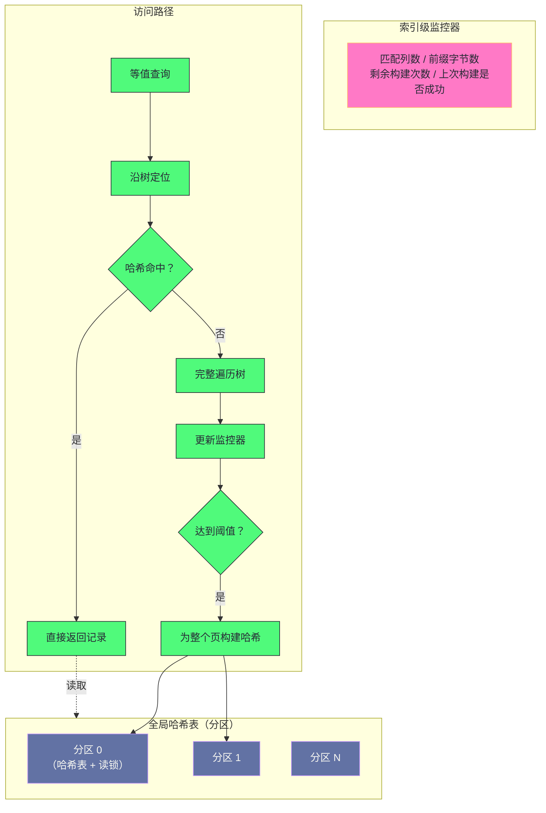
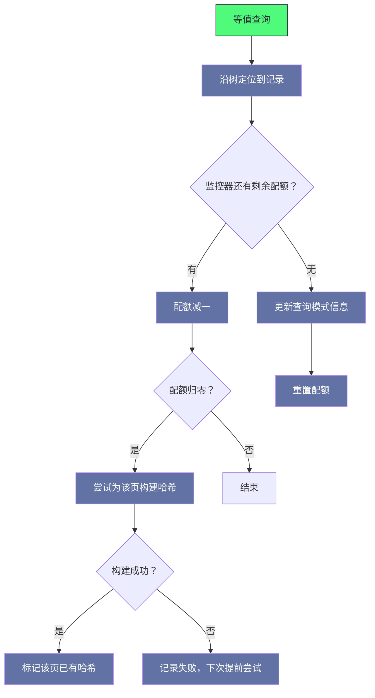

# 06. 自适应哈希索引：B+Tree 的加速捷径与锁竞争困局

**摘要：**

自适应哈希索引的思路很直接：**索引查找要走树的层次，而哈希查找是常数级**——**那么"给高频访问的键建一层哈希"就能把点查从对数级降到常数级。** 而"自适应"这三个字体现了它的设计取向：**不预判哪些是热点，而是"监控访问模式，达到阈值才建"**。这个取向看起来很稳妥，但它带来了一连串后果：**构建需要"同一个索引、同一种查询模式累计足够次数"，因此"查询均匀分散"时它根本建不起来；构建阈值与分区数都是硬编码的，因此无法按场景调整；而最要命的一处设计是"每次修改二级索引记录都要尝试删除哈希条目"——即使哈希从未被命中，这笔开销也要付。** 本文按"想法是什么 → 怎么建 → 怎么查 → 为什么在写场景下帮倒忙 → 现在还该不该开"展开。先说明它的三条设计原则与四处代价；再拆解它的四个组件、构建的反馈回路（含两处现实问题）与哈希表的分区设计；然后重点剖析那处"致命耦合"（删除与修改强绑定）以及它为什么难改。之后是"写入性能回退"的实测案例、命中率监控、参数与决策树、三个常见误区。最后是演进史、四处遗留设计与替代方向，以及一个务实的结论：**默认关闭，除非明确验证过收益。**

---

## 第 1 章 一个"加速捷径"的想法

### 1.1 索引查找的复杂度

索引查找走的是树结构，**因此它的复杂度是对数级的**——**层次越深，查找需要的页访问次数越多。**

**而"页访问"是这个成本的主要来源**：**因为树是分层的，所以"从根到叶"要访问多层页**——**而在"数据量大、树很深"的场景下，这个层数是可观的。**

**哈希查找的复杂度是常数级**：**一次哈希计算加一次桶查找**。**因此"给点查加一层哈希"看起来是一个明显的改进。**

### 1.2 为什么不能直接用哈希

一个自然的疑问是：**既然哈希更快，为什么索引不直接建成哈希？**

**原因是"哈希不支持范围查询"**：**哈希把键打散，因此"键的相邻关系"丢失了**——**而"范围查询"（例如"取某个区间内的记录"）恰好依赖"键有序"。**

**因此索引必须保持有序结构（树）**，**而"哈希"只能作为"点查的补充"。** **这就是自适应哈希索引的定位**：**它不是替代索引，而是"在索引之上加一层点查加速"。**

**这条定位决定了它的收益边界**：**它只对"点查"有效**——**而范围查询、排序、以及"扫描大量记录"的操作完全用不上它。** 因此它是一层"只覆盖部分访问模式的加速层"，而这也意味着它的收益上限是有限的，不可能像"索引"那样影响整体性能。

### 1.3 三条设计原则

这个机制遵循三条设计原则。

**原则一：被动适应。** **不预判热点，而是"监控访问模式，达到阈值才构建"。** **这条原则的意图是"避免为偶发查询浪费内存"**——**但它的代价是"构建滞后"**（第 3 章展开）。

**原则二：内存效率。** **哈希表的大小动态扩展，但受"分区数"这个硬限制约束。** **这条原则的意图是"按需增长"**——**但它的代价是"扩展受硬编码限制"。**

**原则三：无持久化。** **哈希索引只存在内存里**——**因此实例重启后需要重新"学习"。** **这条原则的意图是"避免把'派生数据'也持久化"**（因为哈希可以从索引重建）——**但它的代价是"重启后有很长的预热期"。**

**三条原则的共同特征是"它们都在'省'——省内存、省持久化、省预判"**——**而"省"的代价是"滞后、受限、需预热"。** **这三处代价恰好是它今天不受欢迎的主要原因。**

### 1.4 这个机制的代价

这个机制有四处代价，而它们比"收益"更值得记住。

**其一：构建滞后。** **因为要"累计足够次数"，所以在"查询分散"时它建不起来**——**而在"查询集中"时，它已经"集中"了一段时间才建起来。**

**其二：写路径的固定开销。** **每次修改二级索引记录都要"尝试删除哈希条目"**——**即使从未建过哈希，这笔开销也要付**（第 5 章展开）。

**其三：重启后失效。** **纯内存结构意味着重启后要重新学习**——**而"学习期"的长短取决于访问量。**

**其四：分区数不可调。** **哈希表的分区数是硬编码的**——**因此在"核数很多"的机器上，"分区不够"成为瓶颈。**

**四处代价的共同特征是"它们都不是'调参能解决'的"**——**构建阈值与分区数都硬编码，而"写路径的固定开销"与"重启失效"是设计使然。** **因此这个机制的实际可用性，取决于"它的收益能否覆盖这四处代价"**——**而在写密集场景下，答案通常是否定的。**

### 1.5 一个类比：熟客通道

把这个机制类比成"商店的熟客通道"会更容易理解它的取舍。

**"正常结账"对应"沿树查找"**——**要排队、要走完整流程（多层页访问）。**

**"熟客通道"对应"哈希查找"**——**认脸就放行（常数级）。**

**"但要先证明你是熟客"对应"构建阈值"**——**商店不会为"只来一次的人"开通道，**而是要观察"这个人是不是常来、来的方式是否一致"（查询模式是否稳定）。

**"如果客人每次都换打扮，就永远认不出来"对应"查询模式不稳定则永不构建"。**

**"熟客通道的登记簿要同步更新"对应"条目删除"**——**而"每次有人买东西都要去登记簿上尝试划掉一条（即使他不在登记簿上）"**，**正是那处"纯开销"的类比形态。**

**"商店关门后登记簿作废"对应"重启后失效"。**

**这个类比的用处在于"它把四处代价变成了可感知的运营问题"**：**熟客通道要"先观察"（构建滞后）、"每次交易都要查登记簿"（写路径开销）、"关门就作废"（重启失效）、"通道数量固定"（分区数硬编码）。** **而"该不该开熟客通道"就变成了一个很自然的经营判断**——**客流以老客为主就开，以流动客为主就别开。**

---

## 第 2 章 架构全景

### 2.1 四个组件

这个机制由四个组件构成。

**第一个是"全局管理器"**：**它持有多个哈希表分区与对应的锁**，**是所有访问的入口。**

**第二个是"索引级监控器"**：**每个索引一个**，**记录"这个索引上观察到的查询模式"**——**包括"匹配了几列""最后一列匹配了多少字节""还差多少次触发构建"等。**

**第三个是"哈希表"**：**按分区独立**，**采用"链地址法"解决冲突**，**单元数组会动态扩容。**

**第四个是"哈希条目"**：**键由"索引标识 + 匹配列数 + 前缀字节数 + 键值"构成**，**值指向"对应的记录"。**

**四个组件的关系是"监控器决定何时建，全局管理器提供容器，哈希表存条目，条目指向记录"。** **而"监控器是索引级的"这一点值得留意**：**它意味着"是否建哈希"这个判断是"按索引分别做的"**——**因此"同一张表的两个索引可能一个建了、一个没建"。**

### 2.2 全景图示

**图中值得注意的一点是"构建的对象是'整个页'而不是'单条记录'"**：**一次构建会把该页里的所有记录都放进哈希表。** **这个设计的好处是"后续对同一页里其他记录的查询也能命中"**；**代价是"构建时要遍历整页"**——**而遍历期间持有分区写锁**（第 6.4 节展开这个阻塞）。

### 2.3 "自适应"的两种含义

"自适应"这个词在这个机制里有两层含义，区分它们有助于理解它的行为。

**第一层含义是"构建时机自适应"**：**不预判热点，而是"根据访问模式决定何时构建"。** **这是它"被动适应"原则的体现。**

**第二层含义是"哈希键自适应"**：**键里包含"匹配列数"与"前缀字节数"**——**因此"同一个索引上的不同查询模式"会构建成不同的键。** **例如"按第一列查"与"按前两列查"会被视为两种模式。**

**第二层含义容易被忽略，但它解释了一个现象**：**"同一条 SQL 反复执行但一直没建哈希"**——**因为如果这条 SQL 的"匹配列数"与"已观察到的模式"不同，那么监控器会重新开始计数。**

**因此"查询模式是否稳定"是这个机制能否生效的关键条件**——**而这与第 3.1 节的判断一致**：**它适应的不是"热点页"，而是"稳定的查询模式"。** 这两者的差别，正是它常被误判的原因。

### 2.4 它与索引的关系

最后说明这个机制与"索引"的关系，因为这一点容易被误解。

**它不是"另一种索引"**——**因为它不改变"数据的物理组织"**，**也不参与"优化器的选择"。** **优化器仍然按"索引的有序性"来估算代价**，**而哈希只是"执行时的一个加速层"。**

**因此"建了哈希"不会让优化器"更愿意选这个索引"**——**它只是在"已经决定走这个索引"之后，让"走的过程更快"。**

**这个定位带来一个实践含义**：**"加了索引但查询仍然慢"这类问题，与本机制无关**——**因为"是否走索引"是优化器的决策，而本机制只影响"走索引的速度"。** **把两者混为一谈，会导致排查方向错误。**

**这条区分与第 1 篇讲的"优化器不知道数据是否在内存中"是同一类**：**这个机制也是"优化器看不见的优化"**——**它不在计划里，只在执行里。** **因此"计划正常但执行慢"这类现象，才需要往"执行时的加速层"这个方向找原因。**

---

## 第 3 章 构建的反馈回路

### 3.1 为什么基于"查询模式稳定性"

一个值得追问的设计选择是：**为什么构建的触发条件是"查询模式的稳定性"，而不是"页的访问频率"？**

**理由在于"哈希键的构成"**：**哈希键包含"匹配列数"与"前缀字节数"**——**因此"建哈希"这件事依赖"知道查询用什么条件"。** **如果只按"页被访问的频率"来建，那么"建出来的键"可能与"实际查询的条件"不匹配**——**于是"建了也用不上"。**

**因此"监控查询模式"是"建出可用哈希"的前提。** **这个逻辑是自洽的，但它的后果是"构建条件变得更严苛"**：**不仅要求"页被频繁访问"，还要求"访问条件一致"。**

**这条设计说明一个通用取舍**：**当"构建产物依赖'输入的形状'"时，触发条件就必须包含"形状的一致性"**——**而"形状一致性"比"频率"更难满足。**

### 3.2 两个硬编码阈值

构建由两个硬编码的阈值控制。

**第一个是"采样次数"**：**它决定"监控器多久更新一次对查询模式的判断"。**

**第二个是"构建阈值"**：**它是一个"剩余次数"计数器，初始为一个固定值（一百次），每次"通过树定位且未命中哈希"时减一，减到零就触发构建。**

**这个"剩余次数"的设计意味着**：**"构建"不是"达到某个频率"，而是"累计消耗完一个固定的配额"。** **因此"频繁但不稳定的访问"不会触发构建**（因为每次模式变化都会重置配额），**而"稳定但低频的访问"最终会触发**（因为配额只减不增）。

**这个设计的意图是"用配额来平滑'突发访问'"**——**因为突发访问可能在配额消耗完之前就结束了，因此"不为它建哈希"是划算的。** **而它的代价是"稳定的低频访问也会建哈希"**——**这可能并不划算。**

### 3.3 反馈回路图示

**图中值得注意的两处**：**"配额归零才构建"**（因此构建是滞后的），以及**"模式信息变化时重置配额"**（因此模式不稳定则永不构建）。**这两处合起来解释了"为什么它经常建不起来"。**

### 3.4 回路的两处现实问题

这个反馈回路有两处现实问题。

**问题一：查询均匀分散时永不触发。** **因为配额是"按索引累计"的**，**所以"同一索引上有很多不同的查询模式"会让配额被反复重置。** **而"每次重置都从头开始"意味着"在大表上、查询分散的场景下，它可能永远建不起来"。**

**问题二：重启后从零开始。** **因为哈希是纯内存的，所以重启后配额与已有哈希都归零。** **因此"重启后的预热期"里，这个机制完全无效**——**而预热期的长短取决于"访问量能否快速消耗配额"。**

**两处问题的共同特征是"它们都是'被动适应'的必然代价"**：**因为"不预判"，所以"必须等"；因为"不持久化"，所以"重启后要重新等"。** **而"等"的代价在"大表、分散访问、频繁重启"的场景下会累积成"基本无效"。**

### 3.5 配额机制与其他"限流"设计的对照

"配额"这个机制值得与别处的"限流"设计对照一下。

**它们的共同结构是"用'累计量'而不是'瞬时量'来触发动作"**：**这里用"累计消耗完配额"来决定构建**，**而第 4 篇讲的"按比例刷脏"用"脏页累计比例"来决定刷脏。**

**这个结构的价值是"平滑突发"**：**瞬时高峰不会立即触发动作**，**因此"偶发的密集访问"不会导致"建了一堆用不上的哈希"。**

**而它的代价是"滞后"**：**稳定但低频的访问也要"等配额消耗完"才触发**——**而"等"的这段时间里，优化没有生效。**

**因此"配额大小"这个参数决定了"平滑程度与响应速度的平衡"**：**配额越大越平滑但越滞后，越小越及时但越容易被突发误导。** **而把它硬编码意味着"这个平衡点被固定了"**——**这与第 4.5 节讲的"分区数硬编码"是同一类限制。**

**这条对照的用处在于"它说明'硬编码的平滑参数'是一类常见的限制"**——**而识别它的方式是"找出那些'用累计量触发动作'的地方，看它的阈值是否可调"。**

---

## 第 4 章 哈希表与分区

### 4.1 分区结构与路由

哈希表被分成固定数量的分区，**每个分区有独立的哈希表与读写锁。**

**路由规则是"用记录的折叠值对分区数取模"**——**而"折叠值"基于"索引标识与键值"计算。**

**因此"同一个键"总是落在同一个分区**——**这与第 4 篇讲的"页路由"是同一手法**：**用可计算的映射把"访问"分散到多个锁上。**

**而"分区数固定"这一点是它的限制**：**因为它是编译期常量，所以"在核数很多的机器上，分区数相对核数偏少"**——**于是"多个核争抢同一个分区锁"成为瓶颈。**

### 4.2 读写锁的使用

分区用**读写锁**保护，而读写锁的语义恰好匹配"读多写少"的假设。

**查询用读锁**：**多个查询可以并发读取同一个分区**——**这符合"点查远多于修改"的预期。**

**插入与删除用写锁**：**它们需要独占分区**——**因为要修改哈希表结构。**

**因此"读写锁"这个选择本身是正确的**——**它把"查询之间的竞争"消除了。** **问题出在"写锁的使用频率"上**（第 5 章）：**如果"删除条目"这个动作极其频繁，那么"写锁的竞争"就会成为瓶颈**——**而"读锁可以并发"这个优势就被抵消了。**

### 4.3 8 分区的历史与现状

分区数的取值有一段历史，而它解释了今天的困境。

**这个取值在设计时是"先进"的**：**因为当时的服务器主流是四到八核**——**因此"八个分区"足以让"每个核用不同的分区"。**

**而今天的服务器有一百多个核**——**因此"八个分区"意味着"十几个核争抢一个分区"。** **而如果"写锁的使用频率高"，那么这个争抢会很激烈。**

**这个"取值滞后于硬件"的现象与第 5 篇讲的"机械盘时代的优化在固态盘上变成负担"是同一类问题**：**一个设计参数押注的是"当时的硬件形态"，而硬件变了、参数没变。**

**而"分区数不可配置"这一点让它更难处理**：**因为它是编译期常量，所以"想改"就要"重新编译"。** **这也解释了为什么"官方之外的实现提供了可配置版本"**——**需求确实存在。**

### 4.4 分区的两难

分区数增加也有代价，因此它不是一个"越大越好"的参数。

**分区数增加的收益是"减少锁争用"**——**因为更多分区意味着"更多独立的锁"。**

**而它的代价有三处**：**哈希表的内存开销增加**（每个分区都要维护独立的表结构与锁）、**哈希计算与路由的开销可能上升**（取模运算在热点路径上）、**以及"分区过多导致每个分区的条目很少，反而降低缓存局部性"。**

**三处代价说明"分区数有一个最优点"**——**而"最优点在哪"取决于"核数与访问分布"。** **因此"把它硬编码"这个决定，实际上放弃了"按场景取最优"的可能。**

**这条取舍的通用形态是**：**"可配置"与"简单"之间存在张力**——**把参数硬编码能简化实现与测试，代价是"无法适配所有场景"。** **而在"场景差异很大"的机制上，硬编码的代价会更明显。**

### 4.5 分区数与核数的关系

分区数与核数的关系值得单独说清，因为它常被误判为"越多越好"。

**分区的意义是"让不同核操作不同的锁"**——**因此"分区数少于并发线程数"时，必然有线程争抢同一把锁。**

**而"分区数多于并发线程数"并不带来额外收益**——**因为同一时刻只有那么多线程在跑。**

**因此"分区数"的合理取值是"与并发度同量级"**——**而不是"越大越好"。** **这也解释了为什么"八个分区在八核机器上合适、在一百多核机器上不足"**：**它没有随核数增长而调整。**

**这条关系提示了一个评估方式**：**看到一个"固定分区数"的设计时，可以问"它在多少核以内是合理的"**——**而这个答案就是"分区数"。** **如果当前机器远超这个数，那么这个机制就有"结构性的并发不足"。** 而这类"结构性不足"无法通过调参缓解，只能通过关闭或升级版本应对。

---

## 第 5 章 条目删除：一处致命的耦合

### 5.1 为什么删除要加写锁

**当二级索引记录被修改或删除时，引擎会"尝试删除对应的哈希条目"。**

**为什么需要这一步**：**因为哈希条目指向"记录的物理位置"**——**而记录被修改（例如更新导致"标记删除"）之后，"原来的位置"可能不再指向同一条记录。** **因此"哈希条目可能失效"，必须被清理。**

**这个逻辑是正确的**——**但它的实现方式带来一个严重的问题。**

### 5.2 "无收益的纯开销"

**问题在于"尝试删除"这个动作的成本，与"是否真的存在条目"无关。**

**具体过程是**：**计算折叠值 → 确定分区 → 加分区写锁 → 在哈希表里查找并删除（可能什么都没找到） → 释放写锁。**

**因此即使"这个页从未构建过哈希"，这条路径也要走完**——**包括"加写锁"这一步。** **而"加写锁"恰恰是第 4.2 节讲的"会阻塞并发读"的操作。**

**结果是**：**"写入密集"的场景下，"写锁被反复获取"，而"读锁的并发优势"被抵消**——**而"哈希本身可能一次都没被命中"。** **这就是"纯开销、零收益"的具体形态。**

**这个形态值得记住，因为它体现了一类常见的设计缺陷**：**"清理动作"与"修改动作"强绑定，而清理的目标可能不存在。** **这类缺陷在"被清理对象很少、而修改很频繁"的场景下，会把"低频的清理成本"放大成"高频的固定开销"。**

### 5.3 为什么改不掉

**一个自然的疑问是：既然问题清楚，为什么不容易改？**

**原因是"判断'是否存在条目'需要成本"**：**要判断"这个页有没有哈希"，需要一次查询**——**而这次查询本身也要加锁。** **因此"先判断再决定是否清理"并不能免费省下开销**——**它只是把"一次写锁"换成了"一次读锁加（可能的）一次写锁"。**

**真正的解法是"把'是否有哈希'这个信息存在更廉价的地方"**：**例如在页描述符里加一个标志位**（与第 4 篇讲的"状态标记位"同一手法）——**这样"判断"退化成"读一个位"，不需要加锁。**

**而"改不掉"的原因通常是"改动面大"**：**标志位需要被维护（构建时置位、清理时清零）、需要考虑并发、以及"跨版本兼容"。** **因此这类"看起来简单的优化"往往被推迟**——**而官方之外的实现可能先行落地。**

**这条经验值得留意**：**"加一个标志位"这类优化，它的技术难度不高，但"改动面"不小**——**因此它的落地时间往往取决于"痛点是否足够痛"。**

### 5.4 这处耦合的更一般形态

把这处耦合抽象一层，可以得到一条更一般的判断。

**它的结构是"每次修改都触发一次清理尝试，而清理的目标可能存在也可能不存在"**——**而"尝试"的成本与"目标是否存在"无关。**

**这个结构在工程上很常见**：**例如"每次写缓存都去尝试删除对应的旧缓存"**（目标可能不存在）、**"每次更新索引都尝试删除旧的索引项"**、**"每次释放对象都尝试从多个容器里移除它"**。

**而它的问题在两处**：**其一是"成本与收益不匹配"**（成本无条件、收益有条件）；**其二是"它把'清理'的责任放在了'修改'的路径上"**——**而"修改"往往是热路径。**

**因此改进的方向通常是"把'是否存在'的信息记在更廉价的地方"**——**例如标志位、位图、或"反向索引"。** **这样"尝试"就退化成"一次廉价判断"，从而只在"确实存在"时才付昂贵的代价。**

**这条经验的形态与第 5 篇讲的"位图避免昂贵查询"完全一致**：**用"预先维护的廉价状态"替代"临时的昂贵探测"。** **而这个手法在本专栏里已经出现了三次**（缓冲池的状态位、变更缓冲的位图、这里的标志位）——**说明它是"热路径优化"的一个通用手段。**

### 5.5 写锁竞争为什么会放大

最后说明"写锁竞争"为什么在这个场景下会被放大。

**因为"写锁是排他的"**——**所以"一个线程持有写锁时，同分区的读与写都被阻塞"。** **而"删除条目"这个动作是"高频且极短"的**——**它加锁、算哈希、找条目、释放锁，全程很快，但"很快"意味着"加锁释放锁的频率很高"。**

**高频率的短临界区会造成"锁的交接开销"**：**每次加锁释放都可能涉及线程调度与缓存失效**——**因此"频繁但短暂"的临界区，其总开销可能超过"不频繁但较长"的临界区。**

**这条性质解释了一个反直觉的现象**：**"把临界区做得更短"不一定能提升并发**——**因为"更短"往往意味着"更频繁"，而"更频繁"会放大"交接开销"。**

**因此对这类"高频短临界区"的优化方向通常是"减少进入临界区的次数"**（例如用标志位提前排除），**而不是"把临界区做得更短"。** **这与第 5.4 节的结论一致**：**改进的方向是"让'不需要做的事'根本不进入临界区"。**

---

## 第 6 章 构建与查找流程

### 6.1 构建流程

构建分四步。

**第一步：检查是否已构建。** **如果该页已有哈希标记，则直接返回**——**这避免了重复构建。**

**第二步：确定哈希键的构成。** **用监控器记录的"匹配列数"与"前缀字节数"决定"键取多长"。**

**第三步：遍历页内所有记录。** **对每条记录计算"折叠值"，确定分区，加写锁并插入哈希表。**

**第四步：标记该页已构建哈希。**

**四步里最值得注意的是第三步的开销**：**它要遍历整页**（而一页可能有上百条记录），**并且"每插入一条就加一次分区写锁"**——**因此"构建一个页"可能意味着"上百次加锁解锁"。**

### 6.2 查找流程

查找分三步。

**第一步：加分区读锁。** **用折叠值确定分区，获取读锁。**

**第二步：哈希查找。** **在分区的哈希表里查找"键对应的条目"。**

**第三步：验证记录有效性。** **因为记录可能已被删除或移动，所以要检查"它所在的页是否仍在缓冲池、记录是否仍有效"。** **验证通过则返回（命中），否则视为未命中。**

**第三步的存在很关键**：**它说明"哈希命中"不等于"可以直接使用"**——**因为哈希是"派生数据"，它可能与"当前的实际状态"不一致。** **因此"命中之后还要验证"是必要的。**

### 6.3 验证开销

**验证这一步的成本值得单独说明，因为它解释了"哈希命中并不总是划算"。**

**验证需要"确认记录所在的页仍在缓冲池、且记录未被修改"**——**这通常是一次"页查找加标志检查"。** **因此"一次哈希命中"的成本是"哈希查找加页验证"，而"一次树查找"的成本是"多层页访问"。**

**在"树很浅"的场景下**（例如索引很小、层次只有两三层），**"哈希查找加验证"的成本可能与"树查找"相当**——**此时哈希的收益很小。**

**而在"树很深"的场景下**（大表），**哈希的收益显著**——**因为它省掉了多层页访问。**

**这条分析给出了这个机制收益的一个判据**：**"树越深，收益越大"**——**因此它更适合"大表上的点查"，而不是"小表"。**

### 6.4 构建的阻塞

**构建时持有分区写锁，而写锁会阻塞该分区上的所有读与写**——**这是这个机制的一处"突发阻塞"。**

**阻塞的时长取决于"页内的记录数"**：**因为构建要遍历整页并逐条插入，所以"页内记录越多，阻塞越久"。**

**因此"构建"这个动作会带来一次"短促但完全的停顿"**——**而"多个页同时触发构建"会让停顿叠加。**

**这类"为了长期的快而付出短期的停顿"的取舍在所有缓存预热机制里都存在**——**而判断它是否可接受，取决于"停顿的幅度与频率"是否在业务容忍范围内。** **在"构建频繁且页内记录多"的场景下，它可能表现为"偶发的延迟尖峰"。**

### 6.5 构建与淘汰的类比

把"构建"这一步与第 4 篇讲的"预读"对照，可以看出它们共享同一个结构。

**两者都是"提前做一件对未来有益的事"**：**预读是"提前把可能用到的页读进来"，构建是"提前把页里的记录放进哈希"。**

**两者的成本都是"当下的开销"**：**预读消耗 IO 带宽与缓冲池空间，构建消耗 CPU 与"持有写锁的时间"。**

**两者的风险都是"押错"**：**预读可能押错"访问模式"，构建可能押错"查询条件"。**

**而两者的应对方式也一致**：**预读用"把页放进低优先级区域"来降低误判代价**（第 5 篇），**而构建用"配额机制"来降低误判概率**（只对稳定模式构建）。

**这个对照的用处在于"它把两个看似无关的机制归到了同一类"**——**而识别"同类机制"的价值在于"一个机制的失败模式会提示另一个"**：**既然预读的失败模式是"误判后无法撤销"，那么构建的失败模式就应当是"构建之后发现用不上"**——**而后者正是"低命中率"这个指标的来源。**

---

## 第 7 章 生产落地

### 7.1 写入性能回退的实测

**这是一个"机制在错误场景下帮倒忙"的典型案例。**

**环境是"多核物理机加固态盘"，负载是"纯写入"**（包含插入与删除）。**对比开启与关闭：开启时的吞吐低于关闭时，而延迟更高，同时锁竞争相关的 CPU 占比显著上升。**

**结论是"写入密集型负载下，开启它会导致吞吐下降"。**

**根因链条是**：**纯写入负载包含插入与删除 → 每条二级索引操作都尝试删除哈希条目 → 加写锁、算哈希、遍历 → 而哈希从未被命中 → 因此是纯开销 → 写锁竞争拖慢整体。**

**这条链条的每一环都是机制的正常行为**——**问题出在"这个机制的收益（加速点查）与这个负载（纯写入）完全不匹配"。** **因此这个案例的教训不是"机制有 bug"，而是"机制的使用需要匹配负载"。**

### 7.2 命中率监控

这个机制的可观测核心是"命中率"。

**它由两个指标构成**：**"通过哈希直接定位的次数"与"回退到树的次数"**——**而命中率是前者的占比。**

**判据分三档**：**占比很高说明它在有效工作；占比中等说明有一定收益但需要观察；占比偏低说明"收益为负的概率较高"，应当考虑关闭。**

**为什么"低命中率"意味着"负收益"**：**因为"写路径的固定开销"不依赖于"是否命中"**——**因此"低命中率"意味着"付了成本但没换到收益"。**

**这个判据的形态值得留意**：**它把"是否该开启"变成了"一个可观测的比值"**——**而不是"凭感觉"。** **这与第 4 篇讲的"命中率是判据而不是越高越好"是同一类纪律**：**关键是"成本与收益是否匹配"，而不是"某个指标是否好看"。**

### 7.3 参数与决策树

| 参数 | 内核依据 | 调整方向 |
|---|---|---|
| 哈希开关 | 控制整个机制是否启用 | 按负载类型决定 |
| 分区数 | 哈希表的并发粒度 | 部分实现可调，官方版硬编码 |

**参数只有两个**，**而这个事实本身说明了一件事**：**这个机制"几乎没有可调空间"**——**因为构建阈值、分区数、以及"写路径的耦合"都是设计使然。**

**因此决策树也很短**：**先看负载类型——写入密集则关闭；读密集则看"点查比例"与"命中率"——点查比例高且命中率高才保留；混合负载则"开启后观察"，若命中率低或写锁竞争显著则关闭。**

**这条决策树的特点是"它的默认方向是关闭"**——**这与"默认开启、出问题才关"的常见做法相反。** **而这个反转的理由是"写路径的固定开销"**：**因为成本是"无条件"的，而收益是"有条件的"，所以"默认关闭"更稳妥。**

### 7.4 三个常见误区

**误区一："它对等值查询总是有益的。"** **事实是"等值查询如果分散在不同页，它根本建不起来"**——**因此"无收益，却仍要承担写负载下的删除开销"。**

**误区二："八个分区足够现代。"** **事实是"八个分区在核数很多的机器上严重不足"**——**而官方版本不可配置。**

**误区三："命中率高就应该开启。"** **事实是"写入负载下，即使命中率很高，删除开销仍可能拖垮性能"**——**因为成本与命中率无关。**

**三个误区的共同特征是"它们都把'收益'当成'充分条件'"**——**而正确的判断需要"收益是否超过成本"，而成本包含"与命中率无关的固定部分"。** **这也是为什么"命中率"这个指标必须与"负载类型"一起看。**

### 7.5 一次"写入变慢"的排查推演

把排查路径串成一个案例。

假设现象是"写入吞吐比预期低，而 CPU 使用率不高、磁盘也不忙"。

**第一步，确认是"资源饱和"还是"锁竞争"。** **如果资源都不紧张而吞吐受限，那么方向在"临界区"**——**这与第 4 篇讲的判断一致。**

**第二步，确认是哪一类锁竞争。** 观察锁等待的分布：**如果集中在与索引相关的锁上，那么方向在索引的并发结构。**

**第三步，检查这个机制是否被启用。** **如果启用了，那么"写路径的固定开销"是一个高度可疑的根因**——**因为"每次修改二级索引都要尝试删除条目"。**

**第四步，对比"开启与关闭"的差异。** 这是最直接的验证方式——**如果关闭后吞吐明显提升，那么根因确认。**

**第五步，如果确认，评估"关闭的代价"。** **关闭会让"点查"失去一层加速**——**因此需要看"命中率"来判断"损失的收益有多大"。** **如果命中率本来就低，那么关闭几乎没有损失。**

**五步的价值在于"它把'写入慢'这个模糊现象，导向了一个具体的、可验证的假设"**——**而这个假设的可验证性来自"这个机制可以被开关"**：**"对比开关前后"是最可靠的验证手段。**

**它也提示了一条实践建议**：**对"默认开启但收益不确定"的机制，值得做一次"开关对比"**——**因为默认值反映的是"设计时的场景"，而不是"你的场景"。**

### 7.6 一处容易忽略的观测细节

最后说明一处观测上的细节：**这个机制的指标只在"管理视图"里，而不在常规的状态变量里。**

**因此"看常规监控面板"是看不到它的**——**要判断它的效果，必须主动去看管理视图的那一段。**

**这个细节带来一个实践后果**：**"它的效果"容易被忽略**——**因为"看不见"就意味着"不会被纳入日常检查"。** **而"不被检查"又会导致"它在错误场景下长期开着"。**

**因此一条实用建议是**：**把"这个机制的命中率"加入定期巡检项**——**特别是对"以读为主"的实例。** **这与第 5 篇讲的"积压量是核心监控项"是同一类建议**：**对"默认开启的优化"，必须主动观测它的效果**——**否则就无法判断它是否仍然划算。**

---

## 第 8 章 演进史与遗留设计

### 8.1 关键节点

| 版本 | 变化 | 动因 |
|---|---|---|
| 4.1 | 引入，单全局锁 | 最初的索引加速尝试 |
| 5.5 | 未改进 | 写入负载尚未成为主流 |
| 5.7 | 维持原状 | 默认开启，用户极少关闭 |
| 8.0.23 | 分区锁（从单锁到八分区），监控指标细化 | 高并发写入场景的反馈 |
| 8.0.30+ | 减少 DDL 时的清理开销 | 改善大表 DDL 的阻塞 |

**这条演进线有一处值得留意**：**它在很长一段时间里"没有改进"**——**而这不是因为"没有问题"，而是因为"默认开启、用户极少关闭"。**

**"默认开启"这个状态会掩盖问题**：**因为用户不会去对比"开启与关闭的差异"**——**因此"它在某些场景下帮倒忙"这个事实可能长期不被发现。**

**这也解释了一个现象**：**很多"默认开启的优化"在被认真评估后会被改成"默认关闭"**——**因为"默认"意味着"所有人都要用"，而"所有人都要用"的优化必须"在所有场景下都不亏"。**

### 8.2 四处遗留设计

**第一处：分区数硬编码。** **因此"高并发写场景无法通过配置缓解"。**

**第二处：构建阈值不可调。** **因此"短连接风暴"这类"需要更快构建"的场景无法适配。**

**第三处：条目删除与修改强耦合。** **因此"写路径的固定开销"无法消除**（第 5.3 节）。**而"加一个标志位"这类优化在官方版未落地。**

**第四处：重启后完全失效。** **因此"需要数小时甚至数天才能重新预热"**——**而"频繁重启"的场景下它基本无效。**

**四处遗留设计的共同特征是"它们都是'硬编码'或'强耦合'的结果"**：**硬编码导致无法适配，强耦合导致开销无法消除。** **而这类问题的处置方式通常是"等下一代设计"**——**因为在旧结构上修补的收益有限。**

### 8.3 替代方向

**方向一：持久化哈希索引。** **把"运行时自适应构建"改成"用户显式创建加持久化存储"**——**这样"重启不丢、无需预热"。** 部分版本已提供实验性的哈希索引语法，但适用范围有限。

**方向二：把索引下沉到存储层。** **云原生架构里，计算节点无状态，而"索引加速"由存储节点提供**——**这实际上是把"哈希索引"从"计算节点的内存结构"变成了"存储层的持久化结构"。**

**方向三：直接关闭。** **云上的部分数据库服务已默认关闭它，改用其他方式加速点查**——**这个选择本身也说明"它的收益不足以覆盖成本"。**

**三个方向的共同特征是"它们都在承认'在计算节点里做自适应哈希'这条路收益有限"**——**而"持久化"或"下沉"是更可靠的方向。** **这与第 5 篇讲的"机制的价值取决于它依赖的代价差"是一致的**：**当"树查找与哈希查找的差距"不足以覆盖"写路径的固定开销"时，这个机制就该让位了。**

### 8.4 一条关于"自适应"的反思

最后对"自适应"这个设计取向本身做一点反思。

**"自适应"的吸引力在于"不需要人工判断"**——**使用者不必知道"哪些是热点"，系统自己会学。**

**而它的代价有三处**：**其一是"学习需要时间"**（因此有滞后与预热期）；**其二是"学习结果不可见"**（使用者无法知道"它学到了什么、为什么没生效"）；**其三是"学习目标可能不对"**（它学的是"稳定的查询模式"，而使用者关心的可能是"热点页"）。

**第三处代价最容易被忽略**：**"自适应"总是"适应某个特定的目标"，而那个目标不一定是你关心的目标。** **本机制适应的目标是"查询模式的稳定性"，因此"查询分散"时它不生效**——**而使用者可能认为"查询很频繁，它应该生效"。**

**因此使用任何"自适应"机制时，正确的做法是先问"它在适应什么"**——**而答案往往能从"它的触发条件"里读出来。** **本机制的触发条件是"同一索引上同一查询模式的累计次数"，因此它适应的就是"模式稳定性"**——**这一点一旦明确，"它为什么有时不生效"就不再是谜。**

---

## 第 9 章 边界与反例

### 9.1 反例一：把"默认开启"当作"默认推荐"

默认值反映的是"设计时的场景假设"，**而不是"当前场景下的最优选择"。** 这个机制在当前负载下常常需要关闭（第 7.3 节）。

### 9.2 反例二：把"命中率高"当作"应该开启"

写入负载下，**即使命中率很高，删除开销仍可能拖垮性能**——**因为成本与命中率无关**（第 7.4 节）。

### 9.3 反例三：把"它没被命中"当作"它没有开销"

**写路径的固定开销是无条件的**——**因此"没被命中"不等于"没有代价"，而是"只有代价"。**

### 9.4 反例四：把"分区数不足"当作"可以调"

官方版本的分区数是编译期常量，**不可通过配置调整**（第 8.2 节）。

### 9.5 反例五：把"重启后没生效"当作"配置错了"

**纯内存结构决定了它需要重新预热**——**而预热期可能很长**（第 3.4 节）。

### 9.6 反例六：把"构建时的停顿"当作"偶发抖动"

构建会持有分区写锁并遍历整页，**因此它是"必然的短促阻塞"**——**在"页内记录多、构建频繁"的场景下会表现为延迟尖峰**（第 6.4 节）。

### 9.7 反例七：在小表上期待它的收益

它的收益来自"省掉多层页访问"，**因此"树很浅"时收益很小**（第 6.3 节）。

### 9.8 反例八：把"它在适应什么"当作不言自明

"自适应"总是适应某个特定目标。**本机制适应的是"查询模式的稳定性"，而不是"访问频率"或"热点页"**（第 8.4 节）。**把这两者混为一谈，会得出"它为什么不生效"的错误结论。**

---

## 第 10 章 落点

回到开头的问题：**既然哈希查找更快，为什么不能把索引建成哈希？**

**因为哈希不支持范围查询**——**因此索引必须保持有序，而哈希只能作为"点查的补充"。** 这条定位决定了它的收益边界：**它只对点查有效，而且只在"树足够深"时收益显著。**

**而"自适应"这个设计取向，把它从一个"可选优化"变成了一个"难以评估的优化"**：**因为"何时构建"由内部阈值决定，所以使用者无法"主动控制它是否生效"**——**只能"观察命中率来判断"。** 而"写路径的固定开销"又让"关闭它"成为一个合理的默认选择。**这个"不可控"的性质值得留意：一个优化的可评估性，与它的可控性直接相关**——**而"自适应"往往牺牲后者。**

**因此这个机制最值得学习的地方，不是它的实现，而是它的"失败模式"**：**一个优化如果"成本是无条件的、收益是有条件的"，那么它的默认状态就应当谨慎**——**而这个机制恰好是这样的结构。** **理解这一点，比记住"默认关掉它"这个结论更有价值**——**因为类似的"成本无条件、收益有条件"的机制，在其他系统里也会遇到。** 而识别这类机制的方法很直接：看它的成本是否"只在收益发生时产生"。

**它还提示了一条更具体的实践纪律：对"默认开启但收益不确定"的机制，值得做一次"开关对比"。** **因为默认值反映的是"设计时的场景假设"，而不是"当前场景的最优选择"**——**而"对比开关前后"是判断"默认值是否仍然合适"的最直接方式。** **这个做法成本很低（改一个配置加一次压测），而它能避免"长期承受一个不划算的机制"。** 而"默认值可能过时"这个判断，适用于所有"很久没有改过默认配置"的机制。

**最后一条经验是关于"自适应的边界"**：**任何"自适应"机制都在适应某个特定目标，而那个目标不一定是你关心的**——**因此"它为什么没生效"这个问题的答案，通常就藏在"它的触发条件"里。** **先问"它在适应什么"，再判断"我的场景是否符合那个目标"**——**这比"调参数试图让它生效"更有效。** 而这个"先问目标"的习惯，对任何带"自适应""智能""自动优化"字样的机制都适用。

---

## 专栏导航

- 上一篇：[[05. InnoDB 插入缓冲：从 Insert Buffer 到 Change Buffer 的二十年演进]]。
- 下一篇：[[07. 重做日志缓冲区与 WAL：InnoDB 持久性的实现基石]]。
- 返回专栏首页：[[00 专栏导览]]。

---

## 参考资料

1. MySQL 8.0.33 源码：`storage/innobase/btr/btr0sea.cc`、`btr0cur.cc`、`storage/innobase/include/btr0sea.h`、`hash0hash.h`.
2. MySQL. MySQL Internals Manual: Adaptive Hash Index. https://dev.mysql.com/doc/internals/en/
3. Oracle Blogs. Adaptive Hash Index in InnoDB. https://dev.mysql.com/blog-archive/
4. MySQL. 官方文档：innodb_adaptive_hash_index 与 innodb_adaptive_hash_index_parts. https://dev.mysql.com/doc/refman/8.0/en/innodb-parameters.html
5. MySQL. 官方文档：SHOW ENGINE INNODB STATUS 中 ADAPTIVE HASH INDEX 段的解读. https://dev.mysql.com/doc/refman/8.0/en/innodb-standard-monitor.html
6. Percona Live. Why We Disabled Adaptive Hash Index at Scale. 2024.
7. MySQL. 官方文档：8.0.23 的性能改进与监控增强说明. https://dev.mysql.com/doc/relnotes/mysql/8.0/en/
8. MySQL. 官方文档：InnoDB 索引与哈希索引的适用场景说明. https://dev.mysql.com/doc/refman/8.0/en/innodb-index-types.html
9. MySQL. 官方文档：Performance Schema 中自适应哈希索引相关的内存事件. https://dev.mysql.com/doc/refman/8.0/en/performance-schema-memory-summary-tables.html
10. MySQL. 官方文档：锁与等待事件的观测方式（含分区锁等待）. https://dev.mysql.com/doc/refman/8.0/en/performance-schema-wait-tables.html
11. MySQL. 官方文档：InnoDB 内部数据结构与内存分配概览. https://dev.mysql.com/doc/refman/8.0/en/innodb-in-memory-structures.html
12. MySQL. 官方文档：索引设计原则与哈希结构的适用边界. https://dev.mysql.com/doc/refman/8.0/en/optimization-indexes.html

---

> [!note] 思考题
> 1. 为什么索引不能直接建成哈希？这个限制如何决定了本机制的收益边界？
> 2. "基于查询模式稳定性"而不是"基于页访问频率"来触发构建，这个选择的理由是什么、代价是什么？
> 3. "条目删除与修改强耦合"为什么会造成"纯开销、零收益"？为什么它不容易改？
> 4. 为什么"命中率高"不能作为"应该开启"的充分条件？
> 5. "成本无条件、收益有条件"这个结构，为什么会让一个优化的默认状态变得谨慎？
