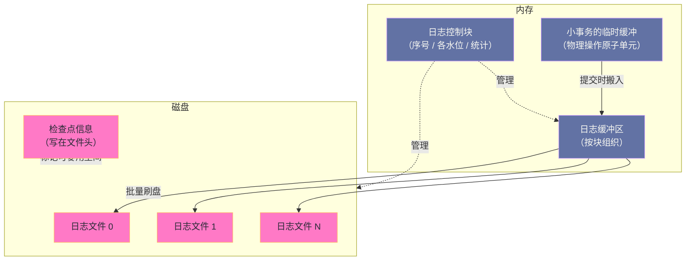

# 07. 重做日志缓冲区与 WAL：InnoDB 持久性的实现基石

**摘要：**

重做日志要解决一个根本矛盾：**"提交必须可靠"与"写入必须快"之间的冲突。** 如果每次提交都要求"数据页落盘"，那么写入会被磁盘的随机写拖垮；如果允许"数据页先留在内存里"，那么崩溃就会丢数据。WAL（先写日志）的解法是：**把"落盘"的对象从"数据页"换成"日志"**——**而日志是顺序写的，因此快得多。** 这个替换成立了，但代价是一整套新的机制：**日志要能被正确应用（因此需要日志格式与序号）、日志空间要能被复用（因此需要检查点）、日志要能被批量刷盘（因此需要组提交）、日志要在内存里被并发写入（因此需要缓冲区与并发设计）。** 本文按"矛盾是什么 → 由什么组成 → 日志长什么样 → 序号怎么用 → 什么时候刷 → 崩溃后怎么用 → 生产上怎么调"展开。先说明 WAL 的三条设计原则与代价；再拆解日志块、缓冲区、日志文件组、序号与检查点五个组件；然后讲日志块的 512 字节设计与双重缓冲、序号的多个"水位"与"序号到文件偏移"的换算；接着讲小事务如何把日志搬进缓冲区（以及这一步的无锁化改进）、刷盘的三个触发点与组提交的三阶段。之后是崩溃恢复的五步与两个关键机制、参数矩阵与监控、三类常见问题。最后是演进史、边界与常见误判。

---

## 第 1 章 持久性的基石

### 1.1 一个根本矛盾

**数据库必须保证"提交成功的事务不会丢"**——**而"不丢"的物理含义是"落到持久存储上"。**

**但如果每次提交都要求"数据页落盘"，性能会崩掉**：**因为"页落盘"是随机写**（页分散在不同位置），**而随机写很慢**（第 2 篇已展开量级差）。

**于是出现一个矛盾**：**"提交必须可靠"要求落盘，"写入必须快"要求别落盘。** **这个矛盾是重做日志要解决的全部问题。**

### 1.2 WAL 的解法

**WAL（先写日志）的解法是"把落盘的对象换掉"**：**提交时不需要"数据页落盘"，只需要"日志落盘"。**

**为什么这个替换有效**：**因为日志是"追加写"的**——**所有日志按顺序写到一个（或一组）文件里，因此是顺序写。** **而顺序写比随机写快得多**（第 2 篇）。

**替换成立之后，"数据页"可以晚一点落盘**——**而"晚一点"意味着"可以批量落盘"，从而把随机写也摊薄。**

**因此 WAL 的本质是"用'一次顺序写'替代'一次随机写'"**——**而它的正确性依赖一个关键前提：日志必须"足以重建数据页的状态"。** **这个前提决定了"日志要记什么"（第 1.3 节）。**

### 1.3 三条设计原则

这个机制遵循三条设计原则。

**原则一：日志先于数据。** **数据页的修改必须在"对应的日志已落盘"之后才能落盘**——**否则"数据页已落盘但日志未落盘"意味着"崩溃后无法恢复这一步修改"。** **这条原则是所有 WAL 系统的共同约束。**

**原则二：顺序写入。** **日志以追加方式写入文件组**——**这把随机 IO 变成了顺序 IO，是性能收益的来源。**

**原则三：循环覆盖。** **日志文件组是固定大小的**——**因此"旧的日志空间必须能被复用"，而这个"可复用"的判据就是检查点**（第 4 章展开）。

**三条原则的关系是"层层依赖"**：**原则一决定正确性，原则二决定性能，原则三决定空间可行性**——**而三者缺一不可**：**没有原则一会丢数据，没有原则二会很慢，没有原则三会写满。**

### 1.4 这个机制的代价

这个机制有四处代价。

**其一：日志本身的写入开销。** **每次修改都要写日志**——**因此"写数据"变成"写日志加（稍后）写数据"，总写入量增加**（这就是"写放大"的一处来源）。

**其二：日志空间的约束。** **因为日志文件组是固定大小的，所以"日志空间不足"会成为一个必须管理的约束**——**而它由"检查点推进速度"决定**（第 4 章与第 8 章展开）。

**其三：恢复时间的约束。** **恢复需要"从检查点开始重放日志"**——**因此"日志越多、恢复越慢"**（第 7 章展开）。

**其四：并发设计的复杂度。** **日志缓冲被所有事务并发写入**——**因此需要一套并发设计**（第 5 章展开 8.0 的无锁化改进）。

**四处代价的共同特征是"它们都是'日志成为关键路径'的后果"**：**因为日志在关键路径上，所以它的写入量、空间、恢复时间、并发设计都变得重要。** **这也解释了为什么"日志子系统"是 InnoDB 里最复杂、也是 8.0 重构幅度最大的部分之一。**

### 1.5 一个类比：收银台的记账本

把 WAL 类比成"收银台的记账本"会更容易理解它的结构。

**"每次交易都要把货架上的商品位置改一遍"对应"每次提交都让数据页落盘"**——**它太慢了**（因为货架分散在仓库各处，即随机写）。

**"改成先在本子上记一笔'某货架某位置的数量减一'"对应"先写日志"**——**记本子是"顺序写"（往后翻着写），因此快得多。**

**"本子记完就可以让顾客走了"对应"提交返回"**——**而"货架上的数字"可以晚一点再改。**

**"本子记满一页要翻页"对应"日志块"**——**而"一页必须是完整的一页"对应"块与扇区对齐"。**

**"本子有固定页数、写满了要回到第一页"对应"日志文件组是固定大小的"。**

**"只有等某页记录的数字都改到货架上了，那一页才能被复用"对应"检查点"**——**这正是"日志空间由刷脏进度决定"的类比形态。**

**"收银员排队把交易记进同一个本子"对应"组提交"**——**一次翻页与落笔服务多个人。**

**这个类比的用处在于"它把四处代价变成了可感知的日常经验"**：**本子要写（写入开销）、本子有固定页数（空间约束）、本子上的记录要能重现（恢复时间）、多人要同时写（并发设计）。**

---

## 第 2 章 整体架构

### 2.1 四类组件

这个子系统由四类组件构成。

**第一类是"日志缓冲区"**：**内存中的环形区域**，**用于缓存"尚未写入磁盘"的日志**。**它的大小由参数控制。**

**第二类是"日志文件组"**：**磁盘上的一组文件**，**日志以追加方式写入其中**。**文件组是循环使用的**——**当检查点推进后，早期空间可被复用。**

**第三类是"日志序号"**：**一个单调递增的整数**，**唯一标识"日志的总量"**。**每条日志记录、以及每个数据页上的"最后修改序号"都依赖它做对应与校验。**

**第四类是"检查点"**：**它标记"某个序号之前的日志所对应的数据页都已落盘"**——**因此这部分日志空间可以被覆盖。**

**四类组件的关系是"缓冲区是暂存区，文件组是落点，序号是地址，检查点是回收依据"。** **而这个"回收依据"的角色很关键**：**它把"日志空间的复用"从"看时间"变成了"看数据页是否已落盘"。**

### 2.2 全景图示

**图中值得注意的一点是"日志先进入小事务的临时缓冲，再搬进全局缓冲区"**——**这个"两段式"的设计解决了一个问题：日志必须"按物理操作的原子单位"生成**（否则崩溃恢复时可能读到"半条操作"）。**因此"临时缓冲"承担的是"原子性"，而"全局缓冲"承担的是"批量与并发"。**

### 2.3 三种日志格式的取舍

最后说明一个容易混淆的地方：**日志记录的不是"页的镜像"，而是"页内修改的操作指令"。**

**这个选择的收益是"日志量小"**：**如果记录页的镜像，那么"改一个字节"也要写整页**——**而记录"在页内某偏移写入某值"只需要几个字节。**

**代价是"重放时必须先有页"**：**因为日志是"相对于页的操作"，所以重放前必须先把页读进来。** **这意味着"恢复时必须访问数据页"**——**而这也解释了为什么"恢复"不能只靠日志**（第 7 章展开）。

**这个取舍的通用形态是"记录操作 vs 记录状态"**：**前者省空间但重放需要上下文，后者费空间但重放自包含。** **InnoDB 选择了前者**，**因此它必须保证"重放时的页状态与生成日志时一致"**——**这正是"物理操作原子单位"存在的理由。**

---

## 第 3 章 日志块与缓冲区

### 3.1 为什么以块为单位

**内存与磁盘之间传输的最小单位是"日志块"，固定大小等于磁盘扇区大小。**

**为什么选这个大小**：**因为"扇区大小"是"磁盘能保证原子写入的最小单位"**——**因此"以扇区为单位写"能保证"要么整个块写成功、要么完全没写"，**不会出现"半块"。

**这个选择的意义在于"它把原子性的问题交给了硬件"**：**如果块大小大于扇区，那么"崩溃时可能写了一半"，而"半块的日志"无法被正确解析。** **因此"与扇区对齐"是一条底线。**

**而它带来的约束是"块大小是固定的"**：**因此在"扇区更大的设备上"（例如某些设备扇区为 4KB），可能需要额外的处理**——**这也是"预写对齐"这个参数存在的原因**（第 8 章展开）。

### 3.2 块的结构

每个日志块由三部分构成。

**块头**：**记录"块序号""块内有效数据长度""第一个日志组的起始偏移""写块时的检查点号"。**

**日志数据**：**块内可容纳的日志内容**——**它的上限是"块大小减去头尾的开销"。**

**块尾**：**校验值**——**用于检测"块是否完整"。**

**三部分里，"块内有效数据长度"这一项值得留意**：**它让"最后一个未写满的块"可以被正确识别**——**因为"未写满"意味着"有效数据不足一个块"，而"不足"的部分不应被当作有效日志。**

**而"第一个日志组的起始偏移"这一项的作用是"让恢复能跳过不完整的日志组"**：**因为"块"可能包含"多条操作"的日志，而"操作"必须被完整重放**——**因此"从哪开始是完整的"这个信息必须被记录。**

### 3.3 双重缓冲

日志缓冲区被设计成"两个逻辑区域的乒乓切换"。

**具体做法是"分配两倍于配置值的空间"，并维护"指向整体的指针"与"指向当前可写位置的指针"。**

**当"当前区域写满或需要刷盘"时，系统切换到另一个区域，并把"最后一个未写满的块"拷贝过去。**

**这个设计的收益是"写入与刷盘可以部分并发"**：**因为"刷盘操作的是已满的区域"，而"新写入进入另一个区域"**——**因此"刷盘期间写入不必等待"。**

**代价是"内存翻倍"与"一次拷贝"**：**两倍空间意味着"配置值不等于实际占用"，而"拷贝最后一个块"是额外开销。**

**这个取舍的通用形态是"用空间与一次拷贝换并发"**——**而它与第 4 篇讲的"双生代 LRU 用两次访问换准确判断"是同一类：为了消除一个串行点，付出一点额外成本。**

### 3.4 块大小的取舍

"块大小固定为扇区大小"这个选择有一处需要留意的取舍。

**块越小，浪费越少**（因为"最后一个未写满的块"浪费更少），**但"头尾开销的占比"越高**（每块都要付头尾）。

**块越大，头尾开销占比越低，但"最后一个未写满的块"浪费越多**，**且"原子写入"的保证可能失效**（如果超过扇区）。

**因此"等于扇区大小"是一个"下限约束与开销占比"之间的平衡点**——**而它不能随意调整，因为"原子性"是硬约束。**

**这条取舍的形态与第 4 篇讲的"页大小"是同一类**：**"最小原子单位"的取值由硬件决定，而"开销占比"由"单位大小"决定。** **当硬件变化时（例如扇区从 512 字节变为 4KB），这个取值可能需要重新审视。**

### 3.5 缓冲区的动态特性

日志缓冲区有一处与"数据页缓冲池"不同的特性，值得留意。

**它是"环形"的，而缓冲池是"按需分配与淘汰"的**——**因此两者的管理逻辑完全不同**：**缓冲池关心"哪些页该留下"，而日志缓冲只关心"写到哪了、刷到哪了"。**

**这个差异来自"访问模式不同"**：**数据页是"随机访问"的**（同一页可能被反复读写），**而日志是"只写不读"的**——**日志写入之后不再被访问（除非崩溃恢复时从磁盘读）。**

**因此日志缓冲不需要"淘汰算法"**——**它只需要"写指针与刷指针"**。**这也解释了为什么它的结构比缓冲池简单得多。**

**这条对比的用处在于"它说明'缓存'这个词覆盖了两种不同的东西"**：**一种是"为了重复访问而保留"，另一种是"为了批量提交而暂存"。** **而后者不需要淘汰、不需要访问计数、也不需要"热冷判断"**——**把两者混为一谈，会低估前者的复杂度、高估后者的复杂度。**

---

## 第 4 章 日志序号与检查点

### 4.1 序号是什么

**日志序号是一个单调递增的整数**，**它唯一标识"日志的总量"**。

**它的用途有三处**：**其一，"日志记录的位置"用它表达**；**其二，"数据页的最后修改位置"也用它记录**（因此"页比日志新还是旧"可以通过比较序号判断）；**其三，"刷盘的进度"用它表达**。

**"同一个序号可以同时表达'日志位置'与'页的修改位置'"这一点很关键**：**它让"日志与数据页的对应关系"变成了一次数值比较**——**而"比较数值"比"维护映射表"简单得多。**

**这与第 1 篇讲的"两条命名空间用指针关联"不同**：**那里是"用指针建立对应"，这里是"用共享的序号建立对应"。** **两种手法都能建立对应，而"共享序号"的优势是"比较廉价"。**

### 4.2 序号的几个"水位"

序号不是"一个值"，而是"一组值"——**它们分别表示"日志在流转过程中处于哪个阶段"。**

| 水位 | 含义 |
|---|---|
| 当前写入位置 | 日志缓冲区里"下一个可写位置" |
| 已完成写入缓冲区的最大位置 | 表示"这些日志已经在缓冲区里了" |
| 已发出写请求的最大位置 | 表示"写请求已提交给操作系统" |
| 已确认落盘的最大位置 | 表示"操作系统确认已写入" |

**四个水位的关系是"依次递减的进度"**：**"当前写入位置"最靠前，"已确认落盘"最靠后。** **而它们之间的差距，分别对应"还在内存里""已交给系统但未确认"两种状态。**

**这组水位解释了一个常见现象**：**"提交等待"发生在"已确认落盘的位置"追不上"提交所需的那个位置"时**——**而"提交所需的那个位置"就是"该事务的最后一条日志的位置"。**

**因此"观察这组水位的差距"就能判断"日志写入的瓶颈在哪一段"**：**如果"当前写入位置"与"已发出写请求"差距大，说明"缓冲区的写入速度"有问题；如果"已发出"与"已确认"差距大，说明"磁盘的响应速度"有问题。** 这个判据的价值在于"它把'日志慢'这个笼统现象，拆成了两个可分别观测的段落"。

### 4.3 序号到文件偏移

**因为"序号是连续的"而"文件是分段的"，所以"序号到物理位置"需要一次换算。**

**换算分三步**：**用序号对"单文件大小"取余得到"文件内偏移"**；**用序号除以"单文件大小"再对"文件数"取余得到"文件序号"**；**最后加上"文件头的大小"**（因为每个文件头部有一段保留区域）。

**这个换算的意义在于"序号与物理位置之间不需要映射表"**：**因为换算是纯计算**——**因此"给定序号就能算出位置"，而不需要维护一张"序号到位置"的表。**

**这与第 2 篇讲的"日志段文件名即起始位置"、第 4 篇讲的"页路由用取模"是同一手法**：**用可计算的映射替代需要维护的映射。** **而它的前提是"文件大小固定、文件数量固定"**——**因此"调整日志文件大小"需要重启（因为它改变了换算规则）。**

### 4.4 检查点与"可复用空间"

**检查点标记"某个序号之前的日志所对应的数据页都已落盘"**——**因此"这部分日志可以被覆盖"。**

**为什么需要它**：**因为日志文件组是固定大小的**——**因此"日志写满"这件事必须被避免。** **而"避免写满"的唯一办法是"复用旧空间"，而"旧空间能否复用"取决于"它对应的数据页是否已落盘"。**

**这个"判据"的设计很关键**：**它不是"时间到了就覆盖"，而是"数据安全了才覆盖"**——**因此"日志空间不足"这个问题的根因通常是"数据页刷盘太慢"，而不是"日志写得太多"。**

**这条因果关系是排查"日志空间不足"时的第一条判据**：**因为"日志空间由检查点决定"，而"检查点由刷脏进度决定"**——**因此"日志空间不足"与"刷脏不足"往往是同一个问题的两个表现**（第 8 章展开）。

---

## 第 5 章 小事务与日志生成

### 5.1 为什么需要它

**"小事务"（物理操作的原子单位）的存在理由与"日志块"不同**——**它解决的是"日志的原子性"问题。**

**一个逻辑修改可能涉及多个物理动作**（例如"插入一条记录"需要"改页头、写记录、改页目录"）。**如果这些动作的日志被"分开写入"且"中途崩溃"，那么恢复时就会遇到"半条操作"。**

**因此"必须有一个单位，让'一组物理动作的日志'要么都在、要么都不在"**——**而这个单位就是小事务。**

**它的边界是"物理操作"而不是"SQL 事务"**：**一个 SQL 事务可能包含多个小事务**（因为它可能修改多个页，而"修改一个页"通常是一个小事务）。

### 5.2 与日志的关联

**小事务与日志的关联体现在三处。**

**其一，修改操作把日志写进"小事务自己的临时缓冲"**——**因此日志先被"按操作分组"地暂存起来。**

**其二，小事务提交时，把临时缓冲里的日志"搬进全局日志缓冲区"**——**这一步是"日志进入全局可见"的时刻。**

**其三，同时更新"被修改页的最后修改位置"**——**这个更新让"页与日志"建立了对应关系**（第 4.1 节）。

**三处关联的共同特征是"它们把'原子性'与'批量'分开了"**：**临时缓冲保证原子性（一组日志一起搬入），全局缓冲提供批量（多条日志一起刷盘）。** **这个"两段式"是所有"既要原子又要批量"的场景的通用解法。**

### 5.3 搬入过程的无锁化

**"把日志从小事务临时缓冲搬进全局缓冲区"这一步，在早期版本里是全局串行的。**

**早期做法是"加全局锁 → 复制数据 → 释放锁"**——**而因为"每次修改都要走这一步"，所以这把锁成了主要瓶颈。**

**改进后的做法是"用原子操作预定一段空间"**：**原子地取出"当前写入位置"、算出"这段日志的起止位置"、原子地更新"当前写入位置"**——**然后直接复制。** **只有在"跨块边界"时才需要短暂加锁。**

**这个改进的收益是"大部分搬入操作完全无锁"**——**因此"日志生成"从"串行"变成了"可扩展"。**

**这条改进的思路值得留意**：**它把"保护整段操作"换成了"只保护'分配空间'这一步"**——**因为"复制数据"这一步天然是"各写各的"（每段日志有自己预定的位置）。** **这与第 4 篇讲的"把大锁拆成小锁"不同**：**那里是"分区"，这里是"把临界区缩小到只剩分配"。**

### 5.4 一处必要的例外

**"跨块边界时需要短暂加锁"这处例外值得说明，因为它体现了"无锁设计的边界"。**

**为什么跨块需要加锁**：**因为"跨块"意味着"这段日志会被拆到两个块里"，而"块的切换"是一个全局动作**（要处理"当前块是否写满、是否需要触发刷盘、下一个块的序号"）。

**因此"跨块"这件事无法用"原子预定"解决**——**它需要"独占判断"。**

**这个例外的形态说明一个通用规律**：**无锁设计适用于"各写各的"操作，而"改变全局结构的操作"仍然需要互斥。** **因此"完全无锁"通常是不现实的**——**现实的目标是"让无锁路径覆盖绝大多数情况"。**

**而"绝大多数情况"这个判断依赖"日志长度相对于块大小"**：**如果日志普遍较短，那么"跨块"很少发生**——**因此"块大小"间接影响了"无锁路径的覆盖率"。**

### 5.5 两段式的通用性

"临时缓冲加全局缓冲"这个两段式结构值得与别处的设计对照。

**它的本质是"把'原子性'与'批量性'分别用两个层次来保证"**：**内层保证"一组操作要么都在、要么都不在"，外层保证"多组操作可以批量处理"。**

**同样的结构在其他系统里也出现**：**第 4 篇讲的"缓冲池"里，"页内的操作"由"页锁"保证原子性，而"页的操作"由"批量的链表操作"提供效率**；**第 5 篇讲的"变更缓冲"里，"单条缓冲记录"由"序号"保证顺序，而"多条记录"由"批量合并"提供效率。**

**三处的共同特征是"它们都把'正确性的最小单位'做得尽量小"**——**因为"最小单位越小，批量处理越灵活"。** **而"最小单位"的取值由"崩溃恢复时必须完整重放什么"决定**——**本机制取的是"修改一个页的一组操作"。**

**因此设计这类机制时，正确的顺序是"先确定'崩溃恢复时必须完整重放什么'，再决定'最小单位'"**——**而"最小单位"一旦确定，"批量层"的设计空间就随之确定了。**

---

## 第 6 章 刷盘与组提交

### 6.1 三个触发点

日志从缓冲区写入磁盘有三个触发点。

**第一个是"事务提交"**：**如果刷盘策略要求"提交即落盘"，那么提交线程会同步等待"该事务的日志落盘"。** **这是"最严格"的策略，也是最慢的。**

**第二个是"后台线程"**：**一个后台线程按周期检查并触发异步刷盘**；**另一个专门的写入线程持续监控"已完成写入缓冲区的最大位置"，一旦超过"已发出写请求的位置"就主动写入。** **后者是较新版本引入的"与用户线程解耦"的设计。**

**第三个是"数据页刷盘之前"**：**因为"日志先于数据"这条原则，所以"刷一个数据页之前必须确认它的日志已落盘"**——**因此"刷脏"会顺带触发"刷日志"。**

**三个触发点的分工是"第一个保证正确性，后两个提供性能"**：**如果只有第一个，那么"没有提交压力时日志也不会被刷"**——**而"日志不刷"会导致"检查点无法推进、日志空间无法复用"。** 因此"后台刷日志"不是可选的优化，而是"空间能被复用"的前提。

### 6.2 组提交的三阶段

**组提交把"多个事务的刷盘"合并成"一次批量操作"**——**它的实现分三个阶段。**

**第一阶段是"收集"**：**多个提交线程把各自的日志位置"登记"到一个队列里**，**然后等待"这一批"被处理。**

**第二阶段是"写入与同步"**：**由其中一个线程（或专门的线程）取出"这一批的最大位置"，执行一次"写入加落盘"。**

**第三阶段是"通知"**：**落盘完成后，通知这一批的所有等待者"可以返回了"。**

**三个阶段的关键是"第二阶段只做一次"**：**因此"落盘次数"从"事务数"变成了"批次数"**——**而"落盘"是昂贵的（涉及磁盘同步），所以这个合并带来的是数量级的提升。**

**这个设计与第 5 篇讲的"变更缓冲"是同一类**：**都是"把多次昂贵操作合并成一次"**——**而代价也都是"等待"（等这一批形成）。**

### 6.3 组提交的参数

组提交有两个可调参数，它们控制"等待多久"与"等多少人"。

**第一个是"延迟时间"**：**它让"收集阶段"多等一小段时间，以便让更多事务加入同一批。** **调大它能提升批量效果（因为每批事务更多），代价是"每个事务的延迟增加"。**

**第二个是"最小批次人数"**：**达到这个人数就立即处理，不再等待延迟超时。** **它的作用是"在负载高时不让延迟白白浪费"。**

**两个参数的配合逻辑是"谁先满足就按谁触发"**：**人够了就立即走，人不够则最多等一小段时间。** **这与第 4 篇讲的"批次大小与等待时间"是同一个模式**——**因此"该调多大"的判断依据也一致：取决于"吞吐优先还是延迟优先"。**

**一处需要留意的细节是"这两个参数的命名来自二进制日志，但同样影响引擎日志的组提交"**——**因为"提交"是 Server 层与引擎层协同的动作**（第 1 篇已展开内部两阶段提交）。**因此"调它们会影响两类日志"**——**这是"命名与作用范围不一致"的一处典型例子。**

### 6.4 组提交的取舍

**组提交不是"纯优化"，它也有代价。**

**代价一：延迟。** **事务需要等待"批次形成"**——**因此在"低并发"场景下，它可能因为"等不到同批"而增加延迟。**

**代价二：复杂度。** **"收集、批量、通知"三个阶段需要一套并发协调**——**而这增加了实现与排查的复杂度。**

**代价三：不公平性。** **先到的事务可能与后到的事务"同一批落盘"，因此"后到的反而先返回"**——**这在语义上没有问题（因为"落盘"是批级事实），但会影响"延迟的分布"。**

**三处代价的共同特征是"它们是'批量'的对价"**——**而"是否值得"取决于"落盘的代价"与"延迟的容忍度"。** **在"落盘昂贵（机械盘）"或"延迟容忍度高"的场景下，它明显划算；而在"低并发"场景下，它的收益很小。**

### 6.5 组提交与批量化的一般规律

把组提交与前面几篇讲的批量化放在一起，可以提炼出一条一般规律。

**它们的共同结构是"把多次昂贵的'固定开销'合并成一次"**：**组提交合并的是"落盘"**，**第 5 篇的变更缓冲合并的是"随机写"**，**第 4 篇的批量刷脏合并的是"磁盘寻道"**，**而生产端的"攒批发送"合并的是"网络往返"。**

**而它们的共同代价也都是"等待"**：**为了"合并"，必须"等更多同类操作到来"**——**而"等"就是延迟。**

**因此"批量"这个手段有一个明确的适用边界**：**当"固定开销"远大于"单条操作的成本"时，合并的收益大；而当"固定开销"本身很小（例如固态盘上的落盘）时，合并的收益就变小了。**

**这条边界解释了本专栏里多次出现的现象**：**"机械盘时代的批量优化，在固态盘时代收益缩水"**（第 5 篇的变更缓冲、第 4 篇的邻近页刷新）。**而组提交之所以至今仍然重要，是因为"落盘"这个固定开销（磁盘同步）在固态盘上依然显著**——**它没有随硬件变化而消失。**

**因此判断"某个批量优化是否仍然值得"，可以问"它合并的那个固定开销，在当前硬件下是否仍然显著"。**

---

## 第 7 章 崩溃恢复中的应用

### 7.1 五个步骤

崩溃恢复时，"重放日志"分五步。

**第一步：定位最近的检查点。** **因为检查点信息被写在两处（互为备份），所以"取校验通过且序号较大的那个"。**

**第二步：得到恢复起点。** **检查点里记录的"检查点序号"就是"重放的起点"。**

**第三步：扫描日志并建索引。** **从起点顺序读取日志，按"表空间加页号"把它们组织起来**——**即"某个页有哪些待重放的日志"。**

**第四步：按序号顺序应用。** **对每个页，按日志的序号顺序执行其中的操作。**

**第五步：跳过已更新的页。** **如果"页上记录的最后修改序号"已经不小于"日志记录的序号"，说明这一步修改已经在页里了**——**因此无需重做。**

**五步里最值得注意的是第三步的"建索引"**：**因为"日志是按时间顺序写的"，而"应用日志是按页进行的"，所以需要"先按页把日志分组"。** **这个"重排"是恢复的第一步实质工作。**

### 7.2 两个关键机制

**两个关键机制让恢复正确且高效。**

**第一个是"页上记录的最后修改序号"**——**它让"跳过已更新的页"成为可能**（第 7.1 节第五步）。**没有它，恢复就必须"对所有日志都做一遍"，而这会做大量无用功。**

**第二个是"小事务"**——**它保证"日志重放时不会遇到半条操作"**（第 5.1 节）。**没有它，恢复就可能"重放一半就失败"，而"一半的操作"会让页处于不一致状态。**

**两个机制的共同特征是"它们都是'为恢复服务'的设计"**：**序号让恢复能"判断是否需要做"，小事务让恢复能"安全地做"。** **这也说明"日志机制"的设计不能只看"写入时的性能"**——**还必须考虑"恢复时的正确性与效率"。**

### 7.3 恢复时间的影响因素

**恢复时间由三个因素决定。**

**其一是"检查点到崩溃点的日志量"**：**它决定了"需要扫描多少日志"。** **而这个量与"检查点推进的频率"相关**——**检查点越靠后，需要扫描的越少。**

**其二是"待应用的页数量"**：**它决定了"需要读多少页、做多少修改"。** **而它取决于"崩溃前有多少脏页未落盘"。**

**其三是"并行度"**：**较新版本支持并行读取日志，因此"恢复也能利用多核"。**

**三个因素的共同特征是"它们都指向'日志总量与脏页总量'"**——**因此"恢复时间"与"日志容量"和"刷脏进度"直接相关。** **这解释了一条重要建议：不要盲目增大日志容量**——**因为"日志越大，恢复越慢"**（第 8.3 节展开）。**而"恢复时间"直接决定了"故障后的不可用时长"。**

### 7.4 恢复与正常运行的对称性

最后说明一处容易被忽略的对称性：**恢复所做的事情，与正常运行所做的事情是"同一件事的两个方向"。**

**正常运行时是"生成日志、稍后把页刷盘"**；**而恢复是"读取日志、把页更新到日志描述的状态"。** **因此"日志的格式"必须同时服务于这两个方向**——**而这也解释了"日志为什么记录'操作指令'而不是'页镜像'"**：**因为"操作指令"既能被生成（写入时），也能被重放（恢复时）。**

**这条对称性带来一个推论**：**"日志格式的设计约束"来自"恢复"，而不来自"写入"**——**因为"写入"只需要"快"，而"恢复"需要"能正确重建状态"。**

**因此评估日志格式的改动时，正确的问法是"恢复时还能不能正确重放"**——**而不是"写入是否会变慢"。** **这与第 3 篇讲的"原子 DDL 的设计约束来自崩溃恢复"是同一类判断**：**持久化机制的正确性，最终由"恢复场景"来检验。**

---

## 第 8 章 生产落地

### 8.1 参数与它的内核依据

| 参数 | 内核依据 | 调整方向 |
|---|---|---|
| 单文件大小 | 决定单文件容量与换算规则 | 与总容量目标匹配，改动需重启 |
| 组内文件数 | 决定文件数量与轮转粒度 | 通常取较小的奇数 |
| 缓冲区大小 | 内存中暂存多少日志 | 大并发写事务需增大 |
| 提交刷盘策略 | 提交时是否同步落盘 | 按数据安全要求选择 |
| 定时刷盘间隔 | 后台刷盘的周期 | 通常保持默认 |
| 预写对齐大小 | 让写入对齐文件系统块 | 应与文件系统块大小匹配 |
| 压缩页日志开关 | 压缩页是否写完整日志 | 通常关闭 |
| 原生异步 IO | 是否使用异步 IO | 通常开启 |

**这张表里最值得留意的是"预写对齐大小"这一项**：**它的作用是"避免'读-改-写'"**——**如果写入大小小于文件系统块，那么"写一个块"实际上需要"先读出整块、改一部分、再写回"**——**而这会放大 IO。**

**因此它的取值应当"等于或为文件系统块大小的整数倍"**——**而"该取多少"取决于文件系统**（第 8.3 节展开这个问题的诊断方式）。**这类"参数与底层对齐要求相关"的情况在存储系统里很常见，而"不匹配"的表现通常是"IO 放大而原因不明"。**

### 8.2 监控要点

日志侧可观测的核心信息有三组。

**第一组：三个序号的差距。** **"当前写入位置""已落盘位置""检查点位置"三者的差距分别反映"缓冲区积压""刷盘延迟""检查点推进"三个环节的状态。** **它们是排查日志问题的第一手信息。**

**第二组：日志相关的等待事件。** **它回答"事务是否在等日志落盘"**——**而"等待频繁"说明"刷盘跟不上写入"。**

**第三组：日志空间的使用比例。** **它回答"检查点是否推进及时"**——**而"接近上限"说明"刷脏不足或日志容量不足"。**

**三组信息的关系是"从结果到原因"**：等待是结果，序号差距是中间状态，空间使用是约束。**按这个顺序看，就能从"提交变慢"定位到"是刷盘慢还是检查点慢"。**

### 8.3 三类常见问题

**问题一：提交等待频繁。** **根因是"刷盘速度低于日志生成速度"。** **处置方向有四条**：**提升存储能力、放宽刷盘策略（以数据安全为代价）、增大缓冲区（吸收更多日志）、增加写入线程（较新版本支持）。**

**问题二：恢复时间过长。** **根因是"日志总容量太大"或"并行恢复未充分利用"。** **处置方向是"不要把日志容量设得过大"**——**因为"恢复需要扫描检查点之后的全部日志"**，**并"保持检查点与当前序号的差距在合理范围内"。**

**问题三：IO 放大而原因不明。** **根因通常是"预写对齐与文件系统块不匹配"。** **诊断方式是"观察写请求的合并情况"**——**如果"合并请求很多"，说明写入粒度太小。** **处置方向是"把对齐大小设为文件系统块的整数倍"。**

**三类问题的共同特征是"它们都指向'日志的写入路径'"**——**而这条路径上的每一个参数都可能成为瓶颈。** **因此"日志性能问题"的排查应当"按路径逐段检查"，而不是"直接调大某个参数"。**

### 8.4 一次"提交变慢"的排查推演

把排查路径串成一个案例。

假设现象是"高并发写入时，提交延迟明显上升，而磁盘利用率看起来不高"。

**第一步，确认"等待发生在哪一段"。** 看三个序号的差距：**如果"已落盘位置"与"当前写入位置"差距大，那么瓶颈在"落盘"；如果"检查点位置"远远落后，那么瓶颈在"刷脏"。**

**第二步，如果是"落盘"瓶颈，确认是"缓冲不足"还是"磁盘慢"。** **如果"缓冲区相关的等待"增长，说明缓冲区不足；如果"文件写等待"增长，说明磁盘响应慢。**

**第三步，如果是"磁盘慢"，确认是"能力不足"还是"对齐问题"。** **观察写请求的合并情况**——**如果合并请求异常多，那么可能是"预写对齐不匹配"导致的读-改-写。**

**第四步，如果是"刷脏"瓶颈，方向转到缓冲池侧。** **因为"检查点推进"由刷脏进度决定**——**因此"日志空间不足"的根因可能在"缓冲池的刷脏策略"上**（第 4 篇已展开）。

**第五步，如果确认是"批量效果不足"，检查组提交参数。** **在"高并发但批量效果差"的场景下，调整组提交的等待参数能显著改善。**

**五步的价值在于"它把'提交变慢'分解到了日志路径的各个段落上"**——**而"分段"的依据就是那组序号水位**（第 4.2 节）。**因此"知道有哪几个水位、以及它们分别代表什么"，是排查这类问题的前提。**

---

## 第 9 章 演进史与遗留设计

### 9.1 关键节点

| 版本 | 变化 | 动因 |
|---|---|---|
| 早期 | 引入重做日志与 WAL | 保证持久性同时避免随机写 |
| 5.7 及之前 | 全局锁保护日志操作 | 简单但成为主要瓶颈 |
| 8.0 | 重构日志子系统：无锁缓冲区、独立写入线程 | 消除全局锁，使日志写入可扩展 |
| 8.0.14+ | 支持并行恢复 | 加速大实例的崩溃恢复 |
| 8.0.30+ | 可增加日志写入线程数 | 进一步提升日志吞吐 |
| 8.0.34+ | 实验性支持新一代异步 IO | 降低 IO 系统调用开销 |

**这条演进线的主线是"把日志路径从串行改成可扩展"**：**从"全局锁"到"无锁缓冲区加独立线程"，**每一次改动都在削同一个瓶颈。

**而"支持并行恢复"这一步值得留意**：**它说明"日志机制"的优化不只在"写入侧"，也在"恢复侧"**——**因为"恢复时间"是可用性的一部分**（第 7.3 节）。

### 9.2 三处遗留设计

**第一处：调整文件大小需要重启。** **因为"序号到文件偏移"的换算是纯计算，而换算规则依赖"文件大小与文件数"**——**因此"改变它们"会改变"已有日志的位置解释"。**

**第二处：日志与数据共享同一批 IO 资源。** **日志写入与数据页刷盘会争抢磁盘带宽**——**而"日志优先级更高"（因为提交要等它）**，**因此"刷脏"可能被压制，进而让"检查点推进变慢"。**

**第三处：日志容量与恢复时间的张力。** **"日志大"能减少"空间不足"的风险，但"恢复变慢"**——**而"日志小"则相反。** **这个张力无法通过配置消除，只能"取一个平衡点"。**

**三处遗留设计的共同特征是"它们是'设计约束'而非'缺陷'"**：**第一处是"换算规则"的必然，第二处是"共享硬件"的必然，第三处是"空间与时间"的取舍。** **而"理解它们是约束而非缺陷"，能避免"试图通过调参消除它们"。**

### 9.3 演进方向

**方向一：持久内存的适配。** **如果日志缓冲区可以直接映射到"字节可寻址且断电不丢"的内存上，那么"提交只需刷新缓存"**——**而"系统调用"这一层开销会消失。**

**方向二：日志与数据的分离。** **云原生架构里，日志被下沉到分布式存储层，计算节点只生成日志**——**这实际上是把"日志"从"本地文件"变成了"共享的持久层"。**

**方向三：新一代异步 IO。** **它减少系统调用次数并支持资源预注册**——**因此"高 IOPS 的日志写"能获得明显提升。**

**三个方向的共同特征是"它们都在削弱'日志落盘'这一环的成本或必要性"**：**持久内存削弱"落盘"的成本，分离架构削弱"本地落盘"的必要性，异步 IO 削弱"系统调用"的开销。** **而它们都指向同一个目标：让"提交"更快。**

### 9.4 一处关于"命名与作用范围"的提醒

最后提醒一处实践上的细节：**这个子系统的部分参数"命名属于一类，但作用范围覆盖两类"。**

**例如组提交的两个参数以"二进制日志"命名，但它们同样影响引擎日志的组提交**——**因为"提交"是 Server 层与引擎层协同的动作。**

**因此"调整这些参数"时，应当意识到"影响面比名字暗示的更宽"**——**而"以为只影响一类日志"会导致"预期与结果不符"。**

**这类"命名滞后于作用范围"的情况在长期演进的系统里很常见**：**因为参数在引入时的作用范围较小，后来扩大了但名字没改**（改名字会破坏兼容）。**因此使用任何参数前，值得确认"它的作用范围是否仍然等于它的名字暗示的范围"。** 这个习惯能避免"按名字理解参数"带来的误判。

---

## 第 10 章 边界与反例

### 10.1 反例一：把"日志落盘"当作"数据安全"

**"日志落盘"保证的是"提交的事务不丢"**，**而不是"所有数据都不丢"**——**因为"未提交的修改"本来就不该被恢复**。**把两者混为一谈，会对"该配多严格"产生误判。**

### 10.2 反例二：为了性能把提交刷盘策略放宽而不评估后果

放宽策略会让"最近一段时间的数据可能丢失"（例如一秒内的提交）。**这是一个"以数据安全换性能"的决策**，**必须由业务确认。**

### 10.3 反例三：盲目增大日志容量

**日志越大，恢复越慢**（第 7.3 节）。**因此它的取值需要在"空间风险"与"恢复时间"之间取平衡。**

### 10.4 反例四：把"日志空间不足"当作"日志配置问题"

**根因通常是"刷脏太慢"**——**因为"检查点推进"由"数据页落盘进度"决定**（第 4.4 节）。**方向应当在缓冲池侧。**

### 10.5 反例五：忽略"预写对齐"与文件系统的匹配

不匹配会导致"读-改-写"，**表现为"IO 放大而原因不明"**（第 8.3 节）。

### 10.6 反例六：把"组提交"当作"总是更好"

低并发下它可能因为"等不到同批"而增加延迟（第 6.4 节）。

### 10.7 反例七：认为"日志记录了页的镜像"

日志记录的是"页内的操作指令"，**因此重放前必须先把页读进来**（第 2.3 节）。**把日志当作"自包含的页快照"，会低估"恢复时对数据页的访问"。**

---

## 第 11 章 落点

回到开头的矛盾：**"提交必须可靠"与"写入必须快"。**

WAL 的解法是"**把落盘的对象从数据页换成日志**"——**因为日志是顺序写的，所以这个替换在性能上是划算的。** 而这个替换的代价，是一整套新机制：**日志格式（为了能被重放）、序号与检查点（为了空间可复用）、缓冲区与组提交（为了批量与并发）、小事务（为了重放的原子性）。**

**因此"重做日志"这个子系统，本质上是"一次性能优化所引发的一连串工程问题"的集合。** 而这些问题里最有代表性的两条是：**"日志空间由刷脏进度决定"**（因此"日志问题"常常是"缓冲池问题"）与**"日志越大恢复越慢"**（因此"容量"与"可用性"之间存在张力）。**而这两条的实践含义很直接：遇到日志问题时，先看刷脏进度；调整日志容量时，同时评估恢复时间。**

**这两条都体现了一条通用规律：在存储系统里，"优化"很少只影响它瞄准的那个指标。** **WAL 优化了"写入性能"，但它把"空间管理""恢复时间""并发设计"变成了新的约束**——**而理解"一个新机制引入了哪些新约束"，比记住"它优化了什么"更重要。** 因为新约束往往就是下一次故障的入口。

---

## 专栏导航

- 上一篇：[[06. 自适应哈希索引：B+Tree 的加速捷径与锁竞争困局]]。
- 下一篇：[[08. InnoDB 双写机制：数据页写入的保险丝]]。
- 返回专栏首页：[[00 专栏导览]]。

---

## 参考资料

1. MySQL 8.0.33 源码：`storage/innobase/log/log0log.cc`、`log0write.cc`、`storage/innobase/include/log0log.h`。
2. MySQL. MySQL Internals Manual: InnoDB Redo Log. https://dev.mysql.com/doc/internals/en/
3. Oracle Blogs. MySQL 8.0: New Lock Free Log Implementation. https://dev.mysql.com/blog-archive/
4. MySQL. 官方文档：InnoDB Redo Log 配置（innodb_log_file_size、innodb_log_files_in_group、innodb_log_buffer_size）. https://dev.mysql.com/doc/refman/8.0/en/innodb-redo-log.html
5. MySQL. 官方文档：innodb_flush_log_at_trx_commit 与刷盘策略说明. https://dev.mysql.com/doc/refman/8.0/en/innodb-parameters.html
6. MySQL. 官方文档：Group Commit 与 binlog_group_commit_sync_delay 说明. https://dev.mysql.com/doc/refman/8.0/en/replication-options-binary-log.html
7. MySQL. 官方文档：SHOW ENGINE INNODB STATUS 中 LOG 段的解读与崩溃恢复说明. https://dev.mysql.com/doc/refman/8.0/en/innodb-recovery.html
8. MySQL. 官方文档：innodb_log_write_ahead_size 与 innodb_log_compressed_pages 说明. https://dev.mysql.com/doc/refman/8.0/en/innodb-parameters.html
9. MySQL. 官方文档：Innodb_log_waits 与日志等待相关的状态变量. https://dev.mysql.com/doc/refman/8.0/en/server-status-variables.html
10. MySQL. 官方文档：并行恢复与 innodb_parallel_read_threads 说明. https://dev.mysql.com/doc/refman/8.0/en/innodb-parameters.html

---

> [!note] 思考题
> 1. WAL 的本质是"用一次顺序写替代一次随机写"。这个替换的代价是引入了哪些新约束？
> 2. 为什么"日志块"要与扇区大小对齐？如果不对齐会发生什么？
> 3. 为什么"日志空间不足"的根因通常在刷脏而不在日志配置？
> 4. "日志越大恢复越慢"这条约束，如何影响日志容量的取值决策？
> 5. "一个新机制引入了哪些新约束，比它优化了什么更重要"——请用本篇的例子说明这句话。
