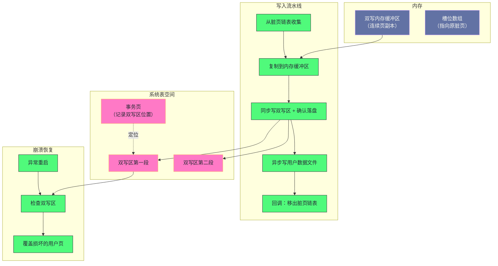

# 08. InnoDB 双写机制：数据页写入的保险丝

**摘要：**

双写缓冲是最容易被误解的机制之一：**它不加速任何操作，反而让写入变慢**——**因为它存在的唯一目的是"防止数据页被写坏"。** 它要对付的问题来自一个物理事实：**磁盘的原子写入单位是扇区，而数据页比扇区大得多**——**因此"正在写一个页时断电"可能留下"只写了一半的页"。** 而更麻烦的是：**这种"残缺页"连重做日志都救不了**——**因为日志是"相对于页的操作"，而残缺页的校验和已经失效，日志重放无从下手。** 双写的解法很直接：**在写入用户数据文件之前，先把页完整地写到一个固定的顺序区域**——**这样即使正式写入失败，也能从这个区域把完整的页复制回去。** 本文按"问题是什么 → 为什么日志救不了 → 机制怎么组织 → 写入与恢复流程 → 现在还该不该开"展开。先说明残缺页的成因与"日志只能恢复干净但旧的页"这条边界；再拆解双写区的位置、元数据存储与备份字段、内存结构；然后讲写入流水线里"同步写双写区、异步写用户文件"的分工与它的性能代价、崩溃恢复的两个判据与"为什么不扫描所有页"。之后是原子写检测（以及"检测不等于启用"这个容易误判的地方）、开关的三种模式、关闭双写的收益与风险、双写区损坏的恢复流程。最后是演进史、四处遗留设计与边界反例。

---

## 第 1 章 一道"保险丝"

### 1.1 一个物理事实

这个机制要对付的问题，根源是一个物理事实：**磁盘能保证"原子写入"的单位是"扇区"，而扇区比数据页小得多。**

**"原子写入"的含义是"要么整个单位写成功、要么完全没写"**——**因此如果"写入单位大于扇区"，那么"写到一个单位的中间时断电"就可能留下"部分写"的结果。**

**而数据页的常见大小是 16KB**——**它远大于 512 字节的扇区。** **因此"写一个数据页"实际上是"写 32 个扇区"，而在这 32 个扇区之间断电，就可能得到"前若干个扇区是新数据、后若干个是旧数据"的页。**

**这个结果被称为"残缺页"**——**而它的危害在于"它既不是新版本、也不是旧版本"。**

### 1.2 残缺页为什么无法被"读出来"

**残缺页的直接后果是"页内校验失败"。**

**页里有一处校验值，用于检测"页是否完整"**——**而"部分写"会让校验值与新内容不匹配**，**因此这个页会被标记为"损坏"。**

**而"损坏"的后果比"内容错乱"更严重**：**因为数据库无法信任这个页里的任何字段**——**包括"页的版本序号"。** **而"版本序号"恰好是"判断是否需要重做"的依据**（第 7 篇已展开）。

**因此"残缺页"的处理方式是"跳过它"**——**而"跳过"意味着"这一步修改丢失"。**

### 1.3 为什么日志救不了

**一个自然的疑问是：既然有重做日志，为什么不能"重放日志把页修好"？**

**答案是"重放日志需要先能读到页"**——**而重放的前提有两个**：**其一，"页的版本序号小于日志的序号"**（说明页比日志旧，需要重做）；**其二，"页的校验和正确"**（否则无法读出序号）。

**残缺页恰好破坏了第二个前提**：**校验和失败导致"序号不可信"，因此"无法判断是否需要重做"。**

**所以重做日志的能力边界是清楚的**：**它能恢复"干净但旧的页"（页完整、但内容落后于日志），**但**无法修复"破损的页"**——**因为"修复"需要"以页为基础应用操作"，而"破损的页"不能作为基础。**

**这条边界正是双写存在的理由**：**它填补的是"日志覆盖不到的那一类损坏"。**

### 1.4 三条设计原则与代价

这个机制遵循三条设计原则。

**原则一：不是缓存，是保险。** **它不加速任何操作**——**因此不能用"缓存命中率"这类指标来评估它。** **它的价值只体现在"崩溃恢复时"。**

**原则二：页镜像加两次写。** **所有待刷的页先顺序写入双写区，再离散写入用户数据文件**——**因此"每个页被写两次"。**

**原则三：崩溃自救。** **如果用户数据文件里的页损坏，可以从双写区加载完整副本覆盖它。**

**三条原则带来三处代价**：**写放大**（每页写两次）、**额外的同步等待**（双写区必须确认落盘）、**以及"恢复时的额外一步"**（要先处理双写区）。**三处代价里，"写放大"最容易被观测到，而"同步等待"最容易被忽略**——**因为后者不体现在"写入总量"上，而体现在"刷脏的节奏"上。**

**三处代价的共同特征是"它们都是'保险'的保费"**——**而"保费该不该付"取决于"风险有多大"与"后果有多严重"**——**这正是第 8 章要展开的取舍。**

> [!info] 核心概念
> 判断一个机制"是不是缓存"，可以看它的"收益来源"：**缓存的收益来自"减少重复的昂贵操作"**（因此它让操作变快）；**而双写的收益来自"保留一份可恢复的副本"**（因此它让操作变慢）。**两者都叫"buffer"，但它们的性质相反**——**混淆会导致"用缓存的思路去评估它"（例如看命中率），而那是无效的。**

### 1.5 一个类比：合同的双份签署

把双写类比成"合同的双份签署"会更容易理解它的结构。

**"直接把改好的文件存回原位置"对应"直接写数据页"**——**如果存到一半断电，原文件就毁了**（残缺页）。

**"先在'草稿本'上完整誊一份，再往原文件上抄"对应"先写双写区"**——**这样即使"往原文件上抄"的过程中断电，**也能**"从草稿本重新抄一遍"。**

**"草稿本必须写完并确认"对应"同步写双写区并确认落盘"**——**因为"没写完的草稿本"救不了原文件。** 而这正是"同步等待"这笔代价的来源。

**"草稿本只留最近几页"对应"双写区容量固定"**——**因为它的作用只是"暂存一批"，而不是"永久备份"。** 而"只留一批"意味着它的成本是可控的。

**"抄完之后把草稿本擦掉"对应"恢复完成后清空双写区"。** 而"擦掉"这一步是必需的——**因为"没擦掉的草稿"会让下一次恢复误判。**

**这个类比的用处在于"它把三处代价变成了可感知的日常经验"**：**要多写一遍（写放大）、要等草稿本写完（同步等待）、要多一个草稿本的位置（空间）。** **而"该不该用这个流程"取决于"原文件被写坏的后果有多严重"。**

---

## 第 2 章 架构全景

### 2.1 五个子模块

这个机制由五个子模块构成。

**第一个是"内存双写缓冲区"**：**暂存"待刷脏页的完整副本"**——**它是一块连续内存，页在其中顺序排列。**

**第二个是"磁盘双写区"**：**持久化页副本**——**它位于系统表空间内，由两个连续的区组成。**

**第三个是"事务页元数据"**：**存储"双写区的位置信息"**——**因为双写区的位置是固定的（在系统表空间的某个页里记录）。**

**第四个是"批量刷写调度"**：**收集脏页 → 写双写区 → 写用户数据文件**——**它的核心作用是"把多次小的同步写合并成一次"。**

**第五个是"崩溃恢复模块"**：**在启动时检测并修复残缺页**。

**五个子模块的关系是"内存区暂存、磁盘区持久化、元数据定位、调度批量执行、恢复模块善后"。** **而"调度"这一环最值得留意**：**因为"双写"本身的成本主要来自"额外的同步等待"，而调度决定了"一次等待能覆盖多少个页"。**

### 2.2 全景图示

**图中最值得注意的是"同步与异步的分工"**：**写双写区是同步的（必须确认落盘），而写用户数据文件是异步的。** **这个分工的原因很直接**：**"双写区写成功"是"安全的前提"**——**因此必须等它确认；而"用户文件写成功"不是前提**——**因为即使它失败，也能从双写区恢复。**

**因此"同步"这一环是"必要的等待"，而"异步"这一环是"可以并发的写入"。** **这个分工把"额外的同步等待"压缩到了"一次批量"**——**而"一次批量能覆盖多少页"决定了"代价被摊薄的程度"。** 因此"批量大小"这个参数的重要性，完全来自"它决定了同步等待被摊薄多少"。

### 2.3 一条容易误解的边界

最后澄清一处容易误解的地方：**双写保护的"粒度是页"，而"触发时机是刷脏"。**

**也就是说**：**它不是"每次修改都写双写区"**，而是"**在把一个脏页刷到用户数据文件之前，先把它写进双写区**"。

**这个时机选择的意义是"它把双写的成本绑定在'刷脏'上"**——**而"刷脏"是后台行为（或降级路径）**，**因此双写的成本不会直接加到"每条 SQL 的延迟"上**（除非触发降级路径）。

**这也解释了"为什么双写的性能影响是'吞吐'而不是'延迟'"**：**它增加的是"刷脏路径的工作量"，而"刷脏"与"查询"在时间上大部分是分离的。** **因此它的表现是"同样的负载下吞吐下降"，而不是"查询变慢"。**

---

## 第 3 章 磁盘布局

### 3.1 双写区的位置与大小

**双写区位于系统表空间内，位置固定、大小固定。**

**"位置固定"的理由与第 3 篇讲的"结构副本放在固定页"是同一类**：**因为"定位它"这件事不能依赖"别的元数据"**——**否则"元数据损坏时就读不到它"**。**因此把它放在"已知的固定位置"。**

**"大小固定"的理由是"它只需覆盖'一批刷脏'的量"**：**因为"双写区的作用是'在正式写入之前暂存'"，**而**"暂存一批就够"**——**不需要"无限大"。**

**因此它的设计取向是"小而固定"**——**这与"缓冲池"的"大而动态"形成对比**：**两者都在"内存与磁盘之间"，但一个追求"装得多"，一个追求"放得住"。**

### 3.2 元数据存储

**双写区的位置信息记录在系统表空间的某个固定页里。**

**记录的内容包括**：**一个"魔数"**（用于校验"这块信息是否有效"）、**两个区各自的起始页号**、**以及"文件段信息"**（用于描述这块区域的分配）。

**而"这些字段在页内的偏移也是固定的"**——**因为"读取它们"不能依赖"解析页结构"**（否则页结构损坏时就读不到）。

**因此"双写区的定位"整条链路都是"固定位置加固定偏移"**——**这是"在最坏情况下仍能定位"的必要条件。** **这与第 3 篇讲的"结构副本的三处设计"是同一条原则**：**让"恢复入口"不依赖任何可能已损坏的东西。**

### 3.3 为什么要有"备份字段"

**元数据里有一处"重复信息"，它的作用值得说明。**

**因为"事务页"本身也要被写入**——**而"写入事务页"同样面临"部分写"的风险。** **如果"双写区的位置信息"被写坏，那么"整个双写机制就失效了"。**

**因此把"位置信息"存两份**——**读取时"取校验通过的那一份"。** **这个设计与第 7 篇讲的"检查点信息存两处"完全一致**：**都是"用冗余对抗'元数据自身被写坏'的风险"。**

**这条设计说明一个通用规律**：**当"元数据"本身也可能被写坏时，它需要自己的冗余**——**而"元数据的元数据"如果再被写坏，就需要再一层。** **因此"层级"的终止条件通常是"最后一级存放在'物理上不会被部分写的位置'"**（例如"固定扇区"）。

### 3.4 两个区的用法

**双写区由两个连续的段组成，每段包含固定数量的页。**

**两段的用法是"顺序写入、循环使用"**——**而不是"乒乓切换"。** **也就是说：页被依次填入"第一段、第二段"，填满之后从头开始。**

**因此"两段"的作用不是"交替使用"，而是"提供一个更大的连续区域"**——**而"连续"正是它的价值所在**：**因为"连续区域"意味着"一次写入就能覆盖多个页"，从而把"多次同步"合并成"一次"。**

**这条区分容易被误解**（把"两段"当作"双缓冲"）——**而它们的差别是"是否交替"**：**双缓冲是"写入一块时读另一块"，而这里是"顺序填满、从头再来"。** **理解这一点，才能理解"为什么它的批量大小是固定的"。**

### 3.5 固定位置设计的一致性

最后把"固定位置"这条原则在双写机制里的体现梳理一遍，因为它出现了三次。

**第一次出现在"双写区的位置"**：**它在系统表空间里的位置是固定的**——**因此"定位它"不需要读别的元数据。**

**第二次出现在"元数据的偏移"**：**双写区的位置信息写在事务页的固定偏移上**——**因此"读它"不需要解析页结构。**

**第三次出现在"位置信息的冗余"**：**同一份信息存两份**——**因此"其中一份被写坏"时仍能读取。**

**三次出现的共同目的是"让定位链路不依赖任何可能已损坏的东西"**——**而这条原则的适用条件是"定位的时机可能在'其他东西已经损坏'之后"。**

**因此判断"某处是否需要固定位置"，可以问"读取它的时机，是否可能在其他元数据已经损坏之后"**——**如果是，那么它必须"自包含地可定位"。** **这条判据解释了为什么"恢复入口"类的东西几乎都采用固定位置**（第 3 篇的结构副本、第 7 篇的检查点、本篇的双写区）。

---

## 第 4 章 内存结构

### 4.1 结构字段

内存结构可以归为五类字段。

**第一类是"磁盘定位信息"**：**两个区的起始页号**——**它来自"从元数据页读出的值"。**

**第二类是"内存缓冲区"**：**一块对齐的大内存，用于存放页副本**；**以及"下一个空闲位置"**。

**第三类是"批量刷写状态"**：**一个"指向原脏页的指针数组"**（用于写完成后的回调）、**总槽位数**、**已用槽位数**。

**第四类是"并发控制"**：**保护缓冲区分配的互斥锁。**

**第五类是"原子写支持标记"与统计信息**：**前者记录"检测到的设备能力"，后者记录"刷盘次数与页数"。**

**五类字段里，"指向原脏页的指针数组"这一项值得留意**：**它让"写入完成后的回调"能定位到"该把哪个页移出脏页链表"**——**因此"指针数组"与"内存缓冲区"是"一一对应"的两组数据。**

### 4.2 槽位分配

**内存缓冲区按页大小对齐，槽位与"两个区"的页一一对应。**

**因此"槽位号"同时决定了"页在内存缓冲区的位置"与"页在磁盘双写区的位置"**——**这个"一份编号对应两处位置"的设计省掉了一层映射。**

**这与第 7 篇讲的"序号到文件偏移的换算"是同一手法**：**用"可计算的对应"替代"需要维护的映射表"。** **而它成立的前提是"内存缓冲区与磁盘区的布局一致"**——**即"第 N 个槽位对应磁盘区第 N 个页"。**

**这条对应关系的价值在于"写入时不需要计算"**：**只要知道槽位号，就能算出"写到哪个页"。**

### 4.3 为什么每实例一份

**较新版本里，每个缓冲池实例维护自己的双写内存结构。**

**为什么需要"每实例一份"**：**因为"刷脏"是"按实例进行的"**（第 4 篇已展开缓冲池的分区设计）——**如果所有实例共用一份双写缓冲，那么"分配槽位"这一步就需要全局互斥**，**而这会把"分区化"带来的并发优势抵消掉。**

**因此"每实例一份"是"缓冲池分区"的自然延伸**：**把"共享资源"拆成"每实例一份"，从而让"并发路径"不必跨实例加锁。**

**而它带来的代价是"内存占用增加"**（每实例都有一块缓冲区）**与"磁盘区可能也要分块"**——**后者正是"独立双写文件"这个特性要解决的问题。**

**这条延伸说明一个规律**：**当"上层结构被分区"之后，"它依赖的下层结构"往往也需要分区**——**否则下层会成为新的串行点。** **这与第 4 篇讲的"瓶颈转移"是同一现象。**

### 4.4 内存占用与批量大小的关系

**内存缓冲区的大小由"槽位数乘以页大小"决定**——**因此"槽位数"同时决定了"内存占用"与"单次批量的上限"。**

**这个双重作用带来一个取舍**：**槽位多则"批量大、摊薄效果好"，但"内存占用高"**；**槽位少则相反。**

**而在"每实例一份"的设计下，"总内存占用"还要乘以"实例数"**——**因此"槽位数固定"这个选择在"实例数很多"时会放大内存占用。**

**这个取舍的通用形态是"用一个固定参数同时控制两个目标"**——**而它的代价是"无法单独调优"**。**因此当"两个目标的最优值不同"时，就必须做出取舍**——**这正是"批量大小硬编码"这个遗留设计的由来**（第 9 章）。

**一条实用的判断方式是**：**看到"某个参数同时影响内存与吞吐"时，先确认"在当前配置下，哪个目标更紧"**——**如果内存充裕而吞吐受限，那么"调大它"的收益是直接的。**

---

## 第 5 章 写入流水线

### 5.1 触发时机

**双写的触发时机是"刷一个脏页到用户数据文件之前"**——**而"刷脏"由多种原因触发**（第 4 篇讲的三种刷脏策略）。

**而"双写是否执行"还有两个前置判断**：**其一，双写功能是否开启**；**其二，设备是否支持原子写**（如果支持且已显式关闭双写，则不执行）。

**因此"双写"的启用条件是"功能开启且设备不支持原子写"**——**而"设备支持原子写"这个判断是较新版本引入的**（第 7 章展开）。

### 5.2 批量收集

**写入的第一步是"把待刷的脏页复制到内存缓冲区"，而这一步是"批量收集"的。**

**收集的过程是**：**从脏页链表取出一批页 → 对每个页"分配一个槽位并复制内容" → 记录"槽位到原页的指针"。**

**"批次大小"有上限**——**而达到上限（或遇到"需要同步刷写"的情况）就"执行写入"。**

**"批量收集"的价值是"把多次同步合并成一次"**：**因为"写双写区"需要同步确认落盘，**而**"确认一次"能覆盖"一批页"**——**因此"批次越大，每次确认摊到的页越多"。**

**而"批次大小"决定了"摊薄的效果"**——**这也是第 9 章要讲的"批次大小硬编码"这个遗留设计的由来。**

### 5.3 同步与异步的分工

**写入的第二步是"同步写双写区并确认落盘"，第三步是"异步写用户数据文件"。**

**这个分工的理由已在第 2.2 节说明**：**"双写区写成功"是安全的前提，而"用户文件写成功"不是。**

**而"异步"这一环的设计值得留意**：**它让"多个页的正式写入可以并发进行"**——**因此"正式写入"这一步的延迟不累加。** **而"完成回调"则负责"把页移出脏页链表"**（第 4 篇讲的"刷脏完成"）。

**这个"同步一步、异步一步"的结构是"保险机制"的典型形态**：**"投保"必须确认完成（否则保险无效），而"正式动作"可以随后进行（因为已经有了保障）。**

### 5.4 性能代价

**性能代价落在三处。**

**其一是写放大**：**每个页被写两次**——**因此"写入总量"增加。** **这个放大是可以量化的**（"通过双写写入的页数"相对于"日志写入量"的比值），**而它的典型值在 2 倍上下。**

**其二是额外的同步等待**：**双写区必须确认落盘**——**因此"刷脏"多了一次同步。**

**其三是机械盘上的额外寻道**：**双写区与用户数据文件在不同位置**——**因此在机械盘上，"写双写区"与"写用户文件"是两次不同位置的写入，**而**这增加了寻道。**

**三处代价里，"写放大"与"同步等待"在固态盘上依然存在，而"额外寻道"消失了**——**因此"关闭双写的收益"在机械盘与固态盘上不同**（第 8 章展开）。**这条区分很重要**：**它说明"同一个机制的代价构成会随硬件变化"，而"该不该关"取决于"剩下的那些代价有多大"。**

### 5.5 写入流水线与刷脏策略的关系

**双写的写入流水线不是独立触发的，它挂在"刷脏"这条链路上**——**因此"刷脏策略"会直接影响"双写的批量效果"。**

**具体关系是**：**如果"刷脏"是"按需触发"的（因为淘汰需要空闲页）**，那么**"一次能收集到的页"可能很少**（因为"需要多少就刷多少"）——**而这会让"批量效果差"。** **反之，如果"刷脏"是"按比例或按检查点主动触发"的**，那么**"一次能收集的页更多"**，**批量效果更好。**

**因此"双写的开销"不是恒定的**——**它在"主动刷脏为主"的场景下被摊薄得更好，而在"按需刷脏为主"的场景下开销更显著。** **这解释了为什么"缓冲池充足、刷脏主动"的实例，双写的性能影响更小。**

**这条关系的实践含义是**：**优化双写的开销，可以从"让刷脏更主动"入手**——**而这与"优化刷脏本身"是同一件事**（第 4 篇已展开）。**因此"两个机制的开销"往往可以通过"改善它们共同的依赖环节"来一起优化。**

---

## 第 6 章 崩溃恢复

### 6.1 恢复流程

**崩溃恢复时，"处理双写区"分五步。**

**第一步：读取双写区的所有页。** **一次读入整块区域**（因为它连续）。

**第二步：逐页取出"目标页的标识"。** **如果标识为空（全零），说明这个槽位未使用，跳过。**

**第三步：读取"用户数据文件里的对应页"。**

**第四步：判断"是否需要覆盖"。** **判据有两个**（第 6.2 节）。**需要覆盖则写入双写页的内容并确认落盘。**

**第五步：清空双写区。** **因为"已经恢复完成"，**而**"双写区的内容是上一轮的残留"**——**因此必须清掉，否则下一轮会误判。**

**五步里最值得注意的是第五步**：**"清空"这一步容易被忽略，但它关系到"下一轮的正确性"**——**因为"未清空的残留页"会让"下一轮恢复"误以为"它们需要被覆盖"。**

### 6.2 两个判据

**"是否需要覆盖"由两个判据决定。**

**判据一：用户页是否损坏。** **如果校验失败，说明它可能是残缺页**——**因此需要用双写页覆盖。**

**判据二：用户页的版本序号是否小于双写页的序号。** **如果小于，说明"用户页比双写页旧"**——**因此需要覆盖（否则会丢失双写页里那次更新的内容）。**

**两个判据的关系是"或"**：**只要满足任一条就覆盖。** **而它们的组合覆盖了两类情况**：**"用户页坏了"与"用户页旧了"。**

**这条设计的巧妙之处在于"它同时处理了'写坏了'与'没写完'"**：**"写坏了"由校验判据发现，"没写完"由序号判据发现**——**而"没写完"这种情况的页可能"校验恰好通过"（例如只有部分字节是旧值但校验字段恰好没被写），因此需要序号判据兜底。**

### 6.3 为什么"不扫描所有页"

**一个值得追问的设计选择是：为什么恢复时"只检查双写区里的页"，而不"扫描所有用户页"？**

**原因是"代价太高"**：**用户页的数量可能是"双写区容量的成千上万倍"**——**因此"扫描所有页"会让恢复时间与"数据总量"成正比，而不是与"未落盘的修改量"成正比。**

**而"只检查双写区"的代价是"与双写区大小成正比"**——**它是一个固定的小量。** **因此这个选择的收益是"恢复时间可控"。**

**这条取舍的通用形态是"用'已知的候选集合'替代'全量扫描'"**：**因为"双写区记录的就是'最近可能出问题的页'"**——**因此"检查它"等价于"检查了所有可能出问题的页"，而成本低得多。**

**这与第 3 篇讲的"原子 DDL 用日志记录意图"是同一手法**：**用"显式记录'可能要做什么'"替代"事后推断'可能发生了什么'"。** **而"显式记录"的成本总是远低于"全量检查"。**

### 6.4 恢复顺序中"双写处理"的位置

**"处理双写区"在恢复流程中的位置值得说明，因为它决定了"它与日志重放的关系"。**

**它的位置是"在日志重放之前"**——**也就是说：先"用双写区把损坏的页修好"，再"重放日志把页更新到最新状态"。**

**这个顺序的理由是"日志重放需要页可读"**：**因为"重放的前提是能读出页的版本序号"**（第 1.3 节）——**因此必须先把"不可读的页"变成"可读的页"。**

**因此两个机制的分工是清楚的**：**双写负责"把页恢复到'完整'"，而日志负责"把页恢复到'最新'"。** **两者缺一不可**：**只有双写则页是旧的，只有日志则损坏的页无法恢复。**

**这条分工说明一个通用结构**：**"修复"与"推进"是两个不同的动作，且它们有顺序依赖**——**因此设计恢复流程时，正确的顺序是"先让所有东西回到可工作的状态，再让它们推进到最新状态"。** **把两者混在一起（例如"一边修一边推进"）会让"修不动的东西"阻塞"能推进的东西"。**

---

## 第 7 章 原子写检测

### 7.1 检测逻辑

**较新版本引入了"设备是否支持原子写"的检测**——**而检测的判据有三条。**

**其一是"设备是否属于已知支持原子写的类型"**（例如某些专用设备）。

**其二是"是否被显式指定为原子写"**（一个参数强制开启）。

**其三是"是否属于持久内存类设备"**（较新版本加入的判断）。

**三条判据的共同特征是"它们都是'已知的可靠清单'"**——**而"不在清单里"则判为"不支持"。** **这个"保守判定"的取向是合理的**：**因为"误判为支持"会导致"该保护时没保护"，而"误判为不支持"只是"多付一点性能"。**

**因此"检测的保守性"是这类判定的正确取向**——**而"宁可多保护"正是"保险机制"应有的态度。**

### 7.2 检测与启用是两件事

**这里有一处最容易误判的地方：检测到"支持原子写"不等于"自动关闭双写"。**

**实际行为是"记录一个标记并在日志里提示"，**而**"是否关闭"仍需使用者显式设置。**

**为什么这样设计**：**因为"设备宣称支持"与"实际可靠"之间存在差距**——**例如"需要文件系统与驱动全栈配合"才能保证，而"某一层不支持"就会让保证失效。** **因此"把最终决定权交给使用者"是更稳妥的。**

**这个设计的实践含义是**：**"换了支持原子写的设备"之后，**如果**"没有显式关闭双写"，那么"性能不会改善"**——**而"以为换了设备就好了"是一个常见的误判。**

**因此"设备升级后的配置复查"应当包含"双写是否该关"这一项**——**而这类"配置未跟随硬件升级"的问题与第 4 篇讲的"NUMA 陷阱"是同一类。**

### 7.3 开关的三种模式

**较新版本把开关从"两态"扩展成了"三态"。**

**第一态是"完全开启"**：**既写入双写区，也在恢复时用它修复。**

**第二态是"仅检测"**：**不写入双写区，但"记录'哪些页在写入时可能出问题'"**——**它用于"评估设备的可靠性"**（即在真实负载下观察"是否真的出现残缺页"）。

**第三态是"完全关闭"。**

**"仅检测"这一态的价值在于"它提供了一个'验证'的中间选项"**：**在"想关闭但不确定设备是否可靠"时，可以先"只检测不修复"，观察一段时间**——**如果没有出现问题，再真正关闭。**

**这条"先观察再决定"的路径与第 5、6 篇讲的"备份必须验证"、第 3 篇讲的"迁移前必须演练"是同一纪律**：**涉及"放弃一项保护"的决策，应当先"验证替代方案是否可靠"。**

### 7.4 检测机制的可靠性边界

最后说明"检测机制"本身的可靠性边界，因为它关系到"能不能放心关闭"。

**检测的依据是"设备类型的清单"**——**而"清单"意味着"已知的、被验证过的设备"。** **因此"新出现的设备"默认"不在清单里"**，**于是"即使它真的支持原子写，也不会被识别"。**

**这个"保守清单"的设计取舍是清楚的**：**"误判为不支持"的代价是"多付性能"，而"误判为支持"的代价是"数据损坏"**——**两者的严重程度不对等，因此保守是正确取向。**

**但它带来一个实践后果**：**"使用新设备时，即使厂商宣称支持原子写，也可能需要'显式强制'才能生效"**——**而"显式强制"意味着"由使用者承担'宣称是否真实'的责任"。**

**因此"是否显式强制"这个决定，需要"厂商的明确承诺"加"自己的验证"**——**而"仅检测模式"恰好提供了这个验证手段**（第 7.3 节）。**两者配合起来的路径是：先"仅检测"跑一段时间，确认没有残缺页出现，再"显式强制关闭"。**

**这条路径的形态值得记住**：**当"自动化机制因为保守而无法确认某件事"时，正确的做法不是"绕过它"，而是"用它提供的中间选项自己完成验证"。**

---

## 第 8 章 生产落地

### 8.1 关闭双写的收益与风险

**关闭双写的收益可以量化：在固态盘上的实测显示，吞吐有明显提升、延迟下降、写放大显著减少。**

**收益的来源是"消除了一整轮额外写入"**——**因此"写放大降低"是收益的核心（它同时意味着"更少的 IO"与"更少的设备磨损"）。**

**而风险是"残缺页可能重新出现"**——**具体条件是"掉电时正好在写某个页的中间扇区"。**

**因此"该不该关"的判据是"这个风险是否已被别的方式覆盖"**：**例如"有备用电源"（保证掉电时能写完）、"有底层存储的原子写保证"、"有完善的备份与恢复演练"、"以及业务能接受极低概率的页损坏"。**

**判据的核心是"风险的后果是否可控"**——**而不是"风险概率有多低"。** **因为"低概率"在高负载长时间运行下会累积**——**而"后果可控"才是真正的安全边界。** 这个判断方式同样适用于"备份频率""副本数量"这类"以概率换成本"的决策。

### 8.2 参数与决策树

| 参数 | 内核依据 | 调整方向 |
|---|---|---|
| 双写开关 | 控制"是否写入双写区" | 按设备能力与风险覆盖决定 |
| 独立双写文件数 | 把双写区从系统表空间分离 | 新部署建议启用 |
| 批量大小 | 单次刷写的页数上限 | 官方版硬编码 |
| 原子写检测 | 是否自动识别支持原子写的设备 | 通常保持自动 |
| 刷盘方式 | 与双写协同的写入方式 | 通常使用直接 IO |

**决策树的形状很直接**：**先看设备（机械盘或低端固态盘必须开；支持原子写的设备可关）；再看风险覆盖（有备用电源、有可靠备份、有演练则可关）；最后看业务容忍度（金融交易类建议开；日志分析类可关）。**

**决策树的三个层次是"设备能力 → 风险覆盖 → 业务容忍度"**——**而这三者的顺序不能颠倒**：**因为"设备不支持原子写"时，后两个层次的讨论没有意义**（关闭双写必然有风险）。

### 8.3 监控要点

**双写侧可观测的信息有三类。**

**第一类：通过双写写入的页数与刷盘次数。** **两者的比值反映"平均每批写多少页"**——**而这个比值如果偏小，说明"批量效果不好"。**

**第二类：写放大系数。** **它是"通过双写写入的页数"相对于"日志写入量"的比值**——**而它的典型值在 2 倍上下。** **如果它异常偏高，说明"双写写入的次数过多"。**

**第三类：原子写支持标记。** **它回答"当前设备是否被识别为支持原子写"**——**而"识别为支持但双写仍开着"是"配置未更新"的信号。**

**三类信息的共同特征是"它们都反映'双写的成本'"**——**而"成本是否值得"需要与"风险"一起判断**（第 8.1 节）。**因此"看到写放大高"不等于"应该关掉它"**——**还要确认"风险是否已被覆盖"。**

### 8.4 双写区损坏的恢复

**双写区所在的表空间损坏时，恢复路径有三条。**

**第一条是"从备份恢复"**——**最安全，但依赖"备份的时效性"。**

**第二条是"重建系统表空间加导入用户表空间"**：**先创建一个全新的系统表空间，再"逐个把用户数据文件导入"**——**而这一步需要"先建表、再丢弃表空间、再导入文件"。** **这条路径依赖"用户数据文件本身完整"。**

**第三条是"从副本同步"**：**如果存在从库，可以从从库同步受损的表。**

**三条路径的共同特征是"它们都绕过了'用双写区自救'这条正常路径"**——**因为"双写区本身损坏"意味着"这条路径不可用"。** **这也是"双写区应当独立存放"这条建议的由来**：**它与系统表空间同处一处时，"一处损坏"会同时影响"数据字典"与"双写区"。**

### 8.5 一次"刷脏变慢"的排查推演

把排查路径串成一个案例。

假设现象是"写入吞吐下降，而查询延迟正常；磁盘利用率上升但业务量没有增加"。

**第一步，确认"变慢的是刷脏路径而不是查询路径"。** **如果"查询延迟正常"而"吞吐下降"，那么方向在"后台路径"**——**因为"查询路径"的问题会表现为延迟上升。**

**第二步，确认"后台路径的额外工作量来自哪"。** **观察"通过双写写入的页数"与"刷盘次数"**：**如果这个比值偏小（每次批量页数很少），说明"批量效果差"，而"批量效果差"意味着"同步等待被摊薄得不够"。**

**第三步，如果是"批量效果差"，检查"刷脏策略"。** **如果"刷脏"以"按需触发"为主（每次只刷少量页），那么"收集到的页很少"**（第 5.5 节）——**而处置方向是"让刷脏更主动"**（例如调高刷脏的触发比例）。

**第四步，确认"设备是否支持原子写"。** **如果支持且业务能接受风险，那么"关闭双写"能直接消除这一整轮额外写入。**

**第五步，确认"双写区是否与系统表空间同处一地"。** **如果同处一地，可以考虑"启用独立双写文件"**——**虽然它不直接改善性能，但它降低了"单点损坏"的风险。**

**五步的价值在于"它把'吞吐下降'定位到了后台路径，再定位到双写这一环"**——**而它的起点是"区分'查询路径变慢'与'后台路径变慢'"**。**这个区分很关键**：**因为两者的排查方向完全不同**（前者查索引与执行计划，后者查刷脏与日志）。

---

## 第 9 章 演进史与遗留设计

### 9.1 关键节点

| 版本 | 变化 | 动因 |
|---|---|---|
| 早期 | 引入双写缓冲 | 解决部分写问题，当时固态盘未普及 |
| 中期 | 固定区域、无关闭选项 | 默认开启 |
| 后续 | 支持关闭 | 用于性能测试与特殊设备 |
| 5.7 | 每缓冲池实例独立双写缓冲 | 减少锁竞争 |
| 8.0.20 | 原子写设备自动检测 | 支持原子写的设备开始普及 |
| 8.0.30 | 独立双写文件、仅检测模式 | 分离单点风险、提供验证手段 |

**这条演进线的主线是"从'必须开'到'可以选择'"**：**早期它"没有关闭选项"**（因为"部分写"是普遍风险）；**后来"支持关闭"**（因为出现了支持原子写的设备）；**再后来"支持独立存放"与"仅检测模式"**（因为"如何安全地关闭"需要更多工具）。

**这条轨迹与第 5、6 篇讲的机制一致**：**当"机制依赖的硬件前提"开始动摇时，机制就会从"必需"变成"可选"，而"配套的验证与迁移工具"随之出现。**

### 9.2 四处遗留设计

**第一处：双写区默认仍在系统表空间。** **因此"系统表空间损坏"会同时影响"数据字典"与"双写区"。** **改进方向是"显式启用独立双写文件"。**

**第二处：批量大小硬编码。** **对"超大缓冲池"而言，固定的批量可能偏小**——**从而"增加同步次数"。**

**第三处：原子写检测仅限特定平台。** **在其他平台上"即使硬件支持也无法自动识别"**——**因此只能"显式强制"。**

**第四处：与压缩页的兼容性。** **双写存储的是"压缩后的页"**——**因此"如果压缩算法版本变化，恢复后解压可能失败"。**

**四处遗留设计的共同特征是"它们是'默认配置的滞后'或'平台差异'"**：**第一处与第二处是"默认值没有跟上更优的部署方式"，第三处是"平台能力差异"，第四处是"与另一个机制的耦合"。** **而它们的处置方式通常是"显式配置"**——**因此"知道有这些遗留点"比"等待默认值改变"更实际。**

### 9.3 演进方向

**方向一：持久内存。** **它支持"单次写入即完整页"**——**因此"部分写"这个前提消失**，**双写完全冗余。**

**方向二：支持原子写的固态盘。** **指令集已支持"大块原子写"**——**但需要"文件系统、驱动、数据库"全栈配合。** **因此它的普及取决于"整条链路的支持程度"，而不只是硬件。**

**方向三：内存语义的存储。** **如果存储以"内存语义"访问，那么"页"这个概念本身可能消失**——**而"双写"作为"页的保护机制"也随之消亡。**

**三个方向的共同特征是"它们都在消除'部分写'这个前提"**——**而"前提消失则机制消亡"这条规律在本专栏里已出现多次**（第 5 篇的变更缓冲、第 6 篇的自适应哈希索引）。**因此判断"某个保护机制还能活多久"，可以问"它防的那个风险，在当前硬件下还存不存在"。**

### 9.4 一条关于"保护机制"的通用判断

最后把这类"保护机制"的判断方式收敛一下，因为它在整本专栏里反复出现。

**判断一个保护机制是否仍然必要，可以问四个问题。**

**问题一：它防的是什么风险？** **本机制防的是"页的部分写"**——**而明确"风险是什么"，是后续判断的前提。**

**问题二：这个风险的物理前提还在吗？** **"部分写"的前提是"写入单位大于原子单位"**——**因此"大块原子写"会消除它。**

**问题三：代价有多大、由谁承担？** **本机制的代价是"写放大与同步等待"**——**而它由"刷脏路径"承担**（因此表现为吞吐而非延迟）。

**问题四：风险被别的方式覆盖了吗？** **例如"备用电源"覆盖"掉电"这个触发条件**、"底层存储保证"覆盖"部分写"这个风险本身。

**四个问题的顺序是有意的**：**先明确风险，再判断前提，然后算代价，最后看是否有替代。** **而"跳过第一个问题"是最常见的错误**——**因为"不知道它防什么"就无法判断"该不该关"。**

**这条判断方式不只适用于双写**：**它适用于"所有以'保险'为性质的机制"**——**而识别这类机制的方法是看它的收益来源**（第 1.4 节的核心概念）。

---

## 第 10 章 边界与反例

### 10.1 反例一：把双写当作"缓存"来评估

它不加速任何操作，**因此"命中率"这类指标对它没有意义**。**评估它应当看"它防住了哪些损坏"与"它付出了多少代价"。**

### 10.2 反例二：以为"换了支持原子写的设备就自动关闭"

检测到支持并不会自动关闭，**仍需显式配置**（第 7.2 节）。

### 10.3 反例三：把"低概率"当作"可以忽略"

"低概率"在"高负载长时间运行"下会累积。**判断应当基于"后果是否可控"，而不是"概率有多低"**（第 8.1 节）。

### 10.4 反例四：把"关闭双写"当作"纯性能优化"

关闭后"残缺页的风险重新出现"——**而它的后果是"数据页永久损坏"**。**因此这是一个"用风险换性能"的决策，必须由业务确认。**

### 10.5 反例五：忽略"双写区与系统表空间同处一地"的风险

一处损坏会同时影响两者，**从而使"自救路径"不可用**（第 8.4 节）。

### 10.6 反例六：把"两个双写区"当作"双缓冲"

两个区是"顺序填满、循环使用"，**不是"交替使用"**（第 3.4 节）。**误解会影响"对批量大小的理解"。**

### 10.7 反例七：在恢复时扫描所有用户页

代价太高。**正确做法是"只检查双写区记录的候选页"**（第 6.3 节）。

### 10.8 反例八：把"双写"与"日志"当作"二选一"

两者分工不同：**双写把页恢复到"完整"，日志把页恢复到"最新"**（第 6.4 节）。**关掉双写并不等于"用日志替代它"**——**因为日志无法修复破损的页。**

---

## 第 11 章 落点

回到开头：**双写为什么不加速反而变慢？**

**因为它的性质是"保险"，而不是"缓存"。** 它对付的问题是"页的部分写"，而这个问题**连重做日志都救不了**——**因为日志的重放需要"以完整的页为基础"，而残缺页恰恰不是完整的页。**

**因此它的解法也只能是"保留一份完整的副本"**——**而"保留副本"必然带来"额外写入"与"额外同步"。** 这就是它"以性能换安全"的全部逻辑。

**而这套逻辑的成立前提是"部分写这个风险真实存在"**——**因此当硬件能保证"大块原子写"时，这个前提就消失了**，**而机制也随之从"必需"变成"可选"。** **这个演化路径在本专栏里反复出现**（变更缓冲、自适应哈希索引、邻近页刷新）——**而它给出的判断方式很一致：问"它防的那个风险还在不在"，比问"它的收益有多大"更能决定它的去留。**

**还有一条经验值得单独留下：涉及"放弃一项保护"的决策，应当先"验证替代方案是否可靠"。** 本机制提供的"仅检测模式"正是为这条纪律服务的——**它让"想关但不确定"的团队可以先观察再决定**。**而这类"中间选项"的设计值得肯定**：**因为"只能二选一"会迫使使用者"在信息不足的情况下做决定"。**

**最后回到"保险"这个性质本身**：**它的价值不在"平时"，而在"出事时"。** 因此评估它时，"平时的性能数字"只是成本，而"出事时的可恢复性"才是收益——**而"收益"这一侧很难量化，这正是它容易被草率关闭的原因。** **理解这一点，就能理解为什么"关不关"这个决定需要谨慎，而不是"看性能提升多少"。**

---

## 专栏导航

- 上一篇：[[07. 重做日志缓冲区与 WAL：InnoDB 持久性的实现基石]]。
- 下一篇：[[09. InnoDB 后台线程：26 个线程的分工协作与调度哲学]]。
- 返回专栏首页：[[00 专栏导览]]。

---

## 参考资料

1. MySQL 8.0.33 源码：`storage/innobase/buf/buf0dblwr.cc`、`buf0dblwr.h`、`storage/innobase/include/trx0sys.h`、`os0file.cc`.
2. MySQL. MySQL Internals Manual: Doublewrite Buffer. https://dev.mysql.com/doc/internals/en/
3. Oracle Blogs. InnoDB Doublewrite Buffer. https://dev.mysql.com/blog-archive/
4. MySQL. 官方文档：innodb_doublewrite 与相关参数说明. https://dev.mysql.com/doc/refman/8.0/en/innodb-parameters.html
5. MySQL. 官方文档：Innodb_dblwr_* 状态变量与写放大观测. https://dev.mysql.com/doc/refman/8.0/en/server-status-variables.html
6. MySQL. 官方文档：表空间导入（DISCARD/IMPORT TABLESPACE）与强制恢复. https://dev.mysql.com/doc/refman/8.0/en/innodb-table-import.html
7. Percona Live. Doublewrite: When to Keep It, When to Ditch It. 2025.
8. MySQL. 官方文档：innodb_doublewrite_files 与独立双写文件说明. https://dev.mysql.com/doc/refman/8.0/en/innodb-parameters.html
9. MySQL. 官方文档：InnoDB 页结构与校验和（FIL_PAGE_LSN、FIL_PAGE_SPACE_OR_CHKSUM）. https://dev.mysql.com/doc/refman/8.0/en/innodb-page-structure.html
10. MySQL. 官方文档：innodb_force_recovery 的六个级别与适用场景. https://dev.mysql.com/doc/refman/8.0/en/forcing-innodb-recovery.html

---

> [!note] 思考题
> 1. 为什么重做日志救不了残缺页？这条边界如何决定了本机制的必要性？
> 2. 写入流水线里"同步写双写区、异步写用户文件"这个分工的理由是什么？
> 3. 恢复时为什么"只检查双写区里的页"而不扫描所有页？
> 4. "检测到支持原子写"为什么不等于"自动关闭双写"？
> 5. "问它防的风险还在不在，比问它的收益有多大更能决定它的去留"——请用本篇与前两篇的例子说明。
