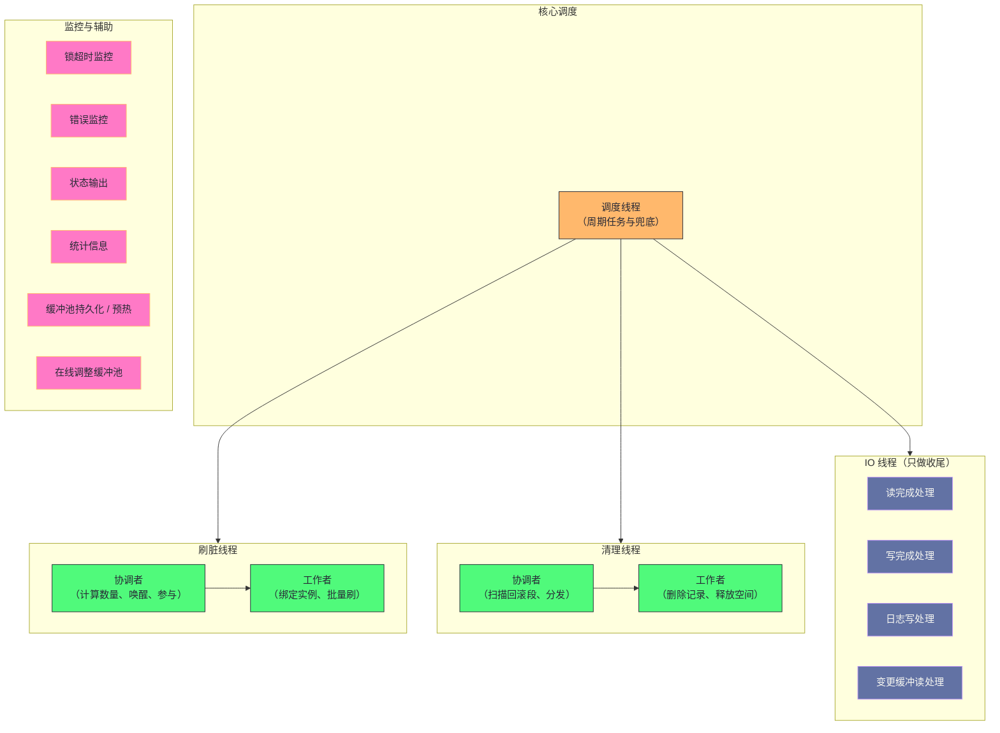

# 09. InnoDB 后台线程：26 个线程的分工协作与调度哲学

**摘要：**

用户线程负责处理 SQL，而"脏活累活"由一组常驻的后台线程承担：**刷脏页、处理异步 IO 的收尾、物理删除废弃版本、监控锁超时、收集统计信息、预热与持久化缓冲池。** 这组线程的设计取向可以概括为三条：**分工专业化**（每个线程聚焦单一职责）、**用户线程不等待**（把可能阻塞的批量工作交给后台）、**核心调度者保持单例**（作为兜底）。本文按"为什么需要它们 → 有哪些线程 → 各自做什么 → 启动顺序为什么重要 → 生产上会出什么问题"展开。先说明用户线程的职责边界与"分工"的三条原则、四处代价；再梳理五类线程家族与"专业化程度持续提高"这条演进主线；然后逐个剖析核心调度线程（曾经的唯一后台线程、如今已被"分权"）、IO 线程（它不发起 IO、只做收尾，这是一处核心误解）、刷脏线程（协调者与工作者的分工与实例绑定）、清理线程（扫描算法与轮询分发）。之后是监控与辅助线程群、线程初始化顺序与它的依赖关系。生产部分覆盖"清理积压导致空间膨胀"这个典型问题、参数矩阵、线程状态观测与排查决策树。最后是演进史、四处遗留设计与边界反例。

---

## 第 1 章 为什么需要"后台工人"

### 1.1 用户线程的职责边界

**用户线程（每个连接一个）的职责是"尽快处理完这条 SQL 并返回结果"。** 而这条职责里包含一个隐含要求：**不要让用户等"与本次请求无关的批量工作"。**

**但数据库有一批"必须做、但与具体请求无关"的工作**：**把内存里改动过的页写回磁盘、把已废弃的记录真正删除、监控是否有锁等待过久、收集统计信息以便优化器决策。**

**如果把这些工作塞进用户线程**，会带来两个后果：**其一是"用户请求的延迟被这些工作拖长"**（因为用户线程要分心做别的）；**其二是"这些工作没有稳定的执行时机"**（因为用户请求的到达是随机的）。

**因此需要"一组常驻线程专门做这些事"**——**这就是后台线程存在的理由。**

### 1.2 三条设计原则

这组线程遵循三条设计原则。

**原则一：分工专业化。** **每个线程聚焦单一职责**——**因此没有"包办一切的巨型线程"。** **这条原则的收益是"每类工作可以独立调优"**（例如刷脏慢就调刷脏线程数，不影响别的）。

**原则二：用户线程不等待。** **尽量把"可能阻塞的 IO 操作"与"批量处理"交给后台**——**因此"用户发起写之后立即返回"，不等待落盘。**

**原则三：核心调度者保持单例。** **有一部分核心线程（例如调度线程）始终只有一个**——**因为"它的职责是协调"，而协调者多于一个会带来冲突。**

**三条原则的关系是"分工决定效率，不等待决定延迟，单例决定协调的正确性"**——**而三者的组合，就是这组线程的"组织形态"。**

### 1.3 四处代价

这组线程有四处代价。

**其一：线程本身的开销。** **每个线程都要占资源**（栈空间、调度开销），**而在"线程数很多"时，这些开销会累积。**

**其二：协调的复杂度。** **多个线程协作需要"信号与等待"**——**因此引入了"协调者与工作者"这类结构**，**而这增加了实现与排查的复杂度。**

**其三：调优的空间被放大。** **因为"每类工作可以独立调优"，所以"需要调的参数变多"**——**而"哪个该调"取决于"哪一环是瓶颈"，这要求使用者理解它们的分工。**

**其四：默认值难以适配所有场景。** **例如"IO 线程数"与"清理线程数"的默认值面向通用场景**——**而在"高并发写入"或"大批量删除"的场景下需要调整。**

**四处代价的共同特征是"它们是'分工'的对价"**：**分工换来"可独立调优"，代价是"线程数变多、协调变复杂、参数变多、默认值不够用"。** **因此"理解每个线程的职责"，是调优这类参数的前提**——**因为"不知道该调哪个"时，任何调整都是碰运气。**

### 1.4 一个类比：餐厅的后厨

把这组线程类比成"餐厅后厨"会更容易理解它们的组织。

**"服务员"对应"用户线程"**——**他们负责接单与上菜，不负责做菜。**

**"传菜员"对应"IO 线程"**——**他们**不负责下单**（那是服务员的事），**只负责"把做好的菜从窗口端走"**——**这正是"IO 线程不发起 IO、只处理完成"的类比形态。** 而这个区分决定了"该不该给他们加人"。

**"厨师长"对应"调度线程"**——**他协调节奏，但不亲自炒每一个菜。**

**"洗切配菜"对应"刷脏与清理线程"**——**这些是"必须做但客人看不到"的工作。**

**"值班经理"对应"监控线程"**——**他盯着"有没有人卡住"，并在异常时介入。**

**这个类比的用处在于"它把'分工'的边界说清楚了"**：**每类人的职责是"单一且明确"的**，**而"跨职责的帮忙"是有代价的**（例如让服务员去炒菜，上菜就会变慢）。**因此"该不该让某类线程兼做别的事"，本质上是一个"分工边界该画在哪里"的问题。**

### 1.5 一处容易忽略的对称性

**最后点出一处容易被忽略的对称性：这组线程与"用户线程"的划分，与第 7 篇讲的"日志与数据"的划分是同一种结构。**

**具体来说**：**用户线程对应"前台请求"，后台线程对应"后台维护"**；**而日志对应"必须立即完成的部分"，数据页对应"可以延后的部分"。**

**两处的共同特征是"它们都把'必须立刻做'与'可以稍后做'分开"**——**而"稍后做"的部分被交给"专门的执行者"（后台线程）与"专门的载体"（日志）。**

**因此"后台线程"与"重做日志"在功能上是互补的**：**日志让"数据页落盘"可以延后，而后台线程负责"把延后的部分真正做完"。** **理解这层互补，就能理解"为什么日志空间不足会与刷脏不足同时出现"**（第 7 篇已展开）：**因为它们服务的是同一件事的两个阶段。**

---

## 第 2 章 线程家族谱系

### 2.1 五类划分

这组线程可以按职责分成五类。

**第一类是"核心调度"**：**一个线程负责"周期性任务"**——**它是"保底调度器"。**

**第二类是"IO 线程"**：**按"读、写、日志、变更缓冲"分成四组**——**它们负责"异步 IO 的收尾"。**

**第三类是"刷脏线程"**：**一个协调者加若干工作者**——**它们负责"把脏页写回"。**

**第四类是"清理线程"**：**一个协调者加若干工作者**——**它们负责"物理删除废弃版本"。**

**第五类是"监控与辅助线程"**：**包括锁超时监控、错误监控、状态输出、统计信息收集、缓冲池持久化与预热、在线调整缓冲池大小、全文索引优化等。**

**五类划分的依据是"职责的性质"**：**调度类管"节奏"，IO 类管"搬运的收尾"，刷脏与清理类管"两类必须做的清理"，监控类管"观察与善后"。**

### 2.2 全景图示

**图中值得注意的一点是"调度线程指向了三类线程"**：**它不是"命令它们"，而是"在它们没有被独立触发时提供兜底"**——**这个"兜底"的角色在第 3 章会展开。**

**另一处值得留意的是"IO 线程被标注为'只做收尾'"**：**这个标注是本篇最重要的一个纠正**（第 4 章展开），**因为把"IO 线程"理解为"发起 IO 的线程"会导致完全错误的调优方向。**

### 2.3 演进趋势：专业化程度持续提高

**这条演进主线值得单独强调：线程的专业化程度持续提高。**

**早期只有一个后台线程，它包办所有周期性任务**——**因此"任何一项工作变慢，都会拖慢其他工作"。**

**后来刷脏被独立出来**（因为"刷脏成为瓶颈"）、**清理被独立出来**（因为"高并发写入下清理滞后"）、**日志写入与刷盘被独立出来**（因为"日志锁成为瓶颈"）。

**这条趋势的形态是"把一个'包办一切的线程'逐步拆成'各管一件事的一组线程'"**——**而每次拆分的触发条件都是"某件事成了瓶颈，而它与其他事混在一起无法单独优化"。**

**这条趋势与第 4 篇讲的"缓冲池从单锁到分区"、第 7 篇讲的"日志从全局锁到独立线程"是同一个模式**：**当"共享结构"成为瓶颈时，把它拆开是通用解法**——**而"线程"与"锁"只是两种不同的"拆开对象"。**

---

## 第 3 章 核心调度线程

### 3.1 它曾经包办一切

**这个线程在早期版本里是唯一的后台线程**——**因此它承担了"所有周期性任务"：刷脏、清理、检查点、变更缓冲合并、状态输出。**

**"唯一"这个状态的代价是"任何一项变慢都会拖慢其他"**——**例如"刷脏很忙"时，"清理"就会被推迟。** **而这类"互相拖累"在高负载下会放大。**

**因此后续版本的拆分，本质上是在解除这种"互相拖累"。**

### 3.2 当前职责

**拆分之后，它保留的职责有四项。**

**第一项是"延迟删除表"**：**把"删除表"这个动作中"耗时的部分"延后处理**——**因此"删除表"这个语句能快速返回。**

**第二项是"检查日志空间"**：**如果"日志的未检查点部分"接近容量上限，则触发检查点**——**这条职责很关键，因为"日志写满"会让写入停滞**（第 7 篇已展开）。

**第三项是"空闲时合并变更缓冲"**：**只在"系统空闲"时才做这件事**——**因此它不会与用户负载争抢资源。**

**第四项是"淘汰未使用的表定义缓存"**——**因为"表定义缓存"也需要被清理**（第 3 篇已展开）。

**此外还有一项"按策略刷日志"**：**如果刷盘策略允许"延迟落盘"，那么它负责周期性刷。**

**五项职责的共同特征是"它们都是'不紧急但必须做'的事"**——**而"不紧急"正是"可以放在后台慢慢做"的理由。**

### 3.3 为什么保留它

**一个自然的疑问是：既然"重活"都被拆走了，为什么还要保留它？**

**理由是"兜底"**：**如果某个专业线程被关闭（例如在只读模式或强制恢复模式下），或者某个周期性任务没有独立的触发源，**那么**"调度线程"仍然会处理它们。**

**因此它的角色从"主力"变成了"保底"**——**而"保底"的价值在于"系统不会因为某个专业线程缺席而完全停止维护工作"。**

**这条"保留一个兜底者"的设计值得留意**：**它说明"拆分"不一定要"彻底移除"**——**保留一个"能力较弱但覆盖全面"的兜底路径，能提升系统的鲁棒性。** **而它的代价是"它仍在周期性地唤醒"**——**因此"要不要连它也去掉"是一个独立的取舍**（第 10 章展开）。

### 3.4 它的两项关键职责

**在它保留的五项职责里，有两项值得单独展开，因为它们直接关系到"系统是否会卡住"。**

**第一项是"检查日志空间并触发检查点"。** **这条职责的作用是"避免日志写满"**——**而"日志写满"会让所有写入停滞**（第 7 篇已展开）。**因此这条职责是"最后一道防线"**：**如果刷脏跟不上、检查点推进不了，**那么**它会在"日志接近写满"时强制触发检查点。**

**第二项是"空闲时合并变更缓冲"。** **这条职责的"触发条件是空闲"**——**因此它的收益是"利用闲置资源"，而它的代价是"没有闲置资源时就不做"。** **而这个"条件判断"的意义在于"避免与用户负载争抢"**——**因为"合并变更缓冲"本身是重活**（第 5 篇已展开）。

**两项职责的共同特征是"它们都在处理'平时不需要、但关键时刻必须做'的事"**——**而这类职责正是"兜底者"的典型内容。**

---

## 第 4 章 IO 线程

### 4.1 一处核心误解

**这里有一处必须纠正的误解：IO 线程不发起异步 IO，它们只负责"处理已完成 IO 的收尾工作"。**

**"发起 IO"这个动作由"用户线程或后台线程"完成**——**它们提交异步 IO 请求之后立即返回，不等待完成。**

**而"IO 线程"的职责是"从内核的完成队列里取出已完成的事件，并做相应的后续处理"。**

**这个区分很关键**，因为它决定了调优方向：**如果"IO 线程"是"发起者"，那么"调大它"能提升并发提交能力**；**而事实上它是"收尾者"，因此"调大它"的收益取决于"收尾工作是否成为瓶颈"。**

**因此"IO 线程数越多越好"这个直觉是错的**——**因为瓶颈通常在磁盘，而不在"收尾的 CPU 工作"上。**

### 4.2 收尾工作做什么

**收尾工作按"读完成"与"写完成"分两类。**

**读完成时要做三件事**：**校验页的完整性**（如果校验失败，标记为损坏）、**如果是压缩页则解压**、**如果该页有待合并的变更缓冲记录则合并**（第 5 篇已展开）。

**写完成时要做两件事**：**把页移出脏页链表**（因为它已经干净了）、**释放双写区的槽位**（第 8 篇已展开）。

**两类工作的共同特征是"它们都是'IO 完成后才能做的事'"**——**而"把这些事放在专门的线程里"，正是"用户线程不等待"这条原则的实现方式。**

**一处值得留意的是"读完成时可能触发变更缓冲合并"**：**这意味着"一次页读取的收尾工作"可能包含"一批记录的合并"**——**因此"收尾工作的耗时"可能波动很大**（取决于积压程度，第 5 篇已展开）。

### 4.3 同步读的例外

**"用户线程不等待"这条原则有一个例外：同步读。**

**当用户线程需要一个"不在内存里的页"时**（例如查询缺页），**它必须"等这个页被读进来"**——**因此它会阻塞，直到"IO 线程处理完这次读并唤醒它"。**

**这个例外的存在说明"不等待"不是"绝对原则"，而是"在有其他事情可做时不等待"**——**而"同步读"场景下用户线程确实无事可做**（因为它的下一步依赖这个页）。

**因此"IO 线程的收尾速度"会直接影响"同步读的延迟"**——**而这也是"IO 线程仍有存在价值"的原因**：**它让"读的收尾工作"不占用用户线程。**

### 4.4 线程数配置的误区

**这处配置上的误区值得单独说明。**

**误区是"IO 线程数越多越好"**——**而事实是"它只在'收尾工作成为瓶颈'时才有收益"。**

**判断"是否成为瓶颈"的依据是"异步 IO 的完成是否有积压"**——**如果"读等待或写等待的时间上升"，而"磁盘利用率不高"，那么可能是"收尾跟不上"。**

**而"收尾跟不上"的常见原因是"收尾工作本身耗时"**（例如"合并变更缓冲"这类工作很重）——**因此"调大 IO 线程数"的收益取决于"收尾工作的构成"。**

**一条实用的建议是"保持默认值，除非有明确证据"**：**因为"调大它"的收益不确定，而"它占用的资源"是确定的。** **这与第 6 篇讲的"对默认开启的优化做开关对比"是同一纪律**：**改动应当有依据，而不是"试试看"。**

### 4.5 这处误解的普遍性

**"IO 线程不发起 IO"这处误解值得再展开一层，因为它在别处也会遇到。**

**这类误解的根源是"命名与职责不匹配"**：**"IO 线程"这个名字听起来像"做 IO 的线程"**，**而它的实际职责是"处理 IO 完成事件"。**

**同样的"命名与职责不匹配"在本专栏里已出现过两次**：**第 7 篇讲的"组提交参数以'二进制日志'命名但影响两类日志"**，**以及第 6 篇讲的"自适应哈希索引适应的是查询模式而不是热点页"。**

**三处的共同特征是"名字描述的是'它出现在哪里'或'它最初为什么被引入'，而不是'它实际做什么'"**——**而这类命名在长期演进的系统里很常见**（因为改名会破坏兼容）。

**因此一条通用的实践纪律是**：**理解一个组件时，先确认"它的实际职责"，而不是"从名字推断职责"。** **而确认的方式通常是"读它的代码或文档里的职责描述"**——**这一步的成本很低，但它能避免"整条调优方向都错"。**

---

## 第 5 章 刷脏线程

### 5.1 演进

**刷脏线程的形态经历过三次变化。**

**早期是"单线程串行刷脏"**——**而"串行"意味着"刷脏能力有上限"，**而**"上限"在"高并发写入"下会成为瓶颈。**

**后来引入"协调者加工作者"**——**支持并行刷脏。**

**再后来"工作者与缓冲池实例绑定"**——**以减少锁竞争。**

**三次变化的共同方向是"提高并行度、减少争用"**——**而这与第 4 篇讲的"缓冲池分区"是同一方向。**

### 5.2 协调者与工作者的分工

**两者的分工很清晰。**

**协调者的职责有四步**：**计算"这一轮需要刷多少页"**（依据脏页比例与日志年龄）、**唤醒工作者**、**自己也参与刷一部分**、**等待全部完成后计算下一次的间隔**。

**工作者的职责有三步**：**等待协调者的信号**、**绑定到指定的一组缓冲池实例并刷它们的脏页**、**通知协调者完成**。

**这个分工的特征是"协调者既是指挥者也是参与者"**——**它自己也刷一部分**（因此"分担压力"）。**这个设计的意义是"避免协调者成为纯粹的空转者"**——**因为它要等待，**而**"等待期间顺便刷一点"能让它的时间不被浪费。**

**这与第 6 篇讲的"构建时的停顿"是相反的取向**：**那里是"为了长期收益接受短期停顿"，这里是"让协调者在等待期间也产出"。** **两者都在处理"等待期间该做什么"这个问题。**

### 5.3 并行粒度与实例绑定

**"工作者绑定到一组缓冲池实例"这个设计值得说明。**

**为什么需要绑定**：**因为"脏页链表"在较新版本里仍是全局结构**（第 4 篇已展开）——**因此"多个工作者同时刷"会争抢同一把锁。** **而"绑定实例"让"每个工作者只处理自己负责的实例的页"，**从而**减少争抢。**

**因此"绑定"是"在全局结构上做并行"的一种妥协**：**因为"结构没有分区"，所以"用绑定来划分工作范围"。**

**而它带来的约束是"工作者数不应超过实例数"**——**因为"超过的部分没有实例可分"，因此会空闲。** **这条约束正是"参数之间需要配合"的一个实例**（第 5 篇已展开这类问题）。

### 5.4 参数关系

**刷脏侧的两个参数之间有明确的配合关系。**

**"工作者数"与"缓冲池实例数"的关系是"前者不应超过后者"**——**否则多余的工作者闲置。**

**而"IO 能力基线"则间接决定"单次刷脏的页数"**——**因为协调者计算的"需要刷多少"依赖这个基线。** **因此"调大基线"等价于"让它更积极地刷"。**

**两个参数的共同特征是"它们都不是'独立的旋钮'"**：**前者受"实例数"约束，后者影响"协调者的计算"。** **因此"调刷脏"这件事的正确顺序是"先确认实例数是否匹配，再调整 IO 基线"**——**而"直接调基线"可能因为"工作者数不匹配"而收效有限。**

---

## 第 6 章 清理线程

### 6.1 职责

**清理线程的职责是"物理删除那些'已被标记删除、且不再被任何活跃事务引用'的记录"。**

**为什么需要"延迟物理删除"**：**因为"更新"与"删除"都只是"标记旧版本作废"**（第 5 篇已展开多版本设计）——**而"旧版本可能仍被某些活跃事务需要读到"**，**因此"真正删除"必须等到"没有任何活跃事务需要它"。**

**因此清理的"安全判据"是"事务可见性"**——**具体是"被删除记录所属事务的标识是否小于'当前最小活跃事务标识'"**。

**这条判据的存在解释了一个重要现象**：**"一个长事务会阻塞清理"**——**因为它把"最小活跃事务标识"钉在了很早的位置**，**因此"它之后的所有版本都无法被清理"。**

### 6.2 扫描算法

**协调者的扫描分四步。**

**第一步：取得"当前最小的活跃事务标识"。** **它是"清理的安全边界"。**

**第二步：遍历所有回滚段。** **对每个回滚段，取它的"历史链表头"。**

**第三步：遍历历史链表。** **对每个"撤销日志头"，如果"它的事务标识不超过安全边界"，**那么**把它内部的回滚记录加入"待清理任务队列"。**

**第四步：把任务"轮询分发"给工作者。**

**四步里，"轮询分发"这个选择值得说明**：**它的目的是"避免'按回滚段哈希取模'造成的热点集中"**——**因为"某些回滚段的记录数可能远多于其他"，**而**"按哈希分发"会把它们集中到同一个工作者上。**

**而"轮询"的代价是"它不感知各工作者的当前负载"**——**因此"理论上仍可能倾斜"**（第 10 章展开）。

### 6.3 工作者逻辑

**工作者分五步处理一个任务。**

**第一步：从队列取出任务。**

**第二步：解析撤销日志，定位到具体记录。**

**第三步：删除二级索引中的对应记录**（如果该记录在二级索引里存在）。

**第四步：删除聚簇索引中的记录。**

**第五步：释放撤销日志页的空间**（使其可被重用）。

**五步的顺序有意义**：**先删二级索引、再删聚簇索引**——**因为"如果先删聚簇索引，那么'回表'就找不到记录了"，**而**"删除二级索引需要知道记录的主键"。**

**这类"删除顺序"的考虑在所有"多索引结构"里都存在**：**删除的顺序必须保证"中间状态不会导致找不到东西"。**

### 6.4 性能陷阱

**清理侧有一个典型的性能陷阱，值得单独说明。**

**陷阱是"大事务产生巨量回滚记录，导致清理积压"**——**而"积压"的后果有两层**：**其一是"回滚段无法收缩"**（因为"其中的记录还没被清理"），**其二是"撤销表空间膨胀"**（因为"新的记录不断写入，而旧的无法释放"）。

**而"膨胀"的麻烦在于"它不会自己缩回"**——**因为"表空间一旦扩大，就不会因为清理而自动缩小"。**

**因此这个陷阱的形态是"一个短期的大事务，导致一个长期的容量问题"**——**而这与第 4 篇讲的"页分裂导致的空间碎片"是同一类**：**"操作是可逆的（记录被删除了），但它的物理后果（表空间扩大）不可逆"。**

**监控这个陷阱的指标是"历史链表长度"**——**它直接反映"有多少待清理的记录"。** **而"它持续增长"就是"清理跟不上"的信号。**

### 6.5 清理与其他机制的耦合

**清理不是孤立的工作，它与三个机制有耦合关系。**

**其一是与"多版本并发控制"耦合**：**清理的安全边界由"最小活跃事务标识"决定**——**因此"清理进度"受"最老的长事务"限制。** **这条耦合是"长事务危害"的机制来源。**

**其二是与"回滚段管理"耦合**：**清理完成的记录对应的"回滚段空间"可以被释放**——**而"释放"之后"回滚段才可能被截断收缩"。** **因此"清理进度"间接决定了"撤销表空间能否收缩"。**

**其三是与"变更缓冲"耦合**：**清理删除记录时，如果目标页不在内存，**那么**"删除操作可能被放入变更缓冲"**（第 5 篇已展开）。** 因此"大量清理"会"增加变更缓冲的写入量"。

**三条耦合的共同特征是"它们把'清理'与'其他机制'连在了一起"**——**因此"清理慢"的后果会扩散到"事务管理""空间管理""变更缓冲"三处。** **这解释了为什么"清理积压"这类问题的表现是"多维度的"**（空间涨、链表长、变更缓冲写入增多），**而不是单一症状。**

---

## 第 7 章 监控与辅助线程

### 7.1 锁超时监控

**这个线程的职责是"检测锁等待是否超过阈值"。**

**它的工作方式是"周期性扫描锁等待队列"，**而**"对超过阈值的等待"采取行动**（通常是"回滚持有者的事务"）。**

**它的检测间隔是固定的**（不随参数变化）——**因此"等待超时阈值"这个参数控制的是"多久算超时"，而不是"多久检查一次"。**

**这处区分容易被混淆**：**因为"参数名里有'超时'"，**而**"检查频率"是另一回事。** **理解这一点，才能理解"为什么把超时调小不会让检测更及时"。**

### 7.2 错误监控

**这个线程的职责是"监控互斥锁与信号量的等待是否异常长"。**

**它的处理方式是"如果等待超过一个很长的阈值，则触发崩溃"。**

**"触发崩溃"这个选择看起来很激烈**，**但它的理由是"长时间的锁等待通常意味着'死锁或严重缺陷'，**而**'继续运行'可能产生'不一致的数据'"**——**因此"崩掉"比"带着不一致继续跑"更安全。**

**这类"宁可崩掉"的设计在存储系统里很常见**：**因为"数据一致性"的优先级高于"可用性"。** **而它的代价是"极端负载下可能误触发"**——**因此它是"最后一道防线"，而不是"常规处置手段"。**

### 7.3 辅助线程群

**辅助线程群覆盖"观察与善后"类的工作。**

**观察类包括"状态输出"**（生成管理视图的内容）**与"统计信息收集"**（供优化器使用）。

**善后类包括"缓冲池的持久化与预热"**（在关闭时把"缓冲池里的页清单"落盘，在启动时按清单预热）**与"在线调整缓冲池大小"**。

**还有一类是"特定功能的优化线程"**（例如全文索引的合并）。

**辅助线程群的共同特征是"它们不影响'正确性'，而影响'性能与可维护性'"**——**因此"它们可以被关闭"**（例如在只读模式下），**而"关闭的后果是'性能变差'而不是'数据出错'"。**

**这条区分有实践意义**：**当"线程数很多"成为困扰时，可以优先考虑"关闭或减少辅助线程"**——**因为它们的影响面最小。**

### 7.4 监控线程的"防线"性质

**两个监控线程都带有"防线"性质，这一点值得单独说明。**

**锁超时监控的防线作用是"防止某个事务无限期地等待锁"**——**而"无限期等待"会让"资源被长期占用"（因为等待者持有已获得的锁）。**

**错误监控的防线作用是"防止系统带着不一致继续运行"**——**而"长时间锁等待"被它视为"可能存在缺陷或死锁"的信号。**

**两条防线的共同特征是"它们都在处理'不该发生但可能发生'的情况"**——**而它们的处置方式是"终止"（回滚事务或崩溃）**，**而不是"修复"。** 而"终止"这个选择本身也说明"这类问题没有局部解法"。

**这个"只能终止不能修复"的性质是合理的**：**因为"长时间等待"这类现象没有"局部修复"的办法**——**要么等（但可能永远等不到），要么终止（放弃这个事务）。** **因此防线的作用是"限制损害范围"，而不是"解决问题"。**

**这条区分对排查有实际价值**：**看到"防线被触发"时，正确的反应是"找根因"**（为什么会有长时间等待），**而不是"调大阈值让它不那么容易触发"。**

---

## 第 8 章 初始化顺序与依赖

### 8.1 顺序

**线程的创建有明确的顺序。**

**第一步是"IO 线程"**——**它必须最先创建，因为"后续所有磁盘读写都依赖'异步 IO 的收尾'"。**

**第二步是"刷脏线程"**——**它依赖"缓冲池已经初始化"。**

**第三步是"清理线程"**——**它依赖"事务系统与回滚段已经初始化"。**

**第四步是"监控线程"**——**它们没有依赖。**

**第五步是"辅助线程"**。

### 8.2 依赖关系的意义

**这个顺序的意义在于"它反映了'谁依赖谁'"**——**而"依赖关系"决定了"哪些功能在'部分初始化'时不可用"。**

**例如"在只读模式下，刷脏与清理线程不创建"**——**因为"只读模式下不会有新的脏页与新的废弃版本"。** **因此"只读模式"是一个"有选择地不启动某些线程"的模式。**

**而"强制恢复模式"则会进一步减少启动的线程**——**因为"恢复期间不宜执行后台清理"**（它可能修改数据）。

**因此"启动哪些线程"这件事，实际上反映的是"当前实例允许做什么"**——**这是一条理解"各种启动模式"的线索。**

### 8.3 一处顺序上的必要性

**"IO 线程必须最先创建"这一条值得单独说明，因为它是"硬依赖"。**

**原因是"IO 线程是'所有异步 IO 的收尾者'"**——**而"收尾"这件事在"任何 IO 发起之后"都必须有人做**。**如果 IO 线程还没创建而有人发起了异步 IO，那么"完成事件就没人处理"。**

**因此"先创建收尾者、再允许发起 IO"是一个必然的顺序**——**而这类"先建立处理机制、再允许产生需要处理的事件"的顺序，在所有异步系统里都成立。**

**这条规律的通用表述是**：**"异步机制的正确性，依赖'处理者先于事件存在'"**——**而违反它会表现为"事件丢失"或"事件积压无人处理"。** 因此"启动顺序"在异步系统里不是风格问题，而是正确性问题。

---

## 第 9 章 生产落地

### 9.1 清理积压导致空间膨胀

**这是一个典型的"后台线程跟不上"的案例。**

**现象是**：**历史链表长度持续增长、撤销表空间占用持续扩大且无法收缩、而实例整体性能没有明显下降。**

**这个"性能没下降但空间在涨"的形态很有特点**：**它不是"变慢"，而是"占资源"**——**因此它容易被忽略，直到磁盘告警。**

**根因有两类**：**其一是"长事务持有旧版本"，从而"钉住清理的安全边界"**；**其二是"清理线程数或批量处理能力不足"。**

**排查的第一步是"区分这两类"**：**查看活跃事务的持续时长**——**如果存在"持续很久的事务"，那么根因在第一类**（因为它会让"清理无东西可清"）。

**而处置方向完全不同**：**第一类要"拆分或终止长事务"**（这是应用侧的问题）；**第二类要"调大清理线程数或批量大小"**（这是配置侧的问题）。

**这个案例的价值在于"它说明'后台线程不足'可能不是根因"**——**因为"清理的安全边界由事务决定"**，**因此"清理慢"可能是"清理的对象还没准备好被清理"。**

### 9.2 参数与它的内核依据

| 线程组 | 内核依据 | 调整方向 |
|---|---|---|
| 读完成处理 | 处理异步读的收尾工作 | 通常保持默认 |
| 写完成处理 | 处理异步写的收尾工作 | 通常保持默认 |
| 刷脏工作者数 | 并行刷脏的粒度，受实例数约束 | 与实例数匹配 |
| IO 能力基线 | 间接决定单次刷脏页数 | 与磁盘能力匹配 |
| 清理工作者数 | 并行清理的粒度 | 高并发写入可调大 |
| 清理批量大小 | 每轮处理的记录数 | 调大更快但 CPU 突增 |
| 回滚段截断频率 | 多久尝试收缩回滚段 | 调小更积极 |
| 锁等待超时 | 多久算超时（非检查频率） | 按业务容忍度设定 |

**这张表里最值得留意的是"锁等待超时"这一行**：**它的注释特别强调了"非检查频率"**——**因为这是最容易混淆的一处。** **理解这一点，才能理解"为什么调它不会改变检测的及时性"。**

**另一处值得留意的是"清理批量大小"**：**它的取舍是"更快但 CPU 突增"**——**因此它不是"越大越好"**，**而"该取多大"取决于"清理积压的程度与 CPU 余量"。**

### 9.3 线程状态观测

**观测这组线程有三条路径。**

**第一条是"操作系统层面"**：**列出进程的所有线程、或打印线程堆栈**——**它回答"哪些线程在运行、它们在做什么"。** **在较新版本里，线程名可以被识别**；**而在旧版本里只能看到统一的进程名**，**因此需要靠堆栈里的函数名区分。**

**第二条是"性能视图层面"**：**较新版本的性能视图中可以按名字检索线程**——**它让"定位某个线程"变得直接。**

**第三条是"状态指标层面"**：**包括"待清理的记录数""当前清理到的事务标识""待处理的撤销日志数""脏页数"等**——**它们回答"各类工作的进度"。**

**三条路径的分工是"操作系统层面看'谁在忙'，性能视图看'具体哪个线程'，状态指标看'进度'"**——**而"排查后台线程问题"通常需要三者结合。**

### 9.4 排查决策树

**刷脏不足时**（脏页比例持续偏高），先分"工作者数不足"与"IO 能力不足"：**前者调大工作者数（需与实例数匹配），后者调大 IO 基线并检查磁盘利用率。**

**清理积压时**（历史链表长度持续增长），先分"有长事务"与"清理能力不足"：**前者排查活跃事务，后者调大清理线程数与批量。**

**IO 收尾积压时**，先确认"是否使用了原生异步 IO"**，再看"读写的等待时间是否上升"**——**如果上升而磁盘不忙，可能是"收尾工作本身重"**（例如合并变更缓冲）。

**监控线程触发崩溃时**，检查错误日志里的等待信息——**这通常是"极端负载或缺陷"的信号**，**而不是"常规调优能解决"的问题。**

**这条决策树的形状与第 2 章的五类划分对应**：**每一类问题都指向一类线程**——**因此"知道有哪些线程"，是"知道该查哪里"的前提。**

### 9.5 一次"后台线程问题"的排查推演

把排查路径串成一个案例。

假设现象是"磁盘占用持续增长，而性能指标正常；告警来自容量监控而不是性能监控"。

**第一步，确认"增长的是哪一类空间"。** **是"数据文件"在涨、还是"日志文件"在涨、还是"撤销表空间"在涨？** **三者的处置方向完全不同。**

**第二步，如果是"撤销表空间"在涨，检查"历史链表长度"。** **如果它也在涨，那么"清理跟不上"是方向；如果它不长，那么"空间已扩大但未回收"是另一回事。**

**第三步，如果是"清理跟不上"，区分"有长事务"与"清理能力不足"。** **查活跃事务的持续时长**——**如果存在很老的事务，那么根因在应用侧；否则在配置侧。**

**第四步，如果是"清理能力不足"，调整清理参数。** **调大工作者数与批量大小、调小截断频率。**

**第五步，如果是"空间已扩大但未回收"，确认"回滚段是否已被截断"。** **因为"截断"才会让空间被回收**——**而"截断频率"决定它多久尝试一次。**

**五步的价值在于"它把'空间在涨'这个现象，分解成了'哪类空间、什么原因、什么动作'"**——**而它的起点是"区分空间类型"，**而**不是"直接调参数"。**

**它也印证了本篇的核心判断**：**后台机制的问题常常表现为"资源占用异常"**——**因此"容量告警"往往是这类问题的第一入口，而"性能告警"可能是最后的。**

---

## 第 10 章 演进史与遗留设计

### 10.1 关键节点

| 版本 | 变化 | 动因 |
|---|---|---|
| 早期 | 单个后台线程包办一切 | 初期设计，简单稳定 |
| 中期 | 独立 IO 线程 | 异步 IO 的收尾与调度解耦 |
| 5.6 | 独立刷脏线程 | 调度线程的刷脏成为瓶颈 |
| 5.7 | 清理多线程化、刷脏引入协调者与工作者 | 高并发写入下清理滞后、多实例并行刷脏 |
| 8.0 | 日志写入与刷盘独立线程 | 减少日志锁竞争 |
| 8.0.17 | 克隆线程 | 支持在线克隆 |
| 8.0.30 | 线程命名 | 支持按名字检索线程 |

**这条演进线的主线已在第 2.3 节说明**：**专业化程度持续提高。** **而"线程命名"这一步值得留意**：**它不改变任何功能，但"让线程可被识别"**——**因此它是"可观测性"的改进。**

**这提示了一条实践规律**：**"可观测性"的改进常常滞后于"功能"的改进**——**因为"先把功能做出来"是优先事项。** **而它的代价是"在可观测性补上之前，故障定位依赖经验而非工具"。**

### 10.2 四处遗留设计

**第一处：调度线程仍未退役。** **它虽然已无繁重任务，但仍周期性唤醒**——**因此"要不要彻底去掉它"是一个独立取舍**（部分分支提供了禁用它）。

**第二处：IO 线程模型源于旧异步接口。** **较新的异步接口支持"批量提交、资源预注册、轮询模式"**——**因此"收尾线程"的必要性下降**，**但"数据文件的 IO 仍走旧接口"。**

**第三处：清理的轮询分发仍可能倾斜。** **因为"轮询不感知负载"**，**因此"某些回滚段记录极多时仍会集中"。** **改进方向是"动态负载均衡"。**

**第四处：旧版本没有线程命名。** **因此在旧版本上"线程堆栈只能靠函数名区分"**——**这增加了定位难度。**

**四处遗留设计的共同特征是"它们是'过渡期的产物'"**：**第一处是"拆分但没删干净"，第二处是"新接口未全面替代"，第三处是"调度算法未升级"，第四处是"可观测性滞后"。** **而它们的处置方式通常是"等新版本"或"用外部工具弥补"。**

### 10.3 演进方向

**方向一：新异步接口取代旧接口。** **如果"批量提交与轮询模式"被全面采用，那么"收尾线程"的角色会大幅缩小**——**因为"轮询模式下不需要'等待完成事件'"**，**因此"专门的收尾线程"可能不再必要。**

**方向二：把更多后台逻辑下沉。** **如果"存储层能自己完成某些维护"**（例如"更聪明的垃圾回收"），那么"实例内的后台线程"会减少。

**方向三：线程模型的可观测性与可配置性继续提升。** **包括"按名字检索""可单独禁用某个线程"等。**

**三个方向的共同特征是"它们都在削弱'实例内后台线程'的必要性或数量"**——**而"削弱"的方式有两种**：**"用新接口消除某些线程"（方向一）与"把工作转移出去"（方向二）。** **这与本专栏反复出现的"前提消失则机制消亡"是同一规律。**

### 10.4 一条关于"分工"的经验

最后把"分工"这件事的经验收敛一下，因为它是本篇的主题。

**分工会带来三处收益与三处代价**：**收益是"可独立调优""互不拖累""职责清晰"**；**代价是"协调变复杂""参数变多""存在跨线程的状态同步"。**

**而"该不该再拆一层"的判断依据是"某类工作是否成为瓶颈、且它与其他工作混在一起无法单独优化"**——**本机制的每次拆分都符合这个依据**（刷脏成瓶颈就拆刷脏、清理滞后就拆清理）。

**反向的判断依据是"某类工作是否已经不重要、且它的存在带来固定成本"**——**这正是"调度线程是否该退役"这个问题的形式**（它已无繁重任务，但仍在周期性唤醒）。

**两条判据合起来构成一个"分工的收支平衡"**：**当"某类工作的重要性上升"时拆出来，当"它的重要性下降"时考虑合并或移除。** **而"什么也不做"通常不是最优解**——**因为负载与硬件在变，而分工的边界不会自动跟着变。** 因此定期复查"当前的分工是否还匹配当前的负载"，是这类系统维护的一项常规工作。

---

## 第 11 章 边界与反例

### 11.1 反例一：把 IO 线程当作"发起 IO 的线程"

它们只做收尾。**因此"调大它"的收益取决于"收尾工作是否成为瓶颈"**（第 4 章）。

### 11.2 反例二：认为"IO 线程越多越好"

瓶颈通常在磁盘而非收尾的 CPU 工作。**改动应当有依据。**

### 11.3 反例三：把"清理积压"一律归因于"清理能力不足"

**长事务会钉住清理的安全边界**，**因此"清理慢"可能是"清理对象还没准备好"**（第 9.1 节）。

### 11.4 反例四：把"锁等待超时"当作"检查频率"

它控制的是"多久算超时"，**而检查间隔是固定的**（第 7.1 节）。

### 11.5 反例五：把刷脏工作者数调得超过实例数

**多余的工作者没有实例可分，因此会空闲**（第 5.3 节）。

### 11.6 反例六：把"监控线程触发崩溃"当作"可以调参解决"

它通常是"极端负载或缺陷"的信号。**把它当作"阈值问题"来调，会掩盖真正的根因。**

### 11.7 反例七：忽略"空间膨胀不可逆"

**大事务造成的撤销表空间扩大不会自动缩回**（第 6.4 节）。**因此"预防"比"事后清理"更重要。**

### 11.8 反例八：把"监控防线被触发"当作"阈值设置不当"

防线的处置方式是"终止"，**因此它被触发意味着"存在长时间等待"**（第 7.4 节）。**调大阈值只是让它更晚触发，而不解决根因。**

### 11.9 反例九：把"辅助线程"与"核心线程"同等对待

辅助线程影响"性能与可维护性"，核心线程影响"能否正常工作"。**因此"减少线程数"应当从辅助线程开始**（第 7.3 节）。

---

## 第 12 章 落点

回到开头的问题：为什么需要一组专门的后台线程？

**因为数据库有一批"必须做但与具体请求无关"的工作**——**把它们塞进用户线程会同时损害"用户延迟"与"这些工作的执行时机"。**

**而这组线程的组织形态，遵循了三条原则**：**分工专业化**（每类工作一个线程组，可独立调优）、**用户线程不等待**（IO 的收尾交给专门线程）、**核心调度者保持单例**（作为兜底）。**三条原则的代价是"线程数变多、协调变复杂、参数变多"。**

**而这组线程的演进主线是"专业化程度持续提高"**：**从"一个线程包办一切"到"各管一件事"**——**每次拆分的触发条件都是"某件事成了瓶颈，而它与其他事混在一起无法单独优化"。** **这条主线与"缓冲池分区""日志独立线程"是同一个模式。**

**最后一条值得记住的判断方式：这类"后台机制"的问题，往往表现为"资源占用异常"而不是"请求变慢"。** **因为后台工作的目的是"让用户请求不必等待"**——**因此"它出问题"的代价是"资源被积压"，而不是"请求被阻塞"。** **这解释了为什么"清理积压""空间膨胀"这类问题的发现入口是"容量告警"，而不是"性能告警"。** 而这也意味着"容量监控"对这类机制的重要性被低估了。

---

## 专栏导航

- 上一篇：[[08. InnoDB 双写机制：数据页写入的保险丝]]。
- 下一篇：[[10. InnoDB 数据文件与表空间：段、区、页、行的四层存储帝国]]。
- 返回专栏首页：[[00 专栏导览]]。

---

## 参考资料

1. MySQL 8.0.33 源码：`storage/innobase/srv/srv0srv.cc`、`srv0start.cc`、`storage/innobase/buf/buf0flu.cc`、`trx/trx0purge.cc`、`os/os0file.cc`.
2. MySQL. MySQL Internals Manual: InnoDB Background Threads. https://dev.mysql.com/doc/internals/en/
3. Oracle Blogs. InnoDB Page Cleaner 与后台线程架构演进. https://dev.mysql.com/blog-archive/
4. MySQL. 官方文档：InnoDB 线程相关参数（innodb_read_io_threads、innodb_page_cleaners、innodb_purge_threads）. https://dev.mysql.com/doc/refman/8.0/en/innodb-parameters.html
5. MySQL. 官方文档：Innodb_purge_* 状态变量与 History list length 的解读. https://dev.mysql.com/doc/refman/8.0/en/server-status-variables.html
6. MySQL. 官方文档：performance_schema.threads 与线程命名. https://dev.mysql.com/doc/refman/8.0/en/performance-schema-threads-table.html
7. Percona Blogs. 关于 InnoDB Purge 与长事务的工程实践分析. https://www.percona.com/blog/
8. MySQL. 官方文档：innodb_purge_batch_size 与 innodb_purge_rseg_truncate_frequency 说明. https://dev.mysql.com/doc/refman/8.0/en/innodb-parameters.html
9. MySQL. 官方文档：撤销表空间与回滚段的组织方式. https://dev.mysql.com/doc/refman/8.0/en/innodb-undo-tablespaces.html
10. MySQL. 官方文档：innodb_lock_wait_timeout 与锁等待的处置. https://dev.mysql.com/doc/refman/8.0/en/innodb-parameters.html

---

> [!note] 思考题
> 1. 为什么"IO 线程只做收尾"这个事实会改变调优方向？它与"IO 线程越多越好"的直觉矛盾在哪？
> 2. "清理的安全边界由事务决定"这条性质，如何解释"长事务导致空间膨胀"？
> 3. 为什么"先创建收尾者、再允许发起 IO"是异步机制的必然顺序？
> 4. "刷脏工作者数不应超过实例数"这条约束，体现了什么类型的参数关系？
> 5. 为什么这类后台机制的问题常常表现为"资源占用异常"而不是"请求变慢"？
