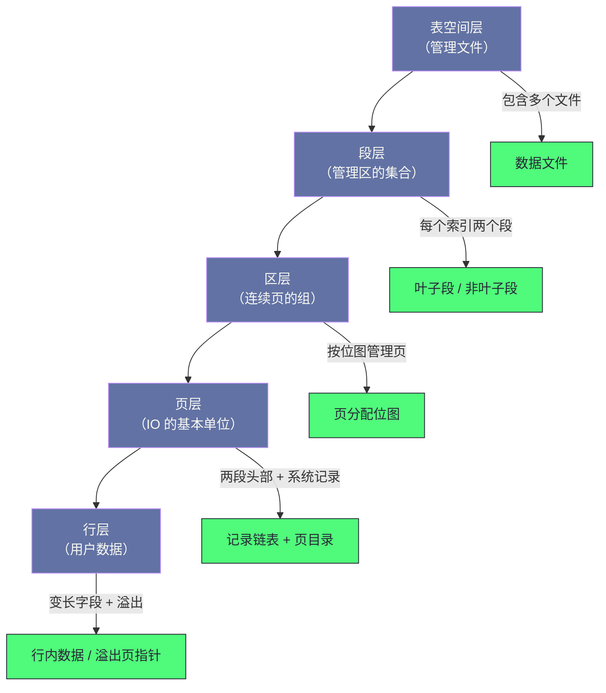

# 10. InnoDB 数据文件与表空间：段、区、页、行的四层存储帝国

**摘要：**

数据在磁盘上是如何组织的？InnoDB 用**四层抽象**回答这个问题：**表空间管文件、段管区、区管页、页管行。** 这四层不是随意的划分，而是为了解决四个具体问题：**"屏蔽文件系统的差异"**（因此用固定的页大小）、**"减少空间分配的频率"**（因此用区作为分配单位）、**"让每个索引独立管理空间"**（因此为每个索引建立两个段）、以及**"在固定大小的页里存下任意长度的数据"**（因此需要行格式与溢出页）。本文按"为什么要分层 → 每层管什么 → 一次写入如何穿过四层 → 生产上会出什么问题"展开。先说明四层各自解决的问题与四条设计原则、四处代价；再逐层拆解全局文件目录、段的元数据与三条空间链表、区的描述符与位图、页的两段头部与两条系统记录、行格式的演进与溢出页链。然后走完一次插入与删除的磁盘路径（重点是"页分配的四级尝试"与"空间回收的两个层次"）。之后是碎片回收、表空间迁移、监控与排查决策树。最后是演进史、四处遗留设计与边界反例。

---

## 第 1 章 四层存储抽象

### 1.1 为什么需要分层

**"把数据存到磁盘上"这句话，落到实现层面会立刻遇到四个问题。**

**问题一：文件系统的块大小各不相同。** 如果按"文件系统的块"来组织数据，那么"同一份数据在不同文件系统上的布局不同"——**而这会让"数据的物理格式"依赖于部署环境。**

**问题二：逐页申请空间太频繁。** 如果每新增一页就向文件系统申请一次空间，那么"分配"这个动作会成为写入路径上的固定开销。

**问题三：不同索引的空间需求不同。** 如果所有索引共享一个空间池，那么"某个索引的大量写入"会"挤占其他索引的空间"——**从而让"某个索引的膨胀"影响"整张表的写入"。**

**问题四：一条记录可能比一页还大。** 如果"记录必须放进一页"，那么"长文本与二进制字段"就无法存储。

**四个问题的答案，恰好构成了四层抽象**：**固定页大小**（屏蔽文件系统差异）、**以区为单位分配**（减少分配频率）、**每个索引独立建段**（隔离空间需求）、**行格式加溢出页**（容纳任意长度）。

**因此"四层"不是"为了分层而分层"，而是"四个问题的各自解法"。**

### 1.2 四层各自管什么

**第一层是表空间**：**它管"文件"**——**一个表空间对应一个或多个文件，而"文件"是操作系统层面的概念。**

**第二层是段**：**它管"区的集合"**——**而"段"与"索引"绑定**（每个索引两个段）。

**第三层是区**：**它管"连续页的组"**——**而"区"是"空间分配的基本单位"。**

**第四层是页**：**它管"行记录与索引节点"**——**而"页"是"IO 的基本单位"。**

**四层的关系是"上层决定下层的归属，下层决定上层的容量"**：**段决定"哪些区属于它"，而"区的数量"决定"段能装多少数据"。**

**而"行"是第五个层次**（虽然严格说是"页的内容"）——**它管"用户数据"**，**而"行的格式"决定了"一页能装多少行"。**

### 1.3 四条设计原则

这四层抽象遵循四条设计原则。

**原则一：固定页大小。** **页大小在实例初始化时确定，之后不可更改**——**因此"屏蔽了文件系统块大小的差异"。**

**原则二：区预分配。** **空间以"区"为单位分配**——**因此"分配"这个动作的频率被大幅降低，同时"数据在物理上更连续"。**

**原则三：段与索引绑定。** **每个索引独立管理自己的空间**——**因此"某个索引的膨胀"不会"挤占其他索引"。**

**原则四：行格式演进。** **从早期的冗余格式到紧凑格式再到动态格式**——**而每次演进都在"压缩存储开销"或"改善大字段的处理方式"。**

**四条原则的关系是"前三条决定'物理组织'，第四条决定'一页能装多少'"**——**而它们共同决定了"存储层的空间效率与访问效率"。**

### 1.4 四处代价

这四层抽象有四处代价。

**其一：页大小不可在线更改。** **因为它决定了"所有文件的布局"**——**因此"改变它"意味着"重建所有数据"。**

**其二：区粒度带来浪费。** **因为"分配单位是区"，所以"数据量很小的表"也会占一个完整的区**——**而"表数量很多"时，这个浪费会累积。**

**其三：溢出页链的访问成本。** **因为"大字段被拆到多个溢出页"，所以"读一个大字段"需要"遍历页链"**——**而"多次 IO"的延迟会累加。**

**其四：空间回收不彻底。** **因为"页只有在完全空时才会被释放回区"，所以"部分空的页"无法被回收**——**这正是"碎片"的来源**（第 8 章展开）。

**四处代价的共同特征是"它们是'固定粒度'的对价"**：**固定页大小换来"屏蔽差异"，固定区大小换来"减少分配"，固定回收条件换来"实现简单"**——**而"粒度固定"意味着"总有一部分空间被浪费"。** **因此存储层优化的一个永恒主题，就是"如何在固定粒度下减少浪费"。**

> [!info] 核心概念
> 理解这四层的一个有效方式是"问每一层在解决谁的麻烦"：**表空间解决"操作系统的麻烦"**（文件如何组织）、**段解决"索引的麻烦"**（空间如何隔离）、**区解决"分配器的麻烦"**（多久分配一次）、**页解决"IO 的麻烦"**（一次读多少）。**四层各自对应一类"麻烦"，而这就是分层的依据。**

### 1.5 一个类比：档案馆的四级管理

把这四层类比成"档案馆"会更容易理解它们的关系。

**"档案馆的库房"对应"表空间"**——**它管"档案放在哪几个房间（文件）里"。**

**"按类别划分的架区"对应"段"**——**而"每类档案（每个索引）有自己独立的架区"，**因此**"某类档案猛增"不会"挤占别的类别"。**

**"一整排书架"对应"区"**——**因为"一次借一整排"比"一本一本借"效率高得多。**

**"一个格子"对应"页"**——**它是"取档案的最小单位"。** 而"格子大小固定"正是"页大小固定"的由来。

**"格子里的卷宗"对应"行"**——**而"卷宗太厚装不进格子时，就"抽出正文放到别处的箱子（溢出页）里，格子里只留一张索引卡（指针）"。**

**"格子里被抽走卷宗后留下的空位"对应"页内的空闲链表"**——**而"空位只有在'与格子的空白区相邻'时才会被真正收回去"**——**这正是"页内回收有延迟与条件"的类比形态。**

**这个类比的用处在于"它把'粒度'与'浪费'的关系说清楚了"**：**格子的尺寸固定（页大小固定）、书架的排数固定（区大小固定），**因此**"总有些空间用不满"。**

---

## 第 2 章 表空间层

### 2.1 全局文件目录

**所有打开的表空间文件都被注册到一个全局结构里**——**它的作用是"避免重复打开同一个文件"，并提供"按标识或按路径查找"。**

**这个结构包含四类内容**：**按标识与按路径的两个哈希索引**（用于快速定位）、**全部表空间的链表**、**一个"最近打开文件"的链表**（用于淘汰）、**以及保护它们的互斥锁。**

**此外还有一个"待刷盘表空间"的链表**——**它记录"哪些表空间有未刷盘的脏页"，供刷盘逻辑遍历。**

**"两个哈希索引"这个设计值得留意**：**因为"定位表空间"有两种方式**（按数字标识、按文件路径），**而两种方式都需要快**——**因此维护两份索引，而不是"用一份加一次转换"。**

### 2.2 表空间与文件

**一个表空间可以对应多个文件**——**因此"表空间"与"文件"之间是"一对多"的关系。**

**这个设计的用途有两处**：**其一，系统表空间可以由多个文件组成**（便于"逐个文件扩容"）；**其二，日志文件组本身就是"一个表空间对应多个文件"**（第 7 篇已展开）。

**而"文件描述符"记录的内容包括**：**路径、当前页数、文件句柄、初始大小与最大可扩展大小、以及"当前是否已打开"。**

**"初始大小与最大可扩展大小"这两个字段的作用是"自动扩展"**——**即"当空间不够时按步长扩大文件"。** **而这个机制的代价是"扩展是突发动作"**（它会带来一次额外的延迟），**因此"预分配"通常是更好的选择。**

### 2.3 未刷盘链表与淘汰链表

**两个链表的用途不同，且有一处容易误解的地方。**

**"待刷盘表空间"链表用于"遍历有脏页的表空间"**——**它保证"刷盘时不遗漏"。**

**"最近打开文件"链表用于"淘汰不常用的文件句柄"**——**因为"打开的文件数有上限"**，**因此"长期不用的文件"需要被关闭。**

**而容易误解的地方是"这个淘汰链表只覆盖用户表空间"**：**系统表空间与日志文件不参与淘汰**——**因为"它们始终在用"，**因此**"关闭它们再重开"没有意义，反而增加开销。**

**这条区分的意义在于"它区分了两类文件"**：**一类是"随时可能被访问的"（用户表空间），一类是"始终在用的"（系统与日志）。** **而"淘汰策略"只对前一类有意义**——**这与第 4 篇讲的"淘汰只对'会被反复访问的东西'有意义"是同一判断。**

### 2.4 四层的整体关系

把这四层画在一张图上，能看清"从上到下的归属关系"。

**图中最值得注意的是"每一层都带一个'它管理什么细节'的分支"**：**表空间管文件、段管叶子与非叶子的划分、区管位图、页管链表与目录、行管溢出。**

**这个结构说明"每一层都同时承担两件事"**：**"向下管理"（管理下一层的对象）与"自身维护"（维护自己的元数据）。** **而"自身维护"这一部分是"额外的开销"**——**它是"分层"的固定成本。**

**因此分层的收益与成本可以用一句话概括**：**收益是"每层只需要理解自己那一种粒度"，成本是"每层都要维护一份自己的元数据"。** **而当"层数很多"时，这份"元数据开销"会累积**——**这也是"存储层的元数据开销与容量成正比"的原因。**

---

## 第 3 章 段层

### 3.1 为什么每个索引两个段

**每个索引在创建时会建立两个段**：**一个管叶子页，一个管非叶子页。**

**为什么分开**：**因为"叶子页"与"非叶子页"的"增长模式不同"。** **叶子页的数量随数据量线性增长**，**而非叶子页的数量增长很慢**（因为它只随"树的高度与分支数"变化）。

**如果两者共用一个段**，那么"叶子页的快速增长"会"与'非叶子页的少量需求'混在一起"，**从而让"空间分配的局部性变差"。** **而分开之后，"叶子页的区"与"非叶子页的区"各自连续**——**这对"顺序扫描叶子页"的性能有实际好处。**

**这条设计的通用形态是"按访问模式分区"**：**访问模式不同的数据分开存放，从而让"同一模式的数据物理上更接近"。** **这与第 4 篇讲的"把热数据与冷数据分开"是同一思路。**

### 3.2 段元数据

**段的元数据存放在一种专门的页里**（即"节点页"），**而它的关键字段是"三条空间链表"与"一个碎片页数组"。**

**此外它还记录"自己所在的页"的位置**——**而这个"位置信息"被存在"索引的根页"里**。

**这个"位置信息存两份"的设计（节点页里存元数据、根页里存定位信息）值得留意**：**因为"找到段"这件事必须从"索引"出发**——**而"索引的入口是根页"**，**因此"从根页找到段"是一条必须可用的路径。**

**这与第 8 篇讲的"双写区位置记录在固定页"是同一手法**：**把"定位信息"放在"已知的入口"旁边**——**因此"定位"不需要额外的查询。**

### 3.3 三条空间链表

**三条链表按"区的使用程度"划分。**

**"完全空闲"链表**：**这些区一页都没用过**——**因此"从它取区"意味着"一个全新的区"**。

**"部分使用"链表**：**这些区有些页在用、有些页空闲**——**因此"从它取页"意味着"填补已有区的空隙"。**

**"已写满"链表**：**这些区所有页都在用**——**因此"它不提供可用空间"，但"它的存在让'区已被写满'这个事实可以被快速判断"。**

**三条链表的用途是"快速定位可用空间"**——**因为"如果只有一条链表，那么'找一个有空闲页的区'需要遍历所有区"。**

**而"部分使用"链表还额外记录"该链表中已使用的页总数"**——**它的用途是"快速判断'还能从这里取多少页'"**，**而不需要"遍历每个区去数"。**

### 3.4 碎片页数组

**碎片页数组是"段级的一处优化"，它解决"小表浪费"这个问题。**

**问题是这样**：**因为"分配单位是区"，所以"一张刚创建、只有几行数据的表"会占一个完整的区**——**而"区是 1MB 量级"，因此"浪费"是明显的。**

**解法是"前若干页以'独立页'形式分配"**：**段维护一个"独立页号数组"，**而**"最初的若干次分配从这个数组里取"**——**这样"小表"只占"它实际需要的页数"，而不占一个完整的区。**

**等"独立页用完"之后，才启用"区分配"。** **因此这个数组的作用是"让小表少占空间，而让大表走高效的区分配"。**

**这条设计的通用形态是"为'小规模'与'大规模'分别设计路径"**——**因为"小规模场景下'批量分配的粒度'是浪费，而大规模场景下'逐页分配'是低效"。** **这与第 5 篇讲的"变更缓冲的容量上限"是同一类"分场景设计"。**

---

## 第 4 章 区层

### 4.1 区的定义与作用

**区是"连续页的组"，默认包含固定数量的页**——**因此它的物理大小是"页大小乘以页数"。**

**区的作用有三处**：**其一，它是"空间分配的单位"**（因此减少了分配频率）；**其二，它保证"同一区的页物理连续"**（因此对顺序访问有利）；**其三，它让"空间管理"可以按"组"进行**（因此管理结构的规模更小）。

**三处作用里，"物理连续"这一条最容易被忽略**：**因为"页在逻辑上通过指针相连"，所以"物理是否连续"看起来不影响正确性**——**但它影响"顺序扫描时的 IO 效率"**（因为连续页可以被一次读入）。

### 4.2 区描述符

**每个区有一个描述符**——**它记录四类信息。**

**第一类是"所属段"**：**它回答"这个区属于哪个段"**——**而"未分配给段"的区在这个字段上是一个特殊值。**

**第二类是"链表节点"**：**它让"区描述符"能被挂进"三条空间链表"**——**因此"链表操作"只需要操作描述符，而不需要操作区本身。**

**第三类是"状态"**：**它区分"完全空闲""碎片空闲""碎片已满""已归属段"四种状态**——**而这个区分让"空间分配"能快速判断"这个区能提供什么"。**

**第四类是"页分配位图"**：**它为区内的每一页记录"是否已被使用"**——**因此"在区内找一个空闲页"是一次位图扫描。**

**四类信息里，"位图"是"最小粒度的分配记录"**——**而它的存在解释了"为什么'页的分配'不需要单独的元数据"**：**因为"页的分配状态"被编码在"它所属区的位图里"。**

### 4.3 位图管理

**位图按"每页若干位"组织**——**因此"一个区的位图"只占很少的字节。**

**"每页用若干位而不是一位"的原因与第 5 篇讲的"变更缓冲位图"不同**：**那里是为了"表达三种状态"**（无、有、是自己），**而这里是为了"表达'页的干净/脏'这类附加信息"**——**因此"多出的位"承载了"分配之外的语义"。**

**这个设计带来一个实践含义**：**"位图"不只是"分配记录"，它还是"区级的状态快照"**——**因此"扫描一个区的位图"能同时得到"哪些页在用"与"它们的状态"。**

**而"位图操作"的实现方式是"按页号算出字节偏移与位偏移，然后做掩码操作"**——**这是一次纯计算，因此"位图操作"的成本很低。** **这与第 8 篇讲的"槽位号对应内存与磁盘位置"是同一手法**：**用"可计算的映射"替代"查表"。**

### 4.4 区覆盖范围

**一个"区描述符页"能容纳的描述符数量有限**——**因此"一个描述符页"能覆盖的"物理页范围"也是有限的。**

**具体量级是"一个描述符页覆盖数百 MB 的空间"**——**而"超出这个范围"就需要"新的描述符页"，**而**"多个描述符页通过链表串联"。**

**这条约束的实践含义是"描述符页会随文件增长而增加"**——**因此"文件的元数据开销与文件大小成正比"**（虽然比例很小）。

**而"链表串联"这个设计意味着"遍历描述符页"是一次链表遍历**——**因此"按顺序遍历整个表空间"的成本包含"遍历描述符页"。** **这与第 2 篇讲的"日志段链表"是同一结构**：**用链表组织"不定数量的元数据块"。**

### 4.5 区的大小是否可变

**"区包含多少页"这个问题值得单独说明，因为它与"页大小"有一层关系。**

**在"页大小可配置"的前提下，"区的物理大小"随页大小变化**——**而"区的页数"是否随之调整，取决于"设计时选择的是'固定页数'还是'固定物理大小'"。**

**这个选择的意义在于"它决定了'分配的物理粒度是否随页大小漂移'"**：**如果"页数固定"，那么"大页下的区会更大"**（因此"分配的粒度更粗"）；**如果"物理大小固定"，那么"大页下的区包含更少页"。**

**两种选择的取舍是"管理结构的规模"与"分配粒度"之间的平衡**——**而无论选哪种，都会有"在某个页大小下不够理想"的情况。**

**这条分析的价值在于"它提示了一处容易忽略的耦合"**：**"页大小"这个参数不只影响"一页装多少"，还影响"区的实际大小"**——**因此"调整页大小"的连锁影响比想象中多。** **这类"参数之间有隐藏耦合"的情况，与第 8 篇讲的"预写对齐与文件系统块"是同一类问题。**

---

## 第 5 章 页层

### 5.1 通用头

**所有类型的页共享一段固定格式的"通用头"**——**它记录的内容包括**：**校验和、页号、上一页与下一页的页号、页的最新修改序号、页类型、以及所属表空间的标识。**

**"上一页与下一页"这两个字段值得留意**：**它们让"同一层的页"形成双向链表**——**而"同一层"指的是"B+Tree 的同一层"**。**因此"顺序扫描一层"可以通过这两个字段进行**，而不需要"从根页重新下降"。

**这与第 3.1 节讲的"叶子段与非叶子段分开"是配套的**：**分开的段让"同一层的页物理接近"，而"双向链表"让"同层的页逻辑相连"。** **两者合起来，才能让"顺序扫描"既逻辑顺畅又物理高效。**

### 5.2 索引页头

**索引页在通用头之后还有一段"索引页头"**——**它的字段可以归为四类。**

**第一类是"目录信息"**：**槽位数量**——**它对应"页目录"的规模。**

**第二类是"堆信息"**：**堆顶偏移、堆记录数、空闲链表头、垃圾字节数**——**它们共同描述"页内空间的分配与回收状态"。**

**第三类是"插入模式信息"**：**最后插入位置、插入方向、连续插入次数**——**它们用于"优化'顺序插入'这个最常见的情况"。**

**第四类是"树结构信息"**：**用户记录数、页的最大事务标识、树的层级、索引标识、以及"两个段头"**（分别指向叶子段与非叶子段的元数据）。

**四类字段里，"插入模式信息"最容易被忽略**：**因为"自增主键的插入总是追加到最右"**，**而"记录'上次插在哪、方向如何'"能让"下一次插入"直接定位**，**而不需要"从页目录二分查找"。** **这是"为最常见的情况做优化"的典型例子。**

### 5.3 两条系统记录

**每个索引页在初始化时会创建两条固定的系统记录**：**一条是"最小记录"**（它的键比任何用户记录都小），**一条是"最大记录"**（它的键比任何用户记录都大）。

**它们的作用是"统一记录链表的边界条件"**——**具体来说：**"插入到最前"等价于"插在最小记录之后"**，**"插入到最后"等价于"插在最大记录之前"**。

**因此"插入逻辑"不需要处理"空页""插到最前""插到最后"这些特殊情况**——**因为"边界记录"已经把这些情况变成了"一般情况"。**

**这条设计的通用形态是"用哨兵简化边界处理"**——**而它的收益是"代码路径更少、更不易出错"。** **代价是"每页多占一点空间"**（两条记录）——**而相对于"简化带来的可靠性"，这个代价是划算的。** 这个取舍在"页内空间紧张"的场景下值得重新评估。

### 5.4 页目录

**页目录是"页内记录的索引"**——**它把"页内的用户记录"分成若干组，每组用"一条槽位"记录"该组最大记录的偏移"。**

**它的作用是"让'在页内查找记录'可以二分"**——**因为"如果没有目录，那么'找一条记录'需要遍历链表"。**

**而"槽位的分组"有一处设计细节值得留意**：**每组的记录数不是固定的**，**而是"有一个最小与最大的范围"。** **这个设计的理由是"兼顾'二分效率'与'维护成本'"**：**组太小则槽位多（维护成本高），组太大则组内遍历变长（二分收益下降）。**

**此外"每组的最大记录"有一个"拥有记录数"的标记**——**而"插入与删除"会更新这个标记，**并在**"某组的记录数超出范围"时"分裂或合并组"。** **因此"页目录的维护"是"插入与删除路径上的一部分工作"**（第 7.3 节展开）。

---

## 第 6 章 行层

### 6.1 行格式的演进

**行格式经历过三代演进。**

**第一代是"冗余格式"**：**它的字段偏移被完整记录在每行里**——**因此"存储开销大"，但"解析简单"。**

**第二代是"紧凑格式"**：**它把"变长字段的长度"集中放在行首的一个数组里**，**而"可空字段"用一个位图表示**——**因此"存储开销显著降低"。**

**第三代是"动态格式"**：**它改变了"大字段"的处理方式**（把"部分溢出"改成了"完全溢出"）——**因此"一页能装下更多行"。**

**三代演进的共同方向是"压缩存储开销"与"改善大字段处理"**——**而它们的代价是"解析逻辑更复杂"。** **这是"存储效率与解析复杂度"之间的经典取舍。**

### 6.2 变长字段与可空字段的编码

**紧凑格式的行首有两段"辅助信息"。**

**第一段是"变长字段的长度数组"**——**它为每个变长字段记录"实际长度"。** **而它按"逆序"存放**——**这个细节的作用是"让解析可以从行尾向行首进行"**（因为"变长字段的起始位置"需要"从行尾倒推"）。

**第二段是"可空字段的位图"**——**它为每个可空字段记录"是否为空"。** **"为空"的字段"不占存储空间"**——**因此"很多字段为空的表"能显著节省空间。**

**两段信息的共同特征是"它们把'可变的部分'集中到行首"**——**因此"行内的用户字段部分"就是"纯粹的数据"，**而**"解析"只需要"按长度数组切分"。**

**这条设计的通用形态是"把元信息前置"**——**而它的收益是"数据部分可以被当作不透明的字节块处理"。**

### 6.3 系统列

**每一行还带有两个"系统列"**：**一个是"最后修改它的事务标识"**，**一个是"指向回滚信息的指针"。**

**这两个列的作用是"支撑多版本并发控制"**：**事务标识用于"判断这一行对本事务是否可见"，而回滚指针用于"找到这一行的旧版本"。**

**它们的存储开销是固定的**（两者合计十余字节）——**而"每个索引"都要带这两个列**（不只是聚簇索引）**——**因此"索引的每一行"都有一份"版本信息"。

**这一点解释了"索引数量会放大存储开销"**：**因为"每增加一个索引"，就"多一份带系统列的数据"。** **因此"索引不是免费的"，而"系统列"是这笔开销的固定组成部分。**

### 6.4 溢出页

**当"一个字段太长、放不进行内"时，它会被放到"溢出页"里**——**而"行内只保留一个指针"。**

**"多长算太长"这个判据在不同行格式下不同**：**较早的格式是"部分溢出"**（即"把前面一部分留在行内，其余溢出"），**而较新的格式是"完全溢出"**（即"整个字段都放到溢出页"）。

**"完全溢出"的收益是"行内只留一个固定大小的指针"**——**因此"行的长度更可预测"，"一页能装下更多行"。** **而它的代价是"读这个字段必须遍历溢出页链"。**

**"溢出页链"的组织方式是"每个溢出页记录下一个页的页号"**——**因此"读一个长字段"是"沿着链依次读取"。** **这个设计的代价是"多次 IO"**——**而"减少这个代价"的方向是"把溢出数据放到别处"**（例如对象存储），**而不是"改进链的结构"**（第 9 章展开）。

### 6.5 行格式与"一页能装多少行"

**行格式的选择直接决定"一页能装多少行"，而这一点会影响三层性能。**

**第一层影响是"IO 效率"**：**一页装的行越多，"读同样多行"需要的页越少**——**因此"IO 次数更少"。**

**第二层影响是"缓冲池效率"**：**同样的内存能缓存更多行**——**因此"命中率更高"。**

**第三层影响是"索引大小"**：**行越紧凑，索引占的空间越小**——**因此"索引的层数可能更少"**（因为"每页装的条目更多"）。

**三层影响的共同特征是"它们都源于'空间效率'"**——**因此"行格式的演进"虽然看起来只是"存储细节"，但它的收益会传导到"IO、缓存、索引"三处。**

**这条传导关系解释了一类实践建议的由来**：**"避免把大字段与高频查询字段放在同一张表"**——**因为"大字段会撑大行"**，**从而"降低一页能装的行数"**，**进而"影响该表的整体访问效率"。** **而这个建议的机制依据，正是"行格式决定一页能装多少行"这条传导链。**

---

## 第 7 章 插入与删除的磁盘路径

### 7.1 插入路径

**一次插入在磁盘层面的路径分三步。**

**第一步是"在页内插入"**：**先检查"当前页的剩余空间是否够"**——**如果够则直接插入**，**否则"需要分配新页"**（也就是"页分裂"）。

**第二步是"分配新页"**：**按"页所在的层级"选择对应的段**（叶子页走叶子段、内节点页走非叶子段），**然后向该段申请一个页。**

**第三步是"初始化新页并更新父节点"**：**新页要按索引的结构初始化**，**并把它的位置登记到父节点里。**

**三步里，第一步的"检查剩余空间"是"乐观路径"**——**它假设"空间够用"，**而**"不够用"时才走"分配新页"这条昂贵路径。** **这个"先试乐观路径"的设计是"插入性能"的关键**——**因为"大多数插入都能走乐观路径"。**

### 7.2 页分配的四级尝试

**"向段申请一个页"这个动作有四级尝试，顺序体现了"从廉价到昂贵"。**

**第一级是"碎片页数组"**：**如果数组里还有独立页，直接取一个**——**这是最廉价的**（因为它只是"从一个数组里取一个值"）。

**第二级是"部分使用的区链表"**：**从链表头取一个区，在它的位图里找一个空闲页**——**而"如果这个区被填满"，则把它移到'已满'链表。**

**第三级是"完全空闲的区链表"**：**从链表头取一个区，把它移到'部分使用'链表，然后从它取页。**

**第四级是"向表空间申请新的区"**——**这是最昂贵的**（因为它涉及"表空间的元数据修改"）。

**四级尝试的设计意图是"优先使用已有的空隙，最后才申请新空间"**——**而它的收益是"空间利用率更高、分配成本更低"。** **这个顺序与"内存分配器"的策略是同一思路**（先看空闲列表，再看新申请的块）。

**一处需要留意的细节是"整个分配过程持有一把全局锁"**——**因此"万表实例下的并发分配能力受限"**（第 9 章展开）。

### 7.3 删除路径

**一次删除在页内的路径分五步。**

**第一步是"从记录链表里摘下"**：**把"前一条记录的下一个指针"指向"后一条记录"。**

**第二步是"把记录加入'空闲链表'"**：**记录被"标记为空闲"，并挂进"页内的空闲链表"。**

**第三步是"更新页目录"**：**找到该记录所属的槽位，把它的"拥有记录数"减一。**

**第四步是"如果某组的记录数过少则合并槽位"**——**因为"组太小会让槽位过多"。**

**第五步是"更新页头统计"**：**用户记录数减一、垃圾字节数增加。**

**五步里，"记录进入空闲链表而不是立即消失"这一点很关键**：**因为"页内的空间回收"是"延迟进行的"**——**而"什么时候真正回收"由"空间整理的时机"决定。**

### 7.4 空间回收的两个层次

**"空间回收"有两个层次，而它们的时机与效果不同。**

**第一个层次是"页内回收"**：**被删除的记录进入"空闲链表"**，**而"当'空闲链表'里的记录与'堆顶'相邻时"，堆顶会被收缩**——**因此"页内的可用空间会增加"。**

**但"空闲链表里的记录"不会立即被"整理"**——**因为它们"还在链上"，只是"被标记为可复用"。** **真正的整理发生在"需要空间但剩余空间不足"时**（此时会"清理空闲链表"）。

**第二个层次是"页级回收"**：**当"一个页完全没有用户记录"时**，**它才可能被"释放回区"**（从而"区可以被其他段使用"）。

**两个层次的共同特征是"它们都有'延迟'与'条件'"**：**页内回收"延迟到需要空间时"，页级回收"要求页完全空"。**

**这解释了两类常见现象**：**"删了很多数据但文件没变小"**（因为页没有完全空，因此页级回收没发生）与**"文件大小不变但能插入更多数据"**（因为页内回收在起作用）。**因此"文件大小"与"实际数据量"之间存在长期偏差，这是设计使然，而不是异常。** 而"偏差多大"可以作为"碎片程度"的粗判据。

---

## 第 8 章 生产落地

### 8.1 碎片回收

**碎片问题的形态是"文件很大但数据量不大"，而它的根因是"页级回收的条件很严"。**

**量化方式是"比较'数据逻辑大小'与'文件实际大小'"**——**如果"文件远大于数据"，那么"碎片严重"。** **而一个常用的判据是"数据长度相对于索引长度的比例"。**

**处置方式有三条**：**重建表**（把数据重新组织到新的文件里，**代价是需要额外的临时空间**）、**在线变更工具**（在后台重建并切换，**代价是"过程复杂、有额外负载"**）、**以及"调整刷脏相关参数"**（让"完全空的页"更快被释放，**收益有限**）。

**三条处置的共同特征是"它们都需要'把数据搬一遍'"**——**因为"碎片是物理布局问题"，而"物理布局"只能通过"重新写入"改变。**

**这一点值得强调**：**"碎片回收"没有"原地整理"的办法**——**因为"页的物理位置由区的分配决定"，**而**"区的分配"不会因为"页变空"而重排。** **因此"碎片"这类问题的处置成本天然很高，**而**"预防"（例如按时间分区、定期归档）比"事后回收"更划算。**

### 8.2 表空间迁移

**单表迁移有一条"不依赖逻辑导出"的路径，它利用了"表空间自描述"这个特性。**

**路径分四步**：**目标端建同结构表 → 目标端丢弃表空间 → 源端刷脏并导出元数据 → 拷贝数据文件与元数据文件后导入。**

**关键在第三步与第四步**：**"导出"这一步会强制刷脏并生成一份"表空间元数据文件"**（其中包含表结构信息）；**而"导入"这一步会"校验元数据与表结构是否兼容"，然后把数据文件注册到文件管理结构里。**

**这条路径的收益是"避免逐行导出导入"**——**因此它比"逻辑导出"快得多。**

**而它的前提是"源与目标的表结构、页大小、行格式兼容"**——**因为"导入"要校验这些。** **因此"跨版本或跨页大小迁移"在这条路径上不成立**（需要另想办法）。

**这条约束的意义在于"它把'物理迁移'与'逻辑迁移'的边界划清了"**：**物理迁移快但要求兼容，逻辑迁移慢但不受限制。** **这与第 3 篇讲的"迁移前必须确认兼容性"是同一条纪律。** 而选择哪条路径，取决于"兼容性是否满足"与"停机窗口是否允许"。

### 8.3 监控要点

**存储侧可观测的信息有四处。**

**其一是"表空间概览"**：**列出各表空间的名称、行格式、页大小等信息**——**它回答"有哪些表空间、它们用什么格式"。**

**其二是"空间占用"**：**按"区数乘以区大小"估算各文件的占用**——**它回答"谁占了最多空间"。**

**其三是"表空间与段的规模"**：**包括"文件大小"与"已分配大小"**——**而"两者的差距"反映"碎片程度"。**

**其四是"页内的空闲与垃圾"**：**较新版本提供了"页内空闲字节"与"垃圾字节"的统计**——**它们回答"页内的空间利用率"。**

**四处信息的层次是"从文件到页"**：**表空间概览是"清单"，空间占用是"排行"，规模对比是"碎片信号"，页内统计是"微观利用率"。** **按这个顺序看，就能从"哪个表占空间多"深入到"为什么占得多"。** 而这个顺序也符合"先缩小范围、再看细节"的排查习惯。

### 8.4 排查决策树

**文件过大时**，先分"数据量本身大"与"碎片严重"：**前者靠分区归档，后者靠重建。**

**删除数据后空间不释放时**，先分"是系统表空间还是独立表空间"：**系统表空间无法收缩（因为它是共享的），独立表空间可以靠重建回收。**

**导入失败时**，先分"版本或页大小不兼容"与"元数据文件缺失"：**前者需要统一环境，后者可以从数据文件里提取结构。**

**大字段导致页分裂频繁时**，考虑"调整页大小"或"把大字段外置"。**而这两条都是"设计层面"的改动，而不是"参数调整"。**

**这条决策树里最值得注意的是"系统表空间无法收缩"这一条**：**因为"它由所有共享对象共用"，**因此**"删除其中的表不会归还空间"。** **这也是"默认使用独立表空间"这条建议的由来。**

---

## 第 9 章 演进史与遗留设计

### 9.1 关键节点

| 版本 | 存储变化 | 动因 |
|---|---|---|
| 早期 | 固定的系统表空间 | 单文件结构，无独立表空间 |
| 中期 | 支持每表独立表空间 | 便于迁移与回收 |
| 5.6 | 支持压缩表 | 节省空间，但 CPU 开销大 |
| 5.7 | 支持透明页压缩 | 利用文件系统压缩，不占缓冲池 |
| 8.0 | 移除最早的冗余行格式 | 精简代码，默认使用动态格式 |
| 8.0.13 | 结构信息嵌入数据文件 | 替代旧的结构文件，实现自描述 |
| 8.0.30+ | 独立双写文件 | 分离系统表空间，降低单点风险 |

**这条演进线的主线是"从共享走向独立"**：**从"所有表共享系统表空间"到"每表独立表空间"**——**而"独立"带来的收益是"可迁移、可回收、可单独处理"。**

**而"结构信息嵌入数据文件"这一步是另一条线**（第 3 篇已展开）：**它让"数据文件自描述"**，**因此"集中元数据损坏时仍能恢复结构"。**

**两条线的共同特征是"它们都在减少'共享'与'集中'"**——**因为"共享与集中"意味着"一处出问题影响全局"。** **这与第 3 篇讲的"集中字典带来单点风险"是同一权衡。**

### 9.2 四处遗留设计

**第一处：页大小初始化后不可更改。** **因为它决定"所有文件的布局"**——**因此改变它需要"备份重搭实例"。**

**第二处：独立表空间仍是单文件。** **单文件的 IO 并发能力受"文件系统对单文件的锁"限制**——**而"通用表空间"（多表共享一个文件）是另一条路，但不是默认。**

**第三处：溢出页链的查找效率低。** **读一个长字段需要遍历页链**——**而"改进链的结构"收益有限，**因此**替代方向是"把大字段外置"。**

**第四处：区分配仍依赖全局互斥锁。** **因此"万表实例下的并发分配能力受限"**——**而部分分支已把"段管理"分区。**

**四处遗留设计的共同特征是"它们是'固定结构'或'共享结构'的结果"**：**第一处与第二处是"物理布局固定"，第三处是"链式结构固有"，第四处是"共享分配器"。** **而它们的处置方式通常是"用别的机制绕开"**（例如外置大字段、分区段管理），**而不是"改动结构本身"。**

### 9.3 演进方向

**方向一：持久内存的直接访问。** **如果"文件可以被直接映射到'字节可寻址且断电不丢'的内存上"，那么"读一个页"不再需要"拷贝到缓冲池"**——**因此"IO 层需要重构"，而"缓冲池的角色从'数据副本'变成'读缓存与写合并'"。**

**方向二：对页管理的冲击。** **在直接访问模式下，"页的校验"不再必要**（因为"没有'坏页'这个概念"）、**"双写"完全废弃**（第 8 篇已展开）——**而"段与区"仍需要**（因为"空间分配"这件事仍然存在），**只是"物理分配"从"文件扩展"变成"堆分配"。**

**方向三：大字段的外置。** **把"大字段"从"溢出页链"改为"外置存储"**——**因为"外置存储"能提供"更灵活的访问方式"，**而**"页链"的改进空间有限。**

**三个方向的共同特征是"它们都在改变'页'这个概念的物理基础"**——**而"页"是这四层里的第三层**，**因此"它的基础变了，上下两层都要跟着变"。** **这提示了一条判断方式：当"存储介质的物理特性"改变时，受影响最深的是"最贴近介质的那一层"。** **因此"哪一层需要重构"，可以由"介质变了什么"来推断。**

### 9.4 一条关于"固定粒度"的经验

最后把"固定粒度"这件事的经验收敛一下，因为它是这四层的共同特征。

**四层都用"固定粒度"**：**页大小固定、区大小固定、行的头部格式固定、系统列长度固定。** **而"固定"带来两处收益与两处代价**：**收益是"实现简单"与"可预测"**（因为"不需要处理任意大小"）；**代价是"总有一部分空间被浪费"与"粒度不可随场景调整"。**

**因此"固定粒度"的取舍判据是"场景的规模分布是否集中"**：**如果"绝大多数对象的规模都在同一量级"，那么"固定粒度"几乎没有浪费**；**而如果"规模分布很宽"**（例如"既有几行的表，也有几十亿行的表"），**那么"单一粒度必然在某一段浪费"。**

**这条判据解释了两处设计**：**"碎片页数组"正是为了缓解"小规模对象的浪费"**（第 3.4 节），**而"动态行格式"正是为了缓解"大规模字段的浪费"**（第 6.4 节）。**两处设计都在"固定粒度的框架内，为'规模分布的两端'补上专门路径"。**

**因此看到"固定粒度"的设计时，可以问"它的规模分布是集中的还是分散的"**——**而"分散"时，通常能在系统里找到"为两端准备的补丁"。**

---

## 第 10 章 边界与反例

### 10.1 反例一：把"文件大小不变"当作"删除没生效"

**页级回收要求"页完全空"**，**因此"删了数据但文件不变"是设计使然**（第 7.4 节）。**而"能插入更多数据"说明页内回收在起作用。**

### 10.2 反例二：认为"碎片可以原地整理"

**物理布局只能通过"重新写入"改变**（第 8.1 节）。**因此碎片回收必然需要"搬一遍数据"。**

### 10.3 反例三：把"区粒度"当作"没有浪费"

**小表也会占一个完整的区**——**而"碎片页数组"正是为了缓解这一点**（第 3.4 节）。

### 10.4 反例四：认为"页大小可以调优"

它在初始化时固定，**因此"调优页大小"实际是"重建实例"。**

### 10.5 反例五：把"系统表空间"当作"可以收缩的"

它由共享对象共用，**因此删除其中的表不会归还空间**（第 8.4 节）。

### 10.6 反例六：忽略"索引数量放大存储开销"

每个索引都带一份系统列，**因此"索引不是免费的"**（第 6.3 节）。

### 10.7 反例七：把"物理迁移"当作"通用方案"

它要求"版本、页大小、行格式兼容"（第 8.2 节）。**不兼容时只能走逻辑导出。**

---

## 第 11 章 落点

回到开头的问题：数据在磁盘上如何组织？

答案是**四层抽象**——**而每一层都在解决一个具体问题**：**表空间解决"文件如何组织"、段解决"空间如何隔离"、区解决"多久分配一次"、页解决"一次读多少"。** **而"行格式"与"溢出页"则解决了"任意长度的数据如何放进固定大小的页"。**

**这套结构的稳定性值得注意**：**它从早期版本到现在几乎没有动过"根骨"**——**而原因不是"它已经完美"，而是"它解决的是'物理布局'这类不会随业务变化的问题"。** **因此"四层"的划分方式至今仍然成立。**

**而它的"不变"也带来了代价的固化**：**页大小不可改、碎片无法原地整理、溢出页链无法高效查找、区分配仍是一把全局锁**——**这些代价都不是"实现缺陷"，而是"固定结构"的必然结果。** **因此理解这套结构的关键，不是记住"段、区、页、行"，而是理解"每一层的固定粒度带来了哪一类浪费"，以及"这类浪费在什么场景下会变成问题"。**

**最后一条经验值得留下：这四层的"浪费"都可以被一句话概括——"粒度固定，而规模分布不固定"。** **因此"存储层优化"的通用方向是"为规模分布的两端补上专门路径"**：**小规模用"独立页"（碎片页数组），大规模用"完全溢出"（动态行格式）。** **而这个方向与"用一套粒度应对所有规模"是相反的选择**——**前者复杂但浪费少，后者简单但浪费多。** **理解这个取舍，就能理解"为什么存储层的代码总是比想象中复杂"。**

---

## 专栏导航

- 上一篇：[[09. InnoDB 后台线程：26 个线程的分工协作与调度哲学]]。
- 下一篇：[[11. InnoDB 索引：B+Tree 的工程实现与分裂合并哲学]]。
- 返回专栏首页：[[00 专栏导览]]。

---

## 参考资料

1. MySQL 8.0.33 源码：`storage/innobase/fsp/fsp0fsp.cc`、`fil/fil0fil.cc`、`page/page0cur.cc`、`page/page0page.cc`、`rem/rem0rec.cc`。
2. MySQL. MySQL Internals Manual: InnoDB Tablespace Management 与 File Space Management. https://dev.mysql.com/doc/internals/en/
3. Oracle Blogs. InnoDB File Space Management. https://dev.mysql.com/blog-archive/
4. MySQL. 官方文档：InnoDB 表空间与 innodb_file_per_table、general tablespace 说明. https://dev.mysql.com/doc/refman/8.0/en/innodb-tablespace.html
5. MySQL. 官方文档：InnoDB 行格式（REDUNDANT/COMPACT/DYNAMIC/COMPRESSED）与溢出页. https://dev.mysql.com/doc/refman/8.0/en/innodb-row-format.html
6. MySQL. 官方文档：FLUSH TABLES ... FOR EXPORT 与 IMPORT TABLESPACE 的元数据校验. https://dev.mysql.com/doc/refman/8.0/en/innodb-table-import.html
7. MySQL. 官方文档：information_schema.FILES 与 performance_schema 中的表空间视图. https://dev.mysql.com/doc/refman/8.0/en/information-schema-files-table.html
8. MySQL. 官方文档：innodb_page_size 与页大小的可选值及约束. https://dev.mysql.com/doc/refman/8.0/en/innodb-parameters.html
9. MySQL. 官方文档：通用表空间（general tablespace）与多表共享文件. https://dev.mysql.com/doc/refman/8.0/en/general-tablespaces.html
10. MySQL. 官方文档：InnoDB 页结构与 FIL_PAGE_* 头部字段说明. https://dev.mysql.com/doc/refman/8.0/en/innodb-page-structure.html

---

> [!note] 思考题
> 1. 四层抽象分别解决了哪个问题？为什么"分层"的依据是"问题"而不是"数据量"？
> 2. 为什么每个索引要建立两个段（叶子段与非叶子段）？分开带来的好处是什么？
> 3. "页分配的四级尝试"这个顺序的依据是什么？它与内存分配器的策略有什么共性？
> 4. "空间回收的两个层次"分别有延迟与条件，这解释了什么常见现象？
> 5. 为什么这套四层结构"几乎没动过根骨"？它的"不变"又固化了哪些代价？
