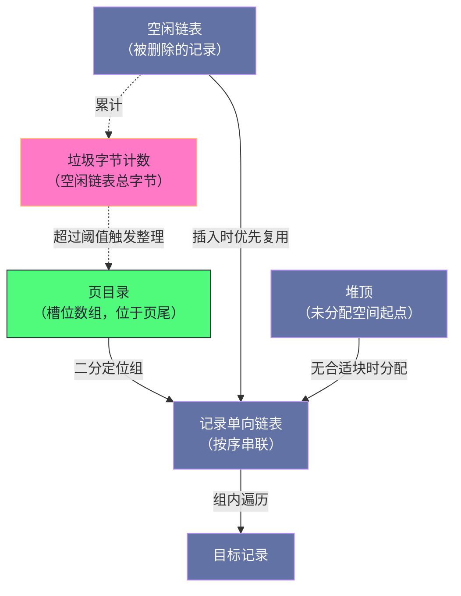

# 11. InnoDB 索引：B+Tree 的工程实现与分裂合并哲学

**摘要：**

教科书里的 B+Tree 与工程代码里的 B+Tree 是两种东西：**前者讲阶、讲填充度、讲平均查找长度；后者要处理"页是固定大小的""记录会被删除""多个线程同时改同一棵树""崩溃后必须能重建"。** 这些约束把一棵"理想树"变成了一套具体的机制：**用页内的单向链表加页目录实现页内查找、用同层页的双向链表维持逻辑有序、用"乐观插入失败再走悲观路径"降低分裂频率、用"先分裂后合并"的节奏控制空间效率。** 本文按"教科书与工程的距离 → 两类索引 → 页内怎么组织 → 逻辑有序靠什么 → 插入与分裂 → 合并与重组 → 查找路径 → 生产上会出什么问题"展开。先说明三类索引的差异与三条设计哲学、四处代价；再拆解页目录的分组设计、删除记录的空闲链表、同层双向链表与内节点页的记录格式；然后讲"乐观插入与悲观插入"的分工、分裂点的选择依据、以及锁从"整树排他"到"共享排他"再到"页级"的演进。之后是合并的向左与向右、重组的触发与过程、三种动作的代价对比。最后是"自增主键仍会分裂"这个反直觉现象、参数与监控、间隙锁死锁案例、演进史、遗留设计，以及与另一种树结构的取舍对比。

---

## 第 1 章 教科书与工程的距离

### 1.1 教科书讲什么

**教科书里的 B+Tree 关心三件事**：**阶数**（一个节点能放多少键）、**填充度**（节点平均多满）、**查找长度**（从根到叶走几层）。

**这三个概念都建立在"节点大小可以按需设定"这个假设上**——**因为教科书里的树在内存里，而内存节点的大小是自由的。**

**因此教科书的结论通常是"阶数越大、树越矮、查找越快"**——**而这句话在工程里不成立**（因为节点大小被固定了）。

### 1.2 工程要解决什么

**工程实现要处理四类教科书不涉及的问题。**

**问题一：节点大小固定。** **页大小在初始化时确定**——**因此"阶数"不是"可调参数"，而是"由记录长度决定的结果"。**

**问题二：记录会被删除。** **删除不立即释放空间**（因为它可能被复用）——**因此"页内会出现碎片"，而"碎片需要被整理"。**

**问题三：多个线程同时改同一棵树。** **因此需要"锁"，而"锁的粒度"直接影响并发能力**——**这正是"分裂时锁什么"这个问题的由来。**

**问题四：崩溃后必须能重建。** **因此"树的每一次修改都要记日志"**——**而"日志量与修改量的比例"影响写入性能**（第 7 篇已展开）。

**四类问题的共同特征是"它们都源于'持久化'与'并发'这两个工程约束"**——**而教科书里的树既不需要持久化，也不需要并发。** **因此"把教科书变成工程"，本质上就是"加上这两个约束后重新设计"。**

### 1.3 三条设计哲学

这个实现遵循三条设计哲学。

**哲学一：物理无序，逻辑有序。** **页在磁盘上的位置不连续**（因为"页的分配由区的分配决定"，第 10 篇已展开）——**因此"同层的页通过双向链表串联"，从而"在物理无序的基础上提供逻辑有序"。** 这条区分是"顺序扫描为什么能高效"的答案。

**哲学二：固定页大小限制了记录长度。** **因为"一页至少要放两条记录"**（否则"树无法分裂"），**所以"单条记录的长度有上限"**——**而"超长字段走溢出页"。** 这条限制是"大字段必须外置"的机制依据。

**哲学三：空间换时间。** **页内预留一定空间**（不是"塞满才分裂"）——**因此"减少分裂频率"，代价是"页的利用率下降"。** 而这份预留也让"顺序插入"有更大的腾挪空间。

**三条哲学的关系是"第一条解决'页不连续'，第二条解决'记录可能太长'，第三条解决'分裂太频繁'"**——**而三者共同构成了"工程化"的主要取舍。**

### 1.4 四处代价

这个实现有四处代价。

**其一：页内碎片。** **因为"删除不立即整理"，所以"页内会出现无法立即使用的空间"**——**而"整理"需要额外的动作（重组）。**

**其二：分裂与合并的不对称。** **分裂是"写入路径上的必然动作"**（页满了必须分），**而合并是"后台的谨慎动作"**（因为"合并的代价高"）——**因此"空间回收是滞后的"。**

**其三：高度无法跳级。** **查找必须"从根页逐层下降"**——**即使"已知树的高度"，也无法"直接跳到目标叶子页"。**

**其四：锁的粒度带来并发限制。** **分裂需要"改动树结构"**——**因此它必须"锁住一定的范围"，而"这个范围的大小"决定了"并发写入的能力"。**

**四处代价的共同特征是"它们是'页固定、结构可变'的对价"**：**页固定带来"分裂与合并"，结构可变带来"锁"，删除带来"碎片"，分层带来"无法跳级"。** **因此这套索引的优化方向，始终围绕"如何减少分裂、如何降低成本、如何缩小锁范围"。**

> [!info] 核心概念
> 理解这套索引的关键是"分清'树结构'与'页结构'两层"：**树结构关心"哪些页在哪一层、父页指向哪些子页"**；**页结构关心"页内记录如何排列、如何查找"**。**分裂改动的是树结构（因此需要锁与父节点更新），而插入与删除主要改动页结构（因此只需要页锁）。** 把两层混在一起看，会觉得"分裂为什么这么麻烦"；分开看就清楚了。

### 1.5 一个类比：图书馆的书架与目录

把这套索引类比成"图书馆"会更容易理解它的两层结构。

**"整座图书馆的分区"对应"树的层次"**——**入口大厅（根页）告诉你"去哪个区"，区里的指示牌（内节点页）告诉你"去哪个书架"，书架（叶子页）上才是书。**

**"书架上的书按编号排列"对应"页内记录有序"**——**而"书架的编号牌"（页目录）让你"不必从第一本翻起"。**

**"相邻书架之间的通道"对应"同层页的双向链表"**——**因此"按顺序读完整个区"只需"沿着通道走"。**

**"书太多书架放不下时，把一半搬到新书架"对应"页分裂"**——**而"如果新书总是编号最大的，就直接开一个新书架，不必搬"**——**这正是"顺序插入不迁移记录"的类比形态。**

**"书架太空时把两个书架并成一个"对应"页合并"**——**而"并把左边的书搬到右边，还要改指示牌上的范围标注"**——**这正是"向右合并需要改父节点键值"的类比形态。**

**"把书架上的书重新紧凑排列"对应"页重组"**——**它"不改指示牌"，只是"把空隙挤掉"。**

**这个类比的用处在于"它把三种动作的边界说清楚了"**：**分裂是"加书架"，合并是"减书架"，重组是"整理书架"。** **而三者都不改变"书的逻辑顺序"，只改变"书的物理摆放"。**

---

## 第 2 章 两类索引

### 2.1 聚簇索引

**聚簇索引的叶子页存放"完整的行记录"**——**因此"索引即数据"。**

**每个表有且仅有一个聚簇索引**：**如果定义了主键，主键就是它**；**如果没有主键，则"自动生成一个隐式标识"作为它的键。**

**"索引即数据"这个性质带来三处后果**：**其一，"按主键查找"不需要回表**（因为记录就在叶子页里）；**其二，"记录的主键不可随意改动"**（因为"改动主键等价于'移动记录'"）；**其三，"表的物理顺序由主键决定"**（因此"主键的选择"影响"插入的局部性"）。

### 2.2 二级索引

**二级索引的叶子页存放"索引键值与主键"这一对**——**因此"通过二级索引查找"需要"两步"**：**先在二级索引里找到主键**，**再用主键到聚簇索引里取整行**（这一步叫"回表"）。

**"主键必然出现在二级索引里"这一点值得留意**：**它的用途有两处**——**其一，"回表"需要主键**；**其二，"判断重复键"需要主键**（因为"非唯一索引允许重复，因此'同一键值的多条记录'需要靠主键区分"）。

**这解释了一条设计建议的由来**：**"主键要短"**——**因为"主键会被复制到每一个二级索引里"**，**因此"主键越长，所有索引都越大"。** **而"索引越大"意味着"层数可能更多、缓存效率更低"。**

### 2.3 两者的对比

| 特性 | 聚簇索引 | 二级索引 |
|---|---|---|
| 叶子页内容 | 完整行 | 键值与主键 |
| 每表数量 | 一 | 零到多个 |
| 是否需要回表 | 不需要 | 必须 |
| 记录移动的代价 | 高（会牵动所有二级索引） | 低（只动自己的页） |
| 无主键时 | 自动生成隐式键 | 不受影响 |

**这张表里最值得留意的是"记录移动的代价"这一行**：**因为"二级索引里存的是主键"，所以"移动一条记录"（也就是"改动它的主键"）需要"更新所有二级索引里的对应项"。** 而"二级索引越多，这个放大倍数越大"。

**因此"主键不可变"不是一条"风格建议"，而是"由结构决定的事实"**——**而"用会变动的字段作主键"会把"一次修改"放大成"N 次修改"。**

### 2.4 系统列

**每条记录带有若干"系统列"，它们支撑着"多版本并发控制"。**

**"最后修改它的事务标识"用于"可见性判断"**——**而"指向回滚信息的指针"用于"找到旧版本"。**

**这两个列"每个索引都带"**（不只是聚簇索引）——**因此"每增加一个索引，就多一份系统列的开销"。**

**而"隐式键"只在"没有主键"时生成**——**它的长度是固定的几个字节**。**因此"没有主键的表"并不会"少占空间"**，**只是"键由系统生成而不是由业务提供"。**

**这一点值得强调**：**"不定义主键"并不会"省掉索引"**——**系统会自动建一个。** **因此"不定义主键"的实际后果是"失去了对主键的选择权"，而不是"省了开销"。**

---

## 第 3 章 页内的组织

### 3.1 记录链表

**页内的用户记录按"键值顺序"串成一条单向链表**——**因此"按序遍历页内记录"是一次链表遍历。**

**而"链表的两端"是两条固定的系统记录**（第 10 篇已展开）——**因此"插入到最前或最后"不需要特殊处理。**

**"为什么用单向链表而不是数组"这个问题值得回答**：**因为"记录长度不等"**（变长字段）——**而"数组要求定长元素"。** **因此链表是"变长记录的天然组织方式"。**

**而"单向"（而不是双向）的代价是"无法从后往前遍历"**——**而它的收益是"每条记录少存一个指针"。** **这个取舍的依据是"正向遍历是主要需求"**（因为"按序遍历"是扫描操作的主要形式）。

### 3.2 页目录与分组

**页目录是"页内记录的索引"，它把记录分成若干组，每组用一条槽位记录"该组最后一条记录的位置"。**

**查找过程是"两步"**：**先"在槽位数组上二分"确定"目标在哪一组"**，**再"在该组内沿着链表线性遍历"。**

**"每组记录数在一个范围内"这个设计值得说明**：**组太小则"槽位多"（因此"目录占空间、维护成本高"）**；**组太大则"组内遍历长"（因此"二分收益下降"）。** **因此"分组大小"是"目录开销"与"查找效率"之间的平衡点。**

**而"槽位指向组内最后一条记录"这个细节很关键**：**它让"每条记录不需要存前向指针"**——**因为"要向前遍历"时，可以从"槽位"出发**（槽位指向组尾，而"组内遍历"是从"组首"开始的，而"组首"可以由"上一组的槽位"推出）。

**这条设计的通用形态是"把'反向指针'集中存到索引结构里，而不是'每条记录各存一份'"**——**因此"每条记录省了一个指针"，而"代价是查找时需要'先定位组、再组内遍历'"。**

### 3.3 删除与空闲链表

**记录被删除时不立即释放空间，而是"挂进页内的空闲链表"。**

**新插入时"优先复用空闲链表里的空间"**——**而"复用的判据是'空间是否够大'"**：**如果"某条空闲记录的空间足够放下新记录"，则复用它**；**否则"从堆顶分配新空间"。**

**"按大小匹配"这个策略有一处代价**：**它需要"遍历空闲链表去找足够大的块"**——**而"空闲链表很长时，这个遍历会变慢"。** **因此"大量的删除与插入交替"会让"插入路径变慢"**（因为"要找可复用的空间"）。

**而"如果找不到合适的块，就从堆顶分配"这个兜底逻辑**保证了"插入总能成功"**——**代价是"堆顶不断上升"，而"空闲链表的空间被浪费"。**

### 3.4 垃圾字节与整理时机

**"垃圾字节"是"空闲链表里所有记录的总字节数"**——**它是"碎片程度"的直接度量。**

**而"整理"（也就是"把空闲链表里的空间收回来"）有一个触发条件**：**当"垃圾字节相对于'堆顶位置'的比例超过一定阈值"时**，**触发"页重组"。**

**这个触发条件的意义是"只在'碎片明显'时才付整理的代价"**——**因为"整理需要复制整页"。**

**这与第 4 篇讲的"只在需要时才整理"是同一思路**：**"整理"这类动作的共同特征是"它的收益是'未来的空间'，而它的代价是'当下的时间'"**——**因此"什么时候整理"这个问题，答案总是"当'当下的空间不够'或'碎片足够多'时"。**

### 3.5 页内组织的整体关系

把页内的几处结构画在一起，能看清它们的协作方式。

**图中最值得注意的是"两条'进入链表'的路径"**：**插入时"优先从空闲链表复用"，"无合适块时才从堆顶分配"。** **这个优先级是"空间利用率"的关键**——**因为"复用"不会"让堆顶上升"，而"堆顶上升"意味着"页更快被填满"。**

**另一处值得注意的是"垃圾字节计数触发整理"这条虚线**：**它把"碎片程度"与"整理动作"连了起来**——**而这条连接的存在，说明"整理不是周期性的，而是由'度量'触发的"。**

**这个结构的实用价值在于"它给出了排查页内问题的入口"**：**"插入变慢"可能是"空闲链表过长导致匹配遍历慢"，而"页更快填满"可能是"没有可复用的块"。** **两者都指向"碎片"，但处置不同**——**前者需要"整理"，后者需要"控制删除与插入的比例"。**

---

## 第 4 章 逻辑有序与物理无序

### 4.1 物理无序的事实

**页在磁盘上的位置"不保证与键值顺序一致"**——**因为"页的分配由'区的分配'决定"**（第 10 篇已展开），**而"区的分配顺序"取决于"页被使用的顺序"，而不是"键值的顺序"。**

**这个事实带来一处后果**：**"按序遍历"不能靠"顺序读磁盘"实现**——**因为"逻辑相邻的页"在物理上可能相距很远。**

**因此"按序遍历"的实现方式是"沿着页间的链表走"**——**而"每一跳"都是一次"独立的页读取"**（除非页恰好在缓存里）。

### 4.2 逻辑有序靠什么

**逻辑有序由两层结构共同提供。**

**第一层是"同层页之间的双向链表"**——**它让"同一层的页按键值顺序串联"**，**因此"遍历一层"只需要"沿着链表走"。**

**第二层是"父页里的子页指针"**——**它让"从上层下降"能"定位到正确的子页"**，**因此"查找"不需要"遍历整层"。**

**两层结构的分工是"链表用于'顺序遍历'，指针用于'定位'"**——**而两者缺一不可**：**只有链表则"查找要遍历整层"，只有指针则"顺序遍历要反复下降"。**

**这条分工与第 10 篇讲的"叶子段与非叶子段分开"是配套的**：**分开的段让"同层的页物理接近"，而"双向链表"让"同层的页逻辑相连"。** **物理与逻辑两方面都照顾到了，"顺序扫描"才既顺畅又高效。**

### 4.3 层级与链表

**"层"的概念由页头里的一个字段表达**——**叶子页的层级为零，根页的层级最高。**

**"同层链表"这个设计带来一处便利**：**"从任意一层开始顺序遍历"是可能的**——**因此"范围扫描"可以"先在非叶子层定位起点，再沿着叶子层的链表前进"。**

**而"层级字段"的用途有三处**：**其一，"查找时判断'是否到达目标层'"**；**其二，"分裂时判断'分裂点选在哪个位置'"**（因为"非叶子页的分裂代价更高"）；**其三，"合并时判断'是否允许合并'"**（因为"非叶子页的合并更谨慎"）。

**三处用途的共同特征是"它们都需要'知道当前在哪一层'"**——**而"层级"这个信息的成本只有一个字段，收益却覆盖了查找、分裂、合并三处。**

### 4.4 内节点页的记录格式

**内节点页的记录格式与叶子页"基本相同"，只有一处差别**：**它的最后一个字段是"子页号"，而不是"用户数据"。**

**这处差别的意义是"统一了记录头结构"**——**因此"记录头的解析逻辑"可以"对两种页共用"。** **而"共用"带来的收益是"代码路径更少"。**

**而"键值的含义"在两层里不同**：**在叶子页里，"键值"就是"记录的键"**；**而在内节点页里，"键值"是"该子页中记录键值的下界或上界"**（取决于具体约定）。** 这个差异带来一处容易混淆的地方：**"内节点页的键值"不指向"某条具体记录"，而是"划定一个范围"。**

**理解这一点很重要**，因为它解释了"为什么'向右合并'需要更新父节点的键值"**（第 6.2 节）：**因为"父页里的键值描述的是'子页的范围'"，而"合并改变了这个范围"。**

---

## 第 5 章 插入：乐观与悲观

### 5.1 乐观路径

**插入的第一步是"在页内尝试"**——**而它的假设是"页内空间足够"。**

**这个"先试乐观路径"的设计是"插入性能"的关键**：**因为"大多数插入都能在页内完成"**——**因此"大多数插入不需要'分配新页、更新父节点、加树级锁'这些昂贵动作"。**

**"乐观"这个词的准确含义是"假设最省事的情况成立"**——**而"如果假设不成立，则走'悲观路径'"**（也就是"按最坏情况处理"）。

**这个"乐观加悲观"的两段结构在本专栏里已出现过多次**：**第 4 篇讲的"按需刷脏"是"刷脏的悲观路径"，第 5 篇讲的"被动合并"是"合并的悲观路径"。** **它们的共同特征是"为最常见的情况准备快路径，为其余情况准备慢路径"。**

### 5.2 悲观路径与分裂

**当"页内空间不足"时，进入悲观路径**——**而"分裂"是它的核心动作。**

**分裂的步骤分五步**：**取树级锁**（防止其他线程同时改树结构）、**分配新页**、**确定分裂点**、**迁移记录**、**更新父节点指针**。

**五步里，"取树级锁"这一步最值得留意**：**因为它是"并发能力的限制点"**——**而它的演进（从"整树排他"到"共享排他"再到"页级"）正是"逐步缩小锁范围"的过程**（第 5.4 节）。

**而"更新父节点指针"这一步解释了"为什么分裂可能'连锁'"**：**因为"父页可能因为'多了一条记录'而也需要分裂"**——**因此"分裂可以向上传播"。** **这个传播的终止条件是"某一层的父页还有空间"。**

### 5.3 分裂点的选择

**分裂点的选择有两种情况，而它们的代价差异很大。**

**第一种是"顺序插入"**：**新记录是"页内的最大值"**——**因此"分裂点取'最大记录'"，而"新页为空"。** **此时"不迁移任何记录"，代价最小。**

**第二种是"随机插入"**：**新记录可能落在"页内任意位置"**——**因此"分裂点取页内中间记录"，而"后半部分记录被迁移到新页"。** **此时"迁移的代价与'迁移的记录数'成正比"。**

**两种情况的差异说明"分裂的代价取决于'写入模式'"**——**而这也是"自增主键"这条建议的机制依据**：**它让"插入总是走第一种情况"，从而"避免记录迁移"。**

**但需要注意一处边界**：**"自增主键"消除的是"记录迁移"，而不是"分裂本身"**——**因为"页满"这件事与"插入顺序"无关**（第 8.1 节展开这个反直觉现象）。

### 5.4 锁的演进

**分裂时的锁经历过三次变化，而每次都在"缩小锁的范围"。**

**早期是"对整棵树加排他锁"**——**它"阻塞所有访问"**（包括查询），**因此"分裂期间整个索引不可用"。**

**后来改为"共享排他锁"**——**它"允许并发读、阻塞并发写"**——**因此"分裂不再阻塞查询"。**

**再后来"降级为页锁加父节点的特定记录锁"**——**因此"锁的范围从'整棵树'缩小到'涉及的页'"。**

**三次变化的共同方向是"从'保护结构'到'保护涉及的局部'"**——**而这个方向的依据是"分裂实际改动的只是'少量页与少量父记录'"。** **因此"锁的范围"可以与"实际改动的范围"对齐**——**这正是"缩小锁"的通用思路**（第 4 篇讲的"把大锁拆成小锁"是同一思路的另一形态）。

### 5.5 分裂代价的量化方式

**"分裂有多贵"这个问题可以被拆成三项成本，而它们的量级不同。**

**第一项是"记录迁移"**——**它的成本与"迁移的记录数"成正比**。**而它"只在随机插入时发生"**（顺序插入时"分裂点在页尾，不迁移"）。

**第二项是"新页分配"**——**它涉及"从段里取一个页"**（第 10 篇讲的"四级尝试"）**——因此"它比记录迁移便宜，但比页内插入贵得多"。**

**第三项是"父节点更新"**——**它涉及"修改父页的一条记录"**，**而"如果父页也满了，则分裂向上传播"。**

**三项成本里，"新页分配"是"无法避免的"**（因为"页满"必然发生），**而"记录迁移"是"可以避免的"**（靠"顺序插入"），**"父节点更新"是"可以摊薄的"**（因为"一次分裂只改父页的一条记录"）。

**因此"降低分裂代价"的优先顺序是"先避免记录迁移（优化插入顺序），再降低新页分配的成本（优化空间分配），最后减少父节点更新的传播（让上层页留有余量）。"**

**这条优先顺序解释了"为什么'上层页留余量'也是一个优化方向"**：**因为"上层页一旦也满，分裂就会连锁"**——**而"连锁分裂"的代价是"多次父节点更新"。** **因此"页内预留空间"这条设计（第 1.3 节的哲学三）不只"减少分裂频率"，还"降低分裂的连锁风险"。**

---

## 第 6 章 合并与重组

### 6.1 合并的触发

**合并的触发条件是"叶子页的使用率低于阈值"**——**而"检查的时机"是"清理线程物理删除记录之后"。**

**"为什么由清理线程检查"这个问题值得回答**：**因为"删除记录"与"回收页空间"是两件事**——**删除只"标记记录不可见"，而"真正释放空间"由清理完成**（第 9 篇已展开）。**因此"页变空"这件事只在"清理之后"才可能发生。**

**而"阈值"这个参数决定"多空才算空"**——**调低则"减少合并次数"（因为"更难达到阈值"），调高则"更积极地回收空间"。**

**这个取舍的两端各有适用场景**：**"高频删除"的表应当调低**（避免"频繁合并带来的 IO 抖动"）；**"只读或很少修改"的表可以调高**（因为"合并不会频繁触发，而回收空间有收益"）。

### 6.2 向左与向右

**合并有两个方向，而它们的代价不同。**

**"向左合并"是"把右页的记录迁到左页"**——**而它"不需要修改父节点的键值"**，**因此"代价较低"。**

**"向右合并"是"把左页的记录迁到右页"**——**而它"需要修改父节点的键值"**（因为"父页里的键值描述的是子页的范围"，第 4.4 节）**——因此"代价更高"，且"可能引发连锁更新"。**

**"优先向左合并"这个选择因此是合理的**：**它在"两个方向都能达到目的"时，选了"代价更小的那个"。**

**而这条取舍的通用形态是"当两个方案效果相同时，选'改动范围更小'的那个"**——**因为"改动范围"直接对应"锁范围与连锁风险"。**

### 6.3 重组的场景与过程

**"页重组"是"整理页内碎片"的动作，而它比"合并"更彻底**（合并是"页之间"的动作，重组是"页之内"的动作）。

**它的过程分四步**：**分配一个临时页**、**把原页的记录按顺序"紧凑地"写入临时页**、**更新页头统计**、**交换两页的引用并释放临时页**。

**四步里，"紧凑地写入"是核心**——**因为"它把'空闲链表里的碎片'消除了"**（记录被连续排列，不再有空洞）。

**而它的代价是"复制整页并持有页级排他锁"**——**因此"它只应在'碎片明显'时执行"。** **这正是"垃圾字节比例"这个触发条件的意义**（第 3.4 节）。

### 6.4 三种动作的代价对比

| 动作 | 粒度 | 是否改动父节点 | 主要代价 |
|---|---|---|---|
| 分裂 | 页之间 | 需要 | 记录迁移 + 树级锁 |
| 合并 | 页之间 | 需要（向右时还要改键值） | 记录迁移 + 连锁更新 |
| 重组 | 页之内 | 不需要 | 复制整页 + 页级锁 |

**这张表里最值得注意的是"重组不需要改动父节点"**：**因为"重组不改变'这个页负责的键值范围'"，只是"让页内更紧凑"。** **因此"重组的代价最小（在结构层面）"，而它"只能解决'页内碎片'，不能解决'页数量过多'"。**

**三种动作的分工因此很清楚**：**分裂解决"页太满"，合并解决"页太空"，重组解决"页太乱"。** **而"三种问题对应三种动作"这个划分，正是"页固定大小"这个约束下的必然产物。**

---

## 第 7 章 查找路径

### 7.1 从根页下降

**查找的路径是"从根页开始，逐层下降"**——**而每一层都做"同一件事"**：**在页内定位"目标键值应该走哪个子页"。**

**"定位子页"的过程分两步**：**先"用页目录二分确定'目标在哪个组'"**，**再"在该组内遍历记录，找到'最后一个键值不超过目标的记录'"**——**而这条记录里的"子页号"就是"下一层要去的页"。**

**因此"每一层的成本"是"一次页内二分加一次组内遍历"**——**而"总成本"是"层数乘以这个值"，再加上"每一层的页读取"。**

### 7.2 页内二分与匹配长度

**页内查找返回的不只是"记录位置"，还有"匹配长度"**——**也就是"目标键值与找到的记录在'前几个字段'上相同"。**

**这个信息有两处用途**：**其一，"插入时用它确定'新记录该插在哪'"**（因为"它决定了'新记录与前一条的公共前缀'，从而'影响记录的比较成本'"）；**其二，"它让'下一次比较'可以'从不同的字段开始'"**（从而避免重复比较已确认相同的字段）。

**因此"匹配长度"是一处"跨步骤复用的信息"**——**而它的存在说明"页内查找"不只是"找一个位置"，还"产出了供后续步骤使用的中间结果"。**

### 7.3 高度与 IO 次数

**树的高度决定了"一次查找的页访问次数"**——**而"高度通常在两到四层之间"。**

**"层数少"的收益是"IO 次数少"**——**而"层数"由两个因素决定**：**"每页能放多少记录"**（越大则"每层能覆盖的键值范围越宽"）与**"总记录数"**。

**因此"让层数保持少"的手段有两个**：**"让记录更紧凑"**（从而"每页放更多"）与**"让键值更短"**（从而"每条记录更小"）。** 而这两个手段恰好是"主键要短""避免大字段进索引"这两条建议的机制依据。**

**此外"根页通常常驻内存"**——**因此"实际 IO 次数"通常比"层数"少一层。** **这也是"根页不参与淘汰"这类设计存在的原因**（第 5 篇已展开）。

### 7.4 为什么不能跳级

**"已知树的高度"却不能"直接跳到目标叶子页"**——**这个限制值得说明，因为它是"遗留设计"之一**（第 9 章展开）。

**原因在于"页号与键值之间没有映射"**：**"页号"是"物理位置"，而"键值"是"逻辑位置"**——**因此"给定键值"无法"算出页号"。** **而"要建立这个映射"，就需要"一张键值到页号的索引表"**——**而那张表本身就是"另一棵索引树"。**

**因此"不能跳级"不是"实现没做"，而是"结构上的必然"**——**除非"额外维护一份映射"，而那"会带来'映射自身的一致性'问题"。**

**这条分析说明一个通用规律**：**"多级结构"的查找成本来自"级与级之间没有直接映射"**——**而"加一层映射"能"减少查找层数"，代价是"映射自身的维护成本与一致性风险"。** **这与第 3 篇讲的"缓存"是同一类取舍**：**用"额外的结构"换"更少的查找"。**

---

## 第 8 章 生产落地

### 8.1 自增主键为什么仍会分裂

**这是一个反直觉的现象，值得单独说明。**

**"用了自增主键"却仍观察到"频繁的页分配"**——**而这个现象的根因是"分裂的触发条件与'插入顺序'无关"。**

**具体来说**：**"分裂"的触发条件是"页满了"，而"页满"是"累积写入"的结果**——**无论"写入是否有序"，"页最终都会满"。**

**而"自增主键"改变的只是"分裂的方式"**：**它让"分裂点落在页尾"，从而"不需要迁移记录"。** **因此它的收益是"避免记录迁移"，而不是"避免分裂"。**

**这个区分有实践意义**：**"自增主键能消除分裂"这个误解会导致"错误地期待'写入完全不产生额外开销'"**——**而事实上"分裂仍会发生"，只是"代价更小"。**

**因此"减少分裂频率"的正确方向是"让每页装更多记录"**（也就是"让行更紧凑"或"用更大的页"）——**而不是"优化插入顺序"。**

### 8.2 参数与它的内核依据

| 参数 | 内核依据 | 调整方向 |
|---|---|---|
| 页大小 | 决定"每页放多少记录"与"分裂频率" | 初始化时固定，改动需重建 |
| 合并阈值 | 页使用率低于此值时触发合并 | 高频删除调低，只读表可调高 |
| 统计采样页数 | 影响"键值分布"的准确性 | 影响优化器的选择 |
| 自适应哈希索引 | 与索引的写路径有耦合 | 高并发写入通常关闭 |
| 老生代停留时间 | 间接保护索引的非叶子页 | 通常保持默认 |

**这张表里最值得留意的是"页大小"这一行**：**它的注释强调"改动需重建"**——**因为"它决定了所有页的布局"**（第 10 篇已展开）。**而它的取舍是"大页减少分裂，但'一次读入的数据更多'"**——**因此"OLTP 场景下小页更常见"。**

**而"合并阈值"可以按表覆盖**——**这是少数"可以按对象调优"的参数之一**。**它的适用方式是"对高频删除的表调低、对只读表调高"。**

### 8.3 监控要点

**索引侧可观测的信息有三类。**

**第一类是"页分裂、合并、重组的计数"**——**较新版本提供了这三类动作的计数器。** **它们回答"索引的维护动作有多频繁"。**

**第二类是"索引的页数分布与高度"**——**它回答"索引有多大、有多深"。** **而"高度超过预期"通常意味着"记录太长"或"键值太长"。**

**第三类是"碎片程度"**——**它回答"索引里有多少空间是'已分配但未使用'的"。**

**三类信息的共同特征是"它们都反映'索引的结构是否健康'"**——**而"结构不健康"的表现通常是"写入变慢"或"空间膨胀"**（而不是"查询报错"）。**因此这类问题的入口是"性能与容量指标"，而不是"错误日志"。**

### 8.4 死锁案例：间隙锁与插入意向锁

**这是一类与索引结构直接相关的死锁，值得说清机制。**

**场景是"一个事务做范围加锁查询，另一个事务往这个范围里插入"。**

**第一步：范围加锁查询在"某个隔离级别下"会给"范围内的记录"加"临键锁"**——**而"临键锁"由"记录锁加间隙锁"组成。**

**第二步：插入操作需要在"目标间隙"上加"插入意向锁"。**

**第三步：而"插入意向锁"与"间隙锁不兼容"**——**因此"插入等待"。**

**而如果两个事务"各自持有对方需要的间隙锁"，就形成死锁。**

**这条机制的关键在于"间隙锁锁的是'记录之间的空隙'"**——**而"空隙"这个概念"只在'需要防止幻读'的隔离级别下才存在"。**

**因此处置方向有三条**：**降级隔离级别**（从而"不需要间隙锁"）、**把范围加锁改为"精确锁定已知记录"**（从而"不产生间隙锁"）、**缩小事务范围**（从而"减少持锁时间"）。

**这条案例的价值在于"它把'隔离级别'与'索引结构'连了起来"**：**间隙锁的存在依赖"索引的有序结构"**（因为"间隙"是"有序结构里的概念"）——**因此"索引的设计"会影响"锁的形态"。**

---

## 第 9 章 演进史与遗留设计

### 9.1 关键节点

| 版本 | 索引变化 | 动因 |
|---|---|---|
| 早期 | 只支持聚簇索引 | 初期设计 |
| 5.0 | 支持自适应哈希索引 | 优化点查 |
| 5.6 | 支持索引下推 | 减少回表次数 |
| 5.7 | 合并阈值可调、共享排他锁替代排他锁 | 控制碎片、减少分裂时的写阻塞 |
| 8.0 | 降序索引、隐藏索引 | 支持反向排序优化、平滑下线索引 |
| 8.0.12+ | 快速加索引 | 减少加索引时的空间占用 |

**这条演进线可以分成两条**：**一条是"功能扩展"**（索引下推、降序索引、隐藏索引），**另一条是"代价优化"**（合并阈值、锁范围、快速加索引）。

**而"锁范围"这一步最值得留意**：**它不增加任何功能，只是"让同样的操作阻塞更少"。** **这类"纯代价优化"的改动，往往对高并发场景的价值最大。**

### 9.2 四处遗留设计

**第一处：高度无法跳级。** **查找必须从根页逐层下降**——**而"加一层映射"会带来"映射自身的一致性风险"**（第 7.4 节）。

**第二处：分裂点固定在中点。** **它"对随机写入公平"，但"对顺序写入不友好"**（因为"新页只占很少"）——**而"偏向一侧的分裂"能让"热点页保留更多空间"。** 部分分支提供了这个能力。

**第三处：合并的代价高。** **合并需要"改动父节点"，而"向右合并还要改键值"**——**因此"合并难以做得频繁"。**

**第四处：全局合并阈值无法动态调整。** **它支持"按表覆盖"，但不支持"动态改变全局默认值"。**

**四处遗留设计的共同特征是"它们是'结构固定'或'改动范围大'的结果"**：**第一处是"结构里没有映射"，后三处是"改动会牵连父节点或全局配置"。** **而它们的处置方式通常是"用别的机制绕开"**（例如"用分区减少单棵树的大小"），**而不是"改动结构"。**

### 9.3 演进方向

**方向一：持久化的哈希索引。** **它把"点查加速"从"运行时的自适应"变成"显式的持久化结构"**——**因此"重启不丢、无需预热"**（第 6 篇已展开这个方向的动机）。

**方向二：智能的分裂与合并。** **根据"历史负载"自动调整"分裂点位置"与"合并时机"**——**而它解决的是"固定中点分裂"这条遗留设计。**

**方向三：页级的在线重组。** **当前的"整理碎片"需要"复制表"**（因为"重组以页为单位，而表级的整理涉及大量页"）——**而"在线重组"能让"整理不需要停机"。**

**三个方向的共同特征是"它们都在减少'结构固定'带来的限制"**——**而它们的实现难度都不低**，**因为它们都要处理"结构改动时的并发与一致性"。**

### 9.4 一条关于"索引建议"的经验

最后把"索引设计建议"这件事的经验收敛一下，因为本篇给出了不少这类建议的机制依据。

**几条常见建议的机制依据如下。**

**"主键要短"**——因为"主键被复制到每个二级索引里"（第 2.2 节）。

**"主键不可变"**——因为"改动主键会牵动所有索引"（第 2.3 节）。

**"用自增主键"**——因为它"让分裂不迁移记录"（第 5.3 节）。

**"避免把大字段放进索引"**——因为"它让记录更长，从而降低每页的记录数"（第 7.3 节）。

**"不要建过多索引"**——因为"每个索引都带一份系统列，且都会参与写入"（第 2.4 节）。

**五条建议的共同特征是"它们都能追溯到'页大小固定'这一个前提"**——**因此它们不是"经验法则"，而是"结构推论"。**

**这条收敛的价值在于"它让建议可以被推导，而不是被记住"**：**遇到新场景时，可以从"页大小固定"出发，推出"什么该做、什么不该做"**——**而不是"去找有没有对应的经验条目"。**

---

## 第 10 章 与另一种树结构的取舍

### 10.1 两者的差异

**另一种常见的结构是"日志结构合并树"，它与本机制在三个维度上形成对比。**

| 维度 | B+Tree | 日志结构合并树 |
|---|---|---|
| 写入模式 | 随机写（页分裂） | 顺序写（追加） |
| 写放大 | 中等（页级） | 较高（多层合并） |
| 空间放大 | 中等（页内碎片） | 较低（压缩率高） |
| 读放大 | 低且稳定（层数固定） | 较高（需查多层） |
| 读延迟的确定性 | 高 | 较低 |

**这张表里最值得留意的是"读延迟的确定性"这一行**：**因为"B+Tree 的查找层数是固定的"**，**而"日志结构的查找需要'检查多层、可能命中多个文件'"**——**因此前者的读延迟更可预测。**

**这个差异对"交易类场景"很关键**：**因为"延迟的可预测性"直接影响"尾延迟"**，**而"尾延迟"是用户体验与超时配置的依据。**

### 10.2 取舍的依据

**两者的取舍依据是"负载的读写比例与延迟要求"。**

**"读多写少且要求延迟可预测"的场景适合前者**——**因为"它的读路径稳定，而写放大的代价可以被缓存吸收"。**

**"写多读少且能容忍读放大"的场景适合后者**——**因为"它的写路径是顺序的，而读放大可以通过缓存与布隆过滤器缓解"。**

**而"混合负载"的常见处置是"把两类数据分开"**：**交易数据用前者，日志与埋点数据用后者。** **这个分工的依据是"两类数据对'延迟确定性'的要求不同"。**

**这条取舍说明一个通用判断**：**"哪种结构更好"这个问题没有答案，而"我的负载更看重什么"有答案。** **这与本专栏反复出现的"选择依据是当前约束条件"是同一条原则。**

### 10.3 一处常见的误判

**最后纠正一处常见的误判：把"写放大高"当作"写入慢"。**

**"写放大高"意味着"同样一条逻辑写入，产生的物理写入更多"**——**而"写入慢不慢"取决于"这些物理写入能否被顺序化与批量化"。**

**因此"写放大高但顺序"的结构，其"写入吞吐"可能"高于写放大低但随机"的结构**——**因为"吞吐受'顺序性'的影响大于受'放大倍数'的影响"。**

**这条区分解释了"为什么日志结构在高写入场景下表现好"**：**不是因为它"写放大低"（它其实更高），而是因为"它的写入是顺序的"。**

**因此评估存储结构的写入性能时，正确的第一步是问"它的写入是随机的还是顺序的"**——**而"放大倍数"是第二步。** **这个顺序与第 2 篇讲的"顺序与随机的量级差"是一致的。**

### 10.4 一处关于"读延迟"的补充

**除了"放大"这几个维度，还有一个维度值得单独提：读延迟的"分布形态"。**

**"层数固定"的结构，其"读延迟"的分布是"集中在少数几个值上"**——**因为"每一次查找都要走固定层数"。**

**而"需要检查多层"的结构，其"读延迟"的分布是"跨度很大"**——**因为"有的查找在第一层就命中，有的要查很多层"。**

**这个差异的意义在于"它决定了'超时配置'该怎么设"**：**对"分布集中"的结构，超时阈值可以"贴着平均值设"**；**而对"分布跨度大"的结构，超时必须"按长尾设"，否则"会误杀正常的慢查询"。**

**因此"延迟分布"这个维度在选型时值得单独评估**——**因为"它影响的是运维的复杂度"，而不只是"性能的高低"。** **这与本专栏反复强调的"可预测性比峰值性能更重要"是一致的。**

---

## 第 11 章 边界与反例

### 11.1 反例一：以为"自增主键能消除页分裂"

它只消除"记录迁移"，不消除"分裂"（第 8.1 节）。**因为"页满"与"插入顺序"无关。**

### 11.2 反例二：把"页内碎片"当作"需要立即整理"

整理需要"复制整页并持页级锁"（第 6.3 节）。**因此它只在"碎片明显"时执行。**

### 11.3 反例三：把"主键选择"当作"风格问题"

"主键会被复制到每个二级索引里"，**且"主键变动会牵动所有索引"**（第 2.2 节）。**因此它是"由结构决定的事实"。**

### 11.4 反例四：以为"不定义主键能省开销"

系统会自动生成隐式键（第 2.4 节）。**因此"不定义"的后果是"失去选择权"，而不是"省了开销"。**

### 11.5 反例五：把"高度固定"当作"可以预读"

查找必须从根页逐层下降（第 7.4 节）。

### 11.6 反例六：把"合并阈值"当作"全局参数"

它支持"按表覆盖"（第 8.2 节）。**因此"针对特定表调优"是可行的。**

### 11.7 反例七：把"写放大高"当作"写入慢"

吞吐受"顺序性"的影响大于受"放大倍数"的影响（第 10.3 节）。

---

## 第 12 章 落点

回到开头的判断：**教科书里的 B+Tree 与工程里的 B+Tree 是两种东西。**

**差异来自两个约束**：**"持久化"**（因此需要"页固定大小""日志""崩溃重建"）与**"并发"**（因此需要"锁""分裂时的锁范围"）。**而这两个约束把"一棵理想的树"变成了"一套具体的机制"**：**页内的链表加目录、同层的双向链表、乐观与悲观两条插入路径、分裂与合并的节奏控制。**

**而这套机制的取舍可以概括为一句**：**"用'分裂与合并'这两个动作，在'页大小固定'的前提下维持'树的平衡'。"** **分裂保证"页不满"，合并保证"页不空"，重组保证"页不乱"**——**三个动作对应三种失衡，而它们的执行时机都是"按需"（而不是"持续"）。**

**最后一条值得记住的判断方式：这套索引的"代价"都可以追溯到"页固定大小"这个前提**——**分裂与合并是它的直接后果，碎片是它的间接后果，而"无法跳级"是它的结构后果。** **因此"优化索引"的方向，本质上都是"在固定页大小的前提下，让分裂更少、让碎片更少、让查找更短"。**

**而本篇给出的"索引设计建议"也可以被统一理解**：**它们的共同目标是"让每个页装更多有效记录"**——**因为"每页装得越多"，"层数越少、分裂越少、缓存效率越高"。** **"短主键""短索引""避免大字段进索引""控制索引数量"，四条建议都指向这个目标。** **因此判断一条索引建议是否成立，可以问"它是否让每页装得更多"。**

---

## 专栏导航

- 上一篇：[[10. InnoDB 数据文件与表空间：段、区、页、行的四层存储帝国]]。
- 下一篇：[[12. InnoDB 事务实现：ACID 的内核代价与 MVCC 的时间旅行]]。
- 返回专栏首页：[[00 专栏导览]]。

---

## 参考资料

1. MySQL 8.0.33 源码：`storage/innobase/btr/btr0btr.cc`、`btr0cur.cc`、`btr0pcur.cc`、`page/page0cur.cc`、`page/page0page.cc`、`dict/dict0mem.cc`。
2. MySQL. MySQL Internals Manual: InnoDB B+Tree Indexing 与 Record Format. https://dev.mysql.com/doc/internals/en/
3. Oracle Blogs. InnoDB Index Page Splitting. https://dev.mysql.com/blog-archive/
4. MySQL. 官方文档：索引设计与 InnoDB 索引类型. https://dev.mysql.com/doc/refman/8.0/en/innodb-index-types.html
5. MySQL. 官方文档：MERGE_THRESHOLD 与索引合并行为. https://dev.mysql.com/doc/refman/8.0/en/index-page-merge-threshold.html
6. MySQL. 官方文档：InnoDB 锁类型（记录锁、间隙锁、临键锁、插入意向锁）. https://dev.mysql.com/doc/refman/8.0/en/innodb-locking.html
7. Percona Live. B+Tree vs LSM: The Unpopular Truth. 2025.
8. MySQL. 官方文档：索引统计信息与 innodb_stats_persistent_sample_pages 的准确性影响. https://dev.mysql.com/doc/refman/8.0/en/innodb-statistics-collection.html
9. MySQL. 官方文档：覆盖索引与索引下推（ICP）的适用场景. https://dev.mysql.com/doc/refman/8.0/en/index-condition-pushdown-optimization.html
10. MySQL. 官方文档：降序索引与隐藏索引的语义. https://dev.mysql.com/doc/refman/8.0/en/descending-indexes.html

---

> [!note] 思考题
> 1. 教科书的 B+Tree 与工程实现的差异，可以归结为哪两个约束？
> 2. "页目录的槽位指向组内最后一条记录"这个设计省掉了什么？代价是什么？
> 3. 为什么"自增主键"消除的是记录迁移而不是分裂本身？
> 4. "重组不需要改动父节点"这条性质，如何决定了它的适用场景？
> 5. 为什么评估存储结构的写入性能时，要先问"写入是随机的还是顺序的"？
