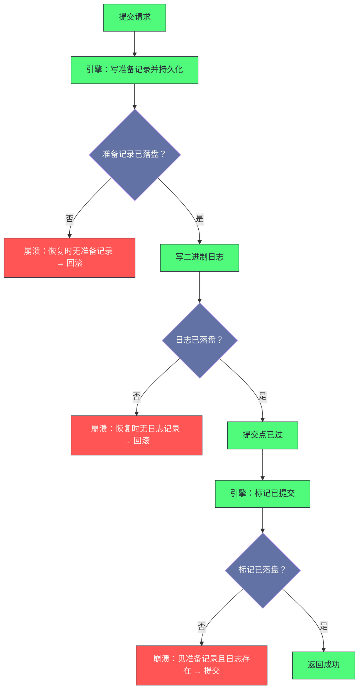

# 12. InnoDB 事务实现：ACID 的内核代价与 MVCC 的时间旅行

**摘要：**

"支持事务"这四个字的背后，是一整套机制：**回滚段、撤销日志、快照、清理线程、两阶段提交。** 它们分别服务于 ACID 的四个方面：**原子性靠"撤销日志"**（记录改动的前值，以便回滚）、**持久性靠"重做日志加双写"**（第 7、8 篇已展开）、**隔离性靠"快照与锁"**（读用快照、写用锁）、**一致性则靠前三者加上约束与崩溃恢复共同达成。** 本文按"四根支柱与它们的代价 → 事务与回滚段的组织 → 快照如何实现隔离 → 可见性如何判断 → 提交与崩溃恢复的衔接"展开。先说明四根支柱各自保障什么、代价落在哪里；再拆解事务系统的全局结构与事务对象的字段分类、回滚段的组织与撤销日志的四种类型（以及"为什么只存前值"）；然后重点剖析快照的四个字段与可见性判断的五条规则、两种隔离级别在"快照创建时机"上的唯一差别。之后是提交路径的两阶段与崩溃恢复时的判定逻辑（以及一处历史缺陷的修复）。最后是长事务监控、撤销空间回收、死锁分析、演进史、遗留设计与边界反例。

---

## 第 1 章 四根支柱与它们的代价

### 1.1 四个方面分别靠什么

**ACID 的四个方面由不同机制保障，而它们的代价落在不同地方。**

| 方面 | 保障机制 | 代价落在哪 |
|---|---|---|
| 原子性 | 撤销日志（回滚段） | 每行多一个回滚指针 + 撤销表空间的空间与 IO |
| 一致性 | 多版本加约束加崩溃恢复 | 快照分配与可见性判断的 CPU |
| 隔离性 | 快照（读）与锁（写） | 锁竞争与死锁检测 |
| 持久性 | 重做日志加双写 | 日志落盘的同步等待与写放大 |

**这张表里最值得注意的是"代价落在哪"这一列**：**四个方面都有代价，而它们的代价落在"不同的资源"上**——**原子性的代价是"空间与 IO"，一致性的代价是"CPU"，隔离性的代价是"并发能力"，持久性的代价是"延迟与写放大"。**

**因此"事务的开销"不是一个单一数字，而是"四类代价的叠加"**——**而在不同负载下，主导的那一类不同**（写多则持久性代价主导，并发高则隔离性代价主导）。

### 1.2 三条设计哲学

这个实现遵循三条设计哲学。

**哲学一：日志先行。** **数据页的修改必须在"对应的日志已落盘"之后才能落盘**——**这条约束保证了"崩溃后可以重放"**（第 7 篇已展开）。

**哲学二：多版本共存。** **不直接覆盖旧数据，而是"保留历史版本"**——**因此"读操作"可以"不阻塞写操作"，"写操作"也不必"等待读完成"。** **这是"读不阻塞写"这条性质的来源。**

**哲学三：悲观与乐观并存。** **普通读不加锁**（因为它读的是"快照"，不需要锁）、**写操作加行锁**、**而"死锁"由检测机制兜底**。** 这个组合的意图是"让常见路径（读）尽可能无锁"。** 而"兜底"这个角色说明"这套组合'不追求无死锁'，只追求'死锁可被处理'"。

**三条哲学的关系是"第一条保证持久性，第二条保证读不阻塞写，第三条保证写之间的正确性"**——**而三者共同构成了"事务系统的性能特征"。**

### 1.3 一个容易误解的地方

**这里有一处容易误解的地方值得先澄清：多版本不等于"读不加锁"。**

**准确的说法是**：**"快照读"（普通查询）不加锁**，**而"当前读"（加锁查询）仍然加锁**——**且"当前读"读的是"最新版本"，而不是"快照"。**

**因此"同一张表上既有不加锁的读，也有加锁的读"**——**而"两者的可见性规则不同"**：**前者按"快照"判断，后者按"最新已提交"判断。**

**这处区分解释了一类常见困惑**：**"同一个事务里，普通查询和加锁查询看到的数据可能不同"**——**这不是 bug，而是"两种读的语义不同"。**

**因此理解事务实现的第一步，是分清"快照读"与"当前读"**——**因为后续的很多机制（快照、锁、可见性判断）都围绕这处区分展开。**

### 1.4 四处代价

这个实现有四处代价。

**其一：多版本的空间开销。** **历史版本要保留在撤销日志里**——**而"保留多久"取决于"最老的活跃事务"**（第 9 篇已展开"清理的安全边界"）。

**其二：可见性判断的 CPU 开销。** **每次读一条记录都要"判断可见性"**——**而"如果不可见，还要'沿版本链向前追溯'"**，**因此"版本链越长，读越慢"。**

**其三：锁竞争与死锁。** **写操作之间的冲突需要"等待或回滚"**——**而"死锁"需要额外的检测机制。**

**其四：提交路径的同步等待。** **提交需要"等日志落盘"**——**而这正是"提交延迟"的主要来源**（第 7 篇已展开）。

**四处代价的共同特征是"它们是'多版本加日志'的对价"**：**多版本带来"空间与追溯成本"，日志带来"同步等待"，锁带来"竞争与死锁"。** **因此这套机制的性能优化方向，始终围绕"缩短版本链、减少锁冲突、压缩提交等待"。** 而这三条恰好对应了"读、写、提交"三条路径。

> [!info] 核心概念
> 理解事务实现的关键是"分清两种读"：**"快照读"走"多版本"路径**（因此"读不阻塞写"，代价是"版本链追溯"）；**"当前读"走"锁"路径**（因此"看到最新数据"，代价是"可能等待锁"）。**后续的"快照字段""可见性规则""隔离级别差异"，都是围绕"快照读"展开的**——**而"锁"是另一条独立的线索。**

### 1.5 一个类比：会计的双账本

把这套机制类比成"会计记账"会更容易理解它的结构。

**"每一笔支出都记一笔流水"对应"写重做日志"**——**它的作用不是"给客户看"，而是"出事时能对账"。**

**"改动一笔账时，先把原来的数字抄在草稿上"对应"写撤销日志"**——**这样"如果这笔改动要作废"，就能"照草稿改回去"。**

**"查账时不用等出纳停手"对应"读不阻塞写"**——**因为"查的是'截至某个时点的账'"（快照），而不是"实时状态"。**

**"查账时如果发现这笔后来又被改过，就翻到草稿找'当时的值'"对应"沿版本链追溯"。**

**"两本账（流水账与客户账）必须同时对得上"对应"两阶段提交"**——**而"对账的判据"是"流水账里有没有这一笔"。**

**这个类比的用处在于"它把四种机制的用途说清楚了"**：**重做日志管"出事能恢复"，撤销日志管"改动能作废"，快照管"查账不挡出纳"，两阶段提交管"两本账一致"。** **而"四者各自服务一个目标"这一点，正是 ACID 四个方面与机制之间的对应关系。**

### 1.6 一条关于"支持事务"的辨析

**最后辨析一处常见误解：把"支持事务"当作"没有代价"。**

**"支持事务"意味着"每一次修改都要多写一份撤销日志、每一个读都要判断可见性、每一次提交都要等日志落盘"**——**因此它的代价是"实实在在的"。**

**而"不支持事务"的引擎在这些环节上是"零开销"的**——**这解释了"为什么在'不需要事务'的场景下，前者可能更快"。**

**因此"该不该用事务"这个问题，取决于"是否需要它的四条保证"**——**而在"纯追加写、不需要回滚、不需要一致性读"的场景下（例如日志表），事务的价值确实较低。**

**这条辨析的意义在于"它把'选型'拉回到'需求'上"**：**"支持事务"是一个能力，而"能力"总有代价**——**因此"是否需要"比"是否更好"更值得先问。** **这与本专栏反复出现的"选择依据是当前约束条件"是同一条原则。**

---

## 第 2 章 事务与回滚段的组织

### 2.1 全局事务系统

**事务系统是一个全局结构，它管理"所有事务的生命周期"。**

**它的内容可以归为四类**：**保护结构的锁**、**事务标识的分配器**（一个原子递增的计数器）、**三条事务链表**（全部事务、读写事务、提交中的事务）、**以及"多版本控制器与回滚段数组"。**

**三条链表的用途不同**：**"全部事务"用于"监控与统计"**（例如"当前有多少活跃事务"）；**"读写事务"用于"快照的创建"**（因为"只有读写事务会影响可见性"）；**"提交中的事务"用于"保证提交顺序"。**

**而"回滚段数组"与"历史链表长度"这两项值得留意**：**前者是"撤销日志的组织结构"**，**后者是"待清理记录量"的度量**（第 9 篇已展开它的监控意义）。

### 2.2 事务标识的分配

**事务标识的分配有两处值得说明的设计。**

**第一处是"只读事务不分配标识"**——**因为"只读事务不修改数据，因此'不会产生需要被别的版本判断的版本'"**。** 因此"分配标识"这个动作只在"第一次修改时"发生。

**这条优化的收益是"减少了标识分配的开销与链表长度"**——**因为"大量只读事务不会占用标识空间"。**

**第二处是"标识永不回绕"**——**它采用足够宽的整数**，**因此"不存在'标识用尽'的问题"。** **这条设计的收益是"可见性判断不需要处理'回绕'"**——**而"回绕"会带来"新旧判断失效"这类严重问题。**

**两处设计的共同特征是"它们都在'减少需要处理的情况'"**：**只读事务不参与，回绕不需要考虑。** **而"减少情况"是所有"判断逻辑"的通用优化方向**——**这与第 4 篇讲的"用哨兵简化边界处理"是同一思路。** 而"减少情况"的收益不只在于"少写代码"，更在于"判断路径更短"。

### 2.3 回滚段的组织

**回滚段是"撤销日志的组织单位"**——**而它的关键字段可以归为四类。**

**第一类是"磁盘定位"**：**它所在的表空间与页号**——**因此"撤销日志可以分布在独立的表空间里"。**

**第二类是"内存状态"**：**段标识与当前页数。**

**第三类是"两条撤销链表"**：**"活跃事务的撤销日志"与"缓存待重用的撤销日志"**——**前者用于"回滚与追溯"，后者用于"复用空间"。**

**第四类是"历史链表"与它的长度**：**已提交但尚未清理的撤销日志**——**而"它的长度"就是"待清理量"的度量。**

**四类字段里，"缓存待重用"这条链表值得留意**：**它说明"撤销日志的空间是被复用的"**——**因此"提交之后，撤销日志的空间可以被下一个事务使用"。** **而"复用"的前提是"其中的记录已被清理"**（第 9 篇已展开）。

### 2.4 撤销日志的四种类型

**撤销日志按"它记录的是什么操作"分成四类。**

| 类型 | 对应操作 | 存什么 |
|---|---|---|
| 插入型 | 新增记录 | 只存主键 |
| 更新型 | 修改已有记录 | 存被改字段的前值 |
| 删除标记型 | 标记删除 | 只存主键 |
| 更新已删记录型 | 修改已标记删除的记录 | 存前值 |

**这张表里最值得注意的是"插入型与删除标记型只存主键"**：**因为"回滚一个插入"等价于"按主键删除这条记录"**，**而"回滚一个删除标记"等价于"去掉标记"**——**两者都只需要"知道是哪条记录"，而不需要"知道它的内容"。**

**而"更新型需要存前值"**：**因为"回滚一个更新"需要"把字段改回去"，**因此**"必须知道它原来是什么"。**

**这条区分的意义在于"它把撤销日志的空间开销降到了最低"**：**只有"真正需要前值"的操作才存前值**，**而"只需要定位"的操作只存主键。** **这与第 5 篇讲的"变更缓冲只缓存能获益的操作"是同一思路**：**只存必要的信息。** 而"只存必要信息"正是"延迟机制"能长期存活的关键。

### 2.5 事务对象的字段分类

**事务对象的字段可以归为六类，而"分类"本身说明了"一个事务要维护多少种状态"。**

**第一类是"标识"**：**事务标识与一个用于清理的序号**。

**第二类是"状态"**：**当前状态**（未开始、活跃、已准备、已提交）、**隔离级别**、**是否只读**、**是否自动提交**。

**第三类是"时间与位置"**：**开始时间**（用于监控长事务）与**开始时的日志位置**。

**第四类是"多版本"**：**关联的快照**。

**第五类是"回滚"**：**回滚段分配、撤销日志序号、以及两个撤销日志对象**（一个管插入、一个管更新）。

**第六类是"锁"**：**锁对象的内存池与持有锁的链表**。

**此外还有"两阶段提交"相关的字段**（外部事务标识与是否已准备）。

**六类字段的共同特征是"它们对应'事务的六个方面'"**：**身份、状态、时间、可见性、回滚、并发。** **因此"一个事务对象有多大"，反映的是"这套机制要同时维护多少件事"。** **而这也解释了"为什么事务对象不轻"**——**因为"每一个活跃事务都带着一份完整的六类状态"。**

---

## 第 3 章 快照如何实现隔离

### 3.1 快照的四个字段

**快照由四个字段表达，而它们的作用各不相同。**

**第一个是"上界"**：**它大于"创建快照时的所有活跃事务标识"**——**因此"标识不小于它的记录"属于"快照创建之后才开始的事务"，因此不可见。**

**第二个是"下界"**：**它是"创建快照时最小的活跃事务标识"**——**因此"标识小于它的记录"属于"快照创建之前就已提交的事务"，因此可见。**

**第三个是"创建者标识"**：**它用于"让本事务看到自己的修改"。**

**第四个是"活跃事务标识的集合"**：**它记录"创建快照时哪些事务正在进行"**——**而"标识落在这个集合里的记录"属于"尚未提交的事务"，因此不可见。**

**四个字段的关系是"用两个边界把标识空间分成三段，再用集合处理中间段"**：**"下界以下"可见、"上界以上"不可见、而"中间段"需要"查集合"。**

### 3.2 可见性判断的五条规则

**判断一条记录是否可见，按五条规则依次检查。**

**规则一：标识小于下界 → 可见。** **因为"它在快照创建前就已提交"。**

**规则二：标识等于创建者 → 可见。** **因为"这是本事务自己的修改"。**

**规则三：标识不小于上界 → 不可见。** **因为"它是快照创建之后才开始的事务"。**

**规则四：标识在活跃集合里 → 不可见。** **因为"它在快照创建时尚未提交"。**

**规则五：其余情况 → 不可见。** **因为"它虽然已提交，但提交时间晚于快照创建"。**

**五条规则的顺序是有意的**：**前两条是"快速判定"**（一次比较即可），**而"查集合"被放在后面**（因为"它是唯一需要查找的规则"）。** 这与第 5 篇讲的"准入条件的判断顺序"是同一优化思路**：**把廉价的判断排在前面。** 而"唯一需要查找的那条"排在最后，正是这条思路的直接体现。

### 3.3 两种隔离级别的唯一差别

**两种常见隔离级别在"快照读"上的差别只有一处：快照的创建时机。**

**"读已提交"是"每条语句创建一个新快照"**——**因此"同一事务里，不同语句可能看到不同的数据"**（因为"快照之间可能有新事务提交"）。

**"可重复读"是"事务中第一次快照读时创建一个快照，直到事务结束"**——**因此"同一事务里的多次快照读看到同一份数据"。**

**这处差别的后果值得强调**：**它决定了"同一事务内的读是否一致"**——**而"可重复读"之所以叫这个名字，正是因为它"让同一事务内的重复读结果一致"。**

**而"两种级别的其他行为相同"**（都走多版本、都不加锁）——**因此"从读已提交切到可重复读"的代价主要是"快照存活时间变长"**，**而"快照存活时间变长"意味着"清理的安全边界更靠前"**（第 9 篇已展开）——**也就是"撤销日志积压更多"。**

### 3.4 快照的分配与复用

**快照的创建与释放有两条优化。**

**第一条是"快照复用"**：**在同一事务内，"可重复读"会复用已创建的快照**——**因此"不需要每条语句都新建一个"。**

**第二条是"快照池"**：**较新版本引入了"快照对象的复用池"**——**因此"创建快照"不需要"每次都分配内存"。** **这条优化针对的是"高并发下快照创建频繁"这个场景。**

**两条优化的共同特征是"它们都在减少'快照创建'这个动作的开销"**——**而"创建快照"的成本在于"要遍历活跃事务链表并复制它们的标识"。** **因此"活跃事务越多，创建快照越贵"**——**这也是"高并发下快照创建成为瓶颈"的原因。**

**这条成本结构解释了一条实践含义**：**"活跃事务数量"不只是一个"监控指标"，它还是"读操作开销的直接影响因素"**——**因此"控制长事务"不只"减少空间积压"，还"降低读操作的快照创建成本"。**

### 3.5 快照与锁的分工

最后把"快照"与"锁"的分工说清楚，因为它们是"隔离性"的两条独立线索。

**快照解决的是"读与写之间的冲突"**——**它让"读不需要等待写"**（因为"读的是历史版本"）。

**锁解决的是"写与写之间的冲突"**——**它保证"两个写不会互相覆盖"。**

**而"快照读"与"当前读"的差异恰好体现了这个分工**：**前者走快照（因此与写无冲突），后者走锁（因此与写有冲突）。**

**因此"隔离性"的实现不是"一个机制"，而是"两个机制各自负责一类冲突"**——**而"读已提交"与"可重复读"的差异只落在"快照"这一侧**（因为"锁的行为在两种级别下基本相同"）。

**这条分工说明一个判断方式**：**遇到"并发相关的性能问题"时，先问"冲突发生在'读与写'之间还是'写与写'之间"**——**前者指向快照与版本链，后者指向锁与死锁。** **这个二分比"逐项排查"高效得多。** 而它的依据是"两套机制各自独立"，因此"两套机制的表现差异"天然就是一条分界线。

---

## 第 4 章 从读到版本链

### 4.1 读一条记录的完整路径

**读一条记录的路径分五步。**

**第一步：从索引里定位记录。** **这一步走的是"索引查找"路径**（第 11 篇已展开）。

**第二步：取出"记录的两个系统列"**（最后修改它的事务标识与回滚指针）。

**第三步：判断可见性。** **如果可见则直接返回**；**否则进入第四步。**

**第四步：沿回滚指针找到"上一个版本"。**

**第五步：对旧版本重复第三步与第四步**，**直到"找到可见版本"或"版本链走完"。**

**五步里，第三到第五步是"多版本路径"**——**而它的成本与"版本链的长度"成正比。** **因此"版本链越长，读越慢"**——**而"版本链的长度"由"这条记录被修改过多少次且那些版本还没被清理"决定。**

### 4.2 版本链的形态

**版本链是"从新到旧"串起来的**——**而它通过"回滚指针"连接。**

**而"链上的版本"有两种来源**：**"更新型撤销日志"提供"被改字段的前值"**（因此"重建旧版本"需要"把前值填回去"），**而"插入型撤销日志"标记"这条记录是本次事务插入的"**（因此"旧版本"就是"不存在"）。

**因此"沿链追溯"这个动作"不只是'读一条旧记录'"，还包含"重建"**——**也就是"用前值把字段改回去"。**

**这条性质解释了"为什么版本链的追溯成本较高"**：**因为"每一次追溯"都涉及"重建一个记录版本"**，**而"重建"需要"解析撤销日志并应用前值"。**

### 4.3 一处常见的性能现象

**"同一条记录的版本链很长"会带来一个典型现象：读变慢，而写不变。**

**原因在于"读需要沿链追溯，而写不需要"**——**写只"追加新版本"（并"记一条撤销日志"），**因此**"链变长"不影响写的成本。**

**因此这类问题的表现是"某张表的查询变慢，而写入速度正常"**——**而排查方向是"是否有长事务阻止了清理"**（第 9 篇已展开）。

**这条现象的机制依据值得记住**：**"版本链的长度"由"清理的安全边界"决定**——**因此"读变慢"的根因往往在"事务管理"上，而不在"查询或索引"上。** **这与第 9 篇讲的"清理积压的根因可能是长事务"是同一判断。** 而"把读性能问题往事务管理方向排查"这个习惯，是理解多版本机制之后才会形成的。

### 4.4 快照读与当前读的对比

| 维度 | 快照读 | 当前读 |
|---|---|---|
| 加锁 | 不加锁 | 加锁 |
| 读到的版本 | 快照可见的版本 | 最新已提交版本 |
| 需要沿版本链追溯 | 需要（若当前版本不可见） | 不需要 |
| 是否受长事务影响 | 受影响（版本链变长） | 不受影响 |
| 典型语句 | 普通查询 | 加锁查询 |

**这张表里最值得留意的是"是否受长事务影响"这一行**：**因为"当前读不需要追溯"，所以"它不受版本链长度的影响"。**

**因此"同一张表上，普通查询变慢而加锁查询正常"这个现象，指向的是"版本链"而不是"索引"**——**而这类区分对定位问题很有价值。**

**这条区分也说明一件事**：**"长事务的危害"主要落在"快照读"上**——**因此如果业务以"当前读"为主（例如大量加锁查询），那么"长事务"的影响面会小一些**（但仍会影响空间与清理）。

### 4.5 重建旧版本的机制

**"重建旧版本"这个动作值得展开，因为它是"版本链追溯"的核心。**

**重建的依据是"撤销日志里的前值"**——**而重建的过程是"按记录定位，然后把指定字段的值改回前值"。**

**因此"撤销日志里的'字段位置'"这个信息很关键**：**它让"重建"可以"只改被改过的字段"，而"不需要重建整行"。**

**这条设计的收益是"重建的成本与'被改字段数'成正比"**（而不是"与行的大小成正比"）——**因此"改一个字段"与"改十个字段"的重建成本不同。**

**一处值得留意的推论是**：**"更新大字段"会产生"较大的撤销日志"**（因为"前值就是那个大字段"）——**因此"频繁更新大字段"会"显著增加撤销空间占用"。**

**这条推论给出一条实践建议**：**"把大字段与高频更新字段分开"**——**因为"大字段的前值会让撤销日志膨胀"，而"撤销日志的膨胀会拖慢清理与追溯"。** **这与第 10 篇讲的"避免把大字段与高频查询字段放同一张表"是同一类建议**（一个针对"索引效率"，一个针对"撤销开销"）。

---

## 第 5 章 提交与崩溃恢复的衔接

### 5.1 提交路径的三段

**提交路径分三段，而"分界线"是"二进制日志的写入"。**

**第一段是"准备"**：**让引擎把改动记为"已准备但未提交"，并持久化这个状态。**

**第二段是"写二进制日志"**——**这一步是"提交点"**：**它成功则事务必然提交，失败则必然回滚。**

**第三段是"提交"**：**让引擎把事务标记为已提交，并释放锁与清理事务视图。**

**三段的关系与第 1 篇讲的"内部两阶段提交"是同一件事**——**而这里补充的是"崩溃恢复时如何判定"。**

### 5.2 崩溃恢复时的判定

**恢复时的判定逻辑很直接。**

**第一步：扫描重做日志，找出"处于已准备状态的事务"。**

**第二步：扫描二进制日志，收集"所有已记录的事务标识"。**

**第三步：对每个已准备的事务，判断"它的标识是否在二进制日志里"。** **在则提交，不在则回滚。**

**这个判定的正确性来自"二进制日志位于两段之间"**：**因为"它一旦写入就代表提交"，**因此**"在日志里的事务必须提交"。**

**这与第 3 篇讲的"原子 DDL 用日志记录意图"是同一手法**：**用"显式的记录"替代"事后的推断"**——**而"记录"是可靠的，"推断"在故障场景下不可靠。**

### 5.3 一处历史缺陷

**这里有一处历史缺陷值得说明，因为它体现了"顺序的敏感性"。**

**早期版本里，外部事务的准备阶段"先写二进制日志、再写引擎的准备记录"。**

**这个顺序的问题在于**：**如果"写完二进制日志后崩溃"，那么"主库会回滚这个事务"（因为"引擎侧没有准备记录"），**而**"从库已经收到了这段二进制日志"**——**因此"主从出现不一致"。**

**修复的方式是"调整顺序"**：**先写引擎的准备记录，再写二进制日志。**

**这处缺陷的价值在于"它说明'提交路径的顺序'是正确性的一部分"**——**而"看起来只是顺序问题"的改动，实际上决定了"崩溃场景下的数据一致性"。** **这与第 1 篇讲的"提交路径的顺序不能随意调整"是同一条纪律。**

### 5.4 提交路径的两处成本

**提交路径的成本落在两处，而它们都是"等待"。**

**第一处是"等日志落盘"**——**它的成本取决于"落盘策略"与"磁盘响应速度"。**

**第二处是"等组提交形成批次"**——**它的成本取决于"并发度"与"等待参数"**（第 7 篇已展开）。

**两处成本的共同特征是"它们是'持久性'的直接代价"**——**而"降低它们"的手段是"放宽落盘策略"（以数据安全为代价）或"提高并发与磁盘能力"。**

**这条成本结构说明一个判断**：**"提交延迟"这个指标的两个来源是"磁盘"与"批量"，**因此**"排查提交慢"的第一步是"确认瓶颈在这两者中的哪一个"**（第 7 篇已给出这个判断方式）。

### 5.5 提交路径与崩溃判定的关系

把"提交路径"与"崩溃判定"画在一起，能看清"为什么这个顺序是必要的"。

**图中最值得注意的是"三个崩溃点"给出的三个不同结论**：**在准备记录落盘前崩溃 → 回滚**；**在二进制日志落盘前崩溃 → 回滚**；**在提交标记落盘前崩溃 → 提交。**

**这三个结论的正确性依赖"二进制日志是唯一的分界"**：**它之前的一切崩溃都导致回滚，它之后的一切崩溃都导致提交。** **因此"它必须位于两段之间"**——**而这就是"顺序不能调换"的原因。**

**这条分析的价值在于"它把'顺序'变成了'可推演的三个场景'"**：**而"可推演"意味着"可以在改动前验证正确性"**——**这正是第 7.4 节那条实践纪律的由来。**

---

## 第 6 章 生产落地

### 6.1 长事务的监控与危害

**长事务是这套机制里最常见的问题来源，而它的危害有三个层次。**

**第一层是"空间积压"**：**长事务"钉住清理的安全边界"，因此"撤销日志无法被清理"**——**而"撤销表空间会持续膨胀"**（第 9 篇已展开）。

**第二层是"读变慢"**：**因为"版本链变长"，所以"快照读需要追溯更多版本"**（第 4.3 节）。

**第三层是"锁占用"**：**长事务"持有的锁不会释放"**——**因此"它可能阻塞其他事务"，甚至"引发连锁等待"。**

**三个层次的危害"从空间到性能到并发"逐层加深**——**而它们的共同根因是"一个事务存活太久"。** 因此"长事务"值得被当作一个独立的治理对象，而不是"应用侧的代码风格问题"。

**因此监控的入口是"活跃事务的持续时长"**——**而处置方向分两类**：**"能拆则拆"（应用侧优化）与"必要时终止"（运维处置）。**

### 6.2 撤销空间回收

**撤销空间的回收有三个层次，而它们的"触发条件"不同。**

**第一个层次是"记录被清理"**——**它的条件是"没有活跃事务需要该版本"。**

**第二个层次是"回滚段被截断"**——**它的条件是"该段里的撤销日志都已被清理"，**而**"截断"由周期性动作触发。**

**第三个层次是"表空间被回收"**——**这需要"截断后空间真的被归还"**，**而这一点取决于"表空间的组织方式"。**

**三个层次的共同特征是"它们都有'延迟'与'条件'"**——**因此"删除大量数据后空间不会立即缩小"是设计使然**（与第 10 篇讲的"页级回收的条件"是同一类现象）。

### 6.3 死锁日志的分析方法

**死锁分析的入口是"死锁日志"，而它给出的信息可以按四步使用。**

**第一步：确认"两个事务各自持有什么、等待什么"。** **日志里会列出"每个事务持有的锁"与"它正在等待的锁"。**

**第二步：确认"冲突发生在哪条记录或哪个间隙上"。** **日志会给出"锁对应的索引与记录"。**

**第三步：确认"加锁的语句"。** **日志会给出"导致加锁的那条 SQL"。**

**第四步：判断"是否可以通过调整访问顺序避免"。** **因为"死锁的常见成因是'两个事务以不同顺序访问同一批记录'"**——**而"统一访问顺序"是成本最低的处置。**

**四步里最值得注意的是第四步**：**"统一访问顺序"能消除"循环等待"**——**而"循环等待"是死锁的四个必要条件之一。** **因此"按固定顺序访问"是一条通用的防死锁手段。**

### 6.4 排查决策树

**"查询变慢而写入正常"时**，先看"活跃事务的持续时长"：**如果有长事务，那么方向在"版本链变长"**（第 4.3 节）。

**"撤销空间持续增长"时**，先看"历史链表长度"：**它也在涨则"清理跟不上"，不长则"空间已扩大但未回收"**（第 9 篇已展开）。

**"提交延迟高"时**，先分"等日志落盘"与"等批次形成"：**前者看磁盘响应，后者看并发与等待参数。**

**"频繁死锁"时**，先看"是否存在不同的访问顺序"：**统一顺序是最低成本的处置**（第 6.3 节）。

**"加锁查询正常而普通查询慢"时**，方向明确在"版本链"上**——**因为"当前读不追溯版本"**（第 4.4 节）。

**这条决策树里最有价值的是最后一条**：**它用"两种读的差异"把问题"一刀切开"**——**而这类"用机制差异做二分"的排查方式，比"逐项调参"高效得多。**

### 6.5 一次"查询变慢"的排查推演

把排查路径串成一个案例。

假设现象是"某张表的查询变慢，而写入速度正常；执行计划与索引都没有变化"。

**第一步，确认"变慢的是快照读还是当前读"。** **如果"加锁查询正常而普通查询慢"，那么方向在"版本链"**——**因为"当前读不追溯版本"**（第 4.4 节）。**这一步能把范围一次缩小一半。**

**第二步，如果是版本链问题，检查"活跃事务的持续时长"。** **如果存在"持续很久的事务"，那么根因是"它钉住了清理的安全边界"。**

**第三步，如果是长事务，区分"业务本身的长事务"与"泄漏的事务"。** **前者是"应用侧的事务设计问题"**（例如"一个事务里做了很多事"），**后者是"连接未正确关闭或未提交"。**

**第四步，如果"没有长事务"，检查"清理能力"。** **因为"清理跟不上"也会"让版本链变长"**——**而处置方向是"调大清理线程数与批量"**（第 9 篇已展开）。

**第五步，如果"版本链并不长"，回到"读路径"本身。** **此时方向转到"索引与执行计划"**——**而"计划正常但慢"的情况需要"看执行时的等待"**（例如"锁等待"或"IO 等待"）。

**五步的价值在于"它用'两种读的差异'作为第一个分叉"**——**而这个分叉的依据是"机制路径不同"**，**因此它的判断成本极低（只需对比两类查询的表现）而区分度极高。** **这类"低成本高区分度"的判断，是排查中最值得优先使用的。**

### 6.6 一次"撤销空间持续增长"的排查推演

把这套机制的另一类问题也串一次。

假设现象是"撤销表空间持续增长且无法收缩，而实例性能没有明显变化"。

**第一步，确认"增长的是撤销空间，而不是数据或日志空间"。** **因为三者的处置方向完全不同**（第 9 篇已展开这个区分）。

**第二步，检查"历史链表长度"。** **如果它也在增长，那么"清理跟不上"是方向；如果它不长，那么"空间已扩大但未回收"是另一回事。**

**第三步，如果是"清理跟不上"，区分"有长事务"与"清理能力不足"。** **查活跃事务的持续时长**——**如果存在很老的事务，那么根因在应用侧。**

**第四步，如果是"长事务"，进一步区分"业务长事务"与"泄漏事务"。** **前者需要"拆分事务边界"，后者需要"修正连接管理"。**

**第五步，如果是"空间已扩大但未回收"，确认"回滚段是否已被截断"。** **因为"截断"才会让空间被回收**——**而"截断频率"决定它多久尝试一次。**

**五步的价值在于"它把'空间在涨'分解成'哪类空间、什么原因、什么动作'"**——**而这个分解的起点是"区分空间类型"，**而**不是"直接调参数"。**

**这条推演与第 9 篇给出的那条推演高度重合**——**而这不是重复，而是"同一问题从两个机制的视角看"**：**第 9 篇从"清理线程"的角度看，本篇从"事务与版本"的角度看。** **两个视角都指向"长事务"这个根因**——**这也印证了"长事务是投入产出比最高的治理对象"这个判断。**

---

## 第 7 章 演进史与遗留设计

### 7.1 关键节点

| 版本 | 事务相关变化 | 动因 |
|---|---|---|
| 早期 | 引入事务与回滚段 | 与不支持事务的引擎形成差异 |
| 中期 | 只读事务不分配标识 | 减少标识消耗与链表长度 |
| 中期 | 撤销表空间独立 | 让撤销日志不再挤占共享表空间 |
| 5.7 及之后 | 清理多线程化、快照结构优化 | 高并发下的清理与读开销 |
| 8.0 | 快照对象复用池、活跃集合改用有序容器加二分 | 减少分配与查找开销 |
| 8.0 后期 | 修复外部事务准备阶段的写入顺序 | 消除崩溃场景下的主从不一致 |

**这条演进线可以分成两条**：**一条是"降低读路径的开销"**（快照复用、集合改用有序容器），**另一条是"降低空间与清理的压力"**（撤销表空间独立、清理多线程化）。

**而"修复写入顺序"这一步值得单独留意**：**它不改变任何功能，只"调整了两步的顺序"**——**而它解决的是一个"只在崩溃场景下暴露"的一致性问题**（第 5.3 节）。**这类修复的价值很难在"正常路径"上被观察到，但它在故障场景下是决定性的。**

### 7.2 四处遗留设计

**第一处：版本链的追溯成本与链长成正比。** **因此"长事务"会"间接拖慢读"**——**而"改进追溯"的空间有限**（因为"重建旧版本"这件事本身有成本）。

**第二处：撤销空间的回收有延迟与条件。** **因此"空间膨胀"难以完全避免。**

**第三处：死锁检测是"事后兜底"而非"事前避免"。** **因此"死锁仍会发生"，只能"靠检测与回滚处理"。**

**第四处：提交路径的同步等待无法消除。** **只要"要求持久性"，就"必须等落盘"。**

**四处遗留设计的共同特征是"它们是'多版本加持久化'的固有代价"**——**而它们的处置方式是"管理"而不是"消除"**：**控制长事务、定期巡检空间、统一访问顺序、按需放宽落盘策略。**

### 7.3 演进方向

**方向一：版本链在新型存储上的重构。** **如果"存储可以被直接映射访问"，那么"保留历史版本"的方式可能改变**——**例如"用存储层的多版本能力替代'应用层的版本链'"。** 这实际上是把"多版本"从"数据库实现"下沉到"存储能力"。

**方向二：快照分配的优化。** **高并发下"创建快照"需要"遍历活跃事务链表"**——**因此"如何在不遍历的前提下判断可见性"是一个优化方向**（例如"用更紧凑的活跃集合表示"）。

**方向三：清理的进一步并行化。** **因为"清理的安全边界由最老的事务决定"，所以"清理的并行度受'边界'限制"**——**而"提高并行度"的方向是"让不同回滚段独立推进"。**

**三个方向的共同特征是"它们都在削弱'多版本'带来的三类成本"**——**追溯成本（方向一）、快照创建成本（方向二）、清理成本（方向三）。** **而这三类成本正是第 1.4 节列出的那几处代价。**

### 7.4 一条关于"正确性修复"的经验

最后把"那处历史缺陷"的经验收敛一下，因为它很有代表性。

**那处缺陷的形态是"两个写入点的顺序不当，导致崩溃场景下不一致"**——**而它"在正常路径上完全不可见"**（因为"正常提交时两个写入点都会成功"）。

**这类缺陷的共同特征是"它们只在'部分成功'的场景下暴露"**——**而"部分成功"恰好是"崩溃、断电、网络中断"这类场景的特征。**

**因此排查这类缺陷的方法不是"看正常路径的日志"，而是"推演'如果在这一步崩溃会怎样'"**——**而"推演"的对象是"每一步的持久化状态"。**

**这条经验给出一条实践纪律**：**涉及"多个写入点"的改动，应当"逐个写入点推演崩溃场景"**——**而推演的问题是"如果它写完就崩，恢复时能判断出正确结果吗"。** **这与第 3 篇讲的"原子 DDL 记录决定而非进度"、第 8 篇讲的"双写处理在日志重放之前"是同一类分析**：**它们都在回答"崩溃时能否得到确定结论"。**

### 7.5 一条关于"隔离级别选择"的经验

最后把"隔离级别的选择"这件事的经验收敛一下，因为它在本篇里被反复提到。

**两种级别的差别只有一处（快照创建时机）**——**而这一处差别带来三个后果**：**"同一事务内的读是否一致"、"快照存活时间的长短"、"撤销日志积压的多少"。**

**因此"该选哪个"这个问题可以按三个问题回答**：**业务是否要求"同一事务内重复读结果一致"**；**事务的平均时长有多长**；**撤销空间的余量是否充足。**

**三个问题里，"是否需要一致读"是决定性的**——**因为如果不需要，那么"读已提交"能"让快照更快释放"，从而"减少积压"。**

**而"选哪个"的常见误判是"以为可重复读一定更好"**——**因为"它提供了更强的保证"**，**而"更强的保证"意味着"更长的快照存活"**，**从而"更多的空间占用"。** **因此"更强的隔离"不是"无代价的升级"，而是"用空间换一致性"。**

**这条经验的形态与第 8 篇讲的"关闭双写是用风险换性能"是同一类**：**"更强"与"更弱"之间不存在"绝对更优"，只存在"与需求是否匹配"。**

---

## 第 8 章 边界与反例

### 8.1 反例一：把"多版本"当作"读不加锁"

**"快照读"不加锁，而"当前读"加锁**（第 1.3 节）。**因此"读不加锁"这个说法只对一半的读成立。**

### 8.2 反例二：以为"同一事务里的读总是一致"

**这取决于隔离级别**：**"读已提交"下每条语句一个新快照，因此可能看到不同数据**（第 3.3 节）。

### 8.3 反例三：把"读变慢"归因于索引或查询

**如果"加锁查询正常而普通查询慢"，方向在"版本链"**（第 4.4 节）。**而版本链的根因在"长事务"。**

### 8.4 反例四：以为"删除大量数据后空间会立即缩小"

**回收有三个层次且都有条件与延迟**（第 6.2 节）。

### 8.5 反例五：把"死锁"当作"可以完全避免"

**死锁检测是"事后兜底"**（第 7.2 节）。**能做的是"减少概率"（统一访问顺序）与"快速处置"，而不是"杜绝"。**

### 8.6 反例六：为"降低提交延迟"而放宽落盘策略而不评估后果

**这是"以数据安全换延迟"的决策**，**必须由业务确认。**

### 8.7 反例七：把"提交路径的顺序"当作实现细节

**它决定了崩溃场景下的数据一致性**（第 5.3 节）。**历史上的一处主从不一致正是由顺序不当造成的。**

### 8.8 反例八：把"版本链变长"归因于"更新太频繁"

**版本链的长度由"清理的安全边界"决定**，**而边界由"最老的活跃事务"决定**（第 4.3 节）。**因此"更新频繁"只是"产生版本"，而"版本不被清理"才是"链变长"的原因。**

### 8.9 反例九：把"活跃事务多"当作"只影响空间"

**它还会"提高读操作的快照创建成本"**（第 3.4 节）。**因此"控制活跃事务数"同时改善空间与读性能。**

---

## 第 9 章 落点

回到开头："支持事务"这四个字的背后是什么？

**是一套"用多版本实现读不阻塞写、用日志实现持久性、用锁处理写冲突"的组合。** 而这套组合的代价落在四类资源上：**空间（撤销日志）、CPU（可见性判断与版本追溯）、并发能力（锁竞争）、延迟（提交等待）。**

**而这套机制里最值得记住的一条区分是"快照读与当前读"**——**因为后续的很多现象都可以用它解释**：**为什么"读不加锁"只对一半成立、为什么"同一事务的读可能不一致"、为什么"长事务会拖慢读"、为什么"加锁查询正常而普通查询慢"。**

**因此这套机制的"故障排查"有一个高效的入口**：**先问"这是快照读的问题还是当前读的问题"**——**因为两者的机制路径不同，而"路径不同"意味着"排查方向不同"。** **这类"用机制差异做二分"的方法，在本专栏里已经出现过多次**（第 8 篇的"查询路径与后台路径"、第 9 篇的"前台与后台"），**而它的通用性来自"分层与分路径"这个设计本身。**

**还有一条经验值得留下：这套机制的四类代价"落在不同资源上"，因此"事务相关的问题"从来不是一个单维问题。** **原子性的代价是空间、一致性的代价是 CPU、隔离性的代价是并发、持久性的代价是延迟**——**而"哪一类成为瓶颈"取决于"负载的读写比例与并发度"。** **因此"优化事务性能"的第一步不是"调参数"，而是"确认当前的主导代价是哪一类"。**

**最后一条是关于"长事务"的：它是这套机制里"投入产出比最高"的治理对象。** **因为它同时影响三件事**——**空间积压（撤销表空间膨胀）、读性能（版本链变长）、并发（锁持有时间变长）。** **因此"把长事务拆小"这一项治理，能同时改善三个维度**——**这也是为什么它几乎出现在所有事务相关的优化建议里。**

---

## 专栏导航

- 上一篇：[[11. InnoDB 索引：B+Tree 的工程实现与分裂合并哲学]]。
- 下一篇：[[13. MySQL 主从复制：从异步到 WriteSet 的并行进化史]]。
- 返回专栏首页：[[00 专栏导览]]。

---

## 参考资料

1. MySQL 8.0.33 源码：`storage/innobase/trx/trx0trx.cc`、`trx0rseg.cc`、`trx0purge.cc`、`read/read0read.cc`、`row/row0sel.cc`。
2. MySQL. MySQL Internals Manual: InnoDB Transaction Model 与 Multi-Versioning. https://dev.mysql.com/doc/internals/en/
3. MySQL. 官方文档：InnoDB 多版本并发控制与一致性读. https://dev.mysql.com/doc/refman/8.0/en/innodb-multi-versioning.html
4. MySQL. 官方文档：隔离级别与一致性读的语义差异. https://dev.mysql.com/doc/refman/8.0/en/innodb-consistent-read.html
5. MySQL. 官方文档：InnoDB 与二进制日志的两阶段提交与崩溃恢复判定. https://dev.mysql.com/doc/refman/8.0/en/innodb-two-phase-commit.html
6. MySQL. 官方文档：innodb_trx 与长事务的监控方式. https://dev.mysql.com/doc/refman/8.0/en/innodb-information-schema-transactions.html
7. MySQL. 官方文档：死锁检测与死锁日志的解读. https://dev.mysql.com/doc/refman/8.0/en/innodb-deadlocks.html
8. MySQL. 官方文档：InnoDB 锁与隔离级别的对应关系. https://dev.mysql.com/doc/refman/8.0/en/innodb-locking.html
9. MySQL. 官方文档：innodb_undo_tablespaces 与撤销表空间的组织. https://dev.mysql.com/doc/refman/8.0/en/innodb-undo-tablespaces.html
10. MySQL. 官方文档：InnoDB 错误日志中的事务相关诊断信息. https://dev.mysql.com/doc/refman/8.0/en/error-log.html

---

> [!note] 思考题
> 1. ACID 四个方面的代价分别落在哪类资源上？这对"排查事务相关性能问题"有什么指导意义？
> 2. 为什么"只读事务不分配标识"是一条有价值的优化？
> 3. 撤销日志里"插入型只存主键"的依据是什么？这与"更新型必须存前值"的差别在哪？
> 4. 两种隔离级别在快照读上的唯一差别是什么？它带来什么后果？
> 5. "加锁查询正常而普通查询慢"这个现象指向什么？为什么它能用来做排查的二分？
