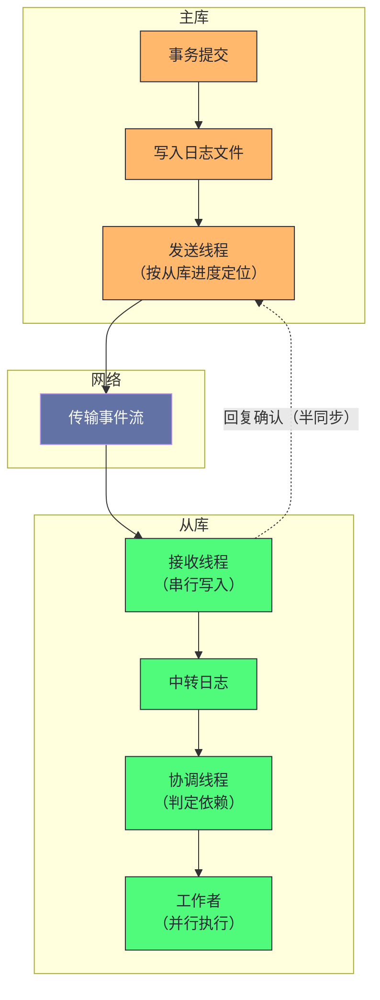

# 13. MySQL 主从复制：从异步到 WriteSet 的并行进化史

**摘要：**

主从复制的逻辑看起来很直白：**把主库的日志传给从库并重放。** 但这套直白逻辑在二十五年里经历了三次并行化的跃迁——**因为"重放"这一环最初是单线程的，而单线程重放跟不上多线程写入。** 三次跃迁的依据各不相同：**按"库"划分**（第一代）、**按"提交批次"划分**（第二代）、**按"行冲突"划分**（第三代）。而每一代都解决前一代的局限，同时留下新的限制。本文按"传什么 → 怎么定位 → 怎么并行 → 由哪些线程协作 → 一致性怎么保证"展开。先说明复制的三阶段、三条设计哲学与四处代价；再讲日志格式的三代选择（以及"行格式为什么是并行的前提"）、从"位点定位"到"全局标识定位"的演进。然后重点剖析并行回放的三代：**按库划分的局限、按提交批次的"并行度从哪来"、按行冲突的"为什么单事务也能并行"**。之后是三条线程的分工、半同步的两种等待时机与退化风险、单事务无法并行这个典型案例、参数与监控、一致性校验与"跳过事务"的风险。最后是演进史、四处遗留设计、与另一条技术路线的对比、以及边界反例。

---

## 第 1 章 一个"数据分发"问题

### 1.1 复制的三阶段

**复制的完整链路分三段。**

**第一段是"主库生成"**：**事务提交时把修改写进日志文件。**

**第二段是"传输与接收"**：**从库的接收线程拉取日志事件，写入自己的"中转日志"。**

**第三段是"重放应用"**：**从库的协调线程与工作者读取中转日志，在从库上执行。**

**三段的分工是"主库负责生成，网络负责传递，从库负责执行"**——**而三段的"能力"必须匹配**：**任何一段跟不上，都会表现为"延迟增长"。**

**因此"复制延迟"这个指标的含义是"第三段的进度落后于第一段多少"**——**而它的根因可能在任意一段。**

### 1.2 三条设计哲学

这个机制遵循三条设计哲学。

**哲学一：逻辑复制。** **传输的是"语句或行的变更"，而不是"物理页"**——**因此"主从可以有不同硬件、不同存储布局"，甚至"跨版本"。** **这条哲学是"复制能跨环境"的根本原因。**

**哲学二：异步为主。** **默认"不等待从库确认"**——**因此"主库性能几乎不受复制影响"。** **代价是"主库崩溃时可能丢一部分未同步的数据"。**

**哲学三：传输可插拔。** **半同步与组复制都是"以插件形式扩展复制协议"**——**因此"可靠性可以按需加强"，而不必改变核心机制。**

**三条哲学的关系是"第一条决定'传什么'，第二条决定'默认行为'，第三条决定'如何加强'"**——**而三者共同构成了"这套机制在一致性与性能之间的位置"。**

### 1.3 四处代价

这个机制有四处代价。

**其一：异步带来的数据丢失窗口。** **主库崩溃时，"尚未传给从库的事务"会丢失**——**而"窗口有多大"取决于"复制延迟"。**

**其二：延迟。** **因为"重放是另一条独立的路径"，所以"它可能跟不上生成速度"**——**而"延迟"会影响"读从库的一致性"与"故障切换的丢失量"。**

**其三：重放的并行化难度。** **因为"重放必须保持与主库相同的效果"，所以"能并行多少"取决于"事务之间的依赖关系"**——**而"识别依赖"是三代并行方案的核心问题。**

**其四：不一致的排查成本。** **因为"逻辑复制允许主从有不同环境"，所以"某些差异（例如非确定性语句）会导致结果不同"**——**而"发现不一致需要专门的校验工具"。**

**四处代价的共同特征是"它们是'逻辑加异步'的对价"**：**逻辑带来"跨环境能力"与"不一致风险"，异步带来"性能"与"丢失窗口"，重放带来"延迟"与"并行化难题"。** **因此这套机制的优化方向，始终围绕"提高并行度、缩短延迟、加强一致性保证"。**

### 1.4 一个类比：异地仓库的补货

把这套机制类比成"异地仓库"会更容易理解它的结构。

**"总仓的出入库流水"对应"主库的日志"。**

**"把流水抄一份送到分仓"对应"日志传输"。**

**"分仓照着流水重新做出库入库"对应"重放"**——**而"照着流水重做"这件事"比'直接搬货'慢"**（这正是逻辑复制与物理复制的差别）。

**"如果分仓只有一个理货员，流水再多也只能一件件做"对应"单线程重放"**——**而这就是"并行化"要解决的问题。**

**"按货区划分理货员"对应"按库并行"**——**而"如果所有货都在同一个货区，多派人也没用"。**

**"同一批下单的一起做"对应"按提交批次并行"**——**而"如果只有一个大单，那就只能一个人做"。**

**"不同货架上的货可以同时做"对应"按行冲突并行"**——**而这一代"不再依赖'批次'，只看'货架是否冲突'"**——**因此"一个大单只要涉及不同货架，也能多人同时做"。**

**这个类比的用处在于"它把三代并行的依据说清楚了"**：**第一代看"货区"，第二代看"批次"，第三代看"货架"。** **而"依据越细，可并行的机会越多"**——**这正是三代演进的方向。**

---

## 第 2 章 传输什么：日志格式

### 2.1 三种格式

**日志格式有三种，而它们的取舍围绕"安全与体积"。**

| 格式 | 记录内容 | 优点 | 缺点 |
|---|---|---|---|
| 语句格式 | 原始语句 | 体积小 | 非确定性语句不安全 |
| 行格式 | 行的前镜像与后镜像 | 绝对安全，与隔离级别无关 | 体积大 |
| 混合格式 | 按规则自动切换 | 兼顾两者 | 规则复杂，难预测 |

**"语句格式"的核心问题是"非确定性"**：**如果"同一条语句在不同环境下的结果不同"**（例如"取当前时间""取随机值""按无索引字段更新"），**那么"从库重放的结果与主库不同"。**

**而"行格式"记录的是"具体哪一行被改成了什么"**——**因此"重放的结果是确定的"，与"环境、隔离级别、索引"都无关。**

**因此"行格式"是当前的主流选择**——**而它的代价是"日志体积显著增大"。**

### 2.2 行格式的事件序列

**一个事务在行格式下会产生一串事件，而它们的顺序有意义。**

**序列是**：**事务标识事件**（标记事务开始）、**表映射事件**（描述"接下来的行属于哪张表、列是什么类型"）、**若干行变更事件**（插入、更新、删除各对应一类）、**事务提交事件**。

**"表映射事件"这一环值得留意**：**它"只在表结构变化时出现一次"，而"后续的行事件引用它"**——**因此"重放时需要'记住最近的表映射'"。** **这个设计的作用是"避免每行事件都重复表结构信息"。**

**而"前镜像与后镜像"的区分也值得留意**：**删除只带前镜像**（因为"删除后行不存在"）、**插入只带后镜像**、**更新两者都带**（因为"定位需要前镜像，写入需要后镜像"）。**因此"事件类型"本身也携带了"哪些镜像是必要的"这层信息。**

**这条区分与第 12 篇讲的"撤销日志的类型"是同一个思路**：**只记录"必要的信息"**——**因此"删除不需要后镜像，插入不需要前镜像"。** 而"只记必要信息"也让"日志体积"与"实际改动量"保持同量级。

### 2.3 格式选择与并行的关系

**格式选择与"能否并行"有一层直接关系。**

**因为"第三代并行（按行冲突）需要'行的标识'"**，**而"只有行格式才提供这个信息"**——**因此"行格式是第三代并行的前提"。**

**这解释了一条实践约束**：**"要使用按行冲突的并行，就必须用行格式"**——**而"语句格式下只能退回到'按库'或'按批次'并行"。**

**因此"格式选择"不只是一个"安全与体积的取舍"，还"决定了并行的上限"**——**这是"格式选择"容易被忽略的一层影响。**

**这条耦合说明一个通用现象**：**"传输格式"往往"决定了'后续处理'能做到什么"**——**因为"后续处理的依据来自格式里的信息"。** **这与第 12 篇讲的"撤销日志的字段位置让重建可以只改被改字段"是同一类**：**格式的丰富度决定了下游的能力。**

### 2.4 整体链路的四段

把整条链路画出来，能看清"事件从生成到生效"经过了几段。

**图中最值得注意的是"接收线程到中转日志"这一段被标注为串行**：**它是"并行复制的第一个串行点"**（第 5.4 节）。**因此"整条链路的并行度上限"受这一段限制**——**而"改善执行侧的并行度"无法突破这个上限。**

**另一处值得注意的是"回复确认"这条虚线**：**它从"接收"直接回到"发送"**——**因此"半同步的等待"发生在"日志已收到"这一步，而不是"已执行"这一步**（第 6.3 节）。

**这张图的实用价值在于"它给出了排查的分段依据"**：**"延迟高"可以按四段定位**（生成、传输、接收、执行）——**而"每段的判据"是"各段之间的进度差距"。**

---

## 第 3 章 从位点到全局标识

### 3.1 位点定位的问题

**最初的复制用"文件名加偏移量"来定位**——**也就是"从哪个日志文件的哪个位置继续"。**

**这个方式的脆弱之处在"主从切换"时暴露**：**因为"新主库的日志文件与偏移量与旧主库不同"**——**因此"切换后必须'重新计算从库应该从新主库的哪里开始'"**。

**而"计算这个位置"需要"人工介入或专门的工具"**——**因此"切换成本高、易出错"。**

**这处问题的形态是"用'物理位置'表达'逻辑进度'"**：**因为"物理位置"依赖于"具体是哪台机器的日志"，所以"它无法跨机器表达'我执行到哪了'"。**

### 3.2 全局标识

**全局标识的解法是"给每个事务一个全局唯一的编号"**——**而它由"服务器标识加事务序号"构成。**

**这个设计的精妙之处在于"它不依赖任何机器状态"**：**"某个事务的标识"在"任何一台机器上"都是同一个值**——**因此"我执行到哪了"可以用"一个标识集合"表达。

**因此"全局标识"实际上是把"进度"从"位置"变成了"集合"**——**而"集合"是可以"跨机器比较"的。**

**这与第 3 篇讲的"把元数据降级为普通数据"是同一类思路**：**用"与具体环境无关的表达"替代"依赖具体环境的表达"。**

### 3.3 自动定位的原理

**自动定位的原理很直接**：**从库把自己的"已执行集合"发给主库，主库算出"自己产生的集合减去从库已执行的集合"，从"第一个缺失的事务"开始发送。**

**这个计算是"集合运算"**——**因此"它不需要'扫描日志去找位置'"，只需要"比较集合"。**

**而"从第一个缺失的事务开始发送"这个行为，让"补数据"变得自动**——**因此"从库落后时不需要人工指定起点"。**

### 3.4 它解决了什么

**全局标识解决了三类问题，而它们都源于"位点的环境依赖性"。**

**第一类是"切换后的重新定位"**——**因为"标识与机器无关"，所以"切换后从库可以继续'按集合补'"，**因此**"不需要人工计算位置"。**

**第二类是"多级复制的进度表达"**——**因为"每一级都可以用'集合'表达进度"，所以"级联复制中的进度比较是统一的"。**

**第三类是"误操作的识别"**——**因为"标识唯一"，所以"可以精确地判断'某个事务是否已执行'"**——**而这一点正是"跳过某个事务"这类操作的基础**（第 8.3 节）。

**三类问题的共同特征是"它们都要求'进度的表达不依赖具体机器'"**——**而"全局标识"恰好提供了这个性质。** **因此这条演进的意义不只是"省了人工操作"，而是"让进度成为可比较、可传递、可审计的东西"。**

### 3.5 一条关于"表达方式"的经验

**从"位点"到"全局标识"这条演进，可以提炼成一条更一般的经验。**

**"位点"表达的是"物理位置"**——**而"物理位置"的缺点是"它依赖'具体是哪台机器的哪个文件'"。** **"全局标识"表达的是"逻辑身份"**——**而"逻辑身份"与"机器无关"。**

**因此这条演进的本质是"把'进度'从'依赖环境的表达'换成'与环境无关的表达'"**——**而这类替换的收益是"可比较、可传递、可审计"。**

**这条经验在本专栏里已出现过多次**：**第 3 篇讲的"把元数据降级为普通数据"（从而获得事务与恢复能力）**、**第 12 篇讲的"用事务标识判断可见性"（而不是用时间）**。**三处的共同特征是"它们都选择了'与环境无关的表达'"。**

**因此判断"某个表达方式是否需要改进"时，可以问"它是否依赖'当前环境的某个细节'"**——**如果是，那么"环境变化时它就会失效"**（例如"主从切换时位点失效"）。**而"换成与环境无关的表达"，正是消除这类失效的通用手段。**

---

## 第 4 章 并行回放的三代

### 4.1 第一代：按库划分

**第一代的依据是"数据库名"**：**按"库名哈希"把事件分给不同的工作者。**

**它的收益是"跨库操作可以并行"**——**因此"多库场景下延迟显著改善"。**

**而它的局限是"单库操作全部串行"**——**因为"同一个库的事件必须按顺序执行"。** **因此在"业务集中在单库"的场景下，它几乎没有收益。**

**这条局限的形态是"划分依据太粗"**：**因为"库"是一个很大的粒度，所以"同一库内的可并行机会被浪费了"。**

### 4.2 第二代：按提交批次

**第二代的依据是"主库的提交批次"**——**而它的核心假设是"同一批提交的事务之间没有依赖"。**

**主库在写日志时"标记每个事务的两个编号"**：**一个是"它所属批次的前一个批次的最大编号"**，**一个是"它自己的全局编号"。**

**从库调度的规则是**：**"如果当前事务的编号大于'当前最小未提交事务的编号'，则等待"**——**而"不满足这个条件的事务可以并行分发"。**

**这条规则的直觉解释是**：**"同一批次内的事务可以并行，而'跨批次'的事务需要等前一批完成"。** **因为"同一批次意味着它们同时提交"，**而**"同时提交意味着它们在主库上没有相互等待"。**

**而它的局限是"并行度取决于主库的并发提交数"**——**因此"如果主库只有一个线程在写"，那么"所有事务都在同一批次"，因此"从库也只能单线程重放"。**

**这条局限是第二代最关键的限制**——**而它正是第 7.1 节那个案例的成因。**

### 4.3 第三代：按行冲突

**第三代的依据是"事务修改了哪些行"**——**而它的假设是"修改不同行的事务之间没有依赖"。**

**主库在写日志时"为每个事务生成一组'行哈希'"**：**包括"主键哈希"与"所有唯一键的哈希"。**

**从库维护一张"最近哪些行被哪个编号的事务改过"的历史表**，**而调度规则是**：**"如果当前事务的某个行哈希在历史表里、且对应的编号在'最近范围'内，那么必须等那个事务完成"。**

**这条规则的直觉解释是**：**"如果两个事务改了同一行，它们必须按顺序；否则可以并行"。**

**而它的突破是"不再依赖提交批次"**——**因此"即使主库单线程提交，只要'一个事务涉及多行、或不同事务涉及不同行'，从库就能并行重放"。**

**这正是第三代解决第二代局限的方式**：**它把"并行依据"从"批次"降到了"行"。** **而"依据越细，可并行的机会越多"**——**这就是三代演进的共同方向。**

### 4.4 三代的关系与"并行度从哪来"

**把三代并列，可以看出"并行度的来源"如何变化。**

| 代 | 依据 | 并行度的来源 | 主要局限 |
|---|---|---|---|
| 第一代 | 库名 | 跨库操作 | 单库内无法并行 |
| 第二代 | 提交批次 | 主库的并发提交 | 单事务无法并行 |
| 第三代 | 行哈希 | 不同行的修改 | 有外键时退化为第二代 |

**这张表里最值得留意的是"主要局限"这一列**：**每一代的局限都是"它的依据所覆盖不到的部分"**——**第一代覆盖不到"同一库内"，第二代覆盖不到"同一事务内"，而第三代覆盖不到"有外键的场景"。**

**这个形态说明一条规律**：**任何"并行依据"都有"它无法区分的部分"**——**而"依据越细"，无法区分的部分越小，但"判定依据的成本"越高**（因为"要计算行哈希、维护历史表"）。

**因此"该用哪一代"这个问题，取决于"负载的形态"**：**多库则第一代够用；高并发小事务则第二代够用；单事务大批量则必须第三代。** **而"能否用第三代"还受"格式与约束"的限制**（必须行格式、无外键）。
---

## 第 5 章 复制的三条线程

### 5.1 主库的发送线程

**主库侧有一条"发送线程"，它的职责是"按从库的进度把日志事件发出去"。**

**它的工作分三步**：**打开日志文件**、**算出"从库缺失的事务"并定位到第一个缺失事务的开头**、**然后循环读取并发送事件。**

**"定位到第一个缺失事务"这一步是它的核心**：**因为"从库可能落后很多"，所以"必须能快速跳过已执行的部分"**——**而在全局标识模式下，这一步是"扫描日志直到找到第一个不在从库集合里的事务"。**

**这条线程是"每个从库一条"**——**因此"从库越多，主库的线程越多"。** **而"每条线程都要读日志"意味着"日志文件会被多次读取"**——**这是"多从库场景下主库 IO 压力"的一处来源。**

### 5.2 从库的接收线程

**从库侧的接收线程负责"拉取事件并写入中转日志"。**

**它的工作循环分六步**：**读网络包**、**解析事件类型**、**构造事件对象**、**写入中转日志**、**更新"已拉取的位置"**、**如果是事务提交事件且启用了半同步，则回复确认。**

**六步里，"写入中转日志"这一步很关键**：**因为它意味着"数据先落到从库的本地文件，再由另一条线程读取执行"**——**因此"接收"与"执行"是"通过中转日志解耦的两条独立路径"。**

**这个"解耦"的收益是"接收可以持续进行，即使执行很慢"**——**因此"从库落后时，事件仍会被持续拉取并堆积在中转日志里"。** **而它的代价是"多了一份日志的写入与读取"**（也就是"多一次磁盘往返"）。

### 5.3 从库的协调线程与工作者

**执行侧由"一个协调线程加若干工作者"组成。**

**协调线程的职责是"读取中转日志、判断'哪些事件可以并行'、然后分发"**——**而"判断依据"就是第 4 章讲的那三代规则。**

**工作者的职责是"从队列取事件、执行、在遇到事务提交事件时提交"**。

**协调线程的"判断与分发"这一环是整套并行机制的所在**——**因为"能并行多少"完全取决于"它如何判断依赖"。** **因此"三代并行方案"的差别，本质上是"协调线程的调度算法"的差别。**

**此外协调线程还承担"等待队列有空位"的职责**——**因为"工作者队列有上限"，所以"如果队列满了，协调线程必须等待"。** **这一点是"内存占用与并行度之间的平衡"。**

### 5.4 三者的衔接与"第一个串行点"

**三条线程的衔接方式值得留意，因为它揭示了"第一个串行点"。**

**接收线程"串行写入中转日志"**（因为"日志是一个追加文件"）——**因此"即使执行侧有多个工作者，'写入中转日志'这一环仍是串行的"。**

**这就是"并行复制的第一个串行点"**——**而它意味着"并行度的上限受'接收与写入'这一环限制"。** **在"日志量极大"的场景下，即使执行侧有再多工作者，"接收"也可能成为瓶颈。**

**这条限制的形态与第 2 篇讲的"日志写入是串行的"是同一类**：**"追加写"这个模式天然串行**——**而"要并行化它"就需要"多个日志文件"或"分片"。**

**因此"并行复制"的实际收益有一个天花板**：**它改善的是"执行"这一环，而"接收与写入"这一环没有改善。** **这也解释了为什么"部分分支提供了'并行中转日志写'"这个特性**（第 9 章展开）。

### 5.5 一处关于"中转日志"的取舍

**"中转日志"这个中间层值得单独说明，因为它是一个"可以被省略但被保留了"的设计。**

**它存在的理由是"解耦"**：**接收与执行是两条独立路径**——**因此"执行慢不会阻塞接收"，而"接收慢也不会阻塞执行"。**

**如果去掉它**，那么"接收线程必须'接收一个事件就执行一个事件'"——**因此"执行慢会直接阻塞接收"，而"接收慢也会让执行空闲"。** **两者耦合后，"整体吞吐"会被"较慢的那一方"限制。**

**因此"中转日志"的收益是"让两条路径各自以最快速度推进"**——**代价是"多一次磁盘往返"（写中转日志、读中转日志）。**

**这条取舍的形态与第 7 篇讲的"日志缓冲区"是同一类**：**用"中间的持久层"解耦"生产者与消费者"**——**而"是否值得"取决于"两者的速度差异"与"中间层的成本"。** **在"网络与执行速度差异大"的场景下，解耦的收益明显。**

---

## 第 6 章 半同步

### 6.1 异步的风险

**异步复制的风险是"主库崩溃时丢失尚未同步的事务"**——**而"丢失量"取决于"复制延迟"。**

**因此"延迟"不只是一个"性能指标"，还是"数据风险的度量"**——**这是"延迟"与"数据安全"之间的一层直接联系。**

**半同步的意图就是"把这条联系切断"**：**通过"让主库等待从库确认"，从而"保证'已提交的事务至少在从库有一份'"。**

### 6.2 两种等待时机

**等待的时机有两种，而它们的差别在于"等待发生在提交的哪一步"。**

**第一种是"提交之后等待"**：**引擎先提交（因此"其他会话能看到这个事务"），然后等待从库确认。** **它的风险是"主库崩溃时，从库没有这个事务，但其他会话已经看到了它"**——**这会造成"已提交但丢失"的错觉。**

**第二种是"同步之后等待"**：**日志落盘后先等待从库确认，然后才让引擎提交。** **它的收益是"其他会话在'确认完成'之前看不到这个事务"**——**因此"如果主库崩溃，那么'看不到的事务'与'从库没有的事务'是一致的"。**

**因此第二种是更安全的选择**——**而它的代价是"提交延迟包含'等待确认'的时间"。**

**两种时机的差别可以概括为"等待发生在'可见性生效'之前还是之后"**——**而"可见性"是"一致性的关键"**，**因此这个差别决定了"崩溃时'已提交'这个状态是否可信"。**

### 6.3 确认流程

**确认流程分五步**：**主库日志落盘**、**发送事务提交事件（并标记"需要确认"）**、**从库写入中转日志后回复确认**、**主库收到确认后更新"已确认的位置"并唤醒等待的提交线程**、**提交完成。**

**流程里值得留意的是"确认发生在'写入中转日志'之后，而不是'执行'之后"**——**因此"半同步保证的是'从库收到了日志'，而不是'从库执行完了'"。**

**这条区分很重要**：**它意味着"半同步下从库可能仍然落后"**——**而"主库崩溃后切换到从库时，仍需'把中转日志里的内容执行完'"。** **因此"半同步"保证的是"日志不丢"，而不是"数据已经可用"。**

### 6.4 退化与它的风险

**半同步有一处必须说明的机制：超时退化。**

**如果"等待确认超过阈值"，那么"它会退化为异步"**——**也就是说"不再等待，直接提交"。**

**这个设计的意图是"避免'从库故障导致主库不可写'"**——**因为"如果一直等，那么'从库挂掉'就等于'主库不可用'"。**

**而它的代价是"一致性保证在退化期间失效"**——**因此"如果退化期间主库崩溃，那么'半同步'的保护并不存在"。**

**这处机制说明一个通用权衡**：**"可用性"与"一致性"在极端场景下无法兼得**——**而"超时退化"这个选择是"优先保可用性"。** **因此"半同步不是强一致"**——**而"要强一致"需要"另一套机制"**（第 10 章展开）。

**一条实践含义是**：**"超时阈值"这个参数实际上在"可容忍的等待"与"退化的概率"之间取值**——**而"从库不稳定"时，"退化的概率会显著上升"。** **因此"半同步的有效性"依赖"从库的稳定性"，而不只是"配置正确"。**

---

## 第 7 章 生产落地

### 7.1 单事务无法并行的案例

**这是一个"配置看起来正确、但并行完全没有生效"的案例。**

**现象是**：**从库配置了多个工作者，但延迟持续增长；观察线程时发现"只有一个工作者在干活，其余空闲"。**

**根因链条是**：**主库的批量插入是"单个事务"→ 单事务在同一提交批次内 → 第二代并行的规则要求"跨批次才能并行" → 因此"单事务无法并行" → 从库只能单线程重放。**

**这个案例的价值在于"它说明'并行度'不是配置出来的，而是'负载形态决定的'"**：**因为"并行依据"是"事务之间的依赖"，所以"如果负载本身没有可并行的机会"，那么"再多工作者也没用"。**

**处置方向是"升级到第三代并行"**——**因为它"按行冲突判断"，因此"单事务内涉及不同行的操作可以并行"。** **而"效果"取决于"这个事务涉及多少不同的行"**：**如果"一个事务只改一行"，那么"它仍然无法并行"。**

**这条限制值得留意**：**第三代并行"也不是万能的"**——**它把"并行的最小单位"降到了"行"，因此"单行操作仍无法并行"。** **这与第 4.4 节讲的"每一代都有覆盖不到的部分"是一致的。**

### 7.2 参数与它的内核依据

| 参数 | 内核依据 | 调整方向 |
|---|---|---|
| 日志格式 | 决定"记录什么"与"能否按行并行" | 通常使用行格式 |
| 依赖跟踪方式 | 决定"用哪一代并行依据" | 单事务大批量需要按行 |
| 历史表大小 | 决定"按行并行的判定范围" | 越大并行度越高，内存占用也越大 |
| 工作者数 | 并行执行的数量 | 与从库的写入能力匹配 |
| 保持提交顺序 | 保证从库提交顺序与主库一致 | 通常开启 |
| 主库日志刷盘 | 主库每次提交是否刷盘 | 安全优先则开启 |
| 中转日志刷盘 | 从库中转日志的刷盘频率 | IO 敏感时可调大 |
| 中转日志恢复 | 崩溃后是否丢弃未应用的中转日志 | 通常开启 |
| 半同步等待点 | 等待发生在提交的哪一步 | 推荐"同步之后等待" |
| 需确认的从库数 | 需要多少个从库确认 | 按拓扑调整 |

**这张表里最值得留意的是"历史表大小"这一行**：**它体现了"按行并行"的一处成本**——**因为"判定冲突需要'记住最近哪些行被改过'"，所以"记忆范围越大，判定越准、并行度越高，但内存占用越大"。**

**这与第 6 篇讲的"自适应哈希索引的构建阈值"是同一类**：**"判定依据的容量"与"判定质量"之间存在取舍**——**而"该取多大"取决于"负载的行分布"。**

### 7.3 监控要点

**复制侧可观测的信息有四类。**

**第一类是"两个线程的状态"**：**接收线程与执行线程是否都在运行**——**它是"复制是否正常"的第一判据。**

**第二类是"延迟"**：**它回答"执行落后生成多少"**——**而它的用途是"判断是否需要扩容或调优"。**

**第三类是"已拉取与已执行的集合"**：**两者的差距反映"中转日志里的积压量"**——**而"差距大"说明"执行跟不上接收"。**

**第四类是"并行相关的统计"**：**包括工作者的状态与冲突计数**——**它回答"并行是否真的生效"。**

**四类信息的层次是"从状态到进度到效率"**：**先看"是否在跑"，再看"落后多少"，再看"积压在哪一段"，最后看"并行是否有效"。** **按这个顺序看，就能从"延迟高"定位到"是接收慢、执行慢、还是并行没生效"。**

### 7.4 排查决策树

**延迟持续增长时**，先分"接收跟不上"还是"执行跟不上"：**看"已拉取与已执行的差距"**——**差距大则执行是瓶颈，差距小则接收或主库是瓶颈。**

**如果"执行跟不上"，先确认"并行是否生效"**：**观察工作者的忙碌分布**——**如果"只有一个在忙"，那么方向在"并行依据与负载形态不匹配"**（第 7.1 节）。

**如果"并行已生效但仍慢"，确认"从库的写入能力"**：**因为"重放也是写入"，所以"从库的磁盘能力"会直接限制它。**

**如果"接收跟不上"，确认"网络与主库读取"**：**因为"接收是串行的"，所以"日志量极大时它可能成为瓶颈"**（第 5.4 节）。

**复制中断时**，先看"错误类型"：**连接类错误指向网络与认证，执行类错误指向数据不一致。**

**这条决策树的第一层依据是"已拉取与已执行的差距"**——**而它之所以能作为第一层，是因为"接收与执行是两条独立路径"**（第 5.2 节）。**因此"知道它们解耦"，才知道"这个差距"是一个有效的判据。**

---

## 第 8 章 一致性与修复

### 8.1 不一致的来源

**主从不一致有三个来源。**

**其一是"非确定性"**：**语句格式下"结果依赖环境"，因此"重放结果可能不同"。**

**其二是"人为操作"**：**从库被"直接写入"（例如"误操作、手工修改"）**——**而"复制不会覆盖它"，**因此**"差异会保留下来"。**

**其三是"跳过了某个事务"**：**如果"因为错误而跳过"，那么"该事务在从库永远不会执行"**（第 8.3 节）。

**三个来源的共同特征是"它们都源于'复制是逻辑的、单向的'"**：**因为"逻辑"，所以"环境差异会导致结果差异"**；**因为"单向"，所以"从库的额外修改不会被纠正"。**

### 8.2 校验与修复

**一致性校验的方式是"在主从两端分别计算数据的校验值，然后比对"。**

**而"计算校验值"这件事需要"分块进行"**——**因为"整表计算会锁表或消耗大量资源"，**因此**"校验工具通常'按块逐步进行'，并在过程中控制负载"。**

**修复的方式是"对不一致的块进行同步"**——**而"同步"通常需要"知道以哪一端为准"**。** 在"主从架构"下，通常"以主库为准"。**

**因此"校验与修复"的完整流程是"分块校验 → 定位差异块 → 以主库为准修复 → 复验"。**

**这条流程的实践含义是"它需要一套工具链，而不是一条命令"**——**而"工具链成熟度"正是"这套复制方案在生产上被广泛使用"的原因之一**（第 9 章展开）。

### 8.3 跳过事务的风险

**"跳过某个事务"是处置"复制中断"的一类手段，而它的风险值得说清。**

**在全局标识模式下，跳过的做法是"手动注入一个空事务，占用那个标识"**——**因此"那个标识被认为已执行"，**而**"它的实际内容永远不会在从库执行"。**

**风险是"永久不一致"**：**因为"该事务的修改在从库缺失"，所以"主从的差异不会自行消失"。**

**因此这类操作的适用条件是"该事务可以容忍缺失"**——**例如"非关键表的少量数据"或"可以用后续操作补齐"。**

**而"更稳妥的处置"是"先修复不一致，再让复制继续"**——**因为"跳过是'绕过问题'，而修复是'解决问题'"。**

**这条区分与第 5 篇讲的"积压问题的正确解法是恢复平衡，而不是禁用机制"是同一判断**：**"绕过"总是比"修复"便宜，而"绕过的代价"会在别处显现。**

### 8.4 一致性校验的实践细节

**一致性校验有一处实践细节值得说明，因为它决定"校验能否长期运行"。**

**"整表计算校验值"的代价很高**（因为"它要读全表数据"）——**因此校验工具通常"按块逐步进行"，并在过程中"控制对主库的压力"。**

**而"控制压力"的手段包括"限制读取速率""在低峰期运行""跳过变化频繁的表"。**

**这处细节的意义在于"它说明'一致性校验'不是一次性动作，而是需要持续进行的巡检"**——**因为"不一致可能在任何时候产生"**（例如"一次误操作"）。

**因此"把校验纳入定期巡检"是这套方案的常规实践**——**而"校验频率"取决于"对不一致的容忍度"与"校验的成本"。**

**这与第 6 篇讲的"把命中率加入定期巡检"是同一类建议**：**对"无法通过状态指标直接判断的问题"，需要"主动的定期检查"。**

---

## 第 9 章 演进史与遗留设计

### 9.1 关键节点

| 版本 | 复制变化 | 动因 |
|---|---|---|
| 早期 | 引入基于语句的复制 | 最早的主从能力 |
| 中期 | 接收线程与执行线程分离 | 支持"从库可读" |
| 5.1 | 支持基于行的复制 | 解决非确定性语句的问题 |
| 5.6 | 全局标识、按库并行 | 简化切换，改善多库场景 |
| 5.7 | 按提交批次并行、半同步优化 | 让并行依据更细 |
| 5.7.22 | 按行冲突并行（实验） | 让单事务也能并行 |
| 8.0 | 按行冲突并行正式可用 | 全面并行 |
| 8.0.27+ | 克隆插件加速从库初始化 | 替代传统备份工具 |

**这条演进线的主线是"并行依据不断变细"**：**从"库"到"提交批次"再到"行"。** **而每次变细都解决了一个具体的瓶颈**（多库、单库多事务、单事务）。

**而"克隆插件"这一步属于另一条线**：**它解决的是"从库初始化慢"**——**也就是"新加一个从库时，如何快速把全量数据搬过去"。** **这与"并行回放"是不同的问题**（一个是"增量重放慢"，一个是"全量初始化慢"）。

### 9.2 四处遗留设计

**第一处：接收与写入中转日志仍是串行的。** **因此"并行复制的第一个串行点"没有消除**（第 5.4 节）。

**第二处：有外键时"按行并行"会退化。** **因为"外键操作需要顺序性保证"，而"基于行哈希无法判断这种依赖"**——**因此"它会退回到'按提交批次'并行"。**

**第三处：临时表操作会强制串行。** **因此"建议避免在复制链中使用临时表"。**

**第四处：半同步会因超时退化为异步。** **因此"它不提供强一致保证"，而在"退化期间"一致性的保护是缺失的。**

**四处遗留设计的共同特征是"它们是'并行依据的边界'或'机制的取舍'"**：**第一处是"追加写天然串行"，第二、三处是"某些操作无法用行哈希表达依赖"，第四处是"可用性与一致性的权衡"。** **而它们的处置方式通常是"换一条路线"**（例如"用共享存储"或"用共识协议"），**而不是"修补原机制"。**

### 9.3 演进方向

**方向一：并行中转日志写入。** **它针对的是"第一个串行点"**——**因此"能让并行度上限提高"。**

**方向二：日志压缩。** **因为"行格式体积大"，所以"压缩能减少网络与磁盘开销"**——**而"压缩"对"接收与写入"这一环的收益最直接。**

**方向三：物理复制。** **"物理复制"传的是"存储层的变更"**——**因此"它不需要'逻辑重放'，从而绕开了'并行重放'这个难题"。** 而这正是"另一条技术路线"的核心（第 10 章展开）。

**三个方向的共同特征是"它们都在处理'接收与写入'这一环或'重放'这一环"**——**而"这两环恰好是复制的两个瓶颈所在"。** **因此"复制的优化"始终围绕"如何让这两环更快"。**

### 9.4 一条关于"渐进式演进"的经验

最后把这条演进路线的"形态"提炼一下，因为它很有代表性。

**这套机制的演进方式是"渐进式"的**：**它没有"一次性重构"，而是"每一代解决前一代的局限、同时留下新的局限"。**

**这条路线的收益是"兼容性"**：**每一代都是"新增一种模式"，而不是"替换旧模式"**——**因此"老配置仍能工作"。**

**而它的代价是"模式的累积"**：**现在有三种并行依据、两种等待时机、三种日志格式**——**因此"配置组合变多、理解成本变高"。**

**这条形态的通用性在于"它反映了'长期演进的系统'的共同特征"**：**为了兼容，只能"加模式"而不能"改模式"**——**因此"历史越长，可选项越多"。** **这与第 3 篇讲的"字典的重构代价高"、第 10 篇讲的"页大小不可改"是同一类现象。**

**因此面对这类系统时，一条实用的做法是"先确认'当前用的是哪种模式'"**——**因为"多模式共存"意味着"同样的现象可能来自不同模式"。** **而"确认模式"的成本很低，但它能避免"用错误的模式假设去排查"。**

---

## 第 10 章 与另一条路线的对比

### 10.1 两条路线的差异

**另一条路线是"共享存储加物理复制"，它与本机制的差异可以按四个维度对比。**

| 维度 | 逻辑复制（本篇） | 共享存储加物理复制 |
|---|---|---|
| 传输内容 | 语句或行变更 | 存储层的物理变更 |
| 重放方式 | 逻辑重放（需要执行） | 存储层直接生效 |
| 延迟来源 | 重放速度 | 网络与存储同步 |
| 环境兼容性 | 高（可跨版本与硬件） | 低（要求同构） |
| 从库可读性 | 支持（独立实例） | 视实现而定 |

**这张表里最值得留意的是"延迟来源"这一行**：**逻辑复制的延迟来自"重放速度"，而共享存储方案的延迟来自"网络与存储同步"**——**因此后者的延迟通常更低（因为它"不需要执行"）。**

**而它的代价在"环境兼容性"上**：**因为"物理变更与存储布局绑定"，所以"它要求主从同构"。** **这与本篇讲的"逻辑复制可跨环境"恰好相反。**

### 10.2 取舍的依据

**取舍的依据是"是否要求'从库可读'与'跨环境能力'"。**

**如果"从库要承担读流量"**，那么"独立实例的逻辑复制"更自然**——**因为"从库是一个完整可用的实例"。**

**如果"只需要'快速故障切换与低延迟'"**，那么"共享存储方案"更合适**——**因为它"延迟低、切换快"。

**而"跨环境能力"（例如"从旧版本迁移到新版本"）只有逻辑复制提供**——**因此"迁移场景下它不可替代"。**

**这条取舍说明一个判断**：**"两种方案不是替代关系，而是'服务不同需求'"**——**而"云上默认提供共享存储方案、而自建环境仍以逻辑复制为主"，正是因为这个区别。**

### 10.3 一处常见的误判

**最后纠正一处误判：把"逻辑复制落后"当作"它要被淘汰"。**

**"落后"这个判断的依据通常是"延迟更高"**——**而"延迟"只是"一个维度"。**

**如果考虑"可跨版本、从库可读、工具链成熟、生态广泛"这些维度**，那么"逻辑复制在很多场景下仍是唯一可行或成本最低的选择"**——**而"共享存储方案"在这些维度上并不占优。**

**因此更准确的表述是"两种方案各有其适用场景"**——**而"哪种更合适"取决于"最看重哪个维度"。** **这与本专栏反复出现的"选择依据是当前约束条件"是同一条原则。**

---

## 第 11 章 边界与反例

### 11.1 反例一：把"配置了并行"当作"并行已生效"

并行度由"负载形态"决定（第 7.1 节）。**因此"工作者的忙碌分布"才是判据。**

### 11.2 反例二：把"半同步"当作"强一致"

它会因超时退化为异步（第 6.4 节）。**因此"退化期间的一致性保护是缺失的"。**

### 11.3 反例三：把"半同步"当作"从库已可用"

它保证的是"日志已收到"，而不是"已执行完"（第 6.3 节）。

### 11.4 反例四：把"按行并行"当作"任何负载都能并行"

它的最小单位是"行"，**因此"单行操作仍无法并行"**（第 7.1 节）。

### 11.5 反例五：把"跳过事务"当作"低成本的修复"

它的代价是"永久不一致"（第 8.3 节）。**因此它只在"可容忍缺失"时适用。**

### 11.6 反例六：把"延迟高"一律归因于"从库性能不足"

延迟可能来自"接收"这一环，**而它是串行的**（第 5.4 节）。

### 11.7 反例七：忽略"格式选择决定并行上限"

"按行并行需要行格式"（第 2.3 节）。**因此"格式"不只是"安全与体积的取舍"。**

### 11.8 反例八：把"另一种路线"当作"必然替代"

两者服务不同需求（第 10.3 节）。

---

## 第 12 章 落点

回到开头：**"把日志传给从库并重放"这件事，难点在哪？**

**难点在"重放"这一环**——**因为"重放必须保持与主库相同的效果"，所以"能并行多少"取决于"事务之间的依赖"。** 而"识别依赖"就是三代并行方案要解决的核心问题。

**三代演进的共同方向是"把并行依据不断变细"**：**从"库"到"提交批次"再到"行"。** **而每变细一次，可并行的机会就更多**——**同时"判定依据的成本"也更高**（要计算行哈希、维护历史表）。

**这条演进留下两条值得记住的判断**：**其一，"并行度不是配置出来的，而是负载形态决定的"**——**因此"看到并行没生效"时，应当先问"负载本身有没有可并行的机会"。** **其二，"任何并行依据都有它覆盖不到的部分"**——**因此"没有一种并行方案能解决所有场景"，而"选择依据是负载的形态"。**

**而"另一条路线"（共享存储加物理复制）之所以被云厂商采用，正是因为它绕开了"逻辑重放"这个难题**——**它不传"变更"，而是传"物理结果"。** **两条路线各有适用场景，而"哪种更合适"取决于"最看重哪个维度"。**

**最后一条经验值得留下：这套机制里"最容易被低估"的一环是"接收与写入中转日志"。** **因为"并行复制"这个名词让人把注意力放在"执行侧的并行度"上**——**而实际上"接收"这一环仍是串行的，因此"并行度有一个天花板"。** **这个例子的价值在于"它说明'一个机制的名字'可能让人忽略它的边界"**——**因此"读清整条链路、找到那个串行点"，比"记住'它支持并行'"更有用。**

**而这也解释了为什么"排查延迟"的第一步应当看"各段之间的进度差距"**：**因为"延迟"是一个"结果指标"，而"分段差距"才是"定位依据"。** **因此"知道链路分成几段、每段的进度如何表达"，是排查这类问题的前提**——**这与第 7 篇讲的"用日志的几个水位定位瓶颈"是同一手法。**

---

## 专栏导航

- 上一篇：[[12. InnoDB 事务实现：ACID 的内核代价与 MVCC 的时间旅行]]。
- 下一篇：[[14. MySQL 组复制：从 Paxos 变种到分布式强一致集群]]。
- 返回专栏首页：[[00 专栏导览]]。

---

## 参考资料

1. MySQL 8.0.33 源码：`sql/rpl_slave.cc`、`sql/rpl_binlog_sender.cc`、`sql/binlog.cc`、`sql/rpl_write_set.cc`、`sql/rpl_mi.h`、`sql/rpl_rli.h`。
2. MySQL. MySQL Internals Manual: Replication. https://dev.mysql.com/doc/internals/en/
3. MySQL. 官方文档：基于二进制日志的复制与复制格式. https://dev.mysql.com/doc/refman/8.0/en/replication.html
4. MySQL. 官方文档：GTID 与自动定位原理. https://dev.mysql.com/doc/refman/8.0/en/replication-gtids.html
5. MySQL. 官方文档：多线程复制与 binlog_transaction_dependency_tracking. https://dev.mysql.com/doc/refman/8.0/en/replication-options-replica.html
6. MySQL. 官方文档：半同步复制与 rpl_semi_sync_master_wait_point. https://dev.mysql.com/doc/refman/8.0/en/replication-semisync.html
7. Percona Live. 10 Years of MySQL Parallel Replication. 2024.

---

> [!note] 思考题
> 1. 复制的三阶段中，哪一段的"能力"最难提升？为什么？
> 2. 为什么"行格式是第三代并行的前提"？格式选择还影响了什么？
> 3. 三代并行的"依据"分别是什么？"依据越细"带来什么收益与代价？
> 4. 半同步的两种等待时机，差别在于"等待发生在可见性之前还是之后"，这为什么重要？
> 5. "并行度不是配置出来的，而是负载形态决定的"——请用本篇的例子说明这句话。
