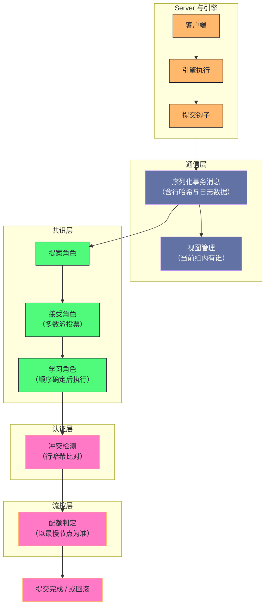

# 14. MySQL 组复制：从 Paxos 变种到分布式强一致集群

**摘要：**

主从复制（第 13 篇）走的是"异步为主、半同步兜底"的路线，而它留下两个无法根治的问题：**主库崩溃时的数据丢失窗口**与**切换时的人工介入**。组复制换了一条路：**用共识协议让"提交"这件事变成"组内多数派确认"**——**因此"多数派确认的事务不会丢"，而且"谁当主由组内选出"。** 这条路换来强一致与自动选主，代价是三处：**性能（提交需要一轮网络往返）、可用性（网络分区时少数派不可写）、复杂度（冲突检测与流控）。** 本文按"为什么要共识 → 架构分几层 → 共识层怎么实现 → 单主提交走什么流程 → 多主怎么防冲突 → 怎么防止落后节点被拖垮 → 生产上会踩什么坑"展开。先说明复制路线的两个残留问题与共识的解法、三条设计哲学与四处代价；再拆解四层架构与共识层的角色映射、两阶段与三阶段的差别。然后剖析单主模式的事务提交流程与钩子的位置、多主模式的冲突检测原理与"检测粒度的边界"、流控的配额计算与木桶效应、视图变更与选主规则。之后是网络分区导致频繁选主的案例、参数与监控、多主冲突避坑。最后是演进史、四处遗留设计、与分布式数据库的对比、以及边界反例。

---

## 第 1 章 从"异步"到"共识"

### 1.1 复制路线的两个残留问题

**主从复制的路线在"性能"上很成功，但留下两个无法根治的问题。**

**问题一：数据丢失窗口。** **因为"提交不等待从库"，所以"主库崩溃时可能丢失尚未同步的事务"**——**而半同步只能"缩小这个窗口"，不能"消除它"**（因为"它会因超时退化为异步"，第 13 篇已展开）。

**问题二：切换的人工介入。** **因为"主从关系是单向配置的"，所以"主库故障后需要'选出新主并让其他从库改指向它'"**——**而这个过程通常需要"工具或人工"，因此"切换时间不可控"。**

**两个问题的共同根源是"复制是单向的、不对称的"**：**因为"主从角色固定"，所以"主库是单点"**；**因为"确认是单向的"，所以"它只是'主库告知从库'，而不是'组内达成一致'"。**

### 1.2 共识的解法

**共识的解法是"把'提交'从'主库的决定'变成'组内的决定'"。**

**具体做法是"让每次提交都经过一轮组内确认"**——**而"确认的规则是'多数派同意'"。** **因此"只要多数派活着，提交就能继续"，而"只要某个事务被多数派确认，它就'不会因为任何单点故障而丢失'"。**

**而这个机制顺带解决了"切换"问题**：**因为"组内的状态是共同维护的"，所以"哪个节点当主"可以由"组内按规则选出"**——**而"选出之后其他节点自动跟随"，因此"切换不需要人工"。**

**因此共识路线用"一次网络往返"换来了两件事**：**"不丢数据"与"自动切换"。** **而这个交换的代价就是第 1.4 节要列出的那几处。**

### 1.3 三条设计哲学

这个机制遵循三条设计哲学。

**哲学一：插件化。** **它不侵入核心代码，而是"通过钩子拦截事务提交"**——**因此"它对现有架构的改动最小"。** **这条哲学的收益是"它可以在不改动引擎的前提下工作"。** 而"不改动引擎"这一点很重要，因为它让"共识能力"成为"可选能力"。

**哲学二：状态机复制。** **事务在组内"以相同顺序执行"**——**因此"只要顺序一致，各节点的最终状态就一致"。** **这条哲学是"共识只需保证顺序"这个结论的来源。** 而"只需保证顺序"也解释了"为什么共识层不关心事务内容"。

**哲学三：悲观冲突检测。** **多主模式下"通过行哈希检测写写冲突，后提交者回滚"**——**因此"冲突的代价是'一个事务被回滚'"，而不是"数据被破坏"。** 而"回滚"这个代价"由应用承担"，因此"多主对应用有额外要求"。

**三条哲学的关系是"第一条决定'如何接入'，第二条决定'共识要保证什么'，第三条决定'多主下如何保正确性'"**——**而三者共同构成了"这套机制在现有架构上的落地方式"。**

### 1.4 四处代价

这个机制有四处代价。

**其一：性能。** **提交需要"一轮多数派确认"**——**因此"延迟增加、吞吐下降"。** **而"下降幅度"取决于"网络往返时间"。**

**其二：可用性。** **因为"需要多数派"，所以"少数派一侧不可写"**——**因此"网络分区时'少数派那部分'会失去写能力"。** **这是"强一致"的必然代价。**

**其三：复杂度。** **冲突检测、流控、成员管理、视图变更**——**这些机制在"异步复制"里都不存在。**

**其四：规模上限。** **因为"每次提交都要组内确认"，所以"节点越多、单次确认越贵"**——**因此"它不适合大规模集群"。**

**四处代价的共同特征是"它们是'用共识换保证'的对价"**：**共识带来"不丢数据与自动切换"，代价是"延迟、可用性、复杂度、规模"。** **因此"该不该用它"取决于"是否需要那两条保证"，以及"能否承受这四处代价"。** 而"是否需要那两条保证"是必须先回答的问题。

### 1.5 一个类比：董事会决议

把这套机制类比成"董事会决议"会更容易理解它的结构。

**"总经理说了算"对应"主库决定"**——**快，但"总经理出事后一切都要重来"。**

**"必须过半数董事同意才算通过"对应"多数派确认"**——**慢一点，但"即使有董事缺席，决议仍然有效"。**

**"只有两个董事时无法决议"对应"节点数必须为奇数"**——**因为"偶数节点可能出现'一半对一半'"。**

**"网络断了导致一部分董事联系不上"对应"网络分区"**——**而"联系不上的那部分无法形成多数派，因此不能决议"**——**这正是"少数派不可写"的类比形态。**

**"新总经理由董事会按规则选出"对应"自动选主"。**

**"两位董事同时提交了互相冲突的提案"对应"多主冲突"**——**而"后提交的那份作废"对应"后提交者回滚"。**

**这个类比的用处在于"它把四处代价变成了可感知的治理问题"**：**决议要一轮沟通（性能）、联系不上就无法决议（可用性）、需要一套议事规则（复杂度）、董事越多越难达成（规模）。**

---

## 第 2 章 四层架构

### 2.1 四层划分

**这套机制可以分成四层。**

**第一层是"通信层"**：**负责"消息广播"与"视图管理"**——**也就是"把事务发给组内所有节点"与"维护'当前组内有谁'"。**

**第二层是"共识层"**：**它实现"类 Paxos 协议"**——**也就是"让组内对'事务的顺序'达成一致"。**

**第三层是"认证层"**：**负责"多主模式下的冲突检测"**——**也就是"判断'这个事务与之前的事务是否冲突'"。**

**第四层是"流控层"**：**负责"限制写入速率"**——**也就是"防止'某个节点落后太多'"。**

**四层的分工是"通信层管'送达'，共识层管'顺序'，认证层管'冲突'，流控层管'节奏'"**——**而"四者恰好覆盖了'分布式提交'的四个必要环节"。**

### 2.2 全景图示

**图中最值得注意的是"提交钩子位于'引擎执行'与'通信层'之间"**：**这意味着"引擎已经执行了事务，但'提交'这个动作被拦下来了"**——**因此"钩子可以让'提交'等待组内确认"**（第 4.2 节）。

**另一处值得注意的是"共识层在认证层之前"**：**因为"只有'顺序确定之后'才能判断冲突"**——**而"顺序"正是共识层的产物。** **这个顺序关系解释了一个常见困惑**：**"为什么冲突检测不在发送端做"**——**因为"发送端不知道全局顺序"。**

### 2.3 每层解决什么

**四层各自解决一个具体问题，而"问题的顺序"决定了"层的顺序"。**

**通信层解决"消息能否送达"**——**它是最基础的一层。**

**共识层解决"顺序如何确定"**——**而"顺序"是"状态机复制"的前提。**

**认证层解决"冲突如何发现"**——**而"冲突检测需要顺序"**，因此它在共识层之后。

**流控层解决"节奏如何控制"**——**而"控制节奏"是"防止落后节点被驱逐"的手段**，**因此它位于"提交"的最后一步。**

**四层的顺序说明一个通用规律**：**"分布式提交"这件事有"内在的依赖顺序"**——**送达先于定序，定序先于判冲突，判冲突先于控节奏。** **因此"任何实现这套机制的方案"都会呈现出类似的层次结构。**

---

## 第 3 章 共识层

### 3.1 三种角色

**共识层的三种角色对应"提案、表决、执行"三步。**

**"提案角色"负责"发起一个提案"**——**也就是"把'某个事务应该排在某个位置'这个主张广播出去"。**

**"接受角色"负责"表决"**——**它"接收提案并承诺'不再接受更早的提案'"，同时"把接受的提案持久化"。**

**"学习角色"负责"执行"**——**当"某个提案被多数派接受"后，"学习角色"得知这个结果并"按顺序执行"。**

**三种角色的关系是"提案者提出、接受者表决、学习者执行"**——**而"多数派接受"是"提案生效"的条件。**

**此外还有一个"领导者"的概念**：**它"协调提案的顺序"**——**而在"单主模式"下，"领导者就是那个可写的节点"。**

### 3.2 两阶段与三阶段

**提案的流程有两种，而它们的差别在于"是否需要一轮预备"。**

**"正常写入"走"两阶段"**：**直接发起接受请求、多数派回复后进入学习**——**因此"少一次网络往返"。**

**"配置变更"走"三阶段"**：**先"预备"（确认没有更早的未完成提案）、再"接受"、再"学习"。**

**"正常写入可以跳过预备"的理由是"领导者的编号是稳定的"**：**因为"稳定领导者期间'不会有人提出更高编号的提案'"**，**因此"不需要先确认'当前编号是否最新'"。**

**而"配置变更不能跳过"的理由是"它可能改变领导权"**——**因此"必须先把'之前未完成的提案'处理完"，**否则**"新配置下的顺序可能与旧配置下的顺序冲突"。**

**这条区分说明一个通用规律**：**"当'共识的基本前提（谁是领导者）可能改变'时，就必须付出额外的往返"。** **因此"优化共识性能"的一个通用方向是"让领导者尽量稳定"。**

### 3.3 稳定领导者与状态机缓存

**共识层有两处优化值得说明。**

**第一处是"稳定领导者"**：**在"领导者不变"的期间，"提案编号不需要重新协商"**——**因此"每次提交都省掉了'协商编号'这一轮"。**

**第二处是"状态机缓存"**：**每个"槽位"（也就是"日志的某个位置"）的"提案、接受、学习"三份状态被缓存在一个结构里**——**因此"查询某个槽位的状态"不需要"扫描整个日志"。**

**两处优化的共同特征是"它们都在'稳定状态'下减少开销"**：**前者减少"协商"，后者减少"查找"。** **而"稳定状态"的假设是"领导者不变、网络稳定"**——**因此"一旦这个假设被打破（例如网络抖动），开销会上升"。**

**这与第 13 篇讲的"稳定领导者期间无需重新选举"是同一思路**：**共识协议的性能高度依赖"稳定"，而"不稳定"的代价是"额外的往返与重试"。**

### 3.4 共识层与"顺序"的关系

**最后说明共识层到底"保证什么"，因为这一点常被误解。**

**它保证的是"顺序"，而不是"同时性"**：**也就是说"所有节点对'事务的先后'有一致的看法"**——**而"它们并不是'同时执行'的"。**

**因此"各节点的状态可能'暂时不同'"**——**而"最终会一致"，因为"它们按同一顺序执行了同一批事务"。**

**这条区分解释了"为什么'读到最新数据'需要额外的机制"**：**因为"某个节点可能还没执行到那个位置"**——**因此"读一致性需要'额外的等待或路由'"。** **这与第 13 篇讲的"半同步保证'日志已收到'而不是'已执行'"是同一类区分。**

**因此"强一致"这个词在分布式语境下需要精确理解**：**它通常指"提交的顺序一致"，而不是"所有节点在同一瞬间状态相同"。**

---

## 第 4 章 单主模式的事务提交流程

### 4.1 提交流程

**单主模式的提交流程分六步。**

**第一步：客户端在主节点执行修改。** **引擎"已经执行了修改，但尚未提交"。**

**第二步：生成事务消息。** **内容包括"事务的行哈希集合"与"序列化后的日志数据"。**

**第三步：广播并进入共识流程。** **提案者发起提案，接受者表决。**

**第四步：多数派确认后进入学习阶段。** **此时"事务的顺序已经确定"。**

**第五步：唤醒等待的提交线程。** **也就是"让'被拦下的提交'继续"。**

**第六步：完成引擎层提交并返回客户端。**

**而备份节点侧的动作是"接收事务消息、做冲突检测、写入中转日志"**——**因此"它们'先记录，后执行'"**（与第 13 篇的接收线程类似）。

### 4.2 钩子的位置

**"钩子位于'引擎执行之后、提交之前'"这个位置值得强调。**

**因为"引擎已经执行"，所以"事务的日志数据已经生成"**——**因此"钩子可以把它打包发给组内"。**

**而"提交被拦下"意味着"其他会话看不到这个事务"**——**因此"如果共识失败（例如没形成多数派），这个事务就不会被提交"。**

**这个位置的巧妙之处在于"它让'复制'与'提交'合并成了一步"**：**在异步复制里，"提交"与"传输"是两件事（因此有"丢失窗口"）**；**而在这里，"传输确认"是"提交"的前置条件**——**因此"不存在'已提交但未同步'的状态"。**

**这条设计正是"不丢数据"这条保证的来源**——**而它也是"性能下降"的来源**（因为"提交多了一轮等待"）。

### 4.3 为什么"多数派确认后才能提交"

**"多数派"这个要求值得说明，因为它是"不丢数据"的数学基础。**

**"多数派"的定义是"超过半数"**——**而"任何两个多数派必然有交集"。** **因此"如果'某个事务被多数派确认'，那么'任何未来的多数派'都必然包含'至少一个已经知道这个事务的节点'"**——**而那个节点"会在新领导者选举时把这件事带出来"。**

**因此"多数派确认过的事务不会被遗忘"**——**这就是"不丢数据"的机制来源。**

**而"为什么节点数应当是奇数"也随之清楚**：**因为"偶数节点可能出现'一半对一半'"，**因此**"无法形成多数派"。** **而"奇数节点"下"多数派总是唯一的"。**

**这条推理的价值在于"它把'为什么是多数派'变成了一个可验证的论证"**：**"任意两个多数派有交集"是"不丢数据"的充分条件**——**而"这个交集的存在"正是"新领导者能发现旧事务"的原因。**

### 4.4 与异步复制的对比

**把两条路线并列，可以看出它们的差异。**

| 维度 | 异步复制 | 组复制 |
|---|---|---|
| 提交条件 | 主库本地提交 | 组内多数派确认 |
| 数据丢失 | 可能（窗口取决于延迟） | 不会（多数派已确认） |
| 切换 | 需人工或工具 | 自动选举 |
| 延迟 | 低 | 增加一轮网络往返 |
| 分区容忍 | 两侧都可写（可能脑裂） | 仅多数派可写 |
| 规模 | 可扩展到很多从库 | 适合小规模 |

**这张表里最值得留意的是"分区容忍"这一行**：**异步复制在分区时"两侧都可写"，因此"可能脑裂"**——**而组复制"只有多数派可写"，因此"不会脑裂"，代价是"少数派失去写能力"。**

**这个差异是"可用性"与"一致性"的经典取舍**——**而"选哪个"取决于"业务能否接受脑裂"。** **在"需要强一致"的场景下，"少数派不可写"是可接受的代价**——**因为"宁可暂时不可写，也不能写出两份互相矛盾的数据"。**

### 4.5 提交路径的层次叠加

**最后说明一处容易被忽略的细节：在组复制下，"提交路径"上叠了三层机制。**

**第一层是"引擎与二进制日志的两阶段提交"**（第 12 篇已展开）——**它保证"两个写入点一致"。**

**第二层是"组内多数派确认"**——**它保证"提交在组内可见"。**

**第三层是"组提交的批量优化"**（第 7 篇已展开）——**它保证"多个事务的落盘被合并"。**

**三层的顺序是"先组内确认、再内部两阶段、而组提交在落盘环节生效"**——**因此"三层是嵌套的，而不是并列的"。**

**这条叠加关系解释了一处常见困惑**：**"为什么在组复制下，'组提交'的效果变弱了"**——**因为"提交已经被'多数派确认'这一轮网络往返主导"，而"落盘的批量优化"相对次要。**

**因此"排查组复制下的提交延迟"时，第一顺位是"网络往返"，而不是"磁盘落盘"**——**这与"异步复制下的提交延迟以磁盘为主"形成对比。** **这条差异的根源是"机制叠加改变了瓶颈的位置"。**

---

## 第 5 章 多主模式与冲突检测

### 5.1 冲突的来源

**多主模式下"所有节点都可写"，因此"冲突"的来源是"两个节点同时改了同一行"。**

**而"冲突"的具体形态有两类**：**一类是"同一行的修改"**（后改的会覆盖先改的），**另一类是"唯一性约束的冲突"**（两个节点插入了同一个唯一键）。

**两类冲突的共同特征是"它们都涉及'同一份数据被两处修改'"**——**因此"冲突检测的任务是'发现这种重叠'"。**

### 5.2 认证的原理

**认证的原理是"为每个事务生成一组'行标识的哈希'，然后比对"。**

**生成哈希的依据包括"主键"与"所有唯一键"**——**因为"任何'涉及同一行'的操作，都必然在'主键或某个唯一键'上重叠"。**

**认证的过程分三步**：**取事务的"快照"**（也就是"发送节点在生成这个事务时已执行的事务集合"）、**遍历事务的行哈希并在"全局认证表"里查找**、**如果找到冲突记录且"快照不包含它"，则判定冲突。**

**第三步的判断依据值得说明**：**"快照包含冲突事务"意味着"发送节点在生成这个事务时，已经知道那个冲突事务"**——**因此"发送节点的执行顺序已经把两者排好了"**，**因此"不构成冲突"。**

**而"快照不包含"意味着"两个事务是在'互相不知道'的情况下生成的"**——**因此"它们确实是并发的"，**因此**"必须判定为冲突"。**

**这条判断的形态与第 12 篇讲的"快照可见性判断"是同一个思路**：**用"事务标识的集合关系"判断"并发与否"**——**而不是用"时间"。**

### 5.3 冲突的处置

**冲突的处置方式是"让后提交的事务回滚"。**

**"后提交"的判据是"全局顺序"**——**而"全局顺序"由共识层确定。** **因此"认证需要'顺序'作为输入"**（第 2.2 节已展开这个依赖）。

**而"回滚"的后果是"客户端收到一个死锁类错误"**——**因此"应用层需要'捕获并重试'"。** **这意味着"多主模式对应用有额外要求"**：**它必须"能处理'事务被回滚'这种情况"。**

**这条要求的意义在于"它把一部分复杂度转移给了应用"**：**因为"冲突在数据库层无法自动消解"**（两个修改都是合法请求），**所以"只能由业务决定'重试还是放弃'"。**

**因此"多主模式是否合适"这个问题，答案取决于"业务能否接受重试"**——**而在"重试成本高"或"冲突概率高"的场景下，它并不合适。**

### 5.4 检测粒度的边界

**冲突检测的粒度有一处重要边界：它依赖"索引键"。**

**因为"行哈希基于主键与唯一键生成"，所以"如果一张表没有主键"，那么"它无法生成有效的行哈希"**——**因此"这张表上的冲突无法被检测"。**

**这解释了一条硬性要求**：**"多主模式下所有表都应当有主键"。** **而没有主键的表会"退化为'不做冲突检测'"，**因此**"可能出现数据问题"。**

**这条边界的形态说明一个通用规律**：**"检测机制的有效性依赖'被检测对象的标识方式'"**——**而"没有标识的对象无法被追踪"。** **这与第 13 篇讲的"按行并行需要行格式提供行标识"是同一类依赖**：**"标识"是"一切细粒度机制的前提"。**

### 5.5 认证表的容量与"记忆窗口"

**认证需要维护一张"行哈希到事务标识"的全局表**——**而这张表不能无限增长。**

**因此它有一处"记忆窗口"的设计**：**只保留"最近一段时间内被修改过的行"的冲突记录**——**因为"更早的修改已经被所有节点执行过了"，因此"不可能再与'新事务的快照'构成冲突"。**

**这条设计的作用是"让认证表的大小可控"**——**而它的正确性依赖"快照判断"**：**因为"快照里包含的事务不会被判为冲突"，所以"已经进入所有节点快照的旧记录可以被安全地丢弃"。**

**这与第 12 篇讲的"清理的安全边界"是同一类设计**：**"哪些历史信息可以丢弃"由"最老的活跃事务"决定**——**而"丢弃的依据"是"没有人还需要它"。**

**因此"认证表的大小"与"事务的并发度"相关**：**并发越高，需要保留的记录越多**——**而"该保留多少"这个参数的取值，与第 13 篇讲的"并行复制的历史表大小"是同一类取舍。**

---

## 第 6 章 流控

### 6.1 为什么需要流控

**流控的存在理由是"防止落后节点被驱逐"。**

**具体机制是**：**如果"某个节点积压太多"，那么"它的心跳响应可能变慢"**——**而"心跳超时会导致它被判定为失效并驱逐"。** **因此"让它跟上"比"驱逐再重新加入"更划算。**

**而"让它跟上"的手段是"限制写入速率"**——**也就是"让整个组的写入速度不超过最慢节点的处理能力"。**

**这条逻辑说明"流控与成员管理是耦合的"**：**流控的目的是"维持组内成员的稳定"**——**而"成员稳定"又是"性能可预测"的前提。**

### 6.2 配额的计算

**配额的计算方式是"取所有节点中'最小可用配额'"。**

**每个节点的"可用配额"由"它的积压量"决定**——**而"积压量"包括"待认证的事务数"与"待应用的事务数"。**

**因此"积压越多，配额越小"**——**而"整组的配额取最小值"意味着"最慢的节点决定整组的速度"。**

**这就是"木桶效应"的体现**——**而它的收益是"不让任何节点掉队"，代价是"整组被最慢节点拖慢"。**

**这条取舍的形态与第 4 篇讲的"组提交的批量效果受最慢的参与者限制"是同一类**：**"整体速度由最慢的一环决定"**——**而"是'降速等待'还是'放弃最慢者'"，是一个需要按场景选择的决策。**

### 6.3 流控的边界

**流控有一处边界值得说明：它"只限制写入"，不"解决慢的根因"。**

**也就是说**：**如果"某个节点持续很慢"（例如"磁盘性能差"），那么"流控会让整组持续变慢"**——**而"它不会'让那个节点变快'"。**

**因此"流控是'维持稳定的手段'，而不是'性能优化'"**——**而"根治"需要"让各节点的能力匹配"**（例如"统一硬件规格"）。

**这与第 5 篇讲的"积压问题的正确解法是恢复平衡"是同一判断**：**"限速"能"避免恶化"，但"恢复平衡"需要"解决能力不匹配"。**

### 6.4 一处容易忽略的耦合

**流控与"大事务"之间有一处容易被忽略的耦合。**

**因为"大事务的传输与处理都更慢"，所以"它会'占用更多的配额'"**——**因此"一个大事务可能'触发流控'"，从而"让整组暂停写入"。**

**这就是"大事务影响集群稳定性"的机制来源**——**而它也是"事务体积有上限"这条限制的由来**（第 9 章展开）。

**因此"拆分大事务"在多主或组复制场景下不只是"减少锁持有时间"，还"减少对整组的影响"**——**这条收益在异步复制里并不存在**（因为"那里没有流控"）。

**这条耦合说明一个通用现象**：**"引入一个新机制（流控）会'让原本无害的行为变得有害'"**——**例如"大事务"在异步复制里只是"慢"，而在组复制里会"拖慢整组"。** **因此"切换到新机制时，需要重新审视'哪些行为会成为问题'"。**

---

## 第 7 章 成员管理与选主

### 7.1 视图变更

**"视图"记录"当前组内有谁"**——**而"视图变更"在"成员加入或离开"时发生。**

**视图变更本身也走共识流程**——**因此"成员的变化"与"事务的顺序"是"同一套机制维护的"。** **这个设计保证了"所有节点对'某个时刻组内有谁'的看法一致"。**

**这条一致性很重要**：**因为"多数派的计算依赖'组内成员'"**——**而"如果各节点对'组内有谁'看法不同，那么'多数派'就无法定义"。**

**因此"视图变更走共识"不是"顺便",而是"必要条件"**——**它与第 3.2 节讲的"配置变更需要三阶段"是同一件事**（因为"改变成员"就是"改变配置"）。

### 7.2 选主规则

**选主的规则是"按权重排序，权重相同时按标识的字典序"**——**而"取排序后的第一个"作为新主。**

**这条规则的特点是"确定性的"**：**因为"排序依据是节点自身携带的信息"，所以"任何节点都能独立算出同一个结果"。** **因此"不需要'选举投票'"**——**只需要"各自算出同一个答案"。**

**这个设计的好处是"避免了一轮选举通信"**——**而它的前提是"所有节点看到同一个视图"**（第 7.1 节）。**因此"视图一致性"是"确定性选主"的基础。**

**这条设计说明一个通用手法**：**"当'结果可以由输入确定性地算出'时，就不需要'协商'"**——**而"确定性计算"的成本远低于"协商"。** **这与第 4 篇讲的"用可计算的映射替代需要查询的映射"是同一思路。**

### 7.3 角色切换

**角色切换分四步**：**等待"已有的组内事务全部执行完"**、**关闭只读模式**、**启用写能力**、**记录切换时间。**

**第一步"等待已有事务执行完"很关键**：**因为"新主可能落后于组内进度"**——**因此"必须先'追上进度'才能'开始接受写入'"，**否则**"它会在旧状态上开始写，从而产生不一致"。**

**因此"切换时间"由"追进度的时间"决定**——**而"追进度的时间"取决于"新主落后多少"。** **这也解释了"为什么流控能减少切换时间"**：**因为它"让所有节点保持接近的进度"。**

**这条因果链很有价值**：**"流控 → 节点进度接近 → 切换时间短"**——**因此"流控"的收益不只是"维持成员稳定"，还"缩短故障切换时间"。**

### 7.4 驱逐与重新加入

**"驱逐"的触发条件是"心跳超时"**——**而"超时的容忍窗口"是可配置的。**

**"重新加入"有两条路径**：**如果"落后的量很少"，则"增量补齐"**；**如果"落后太多"，则"全量同步"**（用物理快照）。

**"全量同步"的代价很高**（因为"要搬全量数据"）——**因此"避免全量同步"是"减少驱逐"的一条实际收益。**

**而"选择哪条路径"由"落后量"决定**——**因此"驱逐时间越长，落后越多，越可能走全量路径"。** **这条因果链解释了"为什么'调长驱逐超时'能减少全量同步"**：**因为它"让节点有更多时间恢复心跳"，**从而**"避免被驱逐"**。

### 7.5 一处关于"确定性"的经验

**"选主不需要投票"这一点值得再展开一层，因为它体现了一条通用手法。**

**当"结果可以由输入确定性地算出"时，"协商"就可以被"计算"替代**——**而"计算的成本"远低于"协商"。**

**本机制里有三处应用了这个手法**：**选主**（按权重与标识排序取第一个）、**冲突判定**（按快照与哈希比对得出结论）、**进度比较**（按标识集合运算得出结论）。

**三处的共同特征是"它们都不需要'节点之间商量'，只需要'各自算出同一个答案'"**——**而"同一个答案"的前提是"输入相同"**（也就是"视图一致"）。

**因此这条手法有一处前提**：**"所有参与者看到的输入必须一致"。** **而本机制里"输入一致"由"视图变更走共识"来保证**（第 7.1 节）。

**这条经验给出一条设计原则**：**能用"确定性计算"解决的，就不要用"协商"**——**而"协商"只应当用于"无法由输入唯一确定结果"的场景。** **这个原则的价值在于"它把'协商成本'压缩到了最小的必要范围"。**

---

## 第 8 章 生产落地

### 8.1 网络分区导致频繁选主

**这是一个"跨可用区部署下心跳超时"的案例。**

**现象是**：**三节点集群频繁出现主节点切换，每次切换造成十几秒的写不可用。**

**根因链条是**：**跨可用区网络偶发高延迟与轻微丢包 → 心跳响应超时 → 节点被判定失效并驱逐 → 剩余节点重新选主 → 被驱逐的节点重新加入 → 再次抖动时重复上述过程。**

**处置方向有三条**：**调长驱逐超时容忍窗口**（让偶发抖动不触发驱逐）、**启用消息压缩**（避免"大事务阻塞心跳"）、**增加自动重新加入的重试次数**。

**三条处置的共同思路是"提高对网络抖动的容忍度"**——**而不是"消除抖动"**（因为"跨可用区的抖动无法消除"）。

**这个案例的价值在于"它揭示了'心跳'与'业务流量'共享同一条链路"**：**因此"大事务会间接影响心跳"**——**而"心跳超时"的后果是"节点被驱逐"。** **这条耦合说明"在分布式系统里，'控制面'与'数据面'的资源竞争会以'节点失效'这种激烈形式表现出来"。**

### 8.2 参数与它的内核依据

| 参数 | 内核依据 | 调整方向 |
|---|---|---|
| 组标识 | 集群唯一标识，必须全组一致 | 部署时固定 |
| 单主或多主 | 决定是否启用冲突检测 | 通常单主 |
| 驱逐超时 | 心跳多久无响应判定失效 | 网络不稳时调高 |
| 自动重试次数 | 被驱逐后自动重新加入的次数 | 适当提高 |
| 流控模式 | 是否启用配额式限速 | 通常启用 |
| 流控周期 | 配额统计的更新周期 | 通常保持默认 |
| 单成员配额比例 | 单节点可占用的最大配额 | 按节点数调整 |
| 压缩阈值 | 超过此体积的消息压缩 | 降低可减少大事务影响 |
| 传输加密 | 是否强制加密 | 生产环境应启用 |
| 通信栈 | 使用哪套通信实现 | 通常保持默认 |

**这张表里最值得留意的是"压缩阈值"这一行**：**它的作用不只是"省带宽"，还"避免大消息阻塞心跳"**（第 8.1 节）——**因此"调低它"在"跨可用区或带宽受限"的场景下有额外收益。**

**而"驱逐超时"与"自动重试次数"是一组配合参数**：**前者决定"多久判定失效"，后者决定"失效后是否自动回来"。** **两者都调高，能显著提升"网络抖动场景下的稳定性"。**

### 8.3 监控要点

**这套机制可观测的信息有四类。**

**第一类是"成员状态"**：**每个节点的状态与角色**——**而"状态的含义包括'在线、恢复中、离线、错误、不可达'"。** **它回答"组内是否健康"。**

**第二类是"应用进度"**：**协调者与工作者的状态**——**它回答"执行是否跟上"。**

**第三类是"认证与流控的统计"**：**包括"待认证队列长度""冲突总数""是否处于流控状态"**——**它回答"多主是否在频繁冲突"与"是否在被限速"。**

**第四类是"成员统计信息"**：**它提供更细的"成员级"数据。**

**四类信息的层次是"从状态到进度到效率"**：**先看"成员是否在线"，再看"是否跟上"，再看"是否在冲突与限速"。** **按这个顺序看，就能从"集群不稳定"定位到"是网络问题、进度问题还是业务冲突"。**

### 8.4 多主冲突避坑

**多主模式的冲突模式可以列成一张表，而它给出了"哪些操作要避开"。**

| 场景 | 是否冲突 | 处置方向 |
|---|---|---|
| 不同行的修改 | 不冲突 | 通过认证 |
| 同一行的修改 | 冲突 | 后提交者回滚，应用重试 |
| 自增主键插入 | 不冲突 | 各节点预留区间不重叠 |
| 唯一键重复插入 | 冲突 | 应用层保证全局唯一 |
| 外键相关操作 | 冲突 | 多主模式不支持外键 |
| 表结构变更 | 冲突 | 需在单主模式下执行 |

**这张表里最值得留意的是"自增主键插入不冲突"**：**因为"各节点的自增值预留区间不重叠"**——**因此"同一张表在不同节点上插入的记录，主键不会撞车"。**

**而"外键与表结构变更需要避开"这两条，说明多主模式的适用范围有限**：**因为"这两类操作天然需要'全局顺序'"**，**因此"它们与'多节点并发写'的模型不兼容"。**

**这条限制的通用形态是"某些操作天然要求'单一决策点'"**——**而"多主模式'消除了单一决策点'，因此这类操作就无法在它之上执行"。** **这与第 13 篇讲的"临时表操作会强制串行"是同一类限制。**

---

## 第 9 章 演进史与遗留设计

### 9.1 关键节点

| 版本 | 变化 | 动因 |
|---|---|---|
| 5.7.17 | 首个正式可用版本 | 解决异步复制的数据丢失 |
| 5.7.22 | 支持多主与冲突检测 | 多节点写入 |
| 8.0.16 | 集成克隆插件 | 加速节点加入 |
| 8.0.21 | 流控增强、驱逐超时可调 | 提升网络分区容忍性 |
| 8.0.27 | 实验性的另一套通信栈 | 尝试减少对自研共识实现的依赖 |
| 8.0.30+ | 认证阶段并行化 | 减少冲突检测的瓶颈 |

**这条演进线的主线是"提升工程可用性"**：**从"能用"到"在真实网络下稳定"。** **而"驱逐超时可调"与"流控增强"这两步最能体现这条主线**——**它们解决的都是"生产环境里的稳定性问题"，而不是"功能问题"。**

**这与第 13 篇讲的"渐进式演进"是同一形态**：**功能先落地，然后"用生产反馈逐步打磨稳定性"。**

### 9.2 四处遗留设计

**第一处：自研共识实现与标准协议不互通。** **因此"它难以与其他系统对接，且排查困难"**——**因为"了解它的人少、工具少"。**

**第二处：冲突检测的粒度依赖索引键。** **因此"没有主键的表无法检测冲突"**（第 5.4 节）。

**第三处：重新加入可能是全量。** **因此"落后太多时恢复成本很高"。**

**第四处：流控只限制写入端。** **因此"多主模式下'冲突失败后的重试风暴'不受限制"。**

**此外还有一处"事务体积上限"**：**因为"大事务会阻塞心跳"，所以"事务体积有硬性上限"**——**而"超过上限的事务无法提交"。**

**五处遗留设计的共同特征是"它们是'自研实现'或'机制边界'的结果"**：**第一处是"生态问题"，第二、三、五处是"机制边界"，第四处是"控制范围有限"。** **而它们的处置方式通常是"在应用侧或部署侧规避"**（统一硬件、拆分事务、避免多主），**而不是"等待机制改进"。**

### 9.3 演进方向

**方向一：通信栈的替换。** **它试图"减少对自研共识实现的依赖"**——**因此"未来可能'与标准协议更接近'"。**

**方向二：认证的进一步并行化。** **因为"认证是冲突检测的瓶颈"，所以"并行化能提升多主模式的上限"。**

**方向三：更细的冲突检测粒度。** **例如"基于更完整的行标识"**——**从而"减少'无法检测'的情况"。**

**三个方向的共同特征是"它们在'减少自研实现的封闭性'与'提升上限'"**——**而"这两者恰好是它最受诟病的两点"。**

### 9.4 一条关于"控制面与数据面"的经验

最后把"心跳与业务流量共享链路"这处耦合的经验收敛一下。

**这类耦合的形态是"一个用于'判断健康'的机制，其有效性依赖'另一条数据流的状况'"**——**因此"数据流拥堵时，健康判断会误判"。**

**本机制里的表现是"大事务阻塞心跳 → 节点被误判为失效"**——**而"误判的后果是驱逐与选主"**——**也就是"从'性能问题'升级为'可用性问题'"。**

**这类耦合在其他系统里也常见**：**例如"副本同步的延迟影响'健康检查'"、"日志写入的延迟影响'心跳超时'"。**

**因此"把心跳与业务流量放在同一条链路上"是一个需要警惕的设计**——**而"缓解方式"通常是"限制单次消息体积"或"给心跳更高优先级"。**

**这条经验的价值在于"它说明'控制面'与'数据面'的资源竞争会以'误判'的形式表现出来"**——**因此"看到'节点被误判失效'时，除了查网络，还应当查'是否有大消息在抢占链路'"。**

---

## 第 10 章 与分布式数据库的对比

### 10.1 三条路线的定位

**把三条路线并列，可以看出"这套机制的定位"。**

| 维度 | 异步或半同步复制 | 组复制 | 原生分布式数据库 |
|---|---|---|---|
| 一致性 | 弱（可能丢数据） | 强（多数派确认） | 强 |
| 水平扩展 | 读可扩展 | 不扩展（写仍单点） | 写读都可扩展 |
| 自动切换 | 需工具 | 内置 | 内置 |
| 兼容性 | 完全兼容 | 完全兼容 | 通常部分兼容 |
| 运维复杂度 | 低 | 中 | 高 |

**这张表里最值得留意的是"水平扩展"这一行**：**组复制的"写"仍然是"单点"**（因为"单主模式下只有一个可写节点"）——**因此"它没有改变'单机架构的上限'"。**

**而"原生分布式数据库"的写是可扩展的**——**代价是"兼容性与运维复杂度"。**

**因此"这三条路线"实际上是"三个不同的取舍点"**——**而不是"三代演进"。** **选择依据是"是否需要写扩展"与"能承受多少兼容性损失"。**

### 10.2 这套机制的真实定位

**它的真实定位可以概括为"单机数据库的高可用增强版"。**

**它解决的是"单机崩溃时的数据丢失与切换问题"**——**而它"没有解决'单机性能上限'"。** **因此"当业务量超过单机上限时"，它不再是解法**——**而"那正是分布式数据库的适用场景"。**

**这处定位很重要**，因为它决定了"它该不该被采用"：**在"业务量在单机上限之内"的场景下，它是"成本最低的强一致方案"**（因为"它不改应用、不改运维习惯"）；**而在"需要水平扩展"的场景下，它无能为力。**

### 10.3 一处常见的误判

**最后纠正一处误判：把"强一致"当作"没有代价的升级"。**

**它带来三处明确的代价**：**性能下降**（提交多一轮往返）、**可用性下降**（分区时少数派不可写）、**复杂度上升**（冲突检测、流控、成员管理）。

**因此"从异步切到组复制"不是"配置升级"，而是"保证与代价的重新取舍"**——**而"该不该切"取决于"是否需要'不丢数据'与'自动切换'"。**

**这与第 8 篇讲的"关闭双写是用风险换性能"、第 12 篇讲的"更强的隔离级别用空间换一致性"是同一类判断**：**"更强"总是"有代价的"，而"是否需要"才是决策依据。**

---

## 第 11 章 边界与反例

### 11.1 反例一：把"强一致"当作"所有节点状态瞬间相同"

共识保证的是"顺序一致"，而不是"同时一致"（第 3.4 节）。**因此"读最新数据"仍需额外机制。**

### 11.2 反例二：把"多主"当作"写扩展"

写扩展受"冲突检测与全局顺序"限制，**因此"多主的收益远小于预期"**（第 8.4 节）。

### 11.3 反例三：忽略"心跳与业务流量共享链路"

大事务会间接影响心跳，**从而"导致节点被驱逐"**（第 8.1 节）。

### 11.4 反例四：把"流控"当作"性能优化"

它只"限制写入"，不"解决慢的根因"（第 6.3 节）。

### 11.5 反例五：在无主键的表上使用多主

冲突无法被检测（第 5.4 节）。

### 11.6 反例六：把"偶数节点"当作"够用"

偶数可能"一半对一半"，**从而"无法形成多数派"**（第 4.3 节）。

### 11.7 反例七：把"事务体积上限"当作"可以调"

它的根因是"大事务阻塞心跳"，**因此"调大上限"会带来稳定性风险**（第 9.2 节）。

### 11.8 反例八：把"它"当作"分布式数据库"

它没有改变单机架构的上限（第 10.2 节）。

### 11.9 反例九：把"心跳超时"当作"纯网络问题"

大事务会抢占链路从而影响心跳（第 8.1 节）。**因此排查时还要看"是否有大消息"。**

### 11.10 反例十：把"两阶段提交"当作"组复制引入的"

组内确认与"引擎与日志的两阶段"是两层不同机制（第 4.5 节）。

---

## 第 12 章 落点

回到开头：**共识路线换来了什么，代价是什么？**

**换来的是两条保证**：**"多数派确认的事务不会丢"**（因为"任意两个多数派必有交集"）与**"主节点由组内按确定性规则选出"**（因此"切换不需要人工"）。

**代价是四处**：**性能**（提交多一轮往返）、**可用性**（分区时少数派不可写）、**复杂度**（冲突检测、流控、成员管理）、**规模**（节点越多单次确认越贵）。

**而这条路线最值得记住的一条机制是"钩子位于'引擎执行之后、提交之前'"**：**它让"复制确认"成为"提交"的前置条件**——**因此"不存在'已提交但未同步'这个状态"。** **这正是"不丢数据"的实现方式**，也是"性能下降"的来源。**这处设计的精妙之处在于"它把一个'事后补救'的问题（异步复制的丢失窗口）变成了'事前条件'"**——**而"把问题前移"往往比"事后补偿"更彻底。**

**最后一条判断值得留下：这套机制的定位是"单机数据库的高可用增强版"，而不是"分布式数据库"。** **它解决"单机崩溃时的数据丢失与切换"，但不解决"单机性能上限"。** **因此"该不该用它"取决于"业务量是否在单机上限之内"**——**而在"需要水平扩展"时，它无能为力。** **理解这处定位，比记住它的参数更重要。**

**而它带来的"新约束"也值得记住**：**因为"提交要过多数派"，所以"大事务会拖慢整组"**；**因为"心跳与业务共享链路"，所以"大消息会引发误判"**；**因为"多主要做冲突检测"，所以"表必须有主键、且不能用外键"。** **三处约束在异步复制里都不存在**——**因此"切换到共识路线"不只是"配置变更"，而是"需要重新审视整个应用与部署设计"。**

---

## 专栏导航

- 上一篇：[[13. MySQL 主从复制：从异步到 WriteSet 的并行进化史]]。
- 下一篇：[[15. InnoDB 崩溃恢复：从检查点到重做日志的完整重建之路]]。
- 返回专栏首页：[[00 专栏导览]]。

---

## 参考资料

1. MySQL 8.0.33 源码：`plugin/group_replication/src/plugin.cc`、`certification_handler.cc`、`flow_control_module.cc`、`recovery.cc`、`primary_election.cc`、`libmysqlgcs/src/bindings/xcom/xcom/xcom_base.h`。
2. MySQL. 官方文档：组复制（Group Replication）总览与架构. https://dev.mysql.com/doc/refman/8.0/en/group-replication.html
3. MySQL. 官方文档：组复制的单主与多主模式. https://dev.mysql.com/doc/refman/8.0/en/group-replication-configuring-online-group.html
4. MySQL. 官方文档：组复制的流控与成员管理参数. https://dev.mysql.com/doc/refman/8.0/en/group-replication-options.html
5. MySQL. 官方文档：组复制的监控视图与状态变量. https://dev.mysql.com/doc/refman/8.0/en/group-replication-monitoring.html
6. MySQL. 官方文档：克隆插件与节点快速初始化. https://dev.mysql.com/doc/refman/8.0/en/clone-plugin.html
7. Oracle Blogs. 组复制的共识协议实现与性能优化. https://dev.mysql.com/blog-archive/
8. MySQL. 官方文档：组复制的网络与通信参数（member_expel_timeout、compression_threshold）. https://dev.mysql.com/doc/refman/8.0/en/group-replication-options.html
9. MySQL. 官方文档：组复制的事务体积限制与拆分建议. https://dev.mysql.com/doc/refman/8.0/en/group-replication-limits.html
10. MySQL. 官方文档：组复制的成员状态与角色说明. https://dev.mysql.com/doc/refman/8.0/en/group-replication-monitoring.html

---

> [!note] 思考题
> 1. "多数派确认"为什么能保证"不丢数据"？请用"任意两个多数派有交集"这条性质说明。
> 2. 为什么"正常写入可以走两阶段，而配置变更必须走三阶段"？
> 3. 多主的冲突检测为什么要依赖"快照"而不是"时间"？
> 4. 为什么"大事务"在组复制里会拖慢整组，而在异步复制里只是"慢"？
> 5. "这套机制是单机数据库的高可用增强版，而不是分布式数据库"——请说明这处定位的含义与它的边界。
