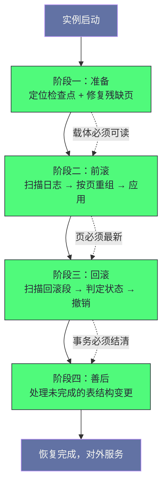

# 15. InnoDB 崩溃恢复：从检查点到重做日志的完整重建之路

**摘要：**

崩溃恢复是这套存储机制"最后的防线"：**无论进程如何消失，重启后都必须做到"已提交的不丢、未提交的抹掉、所有页保持一致"。** 而这套机制之所以能成立，是因为前面十四篇讲的所有设计都"为恢复服务"：**重做日志让"数据页可以晚落盘"，双写让"残缺页可以修复"，撤销日志让"未提交的修改可以撤销"，检查点让"恢复有确定的起点"。** 本文按"恢复要保证什么 → 分几个阶段 → 起点从哪来 → 日志如何重组 → 如何前滚 → 如何回滚 → 原子 DDL 如何善后"展开。先说明三个恢复目标与四根支柱、三条设计原则与四处代价；再拆解四阶段的顺序与"为什么是这个顺序"。然后逐层剖析：**检查点的三种类型与"双副本奇偶交替"的设计、日志扫描与"按页重组"的动机、前滚的"序号比较与幂等性"、回滚的事务状态判定与"外部事务的特殊处理"、原子 DDL 恢复的记录内容与位置。** 之后是"恢复耗时过长"的案例、分级恢复策略与它的风险、监控与时间估算。最后是演进史、四处遗留设计与边界反例。

---

## 第 1 章 恢复要保证什么

### 1.1 三个恢复目标

**恢复必须同时满足三个目标。**

**目标一：持久性。** **已提交事务的修改必须出现。** **也就是说"日志里记了'已提交'的事务，它的效果不能丢"。**

**目标二：原子性。** **未提交事务的修改必须消失。** **也就是说"日志里没有'已提交'标记的事务，它的效果必须被撤销"。**

**目标三：一致性。** **所有数据页的逻辑正确**——**也就是"页的校验通过、页上的版本序号与内容匹配"。**

**三个目标的关系是"前两个管'数据内容的对错'，第三个管'数据载体的完好'"**——**而"载体完好"是前两个的前提**（因为"页坏了就无法在上面应用任何修改"）。**这条"载体先于内容"的依赖，是整条恢复链路里最根本的一条约束。**

**因此恢复的顺序也由此确定**：**先修载体（双写），再前滚（重做），最后回滚（撤销）。**

### 1.2 四根支柱

**恢复依赖四套机制，而它们分别服务于"载体、前滚、回滚、善后"。**

| 机制 | 在恢复中的作用 | 服务的阶段 |
|---|---|---|
| 双写缓冲 | 修复残缺页 | 准备期 |
| 重做日志 | 重新执行已记录但未落盘的修改 | 前滚阶段 |
| 撤销日志 | 撤销未提交事务的修改 | 回滚阶段 |
| DDL 日志 | 完成或撤销未完成的表结构变更 | 善后阶段 |

**这张表里最值得留意的是"四套机制分别在不同的阶段生效"**：**它们不是"同时工作"，而是"按顺序各管一段"。** **而"顺序"由"依赖关系"决定**：**双写先于重做（因为"重做需要页可读"），重做先于回滚（因为"回滚需要页是最新的"）。**

### 1.3 三条设计原则

这个机制遵循三条设计原则。

**原则一：无需人工干预。** **恢复是"自动的"**——**因为"它的输入是日志与数据文件"，而"这些输入在崩溃后仍然存在"。** **因此"启动即恢复"。** 而"自动"这条性质的代价是"它必须在启动时完成，因此'启动会变慢'"。

**原则二：可重复执行。** **恢复的每一步都是"幂等的"**——**也就是说"重复执行不会产生额外效果"。** **这条原则是"恢复过程中再次崩溃"仍能安全继续的前提。** 而"能被打断"这一点让"恢复"从"一次性冒险"变成了"可反复尝试"。

**原则三：以页为中心。** **日志是"按时间顺序"写的，而恢复是"按页应用"的**——**因此"必须先把日志按页重组"。** **这条原则是"日志扫描阶段存在"的理由。** 而"重组"这一步顺带提供了"并行的切分依据"。

**三条原则的关系是"第一条决定'谁能执行恢复'，第二条决定'恢复能否被打断'，第三条决定'恢复的内部结构'"**——**而三者共同构成了"恢复的工程特征"。** 三条里"可重复执行"这一条最容易被忽略，因为它"只在'恢复过程中再次崩溃'时才体现价值"。

### 1.4 四处代价

这个机制有四处代价。

**其一：恢复时间。** **恢复需要"扫描检查点之后的全部日志"**——**因此"日志越多、恢复越慢"。** **而"日志容量"与"空间风险"之间本身存在张力**（第 7 篇已展开）。**这条张力让"日志容量"成为一个必须权衡的参数。**

**其二：正常运行的额外开销。** **因为"要为恢复做准备"，所以"正常运行时要写日志、维护检查点、写双写"**——**而"这些都不是业务需要的动作"。** 因此"恢复能力"的成本是"平时持续付出的"。

**其三：分级恢复的风险。** **当"标准恢复失败"时，只能用"跳过某些步骤"的方式抢救**——**而"跳过的代价是数据可能不一致"。** 因此"分级恢复只能用于抢救数据"。

**其四：恢复期间的不可用。** **恢复完成之前"实例不可服务"**——**因此"恢复时间"直接等于"故障后的不可用时长"。**

**四处代价的共同特征是"它们是'为最坏情况做准备'的对价"**：**为了"崩溃后能恢复"，平时就要"多写、多等、多维护"。** **因此"恢复机制"的成本是"长期分摊"的，而它的收益只在"崩溃那一刻"体现**——**这正是它容易被低估的原因。** 而"容易被低估"也意味着"它容易被'为了性能而牺牲'"。

### 1.5 一个类比：账簿的核对

把这套机制类比成"账簿核对"会更容易理解它的结构。

**"总账（数据文件）"与"流水（日志）"是两本账**——**而"平时不保证它们同步"。**

**"出事之后，先看总账有没有被涂坏"对应"双写修复"**——**因为"涂坏的那一页无法继续核对"。**

**"按流水把总账补记到最新"对应"前滚"。**

**"流水里没有'已结'标记的条目，要划掉"对应"回滚"。**

**"从哪一条流水开始补记"对应"检查点"**——**因为"检查点之前的条目，总账已经记过了"。**

**"补记时要看'这一页是否已经记过'"对应"序号比较与幂等性"**——**因为"已经记过的不要再记一遍"。**

**"有两份'从哪开始'的记录，取更新那份"对应"检查点的双副本"**——**因为"其中一份可能在写入时被写坏"。**

**这个类比的用处在于"它把四根支柱的作用与顺序说清楚了"**：**先看总账坏没坏，再从某一条开始补记，然后把未结的划掉。** **而"顺序不能颠倒"的原因是"后一步依赖前一步的结果"。**

### 1.6 一条关于"恢复能力"的辨析

**最后辨析一处常见的混淆：把"有日志"当作"能恢复"。**

**"能恢复"需要三个条件同时成立**：**其一，"日志本身完好"**（否则"读不出要重放什么"）；**其二，"载体可读"**（否则"没有地方重放"）；**其三，"恢复所需的信息没有丢失"**（例如"检查点完好"）。

**因此"日志存在"只是"能恢复"的一个必要条件，而不是充分条件**——**这也解释了"为什么恢复会失败"**：**因为"某个条件被破坏"了**（例如"日志文件损坏"或"检查点损坏"）。

**而"分级恢复"正是"在某个条件被破坏时，放弃'完整恢复'而追求'部分抢救'"**（第 8.2 节）——**因此"分级的本质是'放宽条件'"**。

**这条辨析的价值在于"它把'恢复失败'变成了'某个条件被破坏'"**——**而"条件"是可以"逐项检查"的。** **因此"恢复失败时"的正确反应是"确认哪个条件被破坏"，而不是"盲目提高恢复级别"。**

---

## 第 2 章 恢复的四阶段

### 2.1 四阶段划分

**恢复分成四个阶段。**

**第一阶段是"准备"**：**定位最近的检查点、修复残缺页**——**也就是"确定起点并修好载体"。**

**第二阶段是"前滚"**：**从检查点开始扫描日志、按页重组、然后应用。**

**第三阶段是"回滚"**：**扫描回滚段、判定事务状态、撤销未提交事务。**

**第四阶段是"善后"**：**处理未完成的表结构变更**（较新版本引入）。

**四阶段的分工是"准备管载体与起点，前滚管'把已提交的补上'，回滚管'把未提交的抹掉'，善后管'结构变更的收尾'"**——**而"四者覆盖了恢复的全部工作"。** 因此"恢复的完整性"可以用"四阶段是否都执行完"来判断。

### 2.2 全景图示

**图中最值得注意的是三条虚线标注的"依赖关系"**：**载体可读 → 页最新 → 事务结清**——**而"这三条依赖恰好解释了'为什么阶段顺序不能调换'"**。

**如果"先回滚再前滚"，那么"回滚会在一个旧版本的页上做撤销"**——**而"撤销的依据是'页上的当前内容'"，因此"在旧页上撤销会得到错误结果"。**

**因此"顺序的必然性来自'每一步的输入依赖上一步的输出'"**——**这与第 8 篇讲的"双写处理必须在日志重放之前"是同一条推理。**

### 2.3 恢复与"正常运行"的镜像关系

**最后说明一处值得留意的镜像关系：恢复的四阶段与"正常运行的四个环节"是对应的。**

**正常运行时是"写日志、刷数据页、清理旧版本、执行表结构变更"**；**而恢复是"读日志并应用、撤销未提交、完成未完成的变更"。**

**也就是说**：**恢复做的是"把正常运行没做完的部分做完"**——**而"没做完的部分"恰好是"那些'可以延后'的动作"**（因为"必须立刻做的动作已经在崩溃前完成了"）。

**这条镜像关系解释了一件事**：**"恢复的工作量"与"崩溃前积压的未完成量"成正比**——**因此"检查点越靠后、刷脏越及时、清理越勤快"，恢复就越快。**

**因此"恢复时间"这个指标其实是"平时运维质量的度量"**——**它不是一个"只在崩溃时才需要关心的参数"。** **这与第 9 篇讲的"后台机制的问题表现为资源占用异常"是同一类判断**：**平时看不出来的问题，会在关键时刻以"恢复慢"的形式暴露。**

---

## 第 3 章 检查点：恢复的起点

### 3.1 检查点的含义

**检查点标记"最早仍可能被恢复需要的日志位置"**——**而它的含义是"小于它的日志所对应的数据页都已经落盘"。**

**因此"恢复从检查点开始"**——**因为"更早的日志已经没有必要再应用"。**

**这个"起点"的设计是"恢复可行"的关键**：**因为"日志是循环使用的"，所以"更早的日志可能已经被覆盖"**——**而"检查点保证了'被覆盖的日志对应的修改已经落盘'"。**

**这条保证的关系可以概括为**：**"日志可以覆盖"的前提是"它对应的数据已经落盘"**——**而"检查点就是'这个前提成立的位置'"。**

### 3.2 三种检查点

**检查点有三种触发方式，而它们的"力度"不同。**

**"模糊检查点"按周期触发**：**它只"记录当前的位置"，而"不强制刷脏页"。** **因此它"推进得快"，但"它标记的位置未必真的满足'之前都已落盘'"**——**因此"恢复时可能需要往前多扫一些"。**

**"同步检查点"在"日志空间不足时"触发**：**它"强制刷脏页"，从而"让检查点真正推进"。** **因此它"推进得实"，但"代价是刷脏的开销"。**

**"锐化检查点"在"正常关闭时"触发**：**它"把所有脏页刷盘、把序号对齐"**——**因此"正常关闭后的启动几乎不需要恢复"。**

**三种检查点的关系是"周期性的负责'记录进度'，空间驱动的负责'真正推进'，关闭时的负责'彻底收尾'"**——**而"三种配合起来，才能让'恢复起点'尽量靠后"。**

**这也解释了"为什么正常关闭后再启动很快"**：**因为"锐化检查点把起点推到了最靠后的位置"。**

### 3.3 双副本与奇偶交替

**检查点信息存两份，而写入方式是"按编号奇偶交替"。**

**具体规则是**：**编号为奇数时写第一份，为偶数时写第二份。**

**这个设计的意图是"防止写入过程中崩溃导致检查点丢失"**：**因为"两份交替写"，所以"任何一次写入被中断，另一份仍然是上一次的完整内容"。**

**因此"恢复时读两份、取校验通过且编号较大的那个"**——**而"编号较大"意味着"它更新"。**

**这条设计与第 8 篇讲的"双写区的元数据存两份"是同一手法**：**用"交替写入的冗余"对抗"元数据自身被写坏的风险"。** **而"交替"（而不是"同时写两份"）的好处是"写入时不会同时破坏两份"。**

### 3.4 检查点的取舍

**检查点的推进速度存在一处取舍。**

**推进得越靠后，"恢复越快"**（因为"需要扫描的日志更少"）——**但"推进需要刷脏"，而"刷脏会占用 IO"。**

**因此"检查点推进"与"业务 IO"争抢同一份资源**——**而"推进太激进"会影响业务，"推进太保守"会拉长恢复时间。**

**这条取舍的形态与第 7 篇讲的"日志空间由刷脏进度决定"是同一处**：**因为"检查点推进"就是"刷脏的结果"，所以"日志空间、检查点、恢复时间"三者是同一件事的三个侧面。**

**因此"调优恢复时间"的实际动作是"调优刷脏"**——**而不是"调优恢复本身"。** **这一点值得强调**：**恢复相关的很多参数实际上在"影响正常运行时的刷脏行为"。**

### 3.5 检查点的三个角色

**把检查点在本专栏里出现的位置汇总一下，可以看出它承担了三个角色。**

**第一个角色是"日志空间的回收依据"**（第 7 篇已展开）——**它决定"哪些日志可以被覆盖"。**

**第二个角色是"恢复的起点"**（本篇第 3.1 节）——**它决定"恢复从哪里开始"。**

**第三个角色是"崩溃恢复时间的预测器"**（第 8.3 节）——**因为"它与当前写入位置的差距"决定"恢复的工作量"。**

**三个角色的共同特征是"它们都源于同一个事实——检查点标记了'数据与日志的分界'"**：**它之下"数据已落盘"，它之上"数据可能落后"。**

**因此"检查点"这个概念的完整含义是"数据与日志的分界位置"**——**而"空间回收、恢复起点、恢复时间"都是这个分界位置的推论。**

**这条汇总的价值在于"它把三个看似无关的问题归到了同一个概念上"**：**"日志空间不足""恢复慢""崩溃后不可用时间长"——三者的根因都可能是"检查点推进不及时"。** **因此"看到其中任何一个问题，都应当检查检查点"**——**这是一条高收益的排查线索。**

---

## 第 4 章 日志扫描与重建索引

### 4.1 为什么要"按页重组"

**日志是"按时间顺序"写的，而恢复是"按页应用"的**——**因此两者"顺序不一致"。**

**如果不重组**，那么"恢复必须'按时间顺序遍历日志'，而'每一条日志都可能访问一个不同的页'"——**因此"页的访问是随机且重复的"**（同一页可能被多次访问）。

**而"按页重组"之后**，**"同一页的所有日志被排在一起"**——**因此"访问一个页时可以一次把它的所有修改都应用完"。**

**因此"重组的收益是'减少页的随机访问次数'"**——**而"代价是'需要一张哈希表来组织'"。** **这条取舍与第 5 篇讲的"变更缓冲按页组织"是同一思路**：**把"按时间到达的操作"重新组织成"按目标分组的操作"。**

### 4.2 重组的数据结构

**重组由两级结构承担。**

**第一级是"按页标识哈希的表"**：**它的键是"表空间加页号"，而值是"该页的日志链表"。**

**第二级是"链表里的日志条目"**：**每条记录"日志的原始数据"与"它的起止序号"。**

**两级结构的作用是"让'按页取日志'变成一次哈希查找加一次链表遍历"**——**而"链表里的日志按序号排列"，因此"应用时只需要顺序遍历"。**

**这与第 5 篇讲的"变更缓冲的键设计让范围扫描可行"是同一手法**：**用"键的构成"让"某类查询"变成"连续读取"。**

### 4.3 扫描策略

**扫描从检查点开始，而它有两处细节。**

**细节一：起点是"检查点序号对应的物理位置"**——**因此"需要把逻辑序号换算成'哪个文件的哪个偏移'"**（第 7 篇已展开这个换算）。

**细节二：扫描"到文件组末尾"后"回绕到起点之前"**——**因为"日志是循环使用的"**——**而"回绕的终点就是检查点"。**

**因此"扫描的范围"是"从检查点到当前写入位置"**——**而"这个范围的大小"直接决定了"扫描时间"。**

**这条关系给出了"恢复时间"的第一个决定因素**：**"检查点与当前写入位置的差距"**——**而它可以用"日志使用比例"这个指标观察**（第 8.3 节）。

### 4.4 重组的代价

**重组也有代价，而它在"内存"上。**

**因为"重组需要在内存里保存'检查点之后的全部日志记录'"**——**因此"如果日志量很大，这个结构会占用可观的内存"。**

**因此"日志容量"不只影响"磁盘空间"，还影响"恢复时的内存占用"**——**而这一点容易被忽略。**

**这条代价的形态与第 12 篇讲的"撤销日志占用空间"是同一类**：**"为了'可恢复'而保留的信息"会占用资源**——**而"保留多少"需要在"恢复能力"与"资源占用"之间取平衡。**

**因此"日志容量"这个参数实际上同时影响四处**：**磁盘空间、恢复时间、恢复内存、以及"空间不足的风险"。** **这解释了为什么它"不是一个可以随便调大的参数"。**

### 4.5 重组与"恢复的内存峰值"

**"重组"这一步带来的内存峰值值得单独说明，因为它是"恢复失败的隐性原因之一"。**

**因为"重组需要在内存里保存检查点之后的全部日志记录"**——**因此"如果日志量很大、而可用内存有限"，那么"重组阶段可能因内存不足而失败"。**

**这类失败的表现形态很隐蔽**：**它不是"报出'内存不足'"，而是"恢复过程异常缓慢或中断"**——**因为"内存压力会导致换页或分配失败"。**

**因此"日志容量"的取值应当同时考虑"恢复时的内存余量"**——**而这一点在"只按'磁盘空间'估算"时容易被忽略。**

**这条细节的通用性在于"它说明'参数的影响面往往比它的名字暗示的更广'"**：**"日志容量"这个名字暗示"磁盘"，而它实际影响"磁盘、时间、内存"三处。** **这与第 7 篇讲的"组提交参数的名字暗示一类日志、而实际影响两类"是同一类现象。**

---

## 第 5 章 前滚：日志的应用

### 5.1 序号比较与幂等性

**应用一条日志之前，先做一次比较：页上记录的"最后修改序号"是否已经不小于这条日志的序号。**

**如果"不小于"，则跳过**——**因为"这一步修改已经在页上了"。**

**这个比较的意义是"让恢复可重复执行"**：**因为"已经应用过的修改会被跳过"，所以"重复应用不会产生额外效果"。**

**而"可重复"这件事很重要**——**因为"恢复过程中可能再次崩溃"**（例如"恢复到一半机器又断电"）。**而"可重复"保证了"第二次恢复能从上次的位置继续，而不会'重复应用导致错误'"。**

**因此"序号比较"这条机制的价值不只是"省时间"，更是"保证正确性"**——**它让"恢复"这个动作变成了"幂等的"**（第 1.3 节的原则二）。

### 5.2 应用流程

**应用一条日志分五步**：**解析日志得到"表空间与页号"**、**把页读进内存**（可能已在缓冲池）、**读出页上的序号**、**比较序号**（不足则跳过）、**应用修改并更新页上的序号。**

**五步里，"把页读进内存"这一步是"随机 IO"的来源**——**而"按页重组"的收益正体现在这里**（因为"同一页的日志被合并处理"，因此"一次读入可以应用多条"）。

**而"更新页上的序号"这一步很关键**：**它让"页记录了'自己已经包含到哪个位置'"**——**而这正是"序号比较"能工作的前提。**

### 5.3 幂等性的另一处体现

**除了"序号比较"，还有一处设计服务于幂等性。**

**"小事务"（物理操作的原子单位）的存在保证了"日志的重放不会遇到半条操作"**（第 7 篇已展开）——**因此"恢复时不会'应用了一半就失败'"。**

**而"恢复时不会遇到半条操作"这一点，与"序号比较"配合起来，构成了完整的幂等性保证**：**前者保证"每一步都是完整的"，后者保证"重复的步骤会被跳过"。**

**两条设计的共同特征是"它们都消除了'恢复过程中的不确定性'"**——**而"确定性"是"恢复能被中断并继续"的前提。**

**这与第 3 篇讲的"原子 DDL 记录决定而非进度"是同一类**：**"确定的重放"优于"需要推断的恢复"。**

### 5.4 并行应用

**较新版本支持"并行应用"，而它的并行方式是"按页分发"。**

**因为"不同页的日志之间没有依赖"**（"修改不同页"这件事本身是独立的）——**因此"不同页可以并行应用"。**

**因此"并行的粒度是'页'"**——**而"分发的依据是'哈希桶'"**（也就是"重组后的哈希表的桶"）。

**这条并行的可行性来自"重组"这个前置步骤**：**因为"日志已经按页分组了"，所以"按页分发"是自然的。** **因此"重组"不只"减少随机 IO"，还"让并行成为可能"。**

**这处设计说明一个通用现象**：**"一个前置步骤的收益可能超出它的初衷"**——**"重组"的初衷是"减少页访问"，而它顺带"提供了并行的切分依据"。** **这与第 13 篇讲的"行格式是第三代并行的前提"是同一类**：**"格式或结构的选择"会"决定下游能做到什么"。**

### 5.5 前滚与"并行"的边界

**"并行应用"有一处边界值得说明：并行的粒度是"页"，因此"同一页上的日志必须串行"。**

**这条边界的原因很直接**：**因为"同一页的多条日志必须按顺序应用"**——**而"顺序"是"日志的语义要求"**（例如"先插入再更新"与"先更新再插入"结果不同）。

**因此"并行的上限"受"页的分散程度"限制**：**如果"日志集中在少数几个页上"，那么"并行的收益有限"。**

**这条边界与第 13 篇讲的"并行复制的依据越细、可并行机会越多"是同一形态**：**"并行的粒度"决定了"可并行的范围"**——**而"更细的粒度"往往"需要更强的判定依据"。**

**一处实践含义是**：**"大批量修改同一批页"的操作（例如"全表更新"），其"恢复时的并行度会较低"**——**因为"它的日志集中在同一批页上"。** **因此这类操作"不仅执行慢，恢复也慢"。**

---

## 第 6 章 回滚：未提交事务的处置

### 6.1 事务状态的判定

**前滚完成后，"所有已提交且日志落盘的事务都已恢复"**——**而"剩下需要处理的是'未提交的事务'"。**

**判定的方式是"扫描所有回滚段"**：**对每个回滚段，遍历它的"撤销槽位"，读取"撤销页头"里记录的事务状态。**

**而"需要处理的状态有两种"**：**"活跃"（也就是"已开始但未提交"）与"已准备"（也就是"两阶段提交里'准备完成但未提交'"）。**

**判定完成后，"为每个这样的事务构造一个事务对象并加入链表"**——**而"后续按状态分别处置"。**

### 6.2 三种状态的处置

**处置规则很清晰，而它体现了"事务状态"与"数据可见性"的对应。**

**"已在内存中提交"的事务**：**它"已经提交，只是撤销日志还没清理"**——**因此"只需要清理撤销日志"。**

**"活跃"的事务**：**它"未提交"**——**因此"必须回滚"。**

**"已准备"的事务**：**它"处于两阶段提交的中间状态"**——**因此"需要判断'外部日志里有没有它的记录'"**：**有则提交，无则回滚。**

**三条规则的共同特征是"它们把'崩溃前的最后状态'映射到了'恢复时的动作'"**——**而"映射的依据是'外部日志是否记录了它'"。**

**这与第 12 篇讲的"崩溃恢复的判定逻辑"是同一件事**——**而这里补充的是"判定的输入来自撤销页头里的状态"。**

### 6.3 外部事务的特殊处理

**"已准备"这个状态需要特殊处理，原因值得说明。**

**"已准备"意味着"事务已经完成了引擎侧的准备，但'是否提交'取决于外部日志的写入结果"**——**因此"恢复时不能单方面决定"。**

**而"判定的依据是'外部日志里有没有这个事务的标识'"**：**有则"必然提交"（因为"外部日志的写入是提交点"），无则"必然回滚"。**

**因此"恢复时的判定是'确定性的'"**——**它不需要"猜"，只需要"查"。** **这正是"把提交点放在外部日志"这个设计带来的好处**（第 12 篇已展开）。

**这条确定性很重要**：**因为"恢复的判断必须可靠"，而"可靠的判断只能来自'明确的记录'"**——**不能来自"推断"。**

### 6.4 回滚与清理的区别

**最后区分"回滚"与"清理"这两个动作，因为它们容易被混为一谈。**

**"回滚"是"撤销一个未提交事务的修改"**——**它"必须做"，因为"不撤销就违反了原子性"。**

**"清理"是"回收已提交事务的撤销日志空间"**——**它"可以延后"，因为它"只是空间管理"。**

**两者的关系是"回滚是恢复的必做动作，而清理是后台的日常动作"**——**因此"恢复阶段做回滚，而清理由后台线程在恢复完成后继续"**（第 9 篇已展开）。

**这条区分解释了一处现象**：**"恢复完成后撤销空间可能仍然很大"**——**因为"清理还没跟上"。** **而"清理跟不上"的根因与第 9 篇讲的一致**（长事务或清理能力不足）。

---

## 第 7 章 原子 DDL 的恢复

### 7.1 为什么需要它

**表结构变更涉及"元数据修改"与"物理文件操作"两类动作**——**而它们"无法被同一个事务覆盖"**（因为"文件操作不在事务的范围内"）。

**因此"如果'元数据已改、文件操作未做'时崩溃"，就会留下"不一致的中间状态"**（第 3 篇已展开这个问题的形态）。

**原子 DDL 的解法是"把物理操作'记录成意图'，然后'提交后再异步执行'"**——**而"记录意图"这件事"与元数据修改在同一个事务里"，**因此**"两者要么都生效、要么都不生效"。**

### 7.2 记录什么

**记录的是一条"待执行的物理操作"，而它的类型有三类。**

**"删除"**：**待删除的数据文件路径**——**它对应"删除表或表空间"。**

**"重命名"**：**新路径与旧路径**——**它对应"重命名表空间文件"。**

**"释放"**：**只是一条待清理的记录**——**它对应"队列项的清理"。**

**三类记录的共同特征是"它们描述的是'一个文件操作'"**——**而"记录'操作'而不是'结果'"，正是"可重放"的关键**（第 3 篇已展开这个判断）。

### 7.3 恢复时做什么

**恢复时"扫描这张记录表，然后执行其中未完成的记录"。**

**而"执行"的规则与"记录的类型"对应**：**删除则删掉文件**、**重命名则改回旧名**、**释放则直接删掉这条记录**。

**"重命名则改回旧名"这一条值得留意**：**因为"重命名是'把旧名改成新名'"，而"如果中途崩溃，那么'文件可能已经改名但元数据未生效'"**——**因此"恢复时把它改回去"，从而"回到一致的状态"。**

**而"执行完一条就删掉这条记录"这个做法与第 5 篇讲的"变更缓冲边合并边删除"是同一手法**：**"边做边删"保证了"重复执行不会产生额外效果"**（也就是"幂等"）。

### 7.4 它的位置

**"原子 DDL 的恢复"在整体恢复流程中的位置值得说明。**

**它的位置是"在回滚之后"**——**因为"它处理的不是'数据'，而是'结构'"**，**而"结构操作需要在'数据已经一致'的基础上进行"。**

**因此四阶段的顺序是"准备、前滚、回滚、善后"**——**而"善后"这一步"较新版本才加入"**（因为"统一字典与原子 DDL 是较新版本引入的"）。

**这条位置关系说明一个通用规律**：**"当'新的机制'被引入时，它往往'在恢复流程的末尾追加一个阶段'"**——**因为"已有阶段处理的是'既有的对象'（数据），而新机制引入了'新的对象'（结构操作记录）"。**

**这与第 3 篇讲的"字典重构带来新的恢复需求"是一致的**：**"机制的演进"会"在恢复流程上留下痕迹"。**

### 7.5 一处关于"顺序"的总结

**把恢复流程里出现的"顺序"汇总一下，可以看出"顺序"在这套机制里的重要性。**

**第一处是"四阶段的顺序"**：**准备 → 前滚 → 回滚 → 善后**（第 2.2 节）。

**第二处是"双写处理在日志重放之前"**（第 8 篇已展开）。

**第三处是"提交路径上'准备记录先于外部日志'"**（第 12 篇已展开）。

**第四处是"外部事务的判定依赖外部日志的存在"**（第 6.3 节）。

**四处顺序的共同特征是"它们都源于'某一步的输入来自上一步的输出'"**——**因此"顺序"不是"风格问题"，而是"正确性问题"。**

**这条汇总的实践价值在于"它给出了一条改动前的检查清单"**：**涉及"多步持久化"的改动，应当"逐个检查每一步的输入依赖哪一步的输出"**——**而"依赖关系被打乱"是这类改动最隐蔽的风险。** **这与第 12 篇讲的"逐个写入点推演崩溃场景"是同一纪律的两个视角。**

---

## 第 8 章 生产落地

### 8.1 恢复耗时过长的案例

**这是一个"恢复时间与数据量不成比例"的案例。**

**现象是**：**数据量与内存都不算极端，但断电后恢复耗时远超预期。**

**根因链条是**：**检查点推进不及时 → 检查点与当前写入位置的差距很大 → 恢复需要扫描大量日志 → 而"应用是单线程的"（旧版本）→ 因此恢复时间被拉长。**

**处置方向有三条**：**调大日志文件与文件数**（从而"减少日志切换频率"，但注意"日志越大恢复越慢"这层张力）、**启用并行恢复**（让应用阶段利用多核）、**提高检查点的推进速率**（通过调整刷脏参数）。

**三条处置的共同思路是"让检查点尽量靠后"**——**而不是"让恢复本身更快"。** **因为"恢复的工作量"由"检查点与当前位置的差距"决定。**

**这个案例的价值在于"它揭示了'恢复时间'是一个'派生指标'"**：**它的根因在"正常运行时的刷脏与检查点行为"上**——**因此"只盯着恢复参数"找不到根本解法。**

### 8.2 分级恢复策略

**当"标准恢复失败"时，有一套"分级跳过"的策略，而它的风险需要说清。**

| 级别 | 跳过的内容 | 适用场景 |
|---|---|---|
| 0 | 无 | 正常恢复 |
| 1 | 检查点失败时跳过 | 系统表空间损坏 |
| 2 | 不启动后台线程 | 缓冲池损坏 |
| 3 | 不回滚未提交事务 | 回滚段损坏 |
| 4 | 不合并变更缓冲 | 变更缓冲损坏 |
| 5 | 不读取撤销日志（所有事务视为已提交） | 回滚页损坏 |
| 6 | 不应用重做日志 | 日志文件损坏 |

**这张表里最值得留意的是"级别越高，一致性越差"**：**级别三以上会"留下未提交的数据"，级别五会"把未提交的当作已提交"，级别六则"完全不做前滚"。**

**因此使用原则是"从低级别开始递增，满足目标即停止"**——**而"级别较高时，只应当用于'导出数据'"**，**导出后"重建实例"。**

**这条策略的形态与第 8 篇讲的"仅检测模式"是同一类**：**"它提供了一个'在信息不足时逐步放宽'的阶梯"**——**而"放宽的每一步都有明确的代价"。**

### 8.3 监控与估算

**恢复侧可观测的信息有三类。**

**第一类是"恢复进度"**：**错误日志里会输出"已扫描到的位置"**——**因此"可以按'已扫描与总范围的比例'估算进度"。**

**第二类是"检查点年龄"**：**它是"当前写入位置与检查点位置之差相对于日志总容量的比例"**——**而"这个比例"直接决定"恢复需要扫描多少"。** **经验上"超过四分之三"意味着"日志空间紧张"，"超过九成"意味着"写入可能受阻"。**

**第三类是"回滚相关的统计"**：**它回答"恢复阶段处理了多少回滚"。**

**三类信息里"检查点年龄"最有价值**，**因为它"同时预测了'空间风险'与'恢复时间'"**——**因此它值得被纳入日常监控**（而不只是在恢复时关注）。

**这条建议与第 6 篇讲的"把命中率加入巡检"是同一类**：**对"决定关键时刻表现"的指标，应当"平时就盯着"。**

### 8.4 排查决策树

**恢复很慢时**，先看"检查点年龄"：**它很大则"根因在刷脏与检查点推进"**（第 8.1 节）；**它不大则看"是否启用了并行恢复"。**

**恢复失败时**，先看"错误指向哪类损坏"：**系统表空间、回滚段、双写区、日志文件的处置级别不同**（第 8.2 节）。

**恢复后数据不一致时**，先看"使用了哪一级强制恢复"：**级别三以上会留下未提交数据，级别五会误提交**。

**恢复时磁盘空间不足时**，确认"临时目录与数据目录是否同分区"：**因为"恢复可能需要额外空间"**（例如"重建索引或临时文件"）。

**这条决策树的第一层依据是"检查点年龄"**——**而它之所以能作为第一层，是因为"它直接决定恢复的工作量"**（第 4.3 节）。**因此"知道这个指标的物理含义"，才知道"它是恢复时间的预测器"。**

### 8.5 一次"恢复后仍不一致"的排查推演

把"恢复之后数据仍不一致"这类问题串成一次推演。

假设现象是"恢复成功、实例可服务，但业务发现'某些未提交的数据出现了'或'某些已提交的数据缺失了'"。

**第一步，确认"使用了哪一级强制恢复"。** **因为"级别三以上会留下未提交数据，级别五会把未提交的当作已提交"**——**因此"不一致的最常见根因是强制恢复的级别过高"。**

**第二步，如果"没有使用强制恢复"，检查"日志与双写的完整性"。** **因为"已提交数据缺失"意味着"前滚没有完成"，而它的前提是"日志可读、载体可读"。**

**第三步，如果"两者都正常"，检查"是否存在'外部事务未结清'"。** **因为"已准备状态的事务需要查外部日志判定"**——**因此"如果外部日志本身不完整，判定会出错"。**

**第四步，如果"数据不一致来自'未提交数据出现'"，检查"回滚是否完整"。** **因为"回滚未完成会留下未提交的修改"**——**而"回滚未完成"的常见原因是"回滚段损坏"。**

**第五步，如果"以上都正常"，检查"是否在恢复期间'人为介入过'"**（例如"手工修改文件或跳过某些步骤"）。

**五步的价值在于"它把'恢复后不一致'按'恢复的四个阶段'逐段排查"**——**而"每一段都对应一类可能的不完整"。** **这个推演的结构与第 2 章的四阶段划分是对应的**：**因为"恢复按阶段进行"，所以"不一致也可以按阶段归因"。**

---

## 第 9 章 演进史与遗留设计

### 9.1 关键节点

| 版本 | 恢复相关变化 | 动因 |
|---|---|---|
| 早期 | 只有重做前滚 | 不支持完整的事务语义 |
| 4.1 | 引入回滚段，支持崩溃回滚 | 实现原子性 |
| 5.0 | 引入双写缓冲 | 解决部分写导致的页损坏 |
| 5.5 | 检查点写两份副本 | 防止检查点本身损坏 |
| 5.7 | 加速恢复，跳过已刷盘页 | 减少恢复的无用 IO |
| 8.0 | 并行恢复 | 利用多核 |
| 8.0.14+ | 支持原子 DDL 的恢复 | 统一字典引入的新需求 |
| 8.0.28+ | 实验性的持久内存支持 | 适配新介质 |

**这条演进线的主线是"逐步把'恢复的各个环节'补齐并加速"**：**从"只有前滚"到"有回滚"，从"页可能损坏"到"双写修复"，从"单线程"到"并行"。**

**而"原子 DDL 的恢复"这一步属于"新机制带来的新需求"**——**它不"加速恢复"，而是"让恢复能处理新类型的对象"。**

### 9.2 四处遗留设计

**第一处：恢复必须从检查点开始。** **即使"日志在物理上是连续的"，也必须"先找到一个完整的检查点"。** **因此"检查点本身的损坏会导致恢复无法开始"**——**而这就是"双副本"存在的原因。**

**第二处：重组需要在内存里保存全部待应用日志。** **因此"日志量大时恢复的内存占用可观"**（第 4.4 节）。

**第三处：强制恢复的分级是"粗粒度的"。** **它"只能按类别跳过"，而不能"按对象跳过"**——**因此"为了跳过一个小损坏，可能要放弃一整类动作"。**

**第四处：恢复期间实例不可服务。** **因此"恢复时间等于不可用时长"**——**而"缩短它"的手段只有"减少工作量"或"提高并行度"。**

**四处遗留设计的共同特征是"它们是'恢复必须确定'这个要求的对价"**：**因为"恢复不能猜"，所以"它必须有一个确定的起点、必须先把日志读完、必须按类别处理"。** **而"确定性"正是恢复机制最核心的价值。**

### 9.3 演进方向

**方向一：持久内存对恢复架构的重构。** **如果"数据可以直接在持久内存上原地更新、且写入是原子的"，那么"部分写与残缺页都不存在"**——**因此"双写与'前滚'的必要性都会下降"。** 这实际上是"把恢复的成本转移到'硬件保证'上"。

**方向二：更细粒度的恢复控制。** **它试图"只跳过损坏的对象，而不是跳过一整类动作"**——**因此"能在'尽量保持一致性'的前提下抢救更多数据"。**

**方向三：恢复进度的更好可观测性。** **包括"更细的进度上报"与"可估算的剩余时间"**——**因为"恢复期间的'不知道要多久'本身是一种运维痛苦"。**

**三个方向的共同特征是"它们都在处理'恢复时间'或'恢复的确定性'"**——**而"这两者恰好是恢复机制的两处痛点"。**

### 9.4 一条关于"为最坏情况设计"的经验

最后把"为最坏情况设计"这件事的经验收敛一下，因为它是本篇的主题。

**这套机制的全部复杂度，都来自"必须为最坏情况做准备"**：**平时要多写日志（为了崩溃后能重放）、要多写双写（为了页损坏能修复）、要维护检查点（为了恢复有起点）。**

**而"为最坏情况设计"的特点是"成本长期分摊、收益只在关键时刻体现"**——**因此它"容易被低估、也容易被'优化掉'"**（例如"关掉双写以提升性能"，第 8 篇已展开）。

**因此"该不该保留某项保护"的判断，不能只看"平时的性能数字"**——**而要看"最坏情况下的后果是否可控"。**

**这条经验给出一条实践纪律**：**对"只在关键时刻生效"的机制，应当"定期演练它"**——**例如"定期做恢复演练、定期验证备份可恢复"。** **因为"从未被验证的保护"与"没有保护"在关键时刻是等价的。**

**这条纪律与第 5 篇讲的"备份必须验证"、第 8 篇讲的"先观察再关闭"是同一类**：**"保护机制的有效性"需要"主动验证"，而不能"假定它有效"。**

---

## 第 10 章 边界与反例

### 10.1 反例一：把"崩溃恢复"当作"备份"

**恢复只能"恢复到崩溃前的最新状态"**，**而"它不能恢复'被误删除的数据'"**——**因为"删除也是'已提交的事务'"。** **因此"恢复"与"备份"解决的是不同问题。**

### 10.2 反例二：把"双写关闭"当作"不影响恢复"

关闭双写后"残缺页无法被修复"（第 1.2 节）。**而"残缺页"恰好是"前滚无法处理"的一类损坏。**

### 10.3 反例三：把"恢复慢"归因于"恢复参数"

根因通常在"刷脏与检查点推进"上（第 8.1 节）。

### 10.4 反例四：把"强制恢复"当作"常规手段"

它的级别越高，一致性越差（第 8.2 节）。**因此它只应当用于"抢救数据"，而不是"日常恢复"。**

### 10.5 反例五：把"检查点"当作"只影响日志空间"

它还决定"恢复起点"与"恢复时间"（第 3.4 节）。**因此"日志空间、检查点、恢复时间"是同一件事的三个侧面。**

### 10.6 反例六：以为"日志越大越好"

它同时增加"磁盘占用""恢复时间""恢复内存"（第 4.4 节）。

### 10.7 反例七：把"恢复完成"当作"清理也完成了"

清理是"后台的日常动作"，它"在恢复之后继续"（第 6.4 节）。

---

## 第 11 章 落点

回到开头：**恢复必须保证什么？**

**三个目标**：**已提交的不丢、未提交的抹掉、所有页保持一致。** 而"实现这三个目标"的机制是四根支柱：**双写修载体、重做补已提交、撤销抹未提交、DDL 日志收尾结构变更。**

**这四根支柱的顺序由依赖关系决定**：**载体可读 → 页最新 → 事务结清 → 结构收尾。** **而"顺序不能调换"的理由很直接**：**每一步的输入依赖上一步的输出。**

**而这套机制最值得记住的一条性质是"恢复是幂等的"**：**序号比较让"已应用的不再重复"，小事务让"每一步都是完整的"。** **因此"恢复过程中再次崩溃"是安全的**——**而这一点让"恢复"从"一次性的冒险"变成了"可反复尝试的过程"。**

**最后一条判断值得留下：恢复时间不是一个"恢复参数"，而是"平时运维质量的度量"。** **它由"检查点与当前写入位置的差距"决定**——**而这个差距由"刷脏是否及时"决定。** **因此"平时把刷脏与检查点维护好"，比"崩溃后调恢复参数"有用得多。** **这与本专栏反复出现的"问题的根因往往不在'出问题的那一环'"是同一规律。**

**而"检查点"这个概念的三个角色（空间回收依据、恢复起点、恢复时间预测器）也值得记住**：**它们让"日志空间不足""恢复慢""故障不可用时间长"这三个看似无关的问题，归到了同一个概念上。** **因此"看到其中任何一个，都应当检查检查点"**——**这是一条成本极低而收益很高的排查线索。**

**最后，本篇与前面十四篇的关系值得点明：恢复机制不是"第十五个独立机制"，而是"前面十四篇设计的共同归宿"。** **重做日志、双写、撤销日志、检查点、清理线程——它们各自的"设计理由"最终都指向同一件事：让"崩溃后的重建"成为可能。** **因此"读懂恢复"，也就"读懂了这套存储机制的设计意图"。**

---

## 专栏导航

- 上一篇：[[14. MySQL 组复制：从 Paxos 变种到分布式强一致集群]]。
- 下一篇：[[16. MySQL 8.0 原子 DDL：二十年技术债的清偿还]]。
- 返回专栏首页：[[00 专栏导览]]。

---

## 参考资料

1. MySQL 8.0.33 源码：`storage/innobase/log/log0recv.cc`、`trx/trx0recv.cc`、`trx/trx0roll.cc`、`ddl/ddl0recover.cc`、`storage/innobase/include/log0recv.h`。
2. MySQL. MySQL Internals Manual: InnoDB Recovery. https://dev.mysql.com/doc/internals/en/
3. MySQL. 官方文档：InnoDB 崩溃恢复与 innodb_force_recovery 的分级说明. https://dev.mysql.com/doc/refman/8.0/en/forcing-innodb-recovery.html
4. MySQL. 官方文档：InnoDB 恢复过程与日志的解读. https://dev.mysql.com/doc/refman/8.0/en/innodb-recovery.html
5. MySQL. 官方文档：innodb_parallel_read_threads 与并行恢复. https://dev.mysql.com/doc/refman/8.0/en/innodb-parameters.html
6. MySQL. 官方文档：innodb_fast_shutdown 与关闭时的刷脏行为. https://dev.mysql.com/doc/refman/8.0/en/innodb-parameters.html
7. MySQL. 官方文档：原子 DDL 与 DDL 日志的恢复语义. https://dev.mysql.com/doc/refman/8.0/en/atomic-ddl.html
8. MySQL. 官方文档：SHOW ENGINE INNODB STATUS 中 LOG 段与检查点的解读. https://dev.mysql.com/doc/refman/8.0/en/innodb-standard-monitor.html
9. MySQL. 官方文档：错误日志中的恢复进度输出. https://dev.mysql.com/doc/refman/8.0/en/error-log.html
10. MySQL. 官方文档：InnoDB 日志与检查点相关参数的完整列表. https://dev.mysql.com/doc/refman/8.0/en/innodb-parameters.html

---

> [!note] 思考题
> 1. 恢复的三个目标与四根支柱如何对应？"先修载体"这个顺序的必然性来自哪里？
> 2. 检查点的双副本为什么要"奇偶交替写入"，而不是"同时写两份"？
> 3. "序号比较"这条机制除了省时间，还保证了什么？
> 4. 为什么"已准备"状态的事务在恢复时需要查外部日志，而不能单方面决定？
> 5. "恢复时间是平时运维质量的度量"——请说明这处判断的机制依据。
