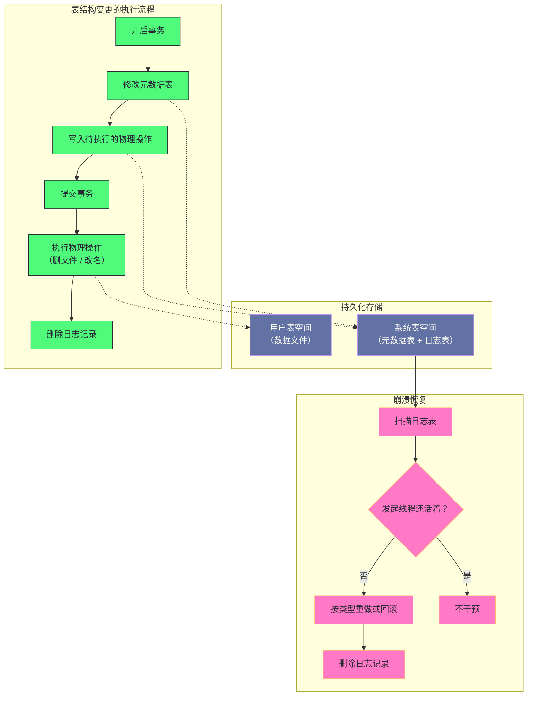

# 16. MySQL 8.0 原子 DDL：二十年技术债的清偿还

**摘要：**

表结构变更（建表、改表、删表）在很长一段时间里**不是原子的**——**因为它涉及"两套元数据"与"物理文件"三类动作，而它们分属不同的子系统、有不同的可回滚性。** 后果是"中断后留下中间状态"：**表"打不开也删不掉"、文件成了孤儿、`SHOW TABLES` 看得见但用不了。** 而这些中间状态**无法自动修复**——**因为"用户当时的意图"这个信息已经丢失。** 较新版本用两条支柱解决了它：**把元数据统一到一处（从而获得事务与崩溃恢复能力）**，**以及为"不可回滚的物理文件操作"记录"意图"（从而在崩溃后能重做或回滚）**。本文按"非原子的困境 → 两条支柱 → 统一字典的代价 → 日志表的设计 → 两阶段执行模型 → 崩溃恢复如何处理 → 生产上会踩什么坑"展开。先说明两套元数据带来的两种中间状态与"为什么无法自动修复"；再讲统一字典的收益与它的新代价（事务大小与表定义复杂度相关）。然后重点剖析日志表的字段与七个操作类型、两阶段执行模型与"为什么必须分两阶段"、以及三种典型操作在崩溃点上的行为差异。之后是崩溃恢复的处理逻辑与"线程是否存活"这个关键判断、DDL 中断后空间未释放的案例、参数与监控、从结构副本恢复表。最后是演进史、四处遗留设计、与云原生方案的对比、以及边界反例。

---

## 第 1 章 一个"非原子"的困境

### 1.1 两套元数据的问题

**早期的表结构信息存在两处**：**一处是服务层的"结构文件"，一处是存储引擎自己的系统表**（第 3 篇已展开这个双元架构）。

**这个双元架构对"查询"没有影响**（因为"两处内容一致"）——**但它对"修改"有致命影响**：**因为"一次表结构变更要同时改两处"，而"两处的修改机制不同"。**

**具体来说**：**结构文件的修改是"文件系统操作"**（"写一个文件"或"删一个文件"），**而引擎系统表的修改是"数据库事务"。** **两者的可回滚性完全不同**——**前者"写了就写了，无法撤销"，后者"可以回滚"。**

**因此"一次表结构变更"实际上是"一组'可回滚的'与'不可回滚的'动作的混合"**——**而"混合"意味着"无法用单一事务覆盖"。**

### 1.2 两种中间状态

**"无法用单一事务覆盖"的直接后果是"中断会留下中间状态"，而中间状态有两种形态。**

**第一种是"删表时中断"**：**结构文件已删、而引擎记录还在**——**于是"表打不开（因为结构文件没了）"，"也删不掉（因为引擎认为它存在）"。** **同时"它的数据文件成了孤儿"。**

**第二种是"建表时中断"**：**结构文件已写、而引擎记录不全**——**于是"表在列表里可见，但实际打不开"。**

**两种形态的共同特征是"两处元数据不一致"**——**而"不一致的具体形态"取决于"中断发生在哪一步"。**

**这也解释了"为什么这类问题难以处理"**：**因为"同一个操作的不同中断点会产生不同的不一致形态"，而"每种形态的处置方式不同"。**

### 1.3 为什么无法自动修复

**一个关键问题是：为什么这些中间状态不能"自动修复"？**

**答案是"缺少判断依据"**：**因为"用户当时的意图"这个信息已经丢失**——**数据库只能观察到"两处不一致"，而无法推断"用户是想建表还是想删表"。**

**这个"无法推断"的性质值得强调**：**它不是"实现不足"，而是"信息缺失"**——**因为"意图"只存在于"发起操作的那一刻"，而"那一刻之后它就没有被记录下来"。**

**因此"自动修复"的前提是"把意图记录下来"**——**而这正是第二根支柱要做的事**（第 1.4 节）。

**这与第 3 篇讲的"记录决定而非记录进度"是同一条推理**：**"决定"是明确的、可重放的，而"进度"需要在恢复时被推断**——**而推断在故障场景下不可靠。**

### 1.4 两条设计支柱

**较新版本用两条支柱解决了这个问题。**

**支柱一：元数据统一。** **移除旧的结构文件，把"所有元数据"放进引擎管理的表里**——**因此"元数据的修改"变成了"普通的数据库修改"，从而自动获得"事务、锁、崩溃恢复"三样能力。**

**支柱二：为物理操作记录意图。** **对"不可回滚的物理文件操作"（删文件、改名），预先记录"待执行的意图"**——**而"记录意图"这件事"与元数据修改在同一个事务里"，**因此**"两者要么都生效、要么都不生效"。**

**两条支柱的分工是"第一条解决'逻辑动作的原子性'，第二条解决'物理动作的原子性'"**——**而"两者合起来，才让'整个表结构变更'变成原子的"。**

**这条分工说明一个通用规律**：**当"一个操作跨越了'可回滚'与'不可回滚'两个世界"时，正确的做法是"把不可回滚的部分'记录成可回滚的意图'"，而不是"试图让它变得可回滚"。**

### 1.5 一个类比：搬家与清单

把这套机制类比成"搬家"会更容易理解它的结构。

**"在物业登记'我搬走了'"对应"修改元数据"。**

**"把家具搬出屋子"对应"物理文件操作"。**

**"如果'登记了但家具没搬走'，或者'家具搬走了但没登记'"对应"两套元数据不一致"**——**而这两种情况都会让"下一户人家"进不来或进错门。**

**"先写一张清单：'需要搬走的东西'"对应"写入待执行的物理操作"**——**而"清单'与登记在同一个事务里'"意味着"两者要么都有、要么都没有"。**

**"登记完再照着清单搬"对应"两阶段执行"**——**而"搬家搬到一半人走了"对应"阶段二被中断"。**

**"接手的人看清单，把没搬完的搬完"对应"恢复时按日志重做"**——**而"如果发现'已经搬走了'，就只把清单划掉"。**

**"清单上要写'是谁负责这次搬家'"对应"线程标识"**——**因为"如果'负责人还在'，接手的人就不该插手"。**

**这个类比的用处在于"它把两阶段与恢复的逻辑说清楚了"**：**先登记再照单执行，出事之后看单子补做。** **而"单子必须在登记时就写好"这一点，正是"记录意图必须与元数据修改同事务"的类比形态。**

---

## 第 2 章 架构全景

### 2.1 元数据统一

**统一之后的元数据分布在若干张引擎管理的表里**——**包括"表定义""列定义""索引定义""外键定义"等。**

**这些表本身也是"普通的引擎表"**——**因此"修改它们"就是"一次普通的数据库修改"。** **这意味着"元数据修改自动获得了事务能力"。**

**而服务层不再"解析结构文件"，而是"通过元数据对象与引擎交互"**——**因此"元数据的读写只有一条路径"。**

**"一条路径"这个收益值得强调**：**因为"双元架构"的所有问题都源于"两条路径可能不一致"**——**而"统一成一条路径"从根上消除了这类问题。** 而"一条路径"也让"元数据的读取"变得更可预测。

### 2.2 日志表

**第二根支柱是一张"专门记录待执行物理操作"的表。**

**它的字段可以归为四类**：**标识类**（自增标识、线程标识、事务标识）、**操作类**（操作类型）、**对象类**（表空间标识、页号、索引标识、表标识）、**路径类**（原路径与新路径）。

**四类字段的分工是"标识类负责'谁、什么时候'，操作类负责'做什么'，对象类负责'对谁做'，路径类负责'具体哪个文件'"**——**而"四者合起来，恰好描述了一个'待执行的物理操作'"。**

**而"线程标识"这个字段值得单独留意**：**它让"恢复时能判断'发起这个操作的线程是否还活着'"**——**而"这个判断是恢复逻辑的关键"**（第 6.3 节）。

### 2.3 全景图示

**图中最值得注意的是"提交"这个分界点**：**它把流程切成"事务内"与"事务外"两段**——**而"两段的可回滚性完全不同"**（前者可回滚，后者不可）。

**因此"崩溃发生在分界点之前还是之后"决定了完全不同的处置**：**之前则"什么都没发生"（因为事务未提交），之后则"逻辑已生效、物理可能未完成"**——**而后者正是"恢复逻辑要处理的情况"。**

**这条分界线的存在，也解释了"为什么日志记录必须在事务内写入"**：**因为"它必须与元数据修改'同生共死'"**——**否则"元数据已改而日志未写"会导致"物理操作永远不会被执行"。**

### 2.4 一处关于"入口"的观察

**"元数据对象"这个中间层值得单独说明，因为它是"服务层与引擎层"之间的接口。**

**它的作用是把"元数据"表达成"服务层能理解的对象"**——**因此"服务层不需要知道'元数据在引擎里是怎么存的'"。**

**而这个"中间层"的存在，让"元数据的存储方式"可以改变**——**例如"从结构文件改成引擎表"**——**而"服务层的逻辑不需要大改"。**

**这条设计的价值在于"它把'存储方式的变更'与'使用方的逻辑'解耦了"**——**而这正是"接口"的通用价值。**

**这与第 1 篇讲的"存储引擎接口"是同一手法**：**"用一层抽象隔离'实现'与'使用'"**——**而"隔离"的收益是"实现可以演进而不影响使用方"。** **因此"架构变化能否平滑落地"，往往取决于"是否有一层合适的抽象"。**

---

## 第 3 章 统一字典的代价

### 3.1 移除旧结构文件的收益

**移除旧结构文件带来三处收益。**

**收益一是"元数据修改可回滚"**——**因此"改表失败时不会留下半改的状态"。**

**收益二是"元数据修改可崩溃恢复"**——**因为"它走的是日志与恢复机制"**（第 15 篇已展开）。

**收益三是"元数据读取路径唯一"**——**因此"不存在'两处不一致'"这类问题。**

**三处收益的共同特征是"它们都来自'把元数据降级为普通数据'"**——**而"降级"这个动作让"元数据自动获得了普通数据的一切能力"。**

**这与第 3 篇讲的"统一字典的两步变化"是同一件事**——**而本篇关注的是"它对表结构变更的影响"。**

### 3.2 事务大小的新问题

**统一之后出现一处新的代价：表结构变更变成了一个数据库事务。**

**因此"它的事务大小与'表定义的复杂度'成正比"**——**例如"一个字段很多的表"，其"建表操作"会产生"很多行元数据插入"。**

**而"事务大小"会带来两处影响**：**其一，"撤销日志的占用"**（因为"事务越大，需要保留的前值越多"）；**其二，"提交时的写入量"。**

**因此"极端复杂的表定义"可能"撑爆撤销空间或超出事务体积限制"**——**而这在"双元架构"下不会发生**（因为"那时元数据不走事务"）。

**这条新代价的形态值得留意**：**它是"统一带来的副作用"**——**而"副作用"往往"在极端场景下才暴露"。**

**这与第 12 篇讲的"长事务危害"是同一类**：**因为"表结构变更现在也是一个事务"，所以"它也受事务相关的各种限制"。**

### 3.3 验证方式

**验证"元数据是否真的统一"有一个直接的方式：确认"系统表本身也是引擎表"。**

**因为"如果元数据表是引擎表"，那么"它们会出现在'表信息'视图里，且引擎字段为引擎名"。**

**这条验证的价值在于"它把'架构变化'变成了'可观测的事实'"**——**而"可观测"意味着"可以在实例上直接确认，而不必依赖文档"。**

**这条思路值得推广**：**当"架构发生变化"时，找到"一个能在实例上直接观测的判据"**——**因为"文档可能滞后，而实例不会"。**

### 3.4 一处关于"降级"的观察

**"把元数据降级为普通数据"这个动作，体现了一条通用的架构手法。**

**"降级"的含义是"不再为它提供专门机制，而是让它复用通用机制"**——**因此"它自动获得通用机制的一切能力"**（事务、锁、崩溃恢复、备份）。

**而"降级"的代价是"它也要承受通用机制的约束"**——**例如"事务大小限制、锁竞争、日志占用"。**

**这条手法的形态在本专栏里出现过多次**：**第 3 篇讲的"元数据降级为普通数据"**、**第 9 篇讲的"把后台逻辑下沉"**。**它们的共同特征是"用'复用通用机制'替代'维护专用机制'"。**

**因此判断"某个专用机制是否该降级"时，可以问两个问题**：**"它需要的'特殊能力'是否只有专用机制能提供"**，**以及"它能否承受通用机制的约束"。** **两个问题都过关时，降级通常能"用更少的代码获得更多能力"。**

---

## 第 4 章 日志表的设计

### 4.1 表结构与字段

**日志表的结构由四类字段构成**（第 2.2 节已归类）——**而其中三处细节值得说明。**

**细节一：自增主键。** **它的作用是"保证记录顺序"**——**因为"恢复时按标识顺序处理"**，**而"顺序"能让"恢复的行为可预测"。**

**细节二：线程标识上的索引。** **它的作用是"让'按线程查找记录'很快"**——**因为"执行阶段需要'取出自己这个线程的记录'"**（第 5.1 节）。

**细节三：字符集与排序规则被显式指定为二进制。** **它的作用是"让路径比较'精确匹配'"**——**因为"路径是大小写敏感的"，而"默认排序规则可能'忽略大小写'"**——**因此"必须用二进制排序规则"。**

**三处细节的共同特征是"它们都是'为特定用途服务的设计'"**：**主键服务"恢复顺序"，索引服务"执行查找"，排序规则服务"路径匹配"。** **而"三处都服务于'这张表的两个用途'（执行与恢复）"。**

### 4.2 操作类型

**操作类型有七种，而它们可以归为三类。**

**第一类是"文件删除"**：**对应"删表空间"与"删表"。**

**第二类是"文件重命名"**：**对应"改表名或改库名"。**

**第三类是"内部管理"**：**包括"创建""截断""释放队列""移除缓存"等。**

**三类里"第一、二类"是"真正的物理操作"**（因为它们"改变了文件系统"）——**而"第三类"更多是"记录状态或清理"。**

**这张分类的意义在于"它决定了恢复时的动作"**：**第一类"重做删除"，第二类"回滚到旧名"，第三类"直接清理记录"。** **因此"操作类型"这个字段实际上是"恢复动作的分派依据"。**

### 4.3 三个设计意图

**日志表的设计有三个明确的意图。**

**意图一：让"不可回滚的文件操作"变成"可补救的"。** **因为"文件删除无法撤销"，所以"记录'反操作'"**——**而"反操作"让"崩溃后能补救"。**

**意图二：让"并发的表结构变更"互不干扰。** **因为"线程标识"区分了不同操作的记录**——**因此"每个线程只处理自己的记录"。**

**意图三：让"恢复的行为可预测"。** **因为"自增主键保证了顺序"**——**因此"恢复按固定顺序处理，结果确定"。**

**三个意图的共同特征是"它们都在'把不确定性消除掉'"**：**文件操作的不确定性由"记录意图"消除，并发的不确定性由"线程隔离"消除，恢复顺序的不确定性由"自增标识"消除。**

**这与第 15 篇讲的"恢复必须是幂等的"是同一目标**：**"确定性"是"可恢复"的前提**——**而"记录足够的信息"是"确定性"的来源。**

### 4.4 一处关于"表结构"的观察

**这张日志表的字段设计本身，也体现了"记录什么才能恢复"这个问题的答案。**

**它记录了"操作类型"**——**因此恢复时"知道该做什么"。**

**它记录了"对象标识与路径"**——**因此恢复时"知道对谁做"。**

**它记录了"线程标识"**——**因此恢复时"知道该不该由自己做"。**

**它记录了"自增标识"**——**因此恢复时"知道按什么顺序做"。**

**四类信息的共同特征是"它们回答了'恢复的四个问题'"**：**做什么、对谁做、该不该做、按什么顺序做。**

**这条观察给出一条设计检查清单**：**设计"意图记录"时，应当确认"这四类信息是否齐全"**——**而"缺少任何一类"都会让"恢复无法确定地执行"。** **这与第 15 篇讲的"恢复的确定性来自记录"是同一原则的具体化。**

---

## 第 5 章 两阶段执行模型

### 5.1 两个阶段

**表结构变更的执行分成两个阶段。**

**阶段一在事务内**：**修改元数据表、写入待执行的物理操作、然后提交。**

**阶段二在事务外**：**执行阶段一记录的物理操作、然后删除对应的日志记录。**

**两个阶段的分界是"提交"**——**而"提交"意味着"逻辑动作已生效"。**

**因此"两个阶段的性质不同"**：**阶段一"要么全做要么全不做"**；**阶段二"可能做到一半"**——**而"一半"正是"恢复逻辑要处理的"。**

### 5.2 为什么必须分两阶段

**"为什么必须分两阶段"这个问题值得回答，因为它体现了"可回滚性"的边界。**

**因为"文件操作无法回滚"**——**所以"它不能放进事务里"**（因为"事务的语义是'可回滚'，而'放进去却无法回滚'会破坏事务的语义）。

**而"如果不放进事务"，那么"如何保证'它与元数据修改一致'"**——**答案就是"记录意图"**：**"意图"与元数据修改在同一个事务里，而"意图的执行"在事务之后。**

**因此"两阶段"的必然性来自"两类动作的可回滚性不同"**——**而"记录意图"是"在两种可回滚性之间架桥"的手段。**

**这条推理的通用性在于"它给出了'跨越可回滚边界'的通用解法"**：**"把不可回滚的部分'变成一条可回滚的记录'"**——**而"执行"变成"对记录的消费"。** **这与第 7 篇讲的"日志让'数据页落盘'可以延后"是同一手法**：**"记录"让"动作"可以"被推迟且可重放"。**

### 5.3 三种操作的流程对比

**三种典型操作的流程可以并列比较。**

| 操作 | 事务内的动作 | 事务外的动作 | 崩溃后的处置 |
|---|---|---|---|
| 建表 | 插入元数据 + 记录创建意图 | 创建数据文件 + 写结构副本 | 删掉残留文件 |
| 删表 | 删除元数据 + 记录删除意图 | 删除数据文件 | 重做删除或仅清理记录 |
| 改名 | 更新元数据 + 记录改名意图 | 重命名数据文件 | 视文件状态决定回滚或仅清理 |

**这张表里最值得留意的是"改名"这一行**：**它的崩溃后处置"取决于'文件的实际状态'"**——**因为"改名可能已完成、也可能未开始"。**

**因此"改名的恢复需要'检查文件是否存在'"**：**如果"新名字存在而旧名字不存在"，说明"改名已完成"，只需"清理记录"**；**如果"新名字不存在"，说明"改名未执行"，需要"改回旧名"。**

**这条"按文件状态决定动作"的设计说明一个通用手法**：**当"操作可能已完成也可能未完成"时，恢复逻辑应当"检查实际状态"，而不是"假定某一种"。** **这与第 15 篇讲的"用序号比较判断是否需要重做"是同一思路**：**"按事实决定动作"优于"按假设决定动作"。**

### 5.4 两阶段与"原子性"的关系

**最后说明"两阶段"如何实现"原子性"，因为这一点容易被误解。**

**"原子性"要求"要么完整成功、要么完全无效"**——**而两阶段模型下，"事务未提交"等价于"完全无效"**（因为"阶段二还没开始"），**"事务已提交"等价于"逻辑已生效"**（而"物理操作由恢复保证最终完成"）。

**因此"两阶段"实现的原子性是"最终原子性"**：**它保证"逻辑动作的原子性"，而"物理动作的原子性"由"恢复机制"来保证**——**也就是说，"物理操作'最终'会被完成或回滚"。**

**这条区分很重要**：**它意味着"在'提交之后、物理操作完成之前'这个窗口里，状态是'逻辑已生效、物理未完成'"**——**而这个窗口在"正常路径"上极短**，**但"如果崩溃发生在这个窗口里，就由恢复来处理"。**

**因此"原子 DDL 的原子性"需要"恢复机制"的配合才能成立**——**它不是"单靠事务"实现的。** **这与第 15 篇讲的"恢复与正常运行是镜像关系"是一致的**：**"正常运行没做完的部分由恢复做完"。**

### 5.5 两阶段模型与"窗口"的关系

**"两阶段"引入了一个"窗口"，而它的长度值得说明。**

**"窗口"是指"事务已提交、而物理操作未完成"的这段时间**——**在"正常路径"上它极短**（因为"物理操作紧接着提交执行"）。

**而"窗口"的长度由两处决定**：**其一，"物理操作的耗时"**（例如"删除一个大文件"）；**其二，"执行是否被中断"**（例如"会话被终止"）。

**因此"窗口"在两类场景下会变长**：**"物理操作本身很慢"与"执行被中断"。** **而"变长"的后果是"如果此时崩溃，恢复要做更多事"。**

**这条分析给出一个实践含义**：**"减少变更期间的意外中断"能"缩小这个窗口"**——**而"选择更轻的变更方式"能"缩短物理操作的耗时"。** **两者都指向"让变更'更快结束'"这个目标。**

**这与第 8 篇讲的"把额外同步等待压缩到一次批量"是同一类优化**：**"缩小'状态不一致的窗口'"是所有"两阶段机制"的共同优化方向。**

---

## 第 6 章 崩溃恢复时的处理

### 6.1 触发时机

**"处理日志表"在恢复流程中的位置是"最后阶段"。**

**为什么在最后**：**因为"它处理的是'结构'，而前面的阶段处理'数据'"**——**而"结构操作应当在'数据已经一致'的基础上进行"**（第 15 篇已展开这个顺序关系）。

**而在"恢复流程"里，"前滚"已经完成**——**因此"所有已提交事务的元数据修改都已生效"**——**而"剩下的就是'物理操作可能未完成'"。**

**因此"日志表的处理"处理的是"一个很窄的窗口"**：**"事务已提交、但物理操作未完成"。**

### 6.2 处理逻辑

**处理逻辑分四步**：**打开日志表**、**逐条读取记录**、**判断"发起线程是否还活着"**、**按"操作类型"执行恢复动作并删除记录。**

**四步里最值得注意的是"判断线程是否存活"这一步**——**因为它决定了"是否应当干预"。**

**具体的判断规则是**：**如果"发起这个操作的线程仍在运行"，说明"这个操作还在阶段二进行中"，因此"恢复不应干预"**（因为它"可能马上就要自己完成"）。

**而"线程已不存在"意味着"这个操作被中断了"**——**因此"需要恢复来处理"。**

**这条判断的设计意义在于"它避免了'恢复与正常执行的冲突'"**——**因为"如果恢复贸然执行物理操作，可能与'仍在运行的线程'重复执行"。**

### 6.3 关键判断与它的边界

**"线程是否存活"这个判断有一处边界值得说明。**

**边界是"它依赖'线程标识'的可靠性"**——**也就是说，"如果'某个线程标识被复用'（例如'旧线程结束后新线程复用了同一个标识'），那么判断会出错"。**

**而这类"标识复用"的问题在"标识来源是'进程内计数'时"确实存在**——**因此"判断的可靠性依赖'标识在恢复期间不会混淆'"。**

**这条边界说明一个通用现象**：**"恢复逻辑的有效性依赖'它判断所用的标识是唯一的'"**——**而"标识的唯一性"是"所有基于标识的机制的前提"。**

**这与第 5 篇讲的"变更缓冲用序号保证顺序"、第 14 篇讲的"用事务标识判断并发"是同一类依赖**：**"标识"是"一切细粒度判断的基础"**——**而"标识不可靠"会让"上层判断全部失效"。**

### 6.4 一处容易忽略的细节

**最后说明一处容易忽略的细节：恢复时会"删除已处理的记录"。**

**"边处理边删除"这个做法与第 5 篇讲的"变更缓冲边合并边删除"、第 15 篇讲的"原子 DDL 恢复边执行边删除"是同一手法**：**它保证"重复执行不会产生额外效果"。** 而"边做边删"这个模式之所以普遍，是因为它"把幂等性变成了一个局部性质"——**每一步只要"处理并删除"，就天然幂等。

**而"不删除"的后果是"下次恢复会重复处理同一条记录"**——**而"重复删除一个已经不存在的文件"可能报错，"重复改名"可能把文件改错。**

**因此"删除记录"这一步是"幂等性"的一部分**——**而不是"可选的清理动作"。**

**这条细节的通用性在于"它说明'清理'与'正确性'有时是同一件事"**：**因为"清理"在这里"保证了幂等"**——**而"幂等"是"恢复"的正确性要求。**

### 6.5 恢复与"正常执行"的互斥

**最后说明"恢复与正常执行的互斥"这个设计，因为它是"线程判断"的存在理由。**

**问题是这样**：**如果"恢复时不加判断地执行物理操作"，那么"可能与'仍在阶段二执行的线程'重复执行同一个操作"。**

**而"重复执行"的后果**：**"重复删除"会"报错或删错文件"**；**"重复改名"会"把文件改到错误的位置"。**

**因此"必须先判断'发起线程是否还在'"**——**而"判断为'在'时不干预"正是"避免冲突"的手段。**

**这条设计的形态与第 9 篇讲的"IO 状态标记防止'正在刷的页被重复刷'"是同一类**：**"用状态标记避免'两个执行者对同一目标动手'"**——**而"这类冲突"在"恢复与正常运行可能并存的场景"下必须被处理。**

**因此一条通用原则是**：**"恢复逻辑必须能判断'某个操作是否已被别的执行者接手'"**——**而"判断依据"通常来自"记录里的执行者标识"。**

---

## 第 7 章 生产落地

### 7.1 表结构变更中断后空间未释放

**这是一个"变更被中断后临时文件残留"的案例。**

**现象是**：**一次大表重建被中断（会话被终止），而"磁盘空间没有释放"**——**同时"表本身可用、数据完整"。**

**根因链条是**：**大表重建采用"临时表加改名"的策略 → 事务提交后"原表空间被标记为待删除"（记录在日志表里）→ 而"阶段二的物理删除"被中断 → 因此"临时文件残留、日志记录未清理"。**

**这个案例的关键在于"它的现象是'空间未释放'而不是'表不可用'"**——**而这正是"原子 DDL 生效"的表现**：**因为"逻辑动作已经原子地完成"，所以"表本身是好的"**——**残留的只是"物理文件的清理"。**

**处置方向是"确认残留文件可安全删除后手工清理，并清理对应的日志记录"**——**而"手工清理日志记录"这一步需要谨慎**（因为它"绕过了正常机制"）。

**预防方向是"优先使用'不改数据'的变更方式"**：**例如"即时变更"（只改元数据）或"在线变更"（不锁表）**——**因为"它们的'阶段二'更轻，因此中断的影响更小"。**

### 7.2 参数与它的内核依据

| 参数 | 内核依据 | 调整方向 |
|---|---|---|
| 临时缓冲大小 | 大表建索引时的排序缓冲 | 大表可调大，代价是内存 |
| 在线变更日志上限 | 在线变更时临时日志的大小限制 | 与"变更期间的写入量"匹配 |
| 撤销保留时间 | 避免变更过程中撤销被过早回收 | 较新版本引入 |
| 日志表崩溃重置（调试） | 模拟日志表的崩溃场景 | 仅用于测试 |

**这张表里最值得留意的是"撤销保留时间"这一项**：**它的存在说明"表结构变更也受撤销清理的影响"**——**因为"变更是一个事务，而'事务未提交期间，它的撤销不能被清理'"。**

**因此"长时间的表结构变更"可能"因为撤销被过早清理而失败"**——**而"这个参数就是为此引入的"。** **这处细节再次印证了第 3.2 节的判断**：**"统一字典让表结构变更变成了普通事务，因此它也继承了事务的所有约束"。**

### 7.3 监控要点

**这一侧可观测的信息有四类。**

**第一类是"日志表的记录数"**：**正常情况应当为零**——**因为"记录会在执行完成后被删除"。** **因此"它非零"意味着"有未完成的物理操作"。**

**第二类是"变更进度"**：**较新版本提供了"变更进度视图"**——**而它给出"当前阶段、已处理字节与行数"。**

**第三类是"元数据锁"**：**它回答"谁在持有或等待元数据锁"**——**而"变更期间的锁持有"是"阻塞并发访问"的直接原因。**

**第四类是"临时表空间的占用"**：**它回答"是否有大量临时文件"。**

**四类信息的层次是"从残留到进度到阻塞"**：**先看"是否有残留记录"，再看"变更进行到哪"，再看"是否在阻塞别人"。** **按这个顺序看，就能从"变更很慢"定位到"是卡在某个阶段、还是被锁等待拖住"。**

**而这四类信息里，"日志表记录数"最值得纳入日常巡检**——**因为"它非零"是"有未完成物理操作"的直接信号**，**而这个信号"在正常情况下应当永远不出现"。** **因此"把它作为'应当为零'的巡检项"，能"在问题扩大前发现残留"。**

### 7.4 从结构副本恢复表

**较新版本的数据文件里"自带一份结构副本"**——**而这一点提供了"数据字典损坏时的恢复路径"。**

**恢复路径分五步**：**从数据文件里提取结构信息**、**用它创建一张空表**、**丢弃这张表的表空间**、**把备份的数据文件拷回位置**、**导入表空间。**

**五步里最关键的是"提取结构"这一步**：**它让"即使数据字典损坏，也能重建表定义"**——**因为"结构信息就在数据文件里"。**

**这条路径的收益是"把'不可恢复'变成'可恢复'"**——**而它的前提是"结构副本被嵌入数据文件"**（第 3 篇已展开）。

**这条设计的意义值得强调**：**它是"分散存储元数据"这个选择的价值体现**——**因为"集中存储的元数据损坏时，分散的副本就是最后的依靠"。** **这与第 3 篇讲的"结构副本不依赖任何可能已损坏的东西"是同一判断。**

### 7.5 一次"变更很慢"的排查推演

把"表结构变更执行很慢"这类问题串成一次推演。

假设现象是"一次变更长时间不结束，而磁盘与 CPU 都不忙"。

**第一步，确认"慢在哪个阶段"。** **因为"变更分两阶段"，所以"慢在事务内还是事务外"的处置不同**——**而较新版本提供了"变更进度视图"来回答这个问题。**

**第二步，如果"慢在事务内"，检查"是否被元数据锁阻塞"。** **因为"变更需要排他的元数据锁"，而"有长查询持有共享锁时会等待"**——**因此方向在"找出阻塞者"。**

**第三步，如果"没有锁等待"，检查"是否在'复制数据'这个环节"。** **因为"部分变更需要重建数据"，而"它的时间与数据量相关"。**

**第四步，如果"慢在事务外"，检查"物理操作是否在等待"。** **因为"物理操作是单线程串行的"，而"大表的文件删除可能很慢"。**

**第五步，如果"以上都不是"，检查"日志表是否有积压"。** **因为"积压的记录会在恢复时被处理，而'处理'本身也要时间"。**

**五步的价值在于"它按'两阶段加阻塞'来分解'慢'"**——**而"分解的依据是'变更的流程结构'"。** **因此"理解两阶段模型"，也就"得到了这类问题的排查框架"。**

---

## 第 8 章 演进史与遗留设计

### 8.1 关键节点

| 版本 | 变化 | 动因 |
|---|---|---|
| 早期 | 无原子性（双元元数据） | 历史架构 |
| 8.0 | 统一字典 + 引入日志表，基础原子性 | 解决中间状态问题 |
| 8.0.12 | 即时加列 | 让"加列"不改数据 |
| 8.0.21 | 截断操作也走日志表 | 补齐早期遗漏的场景 |
| 8.0.27 | 日志表清理多线程化 | 高并发变更场景优化 |
| 8.0.30+ | 撤销保留时间参数 | 避免变更中撤销被过早回收 |

**这条演进线可以分成两条**：**一条是"补齐原子性的覆盖范围"**（从基础操作到截断），**另一条是"优化变更本身的性能"**（即时变更、多线程清理）。

**而"补齐覆盖范围"这一步值得留意**：**它说明"引入一个新机制时，'覆盖范围'往往是逐步补齐的"**——**而"未覆盖的场景"会"继续沿用旧行为"。**

### 8.2 四处遗留设计

**第一处：日志表本身位于系统表空间。** **因此"它与用户元数据混存"**——**而"系统表空间损坏"可能"同时影响元数据与恢复信息"。**

**第二处：阶段二的物理操作仍是串行。** **虽然"记录清理"可以多线程，但"文件删除与改名"仍是"单线程串行"**——**因此"大表的删除可能需要数秒到数分钟"。**

**第三处：即时变更的支持范围有限。** **它"只覆盖部分变更类型"**——**而"类型变更等操作仍需要'原地或复制式'的变更"。**

**第四处：变更与元数据锁耦合。** **变更期间"持有排他的元数据锁"**——**因此"它阻塞并发的访问"。** **而"原子性"与"不阻塞"是两件事**——**"原子"不代表"不阻塞"。**

**此外还有一处"复制兼容性"的限制**：**变更在日志里"仍以语句形式记录"**——**因此"从库执行变更时无法并行"。**

**五处遗留设计的共同特征是"它们是'原子性之外的问题'"**——**因为"原子性解决的是'正确性'，而这些是'性能与并发'的问题"。** **因此"原子 DDL 的落地"不代表"表结构变更的所有问题都解决了"。**

### 8.3 演进方向

**方向一：更广的即时变更覆盖。** **它试图"让更多变更类型'只改元数据'"**——**因此"变更时间与数据量无关"。**

**方向二：元数据的多版本化。** **它试图"让变更不阻塞并发访问"**——**因为"多版本元数据可以让'读'继续使用旧定义，而'新定义'对新事务生效"。**

**方向三：把物理操作也纳入事务范围。** **如果"存储层能提供'事务性的文件操作'"，那么"两阶段模型可以简化"**——**而"这类能力依赖'存储层的支持'"。**

**三个方向的共同特征是"它们都在'突破原子性之外的限制'"**——**而"这些限制恰好是'变更阻塞业务'的原因"。**

### 8.4 一条关于"技术债"的经验

最后把"技术债清偿还"这件事的经验收敛一下，因为本篇的标题就是它。

**这笔债的形态是"两套元数据并存"**——**而它的根源是"历史上的架构选择"**（服务层与引擎层各自管理自己的元数据）。

**而"偿还"的方式不是"逐步修补"，而是"先统一、再补原子性"**——**因为"修补"只能"减少中间状态的数量"，而"统一"才能"从根上消除中间状态"。**

**这条经验的价值在于"它区分了'修补'与'根治'"**：**修补是"让问题更少见"，根治是"让问题不可能发生"**——**而"判断该选哪个"的依据是"问题是否频繁、后果是否严重"。**

**而"根治"的代价通常是"较大的改动"**——**本机制的代价就是"移除旧结构文件、重构元数据存储"**——**这解释了"为什么这笔债欠了二十年才还"。**

**因此面对"长期存在的架构问题"时，一条实用的判断是**：**"修补的成本"与"根治的成本"哪个更小**——**而"当修补的成本已经累积到'持续消耗运维精力'时，根治往往更划算"。**

---

## 第 9 章 与云原生方案的对比

### 9.1 四个维度的差异

**另一类方案（云原生数据库）在表结构变更上有明显不同的表现，而差异集中在四处。**

| 维度 | 本地文件系统方案 | 共享存储方案 |
|---|---|---|
| 是否阻塞并发访问 | 阻塞（持有排他元数据锁） | 不阻塞（元数据多版本） |
| 物理操作 | 本地文件的删除与改名 | 元数据变更即生效 |
| 回滚方式 | 日志表记录与恢复 | 元数据版本切换 |
| 执行时间 | 与数据量相关（部分操作） | 与数据量无关 |

**这张表里最值得留意的是"执行时间"这一行**：**因为"物理操作"在共享存储方案里"不存在"**（因为"数据在共享存储上，元数据变更即生效"）——**因此"变更时间与数据量无关"。**

**而"不阻塞并发访问"这一点更关键**：**它意味着"变更期间业务可以继续"**——**而这是"元数据多版本化"的收益。**

### 9.2 取舍的依据

**两者的取舍依据是"是否需要'变更期间不停业务'"。**

**如果"变更可以安排在低峰期、且业务能容忍短暂的阻塞"**，那么"本地方案足够"**——**而它的优势是"架构简单、部署灵活"。

**如果"变更是常态、且业务要求'变更期间不中断'"**，那么"共享存储方案更合适"**——**而它的代价是"依赖特定基础设施"。

**而"两者可以共存"**：**同一套业务可以"把需要频繁变更的表放在支持多版本元数据的方案上，而把稳定的表留在本地方案"。**

### 9.3 一处常见的误判

**最后纠正一处误判：把"原子 DDL"当作"在线 DDL"。**

**"原子 DDL"解决的是"变更的原子性"**——**也就是"中断后不留中间状态"。**

**而"在线 DDL"解决的是"变更期间的可用性"**——**也就是"变更时不阻塞业务"。**

**两者是"不同的问题"**——**而"原子 DDL 的实现"并不"让变更变得在线"。** **因此"变更是原子的"不代表"变更不会阻塞业务"。**

**这条区分很重要**，因为"很多关于'变更阻塞'的问题会被误以为是'原子性没做好'"——**而实际上"它们分属两个维度"。** **这与第 8 篇讲的"原子性不等于不阻塞"是同一条判断**——**而"区分'正确性'与'可用性'"是理解这类机制的前提。**

### 9.4 一条关于"两种能力"的总结

**把"正确性"与"可用性"这两个维度整理一下，可以看出"评估一个变更方案"应当看两组指标。**

**"正确性"这一组包括**：**中断后是否留下中间状态**、**恢复后是否能自愈**、**是否有残留文件或记录**。

**"可用性"这一组包括**：**变更期间是否阻塞读写**、**阻塞的时长**、**是否依赖特定基础设施**。

**两组指标的关系是"它们独立"**：**一个方案可以"原子但不在线"**（本地方案的现状），**也可以"在线且原子"**（多版本元数据方案）——**而"原子但在线"与"不原子但在线"也各自存在。**

**因此"评估变更方案"的正确做法是"分别评估两组指标"，而不是"用'是否原子'回答所有问题"**——**因为"原子"只覆盖了第一组。**

**这条总结的实用价值在于"它给出了一个两维度的评估框架"**——**而"框架"比"结论"更有用，因为它可以适配不同的场景。**

---

## 第 10 章 边界与反例

### 10.1 反例一：把"原子 DDL"当作"在线 DDL"

前者解决"中断后不留中间状态"，后者解决"变更期间不阻塞"（第 9.3 节）。

### 10.2 反例二：把"表结构变更"当作"不走事务"

统一字典后"它就是一次数据库事务"，**因此它受"事务大小、撤销空间"等约束**（第 3.2 节）。

### 10.3 反例三：把"日志表记录数非零"当作"正常"

正常情况下它应当为零（第 7.3 节）。

### 10.4 反例四：把"变更中断后表仍可用"当作"什么都没发生"

物理文件可能残留（第 7.1 节）。

### 10.5 反例五：把"恢复时的线程判断"当作"永远可靠"

它依赖"线程标识不混淆"（第 6.3 节）。

### 10.6 反例六：把"结构副本"当作"备份"

它提供"结构恢复"，**而不提供"数据恢复"**（第 7.4 节）。

### 10.7 反例七：把"手工清理日志记录"当作"常规手段"

它"绕过了正常机制"，**因此只在"确认安全"时使用**（第 7.1 节）。

### 10.8 反例八：把"变更期间持有元数据锁"当作"实现缺陷"

它是"元数据一致性的要求"，**而不是"可以简单去掉的实现细节"**（第 8.2 节）。

### 10.9 反例九：把"物理操作很快"当作"不需要关注窗口"

大文件的删除或改名可能很慢，**而"窗口"因此变长**（第 5.5 节）。

---

## 第 11 章 落点

回到开头的困境：**为什么表结构变更长期不是原子的？**

**因为它涉及"两套元数据"与"物理文件"三类动作，而它们的"可回滚性"不同**——**因此"无法用单一事务覆盖"。** 而"无法覆盖"的后果是"中断留下中间状态"，**而"中间状态无法自动修复"的根因是"意图已经丢失"。**

**因此解决方案也只能是两条**：**把元数据统一（从而让它变成可事务的）**，**以及为物理操作记录意图（从而让它变成可补救的）**。**两条支柱分别处理"逻辑动作"与"物理动作"**——**而"两者合起来"才让"整个变更"变成原子的。**

**而这套机制最值得记住的一条区分是"原子性不等于不阻塞"**：**原子 DDL 解决"正确性"，在线 DDL 解决"可用性"**——**而"两者是不同维度的问题"。** **把这两个维度混为一谈，会导致"用错误的期望去评估变更方案"。**

**最后一条判断值得留下：这套机制的解法体现了一个通用手法——当"一个操作跨越可回滚与不可回滚两个世界"时，正确的做法是"把不可回滚的部分记录成可回滚的意图"。** **而这个手法在本专栏里已出现过多次**（重做日志让"数据页落盘"可延后、变更缓冲让"随机写"可延后）。**它们的共同特征是"用'记录'换取'时机上的自由'"。**

**而"记录"之所以能换来自由，是因为"记录"是"可重放、可撤销、可审计"的**：**可重放意味着"可以延后执行"**，**可撤销意味着"可以回滚"**，**可审计意味着"可以判断状态"。** **三条性质合起来，让"记录"成为了"跨越可回滚边界的通用桥"。**

**最后，本篇与第 3 篇的关系值得点明：两篇讲的是"同一件事的两个侧面"。** **第 3 篇关注"元数据本身如何被管理"**（双元架构的问题、统一字典的设计、结构副本的作用），**而本篇关注"表结构变更如何获得原子性"**（两阶段的执行模型、意图记录、恢复处理）。**两篇合起来，才能完整理解"元数据子系统"的全貌。**

**而这也解释了一件事**：**"原子 DDL"不是一个"独立的新机制"，而是"元数据统一的必然结果"**——**因为"一旦元数据统一到事务里"，"表结构变更"就"自动获得了事务的原子性"**，**而"剩下的物理操作"由"意图记录"补齐。** **因此"理解统一字典"，是"理解原子 DDL"的前提。**

---

## 专栏导航

- 上一篇：[[15. InnoDB 崩溃恢复：从检查点到重做日志的完整重建之路]]。
- 下一篇：[[17. MySQL 权限系统：从 mysql.user 到 ACL 缓存的访问控制链]]。
- 返回专栏首页：[[00 专栏导览]]。

---

## 参考资料

1. MySQL 8.0.33 源码：`sql/dd/impl/tables/table_impl.cc`、`storage/innobase/ddl/ddl0recover.cc`、`ddl0rename.cc`、`storage/innobase/include/ddl0impl.h`。
2. MySQL. 官方文档：原子 DDL 与 DDL 日志. https://dev.mysql.com/doc/refman/8.0/en/atomic-ddl.html
3. MySQL. 官方文档：数据字典与元数据存储. https://dev.mysql.com/doc/refman/8.0/en/data-dictionary.html
4. MySQL. 官方文档：在线 DDL 与 ALGORITHM、LOCK 选项. https://dev.mysql.com/doc/refman/8.0/en/innodb-online-ddl.html
5. MySQL. 官方文档：ibd2sdi 与结构副本的提取. https://dev.mysql.com/doc/refman/8.0/en/ibd2sdi.html
6. MySQL. 官方文档：performance_schema.ddl_progress 与变更进度观测. https://dev.mysql.com/doc/refman/8.0/en/performance-schema-ddl-progress.html
7. MySQL. 官方文档：元数据锁（MDL）与变更期间的阻塞行为. https://dev.mysql.com/doc/refman/8.0/en/metadata-locking.html
8. MySQL. 官方文档：innodb_ddl_log 与 ddl_undo_retention 参数说明. https://dev.mysql.com/doc/refman/8.0/en/innodb-parameters.html
9. MySQL. 官方文档：DDL 的 ALGORITHM 与 LOCK 选项对阻塞的影响. https://dev.mysql.com/doc/refman/8.0/en/innodb-online-ddl-operations.html
10. MySQL. 官方文档：系统表空间的组成与 mysql.ibd 的作用. https://dev.mysql.com/doc/refman/8.0/en/innodb-system-tablespace.html

---

> [!note] 思考题
> 1. 为什么"中间状态无法自动修复"？它与第 3 篇讲的"记录决定而非记录进度"有什么共同点？
> 2. "记录意图"这个手法为什么能"跨越可回滚与不可回滚的边界"？
> 3. 为什么"改名"的恢复需要"检查文件的实际状态"，而"删表"不需要？
> 4. 恢复时"判断发起线程是否存活"这个判断，避免了什么冲突？它的边界在哪？
> 5. "原子 DDL"与"在线 DDL"解决的是不同维度的问题——请说明这两个维度分别是什么。
