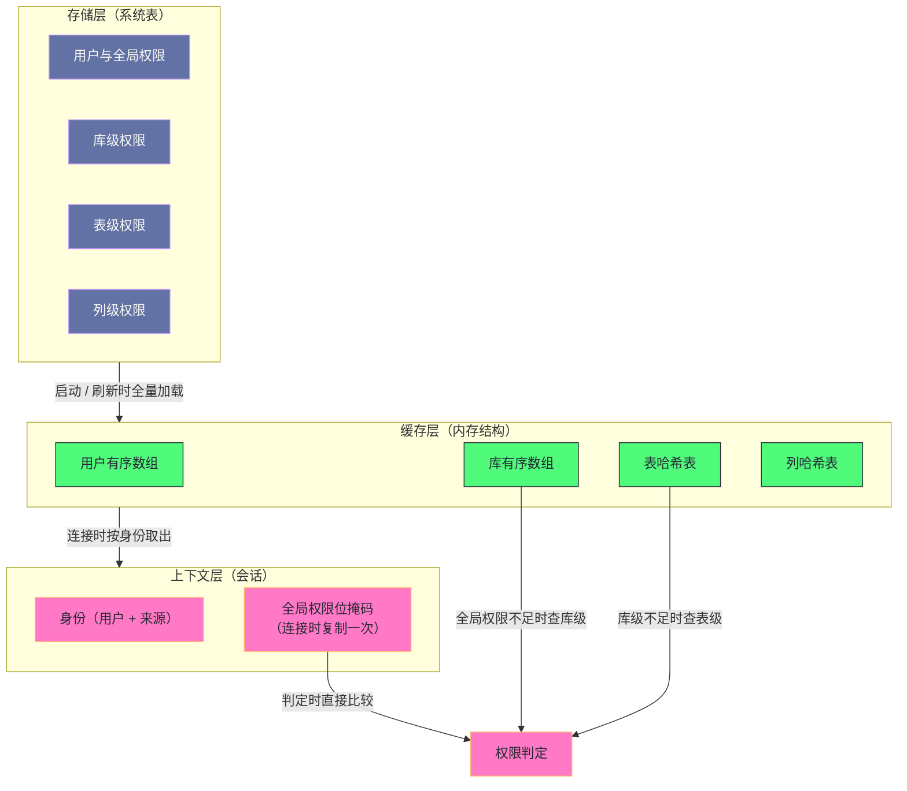

# 17. MySQL 权限系统：从 mysql.user 到 ACL 缓存的访问控制链

**摘要：**

权限系统是"安全的第一道门禁"，而它的实现要同时满足两个相互矛盾的要求：**"验证必须准确"与"验证不能成为瓶颈"。** 前者的要求是"每次操作都按最新权限判断"，后者的要求是"不要每次都去读磁盘"——**而这两者的冲突，正是这套机制全部设计取舍的来源。** 它的解法是"**分层作用域 + 全量缓存 + 会话级快照**"：**权限分四级作用域逐层收紧**，**权限表在启动时全量加载进内存**，**而"全局权限"在连接建立时被复制进会话上下文**——**最后这一条带来了它最著名的一处行为：已连接的会话不会感知权限回收。** 本文按"访问控制要解决什么 → 三层结构 → 存储层的演进 → 缓存层的组织 → 验证路径 → 匹配规则 → 变更与同步 → 生产上会踩什么坑"展开。先说明四级作用域与四条设计原则、四处代价；再讲存储层从"非事务引擎"到"事务引擎"的迁移带来的根本改善。然后剖析缓存层的两类数据结构与"为什么一个用有序数组、一个用哈希"、安全上下文的字段与"全局权限被缓存"这处设计的后果。之后是用户匹配的四级规则与它的性能代价、增量更新与"仍然存在的问题"、正确的权限回收流程。最后是刷新引发的抖动案例、认证插件兼容性、最小权限模板、演进史与遗留设计。

---

## 第 1 章 访问控制要解决什么

### 1.1 三个问题

**访问控制要回答三个问题。**

**问题一：你是谁？** **这是"身份认证"**——**它回答"这个连接声称自己是谁，以及这个声称是否可信"。**

**问题二：你能做什么？** **这是"权限判定"**——**它回答"这个身份对'某个对象'是否有'某个操作'的许可"。**

**问题三：什么时候判定？** **这是"判定时机"**——**它回答"判定是'每次操作都做'还是'连接时做一次'"。** **这个问题最容易被忽略，但它决定了整套机制的形态**（第 1.4 节）。**而"判定时机"之所以关键，是因为它同时决定了"性能"与"一致性"。**

**三个问题里，前两个是"语义问题"，第三个是"工程问题"**——**而"工程问题"的答案，恰恰是这套机制里最值得理解的部分。**

### 1.2 四级作用域

**权限按"作用范围"分成四级，而它们是"逐层收紧"的关系。**

| 作用域 | 覆盖范围 | 存储表 |
|---|---|---|
| 全局 | 所有库、所有对象 | `mysql.user` |
| 库级 | 指定库的所有对象 | `mysql.db` |
| 表级 | 指定表（可含列） | `mysql.tables_priv` |
| 列级 | 指定表的指定列 | `mysql.columns_priv` |
| 例程级 | 存储过程与函数 | `mysql.procs_priv` |

**"逐层收紧"的含义是"检查顺序从粗到细"**：**先看"全局权限是否满足"，不满足再看"库级"，再"表级"，最后"列级"。** **任何一级满足即通过。**

**这个顺序的设计意图是"让常见情况更快通过"**：**因为"拥有全局权限的账号"（例如管理员）"在第一次检查就通过"**——**因此"不必逐级查下去"。**

**这与第 5 篇讲的"准入条件的判断顺序"是同一优化思路**：**把"最可能满足的条件"排在前面**——**而这里的"最可能满足"体现为"作用域最粗的权限"。**

### 1.3 四条设计原则

这套机制遵循四条设计原则。

**原则一：双重标识。** **身份由"用户加来源"共同确定**——**因此"同一个用户名从不同来源连接，可以是不同的身份"。** **这条原则的收益是"可以按来源限制访问"，代价是"匹配规则变复杂"**（第 6 章展开）。

**原则二：逐层收紧。** **权限按作用域分层，检查从粗到细**——**因此"权限的表达"可以"按需精确"。**

**原则三：全量缓存。** **权限表在启动时"全量加载进内存"**——**因此"判定不需要读磁盘"。** **这条原则是"性能"的来源，也是"一致性"问题的来源**（第 5.4 节）。

**原则四：动态生效。** **权限变更后"缓存会被更新"**——**因此"新连接立即看到新权限"。** **而"已连接的会话是否受影响"是另一回事**（第 5.4 节）。**这处区分是理解整套机制的关键。**

**四条原则的关系是"前两条决定'权限如何表达'，后两条决定'判定如何执行'"**——**而"四者的组合"构成了这套机制的完整形态。**

### 1.4 四处代价

这套机制有四处代价。

**其一：会话不感知权限回收。** **因为"全局权限在连接时被复制进会话上下文"，所以"已连接的会话不会感知回收"**——**而这会带来"安全窗口"。**

**其二：缓存重建的开销。** **因为"缓存是全量的"，所以"重建它需要遍历全部权限记录"**——**而"在旧版本上这还会锁表"。**

**其三：匹配的线性代价。** **因为"用户与来源支持通配符"，所以"匹配需要'按优先级顺序尝试'"**——**因此"无法用哈希索引直接命中"。**

**其四：角色模型的割裂。** **角色在实现上"被存储为特殊账号"**——**因此"账号表会膨胀"。**

**四处代价的共同特征是"它们是'缓存加双重标识'的对价"**：**缓存带来"一致性窗口"，双重标识带来"匹配成本"，角色实现带来"存储膨胀"。** **因此这套机制的优化方向，始终围绕"缩小一致性窗口、降低匹配成本"。** 而这两个方向恰好对应了"会话"与"认证"两处。

**而这四处代价里，"会话不感知权限回收"这一条的影响面最大**——**因为"它不只影响运维流程，还影响'安全事件响应'"**：**在"发现某个账号被盗用、需要立即收回权限"的紧急场景下，"终止连接"这一步"不是可选项，而是必需的"。** **因此"这套机制的这处特性，把'终止连接'从一个运维动作提升为'安全响应的标准步骤'"。**

### 1.5 一个类比：门禁卡与通行证

把这套机制类比成"办公楼门禁"会更容易理解它的结构。

**"你是谁"对应"认证"**——**刷卡时确认"这张卡是真的"。**

**"你能进哪些区域"对应"权限作用域"**——**全局权限是"全楼通行"，库级是"某层通行"，表级是"某个房间通行"。**

**"卡上的权限是刷的时候实时查，还是发卡时就写死"对应"判定时机"**——**而本机制选的是"发卡时把'全楼通行权'写进卡里"**——**因此"即使后台收回了权限，这张卡在有效期内仍然能进"。**

**"后台收回权限"对应"权限回收"**——**而"收回后必须'让这张卡失效并重新发卡'"对应"必须终止连接并让客户端重连"。**

**"有些卡允许'某一层都行'（通配符）"对应"来源与库名的通配符匹配"**——**而"这类卡的校验更慢"**（因为"需要按优先级逐一尝试"）。

**这个类比的用处在于"它把四处代价变成了可感知的管理问题"**：**卡上写死的权限有有效期（会话窗口）、重新发卡要成本（缓存重建）、通配卡校验慢（匹配代价）、角色是一类特殊卡（模型割裂）。**

---

## 第 2 章 三层结构

### 2.1 存储层

**存储层是"权限的持久化表示"**——**它由若干张系统表构成**（第 1.2 节）。

**而它的关键性质是"它现在使用与业务数据相同的引擎"**——**因此"权限变更也是数据库事务"。**

**这条性质的意义很大**：**它让"权限变更"自动获得"事务性、崩溃恢复、复制可靠性"**——**而这些在旧版本上都不成立**（第 3 章展开）。

### 2.2 缓存层

**缓存层是"权限的内存表示"**——**它把"存储层的记录"转换成"便于查找的结构"。**

**它由四类结构构成**：**用户权限的有序数组、库权限的有序数组、表权限的哈希表、列权限的哈希表**（第 4 章展开）。

**"两类数据结构"这个区分值得留意**：**前两者用"有序数组"（因为"它们的键是'用户加来源'或'库加用户加来源'，可以排序"）**，**后两者用"哈希表"（因为"它们的键包含表名或列名，组合更复杂"）。**

**因此"数据结构的选择"依据是"键的形状"**——**而"能排序的用数组加二分，不能排序的用哈希"是一条通用经验。**

### 2.3 上下文层

**上下文层是"会话的权限视图"**——**它把"缓存层的相关部分"复制进"会话对象"。**

**它的核心字段是"全局权限的位掩码"**——**而"它在连接建立时被复制一次"**。

**这条"复制一次"的设计是整篇最需要理解的一处**：**它的收益是"会话内的判定不需要访问全局缓存"**（因此更快），**而它的代价是"会话内的判定不会感知后续的权限变更"**（第 5.4 节）。

**因此"上下文层"是"性能与一致性"这处取舍的落点**——**而"理解它的字段与生命周期"，就"理解了这套机制的核心权衡"。**

### 2.4 全景图示

**图中最值得注意的是"全局权限位掩码"这个节点**：**它从缓存层被复制到上下文层，而"判定时直接比较它"**——**因此"最常见的情况（有全局权限）不走缓存层"。**

**这条路径的存在解释了"为什么权限判定很快"**：**因为"有全局权限的账号"和"无全局权限但已缓存位掩码的会话"都"只需要一次位运算"。**

**而它也解释了"为什么权限回收不生效"**：**因为"判定用的位掩码是副本"，而"副本不会跟着缓存层更新"。** **因此"性能优势"与"一致性缺口"是同一个设计的两个侧面。**

---

## 第 3 章 存储层的十年演进

### 3.1 旧引擎的问题

**早期权限表使用"不支持事务的引擎"**——**而这一点带来三类问题。**

**问题一：权限变更不可回滚。** **因为"变更不是事务"**——**因此"执行中途失败会留下半改的状态"。**

**问题二：并发变更会锁表。** **因为"旧引擎使用表级锁"**——**因此"并发的权限变更会互相等待"，**而**"等待的表现是'等待表级锁'"。**

**问题三：崩溃可能损坏权限表。** **因为"没有崩溃恢复机制"**——**因此"权限表可能损坏"，**而**"损坏的后果是'无法登录或权限错乱'"。**

**三类问题的共同特征是"它们都是'缺少事务能力'的直接后果"**——**而"权限表本应是'最不该出问题'的表之一"**（因为"它出问题会导致无法登录"）。

### 3.2 迁移到事务引擎

**迁移的做法是"把权限表改用与业务数据相同的引擎"**——**而它一次性解决了三类问题。**

**解决"不可回滚"**：**因为"变更是事务"，所以"要么全做要么全不做"。**

**解决"并发锁表"**：**因为"新引擎使用行级锁"，所以"并发的权限变更不再互相阻塞"。**

**解决"崩溃损坏"**：**因为"新引擎有崩溃恢复"，所以"权限表的完整性有了保障"。**

**三处解决有一个共同的特征**：**它们都不是"为权限系统专门开发的机制"，而是"复用业务数据已有的机制"**——**这正是第 16 篇讲的"降级"手法的又一次应用。**

**因此"这次迁移"的收益是"用更少的专用代码获得更多能力"**——**而"这类收益"在架构演进中往往最划算。**

### 3.3 字段的兼容性处理

**迁移过程中有一处值得留意的细节：权限字段的"表示方式"变了，但"对外表现"保持不变。**

**具体来说**：**早期版本用"每个权限一个字段"的方式存储**，**而新版本"内部改用位掩码"**——**但"字段仍然保留"，**因此**"依赖这些字段的旧代码仍能工作"。**

**这条"内部改变、外部保留"的做法是"兼容性维护"的常规手段**——**而它的代价是"两套表示并存"，**因此**"读取时需要兼容两种格式"**（第 4.2 节展开这个读取逻辑）。

**另一处变化是"认证信息字段的替换"**：**旧的密码字段被新的认证字符串字段取代**——**而"新字段能表达'多种认证方式'"**（第 8.4 节展开它的兼容性问题）。

**两处变化的共同特征是"它们都在'扩展表达能力'"**：**位掩码能表达更多权限，新字段能表达更多认证方式。** **而"扩展"的方式是"新增表示"而不是"替换旧表示"**——**这是"兼容性优先"的必然选择。**

### 3.4 一条关于"复用"的经验

**这次迁移的经验值得收敛一下，因为它与第 16 篇讲的"降级"是同一手法的另一面。**

**"降级"是"让专用机制复用通用机制"**——**而"迁移权限表"正是"让权限数据复用业务数据的存储机制"。**

**这条手法的收益在三处**：**"获得成熟能力"**（事务、锁、恢复都经过验证）、**"减少专用代码"**（不必为权限表单独实现一套）、**"统一运维手段"**（备份、监控、容量规划都按同一套做）。

**而它的代价是"要承受通用机制的约束"**——**例如"权限表也要参与日志与恢复"，因此"它的变更也会产生日志量"。**

**因此判断"某类数据是否该迁移到通用存储"时，可以问两个问题**：**"它需要的特殊能力，通用机制是否已提供"**，**以及"它能否承受通用机制的开销"。** **两个问题都过关时，迁移通常能"用更少的代码获得更多保障"。**

**这条经验的实践含义是**：**"看到'某类元数据仍使用专用存储'时，可以问'它为什么还没迁移'"**——**而"答案通常是'兼容性'或'性能特性'"，而不是'通用机制做不到'。**

---

## 第 4 章 缓存层的结构

### 4.1 两类数据结构

**缓存层由"两个有序数组"与"若干哈希表"构成。**

**有序数组用于"用户权限"与"库权限"**——**因为"它们的键可以排序"，**因此**"可以用二分查找"。**

**哈希表用于"表权限""列权限""例程权限"**——**因为"它们的键包含'表名'或'列名'"，**因此**"组合更复杂、数量更多"。**

**"为什么两类"这个区分可以归结为一条判据**：**"键的长度与基数"**——**"用户与库"是"短且基数小的键"，适合排序加二分**；**"表与列"是"长且基数大的键"，适合哈希。**

**这条判据与第 10 篇讲的"位图与链表的选择依据"是同一类**：**"数据结构的选择"由"数据的形状"决定**——**而"形状"包括"键的长度、基数、以及访问模式"。**

### 4.2 记录的结构

**用户记录的结构可以归为五类字段。**

**第一类是"身份"**：**用户名与来源**。

**第二类是"认证信息"**：**认证插件与认证字符串**。

**第三类是"权限位掩码"**：**全局权限的紧凑表示**。

**第四类是"账户状态"**：**是否锁定、密码是否过期**。

**第五类是"资源限制与默认角色"**：**包括"最大连接数、查询数"等限制，以及"默认激活的角色"。**

**五类字段的共同特征是"它们覆盖了'账号的完整定义'"**：**身份、凭据、权限、状态、限制。** **而"库记录"的结构更简单**（只有"身份、库名、权限位掩码"三类）——**因为"它不涉及认证与账户状态"。**

**这条差异说明"缓存层的结构'按作用域分化'"**：**全局作用域的记录最复杂**（因为它"承载账号定义"），**而"越往下的作用域，记录越简单"。**

### 4.3 设计意图

**缓存层的设计有三个意图。**

**意图一：让"查找"尽量快。** **通过"有序数组加二分"与"哈希表"**——**因此"大多数查找是对数级或常数级"。**

**意图二：让"精确匹配优先"。** **通过"排序时把'精确的排在前面'"**——**因此"查找可以从'最精确的'开始尝试"**（第 6.1 节）。

**意图三：让"全量加载"可行。** **通过"紧凑的表示"**（位掩码）——**因此"即使有几千个账号，内存占用也可接受"。**

**三个意图的共同特征是"它们在'内存占用'与'查找速度'之间取了平衡"**——**而"全量加载"这个选择的前提是"权限数据量小"**（相对于业务数据）。

**这条前提值得留意**：**"全量缓存"不是"所有场景都适用"的手段**——**它适用于"数据量小、访问频繁"的场景**。** 而"权限数据"恰好符合这个特征**——**因此"全量缓存"是合理的选择。** **这与第 4 篇讲的"淘汰算法适用于'数据量大'的场景"形成了对照**：**两类场景需要两类策略。**

### 4.4 一条关于"数据结构选择"的判据

**"有序数组与哈希表"这个区分可以提炼成一条更一般的判据。**

**判据是"键是否可排序、且基数是否小"**：**可排序且基数小的键用"有序数组加二分"**（因为"二分足够快，且数组更紧凑"）；**不可排序或基数大的键用"哈希表"**（因为"哈希查找是常数级"）。

**这条判据的依据是"两类结构的成本构成不同"**：**有序数组的"内存更紧凑、遍历更快"，但"插入需要移动元素"**；**哈希表的"查找是常数级"，但"内存开销更大、遍历无序"。**

**因此"选择依据"应当包含"访问模式"**：**如果"以查找为主、极少修改"，那么有序数组更划算**；**如果"频繁插入删除"，那么哈希表更划算。**

**而"权限缓存"的访问模式恰好是"读极多、写极少"**（因为"权限变更是低频操作"）——**因此"有序数组"对"用户与库权限"是合适的。** **这条分析说明"数据结构选择"不能只看"查找复杂度"，还要看"修改频率"。**

---

## 第 5 章 验证路径

### 5.1 安全上下文

**会话的安全上下文承载"这个会话的身份与权限视图"。**

**它的字段包括**：**认证用户名、用于权限检查的用户名**（两者可能不同，例如"代理场景"）、**来源与解析后的地址、全局权限位掩码、以及密码是否过期。**

**"认证用户名与权限检查用户名可能不同"这一点值得留意**：**它支撑"代理认证"这类场景**——**也就是"一个账号代表另一个账号操作"。**

**而"全局权限位掩码"是它的核心字段**——**因为它"决定了最常见判定的结果"**（第 2.4 节）。

### 5.2 逐级检查

**判定按"从粗到细"的顺序进行。**

**第一步：比较全局权限位掩码。** **如果满足则通过**——**而这一步"只是一次位运算"。**

**第二步：查库级缓存。** **如果全局权限不足，则"在当前库的权限记录里查找"**——**而查找方式是"在有序数组里遍历匹配"。**

**第三步：查表级与列级缓存。** **如果库级也不足，则"继续往下查"。**

**三步的设计意图是"让'有粗粒度权限'的情况最快通过"**——**而"越往下，查找成本越高"**（因为"从位运算变成数组遍历再到哈希查找"）。

**因此"权限的授予方式"会影响"判定的成本"**：**"授予全局权限"的账号判定最快，"授予列权限"的账号判定最慢。** **这条关系给出一条实践含义**：**"过细的权限授予"不只有"管理成本"，还有"判定成本"。**

**而"判定成本"的量级差异值得量化一下**：**第一步是"一次位运算"，第二步是"一次数组遍历"，第三步是"一次哈希查找"。** **三者的成本差异是"常数级、线性级、常数级"**——**而"第二步的线性"是"因为'库权限记录'需要遍历匹配"**（第 6.2 节）。

**因此"优化权限判定"的一个方向是"减少'库权限记录的数量'"**——**而"减少的方式是'把常用的权限提升到全局作用域'"**（如果"业务允许"）。** 这条取舍的形态是"用'更粗的权限'换'更快的判定'"**——**而"是否可接受"取决于"安全要求"。**

### 5.3 全局权限的缓存

**"全局权限被复制进会话上下文"这处设计值得单独说明。**

**它的收益是"会话内判定不需要访问全局缓存"**——**因此"判定的第一步是'读一个字段加一次位运算'"。** **而"第一步"覆盖了"最常见的情况"**——**因此"整体判定很快"。**

**而它的代价是"副本不会跟着更新"**——**也就是说"连接建立之后，全局权限的变化不会反映到这个会话上"。**

**因此"这处设计的性质是'用一致性换性能'"**——**而"换取的一致性"是"权限回收的即时性"。**

**这与第 12 篇讲的"可重复读用空间换一致性"、第 8 篇讲的"关闭双写用风险换性能"是同一类判断**：**"性能与一致性之间没有免费的选项"**——**而"选哪边"取决于"业务对'窗口期'的容忍度"。**

### 5.4 这处设计的后果

**这处设计的后果需要说清楚，因为它关系到"安全操作的正确姿势"。**

**后果是"权限回收后，已连接的会话仍然拥有原权限"**——**而"执行'刷新权限'也不会改变这一点"**（因为"刷新的是缓存层，而'副本'在会话里）。

**因此"权限回收的正确流程"包含三步**：**先撤销权限**、**再终止该用户的所有活跃连接**、**最后通知客户端重连。**

**"终止连接"这一步是关键**——**因为"它是唯一能让'副本失效'的手段"。** **而"只做撤销而不终止连接"会留下"一个可以继续使用旧权限的窗口"。**

**这条后果的形态值得记住**：**它是"一处设计选择"的直接推论，而不是"实现缺陷"**——**而"官方把它视为'特性'"也说明了这一点。** **因此"使用任何有'会话级快照'的机制时，都应当问'快照什么时候刷新'"**——**因为"快照的生命周期决定了'变更生效的延迟'"。**

---

## 第 6 章 匹配规则

### 6.1 用户的四级匹配

**用户与来源的匹配有四级，而它们是"从精确到宽松"的顺序。**

**第一级是"用户与来源都精确匹配"。**

**第二级是"用户精确、来源为通配"。**

**第三级是"用户为空（匿名）、来源精确"。**

**第四级是"用户与来源都为通配"。**

**四级顺序的设计意图是"最精确的优先"**——**因此"如果'某个精确账号'存在，它就会覆盖'更宽松的规则'"。**

**而"用户为空"这一级的存在解释了一处常见困惑**：**"匿名账号"的匹配位置在"精确用户之前、全通配之后"**——**因此"如果存在精确账号，匿名账号不会生效"。**

### 6.2 库名的通配

**库名也支持通配符，而它的匹配规则与用户类似。**

**具体是"下划线匹配单个字符、百分号匹配任意字符"**——**而"精确匹配优先于通配匹配"。**

**这条规则的存在解释了"为什么'授权给某个模式的库'要谨慎"**：**因为"通配符可能匹配到'意外的库名'"**——**例如"用下划线做通配时，'数据库名里的下划线'会被当作通配符"。**

**因此"库名里含通配符字符时，需要转义"**——**而"忘记转义"会导致"授权范围意外扩大"。** **这类"通配符与字面值混淆"的问题在"权限配置"里尤其危险**（因为"它的后果是'权限过大'"）。

### 6.3 匹配的代价

**"四级匹配"带来一处性能代价，而它值得说明。**

**因为"匹配需要'按优先级顺序尝试'"，所以"它无法用'哈希索引'直接命中"**——**因此"每次连接都要'在有序数组里按顺序尝试几级'"。**

**因此"账号数量越多，匹配越慢"**——**而"这个成本出现在'认证阶段'"，**因此**"它影响的是'连接建立的速度'"**。

**这条代价的形态值得留意**：**它是"双重标识"这条设计原则的直接后果**——**因为"身份由两部分构成"，所以"匹配变成'两部分的多级组合'"**，**因此"无法用单键索引"。**

**这与第 6 篇讲的"自适应哈希索引需要'稳定的查询模式'"是同一类**：**"索引的有效性依赖'键的形状'"**——**而"多级组合键"天然不适合"单键索引"。**

### 6.4 一处关于"通配符"的提醒

**通配符在"身份"与"库名"上的使用，有一处安全提醒值得单独说。**

**因为"通配符让一条授权记录覆盖多个对象"，所以"它提高了'授权效率'"，但也"扩大了'授权的意外范围"。**

**具体风险有两类**：**其一，"来源通配"让"任何来源都能连接"**（例如"用全通配的来源"）；**其二，"库名通配"让"授权覆盖到意外的库"**（例如"下划线被当作通配符"）。

**两类风险的共同特征是"它们都源于'配置的宽松'"**——**而"宽松配置"的问题在于"它的后果'在使用时才显现'"**（也就是"某个不该有权限的来源连上了"）。

**这条"后果延迟显现"的性质值得强调**：**它让"宽松配置"在"日常运行中看起来没有问题"**——**因此"它不会被主动纠正"，直到"某次审计或事故"才被发现。** **而这正是"安全配置"需要"定期审计"而不是"依赖日常观察"的原因。**

**因此"最小权限原则"在"通配符"这里有一处具体体现**：**"来源应尽量精确"**（例如"限定网段"而不是"全通配"），**"库名应精确列举"**（而不是"用模式覆盖"）。

**这条提醒的价值在于"它把'最小权限'从'原则'落到了'具体配置'"**——**而"原则"只有"落到具体写法"才有执行力。**

---

## 第 7 章 权限变更与缓存同步

### 7.1 旧方案的笨拙

**旧版本的处理方式很直接：变更之后"需要手动触发'重建缓存'"。**

**而"重建"的过程是"锁表、全表扫描、清空并重建缓存、解锁"**——**因此"它的成本是'与权限记录数成正比'"，**而**"它还会'阻塞其他需要访问权限表的操作'"。**

**这条方案的问题在两处**：**其一，"它需要人工触发"**（因此"忘记触发"会导致"变更不生效"）；**其二，"它是全量的"**（因此"即使只改一个账号，也要遍历全部"）。

**"需要人工触发"这一点尤其麻烦**：**因为它"把'正确性'交给了'操作者的记忆'"**——**而"任何依赖记忆的正确性都不牢靠"。**

### 7.2 增量更新

**新版本的处理方式是"变更提交后立即更新缓存"。**

**而"更新"是"增量的"**——**也就是说"只修改被影响的那一个账号的记录"，而不是"重建全部"。**

**这条改进的收益有两处**：**其一，"变更立即生效"**（因此"不需要人工触发"）；**其二，"成本与变更的规模相关"**（而不是"与总量相关"）。

**两处收益的共同特征是"它们把'全量操作'变成了'局部操作'"**——**而"局部化"是所有"降低维护成本"的通用方向。**

**这与第 4 篇讲的"把大锁拆成小锁"、第 13 篇讲的"把并行依据变细"是同一思路**：**"缩小操作的影响范围"**——**而"影响范围"同时决定了"成本"与"阻塞面"。**

### 7.3 仍然存在的问题

**增量更新解决了"缓存重建"，但没有解决"会话副本"。**

**因此"仍然存在的问题"是"已连接的会话不感知变更"**——**而这一点在"角色"上还有一处变体**：**"已激活的角色在'角色权限被回收'后仍然有效，需要重新激活角色"。**

**这条变体的机制是"角色激活时'权限被展开进会话'"**——**因此"回收角色的权限"不会"改变已展开的部分"。**

**两处问题的共同特征是"它们都源于'会话级的快照'"**——**而"快照的粒度"决定了"哪些变更不会被感知"。** **因此"这类问题的通用解法是'让快照失效'"**（也就是"重连或重新激活"）。

### 7.4 正确的回收流程

**基于上面的分析，"权限回收的标准流程"可以明确下来。**

**第一步：撤销权限。** **这一步"改变存储与缓存"。**

**第二步：终止该身份的所有活跃连接。** **这一步"让会话副本失效"。**

**第三步：通知客户端重连。** **这一步"让客户端以新权限建立会话"。**

**三步里"第二步"最关键**——**因为它"把'一致性窗口'缩短到'终止的那一刻'"。** **而"跳过第二步"会让窗口"持续到连接自然断开"。**

**这处流程的价值在于"它说明'安全操作'需要'机制知识'的支撑"**：**因为"只做撤销"看起来"完成了操作"，**而**"实际上没有'让变更生效'"**——**因此"不知道机制的人会以为'操作已完成'"。** **这类"操作完成但效果未生效"的落差，是"安全配置"里最危险的一类问题。**

**这条流程的形态与第 14 篇讲的"撤销权限后需要终止连接"是同一条建议**——**而它的机制依据在本篇得到了解释**（第 5.4 节）。

**因此"知道机制"的价值在于"知道流程为什么必须这样"**——**而"知道为什么"才能"在流程被简化时'判断出风险'"。**

---

## 第 8 章 生产落地

### 8.1 刷新缓存引发的抖动

**这是一个"定期权限变更导致数据库抖动"的案例。**

**现象是**：**每次权限变更任务执行期间，数据库出现短暂的 CPU 飙高与连接超时。**

**根因链条是**：**权限表使用"不支持事务的引擎" → "重建缓存"需要"锁表并全表扫描" → 扫描期间"其他需要访问权限表的操作被阻塞" → 因此"连接建立与权限查询出现等待"。**

**处置方向有两条**：**其一，"减少重建的频率"**（因为"变更对新连接立即生效，而'重建'主要影响'缓存内容'，因此不必每次变更都重建）；**其二，"升级到使用事务引擎的版本"**（从根本上消除"锁表"）。

**两条处置的共同思路是"减少'全量锁表操作'的频率"**——**而"升级"是根治，"减少频率"是缓解。**

**这个案例的价值在于"它说明'权限系统'也可能是性能瓶颈"**——**而"权限系统"通常被当作"不占资源的旁路组件"。** **因此"把它纳入容量规划"是这类问题的一条预防措施。**

### 8.2 参数与它的内核依据

| 参数 | 内核依据 | 调整方向 |
|---|---|---|
| 默认认证插件 | 新账号默认使用哪种认证方式 | 与客户端能力匹配 |
| 认证策略 | 允许多种认证方式并存的规则 | 兼容性优先时可放宽 |
| 登录时激活全部角色 | 登录时是否自动激活所有已授予角色 | 简化权限使用 |
| 强制角色 | 所有账号都拥有的角色 | 用于"基础权限" |
| 密码历史长度 | 禁止重用最近多少个密码 | 按安全策略 |
| 密码重用间隔 | 多久之后可以重用旧密码 | 按安全策略 |
| 密码强度校验 | 是否启用强度校验插件 | 按安全策略 |
| 代理用户相关开关 | 是否允许代理认证 | 按需要 |

**这张表里最值得留意的是"认证策略"这一项**：**它让"多种认证方式可以并存"**——**因此"新账号用更安全的方式，而旧客户端仍能用旧方式连接"。**

**这条设计的意义在于"它把'安全升级'从'一次性切换'变成了'渐进过渡'"**——**而"渐进过渡"在"客户端升级缓慢"的环境里是必需的。** **这与第 2 篇讲的"协议兼容性"是同一类考虑**：**"生态升级慢"是"安全机制演进"的硬约束。**

### 8.3 监控要点

**权限侧可观测的信息有四类。**

**第一类是"缓存规模"**：**各类缓存的条目数**——**它回答"缓存有多大"。** **而"异常增长"通常意味着"账号或授权被大量创建"。**

**第二类是"权限表所用引擎"**：**它确认"迁移是否已完成"**——**而"未迁移"意味着"仍会有锁表风险"。**

**第三类是"具体身份的权限"**：**它回答"某个账号实际拥有什么"**——**而"实际权限"可能"大于预期"**（因为"角色与全局权限的叠加"）。

**第四类是"拒绝统计"**：**包括"认证失败次数"与"权限拒绝次数"**——**它回答"是否有大量访问被拒"。**

**四类信息的层次是"从规模到配置到实际到结果"**：**先看"缓存有多大"，再看"配置是否正确"，再看"实际权限是什么"，最后看"访问是否被拒"。** **按这个顺序看，就能从"权限相关故障"定位到"是配置问题还是使用问题"。**

### 8.4 认证插件的兼容性

**认证方式的升级带来了一类很典型的兼容性问题，而它值得单独说明。**

**问题的形态是**：**服务端升级到"使用更强哈希的认证方式"后，"旧版本的客户端驱动无法连接"**——**而错误信息指向"认证方式不被支持"。**

**根因是"认证方式的协商"**：**新方式"要求客户端也理解它"**——**而"旧驱动"不认识它，**因此**"握手失败"。**

**处置方向有三条**：**其一，"为该账号降级到旧认证方式"**（快速但降低安全性）；**其二，"升级客户端驱动"**（根治但涉及应用改造）；**其三，"配置认证策略允许多种方式并存"**（渐进过渡）。

**三条处置的取舍很清楚**：**"降级"最快但代价是安全性**——**而"它容易被当作'标准解法'"，从而"长期保留不安全的状态"。**

**因此"正确的优先级是'先评估升级驱动的成本，再考虑降级'"**——**而"降级"应当是"临时手段"，而不是"最终方案"。** **这与第 2 篇讲的"降级认证插件应当是最后手段"是同一条建议**——**而"它的机制依据"在本篇得到了补充。**

### 8.5 最小权限的落地模板

**"最小权限原则"需要"按角色类型分别设计"，而它的落地可以按五类账号展开。**

**第一类是"只读账号"**：**只授予"查询"与"查看视图"**——**而"它不应当有'创建临时表'之外的任何写权限"。**

**第二类是"读写账号"**：**授予"增删改查"**——**而"它不应当有'结构变更'权限"。**

**第三类是"管理账号"**：**只允许"从本机登录"**——**因此"它不会成为'远程攻击的目标'"。**

**第四类是"监控账号"**：**只授予"读取监控视图"与"复制状态"权限**。

**第五类是"运维工具账号"**：**授予"工具所需的权限"**——**而"它通常需要'在目标库上创建与删除对象'的能力"。**

**五类账号的共同特征是"它们的权限范围'恰好等于用途'"**——**而"这类设计需要'先明确用途'，再'反推权限'"。**

**因此"最小权限落地"的难点不在"技术"，而在"是否清楚每个账号要做什么"**——**而"不清楚用途"时，常见的做法是"给大权限"，**因此**"最小权限"往往败在"管理上的懒惰"，而不是"技术限制"。**

### 8.6 一次"权限不生效"的排查推演

把"权限变更不生效"这类问题串成一次推演。

假设现象是"已撤销某账号的权限，但该账号仍能执行原操作"。

**第一步，确认"是已连接会话还是新连接"。** **因为"新连接会读到新权限，而已连接的会话不会"**——**因此"用新连接验证一次"就能定位问题是否在会话副本上。**

**第二步，如果是"新连接也不生效"，检查"是否激活了角色"。** **因为"权限可能来自角色"，而"撤销用户权限不影响角色带来的权限"。**

**第三步，如果"角色也被撤销但仍生效"，检查"角色是否已激活且未重新激活"。** **因为"已激活的角色在'权限被回收'后仍有效"。**

**第四步，如果"以上都不是"，检查"是否有多条匹配记录"。** **因为"用户匹配有四级，而'更宽松的记录'可能提供额外权限"。**

**第五步，如果"确认是会话副本问题"，执行"终止连接并让客户端重连"。**

**五步的价值在于"它按'会话副本、角色、匹配规则'三层排查"**——**而"这三层恰好是'权限判定的三个可能来源'"。** **因此"理解判定的来源结构"，也就"得到了这类问题的排查框架"。**

---

## 第 9 章 演进史与遗留设计

### 9.1 关键节点

| 版本 | 权限系统变化 | 动因 |
|---|---|---|
| 早期 | 引入用户表，无来源区分 | 早期设计 |
| 中期 | 增加来源列，支持"用户加来源" | 网络访问普及 |
| 中期 | 密码哈希增强 | 安全性提升 |
| 5.6 | 增加"密码过期" | 密码策略 |
| 5.7 | 增加"账户锁定"、支持插件式认证 | 灵活性与安全 |
| 8.0 | 权限表迁移到事务引擎 | 事务性、并发性 |
| 8.0 | 支持角色 | 权限管理的现代化 |
| 8.0.14+ | 动态权限 | 组件化扩展 |
| 8.0.26+ | 认证策略配置 | 多认证方式协同 |

**这条演进线可以分成三条**：**"存储的迁移"**（从非事务引擎到事务引擎）、**"安全能力的增强"**（密码过期、账户锁定、强哈希认证）、**"管理模型的演进"**（角色、动态权限）。

**三条线里"管理模型的演进"最值得留意**：**因为"角色"这个抽象让"权限管理从'面向账号'变成'面向职责'"**——**而"这类抽象"是"权限系统现代化"的核心方向。**

### 9.2 四处遗留设计

**第一处：已连接会话不感知权限回收。** **它是"会话级快照"的直接后果**——**而"官方把它视为特性"，因此"短期内不会改变"。**

**第二处：缓存的初始加载仍是全量。** **因为"它需要'建立完整的查找结构'"**——**因此"账号很多时启动会变慢"。**

**第三处：通配符匹配的性能代价。** **因为"双重标识无法用单键索引"**（第 6.3 节）。

**第四处：列权限的维护成本与使用率不匹配。** **因为"它极少被使用，但'加载与重建'仍要扫描它的表"。**

**此外还有一处"角色模型的割裂"**：**角色"被存储为特殊账号"**——**因此"账号表会膨胀"，**而**"角色与账号混在一起"。**

**五处遗留设计的共同特征是"它们是'兼容性优先'或'设计选择的后果'"**：**第一处是"性能优先的选择"，第二到四处是"兼容性优先"，第五处是"实现上的简化"。** **而"它们的处置方式通常是'用别的机制绕开'"**（例如"用'终止连接'弥补第一处"）。**

### 9.3 演进方向

**方向一：角色的独立化。** **它试图"把角色从'特殊账号'变成'独立对象'"**——**因此"账号表不再膨胀"。**

**方向二：外部认证的集成。** **它试图"让外部身份系统（例如目录服务、云上的身份服务）成为一等公民"**——**因此"账号与权限可以'由外部系统统一管理'"。**

**方向三：权限的"即时生效"。** **如果"会话不依赖'权限副本'"，那么"回收会立即生效"**——**而"这需要'判定时的额外查询'或'变更时的会话通知'"。**

**三个方向的共同特征是"它们在'减少兼容性包袱'或'缩小一致性窗口'"**——**而"这两者恰好是它最受诟病的两点"。**

### 9.4 一条关于"基础设施"的经验

**最后把"这类组件为什么容易被忽视"这件事收敛一下，因为它是本篇的一个隐含主题。**

**权限系统的特点是"它稳定到被忽视"**——**因为它"很少出问题"，而"出问题的后果又往往表现为'无法登录'这种明显现象"。**

**因此它"不被关注"是有原因的**：**它"不在业务的关键路径上"**（业务只关心"能不能查到数据"），**而"它的故障形态又足够显眼"。**

**而"不被关注"的代价在两处**：**其一，"它的性能问题会被误判为别的原因"**（例如"把连接慢归因于网络"）；**其二，"它的安全隐患会被长期忽略"**（例如"权限过大但一直没出事"）。

**因此"对这类基础设施组件，应当'主动巡检'而不是'等它出问题'"**——**而"巡检项"包括"账号数量与授权范围""缓存规模""认证方式是否过时"。**

**这条经验的通用性在于"它适用于所有'稳定但关键'的组件"**——**而"判断某组件是否属于这类"，可以问"'它出问题时，业务会以什么形式感知'"。** **如果"感知形式是'整体不可用'"，那么"它就值得主动巡检"。**

---

## 第 10 章 边界与反例

### 10.1 反例一：把"权限回收"当作"立即生效"

已连接的会话不感知回收（第 5.4 节）。**因此"必须终止连接"。**

### 10.2 反例二：把"刷新权限"当作"回收生效的手段"

刷新的是"缓存层"，而"会话副本"不受影响（第 5.4 节）。

### 10.3 反例三：把"给大权限"当作"省事"

它"不只增加管理风险"，还"增加判定成本"（第 5.2 节）。

### 10.4 反例四：把"库名通配"当作"安全"

通配符可能匹配到意外的库名（第 6.2 节）。**因此"库名含通配符字符时需要转义"。**

### 10.5 反例五：把"降级认证方式"当作"标准解法"

它应当是"临时手段"（第 8.4 节）。

### 10.6 反例六：把"权限系统"当作"不占资源的旁路"

它也可能成为性能瓶颈（第 8.1 节）。

### 10.7 反例七：把"角色激活后权限被回收"当作"立即失效"

需要"重新激活角色"（第 7.3 节）。

---

## 第 11 章 落点

回到开头：**"验证必须准确"与"验证不能成为瓶颈"这对矛盾如何调和？**

**这套机制的调和方式是"三层结构加一处取舍"**：**存储层保证"权限的持久与一致"**，**缓存层保证"判定不读磁盘"**，**而上下文层"把全局权限复制进会话"**——**最后这一步"消除了最常见判定的缓存访问"，代价是"会话不感知后续变更"。**

**因此这套机制最值得记住的一条性质是"性能优势与一致性缺口是同一个设计的两个侧面"**：**因为"副本"带来了速度，所以"副本"也带来了延迟生效。** **而"理解这一点"的实践价值是"知道'回收权限'为什么必须'终止连接'"。**

**这条性质在本专栏里反复出现**：**第 8 篇的"关闭双写用风险换性能"、第 12 篇的"隔离级别用空间换一致性"、第 14 篇的"共识用可用性换一致性"。** **它们的共同特征是"任何'性能优势'都有对应的'代价'，而'代价'通常表现为'某个窗口期的存在'"。**

**因此面对这类机制时，一条通用的判断是**：**"找出它的窗口期，并确认'业务能否容忍这个窗口'"**——**而"窗口期"的位置通常由"快照或副本的生命周期"决定。** **这也是本篇与第 12 篇（多版本快照）在方法上的相通之处。**

**而"窗口期"这个概念值得再强调一次，因为它在安全场景下的后果比在性能场景下更严重**：**在"读一致性"场景下，"窗口期"意味着"读到旧数据"**（通常可接受）；**而在"权限回收"场景下，"窗口期"意味着"已撤销的权限仍可用"**（通常不可接受）。

**因此"同一个机制特征'会话级快照'，在不同场景下的可接受程度不同"**——**而"判断可接受程度"的依据是"窗口期内可能发生的最坏事情是什么"。**

**这条分析的实践价值在于"它给出了一个评估顺序"**：**先找出窗口期，再问"窗口期内最坏会发生什么"，最后决定"是否需要主动消除窗口"**——**而"消除的手段通常是'让快照失效'"**（终止连接、重新激活角色）。

**最后一条经验是关于"最小权限"的**：**它是"一条原则"，而"落地它"需要"具体的写法"**——**也就是"精确的来源、精确的库名、按用途反推的权限集合"。** **因此"最小权限"的敌人不是"技术限制"，而是"模糊的用途定义"。**

---

## 专栏导航

- 上一篇：[[16. MySQL 8.0 原子 DDL：二十年技术债的清偿还]]。
- 下一篇：[[18. MySQL 8.0 角色与动态权限：从访问控制到权限管理的现代化转型]]。
- 返回专栏首页：[[00 专栏导览]]。

---

## 参考资料

1. MySQL 8.0.33 源码：`sql/auth/sql_auth_cache.cc`、`sql/auth/sql_authorization.cc`、`sql/auth/sql_authentication.cc`、`sql/auth/sql_auth.h`、`sql/sql_class.h`。
2. MySQL. 官方文档：访问控制与账户管理. https://dev.mysql.com/doc/refman/8.0/en/access-control.html
3. MySQL. 官方文档：权限系统与权限作用域. https://dev.mysql.com/doc/refman/8.0/en/privilege-system.html
4. MySQL. 官方文档：认证插件与 caching_sha2_password. https://dev.mysql.com/doc/refman/8.0/en/authentication-plugins.html
5. MySQL. 官方文档：GRANT、REVOKE 与权限变更的生效范围. https://dev.mysql.com/doc/refman/8.0/en/grant.html
6. MySQL. 官方文档：Acl_* 状态变量与权限缓存规模观测. https://dev.mysql.com/doc/refman/8.0/en/server-status-variables.html
7. MySQL. 官方文档：密码策略与账户锁定. https://dev.mysql.com/doc/refman/8.0/en/password-management.html
8. MySQL. 官方文档：代理用户与代理认证. https://dev.mysql.com/doc/refman/8.0/en/proxy-users.html
9. MySQL. 官方文档：账户资源限制（连接数、查询数等）. https://dev.mysql.com/doc/refman/8.0/en/user-resources.html
10. MySQL. 官方文档：权限表的结构与字段说明. https://dev.mysql.com/doc/refman/8.0/en/grant-tables.html

---

> [!note] 思考题
> 1. 权限判定为什么要"从粗作用域到细作用域"检查？这个顺序的收益与代价分别是什么？
> 2. "全局权限被复制进会话上下文"这处设计，同时带来了哪两项后果？
> 3. 为什么"双重标识"会导致"无法用哈希索引直接命中"？
> 4. 权限回收为什么必须"终止连接"？如果只做撤销会留下什么？
> 5. "性能优势与一致性缺口是同一个设计的两个侧面"——请用本篇与第 12 篇的例子说明。
